cola Report for recount2:SRP056840
==================

**Date**: 2019-12-26 00:56:23 CET, **cola version**: 1.3.2

----------------------------------------------------------------

<style type='text/css'>

body, td, th {
   font-family: Arial,Helvetica,sans-serif;
   background-color: white;
   font-size: 13px;
  max-width: 800px;
  margin: auto;
  margin-left:210px;
  padding: 0px 10px 0px 10px;
  border-left: 1px solid #EEEEEE;
  line-height: 150%;
}

tt, code, pre {
   font-family: 'DejaVu Sans Mono', 'Droid Sans Mono', 'Lucida Console', Consolas, Monaco, 

monospace;
}

h1 {
   font-size:2.2em;
}

h2 {
   font-size:1.8em;
}

h3 {
   font-size:1.4em;
}

h4 {
   font-size:1.0em;
}

h5 {
   font-size:0.9em;
}

h6 {
   font-size:0.8em;
}

a {
  text-decoration: none;
  color: #0366d6;
}

a:hover {
  text-decoration: underline;
}

a:visited {
   color: #0366d6;
}

pre, img {
  max-width: 100%;
}
pre {
  overflow-x: auto;
}
pre code {
   display: block; padding: 0.5em;
}

code {
  font-size: 92%;
  border: 1px solid #ccc;
}

code[class] {
  background-color: #F8F8F8;
}

table, td, th {
  border: 1px solid #ccc;
}

blockquote {
   color:#666666;
   margin:0;
   padding-left: 1em;
   border-left: 0.5em #EEE solid;
}

hr {
   height: 0px;
   border-bottom: none;
   border-top-width: thin;
   border-top-style: dotted;
   border-top-color: #999999;
}

@media print {
   * {
      background: transparent !important;
      color: black !important;
      filter:none !important;
      -ms-filter: none !important;
   }

   body {
      font-size:12pt;
      max-width:100%;
   }

   a, a:visited {
      text-decoration: underline;
   }

   hr {
      visibility: hidden;
      page-break-before: always;
   }

   pre, blockquote {
      padding-right: 1em;
      page-break-inside: avoid;
   }

   tr, img {
      page-break-inside: avoid;
   }

   img {
      max-width: 100% !important;
   }

   @page :left {
      margin: 15mm 20mm 15mm 10mm;
   }

   @page :right {
      margin: 15mm 10mm 15mm 20mm;
   }

   p, h2, h3 {
      orphans: 3; widows: 3;
   }

   h2, h3 {
      page-break-after: avoid;
   }
}
</style>


## Summary


All available functions which can be applied to this `res_list` object:


```r
res_list
```

```
#> A 'ConsensusPartitionList' object with 24 methods.
#>   On a matrix with 13580 rows and 133 columns.
#>   Top rows are extracted by 'SD, CV, MAD, ATC' methods.
#>   Subgroups are detected by 'hclust, kmeans, skmeans, pam, mclust, NMF' method.
#>   Number of partitions are tried for k = 2, 3, 4, 5, 6.
#>   Performed in total 30000 partitions by row resampling.
#> 
#> Following methods can be applied to this 'ConsensusPartitionList' object:
#>  [1] "cola_report"           "collect_classes"       "collect_plots"         "collect_stats"        
#>  [5] "colnames"              "functional_enrichment" "get_anno_col"          "get_anno"             
#>  [9] "get_classes"           "get_matrix"            "get_membership"        "get_stats"            
#> [13] "is_best_k"             "is_stable_k"           "ncol"                  "nrow"                 
#> [17] "rownames"              "show"                  "suggest_best_k"        "test_to_known_factors"
#> [21] "top_rows_heatmap"      "top_rows_overlap"     
#> 
#> You can get result for a single method by, e.g. object["SD", "hclust"] or object["SD:hclust"]
#> or a subset of methods by object[c("SD", "CV")], c("hclust", "kmeans")]
```

The call of `run_all_consensus_partition_methods()` was:


```
#> run_all_consensus_partition_methods(data = mat, mc.cores = 4)
```

Dimension of the input matrix:


```r
mat = get_matrix(res_list)
dim(mat)
```

```
#> [1] 13580   133
```

### Density distribution

The density distribution for each sample is visualized as in one column in the
following heatmap. The clustering is based on the distance which is the
Kolmogorov-Smirnov statistic between two distributions.


```r
library(ComplexHeatmap)
densityHeatmap(mat, ylab = "value", cluster_columns = TRUE, show_column_names = FALSE,
    mc.cores = 4)
```


### Suggest the best k


Folowing table shows the best `k` (number of partitions) for each combination
of top-value methods and partition methods. Clicking on the method name in
the table goes to the section for a single combination of methods.

[The cola vignette](http://bioconductor.org/packages/devel/bioc/vignettes/cola/inst/doc/cola.html#toc_13)
explains the definition of the metrics used for determining the best
number of partitions.


```r
suggest_best_k(res_list)
```


|                            | The best k| 1-PAC| Mean silhouette| Concordance|   |Optional k |
|:---------------------------|----------:|-----:|---------------:|-----------:|:--|:----------|
|[SD:pam](#SD-pam)           |          2| 1.000|           0.973|       0.989|** |           |
|[MAD:kmeans](#MAD-kmeans)   |          2| 1.000|           0.957|       0.983|** |           |
|[MAD:pam](#MAD-pam)         |          2| 1.000|           0.970|       0.988|** |           |
|[MAD:mclust](#MAD-mclust)   |          2| 1.000|           0.955|       0.975|** |           |
|[SD:kmeans](#SD-kmeans)     |          2| 0.999|           0.964|       0.985|** |           |
|[ATC:pam](#ATC-pam)         |          6| 0.970|           0.928|       0.967|** |2,3,4,5    |
|[CV:kmeans](#CV-kmeans)     |          2| 0.969|           0.936|       0.974|** |           |
|[CV:mclust](#CV-mclust)     |          3| 0.962|           0.924|       0.972|** |2          |
|[ATC:mclust](#ATC-mclust)   |          5| 0.942|           0.914|       0.954|*  |2          |
|[SD:skmeans](#SD-skmeans)   |          3| 0.931|           0.934|       0.970|*  |2          |
|[CV:pam](#CV-pam)           |          5| 0.925|           0.904|       0.962|*  |4          |
|[ATC:skmeans](#ATC-skmeans) |          3| 0.923|           0.929|       0.966|*  |2          |
|[ATC:kmeans](#ATC-kmeans)   |          4| 0.907|           0.886|       0.940|*  |2,3        |
|[CV:skmeans](#CV-skmeans)   |          4| 0.903|           0.900|       0.944|*  |2,3        |
|[MAD:skmeans](#MAD-skmeans) |          3| 0.902|           0.927|       0.968|*  |2          |
|[CV:NMF](#CV-NMF)           |          2| 0.888|           0.923|       0.967|   |           |
|[ATC:NMF](#ATC-NMF)         |          2| 0.820|           0.897|       0.957|   |           |
|[CV:hclust](#CV-hclust)     |          2| 0.777|           0.906|       0.954|   |           |
|[SD:NMF](#SD-NMF)           |          2| 0.762|           0.913|       0.959|   |           |
|[SD:mclust](#SD-mclust)     |          5| 0.758|           0.844|       0.900|   |           |
|[MAD:NMF](#MAD-NMF)         |          2| 0.743|           0.879|       0.947|   |           |
|[ATC:hclust](#ATC-hclust)   |          2| 0.620|           0.895|       0.944|   |           |
|[SD:hclust](#SD-hclust)     |          3| 0.610|           0.757|       0.883|   |           |
|[MAD:hclust](#MAD-hclust)   |          3| 0.547|           0.757|       0.875|   |           |

\*\*: 1-PAC > 0.95, \*: 1-PAC > 0.9


### CDF of consensus matrices

Cumulative distribution function curves of consensus matrix for all methods.


```r
collect_plots(res_list, fun = plot_ecdf)
```


### Consensus heatmap

Consensus heatmaps for all methods. ([What is a consensus heatmap?](http://bioconductor.org/packages/devel/bioc/vignettes/cola/inst/doc/cola.html#toc_9))


<style type='text/css'>


.ui-helper-hidden {
	display: none;
}
.ui-helper-hidden-accessible {
	border: 0;
	clip: rect(0 0 0 0);
	height: 1px;
	margin: -1px;
	overflow: hidden;
	padding: 0;
	position: absolute;
	width: 1px;
}
.ui-helper-reset {
	margin: 0;
	padding: 0;
	border: 0;
	outline: 0;
	line-height: 1.3;
	text-decoration: none;
	font-size: 100%;
	list-style: none;
}
.ui-helper-clearfix:before,
.ui-helper-clearfix:after {
	content: "";
	display: table;
	border-collapse: collapse;
}
.ui-helper-clearfix:after {
	clear: both;
}
.ui-helper-zfix {
	width: 100%;
	height: 100%;
	top: 0;
	left: 0;
	position: absolute;
	opacity: 0;
	filter:Alpha(Opacity=0); 
}

.ui-front {
	z-index: 100;
}


.ui-state-disabled {
	cursor: default !important;
	pointer-events: none;
}


.ui-icon {
	display: inline-block;
	vertical-align: middle;
	margin-top: -.25em;
	position: relative;
	text-indent: -99999px;
	overflow: hidden;
	background-repeat: no-repeat;
}

.ui-widget-icon-block {
	left: 50%;
	margin-left: -8px;
	display: block;
}


.ui-widget-overlay {
	position: fixed;
	top: 0;
	left: 0;
	width: 100%;
	height: 100%;
}
.ui-accordion .ui-accordion-header {
	display: block;
	cursor: pointer;
	position: relative;
	margin: 2px 0 0 0;
	padding: .5em .5em .5em .7em;
	font-size: 100%;
}
.ui-accordion .ui-accordion-content {
	padding: 1em 2.2em;
	border-top: 0;
	overflow: auto;
}
.ui-autocomplete {
	position: absolute;
	top: 0;
	left: 0;
	cursor: default;
}
.ui-menu {
	list-style: none;
	padding: 0;
	margin: 0;
	display: block;
	outline: 0;
}
.ui-menu .ui-menu {
	position: absolute;
}
.ui-menu .ui-menu-item {
	margin: 0;
	cursor: pointer;
	
	list-style-image: url("data:image/gif;base64,R0lGODlhAQABAIAAAAAAAP///yH5BAEAAAAALAAAAAABAAEAAAIBRAA7");
}
.ui-menu .ui-menu-item-wrapper {
	position: relative;
	padding: 3px 1em 3px .4em;
}
.ui-menu .ui-menu-divider {
	margin: 5px 0;
	height: 0;
	font-size: 0;
	line-height: 0;
	border-width: 1px 0 0 0;
}
.ui-menu .ui-state-focus,
.ui-menu .ui-state-active {
	margin: -1px;
}


.ui-menu-icons {
	position: relative;
}
.ui-menu-icons .ui-menu-item-wrapper {
	padding-left: 2em;
}


.ui-menu .ui-icon {
	position: absolute;
	top: 0;
	bottom: 0;
	left: .2em;
	margin: auto 0;
}


.ui-menu .ui-menu-icon {
	left: auto;
	right: 0;
}
.ui-button {
	padding: .4em 1em;
	display: inline-block;
	position: relative;
	line-height: normal;
	margin-right: .1em;
	cursor: pointer;
	vertical-align: middle;
	text-align: center;
	-webkit-user-select: none;
	-moz-user-select: none;
	-ms-user-select: none;
	user-select: none;

	
	overflow: visible;
}

.ui-button,
.ui-button:link,
.ui-button:visited,
.ui-button:hover,
.ui-button:active {
	text-decoration: none;
}


.ui-button-icon-only {
	width: 2em;
	box-sizing: border-box;
	text-indent: -9999px;
	white-space: nowrap;
}


input.ui-button.ui-button-icon-only {
	text-indent: 0;
}


.ui-button-icon-only .ui-icon {
	position: absolute;
	top: 50%;
	left: 50%;
	margin-top: -8px;
	margin-left: -8px;
}

.ui-button.ui-icon-notext .ui-icon {
	padding: 0;
	width: 2.1em;
	height: 2.1em;
	text-indent: -9999px;
	white-space: nowrap;

}

input.ui-button.ui-icon-notext .ui-icon {
	width: auto;
	height: auto;
	text-indent: 0;
	white-space: normal;
	padding: .4em 1em;
}


input.ui-button::-moz-focus-inner,
button.ui-button::-moz-focus-inner {
	border: 0;
	padding: 0;
}
.ui-controlgroup {
	vertical-align: middle;
	display: inline-block;
}
.ui-controlgroup > .ui-controlgroup-item {
	float: left;
	margin-left: 0;
	margin-right: 0;
}
.ui-controlgroup > .ui-controlgroup-item:focus,
.ui-controlgroup > .ui-controlgroup-item.ui-visual-focus {
	z-index: 9999;
}
.ui-controlgroup-vertical > .ui-controlgroup-item {
	display: block;
	float: none;
	width: 100%;
	margin-top: 0;
	margin-bottom: 0;
	text-align: left;
}
.ui-controlgroup-vertical .ui-controlgroup-item {
	box-sizing: border-box;
}
.ui-controlgroup .ui-controlgroup-label {
	padding: .4em 1em;
}
.ui-controlgroup .ui-controlgroup-label span {
	font-size: 80%;
}
.ui-controlgroup-horizontal .ui-controlgroup-label + .ui-controlgroup-item {
	border-left: none;
}
.ui-controlgroup-vertical .ui-controlgroup-label + .ui-controlgroup-item {
	border-top: none;
}
.ui-controlgroup-horizontal .ui-controlgroup-label.ui-widget-content {
	border-right: none;
}
.ui-controlgroup-vertical .ui-controlgroup-label.ui-widget-content {
	border-bottom: none;
}


.ui-controlgroup-vertical .ui-spinner-input {

	
	width: 75%;
	width: calc( 100% - 2.4em );
}
.ui-controlgroup-vertical .ui-spinner .ui-spinner-up {
	border-top-style: solid;
}

.ui-checkboxradio-label .ui-icon-background {
	box-shadow: inset 1px 1px 1px #ccc;
	border-radius: .12em;
	border: none;
}
.ui-checkboxradio-radio-label .ui-icon-background {
	width: 16px;
	height: 16px;
	border-radius: 1em;
	overflow: visible;
	border: none;
}
.ui-checkboxradio-radio-label.ui-checkboxradio-checked .ui-icon,
.ui-checkboxradio-radio-label.ui-checkboxradio-checked:hover .ui-icon {
	background-image: none;
	width: 8px;
	height: 8px;
	border-width: 4px;
	border-style: solid;
}
.ui-checkboxradio-disabled {
	pointer-events: none;
}
.ui-datepicker {
	width: 17em;
	padding: .2em .2em 0;
	display: none;
}
.ui-datepicker .ui-datepicker-header {
	position: relative;
	padding: .2em 0;
}
.ui-datepicker .ui-datepicker-prev,
.ui-datepicker .ui-datepicker-next {
	position: absolute;
	top: 2px;
	width: 1.8em;
	height: 1.8em;
}
.ui-datepicker .ui-datepicker-prev-hover,
.ui-datepicker .ui-datepicker-next-hover {
	top: 1px;
}
.ui-datepicker .ui-datepicker-prev {
	left: 2px;
}
.ui-datepicker .ui-datepicker-next {
	right: 2px;
}
.ui-datepicker .ui-datepicker-prev-hover {
	left: 1px;
}
.ui-datepicker .ui-datepicker-next-hover {
	right: 1px;
}
.ui-datepicker .ui-datepicker-prev span,
.ui-datepicker .ui-datepicker-next span {
	display: block;
	position: absolute;
	left: 50%;
	margin-left: -8px;
	top: 50%;
	margin-top: -8px;
}
.ui-datepicker .ui-datepicker-title {
	margin: 0 2.3em;
	line-height: 1.8em;
	text-align: center;
}
.ui-datepicker .ui-datepicker-title select {
	font-size: 1em;
	margin: 1px 0;
}
.ui-datepicker select.ui-datepicker-month,
.ui-datepicker select.ui-datepicker-year {
	width: 45%;
}
.ui-datepicker table {
	width: 100%;
	font-size: .9em;
	border-collapse: collapse;
	margin: 0 0 .4em;
}
.ui-datepicker th {
	padding: .7em .3em;
	text-align: center;
	font-weight: bold;
	border: 0;
}
.ui-datepicker td {
	border: 0;
	padding: 1px;
}
.ui-datepicker td span,
.ui-datepicker td a {
	display: block;
	padding: .2em;
	text-align: right;
	text-decoration: none;
}
.ui-datepicker .ui-datepicker-buttonpane {
	background-image: none;
	margin: .7em 0 0 0;
	padding: 0 .2em;
	border-left: 0;
	border-right: 0;
	border-bottom: 0;
}
.ui-datepicker .ui-datepicker-buttonpane button {
	float: right;
	margin: .5em .2em .4em;
	cursor: pointer;
	padding: .2em .6em .3em .6em;
	width: auto;
	overflow: visible;
}
.ui-datepicker .ui-datepicker-buttonpane button.ui-datepicker-current {
	float: left;
}


.ui-datepicker.ui-datepicker-multi {
	width: auto;
}
.ui-datepicker-multi .ui-datepicker-group {
	float: left;
}
.ui-datepicker-multi .ui-datepicker-group table {
	width: 95%;
	margin: 0 auto .4em;
}
.ui-datepicker-multi-2 .ui-datepicker-group {
	width: 50%;
}
.ui-datepicker-multi-3 .ui-datepicker-group {
	width: 33.3%;
}
.ui-datepicker-multi-4 .ui-datepicker-group {
	width: 25%;
}
.ui-datepicker-multi .ui-datepicker-group-last .ui-datepicker-header,
.ui-datepicker-multi .ui-datepicker-group-middle .ui-datepicker-header {
	border-left-width: 0;
}
.ui-datepicker-multi .ui-datepicker-buttonpane {
	clear: left;
}
.ui-datepicker-row-break {
	clear: both;
	width: 100%;
	font-size: 0;
}


.ui-datepicker-rtl {
	direction: rtl;
}
.ui-datepicker-rtl .ui-datepicker-prev {
	right: 2px;
	left: auto;
}
.ui-datepicker-rtl .ui-datepicker-next {
	left: 2px;
	right: auto;
}
.ui-datepicker-rtl .ui-datepicker-prev:hover {
	right: 1px;
	left: auto;
}
.ui-datepicker-rtl .ui-datepicker-next:hover {
	left: 1px;
	right: auto;
}
.ui-datepicker-rtl .ui-datepicker-buttonpane {
	clear: right;
}
.ui-datepicker-rtl .ui-datepicker-buttonpane button {
	float: left;
}
.ui-datepicker-rtl .ui-datepicker-buttonpane button.ui-datepicker-current,
.ui-datepicker-rtl .ui-datepicker-group {
	float: right;
}
.ui-datepicker-rtl .ui-datepicker-group-last .ui-datepicker-header,
.ui-datepicker-rtl .ui-datepicker-group-middle .ui-datepicker-header {
	border-right-width: 0;
	border-left-width: 1px;
}


.ui-datepicker .ui-icon {
	display: block;
	text-indent: -99999px;
	overflow: hidden;
	background-repeat: no-repeat;
	left: .5em;
	top: .3em;
}
.ui-dialog {
	position: absolute;
	top: 0;
	left: 0;
	padding: .2em;
	outline: 0;
}
.ui-dialog .ui-dialog-titlebar {
	padding: .4em 1em;
	position: relative;
}
.ui-dialog .ui-dialog-title {
	float: left;
	margin: .1em 0;
	white-space: nowrap;
	width: 90%;
	overflow: hidden;
	text-overflow: ellipsis;
}
.ui-dialog .ui-dialog-titlebar-close {
	position: absolute;
	right: .3em;
	top: 50%;
	width: 20px;
	margin: -10px 0 0 0;
	padding: 1px;
	height: 20px;
}
.ui-dialog .ui-dialog-content {
	position: relative;
	border: 0;
	padding: .5em 1em;
	background: none;
	overflow: auto;
}
.ui-dialog .ui-dialog-buttonpane {
	text-align: left;
	border-width: 1px 0 0 0;
	background-image: none;
	margin-top: .5em;
	padding: .3em 1em .5em .4em;
}
.ui-dialog .ui-dialog-buttonpane .ui-dialog-buttonset {
	float: right;
}
.ui-dialog .ui-dialog-buttonpane button {
	margin: .5em .4em .5em 0;
	cursor: pointer;
}
.ui-dialog .ui-resizable-n {
	height: 2px;
	top: 0;
}
.ui-dialog .ui-resizable-e {
	width: 2px;
	right: 0;
}
.ui-dialog .ui-resizable-s {
	height: 2px;
	bottom: 0;
}
.ui-dialog .ui-resizable-w {
	width: 2px;
	left: 0;
}
.ui-dialog .ui-resizable-se,
.ui-dialog .ui-resizable-sw,
.ui-dialog .ui-resizable-ne,
.ui-dialog .ui-resizable-nw {
	width: 7px;
	height: 7px;
}
.ui-dialog .ui-resizable-se {
	right: 0;
	bottom: 0;
}
.ui-dialog .ui-resizable-sw {
	left: 0;
	bottom: 0;
}
.ui-dialog .ui-resizable-ne {
	right: 0;
	top: 0;
}
.ui-dialog .ui-resizable-nw {
	left: 0;
	top: 0;
}
.ui-draggable .ui-dialog-titlebar {
	cursor: move;
}
.ui-draggable-handle {
	-ms-touch-action: none;
	touch-action: none;
}
.ui-resizable {
	position: relative;
}
.ui-resizable-handle {
	position: absolute;
	font-size: 0.1px;
	display: block;
	-ms-touch-action: none;
	touch-action: none;
}
.ui-resizable-disabled .ui-resizable-handle,
.ui-resizable-autohide .ui-resizable-handle {
	display: none;
}
.ui-resizable-n {
	cursor: n-resize;
	height: 7px;
	width: 100%;
	top: -5px;
	left: 0;
}
.ui-resizable-s {
	cursor: s-resize;
	height: 7px;
	width: 100%;
	bottom: -5px;
	left: 0;
}
.ui-resizable-e {
	cursor: e-resize;
	width: 7px;
	right: -5px;
	top: 0;
	height: 100%;
}
.ui-resizable-w {
	cursor: w-resize;
	width: 7px;
	left: -5px;
	top: 0;
	height: 100%;
}
.ui-resizable-se {
	cursor: se-resize;
	width: 12px;
	height: 12px;
	right: 1px;
	bottom: 1px;
}
.ui-resizable-sw {
	cursor: sw-resize;
	width: 9px;
	height: 9px;
	left: -5px;
	bottom: -5px;
}
.ui-resizable-nw {
	cursor: nw-resize;
	width: 9px;
	height: 9px;
	left: -5px;
	top: -5px;
}
.ui-resizable-ne {
	cursor: ne-resize;
	width: 9px;
	height: 9px;
	right: -5px;
	top: -5px;
}
.ui-progressbar {
	height: 2em;
	text-align: left;
	overflow: hidden;
}
.ui-progressbar .ui-progressbar-value {
	margin: -1px;
	height: 100%;
}
.ui-progressbar .ui-progressbar-overlay {
	background: url("data:image/gif;base64,R0lGODlhKAAoAIABAAAAAP///yH/C05FVFNDQVBFMi4wAwEAAAAh+QQJAQABACwAAAAAKAAoAAACkYwNqXrdC52DS06a7MFZI+4FHBCKoDeWKXqymPqGqxvJrXZbMx7Ttc+w9XgU2FB3lOyQRWET2IFGiU9m1frDVpxZZc6bfHwv4c1YXP6k1Vdy292Fb6UkuvFtXpvWSzA+HycXJHUXiGYIiMg2R6W459gnWGfHNdjIqDWVqemH2ekpObkpOlppWUqZiqr6edqqWQAAIfkECQEAAQAsAAAAACgAKAAAApSMgZnGfaqcg1E2uuzDmmHUBR8Qil95hiPKqWn3aqtLsS18y7G1SzNeowWBENtQd+T1JktP05nzPTdJZlR6vUxNWWjV+vUWhWNkWFwxl9VpZRedYcflIOLafaa28XdsH/ynlcc1uPVDZxQIR0K25+cICCmoqCe5mGhZOfeYSUh5yJcJyrkZWWpaR8doJ2o4NYq62lAAACH5BAkBAAEALAAAAAAoACgAAAKVDI4Yy22ZnINRNqosw0Bv7i1gyHUkFj7oSaWlu3ovC8GxNso5fluz3qLVhBVeT/Lz7ZTHyxL5dDalQWPVOsQWtRnuwXaFTj9jVVh8pma9JjZ4zYSj5ZOyma7uuolffh+IR5aW97cHuBUXKGKXlKjn+DiHWMcYJah4N0lYCMlJOXipGRr5qdgoSTrqWSq6WFl2ypoaUAAAIfkECQEAAQAsAAAAACgAKAAAApaEb6HLgd/iO7FNWtcFWe+ufODGjRfoiJ2akShbueb0wtI50zm02pbvwfWEMWBQ1zKGlLIhskiEPm9R6vRXxV4ZzWT2yHOGpWMyorblKlNp8HmHEb/lCXjcW7bmtXP8Xt229OVWR1fod2eWqNfHuMjXCPkIGNileOiImVmCOEmoSfn3yXlJWmoHGhqp6ilYuWYpmTqKUgAAIfkECQEAAQAsAAAAACgAKAAAApiEH6kb58biQ3FNWtMFWW3eNVcojuFGfqnZqSebuS06w5V80/X02pKe8zFwP6EFWOT1lDFk8rGERh1TTNOocQ61Hm4Xm2VexUHpzjymViHrFbiELsefVrn6XKfnt2Q9G/+Xdie499XHd2g4h7ioOGhXGJboGAnXSBnoBwKYyfioubZJ2Hn0RuRZaflZOil56Zp6iioKSXpUAAAh+QQJAQABACwAAAAAKAAoAAACkoQRqRvnxuI7kU1a1UU5bd5tnSeOZXhmn5lWK3qNTWvRdQxP8qvaC+/yaYQzXO7BMvaUEmJRd3TsiMAgswmNYrSgZdYrTX6tSHGZO73ezuAw2uxuQ+BbeZfMxsexY35+/Qe4J1inV0g4x3WHuMhIl2jXOKT2Q+VU5fgoSUI52VfZyfkJGkha6jmY+aaYdirq+lQAACH5BAkBAAEALAAAAAAoACgAAAKWBIKpYe0L3YNKToqswUlvznigd4wiR4KhZrKt9Upqip61i9E3vMvxRdHlbEFiEXfk9YARYxOZZD6VQ2pUunBmtRXo1Lf8hMVVcNl8JafV38aM2/Fu5V16Bn63r6xt97j09+MXSFi4BniGFae3hzbH9+hYBzkpuUh5aZmHuanZOZgIuvbGiNeomCnaxxap2upaCZsq+1kAACH5BAkBAAEALAAAAAAoACgAAAKXjI8By5zf4kOxTVrXNVlv1X0d8IGZGKLnNpYtm8Lr9cqVeuOSvfOW79D9aDHizNhDJidFZhNydEahOaDH6nomtJjp1tutKoNWkvA6JqfRVLHU/QUfau9l2x7G54d1fl995xcIGAdXqMfBNadoYrhH+Mg2KBlpVpbluCiXmMnZ2Sh4GBqJ+ckIOqqJ6LmKSllZmsoq6wpQAAAh+QQJAQABACwAAAAAKAAoAAAClYx/oLvoxuJDkU1a1YUZbJ59nSd2ZXhWqbRa2/gF8Gu2DY3iqs7yrq+xBYEkYvFSM8aSSObE+ZgRl1BHFZNr7pRCavZ5BW2142hY3AN/zWtsmf12p9XxxFl2lpLn1rseztfXZjdIWIf2s5dItwjYKBgo9yg5pHgzJXTEeGlZuenpyPmpGQoKOWkYmSpaSnqKileI2FAAACH5BAkBAAEALAAAAAAoACgAAAKVjB+gu+jG4kORTVrVhRlsnn2dJ3ZleFaptFrb+CXmO9OozeL5VfP99HvAWhpiUdcwkpBH3825AwYdU8xTqlLGhtCosArKMpvfa1mMRae9VvWZfeB2XfPkeLmm18lUcBj+p5dnN8jXZ3YIGEhYuOUn45aoCDkp16hl5IjYJvjWKcnoGQpqyPlpOhr3aElaqrq56Bq7VAAAOw==");
	height: 100%;
	filter: alpha(opacity=25); 
	opacity: 0.25;
}
.ui-progressbar-indeterminate .ui-progressbar-value {
	background-image: none;
}
.ui-selectable {
	-ms-touch-action: none;
	touch-action: none;
}
.ui-selectable-helper {
	position: absolute;
	z-index: 100;
	border: 1px dotted black;
}
.ui-selectmenu-menu {
	padding: 0;
	margin: 0;
	position: absolute;
	top: 0;
	left: 0;
	display: none;
}
.ui-selectmenu-menu .ui-menu {
	overflow: auto;
	overflow-x: hidden;
	padding-bottom: 1px;
}
.ui-selectmenu-menu .ui-menu .ui-selectmenu-optgroup {
	font-size: 1em;
	font-weight: bold;
	line-height: 1.5;
	padding: 2px 0.4em;
	margin: 0.5em 0 0 0;
	height: auto;
	border: 0;
}
.ui-selectmenu-open {
	display: block;
}
.ui-selectmenu-text {
	display: block;
	margin-right: 20px;
	overflow: hidden;
	text-overflow: ellipsis;
}
.ui-selectmenu-button.ui-button {
	text-align: left;
	white-space: nowrap;
	width: 14em;
}
.ui-selectmenu-icon.ui-icon {
	float: right;
	margin-top: 0;
}
.ui-slider {
	position: relative;
	text-align: left;
}
.ui-slider .ui-slider-handle {
	position: absolute;
	z-index: 2;
	width: 1.2em;
	height: 1.2em;
	cursor: default;
	-ms-touch-action: none;
	touch-action: none;
}
.ui-slider .ui-slider-range {
	position: absolute;
	z-index: 1;
	font-size: .7em;
	display: block;
	border: 0;
	background-position: 0 0;
}


.ui-slider.ui-state-disabled .ui-slider-handle,
.ui-slider.ui-state-disabled .ui-slider-range {
	filter: inherit;
}

.ui-slider-horizontal {
	height: .8em;
}
.ui-slider-horizontal .ui-slider-handle {
	top: -.3em;
	margin-left: -.6em;
}
.ui-slider-horizontal .ui-slider-range {
	top: 0;
	height: 100%;
}
.ui-slider-horizontal .ui-slider-range-min {
	left: 0;
}
.ui-slider-horizontal .ui-slider-range-max {
	right: 0;
}

.ui-slider-vertical {
	width: .8em;
	height: 100px;
}
.ui-slider-vertical .ui-slider-handle {
	left: -.3em;
	margin-left: 0;
	margin-bottom: -.6em;
}
.ui-slider-vertical .ui-slider-range {
	left: 0;
	width: 100%;
}
.ui-slider-vertical .ui-slider-range-min {
	bottom: 0;
}
.ui-slider-vertical .ui-slider-range-max {
	top: 0;
}
.ui-sortable-handle {
	-ms-touch-action: none;
	touch-action: none;
}
.ui-spinner {
	position: relative;
	display: inline-block;
	overflow: hidden;
	padding: 0;
	vertical-align: middle;
}
.ui-spinner-input {
	border: none;
	background: none;
	color: inherit;
	padding: .222em 0;
	margin: .2em 0;
	vertical-align: middle;
	margin-left: .4em;
	margin-right: 2em;
}
.ui-spinner-button {
	width: 1.6em;
	height: 50%;
	font-size: .5em;
	padding: 0;
	margin: 0;
	text-align: center;
	position: absolute;
	cursor: default;
	display: block;
	overflow: hidden;
	right: 0;
}

.ui-spinner a.ui-spinner-button {
	border-top-style: none;
	border-bottom-style: none;
	border-right-style: none;
}
.ui-spinner-up {
	top: 0;
}
.ui-spinner-down {
	bottom: 0;
}
.ui-tabs {
	position: relative;
	padding: .2em;
}
.ui-tabs .ui-tabs-nav {
	margin: 0;
	padding: .2em .2em 0;
}
.ui-tabs .ui-tabs-nav li {
	list-style: none;
	float: left;
	position: relative;
	top: 0;
	margin: 1px .2em 0 0;
	border-bottom-width: 0;
	padding: 0;
	white-space: nowrap;
}
.ui-tabs .ui-tabs-nav .ui-tabs-anchor {
	float: left;
	padding: .5em 1em;
	text-decoration: none;
}
.ui-tabs .ui-tabs-nav li.ui-tabs-active {
	margin-bottom: -1px;
	padding-bottom: 1px;
}
.ui-tabs .ui-tabs-nav li.ui-tabs-active .ui-tabs-anchor,
.ui-tabs .ui-tabs-nav li.ui-state-disabled .ui-tabs-anchor,
.ui-tabs .ui-tabs-nav li.ui-tabs-loading .ui-tabs-anchor {
	cursor: text;
}
.ui-tabs-collapsible .ui-tabs-nav li.ui-tabs-active .ui-tabs-anchor {
	cursor: pointer;
}
.ui-tabs .ui-tabs-panel {
	display: block;
	border-width: 0;
	padding: 1em 1.4em;
	background: none;
}
.ui-tooltip {
	padding: 8px;
	position: absolute;
	z-index: 9999;
	max-width: 300px;
}
body .ui-tooltip {
	border-width: 2px;
}

.ui-widget {
	font-family: Arial,Helvetica,sans-serif;
	font-size: 1em;
}
.ui-widget .ui-widget {
	font-size: 1em;
}
.ui-widget input,
.ui-widget select,
.ui-widget textarea,
.ui-widget button {
	font-family: Arial,Helvetica,sans-serif;
	font-size: 1em;
}
.ui-widget.ui-widget-content {
	border: 1px solid #c5c5c5;
}
.ui-widget-content {
	border: 1px solid #dddddd;
	background: #ffffff;
	color: #333333;
}
.ui-widget-content a {
	color: #333333;
}
.ui-widget-header {
	border: 1px solid #dddddd;
	background: #e9e9e9;
	color: #333333;
	font-weight: bold;
}
.ui-widget-header a {
	color: #333333;
}


.ui-state-default,
.ui-widget-content .ui-state-default,
.ui-widget-header .ui-state-default,
.ui-button,


html .ui-button.ui-state-disabled:hover,
html .ui-button.ui-state-disabled:active {
	border: 1px solid #c5c5c5;
	background: #f6f6f6;
	font-weight: normal;
	color: #454545;
}
.ui-state-default a,
.ui-state-default a:link,
.ui-state-default a:visited,
a.ui-button,
a:link.ui-button,
a:visited.ui-button,
.ui-button {
	color: #454545;
	text-decoration: none;
}
.ui-state-hover,
.ui-widget-content .ui-state-hover,
.ui-widget-header .ui-state-hover,
.ui-state-focus,
.ui-widget-content .ui-state-focus,
.ui-widget-header .ui-state-focus,
.ui-button:hover,
.ui-button:focus {
	border: 1px solid #cccccc;
	background: #ededed;
	font-weight: normal;
	color: #2b2b2b;
}
.ui-state-hover a,
.ui-state-hover a:hover,
.ui-state-hover a:link,
.ui-state-hover a:visited,
.ui-state-focus a,
.ui-state-focus a:hover,
.ui-state-focus a:link,
.ui-state-focus a:visited,
a.ui-button:hover,
a.ui-button:focus {
	color: #2b2b2b;
	text-decoration: none;
}

.ui-visual-focus {
	box-shadow: 0 0 3px 1px rgb(94, 158, 214);
}
.ui-state-active,
.ui-widget-content .ui-state-active,
.ui-widget-header .ui-state-active,
a.ui-button:active,
.ui-button:active,
.ui-button.ui-state-active:hover {
	border: 1px solid #003eff;
	background: #007fff;
	font-weight: normal;
	color: #ffffff;
}
.ui-icon-background,
.ui-state-active .ui-icon-background {
	border: #003eff;
	background-color: #ffffff;
}
.ui-state-active a,
.ui-state-active a:link,
.ui-state-active a:visited {
	color: #ffffff;
	text-decoration: none;
}


.ui-state-highlight,
.ui-widget-content .ui-state-highlight,
.ui-widget-header .ui-state-highlight {
	border: 1px solid #dad55e;
	background: #fffa90;
	color: #777620;
}
.ui-state-checked {
	border: 1px solid #dad55e;
	background: #fffa90;
}
.ui-state-highlight a,
.ui-widget-content .ui-state-highlight a,
.ui-widget-header .ui-state-highlight a {
	color: #777620;
}
.ui-state-error,
.ui-widget-content .ui-state-error,
.ui-widget-header .ui-state-error {
	border: 1px solid #f1a899;
	background: #fddfdf;
	color: #5f3f3f;
}
.ui-state-error a,
.ui-widget-content .ui-state-error a,
.ui-widget-header .ui-state-error a {
	color: #5f3f3f;
}
.ui-state-error-text,
.ui-widget-content .ui-state-error-text,
.ui-widget-header .ui-state-error-text {
	color: #5f3f3f;
}
.ui-priority-primary,
.ui-widget-content .ui-priority-primary,
.ui-widget-header .ui-priority-primary {
	font-weight: bold;
}
.ui-priority-secondary,
.ui-widget-content .ui-priority-secondary,
.ui-widget-header .ui-priority-secondary {
	opacity: .7;
	filter:Alpha(Opacity=70); 
	font-weight: normal;
}
.ui-state-disabled,
.ui-widget-content .ui-state-disabled,
.ui-widget-header .ui-state-disabled {
	opacity: .35;
	filter:Alpha(Opacity=35); 
	background-image: none;
}
.ui-state-disabled .ui-icon {
	filter:Alpha(Opacity=35); 
}


.ui-icon {
	width: 16px;
	height: 16px;
}
.ui-icon,
.ui-widget-content .ui-icon {
	background-image: url("images/ui-icons_444444_256x240.png");
}
.ui-widget-header .ui-icon {
	background-image: url("images/ui-icons_444444_256x240.png");
}
.ui-state-hover .ui-icon,
.ui-state-focus .ui-icon,
.ui-button:hover .ui-icon,
.ui-button:focus .ui-icon {
	background-image: url("images/ui-icons_555555_256x240.png");
}
.ui-state-active .ui-icon,
.ui-button:active .ui-icon {
	background-image: url("images/ui-icons_ffffff_256x240.png");
}
.ui-state-highlight .ui-icon,
.ui-button .ui-state-highlight.ui-icon {
	background-image: url("images/ui-icons_777620_256x240.png");
}
.ui-state-error .ui-icon,
.ui-state-error-text .ui-icon {
	background-image: url("images/ui-icons_cc0000_256x240.png");
}
.ui-button .ui-icon {
	background-image: url("images/ui-icons_777777_256x240.png");
}


.ui-icon-blank { background-position: 16px 16px; }
.ui-icon-caret-1-n { background-position: 0 0; }
.ui-icon-caret-1-ne { background-position: -16px 0; }
.ui-icon-caret-1-e { background-position: -32px 0; }
.ui-icon-caret-1-se { background-position: -48px 0; }
.ui-icon-caret-1-s { background-position: -65px 0; }
.ui-icon-caret-1-sw { background-position: -80px 0; }
.ui-icon-caret-1-w { background-position: -96px 0; }
.ui-icon-caret-1-nw { background-position: -112px 0; }
.ui-icon-caret-2-n-s { background-position: -128px 0; }
.ui-icon-caret-2-e-w { background-position: -144px 0; }
.ui-icon-triangle-1-n { background-position: 0 -16px; }
.ui-icon-triangle-1-ne { background-position: -16px -16px; }
.ui-icon-triangle-1-e { background-position: -32px -16px; }
.ui-icon-triangle-1-se { background-position: -48px -16px; }
.ui-icon-triangle-1-s { background-position: -65px -16px; }
.ui-icon-triangle-1-sw { background-position: -80px -16px; }
.ui-icon-triangle-1-w { background-position: -96px -16px; }
.ui-icon-triangle-1-nw { background-position: -112px -16px; }
.ui-icon-triangle-2-n-s { background-position: -128px -16px; }
.ui-icon-triangle-2-e-w { background-position: -144px -16px; }
.ui-icon-arrow-1-n { background-position: 0 -32px; }
.ui-icon-arrow-1-ne { background-position: -16px -32px; }
.ui-icon-arrow-1-e { background-position: -32px -32px; }
.ui-icon-arrow-1-se { background-position: -48px -32px; }
.ui-icon-arrow-1-s { background-position: -65px -32px; }
.ui-icon-arrow-1-sw { background-position: -80px -32px; }
.ui-icon-arrow-1-w { background-position: -96px -32px; }
.ui-icon-arrow-1-nw { background-position: -112px -32px; }
.ui-icon-arrow-2-n-s { background-position: -128px -32px; }
.ui-icon-arrow-2-ne-sw { background-position: -144px -32px; }
.ui-icon-arrow-2-e-w { background-position: -160px -32px; }
.ui-icon-arrow-2-se-nw { background-position: -176px -32px; }
.ui-icon-arrowstop-1-n { background-position: -192px -32px; }
.ui-icon-arrowstop-1-e { background-position: -208px -32px; }
.ui-icon-arrowstop-1-s { background-position: -224px -32px; }
.ui-icon-arrowstop-1-w { background-position: -240px -32px; }
.ui-icon-arrowthick-1-n { background-position: 1px -48px; }
.ui-icon-arrowthick-1-ne { background-position: -16px -48px; }
.ui-icon-arrowthick-1-e { background-position: -32px -48px; }
.ui-icon-arrowthick-1-se { background-position: -48px -48px; }
.ui-icon-arrowthick-1-s { background-position: -64px -48px; }
.ui-icon-arrowthick-1-sw { background-position: -80px -48px; }
.ui-icon-arrowthick-1-w { background-position: -96px -48px; }
.ui-icon-arrowthick-1-nw { background-position: -112px -48px; }
.ui-icon-arrowthick-2-n-s { background-position: -128px -48px; }
.ui-icon-arrowthick-2-ne-sw { background-position: -144px -48px; }
.ui-icon-arrowthick-2-e-w { background-position: -160px -48px; }
.ui-icon-arrowthick-2-se-nw { background-position: -176px -48px; }
.ui-icon-arrowthickstop-1-n { background-position: -192px -48px; }
.ui-icon-arrowthickstop-1-e { background-position: -208px -48px; }
.ui-icon-arrowthickstop-1-s { background-position: -224px -48px; }
.ui-icon-arrowthickstop-1-w { background-position: -240px -48px; }
.ui-icon-arrowreturnthick-1-w { background-position: 0 -64px; }
.ui-icon-arrowreturnthick-1-n { background-position: -16px -64px; }
.ui-icon-arrowreturnthick-1-e { background-position: -32px -64px; }
.ui-icon-arrowreturnthick-1-s { background-position: -48px -64px; }
.ui-icon-arrowreturn-1-w { background-position: -64px -64px; }
.ui-icon-arrowreturn-1-n { background-position: -80px -64px; }
.ui-icon-arrowreturn-1-e { background-position: -96px -64px; }
.ui-icon-arrowreturn-1-s { background-position: -112px -64px; }
.ui-icon-arrowrefresh-1-w { background-position: -128px -64px; }
.ui-icon-arrowrefresh-1-n { background-position: -144px -64px; }
.ui-icon-arrowrefresh-1-e { background-position: -160px -64px; }
.ui-icon-arrowrefresh-1-s { background-position: -176px -64px; }
.ui-icon-arrow-4 { background-position: 0 -80px; }
.ui-icon-arrow-4-diag { background-position: -16px -80px; }
.ui-icon-extlink { background-position: -32px -80px; }
.ui-icon-newwin { background-position: -48px -80px; }
.ui-icon-refresh { background-position: -64px -80px; }
.ui-icon-shuffle { background-position: -80px -80px; }
.ui-icon-transfer-e-w { background-position: -96px -80px; }
.ui-icon-transferthick-e-w { background-position: -112px -80px; }
.ui-icon-folder-collapsed { background-position: 0 -96px; }
.ui-icon-folder-open { background-position: -16px -96px; }
.ui-icon-document { background-position: -32px -96px; }
.ui-icon-document-b { background-position: -48px -96px; }
.ui-icon-note { background-position: -64px -96px; }
.ui-icon-mail-closed { background-position: -80px -96px; }
.ui-icon-mail-open { background-position: -96px -96px; }
.ui-icon-suitcase { background-position: -112px -96px; }
.ui-icon-comment { background-position: -128px -96px; }
.ui-icon-person { background-position: -144px -96px; }
.ui-icon-print { background-position: -160px -96px; }
.ui-icon-trash { background-position: -176px -96px; }
.ui-icon-locked { background-position: -192px -96px; }
.ui-icon-unlocked { background-position: -208px -96px; }
.ui-icon-bookmark { background-position: -224px -96px; }
.ui-icon-tag { background-position: -240px -96px; }
.ui-icon-home { background-position: 0 -112px; }
.ui-icon-flag { background-position: -16px -112px; }
.ui-icon-calendar { background-position: -32px -112px; }
.ui-icon-cart { background-position: -48px -112px; }
.ui-icon-pencil { background-position: -64px -112px; }
.ui-icon-clock { background-position: -80px -112px; }
.ui-icon-disk { background-position: -96px -112px; }
.ui-icon-calculator { background-position: -112px -112px; }
.ui-icon-zoomin { background-position: -128px -112px; }
.ui-icon-zoomout { background-position: -144px -112px; }
.ui-icon-search { background-position: -160px -112px; }
.ui-icon-wrench { background-position: -176px -112px; }
.ui-icon-gear { background-position: -192px -112px; }
.ui-icon-heart { background-position: -208px -112px; }
.ui-icon-star { background-position: -224px -112px; }
.ui-icon-link { background-position: -240px -112px; }
.ui-icon-cancel { background-position: 0 -128px; }
.ui-icon-plus { background-position: -16px -128px; }
.ui-icon-plusthick { background-position: -32px -128px; }
.ui-icon-minus { background-position: -48px -128px; }
.ui-icon-minusthick { background-position: -64px -128px; }
.ui-icon-close { background-position: -80px -128px; }
.ui-icon-closethick { background-position: -96px -128px; }
.ui-icon-key { background-position: -112px -128px; }
.ui-icon-lightbulb { background-position: -128px -128px; }
.ui-icon-scissors { background-position: -144px -128px; }
.ui-icon-clipboard { background-position: -160px -128px; }
.ui-icon-copy { background-position: -176px -128px; }
.ui-icon-contact { background-position: -192px -128px; }
.ui-icon-image { background-position: -208px -128px; }
.ui-icon-video { background-position: -224px -128px; }
.ui-icon-script { background-position: -240px -128px; }
.ui-icon-alert { background-position: 0 -144px; }
.ui-icon-info { background-position: -16px -144px; }
.ui-icon-notice { background-position: -32px -144px; }
.ui-icon-help { background-position: -48px -144px; }
.ui-icon-check { background-position: -64px -144px; }
.ui-icon-bullet { background-position: -80px -144px; }
.ui-icon-radio-on { background-position: -96px -144px; }
.ui-icon-radio-off { background-position: -112px -144px; }
.ui-icon-pin-w { background-position: -128px -144px; }
.ui-icon-pin-s { background-position: -144px -144px; }
.ui-icon-play { background-position: 0 -160px; }
.ui-icon-pause { background-position: -16px -160px; }
.ui-icon-seek-next { background-position: -32px -160px; }
.ui-icon-seek-prev { background-position: -48px -160px; }
.ui-icon-seek-end { background-position: -64px -160px; }
.ui-icon-seek-start { background-position: -80px -160px; }

.ui-icon-seek-first { background-position: -80px -160px; }
.ui-icon-stop { background-position: -96px -160px; }
.ui-icon-eject { background-position: -112px -160px; }
.ui-icon-volume-off { background-position: -128px -160px; }
.ui-icon-volume-on { background-position: -144px -160px; }
.ui-icon-power { background-position: 0 -176px; }
.ui-icon-signal-diag { background-position: -16px -176px; }
.ui-icon-signal { background-position: -32px -176px; }
.ui-icon-battery-0 { background-position: -48px -176px; }
.ui-icon-battery-1 { background-position: -64px -176px; }
.ui-icon-battery-2 { background-position: -80px -176px; }
.ui-icon-battery-3 { background-position: -96px -176px; }
.ui-icon-circle-plus { background-position: 0 -192px; }
.ui-icon-circle-minus { background-position: -16px -192px; }
.ui-icon-circle-close { background-position: -32px -192px; }
.ui-icon-circle-triangle-e { background-position: -48px -192px; }
.ui-icon-circle-triangle-s { background-position: -64px -192px; }
.ui-icon-circle-triangle-w { background-position: -80px -192px; }
.ui-icon-circle-triangle-n { background-position: -96px -192px; }
.ui-icon-circle-arrow-e { background-position: -112px -192px; }
.ui-icon-circle-arrow-s { background-position: -128px -192px; }
.ui-icon-circle-arrow-w { background-position: -144px -192px; }
.ui-icon-circle-arrow-n { background-position: -160px -192px; }
.ui-icon-circle-zoomin { background-position: -176px -192px; }
.ui-icon-circle-zoomout { background-position: -192px -192px; }
.ui-icon-circle-check { background-position: -208px -192px; }
.ui-icon-circlesmall-plus { background-position: 0 -208px; }
.ui-icon-circlesmall-minus { background-position: -16px -208px; }
.ui-icon-circlesmall-close { background-position: -32px -208px; }
.ui-icon-squaresmall-plus { background-position: -48px -208px; }
.ui-icon-squaresmall-minus { background-position: -64px -208px; }
.ui-icon-squaresmall-close { background-position: -80px -208px; }
.ui-icon-grip-dotted-vertical { background-position: 0 -224px; }
.ui-icon-grip-dotted-horizontal { background-position: -16px -224px; }
.ui-icon-grip-solid-vertical { background-position: -32px -224px; }
.ui-icon-grip-solid-horizontal { background-position: -48px -224px; }
.ui-icon-gripsmall-diagonal-se { background-position: -64px -224px; }
.ui-icon-grip-diagonal-se { background-position: -80px -224px; }


.ui-corner-all,
.ui-corner-top,
.ui-corner-left,
.ui-corner-tl {
	border-top-left-radius: 3px;
}
.ui-corner-all,
.ui-corner-top,
.ui-corner-right,
.ui-corner-tr {
	border-top-right-radius: 3px;
}
.ui-corner-all,
.ui-corner-bottom,
.ui-corner-left,
.ui-corner-bl {
	border-bottom-left-radius: 3px;
}
.ui-corner-all,
.ui-corner-bottom,
.ui-corner-right,
.ui-corner-br {
	border-bottom-right-radius: 3px;
}


.ui-widget-overlay {
	background: #aaaaaa;
	opacity: .3;
	filter: Alpha(Opacity=30); 
}
.ui-widget-shadow {
	-webkit-box-shadow: 0px 0px 5px #666666;
	box-shadow: 0px 0px 5px #666666;
} 
</style>
<script src='js/jquery-1.12.4.js'></script>
<script src='js/jquery-ui.js'></script>

<script>
$( function() {
	$( '#tabs-collect-consensus-heatmap' ).tabs();
} );
</script>
<div id='tabs-collect-consensus-heatmap'>
<ul>
<li><a href='#tab-collect-consensus-heatmap-1'>k = 2</a></li>
<li><a href='#tab-collect-consensus-heatmap-2'>k = 3</a></li>
<li><a href='#tab-collect-consensus-heatmap-3'>k = 4</a></li>
<li><a href='#tab-collect-consensus-heatmap-4'>k = 5</a></li>
<li><a href='#tab-collect-consensus-heatmap-5'>k = 6</a></li>
</ul>
<div id='tab-collect-consensus-heatmap-1'>
<pre><code class="r">collect_plots(res_list, k = 2, fun = consensus_heatmap, mc.cores = 4)
</code></pre>

<p></p>

</div>
<div id='tab-collect-consensus-heatmap-2'>
<pre><code class="r">collect_plots(res_list, k = 3, fun = consensus_heatmap, mc.cores = 4)
</code></pre>

<p></p>

</div>
<div id='tab-collect-consensus-heatmap-3'>
<pre><code class="r">collect_plots(res_list, k = 4, fun = consensus_heatmap, mc.cores = 4)
</code></pre>

<p></p>

</div>
<div id='tab-collect-consensus-heatmap-4'>
<pre><code class="r">collect_plots(res_list, k = 5, fun = consensus_heatmap, mc.cores = 4)
</code></pre>

<p></p>

</div>
<div id='tab-collect-consensus-heatmap-5'>
<pre><code class="r">collect_plots(res_list, k = 6, fun = consensus_heatmap, mc.cores = 4)
</code></pre>

<p></p>

</div>
</div>


### Membership heatmap

Membership heatmaps for all methods. ([What is a membership heatmap?](http://bioconductor.org/packages/devel/bioc/vignettes/cola/inst/doc/cola.html#toc_12))


<script>
$( function() {
	$( '#tabs-collect-membership-heatmap' ).tabs();
} );
</script>
<div id='tabs-collect-membership-heatmap'>
<ul>
<li><a href='#tab-collect-membership-heatmap-1'>k = 2</a></li>
<li><a href='#tab-collect-membership-heatmap-2'>k = 3</a></li>
<li><a href='#tab-collect-membership-heatmap-3'>k = 4</a></li>
<li><a href='#tab-collect-membership-heatmap-4'>k = 5</a></li>
<li><a href='#tab-collect-membership-heatmap-5'>k = 6</a></li>
</ul>
<div id='tab-collect-membership-heatmap-1'>
<pre><code class="r">collect_plots(res_list, k = 2, fun = membership_heatmap, mc.cores = 4)
</code></pre>

<p></p>

</div>
<div id='tab-collect-membership-heatmap-2'>
<pre><code class="r">collect_plots(res_list, k = 3, fun = membership_heatmap, mc.cores = 4)
</code></pre>

<p></p>

</div>
<div id='tab-collect-membership-heatmap-3'>
<pre><code class="r">collect_plots(res_list, k = 4, fun = membership_heatmap, mc.cores = 4)
</code></pre>

<p></p>

</div>
<div id='tab-collect-membership-heatmap-4'>
<pre><code class="r">collect_plots(res_list, k = 5, fun = membership_heatmap, mc.cores = 4)
</code></pre>

<p></p>

</div>
<div id='tab-collect-membership-heatmap-5'>
<pre><code class="r">collect_plots(res_list, k = 6, fun = membership_heatmap, mc.cores = 4)
</code></pre>

<p></p>

</div>
</div>


### Signature heatmap

Signature heatmaps for all methods. ([What is a signature heatmap?](http://bioconductor.org/packages/devel/bioc/vignettes/cola/inst/doc/cola.html#toc_22))


Note in following heatmaps, rows are scaled.


<script>
$( function() {
	$( '#tabs-collect-get-signatures' ).tabs();
} );
</script>
<div id='tabs-collect-get-signatures'>
<ul>
<li><a href='#tab-collect-get-signatures-1'>k = 2</a></li>
<li><a href='#tab-collect-get-signatures-2'>k = 3</a></li>
<li><a href='#tab-collect-get-signatures-3'>k = 4</a></li>
<li><a href='#tab-collect-get-signatures-4'>k = 5</a></li>
<li><a href='#tab-collect-get-signatures-5'>k = 6</a></li>
</ul>
<div id='tab-collect-get-signatures-1'>
<pre><code class="r">collect_plots(res_list, k = 2, fun = get_signatures, mc.cores = 4)
</code></pre>

<p></p>

</div>
<div id='tab-collect-get-signatures-2'>
<pre><code class="r">collect_plots(res_list, k = 3, fun = get_signatures, mc.cores = 4)
</code></pre>

<p></p>

</div>
<div id='tab-collect-get-signatures-3'>
<pre><code class="r">collect_plots(res_list, k = 4, fun = get_signatures, mc.cores = 4)
</code></pre>

<p></p>

</div>
<div id='tab-collect-get-signatures-4'>
<pre><code class="r">collect_plots(res_list, k = 5, fun = get_signatures, mc.cores = 4)
</code></pre>

<p></p>

</div>
<div id='tab-collect-get-signatures-5'>
<pre><code class="r">collect_plots(res_list, k = 6, fun = get_signatures, mc.cores = 4)
</code></pre>

<p></p>

</div>
</div>


### Statistics table

The statistics used for measuring the stability of consensus partitioning.
([How are they
defined?](http://bioconductor.org/packages/devel/bioc/vignettes/cola/inst/doc/cola.html#toc_13))


<script>
$( function() {
	$( '#tabs-get-stats-from-consensus-partition-list' ).tabs();
} );
</script>
<div id='tabs-get-stats-from-consensus-partition-list'>
<ul>
<li><a href='#tab-get-stats-from-consensus-partition-list-1'>k = 2</a></li>
<li><a href='#tab-get-stats-from-consensus-partition-list-2'>k = 3</a></li>
<li><a href='#tab-get-stats-from-consensus-partition-list-3'>k = 4</a></li>
<li><a href='#tab-get-stats-from-consensus-partition-list-4'>k = 5</a></li>
<li><a href='#tab-get-stats-from-consensus-partition-list-5'>k = 6</a></li>
</ul>
<div id='tab-get-stats-from-consensus-partition-list-1'>
<pre><code class="r">get_stats(res_list, k = 2)
</code></pre>

<pre><code>#&gt;             k 1-PAC mean_silhouette concordance area_increased  Rand Jaccard
#&gt; SD:NMF      2 0.762           0.913       0.959          0.488 0.514   0.514
#&gt; CV:NMF      2 0.888           0.923       0.967          0.493 0.511   0.511
#&gt; MAD:NMF     2 0.743           0.879       0.947          0.492 0.506   0.506
#&gt; ATC:NMF     2 0.820           0.897       0.957          0.482 0.520   0.520
#&gt; SD:skmeans  2 0.984           0.960       0.983          0.495 0.506   0.506
#&gt; CV:skmeans  2 0.968           0.948       0.979          0.497 0.504   0.504
#&gt; MAD:skmeans 2 1.000           0.953       0.982          0.495 0.506   0.506
#&gt; ATC:skmeans 2 1.000           0.999       1.000          0.492 0.509   0.509
#&gt; SD:mclust   2 0.570           0.886       0.941          0.317 0.702   0.702
#&gt; CV:mclust   2 0.922           0.914       0.968          0.295 0.722   0.722
#&gt; MAD:mclust  2 1.000           0.955       0.975          0.301 0.722   0.722
#&gt; ATC:mclust  2 0.953           0.934       0.974          0.236 0.798   0.798
#&gt; SD:kmeans   2 0.999           0.964       0.985          0.455 0.554   0.554
#&gt; CV:kmeans   2 0.969           0.936       0.974          0.464 0.524   0.524
#&gt; MAD:kmeans  2 1.000           0.957       0.983          0.457 0.549   0.549
#&gt; ATC:kmeans  2 1.000           0.984       0.994          0.468 0.535   0.535
#&gt; SD:pam      2 1.000           0.973       0.989          0.428 0.565   0.565
#&gt; CV:pam      2 0.535           0.821       0.887          0.448 0.549   0.549
#&gt; MAD:pam     2 1.000           0.970       0.988          0.430 0.570   0.570
#&gt; ATC:pam     2 1.000           0.977       0.990          0.476 0.520   0.520
#&gt; SD:hclust   2 0.696           0.876       0.940          0.391 0.632   0.632
#&gt; CV:hclust   2 0.777           0.906       0.954          0.404 0.602   0.602
#&gt; MAD:hclust  2 0.732           0.880       0.942          0.397 0.624   0.624
#&gt; ATC:hclust  2 0.620           0.895       0.944          0.449 0.531   0.531
</code></pre>

</div>
<div id='tab-get-stats-from-consensus-partition-list-2'>
<pre><code class="r">get_stats(res_list, k = 3)
</code></pre>

<pre><code>#&gt;             k 1-PAC mean_silhouette concordance area_increased  Rand Jaccard
#&gt; SD:NMF      3 0.815           0.843       0.933          0.276 0.778   0.604
#&gt; CV:NMF      3 0.732           0.819       0.922          0.332 0.725   0.512
#&gt; MAD:NMF     3 0.774           0.829       0.923          0.273 0.795   0.620
#&gt; ATC:NMF     3 0.426           0.564       0.774          0.349 0.702   0.488
#&gt; SD:skmeans  3 0.931           0.934       0.970          0.341 0.805   0.625
#&gt; CV:skmeans  3 0.958           0.929       0.971          0.335 0.763   0.559
#&gt; MAD:skmeans 3 0.902           0.927       0.968          0.341 0.806   0.626
#&gt; ATC:skmeans 3 0.923           0.929       0.966          0.316 0.811   0.637
#&gt; SD:mclust   3 0.402           0.484       0.751          0.800 0.724   0.609
#&gt; CV:mclust   3 0.962           0.924       0.972          1.064 0.657   0.530
#&gt; MAD:mclust  3 0.425           0.686       0.785          0.864 0.643   0.507
#&gt; ATC:mclust  3 0.794           0.785       0.915          1.565 0.537   0.431
#&gt; SD:kmeans   3 0.859           0.875       0.936          0.390 0.721   0.535
#&gt; CV:kmeans   3 0.798           0.891       0.938          0.405 0.658   0.436
#&gt; MAD:kmeans  3 0.770           0.852       0.915          0.394 0.724   0.537
#&gt; ATC:kmeans  3 1.000           0.959       0.983          0.386 0.675   0.463
#&gt; SD:pam      3 0.767           0.865       0.935          0.487 0.667   0.468
#&gt; CV:pam      3 0.819           0.890       0.944          0.423 0.730   0.542
#&gt; MAD:pam     3 0.765           0.873       0.938          0.488 0.666   0.469
#&gt; ATC:pam     3 1.000           0.984       0.993          0.361 0.682   0.466
#&gt; SD:hclust   3 0.610           0.757       0.883          0.563 0.734   0.584
#&gt; CV:hclust   3 0.620           0.839       0.889          0.183 0.952   0.921
#&gt; MAD:hclust  3 0.547           0.757       0.875          0.558 0.722   0.563
#&gt; ATC:hclust  3 0.496           0.728       0.817          0.403 0.789   0.607
</code></pre>

</div>
<div id='tab-get-stats-from-consensus-partition-list-3'>
<pre><code class="r">get_stats(res_list, k = 4)
</code></pre>

<pre><code>#&gt;             k 1-PAC mean_silhouette concordance area_increased  Rand Jaccard
#&gt; SD:NMF      4 0.610           0.675       0.841         0.1581 0.767   0.474
#&gt; CV:NMF      4 0.619           0.699       0.827         0.1343 0.771   0.449
#&gt; MAD:NMF     4 0.643           0.663       0.844         0.1511 0.807   0.538
#&gt; ATC:NMF     4 0.534           0.571       0.779         0.1494 0.687   0.311
#&gt; SD:skmeans  4 0.739           0.778       0.873         0.0934 0.894   0.701
#&gt; CV:skmeans  4 0.903           0.900       0.944         0.1139 0.876   0.654
#&gt; MAD:skmeans 4 0.800           0.854       0.916         0.1003 0.907   0.733
#&gt; ATC:skmeans 4 0.841           0.824       0.925         0.0553 0.876   0.683
#&gt; SD:mclust   4 0.588           0.710       0.786         0.1711 0.759   0.517
#&gt; CV:mclust   4 0.627           0.611       0.823         0.1372 0.899   0.757
#&gt; MAD:mclust  4 0.671           0.834       0.885         0.1962 0.842   0.632
#&gt; ATC:mclust  4 0.784           0.772       0.900         0.1149 0.882   0.698
#&gt; SD:kmeans   4 0.724           0.846       0.899         0.1747 0.798   0.508
#&gt; CV:kmeans   4 0.695           0.772       0.879         0.1012 0.906   0.744
#&gt; MAD:kmeans  4 0.724           0.843       0.897         0.1679 0.798   0.508
#&gt; ATC:kmeans  4 0.907           0.886       0.940         0.1241 0.795   0.505
#&gt; SD:pam      4 0.750           0.782       0.892         0.1509 0.778   0.476
#&gt; CV:pam      4 0.908           0.908       0.955         0.1674 0.833   0.571
#&gt; MAD:pam     4 0.809           0.770       0.900         0.1505 0.820   0.544
#&gt; ATC:pam     4 0.950           0.920       0.969         0.1123 0.902   0.732
#&gt; SD:hclust   4 0.648           0.740       0.874         0.1155 0.954   0.879
#&gt; CV:hclust   4 0.569           0.720       0.816         0.3235 0.740   0.541
#&gt; MAD:hclust  4 0.652           0.733       0.871         0.1112 0.952   0.872
#&gt; ATC:hclust  4 0.606           0.725       0.843         0.1356 0.853   0.605
</code></pre>

</div>
<div id='tab-get-stats-from-consensus-partition-list-4'>
<pre><code class="r">get_stats(res_list, k = 5)
</code></pre>

<pre><code>#&gt;             k 1-PAC mean_silhouette concordance area_increased  Rand Jaccard
#&gt; SD:NMF      5 0.603           0.636       0.791         0.0753 0.847   0.523
#&gt; CV:NMF      5 0.585           0.502       0.717         0.0724 0.837   0.475
#&gt; MAD:NMF     5 0.642           0.679       0.821         0.0816 0.839   0.503
#&gt; ATC:NMF     5 0.541           0.443       0.678         0.0618 0.870   0.557
#&gt; SD:skmeans  5 0.786           0.709       0.866         0.0558 0.932   0.758
#&gt; CV:skmeans  5 0.847           0.799       0.903         0.0488 0.935   0.764
#&gt; MAD:skmeans 5 0.782           0.726       0.873         0.0514 0.906   0.681
#&gt; ATC:skmeans 5 0.839           0.785       0.900         0.0518 0.888   0.689
#&gt; SD:mclust   5 0.758           0.844       0.900         0.1380 0.810   0.486
#&gt; CV:mclust   5 0.612           0.578       0.757         0.1110 0.767   0.403
#&gt; MAD:mclust  5 0.758           0.866       0.909         0.1325 0.825   0.523
#&gt; ATC:mclust  5 0.942           0.914       0.954         0.1255 0.872   0.614
#&gt; SD:kmeans   5 0.716           0.703       0.827         0.0705 0.896   0.624
#&gt; CV:kmeans   5 0.705           0.617       0.774         0.0810 0.844   0.529
#&gt; MAD:kmeans  5 0.710           0.720       0.823         0.0650 0.917   0.689
#&gt; ATC:kmeans  5 0.765           0.710       0.854         0.0754 0.906   0.679
#&gt; SD:pam      5 0.731           0.781       0.879         0.0663 0.853   0.535
#&gt; CV:pam      5 0.925           0.904       0.962         0.0373 0.971   0.887
#&gt; MAD:pam     5 0.741           0.745       0.879         0.0495 0.951   0.816
#&gt; ATC:pam     5 0.947           0.916       0.965         0.1084 0.908   0.683
#&gt; SD:hclust   5 0.612           0.613       0.755         0.1014 0.867   0.623
#&gt; CV:hclust   5 0.575           0.734       0.814         0.0763 0.918   0.764
#&gt; MAD:hclust  5 0.628           0.576       0.734         0.0964 0.877   0.634
#&gt; ATC:hclust  5 0.664           0.618       0.740         0.0801 0.864   0.558
</code></pre>

</div>
<div id='tab-get-stats-from-consensus-partition-list-5'>
<pre><code class="r">get_stats(res_list, k = 6)
</code></pre>

<pre><code>#&gt;             k 1-PAC mean_silhouette concordance area_increased  Rand Jaccard
#&gt; SD:NMF      6 0.651           0.668       0.796         0.0484 0.909   0.629
#&gt; CV:NMF      6 0.703           0.663       0.794         0.0442 0.892   0.539
#&gt; MAD:NMF     6 0.641           0.642       0.782         0.0457 0.919   0.662
#&gt; ATC:NMF     6 0.593           0.513       0.707         0.0371 0.888   0.553
#&gt; SD:skmeans  6 0.807           0.744       0.870         0.0472 0.898   0.612
#&gt; CV:skmeans  6 0.839           0.685       0.851         0.0284 0.972   0.881
#&gt; MAD:skmeans 6 0.809           0.763       0.873         0.0444 0.892   0.593
#&gt; ATC:skmeans 6 0.842           0.807       0.908         0.0555 0.912   0.719
#&gt; SD:mclust   6 0.797           0.775       0.868         0.0625 0.893   0.586
#&gt; CV:mclust   6 0.702           0.624       0.795         0.0468 0.903   0.610
#&gt; MAD:mclust  6 0.773           0.771       0.843         0.0628 0.887   0.568
#&gt; ATC:mclust  6 0.719           0.732       0.797         0.0286 0.934   0.745
#&gt; SD:kmeans   6 0.781           0.691       0.836         0.0389 0.929   0.680
#&gt; CV:kmeans   6 0.711           0.579       0.763         0.0491 0.926   0.699
#&gt; MAD:kmeans  6 0.778           0.728       0.842         0.0403 0.948   0.757
#&gt; ATC:kmeans  6 0.762           0.736       0.850         0.0486 0.896   0.576
#&gt; SD:pam      6 0.720           0.724       0.804         0.0525 0.910   0.619
#&gt; CV:pam      6 0.819           0.792       0.888         0.0300 0.991   0.963
#&gt; MAD:pam     6 0.714           0.622       0.817         0.0616 0.887   0.555
#&gt; ATC:pam     6 0.970           0.928       0.967         0.0333 0.937   0.715
#&gt; SD:hclust   6 0.683           0.666       0.722         0.0597 0.915   0.660
#&gt; CV:hclust   6 0.635           0.733       0.825         0.0603 0.966   0.890
#&gt; MAD:hclust  6 0.683           0.650       0.716         0.0592 0.904   0.613
#&gt; ATC:hclust  6 0.745           0.780       0.868         0.0569 0.916   0.649
</code></pre>

</div>
</div>

Following heatmap plots the partition for each combination of methods and the
lightness correspond to the silhouette scores for samples in each method. On
top the consensus subgroup is inferred from all methods by taking the mean
silhouette scores as weight.


<script>
$( function() {
	$( '#tabs-collect-stats-from-consensus-partition-list' ).tabs();
} );
</script>
<div id='tabs-collect-stats-from-consensus-partition-list'>
<ul>
<li><a href='#tab-collect-stats-from-consensus-partition-list-1'>k = 2</a></li>
<li><a href='#tab-collect-stats-from-consensus-partition-list-2'>k = 3</a></li>
<li><a href='#tab-collect-stats-from-consensus-partition-list-3'>k = 4</a></li>
<li><a href='#tab-collect-stats-from-consensus-partition-list-4'>k = 5</a></li>
<li><a href='#tab-collect-stats-from-consensus-partition-list-5'>k = 6</a></li>
</ul>
<div id='tab-collect-stats-from-consensus-partition-list-1'>
<pre><code class="r">collect_stats(res_list, k = 2)
</code></pre>

<p>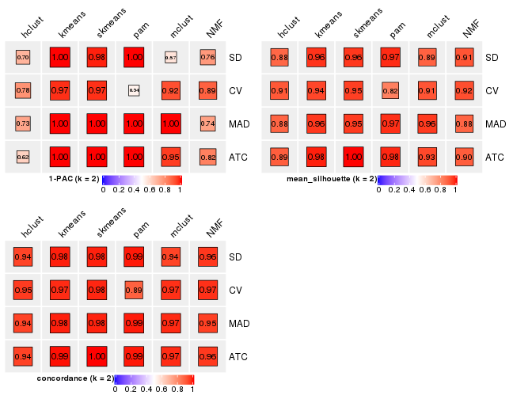</p>

</div>
<div id='tab-collect-stats-from-consensus-partition-list-2'>
<pre><code class="r">collect_stats(res_list, k = 3)
</code></pre>

<p></p>

</div>
<div id='tab-collect-stats-from-consensus-partition-list-3'>
<pre><code class="r">collect_stats(res_list, k = 4)
</code></pre>

<p></p>

</div>
<div id='tab-collect-stats-from-consensus-partition-list-4'>
<pre><code class="r">collect_stats(res_list, k = 5)
</code></pre>

<p></p>

</div>
<div id='tab-collect-stats-from-consensus-partition-list-5'>
<pre><code class="r">collect_stats(res_list, k = 6)
</code></pre>

<p></p>

</div>
</div>

### Partition from all methods


Collect partitions from all methods:


<script>
$( function() {
	$( '#tabs-collect-classes-from-consensus-partition-list' ).tabs();
} );
</script>
<div id='tabs-collect-classes-from-consensus-partition-list'>
<ul>
<li><a href='#tab-collect-classes-from-consensus-partition-list-1'>k = 2</a></li>
<li><a href='#tab-collect-classes-from-consensus-partition-list-2'>k = 3</a></li>
<li><a href='#tab-collect-classes-from-consensus-partition-list-3'>k = 4</a></li>
<li><a href='#tab-collect-classes-from-consensus-partition-list-4'>k = 5</a></li>
<li><a href='#tab-collect-classes-from-consensus-partition-list-5'>k = 6</a></li>
</ul>
<div id='tab-collect-classes-from-consensus-partition-list-1'>
<pre><code class="r">collect_classes(res_list, k = 2)
</code></pre>

<p></p>

</div>
<div id='tab-collect-classes-from-consensus-partition-list-2'>
<pre><code class="r">collect_classes(res_list, k = 3)
</code></pre>

<p></p>

</div>
<div id='tab-collect-classes-from-consensus-partition-list-3'>
<pre><code class="r">collect_classes(res_list, k = 4)
</code></pre>

<p></p>

</div>
<div id='tab-collect-classes-from-consensus-partition-list-4'>
<pre><code class="r">collect_classes(res_list, k = 5)
</code></pre>

<p></p>

</div>
<div id='tab-collect-classes-from-consensus-partition-list-5'>
<pre><code class="r">collect_classes(res_list, k = 6)
</code></pre>

<p></p>

</div>
</div>


### Top rows overlap


Overlap of top rows from different top-row methods:


<script>
$( function() {
	$( '#tabs-top-rows-overlap-by-euler' ).tabs();
} );
</script>
<div id='tabs-top-rows-overlap-by-euler'>
<ul>
<li><a href='#tab-top-rows-overlap-by-euler-1'>top_n = 1000</a></li>
<li><a href='#tab-top-rows-overlap-by-euler-2'>top_n = 2000</a></li>
<li><a href='#tab-top-rows-overlap-by-euler-3'>top_n = 3000</a></li>
<li><a href='#tab-top-rows-overlap-by-euler-4'>top_n = 4000</a></li>
<li><a href='#tab-top-rows-overlap-by-euler-5'>top_n = 5000</a></li>
</ul>
<div id='tab-top-rows-overlap-by-euler-1'>
<pre><code class="r">top_rows_overlap(res_list, top_n = 1000, method = &quot;euler&quot;)
</code></pre>

<p></p>

</div>
<div id='tab-top-rows-overlap-by-euler-2'>
<pre><code class="r">top_rows_overlap(res_list, top_n = 2000, method = &quot;euler&quot;)
</code></pre>

<p>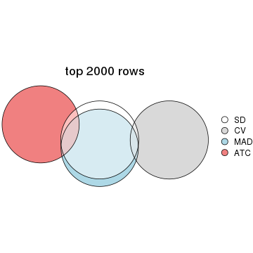</p>

</div>
<div id='tab-top-rows-overlap-by-euler-3'>
<pre><code class="r">top_rows_overlap(res_list, top_n = 3000, method = &quot;euler&quot;)
</code></pre>

<p></p>

</div>
<div id='tab-top-rows-overlap-by-euler-4'>
<pre><code class="r">top_rows_overlap(res_list, top_n = 4000, method = &quot;euler&quot;)
</code></pre>

<p></p>

</div>
<div id='tab-top-rows-overlap-by-euler-5'>
<pre><code class="r">top_rows_overlap(res_list, top_n = 5000, method = &quot;euler&quot;)
</code></pre>

<p></p>

</div>
</div>

Also visualize the correspondance of rankings between different top-row methods:


<script>
$( function() {
	$( '#tabs-top-rows-overlap-by-correspondance' ).tabs();
} );
</script>
<div id='tabs-top-rows-overlap-by-correspondance'>
<ul>
<li><a href='#tab-top-rows-overlap-by-correspondance-1'>top_n = 1000</a></li>
<li><a href='#tab-top-rows-overlap-by-correspondance-2'>top_n = 2000</a></li>
<li><a href='#tab-top-rows-overlap-by-correspondance-3'>top_n = 3000</a></li>
<li><a href='#tab-top-rows-overlap-by-correspondance-4'>top_n = 4000</a></li>
<li><a href='#tab-top-rows-overlap-by-correspondance-5'>top_n = 5000</a></li>
</ul>
<div id='tab-top-rows-overlap-by-correspondance-1'>
<pre><code class="r">top_rows_overlap(res_list, top_n = 1000, method = &quot;correspondance&quot;)
</code></pre>

<p></p>

</div>
<div id='tab-top-rows-overlap-by-correspondance-2'>
<pre><code class="r">top_rows_overlap(res_list, top_n = 2000, method = &quot;correspondance&quot;)
</code></pre>

<p></p>

</div>
<div id='tab-top-rows-overlap-by-correspondance-3'>
<pre><code class="r">top_rows_overlap(res_list, top_n = 3000, method = &quot;correspondance&quot;)
</code></pre>

<p></p>

</div>
<div id='tab-top-rows-overlap-by-correspondance-4'>
<pre><code class="r">top_rows_overlap(res_list, top_n = 4000, method = &quot;correspondance&quot;)
</code></pre>

<p></p>

</div>
<div id='tab-top-rows-overlap-by-correspondance-5'>
<pre><code class="r">top_rows_overlap(res_list, top_n = 5000, method = &quot;correspondance&quot;)
</code></pre>

<p>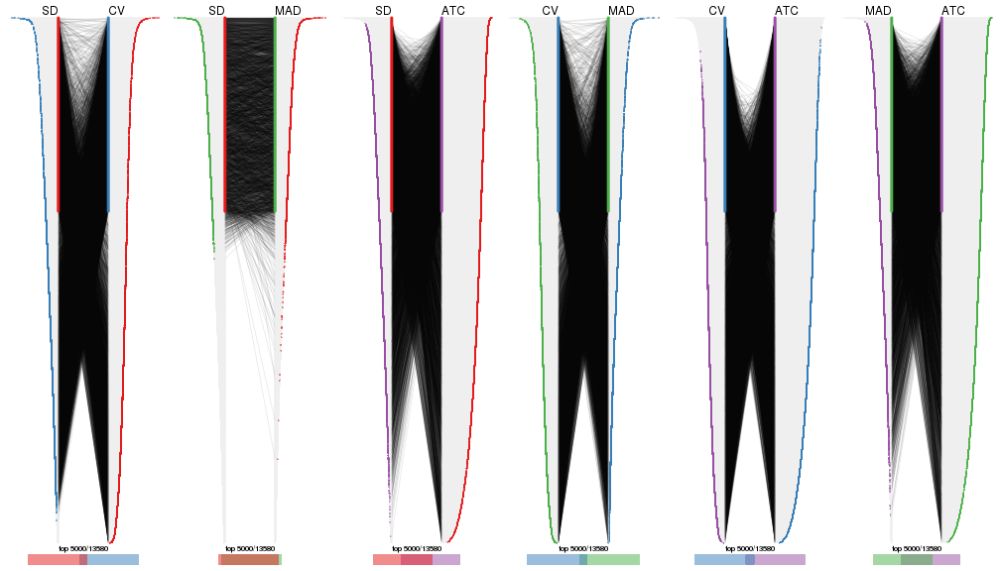</p>

</div>
</div>


Heatmaps of the top rows:


<script>
$( function() {
	$( '#tabs-top-rows-heatmap' ).tabs();
} );
</script>
<div id='tabs-top-rows-heatmap'>
<ul>
<li><a href='#tab-top-rows-heatmap-1'>top_n = 1000</a></li>
<li><a href='#tab-top-rows-heatmap-2'>top_n = 2000</a></li>
<li><a href='#tab-top-rows-heatmap-3'>top_n = 3000</a></li>
<li><a href='#tab-top-rows-heatmap-4'>top_n = 4000</a></li>
<li><a href='#tab-top-rows-heatmap-5'>top_n = 5000</a></li>
</ul>
<div id='tab-top-rows-heatmap-1'>
<pre><code class="r">top_rows_heatmap(res_list, top_n = 1000)
</code></pre>

<p></p>

</div>
<div id='tab-top-rows-heatmap-2'>
<pre><code class="r">top_rows_heatmap(res_list, top_n = 2000)
</code></pre>

<p></p>

</div>
<div id='tab-top-rows-heatmap-3'>
<pre><code class="r">top_rows_heatmap(res_list, top_n = 3000)
</code></pre>

<p></p>

</div>
<div id='tab-top-rows-heatmap-4'>
<pre><code class="r">top_rows_heatmap(res_list, top_n = 4000)
</code></pre>

<p></p>

</div>
<div id='tab-top-rows-heatmap-5'>
<pre><code class="r">top_rows_heatmap(res_list, top_n = 5000)
</code></pre>

<p></p>

</div>
</div>


 
## Results for each method


---------------------------------------------------


### SD:hclust


The object with results only for a single top-value method and a single partition method 
can be extracted as:

```r
res = res_list["SD", "hclust"]
# you can also extract it by
# res = res_list["SD:hclust"]
```

A summary of `res` and all the functions that can be applied to it:

```r
res
```

```
#> A 'ConsensusPartition' object with k = 2, 3, 4, 5, 6.
#>   On a matrix with 13580 rows and 133 columns.
#>   Top rows (1000, 2000, 3000, 4000, 5000) are extracted by 'SD' method.
#>   Subgroups are detected by 'hclust' method.
#>   Performed in total 1250 partitions by row resampling.
#>   Best k for subgroups seems to be 3.
#> 
#> Following methods can be applied to this 'ConsensusPartition' object:
#>  [1] "cola_report"             "collect_classes"         "collect_plots"          
#>  [4] "collect_stats"           "colnames"                "compare_signatures"     
#>  [7] "consensus_heatmap"       "dimension_reduction"     "functional_enrichment"  
#> [10] "get_anno_col"            "get_anno"                "get_classes"            
#> [13] "get_consensus"           "get_matrix"              "get_membership"         
#> [16] "get_param"               "get_signatures"          "get_stats"              
#> [19] "is_best_k"               "is_stable_k"             "membership_heatmap"     
#> [22] "ncol"                    "nrow"                    "plot_ecdf"              
#> [25] "rownames"                "select_partition_number" "show"                   
#> [28] "suggest_best_k"          "test_to_known_factors"
```

`collect_plots()` function collects all the plots made from `res` for all `k` (number of partitions)
into one single page to provide an easy and fast comparison between different `k`.

```r
collect_plots(res)
```


The plots are:

- The first row: a plot of the ECDF (empirical cumulative distribution
  function) curves of the consensus matrix for each `k` and the heatmap of
  predicted classes for each `k`.
- The second row: heatmaps of the consensus matrix for each `k`.
- The third row: heatmaps of the membership matrix for each `k`.
- The fouth row: heatmaps of the signatures for each `k`.

All the plots in panels can be made by individual functions and they are
plotted later in this section.

`select_partition_number()` produces several plots showing different
statistics for choosing "optimized" `k`. There are following statistics:

- ECDF curves of the consensus matrix for each `k`;
- 1-PAC. [The PAC
  score](https://en.wikipedia.org/wiki/Consensus_clustering#Over-interpretation_potential_of_consensus_clustering)
  measures the proportion of the ambiguous subgrouping.
- Mean silhouette score.
- Concordance. The mean probability of fiting the consensus class ids in all
  partitions.
- Area increased. Denote $A_k$ as the area under the ECDF curve for current
  `k`, the area increased is defined as $A_k - A_{k-1}$.
- Rand index. The percent of pairs of samples that are both in a same cluster
  or both are not in a same cluster in the partition of k and k-1.
- Jaccard index. The ratio of pairs of samples are both in a same cluster in
  the partition of k and k-1 and the pairs of samples are both in a same
  cluster in the partition k or k-1.

The detailed explanations of these statistics can be found in [the _cola_
vignette](http://bioconductor.org/packages/devel/bioc/vignettes/cola/inst/doc/cola.html#toc_13).

Generally speaking, lower PAC score, higher mean silhouette score or higher
concordance corresponds to better partition. Rand index and Jaccard index
measure how similar the current partition is compared to partition with `k-1`.
If they are too similar, we won't accept `k` is better than `k-1`.

```r
select_partition_number(res)
```


The numeric values for all these statistics can be obtained by `get_stats()`.

```r
get_stats(res)
```

```
#>   k 1-PAC mean_silhouette concordance area_increased  Rand Jaccard
#> 2 2 0.696           0.876       0.940         0.3909 0.632   0.632
#> 3 3 0.610           0.757       0.883         0.5631 0.734   0.584
#> 4 4 0.648           0.740       0.874         0.1155 0.954   0.879
#> 5 5 0.612           0.613       0.755         0.1014 0.867   0.623
#> 6 6 0.683           0.666       0.722         0.0597 0.915   0.660
```

`suggest_best_k()` suggests the best $k$ based on these statistics. The rules are as follows:

- All $k$ with Jaccard index larger than 0.95 are removed because increasing
  $k$ does not provide enough extra information. If all $k$ are removed, it is
  marked as no subgroup is detected.
- For all $k$ with 1-PAC score larger than 0.9, the maximal $k$ is taken as
  the best $k$, and other $k$ are marked as optional $k$.
- If it does not fit the second rule. The $k$ with the maximal vote of the
  highest 1-PAC score, highest mean silhouette, and highest concordance is
  taken as the best $k$.

```r
suggest_best_k(res)
```

```
#> [1] 3
```


Following shows the table of the partitions (You need to click the **show/hide
code output** link to see it). The membership matrix (columns with name `p*`)
is inferred by
[`clue::cl_consensus()`](https://www.rdocumentation.org/link/cl_consensus?package=clue)
function with the `SE` method. Basically the value in the membership matrix
represents the probability to belong to a certain group. The finall class
label for an item is determined with the group with highest probability it
belongs to.

In `get_classes()` function, the entropy is calculated from the membership
matrix and the silhouette score is calculated from the consensus matrix.


<script>
$( function() {
	$( '#tabs-SD-hclust-get-classes' ).tabs();
} );
</script>
<div id='tabs-SD-hclust-get-classes'>
<ul>
<li><a href='#tab-SD-hclust-get-classes-1'>k = 2</a></li>
<li><a href='#tab-SD-hclust-get-classes-2'>k = 3</a></li>
<li><a href='#tab-SD-hclust-get-classes-3'>k = 4</a></li>
<li><a href='#tab-SD-hclust-get-classes-4'>k = 5</a></li>
<li><a href='#tab-SD-hclust-get-classes-5'>k = 6</a></li>
</ul>

<div id='tab-SD-hclust-get-classes-1'>
<p><a id='tab-SD-hclust-get-classes-1-a' style='color:#0366d6' href='#'>show/hide code output</a></p>
<pre><code class="r">cbind(get_classes(res, k = 2), get_membership(res, k = 2))
</code></pre>

<pre><code>#&gt;            class entropy silhouette    p1    p2
#&gt; SRR1951667     2  0.0000      0.946 0.000 1.000
#&gt; SRR1951666     1  0.9000      0.620 0.684 0.316
#&gt; SRR1951665     2  0.0000      0.946 0.000 1.000
#&gt; SRR1951664     1  0.0000      0.930 1.000 0.000
#&gt; SRR1951663     1  0.0672      0.928 0.992 0.008
#&gt; SRR1951662     2  0.0000      0.946 0.000 1.000
#&gt; SRR1951661     1  0.8443      0.692 0.728 0.272
#&gt; SRR1951660     1  0.0000      0.930 1.000 0.000
#&gt; SRR1951659     2  0.0000      0.946 0.000 1.000
#&gt; SRR1951658     2  0.0000      0.946 0.000 1.000
#&gt; SRR1951657     1  0.0000      0.930 1.000 0.000
#&gt; SRR1951656     1  0.0000      0.930 1.000 0.000
#&gt; SRR1951655     1  0.0000      0.930 1.000 0.000
#&gt; SRR1951654     1  0.0000      0.930 1.000 0.000
#&gt; SRR1951653     1  0.0000      0.930 1.000 0.000
#&gt; SRR1951652     2  0.4939      0.863 0.108 0.892
#&gt; SRR1951651     1  0.0000      0.930 1.000 0.000
#&gt; SRR1951650     1  0.1184      0.924 0.984 0.016
#&gt; SRR1951648     1  0.8499      0.686 0.724 0.276
#&gt; SRR1951649     1  0.0000      0.930 1.000 0.000
#&gt; SRR1951647     1  0.5059      0.863 0.888 0.112
#&gt; SRR1951646     1  0.0000      0.930 1.000 0.000
#&gt; SRR1951645     1  0.0000      0.930 1.000 0.000
#&gt; SRR1951644     1  0.0000      0.930 1.000 0.000
#&gt; SRR1951643     1  0.0000      0.930 1.000 0.000
#&gt; SRR1951641     2  0.0000      0.946 0.000 1.000
#&gt; SRR1951642     1  0.0000      0.930 1.000 0.000
#&gt; SRR1951694     1  0.0938      0.926 0.988 0.012
#&gt; SRR1951731     1  0.5178      0.860 0.884 0.116
#&gt; SRR1951730     2  0.5629      0.835 0.132 0.868
#&gt; SRR1951752     1  0.8813      0.649 0.700 0.300
#&gt; SRR1951751     1  0.0000      0.930 1.000 0.000
#&gt; SRR1951749     2  1.0000     -0.139 0.500 0.500
#&gt; SRR1951750     1  0.0000      0.930 1.000 0.000
#&gt; SRR1951748     2  0.0000      0.946 0.000 1.000
#&gt; SRR1951747     2  0.0000      0.946 0.000 1.000
#&gt; SRR1951745     1  0.0672      0.928 0.992 0.008
#&gt; SRR1951746     2  0.0000      0.946 0.000 1.000
#&gt; SRR1951744     1  0.7815      0.745 0.768 0.232
#&gt; SRR1951742     2  0.8386      0.608 0.268 0.732
#&gt; SRR1951743     2  0.0000      0.946 0.000 1.000
#&gt; SRR1951741     1  0.0000      0.930 1.000 0.000
#&gt; SRR1951740     1  0.0000      0.930 1.000 0.000
#&gt; SRR1951738     2  0.2043      0.930 0.032 0.968
#&gt; SRR1951739     2  0.1184      0.939 0.016 0.984
#&gt; SRR1951737     1  0.0000      0.930 1.000 0.000
#&gt; SRR1951736     1  0.0000      0.930 1.000 0.000
#&gt; SRR1951734     2  0.0000      0.946 0.000 1.000
#&gt; SRR1951735     1  0.0672      0.928 0.992 0.008
#&gt; SRR1951733     1  1.0000      0.118 0.504 0.496
#&gt; SRR1951732     2  0.0000      0.946 0.000 1.000
#&gt; SRR1951729     1  0.0000      0.930 1.000 0.000
#&gt; SRR1951728     1  0.2603      0.910 0.956 0.044
#&gt; SRR1951727     2  0.0000      0.946 0.000 1.000
#&gt; SRR1951725     1  0.0000      0.930 1.000 0.000
#&gt; SRR1951726     1  0.8081      0.725 0.752 0.248
#&gt; SRR1951724     1  0.0000      0.930 1.000 0.000
#&gt; SRR1951722     1  0.2423      0.912 0.960 0.040
#&gt; SRR1951723     1  0.0000      0.930 1.000 0.000
#&gt; SRR1951721     1  0.0938      0.926 0.988 0.012
#&gt; SRR1951719     1  0.0000      0.930 1.000 0.000
#&gt; SRR1951720     1  0.0000      0.930 1.000 0.000
#&gt; SRR1951718     1  0.0000      0.930 1.000 0.000
#&gt; SRR1951717     1  0.0000      0.930 1.000 0.000
#&gt; SRR1951715     1  0.0938      0.926 0.988 0.012
#&gt; SRR1951716     1  0.0000      0.930 1.000 0.000
#&gt; SRR1951714     1  0.0000      0.930 1.000 0.000
#&gt; SRR1951713     1  0.0000      0.930 1.000 0.000
#&gt; SRR1951712     1  0.0000      0.930 1.000 0.000
#&gt; SRR1951711     2  0.0000      0.946 0.000 1.000
#&gt; SRR1951710     1  0.0376      0.929 0.996 0.004
#&gt; SRR1951709     1  0.8661      0.668 0.712 0.288
#&gt; SRR1951708     2  0.0000      0.946 0.000 1.000
#&gt; SRR1951707     1  0.5629      0.847 0.868 0.132
#&gt; SRR1951705     1  0.0000      0.930 1.000 0.000
#&gt; SRR1951704     1  0.7815      0.745 0.768 0.232
#&gt; SRR1951703     2  0.0000      0.946 0.000 1.000
#&gt; SRR1951706     1  0.7883      0.740 0.764 0.236
#&gt; SRR1951702     1  0.7815      0.745 0.768 0.232
#&gt; SRR1951701     2  0.0000      0.946 0.000 1.000
#&gt; SRR1951699     1  0.8443      0.692 0.728 0.272
#&gt; SRR1951698     1  0.7219      0.781 0.800 0.200
#&gt; SRR1951700     1  0.2236      0.914 0.964 0.036
#&gt; SRR1951697     2  0.0000      0.946 0.000 1.000
#&gt; SRR1951696     1  0.0000      0.930 1.000 0.000
#&gt; SRR1951695     1  0.2236      0.914 0.964 0.036
#&gt; SRR1951693     1  0.2236      0.914 0.964 0.036
#&gt; SRR1951692     1  0.0000      0.930 1.000 0.000
#&gt; SRR1951691     1  0.0000      0.930 1.000 0.000
#&gt; SRR1951688     2  0.3431      0.907 0.064 0.936
#&gt; SRR1951689     1  0.8861      0.642 0.696 0.304
#&gt; SRR1951687     1  0.0000      0.930 1.000 0.000
#&gt; SRR1951685     1  0.5629      0.847 0.868 0.132
#&gt; SRR1951684     1  0.0000      0.930 1.000 0.000
#&gt; SRR1951686     2  0.7528      0.706 0.216 0.784
#&gt; SRR1951683     1  0.0000      0.930 1.000 0.000
#&gt; SRR1951682     2  0.0000      0.946 0.000 1.000
#&gt; SRR1951690     2  0.0000      0.946 0.000 1.000
#&gt; SRR1951680     1  0.0000      0.930 1.000 0.000
#&gt; SRR1951679     1  0.2603      0.909 0.956 0.044
#&gt; SRR1951678     1  0.0000      0.930 1.000 0.000
#&gt; SRR1951677     1  0.0000      0.930 1.000 0.000
#&gt; SRR1951676     1  0.0938      0.926 0.988 0.012
#&gt; SRR1951675     2  0.0000      0.946 0.000 1.000
#&gt; SRR1951681     1  0.2423      0.913 0.960 0.040
#&gt; SRR1951673     1  0.8861      0.642 0.696 0.304
#&gt; SRR1951674     1  0.0672      0.928 0.992 0.008
#&gt; SRR1951672     1  0.0000      0.930 1.000 0.000
#&gt; SRR1951671     1  0.8909      0.635 0.692 0.308
#&gt; SRR1951670     1  0.0000      0.930 1.000 0.000
#&gt; SRR1951640     1  0.0000      0.930 1.000 0.000
#&gt; SRR1951668     1  0.0000      0.930 1.000 0.000
#&gt; SRR1951669     2  0.3431      0.907 0.064 0.936
#&gt; SRR1951638     1  0.0000      0.930 1.000 0.000
#&gt; SRR1951637     2  0.3733      0.900 0.072 0.928
#&gt; SRR1951635     1  0.0000      0.930 1.000 0.000
#&gt; SRR1951634     1  0.0000      0.930 1.000 0.000
#&gt; SRR1951631     1  0.0000      0.930 1.000 0.000
#&gt; SRR1951632     2  0.1184      0.939 0.016 0.984
#&gt; SRR1951633     1  0.0000      0.930 1.000 0.000
#&gt; SRR1951630     1  0.0000      0.930 1.000 0.000
#&gt; SRR1951629     1  0.0000      0.930 1.000 0.000
#&gt; SRR1951628     1  0.4298      0.881 0.912 0.088
#&gt; SRR1951627     1  0.8661      0.668 0.712 0.288
#&gt; SRR1951639     1  0.7219      0.781 0.800 0.200
#&gt; SRR1951625     1  0.8016      0.731 0.756 0.244
#&gt; SRR1951626     1  0.2423      0.913 0.960 0.040
#&gt; SRR1951624     1  0.0000      0.930 1.000 0.000
#&gt; SRR1951622     1  0.0000      0.930 1.000 0.000
#&gt; SRR1951636     1  0.2423      0.913 0.960 0.040
#&gt; SRR1951623     1  0.7674      0.754 0.776 0.224
#&gt; SRR1951621     1  0.0000      0.930 1.000 0.000
#&gt; SRR1951620     1  0.0000      0.930 1.000 0.000
</code></pre>

<script>
$('#tab-SD-hclust-get-classes-1-a').parent().next().next().hide();
$('#tab-SD-hclust-get-classes-1-a').click(function(){
  $('#tab-SD-hclust-get-classes-1-a').parent().next().next().toggle();
  return(false);
});
</script>
</div>

<div id='tab-SD-hclust-get-classes-2'>
<p><a id='tab-SD-hclust-get-classes-2-a' style='color:#0366d6' href='#'>show/hide code output</a></p>
<pre><code class="r">cbind(get_classes(res, k = 3), get_membership(res, k = 3))
</code></pre>

<pre><code>#&gt;            class entropy silhouette    p1    p2    p3
#&gt; SRR1951667     2  0.2537      0.899 0.000 0.920 0.080
#&gt; SRR1951666     3  0.2537      0.702 0.000 0.080 0.920
#&gt; SRR1951665     2  0.0000      0.942 0.000 1.000 0.000
#&gt; SRR1951664     1  0.1860      0.867 0.948 0.000 0.052
#&gt; SRR1951663     3  0.6225      0.241 0.432 0.000 0.568
#&gt; SRR1951662     2  0.0000      0.942 0.000 1.000 0.000
#&gt; SRR1951661     3  0.1765      0.727 0.004 0.040 0.956
#&gt; SRR1951660     1  0.2356      0.863 0.928 0.000 0.072
#&gt; SRR1951659     2  0.0000      0.942 0.000 1.000 0.000
#&gt; SRR1951658     2  0.0000      0.942 0.000 1.000 0.000
#&gt; SRR1951657     1  0.0000      0.877 1.000 0.000 0.000
#&gt; SRR1951656     1  0.0000      0.877 1.000 0.000 0.000
#&gt; SRR1951655     1  0.0892      0.878 0.980 0.000 0.020
#&gt; SRR1951654     1  0.1031      0.873 0.976 0.000 0.024
#&gt; SRR1951653     1  0.1753      0.868 0.952 0.000 0.048
#&gt; SRR1951652     2  0.4700      0.811 0.008 0.812 0.180
#&gt; SRR1951651     1  0.0000      0.877 1.000 0.000 0.000
#&gt; SRR1951650     1  0.3482      0.817 0.872 0.000 0.128
#&gt; SRR1951648     3  0.1878      0.726 0.004 0.044 0.952
#&gt; SRR1951649     1  0.3412      0.828 0.876 0.000 0.124
#&gt; SRR1951647     3  0.5815      0.554 0.304 0.004 0.692
#&gt; SRR1951646     1  0.1964      0.865 0.944 0.000 0.056
#&gt; SRR1951645     1  0.0747      0.878 0.984 0.000 0.016
#&gt; SRR1951644     1  0.3412      0.828 0.876 0.000 0.124
#&gt; SRR1951643     1  0.0000      0.877 1.000 0.000 0.000
#&gt; SRR1951641     2  0.0000      0.942 0.000 1.000 0.000
#&gt; SRR1951642     1  0.0000      0.877 1.000 0.000 0.000
#&gt; SRR1951694     3  0.6286      0.131 0.464 0.000 0.536
#&gt; SRR1951731     3  0.5723      0.632 0.240 0.016 0.744
#&gt; SRR1951730     2  0.5247      0.754 0.008 0.768 0.224
#&gt; SRR1951752     3  0.2400      0.718 0.004 0.064 0.932
#&gt; SRR1951751     1  0.2261      0.864 0.932 0.000 0.068
#&gt; SRR1951749     3  0.5254      0.429 0.000 0.264 0.736
#&gt; SRR1951750     1  0.2261      0.864 0.932 0.000 0.068
#&gt; SRR1951748     2  0.0000      0.942 0.000 1.000 0.000
#&gt; SRR1951747     2  0.0000      0.942 0.000 1.000 0.000
#&gt; SRR1951745     3  0.6225      0.241 0.432 0.000 0.568
#&gt; SRR1951746     2  0.0000      0.942 0.000 1.000 0.000
#&gt; SRR1951744     3  0.1753      0.742 0.048 0.000 0.952
#&gt; SRR1951742     3  0.6309     -0.269 0.000 0.496 0.504
#&gt; SRR1951743     2  0.0000      0.942 0.000 1.000 0.000
#&gt; SRR1951741     1  0.0000      0.877 1.000 0.000 0.000
#&gt; SRR1951740     1  0.0000      0.877 1.000 0.000 0.000
#&gt; SRR1951738     2  0.2955      0.900 0.008 0.912 0.080
#&gt; SRR1951739     2  0.2959      0.888 0.000 0.900 0.100
#&gt; SRR1951737     1  0.2448      0.855 0.924 0.000 0.076
#&gt; SRR1951736     1  0.2261      0.864 0.932 0.000 0.068
#&gt; SRR1951734     2  0.0000      0.942 0.000 1.000 0.000
#&gt; SRR1951735     1  0.4750      0.723 0.784 0.000 0.216
#&gt; SRR1951733     3  0.5443      0.437 0.004 0.260 0.736
#&gt; SRR1951732     2  0.0000      0.942 0.000 1.000 0.000
#&gt; SRR1951729     1  0.2625      0.850 0.916 0.000 0.084
#&gt; SRR1951728     1  0.5678      0.558 0.684 0.000 0.316
#&gt; SRR1951727     2  0.0000      0.942 0.000 1.000 0.000
#&gt; SRR1951725     1  0.4974      0.696 0.764 0.000 0.236
#&gt; SRR1951726     3  0.2152      0.739 0.036 0.016 0.948
#&gt; SRR1951724     1  0.3267      0.838 0.884 0.000 0.116
#&gt; SRR1951722     1  0.5560      0.596 0.700 0.000 0.300
#&gt; SRR1951723     1  0.3412      0.828 0.876 0.000 0.124
#&gt; SRR1951721     3  0.6215      0.247 0.428 0.000 0.572
#&gt; SRR1951719     1  0.2625      0.850 0.916 0.000 0.084
#&gt; SRR1951720     1  0.4931      0.702 0.768 0.000 0.232
#&gt; SRR1951718     1  0.2356      0.863 0.928 0.000 0.072
#&gt; SRR1951717     1  0.2261      0.864 0.932 0.000 0.068
#&gt; SRR1951715     3  0.6215      0.247 0.428 0.000 0.572
#&gt; SRR1951716     1  0.2356      0.863 0.928 0.000 0.072
#&gt; SRR1951714     1  0.0747      0.879 0.984 0.000 0.016
#&gt; SRR1951713     1  0.0747      0.878 0.984 0.000 0.016
#&gt; SRR1951712     1  0.2261      0.864 0.932 0.000 0.068
#&gt; SRR1951711     2  0.0237      0.941 0.000 0.996 0.004
#&gt; SRR1951710     1  0.6291      0.124 0.532 0.000 0.468
#&gt; SRR1951709     3  0.2200      0.722 0.004 0.056 0.940
#&gt; SRR1951708     2  0.0000      0.942 0.000 1.000 0.000
#&gt; SRR1951707     3  0.5848      0.605 0.268 0.012 0.720
#&gt; SRR1951705     1  0.6252      0.201 0.556 0.000 0.444
#&gt; SRR1951704     3  0.1529      0.741 0.040 0.000 0.960
#&gt; SRR1951703     2  0.0000      0.942 0.000 1.000 0.000
#&gt; SRR1951706     3  0.1647      0.740 0.036 0.004 0.960
#&gt; SRR1951702     3  0.1529      0.741 0.040 0.000 0.960
#&gt; SRR1951701     2  0.0000      0.942 0.000 1.000 0.000
#&gt; SRR1951699     3  0.1765      0.727 0.004 0.040 0.956
#&gt; SRR1951698     3  0.3193      0.742 0.100 0.004 0.896
#&gt; SRR1951700     1  0.5465      0.612 0.712 0.000 0.288
#&gt; SRR1951697     2  0.0747      0.936 0.000 0.984 0.016
#&gt; SRR1951696     1  0.1964      0.865 0.944 0.000 0.056
#&gt; SRR1951695     1  0.6045      0.391 0.620 0.000 0.380
#&gt; SRR1951693     1  0.5465      0.612 0.712 0.000 0.288
#&gt; SRR1951692     1  0.0000      0.877 1.000 0.000 0.000
#&gt; SRR1951691     1  0.0747      0.879 0.984 0.000 0.016
#&gt; SRR1951688     2  0.4033      0.858 0.008 0.856 0.136
#&gt; SRR1951689     3  0.2496      0.715 0.004 0.068 0.928
#&gt; SRR1951687     1  0.0237      0.877 0.996 0.000 0.004
#&gt; SRR1951685     3  0.5848      0.605 0.268 0.012 0.720
#&gt; SRR1951684     1  0.0237      0.877 0.996 0.000 0.004
#&gt; SRR1951686     2  0.6180      0.443 0.000 0.584 0.416
#&gt; SRR1951683     1  0.0000      0.877 1.000 0.000 0.000
#&gt; SRR1951682     2  0.0000      0.942 0.000 1.000 0.000
#&gt; SRR1951690     2  0.0000      0.942 0.000 1.000 0.000
#&gt; SRR1951680     1  0.0747      0.878 0.984 0.000 0.016
#&gt; SRR1951679     3  0.6295      0.115 0.472 0.000 0.528
#&gt; SRR1951678     1  0.0000      0.877 1.000 0.000 0.000
#&gt; SRR1951677     1  0.0000      0.877 1.000 0.000 0.000
#&gt; SRR1951676     1  0.3686      0.809 0.860 0.000 0.140
#&gt; SRR1951675     2  0.0237      0.941 0.000 0.996 0.004
#&gt; SRR1951681     1  0.5560      0.594 0.700 0.000 0.300
#&gt; SRR1951673     3  0.2496      0.715 0.004 0.068 0.928
#&gt; SRR1951674     3  0.6225      0.241 0.432 0.000 0.568
#&gt; SRR1951672     1  0.3412      0.828 0.876 0.000 0.124
#&gt; SRR1951671     3  0.2356      0.710 0.000 0.072 0.928
#&gt; SRR1951670     1  0.0000      0.877 1.000 0.000 0.000
#&gt; SRR1951640     1  0.1964      0.865 0.944 0.000 0.056
#&gt; SRR1951668     1  0.0747      0.878 0.984 0.000 0.016
#&gt; SRR1951669     2  0.4033      0.858 0.008 0.856 0.136
#&gt; SRR1951638     1  0.5497      0.599 0.708 0.000 0.292
#&gt; SRR1951637     2  0.4164      0.851 0.008 0.848 0.144
#&gt; SRR1951635     1  0.4974      0.696 0.764 0.000 0.236
#&gt; SRR1951634     1  0.0747      0.878 0.984 0.000 0.016
#&gt; SRR1951631     1  0.0000      0.877 1.000 0.000 0.000
#&gt; SRR1951632     2  0.3038      0.885 0.000 0.896 0.104
#&gt; SRR1951633     1  0.0000      0.877 1.000 0.000 0.000
#&gt; SRR1951630     1  0.0000      0.877 1.000 0.000 0.000
#&gt; SRR1951629     1  0.0000      0.877 1.000 0.000 0.000
#&gt; SRR1951628     3  0.6264      0.382 0.380 0.004 0.616
#&gt; SRR1951627     3  0.2200      0.722 0.004 0.056 0.940
#&gt; SRR1951639     3  0.3573      0.739 0.120 0.004 0.876
#&gt; SRR1951625     3  0.3337      0.742 0.060 0.032 0.908
#&gt; SRR1951626     1  0.5560      0.594 0.700 0.000 0.300
#&gt; SRR1951624     1  0.2625      0.850 0.916 0.000 0.084
#&gt; SRR1951622     1  0.2356      0.863 0.928 0.000 0.072
#&gt; SRR1951636     1  0.5560      0.594 0.700 0.000 0.300
#&gt; SRR1951623     3  0.3482      0.721 0.128 0.000 0.872
#&gt; SRR1951621     1  0.0000      0.877 1.000 0.000 0.000
#&gt; SRR1951620     1  0.1964      0.865 0.944 0.000 0.056
</code></pre>

<script>
$('#tab-SD-hclust-get-classes-2-a').parent().next().next().hide();
$('#tab-SD-hclust-get-classes-2-a').click(function(){
  $('#tab-SD-hclust-get-classes-2-a').parent().next().next().toggle();
  return(false);
});
</script>
</div>

<div id='tab-SD-hclust-get-classes-3'>
<p><a id='tab-SD-hclust-get-classes-3-a' style='color:#0366d6' href='#'>show/hide code output</a></p>
<pre><code class="r">cbind(get_classes(res, k = 4), get_membership(res, k = 4))
</code></pre>

<pre><code>#&gt;            class entropy silhouette    p1    p2    p3    p4
#&gt; SRR1951667     2  0.2149     0.8840 0.000 0.912 0.088 0.000
#&gt; SRR1951666     3  0.1716     0.8172 0.000 0.064 0.936 0.000
#&gt; SRR1951665     2  0.0000     0.9341 0.000 1.000 0.000 0.000
#&gt; SRR1951664     4  0.1824     0.7950 0.004 0.000 0.060 0.936
#&gt; SRR1951663     1  0.0779     0.7586 0.980 0.000 0.016 0.004
#&gt; SRR1951662     2  0.0000     0.9341 0.000 1.000 0.000 0.000
#&gt; SRR1951661     3  0.1004     0.8263 0.004 0.024 0.972 0.000
#&gt; SRR1951660     4  0.3975     0.6605 0.240 0.000 0.000 0.760
#&gt; SRR1951659     2  0.0000     0.9341 0.000 1.000 0.000 0.000
#&gt; SRR1951658     2  0.0000     0.9341 0.000 1.000 0.000 0.000
#&gt; SRR1951657     4  0.0000     0.8103 0.000 0.000 0.000 1.000
#&gt; SRR1951656     4  0.0188     0.8101 0.004 0.000 0.000 0.996
#&gt; SRR1951655     4  0.0817     0.8105 0.024 0.000 0.000 0.976
#&gt; SRR1951654     4  0.2345     0.7696 0.100 0.000 0.000 0.900
#&gt; SRR1951653     4  0.1661     0.7975 0.004 0.000 0.052 0.944
#&gt; SRR1951652     2  0.4182     0.7884 0.024 0.796 0.180 0.000
#&gt; SRR1951651     4  0.0000     0.8103 0.000 0.000 0.000 1.000
#&gt; SRR1951650     4  0.3105     0.7445 0.004 0.000 0.140 0.856
#&gt; SRR1951648     3  0.1109     0.8259 0.004 0.028 0.968 0.000
#&gt; SRR1951649     4  0.4356     0.5878 0.292 0.000 0.000 0.708
#&gt; SRR1951647     3  0.5366     0.4950 0.040 0.000 0.684 0.276
#&gt; SRR1951646     4  0.1824     0.7943 0.004 0.000 0.060 0.936
#&gt; SRR1951645     4  0.1389     0.8023 0.048 0.000 0.000 0.952
#&gt; SRR1951644     4  0.4382     0.5813 0.296 0.000 0.000 0.704
#&gt; SRR1951643     4  0.0000     0.8103 0.000 0.000 0.000 1.000
#&gt; SRR1951641     2  0.0000     0.9341 0.000 1.000 0.000 0.000
#&gt; SRR1951642     4  0.0336     0.8108 0.008 0.000 0.000 0.992
#&gt; SRR1951694     1  0.3708     0.7465 0.832 0.000 0.020 0.148
#&gt; SRR1951731     3  0.4779     0.5984 0.028 0.004 0.756 0.212
#&gt; SRR1951730     2  0.4542     0.7235 0.020 0.752 0.228 0.000
#&gt; SRR1951752     3  0.1975     0.8208 0.016 0.048 0.936 0.000
#&gt; SRR1951751     4  0.3975     0.6584 0.240 0.000 0.000 0.760
#&gt; SRR1951749     3  0.4220     0.6048 0.004 0.248 0.748 0.000
#&gt; SRR1951750     4  0.3942     0.6621 0.236 0.000 0.000 0.764
#&gt; SRR1951748     2  0.0000     0.9341 0.000 1.000 0.000 0.000
#&gt; SRR1951747     2  0.0000     0.9341 0.000 1.000 0.000 0.000
#&gt; SRR1951745     1  0.0779     0.7586 0.980 0.000 0.016 0.004
#&gt; SRR1951746     2  0.0000     0.9341 0.000 1.000 0.000 0.000
#&gt; SRR1951744     3  0.1820     0.8190 0.020 0.000 0.944 0.036
#&gt; SRR1951742     3  0.4994    -0.0579 0.000 0.480 0.520 0.000
#&gt; SRR1951743     2  0.0000     0.9341 0.000 1.000 0.000 0.000
#&gt; SRR1951741     4  0.0469     0.8104 0.012 0.000 0.000 0.988
#&gt; SRR1951740     4  0.0188     0.8101 0.004 0.000 0.000 0.996
#&gt; SRR1951738     2  0.2450     0.8923 0.016 0.912 0.072 0.000
#&gt; SRR1951739     2  0.2469     0.8709 0.000 0.892 0.108 0.000
#&gt; SRR1951737     4  0.2271     0.7845 0.008 0.000 0.076 0.916
#&gt; SRR1951736     4  0.3942     0.6621 0.236 0.000 0.000 0.764
#&gt; SRR1951734     2  0.0000     0.9341 0.000 1.000 0.000 0.000
#&gt; SRR1951735     4  0.4053     0.6511 0.004 0.000 0.228 0.768
#&gt; SRR1951733     3  0.4453     0.6056 0.012 0.244 0.744 0.000
#&gt; SRR1951732     2  0.0000     0.9341 0.000 1.000 0.000 0.000
#&gt; SRR1951729     4  0.2334     0.7797 0.004 0.000 0.088 0.908
#&gt; SRR1951728     4  0.5812     0.4957 0.048 0.000 0.328 0.624
#&gt; SRR1951727     2  0.0000     0.9341 0.000 1.000 0.000 0.000
#&gt; SRR1951725     4  0.4996     0.0586 0.484 0.000 0.000 0.516
#&gt; SRR1951726     3  0.1871     0.8246 0.016 0.012 0.948 0.024
#&gt; SRR1951724     4  0.4621     0.5989 0.284 0.000 0.008 0.708
#&gt; SRR1951722     4  0.5994     0.5206 0.068 0.000 0.296 0.636
#&gt; SRR1951723     4  0.4356     0.5878 0.292 0.000 0.000 0.708
#&gt; SRR1951721     1  0.0188     0.7570 0.996 0.000 0.004 0.000
#&gt; SRR1951719     4  0.2334     0.7797 0.004 0.000 0.088 0.908
#&gt; SRR1951720     4  0.4985     0.1240 0.468 0.000 0.000 0.532
#&gt; SRR1951718     4  0.3975     0.6605 0.240 0.000 0.000 0.760
#&gt; SRR1951717     4  0.3975     0.6584 0.240 0.000 0.000 0.760
#&gt; SRR1951715     1  0.0188     0.7570 0.996 0.000 0.004 0.000
#&gt; SRR1951716     4  0.3907     0.6678 0.232 0.000 0.000 0.768
#&gt; SRR1951714     4  0.0592     0.8108 0.016 0.000 0.000 0.984
#&gt; SRR1951713     4  0.1389     0.8023 0.048 0.000 0.000 0.952
#&gt; SRR1951712     4  0.3975     0.6584 0.240 0.000 0.000 0.760
#&gt; SRR1951711     2  0.0188     0.9327 0.004 0.996 0.000 0.000
#&gt; SRR1951710     1  0.4509     0.6050 0.708 0.000 0.004 0.288
#&gt; SRR1951709     3  0.1398     0.8256 0.004 0.040 0.956 0.000
#&gt; SRR1951708     2  0.0000     0.9341 0.000 1.000 0.000 0.000
#&gt; SRR1951707     3  0.5531     0.6056 0.128 0.000 0.732 0.140
#&gt; SRR1951705     1  0.4819     0.4890 0.652 0.000 0.004 0.344
#&gt; SRR1951704     3  0.1510     0.8209 0.016 0.000 0.956 0.028
#&gt; SRR1951703     2  0.0000     0.9341 0.000 1.000 0.000 0.000
#&gt; SRR1951706     3  0.1406     0.8216 0.016 0.000 0.960 0.024
#&gt; SRR1951702     3  0.1510     0.8209 0.016 0.000 0.956 0.028
#&gt; SRR1951701     2  0.0000     0.9341 0.000 1.000 0.000 0.000
#&gt; SRR1951699     3  0.1004     0.8263 0.004 0.024 0.972 0.000
#&gt; SRR1951698     3  0.2342     0.7932 0.008 0.000 0.912 0.080
#&gt; SRR1951700     4  0.5769     0.5398 0.056 0.000 0.292 0.652
#&gt; SRR1951697     2  0.0921     0.9235 0.000 0.972 0.028 0.000
#&gt; SRR1951696     4  0.1824     0.7943 0.004 0.000 0.060 0.936
#&gt; SRR1951695     4  0.5735     0.3998 0.032 0.000 0.392 0.576
#&gt; SRR1951693     4  0.5769     0.5398 0.056 0.000 0.292 0.652
#&gt; SRR1951692     4  0.0188     0.8101 0.004 0.000 0.000 0.996
#&gt; SRR1951691     4  0.0592     0.8108 0.016 0.000 0.000 0.984
#&gt; SRR1951688     2  0.3606     0.8376 0.020 0.840 0.140 0.000
#&gt; SRR1951689     3  0.2060     0.8193 0.016 0.052 0.932 0.000
#&gt; SRR1951687     4  0.1637     0.7948 0.060 0.000 0.000 0.940
#&gt; SRR1951685     3  0.5531     0.6056 0.128 0.000 0.732 0.140
#&gt; SRR1951684     4  0.0376     0.8096 0.004 0.000 0.004 0.992
#&gt; SRR1951686     2  0.4933     0.3068 0.000 0.568 0.432 0.000
#&gt; SRR1951683     4  0.0000     0.8103 0.000 0.000 0.000 1.000
#&gt; SRR1951682     2  0.0000     0.9341 0.000 1.000 0.000 0.000
#&gt; SRR1951690     2  0.0000     0.9341 0.000 1.000 0.000 0.000
#&gt; SRR1951680     4  0.1389     0.8023 0.048 0.000 0.000 0.952
#&gt; SRR1951679     1  0.6194     0.6212 0.644 0.000 0.096 0.260
#&gt; SRR1951678     4  0.0000     0.8103 0.000 0.000 0.000 1.000
#&gt; SRR1951677     4  0.0000     0.8103 0.000 0.000 0.000 1.000
#&gt; SRR1951676     4  0.3351     0.7346 0.008 0.000 0.148 0.844
#&gt; SRR1951675     2  0.0188     0.9327 0.004 0.996 0.000 0.000
#&gt; SRR1951681     4  0.4792     0.5523 0.008 0.000 0.312 0.680
#&gt; SRR1951673     3  0.2060     0.8193 0.016 0.052 0.932 0.000
#&gt; SRR1951674     1  0.0779     0.7586 0.980 0.000 0.016 0.004
#&gt; SRR1951672     4  0.4356     0.5878 0.292 0.000 0.000 0.708
#&gt; SRR1951671     3  0.2021     0.8187 0.012 0.056 0.932 0.000
#&gt; SRR1951670     4  0.0592     0.8101 0.016 0.000 0.000 0.984
#&gt; SRR1951640     4  0.1824     0.7943 0.004 0.000 0.060 0.936
#&gt; SRR1951668     4  0.1389     0.8023 0.048 0.000 0.000 0.952
#&gt; SRR1951669     2  0.3606     0.8376 0.020 0.840 0.140 0.000
#&gt; SRR1951638     1  0.4406     0.5874 0.700 0.000 0.000 0.300
#&gt; SRR1951637     2  0.3708     0.8293 0.020 0.832 0.148 0.000
#&gt; SRR1951635     4  0.4996     0.0586 0.484 0.000 0.000 0.516
#&gt; SRR1951634     4  0.1389     0.8023 0.048 0.000 0.000 0.952
#&gt; SRR1951631     4  0.0000     0.8103 0.000 0.000 0.000 1.000
#&gt; SRR1951632     2  0.2530     0.8675 0.000 0.888 0.112 0.000
#&gt; SRR1951633     4  0.0524     0.8116 0.008 0.000 0.004 0.988
#&gt; SRR1951630     4  0.0000     0.8103 0.000 0.000 0.000 1.000
#&gt; SRR1951629     4  0.0000     0.8103 0.000 0.000 0.000 1.000
#&gt; SRR1951628     3  0.7319     0.1891 0.220 0.000 0.532 0.248
#&gt; SRR1951627     3  0.1398     0.8256 0.004 0.040 0.956 0.000
#&gt; SRR1951639     3  0.2984     0.7788 0.028 0.000 0.888 0.084
#&gt; SRR1951625     3  0.2920     0.8116 0.032 0.020 0.908 0.040
#&gt; SRR1951626     4  0.4792     0.5523 0.008 0.000 0.312 0.680
#&gt; SRR1951624     4  0.2480     0.7772 0.008 0.000 0.088 0.904
#&gt; SRR1951622     4  0.3975     0.6605 0.240 0.000 0.000 0.760
#&gt; SRR1951636     4  0.4792     0.5523 0.008 0.000 0.312 0.680
#&gt; SRR1951623     3  0.2714     0.7598 0.004 0.000 0.884 0.112
#&gt; SRR1951621     4  0.0469     0.8104 0.012 0.000 0.000 0.988
#&gt; SRR1951620     4  0.1824     0.7943 0.004 0.000 0.060 0.936
</code></pre>

<script>
$('#tab-SD-hclust-get-classes-3-a').parent().next().next().hide();
$('#tab-SD-hclust-get-classes-3-a').click(function(){
  $('#tab-SD-hclust-get-classes-3-a').parent().next().next().toggle();
  return(false);
});
</script>
</div>

<div id='tab-SD-hclust-get-classes-4'>
<p><a id='tab-SD-hclust-get-classes-4-a' style='color:#0366d6' href='#'>show/hide code output</a></p>
<pre><code class="r">cbind(get_classes(res, k = 5), get_membership(res, k = 5))
</code></pre>

<pre><code>#&gt;            class entropy silhouette    p1    p2    p3    p4    p5
#&gt; SRR1951667     2  0.2888     0.8761 0.036 0.888 0.056 0.000 0.020
#&gt; SRR1951666     5  0.2665     0.7828 0.020 0.048 0.032 0.000 0.900
#&gt; SRR1951665     2  0.0000     0.9262 0.000 1.000 0.000 0.000 0.000
#&gt; SRR1951664     3  0.4090     0.6636 0.000 0.000 0.716 0.268 0.016
#&gt; SRR1951663     1  0.3002     0.8565 0.876 0.000 0.048 0.068 0.008
#&gt; SRR1951662     2  0.0000     0.9262 0.000 1.000 0.000 0.000 0.000
#&gt; SRR1951661     5  0.1281     0.7966 0.000 0.012 0.032 0.000 0.956
#&gt; SRR1951660     4  0.1018     0.5731 0.016 0.000 0.016 0.968 0.000
#&gt; SRR1951659     2  0.0000     0.9262 0.000 1.000 0.000 0.000 0.000
#&gt; SRR1951658     2  0.0000     0.9262 0.000 1.000 0.000 0.000 0.000
#&gt; SRR1951657     4  0.4210     0.3685 0.000 0.000 0.412 0.588 0.000
#&gt; SRR1951656     3  0.4305    -0.0869 0.000 0.000 0.512 0.488 0.000
#&gt; SRR1951655     4  0.4183     0.5013 0.008 0.000 0.324 0.668 0.000
#&gt; SRR1951654     4  0.5433     0.4786 0.092 0.000 0.288 0.620 0.000
#&gt; SRR1951653     3  0.4173     0.6231 0.000 0.000 0.688 0.300 0.012
#&gt; SRR1951652     2  0.4473     0.7678 0.012 0.764 0.056 0.000 0.168
#&gt; SRR1951651     4  0.4310     0.4031 0.004 0.000 0.392 0.604 0.000
#&gt; SRR1951650     3  0.5309     0.6668 0.012 0.000 0.676 0.236 0.076
#&gt; SRR1951648     5  0.0912     0.7949 0.000 0.016 0.012 0.000 0.972
#&gt; SRR1951649     4  0.2144     0.5501 0.068 0.000 0.020 0.912 0.000
#&gt; SRR1951647     5  0.5834     0.5373 0.012 0.000 0.212 0.136 0.640
#&gt; SRR1951646     3  0.4219     0.6636 0.004 0.000 0.716 0.264 0.016
#&gt; SRR1951645     4  0.3586     0.5186 0.000 0.000 0.264 0.736 0.000
#&gt; SRR1951644     4  0.1942     0.5472 0.068 0.000 0.012 0.920 0.000
#&gt; SRR1951643     4  0.4310     0.4031 0.004 0.000 0.392 0.604 0.000
#&gt; SRR1951641     2  0.0000     0.9262 0.000 1.000 0.000 0.000 0.000
#&gt; SRR1951642     4  0.4517     0.4100 0.012 0.000 0.388 0.600 0.000
#&gt; SRR1951694     1  0.4817     0.7135 0.680 0.000 0.056 0.264 0.000
#&gt; SRR1951731     5  0.6069     0.6196 0.048 0.000 0.200 0.100 0.652
#&gt; SRR1951730     2  0.4974     0.7069 0.020 0.720 0.056 0.000 0.204
#&gt; SRR1951752     5  0.3738     0.7644 0.044 0.024 0.096 0.000 0.836
#&gt; SRR1951751     4  0.0912     0.5719 0.012 0.000 0.016 0.972 0.000
#&gt; SRR1951749     5  0.5380     0.5791 0.036 0.224 0.052 0.000 0.688
#&gt; SRR1951750     4  0.0807     0.5731 0.012 0.000 0.012 0.976 0.000
#&gt; SRR1951748     2  0.0000     0.9262 0.000 1.000 0.000 0.000 0.000
#&gt; SRR1951747     2  0.0000     0.9262 0.000 1.000 0.000 0.000 0.000
#&gt; SRR1951745     1  0.3002     0.8565 0.876 0.000 0.048 0.068 0.008
#&gt; SRR1951746     2  0.0000     0.9262 0.000 1.000 0.000 0.000 0.000
#&gt; SRR1951744     5  0.3047     0.7783 0.024 0.000 0.096 0.012 0.868
#&gt; SRR1951742     5  0.6201    -0.0837 0.036 0.452 0.056 0.000 0.456
#&gt; SRR1951743     2  0.0000     0.9262 0.000 1.000 0.000 0.000 0.000
#&gt; SRR1951741     4  0.4029     0.5022 0.004 0.000 0.316 0.680 0.000
#&gt; SRR1951740     3  0.4306    -0.1034 0.000 0.000 0.508 0.492 0.000
#&gt; SRR1951738     2  0.2694     0.8775 0.008 0.892 0.032 0.000 0.068
#&gt; SRR1951739     2  0.3310     0.8655 0.036 0.868 0.056 0.000 0.040
#&gt; SRR1951737     3  0.4080     0.6690 0.000 0.000 0.728 0.252 0.020
#&gt; SRR1951736     4  0.0807     0.5731 0.012 0.000 0.012 0.976 0.000
#&gt; SRR1951734     2  0.0000     0.9262 0.000 1.000 0.000 0.000 0.000
#&gt; SRR1951735     3  0.5721     0.6594 0.008 0.000 0.648 0.200 0.144
#&gt; SRR1951733     5  0.5976     0.5713 0.044 0.224 0.084 0.000 0.648
#&gt; SRR1951732     2  0.0000     0.9262 0.000 1.000 0.000 0.000 0.000
#&gt; SRR1951729     3  0.3970     0.6820 0.000 0.000 0.744 0.236 0.020
#&gt; SRR1951728     3  0.6973     0.5606 0.024 0.000 0.496 0.236 0.244
#&gt; SRR1951727     2  0.0000     0.9262 0.000 1.000 0.000 0.000 0.000
#&gt; SRR1951725     4  0.3967     0.2223 0.264 0.000 0.012 0.724 0.000
#&gt; SRR1951726     5  0.2669     0.7834 0.020 0.000 0.104 0.000 0.876
#&gt; SRR1951724     4  0.3916     0.4966 0.092 0.000 0.104 0.804 0.000
#&gt; SRR1951722     3  0.7200     0.5378 0.032 0.000 0.464 0.276 0.228
#&gt; SRR1951723     4  0.2144     0.5501 0.068 0.000 0.020 0.912 0.000
#&gt; SRR1951721     1  0.2361     0.8539 0.892 0.000 0.012 0.096 0.000
#&gt; SRR1951719     3  0.3970     0.6820 0.000 0.000 0.744 0.236 0.020
#&gt; SRR1951720     4  0.3863     0.2469 0.248 0.000 0.012 0.740 0.000
#&gt; SRR1951718     4  0.1018     0.5731 0.016 0.000 0.016 0.968 0.000
#&gt; SRR1951717     4  0.0912     0.5719 0.012 0.000 0.016 0.972 0.000
#&gt; SRR1951715     1  0.2361     0.8539 0.892 0.000 0.012 0.096 0.000
#&gt; SRR1951716     4  0.1117     0.5728 0.016 0.000 0.020 0.964 0.000
#&gt; SRR1951714     4  0.4151     0.4809 0.004 0.000 0.344 0.652 0.000
#&gt; SRR1951713     4  0.3586     0.5186 0.000 0.000 0.264 0.736 0.000
#&gt; SRR1951712     4  0.0912     0.5719 0.012 0.000 0.016 0.972 0.000
#&gt; SRR1951711     2  0.0324     0.9239 0.004 0.992 0.004 0.000 0.000
#&gt; SRR1951710     4  0.4559    -0.3817 0.480 0.000 0.008 0.512 0.000
#&gt; SRR1951709     5  0.1211     0.7952 0.000 0.024 0.016 0.000 0.960
#&gt; SRR1951708     2  0.0000     0.9262 0.000 1.000 0.000 0.000 0.000
#&gt; SRR1951707     5  0.5764     0.6289 0.028 0.000 0.168 0.128 0.676
#&gt; SRR1951705     4  0.4696    -0.2577 0.428 0.000 0.016 0.556 0.000
#&gt; SRR1951704     5  0.2561     0.7806 0.020 0.000 0.096 0.000 0.884
#&gt; SRR1951703     2  0.0000     0.9262 0.000 1.000 0.000 0.000 0.000
#&gt; SRR1951706     5  0.2505     0.7822 0.020 0.000 0.092 0.000 0.888
#&gt; SRR1951702     5  0.2561     0.7806 0.020 0.000 0.096 0.000 0.884
#&gt; SRR1951701     2  0.0000     0.9262 0.000 1.000 0.000 0.000 0.000
#&gt; SRR1951699     5  0.1281     0.7966 0.000 0.012 0.032 0.000 0.956
#&gt; SRR1951698     5  0.3010     0.7751 0.012 0.000 0.100 0.020 0.868
#&gt; SRR1951700     3  0.6932     0.5601 0.020 0.000 0.488 0.272 0.220
#&gt; SRR1951697     2  0.1377     0.9101 0.004 0.956 0.020 0.000 0.020
#&gt; SRR1951696     3  0.4040     0.6637 0.000 0.000 0.724 0.260 0.016
#&gt; SRR1951695     3  0.6625     0.4621 0.016 0.000 0.520 0.168 0.296
#&gt; SRR1951693     3  0.6932     0.5601 0.020 0.000 0.488 0.272 0.220
#&gt; SRR1951692     3  0.4306    -0.1024 0.000 0.000 0.508 0.492 0.000
#&gt; SRR1951691     4  0.4151     0.4809 0.004 0.000 0.344 0.652 0.000
#&gt; SRR1951688     2  0.4011     0.8182 0.012 0.808 0.056 0.000 0.124
#&gt; SRR1951689     5  0.3770     0.7611 0.044 0.028 0.092 0.000 0.836
#&gt; SRR1951687     4  0.4907     0.5041 0.052 0.000 0.292 0.656 0.000
#&gt; SRR1951685     5  0.5764     0.6289 0.028 0.000 0.168 0.128 0.676
#&gt; SRR1951684     3  0.4235     0.2701 0.000 0.000 0.576 0.424 0.000
#&gt; SRR1951686     2  0.5759     0.3017 0.024 0.540 0.044 0.000 0.392
#&gt; SRR1951683     4  0.4310     0.4031 0.004 0.000 0.392 0.604 0.000
#&gt; SRR1951682     2  0.0000     0.9262 0.000 1.000 0.000 0.000 0.000
#&gt; SRR1951690     2  0.0000     0.9262 0.000 1.000 0.000 0.000 0.000
#&gt; SRR1951680     4  0.3586     0.5186 0.000 0.000 0.264 0.736 0.000
#&gt; SRR1951679     4  0.6855    -0.4868 0.428 0.000 0.084 0.428 0.060
#&gt; SRR1951678     4  0.4341     0.3849 0.004 0.000 0.404 0.592 0.000
#&gt; SRR1951677     4  0.4341     0.3849 0.004 0.000 0.404 0.592 0.000
#&gt; SRR1951676     3  0.4863     0.6722 0.008 0.000 0.716 0.212 0.064
#&gt; SRR1951675     2  0.0324     0.9239 0.004 0.992 0.004 0.000 0.000
#&gt; SRR1951681     3  0.6350     0.6207 0.016 0.000 0.584 0.180 0.220
#&gt; SRR1951673     5  0.3770     0.7611 0.044 0.028 0.092 0.000 0.836
#&gt; SRR1951674     1  0.3002     0.8565 0.876 0.000 0.048 0.068 0.008
#&gt; SRR1951672     4  0.2144     0.5501 0.068 0.000 0.020 0.912 0.000
#&gt; SRR1951671     5  0.3640     0.7615 0.040 0.028 0.088 0.000 0.844
#&gt; SRR1951670     4  0.3949     0.5147 0.004 0.000 0.300 0.696 0.000
#&gt; SRR1951640     3  0.4194     0.6620 0.004 0.000 0.720 0.260 0.016
#&gt; SRR1951668     4  0.3586     0.5186 0.000 0.000 0.264 0.736 0.000
#&gt; SRR1951669     2  0.4011     0.8182 0.012 0.808 0.056 0.000 0.124
#&gt; SRR1951638     1  0.5221     0.4814 0.552 0.000 0.048 0.400 0.000
#&gt; SRR1951637     2  0.4103     0.8096 0.012 0.800 0.056 0.000 0.132
#&gt; SRR1951635     4  0.3967     0.2223 0.264 0.000 0.012 0.724 0.000
#&gt; SRR1951634     4  0.3586     0.5186 0.000 0.000 0.264 0.736 0.000
#&gt; SRR1951631     4  0.4210     0.3752 0.000 0.000 0.412 0.588 0.000
#&gt; SRR1951632     2  0.3385     0.8627 0.036 0.864 0.056 0.000 0.044
#&gt; SRR1951633     4  0.4527     0.4062 0.012 0.000 0.392 0.596 0.000
#&gt; SRR1951630     4  0.4341     0.3849 0.004 0.000 0.404 0.592 0.000
#&gt; SRR1951629     4  0.4210     0.3752 0.000 0.000 0.412 0.588 0.000
#&gt; SRR1951628     5  0.7109     0.2245 0.092 0.000 0.084 0.336 0.488
#&gt; SRR1951627     5  0.1211     0.7952 0.000 0.024 0.016 0.000 0.960
#&gt; SRR1951639     5  0.3609     0.7658 0.016 0.000 0.112 0.036 0.836
#&gt; SRR1951625     5  0.3170     0.7795 0.008 0.012 0.068 0.036 0.876
#&gt; SRR1951626     3  0.6350     0.6207 0.016 0.000 0.584 0.180 0.220
#&gt; SRR1951624     3  0.4067     0.6830 0.004 0.000 0.748 0.228 0.020
#&gt; SRR1951622     4  0.1018     0.5731 0.016 0.000 0.016 0.968 0.000
#&gt; SRR1951636     3  0.6350     0.6207 0.016 0.000 0.584 0.180 0.220
#&gt; SRR1951623     5  0.3870     0.7234 0.016 0.000 0.176 0.016 0.792
#&gt; SRR1951621     4  0.4029     0.5022 0.004 0.000 0.316 0.680 0.000
#&gt; SRR1951620     3  0.4194     0.6620 0.004 0.000 0.720 0.260 0.016
</code></pre>

<script>
$('#tab-SD-hclust-get-classes-4-a').parent().next().next().hide();
$('#tab-SD-hclust-get-classes-4-a').click(function(){
  $('#tab-SD-hclust-get-classes-4-a').parent().next().next().toggle();
  return(false);
});
</script>
</div>

<div id='tab-SD-hclust-get-classes-5'>
<p><a id='tab-SD-hclust-get-classes-5-a' style='color:#0366d6' href='#'>show/hide code output</a></p>
<pre><code class="r">cbind(get_classes(res, k = 6), get_membership(res, k = 6))
</code></pre>

<pre><code>#&gt;            class entropy silhouette    p1    p2    p3    p4    p5    p6
#&gt; SRR1951667     2  0.3048    0.85993 0.024 0.860 0.072 0.000 0.044 0.000
#&gt; SRR1951666     5  0.2085    0.73176 0.008 0.024 0.056 0.000 0.912 0.000
#&gt; SRR1951665     2  0.0000    0.91208 0.000 1.000 0.000 0.000 0.000 0.000
#&gt; SRR1951664     3  0.4337    0.70024 0.020 0.000 0.500 0.480 0.000 0.000
#&gt; SRR1951663     6  0.0806    0.84163 0.008 0.000 0.020 0.000 0.000 0.972
#&gt; SRR1951662     2  0.0000    0.91208 0.000 1.000 0.000 0.000 0.000 0.000
#&gt; SRR1951661     5  0.1701    0.74101 0.008 0.000 0.072 0.000 0.920 0.000
#&gt; SRR1951660     1  0.3634    0.68987 0.644 0.000 0.000 0.356 0.000 0.000
#&gt; SRR1951659     2  0.0260    0.91222 0.000 0.992 0.000 0.000 0.008 0.000
#&gt; SRR1951658     2  0.0000    0.91208 0.000 1.000 0.000 0.000 0.000 0.000
#&gt; SRR1951657     4  0.1257    0.72351 0.028 0.000 0.020 0.952 0.000 0.000
#&gt; SRR1951656     4  0.2100    0.53338 0.004 0.000 0.112 0.884 0.000 0.000
#&gt; SRR1951655     4  0.3217    0.64329 0.224 0.000 0.008 0.768 0.000 0.000
#&gt; SRR1951654     4  0.4617    0.50433 0.252 0.000 0.000 0.664 0.000 0.084
#&gt; SRR1951653     4  0.4797   -0.64143 0.052 0.000 0.444 0.504 0.000 0.000
#&gt; SRR1951652     2  0.4768    0.73972 0.028 0.724 0.064 0.000 0.176 0.008
#&gt; SRR1951651     4  0.1010    0.73500 0.036 0.000 0.004 0.960 0.000 0.000
#&gt; SRR1951650     3  0.4771    0.72252 0.008 0.000 0.544 0.412 0.036 0.000
#&gt; SRR1951648     5  0.0790    0.73962 0.000 0.000 0.032 0.000 0.968 0.000
#&gt; SRR1951649     1  0.4580    0.71043 0.612 0.000 0.000 0.336 0.000 0.052
#&gt; SRR1951647     5  0.6923    0.30073 0.200 0.000 0.364 0.068 0.368 0.000
#&gt; SRR1951646     3  0.4097    0.69535 0.008 0.000 0.504 0.488 0.000 0.000
#&gt; SRR1951645     4  0.3595    0.51450 0.288 0.000 0.008 0.704 0.000 0.000
#&gt; SRR1951644     1  0.4553    0.71180 0.620 0.000 0.000 0.328 0.000 0.052
#&gt; SRR1951643     4  0.0865    0.73563 0.036 0.000 0.000 0.964 0.000 0.000
#&gt; SRR1951641     2  0.0260    0.91222 0.000 0.992 0.000 0.000 0.008 0.000
#&gt; SRR1951642     4  0.1340    0.73276 0.040 0.000 0.004 0.948 0.000 0.008
#&gt; SRR1951694     6  0.4976    0.65367 0.252 0.000 0.072 0.020 0.000 0.656
#&gt; SRR1951731     5  0.5575    0.57021 0.068 0.000 0.308 0.044 0.580 0.000
#&gt; SRR1951730     2  0.5023    0.68476 0.024 0.684 0.080 0.000 0.208 0.004
#&gt; SRR1951752     5  0.3517    0.70090 0.056 0.000 0.136 0.000 0.804 0.004
#&gt; SRR1951751     1  0.3607    0.70437 0.652 0.000 0.000 0.348 0.000 0.000
#&gt; SRR1951749     5  0.4575    0.57526 0.020 0.196 0.068 0.000 0.716 0.000
#&gt; SRR1951750     1  0.3620    0.70086 0.648 0.000 0.000 0.352 0.000 0.000
#&gt; SRR1951748     2  0.0000    0.91208 0.000 1.000 0.000 0.000 0.000 0.000
#&gt; SRR1951747     2  0.0000    0.91208 0.000 1.000 0.000 0.000 0.000 0.000
#&gt; SRR1951745     6  0.0806    0.84163 0.008 0.000 0.020 0.000 0.000 0.972
#&gt; SRR1951746     2  0.0000    0.91208 0.000 1.000 0.000 0.000 0.000 0.000
#&gt; SRR1951744     5  0.4514    0.69014 0.056 0.000 0.188 0.008 0.732 0.016
#&gt; SRR1951742     5  0.5554   -0.01338 0.024 0.424 0.072 0.000 0.480 0.000
#&gt; SRR1951743     2  0.0000    0.91208 0.000 1.000 0.000 0.000 0.000 0.000
#&gt; SRR1951741     4  0.2883    0.63643 0.212 0.000 0.000 0.788 0.000 0.000
#&gt; SRR1951740     4  0.2118    0.55888 0.008 0.000 0.104 0.888 0.000 0.000
#&gt; SRR1951738     2  0.3226    0.85472 0.016 0.852 0.040 0.000 0.084 0.008
#&gt; SRR1951739     2  0.3468    0.84456 0.024 0.832 0.072 0.000 0.072 0.000
#&gt; SRR1951737     3  0.4089    0.70908 0.008 0.000 0.524 0.468 0.000 0.000
#&gt; SRR1951736     1  0.3620    0.70086 0.648 0.000 0.000 0.352 0.000 0.000
#&gt; SRR1951734     2  0.0000    0.91208 0.000 1.000 0.000 0.000 0.000 0.000
#&gt; SRR1951735     3  0.5095    0.73882 0.056 0.000 0.576 0.352 0.016 0.000
#&gt; SRR1951733     5  0.5291    0.56433 0.024 0.196 0.112 0.000 0.664 0.004
#&gt; SRR1951732     2  0.0000    0.91208 0.000 1.000 0.000 0.000 0.000 0.000
#&gt; SRR1951729     3  0.4238    0.73064 0.016 0.000 0.540 0.444 0.000 0.000
#&gt; SRR1951728     3  0.6545    0.64237 0.168 0.000 0.548 0.212 0.064 0.008
#&gt; SRR1951727     2  0.0000    0.91208 0.000 1.000 0.000 0.000 0.000 0.000
#&gt; SRR1951725     1  0.4931    0.54610 0.648 0.000 0.000 0.136 0.000 0.216
#&gt; SRR1951726     5  0.4173    0.69763 0.060 0.000 0.180 0.000 0.748 0.012
#&gt; SRR1951724     1  0.5815    0.56140 0.544 0.000 0.064 0.332 0.000 0.060
#&gt; SRR1951722     3  0.6672    0.60427 0.228 0.000 0.516 0.192 0.056 0.008
#&gt; SRR1951723     1  0.4580    0.71043 0.612 0.000 0.000 0.336 0.000 0.052
#&gt; SRR1951721     6  0.2412    0.83161 0.092 0.000 0.028 0.000 0.000 0.880
#&gt; SRR1951719     3  0.4238    0.73064 0.016 0.000 0.540 0.444 0.000 0.000
#&gt; SRR1951720     1  0.4801    0.56502 0.668 0.000 0.000 0.136 0.000 0.196
#&gt; SRR1951718     1  0.3634    0.68987 0.644 0.000 0.000 0.356 0.000 0.000
#&gt; SRR1951717     1  0.3607    0.70437 0.652 0.000 0.000 0.348 0.000 0.000
#&gt; SRR1951715     6  0.2412    0.83161 0.092 0.000 0.028 0.000 0.000 0.880
#&gt; SRR1951716     1  0.3620    0.69567 0.648 0.000 0.000 0.352 0.000 0.000
#&gt; SRR1951714     4  0.2955    0.68495 0.172 0.000 0.008 0.816 0.000 0.004
#&gt; SRR1951713     4  0.3595    0.51450 0.288 0.000 0.008 0.704 0.000 0.000
#&gt; SRR1951712     1  0.3607    0.70437 0.652 0.000 0.000 0.348 0.000 0.000
#&gt; SRR1951711     2  0.1293    0.90397 0.004 0.956 0.020 0.000 0.016 0.004
#&gt; SRR1951710     1  0.4550    0.00595 0.544 0.000 0.000 0.036 0.000 0.420
#&gt; SRR1951709     5  0.1340    0.73982 0.004 0.008 0.040 0.000 0.948 0.000
#&gt; SRR1951708     2  0.0000    0.91208 0.000 1.000 0.000 0.000 0.000 0.000
#&gt; SRR1951707     5  0.5611    0.51749 0.152 0.000 0.308 0.000 0.536 0.004
#&gt; SRR1951705     1  0.4828    0.16918 0.568 0.000 0.000 0.064 0.000 0.368
#&gt; SRR1951704     5  0.4151    0.69551 0.052 0.000 0.192 0.000 0.744 0.012
#&gt; SRR1951703     2  0.0000    0.91208 0.000 1.000 0.000 0.000 0.000 0.000
#&gt; SRR1951706     5  0.4089    0.69729 0.052 0.000 0.184 0.000 0.752 0.012
#&gt; SRR1951702     5  0.4151    0.69551 0.052 0.000 0.192 0.000 0.744 0.012
#&gt; SRR1951701     2  0.0260    0.91222 0.000 0.992 0.000 0.000 0.008 0.000
#&gt; SRR1951699     5  0.1701    0.74101 0.008 0.000 0.072 0.000 0.920 0.000
#&gt; SRR1951698     5  0.3078    0.71164 0.012 0.000 0.192 0.000 0.796 0.000
#&gt; SRR1951700     3  0.6636    0.62506 0.212 0.000 0.512 0.220 0.048 0.008
#&gt; SRR1951697     2  0.1542    0.89830 0.016 0.944 0.016 0.000 0.024 0.000
#&gt; SRR1951696     3  0.4095    0.70197 0.008 0.000 0.512 0.480 0.000 0.000
#&gt; SRR1951695     3  0.5988    0.61456 0.084 0.000 0.608 0.200 0.108 0.000
#&gt; SRR1951693     3  0.6636    0.62506 0.212 0.000 0.512 0.220 0.048 0.008
#&gt; SRR1951692     4  0.2053    0.54304 0.004 0.000 0.108 0.888 0.000 0.000
#&gt; SRR1951691     4  0.2955    0.68495 0.172 0.000 0.008 0.816 0.000 0.004
#&gt; SRR1951688     2  0.4362    0.79042 0.028 0.768 0.060 0.000 0.136 0.008
#&gt; SRR1951689     5  0.3618    0.69733 0.056 0.004 0.132 0.000 0.804 0.004
#&gt; SRR1951687     4  0.4014    0.57349 0.240 0.000 0.000 0.716 0.000 0.044
#&gt; SRR1951685     5  0.5611    0.51749 0.152 0.000 0.308 0.000 0.536 0.004
#&gt; SRR1951684     4  0.3725   -0.15969 0.008 0.000 0.316 0.676 0.000 0.000
#&gt; SRR1951686     2  0.5364    0.22882 0.024 0.504 0.056 0.000 0.416 0.000
#&gt; SRR1951683     4  0.0865    0.73563 0.036 0.000 0.000 0.964 0.000 0.000
#&gt; SRR1951682     2  0.0260    0.91222 0.000 0.992 0.000 0.000 0.008 0.000
#&gt; SRR1951690     2  0.0260    0.91222 0.000 0.992 0.000 0.000 0.008 0.000
#&gt; SRR1951680     4  0.3595    0.51450 0.288 0.000 0.008 0.704 0.000 0.000
#&gt; SRR1951679     1  0.6260   -0.18916 0.504 0.000 0.088 0.016 0.040 0.352
#&gt; SRR1951678     4  0.0806    0.72005 0.020 0.000 0.008 0.972 0.000 0.000
#&gt; SRR1951677     4  0.0806    0.72005 0.020 0.000 0.008 0.972 0.000 0.000
#&gt; SRR1951676     3  0.4652    0.73100 0.012 0.000 0.560 0.404 0.024 0.000
#&gt; SRR1951675     2  0.1293    0.90397 0.004 0.956 0.020 0.000 0.016 0.004
#&gt; SRR1951681     3  0.5460    0.71869 0.060 0.000 0.612 0.276 0.052 0.000
#&gt; SRR1951673     5  0.3618    0.69733 0.056 0.004 0.132 0.000 0.804 0.004
#&gt; SRR1951674     6  0.0806    0.84163 0.008 0.000 0.020 0.000 0.000 0.972
#&gt; SRR1951672     1  0.4580    0.71043 0.612 0.000 0.000 0.336 0.000 0.052
#&gt; SRR1951671     5  0.3395    0.69971 0.056 0.004 0.124 0.000 0.816 0.000
#&gt; SRR1951670     4  0.3076    0.60294 0.240 0.000 0.000 0.760 0.000 0.000
#&gt; SRR1951640     3  0.4097    0.69029 0.008 0.000 0.500 0.492 0.000 0.000
#&gt; SRR1951668     4  0.3534    0.53361 0.276 0.000 0.008 0.716 0.000 0.000
#&gt; SRR1951669     2  0.4362    0.79042 0.028 0.768 0.060 0.000 0.136 0.008
#&gt; SRR1951638     6  0.5069    0.34413 0.256 0.000 0.004 0.112 0.000 0.628
#&gt; SRR1951637     2  0.4438    0.78134 0.028 0.760 0.060 0.000 0.144 0.008
#&gt; SRR1951635     1  0.4931    0.54610 0.648 0.000 0.000 0.136 0.000 0.216
#&gt; SRR1951634     4  0.3595    0.51450 0.288 0.000 0.008 0.704 0.000 0.000
#&gt; SRR1951631     4  0.1408    0.72683 0.036 0.000 0.020 0.944 0.000 0.000
#&gt; SRR1951632     2  0.3522    0.84137 0.024 0.828 0.072 0.000 0.076 0.000
#&gt; SRR1951633     4  0.1453    0.73111 0.040 0.000 0.008 0.944 0.000 0.008
#&gt; SRR1951630     4  0.0909    0.71802 0.020 0.000 0.012 0.968 0.000 0.000
#&gt; SRR1951629     4  0.1408    0.72683 0.036 0.000 0.020 0.944 0.000 0.000
#&gt; SRR1951628     1  0.7053   -0.14592 0.472 0.000 0.224 0.048 0.232 0.024
#&gt; SRR1951627     5  0.1340    0.73982 0.004 0.008 0.040 0.000 0.948 0.000
#&gt; SRR1951639     5  0.3315    0.71169 0.020 0.000 0.200 0.000 0.780 0.000
#&gt; SRR1951625     5  0.5108    0.60203 0.164 0.000 0.208 0.000 0.628 0.000
#&gt; SRR1951626     3  0.5460    0.71869 0.060 0.000 0.612 0.276 0.052 0.000
#&gt; SRR1951624     3  0.4152    0.73326 0.012 0.000 0.548 0.440 0.000 0.000
#&gt; SRR1951622     1  0.3634    0.68987 0.644 0.000 0.000 0.356 0.000 0.000
#&gt; SRR1951636     3  0.5460    0.71869 0.060 0.000 0.612 0.276 0.052 0.000
#&gt; SRR1951623     5  0.4847    0.61704 0.056 0.000 0.284 0.016 0.644 0.000
#&gt; SRR1951621     4  0.2883    0.63643 0.212 0.000 0.000 0.788 0.000 0.000
#&gt; SRR1951620     3  0.4097    0.69029 0.008 0.000 0.500 0.492 0.000 0.000
</code></pre>

<script>
$('#tab-SD-hclust-get-classes-5-a').parent().next().next().hide();
$('#tab-SD-hclust-get-classes-5-a').click(function(){
  $('#tab-SD-hclust-get-classes-5-a').parent().next().next().toggle();
  return(false);
});
</script>
</div>
</div>

Heatmaps for the consensus matrix. It visualizes the probability of two
samples to be in a same group.


<script>
$( function() {
	$( '#tabs-SD-hclust-consensus-heatmap' ).tabs();
} );
</script>
<div id='tabs-SD-hclust-consensus-heatmap'>
<ul>
<li><a href='#tab-SD-hclust-consensus-heatmap-1'>k = 2</a></li>
<li><a href='#tab-SD-hclust-consensus-heatmap-2'>k = 3</a></li>
<li><a href='#tab-SD-hclust-consensus-heatmap-3'>k = 4</a></li>
<li><a href='#tab-SD-hclust-consensus-heatmap-4'>k = 5</a></li>
<li><a href='#tab-SD-hclust-consensus-heatmap-5'>k = 6</a></li>
</ul>
<div id='tab-SD-hclust-consensus-heatmap-1'>
<pre><code class="r">consensus_heatmap(res, k = 2)
</code></pre>

<p></p>

</div>
<div id='tab-SD-hclust-consensus-heatmap-2'>
<pre><code class="r">consensus_heatmap(res, k = 3)
</code></pre>

<p></p>

</div>
<div id='tab-SD-hclust-consensus-heatmap-3'>
<pre><code class="r">consensus_heatmap(res, k = 4)
</code></pre>

<p></p>

</div>
<div id='tab-SD-hclust-consensus-heatmap-4'>
<pre><code class="r">consensus_heatmap(res, k = 5)
</code></pre>

<p></p>

</div>
<div id='tab-SD-hclust-consensus-heatmap-5'>
<pre><code class="r">consensus_heatmap(res, k = 6)
</code></pre>

<p></p>

</div>
</div>

Heatmaps for the membership of samples in all partitions to see how consistent they are:


<script>
$( function() {
	$( '#tabs-SD-hclust-membership-heatmap' ).tabs();
} );
</script>
<div id='tabs-SD-hclust-membership-heatmap'>
<ul>
<li><a href='#tab-SD-hclust-membership-heatmap-1'>k = 2</a></li>
<li><a href='#tab-SD-hclust-membership-heatmap-2'>k = 3</a></li>
<li><a href='#tab-SD-hclust-membership-heatmap-3'>k = 4</a></li>
<li><a href='#tab-SD-hclust-membership-heatmap-4'>k = 5</a></li>
<li><a href='#tab-SD-hclust-membership-heatmap-5'>k = 6</a></li>
</ul>
<div id='tab-SD-hclust-membership-heatmap-1'>
<pre><code class="r">membership_heatmap(res, k = 2)
</code></pre>

<p></p>

</div>
<div id='tab-SD-hclust-membership-heatmap-2'>
<pre><code class="r">membership_heatmap(res, k = 3)
</code></pre>

<p></p>

</div>
<div id='tab-SD-hclust-membership-heatmap-3'>
<pre><code class="r">membership_heatmap(res, k = 4)
</code></pre>

<p></p>

</div>
<div id='tab-SD-hclust-membership-heatmap-4'>
<pre><code class="r">membership_heatmap(res, k = 5)
</code></pre>

<p></p>

</div>
<div id='tab-SD-hclust-membership-heatmap-5'>
<pre><code class="r">membership_heatmap(res, k = 6)
</code></pre>

<p></p>

</div>
</div>

As soon as we have had the classes for columns, we can look for signatures
which are significantly different between classes which can be candidate marks
for certain classes. Following are the heatmaps for signatures.


Signature heatmaps where rows are scaled:


<script>
$( function() {
	$( '#tabs-SD-hclust-get-signatures' ).tabs();
} );
</script>
<div id='tabs-SD-hclust-get-signatures'>
<ul>
<li><a href='#tab-SD-hclust-get-signatures-1'>k = 2</a></li>
<li><a href='#tab-SD-hclust-get-signatures-2'>k = 3</a></li>
<li><a href='#tab-SD-hclust-get-signatures-3'>k = 4</a></li>
<li><a href='#tab-SD-hclust-get-signatures-4'>k = 5</a></li>
<li><a href='#tab-SD-hclust-get-signatures-5'>k = 6</a></li>
</ul>
<div id='tab-SD-hclust-get-signatures-1'>
<pre><code class="r">get_signatures(res, k = 2)
</code></pre>

<p></p>

</div>
<div id='tab-SD-hclust-get-signatures-2'>
<pre><code class="r">get_signatures(res, k = 3)
</code></pre>

<p></p>

</div>
<div id='tab-SD-hclust-get-signatures-3'>
<pre><code class="r">get_signatures(res, k = 4)
</code></pre>

<p>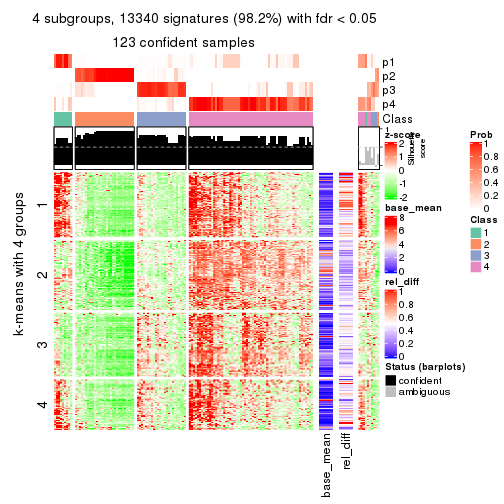</p>

</div>
<div id='tab-SD-hclust-get-signatures-4'>
<pre><code class="r">get_signatures(res, k = 5)
</code></pre>

<p></p>

</div>
<div id='tab-SD-hclust-get-signatures-5'>
<pre><code class="r">get_signatures(res, k = 6)
</code></pre>

<p></p>

</div>
</div>


Signature heatmaps where rows are not scaled:


<script>
$( function() {
	$( '#tabs-SD-hclust-get-signatures-no-scale' ).tabs();
} );
</script>
<div id='tabs-SD-hclust-get-signatures-no-scale'>
<ul>
<li><a href='#tab-SD-hclust-get-signatures-no-scale-1'>k = 2</a></li>
<li><a href='#tab-SD-hclust-get-signatures-no-scale-2'>k = 3</a></li>
<li><a href='#tab-SD-hclust-get-signatures-no-scale-3'>k = 4</a></li>
<li><a href='#tab-SD-hclust-get-signatures-no-scale-4'>k = 5</a></li>
<li><a href='#tab-SD-hclust-get-signatures-no-scale-5'>k = 6</a></li>
</ul>
<div id='tab-SD-hclust-get-signatures-no-scale-1'>
<pre><code class="r">get_signatures(res, k = 2, scale_rows = FALSE)
</code></pre>

<p></p>

</div>
<div id='tab-SD-hclust-get-signatures-no-scale-2'>
<pre><code class="r">get_signatures(res, k = 3, scale_rows = FALSE)
</code></pre>

<p></p>

</div>
<div id='tab-SD-hclust-get-signatures-no-scale-3'>
<pre><code class="r">get_signatures(res, k = 4, scale_rows = FALSE)
</code></pre>

<p></p>

</div>
<div id='tab-SD-hclust-get-signatures-no-scale-4'>
<pre><code class="r">get_signatures(res, k = 5, scale_rows = FALSE)
</code></pre>

<p></p>

</div>
<div id='tab-SD-hclust-get-signatures-no-scale-5'>
<pre><code class="r">get_signatures(res, k = 6, scale_rows = FALSE)
</code></pre>

<p></p>

</div>
</div>


Compare the overlap of signatures from different k:

```r
compare_signatures(res)
```


`get_signature()` returns a data frame invisibly. TO get the list of signatures, the function
call should be assigned to a variable explicitly. In following code, if `plot` argument is set
to `FALSE`, no heatmap is plotted while only the differential analysis is performed.

```r
# code only for demonstration
tb = get_signature(res, k = ..., plot = FALSE)
```

An example of the output of `tb` is:

```
#>   which_row         fdr    mean_1    mean_2 scaled_mean_1 scaled_mean_2 km
#> 1        38 0.042760348  8.373488  9.131774    -0.5533452     0.5164555  1
#> 2        40 0.018707592  7.106213  8.469186    -0.6173731     0.5762149  1
#> 3        55 0.019134737 10.221463 11.207825    -0.6159697     0.5749050  1
#> 4        59 0.006059896  5.921854  7.869574    -0.6899429     0.6439467  1
#> 5        60 0.018055526  8.928898 10.211722    -0.6204761     0.5791110  1
#> 6        98 0.009384629 15.714769 14.887706     0.6635654    -0.6193277  2
...
```

The columns in `tb` are:

1. `which_row`: row indices corresponding to the input matrix.
2. `fdr`: FDR for the differential test. 
3. `mean_x`: The mean value in group x.
4. `scaled_mean_x`: The mean value in group x after rows are scaled.
5. `km`: Row groups if k-means clustering is applied to rows.


UMAP plot which shows how samples are separated.


<script>
$( function() {
	$( '#tabs-SD-hclust-dimension-reduction' ).tabs();
} );
</script>
<div id='tabs-SD-hclust-dimension-reduction'>
<ul>
<li><a href='#tab-SD-hclust-dimension-reduction-1'>k = 2</a></li>
<li><a href='#tab-SD-hclust-dimension-reduction-2'>k = 3</a></li>
<li><a href='#tab-SD-hclust-dimension-reduction-3'>k = 4</a></li>
<li><a href='#tab-SD-hclust-dimension-reduction-4'>k = 5</a></li>
<li><a href='#tab-SD-hclust-dimension-reduction-5'>k = 6</a></li>
</ul>
<div id='tab-SD-hclust-dimension-reduction-1'>
<pre><code class="r">dimension_reduction(res, k = 2, method = &quot;UMAP&quot;)
</code></pre>

<p>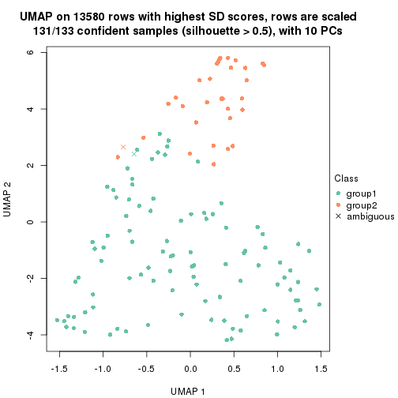</p>

</div>
<div id='tab-SD-hclust-dimension-reduction-2'>
<pre><code class="r">dimension_reduction(res, k = 3, method = &quot;UMAP&quot;)
</code></pre>

<p></p>

</div>
<div id='tab-SD-hclust-dimension-reduction-3'>
<pre><code class="r">dimension_reduction(res, k = 4, method = &quot;UMAP&quot;)
</code></pre>

<p></p>

</div>
<div id='tab-SD-hclust-dimension-reduction-4'>
<pre><code class="r">dimension_reduction(res, k = 5, method = &quot;UMAP&quot;)
</code></pre>

<p>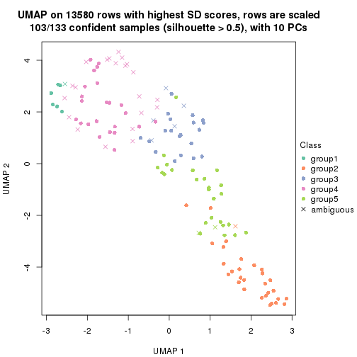</p>

</div>
<div id='tab-SD-hclust-dimension-reduction-5'>
<pre><code class="r">dimension_reduction(res, k = 6, method = &quot;UMAP&quot;)
</code></pre>

<p></p>

</div>
</div>


Following heatmap shows how subgroups are split when increasing `k`:

```r
collect_classes(res)
```


If matrix rows can be associated to genes, consider to use `functional_enrichment(res,
...)` to perform function enrichment for the signature genes. See [this vignette](http://bioconductor.org/packages/devel/bioc/vignettes/cola/inst/doc/functional_enrichment.html) for more detailed explanations.


 

---------------------------------------------------


### SD:kmeans**


The object with results only for a single top-value method and a single partition method 
can be extracted as:

```r
res = res_list["SD", "kmeans"]
# you can also extract it by
# res = res_list["SD:kmeans"]
```

A summary of `res` and all the functions that can be applied to it:

```r
res
```

```
#> A 'ConsensusPartition' object with k = 2, 3, 4, 5, 6.
#>   On a matrix with 13580 rows and 133 columns.
#>   Top rows (1000, 2000, 3000, 4000, 5000) are extracted by 'SD' method.
#>   Subgroups are detected by 'kmeans' method.
#>   Performed in total 1250 partitions by row resampling.
#>   Best k for subgroups seems to be 2.
#> 
#> Following methods can be applied to this 'ConsensusPartition' object:
#>  [1] "cola_report"             "collect_classes"         "collect_plots"          
#>  [4] "collect_stats"           "colnames"                "compare_signatures"     
#>  [7] "consensus_heatmap"       "dimension_reduction"     "functional_enrichment"  
#> [10] "get_anno_col"            "get_anno"                "get_classes"            
#> [13] "get_consensus"           "get_matrix"              "get_membership"         
#> [16] "get_param"               "get_signatures"          "get_stats"              
#> [19] "is_best_k"               "is_stable_k"             "membership_heatmap"     
#> [22] "ncol"                    "nrow"                    "plot_ecdf"              
#> [25] "rownames"                "select_partition_number" "show"                   
#> [28] "suggest_best_k"          "test_to_known_factors"
```

`collect_plots()` function collects all the plots made from `res` for all `k` (number of partitions)
into one single page to provide an easy and fast comparison between different `k`.

```r
collect_plots(res)
```


The plots are:

- The first row: a plot of the ECDF (empirical cumulative distribution
  function) curves of the consensus matrix for each `k` and the heatmap of
  predicted classes for each `k`.
- The second row: heatmaps of the consensus matrix for each `k`.
- The third row: heatmaps of the membership matrix for each `k`.
- The fouth row: heatmaps of the signatures for each `k`.

All the plots in panels can be made by individual functions and they are
plotted later in this section.

`select_partition_number()` produces several plots showing different
statistics for choosing "optimized" `k`. There are following statistics:

- ECDF curves of the consensus matrix for each `k`;
- 1-PAC. [The PAC
  score](https://en.wikipedia.org/wiki/Consensus_clustering#Over-interpretation_potential_of_consensus_clustering)
  measures the proportion of the ambiguous subgrouping.
- Mean silhouette score.
- Concordance. The mean probability of fiting the consensus class ids in all
  partitions.
- Area increased. Denote $A_k$ as the area under the ECDF curve for current
  `k`, the area increased is defined as $A_k - A_{k-1}$.
- Rand index. The percent of pairs of samples that are both in a same cluster
  or both are not in a same cluster in the partition of k and k-1.
- Jaccard index. The ratio of pairs of samples are both in a same cluster in
  the partition of k and k-1 and the pairs of samples are both in a same
  cluster in the partition k or k-1.

The detailed explanations of these statistics can be found in [the _cola_
vignette](http://bioconductor.org/packages/devel/bioc/vignettes/cola/inst/doc/cola.html#toc_13).

Generally speaking, lower PAC score, higher mean silhouette score or higher
concordance corresponds to better partition. Rand index and Jaccard index
measure how similar the current partition is compared to partition with `k-1`.
If they are too similar, we won't accept `k` is better than `k-1`.

```r
select_partition_number(res)
```


The numeric values for all these statistics can be obtained by `get_stats()`.

```r
get_stats(res)
```

```
#>   k 1-PAC mean_silhouette concordance area_increased  Rand Jaccard
#> 2 2 0.999           0.964       0.985         0.4547 0.554   0.554
#> 3 3 0.859           0.875       0.936         0.3896 0.721   0.535
#> 4 4 0.724           0.846       0.899         0.1747 0.798   0.508
#> 5 5 0.716           0.703       0.827         0.0705 0.896   0.624
#> 6 6 0.781           0.691       0.836         0.0389 0.929   0.680
```

`suggest_best_k()` suggests the best $k$ based on these statistics. The rules are as follows:

- All $k$ with Jaccard index larger than 0.95 are removed because increasing
  $k$ does not provide enough extra information. If all $k$ are removed, it is
  marked as no subgroup is detected.
- For all $k$ with 1-PAC score larger than 0.9, the maximal $k$ is taken as
  the best $k$, and other $k$ are marked as optional $k$.
- If it does not fit the second rule. The $k$ with the maximal vote of the
  highest 1-PAC score, highest mean silhouette, and highest concordance is
  taken as the best $k$.

```r
suggest_best_k(res)
```

```
#> [1] 2
```


Following shows the table of the partitions (You need to click the **show/hide
code output** link to see it). The membership matrix (columns with name `p*`)
is inferred by
[`clue::cl_consensus()`](https://www.rdocumentation.org/link/cl_consensus?package=clue)
function with the `SE` method. Basically the value in the membership matrix
represents the probability to belong to a certain group. The finall class
label for an item is determined with the group with highest probability it
belongs to.

In `get_classes()` function, the entropy is calculated from the membership
matrix and the silhouette score is calculated from the consensus matrix.


<script>
$( function() {
	$( '#tabs-SD-kmeans-get-classes' ).tabs();
} );
</script>
<div id='tabs-SD-kmeans-get-classes'>
<ul>
<li><a href='#tab-SD-kmeans-get-classes-1'>k = 2</a></li>
<li><a href='#tab-SD-kmeans-get-classes-2'>k = 3</a></li>
<li><a href='#tab-SD-kmeans-get-classes-3'>k = 4</a></li>
<li><a href='#tab-SD-kmeans-get-classes-4'>k = 5</a></li>
<li><a href='#tab-SD-kmeans-get-classes-5'>k = 6</a></li>
</ul>

<div id='tab-SD-kmeans-get-classes-1'>
<p><a id='tab-SD-kmeans-get-classes-1-a' style='color:#0366d6' href='#'>show/hide code output</a></p>
<pre><code class="r">cbind(get_classes(res, k = 2), get_membership(res, k = 2))
</code></pre>

<pre><code>#&gt;            class entropy silhouette    p1    p2
#&gt; SRR1951667     2  0.0000      0.996 0.000 1.000
#&gt; SRR1951666     2  0.0000      0.996 0.000 1.000
#&gt; SRR1951665     2  0.0000      0.996 0.000 1.000
#&gt; SRR1951664     1  0.0000      0.978 1.000 0.000
#&gt; SRR1951663     1  0.0000      0.978 1.000 0.000
#&gt; SRR1951662     2  0.0000      0.996 0.000 1.000
#&gt; SRR1951661     1  0.8713      0.606 0.708 0.292
#&gt; SRR1951660     1  0.0000      0.978 1.000 0.000
#&gt; SRR1951659     2  0.0000      0.996 0.000 1.000
#&gt; SRR1951658     2  0.0000      0.996 0.000 1.000
#&gt; SRR1951657     1  0.0000      0.978 1.000 0.000
#&gt; SRR1951656     1  0.0000      0.978 1.000 0.000
#&gt; SRR1951655     1  0.0000      0.978 1.000 0.000
#&gt; SRR1951654     1  0.0000      0.978 1.000 0.000
#&gt; SRR1951653     1  0.0000      0.978 1.000 0.000
#&gt; SRR1951652     2  0.0000      0.996 0.000 1.000
#&gt; SRR1951651     1  0.0000      0.978 1.000 0.000
#&gt; SRR1951650     1  0.0000      0.978 1.000 0.000
#&gt; SRR1951648     2  0.0000      0.996 0.000 1.000
#&gt; SRR1951649     1  0.0000      0.978 1.000 0.000
#&gt; SRR1951647     1  0.0000      0.978 1.000 0.000
#&gt; SRR1951646     1  0.0000      0.978 1.000 0.000
#&gt; SRR1951645     1  0.0000      0.978 1.000 0.000
#&gt; SRR1951644     1  0.0000      0.978 1.000 0.000
#&gt; SRR1951643     1  0.0000      0.978 1.000 0.000
#&gt; SRR1951641     2  0.0000      0.996 0.000 1.000
#&gt; SRR1951642     1  0.0000      0.978 1.000 0.000
#&gt; SRR1951694     1  0.0000      0.978 1.000 0.000
#&gt; SRR1951731     1  0.0000      0.978 1.000 0.000
#&gt; SRR1951730     2  0.0000      0.996 0.000 1.000
#&gt; SRR1951752     2  0.0938      0.985 0.012 0.988
#&gt; SRR1951751     1  0.0000      0.978 1.000 0.000
#&gt; SRR1951749     2  0.0000      0.996 0.000 1.000
#&gt; SRR1951750     1  0.0000      0.978 1.000 0.000
#&gt; SRR1951748     2  0.0000      0.996 0.000 1.000
#&gt; SRR1951747     2  0.0000      0.996 0.000 1.000
#&gt; SRR1951745     1  0.0000      0.978 1.000 0.000
#&gt; SRR1951746     2  0.0000      0.996 0.000 1.000
#&gt; SRR1951744     1  0.0000      0.978 1.000 0.000
#&gt; SRR1951742     2  0.0000      0.996 0.000 1.000
#&gt; SRR1951743     2  0.0000      0.996 0.000 1.000
#&gt; SRR1951741     1  0.0000      0.978 1.000 0.000
#&gt; SRR1951740     1  0.0000      0.978 1.000 0.000
#&gt; SRR1951738     2  0.0000      0.996 0.000 1.000
#&gt; SRR1951739     2  0.0000      0.996 0.000 1.000
#&gt; SRR1951737     1  0.0000      0.978 1.000 0.000
#&gt; SRR1951736     1  0.0000      0.978 1.000 0.000
#&gt; SRR1951734     2  0.0000      0.996 0.000 1.000
#&gt; SRR1951735     1  0.0000      0.978 1.000 0.000
#&gt; SRR1951733     2  0.0000      0.996 0.000 1.000
#&gt; SRR1951732     2  0.0000      0.996 0.000 1.000
#&gt; SRR1951729     1  0.0000      0.978 1.000 0.000
#&gt; SRR1951728     1  0.0000      0.978 1.000 0.000
#&gt; SRR1951727     2  0.0000      0.996 0.000 1.000
#&gt; SRR1951725     1  0.0000      0.978 1.000 0.000
#&gt; SRR1951726     1  0.9635      0.396 0.612 0.388
#&gt; SRR1951724     1  0.0000      0.978 1.000 0.000
#&gt; SRR1951722     1  0.0000      0.978 1.000 0.000
#&gt; SRR1951723     1  0.0000      0.978 1.000 0.000
#&gt; SRR1951721     2  0.2043      0.966 0.032 0.968
#&gt; SRR1951719     1  0.0000      0.978 1.000 0.000
#&gt; SRR1951720     1  0.0000      0.978 1.000 0.000
#&gt; SRR1951718     1  0.0000      0.978 1.000 0.000
#&gt; SRR1951717     1  0.0000      0.978 1.000 0.000
#&gt; SRR1951715     1  0.0000      0.978 1.000 0.000
#&gt; SRR1951716     1  0.0000      0.978 1.000 0.000
#&gt; SRR1951714     1  0.0000      0.978 1.000 0.000
#&gt; SRR1951713     1  0.0000      0.978 1.000 0.000
#&gt; SRR1951712     1  0.0000      0.978 1.000 0.000
#&gt; SRR1951711     2  0.0000      0.996 0.000 1.000
#&gt; SRR1951710     1  0.0000      0.978 1.000 0.000
#&gt; SRR1951709     2  0.0000      0.996 0.000 1.000
#&gt; SRR1951708     2  0.0000      0.996 0.000 1.000
#&gt; SRR1951707     1  0.0000      0.978 1.000 0.000
#&gt; SRR1951705     1  0.0000      0.978 1.000 0.000
#&gt; SRR1951704     1  0.4022      0.905 0.920 0.080
#&gt; SRR1951703     2  0.0000      0.996 0.000 1.000
#&gt; SRR1951706     1  0.9710      0.366 0.600 0.400
#&gt; SRR1951702     1  0.4161      0.900 0.916 0.084
#&gt; SRR1951701     2  0.0000      0.996 0.000 1.000
#&gt; SRR1951699     2  0.0000      0.996 0.000 1.000
#&gt; SRR1951698     1  0.4161      0.900 0.916 0.084
#&gt; SRR1951700     1  0.0000      0.978 1.000 0.000
#&gt; SRR1951697     2  0.0000      0.996 0.000 1.000
#&gt; SRR1951696     1  0.0000      0.978 1.000 0.000
#&gt; SRR1951695     1  0.0000      0.978 1.000 0.000
#&gt; SRR1951693     1  0.0000      0.978 1.000 0.000
#&gt; SRR1951692     1  0.0000      0.978 1.000 0.000
#&gt; SRR1951691     1  0.0000      0.978 1.000 0.000
#&gt; SRR1951688     2  0.0000      0.996 0.000 1.000
#&gt; SRR1951689     2  0.0000      0.996 0.000 1.000
#&gt; SRR1951687     1  0.0000      0.978 1.000 0.000
#&gt; SRR1951685     1  0.9710      0.335 0.600 0.400
#&gt; SRR1951684     1  0.0000      0.978 1.000 0.000
#&gt; SRR1951686     2  0.0000      0.996 0.000 1.000
#&gt; SRR1951683     1  0.0000      0.978 1.000 0.000
#&gt; SRR1951682     2  0.0000      0.996 0.000 1.000
#&gt; SRR1951690     2  0.0000      0.996 0.000 1.000
#&gt; SRR1951680     1  0.0000      0.978 1.000 0.000
#&gt; SRR1951679     1  0.0000      0.978 1.000 0.000
#&gt; SRR1951678     1  0.0000      0.978 1.000 0.000
#&gt; SRR1951677     1  0.0000      0.978 1.000 0.000
#&gt; SRR1951676     1  0.0000      0.978 1.000 0.000
#&gt; SRR1951675     2  0.0000      0.996 0.000 1.000
#&gt; SRR1951681     1  0.0000      0.978 1.000 0.000
#&gt; SRR1951673     2  0.3114      0.941 0.056 0.944
#&gt; SRR1951674     1  0.0000      0.978 1.000 0.000
#&gt; SRR1951672     1  0.0000      0.978 1.000 0.000
#&gt; SRR1951671     2  0.0000      0.996 0.000 1.000
#&gt; SRR1951670     1  0.0000      0.978 1.000 0.000
#&gt; SRR1951640     1  0.0000      0.978 1.000 0.000
#&gt; SRR1951668     1  0.0000      0.978 1.000 0.000
#&gt; SRR1951669     2  0.0000      0.996 0.000 1.000
#&gt; SRR1951638     1  0.0000      0.978 1.000 0.000
#&gt; SRR1951637     2  0.0000      0.996 0.000 1.000
#&gt; SRR1951635     1  0.0000      0.978 1.000 0.000
#&gt; SRR1951634     1  0.0000      0.978 1.000 0.000
#&gt; SRR1951631     1  0.0000      0.978 1.000 0.000
#&gt; SRR1951632     2  0.0000      0.996 0.000 1.000
#&gt; SRR1951633     1  0.0000      0.978 1.000 0.000
#&gt; SRR1951630     1  0.0000      0.978 1.000 0.000
#&gt; SRR1951629     1  0.0000      0.978 1.000 0.000
#&gt; SRR1951628     1  0.0000      0.978 1.000 0.000
#&gt; SRR1951627     2  0.0000      0.996 0.000 1.000
#&gt; SRR1951639     1  0.3879      0.909 0.924 0.076
#&gt; SRR1951625     2  0.3274      0.937 0.060 0.940
#&gt; SRR1951626     1  0.0000      0.978 1.000 0.000
#&gt; SRR1951624     1  0.0000      0.978 1.000 0.000
#&gt; SRR1951622     1  0.0000      0.978 1.000 0.000
#&gt; SRR1951636     1  0.0000      0.978 1.000 0.000
#&gt; SRR1951623     1  0.4022      0.905 0.920 0.080
#&gt; SRR1951621     1  0.0000      0.978 1.000 0.000
#&gt; SRR1951620     1  0.0000      0.978 1.000 0.000
</code></pre>

<script>
$('#tab-SD-kmeans-get-classes-1-a').parent().next().next().hide();
$('#tab-SD-kmeans-get-classes-1-a').click(function(){
  $('#tab-SD-kmeans-get-classes-1-a').parent().next().next().toggle();
  return(false);
});
</script>
</div>

<div id='tab-SD-kmeans-get-classes-2'>
<p><a id='tab-SD-kmeans-get-classes-2-a' style='color:#0366d6' href='#'>show/hide code output</a></p>
<pre><code class="r">cbind(get_classes(res, k = 3), get_membership(res, k = 3))
</code></pre>

<pre><code>#&gt;            class entropy silhouette    p1    p2    p3
#&gt; SRR1951667     2  0.0000      0.950 0.000 1.000 0.000
#&gt; SRR1951666     3  0.4654      0.714 0.000 0.208 0.792
#&gt; SRR1951665     2  0.0000      0.950 0.000 1.000 0.000
#&gt; SRR1951664     1  0.0424      0.947 0.992 0.000 0.008
#&gt; SRR1951663     3  0.1289      0.857 0.032 0.000 0.968
#&gt; SRR1951662     2  0.0000      0.950 0.000 1.000 0.000
#&gt; SRR1951661     3  0.2173      0.877 0.048 0.008 0.944
#&gt; SRR1951660     1  0.1964      0.939 0.944 0.000 0.056
#&gt; SRR1951659     2  0.0000      0.950 0.000 1.000 0.000
#&gt; SRR1951658     2  0.0000      0.950 0.000 1.000 0.000
#&gt; SRR1951657     1  0.0237      0.949 0.996 0.000 0.004
#&gt; SRR1951656     1  0.0237      0.949 0.996 0.000 0.004
#&gt; SRR1951655     1  0.1529      0.944 0.960 0.000 0.040
#&gt; SRR1951654     1  0.1964      0.939 0.944 0.000 0.056
#&gt; SRR1951653     1  0.0237      0.949 0.996 0.000 0.004
#&gt; SRR1951652     3  0.2066      0.873 0.000 0.060 0.940
#&gt; SRR1951651     1  0.0237      0.949 0.996 0.000 0.004
#&gt; SRR1951650     1  0.5058      0.660 0.756 0.000 0.244
#&gt; SRR1951648     3  0.2280      0.876 0.008 0.052 0.940
#&gt; SRR1951649     1  0.1289      0.946 0.968 0.000 0.032
#&gt; SRR1951647     3  0.2537      0.862 0.080 0.000 0.920
#&gt; SRR1951646     1  0.3116      0.857 0.892 0.000 0.108
#&gt; SRR1951645     1  0.1529      0.944 0.960 0.000 0.040
#&gt; SRR1951644     1  0.1964      0.939 0.944 0.000 0.056
#&gt; SRR1951643     1  0.0237      0.949 0.996 0.000 0.004
#&gt; SRR1951641     2  0.0000      0.950 0.000 1.000 0.000
#&gt; SRR1951642     1  0.0237      0.949 0.996 0.000 0.004
#&gt; SRR1951694     3  0.4605      0.704 0.204 0.000 0.796
#&gt; SRR1951731     3  0.1753      0.877 0.048 0.000 0.952
#&gt; SRR1951730     3  0.2066      0.873 0.000 0.060 0.940
#&gt; SRR1951752     3  0.1964      0.874 0.000 0.056 0.944
#&gt; SRR1951751     1  0.1860      0.941 0.948 0.000 0.052
#&gt; SRR1951749     3  0.2066      0.873 0.000 0.060 0.940
#&gt; SRR1951750     1  0.1753      0.942 0.952 0.000 0.048
#&gt; SRR1951748     2  0.0000      0.950 0.000 1.000 0.000
#&gt; SRR1951747     2  0.0000      0.950 0.000 1.000 0.000
#&gt; SRR1951745     3  0.0424      0.869 0.008 0.000 0.992
#&gt; SRR1951746     2  0.0000      0.950 0.000 1.000 0.000
#&gt; SRR1951744     3  0.5465      0.617 0.288 0.000 0.712
#&gt; SRR1951742     2  0.5968      0.443 0.000 0.636 0.364
#&gt; SRR1951743     2  0.0000      0.950 0.000 1.000 0.000
#&gt; SRR1951741     1  0.1411      0.944 0.964 0.000 0.036
#&gt; SRR1951740     1  0.0237      0.949 0.996 0.000 0.004
#&gt; SRR1951738     2  0.1753      0.914 0.000 0.952 0.048
#&gt; SRR1951739     2  0.0000      0.950 0.000 1.000 0.000
#&gt; SRR1951737     1  0.1411      0.929 0.964 0.000 0.036
#&gt; SRR1951736     1  0.1964      0.939 0.944 0.000 0.056
#&gt; SRR1951734     2  0.0000      0.950 0.000 1.000 0.000
#&gt; SRR1951735     1  0.3267      0.848 0.884 0.000 0.116
#&gt; SRR1951733     3  0.2066      0.873 0.000 0.060 0.940
#&gt; SRR1951732     2  0.0000      0.950 0.000 1.000 0.000
#&gt; SRR1951729     1  0.1411      0.929 0.964 0.000 0.036
#&gt; SRR1951728     3  0.1529      0.879 0.040 0.000 0.960
#&gt; SRR1951727     2  0.0000      0.950 0.000 1.000 0.000
#&gt; SRR1951725     1  0.6286      0.126 0.536 0.000 0.464
#&gt; SRR1951726     3  0.0983      0.876 0.004 0.016 0.980
#&gt; SRR1951724     1  0.1860      0.941 0.948 0.000 0.052
#&gt; SRR1951722     3  0.5785      0.579 0.332 0.000 0.668
#&gt; SRR1951723     1  0.0424      0.949 0.992 0.000 0.008
#&gt; SRR1951721     3  0.0237      0.871 0.000 0.004 0.996
#&gt; SRR1951719     1  0.0237      0.949 0.996 0.000 0.004
#&gt; SRR1951720     1  0.1964      0.939 0.944 0.000 0.056
#&gt; SRR1951718     1  0.1964      0.939 0.944 0.000 0.056
#&gt; SRR1951717     1  0.1964      0.939 0.944 0.000 0.056
#&gt; SRR1951715     3  0.4555      0.708 0.200 0.000 0.800
#&gt; SRR1951716     1  0.1964      0.939 0.944 0.000 0.056
#&gt; SRR1951714     1  0.0237      0.949 0.996 0.000 0.004
#&gt; SRR1951713     1  0.0237      0.949 0.996 0.000 0.004
#&gt; SRR1951712     1  0.1860      0.941 0.948 0.000 0.052
#&gt; SRR1951711     2  0.0000      0.950 0.000 1.000 0.000
#&gt; SRR1951710     3  0.6140      0.332 0.404 0.000 0.596
#&gt; SRR1951709     3  0.2066      0.873 0.000 0.060 0.940
#&gt; SRR1951708     2  0.0000      0.950 0.000 1.000 0.000
#&gt; SRR1951707     3  0.1529      0.879 0.040 0.000 0.960
#&gt; SRR1951705     1  0.1964      0.939 0.944 0.000 0.056
#&gt; SRR1951704     3  0.1529      0.879 0.040 0.000 0.960
#&gt; SRR1951703     2  0.0000      0.950 0.000 1.000 0.000
#&gt; SRR1951706     3  0.2443      0.879 0.028 0.032 0.940
#&gt; SRR1951702     3  0.1529      0.879 0.040 0.000 0.960
#&gt; SRR1951701     2  0.0000      0.950 0.000 1.000 0.000
#&gt; SRR1951699     3  0.2280      0.876 0.008 0.052 0.940
#&gt; SRR1951698     3  0.1964      0.875 0.056 0.000 0.944
#&gt; SRR1951700     1  0.0892      0.947 0.980 0.000 0.020
#&gt; SRR1951697     2  0.0000      0.950 0.000 1.000 0.000
#&gt; SRR1951696     1  0.1289      0.932 0.968 0.000 0.032
#&gt; SRR1951695     1  0.0237      0.949 0.996 0.000 0.004
#&gt; SRR1951693     1  0.0892      0.947 0.980 0.000 0.020
#&gt; SRR1951692     1  0.0237      0.949 0.996 0.000 0.004
#&gt; SRR1951691     1  0.1753      0.942 0.952 0.000 0.048
#&gt; SRR1951688     2  0.5926      0.459 0.000 0.644 0.356
#&gt; SRR1951689     3  0.2066      0.873 0.000 0.060 0.940
#&gt; SRR1951687     1  0.1643      0.943 0.956 0.000 0.044
#&gt; SRR1951685     3  0.1781      0.881 0.020 0.020 0.960
#&gt; SRR1951684     1  0.0237      0.949 0.996 0.000 0.004
#&gt; SRR1951686     2  0.1860      0.909 0.000 0.948 0.052
#&gt; SRR1951683     1  0.0000      0.949 1.000 0.000 0.000
#&gt; SRR1951682     2  0.0000      0.950 0.000 1.000 0.000
#&gt; SRR1951690     2  0.0000      0.950 0.000 1.000 0.000
#&gt; SRR1951680     1  0.0237      0.949 0.996 0.000 0.004
#&gt; SRR1951679     3  0.6225      0.247 0.432 0.000 0.568
#&gt; SRR1951678     1  0.0237      0.949 0.996 0.000 0.004
#&gt; SRR1951677     1  0.0237      0.949 0.996 0.000 0.004
#&gt; SRR1951676     1  0.4555      0.731 0.800 0.000 0.200
#&gt; SRR1951675     2  0.0000      0.950 0.000 1.000 0.000
#&gt; SRR1951681     1  0.5497      0.568 0.708 0.000 0.292
#&gt; SRR1951673     3  0.1964      0.874 0.000 0.056 0.944
#&gt; SRR1951674     3  0.0424      0.869 0.008 0.000 0.992
#&gt; SRR1951672     1  0.1964      0.939 0.944 0.000 0.056
#&gt; SRR1951671     3  0.2066      0.873 0.000 0.060 0.940
#&gt; SRR1951670     1  0.1411      0.944 0.964 0.000 0.036
#&gt; SRR1951640     1  0.0237      0.949 0.996 0.000 0.004
#&gt; SRR1951668     1  0.0237      0.949 0.996 0.000 0.004
#&gt; SRR1951669     2  0.1753      0.914 0.000 0.952 0.048
#&gt; SRR1951638     1  0.1964      0.939 0.944 0.000 0.056
#&gt; SRR1951637     3  0.2165      0.870 0.000 0.064 0.936
#&gt; SRR1951635     1  0.1964      0.939 0.944 0.000 0.056
#&gt; SRR1951634     1  0.0000      0.949 1.000 0.000 0.000
#&gt; SRR1951631     1  0.0237      0.949 0.996 0.000 0.004
#&gt; SRR1951632     2  0.6079      0.387 0.000 0.612 0.388
#&gt; SRR1951633     1  0.0237      0.949 0.996 0.000 0.004
#&gt; SRR1951630     1  0.0237      0.949 0.996 0.000 0.004
#&gt; SRR1951629     1  0.0237      0.949 0.996 0.000 0.004
#&gt; SRR1951628     3  0.5785      0.507 0.332 0.000 0.668
#&gt; SRR1951627     3  0.2383      0.878 0.016 0.044 0.940
#&gt; SRR1951639     3  0.1964      0.875 0.056 0.000 0.944
#&gt; SRR1951625     3  0.1964      0.874 0.000 0.056 0.944
#&gt; SRR1951626     3  0.1964      0.875 0.056 0.000 0.944
#&gt; SRR1951624     1  0.3941      0.796 0.844 0.000 0.156
#&gt; SRR1951622     1  0.1964      0.939 0.944 0.000 0.056
#&gt; SRR1951636     3  0.1964      0.875 0.056 0.000 0.944
#&gt; SRR1951623     3  0.5138      0.685 0.252 0.000 0.748
#&gt; SRR1951621     1  0.1411      0.944 0.964 0.000 0.036
#&gt; SRR1951620     1  0.0237      0.949 0.996 0.000 0.004
</code></pre>

<script>
$('#tab-SD-kmeans-get-classes-2-a').parent().next().next().hide();
$('#tab-SD-kmeans-get-classes-2-a').click(function(){
  $('#tab-SD-kmeans-get-classes-2-a').parent().next().next().toggle();
  return(false);
});
</script>
</div>

<div id='tab-SD-kmeans-get-classes-3'>
<p><a id='tab-SD-kmeans-get-classes-3-a' style='color:#0366d6' href='#'>show/hide code output</a></p>
<pre><code class="r">cbind(get_classes(res, k = 4), get_membership(res, k = 4))
</code></pre>

<pre><code>#&gt;            class entropy silhouette    p1    p2    p3    p4
#&gt; SRR1951667     2  0.0188      0.981 0.000 0.996 0.004 0.000
#&gt; SRR1951666     3  0.1474      0.899 0.000 0.052 0.948 0.000
#&gt; SRR1951665     2  0.0000      0.984 0.000 1.000 0.000 0.000
#&gt; SRR1951664     4  0.2843      0.822 0.020 0.000 0.088 0.892
#&gt; SRR1951663     1  0.2704      0.756 0.876 0.000 0.124 0.000
#&gt; SRR1951662     2  0.0000      0.984 0.000 1.000 0.000 0.000
#&gt; SRR1951661     3  0.0524      0.917 0.004 0.000 0.988 0.008
#&gt; SRR1951660     1  0.2868      0.836 0.864 0.000 0.000 0.136
#&gt; SRR1951659     2  0.0000      0.984 0.000 1.000 0.000 0.000
#&gt; SRR1951658     2  0.0000      0.984 0.000 1.000 0.000 0.000
#&gt; SRR1951657     4  0.0707      0.878 0.020 0.000 0.000 0.980
#&gt; SRR1951656     4  0.0707      0.878 0.020 0.000 0.000 0.980
#&gt; SRR1951655     1  0.4761      0.524 0.628 0.000 0.000 0.372
#&gt; SRR1951654     1  0.2814      0.825 0.868 0.000 0.000 0.132
#&gt; SRR1951653     4  0.1557      0.878 0.056 0.000 0.000 0.944
#&gt; SRR1951652     3  0.1389      0.906 0.048 0.000 0.952 0.000
#&gt; SRR1951651     4  0.2408      0.869 0.104 0.000 0.000 0.896
#&gt; SRR1951650     4  0.4361      0.697 0.020 0.000 0.208 0.772
#&gt; SRR1951648     3  0.0188      0.918 0.000 0.000 0.996 0.004
#&gt; SRR1951649     1  0.4431      0.688 0.696 0.000 0.000 0.304
#&gt; SRR1951647     3  0.3280      0.837 0.016 0.000 0.860 0.124
#&gt; SRR1951646     4  0.2174      0.842 0.020 0.000 0.052 0.928
#&gt; SRR1951645     1  0.4356      0.702 0.708 0.000 0.000 0.292
#&gt; SRR1951644     1  0.2760      0.837 0.872 0.000 0.000 0.128
#&gt; SRR1951643     4  0.2408      0.869 0.104 0.000 0.000 0.896
#&gt; SRR1951641     2  0.0000      0.984 0.000 1.000 0.000 0.000
#&gt; SRR1951642     4  0.2281      0.873 0.096 0.000 0.000 0.904
#&gt; SRR1951694     1  0.2216      0.781 0.908 0.000 0.092 0.000
#&gt; SRR1951731     3  0.1677      0.902 0.012 0.000 0.948 0.040
#&gt; SRR1951730     3  0.1389      0.906 0.048 0.000 0.952 0.000
#&gt; SRR1951752     3  0.1302      0.907 0.044 0.000 0.956 0.000
#&gt; SRR1951751     1  0.3975      0.763 0.760 0.000 0.000 0.240
#&gt; SRR1951749     3  0.0000      0.918 0.000 0.000 1.000 0.000
#&gt; SRR1951750     4  0.4624      0.516 0.340 0.000 0.000 0.660
#&gt; SRR1951748     2  0.0000      0.984 0.000 1.000 0.000 0.000
#&gt; SRR1951747     2  0.0000      0.984 0.000 1.000 0.000 0.000
#&gt; SRR1951745     1  0.3873      0.640 0.772 0.000 0.228 0.000
#&gt; SRR1951746     2  0.0000      0.984 0.000 1.000 0.000 0.000
#&gt; SRR1951744     1  0.7134      0.422 0.532 0.000 0.312 0.156
#&gt; SRR1951742     3  0.3074      0.812 0.000 0.152 0.848 0.000
#&gt; SRR1951743     2  0.0000      0.984 0.000 1.000 0.000 0.000
#&gt; SRR1951741     4  0.3074      0.829 0.152 0.000 0.000 0.848
#&gt; SRR1951740     4  0.1474      0.880 0.052 0.000 0.000 0.948
#&gt; SRR1951738     2  0.3182      0.872 0.028 0.876 0.096 0.000
#&gt; SRR1951739     2  0.1940      0.913 0.000 0.924 0.076 0.000
#&gt; SRR1951737     4  0.2706      0.827 0.020 0.000 0.080 0.900
#&gt; SRR1951736     1  0.2408      0.837 0.896 0.000 0.000 0.104
#&gt; SRR1951734     2  0.0000      0.984 0.000 1.000 0.000 0.000
#&gt; SRR1951735     4  0.3037      0.814 0.020 0.000 0.100 0.880
#&gt; SRR1951733     3  0.0000      0.918 0.000 0.000 1.000 0.000
#&gt; SRR1951732     2  0.0000      0.984 0.000 1.000 0.000 0.000
#&gt; SRR1951729     4  0.2843      0.822 0.020 0.000 0.088 0.892
#&gt; SRR1951728     3  0.2174      0.894 0.020 0.000 0.928 0.052
#&gt; SRR1951727     2  0.0000      0.984 0.000 1.000 0.000 0.000
#&gt; SRR1951725     1  0.0817      0.819 0.976 0.000 0.024 0.000
#&gt; SRR1951726     3  0.1474      0.905 0.052 0.000 0.948 0.000
#&gt; SRR1951724     1  0.2345      0.841 0.900 0.000 0.000 0.100
#&gt; SRR1951722     1  0.5167      0.778 0.760 0.000 0.108 0.132
#&gt; SRR1951723     1  0.4564      0.669 0.672 0.000 0.000 0.328
#&gt; SRR1951721     1  0.3764      0.659 0.784 0.000 0.216 0.000
#&gt; SRR1951719     4  0.0707      0.870 0.020 0.000 0.000 0.980
#&gt; SRR1951720     1  0.2216      0.837 0.908 0.000 0.000 0.092
#&gt; SRR1951718     1  0.2868      0.836 0.864 0.000 0.000 0.136
#&gt; SRR1951717     1  0.2408      0.837 0.896 0.000 0.000 0.104
#&gt; SRR1951715     1  0.2469      0.769 0.892 0.000 0.108 0.000
#&gt; SRR1951716     1  0.2760      0.833 0.872 0.000 0.000 0.128
#&gt; SRR1951714     4  0.2011      0.876 0.080 0.000 0.000 0.920
#&gt; SRR1951713     4  0.1792      0.878 0.068 0.000 0.000 0.932
#&gt; SRR1951712     1  0.3975      0.750 0.760 0.000 0.000 0.240
#&gt; SRR1951711     2  0.0000      0.984 0.000 1.000 0.000 0.000
#&gt; SRR1951710     1  0.2002      0.821 0.936 0.000 0.044 0.020
#&gt; SRR1951709     3  0.0000      0.918 0.000 0.000 1.000 0.000
#&gt; SRR1951708     2  0.0000      0.984 0.000 1.000 0.000 0.000
#&gt; SRR1951707     3  0.1913      0.900 0.020 0.000 0.940 0.040
#&gt; SRR1951705     1  0.1743      0.836 0.940 0.000 0.004 0.056
#&gt; SRR1951704     3  0.0817      0.916 0.024 0.000 0.976 0.000
#&gt; SRR1951703     2  0.0000      0.984 0.000 1.000 0.000 0.000
#&gt; SRR1951706     3  0.0707      0.915 0.020 0.000 0.980 0.000
#&gt; SRR1951702     3  0.0376      0.917 0.004 0.000 0.992 0.004
#&gt; SRR1951701     2  0.0000      0.984 0.000 1.000 0.000 0.000
#&gt; SRR1951699     3  0.0188      0.918 0.000 0.000 0.996 0.004
#&gt; SRR1951698     3  0.2867      0.863 0.012 0.000 0.884 0.104
#&gt; SRR1951700     1  0.4072      0.761 0.748 0.000 0.000 0.252
#&gt; SRR1951697     2  0.0000      0.984 0.000 1.000 0.000 0.000
#&gt; SRR1951696     4  0.2089      0.844 0.020 0.000 0.048 0.932
#&gt; SRR1951695     4  0.4374      0.755 0.120 0.000 0.068 0.812
#&gt; SRR1951693     1  0.4193      0.748 0.732 0.000 0.000 0.268
#&gt; SRR1951692     4  0.1637      0.880 0.060 0.000 0.000 0.940
#&gt; SRR1951691     1  0.4193      0.738 0.732 0.000 0.000 0.268
#&gt; SRR1951688     3  0.4711      0.680 0.024 0.236 0.740 0.000
#&gt; SRR1951689     3  0.1474      0.905 0.052 0.000 0.948 0.000
#&gt; SRR1951687     4  0.4522      0.597 0.320 0.000 0.000 0.680
#&gt; SRR1951685     3  0.0592      0.917 0.016 0.000 0.984 0.000
#&gt; SRR1951684     4  0.0336      0.873 0.008 0.000 0.000 0.992
#&gt; SRR1951686     3  0.4193      0.652 0.000 0.268 0.732 0.000
#&gt; SRR1951683     4  0.2530      0.864 0.112 0.000 0.000 0.888
#&gt; SRR1951682     2  0.0188      0.981 0.000 0.996 0.004 0.000
#&gt; SRR1951690     2  0.0000      0.984 0.000 1.000 0.000 0.000
#&gt; SRR1951680     4  0.1557      0.880 0.056 0.000 0.000 0.944
#&gt; SRR1951679     1  0.2089      0.820 0.932 0.000 0.048 0.020
#&gt; SRR1951678     4  0.2281      0.873 0.096 0.000 0.000 0.904
#&gt; SRR1951677     4  0.2281      0.873 0.096 0.000 0.000 0.904
#&gt; SRR1951676     4  0.3658      0.769 0.020 0.000 0.144 0.836
#&gt; SRR1951675     2  0.0000      0.984 0.000 1.000 0.000 0.000
#&gt; SRR1951681     4  0.4284      0.710 0.020 0.000 0.200 0.780
#&gt; SRR1951673     3  0.1474      0.905 0.052 0.000 0.948 0.000
#&gt; SRR1951674     1  0.3837      0.646 0.776 0.000 0.224 0.000
#&gt; SRR1951672     1  0.2814      0.837 0.868 0.000 0.000 0.132
#&gt; SRR1951671     3  0.0376      0.918 0.004 0.004 0.992 0.000
#&gt; SRR1951670     4  0.3726      0.760 0.212 0.000 0.000 0.788
#&gt; SRR1951640     4  0.1297      0.861 0.020 0.000 0.016 0.964
#&gt; SRR1951668     4  0.2469      0.867 0.108 0.000 0.000 0.892
#&gt; SRR1951669     2  0.3907      0.813 0.032 0.828 0.140 0.000
#&gt; SRR1951638     1  0.1867      0.835 0.928 0.000 0.000 0.072
#&gt; SRR1951637     3  0.3198      0.867 0.080 0.040 0.880 0.000
#&gt; SRR1951635     1  0.1389      0.831 0.952 0.000 0.000 0.048
#&gt; SRR1951634     4  0.2469      0.867 0.108 0.000 0.000 0.892
#&gt; SRR1951631     4  0.2408      0.869 0.104 0.000 0.000 0.896
#&gt; SRR1951632     3  0.4164      0.659 0.000 0.264 0.736 0.000
#&gt; SRR1951633     4  0.1716      0.880 0.064 0.000 0.000 0.936
#&gt; SRR1951630     4  0.2281      0.873 0.096 0.000 0.000 0.904
#&gt; SRR1951629     4  0.1389      0.880 0.048 0.000 0.000 0.952
#&gt; SRR1951628     1  0.3398      0.828 0.872 0.000 0.060 0.068
#&gt; SRR1951627     3  0.0336      0.917 0.000 0.000 0.992 0.008
#&gt; SRR1951639     3  0.2222      0.890 0.016 0.000 0.924 0.060
#&gt; SRR1951625     3  0.0188      0.918 0.004 0.000 0.996 0.000
#&gt; SRR1951626     3  0.2987      0.860 0.016 0.000 0.880 0.104
#&gt; SRR1951624     4  0.3099      0.809 0.020 0.000 0.104 0.876
#&gt; SRR1951622     1  0.2760      0.833 0.872 0.000 0.000 0.128
#&gt; SRR1951636     3  0.2867      0.863 0.012 0.000 0.884 0.104
#&gt; SRR1951623     3  0.5256      0.362 0.012 0.000 0.596 0.392
#&gt; SRR1951621     4  0.3486      0.790 0.188 0.000 0.000 0.812
#&gt; SRR1951620     4  0.1174      0.866 0.020 0.000 0.012 0.968
</code></pre>

<script>
$('#tab-SD-kmeans-get-classes-3-a').parent().next().next().hide();
$('#tab-SD-kmeans-get-classes-3-a').click(function(){
  $('#tab-SD-kmeans-get-classes-3-a').parent().next().next().toggle();
  return(false);
});
</script>
</div>

<div id='tab-SD-kmeans-get-classes-4'>
<p><a id='tab-SD-kmeans-get-classes-4-a' style='color:#0366d6' href='#'>show/hide code output</a></p>
<pre><code class="r">cbind(get_classes(res, k = 5), get_membership(res, k = 5))
</code></pre>

<pre><code>#&gt;            class entropy silhouette    p1    p2    p3    p4    p5
#&gt; SRR1951667     2  0.2690     0.8260 0.000 0.844 0.000 0.000 0.156
#&gt; SRR1951666     5  0.1310     0.8436 0.000 0.024 0.020 0.000 0.956
#&gt; SRR1951665     2  0.0000     0.9417 0.000 1.000 0.000 0.000 0.000
#&gt; SRR1951664     3  0.3741     0.6785 0.000 0.000 0.732 0.264 0.004
#&gt; SRR1951663     1  0.5004     0.6480 0.692 0.000 0.216 0.000 0.092
#&gt; SRR1951662     2  0.0000     0.9417 0.000 1.000 0.000 0.000 0.000
#&gt; SRR1951661     5  0.3913     0.6003 0.000 0.000 0.324 0.000 0.676
#&gt; SRR1951660     1  0.2513     0.8001 0.876 0.000 0.008 0.116 0.000
#&gt; SRR1951659     2  0.0000     0.9417 0.000 1.000 0.000 0.000 0.000
#&gt; SRR1951658     2  0.0000     0.9417 0.000 1.000 0.000 0.000 0.000
#&gt; SRR1951657     4  0.2561     0.7178 0.000 0.000 0.144 0.856 0.000
#&gt; SRR1951656     4  0.2230     0.7428 0.000 0.000 0.116 0.884 0.000
#&gt; SRR1951655     4  0.4165     0.4547 0.320 0.000 0.008 0.672 0.000
#&gt; SRR1951654     1  0.4898     0.3817 0.592 0.000 0.032 0.376 0.000
#&gt; SRR1951653     4  0.5341    -0.0529 0.052 0.000 0.444 0.504 0.000
#&gt; SRR1951652     5  0.0703     0.8316 0.000 0.000 0.024 0.000 0.976
#&gt; SRR1951651     4  0.0000     0.7942 0.000 0.000 0.000 1.000 0.000
#&gt; SRR1951650     3  0.3847     0.7024 0.000 0.000 0.784 0.180 0.036
#&gt; SRR1951648     5  0.2020     0.8416 0.000 0.000 0.100 0.000 0.900
#&gt; SRR1951649     1  0.4852     0.6760 0.716 0.000 0.100 0.184 0.000
#&gt; SRR1951647     5  0.4979     0.1317 0.000 0.000 0.480 0.028 0.492
#&gt; SRR1951646     3  0.3508     0.6840 0.000 0.000 0.748 0.252 0.000
#&gt; SRR1951645     1  0.4670     0.6752 0.724 0.000 0.076 0.200 0.000
#&gt; SRR1951644     1  0.2616     0.8058 0.880 0.000 0.020 0.100 0.000
#&gt; SRR1951643     4  0.0000     0.7942 0.000 0.000 0.000 1.000 0.000
#&gt; SRR1951641     2  0.0000     0.9417 0.000 1.000 0.000 0.000 0.000
#&gt; SRR1951642     4  0.0000     0.7942 0.000 0.000 0.000 1.000 0.000
#&gt; SRR1951694     1  0.2377     0.7617 0.872 0.000 0.128 0.000 0.000
#&gt; SRR1951731     5  0.3966     0.5744 0.000 0.000 0.336 0.000 0.664
#&gt; SRR1951730     5  0.0609     0.8334 0.000 0.000 0.020 0.000 0.980
#&gt; SRR1951752     5  0.1410     0.8493 0.000 0.000 0.060 0.000 0.940
#&gt; SRR1951751     1  0.3731     0.7482 0.800 0.000 0.040 0.160 0.000
#&gt; SRR1951749     5  0.1671     0.8488 0.000 0.000 0.076 0.000 0.924
#&gt; SRR1951750     4  0.3949     0.4374 0.332 0.000 0.000 0.668 0.000
#&gt; SRR1951748     2  0.0000     0.9417 0.000 1.000 0.000 0.000 0.000
#&gt; SRR1951747     2  0.0000     0.9417 0.000 1.000 0.000 0.000 0.000
#&gt; SRR1951745     1  0.5258     0.6265 0.664 0.000 0.232 0.000 0.104
#&gt; SRR1951746     2  0.0000     0.9417 0.000 1.000 0.000 0.000 0.000
#&gt; SRR1951744     3  0.4928     0.6523 0.064 0.000 0.768 0.072 0.096
#&gt; SRR1951742     5  0.1197     0.8311 0.000 0.048 0.000 0.000 0.952
#&gt; SRR1951743     2  0.0000     0.9417 0.000 1.000 0.000 0.000 0.000
#&gt; SRR1951741     4  0.2329     0.7429 0.124 0.000 0.000 0.876 0.000
#&gt; SRR1951740     4  0.1965     0.7567 0.000 0.000 0.096 0.904 0.000
#&gt; SRR1951738     2  0.4538     0.7101 0.004 0.724 0.044 0.000 0.228
#&gt; SRR1951739     2  0.3837     0.6196 0.000 0.692 0.000 0.000 0.308
#&gt; SRR1951737     3  0.3814     0.6661 0.000 0.000 0.720 0.276 0.004
#&gt; SRR1951736     1  0.2462     0.8017 0.880 0.000 0.008 0.112 0.000
#&gt; SRR1951734     2  0.0000     0.9417 0.000 1.000 0.000 0.000 0.000
#&gt; SRR1951735     3  0.3461     0.6972 0.000 0.000 0.772 0.224 0.004
#&gt; SRR1951733     5  0.1544     0.8500 0.000 0.000 0.068 0.000 0.932
#&gt; SRR1951732     2  0.0000     0.9417 0.000 1.000 0.000 0.000 0.000
#&gt; SRR1951729     3  0.3741     0.6785 0.000 0.000 0.732 0.264 0.004
#&gt; SRR1951728     3  0.3949     0.3437 0.000 0.000 0.668 0.000 0.332
#&gt; SRR1951727     2  0.0000     0.9417 0.000 1.000 0.000 0.000 0.000
#&gt; SRR1951725     1  0.2930     0.7419 0.832 0.000 0.164 0.000 0.004
#&gt; SRR1951726     5  0.1410     0.8423 0.000 0.000 0.060 0.000 0.940
#&gt; SRR1951724     1  0.3966     0.7462 0.796 0.000 0.132 0.072 0.000
#&gt; SRR1951722     3  0.4848     0.1948 0.420 0.000 0.556 0.000 0.024
#&gt; SRR1951723     1  0.6206     0.3886 0.532 0.000 0.296 0.172 0.000
#&gt; SRR1951721     1  0.5638     0.5914 0.632 0.000 0.216 0.000 0.152
#&gt; SRR1951719     3  0.4161     0.4582 0.000 0.000 0.608 0.392 0.000
#&gt; SRR1951720     1  0.2124     0.8057 0.900 0.000 0.004 0.096 0.000
#&gt; SRR1951718     1  0.2660     0.7933 0.864 0.000 0.008 0.128 0.000
#&gt; SRR1951717     1  0.2286     0.8034 0.888 0.000 0.004 0.108 0.000
#&gt; SRR1951715     1  0.3897     0.7045 0.768 0.000 0.204 0.000 0.028
#&gt; SRR1951716     1  0.2612     0.7962 0.868 0.000 0.008 0.124 0.000
#&gt; SRR1951714     4  0.2006     0.7745 0.012 0.000 0.072 0.916 0.000
#&gt; SRR1951713     4  0.4670     0.6587 0.076 0.000 0.200 0.724 0.000
#&gt; SRR1951712     4  0.4533     0.1161 0.448 0.000 0.008 0.544 0.000
#&gt; SRR1951711     2  0.0880     0.9284 0.000 0.968 0.000 0.000 0.032
#&gt; SRR1951710     1  0.1544     0.7886 0.932 0.000 0.068 0.000 0.000
#&gt; SRR1951709     5  0.1608     0.8495 0.000 0.000 0.072 0.000 0.928
#&gt; SRR1951708     2  0.0000     0.9417 0.000 1.000 0.000 0.000 0.000
#&gt; SRR1951707     3  0.4227     0.0540 0.000 0.000 0.580 0.000 0.420
#&gt; SRR1951705     1  0.0807     0.8045 0.976 0.000 0.012 0.012 0.000
#&gt; SRR1951704     5  0.3837     0.6427 0.000 0.000 0.308 0.000 0.692
#&gt; SRR1951703     2  0.0000     0.9417 0.000 1.000 0.000 0.000 0.000
#&gt; SRR1951706     5  0.2280     0.8286 0.000 0.000 0.120 0.000 0.880
#&gt; SRR1951702     5  0.3949     0.6044 0.000 0.000 0.332 0.000 0.668
#&gt; SRR1951701     2  0.0000     0.9417 0.000 1.000 0.000 0.000 0.000
#&gt; SRR1951699     5  0.2074     0.8398 0.000 0.000 0.104 0.000 0.896
#&gt; SRR1951698     3  0.3983     0.3417 0.000 0.000 0.660 0.000 0.340
#&gt; SRR1951700     3  0.5604    -0.0527 0.460 0.000 0.468 0.072 0.000
#&gt; SRR1951697     2  0.0880     0.9284 0.000 0.968 0.000 0.000 0.032
#&gt; SRR1951696     3  0.3796     0.6388 0.000 0.000 0.700 0.300 0.000
#&gt; SRR1951695     3  0.3989     0.6732 0.008 0.000 0.728 0.260 0.004
#&gt; SRR1951693     3  0.5646     0.0077 0.444 0.000 0.480 0.076 0.000
#&gt; SRR1951692     4  0.0290     0.7912 0.000 0.000 0.008 0.992 0.000
#&gt; SRR1951691     1  0.4665     0.6437 0.692 0.000 0.048 0.260 0.000
#&gt; SRR1951688     5  0.2208     0.7838 0.000 0.072 0.020 0.000 0.908
#&gt; SRR1951689     5  0.0771     0.8325 0.004 0.000 0.020 0.000 0.976
#&gt; SRR1951687     4  0.3861     0.5898 0.264 0.000 0.008 0.728 0.000
#&gt; SRR1951685     5  0.2852     0.7950 0.000 0.000 0.172 0.000 0.828
#&gt; SRR1951684     4  0.3730     0.4981 0.000 0.000 0.288 0.712 0.000
#&gt; SRR1951686     5  0.2329     0.7695 0.000 0.124 0.000 0.000 0.876
#&gt; SRR1951683     4  0.0703     0.7911 0.024 0.000 0.000 0.976 0.000
#&gt; SRR1951682     2  0.1544     0.9047 0.000 0.932 0.000 0.000 0.068
#&gt; SRR1951690     2  0.0000     0.9417 0.000 1.000 0.000 0.000 0.000
#&gt; SRR1951680     4  0.3177     0.6447 0.000 0.000 0.208 0.792 0.000
#&gt; SRR1951679     1  0.0609     0.8014 0.980 0.000 0.020 0.000 0.000
#&gt; SRR1951678     4  0.0000     0.7942 0.000 0.000 0.000 1.000 0.000
#&gt; SRR1951677     4  0.0000     0.7942 0.000 0.000 0.000 1.000 0.000
#&gt; SRR1951676     3  0.3970     0.6939 0.000 0.000 0.752 0.224 0.024
#&gt; SRR1951675     2  0.0609     0.9338 0.000 0.980 0.000 0.000 0.020
#&gt; SRR1951681     3  0.3882     0.7017 0.000 0.000 0.788 0.168 0.044
#&gt; SRR1951673     5  0.1571     0.8485 0.004 0.000 0.060 0.000 0.936
#&gt; SRR1951674     1  0.5258     0.6265 0.664 0.000 0.232 0.000 0.104
#&gt; SRR1951672     1  0.2616     0.8058 0.880 0.000 0.020 0.100 0.000
#&gt; SRR1951671     5  0.1430     0.8504 0.000 0.004 0.052 0.000 0.944
#&gt; SRR1951670     4  0.3143     0.6521 0.204 0.000 0.000 0.796 0.000
#&gt; SRR1951640     3  0.3752     0.6453 0.000 0.000 0.708 0.292 0.000
#&gt; SRR1951668     4  0.1851     0.7677 0.088 0.000 0.000 0.912 0.000
#&gt; SRR1951669     2  0.5496     0.2074 0.004 0.476 0.052 0.000 0.468
#&gt; SRR1951638     1  0.1124     0.7997 0.960 0.000 0.036 0.004 0.000
#&gt; SRR1951637     5  0.2970     0.7184 0.004 0.000 0.168 0.000 0.828
#&gt; SRR1951635     1  0.1430     0.7945 0.944 0.000 0.052 0.004 0.000
#&gt; SRR1951634     4  0.1410     0.7802 0.060 0.000 0.000 0.940 0.000
#&gt; SRR1951631     4  0.0000     0.7942 0.000 0.000 0.000 1.000 0.000
#&gt; SRR1951632     5  0.3106     0.7575 0.000 0.132 0.024 0.000 0.844
#&gt; SRR1951633     4  0.1965     0.7262 0.000 0.000 0.096 0.904 0.000
#&gt; SRR1951630     4  0.0000     0.7942 0.000 0.000 0.000 1.000 0.000
#&gt; SRR1951629     4  0.2813     0.6933 0.000 0.000 0.168 0.832 0.000
#&gt; SRR1951628     1  0.2472     0.8086 0.908 0.000 0.020 0.052 0.020
#&gt; SRR1951627     5  0.2074     0.8398 0.000 0.000 0.104 0.000 0.896
#&gt; SRR1951639     5  0.4242     0.3708 0.000 0.000 0.428 0.000 0.572
#&gt; SRR1951625     5  0.1544     0.8500 0.000 0.000 0.068 0.000 0.932
#&gt; SRR1951626     3  0.3837     0.4100 0.000 0.000 0.692 0.000 0.308
#&gt; SRR1951624     3  0.3550     0.6946 0.000 0.000 0.760 0.236 0.004
#&gt; SRR1951622     1  0.2389     0.8010 0.880 0.000 0.004 0.116 0.000
#&gt; SRR1951636     3  0.3932     0.3688 0.000 0.000 0.672 0.000 0.328
#&gt; SRR1951623     3  0.4850     0.5530 0.000 0.000 0.696 0.072 0.232
#&gt; SRR1951621     4  0.2773     0.7025 0.164 0.000 0.000 0.836 0.000
#&gt; SRR1951620     4  0.4015     0.3601 0.000 0.000 0.348 0.652 0.000
</code></pre>

<script>
$('#tab-SD-kmeans-get-classes-4-a').parent().next().next().hide();
$('#tab-SD-kmeans-get-classes-4-a').click(function(){
  $('#tab-SD-kmeans-get-classes-4-a').parent().next().next().toggle();
  return(false);
});
</script>
</div>

<div id='tab-SD-kmeans-get-classes-5'>
<p><a id='tab-SD-kmeans-get-classes-5-a' style='color:#0366d6' href='#'>show/hide code output</a></p>
<pre><code class="r">cbind(get_classes(res, k = 6), get_membership(res, k = 6))
</code></pre>

<pre><code>#&gt;            class entropy silhouette    p1    p2    p3    p4    p5    p6
#&gt; SRR1951667     2  0.4798    0.54541 0.000 0.612 0.000 0.000 0.312 0.076
#&gt; SRR1951666     5  0.1625    0.76969 0.000 0.000 0.012 0.000 0.928 0.060
#&gt; SRR1951665     2  0.0000    0.92099 0.000 1.000 0.000 0.000 0.000 0.000
#&gt; SRR1951664     3  0.1841    0.77187 0.008 0.000 0.920 0.064 0.000 0.008
#&gt; SRR1951663     6  0.3217    0.88397 0.224 0.000 0.000 0.000 0.008 0.768
#&gt; SRR1951662     2  0.0000    0.92099 0.000 1.000 0.000 0.000 0.000 0.000
#&gt; SRR1951661     5  0.5327    0.33919 0.000 0.000 0.372 0.000 0.516 0.112
#&gt; SRR1951660     1  0.0858    0.76623 0.968 0.000 0.004 0.028 0.000 0.000
#&gt; SRR1951659     2  0.0547    0.91703 0.000 0.980 0.000 0.000 0.000 0.020
#&gt; SRR1951658     2  0.0458    0.91820 0.000 0.984 0.000 0.000 0.000 0.016
#&gt; SRR1951657     4  0.3263    0.75894 0.004 0.000 0.176 0.800 0.000 0.020
#&gt; SRR1951656     4  0.2981    0.77835 0.000 0.000 0.160 0.820 0.000 0.020
#&gt; SRR1951655     1  0.3744    0.57785 0.724 0.000 0.004 0.256 0.000 0.016
#&gt; SRR1951654     4  0.4701    0.54218 0.148 0.000 0.000 0.684 0.000 0.168
#&gt; SRR1951653     1  0.5944    0.21650 0.476 0.000 0.380 0.120 0.000 0.024
#&gt; SRR1951652     5  0.1141    0.75226 0.000 0.000 0.000 0.000 0.948 0.052
#&gt; SRR1951651     4  0.0000    0.86776 0.000 0.000 0.000 1.000 0.000 0.000
#&gt; SRR1951650     3  0.0935    0.77337 0.000 0.000 0.964 0.032 0.004 0.000
#&gt; SRR1951648     5  0.3215    0.75395 0.000 0.000 0.072 0.000 0.828 0.100
#&gt; SRR1951649     1  0.2765    0.74616 0.876 0.000 0.064 0.044 0.000 0.016
#&gt; SRR1951647     3  0.5707    0.00131 0.008 0.000 0.508 0.004 0.364 0.116
#&gt; SRR1951646     3  0.2039    0.76916 0.004 0.000 0.908 0.072 0.000 0.016
#&gt; SRR1951645     1  0.2862    0.74655 0.872 0.000 0.056 0.052 0.000 0.020
#&gt; SRR1951644     1  0.0909    0.76530 0.968 0.000 0.012 0.020 0.000 0.000
#&gt; SRR1951643     4  0.0000    0.86776 0.000 0.000 0.000 1.000 0.000 0.000
#&gt; SRR1951641     2  0.0000    0.92099 0.000 1.000 0.000 0.000 0.000 0.000
#&gt; SRR1951642     4  0.0000    0.86776 0.000 0.000 0.000 1.000 0.000 0.000
#&gt; SRR1951694     1  0.3565    0.17180 0.692 0.000 0.004 0.000 0.000 0.304
#&gt; SRR1951731     5  0.5491    0.36232 0.004 0.000 0.372 0.000 0.508 0.116
#&gt; SRR1951730     5  0.1806    0.73631 0.000 0.000 0.004 0.000 0.908 0.088
#&gt; SRR1951752     5  0.3149    0.76283 0.000 0.000 0.044 0.000 0.824 0.132
#&gt; SRR1951751     1  0.2577    0.75446 0.888 0.000 0.056 0.040 0.000 0.016
#&gt; SRR1951749     5  0.2712    0.76684 0.000 0.000 0.048 0.000 0.864 0.088
#&gt; SRR1951750     4  0.4046    0.32718 0.368 0.000 0.004 0.620 0.000 0.008
#&gt; SRR1951748     2  0.0000    0.92099 0.000 1.000 0.000 0.000 0.000 0.000
#&gt; SRR1951747     2  0.0000    0.92099 0.000 1.000 0.000 0.000 0.000 0.000
#&gt; SRR1951745     6  0.3514    0.88256 0.208 0.000 0.004 0.000 0.020 0.768
#&gt; SRR1951746     2  0.0000    0.92099 0.000 1.000 0.000 0.000 0.000 0.000
#&gt; SRR1951744     3  0.3547    0.70883 0.024 0.000 0.828 0.004 0.044 0.100
#&gt; SRR1951742     5  0.1194    0.75092 0.000 0.008 0.004 0.000 0.956 0.032
#&gt; SRR1951743     2  0.0000    0.92099 0.000 1.000 0.000 0.000 0.000 0.000
#&gt; SRR1951741     4  0.1075    0.84924 0.048 0.000 0.000 0.952 0.000 0.000
#&gt; SRR1951740     4  0.2748    0.80291 0.000 0.000 0.128 0.848 0.000 0.024
#&gt; SRR1951738     2  0.5587    0.46854 0.000 0.548 0.004 0.000 0.292 0.156
#&gt; SRR1951739     5  0.5045   -0.05167 0.000 0.412 0.000 0.000 0.512 0.076
#&gt; SRR1951737     3  0.2151    0.76867 0.008 0.000 0.904 0.072 0.000 0.016
#&gt; SRR1951736     1  0.1219    0.76613 0.948 0.000 0.000 0.048 0.000 0.004
#&gt; SRR1951734     2  0.0000    0.92099 0.000 1.000 0.000 0.000 0.000 0.000
#&gt; SRR1951735     3  0.1925    0.77651 0.008 0.000 0.920 0.060 0.004 0.008
#&gt; SRR1951733     5  0.2318    0.77090 0.000 0.000 0.044 0.000 0.892 0.064
#&gt; SRR1951732     2  0.0000    0.92099 0.000 1.000 0.000 0.000 0.000 0.000
#&gt; SRR1951729     3  0.1524    0.77452 0.008 0.000 0.932 0.060 0.000 0.000
#&gt; SRR1951728     3  0.4301    0.57360 0.004 0.000 0.740 0.000 0.136 0.120
#&gt; SRR1951727     2  0.0000    0.92099 0.000 1.000 0.000 0.000 0.000 0.000
#&gt; SRR1951725     6  0.3714    0.79182 0.340 0.000 0.000 0.000 0.004 0.656
#&gt; SRR1951726     5  0.3602    0.75343 0.000 0.000 0.056 0.000 0.784 0.160
#&gt; SRR1951724     1  0.1976    0.75575 0.916 0.000 0.060 0.016 0.000 0.008
#&gt; SRR1951722     3  0.4750    0.18690 0.404 0.000 0.544 0.000 0.000 0.052
#&gt; SRR1951723     1  0.3007    0.73272 0.860 0.000 0.080 0.040 0.000 0.020
#&gt; SRR1951721     6  0.3122    0.85059 0.176 0.000 0.000 0.000 0.020 0.804
#&gt; SRR1951719     3  0.2686    0.74203 0.008 0.000 0.868 0.100 0.000 0.024
#&gt; SRR1951720     1  0.1124    0.76473 0.956 0.000 0.000 0.036 0.000 0.008
#&gt; SRR1951718     1  0.1265    0.76853 0.948 0.000 0.008 0.044 0.000 0.000
#&gt; SRR1951717     1  0.1124    0.76473 0.956 0.000 0.000 0.036 0.000 0.008
#&gt; SRR1951715     6  0.3314    0.87054 0.256 0.000 0.000 0.000 0.004 0.740
#&gt; SRR1951716     1  0.1141    0.76596 0.948 0.000 0.000 0.052 0.000 0.000
#&gt; SRR1951714     4  0.2308    0.83624 0.016 0.000 0.076 0.896 0.000 0.012
#&gt; SRR1951713     1  0.6482   -0.00980 0.392 0.000 0.228 0.356 0.000 0.024
#&gt; SRR1951712     1  0.2975    0.71138 0.840 0.000 0.012 0.132 0.000 0.016
#&gt; SRR1951711     2  0.3534    0.79683 0.000 0.800 0.000 0.000 0.124 0.076
#&gt; SRR1951710     1  0.3126    0.35162 0.752 0.000 0.000 0.000 0.000 0.248
#&gt; SRR1951709     5  0.2812    0.76579 0.000 0.000 0.048 0.000 0.856 0.096
#&gt; SRR1951708     2  0.0458    0.91820 0.000 0.984 0.000 0.000 0.000 0.016
#&gt; SRR1951707     3  0.5083    0.35775 0.004 0.000 0.632 0.000 0.244 0.120
#&gt; SRR1951705     1  0.0363    0.73871 0.988 0.000 0.000 0.000 0.000 0.012
#&gt; SRR1951704     5  0.5531    0.43350 0.000 0.000 0.316 0.000 0.528 0.156
#&gt; SRR1951703     2  0.0000    0.92099 0.000 1.000 0.000 0.000 0.000 0.000
#&gt; SRR1951706     5  0.4462    0.70013 0.000 0.000 0.136 0.000 0.712 0.152
#&gt; SRR1951702     5  0.5605    0.34084 0.000 0.000 0.360 0.000 0.488 0.152
#&gt; SRR1951701     2  0.0260    0.91970 0.000 0.992 0.000 0.000 0.000 0.008
#&gt; SRR1951699     5  0.3261    0.75404 0.000 0.000 0.072 0.000 0.824 0.104
#&gt; SRR1951698     3  0.3918    0.62054 0.000 0.000 0.768 0.000 0.124 0.108
#&gt; SRR1951700     1  0.4565    0.08273 0.496 0.000 0.476 0.008 0.000 0.020
#&gt; SRR1951697     2  0.3587    0.78905 0.000 0.792 0.000 0.000 0.140 0.068
#&gt; SRR1951696     3  0.2203    0.76200 0.004 0.000 0.896 0.084 0.000 0.016
#&gt; SRR1951695     3  0.1942    0.77513 0.008 0.000 0.916 0.064 0.000 0.012
#&gt; SRR1951693     3  0.4653   -0.08976 0.476 0.000 0.492 0.012 0.000 0.020
#&gt; SRR1951692     4  0.0508    0.86606 0.000 0.000 0.004 0.984 0.000 0.012
#&gt; SRR1951691     1  0.3801    0.57353 0.740 0.000 0.012 0.232 0.000 0.016
#&gt; SRR1951688     5  0.2537    0.71380 0.000 0.032 0.000 0.000 0.872 0.096
#&gt; SRR1951689     5  0.2121    0.73439 0.000 0.000 0.012 0.000 0.892 0.096
#&gt; SRR1951687     4  0.2260    0.77159 0.140 0.000 0.000 0.860 0.000 0.000
#&gt; SRR1951685     5  0.5066    0.59720 0.004 0.000 0.248 0.000 0.632 0.116
#&gt; SRR1951684     4  0.4315    0.49111 0.004 0.000 0.348 0.624 0.000 0.024
#&gt; SRR1951686     5  0.1923    0.73547 0.000 0.016 0.004 0.000 0.916 0.064
#&gt; SRR1951683     4  0.0603    0.86407 0.016 0.000 0.004 0.980 0.000 0.000
#&gt; SRR1951682     2  0.3877    0.76344 0.000 0.764 0.000 0.000 0.160 0.076
#&gt; SRR1951690     2  0.0547    0.91703 0.000 0.980 0.000 0.000 0.000 0.020
#&gt; SRR1951680     4  0.3881    0.66638 0.004 0.000 0.252 0.720 0.000 0.024
#&gt; SRR1951679     1  0.0820    0.73323 0.972 0.000 0.012 0.000 0.000 0.016
#&gt; SRR1951678     4  0.0000    0.86776 0.000 0.000 0.000 1.000 0.000 0.000
#&gt; SRR1951677     4  0.0000    0.86776 0.000 0.000 0.000 1.000 0.000 0.000
#&gt; SRR1951676     3  0.1555    0.77593 0.000 0.000 0.932 0.060 0.004 0.004
#&gt; SRR1951675     2  0.1549    0.89427 0.000 0.936 0.000 0.000 0.020 0.044
#&gt; SRR1951681     3  0.1053    0.76771 0.000 0.000 0.964 0.020 0.004 0.012
#&gt; SRR1951673     5  0.2164    0.75497 0.000 0.000 0.032 0.000 0.900 0.068
#&gt; SRR1951674     6  0.3514    0.88256 0.208 0.000 0.004 0.000 0.020 0.768
#&gt; SRR1951672     1  0.1053    0.76548 0.964 0.000 0.012 0.020 0.000 0.004
#&gt; SRR1951671     5  0.1245    0.76514 0.000 0.000 0.032 0.000 0.952 0.016
#&gt; SRR1951670     4  0.1588    0.83120 0.072 0.000 0.004 0.924 0.000 0.000
#&gt; SRR1951640     3  0.2349    0.76234 0.008 0.000 0.892 0.080 0.000 0.020
#&gt; SRR1951668     4  0.1511    0.85196 0.044 0.000 0.004 0.940 0.000 0.012
#&gt; SRR1951669     5  0.5706    0.19103 0.000 0.304 0.004 0.000 0.524 0.168
#&gt; SRR1951638     6  0.3857    0.53521 0.468 0.000 0.000 0.000 0.000 0.532
#&gt; SRR1951637     5  0.3215    0.62689 0.000 0.000 0.004 0.000 0.756 0.240
#&gt; SRR1951635     1  0.3563    0.05706 0.664 0.000 0.000 0.000 0.000 0.336
#&gt; SRR1951634     4  0.1624    0.85676 0.040 0.000 0.004 0.936 0.000 0.020
#&gt; SRR1951631     4  0.0692    0.86666 0.000 0.000 0.004 0.976 0.000 0.020
#&gt; SRR1951632     5  0.2714    0.70236 0.000 0.060 0.004 0.000 0.872 0.064
#&gt; SRR1951633     4  0.0547    0.86079 0.000 0.000 0.020 0.980 0.000 0.000
#&gt; SRR1951630     4  0.0000    0.86776 0.000 0.000 0.000 1.000 0.000 0.000
#&gt; SRR1951629     4  0.3732    0.69474 0.004 0.000 0.228 0.744 0.000 0.024
#&gt; SRR1951628     1  0.1053    0.73319 0.964 0.000 0.012 0.000 0.004 0.020
#&gt; SRR1951627     5  0.3367    0.75099 0.000 0.000 0.080 0.000 0.816 0.104
#&gt; SRR1951639     5  0.5326    0.18981 0.000 0.000 0.432 0.000 0.464 0.104
#&gt; SRR1951625     5  0.2221    0.77031 0.000 0.000 0.072 0.000 0.896 0.032
#&gt; SRR1951626     3  0.3464    0.65026 0.000 0.000 0.808 0.000 0.084 0.108
#&gt; SRR1951624     3  0.1429    0.77678 0.004 0.000 0.940 0.052 0.004 0.000
#&gt; SRR1951622     1  0.0858    0.76242 0.968 0.000 0.000 0.028 0.000 0.004
#&gt; SRR1951636     3  0.3703    0.63897 0.000 0.000 0.788 0.000 0.104 0.108
#&gt; SRR1951623     3  0.4447    0.53302 0.000 0.000 0.704 0.000 0.196 0.100
#&gt; SRR1951621     4  0.1141    0.84667 0.052 0.000 0.000 0.948 0.000 0.000
#&gt; SRR1951620     3  0.4463   -0.10458 0.004 0.000 0.508 0.468 0.000 0.020
</code></pre>

<script>
$('#tab-SD-kmeans-get-classes-5-a').parent().next().next().hide();
$('#tab-SD-kmeans-get-classes-5-a').click(function(){
  $('#tab-SD-kmeans-get-classes-5-a').parent().next().next().toggle();
  return(false);
});
</script>
</div>
</div>

Heatmaps for the consensus matrix. It visualizes the probability of two
samples to be in a same group.


<script>
$( function() {
	$( '#tabs-SD-kmeans-consensus-heatmap' ).tabs();
} );
</script>
<div id='tabs-SD-kmeans-consensus-heatmap'>
<ul>
<li><a href='#tab-SD-kmeans-consensus-heatmap-1'>k = 2</a></li>
<li><a href='#tab-SD-kmeans-consensus-heatmap-2'>k = 3</a></li>
<li><a href='#tab-SD-kmeans-consensus-heatmap-3'>k = 4</a></li>
<li><a href='#tab-SD-kmeans-consensus-heatmap-4'>k = 5</a></li>
<li><a href='#tab-SD-kmeans-consensus-heatmap-5'>k = 6</a></li>
</ul>
<div id='tab-SD-kmeans-consensus-heatmap-1'>
<pre><code class="r">consensus_heatmap(res, k = 2)
</code></pre>

<p></p>

</div>
<div id='tab-SD-kmeans-consensus-heatmap-2'>
<pre><code class="r">consensus_heatmap(res, k = 3)
</code></pre>

<p></p>

</div>
<div id='tab-SD-kmeans-consensus-heatmap-3'>
<pre><code class="r">consensus_heatmap(res, k = 4)
</code></pre>

<p></p>

</div>
<div id='tab-SD-kmeans-consensus-heatmap-4'>
<pre><code class="r">consensus_heatmap(res, k = 5)
</code></pre>

<p></p>

</div>
<div id='tab-SD-kmeans-consensus-heatmap-5'>
<pre><code class="r">consensus_heatmap(res, k = 6)
</code></pre>

<p></p>

</div>
</div>

Heatmaps for the membership of samples in all partitions to see how consistent they are:


<script>
$( function() {
	$( '#tabs-SD-kmeans-membership-heatmap' ).tabs();
} );
</script>
<div id='tabs-SD-kmeans-membership-heatmap'>
<ul>
<li><a href='#tab-SD-kmeans-membership-heatmap-1'>k = 2</a></li>
<li><a href='#tab-SD-kmeans-membership-heatmap-2'>k = 3</a></li>
<li><a href='#tab-SD-kmeans-membership-heatmap-3'>k = 4</a></li>
<li><a href='#tab-SD-kmeans-membership-heatmap-4'>k = 5</a></li>
<li><a href='#tab-SD-kmeans-membership-heatmap-5'>k = 6</a></li>
</ul>
<div id='tab-SD-kmeans-membership-heatmap-1'>
<pre><code class="r">membership_heatmap(res, k = 2)
</code></pre>

<p></p>

</div>
<div id='tab-SD-kmeans-membership-heatmap-2'>
<pre><code class="r">membership_heatmap(res, k = 3)
</code></pre>

<p></p>

</div>
<div id='tab-SD-kmeans-membership-heatmap-3'>
<pre><code class="r">membership_heatmap(res, k = 4)
</code></pre>

<p></p>

</div>
<div id='tab-SD-kmeans-membership-heatmap-4'>
<pre><code class="r">membership_heatmap(res, k = 5)
</code></pre>

<p></p>

</div>
<div id='tab-SD-kmeans-membership-heatmap-5'>
<pre><code class="r">membership_heatmap(res, k = 6)
</code></pre>

<p></p>

</div>
</div>

As soon as we have had the classes for columns, we can look for signatures
which are significantly different between classes which can be candidate marks
for certain classes. Following are the heatmaps for signatures.


Signature heatmaps where rows are scaled:


<script>
$( function() {
	$( '#tabs-SD-kmeans-get-signatures' ).tabs();
} );
</script>
<div id='tabs-SD-kmeans-get-signatures'>
<ul>
<li><a href='#tab-SD-kmeans-get-signatures-1'>k = 2</a></li>
<li><a href='#tab-SD-kmeans-get-signatures-2'>k = 3</a></li>
<li><a href='#tab-SD-kmeans-get-signatures-3'>k = 4</a></li>
<li><a href='#tab-SD-kmeans-get-signatures-4'>k = 5</a></li>
<li><a href='#tab-SD-kmeans-get-signatures-5'>k = 6</a></li>
</ul>
<div id='tab-SD-kmeans-get-signatures-1'>
<pre><code class="r">get_signatures(res, k = 2)
</code></pre>

<p></p>

</div>
<div id='tab-SD-kmeans-get-signatures-2'>
<pre><code class="r">get_signatures(res, k = 3)
</code></pre>

<p></p>

</div>
<div id='tab-SD-kmeans-get-signatures-3'>
<pre><code class="r">get_signatures(res, k = 4)
</code></pre>

<p></p>

</div>
<div id='tab-SD-kmeans-get-signatures-4'>
<pre><code class="r">get_signatures(res, k = 5)
</code></pre>

<p></p>

</div>
<div id='tab-SD-kmeans-get-signatures-5'>
<pre><code class="r">get_signatures(res, k = 6)
</code></pre>

<p></p>

</div>
</div>


Signature heatmaps where rows are not scaled:


<script>
$( function() {
	$( '#tabs-SD-kmeans-get-signatures-no-scale' ).tabs();
} );
</script>
<div id='tabs-SD-kmeans-get-signatures-no-scale'>
<ul>
<li><a href='#tab-SD-kmeans-get-signatures-no-scale-1'>k = 2</a></li>
<li><a href='#tab-SD-kmeans-get-signatures-no-scale-2'>k = 3</a></li>
<li><a href='#tab-SD-kmeans-get-signatures-no-scale-3'>k = 4</a></li>
<li><a href='#tab-SD-kmeans-get-signatures-no-scale-4'>k = 5</a></li>
<li><a href='#tab-SD-kmeans-get-signatures-no-scale-5'>k = 6</a></li>
</ul>
<div id='tab-SD-kmeans-get-signatures-no-scale-1'>
<pre><code class="r">get_signatures(res, k = 2, scale_rows = FALSE)
</code></pre>

<p></p>

</div>
<div id='tab-SD-kmeans-get-signatures-no-scale-2'>
<pre><code class="r">get_signatures(res, k = 3, scale_rows = FALSE)
</code></pre>

<p></p>

</div>
<div id='tab-SD-kmeans-get-signatures-no-scale-3'>
<pre><code class="r">get_signatures(res, k = 4, scale_rows = FALSE)
</code></pre>

<p></p>

</div>
<div id='tab-SD-kmeans-get-signatures-no-scale-4'>
<pre><code class="r">get_signatures(res, k = 5, scale_rows = FALSE)
</code></pre>

<p></p>

</div>
<div id='tab-SD-kmeans-get-signatures-no-scale-5'>
<pre><code class="r">get_signatures(res, k = 6, scale_rows = FALSE)
</code></pre>

<p>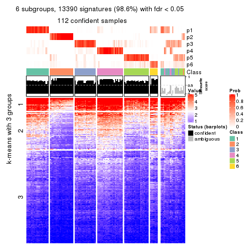</p>

</div>
</div>


Compare the overlap of signatures from different k:

```r
compare_signatures(res)
```


`get_signature()` returns a data frame invisibly. TO get the list of signatures, the function
call should be assigned to a variable explicitly. In following code, if `plot` argument is set
to `FALSE`, no heatmap is plotted while only the differential analysis is performed.

```r
# code only for demonstration
tb = get_signature(res, k = ..., plot = FALSE)
```

An example of the output of `tb` is:

```
#>   which_row         fdr    mean_1    mean_2 scaled_mean_1 scaled_mean_2 km
#> 1        38 0.042760348  8.373488  9.131774    -0.5533452     0.5164555  1
#> 2        40 0.018707592  7.106213  8.469186    -0.6173731     0.5762149  1
#> 3        55 0.019134737 10.221463 11.207825    -0.6159697     0.5749050  1
#> 4        59 0.006059896  5.921854  7.869574    -0.6899429     0.6439467  1
#> 5        60 0.018055526  8.928898 10.211722    -0.6204761     0.5791110  1
#> 6        98 0.009384629 15.714769 14.887706     0.6635654    -0.6193277  2
...
```

The columns in `tb` are:

1. `which_row`: row indices corresponding to the input matrix.
2. `fdr`: FDR for the differential test. 
3. `mean_x`: The mean value in group x.
4. `scaled_mean_x`: The mean value in group x after rows are scaled.
5. `km`: Row groups if k-means clustering is applied to rows.


UMAP plot which shows how samples are separated.


<script>
$( function() {
	$( '#tabs-SD-kmeans-dimension-reduction' ).tabs();
} );
</script>
<div id='tabs-SD-kmeans-dimension-reduction'>
<ul>
<li><a href='#tab-SD-kmeans-dimension-reduction-1'>k = 2</a></li>
<li><a href='#tab-SD-kmeans-dimension-reduction-2'>k = 3</a></li>
<li><a href='#tab-SD-kmeans-dimension-reduction-3'>k = 4</a></li>
<li><a href='#tab-SD-kmeans-dimension-reduction-4'>k = 5</a></li>
<li><a href='#tab-SD-kmeans-dimension-reduction-5'>k = 6</a></li>
</ul>
<div id='tab-SD-kmeans-dimension-reduction-1'>
<pre><code class="r">dimension_reduction(res, k = 2, method = &quot;UMAP&quot;)
</code></pre>

<p></p>

</div>
<div id='tab-SD-kmeans-dimension-reduction-2'>
<pre><code class="r">dimension_reduction(res, k = 3, method = &quot;UMAP&quot;)
</code></pre>

<p></p>

</div>
<div id='tab-SD-kmeans-dimension-reduction-3'>
<pre><code class="r">dimension_reduction(res, k = 4, method = &quot;UMAP&quot;)
</code></pre>

<p></p>

</div>
<div id='tab-SD-kmeans-dimension-reduction-4'>
<pre><code class="r">dimension_reduction(res, k = 5, method = &quot;UMAP&quot;)
</code></pre>

<p></p>

</div>
<div id='tab-SD-kmeans-dimension-reduction-5'>
<pre><code class="r">dimension_reduction(res, k = 6, method = &quot;UMAP&quot;)
</code></pre>

<p></p>

</div>
</div>


Following heatmap shows how subgroups are split when increasing `k`:

```r
collect_classes(res)
```


If matrix rows can be associated to genes, consider to use `functional_enrichment(res,
...)` to perform function enrichment for the signature genes. See [this vignette](http://bioconductor.org/packages/devel/bioc/vignettes/cola/inst/doc/functional_enrichment.html) for more detailed explanations.


 

---------------------------------------------------


### SD:skmeans*


The object with results only for a single top-value method and a single partition method 
can be extracted as:

```r
res = res_list["SD", "skmeans"]
# you can also extract it by
# res = res_list["SD:skmeans"]
```

A summary of `res` and all the functions that can be applied to it:

```r
res
```

```
#> A 'ConsensusPartition' object with k = 2, 3, 4, 5, 6.
#>   On a matrix with 13580 rows and 133 columns.
#>   Top rows (1000, 2000, 3000, 4000, 5000) are extracted by 'SD' method.
#>   Subgroups are detected by 'skmeans' method.
#>   Performed in total 1250 partitions by row resampling.
#>   Best k for subgroups seems to be 3.
#> 
#> Following methods can be applied to this 'ConsensusPartition' object:
#>  [1] "cola_report"             "collect_classes"         "collect_plots"          
#>  [4] "collect_stats"           "colnames"                "compare_signatures"     
#>  [7] "consensus_heatmap"       "dimension_reduction"     "functional_enrichment"  
#> [10] "get_anno_col"            "get_anno"                "get_classes"            
#> [13] "get_consensus"           "get_matrix"              "get_membership"         
#> [16] "get_param"               "get_signatures"          "get_stats"              
#> [19] "is_best_k"               "is_stable_k"             "membership_heatmap"     
#> [22] "ncol"                    "nrow"                    "plot_ecdf"              
#> [25] "rownames"                "select_partition_number" "show"                   
#> [28] "suggest_best_k"          "test_to_known_factors"
```

`collect_plots()` function collects all the plots made from `res` for all `k` (number of partitions)
into one single page to provide an easy and fast comparison between different `k`.

```r
collect_plots(res)
```


The plots are:

- The first row: a plot of the ECDF (empirical cumulative distribution
  function) curves of the consensus matrix for each `k` and the heatmap of
  predicted classes for each `k`.
- The second row: heatmaps of the consensus matrix for each `k`.
- The third row: heatmaps of the membership matrix for each `k`.
- The fouth row: heatmaps of the signatures for each `k`.

All the plots in panels can be made by individual functions and they are
plotted later in this section.

`select_partition_number()` produces several plots showing different
statistics for choosing "optimized" `k`. There are following statistics:

- ECDF curves of the consensus matrix for each `k`;
- 1-PAC. [The PAC
  score](https://en.wikipedia.org/wiki/Consensus_clustering#Over-interpretation_potential_of_consensus_clustering)
  measures the proportion of the ambiguous subgrouping.
- Mean silhouette score.
- Concordance. The mean probability of fiting the consensus class ids in all
  partitions.
- Area increased. Denote $A_k$ as the area under the ECDF curve for current
  `k`, the area increased is defined as $A_k - A_{k-1}$.
- Rand index. The percent of pairs of samples that are both in a same cluster
  or both are not in a same cluster in the partition of k and k-1.
- Jaccard index. The ratio of pairs of samples are both in a same cluster in
  the partition of k and k-1 and the pairs of samples are both in a same
  cluster in the partition k or k-1.

The detailed explanations of these statistics can be found in [the _cola_
vignette](http://bioconductor.org/packages/devel/bioc/vignettes/cola/inst/doc/cola.html#toc_13).

Generally speaking, lower PAC score, higher mean silhouette score or higher
concordance corresponds to better partition. Rand index and Jaccard index
measure how similar the current partition is compared to partition with `k-1`.
If they are too similar, we won't accept `k` is better than `k-1`.

```r
select_partition_number(res)
```


The numeric values for all these statistics can be obtained by `get_stats()`.

```r
get_stats(res)
```

```
#>   k 1-PAC mean_silhouette concordance area_increased  Rand Jaccard
#> 2 2 0.984           0.960       0.983         0.4952 0.506   0.506
#> 3 3 0.931           0.934       0.970         0.3408 0.805   0.625
#> 4 4 0.739           0.778       0.873         0.0934 0.894   0.701
#> 5 5 0.786           0.709       0.866         0.0558 0.932   0.758
#> 6 6 0.807           0.744       0.870         0.0472 0.898   0.612
```

`suggest_best_k()` suggests the best $k$ based on these statistics. The rules are as follows:

- All $k$ with Jaccard index larger than 0.95 are removed because increasing
  $k$ does not provide enough extra information. If all $k$ are removed, it is
  marked as no subgroup is detected.
- For all $k$ with 1-PAC score larger than 0.9, the maximal $k$ is taken as
  the best $k$, and other $k$ are marked as optional $k$.
- If it does not fit the second rule. The $k$ with the maximal vote of the
  highest 1-PAC score, highest mean silhouette, and highest concordance is
  taken as the best $k$.

```r
suggest_best_k(res)
```

```
#> [1] 3
#> attr(,"optional")
#> [1] 2
```

There is also optional best $k$ = 2 that is worth to check.

Following shows the table of the partitions (You need to click the **show/hide
code output** link to see it). The membership matrix (columns with name `p*`)
is inferred by
[`clue::cl_consensus()`](https://www.rdocumentation.org/link/cl_consensus?package=clue)
function with the `SE` method. Basically the value in the membership matrix
represents the probability to belong to a certain group. The finall class
label for an item is determined with the group with highest probability it
belongs to.

In `get_classes()` function, the entropy is calculated from the membership
matrix and the silhouette score is calculated from the consensus matrix.


<script>
$( function() {
	$( '#tabs-SD-skmeans-get-classes' ).tabs();
} );
</script>
<div id='tabs-SD-skmeans-get-classes'>
<ul>
<li><a href='#tab-SD-skmeans-get-classes-1'>k = 2</a></li>
<li><a href='#tab-SD-skmeans-get-classes-2'>k = 3</a></li>
<li><a href='#tab-SD-skmeans-get-classes-3'>k = 4</a></li>
<li><a href='#tab-SD-skmeans-get-classes-4'>k = 5</a></li>
<li><a href='#tab-SD-skmeans-get-classes-5'>k = 6</a></li>
</ul>

<div id='tab-SD-skmeans-get-classes-1'>
<p><a id='tab-SD-skmeans-get-classes-1-a' style='color:#0366d6' href='#'>show/hide code output</a></p>
<pre><code class="r">cbind(get_classes(res, k = 2), get_membership(res, k = 2))
</code></pre>

<pre><code>#&gt;            class entropy silhouette    p1    p2
#&gt; SRR1951667     2   0.000      0.985 0.000 1.000
#&gt; SRR1951666     2   0.000      0.985 0.000 1.000
#&gt; SRR1951665     2   0.000      0.985 0.000 1.000
#&gt; SRR1951664     1   0.000      0.981 1.000 0.000
#&gt; SRR1951663     2   0.730      0.741 0.204 0.796
#&gt; SRR1951662     2   0.000      0.985 0.000 1.000
#&gt; SRR1951661     2   0.000      0.985 0.000 1.000
#&gt; SRR1951660     1   0.000      0.981 1.000 0.000
#&gt; SRR1951659     2   0.000      0.985 0.000 1.000
#&gt; SRR1951658     2   0.000      0.985 0.000 1.000
#&gt; SRR1951657     1   0.000      0.981 1.000 0.000
#&gt; SRR1951656     1   0.000      0.981 1.000 0.000
#&gt; SRR1951655     1   0.000      0.981 1.000 0.000
#&gt; SRR1951654     1   0.000      0.981 1.000 0.000
#&gt; SRR1951653     1   0.000      0.981 1.000 0.000
#&gt; SRR1951652     2   0.000      0.985 0.000 1.000
#&gt; SRR1951651     1   0.000      0.981 1.000 0.000
#&gt; SRR1951650     1   0.000      0.981 1.000 0.000
#&gt; SRR1951648     2   0.000      0.985 0.000 1.000
#&gt; SRR1951649     1   0.000      0.981 1.000 0.000
#&gt; SRR1951647     2   0.971      0.338 0.400 0.600
#&gt; SRR1951646     1   0.000      0.981 1.000 0.000
#&gt; SRR1951645     1   0.000      0.981 1.000 0.000
#&gt; SRR1951644     1   0.000      0.981 1.000 0.000
#&gt; SRR1951643     1   0.000      0.981 1.000 0.000
#&gt; SRR1951641     2   0.000      0.985 0.000 1.000
#&gt; SRR1951642     1   0.000      0.981 1.000 0.000
#&gt; SRR1951694     1   0.000      0.981 1.000 0.000
#&gt; SRR1951731     2   0.000      0.985 0.000 1.000
#&gt; SRR1951730     2   0.000      0.985 0.000 1.000
#&gt; SRR1951752     2   0.000      0.985 0.000 1.000
#&gt; SRR1951751     1   0.000      0.981 1.000 0.000
#&gt; SRR1951749     2   0.000      0.985 0.000 1.000
#&gt; SRR1951750     1   0.000      0.981 1.000 0.000
#&gt; SRR1951748     2   0.000      0.985 0.000 1.000
#&gt; SRR1951747     2   0.000      0.985 0.000 1.000
#&gt; SRR1951745     1   0.881      0.579 0.700 0.300
#&gt; SRR1951746     2   0.000      0.985 0.000 1.000
#&gt; SRR1951744     1   0.000      0.981 1.000 0.000
#&gt; SRR1951742     2   0.000      0.985 0.000 1.000
#&gt; SRR1951743     2   0.000      0.985 0.000 1.000
#&gt; SRR1951741     1   0.000      0.981 1.000 0.000
#&gt; SRR1951740     1   0.000      0.981 1.000 0.000
#&gt; SRR1951738     2   0.000      0.985 0.000 1.000
#&gt; SRR1951739     2   0.000      0.985 0.000 1.000
#&gt; SRR1951737     1   0.000      0.981 1.000 0.000
#&gt; SRR1951736     1   0.000      0.981 1.000 0.000
#&gt; SRR1951734     2   0.000      0.985 0.000 1.000
#&gt; SRR1951735     1   0.000      0.981 1.000 0.000
#&gt; SRR1951733     2   0.000      0.985 0.000 1.000
#&gt; SRR1951732     2   0.000      0.985 0.000 1.000
#&gt; SRR1951729     1   0.000      0.981 1.000 0.000
#&gt; SRR1951728     1   0.000      0.981 1.000 0.000
#&gt; SRR1951727     2   0.000      0.985 0.000 1.000
#&gt; SRR1951725     1   0.000      0.981 1.000 0.000
#&gt; SRR1951726     2   0.000      0.985 0.000 1.000
#&gt; SRR1951724     1   0.000      0.981 1.000 0.000
#&gt; SRR1951722     1   0.000      0.981 1.000 0.000
#&gt; SRR1951723     1   0.000      0.981 1.000 0.000
#&gt; SRR1951721     2   0.000      0.985 0.000 1.000
#&gt; SRR1951719     1   0.000      0.981 1.000 0.000
#&gt; SRR1951720     1   0.000      0.981 1.000 0.000
#&gt; SRR1951718     1   0.000      0.981 1.000 0.000
#&gt; SRR1951717     1   0.000      0.981 1.000 0.000
#&gt; SRR1951715     2   0.730      0.741 0.204 0.796
#&gt; SRR1951716     1   0.000      0.981 1.000 0.000
#&gt; SRR1951714     1   0.000      0.981 1.000 0.000
#&gt; SRR1951713     1   0.000      0.981 1.000 0.000
#&gt; SRR1951712     1   0.000      0.981 1.000 0.000
#&gt; SRR1951711     2   0.000      0.985 0.000 1.000
#&gt; SRR1951710     1   0.000      0.981 1.000 0.000
#&gt; SRR1951709     2   0.000      0.985 0.000 1.000
#&gt; SRR1951708     2   0.000      0.985 0.000 1.000
#&gt; SRR1951707     2   0.000      0.985 0.000 1.000
#&gt; SRR1951705     1   0.000      0.981 1.000 0.000
#&gt; SRR1951704     2   0.000      0.985 0.000 1.000
#&gt; SRR1951703     2   0.000      0.985 0.000 1.000
#&gt; SRR1951706     2   0.000      0.985 0.000 1.000
#&gt; SRR1951702     2   0.000      0.985 0.000 1.000
#&gt; SRR1951701     2   0.000      0.985 0.000 1.000
#&gt; SRR1951699     2   0.000      0.985 0.000 1.000
#&gt; SRR1951698     2   0.000      0.985 0.000 1.000
#&gt; SRR1951700     1   0.000      0.981 1.000 0.000
#&gt; SRR1951697     2   0.000      0.985 0.000 1.000
#&gt; SRR1951696     1   0.000      0.981 1.000 0.000
#&gt; SRR1951695     1   0.000      0.981 1.000 0.000
#&gt; SRR1951693     1   0.000      0.981 1.000 0.000
#&gt; SRR1951692     1   0.000      0.981 1.000 0.000
#&gt; SRR1951691     1   0.000      0.981 1.000 0.000
#&gt; SRR1951688     2   0.000      0.985 0.000 1.000
#&gt; SRR1951689     2   0.000      0.985 0.000 1.000
#&gt; SRR1951687     1   0.000      0.981 1.000 0.000
#&gt; SRR1951685     2   0.000      0.985 0.000 1.000
#&gt; SRR1951684     1   0.000      0.981 1.000 0.000
#&gt; SRR1951686     2   0.000      0.985 0.000 1.000
#&gt; SRR1951683     1   0.000      0.981 1.000 0.000
#&gt; SRR1951682     2   0.000      0.985 0.000 1.000
#&gt; SRR1951690     2   0.000      0.985 0.000 1.000
#&gt; SRR1951680     1   0.000      0.981 1.000 0.000
#&gt; SRR1951679     1   0.000      0.981 1.000 0.000
#&gt; SRR1951678     1   0.000      0.981 1.000 0.000
#&gt; SRR1951677     1   0.000      0.981 1.000 0.000
#&gt; SRR1951676     1   0.000      0.981 1.000 0.000
#&gt; SRR1951675     2   0.000      0.985 0.000 1.000
#&gt; SRR1951681     1   0.000      0.981 1.000 0.000
#&gt; SRR1951673     2   0.000      0.985 0.000 1.000
#&gt; SRR1951674     1   0.000      0.981 1.000 0.000
#&gt; SRR1951672     1   0.000      0.981 1.000 0.000
#&gt; SRR1951671     2   0.000      0.985 0.000 1.000
#&gt; SRR1951670     1   0.000      0.981 1.000 0.000
#&gt; SRR1951640     1   0.000      0.981 1.000 0.000
#&gt; SRR1951668     1   0.000      0.981 1.000 0.000
#&gt; SRR1951669     2   0.000      0.985 0.000 1.000
#&gt; SRR1951638     1   0.000      0.981 1.000 0.000
#&gt; SRR1951637     2   0.000      0.985 0.000 1.000
#&gt; SRR1951635     1   0.000      0.981 1.000 0.000
#&gt; SRR1951634     1   0.000      0.981 1.000 0.000
#&gt; SRR1951631     1   0.000      0.981 1.000 0.000
#&gt; SRR1951632     2   0.000      0.985 0.000 1.000
#&gt; SRR1951633     1   0.000      0.981 1.000 0.000
#&gt; SRR1951630     1   0.000      0.981 1.000 0.000
#&gt; SRR1951629     1   0.000      0.981 1.000 0.000
#&gt; SRR1951628     1   0.971      0.319 0.600 0.400
#&gt; SRR1951627     2   0.000      0.985 0.000 1.000
#&gt; SRR1951639     2   0.000      0.985 0.000 1.000
#&gt; SRR1951625     2   0.000      0.985 0.000 1.000
#&gt; SRR1951626     1   0.753      0.727 0.784 0.216
#&gt; SRR1951624     1   0.000      0.981 1.000 0.000
#&gt; SRR1951622     1   0.000      0.981 1.000 0.000
#&gt; SRR1951636     1   0.861      0.614 0.716 0.284
#&gt; SRR1951623     1   0.730      0.744 0.796 0.204
#&gt; SRR1951621     1   0.000      0.981 1.000 0.000
#&gt; SRR1951620     1   0.000      0.981 1.000 0.000
</code></pre>

<script>
$('#tab-SD-skmeans-get-classes-1-a').parent().next().next().hide();
$('#tab-SD-skmeans-get-classes-1-a').click(function(){
  $('#tab-SD-skmeans-get-classes-1-a').parent().next().next().toggle();
  return(false);
});
</script>
</div>

<div id='tab-SD-skmeans-get-classes-2'>
<p><a id='tab-SD-skmeans-get-classes-2-a' style='color:#0366d6' href='#'>show/hide code output</a></p>
<pre><code class="r">cbind(get_classes(res, k = 3), get_membership(res, k = 3))
</code></pre>

<pre><code>#&gt;            class entropy silhouette    p1    p2    p3
#&gt; SRR1951667     2  0.0000     0.9785 0.000 1.000 0.000
#&gt; SRR1951666     2  0.0000     0.9785 0.000 1.000 0.000
#&gt; SRR1951665     2  0.0000     0.9785 0.000 1.000 0.000
#&gt; SRR1951664     3  0.0000     0.9396 0.000 0.000 1.000
#&gt; SRR1951663     1  0.0000     0.9854 1.000 0.000 0.000
#&gt; SRR1951662     2  0.0000     0.9785 0.000 1.000 0.000
#&gt; SRR1951661     2  0.1529     0.9417 0.000 0.960 0.040
#&gt; SRR1951660     1  0.0000     0.9854 1.000 0.000 0.000
#&gt; SRR1951659     2  0.0000     0.9785 0.000 1.000 0.000
#&gt; SRR1951658     2  0.0000     0.9785 0.000 1.000 0.000
#&gt; SRR1951657     3  0.0000     0.9396 0.000 0.000 1.000
#&gt; SRR1951656     3  0.0000     0.9396 0.000 0.000 1.000
#&gt; SRR1951655     1  0.0000     0.9854 1.000 0.000 0.000
#&gt; SRR1951654     1  0.0000     0.9854 1.000 0.000 0.000
#&gt; SRR1951653     3  0.4504     0.7884 0.196 0.000 0.804
#&gt; SRR1951652     2  0.0000     0.9785 0.000 1.000 0.000
#&gt; SRR1951651     3  0.4452     0.7928 0.192 0.000 0.808
#&gt; SRR1951650     3  0.0000     0.9396 0.000 0.000 1.000
#&gt; SRR1951648     2  0.0000     0.9785 0.000 1.000 0.000
#&gt; SRR1951649     1  0.0000     0.9854 1.000 0.000 0.000
#&gt; SRR1951647     2  0.6126     0.3827 0.000 0.600 0.400
#&gt; SRR1951646     3  0.0000     0.9396 0.000 0.000 1.000
#&gt; SRR1951645     1  0.0000     0.9854 1.000 0.000 0.000
#&gt; SRR1951644     1  0.0000     0.9854 1.000 0.000 0.000
#&gt; SRR1951643     3  0.4452     0.7928 0.192 0.000 0.808
#&gt; SRR1951641     2  0.0000     0.9785 0.000 1.000 0.000
#&gt; SRR1951642     3  0.0237     0.9374 0.004 0.000 0.996
#&gt; SRR1951694     1  0.0000     0.9854 1.000 0.000 0.000
#&gt; SRR1951731     2  0.4555     0.7658 0.000 0.800 0.200
#&gt; SRR1951730     2  0.0000     0.9785 0.000 1.000 0.000
#&gt; SRR1951752     2  0.0000     0.9785 0.000 1.000 0.000
#&gt; SRR1951751     1  0.0000     0.9854 1.000 0.000 0.000
#&gt; SRR1951749     2  0.0000     0.9785 0.000 1.000 0.000
#&gt; SRR1951750     1  0.0000     0.9854 1.000 0.000 0.000
#&gt; SRR1951748     2  0.0000     0.9785 0.000 1.000 0.000
#&gt; SRR1951747     2  0.0000     0.9785 0.000 1.000 0.000
#&gt; SRR1951745     1  0.0000     0.9854 1.000 0.000 0.000
#&gt; SRR1951746     2  0.0000     0.9785 0.000 1.000 0.000
#&gt; SRR1951744     3  0.0000     0.9396 0.000 0.000 1.000
#&gt; SRR1951742     2  0.0000     0.9785 0.000 1.000 0.000
#&gt; SRR1951743     2  0.0000     0.9785 0.000 1.000 0.000
#&gt; SRR1951741     1  0.0000     0.9854 1.000 0.000 0.000
#&gt; SRR1951740     3  0.0000     0.9396 0.000 0.000 1.000
#&gt; SRR1951738     2  0.0000     0.9785 0.000 1.000 0.000
#&gt; SRR1951739     2  0.0000     0.9785 0.000 1.000 0.000
#&gt; SRR1951737     3  0.0000     0.9396 0.000 0.000 1.000
#&gt; SRR1951736     1  0.0000     0.9854 1.000 0.000 0.000
#&gt; SRR1951734     2  0.0000     0.9785 0.000 1.000 0.000
#&gt; SRR1951735     3  0.0000     0.9396 0.000 0.000 1.000
#&gt; SRR1951733     2  0.0000     0.9785 0.000 1.000 0.000
#&gt; SRR1951732     2  0.0000     0.9785 0.000 1.000 0.000
#&gt; SRR1951729     3  0.0000     0.9396 0.000 0.000 1.000
#&gt; SRR1951728     3  0.0000     0.9396 0.000 0.000 1.000
#&gt; SRR1951727     2  0.0000     0.9785 0.000 1.000 0.000
#&gt; SRR1951725     1  0.0000     0.9854 1.000 0.000 0.000
#&gt; SRR1951726     2  0.0000     0.9785 0.000 1.000 0.000
#&gt; SRR1951724     1  0.0000     0.9854 1.000 0.000 0.000
#&gt; SRR1951722     1  0.0000     0.9854 1.000 0.000 0.000
#&gt; SRR1951723     1  0.0000     0.9854 1.000 0.000 0.000
#&gt; SRR1951721     2  0.1529     0.9426 0.040 0.960 0.000
#&gt; SRR1951719     3  0.0000     0.9396 0.000 0.000 1.000
#&gt; SRR1951720     1  0.0000     0.9854 1.000 0.000 0.000
#&gt; SRR1951718     1  0.0000     0.9854 1.000 0.000 0.000
#&gt; SRR1951717     1  0.0000     0.9854 1.000 0.000 0.000
#&gt; SRR1951715     1  0.0000     0.9854 1.000 0.000 0.000
#&gt; SRR1951716     1  0.0000     0.9854 1.000 0.000 0.000
#&gt; SRR1951714     3  0.4399     0.7966 0.188 0.000 0.812
#&gt; SRR1951713     3  0.4504     0.7884 0.196 0.000 0.804
#&gt; SRR1951712     1  0.0000     0.9854 1.000 0.000 0.000
#&gt; SRR1951711     2  0.0000     0.9785 0.000 1.000 0.000
#&gt; SRR1951710     1  0.0000     0.9854 1.000 0.000 0.000
#&gt; SRR1951709     2  0.0000     0.9785 0.000 1.000 0.000
#&gt; SRR1951708     2  0.0000     0.9785 0.000 1.000 0.000
#&gt; SRR1951707     2  0.0237     0.9752 0.000 0.996 0.004
#&gt; SRR1951705     1  0.0000     0.9854 1.000 0.000 0.000
#&gt; SRR1951704     2  0.0000     0.9785 0.000 1.000 0.000
#&gt; SRR1951703     2  0.0000     0.9785 0.000 1.000 0.000
#&gt; SRR1951706     2  0.0000     0.9785 0.000 1.000 0.000
#&gt; SRR1951702     2  0.5098     0.6616 0.000 0.752 0.248
#&gt; SRR1951701     2  0.0000     0.9785 0.000 1.000 0.000
#&gt; SRR1951699     2  0.0000     0.9785 0.000 1.000 0.000
#&gt; SRR1951698     3  0.0237     0.9367 0.000 0.004 0.996
#&gt; SRR1951700     1  0.6286    -0.0132 0.536 0.000 0.464
#&gt; SRR1951697     2  0.0000     0.9785 0.000 1.000 0.000
#&gt; SRR1951696     3  0.0000     0.9396 0.000 0.000 1.000
#&gt; SRR1951695     3  0.0000     0.9396 0.000 0.000 1.000
#&gt; SRR1951693     3  0.6168     0.3883 0.412 0.000 0.588
#&gt; SRR1951692     3  0.0000     0.9396 0.000 0.000 1.000
#&gt; SRR1951691     1  0.0000     0.9854 1.000 0.000 0.000
#&gt; SRR1951688     2  0.0000     0.9785 0.000 1.000 0.000
#&gt; SRR1951689     2  0.0000     0.9785 0.000 1.000 0.000
#&gt; SRR1951687     1  0.0592     0.9727 0.988 0.000 0.012
#&gt; SRR1951685     2  0.0000     0.9785 0.000 1.000 0.000
#&gt; SRR1951684     3  0.0000     0.9396 0.000 0.000 1.000
#&gt; SRR1951686     2  0.0000     0.9785 0.000 1.000 0.000
#&gt; SRR1951683     3  0.4504     0.7884 0.196 0.000 0.804
#&gt; SRR1951682     2  0.0000     0.9785 0.000 1.000 0.000
#&gt; SRR1951690     2  0.0000     0.9785 0.000 1.000 0.000
#&gt; SRR1951680     3  0.0000     0.9396 0.000 0.000 1.000
#&gt; SRR1951679     1  0.0000     0.9854 1.000 0.000 0.000
#&gt; SRR1951678     3  0.0000     0.9396 0.000 0.000 1.000
#&gt; SRR1951677     3  0.0000     0.9396 0.000 0.000 1.000
#&gt; SRR1951676     3  0.0000     0.9396 0.000 0.000 1.000
#&gt; SRR1951675     2  0.0000     0.9785 0.000 1.000 0.000
#&gt; SRR1951681     3  0.0000     0.9396 0.000 0.000 1.000
#&gt; SRR1951673     2  0.0000     0.9785 0.000 1.000 0.000
#&gt; SRR1951674     1  0.0000     0.9854 1.000 0.000 0.000
#&gt; SRR1951672     1  0.0000     0.9854 1.000 0.000 0.000
#&gt; SRR1951671     2  0.0000     0.9785 0.000 1.000 0.000
#&gt; SRR1951670     1  0.0000     0.9854 1.000 0.000 0.000
#&gt; SRR1951640     3  0.0000     0.9396 0.000 0.000 1.000
#&gt; SRR1951668     3  0.5926     0.5223 0.356 0.000 0.644
#&gt; SRR1951669     2  0.0000     0.9785 0.000 1.000 0.000
#&gt; SRR1951638     1  0.0000     0.9854 1.000 0.000 0.000
#&gt; SRR1951637     2  0.0000     0.9785 0.000 1.000 0.000
#&gt; SRR1951635     1  0.0000     0.9854 1.000 0.000 0.000
#&gt; SRR1951634     3  0.4504     0.7884 0.196 0.000 0.804
#&gt; SRR1951631     3  0.4452     0.7928 0.192 0.000 0.808
#&gt; SRR1951632     2  0.0000     0.9785 0.000 1.000 0.000
#&gt; SRR1951633     3  0.0000     0.9396 0.000 0.000 1.000
#&gt; SRR1951630     3  0.0000     0.9396 0.000 0.000 1.000
#&gt; SRR1951629     3  0.0000     0.9396 0.000 0.000 1.000
#&gt; SRR1951628     1  0.0000     0.9854 1.000 0.000 0.000
#&gt; SRR1951627     2  0.0000     0.9785 0.000 1.000 0.000
#&gt; SRR1951639     2  0.4504     0.7709 0.000 0.804 0.196
#&gt; SRR1951625     2  0.0000     0.9785 0.000 1.000 0.000
#&gt; SRR1951626     3  0.0000     0.9396 0.000 0.000 1.000
#&gt; SRR1951624     3  0.0000     0.9396 0.000 0.000 1.000
#&gt; SRR1951622     1  0.0000     0.9854 1.000 0.000 0.000
#&gt; SRR1951636     3  0.0000     0.9396 0.000 0.000 1.000
#&gt; SRR1951623     3  0.0237     0.9367 0.000 0.004 0.996
#&gt; SRR1951621     1  0.0000     0.9854 1.000 0.000 0.000
#&gt; SRR1951620     3  0.0000     0.9396 0.000 0.000 1.000
</code></pre>

<script>
$('#tab-SD-skmeans-get-classes-2-a').parent().next().next().hide();
$('#tab-SD-skmeans-get-classes-2-a').click(function(){
  $('#tab-SD-skmeans-get-classes-2-a').parent().next().next().toggle();
  return(false);
});
</script>
</div>

<div id='tab-SD-skmeans-get-classes-3'>
<p><a id='tab-SD-skmeans-get-classes-3-a' style='color:#0366d6' href='#'>show/hide code output</a></p>
<pre><code class="r">cbind(get_classes(res, k = 4), get_membership(res, k = 4))
</code></pre>

<pre><code>#&gt;            class entropy silhouette    p1    p2    p3    p4
#&gt; SRR1951667     2  0.0000      0.968 0.000 1.000 0.000 0.000
#&gt; SRR1951666     3  0.4830      0.563 0.000 0.392 0.608 0.000
#&gt; SRR1951665     2  0.0000      0.968 0.000 1.000 0.000 0.000
#&gt; SRR1951664     4  0.4431      0.625 0.000 0.000 0.304 0.696
#&gt; SRR1951663     1  0.1637      0.729 0.940 0.000 0.060 0.000
#&gt; SRR1951662     2  0.0000      0.968 0.000 1.000 0.000 0.000
#&gt; SRR1951661     3  0.1940      0.756 0.000 0.076 0.924 0.000
#&gt; SRR1951660     1  0.3219      0.815 0.836 0.000 0.000 0.164
#&gt; SRR1951659     2  0.0000      0.968 0.000 1.000 0.000 0.000
#&gt; SRR1951658     2  0.0000      0.968 0.000 1.000 0.000 0.000
#&gt; SRR1951657     4  0.0000      0.839 0.000 0.000 0.000 1.000
#&gt; SRR1951656     4  0.1792      0.821 0.000 0.000 0.068 0.932
#&gt; SRR1951655     1  0.4713      0.708 0.640 0.000 0.000 0.360
#&gt; SRR1951654     1  0.3831      0.789 0.792 0.000 0.004 0.204
#&gt; SRR1951653     4  0.0817      0.829 0.024 0.000 0.000 0.976
#&gt; SRR1951652     2  0.0817      0.942 0.000 0.976 0.024 0.000
#&gt; SRR1951651     4  0.0817      0.829 0.024 0.000 0.000 0.976
#&gt; SRR1951650     4  0.4830      0.502 0.000 0.000 0.392 0.608
#&gt; SRR1951648     3  0.4746      0.600 0.000 0.368 0.632 0.000
#&gt; SRR1951649     1  0.4981      0.541 0.536 0.000 0.000 0.464
#&gt; SRR1951647     2  0.6971      0.175 0.000 0.568 0.156 0.276
#&gt; SRR1951646     4  0.3486      0.739 0.000 0.000 0.188 0.812
#&gt; SRR1951645     1  0.4907      0.627 0.580 0.000 0.000 0.420
#&gt; SRR1951644     1  0.2973      0.819 0.856 0.000 0.000 0.144
#&gt; SRR1951643     4  0.0817      0.829 0.024 0.000 0.000 0.976
#&gt; SRR1951641     2  0.0000      0.968 0.000 1.000 0.000 0.000
#&gt; SRR1951642     4  0.0188      0.838 0.004 0.000 0.000 0.996
#&gt; SRR1951694     1  0.0188      0.772 0.996 0.000 0.000 0.004
#&gt; SRR1951731     3  0.6508      0.537 0.000 0.344 0.568 0.088
#&gt; SRR1951730     2  0.0000      0.968 0.000 1.000 0.000 0.000
#&gt; SRR1951752     2  0.0000      0.968 0.000 1.000 0.000 0.000
#&gt; SRR1951751     1  0.4661      0.719 0.652 0.000 0.000 0.348
#&gt; SRR1951749     3  0.4830      0.563 0.000 0.392 0.608 0.000
#&gt; SRR1951750     1  0.4697      0.712 0.644 0.000 0.000 0.356
#&gt; SRR1951748     2  0.0000      0.968 0.000 1.000 0.000 0.000
#&gt; SRR1951747     2  0.0000      0.968 0.000 1.000 0.000 0.000
#&gt; SRR1951745     1  0.2149      0.706 0.912 0.000 0.088 0.000
#&gt; SRR1951746     2  0.0000      0.968 0.000 1.000 0.000 0.000
#&gt; SRR1951744     4  0.3796      0.772 0.056 0.000 0.096 0.848
#&gt; SRR1951742     2  0.0000      0.968 0.000 1.000 0.000 0.000
#&gt; SRR1951743     2  0.0000      0.968 0.000 1.000 0.000 0.000
#&gt; SRR1951741     1  0.4907      0.629 0.580 0.000 0.000 0.420
#&gt; SRR1951740     4  0.0188      0.838 0.004 0.000 0.000 0.996
#&gt; SRR1951738     2  0.0000      0.968 0.000 1.000 0.000 0.000
#&gt; SRR1951739     2  0.0000      0.968 0.000 1.000 0.000 0.000
#&gt; SRR1951737     4  0.4431      0.625 0.000 0.000 0.304 0.696
#&gt; SRR1951736     1  0.2973      0.819 0.856 0.000 0.000 0.144
#&gt; SRR1951734     2  0.0000      0.968 0.000 1.000 0.000 0.000
#&gt; SRR1951735     4  0.4382      0.634 0.000 0.000 0.296 0.704
#&gt; SRR1951733     2  0.0000      0.968 0.000 1.000 0.000 0.000
#&gt; SRR1951732     2  0.0000      0.968 0.000 1.000 0.000 0.000
#&gt; SRR1951729     4  0.4431      0.625 0.000 0.000 0.304 0.696
#&gt; SRR1951728     3  0.4981     -0.153 0.000 0.000 0.536 0.464
#&gt; SRR1951727     2  0.0000      0.968 0.000 1.000 0.000 0.000
#&gt; SRR1951725     1  0.0188      0.767 0.996 0.000 0.004 0.000
#&gt; SRR1951726     2  0.2334      0.862 0.004 0.908 0.088 0.000
#&gt; SRR1951724     1  0.4431      0.748 0.696 0.000 0.000 0.304
#&gt; SRR1951722     1  0.4382      0.756 0.704 0.000 0.000 0.296
#&gt; SRR1951723     1  0.4989      0.522 0.528 0.000 0.000 0.472
#&gt; SRR1951721     2  0.6176      0.307 0.368 0.572 0.060 0.000
#&gt; SRR1951719     4  0.0000      0.839 0.000 0.000 0.000 1.000
#&gt; SRR1951720     1  0.2647      0.817 0.880 0.000 0.000 0.120
#&gt; SRR1951718     1  0.3400      0.811 0.820 0.000 0.000 0.180
#&gt; SRR1951717     1  0.2868      0.819 0.864 0.000 0.000 0.136
#&gt; SRR1951715     1  0.0188      0.767 0.996 0.000 0.004 0.000
#&gt; SRR1951716     1  0.2973      0.819 0.856 0.000 0.000 0.144
#&gt; SRR1951714     4  0.0817      0.829 0.024 0.000 0.000 0.976
#&gt; SRR1951713     4  0.0817      0.829 0.024 0.000 0.000 0.976
#&gt; SRR1951712     1  0.4661      0.719 0.652 0.000 0.000 0.348
#&gt; SRR1951711     2  0.0000      0.968 0.000 1.000 0.000 0.000
#&gt; SRR1951710     1  0.0188      0.772 0.996 0.000 0.000 0.004
#&gt; SRR1951709     3  0.4746      0.600 0.000 0.368 0.632 0.000
#&gt; SRR1951708     2  0.0000      0.968 0.000 1.000 0.000 0.000
#&gt; SRR1951707     3  0.4485      0.726 0.012 0.248 0.740 0.000
#&gt; SRR1951705     1  0.1302      0.790 0.956 0.000 0.000 0.044
#&gt; SRR1951704     3  0.3257      0.771 0.004 0.152 0.844 0.000
#&gt; SRR1951703     2  0.0000      0.968 0.000 1.000 0.000 0.000
#&gt; SRR1951706     3  0.3172      0.770 0.000 0.160 0.840 0.000
#&gt; SRR1951702     3  0.2773      0.771 0.004 0.116 0.880 0.000
#&gt; SRR1951701     2  0.0000      0.968 0.000 1.000 0.000 0.000
#&gt; SRR1951699     3  0.3764      0.756 0.000 0.216 0.784 0.000
#&gt; SRR1951698     3  0.1637      0.692 0.000 0.000 0.940 0.060
#&gt; SRR1951700     4  0.4331      0.361 0.288 0.000 0.000 0.712
#&gt; SRR1951697     2  0.0000      0.968 0.000 1.000 0.000 0.000
#&gt; SRR1951696     4  0.4431      0.625 0.000 0.000 0.304 0.696
#&gt; SRR1951695     4  0.0000      0.839 0.000 0.000 0.000 1.000
#&gt; SRR1951693     4  0.3266      0.638 0.168 0.000 0.000 0.832
#&gt; SRR1951692     4  0.0336      0.839 0.000 0.000 0.008 0.992
#&gt; SRR1951691     1  0.4866      0.654 0.596 0.000 0.000 0.404
#&gt; SRR1951688     2  0.0000      0.968 0.000 1.000 0.000 0.000
#&gt; SRR1951689     2  0.0000      0.968 0.000 1.000 0.000 0.000
#&gt; SRR1951687     4  0.5000     -0.413 0.500 0.000 0.000 0.500
#&gt; SRR1951685     2  0.0000      0.968 0.000 1.000 0.000 0.000
#&gt; SRR1951684     4  0.2281      0.807 0.000 0.000 0.096 0.904
#&gt; SRR1951686     2  0.0000      0.968 0.000 1.000 0.000 0.000
#&gt; SRR1951683     4  0.0817      0.829 0.024 0.000 0.000 0.976
#&gt; SRR1951682     2  0.0000      0.968 0.000 1.000 0.000 0.000
#&gt; SRR1951690     2  0.0000      0.968 0.000 1.000 0.000 0.000
#&gt; SRR1951680     4  0.0188      0.838 0.004 0.000 0.000 0.996
#&gt; SRR1951679     1  0.0469      0.776 0.988 0.000 0.000 0.012
#&gt; SRR1951678     4  0.0000      0.839 0.000 0.000 0.000 1.000
#&gt; SRR1951677     4  0.0000      0.839 0.000 0.000 0.000 1.000
#&gt; SRR1951676     4  0.4830      0.502 0.000 0.000 0.392 0.608
#&gt; SRR1951675     2  0.0000      0.968 0.000 1.000 0.000 0.000
#&gt; SRR1951681     4  0.4431      0.625 0.000 0.000 0.304 0.696
#&gt; SRR1951673     2  0.0000      0.968 0.000 1.000 0.000 0.000
#&gt; SRR1951674     1  0.2149      0.706 0.912 0.000 0.088 0.000
#&gt; SRR1951672     1  0.2973      0.819 0.856 0.000 0.000 0.144
#&gt; SRR1951671     2  0.0000      0.968 0.000 1.000 0.000 0.000
#&gt; SRR1951670     1  0.4713      0.708 0.640 0.000 0.000 0.360
#&gt; SRR1951640     4  0.2216      0.809 0.000 0.000 0.092 0.908
#&gt; SRR1951668     4  0.1474      0.800 0.052 0.000 0.000 0.948
#&gt; SRR1951669     2  0.0000      0.968 0.000 1.000 0.000 0.000
#&gt; SRR1951638     1  0.0188      0.772 0.996 0.000 0.000 0.004
#&gt; SRR1951637     2  0.1004      0.939 0.004 0.972 0.024 0.000
#&gt; SRR1951635     1  0.0188      0.772 0.996 0.000 0.000 0.004
#&gt; SRR1951634     4  0.0817      0.829 0.024 0.000 0.000 0.976
#&gt; SRR1951631     4  0.0817      0.829 0.024 0.000 0.000 0.976
#&gt; SRR1951632     2  0.0000      0.968 0.000 1.000 0.000 0.000
#&gt; SRR1951633     4  0.1557      0.826 0.000 0.000 0.056 0.944
#&gt; SRR1951630     4  0.0000      0.839 0.000 0.000 0.000 1.000
#&gt; SRR1951629     4  0.0000      0.839 0.000 0.000 0.000 1.000
#&gt; SRR1951628     1  0.2739      0.781 0.904 0.036 0.000 0.060
#&gt; SRR1951627     3  0.3764      0.756 0.000 0.216 0.784 0.000
#&gt; SRR1951639     3  0.1929      0.723 0.000 0.036 0.940 0.024
#&gt; SRR1951625     2  0.0000      0.968 0.000 1.000 0.000 0.000
#&gt; SRR1951626     3  0.1637      0.692 0.000 0.000 0.940 0.060
#&gt; SRR1951624     4  0.4431      0.625 0.000 0.000 0.304 0.696
#&gt; SRR1951622     1  0.2281      0.809 0.904 0.000 0.000 0.096
#&gt; SRR1951636     3  0.1637      0.692 0.000 0.000 0.940 0.060
#&gt; SRR1951623     3  0.3907      0.432 0.000 0.000 0.768 0.232
#&gt; SRR1951621     1  0.4776      0.690 0.624 0.000 0.000 0.376
#&gt; SRR1951620     4  0.2216      0.809 0.000 0.000 0.092 0.908
</code></pre>

<script>
$('#tab-SD-skmeans-get-classes-3-a').parent().next().next().hide();
$('#tab-SD-skmeans-get-classes-3-a').click(function(){
  $('#tab-SD-skmeans-get-classes-3-a').parent().next().next().toggle();
  return(false);
});
</script>
</div>

<div id='tab-SD-skmeans-get-classes-4'>
<p><a id='tab-SD-skmeans-get-classes-4-a' style='color:#0366d6' href='#'>show/hide code output</a></p>
<pre><code class="r">cbind(get_classes(res, k = 5), get_membership(res, k = 5))
</code></pre>

<pre><code>#&gt;            class entropy silhouette    p1    p2    p3    p4    p5
#&gt; SRR1951667     2  0.0000     0.9752 0.000 1.000 0.000 0.000 0.000
#&gt; SRR1951666     3  0.3774     0.5857 0.000 0.296 0.704 0.000 0.000
#&gt; SRR1951665     2  0.0000     0.9752 0.000 1.000 0.000 0.000 0.000
#&gt; SRR1951664     4  0.3809     0.6729 0.000 0.000 0.256 0.736 0.008
#&gt; SRR1951663     5  0.0290     0.6612 0.008 0.000 0.000 0.000 0.992
#&gt; SRR1951662     2  0.0000     0.9752 0.000 1.000 0.000 0.000 0.000
#&gt; SRR1951661     3  0.1341     0.6018 0.000 0.000 0.944 0.000 0.056
#&gt; SRR1951660     1  0.0290     0.7511 0.992 0.000 0.000 0.008 0.000
#&gt; SRR1951659     2  0.0000     0.9752 0.000 1.000 0.000 0.000 0.000
#&gt; SRR1951658     2  0.0000     0.9752 0.000 1.000 0.000 0.000 0.000
#&gt; SRR1951657     4  0.0404     0.8201 0.012 0.000 0.000 0.988 0.000
#&gt; SRR1951656     4  0.0451     0.8168 0.000 0.000 0.004 0.988 0.008
#&gt; SRR1951655     1  0.3305     0.6880 0.776 0.000 0.000 0.224 0.000
#&gt; SRR1951654     1  0.6034     0.5268 0.572 0.000 0.000 0.256 0.172
#&gt; SRR1951653     4  0.2890     0.7114 0.160 0.000 0.000 0.836 0.004
#&gt; SRR1951652     2  0.1892     0.8842 0.000 0.916 0.004 0.000 0.080
#&gt; SRR1951651     4  0.1671     0.8056 0.076 0.000 0.000 0.924 0.000
#&gt; SRR1951650     4  0.4298     0.5590 0.000 0.000 0.352 0.640 0.008
#&gt; SRR1951648     3  0.3586     0.6061 0.000 0.264 0.736 0.000 0.000
#&gt; SRR1951649     1  0.0609     0.7510 0.980 0.000 0.000 0.020 0.000
#&gt; SRR1951647     2  0.7213    -0.0573 0.016 0.460 0.252 0.264 0.008
#&gt; SRR1951646     4  0.3809     0.6735 0.000 0.000 0.256 0.736 0.008
#&gt; SRR1951645     1  0.3480     0.6770 0.752 0.000 0.000 0.248 0.000
#&gt; SRR1951644     1  0.0000     0.7494 1.000 0.000 0.000 0.000 0.000
#&gt; SRR1951643     4  0.1671     0.8056 0.076 0.000 0.000 0.924 0.000
#&gt; SRR1951641     2  0.0000     0.9752 0.000 1.000 0.000 0.000 0.000
#&gt; SRR1951642     4  0.1608     0.8075 0.072 0.000 0.000 0.928 0.000
#&gt; SRR1951694     1  0.4287     0.0248 0.540 0.000 0.000 0.000 0.460
#&gt; SRR1951731     3  0.6073     0.2572 0.000 0.436 0.456 0.104 0.004
#&gt; SRR1951730     2  0.0000     0.9752 0.000 1.000 0.000 0.000 0.000
#&gt; SRR1951752     2  0.0162     0.9717 0.000 0.996 0.000 0.000 0.004
#&gt; SRR1951751     1  0.0162     0.7503 0.996 0.000 0.000 0.004 0.000
#&gt; SRR1951749     3  0.3816     0.5779 0.000 0.304 0.696 0.000 0.000
#&gt; SRR1951750     1  0.3177     0.6941 0.792 0.000 0.000 0.208 0.000
#&gt; SRR1951748     2  0.0000     0.9752 0.000 1.000 0.000 0.000 0.000
#&gt; SRR1951747     2  0.0000     0.9752 0.000 1.000 0.000 0.000 0.000
#&gt; SRR1951745     5  0.0613     0.6603 0.004 0.000 0.008 0.004 0.984
#&gt; SRR1951746     2  0.0000     0.9752 0.000 1.000 0.000 0.000 0.000
#&gt; SRR1951744     5  0.5679     0.1284 0.068 0.000 0.008 0.364 0.560
#&gt; SRR1951742     2  0.1121     0.9281 0.000 0.956 0.044 0.000 0.000
#&gt; SRR1951743     2  0.0000     0.9752 0.000 1.000 0.000 0.000 0.000
#&gt; SRR1951741     1  0.3752     0.6496 0.708 0.000 0.000 0.292 0.000
#&gt; SRR1951740     4  0.0794     0.8201 0.028 0.000 0.000 0.972 0.000
#&gt; SRR1951738     2  0.0000     0.9752 0.000 1.000 0.000 0.000 0.000
#&gt; SRR1951739     2  0.0000     0.9752 0.000 1.000 0.000 0.000 0.000
#&gt; SRR1951737     4  0.3809     0.6729 0.000 0.000 0.256 0.736 0.008
#&gt; SRR1951736     1  0.0000     0.7494 1.000 0.000 0.000 0.000 0.000
#&gt; SRR1951734     2  0.0000     0.9752 0.000 1.000 0.000 0.000 0.000
#&gt; SRR1951735     4  0.3809     0.6729 0.000 0.000 0.256 0.736 0.008
#&gt; SRR1951733     2  0.0000     0.9752 0.000 1.000 0.000 0.000 0.000
#&gt; SRR1951732     2  0.0000     0.9752 0.000 1.000 0.000 0.000 0.000
#&gt; SRR1951729     4  0.3809     0.6729 0.000 0.000 0.256 0.736 0.008
#&gt; SRR1951728     3  0.4700    -0.2107 0.004 0.000 0.516 0.472 0.008
#&gt; SRR1951727     2  0.0000     0.9752 0.000 1.000 0.000 0.000 0.000
#&gt; SRR1951725     5  0.3837     0.4771 0.308 0.000 0.000 0.000 0.692
#&gt; SRR1951726     5  0.4582     0.1585 0.000 0.416 0.012 0.000 0.572
#&gt; SRR1951724     1  0.0290     0.7514 0.992 0.000 0.000 0.008 0.000
#&gt; SRR1951722     1  0.0162     0.7483 0.996 0.000 0.000 0.004 0.000
#&gt; SRR1951723     1  0.0703     0.7508 0.976 0.000 0.000 0.024 0.000
#&gt; SRR1951721     5  0.0324     0.6606 0.004 0.004 0.000 0.000 0.992
#&gt; SRR1951719     4  0.0162     0.8181 0.000 0.000 0.000 0.996 0.004
#&gt; SRR1951720     1  0.0000     0.7494 1.000 0.000 0.000 0.000 0.000
#&gt; SRR1951718     1  0.0404     0.7513 0.988 0.000 0.000 0.012 0.000
#&gt; SRR1951717     1  0.0000     0.7494 1.000 0.000 0.000 0.000 0.000
#&gt; SRR1951715     5  0.3966     0.4337 0.336 0.000 0.000 0.000 0.664
#&gt; SRR1951716     1  0.0000     0.7494 1.000 0.000 0.000 0.000 0.000
#&gt; SRR1951714     4  0.1851     0.7963 0.088 0.000 0.000 0.912 0.000
#&gt; SRR1951713     1  0.4307     0.2259 0.504 0.000 0.000 0.496 0.000
#&gt; SRR1951712     1  0.0510     0.7516 0.984 0.000 0.000 0.016 0.000
#&gt; SRR1951711     2  0.0000     0.9752 0.000 1.000 0.000 0.000 0.000
#&gt; SRR1951710     1  0.4283     0.0345 0.544 0.000 0.000 0.000 0.456
#&gt; SRR1951709     3  0.3707     0.5948 0.000 0.284 0.716 0.000 0.000
#&gt; SRR1951708     2  0.0000     0.9752 0.000 1.000 0.000 0.000 0.000
#&gt; SRR1951707     3  0.4792     0.5613 0.052 0.172 0.752 0.020 0.004
#&gt; SRR1951705     1  0.1732     0.6879 0.920 0.000 0.000 0.000 0.080
#&gt; SRR1951704     3  0.4522     0.2986 0.000 0.008 0.552 0.000 0.440
#&gt; SRR1951703     2  0.0000     0.9752 0.000 1.000 0.000 0.000 0.000
#&gt; SRR1951706     3  0.4392     0.3876 0.000 0.008 0.612 0.000 0.380
#&gt; SRR1951702     3  0.4211     0.4102 0.000 0.004 0.636 0.000 0.360
#&gt; SRR1951701     2  0.0000     0.9752 0.000 1.000 0.000 0.000 0.000
#&gt; SRR1951699     3  0.3534     0.6095 0.000 0.256 0.744 0.000 0.000
#&gt; SRR1951698     3  0.0290     0.6117 0.000 0.000 0.992 0.008 0.000
#&gt; SRR1951700     1  0.3932     0.5931 0.672 0.000 0.000 0.328 0.000
#&gt; SRR1951697     2  0.0000     0.9752 0.000 1.000 0.000 0.000 0.000
#&gt; SRR1951696     4  0.3809     0.6729 0.000 0.000 0.256 0.736 0.008
#&gt; SRR1951695     4  0.0794     0.8201 0.028 0.000 0.000 0.972 0.000
#&gt; SRR1951693     1  0.4161     0.4956 0.608 0.000 0.000 0.392 0.000
#&gt; SRR1951692     4  0.0404     0.8201 0.012 0.000 0.000 0.988 0.000
#&gt; SRR1951691     1  0.3730     0.6522 0.712 0.000 0.000 0.288 0.000
#&gt; SRR1951688     2  0.0000     0.9752 0.000 1.000 0.000 0.000 0.000
#&gt; SRR1951689     2  0.0000     0.9752 0.000 1.000 0.000 0.000 0.000
#&gt; SRR1951687     1  0.4029     0.6229 0.680 0.000 0.000 0.316 0.004
#&gt; SRR1951685     2  0.0000     0.9752 0.000 1.000 0.000 0.000 0.000
#&gt; SRR1951684     4  0.1082     0.8120 0.000 0.000 0.028 0.964 0.008
#&gt; SRR1951686     2  0.0162     0.9715 0.000 0.996 0.004 0.000 0.000
#&gt; SRR1951683     4  0.2852     0.6929 0.172 0.000 0.000 0.828 0.000
#&gt; SRR1951682     2  0.0000     0.9752 0.000 1.000 0.000 0.000 0.000
#&gt; SRR1951690     2  0.0000     0.9752 0.000 1.000 0.000 0.000 0.000
#&gt; SRR1951680     4  0.0566     0.8200 0.012 0.000 0.000 0.984 0.004
#&gt; SRR1951679     1  0.2230     0.6584 0.884 0.000 0.000 0.000 0.116
#&gt; SRR1951678     4  0.1671     0.8056 0.076 0.000 0.000 0.924 0.000
#&gt; SRR1951677     4  0.1671     0.8056 0.076 0.000 0.000 0.924 0.000
#&gt; SRR1951676     4  0.4298     0.5590 0.000 0.000 0.352 0.640 0.008
#&gt; SRR1951675     2  0.0000     0.9752 0.000 1.000 0.000 0.000 0.000
#&gt; SRR1951681     4  0.3934     0.6520 0.000 0.000 0.276 0.716 0.008
#&gt; SRR1951673     2  0.0000     0.9752 0.000 1.000 0.000 0.000 0.000
#&gt; SRR1951674     5  0.0613     0.6603 0.004 0.000 0.008 0.004 0.984
#&gt; SRR1951672     1  0.0000     0.7494 1.000 0.000 0.000 0.000 0.000
#&gt; SRR1951671     2  0.0000     0.9752 0.000 1.000 0.000 0.000 0.000
#&gt; SRR1951670     1  0.3561     0.6695 0.740 0.000 0.000 0.260 0.000
#&gt; SRR1951640     4  0.1082     0.8120 0.000 0.000 0.028 0.964 0.008
#&gt; SRR1951668     1  0.4287     0.3349 0.540 0.000 0.000 0.460 0.000
#&gt; SRR1951669     2  0.0290     0.9679 0.000 0.992 0.000 0.000 0.008
#&gt; SRR1951638     1  0.2561     0.6400 0.856 0.000 0.000 0.000 0.144
#&gt; SRR1951637     2  0.2230     0.8485 0.000 0.884 0.000 0.000 0.116
#&gt; SRR1951635     1  0.4287     0.0248 0.540 0.000 0.000 0.000 0.460
#&gt; SRR1951634     4  0.4307    -0.2557 0.500 0.000 0.000 0.500 0.000
#&gt; SRR1951631     4  0.1671     0.8056 0.076 0.000 0.000 0.924 0.000
#&gt; SRR1951632     2  0.0000     0.9752 0.000 1.000 0.000 0.000 0.000
#&gt; SRR1951633     4  0.1043     0.8183 0.040 0.000 0.000 0.960 0.000
#&gt; SRR1951630     4  0.1341     0.8141 0.056 0.000 0.000 0.944 0.000
#&gt; SRR1951629     4  0.1270     0.8154 0.052 0.000 0.000 0.948 0.000
#&gt; SRR1951628     1  0.4548     0.4376 0.716 0.052 0.000 0.000 0.232
#&gt; SRR1951627     3  0.3039     0.6296 0.000 0.192 0.808 0.000 0.000
#&gt; SRR1951639     3  0.0566     0.6094 0.000 0.000 0.984 0.012 0.004
#&gt; SRR1951625     2  0.0000     0.9752 0.000 1.000 0.000 0.000 0.000
#&gt; SRR1951626     3  0.0566     0.6094 0.000 0.000 0.984 0.012 0.004
#&gt; SRR1951624     4  0.3835     0.6691 0.000 0.000 0.260 0.732 0.008
#&gt; SRR1951622     1  0.1121     0.7191 0.956 0.000 0.000 0.000 0.044
#&gt; SRR1951636     3  0.0290     0.6117 0.000 0.000 0.992 0.008 0.000
#&gt; SRR1951623     3  0.5063     0.2891 0.000 0.000 0.632 0.312 0.056
#&gt; SRR1951621     1  0.3636     0.6627 0.728 0.000 0.000 0.272 0.000
#&gt; SRR1951620     4  0.1082     0.8120 0.000 0.000 0.028 0.964 0.008
</code></pre>

<script>
$('#tab-SD-skmeans-get-classes-4-a').parent().next().next().hide();
$('#tab-SD-skmeans-get-classes-4-a').click(function(){
  $('#tab-SD-skmeans-get-classes-4-a').parent().next().next().toggle();
  return(false);
});
</script>
</div>

<div id='tab-SD-skmeans-get-classes-5'>
<p><a id='tab-SD-skmeans-get-classes-5-a' style='color:#0366d6' href='#'>show/hide code output</a></p>
<pre><code class="r">cbind(get_classes(res, k = 6), get_membership(res, k = 6))
</code></pre>

<pre><code>#&gt;            class entropy silhouette    p1    p2    p3    p4    p5    p6
#&gt; SRR1951667     2  0.0000     0.9777 0.000 1.000 0.000 0.000 0.000 0.000
#&gt; SRR1951666     5  0.0937     0.7498 0.000 0.040 0.000 0.000 0.960 0.000
#&gt; SRR1951665     2  0.0000     0.9777 0.000 1.000 0.000 0.000 0.000 0.000
#&gt; SRR1951664     3  0.1610     0.7897 0.000 0.000 0.916 0.084 0.000 0.000
#&gt; SRR1951663     6  0.0458     0.6674 0.016 0.000 0.000 0.000 0.000 0.984
#&gt; SRR1951662     2  0.0000     0.9777 0.000 1.000 0.000 0.000 0.000 0.000
#&gt; SRR1951661     5  0.0458     0.7557 0.000 0.000 0.016 0.000 0.984 0.000
#&gt; SRR1951660     1  0.0632     0.8189 0.976 0.000 0.000 0.024 0.000 0.000
#&gt; SRR1951659     2  0.0000     0.9777 0.000 1.000 0.000 0.000 0.000 0.000
#&gt; SRR1951658     2  0.0000     0.9777 0.000 1.000 0.000 0.000 0.000 0.000
#&gt; SRR1951657     4  0.3126     0.5356 0.000 0.000 0.248 0.752 0.000 0.000
#&gt; SRR1951656     3  0.3647     0.5993 0.000 0.000 0.640 0.360 0.000 0.000
#&gt; SRR1951655     4  0.3634     0.4508 0.356 0.000 0.000 0.644 0.000 0.000
#&gt; SRR1951654     4  0.4002     0.6670 0.068 0.000 0.000 0.744 0.000 0.188
#&gt; SRR1951653     3  0.5814     0.5054 0.248 0.000 0.524 0.224 0.004 0.000
#&gt; SRR1951652     2  0.2540     0.8539 0.000 0.872 0.004 0.000 0.104 0.020
#&gt; SRR1951651     4  0.0603     0.8209 0.004 0.000 0.016 0.980 0.000 0.000
#&gt; SRR1951650     3  0.2712     0.7796 0.000 0.000 0.864 0.088 0.048 0.000
#&gt; SRR1951648     5  0.0547     0.7571 0.000 0.020 0.000 0.000 0.980 0.000
#&gt; SRR1951649     1  0.1204     0.8177 0.944 0.000 0.000 0.056 0.000 0.000
#&gt; SRR1951647     3  0.6956     0.0929 0.044 0.296 0.464 0.024 0.172 0.000
#&gt; SRR1951646     3  0.2668     0.7889 0.000 0.000 0.828 0.168 0.004 0.000
#&gt; SRR1951645     4  0.3868     0.0163 0.496 0.000 0.000 0.504 0.000 0.000
#&gt; SRR1951644     1  0.0458     0.8169 0.984 0.000 0.000 0.016 0.000 0.000
#&gt; SRR1951643     4  0.0777     0.8187 0.004 0.000 0.024 0.972 0.000 0.000
#&gt; SRR1951641     2  0.0000     0.9777 0.000 1.000 0.000 0.000 0.000 0.000
#&gt; SRR1951642     4  0.0790     0.8149 0.000 0.000 0.032 0.968 0.000 0.000
#&gt; SRR1951694     1  0.3592     0.3961 0.656 0.000 0.000 0.000 0.000 0.344
#&gt; SRR1951731     5  0.6128     0.2709 0.000 0.296 0.268 0.004 0.432 0.000
#&gt; SRR1951730     2  0.0000     0.9777 0.000 1.000 0.000 0.000 0.000 0.000
#&gt; SRR1951752     2  0.0291     0.9719 0.000 0.992 0.004 0.000 0.004 0.000
#&gt; SRR1951751     1  0.3421     0.6542 0.736 0.000 0.008 0.256 0.000 0.000
#&gt; SRR1951749     5  0.1444     0.7253 0.000 0.072 0.000 0.000 0.928 0.000
#&gt; SRR1951750     4  0.3390     0.5747 0.296 0.000 0.000 0.704 0.000 0.000
#&gt; SRR1951748     2  0.0000     0.9777 0.000 1.000 0.000 0.000 0.000 0.000
#&gt; SRR1951747     2  0.0000     0.9777 0.000 1.000 0.000 0.000 0.000 0.000
#&gt; SRR1951745     6  0.0405     0.6625 0.000 0.000 0.008 0.000 0.004 0.988
#&gt; SRR1951746     2  0.0000     0.9777 0.000 1.000 0.000 0.000 0.000 0.000
#&gt; SRR1951744     6  0.4381     0.0360 0.000 0.000 0.016 0.456 0.004 0.524
#&gt; SRR1951742     2  0.3371     0.5978 0.000 0.708 0.000 0.000 0.292 0.000
#&gt; SRR1951743     2  0.0000     0.9777 0.000 1.000 0.000 0.000 0.000 0.000
#&gt; SRR1951741     4  0.1765     0.8047 0.096 0.000 0.000 0.904 0.000 0.000
#&gt; SRR1951740     4  0.1765     0.7670 0.000 0.000 0.096 0.904 0.000 0.000
#&gt; SRR1951738     2  0.0000     0.9777 0.000 1.000 0.000 0.000 0.000 0.000
#&gt; SRR1951739     2  0.0000     0.9777 0.000 1.000 0.000 0.000 0.000 0.000
#&gt; SRR1951737     3  0.1957     0.8000 0.000 0.000 0.888 0.112 0.000 0.000
#&gt; SRR1951736     1  0.1141     0.8197 0.948 0.000 0.000 0.052 0.000 0.000
#&gt; SRR1951734     2  0.0000     0.9777 0.000 1.000 0.000 0.000 0.000 0.000
#&gt; SRR1951735     3  0.1957     0.8000 0.000 0.000 0.888 0.112 0.000 0.000
#&gt; SRR1951733     2  0.1663     0.8967 0.000 0.912 0.000 0.000 0.088 0.000
#&gt; SRR1951732     2  0.0000     0.9777 0.000 1.000 0.000 0.000 0.000 0.000
#&gt; SRR1951729     3  0.1610     0.7897 0.000 0.000 0.916 0.084 0.000 0.000
#&gt; SRR1951728     3  0.2331     0.6698 0.000 0.000 0.888 0.032 0.080 0.000
#&gt; SRR1951727     2  0.0000     0.9777 0.000 1.000 0.000 0.000 0.000 0.000
#&gt; SRR1951725     6  0.3405     0.4688 0.272 0.000 0.000 0.004 0.000 0.724
#&gt; SRR1951726     6  0.5407     0.2043 0.000 0.332 0.012 0.000 0.096 0.560
#&gt; SRR1951724     1  0.3052     0.6921 0.780 0.000 0.004 0.216 0.000 0.000
#&gt; SRR1951722     1  0.1313     0.8075 0.952 0.000 0.028 0.016 0.004 0.000
#&gt; SRR1951723     1  0.1672     0.8176 0.932 0.000 0.016 0.048 0.004 0.000
#&gt; SRR1951721     6  0.0547     0.6670 0.020 0.000 0.000 0.000 0.000 0.980
#&gt; SRR1951719     3  0.3221     0.7118 0.000 0.000 0.736 0.264 0.000 0.000
#&gt; SRR1951720     1  0.1444     0.8122 0.928 0.000 0.000 0.072 0.000 0.000
#&gt; SRR1951718     1  0.0937     0.8204 0.960 0.000 0.000 0.040 0.000 0.000
#&gt; SRR1951717     1  0.3390     0.5949 0.704 0.000 0.000 0.296 0.000 0.000
#&gt; SRR1951715     6  0.3695     0.2676 0.376 0.000 0.000 0.000 0.000 0.624
#&gt; SRR1951716     1  0.0937     0.8204 0.960 0.000 0.000 0.040 0.000 0.000
#&gt; SRR1951714     4  0.0603     0.8216 0.004 0.000 0.016 0.980 0.000 0.000
#&gt; SRR1951713     4  0.4166     0.7010 0.196 0.000 0.076 0.728 0.000 0.000
#&gt; SRR1951712     1  0.3330     0.6083 0.716 0.000 0.000 0.284 0.000 0.000
#&gt; SRR1951711     2  0.0000     0.9777 0.000 1.000 0.000 0.000 0.000 0.000
#&gt; SRR1951710     1  0.3390     0.4863 0.704 0.000 0.000 0.000 0.000 0.296
#&gt; SRR1951709     5  0.0713     0.7552 0.000 0.028 0.000 0.000 0.972 0.000
#&gt; SRR1951708     2  0.0000     0.9777 0.000 1.000 0.000 0.000 0.000 0.000
#&gt; SRR1951707     3  0.6203    -0.2140 0.068 0.068 0.460 0.004 0.400 0.000
#&gt; SRR1951705     1  0.0000     0.8089 1.000 0.000 0.000 0.000 0.000 0.000
#&gt; SRR1951704     5  0.4482     0.3497 0.000 0.000 0.032 0.000 0.552 0.416
#&gt; SRR1951703     2  0.0000     0.9777 0.000 1.000 0.000 0.000 0.000 0.000
#&gt; SRR1951706     5  0.3953     0.5024 0.000 0.000 0.016 0.000 0.656 0.328
#&gt; SRR1951702     5  0.3938     0.5079 0.000 0.000 0.016 0.000 0.660 0.324
#&gt; SRR1951701     2  0.0000     0.9777 0.000 1.000 0.000 0.000 0.000 0.000
#&gt; SRR1951699     5  0.0260     0.7567 0.000 0.008 0.000 0.000 0.992 0.000
#&gt; SRR1951698     5  0.2003     0.7368 0.000 0.000 0.116 0.000 0.884 0.000
#&gt; SRR1951700     4  0.3409     0.7061 0.192 0.000 0.028 0.780 0.000 0.000
#&gt; SRR1951697     2  0.0000     0.9777 0.000 1.000 0.000 0.000 0.000 0.000
#&gt; SRR1951696     3  0.2260     0.7977 0.000 0.000 0.860 0.140 0.000 0.000
#&gt; SRR1951695     4  0.2048     0.7609 0.000 0.000 0.120 0.880 0.000 0.000
#&gt; SRR1951693     4  0.1910     0.8016 0.108 0.000 0.000 0.892 0.000 0.000
#&gt; SRR1951692     4  0.3126     0.5345 0.000 0.000 0.248 0.752 0.000 0.000
#&gt; SRR1951691     4  0.1765     0.8047 0.096 0.000 0.000 0.904 0.000 0.000
#&gt; SRR1951688     2  0.0000     0.9777 0.000 1.000 0.000 0.000 0.000 0.000
#&gt; SRR1951689     2  0.0000     0.9777 0.000 1.000 0.000 0.000 0.000 0.000
#&gt; SRR1951687     4  0.2450     0.7875 0.116 0.000 0.000 0.868 0.000 0.016
#&gt; SRR1951685     2  0.2431     0.8407 0.000 0.860 0.132 0.000 0.008 0.000
#&gt; SRR1951684     3  0.2697     0.7814 0.000 0.000 0.812 0.188 0.000 0.000
#&gt; SRR1951686     2  0.1501     0.9076 0.000 0.924 0.000 0.000 0.076 0.000
#&gt; SRR1951683     4  0.0520     0.8222 0.008 0.000 0.008 0.984 0.000 0.000
#&gt; SRR1951682     2  0.0000     0.9777 0.000 1.000 0.000 0.000 0.000 0.000
#&gt; SRR1951690     2  0.0000     0.9777 0.000 1.000 0.000 0.000 0.000 0.000
#&gt; SRR1951680     4  0.3601     0.4066 0.004 0.000 0.312 0.684 0.000 0.000
#&gt; SRR1951679     1  0.0622     0.8010 0.980 0.000 0.012 0.000 0.000 0.008
#&gt; SRR1951678     4  0.0790     0.8149 0.000 0.000 0.032 0.968 0.000 0.000
#&gt; SRR1951677     4  0.0790     0.8149 0.000 0.000 0.032 0.968 0.000 0.000
#&gt; SRR1951676     3  0.2712     0.7796 0.000 0.000 0.864 0.088 0.048 0.000
#&gt; SRR1951675     2  0.0000     0.9777 0.000 1.000 0.000 0.000 0.000 0.000
#&gt; SRR1951681     3  0.2165     0.7985 0.000 0.000 0.884 0.108 0.008 0.000
#&gt; SRR1951673     2  0.0000     0.9777 0.000 1.000 0.000 0.000 0.000 0.000
#&gt; SRR1951674     6  0.0405     0.6625 0.000 0.000 0.008 0.000 0.004 0.988
#&gt; SRR1951672     1  0.1204     0.8185 0.944 0.000 0.000 0.056 0.000 0.000
#&gt; SRR1951671     2  0.0000     0.9777 0.000 1.000 0.000 0.000 0.000 0.000
#&gt; SRR1951670     4  0.2378     0.7672 0.152 0.000 0.000 0.848 0.000 0.000
#&gt; SRR1951640     3  0.3428     0.6874 0.000 0.000 0.696 0.304 0.000 0.000
#&gt; SRR1951668     4  0.1444     0.8129 0.072 0.000 0.000 0.928 0.000 0.000
#&gt; SRR1951669     2  0.0000     0.9777 0.000 1.000 0.000 0.000 0.000 0.000
#&gt; SRR1951638     1  0.5983     0.1757 0.388 0.000 0.000 0.228 0.000 0.384
#&gt; SRR1951637     2  0.0937     0.9452 0.000 0.960 0.000 0.000 0.000 0.040
#&gt; SRR1951635     1  0.3862     0.3049 0.608 0.000 0.000 0.004 0.000 0.388
#&gt; SRR1951634     4  0.1970     0.8130 0.092 0.000 0.008 0.900 0.000 0.000
#&gt; SRR1951631     4  0.0692     0.8199 0.004 0.000 0.020 0.976 0.000 0.000
#&gt; SRR1951632     2  0.0000     0.9777 0.000 1.000 0.000 0.000 0.000 0.000
#&gt; SRR1951633     4  0.1075     0.8054 0.000 0.000 0.048 0.952 0.000 0.000
#&gt; SRR1951630     4  0.1141     0.8034 0.000 0.000 0.052 0.948 0.000 0.000
#&gt; SRR1951629     4  0.1444     0.7899 0.000 0.000 0.072 0.928 0.000 0.000
#&gt; SRR1951628     1  0.1553     0.7715 0.944 0.012 0.008 0.000 0.004 0.032
#&gt; SRR1951627     5  0.0260     0.7557 0.000 0.000 0.008 0.000 0.992 0.000
#&gt; SRR1951639     5  0.2340     0.7122 0.000 0.000 0.148 0.000 0.852 0.000
#&gt; SRR1951625     2  0.0146     0.9748 0.000 0.996 0.004 0.000 0.000 0.000
#&gt; SRR1951626     5  0.3727     0.4471 0.000 0.000 0.388 0.000 0.612 0.000
#&gt; SRR1951624     3  0.1556     0.7903 0.000 0.000 0.920 0.080 0.000 0.000
#&gt; SRR1951622     1  0.0363     0.8149 0.988 0.000 0.000 0.012 0.000 0.000
#&gt; SRR1951636     5  0.2697     0.7034 0.000 0.000 0.188 0.000 0.812 0.000
#&gt; SRR1951623     5  0.5080     0.2806 0.000 0.000 0.380 0.056 0.552 0.012
#&gt; SRR1951621     4  0.1910     0.7992 0.108 0.000 0.000 0.892 0.000 0.000
#&gt; SRR1951620     3  0.3446     0.6819 0.000 0.000 0.692 0.308 0.000 0.000
</code></pre>

<script>
$('#tab-SD-skmeans-get-classes-5-a').parent().next().next().hide();
$('#tab-SD-skmeans-get-classes-5-a').click(function(){
  $('#tab-SD-skmeans-get-classes-5-a').parent().next().next().toggle();
  return(false);
});
</script>
</div>
</div>

Heatmaps for the consensus matrix. It visualizes the probability of two
samples to be in a same group.


<script>
$( function() {
	$( '#tabs-SD-skmeans-consensus-heatmap' ).tabs();
} );
</script>
<div id='tabs-SD-skmeans-consensus-heatmap'>
<ul>
<li><a href='#tab-SD-skmeans-consensus-heatmap-1'>k = 2</a></li>
<li><a href='#tab-SD-skmeans-consensus-heatmap-2'>k = 3</a></li>
<li><a href='#tab-SD-skmeans-consensus-heatmap-3'>k = 4</a></li>
<li><a href='#tab-SD-skmeans-consensus-heatmap-4'>k = 5</a></li>
<li><a href='#tab-SD-skmeans-consensus-heatmap-5'>k = 6</a></li>
</ul>
<div id='tab-SD-skmeans-consensus-heatmap-1'>
<pre><code class="r">consensus_heatmap(res, k = 2)
</code></pre>

<p></p>

</div>
<div id='tab-SD-skmeans-consensus-heatmap-2'>
<pre><code class="r">consensus_heatmap(res, k = 3)
</code></pre>

<p></p>

</div>
<div id='tab-SD-skmeans-consensus-heatmap-3'>
<pre><code class="r">consensus_heatmap(res, k = 4)
</code></pre>

<p></p>

</div>
<div id='tab-SD-skmeans-consensus-heatmap-4'>
<pre><code class="r">consensus_heatmap(res, k = 5)
</code></pre>

<p></p>

</div>
<div id='tab-SD-skmeans-consensus-heatmap-5'>
<pre><code class="r">consensus_heatmap(res, k = 6)
</code></pre>

<p></p>

</div>
</div>

Heatmaps for the membership of samples in all partitions to see how consistent they are:


<script>
$( function() {
	$( '#tabs-SD-skmeans-membership-heatmap' ).tabs();
} );
</script>
<div id='tabs-SD-skmeans-membership-heatmap'>
<ul>
<li><a href='#tab-SD-skmeans-membership-heatmap-1'>k = 2</a></li>
<li><a href='#tab-SD-skmeans-membership-heatmap-2'>k = 3</a></li>
<li><a href='#tab-SD-skmeans-membership-heatmap-3'>k = 4</a></li>
<li><a href='#tab-SD-skmeans-membership-heatmap-4'>k = 5</a></li>
<li><a href='#tab-SD-skmeans-membership-heatmap-5'>k = 6</a></li>
</ul>
<div id='tab-SD-skmeans-membership-heatmap-1'>
<pre><code class="r">membership_heatmap(res, k = 2)
</code></pre>

<p></p>

</div>
<div id='tab-SD-skmeans-membership-heatmap-2'>
<pre><code class="r">membership_heatmap(res, k = 3)
</code></pre>

<p></p>

</div>
<div id='tab-SD-skmeans-membership-heatmap-3'>
<pre><code class="r">membership_heatmap(res, k = 4)
</code></pre>

<p></p>

</div>
<div id='tab-SD-skmeans-membership-heatmap-4'>
<pre><code class="r">membership_heatmap(res, k = 5)
</code></pre>

<p></p>

</div>
<div id='tab-SD-skmeans-membership-heatmap-5'>
<pre><code class="r">membership_heatmap(res, k = 6)
</code></pre>

<p>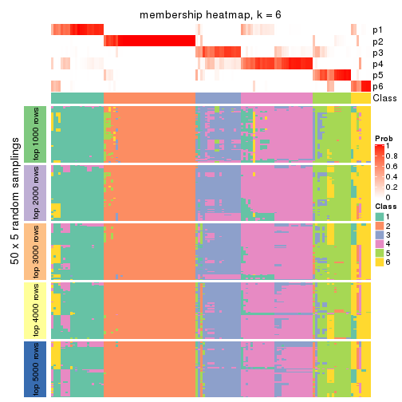</p>

</div>
</div>

As soon as we have had the classes for columns, we can look for signatures
which are significantly different between classes which can be candidate marks
for certain classes. Following are the heatmaps for signatures.


Signature heatmaps where rows are scaled:


<script>
$( function() {
	$( '#tabs-SD-skmeans-get-signatures' ).tabs();
} );
</script>
<div id='tabs-SD-skmeans-get-signatures'>
<ul>
<li><a href='#tab-SD-skmeans-get-signatures-1'>k = 2</a></li>
<li><a href='#tab-SD-skmeans-get-signatures-2'>k = 3</a></li>
<li><a href='#tab-SD-skmeans-get-signatures-3'>k = 4</a></li>
<li><a href='#tab-SD-skmeans-get-signatures-4'>k = 5</a></li>
<li><a href='#tab-SD-skmeans-get-signatures-5'>k = 6</a></li>
</ul>
<div id='tab-SD-skmeans-get-signatures-1'>
<pre><code class="r">get_signatures(res, k = 2)
</code></pre>

<p></p>

</div>
<div id='tab-SD-skmeans-get-signatures-2'>
<pre><code class="r">get_signatures(res, k = 3)
</code></pre>

<p></p>

</div>
<div id='tab-SD-skmeans-get-signatures-3'>
<pre><code class="r">get_signatures(res, k = 4)
</code></pre>

<p></p>

</div>
<div id='tab-SD-skmeans-get-signatures-4'>
<pre><code class="r">get_signatures(res, k = 5)
</code></pre>

<p></p>

</div>
<div id='tab-SD-skmeans-get-signatures-5'>
<pre><code class="r">get_signatures(res, k = 6)
</code></pre>

<p></p>

</div>
</div>


Signature heatmaps where rows are not scaled:


<script>
$( function() {
	$( '#tabs-SD-skmeans-get-signatures-no-scale' ).tabs();
} );
</script>
<div id='tabs-SD-skmeans-get-signatures-no-scale'>
<ul>
<li><a href='#tab-SD-skmeans-get-signatures-no-scale-1'>k = 2</a></li>
<li><a href='#tab-SD-skmeans-get-signatures-no-scale-2'>k = 3</a></li>
<li><a href='#tab-SD-skmeans-get-signatures-no-scale-3'>k = 4</a></li>
<li><a href='#tab-SD-skmeans-get-signatures-no-scale-4'>k = 5</a></li>
<li><a href='#tab-SD-skmeans-get-signatures-no-scale-5'>k = 6</a></li>
</ul>
<div id='tab-SD-skmeans-get-signatures-no-scale-1'>
<pre><code class="r">get_signatures(res, k = 2, scale_rows = FALSE)
</code></pre>

<p></p>

</div>
<div id='tab-SD-skmeans-get-signatures-no-scale-2'>
<pre><code class="r">get_signatures(res, k = 3, scale_rows = FALSE)
</code></pre>

<p></p>

</div>
<div id='tab-SD-skmeans-get-signatures-no-scale-3'>
<pre><code class="r">get_signatures(res, k = 4, scale_rows = FALSE)
</code></pre>

<p></p>

</div>
<div id='tab-SD-skmeans-get-signatures-no-scale-4'>
<pre><code class="r">get_signatures(res, k = 5, scale_rows = FALSE)
</code></pre>

<p></p>

</div>
<div id='tab-SD-skmeans-get-signatures-no-scale-5'>
<pre><code class="r">get_signatures(res, k = 6, scale_rows = FALSE)
</code></pre>

<p></p>

</div>
</div>


Compare the overlap of signatures from different k:

```r
compare_signatures(res)
```


`get_signature()` returns a data frame invisibly. TO get the list of signatures, the function
call should be assigned to a variable explicitly. In following code, if `plot` argument is set
to `FALSE`, no heatmap is plotted while only the differential analysis is performed.

```r
# code only for demonstration
tb = get_signature(res, k = ..., plot = FALSE)
```

An example of the output of `tb` is:

```
#>   which_row         fdr    mean_1    mean_2 scaled_mean_1 scaled_mean_2 km
#> 1        38 0.042760348  8.373488  9.131774    -0.5533452     0.5164555  1
#> 2        40 0.018707592  7.106213  8.469186    -0.6173731     0.5762149  1
#> 3        55 0.019134737 10.221463 11.207825    -0.6159697     0.5749050  1
#> 4        59 0.006059896  5.921854  7.869574    -0.6899429     0.6439467  1
#> 5        60 0.018055526  8.928898 10.211722    -0.6204761     0.5791110  1
#> 6        98 0.009384629 15.714769 14.887706     0.6635654    -0.6193277  2
...
```

The columns in `tb` are:

1. `which_row`: row indices corresponding to the input matrix.
2. `fdr`: FDR for the differential test. 
3. `mean_x`: The mean value in group x.
4. `scaled_mean_x`: The mean value in group x after rows are scaled.
5. `km`: Row groups if k-means clustering is applied to rows.


UMAP plot which shows how samples are separated.


<script>
$( function() {
	$( '#tabs-SD-skmeans-dimension-reduction' ).tabs();
} );
</script>
<div id='tabs-SD-skmeans-dimension-reduction'>
<ul>
<li><a href='#tab-SD-skmeans-dimension-reduction-1'>k = 2</a></li>
<li><a href='#tab-SD-skmeans-dimension-reduction-2'>k = 3</a></li>
<li><a href='#tab-SD-skmeans-dimension-reduction-3'>k = 4</a></li>
<li><a href='#tab-SD-skmeans-dimension-reduction-4'>k = 5</a></li>
<li><a href='#tab-SD-skmeans-dimension-reduction-5'>k = 6</a></li>
</ul>
<div id='tab-SD-skmeans-dimension-reduction-1'>
<pre><code class="r">dimension_reduction(res, k = 2, method = &quot;UMAP&quot;)
</code></pre>

<p></p>

</div>
<div id='tab-SD-skmeans-dimension-reduction-2'>
<pre><code class="r">dimension_reduction(res, k = 3, method = &quot;UMAP&quot;)
</code></pre>

<p></p>

</div>
<div id='tab-SD-skmeans-dimension-reduction-3'>
<pre><code class="r">dimension_reduction(res, k = 4, method = &quot;UMAP&quot;)
</code></pre>

<p></p>

</div>
<div id='tab-SD-skmeans-dimension-reduction-4'>
<pre><code class="r">dimension_reduction(res, k = 5, method = &quot;UMAP&quot;)
</code></pre>

<p></p>

</div>
<div id='tab-SD-skmeans-dimension-reduction-5'>
<pre><code class="r">dimension_reduction(res, k = 6, method = &quot;UMAP&quot;)
</code></pre>

<p></p>

</div>
</div>


Following heatmap shows how subgroups are split when increasing `k`:

```r
collect_classes(res)
```


If matrix rows can be associated to genes, consider to use `functional_enrichment(res,
...)` to perform function enrichment for the signature genes. See [this vignette](http://bioconductor.org/packages/devel/bioc/vignettes/cola/inst/doc/functional_enrichment.html) for more detailed explanations.


 

---------------------------------------------------


### SD:pam**


The object with results only for a single top-value method and a single partition method 
can be extracted as:

```r
res = res_list["SD", "pam"]
# you can also extract it by
# res = res_list["SD:pam"]
```

A summary of `res` and all the functions that can be applied to it:

```r
res
```

```
#> A 'ConsensusPartition' object with k = 2, 3, 4, 5, 6.
#>   On a matrix with 13580 rows and 133 columns.
#>   Top rows (1000, 2000, 3000, 4000, 5000) are extracted by 'SD' method.
#>   Subgroups are detected by 'pam' method.
#>   Performed in total 1250 partitions by row resampling.
#>   Best k for subgroups seems to be 2.
#> 
#> Following methods can be applied to this 'ConsensusPartition' object:
#>  [1] "cola_report"             "collect_classes"         "collect_plots"          
#>  [4] "collect_stats"           "colnames"                "compare_signatures"     
#>  [7] "consensus_heatmap"       "dimension_reduction"     "functional_enrichment"  
#> [10] "get_anno_col"            "get_anno"                "get_classes"            
#> [13] "get_consensus"           "get_matrix"              "get_membership"         
#> [16] "get_param"               "get_signatures"          "get_stats"              
#> [19] "is_best_k"               "is_stable_k"             "membership_heatmap"     
#> [22] "ncol"                    "nrow"                    "plot_ecdf"              
#> [25] "rownames"                "select_partition_number" "show"                   
#> [28] "suggest_best_k"          "test_to_known_factors"
```

`collect_plots()` function collects all the plots made from `res` for all `k` (number of partitions)
into one single page to provide an easy and fast comparison between different `k`.

```r
collect_plots(res)
```


The plots are:

- The first row: a plot of the ECDF (empirical cumulative distribution
  function) curves of the consensus matrix for each `k` and the heatmap of
  predicted classes for each `k`.
- The second row: heatmaps of the consensus matrix for each `k`.
- The third row: heatmaps of the membership matrix for each `k`.
- The fouth row: heatmaps of the signatures for each `k`.

All the plots in panels can be made by individual functions and they are
plotted later in this section.

`select_partition_number()` produces several plots showing different
statistics for choosing "optimized" `k`. There are following statistics:

- ECDF curves of the consensus matrix for each `k`;
- 1-PAC. [The PAC
  score](https://en.wikipedia.org/wiki/Consensus_clustering#Over-interpretation_potential_of_consensus_clustering)
  measures the proportion of the ambiguous subgrouping.
- Mean silhouette score.
- Concordance. The mean probability of fiting the consensus class ids in all
  partitions.
- Area increased. Denote $A_k$ as the area under the ECDF curve for current
  `k`, the area increased is defined as $A_k - A_{k-1}$.
- Rand index. The percent of pairs of samples that are both in a same cluster
  or both are not in a same cluster in the partition of k and k-1.
- Jaccard index. The ratio of pairs of samples are both in a same cluster in
  the partition of k and k-1 and the pairs of samples are both in a same
  cluster in the partition k or k-1.

The detailed explanations of these statistics can be found in [the _cola_
vignette](http://bioconductor.org/packages/devel/bioc/vignettes/cola/inst/doc/cola.html#toc_13).

Generally speaking, lower PAC score, higher mean silhouette score or higher
concordance corresponds to better partition. Rand index and Jaccard index
measure how similar the current partition is compared to partition with `k-1`.
If they are too similar, we won't accept `k` is better than `k-1`.

```r
select_partition_number(res)
```


The numeric values for all these statistics can be obtained by `get_stats()`.

```r
get_stats(res)
```

```
#>   k 1-PAC mean_silhouette concordance area_increased  Rand Jaccard
#> 2 2 1.000           0.973       0.989         0.4283 0.565   0.565
#> 3 3 0.767           0.865       0.935         0.4871 0.667   0.468
#> 4 4 0.750           0.782       0.892         0.1509 0.778   0.476
#> 5 5 0.731           0.781       0.879         0.0663 0.853   0.535
#> 6 6 0.720           0.724       0.804         0.0525 0.910   0.619
```

`suggest_best_k()` suggests the best $k$ based on these statistics. The rules are as follows:

- All $k$ with Jaccard index larger than 0.95 are removed because increasing
  $k$ does not provide enough extra information. If all $k$ are removed, it is
  marked as no subgroup is detected.
- For all $k$ with 1-PAC score larger than 0.9, the maximal $k$ is taken as
  the best $k$, and other $k$ are marked as optional $k$.
- If it does not fit the second rule. The $k$ with the maximal vote of the
  highest 1-PAC score, highest mean silhouette, and highest concordance is
  taken as the best $k$.

```r
suggest_best_k(res)
```

```
#> [1] 2
```


Following shows the table of the partitions (You need to click the **show/hide
code output** link to see it). The membership matrix (columns with name `p*`)
is inferred by
[`clue::cl_consensus()`](https://www.rdocumentation.org/link/cl_consensus?package=clue)
function with the `SE` method. Basically the value in the membership matrix
represents the probability to belong to a certain group. The finall class
label for an item is determined with the group with highest probability it
belongs to.

In `get_classes()` function, the entropy is calculated from the membership
matrix and the silhouette score is calculated from the consensus matrix.


<script>
$( function() {
	$( '#tabs-SD-pam-get-classes' ).tabs();
} );
</script>
<div id='tabs-SD-pam-get-classes'>
<ul>
<li><a href='#tab-SD-pam-get-classes-1'>k = 2</a></li>
<li><a href='#tab-SD-pam-get-classes-2'>k = 3</a></li>
<li><a href='#tab-SD-pam-get-classes-3'>k = 4</a></li>
<li><a href='#tab-SD-pam-get-classes-4'>k = 5</a></li>
<li><a href='#tab-SD-pam-get-classes-5'>k = 6</a></li>
</ul>

<div id='tab-SD-pam-get-classes-1'>
<p><a id='tab-SD-pam-get-classes-1-a' style='color:#0366d6' href='#'>show/hide code output</a></p>
<pre><code class="r">cbind(get_classes(res, k = 2), get_membership(res, k = 2))
</code></pre>

<pre><code>#&gt;            class entropy silhouette    p1    p2
#&gt; SRR1951667     2  0.0000      0.966 0.000 1.000
#&gt; SRR1951666     2  0.0000      0.966 0.000 1.000
#&gt; SRR1951665     2  0.0000      0.966 0.000 1.000
#&gt; SRR1951664     1  0.0000      0.999 1.000 0.000
#&gt; SRR1951663     1  0.0000      0.999 1.000 0.000
#&gt; SRR1951662     2  0.0000      0.966 0.000 1.000
#&gt; SRR1951661     1  0.0376      0.995 0.996 0.004
#&gt; SRR1951660     1  0.0000      0.999 1.000 0.000
#&gt; SRR1951659     2  0.0000      0.966 0.000 1.000
#&gt; SRR1951658     2  0.0000      0.966 0.000 1.000
#&gt; SRR1951657     1  0.0000      0.999 1.000 0.000
#&gt; SRR1951656     1  0.0000      0.999 1.000 0.000
#&gt; SRR1951655     1  0.0000      0.999 1.000 0.000
#&gt; SRR1951654     1  0.0000      0.999 1.000 0.000
#&gt; SRR1951653     1  0.0000      0.999 1.000 0.000
#&gt; SRR1951652     2  0.0000      0.966 0.000 1.000
#&gt; SRR1951651     1  0.0000      0.999 1.000 0.000
#&gt; SRR1951650     1  0.0000      0.999 1.000 0.000
#&gt; SRR1951648     2  0.9896      0.239 0.440 0.560
#&gt; SRR1951649     1  0.0000      0.999 1.000 0.000
#&gt; SRR1951647     1  0.0000      0.999 1.000 0.000
#&gt; SRR1951646     1  0.0000      0.999 1.000 0.000
#&gt; SRR1951645     1  0.0000      0.999 1.000 0.000
#&gt; SRR1951644     1  0.0000      0.999 1.000 0.000
#&gt; SRR1951643     1  0.0000      0.999 1.000 0.000
#&gt; SRR1951641     2  0.0000      0.966 0.000 1.000
#&gt; SRR1951642     1  0.0000      0.999 1.000 0.000
#&gt; SRR1951694     1  0.0000      0.999 1.000 0.000
#&gt; SRR1951731     1  0.0000      0.999 1.000 0.000
#&gt; SRR1951730     2  0.0000      0.966 0.000 1.000
#&gt; SRR1951752     1  0.0000      0.999 1.000 0.000
#&gt; SRR1951751     1  0.0000      0.999 1.000 0.000
#&gt; SRR1951749     2  0.0000      0.966 0.000 1.000
#&gt; SRR1951750     1  0.0000      0.999 1.000 0.000
#&gt; SRR1951748     2  0.0000      0.966 0.000 1.000
#&gt; SRR1951747     2  0.0000      0.966 0.000 1.000
#&gt; SRR1951745     1  0.0000      0.999 1.000 0.000
#&gt; SRR1951746     2  0.0000      0.966 0.000 1.000
#&gt; SRR1951744     1  0.0000      0.999 1.000 0.000
#&gt; SRR1951742     2  0.0000      0.966 0.000 1.000
#&gt; SRR1951743     2  0.0000      0.966 0.000 1.000
#&gt; SRR1951741     1  0.0000      0.999 1.000 0.000
#&gt; SRR1951740     1  0.0000      0.999 1.000 0.000
#&gt; SRR1951738     2  0.0000      0.966 0.000 1.000
#&gt; SRR1951739     2  0.0000      0.966 0.000 1.000
#&gt; SRR1951737     1  0.0000      0.999 1.000 0.000
#&gt; SRR1951736     1  0.0000      0.999 1.000 0.000
#&gt; SRR1951734     2  0.0000      0.966 0.000 1.000
#&gt; SRR1951735     1  0.0000      0.999 1.000 0.000
#&gt; SRR1951733     2  0.0000      0.966 0.000 1.000
#&gt; SRR1951732     2  0.0000      0.966 0.000 1.000
#&gt; SRR1951729     1  0.0000      0.999 1.000 0.000
#&gt; SRR1951728     1  0.0000      0.999 1.000 0.000
#&gt; SRR1951727     2  0.0000      0.966 0.000 1.000
#&gt; SRR1951725     1  0.0000      0.999 1.000 0.000
#&gt; SRR1951726     1  0.0000      0.999 1.000 0.000
#&gt; SRR1951724     1  0.0000      0.999 1.000 0.000
#&gt; SRR1951722     1  0.0000      0.999 1.000 0.000
#&gt; SRR1951723     1  0.0000      0.999 1.000 0.000
#&gt; SRR1951721     1  0.0000      0.999 1.000 0.000
#&gt; SRR1951719     1  0.0000      0.999 1.000 0.000
#&gt; SRR1951720     1  0.0000      0.999 1.000 0.000
#&gt; SRR1951718     1  0.0000      0.999 1.000 0.000
#&gt; SRR1951717     1  0.0000      0.999 1.000 0.000
#&gt; SRR1951715     1  0.0000      0.999 1.000 0.000
#&gt; SRR1951716     1  0.0000      0.999 1.000 0.000
#&gt; SRR1951714     1  0.0000      0.999 1.000 0.000
#&gt; SRR1951713     1  0.0000      0.999 1.000 0.000
#&gt; SRR1951712     1  0.0000      0.999 1.000 0.000
#&gt; SRR1951711     2  0.0000      0.966 0.000 1.000
#&gt; SRR1951710     1  0.0000      0.999 1.000 0.000
#&gt; SRR1951709     2  0.0000      0.966 0.000 1.000
#&gt; SRR1951708     2  0.0000      0.966 0.000 1.000
#&gt; SRR1951707     1  0.0000      0.999 1.000 0.000
#&gt; SRR1951705     1  0.0000      0.999 1.000 0.000
#&gt; SRR1951704     1  0.0000      0.999 1.000 0.000
#&gt; SRR1951703     2  0.0000      0.966 0.000 1.000
#&gt; SRR1951706     1  0.3431      0.929 0.936 0.064
#&gt; SRR1951702     1  0.0000      0.999 1.000 0.000
#&gt; SRR1951701     2  0.0000      0.966 0.000 1.000
#&gt; SRR1951699     2  0.0000      0.966 0.000 1.000
#&gt; SRR1951698     1  0.0000      0.999 1.000 0.000
#&gt; SRR1951700     1  0.0000      0.999 1.000 0.000
#&gt; SRR1951697     2  0.0000      0.966 0.000 1.000
#&gt; SRR1951696     1  0.0000      0.999 1.000 0.000
#&gt; SRR1951695     1  0.0000      0.999 1.000 0.000
#&gt; SRR1951693     1  0.0000      0.999 1.000 0.000
#&gt; SRR1951692     1  0.0000      0.999 1.000 0.000
#&gt; SRR1951691     1  0.0000      0.999 1.000 0.000
#&gt; SRR1951688     2  0.0000      0.966 0.000 1.000
#&gt; SRR1951689     2  0.7139      0.753 0.196 0.804
#&gt; SRR1951687     1  0.0000      0.999 1.000 0.000
#&gt; SRR1951685     1  0.0000      0.999 1.000 0.000
#&gt; SRR1951684     1  0.0000      0.999 1.000 0.000
#&gt; SRR1951686     2  0.0000      0.966 0.000 1.000
#&gt; SRR1951683     1  0.0000      0.999 1.000 0.000
#&gt; SRR1951682     2  0.0000      0.966 0.000 1.000
#&gt; SRR1951690     2  0.0000      0.966 0.000 1.000
#&gt; SRR1951680     1  0.0000      0.999 1.000 0.000
#&gt; SRR1951679     1  0.0000      0.999 1.000 0.000
#&gt; SRR1951678     1  0.0000      0.999 1.000 0.000
#&gt; SRR1951677     1  0.0000      0.999 1.000 0.000
#&gt; SRR1951676     1  0.0000      0.999 1.000 0.000
#&gt; SRR1951675     2  0.0000      0.966 0.000 1.000
#&gt; SRR1951681     1  0.0000      0.999 1.000 0.000
#&gt; SRR1951673     2  0.9286      0.501 0.344 0.656
#&gt; SRR1951674     1  0.0000      0.999 1.000 0.000
#&gt; SRR1951672     1  0.0000      0.999 1.000 0.000
#&gt; SRR1951671     2  0.0000      0.966 0.000 1.000
#&gt; SRR1951670     1  0.0000      0.999 1.000 0.000
#&gt; SRR1951640     1  0.0000      0.999 1.000 0.000
#&gt; SRR1951668     1  0.0000      0.999 1.000 0.000
#&gt; SRR1951669     2  0.0000      0.966 0.000 1.000
#&gt; SRR1951638     1  0.0000      0.999 1.000 0.000
#&gt; SRR1951637     2  0.0000      0.966 0.000 1.000
#&gt; SRR1951635     1  0.0000      0.999 1.000 0.000
#&gt; SRR1951634     1  0.0000      0.999 1.000 0.000
#&gt; SRR1951631     1  0.0000      0.999 1.000 0.000
#&gt; SRR1951632     2  0.0000      0.966 0.000 1.000
#&gt; SRR1951633     1  0.0000      0.999 1.000 0.000
#&gt; SRR1951630     1  0.0000      0.999 1.000 0.000
#&gt; SRR1951629     1  0.0000      0.999 1.000 0.000
#&gt; SRR1951628     1  0.0000      0.999 1.000 0.000
#&gt; SRR1951627     2  0.0000      0.966 0.000 1.000
#&gt; SRR1951639     1  0.0000      0.999 1.000 0.000
#&gt; SRR1951625     2  0.9710      0.369 0.400 0.600
#&gt; SRR1951626     1  0.0000      0.999 1.000 0.000
#&gt; SRR1951624     1  0.0000      0.999 1.000 0.000
#&gt; SRR1951622     1  0.0000      0.999 1.000 0.000
#&gt; SRR1951636     1  0.0000      0.999 1.000 0.000
#&gt; SRR1951623     1  0.0000      0.999 1.000 0.000
#&gt; SRR1951621     1  0.0000      0.999 1.000 0.000
#&gt; SRR1951620     1  0.0000      0.999 1.000 0.000
</code></pre>

<script>
$('#tab-SD-pam-get-classes-1-a').parent().next().next().hide();
$('#tab-SD-pam-get-classes-1-a').click(function(){
  $('#tab-SD-pam-get-classes-1-a').parent().next().next().toggle();
  return(false);
});
</script>
</div>

<div id='tab-SD-pam-get-classes-2'>
<p><a id='tab-SD-pam-get-classes-2-a' style='color:#0366d6' href='#'>show/hide code output</a></p>
<pre><code class="r">cbind(get_classes(res, k = 3), get_membership(res, k = 3))
</code></pre>

<pre><code>#&gt;            class entropy silhouette    p1    p2    p3
#&gt; SRR1951667     2  0.0000     0.9432 0.000 1.000 0.000
#&gt; SRR1951666     3  0.4062     0.7429 0.000 0.164 0.836
#&gt; SRR1951665     2  0.0000     0.9432 0.000 1.000 0.000
#&gt; SRR1951664     1  0.2878     0.9045 0.904 0.000 0.096
#&gt; SRR1951663     3  0.0000     0.8675 0.000 0.000 1.000
#&gt; SRR1951662     2  0.0000     0.9432 0.000 1.000 0.000
#&gt; SRR1951661     3  0.0000     0.8675 0.000 0.000 1.000
#&gt; SRR1951660     1  0.2066     0.9363 0.940 0.000 0.060
#&gt; SRR1951659     2  0.0000     0.9432 0.000 1.000 0.000
#&gt; SRR1951658     2  0.0000     0.9432 0.000 1.000 0.000
#&gt; SRR1951657     1  0.0000     0.9605 1.000 0.000 0.000
#&gt; SRR1951656     1  0.0000     0.9605 1.000 0.000 0.000
#&gt; SRR1951655     1  0.0000     0.9605 1.000 0.000 0.000
#&gt; SRR1951654     1  0.3340     0.8423 0.880 0.000 0.120
#&gt; SRR1951653     1  0.2066     0.9363 0.940 0.000 0.060
#&gt; SRR1951652     3  0.2066     0.8329 0.000 0.060 0.940
#&gt; SRR1951651     1  0.0000     0.9605 1.000 0.000 0.000
#&gt; SRR1951650     3  0.4702     0.7536 0.212 0.000 0.788
#&gt; SRR1951648     3  0.0000     0.8675 0.000 0.000 1.000
#&gt; SRR1951649     1  0.2066     0.9363 0.940 0.000 0.060
#&gt; SRR1951647     3  0.4291     0.7622 0.180 0.000 0.820
#&gt; SRR1951646     1  0.2066     0.9363 0.940 0.000 0.060
#&gt; SRR1951645     1  0.2066     0.9363 0.940 0.000 0.060
#&gt; SRR1951644     1  0.2625     0.9166 0.916 0.000 0.084
#&gt; SRR1951643     1  0.0000     0.9605 1.000 0.000 0.000
#&gt; SRR1951641     2  0.0000     0.9432 0.000 1.000 0.000
#&gt; SRR1951642     1  0.0000     0.9605 1.000 0.000 0.000
#&gt; SRR1951694     3  0.0237     0.8668 0.004 0.000 0.996
#&gt; SRR1951731     3  0.0000     0.8675 0.000 0.000 1.000
#&gt; SRR1951730     3  0.2066     0.8329 0.000 0.060 0.940
#&gt; SRR1951752     3  0.0000     0.8675 0.000 0.000 1.000
#&gt; SRR1951751     1  0.2066     0.9363 0.940 0.000 0.060
#&gt; SRR1951749     3  0.2066     0.8329 0.000 0.060 0.940
#&gt; SRR1951750     1  0.0000     0.9605 1.000 0.000 0.000
#&gt; SRR1951748     2  0.0000     0.9432 0.000 1.000 0.000
#&gt; SRR1951747     2  0.0000     0.9432 0.000 1.000 0.000
#&gt; SRR1951745     3  0.3619     0.8111 0.136 0.000 0.864
#&gt; SRR1951746     2  0.0000     0.9432 0.000 1.000 0.000
#&gt; SRR1951744     3  0.3619     0.8111 0.136 0.000 0.864
#&gt; SRR1951742     3  0.4291     0.7268 0.000 0.180 0.820
#&gt; SRR1951743     2  0.0000     0.9432 0.000 1.000 0.000
#&gt; SRR1951741     1  0.0000     0.9605 1.000 0.000 0.000
#&gt; SRR1951740     1  0.0000     0.9605 1.000 0.000 0.000
#&gt; SRR1951738     2  0.2959     0.8603 0.000 0.900 0.100
#&gt; SRR1951739     2  0.0592     0.9346 0.000 0.988 0.012
#&gt; SRR1951737     1  0.2796     0.9076 0.908 0.000 0.092
#&gt; SRR1951736     1  0.0000     0.9605 1.000 0.000 0.000
#&gt; SRR1951734     2  0.0000     0.9432 0.000 1.000 0.000
#&gt; SRR1951735     3  0.5497     0.6482 0.292 0.000 0.708
#&gt; SRR1951733     3  0.0000     0.8675 0.000 0.000 1.000
#&gt; SRR1951732     2  0.0000     0.9432 0.000 1.000 0.000
#&gt; SRR1951729     1  0.5529     0.5748 0.704 0.000 0.296
#&gt; SRR1951728     3  0.0000     0.8675 0.000 0.000 1.000
#&gt; SRR1951727     2  0.0000     0.9432 0.000 1.000 0.000
#&gt; SRR1951725     3  0.3619     0.8111 0.136 0.000 0.864
#&gt; SRR1951726     3  0.0000     0.8675 0.000 0.000 1.000
#&gt; SRR1951724     3  0.4750     0.7516 0.216 0.000 0.784
#&gt; SRR1951722     3  0.2959     0.8317 0.100 0.000 0.900
#&gt; SRR1951723     1  0.2066     0.9363 0.940 0.000 0.060
#&gt; SRR1951721     3  0.0000     0.8675 0.000 0.000 1.000
#&gt; SRR1951719     1  0.0000     0.9605 1.000 0.000 0.000
#&gt; SRR1951720     1  0.0000     0.9605 1.000 0.000 0.000
#&gt; SRR1951718     1  0.2066     0.9363 0.940 0.000 0.060
#&gt; SRR1951717     1  0.0000     0.9605 1.000 0.000 0.000
#&gt; SRR1951715     3  0.0237     0.8668 0.004 0.000 0.996
#&gt; SRR1951716     1  0.0000     0.9605 1.000 0.000 0.000
#&gt; SRR1951714     1  0.0000     0.9605 1.000 0.000 0.000
#&gt; SRR1951713     1  0.0000     0.9605 1.000 0.000 0.000
#&gt; SRR1951712     1  0.0000     0.9605 1.000 0.000 0.000
#&gt; SRR1951711     2  0.0000     0.9432 0.000 1.000 0.000
#&gt; SRR1951710     3  0.5785     0.5784 0.332 0.000 0.668
#&gt; SRR1951709     3  0.2066     0.8329 0.000 0.060 0.940
#&gt; SRR1951708     2  0.0000     0.9432 0.000 1.000 0.000
#&gt; SRR1951707     3  0.0000     0.8675 0.000 0.000 1.000
#&gt; SRR1951705     1  0.4702     0.7433 0.788 0.000 0.212
#&gt; SRR1951704     3  0.0000     0.8675 0.000 0.000 1.000
#&gt; SRR1951703     2  0.0000     0.9432 0.000 1.000 0.000
#&gt; SRR1951706     3  0.0000     0.8675 0.000 0.000 1.000
#&gt; SRR1951702     3  0.0000     0.8675 0.000 0.000 1.000
#&gt; SRR1951701     2  0.0000     0.9432 0.000 1.000 0.000
#&gt; SRR1951699     3  0.0000     0.8675 0.000 0.000 1.000
#&gt; SRR1951698     3  0.0000     0.8675 0.000 0.000 1.000
#&gt; SRR1951700     1  0.4887     0.7092 0.772 0.000 0.228
#&gt; SRR1951697     2  0.0000     0.9432 0.000 1.000 0.000
#&gt; SRR1951696     1  0.0000     0.9605 1.000 0.000 0.000
#&gt; SRR1951695     3  0.6260     0.2974 0.448 0.000 0.552
#&gt; SRR1951693     3  0.5835     0.5631 0.340 0.000 0.660
#&gt; SRR1951692     1  0.0000     0.9605 1.000 0.000 0.000
#&gt; SRR1951691     1  0.2066     0.9363 0.940 0.000 0.060
#&gt; SRR1951688     2  0.5529     0.6182 0.000 0.704 0.296
#&gt; SRR1951689     3  0.2066     0.8329 0.000 0.060 0.940
#&gt; SRR1951687     1  0.0000     0.9605 1.000 0.000 0.000
#&gt; SRR1951685     3  0.0000     0.8675 0.000 0.000 1.000
#&gt; SRR1951684     1  0.0000     0.9605 1.000 0.000 0.000
#&gt; SRR1951686     2  0.6274     0.2122 0.000 0.544 0.456
#&gt; SRR1951683     1  0.0000     0.9605 1.000 0.000 0.000
#&gt; SRR1951682     2  0.0000     0.9432 0.000 1.000 0.000
#&gt; SRR1951690     2  0.0000     0.9432 0.000 1.000 0.000
#&gt; SRR1951680     1  0.0000     0.9605 1.000 0.000 0.000
#&gt; SRR1951679     3  0.5785     0.5790 0.332 0.000 0.668
#&gt; SRR1951678     1  0.0000     0.9605 1.000 0.000 0.000
#&gt; SRR1951677     1  0.0000     0.9605 1.000 0.000 0.000
#&gt; SRR1951676     3  0.5327     0.7094 0.272 0.000 0.728
#&gt; SRR1951675     2  0.0000     0.9432 0.000 1.000 0.000
#&gt; SRR1951681     3  0.4654     0.7574 0.208 0.000 0.792
#&gt; SRR1951673     3  0.2066     0.8329 0.000 0.060 0.940
#&gt; SRR1951674     3  0.3619     0.8111 0.136 0.000 0.864
#&gt; SRR1951672     1  0.2066     0.9363 0.940 0.000 0.060
#&gt; SRR1951671     3  0.2066     0.8329 0.000 0.060 0.940
#&gt; SRR1951670     1  0.0000     0.9605 1.000 0.000 0.000
#&gt; SRR1951640     1  0.2066     0.9363 0.940 0.000 0.060
#&gt; SRR1951668     1  0.0000     0.9605 1.000 0.000 0.000
#&gt; SRR1951669     2  0.3551     0.8297 0.000 0.868 0.132
#&gt; SRR1951638     1  0.0000     0.9605 1.000 0.000 0.000
#&gt; SRR1951637     3  0.2066     0.8329 0.000 0.060 0.940
#&gt; SRR1951635     1  0.2066     0.9363 0.940 0.000 0.060
#&gt; SRR1951634     1  0.0000     0.9605 1.000 0.000 0.000
#&gt; SRR1951631     1  0.0000     0.9605 1.000 0.000 0.000
#&gt; SRR1951632     2  0.6235     0.2966 0.000 0.564 0.436
#&gt; SRR1951633     1  0.0237     0.9580 0.996 0.000 0.004
#&gt; SRR1951630     1  0.0000     0.9605 1.000 0.000 0.000
#&gt; SRR1951629     1  0.0000     0.9605 1.000 0.000 0.000
#&gt; SRR1951628     3  0.4702     0.7335 0.212 0.000 0.788
#&gt; SRR1951627     3  0.2878     0.8112 0.000 0.096 0.904
#&gt; SRR1951639     3  0.0000     0.8675 0.000 0.000 1.000
#&gt; SRR1951625     3  0.0000     0.8675 0.000 0.000 1.000
#&gt; SRR1951626     3  0.0000     0.8675 0.000 0.000 1.000
#&gt; SRR1951624     3  0.6309     0.0669 0.496 0.000 0.504
#&gt; SRR1951622     1  0.2066     0.9363 0.940 0.000 0.060
#&gt; SRR1951636     3  0.0000     0.8675 0.000 0.000 1.000
#&gt; SRR1951623     3  0.3619     0.8111 0.136 0.000 0.864
#&gt; SRR1951621     1  0.0000     0.9605 1.000 0.000 0.000
#&gt; SRR1951620     1  0.0000     0.9605 1.000 0.000 0.000
</code></pre>

<script>
$('#tab-SD-pam-get-classes-2-a').parent().next().next().hide();
$('#tab-SD-pam-get-classes-2-a').click(function(){
  $('#tab-SD-pam-get-classes-2-a').parent().next().next().toggle();
  return(false);
});
</script>
</div>

<div id='tab-SD-pam-get-classes-3'>
<p><a id='tab-SD-pam-get-classes-3-a' style='color:#0366d6' href='#'>show/hide code output</a></p>
<pre><code class="r">cbind(get_classes(res, k = 4), get_membership(res, k = 4))
</code></pre>

<pre><code>#&gt;            class entropy silhouette    p1    p2    p3    p4
#&gt; SRR1951667     2  0.3711      0.788 0.024 0.836 0.140 0.000
#&gt; SRR1951666     3  0.4304      0.635 0.000 0.284 0.716 0.000
#&gt; SRR1951665     2  0.0000      0.971 0.000 1.000 0.000 0.000
#&gt; SRR1951664     4  0.3280      0.779 0.016 0.000 0.124 0.860
#&gt; SRR1951663     1  0.1118      0.866 0.964 0.000 0.036 0.000
#&gt; SRR1951662     2  0.0000      0.971 0.000 1.000 0.000 0.000
#&gt; SRR1951661     3  0.0000      0.863 0.000 0.000 1.000 0.000
#&gt; SRR1951660     1  0.0817      0.883 0.976 0.000 0.000 0.024
#&gt; SRR1951659     2  0.0000      0.971 0.000 1.000 0.000 0.000
#&gt; SRR1951658     2  0.0000      0.971 0.000 1.000 0.000 0.000
#&gt; SRR1951657     4  0.0000      0.829 0.000 0.000 0.000 1.000
#&gt; SRR1951656     4  0.0000      0.829 0.000 0.000 0.000 1.000
#&gt; SRR1951655     4  0.1557      0.798 0.056 0.000 0.000 0.944
#&gt; SRR1951654     1  0.2125      0.869 0.920 0.000 0.004 0.076
#&gt; SRR1951653     4  0.0469      0.827 0.012 0.000 0.000 0.988
#&gt; SRR1951652     3  0.3991      0.755 0.020 0.172 0.808 0.000
#&gt; SRR1951651     4  0.0000      0.829 0.000 0.000 0.000 1.000
#&gt; SRR1951650     4  0.5366      0.443 0.012 0.000 0.440 0.548
#&gt; SRR1951648     3  0.0000      0.863 0.000 0.000 1.000 0.000
#&gt; SRR1951649     4  0.1792      0.809 0.068 0.000 0.000 0.932
#&gt; SRR1951647     3  0.0524      0.858 0.004 0.000 0.988 0.008
#&gt; SRR1951646     4  0.5353      0.457 0.012 0.000 0.432 0.556
#&gt; SRR1951645     4  0.1637      0.812 0.060 0.000 0.000 0.940
#&gt; SRR1951644     1  0.4948      0.286 0.560 0.000 0.000 0.440
#&gt; SRR1951643     4  0.0000      0.829 0.000 0.000 0.000 1.000
#&gt; SRR1951641     2  0.0000      0.971 0.000 1.000 0.000 0.000
#&gt; SRR1951642     4  0.0000      0.829 0.000 0.000 0.000 1.000
#&gt; SRR1951694     1  0.0000      0.877 1.000 0.000 0.000 0.000
#&gt; SRR1951731     3  0.0336      0.860 0.008 0.000 0.992 0.000
#&gt; SRR1951730     3  0.5250      0.567 0.024 0.316 0.660 0.000
#&gt; SRR1951752     3  0.0817      0.857 0.024 0.000 0.976 0.000
#&gt; SRR1951751     4  0.2647      0.776 0.120 0.000 0.000 0.880
#&gt; SRR1951749     3  0.0000      0.863 0.000 0.000 1.000 0.000
#&gt; SRR1951750     4  0.3356      0.674 0.176 0.000 0.000 0.824
#&gt; SRR1951748     2  0.0000      0.971 0.000 1.000 0.000 0.000
#&gt; SRR1951747     2  0.0000      0.971 0.000 1.000 0.000 0.000
#&gt; SRR1951745     1  0.1867      0.854 0.928 0.000 0.072 0.000
#&gt; SRR1951746     2  0.0000      0.971 0.000 1.000 0.000 0.000
#&gt; SRR1951744     4  0.5483      0.424 0.016 0.000 0.448 0.536
#&gt; SRR1951742     3  0.4477      0.592 0.000 0.312 0.688 0.000
#&gt; SRR1951743     2  0.0000      0.971 0.000 1.000 0.000 0.000
#&gt; SRR1951741     4  0.3024      0.711 0.148 0.000 0.000 0.852
#&gt; SRR1951740     4  0.0000      0.829 0.000 0.000 0.000 1.000
#&gt; SRR1951738     2  0.1284      0.949 0.024 0.964 0.012 0.000
#&gt; SRR1951739     2  0.5137      0.478 0.024 0.680 0.296 0.000
#&gt; SRR1951737     4  0.5353      0.457 0.012 0.000 0.432 0.556
#&gt; SRR1951736     1  0.1022      0.882 0.968 0.000 0.000 0.032
#&gt; SRR1951734     2  0.0000      0.971 0.000 1.000 0.000 0.000
#&gt; SRR1951735     4  0.5558      0.449 0.020 0.000 0.432 0.548
#&gt; SRR1951733     3  0.0000      0.863 0.000 0.000 1.000 0.000
#&gt; SRR1951732     2  0.0000      0.971 0.000 1.000 0.000 0.000
#&gt; SRR1951729     4  0.5090      0.610 0.016 0.000 0.324 0.660
#&gt; SRR1951728     3  0.0592      0.854 0.016 0.000 0.984 0.000
#&gt; SRR1951727     2  0.0000      0.971 0.000 1.000 0.000 0.000
#&gt; SRR1951725     1  0.0000      0.877 1.000 0.000 0.000 0.000
#&gt; SRR1951726     3  0.0000      0.863 0.000 0.000 1.000 0.000
#&gt; SRR1951724     1  0.5558      0.425 0.608 0.000 0.028 0.364
#&gt; SRR1951722     4  0.5697      0.307 0.024 0.000 0.488 0.488
#&gt; SRR1951723     4  0.1792      0.809 0.068 0.000 0.000 0.932
#&gt; SRR1951721     1  0.3266      0.732 0.832 0.000 0.168 0.000
#&gt; SRR1951719     4  0.1284      0.825 0.012 0.000 0.024 0.964
#&gt; SRR1951720     1  0.1022      0.882 0.968 0.000 0.000 0.032
#&gt; SRR1951718     1  0.3764      0.719 0.784 0.000 0.000 0.216
#&gt; SRR1951717     1  0.2216      0.860 0.908 0.000 0.000 0.092
#&gt; SRR1951715     1  0.0000      0.877 1.000 0.000 0.000 0.000
#&gt; SRR1951716     1  0.1637      0.875 0.940 0.000 0.000 0.060
#&gt; SRR1951714     4  0.0469      0.827 0.012 0.000 0.000 0.988
#&gt; SRR1951713     4  0.0469      0.827 0.012 0.000 0.000 0.988
#&gt; SRR1951712     4  0.3024      0.711 0.148 0.000 0.000 0.852
#&gt; SRR1951711     2  0.0592      0.962 0.016 0.984 0.000 0.000
#&gt; SRR1951710     1  0.0000      0.877 1.000 0.000 0.000 0.000
#&gt; SRR1951709     3  0.0000      0.863 0.000 0.000 1.000 0.000
#&gt; SRR1951708     2  0.0000      0.971 0.000 1.000 0.000 0.000
#&gt; SRR1951707     3  0.1022      0.855 0.032 0.000 0.968 0.000
#&gt; SRR1951705     1  0.0817      0.883 0.976 0.000 0.000 0.024
#&gt; SRR1951704     3  0.0707      0.854 0.020 0.000 0.980 0.000
#&gt; SRR1951703     2  0.0000      0.971 0.000 1.000 0.000 0.000
#&gt; SRR1951706     3  0.0000      0.863 0.000 0.000 1.000 0.000
#&gt; SRR1951702     3  0.0000      0.863 0.000 0.000 1.000 0.000
#&gt; SRR1951701     2  0.0000      0.971 0.000 1.000 0.000 0.000
#&gt; SRR1951699     3  0.0000      0.863 0.000 0.000 1.000 0.000
#&gt; SRR1951698     3  0.0000      0.863 0.000 0.000 1.000 0.000
#&gt; SRR1951700     4  0.2089      0.815 0.020 0.000 0.048 0.932
#&gt; SRR1951697     2  0.0000      0.971 0.000 1.000 0.000 0.000
#&gt; SRR1951696     4  0.0817      0.827 0.000 0.000 0.024 0.976
#&gt; SRR1951695     4  0.5558      0.449 0.020 0.000 0.432 0.548
#&gt; SRR1951693     4  0.4472      0.715 0.020 0.000 0.220 0.760
#&gt; SRR1951692     4  0.0000      0.829 0.000 0.000 0.000 1.000
#&gt; SRR1951691     4  0.1854      0.817 0.012 0.000 0.048 0.940
#&gt; SRR1951688     3  0.5571      0.394 0.024 0.396 0.580 0.000
#&gt; SRR1951689     3  0.4579      0.724 0.032 0.200 0.768 0.000
#&gt; SRR1951687     1  0.4817      0.460 0.612 0.000 0.000 0.388
#&gt; SRR1951685     3  0.1022      0.855 0.032 0.000 0.968 0.000
#&gt; SRR1951684     4  0.0000      0.829 0.000 0.000 0.000 1.000
#&gt; SRR1951686     3  0.5526      0.346 0.020 0.416 0.564 0.000
#&gt; SRR1951683     4  0.0336      0.826 0.008 0.000 0.000 0.992
#&gt; SRR1951682     2  0.1151      0.952 0.024 0.968 0.008 0.000
#&gt; SRR1951690     2  0.0000      0.971 0.000 1.000 0.000 0.000
#&gt; SRR1951680     4  0.0469      0.827 0.012 0.000 0.000 0.988
#&gt; SRR1951679     1  0.0000      0.877 1.000 0.000 0.000 0.000
#&gt; SRR1951678     4  0.0000      0.829 0.000 0.000 0.000 1.000
#&gt; SRR1951677     4  0.0000      0.829 0.000 0.000 0.000 1.000
#&gt; SRR1951676     4  0.5329      0.473 0.012 0.000 0.420 0.568
#&gt; SRR1951675     2  0.0188      0.969 0.004 0.996 0.000 0.000
#&gt; SRR1951681     4  0.5558      0.449 0.020 0.000 0.432 0.548
#&gt; SRR1951673     3  0.4104      0.759 0.028 0.164 0.808 0.000
#&gt; SRR1951674     1  0.2149      0.842 0.912 0.000 0.088 0.000
#&gt; SRR1951672     4  0.4072      0.640 0.252 0.000 0.000 0.748
#&gt; SRR1951671     3  0.4004      0.759 0.024 0.164 0.812 0.000
#&gt; SRR1951670     4  0.3024      0.711 0.148 0.000 0.000 0.852
#&gt; SRR1951640     4  0.4642      0.699 0.020 0.000 0.240 0.740
#&gt; SRR1951668     4  0.0000      0.829 0.000 0.000 0.000 1.000
#&gt; SRR1951669     2  0.1284      0.949 0.024 0.964 0.012 0.000
#&gt; SRR1951638     1  0.2011      0.867 0.920 0.000 0.000 0.080
#&gt; SRR1951637     3  0.5250      0.567 0.024 0.316 0.660 0.000
#&gt; SRR1951635     1  0.0817      0.883 0.976 0.000 0.000 0.024
#&gt; SRR1951634     4  0.0000      0.829 0.000 0.000 0.000 1.000
#&gt; SRR1951631     4  0.0000      0.829 0.000 0.000 0.000 1.000
#&gt; SRR1951632     3  0.5349      0.528 0.024 0.336 0.640 0.000
#&gt; SRR1951633     4  0.0469      0.828 0.000 0.000 0.012 0.988
#&gt; SRR1951630     4  0.0000      0.829 0.000 0.000 0.000 1.000
#&gt; SRR1951629     4  0.0000      0.829 0.000 0.000 0.000 1.000
#&gt; SRR1951628     1  0.4567      0.552 0.716 0.000 0.276 0.008
#&gt; SRR1951627     3  0.0000      0.863 0.000 0.000 1.000 0.000
#&gt; SRR1951639     3  0.0000      0.863 0.000 0.000 1.000 0.000
#&gt; SRR1951625     3  0.1837      0.848 0.028 0.028 0.944 0.000
#&gt; SRR1951626     3  0.0188      0.862 0.004 0.000 0.996 0.000
#&gt; SRR1951624     4  0.5558      0.449 0.020 0.000 0.432 0.548
#&gt; SRR1951622     1  0.0921      0.883 0.972 0.000 0.000 0.028
#&gt; SRR1951636     3  0.0000      0.863 0.000 0.000 1.000 0.000
#&gt; SRR1951623     3  0.4643      0.214 0.000 0.000 0.656 0.344
#&gt; SRR1951621     4  0.3219      0.697 0.164 0.000 0.000 0.836
#&gt; SRR1951620     4  0.2408      0.788 0.000 0.000 0.104 0.896
</code></pre>

<script>
$('#tab-SD-pam-get-classes-3-a').parent().next().next().hide();
$('#tab-SD-pam-get-classes-3-a').click(function(){
  $('#tab-SD-pam-get-classes-3-a').parent().next().next().toggle();
  return(false);
});
</script>
</div>

<div id='tab-SD-pam-get-classes-4'>
<p><a id='tab-SD-pam-get-classes-4-a' style='color:#0366d6' href='#'>show/hide code output</a></p>
<pre><code class="r">cbind(get_classes(res, k = 5), get_membership(res, k = 5))
</code></pre>

<pre><code>#&gt;            class entropy silhouette    p1    p2    p3    p4    p5
#&gt; SRR1951667     5  0.1478      0.778 0.000 0.064 0.000 0.000 0.936
#&gt; SRR1951666     5  0.4836      0.585 0.000 0.032 0.356 0.000 0.612
#&gt; SRR1951665     2  0.0000      0.906 0.000 1.000 0.000 0.000 0.000
#&gt; SRR1951664     4  0.4991      0.534 0.016 0.000 0.284 0.668 0.032
#&gt; SRR1951663     1  0.3752      0.763 0.804 0.000 0.148 0.000 0.048
#&gt; SRR1951662     2  0.0000      0.906 0.000 1.000 0.000 0.000 0.000
#&gt; SRR1951661     3  0.0000      0.847 0.000 0.000 1.000 0.000 0.000
#&gt; SRR1951660     1  0.0404      0.834 0.988 0.000 0.000 0.000 0.012
#&gt; SRR1951659     5  0.3534      0.592 0.000 0.256 0.000 0.000 0.744
#&gt; SRR1951658     2  0.2020      0.863 0.000 0.900 0.000 0.000 0.100
#&gt; SRR1951657     4  0.0000      0.899 0.000 0.000 0.000 1.000 0.000
#&gt; SRR1951656     4  0.0000      0.899 0.000 0.000 0.000 1.000 0.000
#&gt; SRR1951655     4  0.0880      0.886 0.032 0.000 0.000 0.968 0.000
#&gt; SRR1951654     1  0.1831      0.814 0.920 0.000 0.004 0.076 0.000
#&gt; SRR1951653     4  0.0865      0.891 0.004 0.000 0.000 0.972 0.024
#&gt; SRR1951652     5  0.4210      0.515 0.000 0.000 0.412 0.000 0.588
#&gt; SRR1951651     4  0.0000      0.899 0.000 0.000 0.000 1.000 0.000
#&gt; SRR1951650     3  0.3231      0.774 0.000 0.000 0.800 0.196 0.004
#&gt; SRR1951648     3  0.0162      0.848 0.000 0.000 0.996 0.000 0.004
#&gt; SRR1951649     4  0.2595      0.847 0.080 0.000 0.000 0.888 0.032
#&gt; SRR1951647     3  0.1756      0.838 0.016 0.000 0.940 0.008 0.036
#&gt; SRR1951646     3  0.3266      0.772 0.000 0.000 0.796 0.200 0.004
#&gt; SRR1951645     4  0.2020      0.856 0.100 0.000 0.000 0.900 0.000
#&gt; SRR1951644     4  0.4623      0.609 0.304 0.000 0.000 0.664 0.032
#&gt; SRR1951643     4  0.0000      0.899 0.000 0.000 0.000 1.000 0.000
#&gt; SRR1951641     2  0.2329      0.845 0.000 0.876 0.000 0.000 0.124
#&gt; SRR1951642     4  0.0000      0.899 0.000 0.000 0.000 1.000 0.000
#&gt; SRR1951694     1  0.1851      0.818 0.912 0.000 0.000 0.000 0.088
#&gt; SRR1951731     3  0.0324      0.848 0.004 0.000 0.992 0.000 0.004
#&gt; SRR1951730     5  0.2824      0.787 0.000 0.032 0.096 0.000 0.872
#&gt; SRR1951752     3  0.1410      0.822 0.000 0.000 0.940 0.000 0.060
#&gt; SRR1951751     4  0.2583      0.834 0.132 0.000 0.000 0.864 0.004
#&gt; SRR1951749     5  0.4249      0.487 0.000 0.000 0.432 0.000 0.568
#&gt; SRR1951750     4  0.3480      0.690 0.248 0.000 0.000 0.752 0.000
#&gt; SRR1951748     2  0.0000      0.906 0.000 1.000 0.000 0.000 0.000
#&gt; SRR1951747     2  0.0000      0.906 0.000 1.000 0.000 0.000 0.000
#&gt; SRR1951745     1  0.4394      0.710 0.732 0.000 0.220 0.000 0.048
#&gt; SRR1951746     2  0.0000      0.906 0.000 1.000 0.000 0.000 0.000
#&gt; SRR1951744     3  0.1732      0.836 0.000 0.000 0.920 0.080 0.000
#&gt; SRR1951742     5  0.4010      0.740 0.000 0.032 0.208 0.000 0.760
#&gt; SRR1951743     2  0.0000      0.906 0.000 1.000 0.000 0.000 0.000
#&gt; SRR1951741     4  0.2813      0.774 0.168 0.000 0.000 0.832 0.000
#&gt; SRR1951740     4  0.0000      0.899 0.000 0.000 0.000 1.000 0.000
#&gt; SRR1951738     5  0.2011      0.764 0.000 0.088 0.004 0.000 0.908
#&gt; SRR1951739     5  0.1341      0.780 0.000 0.056 0.000 0.000 0.944
#&gt; SRR1951737     3  0.3424      0.736 0.000 0.000 0.760 0.240 0.000
#&gt; SRR1951736     1  0.0510      0.834 0.984 0.000 0.000 0.016 0.000
#&gt; SRR1951734     2  0.0000      0.906 0.000 1.000 0.000 0.000 0.000
#&gt; SRR1951735     3  0.2233      0.827 0.004 0.000 0.892 0.104 0.000
#&gt; SRR1951733     5  0.4294      0.390 0.000 0.000 0.468 0.000 0.532
#&gt; SRR1951732     2  0.0000      0.906 0.000 1.000 0.000 0.000 0.000
#&gt; SRR1951729     3  0.4460      0.742 0.016 0.000 0.748 0.204 0.032
#&gt; SRR1951728     3  0.1281      0.838 0.012 0.000 0.956 0.000 0.032
#&gt; SRR1951727     2  0.0000      0.906 0.000 1.000 0.000 0.000 0.000
#&gt; SRR1951725     1  0.0000      0.835 1.000 0.000 0.000 0.000 0.000
#&gt; SRR1951726     3  0.0703      0.841 0.000 0.000 0.976 0.000 0.024
#&gt; SRR1951724     1  0.6200      0.623 0.628 0.000 0.136 0.204 0.032
#&gt; SRR1951722     3  0.4416      0.746 0.016 0.000 0.776 0.056 0.152
#&gt; SRR1951723     4  0.2595      0.847 0.080 0.000 0.000 0.888 0.032
#&gt; SRR1951721     1  0.5526      0.652 0.648 0.000 0.152 0.000 0.200
#&gt; SRR1951719     4  0.1478      0.866 0.000 0.000 0.064 0.936 0.000
#&gt; SRR1951720     1  0.0510      0.834 0.984 0.000 0.000 0.016 0.000
#&gt; SRR1951718     1  0.3039      0.703 0.808 0.000 0.000 0.192 0.000
#&gt; SRR1951717     1  0.1732      0.812 0.920 0.000 0.000 0.080 0.000
#&gt; SRR1951715     1  0.1341      0.827 0.944 0.000 0.000 0.000 0.056
#&gt; SRR1951716     1  0.2813      0.733 0.832 0.000 0.000 0.168 0.000
#&gt; SRR1951714     4  0.0000      0.899 0.000 0.000 0.000 1.000 0.000
#&gt; SRR1951713     4  0.0000      0.899 0.000 0.000 0.000 1.000 0.000
#&gt; SRR1951712     4  0.3242      0.729 0.216 0.000 0.000 0.784 0.000
#&gt; SRR1951711     5  0.2280      0.740 0.000 0.120 0.000 0.000 0.880
#&gt; SRR1951710     1  0.0703      0.833 0.976 0.000 0.000 0.000 0.024
#&gt; SRR1951709     5  0.4249      0.487 0.000 0.000 0.432 0.000 0.568
#&gt; SRR1951708     2  0.3305      0.766 0.000 0.776 0.000 0.000 0.224
#&gt; SRR1951707     3  0.3141      0.740 0.016 0.000 0.832 0.000 0.152
#&gt; SRR1951705     1  0.0000      0.835 1.000 0.000 0.000 0.000 0.000
#&gt; SRR1951704     3  0.1410      0.822 0.000 0.000 0.940 0.000 0.060
#&gt; SRR1951703     2  0.0000      0.906 0.000 1.000 0.000 0.000 0.000
#&gt; SRR1951706     3  0.1121      0.830 0.000 0.000 0.956 0.000 0.044
#&gt; SRR1951702     3  0.0000      0.847 0.000 0.000 1.000 0.000 0.000
#&gt; SRR1951701     2  0.3366      0.759 0.000 0.768 0.000 0.000 0.232
#&gt; SRR1951699     3  0.0162      0.848 0.000 0.000 0.996 0.000 0.004
#&gt; SRR1951698     3  0.0162      0.848 0.000 0.000 0.996 0.000 0.004
#&gt; SRR1951700     4  0.3265      0.821 0.016 0.000 0.092 0.860 0.032
#&gt; SRR1951697     5  0.3210      0.661 0.000 0.212 0.000 0.000 0.788
#&gt; SRR1951696     4  0.1478      0.866 0.000 0.000 0.064 0.936 0.000
#&gt; SRR1951695     3  0.4643      0.730 0.016 0.000 0.724 0.228 0.032
#&gt; SRR1951693     3  0.5456      0.205 0.016 0.000 0.524 0.428 0.032
#&gt; SRR1951692     4  0.0000      0.899 0.000 0.000 0.000 1.000 0.000
#&gt; SRR1951691     4  0.1478      0.866 0.000 0.000 0.064 0.936 0.000
#&gt; SRR1951688     5  0.1579      0.790 0.000 0.032 0.024 0.000 0.944
#&gt; SRR1951689     5  0.1469      0.782 0.016 0.000 0.036 0.000 0.948
#&gt; SRR1951687     1  0.4268      0.129 0.556 0.000 0.000 0.444 0.000
#&gt; SRR1951685     3  0.3596      0.680 0.016 0.000 0.784 0.000 0.200
#&gt; SRR1951684     4  0.0000      0.899 0.000 0.000 0.000 1.000 0.000
#&gt; SRR1951686     5  0.3649      0.726 0.000 0.152 0.040 0.000 0.808
#&gt; SRR1951683     4  0.0404      0.896 0.012 0.000 0.000 0.988 0.000
#&gt; SRR1951682     5  0.1341      0.780 0.000 0.056 0.000 0.000 0.944
#&gt; SRR1951690     2  0.3816      0.673 0.000 0.696 0.000 0.000 0.304
#&gt; SRR1951680     4  0.0000      0.899 0.000 0.000 0.000 1.000 0.000
#&gt; SRR1951679     1  0.4119      0.757 0.780 0.000 0.068 0.000 0.152
#&gt; SRR1951678     4  0.0000      0.899 0.000 0.000 0.000 1.000 0.000
#&gt; SRR1951677     4  0.0000      0.899 0.000 0.000 0.000 1.000 0.000
#&gt; SRR1951676     3  0.3210      0.759 0.000 0.000 0.788 0.212 0.000
#&gt; SRR1951675     2  0.4030      0.599 0.000 0.648 0.000 0.000 0.352
#&gt; SRR1951681     3  0.3231      0.774 0.004 0.000 0.800 0.196 0.000
#&gt; SRR1951673     5  0.2873      0.757 0.016 0.000 0.128 0.000 0.856
#&gt; SRR1951674     1  0.4777      0.645 0.680 0.000 0.268 0.000 0.052
#&gt; SRR1951672     4  0.5019      0.246 0.436 0.000 0.000 0.532 0.032
#&gt; SRR1951671     5  0.2648      0.776 0.000 0.000 0.152 0.000 0.848
#&gt; SRR1951670     4  0.3480      0.690 0.248 0.000 0.000 0.752 0.000
#&gt; SRR1951640     4  0.4474      0.414 0.012 0.000 0.332 0.652 0.004
#&gt; SRR1951668     4  0.0000      0.899 0.000 0.000 0.000 1.000 0.000
#&gt; SRR1951669     5  0.1281      0.784 0.000 0.032 0.012 0.000 0.956
#&gt; SRR1951638     1  0.1732      0.812 0.920 0.000 0.000 0.080 0.000
#&gt; SRR1951637     5  0.1018      0.784 0.000 0.016 0.016 0.000 0.968
#&gt; SRR1951635     1  0.0000      0.835 1.000 0.000 0.000 0.000 0.000
#&gt; SRR1951634     4  0.0000      0.899 0.000 0.000 0.000 1.000 0.000
#&gt; SRR1951631     4  0.0000      0.899 0.000 0.000 0.000 1.000 0.000
#&gt; SRR1951632     5  0.1836      0.793 0.000 0.032 0.036 0.000 0.932
#&gt; SRR1951633     4  0.0510      0.895 0.000 0.000 0.016 0.984 0.000
#&gt; SRR1951630     4  0.0000      0.899 0.000 0.000 0.000 1.000 0.000
#&gt; SRR1951629     4  0.0162      0.898 0.000 0.000 0.000 0.996 0.004
#&gt; SRR1951628     1  0.5187      0.681 0.700 0.000 0.216 0.020 0.064
#&gt; SRR1951627     3  0.0880      0.840 0.000 0.000 0.968 0.000 0.032
#&gt; SRR1951639     3  0.0162      0.848 0.000 0.000 0.996 0.000 0.004
#&gt; SRR1951625     5  0.3419      0.736 0.016 0.000 0.180 0.000 0.804
#&gt; SRR1951626     3  0.0324      0.848 0.004 0.000 0.992 0.000 0.004
#&gt; SRR1951624     3  0.3491      0.745 0.004 0.000 0.768 0.228 0.000
#&gt; SRR1951622     1  0.0510      0.834 0.984 0.000 0.000 0.016 0.000
#&gt; SRR1951636     3  0.0162      0.848 0.000 0.000 0.996 0.000 0.004
#&gt; SRR1951623     3  0.1732      0.836 0.000 0.000 0.920 0.080 0.000
#&gt; SRR1951621     4  0.3480      0.688 0.248 0.000 0.000 0.752 0.000
#&gt; SRR1951620     4  0.2020      0.831 0.000 0.000 0.100 0.900 0.000
</code></pre>

<script>
$('#tab-SD-pam-get-classes-4-a').parent().next().next().hide();
$('#tab-SD-pam-get-classes-4-a').click(function(){
  $('#tab-SD-pam-get-classes-4-a').parent().next().next().toggle();
  return(false);
});
</script>
</div>

<div id='tab-SD-pam-get-classes-5'>
<p><a id='tab-SD-pam-get-classes-5-a' style='color:#0366d6' href='#'>show/hide code output</a></p>
<pre><code class="r">cbind(get_classes(res, k = 6), get_membership(res, k = 6))
</code></pre>

<pre><code>#&gt;            class entropy silhouette    p1    p2    p3    p4    p5    p6
#&gt; SRR1951667     5  0.1444      0.765 0.000 0.072 0.000 0.000 0.928 0.000
#&gt; SRR1951666     5  0.2994      0.753 0.000 0.000 0.208 0.000 0.788 0.004
#&gt; SRR1951665     2  0.0000      0.921 0.000 1.000 0.000 0.000 0.000 0.000
#&gt; SRR1951664     4  0.6075     -0.138 0.000 0.000 0.280 0.396 0.000 0.324
#&gt; SRR1951663     1  0.6197      0.391 0.516 0.000 0.036 0.000 0.156 0.292
#&gt; SRR1951662     2  0.0000      0.921 0.000 1.000 0.000 0.000 0.000 0.000
#&gt; SRR1951661     3  0.0000      0.824 0.000 0.000 1.000 0.000 0.000 0.000
#&gt; SRR1951660     1  0.2300      0.744 0.856 0.000 0.000 0.000 0.000 0.144
#&gt; SRR1951659     5  0.2793      0.634 0.000 0.200 0.000 0.000 0.800 0.000
#&gt; SRR1951658     2  0.2664      0.828 0.000 0.816 0.000 0.000 0.184 0.000
#&gt; SRR1951657     4  0.0000      0.883 0.000 0.000 0.000 1.000 0.000 0.000
#&gt; SRR1951656     4  0.0000      0.883 0.000 0.000 0.000 1.000 0.000 0.000
#&gt; SRR1951655     4  0.1444      0.844 0.072 0.000 0.000 0.928 0.000 0.000
#&gt; SRR1951654     1  0.0000      0.799 1.000 0.000 0.000 0.000 0.000 0.000
#&gt; SRR1951653     4  0.3867      0.038 0.000 0.000 0.000 0.512 0.000 0.488
#&gt; SRR1951652     5  0.3161      0.747 0.000 0.000 0.216 0.000 0.776 0.008
#&gt; SRR1951651     4  0.0603      0.880 0.016 0.000 0.000 0.980 0.000 0.004
#&gt; SRR1951650     3  0.2730      0.759 0.000 0.000 0.808 0.192 0.000 0.000
#&gt; SRR1951648     3  0.0000      0.824 0.000 0.000 1.000 0.000 0.000 0.000
#&gt; SRR1951649     6  0.2883      0.673 0.000 0.000 0.000 0.212 0.000 0.788
#&gt; SRR1951647     6  0.3547      0.605 0.000 0.000 0.332 0.000 0.000 0.668
#&gt; SRR1951646     3  0.3012      0.753 0.000 0.000 0.796 0.196 0.000 0.008
#&gt; SRR1951645     4  0.4757      0.458 0.280 0.000 0.000 0.636 0.000 0.084
#&gt; SRR1951644     6  0.2896      0.639 0.160 0.000 0.000 0.016 0.000 0.824
#&gt; SRR1951643     4  0.0603      0.880 0.016 0.000 0.000 0.980 0.000 0.004
#&gt; SRR1951641     2  0.1141      0.899 0.000 0.948 0.000 0.000 0.052 0.000
#&gt; SRR1951642     4  0.0291      0.882 0.004 0.000 0.000 0.992 0.000 0.004
#&gt; SRR1951694     6  0.2378      0.630 0.152 0.000 0.000 0.000 0.000 0.848
#&gt; SRR1951731     3  0.0260      0.822 0.000 0.000 0.992 0.000 0.000 0.008
#&gt; SRR1951730     5  0.2738      0.764 0.000 0.000 0.176 0.000 0.820 0.004
#&gt; SRR1951752     3  0.0520      0.818 0.000 0.000 0.984 0.000 0.008 0.008
#&gt; SRR1951751     4  0.4003      0.703 0.152 0.000 0.000 0.756 0.000 0.092
#&gt; SRR1951749     5  0.3695      0.624 0.000 0.000 0.376 0.000 0.624 0.000
#&gt; SRR1951750     1  0.3330      0.587 0.716 0.000 0.000 0.284 0.000 0.000
#&gt; SRR1951748     2  0.0000      0.921 0.000 1.000 0.000 0.000 0.000 0.000
#&gt; SRR1951747     2  0.0000      0.921 0.000 1.000 0.000 0.000 0.000 0.000
#&gt; SRR1951745     1  0.6463      0.279 0.464 0.000 0.048 0.000 0.156 0.332
#&gt; SRR1951746     2  0.0000      0.921 0.000 1.000 0.000 0.000 0.000 0.000
#&gt; SRR1951744     3  0.2703      0.770 0.000 0.000 0.824 0.172 0.000 0.004
#&gt; SRR1951742     5  0.2994      0.753 0.000 0.000 0.208 0.000 0.788 0.004
#&gt; SRR1951743     2  0.0000      0.921 0.000 1.000 0.000 0.000 0.000 0.000
#&gt; SRR1951741     4  0.3023      0.652 0.212 0.000 0.000 0.784 0.000 0.004
#&gt; SRR1951740     4  0.0000      0.883 0.000 0.000 0.000 1.000 0.000 0.000
#&gt; SRR1951738     5  0.1564      0.780 0.000 0.024 0.000 0.000 0.936 0.040
#&gt; SRR1951739     5  0.0000      0.792 0.000 0.000 0.000 0.000 1.000 0.000
#&gt; SRR1951737     3  0.3862      0.232 0.000 0.000 0.524 0.476 0.000 0.000
#&gt; SRR1951736     1  0.1075      0.791 0.952 0.000 0.000 0.000 0.000 0.048
#&gt; SRR1951734     2  0.0000      0.921 0.000 1.000 0.000 0.000 0.000 0.000
#&gt; SRR1951735     3  0.3254      0.759 0.000 0.000 0.820 0.124 0.000 0.056
#&gt; SRR1951733     5  0.3872      0.530 0.000 0.000 0.392 0.000 0.604 0.004
#&gt; SRR1951732     2  0.0000      0.921 0.000 1.000 0.000 0.000 0.000 0.000
#&gt; SRR1951729     3  0.5046      0.459 0.000 0.000 0.620 0.124 0.000 0.256
#&gt; SRR1951728     6  0.3309      0.655 0.000 0.000 0.280 0.000 0.000 0.720
#&gt; SRR1951727     2  0.0000      0.921 0.000 1.000 0.000 0.000 0.000 0.000
#&gt; SRR1951725     1  0.0458      0.797 0.984 0.000 0.000 0.000 0.000 0.016
#&gt; SRR1951726     3  0.2669      0.673 0.000 0.000 0.836 0.000 0.156 0.008
#&gt; SRR1951724     6  0.4044      0.714 0.052 0.000 0.040 0.120 0.000 0.788
#&gt; SRR1951722     6  0.3464      0.731 0.000 0.000 0.108 0.084 0.000 0.808
#&gt; SRR1951723     6  0.2697      0.692 0.000 0.000 0.000 0.188 0.000 0.812
#&gt; SRR1951721     6  0.6110      0.118 0.284 0.000 0.032 0.000 0.156 0.528
#&gt; SRR1951719     4  0.1267      0.846 0.000 0.000 0.060 0.940 0.000 0.000
#&gt; SRR1951720     1  0.0000      0.799 1.000 0.000 0.000 0.000 0.000 0.000
#&gt; SRR1951718     1  0.3449      0.729 0.808 0.000 0.000 0.116 0.000 0.076
#&gt; SRR1951717     1  0.0000      0.799 1.000 0.000 0.000 0.000 0.000 0.000
#&gt; SRR1951715     1  0.3221      0.609 0.736 0.000 0.000 0.000 0.000 0.264
#&gt; SRR1951716     1  0.2979      0.737 0.840 0.000 0.000 0.116 0.000 0.044
#&gt; SRR1951714     4  0.0146      0.882 0.000 0.000 0.000 0.996 0.000 0.004
#&gt; SRR1951713     4  0.1267      0.851 0.000 0.000 0.000 0.940 0.000 0.060
#&gt; SRR1951712     4  0.3804      0.202 0.424 0.000 0.000 0.576 0.000 0.000
#&gt; SRR1951711     5  0.2697      0.651 0.000 0.188 0.000 0.000 0.812 0.000
#&gt; SRR1951710     1  0.1610      0.775 0.916 0.000 0.000 0.000 0.000 0.084
#&gt; SRR1951709     5  0.3706      0.619 0.000 0.000 0.380 0.000 0.620 0.000
#&gt; SRR1951708     2  0.2697      0.826 0.000 0.812 0.000 0.000 0.188 0.000
#&gt; SRR1951707     6  0.3244      0.661 0.000 0.000 0.268 0.000 0.000 0.732
#&gt; SRR1951705     1  0.0937      0.796 0.960 0.000 0.000 0.000 0.000 0.040
#&gt; SRR1951704     3  0.1267      0.799 0.000 0.000 0.940 0.000 0.000 0.060
#&gt; SRR1951703     2  0.0000      0.921 0.000 1.000 0.000 0.000 0.000 0.000
#&gt; SRR1951706     3  0.3290      0.601 0.000 0.000 0.776 0.000 0.208 0.016
#&gt; SRR1951702     3  0.0146      0.823 0.000 0.000 0.996 0.000 0.000 0.004
#&gt; SRR1951701     2  0.2969      0.798 0.000 0.776 0.000 0.000 0.224 0.000
#&gt; SRR1951699     3  0.0000      0.824 0.000 0.000 1.000 0.000 0.000 0.000
#&gt; SRR1951698     3  0.0000      0.824 0.000 0.000 1.000 0.000 0.000 0.000
#&gt; SRR1951700     6  0.3345      0.701 0.000 0.000 0.028 0.184 0.000 0.788
#&gt; SRR1951697     5  0.2730      0.667 0.000 0.192 0.000 0.000 0.808 0.000
#&gt; SRR1951696     4  0.1327      0.843 0.000 0.000 0.064 0.936 0.000 0.000
#&gt; SRR1951695     6  0.4308      0.680 0.000 0.000 0.120 0.152 0.000 0.728
#&gt; SRR1951693     6  0.3542      0.712 0.000 0.000 0.052 0.160 0.000 0.788
#&gt; SRR1951692     4  0.0146      0.883 0.000 0.000 0.000 0.996 0.000 0.004
#&gt; SRR1951691     4  0.2416      0.769 0.000 0.000 0.000 0.844 0.000 0.156
#&gt; SRR1951688     5  0.0260      0.792 0.000 0.000 0.000 0.000 0.992 0.008
#&gt; SRR1951689     6  0.3868      0.113 0.000 0.000 0.000 0.000 0.496 0.504
#&gt; SRR1951687     1  0.2003      0.756 0.884 0.000 0.000 0.116 0.000 0.000
#&gt; SRR1951685     6  0.3974      0.684 0.000 0.000 0.224 0.000 0.048 0.728
#&gt; SRR1951684     4  0.0000      0.883 0.000 0.000 0.000 1.000 0.000 0.000
#&gt; SRR1951686     5  0.1908      0.791 0.000 0.000 0.096 0.000 0.900 0.004
#&gt; SRR1951683     4  0.0858      0.876 0.028 0.000 0.000 0.968 0.000 0.004
#&gt; SRR1951682     5  0.0260      0.792 0.000 0.008 0.000 0.000 0.992 0.000
#&gt; SRR1951690     2  0.3390      0.703 0.000 0.704 0.000 0.000 0.296 0.000
#&gt; SRR1951680     4  0.0000      0.883 0.000 0.000 0.000 1.000 0.000 0.000
#&gt; SRR1951679     6  0.2048      0.653 0.120 0.000 0.000 0.000 0.000 0.880
#&gt; SRR1951678     4  0.0603      0.880 0.016 0.000 0.000 0.980 0.000 0.004
#&gt; SRR1951677     4  0.0603      0.880 0.016 0.000 0.000 0.980 0.000 0.004
#&gt; SRR1951676     3  0.2883      0.745 0.000 0.000 0.788 0.212 0.000 0.000
#&gt; SRR1951675     2  0.2969      0.798 0.000 0.776 0.000 0.000 0.224 0.000
#&gt; SRR1951681     3  0.2838      0.761 0.000 0.000 0.808 0.188 0.000 0.004
#&gt; SRR1951673     6  0.5193      0.394 0.000 0.000 0.104 0.000 0.344 0.552
#&gt; SRR1951674     1  0.6532      0.249 0.448 0.000 0.052 0.000 0.156 0.344
#&gt; SRR1951672     6  0.4991      0.181 0.404 0.000 0.000 0.072 0.000 0.524
#&gt; SRR1951671     5  0.3531      0.680 0.000 0.000 0.328 0.000 0.672 0.000
#&gt; SRR1951670     1  0.3330      0.587 0.716 0.000 0.000 0.284 0.000 0.000
#&gt; SRR1951640     4  0.3652      0.699 0.000 0.000 0.044 0.768 0.000 0.188
#&gt; SRR1951668     4  0.0000      0.883 0.000 0.000 0.000 1.000 0.000 0.000
#&gt; SRR1951669     5  0.1349      0.782 0.000 0.000 0.004 0.000 0.940 0.056
#&gt; SRR1951638     1  0.0000      0.799 1.000 0.000 0.000 0.000 0.000 0.000
#&gt; SRR1951637     5  0.2053      0.765 0.000 0.000 0.004 0.000 0.888 0.108
#&gt; SRR1951635     1  0.0458      0.797 0.984 0.000 0.000 0.000 0.000 0.016
#&gt; SRR1951634     4  0.0000      0.883 0.000 0.000 0.000 1.000 0.000 0.000
#&gt; SRR1951631     4  0.0000      0.883 0.000 0.000 0.000 1.000 0.000 0.000
#&gt; SRR1951632     5  0.1267      0.790 0.000 0.000 0.060 0.000 0.940 0.000
#&gt; SRR1951633     4  0.1003      0.873 0.004 0.000 0.028 0.964 0.000 0.004
#&gt; SRR1951630     4  0.0146      0.883 0.000 0.000 0.000 0.996 0.000 0.004
#&gt; SRR1951629     4  0.0260      0.882 0.000 0.000 0.000 0.992 0.000 0.008
#&gt; SRR1951628     6  0.3164      0.713 0.032 0.000 0.140 0.004 0.000 0.824
#&gt; SRR1951627     3  0.0260      0.822 0.000 0.000 0.992 0.000 0.008 0.000
#&gt; SRR1951639     3  0.0000      0.824 0.000 0.000 1.000 0.000 0.000 0.000
#&gt; SRR1951625     6  0.5635      0.401 0.000 0.000 0.208 0.000 0.256 0.536
#&gt; SRR1951626     3  0.0363      0.821 0.000 0.000 0.988 0.000 0.000 0.012
#&gt; SRR1951624     3  0.2941      0.737 0.000 0.000 0.780 0.220 0.000 0.000
#&gt; SRR1951622     1  0.1267      0.790 0.940 0.000 0.000 0.000 0.000 0.060
#&gt; SRR1951636     3  0.0000      0.824 0.000 0.000 1.000 0.000 0.000 0.000
#&gt; SRR1951623     3  0.2562      0.770 0.000 0.000 0.828 0.172 0.000 0.000
#&gt; SRR1951621     1  0.3528      0.567 0.700 0.000 0.000 0.296 0.000 0.004
#&gt; SRR1951620     4  0.1910      0.803 0.000 0.000 0.108 0.892 0.000 0.000
</code></pre>

<script>
$('#tab-SD-pam-get-classes-5-a').parent().next().next().hide();
$('#tab-SD-pam-get-classes-5-a').click(function(){
  $('#tab-SD-pam-get-classes-5-a').parent().next().next().toggle();
  return(false);
});
</script>
</div>
</div>

Heatmaps for the consensus matrix. It visualizes the probability of two
samples to be in a same group.


<script>
$( function() {
	$( '#tabs-SD-pam-consensus-heatmap' ).tabs();
} );
</script>
<div id='tabs-SD-pam-consensus-heatmap'>
<ul>
<li><a href='#tab-SD-pam-consensus-heatmap-1'>k = 2</a></li>
<li><a href='#tab-SD-pam-consensus-heatmap-2'>k = 3</a></li>
<li><a href='#tab-SD-pam-consensus-heatmap-3'>k = 4</a></li>
<li><a href='#tab-SD-pam-consensus-heatmap-4'>k = 5</a></li>
<li><a href='#tab-SD-pam-consensus-heatmap-5'>k = 6</a></li>
</ul>
<div id='tab-SD-pam-consensus-heatmap-1'>
<pre><code class="r">consensus_heatmap(res, k = 2)
</code></pre>

<p></p>

</div>
<div id='tab-SD-pam-consensus-heatmap-2'>
<pre><code class="r">consensus_heatmap(res, k = 3)
</code></pre>

<p></p>

</div>
<div id='tab-SD-pam-consensus-heatmap-3'>
<pre><code class="r">consensus_heatmap(res, k = 4)
</code></pre>

<p></p>

</div>
<div id='tab-SD-pam-consensus-heatmap-4'>
<pre><code class="r">consensus_heatmap(res, k = 5)
</code></pre>

<p></p>

</div>
<div id='tab-SD-pam-consensus-heatmap-5'>
<pre><code class="r">consensus_heatmap(res, k = 6)
</code></pre>

<p></p>

</div>
</div>

Heatmaps for the membership of samples in all partitions to see how consistent they are:


<script>
$( function() {
	$( '#tabs-SD-pam-membership-heatmap' ).tabs();
} );
</script>
<div id='tabs-SD-pam-membership-heatmap'>
<ul>
<li><a href='#tab-SD-pam-membership-heatmap-1'>k = 2</a></li>
<li><a href='#tab-SD-pam-membership-heatmap-2'>k = 3</a></li>
<li><a href='#tab-SD-pam-membership-heatmap-3'>k = 4</a></li>
<li><a href='#tab-SD-pam-membership-heatmap-4'>k = 5</a></li>
<li><a href='#tab-SD-pam-membership-heatmap-5'>k = 6</a></li>
</ul>
<div id='tab-SD-pam-membership-heatmap-1'>
<pre><code class="r">membership_heatmap(res, k = 2)
</code></pre>

<p></p>

</div>
<div id='tab-SD-pam-membership-heatmap-2'>
<pre><code class="r">membership_heatmap(res, k = 3)
</code></pre>

<p></p>

</div>
<div id='tab-SD-pam-membership-heatmap-3'>
<pre><code class="r">membership_heatmap(res, k = 4)
</code></pre>

<p></p>

</div>
<div id='tab-SD-pam-membership-heatmap-4'>
<pre><code class="r">membership_heatmap(res, k = 5)
</code></pre>

<p></p>

</div>
<div id='tab-SD-pam-membership-heatmap-5'>
<pre><code class="r">membership_heatmap(res, k = 6)
</code></pre>

<p></p>

</div>
</div>

As soon as we have had the classes for columns, we can look for signatures
which are significantly different between classes which can be candidate marks
for certain classes. Following are the heatmaps for signatures.


Signature heatmaps where rows are scaled:


<script>
$( function() {
	$( '#tabs-SD-pam-get-signatures' ).tabs();
} );
</script>
<div id='tabs-SD-pam-get-signatures'>
<ul>
<li><a href='#tab-SD-pam-get-signatures-1'>k = 2</a></li>
<li><a href='#tab-SD-pam-get-signatures-2'>k = 3</a></li>
<li><a href='#tab-SD-pam-get-signatures-3'>k = 4</a></li>
<li><a href='#tab-SD-pam-get-signatures-4'>k = 5</a></li>
<li><a href='#tab-SD-pam-get-signatures-5'>k = 6</a></li>
</ul>
<div id='tab-SD-pam-get-signatures-1'>
<pre><code class="r">get_signatures(res, k = 2)
</code></pre>

<p></p>

</div>
<div id='tab-SD-pam-get-signatures-2'>
<pre><code class="r">get_signatures(res, k = 3)
</code></pre>

<p></p>

</div>
<div id='tab-SD-pam-get-signatures-3'>
<pre><code class="r">get_signatures(res, k = 4)
</code></pre>

<p></p>

</div>
<div id='tab-SD-pam-get-signatures-4'>
<pre><code class="r">get_signatures(res, k = 5)
</code></pre>

<p>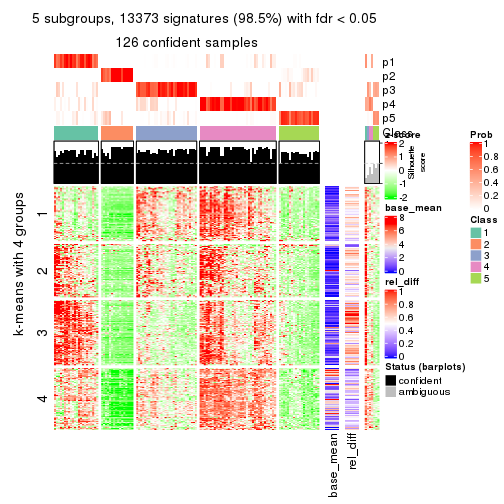</p>

</div>
<div id='tab-SD-pam-get-signatures-5'>
<pre><code class="r">get_signatures(res, k = 6)
</code></pre>

<p></p>

</div>
</div>


Signature heatmaps where rows are not scaled:


<script>
$( function() {
	$( '#tabs-SD-pam-get-signatures-no-scale' ).tabs();
} );
</script>
<div id='tabs-SD-pam-get-signatures-no-scale'>
<ul>
<li><a href='#tab-SD-pam-get-signatures-no-scale-1'>k = 2</a></li>
<li><a href='#tab-SD-pam-get-signatures-no-scale-2'>k = 3</a></li>
<li><a href='#tab-SD-pam-get-signatures-no-scale-3'>k = 4</a></li>
<li><a href='#tab-SD-pam-get-signatures-no-scale-4'>k = 5</a></li>
<li><a href='#tab-SD-pam-get-signatures-no-scale-5'>k = 6</a></li>
</ul>
<div id='tab-SD-pam-get-signatures-no-scale-1'>
<pre><code class="r">get_signatures(res, k = 2, scale_rows = FALSE)
</code></pre>

<p></p>

</div>
<div id='tab-SD-pam-get-signatures-no-scale-2'>
<pre><code class="r">get_signatures(res, k = 3, scale_rows = FALSE)
</code></pre>

<p></p>

</div>
<div id='tab-SD-pam-get-signatures-no-scale-3'>
<pre><code class="r">get_signatures(res, k = 4, scale_rows = FALSE)
</code></pre>

<p></p>

</div>
<div id='tab-SD-pam-get-signatures-no-scale-4'>
<pre><code class="r">get_signatures(res, k = 5, scale_rows = FALSE)
</code></pre>

<p></p>

</div>
<div id='tab-SD-pam-get-signatures-no-scale-5'>
<pre><code class="r">get_signatures(res, k = 6, scale_rows = FALSE)
</code></pre>

<p></p>

</div>
</div>


Compare the overlap of signatures from different k:

```r
compare_signatures(res)
```


`get_signature()` returns a data frame invisibly. TO get the list of signatures, the function
call should be assigned to a variable explicitly. In following code, if `plot` argument is set
to `FALSE`, no heatmap is plotted while only the differential analysis is performed.

```r
# code only for demonstration
tb = get_signature(res, k = ..., plot = FALSE)
```

An example of the output of `tb` is:

```
#>   which_row         fdr    mean_1    mean_2 scaled_mean_1 scaled_mean_2 km
#> 1        38 0.042760348  8.373488  9.131774    -0.5533452     0.5164555  1
#> 2        40 0.018707592  7.106213  8.469186    -0.6173731     0.5762149  1
#> 3        55 0.019134737 10.221463 11.207825    -0.6159697     0.5749050  1
#> 4        59 0.006059896  5.921854  7.869574    -0.6899429     0.6439467  1
#> 5        60 0.018055526  8.928898 10.211722    -0.6204761     0.5791110  1
#> 6        98 0.009384629 15.714769 14.887706     0.6635654    -0.6193277  2
...
```

The columns in `tb` are:

1. `which_row`: row indices corresponding to the input matrix.
2. `fdr`: FDR for the differential test. 
3. `mean_x`: The mean value in group x.
4. `scaled_mean_x`: The mean value in group x after rows are scaled.
5. `km`: Row groups if k-means clustering is applied to rows.


UMAP plot which shows how samples are separated.


<script>
$( function() {
	$( '#tabs-SD-pam-dimension-reduction' ).tabs();
} );
</script>
<div id='tabs-SD-pam-dimension-reduction'>
<ul>
<li><a href='#tab-SD-pam-dimension-reduction-1'>k = 2</a></li>
<li><a href='#tab-SD-pam-dimension-reduction-2'>k = 3</a></li>
<li><a href='#tab-SD-pam-dimension-reduction-3'>k = 4</a></li>
<li><a href='#tab-SD-pam-dimension-reduction-4'>k = 5</a></li>
<li><a href='#tab-SD-pam-dimension-reduction-5'>k = 6</a></li>
</ul>
<div id='tab-SD-pam-dimension-reduction-1'>
<pre><code class="r">dimension_reduction(res, k = 2, method = &quot;UMAP&quot;)
</code></pre>

<p></p>

</div>
<div id='tab-SD-pam-dimension-reduction-2'>
<pre><code class="r">dimension_reduction(res, k = 3, method = &quot;UMAP&quot;)
</code></pre>

<p></p>

</div>
<div id='tab-SD-pam-dimension-reduction-3'>
<pre><code class="r">dimension_reduction(res, k = 4, method = &quot;UMAP&quot;)
</code></pre>

<p></p>

</div>
<div id='tab-SD-pam-dimension-reduction-4'>
<pre><code class="r">dimension_reduction(res, k = 5, method = &quot;UMAP&quot;)
</code></pre>

<p></p>

</div>
<div id='tab-SD-pam-dimension-reduction-5'>
<pre><code class="r">dimension_reduction(res, k = 6, method = &quot;UMAP&quot;)
</code></pre>

<p></p>

</div>
</div>


Following heatmap shows how subgroups are split when increasing `k`:

```r
collect_classes(res)
```


If matrix rows can be associated to genes, consider to use `functional_enrichment(res,
...)` to perform function enrichment for the signature genes. See [this vignette](http://bioconductor.org/packages/devel/bioc/vignettes/cola/inst/doc/functional_enrichment.html) for more detailed explanations.


 

---------------------------------------------------


### SD:mclust


The object with results only for a single top-value method and a single partition method 
can be extracted as:

```r
res = res_list["SD", "mclust"]
# you can also extract it by
# res = res_list["SD:mclust"]
```

A summary of `res` and all the functions that can be applied to it:

```r
res
```

```
#> A 'ConsensusPartition' object with k = 2, 3, 4, 5, 6.
#>   On a matrix with 13580 rows and 133 columns.
#>   Top rows (1000, 2000, 3000, 4000, 5000) are extracted by 'SD' method.
#>   Subgroups are detected by 'mclust' method.
#>   Performed in total 1250 partitions by row resampling.
#>   Best k for subgroups seems to be 5.
#> 
#> Following methods can be applied to this 'ConsensusPartition' object:
#>  [1] "cola_report"             "collect_classes"         "collect_plots"          
#>  [4] "collect_stats"           "colnames"                "compare_signatures"     
#>  [7] "consensus_heatmap"       "dimension_reduction"     "functional_enrichment"  
#> [10] "get_anno_col"            "get_anno"                "get_classes"            
#> [13] "get_consensus"           "get_matrix"              "get_membership"         
#> [16] "get_param"               "get_signatures"          "get_stats"              
#> [19] "is_best_k"               "is_stable_k"             "membership_heatmap"     
#> [22] "ncol"                    "nrow"                    "plot_ecdf"              
#> [25] "rownames"                "select_partition_number" "show"                   
#> [28] "suggest_best_k"          "test_to_known_factors"
```

`collect_plots()` function collects all the plots made from `res` for all `k` (number of partitions)
into one single page to provide an easy and fast comparison between different `k`.

```r
collect_plots(res)
```


The plots are:

- The first row: a plot of the ECDF (empirical cumulative distribution
  function) curves of the consensus matrix for each `k` and the heatmap of
  predicted classes for each `k`.
- The second row: heatmaps of the consensus matrix for each `k`.
- The third row: heatmaps of the membership matrix for each `k`.
- The fouth row: heatmaps of the signatures for each `k`.

All the plots in panels can be made by individual functions and they are
plotted later in this section.

`select_partition_number()` produces several plots showing different
statistics for choosing "optimized" `k`. There are following statistics:

- ECDF curves of the consensus matrix for each `k`;
- 1-PAC. [The PAC
  score](https://en.wikipedia.org/wiki/Consensus_clustering#Over-interpretation_potential_of_consensus_clustering)
  measures the proportion of the ambiguous subgrouping.
- Mean silhouette score.
- Concordance. The mean probability of fiting the consensus class ids in all
  partitions.
- Area increased. Denote $A_k$ as the area under the ECDF curve for current
  `k`, the area increased is defined as $A_k - A_{k-1}$.
- Rand index. The percent of pairs of samples that are both in a same cluster
  or both are not in a same cluster in the partition of k and k-1.
- Jaccard index. The ratio of pairs of samples are both in a same cluster in
  the partition of k and k-1 and the pairs of samples are both in a same
  cluster in the partition k or k-1.

The detailed explanations of these statistics can be found in [the _cola_
vignette](http://bioconductor.org/packages/devel/bioc/vignettes/cola/inst/doc/cola.html#toc_13).

Generally speaking, lower PAC score, higher mean silhouette score or higher
concordance corresponds to better partition. Rand index and Jaccard index
measure how similar the current partition is compared to partition with `k-1`.
If they are too similar, we won't accept `k` is better than `k-1`.

```r
select_partition_number(res)
```


The numeric values for all these statistics can be obtained by `get_stats()`.

```r
get_stats(res)
```

```
#>   k 1-PAC mean_silhouette concordance area_increased  Rand Jaccard
#> 2 2 0.570           0.886       0.941         0.3169 0.702   0.702
#> 3 3 0.402           0.484       0.751         0.8003 0.724   0.609
#> 4 4 0.588           0.710       0.786         0.1711 0.759   0.517
#> 5 5 0.758           0.844       0.900         0.1380 0.810   0.486
#> 6 6 0.797           0.775       0.868         0.0625 0.893   0.586
```

`suggest_best_k()` suggests the best $k$ based on these statistics. The rules are as follows:

- All $k$ with Jaccard index larger than 0.95 are removed because increasing
  $k$ does not provide enough extra information. If all $k$ are removed, it is
  marked as no subgroup is detected.
- For all $k$ with 1-PAC score larger than 0.9, the maximal $k$ is taken as
  the best $k$, and other $k$ are marked as optional $k$.
- If it does not fit the second rule. The $k$ with the maximal vote of the
  highest 1-PAC score, highest mean silhouette, and highest concordance is
  taken as the best $k$.

```r
suggest_best_k(res)
```

```
#> [1] 5
```


Following shows the table of the partitions (You need to click the **show/hide
code output** link to see it). The membership matrix (columns with name `p*`)
is inferred by
[`clue::cl_consensus()`](https://www.rdocumentation.org/link/cl_consensus?package=clue)
function with the `SE` method. Basically the value in the membership matrix
represents the probability to belong to a certain group. The finall class
label for an item is determined with the group with highest probability it
belongs to.

In `get_classes()` function, the entropy is calculated from the membership
matrix and the silhouette score is calculated from the consensus matrix.


<script>
$( function() {
	$( '#tabs-SD-mclust-get-classes' ).tabs();
} );
</script>
<div id='tabs-SD-mclust-get-classes'>
<ul>
<li><a href='#tab-SD-mclust-get-classes-1'>k = 2</a></li>
<li><a href='#tab-SD-mclust-get-classes-2'>k = 3</a></li>
<li><a href='#tab-SD-mclust-get-classes-3'>k = 4</a></li>
<li><a href='#tab-SD-mclust-get-classes-4'>k = 5</a></li>
<li><a href='#tab-SD-mclust-get-classes-5'>k = 6</a></li>
</ul>

<div id='tab-SD-mclust-get-classes-1'>
<p><a id='tab-SD-mclust-get-classes-1-a' style='color:#0366d6' href='#'>show/hide code output</a></p>
<pre><code class="r">cbind(get_classes(res, k = 2), get_membership(res, k = 2))
</code></pre>

<pre><code>#&gt;            class entropy silhouette    p1    p2
#&gt; SRR1951667     2  0.4690     0.8923 0.100 0.900
#&gt; SRR1951666     1  0.7674     0.7615 0.776 0.224
#&gt; SRR1951665     2  0.0000     0.9059 0.000 1.000
#&gt; SRR1951664     1  0.0376     0.9359 0.996 0.004
#&gt; SRR1951663     1  0.0000     0.9368 1.000 0.000
#&gt; SRR1951662     2  0.0000     0.9059 0.000 1.000
#&gt; SRR1951661     1  0.6712     0.8123 0.824 0.176
#&gt; SRR1951660     1  0.0000     0.9368 1.000 0.000
#&gt; SRR1951659     2  0.4022     0.8969 0.080 0.920
#&gt; SRR1951658     2  0.0000     0.9059 0.000 1.000
#&gt; SRR1951657     1  0.0000     0.9368 1.000 0.000
#&gt; SRR1951656     1  0.0376     0.9359 0.996 0.004
#&gt; SRR1951655     1  0.0000     0.9368 1.000 0.000
#&gt; SRR1951654     1  0.0000     0.9368 1.000 0.000
#&gt; SRR1951653     1  0.0000     0.9368 1.000 0.000
#&gt; SRR1951652     1  0.7674     0.7615 0.776 0.224
#&gt; SRR1951651     1  0.0000     0.9368 1.000 0.000
#&gt; SRR1951650     1  0.0376     0.9359 0.996 0.004
#&gt; SRR1951648     1  0.7376     0.7805 0.792 0.208
#&gt; SRR1951649     1  0.0000     0.9368 1.000 0.000
#&gt; SRR1951647     1  0.0672     0.9341 0.992 0.008
#&gt; SRR1951646     1  0.0376     0.9359 0.996 0.004
#&gt; SRR1951645     1  0.0000     0.9368 1.000 0.000
#&gt; SRR1951644     1  0.0000     0.9368 1.000 0.000
#&gt; SRR1951643     1  0.0000     0.9368 1.000 0.000
#&gt; SRR1951641     2  0.4690     0.8923 0.100 0.900
#&gt; SRR1951642     1  0.0000     0.9368 1.000 0.000
#&gt; SRR1951694     1  0.0000     0.9368 1.000 0.000
#&gt; SRR1951731     1  0.5519     0.8534 0.872 0.128
#&gt; SRR1951730     1  0.7674     0.7615 0.776 0.224
#&gt; SRR1951752     1  0.7139     0.7937 0.804 0.196
#&gt; SRR1951751     1  0.0000     0.9368 1.000 0.000
#&gt; SRR1951749     1  0.7674     0.7615 0.776 0.224
#&gt; SRR1951750     1  0.0000     0.9368 1.000 0.000
#&gt; SRR1951748     2  0.0000     0.9059 0.000 1.000
#&gt; SRR1951747     2  0.0000     0.9059 0.000 1.000
#&gt; SRR1951745     1  0.0000     0.9368 1.000 0.000
#&gt; SRR1951746     2  0.0000     0.9059 0.000 1.000
#&gt; SRR1951744     1  0.0000     0.9368 1.000 0.000
#&gt; SRR1951742     1  0.7674     0.7615 0.776 0.224
#&gt; SRR1951743     2  0.0000     0.9059 0.000 1.000
#&gt; SRR1951741     1  0.0000     0.9368 1.000 0.000
#&gt; SRR1951740     1  0.0000     0.9368 1.000 0.000
#&gt; SRR1951738     2  0.9815     0.2601 0.420 0.580
#&gt; SRR1951739     2  0.5519     0.8620 0.128 0.872
#&gt; SRR1951737     1  0.0376     0.9359 0.996 0.004
#&gt; SRR1951736     1  0.0000     0.9368 1.000 0.000
#&gt; SRR1951734     2  0.0000     0.9059 0.000 1.000
#&gt; SRR1951735     1  0.0376     0.9359 0.996 0.004
#&gt; SRR1951733     1  0.7139     0.7937 0.804 0.196
#&gt; SRR1951732     2  0.0000     0.9059 0.000 1.000
#&gt; SRR1951729     1  0.0376     0.9359 0.996 0.004
#&gt; SRR1951728     1  0.2236     0.9183 0.964 0.036
#&gt; SRR1951727     2  0.0000     0.9059 0.000 1.000
#&gt; SRR1951725     1  0.0000     0.9368 1.000 0.000
#&gt; SRR1951726     1  0.7056     0.7964 0.808 0.192
#&gt; SRR1951724     1  0.0000     0.9368 1.000 0.000
#&gt; SRR1951722     1  0.0376     0.9357 0.996 0.004
#&gt; SRR1951723     1  0.0000     0.9368 1.000 0.000
#&gt; SRR1951721     1  0.0000     0.9368 1.000 0.000
#&gt; SRR1951719     1  0.0376     0.9359 0.996 0.004
#&gt; SRR1951720     1  0.0000     0.9368 1.000 0.000
#&gt; SRR1951718     1  0.0000     0.9368 1.000 0.000
#&gt; SRR1951717     1  0.0000     0.9368 1.000 0.000
#&gt; SRR1951715     1  0.0000     0.9368 1.000 0.000
#&gt; SRR1951716     1  0.0000     0.9368 1.000 0.000
#&gt; SRR1951714     1  0.0000     0.9368 1.000 0.000
#&gt; SRR1951713     1  0.0000     0.9368 1.000 0.000
#&gt; SRR1951712     1  0.0000     0.9368 1.000 0.000
#&gt; SRR1951711     2  0.4690     0.8923 0.100 0.900
#&gt; SRR1951710     1  0.0000     0.9368 1.000 0.000
#&gt; SRR1951709     1  0.7674     0.7615 0.776 0.224
#&gt; SRR1951708     2  0.0000     0.9059 0.000 1.000
#&gt; SRR1951707     1  0.2948     0.9088 0.948 0.052
#&gt; SRR1951705     1  0.0000     0.9368 1.000 0.000
#&gt; SRR1951704     1  0.7139     0.7937 0.804 0.196
#&gt; SRR1951703     2  0.0000     0.9059 0.000 1.000
#&gt; SRR1951706     1  0.6148     0.8317 0.848 0.152
#&gt; SRR1951702     1  0.7056     0.7979 0.808 0.192
#&gt; SRR1951701     2  0.4690     0.8923 0.100 0.900
#&gt; SRR1951699     1  0.7674     0.7615 0.776 0.224
#&gt; SRR1951698     1  0.4298     0.8838 0.912 0.088
#&gt; SRR1951700     1  0.0000     0.9368 1.000 0.000
#&gt; SRR1951697     2  0.4690     0.8923 0.100 0.900
#&gt; SRR1951696     1  0.0376     0.9359 0.996 0.004
#&gt; SRR1951695     1  0.0000     0.9368 1.000 0.000
#&gt; SRR1951693     1  0.0000     0.9368 1.000 0.000
#&gt; SRR1951692     1  0.0376     0.9359 0.996 0.004
#&gt; SRR1951691     1  0.0000     0.9368 1.000 0.000
#&gt; SRR1951688     1  0.7674     0.7615 0.776 0.224
#&gt; SRR1951689     1  0.7139     0.7937 0.804 0.196
#&gt; SRR1951687     1  0.0000     0.9368 1.000 0.000
#&gt; SRR1951685     1  0.7056     0.7979 0.808 0.192
#&gt; SRR1951684     1  0.0376     0.9359 0.996 0.004
#&gt; SRR1951686     1  0.7674     0.7615 0.776 0.224
#&gt; SRR1951683     1  0.0376     0.9357 0.996 0.004
#&gt; SRR1951682     2  0.4690     0.8923 0.100 0.900
#&gt; SRR1951690     2  0.4815     0.8885 0.104 0.896
#&gt; SRR1951680     1  0.0000     0.9368 1.000 0.000
#&gt; SRR1951679     1  0.0000     0.9368 1.000 0.000
#&gt; SRR1951678     1  0.0376     0.9357 0.996 0.004
#&gt; SRR1951677     1  0.0000     0.9368 1.000 0.000
#&gt; SRR1951676     1  0.0376     0.9359 0.996 0.004
#&gt; SRR1951675     2  0.4690     0.8923 0.100 0.900
#&gt; SRR1951681     1  0.0376     0.9359 0.996 0.004
#&gt; SRR1951673     1  0.7139     0.7937 0.804 0.196
#&gt; SRR1951674     1  0.0000     0.9368 1.000 0.000
#&gt; SRR1951672     1  0.0000     0.9368 1.000 0.000
#&gt; SRR1951671     1  0.7674     0.7615 0.776 0.224
#&gt; SRR1951670     1  0.0000     0.9368 1.000 0.000
#&gt; SRR1951640     1  0.0376     0.9359 0.996 0.004
#&gt; SRR1951668     1  0.0000     0.9368 1.000 0.000
#&gt; SRR1951669     1  0.7674     0.7615 0.776 0.224
#&gt; SRR1951638     1  0.0000     0.9368 1.000 0.000
#&gt; SRR1951637     1  0.7674     0.7615 0.776 0.224
#&gt; SRR1951635     1  0.0000     0.9368 1.000 0.000
#&gt; SRR1951634     1  0.0000     0.9368 1.000 0.000
#&gt; SRR1951631     1  0.0000     0.9368 1.000 0.000
#&gt; SRR1951632     2  0.9983     0.0444 0.476 0.524
#&gt; SRR1951633     1  0.0000     0.9368 1.000 0.000
#&gt; SRR1951630     1  0.0000     0.9368 1.000 0.000
#&gt; SRR1951629     1  0.0000     0.9368 1.000 0.000
#&gt; SRR1951628     1  0.0000     0.9368 1.000 0.000
#&gt; SRR1951627     1  0.7674     0.7615 0.776 0.224
#&gt; SRR1951639     1  0.7139     0.7937 0.804 0.196
#&gt; SRR1951625     1  0.7139     0.7937 0.804 0.196
#&gt; SRR1951626     1  0.2948     0.9090 0.948 0.052
#&gt; SRR1951624     1  0.0376     0.9359 0.996 0.004
#&gt; SRR1951622     1  0.0000     0.9368 1.000 0.000
#&gt; SRR1951636     1  0.4161     0.8867 0.916 0.084
#&gt; SRR1951623     1  0.0000     0.9368 1.000 0.000
#&gt; SRR1951621     1  0.0000     0.9368 1.000 0.000
#&gt; SRR1951620     1  0.0376     0.9359 0.996 0.004
</code></pre>

<script>
$('#tab-SD-mclust-get-classes-1-a').parent().next().next().hide();
$('#tab-SD-mclust-get-classes-1-a').click(function(){
  $('#tab-SD-mclust-get-classes-1-a').parent().next().next().toggle();
  return(false);
});
</script>
</div>

<div id='tab-SD-mclust-get-classes-2'>
<p><a id='tab-SD-mclust-get-classes-2-a' style='color:#0366d6' href='#'>show/hide code output</a></p>
<pre><code class="r">cbind(get_classes(res, k = 3), get_membership(res, k = 3))
</code></pre>

<pre><code>#&gt;            class entropy silhouette    p1    p2    p3
#&gt; SRR1951667     2  0.5977     0.7507 0.252 0.728 0.020
#&gt; SRR1951666     3  0.5882     0.4836 0.348 0.000 0.652
#&gt; SRR1951665     2  0.0000     0.8602 0.000 1.000 0.000
#&gt; SRR1951664     3  0.1163     0.6115 0.028 0.000 0.972
#&gt; SRR1951663     1  0.5363     0.5839 0.724 0.000 0.276
#&gt; SRR1951662     2  0.0000     0.8602 0.000 1.000 0.000
#&gt; SRR1951661     3  0.5882     0.4836 0.348 0.000 0.652
#&gt; SRR1951660     1  0.6008     0.6108 0.628 0.000 0.372
#&gt; SRR1951659     2  0.4979     0.8175 0.168 0.812 0.020
#&gt; SRR1951658     2  0.0000     0.8602 0.000 1.000 0.000
#&gt; SRR1951657     3  0.0000     0.6198 0.000 0.000 1.000
#&gt; SRR1951656     3  0.1163     0.6115 0.028 0.000 0.972
#&gt; SRR1951655     3  0.6309    -0.5076 0.496 0.000 0.504
#&gt; SRR1951654     1  0.6305     0.5068 0.516 0.000 0.484
#&gt; SRR1951653     3  0.0592     0.6191 0.012 0.000 0.988
#&gt; SRR1951652     1  0.6823     0.3141 0.668 0.036 0.296
#&gt; SRR1951651     3  0.0592     0.6191 0.012 0.000 0.988
#&gt; SRR1951650     3  0.4235     0.5657 0.176 0.000 0.824
#&gt; SRR1951648     3  0.5835     0.4835 0.340 0.000 0.660
#&gt; SRR1951649     1  0.6225     0.5622 0.568 0.000 0.432
#&gt; SRR1951647     3  0.3482     0.5828 0.128 0.000 0.872
#&gt; SRR1951646     3  0.1163     0.6115 0.028 0.000 0.972
#&gt; SRR1951645     3  0.6309    -0.5076 0.496 0.000 0.504
#&gt; SRR1951644     1  0.5988     0.6102 0.632 0.000 0.368
#&gt; SRR1951643     3  0.0592     0.6191 0.012 0.000 0.988
#&gt; SRR1951641     2  0.3183     0.8451 0.076 0.908 0.016
#&gt; SRR1951642     3  0.0592     0.6191 0.012 0.000 0.988
#&gt; SRR1951694     1  0.5968     0.5717 0.636 0.000 0.364
#&gt; SRR1951731     3  0.5760     0.4936 0.328 0.000 0.672
#&gt; SRR1951730     1  0.7190     0.1473 0.608 0.036 0.356
#&gt; SRR1951752     3  0.6302     0.2831 0.480 0.000 0.520
#&gt; SRR1951751     1  0.5988     0.6102 0.632 0.000 0.368
#&gt; SRR1951749     3  0.5835     0.4835 0.340 0.000 0.660
#&gt; SRR1951750     3  0.6309    -0.5076 0.496 0.000 0.504
#&gt; SRR1951748     2  0.0000     0.8602 0.000 1.000 0.000
#&gt; SRR1951747     2  0.0000     0.8602 0.000 1.000 0.000
#&gt; SRR1951745     1  0.4235     0.5650 0.824 0.000 0.176
#&gt; SRR1951746     2  0.0000     0.8602 0.000 1.000 0.000
#&gt; SRR1951744     3  0.1643     0.6159 0.044 0.000 0.956
#&gt; SRR1951742     3  0.7044     0.4509 0.348 0.032 0.620
#&gt; SRR1951743     2  0.0000     0.8602 0.000 1.000 0.000
#&gt; SRR1951741     3  0.6309    -0.5076 0.496 0.000 0.504
#&gt; SRR1951740     3  0.0000     0.6198 0.000 0.000 1.000
#&gt; SRR1951738     1  0.5831     0.4819 0.796 0.128 0.076
#&gt; SRR1951739     2  0.6651     0.6522 0.340 0.640 0.020
#&gt; SRR1951737     3  0.1163     0.6115 0.028 0.000 0.972
#&gt; SRR1951736     1  0.6008     0.6108 0.628 0.000 0.372
#&gt; SRR1951734     2  0.0000     0.8602 0.000 1.000 0.000
#&gt; SRR1951735     3  0.0592     0.6168 0.012 0.000 0.988
#&gt; SRR1951733     3  0.5882     0.4836 0.348 0.000 0.652
#&gt; SRR1951732     2  0.0000     0.8602 0.000 1.000 0.000
#&gt; SRR1951729     3  0.1163     0.6115 0.028 0.000 0.972
#&gt; SRR1951728     3  0.3192     0.5904 0.112 0.000 0.888
#&gt; SRR1951727     2  0.0000     0.8602 0.000 1.000 0.000
#&gt; SRR1951725     1  0.6280     0.5298 0.540 0.000 0.460
#&gt; SRR1951726     1  0.4605     0.5245 0.796 0.000 0.204
#&gt; SRR1951724     3  0.6225    -0.4060 0.432 0.000 0.568
#&gt; SRR1951722     3  0.3340     0.5214 0.120 0.000 0.880
#&gt; SRR1951723     3  0.5706    -0.1081 0.320 0.000 0.680
#&gt; SRR1951721     1  0.4121     0.5590 0.832 0.000 0.168
#&gt; SRR1951719     3  0.1163     0.6115 0.028 0.000 0.972
#&gt; SRR1951720     3  0.6309    -0.5076 0.496 0.000 0.504
#&gt; SRR1951718     1  0.6008     0.6108 0.628 0.000 0.372
#&gt; SRR1951717     3  0.6309    -0.5076 0.496 0.000 0.504
#&gt; SRR1951715     1  0.5431     0.5841 0.716 0.000 0.284
#&gt; SRR1951716     1  0.5988     0.6102 0.632 0.000 0.368
#&gt; SRR1951714     3  0.0592     0.6191 0.012 0.000 0.988
#&gt; SRR1951713     3  0.0747     0.6186 0.016 0.000 0.984
#&gt; SRR1951712     1  0.6008     0.6108 0.628 0.000 0.372
#&gt; SRR1951711     2  0.5092     0.8135 0.176 0.804 0.020
#&gt; SRR1951710     1  0.6291     0.5235 0.532 0.000 0.468
#&gt; SRR1951709     3  0.5882     0.4836 0.348 0.000 0.652
#&gt; SRR1951708     2  0.0424     0.8595 0.008 0.992 0.000
#&gt; SRR1951707     3  0.5678     0.4962 0.316 0.000 0.684
#&gt; SRR1951705     1  0.5988     0.6102 0.632 0.000 0.368
#&gt; SRR1951704     3  0.5882     0.4836 0.348 0.000 0.652
#&gt; SRR1951703     2  0.0000     0.8602 0.000 1.000 0.000
#&gt; SRR1951706     3  0.5882     0.4836 0.348 0.000 0.652
#&gt; SRR1951702     3  0.5882     0.4836 0.348 0.000 0.652
#&gt; SRR1951701     2  0.4921     0.8192 0.164 0.816 0.020
#&gt; SRR1951699     3  0.5859     0.4839 0.344 0.000 0.656
#&gt; SRR1951698     3  0.5810     0.4826 0.336 0.000 0.664
#&gt; SRR1951700     3  0.2537     0.5403 0.080 0.000 0.920
#&gt; SRR1951697     2  0.5036     0.8157 0.172 0.808 0.020
#&gt; SRR1951696     3  0.1163     0.6115 0.028 0.000 0.972
#&gt; SRR1951695     3  0.0592     0.6191 0.012 0.000 0.988
#&gt; SRR1951693     3  0.0747     0.6165 0.016 0.000 0.984
#&gt; SRR1951692     3  0.0237     0.6191 0.004 0.000 0.996
#&gt; SRR1951691     3  0.6309    -0.5076 0.496 0.000 0.504
#&gt; SRR1951688     1  0.7044     0.4861 0.724 0.108 0.168
#&gt; SRR1951689     1  0.5470     0.5430 0.796 0.036 0.168
#&gt; SRR1951687     3  0.6309    -0.5076 0.496 0.000 0.504
#&gt; SRR1951685     3  0.5835     0.4880 0.340 0.000 0.660
#&gt; SRR1951684     3  0.1163     0.6115 0.028 0.000 0.972
#&gt; SRR1951686     3  0.7150     0.4463 0.348 0.036 0.616
#&gt; SRR1951683     3  0.0747     0.6165 0.016 0.000 0.984
#&gt; SRR1951682     2  0.5977     0.7507 0.252 0.728 0.020
#&gt; SRR1951690     2  0.5200     0.8082 0.184 0.796 0.020
#&gt; SRR1951680     3  0.0237     0.6199 0.004 0.000 0.996
#&gt; SRR1951679     1  0.5859     0.6147 0.656 0.000 0.344
#&gt; SRR1951678     3  0.0592     0.6191 0.012 0.000 0.988
#&gt; SRR1951677     3  0.0592     0.6191 0.012 0.000 0.988
#&gt; SRR1951676     3  0.1411     0.6180 0.036 0.000 0.964
#&gt; SRR1951675     2  0.6357     0.6846 0.296 0.684 0.020
#&gt; SRR1951681     3  0.1031     0.6197 0.024 0.000 0.976
#&gt; SRR1951673     1  0.5470     0.5430 0.796 0.036 0.168
#&gt; SRR1951674     1  0.4291     0.5665 0.820 0.000 0.180
#&gt; SRR1951672     1  0.6045     0.6076 0.620 0.000 0.380
#&gt; SRR1951671     3  0.7150     0.4463 0.348 0.036 0.616
#&gt; SRR1951670     3  0.6309    -0.5076 0.496 0.000 0.504
#&gt; SRR1951640     3  0.1163     0.6115 0.028 0.000 0.972
#&gt; SRR1951668     3  0.5254     0.0981 0.264 0.000 0.736
#&gt; SRR1951669     1  0.5470     0.5430 0.796 0.036 0.168
#&gt; SRR1951638     3  0.6309    -0.5076 0.496 0.000 0.504
#&gt; SRR1951637     1  0.4121     0.5590 0.832 0.000 0.168
#&gt; SRR1951635     3  0.6309    -0.5076 0.496 0.000 0.504
#&gt; SRR1951634     3  0.0592     0.6191 0.012 0.000 0.988
#&gt; SRR1951631     3  0.0592     0.6191 0.012 0.000 0.988
#&gt; SRR1951632     2  0.9959     0.1484 0.340 0.368 0.292
#&gt; SRR1951633     3  0.1289     0.6178 0.032 0.000 0.968
#&gt; SRR1951630     3  0.0424     0.6197 0.008 0.000 0.992
#&gt; SRR1951629     3  0.0424     0.6197 0.008 0.000 0.992
#&gt; SRR1951628     1  0.6286     0.5271 0.536 0.000 0.464
#&gt; SRR1951627     3  0.5859     0.4839 0.344 0.000 0.656
#&gt; SRR1951639     3  0.5810     0.4826 0.336 0.000 0.664
#&gt; SRR1951625     3  0.5882     0.4836 0.348 0.000 0.652
#&gt; SRR1951626     3  0.5760     0.4895 0.328 0.000 0.672
#&gt; SRR1951624     3  0.1163     0.6115 0.028 0.000 0.972
#&gt; SRR1951622     1  0.5988     0.6102 0.632 0.000 0.368
#&gt; SRR1951636     3  0.5785     0.4858 0.332 0.000 0.668
#&gt; SRR1951623     3  0.5882     0.4836 0.348 0.000 0.652
#&gt; SRR1951621     3  0.6309    -0.5076 0.496 0.000 0.504
#&gt; SRR1951620     3  0.1163     0.6115 0.028 0.000 0.972
</code></pre>

<script>
$('#tab-SD-mclust-get-classes-2-a').parent().next().next().hide();
$('#tab-SD-mclust-get-classes-2-a').click(function(){
  $('#tab-SD-mclust-get-classes-2-a').parent().next().next().toggle();
  return(false);
});
</script>
</div>

<div id='tab-SD-mclust-get-classes-3'>
<p><a id='tab-SD-mclust-get-classes-3-a' style='color:#0366d6' href='#'>show/hide code output</a></p>
<pre><code class="r">cbind(get_classes(res, k = 4), get_membership(res, k = 4))
</code></pre>

<pre><code>#&gt;            class entropy silhouette    p1    p2    p3    p4
#&gt; SRR1951667     2  0.3074      0.777 0.000 0.848 0.152 0.000
#&gt; SRR1951666     3  0.0000      0.586 0.000 0.000 1.000 0.000
#&gt; SRR1951665     2  0.1211      0.733 0.040 0.960 0.000 0.000
#&gt; SRR1951664     3  0.6928      0.718 0.156 0.000 0.576 0.268
#&gt; SRR1951663     1  0.3895      0.746 0.804 0.000 0.184 0.012
#&gt; SRR1951662     2  0.1211      0.733 0.040 0.960 0.000 0.000
#&gt; SRR1951661     3  0.0000      0.586 0.000 0.000 1.000 0.000
#&gt; SRR1951660     4  0.0000      0.923 0.000 0.000 0.000 1.000
#&gt; SRR1951659     2  0.2760      0.777 0.000 0.872 0.128 0.000
#&gt; SRR1951658     2  0.0000      0.735 0.000 1.000 0.000 0.000
#&gt; SRR1951657     3  0.6553      0.718 0.100 0.000 0.584 0.316
#&gt; SRR1951656     3  0.6652      0.714 0.108 0.000 0.576 0.316
#&gt; SRR1951655     4  0.0000      0.923 0.000 0.000 0.000 1.000
#&gt; SRR1951654     1  0.6136      0.363 0.584 0.000 0.060 0.356
#&gt; SRR1951653     3  0.6553      0.718 0.100 0.000 0.584 0.316
#&gt; SRR1951652     2  0.4933      0.657 0.000 0.568 0.432 0.000
#&gt; SRR1951651     3  0.6553      0.718 0.100 0.000 0.584 0.316
#&gt; SRR1951650     3  0.6236      0.703 0.152 0.000 0.668 0.180
#&gt; SRR1951648     3  0.0000      0.586 0.000 0.000 1.000 0.000
#&gt; SRR1951649     4  0.0336      0.920 0.008 0.000 0.000 0.992
#&gt; SRR1951647     3  0.2401      0.628 0.004 0.000 0.904 0.092
#&gt; SRR1951646     3  0.6890      0.719 0.152 0.000 0.580 0.268
#&gt; SRR1951645     4  0.0469      0.918 0.012 0.000 0.000 0.988
#&gt; SRR1951644     4  0.0000      0.923 0.000 0.000 0.000 1.000
#&gt; SRR1951643     3  0.6553      0.718 0.100 0.000 0.584 0.316
#&gt; SRR1951641     2  0.2345      0.770 0.000 0.900 0.100 0.000
#&gt; SRR1951642     3  0.6501      0.718 0.096 0.000 0.588 0.316
#&gt; SRR1951694     4  0.4919      0.517 0.152 0.000 0.076 0.772
#&gt; SRR1951731     3  0.0000      0.586 0.000 0.000 1.000 0.000
#&gt; SRR1951730     2  0.4933      0.657 0.000 0.568 0.432 0.000
#&gt; SRR1951752     3  0.3444      0.254 0.000 0.184 0.816 0.000
#&gt; SRR1951751     4  0.0000      0.923 0.000 0.000 0.000 1.000
#&gt; SRR1951749     3  0.0000      0.586 0.000 0.000 1.000 0.000
#&gt; SRR1951750     4  0.0376      0.921 0.004 0.000 0.004 0.992
#&gt; SRR1951748     2  0.1211      0.733 0.040 0.960 0.000 0.000
#&gt; SRR1951747     2  0.1211      0.733 0.040 0.960 0.000 0.000
#&gt; SRR1951745     1  0.3895      0.746 0.804 0.000 0.184 0.012
#&gt; SRR1951746     2  0.1118      0.733 0.036 0.964 0.000 0.000
#&gt; SRR1951744     3  0.3975      0.683 0.000 0.000 0.760 0.240
#&gt; SRR1951742     2  0.4981      0.611 0.000 0.536 0.464 0.000
#&gt; SRR1951743     2  0.0469      0.735 0.012 0.988 0.000 0.000
#&gt; SRR1951741     4  0.1635      0.889 0.044 0.000 0.008 0.948
#&gt; SRR1951740     3  0.6603      0.716 0.104 0.000 0.580 0.316
#&gt; SRR1951738     2  0.4516      0.745 0.000 0.736 0.252 0.012
#&gt; SRR1951739     2  0.3942      0.755 0.000 0.764 0.236 0.000
#&gt; SRR1951737     3  0.6928      0.718 0.156 0.000 0.576 0.268
#&gt; SRR1951736     4  0.0000      0.923 0.000 0.000 0.000 1.000
#&gt; SRR1951734     2  0.0592      0.735 0.016 0.984 0.000 0.000
#&gt; SRR1951735     3  0.6890      0.719 0.152 0.000 0.580 0.268
#&gt; SRR1951733     3  0.0000      0.586 0.000 0.000 1.000 0.000
#&gt; SRR1951732     2  0.1211      0.733 0.040 0.960 0.000 0.000
#&gt; SRR1951729     3  0.6928      0.718 0.156 0.000 0.576 0.268
#&gt; SRR1951728     3  0.2412      0.626 0.008 0.000 0.908 0.084
#&gt; SRR1951727     2  0.1211      0.733 0.040 0.960 0.000 0.000
#&gt; SRR1951725     1  0.4669      0.743 0.796 0.000 0.104 0.100
#&gt; SRR1951726     3  0.0336      0.585 0.000 0.000 0.992 0.008
#&gt; SRR1951724     4  0.0657      0.916 0.004 0.000 0.012 0.984
#&gt; SRR1951722     3  0.5137      0.533 0.004 0.000 0.544 0.452
#&gt; SRR1951723     4  0.0937      0.908 0.012 0.000 0.012 0.976
#&gt; SRR1951721     1  0.3895      0.746 0.804 0.000 0.184 0.012
#&gt; SRR1951719     3  0.6603      0.716 0.104 0.000 0.580 0.316
#&gt; SRR1951720     4  0.0672      0.917 0.008 0.000 0.008 0.984
#&gt; SRR1951718     4  0.0000      0.923 0.000 0.000 0.000 1.000
#&gt; SRR1951717     4  0.0672      0.917 0.008 0.000 0.008 0.984
#&gt; SRR1951715     1  0.5689      0.732 0.712 0.000 0.184 0.104
#&gt; SRR1951716     4  0.0000      0.923 0.000 0.000 0.000 1.000
#&gt; SRR1951714     3  0.6553      0.718 0.100 0.000 0.584 0.316
#&gt; SRR1951713     3  0.6659      0.606 0.088 0.000 0.512 0.400
#&gt; SRR1951712     4  0.0000      0.923 0.000 0.000 0.000 1.000
#&gt; SRR1951711     2  0.2921      0.778 0.000 0.860 0.140 0.000
#&gt; SRR1951710     4  0.4356      0.592 0.148 0.000 0.048 0.804
#&gt; SRR1951709     3  0.0000      0.586 0.000 0.000 1.000 0.000
#&gt; SRR1951708     2  0.0000      0.735 0.000 1.000 0.000 0.000
#&gt; SRR1951707     3  0.0000      0.586 0.000 0.000 1.000 0.000
#&gt; SRR1951705     4  0.0188      0.920 0.004 0.000 0.000 0.996
#&gt; SRR1951704     3  0.0000      0.586 0.000 0.000 1.000 0.000
#&gt; SRR1951703     2  0.1211      0.733 0.040 0.960 0.000 0.000
#&gt; SRR1951706     3  0.0336      0.585 0.000 0.000 0.992 0.008
#&gt; SRR1951702     3  0.0000      0.586 0.000 0.000 1.000 0.000
#&gt; SRR1951701     2  0.2868      0.778 0.000 0.864 0.136 0.000
#&gt; SRR1951699     3  0.0000      0.586 0.000 0.000 1.000 0.000
#&gt; SRR1951698     3  0.0000      0.586 0.000 0.000 1.000 0.000
#&gt; SRR1951700     3  0.5626      0.661 0.028 0.000 0.588 0.384
#&gt; SRR1951697     2  0.2921      0.778 0.000 0.860 0.140 0.000
#&gt; SRR1951696     3  0.6928      0.718 0.156 0.000 0.576 0.268
#&gt; SRR1951695     3  0.6553      0.718 0.100 0.000 0.584 0.316
#&gt; SRR1951693     3  0.6407      0.707 0.084 0.000 0.584 0.332
#&gt; SRR1951692     3  0.6603      0.716 0.104 0.000 0.580 0.316
#&gt; SRR1951691     4  0.1406      0.897 0.024 0.000 0.016 0.960
#&gt; SRR1951688     2  0.4916      0.663 0.000 0.576 0.424 0.000
#&gt; SRR1951689     2  0.5080      0.664 0.000 0.576 0.420 0.004
#&gt; SRR1951687     4  0.5816      0.549 0.148 0.000 0.144 0.708
#&gt; SRR1951685     3  0.0000      0.586 0.000 0.000 1.000 0.000
#&gt; SRR1951684     3  0.6652      0.714 0.108 0.000 0.576 0.316
#&gt; SRR1951686     2  0.4933      0.657 0.000 0.568 0.432 0.000
#&gt; SRR1951683     3  0.6280      0.698 0.072 0.000 0.584 0.344
#&gt; SRR1951682     2  0.2973      0.778 0.000 0.856 0.144 0.000
#&gt; SRR1951690     2  0.2921      0.778 0.000 0.860 0.140 0.000
#&gt; SRR1951680     3  0.6553      0.718 0.100 0.000 0.584 0.316
#&gt; SRR1951679     4  0.0524      0.912 0.004 0.000 0.008 0.988
#&gt; SRR1951678     3  0.6553      0.718 0.100 0.000 0.584 0.316
#&gt; SRR1951677     3  0.6553      0.718 0.100 0.000 0.584 0.316
#&gt; SRR1951676     3  0.5989      0.723 0.080 0.000 0.656 0.264
#&gt; SRR1951675     2  0.3105      0.778 0.000 0.856 0.140 0.004
#&gt; SRR1951681     3  0.6792      0.723 0.140 0.000 0.588 0.272
#&gt; SRR1951673     2  0.5220      0.657 0.000 0.568 0.424 0.008
#&gt; SRR1951674     1  0.3895      0.746 0.804 0.000 0.184 0.012
#&gt; SRR1951672     4  0.0000      0.923 0.000 0.000 0.000 1.000
#&gt; SRR1951671     2  0.4933      0.657 0.000 0.568 0.432 0.000
#&gt; SRR1951670     4  0.0524      0.920 0.008 0.000 0.004 0.988
#&gt; SRR1951640     3  0.6890      0.719 0.152 0.000 0.580 0.268
#&gt; SRR1951668     4  0.6022      0.245 0.084 0.000 0.260 0.656
#&gt; SRR1951669     2  0.4894      0.739 0.008 0.720 0.260 0.012
#&gt; SRR1951638     1  0.5497      0.155 0.524 0.000 0.016 0.460
#&gt; SRR1951637     2  0.5919      0.654 0.020 0.564 0.404 0.012
#&gt; SRR1951635     1  0.5313      0.425 0.608 0.000 0.016 0.376
#&gt; SRR1951634     3  0.6716      0.596 0.092 0.000 0.504 0.404
#&gt; SRR1951631     3  0.6553      0.718 0.100 0.000 0.584 0.316
#&gt; SRR1951632     2  0.4898      0.668 0.000 0.584 0.416 0.000
#&gt; SRR1951633     3  0.6280      0.718 0.080 0.000 0.604 0.316
#&gt; SRR1951630     3  0.6553      0.718 0.100 0.000 0.584 0.316
#&gt; SRR1951629     3  0.6553      0.718 0.100 0.000 0.584 0.316
#&gt; SRR1951628     4  0.1557      0.852 0.000 0.000 0.056 0.944
#&gt; SRR1951627     3  0.0000      0.586 0.000 0.000 1.000 0.000
#&gt; SRR1951639     3  0.0000      0.586 0.000 0.000 1.000 0.000
#&gt; SRR1951625     2  0.4933      0.657 0.000 0.568 0.432 0.000
#&gt; SRR1951626     3  0.0469      0.590 0.012 0.000 0.988 0.000
#&gt; SRR1951624     3  0.6928      0.718 0.156 0.000 0.576 0.268
#&gt; SRR1951622     4  0.0000      0.923 0.000 0.000 0.000 1.000
#&gt; SRR1951636     3  0.0336      0.590 0.008 0.000 0.992 0.000
#&gt; SRR1951623     3  0.0336      0.590 0.008 0.000 0.992 0.000
#&gt; SRR1951621     4  0.0927      0.915 0.016 0.000 0.008 0.976
#&gt; SRR1951620     3  0.6928      0.718 0.156 0.000 0.576 0.268
</code></pre>

<script>
$('#tab-SD-mclust-get-classes-3-a').parent().next().next().hide();
$('#tab-SD-mclust-get-classes-3-a').click(function(){
  $('#tab-SD-mclust-get-classes-3-a').parent().next().next().toggle();
  return(false);
});
</script>
</div>

<div id='tab-SD-mclust-get-classes-4'>
<p><a id='tab-SD-mclust-get-classes-4-a' style='color:#0366d6' href='#'>show/hide code output</a></p>
<pre><code class="r">cbind(get_classes(res, k = 5), get_membership(res, k = 5))
</code></pre>

<pre><code>#&gt;            class entropy silhouette    p1    p2    p3    p4    p5
#&gt; SRR1951667     2  0.2612      0.875 0.000 0.868 0.008 0.000 0.124
#&gt; SRR1951666     5  0.1732      0.870 0.000 0.000 0.000 0.080 0.920
#&gt; SRR1951665     2  0.0992      0.876 0.008 0.968 0.024 0.000 0.000
#&gt; SRR1951664     4  0.0880      0.933 0.000 0.000 0.000 0.968 0.032
#&gt; SRR1951663     3  0.0955      0.896 0.000 0.000 0.968 0.004 0.028
#&gt; SRR1951662     2  0.0992      0.876 0.008 0.968 0.024 0.000 0.000
#&gt; SRR1951661     5  0.2179      0.872 0.000 0.000 0.004 0.100 0.896
#&gt; SRR1951660     1  0.0290      0.910 0.992 0.000 0.000 0.008 0.000
#&gt; SRR1951659     2  0.2020      0.882 0.000 0.900 0.000 0.000 0.100
#&gt; SRR1951658     2  0.1732      0.883 0.000 0.920 0.000 0.000 0.080
#&gt; SRR1951657     4  0.1211      0.937 0.016 0.000 0.000 0.960 0.024
#&gt; SRR1951656     4  0.1386      0.937 0.016 0.000 0.000 0.952 0.032
#&gt; SRR1951655     1  0.0404      0.912 0.988 0.000 0.000 0.012 0.000
#&gt; SRR1951654     1  0.5571      0.456 0.568 0.000 0.364 0.060 0.008
#&gt; SRR1951653     4  0.1399      0.937 0.020 0.000 0.000 0.952 0.028
#&gt; SRR1951652     5  0.2930      0.836 0.000 0.032 0.032 0.048 0.888
#&gt; SRR1951651     4  0.0865      0.929 0.024 0.000 0.004 0.972 0.000
#&gt; SRR1951650     4  0.0880      0.933 0.000 0.000 0.000 0.968 0.032
#&gt; SRR1951648     5  0.2020      0.872 0.000 0.000 0.000 0.100 0.900
#&gt; SRR1951649     1  0.0794      0.907 0.972 0.000 0.000 0.028 0.000
#&gt; SRR1951647     5  0.3932      0.587 0.000 0.000 0.000 0.328 0.672
#&gt; SRR1951646     4  0.0880      0.933 0.000 0.000 0.000 0.968 0.032
#&gt; SRR1951645     1  0.1043      0.900 0.960 0.000 0.000 0.040 0.000
#&gt; SRR1951644     1  0.0404      0.912 0.988 0.000 0.000 0.012 0.000
#&gt; SRR1951643     4  0.0960      0.929 0.016 0.000 0.004 0.972 0.008
#&gt; SRR1951641     2  0.2470      0.881 0.000 0.884 0.012 0.000 0.104
#&gt; SRR1951642     4  0.1200      0.924 0.016 0.000 0.012 0.964 0.008
#&gt; SRR1951694     1  0.1990      0.888 0.928 0.000 0.040 0.004 0.028
#&gt; SRR1951731     5  0.2377      0.854 0.000 0.000 0.000 0.128 0.872
#&gt; SRR1951730     5  0.1673      0.805 0.000 0.032 0.008 0.016 0.944
#&gt; SRR1951752     5  0.2609      0.854 0.000 0.028 0.008 0.068 0.896
#&gt; SRR1951751     1  0.0404      0.912 0.988 0.000 0.000 0.012 0.000
#&gt; SRR1951749     5  0.1965      0.873 0.000 0.000 0.000 0.096 0.904
#&gt; SRR1951750     1  0.1299      0.908 0.960 0.000 0.020 0.012 0.008
#&gt; SRR1951748     2  0.0992      0.876 0.008 0.968 0.024 0.000 0.000
#&gt; SRR1951747     2  0.0992      0.876 0.008 0.968 0.024 0.000 0.000
#&gt; SRR1951745     3  0.0955      0.896 0.000 0.000 0.968 0.004 0.028
#&gt; SRR1951746     2  0.0898      0.876 0.008 0.972 0.020 0.000 0.000
#&gt; SRR1951744     4  0.1597      0.898 0.000 0.000 0.012 0.940 0.048
#&gt; SRR1951742     5  0.1965      0.843 0.000 0.024 0.000 0.052 0.924
#&gt; SRR1951743     2  0.0579      0.877 0.008 0.984 0.008 0.000 0.000
#&gt; SRR1951741     1  0.4195      0.809 0.796 0.000 0.104 0.092 0.008
#&gt; SRR1951740     4  0.1211      0.937 0.016 0.000 0.000 0.960 0.024
#&gt; SRR1951738     2  0.4558      0.592 0.000 0.652 0.024 0.000 0.324
#&gt; SRR1951739     2  0.4183      0.628 0.000 0.668 0.008 0.000 0.324
#&gt; SRR1951737     4  0.0880      0.933 0.000 0.000 0.000 0.968 0.032
#&gt; SRR1951736     1  0.0404      0.912 0.988 0.000 0.000 0.012 0.000
#&gt; SRR1951734     2  0.0693      0.877 0.008 0.980 0.012 0.000 0.000
#&gt; SRR1951735     4  0.0880      0.933 0.000 0.000 0.000 0.968 0.032
#&gt; SRR1951733     5  0.1671      0.869 0.000 0.000 0.000 0.076 0.924
#&gt; SRR1951732     2  0.0992      0.876 0.008 0.968 0.024 0.000 0.000
#&gt; SRR1951729     4  0.0880      0.933 0.000 0.000 0.000 0.968 0.032
#&gt; SRR1951728     5  0.3333      0.764 0.000 0.000 0.004 0.208 0.788
#&gt; SRR1951727     2  0.0992      0.876 0.008 0.968 0.024 0.000 0.000
#&gt; SRR1951725     3  0.2670      0.828 0.080 0.000 0.888 0.004 0.028
#&gt; SRR1951726     5  0.3224      0.855 0.000 0.028 0.028 0.076 0.868
#&gt; SRR1951724     1  0.2074      0.844 0.896 0.000 0.000 0.104 0.000
#&gt; SRR1951722     1  0.4751      0.652 0.732 0.000 0.000 0.152 0.116
#&gt; SRR1951723     1  0.1792      0.868 0.916 0.000 0.000 0.084 0.000
#&gt; SRR1951721     3  0.0955      0.896 0.000 0.000 0.968 0.004 0.028
#&gt; SRR1951719     4  0.1386      0.937 0.016 0.000 0.000 0.952 0.032
#&gt; SRR1951720     1  0.2645      0.872 0.884 0.000 0.096 0.012 0.008
#&gt; SRR1951718     1  0.0404      0.912 0.988 0.000 0.000 0.012 0.000
#&gt; SRR1951717     1  0.1883      0.899 0.932 0.000 0.048 0.012 0.008
#&gt; SRR1951715     3  0.1356      0.891 0.012 0.000 0.956 0.004 0.028
#&gt; SRR1951716     1  0.0404      0.912 0.988 0.000 0.000 0.012 0.000
#&gt; SRR1951714     4  0.0960      0.929 0.016 0.000 0.004 0.972 0.008
#&gt; SRR1951713     4  0.3151      0.834 0.144 0.000 0.000 0.836 0.020
#&gt; SRR1951712     1  0.0404      0.912 0.988 0.000 0.000 0.012 0.000
#&gt; SRR1951711     2  0.2020      0.882 0.000 0.900 0.000 0.000 0.100
#&gt; SRR1951710     1  0.2206      0.882 0.912 0.000 0.068 0.004 0.016
#&gt; SRR1951709     5  0.1965      0.873 0.000 0.000 0.000 0.096 0.904
#&gt; SRR1951708     2  0.1341      0.883 0.000 0.944 0.000 0.000 0.056
#&gt; SRR1951707     5  0.2377      0.854 0.000 0.000 0.000 0.128 0.872
#&gt; SRR1951705     1  0.0451      0.910 0.988 0.000 0.004 0.008 0.000
#&gt; SRR1951704     5  0.2249      0.872 0.000 0.000 0.008 0.096 0.896
#&gt; SRR1951703     2  0.0992      0.876 0.008 0.968 0.024 0.000 0.000
#&gt; SRR1951706     5  0.2624      0.863 0.000 0.000 0.012 0.116 0.872
#&gt; SRR1951702     5  0.2179      0.872 0.000 0.000 0.004 0.100 0.896
#&gt; SRR1951701     2  0.2612      0.875 0.000 0.868 0.008 0.000 0.124
#&gt; SRR1951699     5  0.2179      0.872 0.000 0.000 0.004 0.100 0.896
#&gt; SRR1951698     5  0.2286      0.869 0.000 0.000 0.004 0.108 0.888
#&gt; SRR1951700     4  0.4405      0.630 0.280 0.000 0.004 0.696 0.020
#&gt; SRR1951697     2  0.2411      0.876 0.000 0.884 0.008 0.000 0.108
#&gt; SRR1951696     4  0.0880      0.933 0.000 0.000 0.000 0.968 0.032
#&gt; SRR1951695     4  0.1461      0.937 0.016 0.000 0.004 0.952 0.028
#&gt; SRR1951693     4  0.2812      0.880 0.096 0.000 0.004 0.876 0.024
#&gt; SRR1951692     4  0.1211      0.937 0.016 0.000 0.000 0.960 0.024
#&gt; SRR1951691     1  0.3289      0.752 0.816 0.000 0.004 0.172 0.008
#&gt; SRR1951688     5  0.4902     -0.183 0.000 0.468 0.024 0.000 0.508
#&gt; SRR1951689     5  0.3170      0.720 0.000 0.120 0.012 0.016 0.852
#&gt; SRR1951687     4  0.6021      0.406 0.284 0.000 0.124 0.584 0.008
#&gt; SRR1951685     5  0.1892      0.868 0.000 0.000 0.004 0.080 0.916
#&gt; SRR1951684     4  0.1386      0.937 0.016 0.000 0.000 0.952 0.032
#&gt; SRR1951686     5  0.1913      0.799 0.000 0.044 0.008 0.016 0.932
#&gt; SRR1951683     4  0.3211      0.792 0.164 0.000 0.004 0.824 0.008
#&gt; SRR1951682     2  0.2612      0.875 0.000 0.868 0.008 0.000 0.124
#&gt; SRR1951690     2  0.2612      0.875 0.000 0.868 0.008 0.000 0.124
#&gt; SRR1951680     4  0.1211      0.937 0.016 0.000 0.000 0.960 0.024
#&gt; SRR1951679     1  0.0613      0.906 0.984 0.000 0.008 0.004 0.004
#&gt; SRR1951678     4  0.0960      0.929 0.016 0.000 0.004 0.972 0.008
#&gt; SRR1951677     4  0.1200      0.924 0.016 0.000 0.012 0.964 0.008
#&gt; SRR1951676     4  0.1710      0.935 0.016 0.000 0.004 0.940 0.040
#&gt; SRR1951675     2  0.2813      0.866 0.000 0.868 0.024 0.000 0.108
#&gt; SRR1951681     4  0.1121      0.929 0.000 0.000 0.000 0.956 0.044
#&gt; SRR1951673     5  0.3209      0.705 0.000 0.120 0.028 0.004 0.848
#&gt; SRR1951674     3  0.0955      0.896 0.000 0.000 0.968 0.004 0.028
#&gt; SRR1951672     1  0.0290      0.910 0.992 0.000 0.000 0.008 0.000
#&gt; SRR1951671     5  0.1168      0.782 0.000 0.032 0.008 0.000 0.960
#&gt; SRR1951670     1  0.1588      0.905 0.948 0.000 0.028 0.016 0.008
#&gt; SRR1951640     4  0.0880      0.933 0.000 0.000 0.000 0.968 0.032
#&gt; SRR1951668     4  0.2970      0.804 0.168 0.000 0.004 0.828 0.000
#&gt; SRR1951669     2  0.5379      0.543 0.000 0.648 0.108 0.000 0.244
#&gt; SRR1951638     1  0.3774      0.782 0.780 0.000 0.200 0.012 0.008
#&gt; SRR1951637     3  0.6598      0.254 0.000 0.260 0.464 0.000 0.276
#&gt; SRR1951635     1  0.4156      0.665 0.700 0.000 0.288 0.004 0.008
#&gt; SRR1951634     4  0.2648      0.830 0.152 0.000 0.000 0.848 0.000
#&gt; SRR1951631     4  0.0960      0.934 0.016 0.000 0.004 0.972 0.008
#&gt; SRR1951632     5  0.3835      0.486 0.000 0.260 0.008 0.000 0.732
#&gt; SRR1951633     4  0.1200      0.924 0.016 0.000 0.012 0.964 0.008
#&gt; SRR1951630     4  0.0960      0.929 0.016 0.000 0.004 0.972 0.008
#&gt; SRR1951629     4  0.1278      0.937 0.016 0.000 0.004 0.960 0.020
#&gt; SRR1951628     1  0.1012      0.902 0.968 0.000 0.000 0.012 0.020
#&gt; SRR1951627     5  0.2179      0.872 0.000 0.000 0.004 0.100 0.896
#&gt; SRR1951639     5  0.2127      0.869 0.000 0.000 0.000 0.108 0.892
#&gt; SRR1951625     5  0.1772      0.804 0.000 0.032 0.008 0.020 0.940
#&gt; SRR1951626     5  0.2424      0.852 0.000 0.000 0.000 0.132 0.868
#&gt; SRR1951624     4  0.0880      0.933 0.000 0.000 0.000 0.968 0.032
#&gt; SRR1951622     1  0.0404      0.912 0.988 0.000 0.000 0.012 0.000
#&gt; SRR1951636     5  0.2233      0.870 0.000 0.000 0.004 0.104 0.892
#&gt; SRR1951623     5  0.4356      0.549 0.000 0.000 0.012 0.340 0.648
#&gt; SRR1951621     1  0.2990      0.865 0.868 0.000 0.100 0.024 0.008
#&gt; SRR1951620     4  0.1041      0.934 0.004 0.000 0.000 0.964 0.032
</code></pre>

<script>
$('#tab-SD-mclust-get-classes-4-a').parent().next().next().hide();
$('#tab-SD-mclust-get-classes-4-a').click(function(){
  $('#tab-SD-mclust-get-classes-4-a').parent().next().next().toggle();
  return(false);
});
</script>
</div>

<div id='tab-SD-mclust-get-classes-5'>
<p><a id='tab-SD-mclust-get-classes-5-a' style='color:#0366d6' href='#'>show/hide code output</a></p>
<pre><code class="r">cbind(get_classes(res, k = 6), get_membership(res, k = 6))
</code></pre>

<pre><code>#&gt;            class entropy silhouette    p1    p2    p3    p4    p5    p6
#&gt; SRR1951667     2  0.0146     0.8500 0.000 0.996 0.004 0.000 0.000 0.000
#&gt; SRR1951666     5  0.0291     0.9124 0.000 0.000 0.004 0.000 0.992 0.004
#&gt; SRR1951665     2  0.4207     0.8139 0.004 0.748 0.144 0.000 0.000 0.104
#&gt; SRR1951664     3  0.2340     0.7673 0.000 0.000 0.852 0.148 0.000 0.000
#&gt; SRR1951663     6  0.2121     0.9923 0.000 0.000 0.000 0.012 0.096 0.892
#&gt; SRR1951662     2  0.4207     0.8139 0.004 0.748 0.144 0.000 0.000 0.104
#&gt; SRR1951661     5  0.0000     0.9134 0.000 0.000 0.000 0.000 1.000 0.000
#&gt; SRR1951660     1  0.0146     0.9082 0.996 0.000 0.000 0.004 0.000 0.000
#&gt; SRR1951659     2  0.0000     0.8512 0.000 1.000 0.000 0.000 0.000 0.000
#&gt; SRR1951658     2  0.0146     0.8512 0.000 0.996 0.000 0.000 0.000 0.004
#&gt; SRR1951657     4  0.3023     0.6774 0.000 0.000 0.232 0.768 0.000 0.000
#&gt; SRR1951656     4  0.3023     0.6774 0.000 0.000 0.232 0.768 0.000 0.000
#&gt; SRR1951655     1  0.1714     0.8358 0.908 0.000 0.000 0.092 0.000 0.000
#&gt; SRR1951654     4  0.2313     0.7541 0.100 0.000 0.000 0.884 0.004 0.012
#&gt; SRR1951653     3  0.4256     0.1293 0.016 0.000 0.520 0.464 0.000 0.000
#&gt; SRR1951652     5  0.0653     0.9108 0.000 0.000 0.004 0.012 0.980 0.004
#&gt; SRR1951651     4  0.0508     0.8420 0.004 0.000 0.012 0.984 0.000 0.000
#&gt; SRR1951650     3  0.2513     0.7670 0.000 0.000 0.852 0.140 0.008 0.000
#&gt; SRR1951648     5  0.0000     0.9134 0.000 0.000 0.000 0.000 1.000 0.000
#&gt; SRR1951649     1  0.0363     0.9070 0.988 0.000 0.000 0.012 0.000 0.000
#&gt; SRR1951647     5  0.3974     0.5451 0.000 0.000 0.296 0.024 0.680 0.000
#&gt; SRR1951646     3  0.2340     0.7673 0.000 0.000 0.852 0.148 0.000 0.000
#&gt; SRR1951645     1  0.2003     0.8139 0.884 0.000 0.000 0.116 0.000 0.000
#&gt; SRR1951644     1  0.0146     0.9082 0.996 0.000 0.000 0.004 0.000 0.000
#&gt; SRR1951643     4  0.0508     0.8420 0.004 0.000 0.012 0.984 0.000 0.000
#&gt; SRR1951641     2  0.0000     0.8512 0.000 1.000 0.000 0.000 0.000 0.000
#&gt; SRR1951642     4  0.0260     0.8407 0.000 0.000 0.008 0.992 0.000 0.000
#&gt; SRR1951694     1  0.3308     0.7385 0.828 0.000 0.000 0.004 0.096 0.072
#&gt; SRR1951731     5  0.3081     0.6891 0.000 0.000 0.220 0.004 0.776 0.000
#&gt; SRR1951730     5  0.0603     0.9121 0.000 0.016 0.004 0.000 0.980 0.000
#&gt; SRR1951752     5  0.0508     0.9111 0.000 0.000 0.000 0.012 0.984 0.004
#&gt; SRR1951751     1  0.0146     0.9082 0.996 0.000 0.000 0.004 0.000 0.000
#&gt; SRR1951749     5  0.0000     0.9134 0.000 0.000 0.000 0.000 1.000 0.000
#&gt; SRR1951750     4  0.3547     0.4329 0.332 0.000 0.000 0.668 0.000 0.000
#&gt; SRR1951748     2  0.4207     0.8139 0.004 0.748 0.144 0.000 0.000 0.104
#&gt; SRR1951747     2  0.4207     0.8139 0.004 0.748 0.144 0.000 0.000 0.104
#&gt; SRR1951745     6  0.2121     0.9923 0.000 0.000 0.000 0.012 0.096 0.892
#&gt; SRR1951746     2  0.4048     0.8177 0.004 0.764 0.132 0.000 0.000 0.100
#&gt; SRR1951744     3  0.4382     0.7259 0.000 0.000 0.728 0.164 0.104 0.004
#&gt; SRR1951742     5  0.0291     0.9124 0.000 0.000 0.004 0.000 0.992 0.004
#&gt; SRR1951743     2  0.2696     0.8340 0.000 0.856 0.116 0.000 0.000 0.028
#&gt; SRR1951741     4  0.0603     0.8324 0.016 0.000 0.000 0.980 0.000 0.004
#&gt; SRR1951740     4  0.3023     0.6774 0.000 0.000 0.232 0.768 0.000 0.000
#&gt; SRR1951738     2  0.3790     0.5457 0.000 0.716 0.004 0.000 0.264 0.016
#&gt; SRR1951739     2  0.3189     0.5893 0.000 0.760 0.004 0.000 0.236 0.000
#&gt; SRR1951737     3  0.2340     0.7673 0.000 0.000 0.852 0.148 0.000 0.000
#&gt; SRR1951736     1  0.0146     0.9082 0.996 0.000 0.000 0.004 0.000 0.000
#&gt; SRR1951734     2  0.3370     0.8274 0.000 0.812 0.124 0.000 0.000 0.064
#&gt; SRR1951735     3  0.2340     0.7673 0.000 0.000 0.852 0.148 0.000 0.000
#&gt; SRR1951733     5  0.0458     0.9127 0.000 0.016 0.000 0.000 0.984 0.000
#&gt; SRR1951732     2  0.4207     0.8139 0.004 0.748 0.144 0.000 0.000 0.104
#&gt; SRR1951729     3  0.2340     0.7673 0.000 0.000 0.852 0.148 0.000 0.000
#&gt; SRR1951728     3  0.3971     0.1629 0.000 0.000 0.548 0.004 0.448 0.000
#&gt; SRR1951727     2  0.4207     0.8139 0.004 0.748 0.144 0.000 0.000 0.104
#&gt; SRR1951725     1  0.5355     0.2307 0.548 0.000 0.000 0.016 0.076 0.360
#&gt; SRR1951726     5  0.0508     0.9111 0.000 0.000 0.000 0.012 0.984 0.004
#&gt; SRR1951724     1  0.0508     0.9046 0.984 0.000 0.012 0.004 0.000 0.000
#&gt; SRR1951722     1  0.3663     0.7407 0.816 0.000 0.064 0.024 0.096 0.000
#&gt; SRR1951723     1  0.0547     0.9032 0.980 0.000 0.000 0.020 0.000 0.000
#&gt; SRR1951721     6  0.2214     0.9913 0.000 0.000 0.000 0.016 0.096 0.888
#&gt; SRR1951719     3  0.3869     0.0122 0.000 0.000 0.500 0.500 0.000 0.000
#&gt; SRR1951720     1  0.0603     0.9040 0.980 0.000 0.000 0.016 0.000 0.004
#&gt; SRR1951718     1  0.0260     0.9077 0.992 0.000 0.000 0.008 0.000 0.000
#&gt; SRR1951717     1  0.0603     0.9040 0.980 0.000 0.000 0.016 0.000 0.004
#&gt; SRR1951715     6  0.2829     0.9720 0.024 0.000 0.000 0.016 0.096 0.864
#&gt; SRR1951716     1  0.0146     0.9082 0.996 0.000 0.000 0.004 0.000 0.000
#&gt; SRR1951714     4  0.3852     0.4815 0.012 0.000 0.324 0.664 0.000 0.000
#&gt; SRR1951713     4  0.3916     0.5560 0.020 0.000 0.300 0.680 0.000 0.000
#&gt; SRR1951712     1  0.0260     0.9081 0.992 0.000 0.000 0.008 0.000 0.000
#&gt; SRR1951711     2  0.0146     0.8500 0.000 0.996 0.004 0.000 0.000 0.000
#&gt; SRR1951710     1  0.0858     0.8962 0.968 0.000 0.000 0.004 0.000 0.028
#&gt; SRR1951709     5  0.0146     0.9126 0.000 0.000 0.000 0.000 0.996 0.004
#&gt; SRR1951708     2  0.0146     0.8512 0.000 0.996 0.000 0.000 0.000 0.004
#&gt; SRR1951707     5  0.3405     0.6178 0.000 0.000 0.272 0.004 0.724 0.000
#&gt; SRR1951705     1  0.0146     0.9082 0.996 0.000 0.000 0.004 0.000 0.000
#&gt; SRR1951704     5  0.0508     0.9111 0.000 0.000 0.000 0.012 0.984 0.004
#&gt; SRR1951703     2  0.4207     0.8139 0.004 0.748 0.144 0.000 0.000 0.104
#&gt; SRR1951706     5  0.0508     0.9111 0.000 0.000 0.000 0.012 0.984 0.004
#&gt; SRR1951702     5  0.0551     0.9116 0.000 0.000 0.004 0.008 0.984 0.004
#&gt; SRR1951701     2  0.0000     0.8512 0.000 1.000 0.000 0.000 0.000 0.000
#&gt; SRR1951699     5  0.0146     0.9126 0.000 0.000 0.000 0.000 0.996 0.004
#&gt; SRR1951698     3  0.3950     0.2380 0.000 0.000 0.564 0.004 0.432 0.000
#&gt; SRR1951700     1  0.5467     0.1633 0.544 0.000 0.304 0.152 0.000 0.000
#&gt; SRR1951697     2  0.0146     0.8500 0.000 0.996 0.004 0.000 0.000 0.000
#&gt; SRR1951696     3  0.2340     0.7673 0.000 0.000 0.852 0.148 0.000 0.000
#&gt; SRR1951695     3  0.4038     0.7472 0.008 0.000 0.764 0.156 0.072 0.000
#&gt; SRR1951693     3  0.6017     0.2347 0.304 0.000 0.428 0.268 0.000 0.000
#&gt; SRR1951692     4  0.0865     0.8354 0.000 0.000 0.036 0.964 0.000 0.000
#&gt; SRR1951691     1  0.3564     0.5998 0.724 0.000 0.012 0.264 0.000 0.000
#&gt; SRR1951688     5  0.2362     0.7947 0.000 0.136 0.004 0.000 0.860 0.000
#&gt; SRR1951689     5  0.0603     0.9121 0.000 0.016 0.004 0.000 0.980 0.000
#&gt; SRR1951687     4  0.0692     0.8303 0.020 0.000 0.000 0.976 0.000 0.004
#&gt; SRR1951685     5  0.2361     0.8228 0.000 0.012 0.104 0.004 0.880 0.000
#&gt; SRR1951684     4  0.3860     0.0310 0.000 0.000 0.472 0.528 0.000 0.000
#&gt; SRR1951686     5  0.2278     0.7978 0.000 0.128 0.004 0.000 0.868 0.000
#&gt; SRR1951683     4  0.0725     0.8411 0.012 0.000 0.012 0.976 0.000 0.000
#&gt; SRR1951682     2  0.0291     0.8479 0.000 0.992 0.004 0.000 0.004 0.000
#&gt; SRR1951690     2  0.0000     0.8512 0.000 1.000 0.000 0.000 0.000 0.000
#&gt; SRR1951680     4  0.3371     0.5800 0.000 0.000 0.292 0.708 0.000 0.000
#&gt; SRR1951679     1  0.0260     0.9069 0.992 0.000 0.000 0.008 0.000 0.000
#&gt; SRR1951678     4  0.0405     0.8420 0.004 0.000 0.008 0.988 0.000 0.000
#&gt; SRR1951677     4  0.0363     0.8415 0.000 0.000 0.012 0.988 0.000 0.000
#&gt; SRR1951676     3  0.3967     0.7421 0.000 0.000 0.760 0.148 0.092 0.000
#&gt; SRR1951675     2  0.0000     0.8512 0.000 1.000 0.000 0.000 0.000 0.000
#&gt; SRR1951681     3  0.3551     0.7561 0.000 0.000 0.792 0.148 0.060 0.000
#&gt; SRR1951673     5  0.0458     0.9127 0.000 0.016 0.000 0.000 0.984 0.000
#&gt; SRR1951674     6  0.2121     0.9923 0.000 0.000 0.000 0.012 0.096 0.892
#&gt; SRR1951672     1  0.0146     0.9082 0.996 0.000 0.000 0.004 0.000 0.000
#&gt; SRR1951671     5  0.0603     0.9121 0.000 0.016 0.004 0.000 0.980 0.000
#&gt; SRR1951670     4  0.0777     0.8270 0.024 0.000 0.000 0.972 0.000 0.004
#&gt; SRR1951640     3  0.2340     0.7673 0.000 0.000 0.852 0.148 0.000 0.000
#&gt; SRR1951668     4  0.0725     0.8411 0.012 0.000 0.012 0.976 0.000 0.000
#&gt; SRR1951669     2  0.4483     0.4631 0.000 0.656 0.004 0.012 0.304 0.024
#&gt; SRR1951638     1  0.0820     0.9019 0.972 0.000 0.000 0.016 0.000 0.012
#&gt; SRR1951637     5  0.2214     0.8343 0.000 0.000 0.004 0.012 0.892 0.092
#&gt; SRR1951635     1  0.1461     0.8856 0.940 0.000 0.000 0.016 0.000 0.044
#&gt; SRR1951634     4  0.1074     0.8402 0.012 0.000 0.028 0.960 0.000 0.000
#&gt; SRR1951631     4  0.0777     0.8404 0.004 0.000 0.024 0.972 0.000 0.000
#&gt; SRR1951632     5  0.2191     0.8157 0.000 0.120 0.004 0.000 0.876 0.000
#&gt; SRR1951633     4  0.0291     0.8368 0.000 0.000 0.004 0.992 0.000 0.004
#&gt; SRR1951630     4  0.0458     0.8410 0.000 0.000 0.016 0.984 0.000 0.000
#&gt; SRR1951629     4  0.3076     0.6663 0.000 0.000 0.240 0.760 0.000 0.000
#&gt; SRR1951628     1  0.1237     0.8891 0.956 0.000 0.000 0.004 0.020 0.020
#&gt; SRR1951627     5  0.0146     0.9126 0.000 0.000 0.000 0.000 0.996 0.004
#&gt; SRR1951639     5  0.3163     0.6740 0.000 0.000 0.232 0.004 0.764 0.000
#&gt; SRR1951625     5  0.0458     0.9127 0.000 0.016 0.000 0.000 0.984 0.000
#&gt; SRR1951626     3  0.3290     0.5792 0.000 0.000 0.744 0.004 0.252 0.000
#&gt; SRR1951624     3  0.2340     0.7673 0.000 0.000 0.852 0.148 0.000 0.000
#&gt; SRR1951622     1  0.0146     0.9082 0.996 0.000 0.000 0.004 0.000 0.000
#&gt; SRR1951636     3  0.3337     0.5699 0.000 0.000 0.736 0.004 0.260 0.000
#&gt; SRR1951623     3  0.4586     0.3962 0.000 0.000 0.564 0.032 0.400 0.004
#&gt; SRR1951621     4  0.0692     0.8303 0.020 0.000 0.000 0.976 0.000 0.004
#&gt; SRR1951620     3  0.2416     0.7607 0.000 0.000 0.844 0.156 0.000 0.000
</code></pre>

<script>
$('#tab-SD-mclust-get-classes-5-a').parent().next().next().hide();
$('#tab-SD-mclust-get-classes-5-a').click(function(){
  $('#tab-SD-mclust-get-classes-5-a').parent().next().next().toggle();
  return(false);
});
</script>
</div>
</div>

Heatmaps for the consensus matrix. It visualizes the probability of two
samples to be in a same group.


<script>
$( function() {
	$( '#tabs-SD-mclust-consensus-heatmap' ).tabs();
} );
</script>
<div id='tabs-SD-mclust-consensus-heatmap'>
<ul>
<li><a href='#tab-SD-mclust-consensus-heatmap-1'>k = 2</a></li>
<li><a href='#tab-SD-mclust-consensus-heatmap-2'>k = 3</a></li>
<li><a href='#tab-SD-mclust-consensus-heatmap-3'>k = 4</a></li>
<li><a href='#tab-SD-mclust-consensus-heatmap-4'>k = 5</a></li>
<li><a href='#tab-SD-mclust-consensus-heatmap-5'>k = 6</a></li>
</ul>
<div id='tab-SD-mclust-consensus-heatmap-1'>
<pre><code class="r">consensus_heatmap(res, k = 2)
</code></pre>

<p></p>

</div>
<div id='tab-SD-mclust-consensus-heatmap-2'>
<pre><code class="r">consensus_heatmap(res, k = 3)
</code></pre>

<p></p>

</div>
<div id='tab-SD-mclust-consensus-heatmap-3'>
<pre><code class="r">consensus_heatmap(res, k = 4)
</code></pre>

<p></p>

</div>
<div id='tab-SD-mclust-consensus-heatmap-4'>
<pre><code class="r">consensus_heatmap(res, k = 5)
</code></pre>

<p></p>

</div>
<div id='tab-SD-mclust-consensus-heatmap-5'>
<pre><code class="r">consensus_heatmap(res, k = 6)
</code></pre>

<p></p>

</div>
</div>

Heatmaps for the membership of samples in all partitions to see how consistent they are:


<script>
$( function() {
	$( '#tabs-SD-mclust-membership-heatmap' ).tabs();
} );
</script>
<div id='tabs-SD-mclust-membership-heatmap'>
<ul>
<li><a href='#tab-SD-mclust-membership-heatmap-1'>k = 2</a></li>
<li><a href='#tab-SD-mclust-membership-heatmap-2'>k = 3</a></li>
<li><a href='#tab-SD-mclust-membership-heatmap-3'>k = 4</a></li>
<li><a href='#tab-SD-mclust-membership-heatmap-4'>k = 5</a></li>
<li><a href='#tab-SD-mclust-membership-heatmap-5'>k = 6</a></li>
</ul>
<div id='tab-SD-mclust-membership-heatmap-1'>
<pre><code class="r">membership_heatmap(res, k = 2)
</code></pre>

<p></p>

</div>
<div id='tab-SD-mclust-membership-heatmap-2'>
<pre><code class="r">membership_heatmap(res, k = 3)
</code></pre>

<p></p>

</div>
<div id='tab-SD-mclust-membership-heatmap-3'>
<pre><code class="r">membership_heatmap(res, k = 4)
</code></pre>

<p></p>

</div>
<div id='tab-SD-mclust-membership-heatmap-4'>
<pre><code class="r">membership_heatmap(res, k = 5)
</code></pre>

<p></p>

</div>
<div id='tab-SD-mclust-membership-heatmap-5'>
<pre><code class="r">membership_heatmap(res, k = 6)
</code></pre>

<p></p>

</div>
</div>

As soon as we have had the classes for columns, we can look for signatures
which are significantly different between classes which can be candidate marks
for certain classes. Following are the heatmaps for signatures.


Signature heatmaps where rows are scaled:


<script>
$( function() {
	$( '#tabs-SD-mclust-get-signatures' ).tabs();
} );
</script>
<div id='tabs-SD-mclust-get-signatures'>
<ul>
<li><a href='#tab-SD-mclust-get-signatures-1'>k = 2</a></li>
<li><a href='#tab-SD-mclust-get-signatures-2'>k = 3</a></li>
<li><a href='#tab-SD-mclust-get-signatures-3'>k = 4</a></li>
<li><a href='#tab-SD-mclust-get-signatures-4'>k = 5</a></li>
<li><a href='#tab-SD-mclust-get-signatures-5'>k = 6</a></li>
</ul>
<div id='tab-SD-mclust-get-signatures-1'>
<pre><code class="r">get_signatures(res, k = 2)
</code></pre>

<p></p>

</div>
<div id='tab-SD-mclust-get-signatures-2'>
<pre><code class="r">get_signatures(res, k = 3)
</code></pre>

<p></p>

</div>
<div id='tab-SD-mclust-get-signatures-3'>
<pre><code class="r">get_signatures(res, k = 4)
</code></pre>

<p></p>

</div>
<div id='tab-SD-mclust-get-signatures-4'>
<pre><code class="r">get_signatures(res, k = 5)
</code></pre>

<p></p>

</div>
<div id='tab-SD-mclust-get-signatures-5'>
<pre><code class="r">get_signatures(res, k = 6)
</code></pre>

<p></p>

</div>
</div>


Signature heatmaps where rows are not scaled:


<script>
$( function() {
	$( '#tabs-SD-mclust-get-signatures-no-scale' ).tabs();
} );
</script>
<div id='tabs-SD-mclust-get-signatures-no-scale'>
<ul>
<li><a href='#tab-SD-mclust-get-signatures-no-scale-1'>k = 2</a></li>
<li><a href='#tab-SD-mclust-get-signatures-no-scale-2'>k = 3</a></li>
<li><a href='#tab-SD-mclust-get-signatures-no-scale-3'>k = 4</a></li>
<li><a href='#tab-SD-mclust-get-signatures-no-scale-4'>k = 5</a></li>
<li><a href='#tab-SD-mclust-get-signatures-no-scale-5'>k = 6</a></li>
</ul>
<div id='tab-SD-mclust-get-signatures-no-scale-1'>
<pre><code class="r">get_signatures(res, k = 2, scale_rows = FALSE)
</code></pre>

<p></p>

</div>
<div id='tab-SD-mclust-get-signatures-no-scale-2'>
<pre><code class="r">get_signatures(res, k = 3, scale_rows = FALSE)
</code></pre>

<p></p>

</div>
<div id='tab-SD-mclust-get-signatures-no-scale-3'>
<pre><code class="r">get_signatures(res, k = 4, scale_rows = FALSE)
</code></pre>

<p></p>

</div>
<div id='tab-SD-mclust-get-signatures-no-scale-4'>
<pre><code class="r">get_signatures(res, k = 5, scale_rows = FALSE)
</code></pre>

<p></p>

</div>
<div id='tab-SD-mclust-get-signatures-no-scale-5'>
<pre><code class="r">get_signatures(res, k = 6, scale_rows = FALSE)
</code></pre>

<p></p>

</div>
</div>


Compare the overlap of signatures from different k:

```r
compare_signatures(res)
```


`get_signature()` returns a data frame invisibly. TO get the list of signatures, the function
call should be assigned to a variable explicitly. In following code, if `plot` argument is set
to `FALSE`, no heatmap is plotted while only the differential analysis is performed.

```r
# code only for demonstration
tb = get_signature(res, k = ..., plot = FALSE)
```

An example of the output of `tb` is:

```
#>   which_row         fdr    mean_1    mean_2 scaled_mean_1 scaled_mean_2 km
#> 1        38 0.042760348  8.373488  9.131774    -0.5533452     0.5164555  1
#> 2        40 0.018707592  7.106213  8.469186    -0.6173731     0.5762149  1
#> 3        55 0.019134737 10.221463 11.207825    -0.6159697     0.5749050  1
#> 4        59 0.006059896  5.921854  7.869574    -0.6899429     0.6439467  1
#> 5        60 0.018055526  8.928898 10.211722    -0.6204761     0.5791110  1
#> 6        98 0.009384629 15.714769 14.887706     0.6635654    -0.6193277  2
...
```

The columns in `tb` are:

1. `which_row`: row indices corresponding to the input matrix.
2. `fdr`: FDR for the differential test. 
3. `mean_x`: The mean value in group x.
4. `scaled_mean_x`: The mean value in group x after rows are scaled.
5. `km`: Row groups if k-means clustering is applied to rows.


UMAP plot which shows how samples are separated.


<script>
$( function() {
	$( '#tabs-SD-mclust-dimension-reduction' ).tabs();
} );
</script>
<div id='tabs-SD-mclust-dimension-reduction'>
<ul>
<li><a href='#tab-SD-mclust-dimension-reduction-1'>k = 2</a></li>
<li><a href='#tab-SD-mclust-dimension-reduction-2'>k = 3</a></li>
<li><a href='#tab-SD-mclust-dimension-reduction-3'>k = 4</a></li>
<li><a href='#tab-SD-mclust-dimension-reduction-4'>k = 5</a></li>
<li><a href='#tab-SD-mclust-dimension-reduction-5'>k = 6</a></li>
</ul>
<div id='tab-SD-mclust-dimension-reduction-1'>
<pre><code class="r">dimension_reduction(res, k = 2, method = &quot;UMAP&quot;)
</code></pre>

<p></p>

</div>
<div id='tab-SD-mclust-dimension-reduction-2'>
<pre><code class="r">dimension_reduction(res, k = 3, method = &quot;UMAP&quot;)
</code></pre>

<p></p>

</div>
<div id='tab-SD-mclust-dimension-reduction-3'>
<pre><code class="r">dimension_reduction(res, k = 4, method = &quot;UMAP&quot;)
</code></pre>

<p></p>

</div>
<div id='tab-SD-mclust-dimension-reduction-4'>
<pre><code class="r">dimension_reduction(res, k = 5, method = &quot;UMAP&quot;)
</code></pre>

<p></p>

</div>
<div id='tab-SD-mclust-dimension-reduction-5'>
<pre><code class="r">dimension_reduction(res, k = 6, method = &quot;UMAP&quot;)
</code></pre>

<p></p>

</div>
</div>


Following heatmap shows how subgroups are split when increasing `k`:

```r
collect_classes(res)
```


If matrix rows can be associated to genes, consider to use `functional_enrichment(res,
...)` to perform function enrichment for the signature genes. See [this vignette](http://bioconductor.org/packages/devel/bioc/vignettes/cola/inst/doc/functional_enrichment.html) for more detailed explanations.


 

---------------------------------------------------


### SD:NMF


The object with results only for a single top-value method and a single partition method 
can be extracted as:

```r
res = res_list["SD", "NMF"]
# you can also extract it by
# res = res_list["SD:NMF"]
```

A summary of `res` and all the functions that can be applied to it:

```r
res
```

```
#> A 'ConsensusPartition' object with k = 2, 3, 4, 5, 6.
#>   On a matrix with 13580 rows and 133 columns.
#>   Top rows (1000, 2000, 3000, 4000, 5000) are extracted by 'SD' method.
#>   Subgroups are detected by 'NMF' method.
#>   Performed in total 1250 partitions by row resampling.
#>   Best k for subgroups seems to be 2.
#> 
#> Following methods can be applied to this 'ConsensusPartition' object:
#>  [1] "cola_report"             "collect_classes"         "collect_plots"          
#>  [4] "collect_stats"           "colnames"                "compare_signatures"     
#>  [7] "consensus_heatmap"       "dimension_reduction"     "functional_enrichment"  
#> [10] "get_anno_col"            "get_anno"                "get_classes"            
#> [13] "get_consensus"           "get_matrix"              "get_membership"         
#> [16] "get_param"               "get_signatures"          "get_stats"              
#> [19] "is_best_k"               "is_stable_k"             "membership_heatmap"     
#> [22] "ncol"                    "nrow"                    "plot_ecdf"              
#> [25] "rownames"                "select_partition_number" "show"                   
#> [28] "suggest_best_k"          "test_to_known_factors"
```

`collect_plots()` function collects all the plots made from `res` for all `k` (number of partitions)
into one single page to provide an easy and fast comparison between different `k`.

```r
collect_plots(res)
```


The plots are:

- The first row: a plot of the ECDF (empirical cumulative distribution
  function) curves of the consensus matrix for each `k` and the heatmap of
  predicted classes for each `k`.
- The second row: heatmaps of the consensus matrix for each `k`.
- The third row: heatmaps of the membership matrix for each `k`.
- The fouth row: heatmaps of the signatures for each `k`.

All the plots in panels can be made by individual functions and they are
plotted later in this section.

`select_partition_number()` produces several plots showing different
statistics for choosing "optimized" `k`. There are following statistics:

- ECDF curves of the consensus matrix for each `k`;
- 1-PAC. [The PAC
  score](https://en.wikipedia.org/wiki/Consensus_clustering#Over-interpretation_potential_of_consensus_clustering)
  measures the proportion of the ambiguous subgrouping.
- Mean silhouette score.
- Concordance. The mean probability of fiting the consensus class ids in all
  partitions.
- Area increased. Denote $A_k$ as the area under the ECDF curve for current
  `k`, the area increased is defined as $A_k - A_{k-1}$.
- Rand index. The percent of pairs of samples that are both in a same cluster
  or both are not in a same cluster in the partition of k and k-1.
- Jaccard index. The ratio of pairs of samples are both in a same cluster in
  the partition of k and k-1 and the pairs of samples are both in a same
  cluster in the partition k or k-1.

The detailed explanations of these statistics can be found in [the _cola_
vignette](http://bioconductor.org/packages/devel/bioc/vignettes/cola/inst/doc/cola.html#toc_13).

Generally speaking, lower PAC score, higher mean silhouette score or higher
concordance corresponds to better partition. Rand index and Jaccard index
measure how similar the current partition is compared to partition with `k-1`.
If they are too similar, we won't accept `k` is better than `k-1`.

```r
select_partition_number(res)
```


The numeric values for all these statistics can be obtained by `get_stats()`.

```r
get_stats(res)
```

```
#>   k 1-PAC mean_silhouette concordance area_increased  Rand Jaccard
#> 2 2 0.762           0.913       0.959         0.4882 0.514   0.514
#> 3 3 0.815           0.843       0.933         0.2762 0.778   0.604
#> 4 4 0.610           0.675       0.841         0.1581 0.767   0.474
#> 5 5 0.603           0.636       0.791         0.0753 0.847   0.523
#> 6 6 0.651           0.668       0.796         0.0484 0.909   0.629
```

`suggest_best_k()` suggests the best $k$ based on these statistics. The rules are as follows:

- All $k$ with Jaccard index larger than 0.95 are removed because increasing
  $k$ does not provide enough extra information. If all $k$ are removed, it is
  marked as no subgroup is detected.
- For all $k$ with 1-PAC score larger than 0.9, the maximal $k$ is taken as
  the best $k$, and other $k$ are marked as optional $k$.
- If it does not fit the second rule. The $k$ with the maximal vote of the
  highest 1-PAC score, highest mean silhouette, and highest concordance is
  taken as the best $k$.

```r
suggest_best_k(res)
```

```
#> [1] 2
```


Following shows the table of the partitions (You need to click the **show/hide
code output** link to see it). The membership matrix (columns with name `p*`)
is inferred by
[`clue::cl_consensus()`](https://www.rdocumentation.org/link/cl_consensus?package=clue)
function with the `SE` method. Basically the value in the membership matrix
represents the probability to belong to a certain group. The finall class
label for an item is determined with the group with highest probability it
belongs to.

In `get_classes()` function, the entropy is calculated from the membership
matrix and the silhouette score is calculated from the consensus matrix.


<script>
$( function() {
	$( '#tabs-SD-NMF-get-classes' ).tabs();
} );
</script>
<div id='tabs-SD-NMF-get-classes'>
<ul>
<li><a href='#tab-SD-NMF-get-classes-1'>k = 2</a></li>
<li><a href='#tab-SD-NMF-get-classes-2'>k = 3</a></li>
<li><a href='#tab-SD-NMF-get-classes-3'>k = 4</a></li>
<li><a href='#tab-SD-NMF-get-classes-4'>k = 5</a></li>
<li><a href='#tab-SD-NMF-get-classes-5'>k = 6</a></li>
</ul>

<div id='tab-SD-NMF-get-classes-1'>
<p><a id='tab-SD-NMF-get-classes-1-a' style='color:#0366d6' href='#'>show/hide code output</a></p>
<pre><code class="r">cbind(get_classes(res, k = 2), get_membership(res, k = 2))
</code></pre>

<pre><code>#&gt;            class entropy silhouette    p1    p2
#&gt; SRR1951667     1  0.2236      0.929 0.964 0.036
#&gt; SRR1951666     1  0.0000      0.953 1.000 0.000
#&gt; SRR1951665     2  0.2043      0.939 0.032 0.968
#&gt; SRR1951664     1  0.0000      0.953 1.000 0.000
#&gt; SRR1951663     2  0.0000      0.959 0.000 1.000
#&gt; SRR1951662     2  0.7376      0.751 0.208 0.792
#&gt; SRR1951661     1  0.0000      0.953 1.000 0.000
#&gt; SRR1951660     2  0.0000      0.959 0.000 1.000
#&gt; SRR1951659     1  0.0000      0.953 1.000 0.000
#&gt; SRR1951658     1  0.0000      0.953 1.000 0.000
#&gt; SRR1951657     1  0.0000      0.953 1.000 0.000
#&gt; SRR1951656     1  0.0000      0.953 1.000 0.000
#&gt; SRR1951655     2  0.0938      0.953 0.012 0.988
#&gt; SRR1951654     2  0.0000      0.959 0.000 1.000
#&gt; SRR1951653     1  0.5294      0.862 0.880 0.120
#&gt; SRR1951652     1  0.8713      0.572 0.708 0.292
#&gt; SRR1951651     1  0.0000      0.953 1.000 0.000
#&gt; SRR1951650     1  0.0000      0.953 1.000 0.000
#&gt; SRR1951648     1  0.0000      0.953 1.000 0.000
#&gt; SRR1951649     1  0.7453      0.765 0.788 0.212
#&gt; SRR1951647     1  0.0000      0.953 1.000 0.000
#&gt; SRR1951646     1  0.0000      0.953 1.000 0.000
#&gt; SRR1951645     1  0.9661      0.423 0.608 0.392
#&gt; SRR1951644     2  0.0000      0.959 0.000 1.000
#&gt; SRR1951643     1  0.0000      0.953 1.000 0.000
#&gt; SRR1951641     2  0.0000      0.959 0.000 1.000
#&gt; SRR1951642     1  0.0000      0.953 1.000 0.000
#&gt; SRR1951694     2  0.0000      0.959 0.000 1.000
#&gt; SRR1951731     1  0.0000      0.953 1.000 0.000
#&gt; SRR1951730     2  0.8813      0.550 0.300 0.700
#&gt; SRR1951752     1  0.8144      0.651 0.748 0.252
#&gt; SRR1951751     2  0.2423      0.933 0.040 0.960
#&gt; SRR1951749     1  0.0000      0.953 1.000 0.000
#&gt; SRR1951750     2  0.0376      0.957 0.004 0.996
#&gt; SRR1951748     2  0.4815      0.874 0.104 0.896
#&gt; SRR1951747     2  0.0938      0.953 0.012 0.988
#&gt; SRR1951745     2  0.0000      0.959 0.000 1.000
#&gt; SRR1951746     1  0.0376      0.950 0.996 0.004
#&gt; SRR1951744     1  0.0000      0.953 1.000 0.000
#&gt; SRR1951742     1  0.0000      0.953 1.000 0.000
#&gt; SRR1951743     2  0.0000      0.959 0.000 1.000
#&gt; SRR1951741     2  0.2423      0.933 0.040 0.960
#&gt; SRR1951740     1  0.0000      0.953 1.000 0.000
#&gt; SRR1951738     2  0.0000      0.959 0.000 1.000
#&gt; SRR1951739     1  0.0000      0.953 1.000 0.000
#&gt; SRR1951737     1  0.0000      0.953 1.000 0.000
#&gt; SRR1951736     2  0.0000      0.959 0.000 1.000
#&gt; SRR1951734     2  0.2423      0.934 0.040 0.960
#&gt; SRR1951735     1  0.0000      0.953 1.000 0.000
#&gt; SRR1951733     1  0.0000      0.953 1.000 0.000
#&gt; SRR1951732     1  0.0000      0.953 1.000 0.000
#&gt; SRR1951729     1  0.0000      0.953 1.000 0.000
#&gt; SRR1951728     1  0.0000      0.953 1.000 0.000
#&gt; SRR1951727     2  0.7219      0.761 0.200 0.800
#&gt; SRR1951725     2  0.0000      0.959 0.000 1.000
#&gt; SRR1951726     2  0.5178      0.869 0.116 0.884
#&gt; SRR1951724     2  0.9881      0.167 0.436 0.564
#&gt; SRR1951722     1  0.7950      0.725 0.760 0.240
#&gt; SRR1951723     1  0.7219      0.779 0.800 0.200
#&gt; SRR1951721     2  0.0000      0.959 0.000 1.000
#&gt; SRR1951719     1  0.0000      0.953 1.000 0.000
#&gt; SRR1951720     2  0.0000      0.959 0.000 1.000
#&gt; SRR1951718     2  0.0376      0.957 0.004 0.996
#&gt; SRR1951717     2  0.0000      0.959 0.000 1.000
#&gt; SRR1951715     2  0.0000      0.959 0.000 1.000
#&gt; SRR1951716     2  0.0000      0.959 0.000 1.000
#&gt; SRR1951714     1  0.0376      0.950 0.996 0.004
#&gt; SRR1951713     1  0.6887      0.799 0.816 0.184
#&gt; SRR1951712     2  0.0938      0.953 0.012 0.988
#&gt; SRR1951711     2  0.0000      0.959 0.000 1.000
#&gt; SRR1951710     2  0.0000      0.959 0.000 1.000
#&gt; SRR1951709     1  0.0000      0.953 1.000 0.000
#&gt; SRR1951708     2  0.0000      0.959 0.000 1.000
#&gt; SRR1951707     1  0.7219      0.779 0.800 0.200
#&gt; SRR1951705     2  0.0000      0.959 0.000 1.000
#&gt; SRR1951704     1  0.0000      0.953 1.000 0.000
#&gt; SRR1951703     2  0.7139      0.766 0.196 0.804
#&gt; SRR1951706     1  0.0000      0.953 1.000 0.000
#&gt; SRR1951702     1  0.0000      0.953 1.000 0.000
#&gt; SRR1951701     1  0.0000      0.953 1.000 0.000
#&gt; SRR1951699     1  0.0000      0.953 1.000 0.000
#&gt; SRR1951698     1  0.0000      0.953 1.000 0.000
#&gt; SRR1951700     1  0.7674      0.748 0.776 0.224
#&gt; SRR1951697     1  0.0000      0.953 1.000 0.000
#&gt; SRR1951696     1  0.0000      0.953 1.000 0.000
#&gt; SRR1951695     1  0.0000      0.953 1.000 0.000
#&gt; SRR1951693     1  0.6623      0.812 0.828 0.172
#&gt; SRR1951692     1  0.0000      0.953 1.000 0.000
#&gt; SRR1951691     2  0.6247      0.804 0.156 0.844
#&gt; SRR1951688     2  0.1633      0.945 0.024 0.976
#&gt; SRR1951689     2  0.0000      0.959 0.000 1.000
#&gt; SRR1951687     2  0.3584      0.907 0.068 0.932
#&gt; SRR1951685     1  0.6712      0.808 0.824 0.176
#&gt; SRR1951684     1  0.0000      0.953 1.000 0.000
#&gt; SRR1951686     1  0.0000      0.953 1.000 0.000
#&gt; SRR1951683     1  0.7056      0.789 0.808 0.192
#&gt; SRR1951682     2  0.0000      0.959 0.000 1.000
#&gt; SRR1951690     1  0.6801      0.803 0.820 0.180
#&gt; SRR1951680     1  0.0000      0.953 1.000 0.000
#&gt; SRR1951679     2  0.0000      0.959 0.000 1.000
#&gt; SRR1951678     1  0.0000      0.953 1.000 0.000
#&gt; SRR1951677     1  0.0000      0.953 1.000 0.000
#&gt; SRR1951676     1  0.0000      0.953 1.000 0.000
#&gt; SRR1951675     2  0.0000      0.959 0.000 1.000
#&gt; SRR1951681     1  0.0000      0.953 1.000 0.000
#&gt; SRR1951673     2  0.0376      0.957 0.004 0.996
#&gt; SRR1951674     2  0.0000      0.959 0.000 1.000
#&gt; SRR1951672     2  0.0000      0.959 0.000 1.000
#&gt; SRR1951671     1  0.0000      0.953 1.000 0.000
#&gt; SRR1951670     2  0.0376      0.957 0.004 0.996
#&gt; SRR1951640     1  0.0000      0.953 1.000 0.000
#&gt; SRR1951668     1  0.6148      0.832 0.848 0.152
#&gt; SRR1951669     2  0.0000      0.959 0.000 1.000
#&gt; SRR1951638     2  0.0000      0.959 0.000 1.000
#&gt; SRR1951637     2  0.0000      0.959 0.000 1.000
#&gt; SRR1951635     2  0.0000      0.959 0.000 1.000
#&gt; SRR1951634     1  0.6148      0.832 0.848 0.152
#&gt; SRR1951631     1  0.0376      0.950 0.996 0.004
#&gt; SRR1951632     1  0.0000      0.953 1.000 0.000
#&gt; SRR1951633     1  0.0000      0.953 1.000 0.000
#&gt; SRR1951630     1  0.0000      0.953 1.000 0.000
#&gt; SRR1951629     1  0.0000      0.953 1.000 0.000
#&gt; SRR1951628     2  0.0000      0.959 0.000 1.000
#&gt; SRR1951627     1  0.0000      0.953 1.000 0.000
#&gt; SRR1951639     1  0.0000      0.953 1.000 0.000
#&gt; SRR1951625     1  0.4022      0.895 0.920 0.080
#&gt; SRR1951626     1  0.0000      0.953 1.000 0.000
#&gt; SRR1951624     1  0.0000      0.953 1.000 0.000
#&gt; SRR1951622     2  0.0000      0.959 0.000 1.000
#&gt; SRR1951636     1  0.0000      0.953 1.000 0.000
#&gt; SRR1951623     1  0.0000      0.953 1.000 0.000
#&gt; SRR1951621     2  0.0376      0.957 0.004 0.996
#&gt; SRR1951620     1  0.0000      0.953 1.000 0.000
</code></pre>

<script>
$('#tab-SD-NMF-get-classes-1-a').parent().next().next().hide();
$('#tab-SD-NMF-get-classes-1-a').click(function(){
  $('#tab-SD-NMF-get-classes-1-a').parent().next().next().toggle();
  return(false);
});
</script>
</div>

<div id='tab-SD-NMF-get-classes-2'>
<p><a id='tab-SD-NMF-get-classes-2-a' style='color:#0366d6' href='#'>show/hide code output</a></p>
<pre><code class="r">cbind(get_classes(res, k = 3), get_membership(res, k = 3))
</code></pre>

<pre><code>#&gt;            class entropy silhouette    p1    p2    p3
#&gt; SRR1951667     3  0.1753     0.8944 0.048 0.000 0.952
#&gt; SRR1951666     3  0.1411     0.8968 0.000 0.036 0.964
#&gt; SRR1951665     2  0.0000     0.9270 0.000 1.000 0.000
#&gt; SRR1951664     3  0.0237     0.9163 0.004 0.000 0.996
#&gt; SRR1951663     2  0.3267     0.8357 0.116 0.884 0.000
#&gt; SRR1951662     2  0.0237     0.9265 0.000 0.996 0.004
#&gt; SRR1951661     3  0.1289     0.8993 0.000 0.032 0.968
#&gt; SRR1951660     1  0.0000     0.9334 1.000 0.000 0.000
#&gt; SRR1951659     3  0.2448     0.8645 0.000 0.076 0.924
#&gt; SRR1951658     2  0.1643     0.9052 0.000 0.956 0.044
#&gt; SRR1951657     3  0.0237     0.9163 0.004 0.000 0.996
#&gt; SRR1951656     3  0.0237     0.9163 0.004 0.000 0.996
#&gt; SRR1951655     1  0.0424     0.9325 0.992 0.000 0.008
#&gt; SRR1951654     1  0.4555     0.7309 0.800 0.200 0.000
#&gt; SRR1951653     3  0.4291     0.7769 0.180 0.000 0.820
#&gt; SRR1951652     2  0.0237     0.9265 0.000 0.996 0.004
#&gt; SRR1951651     3  0.1289     0.9039 0.032 0.000 0.968
#&gt; SRR1951650     3  0.0000     0.9154 0.000 0.000 1.000
#&gt; SRR1951648     3  0.0237     0.9142 0.000 0.004 0.996
#&gt; SRR1951649     1  0.2165     0.8881 0.936 0.000 0.064
#&gt; SRR1951647     3  0.2066     0.8850 0.060 0.000 0.940
#&gt; SRR1951646     3  0.0237     0.9163 0.004 0.000 0.996
#&gt; SRR1951645     1  0.2066     0.8920 0.940 0.000 0.060
#&gt; SRR1951644     1  0.0237     0.9338 0.996 0.000 0.004
#&gt; SRR1951643     3  0.0237     0.9163 0.004 0.000 0.996
#&gt; SRR1951641     1  0.0000     0.9334 1.000 0.000 0.000
#&gt; SRR1951642     3  0.0237     0.9142 0.000 0.004 0.996
#&gt; SRR1951694     1  0.0237     0.9318 0.996 0.004 0.000
#&gt; SRR1951731     3  0.0237     0.9163 0.004 0.000 0.996
#&gt; SRR1951730     3  0.9974    -0.1194 0.300 0.340 0.360
#&gt; SRR1951752     3  0.6516     0.0854 0.004 0.480 0.516
#&gt; SRR1951751     1  0.0747     0.9284 0.984 0.000 0.016
#&gt; SRR1951749     3  0.0237     0.9142 0.000 0.004 0.996
#&gt; SRR1951750     1  0.0237     0.9338 0.996 0.000 0.004
#&gt; SRR1951748     2  0.0000     0.9270 0.000 1.000 0.000
#&gt; SRR1951747     2  0.0237     0.9260 0.004 0.996 0.000
#&gt; SRR1951745     2  0.0237     0.9260 0.004 0.996 0.000
#&gt; SRR1951746     2  0.1753     0.9011 0.000 0.952 0.048
#&gt; SRR1951744     3  0.5968     0.4487 0.000 0.364 0.636
#&gt; SRR1951742     3  0.1964     0.8825 0.000 0.056 0.944
#&gt; SRR1951743     2  0.3412     0.8235 0.124 0.876 0.000
#&gt; SRR1951741     1  0.0237     0.9335 0.996 0.000 0.004
#&gt; SRR1951740     3  0.0592     0.9136 0.012 0.000 0.988
#&gt; SRR1951738     1  0.1753     0.9055 0.952 0.048 0.000
#&gt; SRR1951739     3  0.0237     0.9163 0.004 0.000 0.996
#&gt; SRR1951737     3  0.0237     0.9163 0.004 0.000 0.996
#&gt; SRR1951736     1  0.0000     0.9334 1.000 0.000 0.000
#&gt; SRR1951734     2  0.0237     0.9263 0.004 0.996 0.000
#&gt; SRR1951735     3  0.0237     0.9163 0.004 0.000 0.996
#&gt; SRR1951733     3  0.0237     0.9142 0.000 0.004 0.996
#&gt; SRR1951732     2  0.0592     0.9235 0.000 0.988 0.012
#&gt; SRR1951729     3  0.0237     0.9163 0.004 0.000 0.996
#&gt; SRR1951728     3  0.1031     0.9086 0.024 0.000 0.976
#&gt; SRR1951727     2  0.0237     0.9265 0.000 0.996 0.004
#&gt; SRR1951725     1  0.1411     0.9143 0.964 0.036 0.000
#&gt; SRR1951726     2  0.0592     0.9227 0.012 0.988 0.000
#&gt; SRR1951724     1  0.1289     0.9170 0.968 0.000 0.032
#&gt; SRR1951722     1  0.4235     0.7479 0.824 0.000 0.176
#&gt; SRR1951723     1  0.2959     0.8496 0.900 0.000 0.100
#&gt; SRR1951721     1  0.4235     0.7636 0.824 0.176 0.000
#&gt; SRR1951719     3  0.0237     0.9163 0.004 0.000 0.996
#&gt; SRR1951720     1  0.0237     0.9318 0.996 0.004 0.000
#&gt; SRR1951718     1  0.0237     0.9338 0.996 0.000 0.004
#&gt; SRR1951717     1  0.0237     0.9318 0.996 0.004 0.000
#&gt; SRR1951715     1  0.0747     0.9267 0.984 0.016 0.000
#&gt; SRR1951716     1  0.0237     0.9338 0.996 0.000 0.004
#&gt; SRR1951714     3  0.1525     0.9049 0.032 0.004 0.964
#&gt; SRR1951713     3  0.6008     0.4544 0.372 0.000 0.628
#&gt; SRR1951712     1  0.0592     0.9306 0.988 0.000 0.012
#&gt; SRR1951711     2  0.6305     0.0208 0.484 0.516 0.000
#&gt; SRR1951710     1  0.0237     0.9318 0.996 0.004 0.000
#&gt; SRR1951709     3  0.0592     0.9107 0.000 0.012 0.988
#&gt; SRR1951708     2  0.0237     0.9260 0.004 0.996 0.000
#&gt; SRR1951707     3  0.4887     0.7144 0.228 0.000 0.772
#&gt; SRR1951705     1  0.0000     0.9334 1.000 0.000 0.000
#&gt; SRR1951704     3  0.3193     0.8476 0.004 0.100 0.896
#&gt; SRR1951703     2  0.0000     0.9270 0.000 1.000 0.000
#&gt; SRR1951706     2  0.1643     0.9049 0.000 0.956 0.044
#&gt; SRR1951702     3  0.4605     0.7337 0.000 0.204 0.796
#&gt; SRR1951701     3  0.0237     0.9163 0.004 0.000 0.996
#&gt; SRR1951699     3  0.0592     0.9107 0.000 0.012 0.988
#&gt; SRR1951698     3  0.0237     0.9142 0.000 0.004 0.996
#&gt; SRR1951700     1  0.6260     0.1081 0.552 0.000 0.448
#&gt; SRR1951697     2  0.1289     0.9125 0.000 0.968 0.032
#&gt; SRR1951696     3  0.0000     0.9154 0.000 0.000 1.000
#&gt; SRR1951695     3  0.0424     0.9150 0.008 0.000 0.992
#&gt; SRR1951693     3  0.5810     0.5371 0.336 0.000 0.664
#&gt; SRR1951692     3  0.0237     0.9163 0.004 0.000 0.996
#&gt; SRR1951691     1  0.0892     0.9256 0.980 0.000 0.020
#&gt; SRR1951688     2  0.0000     0.9270 0.000 1.000 0.000
#&gt; SRR1951689     1  0.0237     0.9338 0.996 0.000 0.004
#&gt; SRR1951687     1  0.4399     0.8354 0.864 0.044 0.092
#&gt; SRR1951685     3  0.5988     0.4658 0.368 0.000 0.632
#&gt; SRR1951684     3  0.0237     0.9163 0.004 0.000 0.996
#&gt; SRR1951686     2  0.6295     0.0357 0.000 0.528 0.472
#&gt; SRR1951683     3  0.4931     0.7089 0.232 0.000 0.768
#&gt; SRR1951682     1  0.0237     0.9338 0.996 0.000 0.004
#&gt; SRR1951690     3  0.6274     0.2156 0.456 0.000 0.544
#&gt; SRR1951680     3  0.1964     0.8879 0.056 0.000 0.944
#&gt; SRR1951679     1  0.0000     0.9334 1.000 0.000 0.000
#&gt; SRR1951678     3  0.0237     0.9163 0.004 0.000 0.996
#&gt; SRR1951677     3  0.0237     0.9142 0.000 0.004 0.996
#&gt; SRR1951676     3  0.0237     0.9142 0.000 0.004 0.996
#&gt; SRR1951675     1  0.1643     0.9085 0.956 0.044 0.000
#&gt; SRR1951681     3  0.0000     0.9154 0.000 0.000 1.000
#&gt; SRR1951673     1  0.0592     0.9307 0.988 0.000 0.012
#&gt; SRR1951674     2  0.0000     0.9270 0.000 1.000 0.000
#&gt; SRR1951672     1  0.0237     0.9338 0.996 0.000 0.004
#&gt; SRR1951671     3  0.0237     0.9163 0.004 0.000 0.996
#&gt; SRR1951670     1  0.0237     0.9338 0.996 0.000 0.004
#&gt; SRR1951640     3  0.0237     0.9163 0.004 0.000 0.996
#&gt; SRR1951668     1  0.6299     0.0216 0.524 0.000 0.476
#&gt; SRR1951669     2  0.1411     0.9072 0.036 0.964 0.000
#&gt; SRR1951638     1  0.1289     0.9172 0.968 0.032 0.000
#&gt; SRR1951637     1  0.2537     0.8753 0.920 0.080 0.000
#&gt; SRR1951635     1  0.0592     0.9288 0.988 0.012 0.000
#&gt; SRR1951634     3  0.5678     0.5725 0.316 0.000 0.684
#&gt; SRR1951631     3  0.1753     0.8941 0.048 0.000 0.952
#&gt; SRR1951632     3  0.0237     0.9163 0.004 0.000 0.996
#&gt; SRR1951633     3  0.0747     0.9088 0.000 0.016 0.984
#&gt; SRR1951630     3  0.0237     0.9163 0.004 0.000 0.996
#&gt; SRR1951629     3  0.0237     0.9163 0.004 0.000 0.996
#&gt; SRR1951628     1  0.0237     0.9338 0.996 0.000 0.004
#&gt; SRR1951627     3  0.0424     0.9126 0.000 0.008 0.992
#&gt; SRR1951639     3  0.0237     0.9163 0.004 0.000 0.996
#&gt; SRR1951625     3  0.3340     0.8359 0.120 0.000 0.880
#&gt; SRR1951626     3  0.0000     0.9154 0.000 0.000 1.000
#&gt; SRR1951624     3  0.0237     0.9163 0.004 0.000 0.996
#&gt; SRR1951622     1  0.0000     0.9334 1.000 0.000 0.000
#&gt; SRR1951636     3  0.0237     0.9142 0.000 0.004 0.996
#&gt; SRR1951623     3  0.2165     0.8785 0.000 0.064 0.936
#&gt; SRR1951621     1  0.0000     0.9334 1.000 0.000 0.000
#&gt; SRR1951620     3  0.0237     0.9163 0.004 0.000 0.996
</code></pre>

<script>
$('#tab-SD-NMF-get-classes-2-a').parent().next().next().hide();
$('#tab-SD-NMF-get-classes-2-a').click(function(){
  $('#tab-SD-NMF-get-classes-2-a').parent().next().next().toggle();
  return(false);
});
</script>
</div>

<div id='tab-SD-NMF-get-classes-3'>
<p><a id='tab-SD-NMF-get-classes-3-a' style='color:#0366d6' href='#'>show/hide code output</a></p>
<pre><code class="r">cbind(get_classes(res, k = 4), get_membership(res, k = 4))
</code></pre>

<pre><code>#&gt;            class entropy silhouette    p1    p2    p3    p4
#&gt; SRR1951667     4  0.1940    0.72907 0.000 0.000 0.076 0.924
#&gt; SRR1951666     3  0.0524    0.85582 0.000 0.008 0.988 0.004
#&gt; SRR1951665     2  0.0336    0.80527 0.008 0.992 0.000 0.000
#&gt; SRR1951664     4  0.4948    0.29002 0.000 0.000 0.440 0.560
#&gt; SRR1951663     1  0.3933    0.62691 0.792 0.200 0.000 0.008
#&gt; SRR1951662     2  0.0000    0.80511 0.000 1.000 0.000 0.000
#&gt; SRR1951661     3  0.0524    0.85571 0.000 0.004 0.988 0.008
#&gt; SRR1951660     1  0.1978    0.84540 0.928 0.000 0.004 0.068
#&gt; SRR1951659     3  0.4793    0.66332 0.000 0.204 0.756 0.040
#&gt; SRR1951658     2  0.5503    0.04156 0.000 0.516 0.468 0.016
#&gt; SRR1951657     3  0.0336    0.85496 0.000 0.000 0.992 0.008
#&gt; SRR1951656     3  0.1716    0.84181 0.000 0.000 0.936 0.064
#&gt; SRR1951655     1  0.1807    0.85097 0.940 0.000 0.008 0.052
#&gt; SRR1951654     1  0.1884    0.83327 0.948 0.020 0.016 0.016
#&gt; SRR1951653     4  0.5130    0.54777 0.020 0.000 0.312 0.668
#&gt; SRR1951652     3  0.5606   -0.04582 0.020 0.480 0.500 0.000
#&gt; SRR1951651     3  0.0469    0.85558 0.000 0.000 0.988 0.012
#&gt; SRR1951650     3  0.0707    0.85517 0.000 0.000 0.980 0.020
#&gt; SRR1951648     3  0.1211    0.84985 0.000 0.000 0.960 0.040
#&gt; SRR1951649     4  0.5184    0.50221 0.304 0.000 0.024 0.672
#&gt; SRR1951647     4  0.5055    0.43906 0.008 0.000 0.368 0.624
#&gt; SRR1951646     3  0.1902    0.83722 0.004 0.000 0.932 0.064
#&gt; SRR1951645     4  0.5657    0.21022 0.436 0.000 0.024 0.540
#&gt; SRR1951644     1  0.4998   -0.00888 0.512 0.000 0.000 0.488
#&gt; SRR1951643     3  0.0376    0.85591 0.004 0.000 0.992 0.004
#&gt; SRR1951641     4  0.4817    0.31683 0.388 0.000 0.000 0.612
#&gt; SRR1951642     3  0.0376    0.85553 0.000 0.004 0.992 0.004
#&gt; SRR1951694     1  0.0707    0.85609 0.980 0.000 0.000 0.020
#&gt; SRR1951731     4  0.4134    0.64300 0.000 0.000 0.260 0.740
#&gt; SRR1951730     2  0.6007    0.67613 0.040 0.740 0.088 0.132
#&gt; SRR1951752     2  0.5627    0.60785 0.012 0.704 0.240 0.044
#&gt; SRR1951751     4  0.2081    0.70834 0.084 0.000 0.000 0.916
#&gt; SRR1951749     3  0.4406    0.55392 0.000 0.000 0.700 0.300
#&gt; SRR1951750     1  0.2973    0.78439 0.856 0.000 0.000 0.144
#&gt; SRR1951748     2  0.0000    0.80511 0.000 1.000 0.000 0.000
#&gt; SRR1951747     2  0.0336    0.80527 0.008 0.992 0.000 0.000
#&gt; SRR1951745     1  0.5167   -0.10903 0.508 0.488 0.000 0.004
#&gt; SRR1951746     2  0.3757    0.71685 0.000 0.828 0.020 0.152
#&gt; SRR1951744     3  0.2311    0.81817 0.004 0.076 0.916 0.004
#&gt; SRR1951742     3  0.1820    0.84645 0.000 0.036 0.944 0.020
#&gt; SRR1951743     2  0.1975    0.78692 0.016 0.936 0.000 0.048
#&gt; SRR1951741     1  0.2363    0.82341 0.920 0.000 0.056 0.024
#&gt; SRR1951740     3  0.3801    0.67687 0.000 0.000 0.780 0.220
#&gt; SRR1951738     1  0.0707    0.85609 0.980 0.000 0.000 0.020
#&gt; SRR1951739     4  0.2402    0.72498 0.000 0.012 0.076 0.912
#&gt; SRR1951737     3  0.3569    0.70643 0.000 0.000 0.804 0.196
#&gt; SRR1951736     1  0.4222    0.62043 0.728 0.000 0.000 0.272
#&gt; SRR1951734     2  0.3808    0.72081 0.004 0.824 0.012 0.160
#&gt; SRR1951735     3  0.2530    0.79911 0.000 0.000 0.888 0.112
#&gt; SRR1951733     3  0.1452    0.85421 0.000 0.008 0.956 0.036
#&gt; SRR1951732     2  0.0000    0.80511 0.000 1.000 0.000 0.000
#&gt; SRR1951729     4  0.4804    0.39995 0.000 0.000 0.384 0.616
#&gt; SRR1951728     4  0.4643    0.48828 0.000 0.000 0.344 0.656
#&gt; SRR1951727     2  0.0188    0.80531 0.004 0.996 0.000 0.000
#&gt; SRR1951725     1  0.0188    0.85281 0.996 0.000 0.000 0.004
#&gt; SRR1951726     3  0.7589   -0.00837 0.400 0.196 0.404 0.000
#&gt; SRR1951724     4  0.5168   -0.02352 0.496 0.000 0.004 0.500
#&gt; SRR1951722     4  0.4018    0.61932 0.224 0.000 0.004 0.772
#&gt; SRR1951723     4  0.3377    0.68922 0.140 0.000 0.012 0.848
#&gt; SRR1951721     1  0.1388    0.83879 0.960 0.028 0.000 0.012
#&gt; SRR1951719     4  0.4454    0.55124 0.000 0.000 0.308 0.692
#&gt; SRR1951720     1  0.0592    0.85580 0.984 0.000 0.000 0.016
#&gt; SRR1951718     1  0.3975    0.67384 0.760 0.000 0.000 0.240
#&gt; SRR1951717     1  0.1389    0.85337 0.952 0.000 0.000 0.048
#&gt; SRR1951715     1  0.0707    0.85506 0.980 0.000 0.000 0.020
#&gt; SRR1951716     1  0.3074    0.76888 0.848 0.000 0.000 0.152
#&gt; SRR1951714     3  0.2483    0.82882 0.032 0.000 0.916 0.052
#&gt; SRR1951713     4  0.2089    0.73403 0.020 0.000 0.048 0.932
#&gt; SRR1951712     4  0.2647    0.69091 0.120 0.000 0.000 0.880
#&gt; SRR1951711     2  0.5248    0.66372 0.088 0.748 0.000 0.164
#&gt; SRR1951710     1  0.1302    0.85348 0.956 0.000 0.000 0.044
#&gt; SRR1951709     3  0.0336    0.85545 0.000 0.000 0.992 0.008
#&gt; SRR1951708     2  0.0469    0.80473 0.012 0.988 0.000 0.000
#&gt; SRR1951707     4  0.2101    0.72996 0.012 0.000 0.060 0.928
#&gt; SRR1951705     1  0.4331    0.58685 0.712 0.000 0.000 0.288
#&gt; SRR1951704     3  0.5428    0.65362 0.004 0.164 0.744 0.088
#&gt; SRR1951703     2  0.0469    0.80473 0.012 0.988 0.000 0.000
#&gt; SRR1951706     2  0.5290    0.10067 0.008 0.516 0.476 0.000
#&gt; SRR1951702     3  0.3545    0.73108 0.000 0.164 0.828 0.008
#&gt; SRR1951701     4  0.3356    0.71160 0.000 0.000 0.176 0.824
#&gt; SRR1951699     3  0.0921    0.84980 0.000 0.000 0.972 0.028
#&gt; SRR1951698     3  0.1302    0.84841 0.000 0.000 0.956 0.044
#&gt; SRR1951700     4  0.4072    0.71534 0.052 0.000 0.120 0.828
#&gt; SRR1951697     2  0.4770    0.54823 0.012 0.700 0.288 0.000
#&gt; SRR1951696     3  0.1022    0.85249 0.000 0.000 0.968 0.032
#&gt; SRR1951695     3  0.5028    0.31525 0.004 0.000 0.596 0.400
#&gt; SRR1951693     4  0.4630    0.70272 0.036 0.000 0.196 0.768
#&gt; SRR1951692     3  0.1118    0.85091 0.000 0.000 0.964 0.036
#&gt; SRR1951691     1  0.2214    0.84661 0.928 0.000 0.028 0.044
#&gt; SRR1951688     2  0.0524    0.80391 0.004 0.988 0.000 0.008
#&gt; SRR1951689     4  0.2011    0.71007 0.080 0.000 0.000 0.920
#&gt; SRR1951687     1  0.4869    0.49992 0.708 0.012 0.276 0.004
#&gt; SRR1951685     4  0.2142    0.72922 0.016 0.000 0.056 0.928
#&gt; SRR1951684     3  0.4250    0.58338 0.000 0.000 0.724 0.276
#&gt; SRR1951686     3  0.5268    0.26283 0.000 0.396 0.592 0.012
#&gt; SRR1951683     3  0.3435    0.77549 0.100 0.000 0.864 0.036
#&gt; SRR1951682     4  0.3356    0.64925 0.176 0.000 0.000 0.824
#&gt; SRR1951690     4  0.1520    0.72596 0.020 0.000 0.024 0.956
#&gt; SRR1951680     4  0.3907    0.68029 0.000 0.000 0.232 0.768
#&gt; SRR1951679     4  0.4040    0.55586 0.248 0.000 0.000 0.752
#&gt; SRR1951678     3  0.0524    0.85579 0.004 0.000 0.988 0.008
#&gt; SRR1951677     3  0.0524    0.85545 0.004 0.000 0.988 0.008
#&gt; SRR1951676     3  0.0707    0.85262 0.000 0.000 0.980 0.020
#&gt; SRR1951675     1  0.0817    0.85485 0.976 0.000 0.000 0.024
#&gt; SRR1951681     3  0.0188    0.85531 0.000 0.000 0.996 0.004
#&gt; SRR1951673     4  0.5112    0.19792 0.436 0.000 0.004 0.560
#&gt; SRR1951674     2  0.5332    0.12080 0.480 0.512 0.004 0.004
#&gt; SRR1951672     1  0.2081    0.82887 0.916 0.000 0.000 0.084
#&gt; SRR1951671     4  0.3400    0.71049 0.000 0.000 0.180 0.820
#&gt; SRR1951670     1  0.0707    0.85601 0.980 0.000 0.000 0.020
#&gt; SRR1951640     3  0.2814    0.79726 0.000 0.000 0.868 0.132
#&gt; SRR1951668     3  0.7513    0.05665 0.296 0.000 0.488 0.216
#&gt; SRR1951669     2  0.4564    0.48072 0.328 0.672 0.000 0.000
#&gt; SRR1951638     1  0.0592    0.85436 0.984 0.000 0.000 0.016
#&gt; SRR1951637     1  0.0469    0.84857 0.988 0.012 0.000 0.000
#&gt; SRR1951635     1  0.0336    0.85419 0.992 0.000 0.000 0.008
#&gt; SRR1951634     4  0.5661    0.65898 0.080 0.000 0.220 0.700
#&gt; SRR1951631     3  0.2611    0.82833 0.008 0.000 0.896 0.096
#&gt; SRR1951632     3  0.5099    0.32848 0.000 0.008 0.612 0.380
#&gt; SRR1951633     3  0.0564    0.85600 0.004 0.004 0.988 0.004
#&gt; SRR1951630     3  0.1004    0.85426 0.004 0.000 0.972 0.024
#&gt; SRR1951629     3  0.0376    0.85599 0.004 0.000 0.992 0.004
#&gt; SRR1951628     1  0.5151    0.11454 0.532 0.000 0.004 0.464
#&gt; SRR1951627     3  0.0188    0.85531 0.000 0.000 0.996 0.004
#&gt; SRR1951639     3  0.2868    0.79504 0.000 0.000 0.864 0.136
#&gt; SRR1951625     4  0.2976    0.72771 0.008 0.000 0.120 0.872
#&gt; SRR1951626     3  0.1211    0.84649 0.000 0.000 0.960 0.040
#&gt; SRR1951624     3  0.4761    0.38815 0.000 0.000 0.628 0.372
#&gt; SRR1951622     1  0.1474    0.84928 0.948 0.000 0.000 0.052
#&gt; SRR1951636     3  0.0188    0.85531 0.000 0.000 0.996 0.004
#&gt; SRR1951623     3  0.0524    0.85582 0.000 0.008 0.988 0.004
#&gt; SRR1951621     1  0.1256    0.85337 0.964 0.000 0.008 0.028
#&gt; SRR1951620     3  0.1637    0.84635 0.000 0.000 0.940 0.060
</code></pre>

<script>
$('#tab-SD-NMF-get-classes-3-a').parent().next().next().hide();
$('#tab-SD-NMF-get-classes-3-a').click(function(){
  $('#tab-SD-NMF-get-classes-3-a').parent().next().next().toggle();
  return(false);
});
</script>
</div>

<div id='tab-SD-NMF-get-classes-4'>
<p><a id='tab-SD-NMF-get-classes-4-a' style='color:#0366d6' href='#'>show/hide code output</a></p>
<pre><code class="r">cbind(get_classes(res, k = 5), get_membership(res, k = 5))
</code></pre>

<pre><code>#&gt;            class entropy silhouette    p1    p2    p3    p4    p5
#&gt; SRR1951667     3  0.0290    0.76968 0.000 0.000 0.992 0.000 0.008
#&gt; SRR1951666     4  0.0451    0.77850 0.000 0.004 0.000 0.988 0.008
#&gt; SRR1951665     2  0.0000    0.87515 0.000 1.000 0.000 0.000 0.000
#&gt; SRR1951664     5  0.6779    0.37560 0.000 0.000 0.304 0.304 0.392
#&gt; SRR1951663     1  0.0609    0.79763 0.980 0.020 0.000 0.000 0.000
#&gt; SRR1951662     2  0.0162    0.87479 0.000 0.996 0.000 0.000 0.004
#&gt; SRR1951661     4  0.1891    0.76536 0.000 0.016 0.016 0.936 0.032
#&gt; SRR1951660     1  0.4630    0.46291 0.572 0.000 0.008 0.004 0.416
#&gt; SRR1951659     5  0.6602    0.14672 0.000 0.212 0.000 0.384 0.404
#&gt; SRR1951658     2  0.3476    0.69622 0.000 0.804 0.000 0.176 0.020
#&gt; SRR1951657     4  0.0963    0.77796 0.000 0.000 0.000 0.964 0.036
#&gt; SRR1951656     5  0.4307    0.00545 0.000 0.000 0.000 0.500 0.500
#&gt; SRR1951655     1  0.3885    0.70459 0.724 0.000 0.008 0.000 0.268
#&gt; SRR1951654     1  0.1043    0.79650 0.960 0.000 0.000 0.040 0.000
#&gt; SRR1951653     5  0.4664    0.64022 0.004 0.000 0.096 0.152 0.748
#&gt; SRR1951652     4  0.4648    0.64272 0.036 0.148 0.008 0.776 0.032
#&gt; SRR1951651     4  0.1544    0.77097 0.000 0.000 0.000 0.932 0.068
#&gt; SRR1951650     4  0.2280    0.74058 0.000 0.000 0.000 0.880 0.120
#&gt; SRR1951648     4  0.3636    0.54447 0.000 0.000 0.000 0.728 0.272
#&gt; SRR1951649     5  0.5673    0.59578 0.100 0.000 0.176 0.036 0.688
#&gt; SRR1951647     5  0.4449    0.63643 0.000 0.000 0.080 0.168 0.752
#&gt; SRR1951646     5  0.4307    0.03052 0.000 0.000 0.000 0.496 0.504
#&gt; SRR1951645     5  0.6151    0.60306 0.128 0.000 0.164 0.052 0.656
#&gt; SRR1951644     5  0.5831    0.44970 0.220 0.000 0.172 0.000 0.608
#&gt; SRR1951643     4  0.0992    0.77759 0.000 0.000 0.008 0.968 0.024
#&gt; SRR1951641     5  0.4855    0.59615 0.112 0.000 0.168 0.000 0.720
#&gt; SRR1951642     4  0.0992    0.77283 0.000 0.000 0.008 0.968 0.024
#&gt; SRR1951694     1  0.2230    0.79514 0.884 0.000 0.000 0.000 0.116
#&gt; SRR1951731     3  0.4114    0.67424 0.000 0.000 0.732 0.024 0.244
#&gt; SRR1951730     2  0.4712    0.59972 0.016 0.708 0.252 0.020 0.004
#&gt; SRR1951752     3  0.7626    0.21045 0.000 0.260 0.432 0.060 0.248
#&gt; SRR1951751     3  0.0609    0.76713 0.000 0.000 0.980 0.000 0.020
#&gt; SRR1951749     4  0.4722    0.26475 0.000 0.000 0.368 0.608 0.024
#&gt; SRR1951750     1  0.3530    0.71870 0.784 0.000 0.204 0.000 0.012
#&gt; SRR1951748     2  0.0000    0.87515 0.000 1.000 0.000 0.000 0.000
#&gt; SRR1951747     2  0.0000    0.87515 0.000 1.000 0.000 0.000 0.000
#&gt; SRR1951745     1  0.3927    0.68720 0.820 0.124 0.004 0.032 0.020
#&gt; SRR1951746     2  0.4133    0.77600 0.000 0.768 0.052 0.000 0.180
#&gt; SRR1951744     4  0.2625    0.75815 0.020 0.016 0.012 0.908 0.044
#&gt; SRR1951742     4  0.3812    0.73188 0.000 0.092 0.000 0.812 0.096
#&gt; SRR1951743     2  0.3844    0.79130 0.000 0.792 0.044 0.000 0.164
#&gt; SRR1951741     1  0.2628    0.78385 0.884 0.000 0.000 0.028 0.088
#&gt; SRR1951740     4  0.6301    0.29087 0.000 0.000 0.308 0.512 0.180
#&gt; SRR1951738     1  0.2648    0.78055 0.848 0.000 0.000 0.000 0.152
#&gt; SRR1951739     3  0.3741    0.67307 0.000 0.000 0.732 0.004 0.264
#&gt; SRR1951737     4  0.5748    0.39245 0.000 0.000 0.300 0.584 0.116
#&gt; SRR1951736     1  0.5870    0.55716 0.584 0.000 0.276 0.000 0.140
#&gt; SRR1951734     2  0.5642    0.62748 0.000 0.636 0.184 0.000 0.180
#&gt; SRR1951735     4  0.3550    0.67858 0.000 0.000 0.020 0.796 0.184
#&gt; SRR1951733     4  0.4392    0.52148 0.000 0.000 0.008 0.612 0.380
#&gt; SRR1951732     2  0.0162    0.87479 0.000 0.996 0.000 0.000 0.004
#&gt; SRR1951729     3  0.4503    0.57653 0.000 0.000 0.696 0.268 0.036
#&gt; SRR1951728     3  0.3326    0.70806 0.000 0.000 0.824 0.152 0.024
#&gt; SRR1951727     2  0.0000    0.87515 0.000 1.000 0.000 0.000 0.000
#&gt; SRR1951725     1  0.0000    0.80140 1.000 0.000 0.000 0.000 0.000
#&gt; SRR1951726     1  0.5960    0.39222 0.580 0.072 0.004 0.328 0.016
#&gt; SRR1951724     1  0.6750    0.26503 0.412 0.000 0.368 0.004 0.216
#&gt; SRR1951722     3  0.2805    0.73127 0.032 0.000 0.888 0.012 0.068
#&gt; SRR1951723     3  0.4272    0.61240 0.020 0.000 0.752 0.016 0.212
#&gt; SRR1951721     1  0.0671    0.80000 0.980 0.016 0.000 0.000 0.004
#&gt; SRR1951719     3  0.2873    0.73765 0.000 0.000 0.860 0.120 0.020
#&gt; SRR1951720     1  0.1197    0.80555 0.952 0.000 0.000 0.000 0.048
#&gt; SRR1951718     5  0.4965    0.40717 0.292 0.000 0.024 0.020 0.664
#&gt; SRR1951717     1  0.1764    0.79862 0.928 0.000 0.064 0.000 0.008
#&gt; SRR1951715     1  0.0703    0.80516 0.976 0.000 0.000 0.000 0.024
#&gt; SRR1951716     1  0.5104    0.61513 0.648 0.000 0.068 0.000 0.284
#&gt; SRR1951714     4  0.5200    0.50279 0.068 0.000 0.000 0.628 0.304
#&gt; SRR1951713     3  0.1845    0.76019 0.000 0.000 0.928 0.016 0.056
#&gt; SRR1951712     3  0.0771    0.76619 0.004 0.000 0.976 0.000 0.020
#&gt; SRR1951711     3  0.4065    0.58096 0.016 0.224 0.752 0.000 0.008
#&gt; SRR1951710     1  0.3152    0.78094 0.840 0.000 0.024 0.000 0.136
#&gt; SRR1951709     4  0.1270    0.77536 0.000 0.000 0.000 0.948 0.052
#&gt; SRR1951708     2  0.0798    0.86689 0.016 0.976 0.000 0.008 0.000
#&gt; SRR1951707     3  0.0703    0.76779 0.000 0.000 0.976 0.000 0.024
#&gt; SRR1951705     1  0.6110    0.52770 0.568 0.000 0.216 0.000 0.216
#&gt; SRR1951704     4  0.6380    0.46609 0.016 0.088 0.228 0.632 0.036
#&gt; SRR1951703     2  0.0162    0.87417 0.004 0.996 0.000 0.000 0.000
#&gt; SRR1951706     4  0.5183    0.59667 0.016 0.224 0.020 0.708 0.032
#&gt; SRR1951702     4  0.3478    0.70995 0.004 0.096 0.016 0.852 0.032
#&gt; SRR1951701     5  0.5678    0.50021 0.000 0.000 0.284 0.116 0.600
#&gt; SRR1951699     4  0.1547    0.76933 0.000 0.004 0.016 0.948 0.032
#&gt; SRR1951698     4  0.2891    0.67936 0.000 0.000 0.000 0.824 0.176
#&gt; SRR1951700     3  0.1364    0.76903 0.000 0.000 0.952 0.012 0.036
#&gt; SRR1951697     4  0.4865    0.25027 0.000 0.444 0.004 0.536 0.016
#&gt; SRR1951696     4  0.3480    0.60827 0.000 0.000 0.000 0.752 0.248
#&gt; SRR1951695     3  0.4982    0.65458 0.000 0.000 0.692 0.088 0.220
#&gt; SRR1951693     3  0.2158    0.76610 0.008 0.000 0.920 0.052 0.020
#&gt; SRR1951692     4  0.4101    0.37516 0.000 0.000 0.000 0.628 0.372
#&gt; SRR1951691     1  0.3806    0.75573 0.792 0.000 0.016 0.012 0.180
#&gt; SRR1951688     2  0.6220    0.58665 0.244 0.600 0.004 0.012 0.140
#&gt; SRR1951689     3  0.1041    0.76540 0.004 0.000 0.964 0.000 0.032
#&gt; SRR1951687     1  0.3707    0.61479 0.768 0.008 0.004 0.220 0.000
#&gt; SRR1951685     3  0.0609    0.76901 0.000 0.000 0.980 0.000 0.020
#&gt; SRR1951684     3  0.5929    0.10776 0.000 0.000 0.464 0.432 0.104
#&gt; SRR1951686     4  0.3856    0.67749 0.000 0.140 0.016 0.812 0.032
#&gt; SRR1951683     4  0.2824    0.74547 0.028 0.000 0.068 0.888 0.016
#&gt; SRR1951682     5  0.4430    0.55594 0.036 0.000 0.256 0.000 0.708
#&gt; SRR1951690     5  0.3983    0.46930 0.000 0.000 0.340 0.000 0.660
#&gt; SRR1951680     3  0.4238    0.66508 0.000 0.000 0.776 0.088 0.136
#&gt; SRR1951679     3  0.1992    0.74911 0.032 0.000 0.924 0.000 0.044
#&gt; SRR1951678     4  0.1544    0.76922 0.000 0.000 0.000 0.932 0.068
#&gt; SRR1951677     4  0.1732    0.76621 0.000 0.000 0.000 0.920 0.080
#&gt; SRR1951676     4  0.1300    0.76944 0.000 0.000 0.016 0.956 0.028
#&gt; SRR1951675     1  0.2927    0.80160 0.872 0.000 0.060 0.000 0.068
#&gt; SRR1951681     4  0.1197    0.77611 0.000 0.000 0.000 0.952 0.048
#&gt; SRR1951673     5  0.5301    0.52135 0.192 0.000 0.120 0.004 0.684
#&gt; SRR1951674     1  0.4846    0.62979 0.760 0.140 0.004 0.076 0.020
#&gt; SRR1951672     1  0.3888    0.76045 0.796 0.000 0.056 0.000 0.148
#&gt; SRR1951671     3  0.2983    0.74679 0.000 0.000 0.864 0.096 0.040
#&gt; SRR1951670     1  0.1851    0.80340 0.912 0.000 0.000 0.000 0.088
#&gt; SRR1951640     5  0.4434    0.14227 0.000 0.000 0.004 0.460 0.536
#&gt; SRR1951668     3  0.7140    0.45783 0.140 0.000 0.560 0.204 0.096
#&gt; SRR1951669     1  0.4030    0.45776 0.648 0.352 0.000 0.000 0.000
#&gt; SRR1951638     1  0.0693    0.80088 0.980 0.000 0.012 0.000 0.008
#&gt; SRR1951637     1  0.0162    0.80096 0.996 0.004 0.000 0.000 0.000
#&gt; SRR1951635     1  0.0794    0.80541 0.972 0.000 0.000 0.000 0.028
#&gt; SRR1951634     5  0.5198    0.62614 0.012 0.000 0.164 0.112 0.712
#&gt; SRR1951631     4  0.4930    0.08958 0.000 0.000 0.028 0.548 0.424
#&gt; SRR1951632     5  0.4640    0.42978 0.000 0.000 0.048 0.256 0.696
#&gt; SRR1951633     4  0.0566    0.77622 0.000 0.000 0.004 0.984 0.012
#&gt; SRR1951630     4  0.2690    0.72133 0.000 0.000 0.000 0.844 0.156
#&gt; SRR1951629     4  0.2011    0.76765 0.000 0.000 0.004 0.908 0.088
#&gt; SRR1951628     5  0.4303    0.53142 0.192 0.000 0.056 0.000 0.752
#&gt; SRR1951627     4  0.0963    0.77856 0.000 0.000 0.000 0.964 0.036
#&gt; SRR1951639     5  0.4425    0.16089 0.000 0.000 0.004 0.452 0.544
#&gt; SRR1951625     5  0.4121    0.59994 0.008 0.000 0.208 0.024 0.760
#&gt; SRR1951626     4  0.1485    0.77691 0.000 0.000 0.032 0.948 0.020
#&gt; SRR1951624     3  0.4708    0.25442 0.000 0.000 0.548 0.436 0.016
#&gt; SRR1951622     1  0.3835    0.70339 0.732 0.000 0.008 0.000 0.260
#&gt; SRR1951636     4  0.0963    0.77776 0.000 0.000 0.000 0.964 0.036
#&gt; SRR1951623     4  0.0566    0.77819 0.000 0.004 0.000 0.984 0.012
#&gt; SRR1951621     1  0.3106    0.78154 0.840 0.000 0.000 0.020 0.140
#&gt; SRR1951620     4  0.4273    0.13236 0.000 0.000 0.000 0.552 0.448
</code></pre>

<script>
$('#tab-SD-NMF-get-classes-4-a').parent().next().next().hide();
$('#tab-SD-NMF-get-classes-4-a').click(function(){
  $('#tab-SD-NMF-get-classes-4-a').parent().next().next().toggle();
  return(false);
});
</script>
</div>

<div id='tab-SD-NMF-get-classes-5'>
<p><a id='tab-SD-NMF-get-classes-5-a' style='color:#0366d6' href='#'>show/hide code output</a></p>
<pre><code class="r">cbind(get_classes(res, k = 6), get_membership(res, k = 6))
</code></pre>

<pre><code>#&gt;            class entropy silhouette    p1    p2    p3    p4    p5    p6
#&gt; SRR1951667     3  0.1267      0.746 0.000 0.000 0.940 0.000 0.000 0.060
#&gt; SRR1951666     5  0.1478      0.825 0.000 0.000 0.004 0.032 0.944 0.020
#&gt; SRR1951665     2  0.0000      0.987 0.000 1.000 0.000 0.000 0.000 0.000
#&gt; SRR1951664     3  0.6193      0.227 0.000 0.000 0.440 0.260 0.292 0.008
#&gt; SRR1951663     1  0.0935      0.763 0.964 0.000 0.000 0.000 0.004 0.032
#&gt; SRR1951662     2  0.0146      0.986 0.000 0.996 0.000 0.000 0.000 0.004
#&gt; SRR1951661     5  0.1312      0.819 0.000 0.008 0.012 0.004 0.956 0.020
#&gt; SRR1951660     4  0.5054      0.139 0.352 0.000 0.008 0.580 0.004 0.056
#&gt; SRR1951659     4  0.6381      0.419 0.000 0.264 0.000 0.496 0.204 0.036
#&gt; SRR1951658     2  0.1692      0.918 0.000 0.932 0.000 0.048 0.012 0.008
#&gt; SRR1951657     5  0.1745      0.825 0.000 0.000 0.000 0.056 0.924 0.020
#&gt; SRR1951656     4  0.4634      0.555 0.000 0.000 0.000 0.656 0.264 0.080
#&gt; SRR1951655     1  0.5357      0.582 0.600 0.000 0.000 0.264 0.008 0.128
#&gt; SRR1951654     1  0.1630      0.770 0.940 0.000 0.000 0.016 0.024 0.020
#&gt; SRR1951653     4  0.2100      0.710 0.000 0.000 0.036 0.916 0.032 0.016
#&gt; SRR1951652     5  0.3988      0.708 0.132 0.012 0.004 0.012 0.796 0.044
#&gt; SRR1951651     5  0.2213      0.819 0.004 0.000 0.000 0.048 0.904 0.044
#&gt; SRR1951650     5  0.2531      0.794 0.000 0.000 0.000 0.132 0.856 0.012
#&gt; SRR1951648     5  0.3725      0.538 0.000 0.000 0.000 0.316 0.676 0.008
#&gt; SRR1951649     4  0.4308      0.676 0.052 0.000 0.076 0.788 0.008 0.076
#&gt; SRR1951647     4  0.1950      0.707 0.000 0.000 0.032 0.924 0.016 0.028
#&gt; SRR1951646     4  0.4272      0.539 0.000 0.000 0.000 0.668 0.288 0.044
#&gt; SRR1951645     4  0.4220      0.677 0.068 0.000 0.068 0.800 0.016 0.048
#&gt; SRR1951644     4  0.2944      0.680 0.072 0.000 0.068 0.856 0.000 0.004
#&gt; SRR1951643     5  0.1555      0.826 0.000 0.000 0.008 0.040 0.940 0.012
#&gt; SRR1951641     4  0.2915      0.691 0.036 0.000 0.048 0.872 0.000 0.044
#&gt; SRR1951642     5  0.0912      0.821 0.004 0.000 0.004 0.012 0.972 0.008
#&gt; SRR1951694     1  0.3868      0.738 0.772 0.000 0.012 0.172 0.000 0.044
#&gt; SRR1951731     6  0.3331      0.685 0.000 0.000 0.160 0.012 0.020 0.808
#&gt; SRR1951730     3  0.6678      0.574 0.040 0.192 0.612 0.036 0.080 0.040
#&gt; SRR1951752     6  0.2630      0.708 0.004 0.024 0.064 0.000 0.020 0.888
#&gt; SRR1951751     3  0.0806      0.754 0.000 0.000 0.972 0.008 0.000 0.020
#&gt; SRR1951749     5  0.4949      0.399 0.000 0.000 0.308 0.016 0.620 0.056
#&gt; SRR1951750     1  0.5061      0.112 0.500 0.000 0.444 0.024 0.000 0.032
#&gt; SRR1951748     2  0.0146      0.986 0.000 0.996 0.000 0.000 0.000 0.004
#&gt; SRR1951747     2  0.0000      0.987 0.000 1.000 0.000 0.000 0.000 0.000
#&gt; SRR1951745     1  0.2461      0.742 0.904 0.004 0.004 0.016 0.036 0.036
#&gt; SRR1951746     6  0.3871      0.494 0.000 0.308 0.016 0.000 0.000 0.676
#&gt; SRR1951744     5  0.3126      0.782 0.064 0.004 0.000 0.012 0.856 0.064
#&gt; SRR1951742     5  0.4727      0.717 0.000 0.044 0.000 0.080 0.732 0.144
#&gt; SRR1951743     6  0.4792      0.261 0.000 0.416 0.044 0.004 0.000 0.536
#&gt; SRR1951741     1  0.3867      0.716 0.784 0.000 0.000 0.044 0.020 0.152
#&gt; SRR1951740     6  0.4910      0.657 0.000 0.000 0.048 0.100 0.132 0.720
#&gt; SRR1951738     1  0.3612      0.741 0.780 0.000 0.000 0.168 0.000 0.052
#&gt; SRR1951739     6  0.3078      0.657 0.000 0.000 0.192 0.012 0.000 0.796
#&gt; SRR1951737     6  0.6400      0.265 0.000 0.000 0.072 0.104 0.352 0.472
#&gt; SRR1951736     3  0.5096      0.336 0.292 0.000 0.596 0.112 0.000 0.000
#&gt; SRR1951734     6  0.4270      0.625 0.000 0.156 0.100 0.004 0.000 0.740
#&gt; SRR1951735     5  0.4783      0.529 0.000 0.000 0.028 0.300 0.640 0.032
#&gt; SRR1951733     6  0.3607      0.685 0.000 0.000 0.000 0.092 0.112 0.796
#&gt; SRR1951732     2  0.0146      0.986 0.000 0.996 0.000 0.000 0.000 0.004
#&gt; SRR1951729     3  0.4156      0.625 0.000 0.000 0.728 0.028 0.224 0.020
#&gt; SRR1951728     3  0.3603      0.718 0.000 0.000 0.816 0.036 0.116 0.032
#&gt; SRR1951727     2  0.0000      0.987 0.000 1.000 0.000 0.000 0.000 0.000
#&gt; SRR1951725     1  0.1321      0.777 0.952 0.004 0.020 0.024 0.000 0.000
#&gt; SRR1951726     1  0.5351      0.131 0.508 0.004 0.012 0.016 0.428 0.032
#&gt; SRR1951724     3  0.5274      0.620 0.116 0.000 0.684 0.164 0.008 0.028
#&gt; SRR1951722     3  0.2719      0.733 0.040 0.000 0.876 0.072 0.000 0.012
#&gt; SRR1951723     3  0.4908      0.242 0.008 0.000 0.520 0.428 0.000 0.044
#&gt; SRR1951721     1  0.0964      0.769 0.968 0.004 0.012 0.000 0.000 0.016
#&gt; SRR1951719     3  0.2517      0.731 0.000 0.000 0.876 0.008 0.100 0.016
#&gt; SRR1951720     1  0.1682      0.780 0.928 0.000 0.020 0.052 0.000 0.000
#&gt; SRR1951718     4  0.2361      0.686 0.104 0.000 0.012 0.880 0.000 0.004
#&gt; SRR1951717     1  0.3466      0.637 0.760 0.000 0.224 0.008 0.000 0.008
#&gt; SRR1951715     1  0.1949      0.780 0.924 0.000 0.020 0.036 0.000 0.020
#&gt; SRR1951716     1  0.5148      0.483 0.560 0.000 0.036 0.372 0.000 0.032
#&gt; SRR1951714     6  0.4428      0.662 0.048 0.000 0.000 0.064 0.128 0.760
#&gt; SRR1951713     3  0.2492      0.737 0.000 0.000 0.876 0.100 0.004 0.020
#&gt; SRR1951712     3  0.0964      0.757 0.012 0.000 0.968 0.016 0.000 0.004
#&gt; SRR1951711     3  0.3635      0.705 0.040 0.080 0.832 0.008 0.000 0.040
#&gt; SRR1951710     1  0.3942      0.734 0.768 0.000 0.036 0.176 0.000 0.020
#&gt; SRR1951709     5  0.2762      0.803 0.000 0.000 0.000 0.092 0.860 0.048
#&gt; SRR1951708     2  0.0291      0.981 0.000 0.992 0.000 0.004 0.000 0.004
#&gt; SRR1951707     3  0.1225      0.756 0.000 0.000 0.952 0.000 0.012 0.036
#&gt; SRR1951705     1  0.6223      0.323 0.428 0.000 0.296 0.268 0.000 0.008
#&gt; SRR1951704     5  0.5392      0.469 0.016 0.004 0.260 0.016 0.640 0.064
#&gt; SRR1951703     2  0.0000      0.987 0.000 1.000 0.000 0.000 0.000 0.000
#&gt; SRR1951706     5  0.3197      0.786 0.012 0.032 0.020 0.016 0.872 0.048
#&gt; SRR1951702     5  0.2450      0.798 0.016 0.016 0.020 0.016 0.912 0.020
#&gt; SRR1951701     4  0.4094      0.622 0.000 0.000 0.160 0.768 0.044 0.028
#&gt; SRR1951699     5  0.1346      0.821 0.000 0.000 0.016 0.008 0.952 0.024
#&gt; SRR1951698     5  0.2968      0.764 0.000 0.000 0.000 0.168 0.816 0.016
#&gt; SRR1951700     3  0.2216      0.749 0.012 0.000 0.912 0.012 0.052 0.012
#&gt; SRR1951697     5  0.4562      0.404 0.004 0.388 0.008 0.004 0.584 0.012
#&gt; SRR1951696     5  0.4452      0.509 0.000 0.000 0.000 0.316 0.636 0.048
#&gt; SRR1951695     6  0.4386      0.583 0.000 0.000 0.260 0.004 0.052 0.684
#&gt; SRR1951693     3  0.1592      0.762 0.004 0.000 0.944 0.016 0.024 0.012
#&gt; SRR1951692     4  0.5634      0.388 0.000 0.000 0.000 0.512 0.316 0.172
#&gt; SRR1951691     6  0.3328      0.658 0.124 0.000 0.012 0.020 0.012 0.832
#&gt; SRR1951688     6  0.4117      0.625 0.100 0.128 0.000 0.000 0.008 0.764
#&gt; SRR1951689     3  0.1245      0.753 0.000 0.000 0.952 0.016 0.000 0.032
#&gt; SRR1951687     1  0.4110      0.516 0.680 0.000 0.004 0.008 0.296 0.012
#&gt; SRR1951685     3  0.1349      0.745 0.000 0.000 0.940 0.004 0.000 0.056
#&gt; SRR1951684     6  0.7099      0.315 0.000 0.000 0.164 0.116 0.300 0.420
#&gt; SRR1951686     5  0.2228      0.804 0.000 0.012 0.024 0.016 0.916 0.032
#&gt; SRR1951683     5  0.3423      0.738 0.008 0.000 0.152 0.012 0.812 0.016
#&gt; SRR1951682     4  0.2285      0.701 0.028 0.000 0.064 0.900 0.000 0.008
#&gt; SRR1951690     4  0.3134      0.640 0.000 0.000 0.168 0.808 0.000 0.024
#&gt; SRR1951680     3  0.4449      0.621 0.000 0.000 0.708 0.228 0.020 0.044
#&gt; SRR1951679     3  0.1599      0.753 0.028 0.000 0.940 0.024 0.000 0.008
#&gt; SRR1951678     5  0.3270      0.780 0.000 0.000 0.000 0.060 0.820 0.120
#&gt; SRR1951677     5  0.3525      0.763 0.012 0.000 0.000 0.032 0.800 0.156
#&gt; SRR1951676     5  0.1078      0.816 0.000 0.000 0.016 0.008 0.964 0.012
#&gt; SRR1951675     1  0.4368      0.749 0.760 0.000 0.092 0.120 0.000 0.028
#&gt; SRR1951681     5  0.2145      0.821 0.000 0.000 0.000 0.072 0.900 0.028
#&gt; SRR1951673     4  0.3413      0.680 0.072 0.000 0.024 0.836 0.000 0.068
#&gt; SRR1951674     1  0.3703      0.683 0.820 0.008 0.004 0.016 0.112 0.040
#&gt; SRR1951672     1  0.5491      0.643 0.652 0.000 0.076 0.220 0.008 0.044
#&gt; SRR1951671     3  0.4915      0.656 0.000 0.000 0.716 0.144 0.044 0.096
#&gt; SRR1951670     1  0.2404      0.779 0.896 0.000 0.020 0.064 0.000 0.020
#&gt; SRR1951640     4  0.4823      0.579 0.000 0.000 0.000 0.660 0.216 0.124
#&gt; SRR1951668     3  0.8100      0.252 0.196 0.000 0.420 0.128 0.076 0.180
#&gt; SRR1951669     1  0.3450      0.666 0.780 0.188 0.000 0.000 0.000 0.032
#&gt; SRR1951638     1  0.2294      0.757 0.912 0.004 0.032 0.012 0.004 0.036
#&gt; SRR1951637     1  0.1138      0.769 0.960 0.004 0.000 0.012 0.000 0.024
#&gt; SRR1951635     1  0.1483      0.779 0.944 0.000 0.012 0.036 0.000 0.008
#&gt; SRR1951634     4  0.3818      0.695 0.024 0.000 0.084 0.824 0.024 0.044
#&gt; SRR1951631     4  0.4232      0.451 0.000 0.000 0.012 0.640 0.336 0.012
#&gt; SRR1951632     6  0.3784      0.666 0.000 0.000 0.000 0.144 0.080 0.776
#&gt; SRR1951633     5  0.0767      0.823 0.004 0.000 0.000 0.012 0.976 0.008
#&gt; SRR1951630     5  0.5454      0.355 0.008 0.000 0.000 0.316 0.560 0.116
#&gt; SRR1951629     5  0.3772      0.739 0.000 0.000 0.000 0.160 0.772 0.068
#&gt; SRR1951628     4  0.3787      0.645 0.072 0.000 0.012 0.796 0.000 0.120
#&gt; SRR1951627     5  0.2474      0.806 0.000 0.000 0.000 0.040 0.880 0.080
#&gt; SRR1951639     4  0.4479      0.585 0.000 0.000 0.000 0.684 0.236 0.080
#&gt; SRR1951625     4  0.2452      0.705 0.000 0.000 0.044 0.892 0.008 0.056
#&gt; SRR1951626     5  0.1528      0.825 0.000 0.000 0.012 0.016 0.944 0.028
#&gt; SRR1951624     3  0.4456      0.434 0.000 0.000 0.608 0.008 0.360 0.024
#&gt; SRR1951622     1  0.4540      0.609 0.644 0.000 0.008 0.308 0.000 0.040
#&gt; SRR1951636     5  0.1720      0.826 0.000 0.000 0.000 0.040 0.928 0.032
#&gt; SRR1951623     5  0.1088      0.825 0.000 0.000 0.000 0.024 0.960 0.016
#&gt; SRR1951621     1  0.4542      0.713 0.728 0.000 0.000 0.140 0.012 0.120
#&gt; SRR1951620     4  0.5442      0.368 0.000 0.000 0.000 0.528 0.336 0.136
</code></pre>

<script>
$('#tab-SD-NMF-get-classes-5-a').parent().next().next().hide();
$('#tab-SD-NMF-get-classes-5-a').click(function(){
  $('#tab-SD-NMF-get-classes-5-a').parent().next().next().toggle();
  return(false);
});
</script>
</div>
</div>

Heatmaps for the consensus matrix. It visualizes the probability of two
samples to be in a same group.


<script>
$( function() {
	$( '#tabs-SD-NMF-consensus-heatmap' ).tabs();
} );
</script>
<div id='tabs-SD-NMF-consensus-heatmap'>
<ul>
<li><a href='#tab-SD-NMF-consensus-heatmap-1'>k = 2</a></li>
<li><a href='#tab-SD-NMF-consensus-heatmap-2'>k = 3</a></li>
<li><a href='#tab-SD-NMF-consensus-heatmap-3'>k = 4</a></li>
<li><a href='#tab-SD-NMF-consensus-heatmap-4'>k = 5</a></li>
<li><a href='#tab-SD-NMF-consensus-heatmap-5'>k = 6</a></li>
</ul>
<div id='tab-SD-NMF-consensus-heatmap-1'>
<pre><code class="r">consensus_heatmap(res, k = 2)
</code></pre>

<p></p>

</div>
<div id='tab-SD-NMF-consensus-heatmap-2'>
<pre><code class="r">consensus_heatmap(res, k = 3)
</code></pre>

<p></p>

</div>
<div id='tab-SD-NMF-consensus-heatmap-3'>
<pre><code class="r">consensus_heatmap(res, k = 4)
</code></pre>

<p></p>

</div>
<div id='tab-SD-NMF-consensus-heatmap-4'>
<pre><code class="r">consensus_heatmap(res, k = 5)
</code></pre>

<p></p>

</div>
<div id='tab-SD-NMF-consensus-heatmap-5'>
<pre><code class="r">consensus_heatmap(res, k = 6)
</code></pre>

<p></p>

</div>
</div>

Heatmaps for the membership of samples in all partitions to see how consistent they are:


<script>
$( function() {
	$( '#tabs-SD-NMF-membership-heatmap' ).tabs();
} );
</script>
<div id='tabs-SD-NMF-membership-heatmap'>
<ul>
<li><a href='#tab-SD-NMF-membership-heatmap-1'>k = 2</a></li>
<li><a href='#tab-SD-NMF-membership-heatmap-2'>k = 3</a></li>
<li><a href='#tab-SD-NMF-membership-heatmap-3'>k = 4</a></li>
<li><a href='#tab-SD-NMF-membership-heatmap-4'>k = 5</a></li>
<li><a href='#tab-SD-NMF-membership-heatmap-5'>k = 6</a></li>
</ul>
<div id='tab-SD-NMF-membership-heatmap-1'>
<pre><code class="r">membership_heatmap(res, k = 2)
</code></pre>

<p></p>

</div>
<div id='tab-SD-NMF-membership-heatmap-2'>
<pre><code class="r">membership_heatmap(res, k = 3)
</code></pre>

<p></p>

</div>
<div id='tab-SD-NMF-membership-heatmap-3'>
<pre><code class="r">membership_heatmap(res, k = 4)
</code></pre>

<p></p>

</div>
<div id='tab-SD-NMF-membership-heatmap-4'>
<pre><code class="r">membership_heatmap(res, k = 5)
</code></pre>

<p></p>

</div>
<div id='tab-SD-NMF-membership-heatmap-5'>
<pre><code class="r">membership_heatmap(res, k = 6)
</code></pre>

<p></p>

</div>
</div>

As soon as we have had the classes for columns, we can look for signatures
which are significantly different between classes which can be candidate marks
for certain classes. Following are the heatmaps for signatures.


Signature heatmaps where rows are scaled:


<script>
$( function() {
	$( '#tabs-SD-NMF-get-signatures' ).tabs();
} );
</script>
<div id='tabs-SD-NMF-get-signatures'>
<ul>
<li><a href='#tab-SD-NMF-get-signatures-1'>k = 2</a></li>
<li><a href='#tab-SD-NMF-get-signatures-2'>k = 3</a></li>
<li><a href='#tab-SD-NMF-get-signatures-3'>k = 4</a></li>
<li><a href='#tab-SD-NMF-get-signatures-4'>k = 5</a></li>
<li><a href='#tab-SD-NMF-get-signatures-5'>k = 6</a></li>
</ul>
<div id='tab-SD-NMF-get-signatures-1'>
<pre><code class="r">get_signatures(res, k = 2)
</code></pre>

<p></p>

</div>
<div id='tab-SD-NMF-get-signatures-2'>
<pre><code class="r">get_signatures(res, k = 3)
</code></pre>

<p></p>

</div>
<div id='tab-SD-NMF-get-signatures-3'>
<pre><code class="r">get_signatures(res, k = 4)
</code></pre>

<p></p>

</div>
<div id='tab-SD-NMF-get-signatures-4'>
<pre><code class="r">get_signatures(res, k = 5)
</code></pre>

<p></p>

</div>
<div id='tab-SD-NMF-get-signatures-5'>
<pre><code class="r">get_signatures(res, k = 6)
</code></pre>

<p></p>

</div>
</div>


Signature heatmaps where rows are not scaled:


<script>
$( function() {
	$( '#tabs-SD-NMF-get-signatures-no-scale' ).tabs();
} );
</script>
<div id='tabs-SD-NMF-get-signatures-no-scale'>
<ul>
<li><a href='#tab-SD-NMF-get-signatures-no-scale-1'>k = 2</a></li>
<li><a href='#tab-SD-NMF-get-signatures-no-scale-2'>k = 3</a></li>
<li><a href='#tab-SD-NMF-get-signatures-no-scale-3'>k = 4</a></li>
<li><a href='#tab-SD-NMF-get-signatures-no-scale-4'>k = 5</a></li>
<li><a href='#tab-SD-NMF-get-signatures-no-scale-5'>k = 6</a></li>
</ul>
<div id='tab-SD-NMF-get-signatures-no-scale-1'>
<pre><code class="r">get_signatures(res, k = 2, scale_rows = FALSE)
</code></pre>

<p></p>

</div>
<div id='tab-SD-NMF-get-signatures-no-scale-2'>
<pre><code class="r">get_signatures(res, k = 3, scale_rows = FALSE)
</code></pre>

<p></p>

</div>
<div id='tab-SD-NMF-get-signatures-no-scale-3'>
<pre><code class="r">get_signatures(res, k = 4, scale_rows = FALSE)
</code></pre>

<p></p>

</div>
<div id='tab-SD-NMF-get-signatures-no-scale-4'>
<pre><code class="r">get_signatures(res, k = 5, scale_rows = FALSE)
</code></pre>

<p></p>

</div>
<div id='tab-SD-NMF-get-signatures-no-scale-5'>
<pre><code class="r">get_signatures(res, k = 6, scale_rows = FALSE)
</code></pre>

<p></p>

</div>
</div>


Compare the overlap of signatures from different k:

```r
compare_signatures(res)
```


`get_signature()` returns a data frame invisibly. TO get the list of signatures, the function
call should be assigned to a variable explicitly. In following code, if `plot` argument is set
to `FALSE`, no heatmap is plotted while only the differential analysis is performed.

```r
# code only for demonstration
tb = get_signature(res, k = ..., plot = FALSE)
```

An example of the output of `tb` is:

```
#>   which_row         fdr    mean_1    mean_2 scaled_mean_1 scaled_mean_2 km
#> 1        38 0.042760348  8.373488  9.131774    -0.5533452     0.5164555  1
#> 2        40 0.018707592  7.106213  8.469186    -0.6173731     0.5762149  1
#> 3        55 0.019134737 10.221463 11.207825    -0.6159697     0.5749050  1
#> 4        59 0.006059896  5.921854  7.869574    -0.6899429     0.6439467  1
#> 5        60 0.018055526  8.928898 10.211722    -0.6204761     0.5791110  1
#> 6        98 0.009384629 15.714769 14.887706     0.6635654    -0.6193277  2
...
```

The columns in `tb` are:

1. `which_row`: row indices corresponding to the input matrix.
2. `fdr`: FDR for the differential test. 
3. `mean_x`: The mean value in group x.
4. `scaled_mean_x`: The mean value in group x after rows are scaled.
5. `km`: Row groups if k-means clustering is applied to rows.


UMAP plot which shows how samples are separated.


<script>
$( function() {
	$( '#tabs-SD-NMF-dimension-reduction' ).tabs();
} );
</script>
<div id='tabs-SD-NMF-dimension-reduction'>
<ul>
<li><a href='#tab-SD-NMF-dimension-reduction-1'>k = 2</a></li>
<li><a href='#tab-SD-NMF-dimension-reduction-2'>k = 3</a></li>
<li><a href='#tab-SD-NMF-dimension-reduction-3'>k = 4</a></li>
<li><a href='#tab-SD-NMF-dimension-reduction-4'>k = 5</a></li>
<li><a href='#tab-SD-NMF-dimension-reduction-5'>k = 6</a></li>
</ul>
<div id='tab-SD-NMF-dimension-reduction-1'>
<pre><code class="r">dimension_reduction(res, k = 2, method = &quot;UMAP&quot;)
</code></pre>

<p></p>

</div>
<div id='tab-SD-NMF-dimension-reduction-2'>
<pre><code class="r">dimension_reduction(res, k = 3, method = &quot;UMAP&quot;)
</code></pre>

<p></p>

</div>
<div id='tab-SD-NMF-dimension-reduction-3'>
<pre><code class="r">dimension_reduction(res, k = 4, method = &quot;UMAP&quot;)
</code></pre>

<p></p>

</div>
<div id='tab-SD-NMF-dimension-reduction-4'>
<pre><code class="r">dimension_reduction(res, k = 5, method = &quot;UMAP&quot;)
</code></pre>

<p></p>

</div>
<div id='tab-SD-NMF-dimension-reduction-5'>
<pre><code class="r">dimension_reduction(res, k = 6, method = &quot;UMAP&quot;)
</code></pre>

<p></p>

</div>
</div>


Following heatmap shows how subgroups are split when increasing `k`:

```r
collect_classes(res)
```


If matrix rows can be associated to genes, consider to use `functional_enrichment(res,
...)` to perform function enrichment for the signature genes. See [this vignette](http://bioconductor.org/packages/devel/bioc/vignettes/cola/inst/doc/functional_enrichment.html) for more detailed explanations.


 

---------------------------------------------------


### CV:hclust


The object with results only for a single top-value method and a single partition method 
can be extracted as:

```r
res = res_list["CV", "hclust"]
# you can also extract it by
# res = res_list["CV:hclust"]
```

A summary of `res` and all the functions that can be applied to it:

```r
res
```

```
#> A 'ConsensusPartition' object with k = 2, 3, 4, 5, 6.
#>   On a matrix with 13580 rows and 133 columns.
#>   Top rows (1000, 2000, 3000, 4000, 5000) are extracted by 'CV' method.
#>   Subgroups are detected by 'hclust' method.
#>   Performed in total 1250 partitions by row resampling.
#>   Best k for subgroups seems to be 2.
#> 
#> Following methods can be applied to this 'ConsensusPartition' object:
#>  [1] "cola_report"             "collect_classes"         "collect_plots"          
#>  [4] "collect_stats"           "colnames"                "compare_signatures"     
#>  [7] "consensus_heatmap"       "dimension_reduction"     "functional_enrichment"  
#> [10] "get_anno_col"            "get_anno"                "get_classes"            
#> [13] "get_consensus"           "get_matrix"              "get_membership"         
#> [16] "get_param"               "get_signatures"          "get_stats"              
#> [19] "is_best_k"               "is_stable_k"             "membership_heatmap"     
#> [22] "ncol"                    "nrow"                    "plot_ecdf"              
#> [25] "rownames"                "select_partition_number" "show"                   
#> [28] "suggest_best_k"          "test_to_known_factors"
```

`collect_plots()` function collects all the plots made from `res` for all `k` (number of partitions)
into one single page to provide an easy and fast comparison between different `k`.

```r
collect_plots(res)
```


The plots are:

- The first row: a plot of the ECDF (empirical cumulative distribution
  function) curves of the consensus matrix for each `k` and the heatmap of
  predicted classes for each `k`.
- The second row: heatmaps of the consensus matrix for each `k`.
- The third row: heatmaps of the membership matrix for each `k`.
- The fouth row: heatmaps of the signatures for each `k`.

All the plots in panels can be made by individual functions and they are
plotted later in this section.

`select_partition_number()` produces several plots showing different
statistics for choosing "optimized" `k`. There are following statistics:

- ECDF curves of the consensus matrix for each `k`;
- 1-PAC. [The PAC
  score](https://en.wikipedia.org/wiki/Consensus_clustering#Over-interpretation_potential_of_consensus_clustering)
  measures the proportion of the ambiguous subgrouping.
- Mean silhouette score.
- Concordance. The mean probability of fiting the consensus class ids in all
  partitions.
- Area increased. Denote $A_k$ as the area under the ECDF curve for current
  `k`, the area increased is defined as $A_k - A_{k-1}$.
- Rand index. The percent of pairs of samples that are both in a same cluster
  or both are not in a same cluster in the partition of k and k-1.
- Jaccard index. The ratio of pairs of samples are both in a same cluster in
  the partition of k and k-1 and the pairs of samples are both in a same
  cluster in the partition k or k-1.

The detailed explanations of these statistics can be found in [the _cola_
vignette](http://bioconductor.org/packages/devel/bioc/vignettes/cola/inst/doc/cola.html#toc_13).

Generally speaking, lower PAC score, higher mean silhouette score or higher
concordance corresponds to better partition. Rand index and Jaccard index
measure how similar the current partition is compared to partition with `k-1`.
If they are too similar, we won't accept `k` is better than `k-1`.

```r
select_partition_number(res)
```


The numeric values for all these statistics can be obtained by `get_stats()`.

```r
get_stats(res)
```

```
#>   k 1-PAC mean_silhouette concordance area_increased  Rand Jaccard
#> 2 2 0.777           0.906       0.954         0.4038 0.602   0.602
#> 3 3 0.620           0.839       0.889         0.1827 0.952   0.921
#> 4 4 0.569           0.720       0.816         0.3235 0.740   0.541
#> 5 5 0.575           0.734       0.814         0.0763 0.918   0.764
#> 6 6 0.635           0.733       0.825         0.0603 0.966   0.890
```

`suggest_best_k()` suggests the best $k$ based on these statistics. The rules are as follows:

- All $k$ with Jaccard index larger than 0.95 are removed because increasing
  $k$ does not provide enough extra information. If all $k$ are removed, it is
  marked as no subgroup is detected.
- For all $k$ with 1-PAC score larger than 0.9, the maximal $k$ is taken as
  the best $k$, and other $k$ are marked as optional $k$.
- If it does not fit the second rule. The $k$ with the maximal vote of the
  highest 1-PAC score, highest mean silhouette, and highest concordance is
  taken as the best $k$.

```r
suggest_best_k(res)
```

```
#> [1] 2
```


Following shows the table of the partitions (You need to click the **show/hide
code output** link to see it). The membership matrix (columns with name `p*`)
is inferred by
[`clue::cl_consensus()`](https://www.rdocumentation.org/link/cl_consensus?package=clue)
function with the `SE` method. Basically the value in the membership matrix
represents the probability to belong to a certain group. The finall class
label for an item is determined with the group with highest probability it
belongs to.

In `get_classes()` function, the entropy is calculated from the membership
matrix and the silhouette score is calculated from the consensus matrix.


<script>
$( function() {
	$( '#tabs-CV-hclust-get-classes' ).tabs();
} );
</script>
<div id='tabs-CV-hclust-get-classes'>
<ul>
<li><a href='#tab-CV-hclust-get-classes-1'>k = 2</a></li>
<li><a href='#tab-CV-hclust-get-classes-2'>k = 3</a></li>
<li><a href='#tab-CV-hclust-get-classes-3'>k = 4</a></li>
<li><a href='#tab-CV-hclust-get-classes-4'>k = 5</a></li>
<li><a href='#tab-CV-hclust-get-classes-5'>k = 6</a></li>
</ul>

<div id='tab-CV-hclust-get-classes-1'>
<p><a id='tab-CV-hclust-get-classes-1-a' style='color:#0366d6' href='#'>show/hide code output</a></p>
<pre><code class="r">cbind(get_classes(res, k = 2), get_membership(res, k = 2))
</code></pre>

<pre><code>#&gt;            class entropy silhouette    p1    p2
#&gt; SRR1951667     2  0.0000      0.957 0.000 1.000
#&gt; SRR1951666     2  0.0000      0.957 0.000 1.000
#&gt; SRR1951665     2  0.0000      0.957 0.000 1.000
#&gt; SRR1951664     2  0.0376      0.956 0.004 0.996
#&gt; SRR1951663     1  0.0376      0.934 0.996 0.004
#&gt; SRR1951662     2  0.0000      0.957 0.000 1.000
#&gt; SRR1951661     2  0.0000      0.957 0.000 1.000
#&gt; SRR1951660     1  0.5059      0.901 0.888 0.112
#&gt; SRR1951659     2  0.0000      0.957 0.000 1.000
#&gt; SRR1951658     2  0.0000      0.957 0.000 1.000
#&gt; SRR1951657     2  0.2948      0.922 0.052 0.948
#&gt; SRR1951656     2  0.3733      0.904 0.072 0.928
#&gt; SRR1951655     1  0.5059      0.901 0.888 0.112
#&gt; SRR1951654     1  0.0000      0.932 1.000 0.000
#&gt; SRR1951653     2  0.0672      0.955 0.008 0.992
#&gt; SRR1951652     2  0.0938      0.952 0.012 0.988
#&gt; SRR1951651     1  0.9732      0.338 0.596 0.404
#&gt; SRR1951650     2  0.0672      0.954 0.008 0.992
#&gt; SRR1951648     2  0.0000      0.957 0.000 1.000
#&gt; SRR1951649     2  0.0376      0.956 0.004 0.996
#&gt; SRR1951647     2  0.0000      0.957 0.000 1.000
#&gt; SRR1951646     2  0.2043      0.938 0.032 0.968
#&gt; SRR1951645     2  0.6801      0.777 0.180 0.820
#&gt; SRR1951644     1  0.6247      0.857 0.844 0.156
#&gt; SRR1951643     1  0.2778      0.933 0.952 0.048
#&gt; SRR1951641     2  0.0000      0.957 0.000 1.000
#&gt; SRR1951642     1  0.2236      0.936 0.964 0.036
#&gt; SRR1951694     1  0.3879      0.922 0.924 0.076
#&gt; SRR1951731     2  0.0000      0.957 0.000 1.000
#&gt; SRR1951730     2  0.0000      0.957 0.000 1.000
#&gt; SRR1951752     2  0.0000      0.957 0.000 1.000
#&gt; SRR1951751     1  0.7674      0.764 0.776 0.224
#&gt; SRR1951749     2  0.0000      0.957 0.000 1.000
#&gt; SRR1951750     1  0.3584      0.926 0.932 0.068
#&gt; SRR1951748     2  0.0000      0.957 0.000 1.000
#&gt; SRR1951747     2  0.0000      0.957 0.000 1.000
#&gt; SRR1951745     1  0.0000      0.932 1.000 0.000
#&gt; SRR1951746     2  0.0000      0.957 0.000 1.000
#&gt; SRR1951744     2  0.8207      0.668 0.256 0.744
#&gt; SRR1951742     2  0.0000      0.957 0.000 1.000
#&gt; SRR1951743     2  0.0000      0.957 0.000 1.000
#&gt; SRR1951741     1  0.0000      0.932 1.000 0.000
#&gt; SRR1951740     2  0.2948      0.920 0.052 0.948
#&gt; SRR1951738     2  0.0000      0.957 0.000 1.000
#&gt; SRR1951739     2  0.0000      0.957 0.000 1.000
#&gt; SRR1951737     2  0.0672      0.954 0.008 0.992
#&gt; SRR1951736     1  0.3584      0.926 0.932 0.068
#&gt; SRR1951734     2  0.0000      0.957 0.000 1.000
#&gt; SRR1951735     2  0.0000      0.957 0.000 1.000
#&gt; SRR1951733     2  0.0000      0.957 0.000 1.000
#&gt; SRR1951732     2  0.0000      0.957 0.000 1.000
#&gt; SRR1951729     2  0.0376      0.956 0.004 0.996
#&gt; SRR1951728     2  0.0376      0.956 0.004 0.996
#&gt; SRR1951727     2  0.0000      0.957 0.000 1.000
#&gt; SRR1951725     1  0.2778      0.934 0.952 0.048
#&gt; SRR1951726     2  0.0938      0.952 0.012 0.988
#&gt; SRR1951724     2  0.1633      0.944 0.024 0.976
#&gt; SRR1951722     2  0.0376      0.956 0.004 0.996
#&gt; SRR1951723     2  0.0000      0.957 0.000 1.000
#&gt; SRR1951721     1  0.0938      0.937 0.988 0.012
#&gt; SRR1951719     2  0.0376      0.956 0.004 0.996
#&gt; SRR1951720     1  0.1414      0.938 0.980 0.020
#&gt; SRR1951718     1  0.5059      0.901 0.888 0.112
#&gt; SRR1951717     1  0.1184      0.938 0.984 0.016
#&gt; SRR1951715     1  0.0938      0.937 0.988 0.012
#&gt; SRR1951716     1  0.0672      0.935 0.992 0.008
#&gt; SRR1951714     2  0.8813      0.586 0.300 0.700
#&gt; SRR1951713     2  0.0672      0.955 0.008 0.992
#&gt; SRR1951712     1  0.7674      0.764 0.776 0.224
#&gt; SRR1951711     2  0.0000      0.957 0.000 1.000
#&gt; SRR1951710     1  0.5629      0.883 0.868 0.132
#&gt; SRR1951709     2  0.0000      0.957 0.000 1.000
#&gt; SRR1951708     2  0.0000      0.957 0.000 1.000
#&gt; SRR1951707     2  0.0000      0.957 0.000 1.000
#&gt; SRR1951705     1  0.5737      0.879 0.864 0.136
#&gt; SRR1951704     2  0.0376      0.956 0.004 0.996
#&gt; SRR1951703     2  0.0000      0.957 0.000 1.000
#&gt; SRR1951706     2  0.9358      0.472 0.352 0.648
#&gt; SRR1951702     2  0.0376      0.956 0.004 0.996
#&gt; SRR1951701     2  0.0000      0.957 0.000 1.000
#&gt; SRR1951699     2  0.0000      0.957 0.000 1.000
#&gt; SRR1951698     2  0.0000      0.957 0.000 1.000
#&gt; SRR1951700     2  0.0376      0.956 0.004 0.996
#&gt; SRR1951697     2  0.0000      0.957 0.000 1.000
#&gt; SRR1951696     2  0.3733      0.904 0.072 0.928
#&gt; SRR1951695     2  0.0000      0.957 0.000 1.000
#&gt; SRR1951693     2  0.0376      0.956 0.004 0.996
#&gt; SRR1951692     2  0.9909      0.199 0.444 0.556
#&gt; SRR1951691     2  0.6531      0.792 0.168 0.832
#&gt; SRR1951688     2  0.0000      0.957 0.000 1.000
#&gt; SRR1951689     2  0.0000      0.957 0.000 1.000
#&gt; SRR1951687     1  0.0000      0.932 1.000 0.000
#&gt; SRR1951685     2  0.0000      0.957 0.000 1.000
#&gt; SRR1951684     2  0.0672      0.954 0.008 0.992
#&gt; SRR1951686     2  0.0000      0.957 0.000 1.000
#&gt; SRR1951683     1  0.1184      0.937 0.984 0.016
#&gt; SRR1951682     2  0.0000      0.957 0.000 1.000
#&gt; SRR1951690     2  0.0000      0.957 0.000 1.000
#&gt; SRR1951680     2  0.0672      0.955 0.008 0.992
#&gt; SRR1951679     2  0.0376      0.956 0.004 0.996
#&gt; SRR1951678     1  0.1843      0.937 0.972 0.028
#&gt; SRR1951677     1  0.2043      0.937 0.968 0.032
#&gt; SRR1951676     2  0.6438      0.800 0.164 0.836
#&gt; SRR1951675     2  0.0000      0.957 0.000 1.000
#&gt; SRR1951681     2  0.0672      0.954 0.008 0.992
#&gt; SRR1951673     2  0.0000      0.957 0.000 1.000
#&gt; SRR1951674     1  0.0000      0.932 1.000 0.000
#&gt; SRR1951672     2  0.4298      0.885 0.088 0.912
#&gt; SRR1951671     2  0.0000      0.957 0.000 1.000
#&gt; SRR1951670     1  0.1414      0.938 0.980 0.020
#&gt; SRR1951640     2  0.0672      0.955 0.008 0.992
#&gt; SRR1951668     2  0.7376      0.737 0.208 0.792
#&gt; SRR1951669     2  0.0938      0.952 0.012 0.988
#&gt; SRR1951638     1  0.0376      0.934 0.996 0.004
#&gt; SRR1951637     2  0.0938      0.952 0.012 0.988
#&gt; SRR1951635     1  0.0672      0.935 0.992 0.008
#&gt; SRR1951634     2  0.6973      0.765 0.188 0.812
#&gt; SRR1951631     2  0.9944      0.163 0.456 0.544
#&gt; SRR1951632     2  0.0000      0.957 0.000 1.000
#&gt; SRR1951633     1  0.2236      0.936 0.964 0.036
#&gt; SRR1951630     1  0.1843      0.937 0.972 0.028
#&gt; SRR1951629     2  0.6531      0.793 0.168 0.832
#&gt; SRR1951628     2  0.0376      0.956 0.004 0.996
#&gt; SRR1951627     2  0.0000      0.957 0.000 1.000
#&gt; SRR1951639     2  0.0000      0.957 0.000 1.000
#&gt; SRR1951625     2  0.0000      0.957 0.000 1.000
#&gt; SRR1951626     2  0.0000      0.957 0.000 1.000
#&gt; SRR1951624     2  0.0672      0.954 0.008 0.992
#&gt; SRR1951622     1  0.5059      0.901 0.888 0.112
#&gt; SRR1951636     2  0.0000      0.957 0.000 1.000
#&gt; SRR1951623     2  0.9608      0.380 0.384 0.616
#&gt; SRR1951621     1  0.0000      0.932 1.000 0.000
#&gt; SRR1951620     2  0.0672      0.954 0.008 0.992
</code></pre>

<script>
$('#tab-CV-hclust-get-classes-1-a').parent().next().next().hide();
$('#tab-CV-hclust-get-classes-1-a').click(function(){
  $('#tab-CV-hclust-get-classes-1-a').parent().next().next().toggle();
  return(false);
});
</script>
</div>

<div id='tab-CV-hclust-get-classes-2'>
<p><a id='tab-CV-hclust-get-classes-2-a' style='color:#0366d6' href='#'>show/hide code output</a></p>
<pre><code class="r">cbind(get_classes(res, k = 3), get_membership(res, k = 3))
</code></pre>

<pre><code>#&gt;            class entropy silhouette    p1    p2    p3
#&gt; SRR1951667     3  0.0592     0.9162 0.000 0.012 0.988
#&gt; SRR1951666     3  0.3272     0.8958 0.004 0.104 0.892
#&gt; SRR1951665     3  0.0592     0.9162 0.000 0.012 0.988
#&gt; SRR1951664     3  0.3607     0.8924 0.008 0.112 0.880
#&gt; SRR1951663     1  0.2165     0.8218 0.936 0.064 0.000
#&gt; SRR1951662     3  0.0592     0.9162 0.000 0.012 0.988
#&gt; SRR1951661     3  0.3500     0.8909 0.004 0.116 0.880
#&gt; SRR1951660     1  0.2711     0.8541 0.912 0.000 0.088
#&gt; SRR1951659     3  0.0592     0.9162 0.000 0.012 0.988
#&gt; SRR1951658     3  0.0592     0.9162 0.000 0.012 0.988
#&gt; SRR1951657     3  0.4514     0.8621 0.012 0.156 0.832
#&gt; SRR1951656     3  0.5147     0.8335 0.020 0.180 0.800
#&gt; SRR1951655     1  0.2711     0.8541 0.912 0.000 0.088
#&gt; SRR1951654     2  0.5016     0.7522 0.240 0.760 0.000
#&gt; SRR1951653     3  0.3618     0.8946 0.012 0.104 0.884
#&gt; SRR1951652     3  0.1129     0.9141 0.020 0.004 0.976
#&gt; SRR1951651     2  0.6839     0.3526 0.044 0.684 0.272
#&gt; SRR1951650     3  0.3755     0.8868 0.008 0.120 0.872
#&gt; SRR1951648     3  0.3272     0.8958 0.004 0.104 0.892
#&gt; SRR1951649     3  0.1182     0.9169 0.012 0.012 0.976
#&gt; SRR1951647     3  0.3112     0.8983 0.004 0.096 0.900
#&gt; SRR1951646     3  0.4164     0.8731 0.008 0.144 0.848
#&gt; SRR1951645     3  0.6151     0.7658 0.180 0.056 0.764
#&gt; SRR1951644     1  0.3851     0.7893 0.860 0.004 0.136
#&gt; SRR1951643     2  0.4683     0.7754 0.140 0.836 0.024
#&gt; SRR1951641     3  0.0592     0.9162 0.000 0.012 0.988
#&gt; SRR1951642     2  0.3983     0.7845 0.144 0.852 0.004
#&gt; SRR1951694     1  0.2200     0.8651 0.940 0.004 0.056
#&gt; SRR1951731     3  0.0592     0.9162 0.000 0.012 0.988
#&gt; SRR1951730     3  0.0424     0.9172 0.000 0.008 0.992
#&gt; SRR1951752     3  0.0237     0.9167 0.000 0.004 0.996
#&gt; SRR1951751     1  0.5305     0.6587 0.788 0.020 0.192
#&gt; SRR1951749     3  0.0747     0.9164 0.000 0.016 0.984
#&gt; SRR1951750     1  0.2492     0.8642 0.936 0.016 0.048
#&gt; SRR1951748     3  0.0592     0.9162 0.000 0.012 0.988
#&gt; SRR1951747     3  0.0592     0.9162 0.000 0.012 0.988
#&gt; SRR1951745     2  0.5254     0.7350 0.264 0.736 0.000
#&gt; SRR1951746     3  0.0592     0.9162 0.000 0.012 0.988
#&gt; SRR1951744     3  0.7401     0.5624 0.048 0.340 0.612
#&gt; SRR1951742     3  0.0592     0.9162 0.000 0.012 0.988
#&gt; SRR1951743     3  0.0592     0.9162 0.000 0.012 0.988
#&gt; SRR1951741     2  0.5178     0.7411 0.256 0.744 0.000
#&gt; SRR1951740     3  0.3375     0.8993 0.044 0.048 0.908
#&gt; SRR1951738     3  0.1182     0.9124 0.012 0.012 0.976
#&gt; SRR1951739     3  0.0592     0.9162 0.000 0.012 0.988
#&gt; SRR1951737     3  0.3755     0.8868 0.008 0.120 0.872
#&gt; SRR1951736     1  0.2492     0.8642 0.936 0.016 0.048
#&gt; SRR1951734     3  0.0592     0.9162 0.000 0.012 0.988
#&gt; SRR1951735     3  0.2945     0.9014 0.004 0.088 0.908
#&gt; SRR1951733     3  0.0592     0.9162 0.000 0.012 0.988
#&gt; SRR1951732     3  0.0592     0.9162 0.000 0.012 0.988
#&gt; SRR1951729     3  0.3425     0.8926 0.004 0.112 0.884
#&gt; SRR1951728     3  0.1832     0.9143 0.008 0.036 0.956
#&gt; SRR1951727     3  0.0592     0.9162 0.000 0.012 0.988
#&gt; SRR1951725     1  0.1751     0.8604 0.960 0.012 0.028
#&gt; SRR1951726     3  0.1482     0.9157 0.020 0.012 0.968
#&gt; SRR1951724     3  0.3765     0.8981 0.028 0.084 0.888
#&gt; SRR1951722     3  0.1585     0.9155 0.008 0.028 0.964
#&gt; SRR1951723     3  0.0424     0.9173 0.008 0.000 0.992
#&gt; SRR1951721     1  0.1031     0.8399 0.976 0.024 0.000
#&gt; SRR1951719     3  0.3500     0.8909 0.004 0.116 0.880
#&gt; SRR1951720     1  0.1529     0.8406 0.960 0.040 0.000
#&gt; SRR1951718     1  0.2711     0.8541 0.912 0.000 0.088
#&gt; SRR1951717     1  0.0892     0.8439 0.980 0.020 0.000
#&gt; SRR1951715     1  0.1031     0.8399 0.976 0.024 0.000
#&gt; SRR1951716     1  0.1411     0.8352 0.964 0.036 0.000
#&gt; SRR1951714     3  0.8392     0.5673 0.176 0.200 0.624
#&gt; SRR1951713     3  0.1950     0.9139 0.008 0.040 0.952
#&gt; SRR1951712     1  0.5305     0.6587 0.788 0.020 0.192
#&gt; SRR1951711     3  0.0592     0.9162 0.000 0.012 0.988
#&gt; SRR1951710     1  0.3349     0.8299 0.888 0.004 0.108
#&gt; SRR1951709     3  0.3349     0.8942 0.004 0.108 0.888
#&gt; SRR1951708     3  0.0592     0.9162 0.000 0.012 0.988
#&gt; SRR1951707     3  0.0475     0.9178 0.004 0.004 0.992
#&gt; SRR1951705     1  0.3425     0.8243 0.884 0.004 0.112
#&gt; SRR1951704     3  0.2063     0.9135 0.008 0.044 0.948
#&gt; SRR1951703     3  0.0592     0.9162 0.000 0.012 0.988
#&gt; SRR1951706     3  0.7890     0.3147 0.056 0.432 0.512
#&gt; SRR1951702     3  0.2063     0.9135 0.008 0.044 0.948
#&gt; SRR1951701     3  0.0592     0.9162 0.000 0.012 0.988
#&gt; SRR1951699     3  0.3272     0.8957 0.004 0.104 0.892
#&gt; SRR1951698     3  0.3500     0.8909 0.004 0.116 0.880
#&gt; SRR1951700     3  0.1585     0.9155 0.008 0.028 0.964
#&gt; SRR1951697     3  0.0592     0.9162 0.000 0.012 0.988
#&gt; SRR1951696     3  0.5147     0.8335 0.020 0.180 0.800
#&gt; SRR1951695     3  0.1525     0.9144 0.004 0.032 0.964
#&gt; SRR1951693     3  0.1950     0.9141 0.008 0.040 0.952
#&gt; SRR1951692     2  0.7526    -0.0485 0.040 0.536 0.424
#&gt; SRR1951691     3  0.5970     0.7822 0.160 0.060 0.780
#&gt; SRR1951688     3  0.0237     0.9167 0.000 0.004 0.996
#&gt; SRR1951689     3  0.0592     0.9162 0.000 0.012 0.988
#&gt; SRR1951687     2  0.4654     0.7646 0.208 0.792 0.000
#&gt; SRR1951685     3  0.0000     0.9170 0.000 0.000 1.000
#&gt; SRR1951684     3  0.3755     0.8868 0.008 0.120 0.872
#&gt; SRR1951686     3  0.0592     0.9162 0.000 0.012 0.988
#&gt; SRR1951683     2  0.4291     0.7821 0.180 0.820 0.000
#&gt; SRR1951682     3  0.0592     0.9162 0.000 0.012 0.988
#&gt; SRR1951690     3  0.0592     0.9162 0.000 0.012 0.988
#&gt; SRR1951680     3  0.1950     0.9139 0.008 0.040 0.952
#&gt; SRR1951679     3  0.0424     0.9171 0.008 0.000 0.992
#&gt; SRR1951678     2  0.4047     0.7883 0.148 0.848 0.004
#&gt; SRR1951677     2  0.4110     0.7869 0.152 0.844 0.004
#&gt; SRR1951676     3  0.5919     0.7237 0.012 0.276 0.712
#&gt; SRR1951675     3  0.0592     0.9162 0.000 0.012 0.988
#&gt; SRR1951681     3  0.3682     0.8891 0.008 0.116 0.876
#&gt; SRR1951673     3  0.0661     0.9171 0.008 0.004 0.988
#&gt; SRR1951674     2  0.5254     0.7350 0.264 0.736 0.000
#&gt; SRR1951672     3  0.3459     0.8659 0.096 0.012 0.892
#&gt; SRR1951671     3  0.0592     0.9162 0.000 0.012 0.988
#&gt; SRR1951670     1  0.1529     0.8406 0.960 0.040 0.000
#&gt; SRR1951640     3  0.2063     0.9134 0.008 0.044 0.948
#&gt; SRR1951668     3  0.6746     0.7278 0.192 0.076 0.732
#&gt; SRR1951669     3  0.1129     0.9141 0.020 0.004 0.976
#&gt; SRR1951638     1  0.2165     0.8218 0.936 0.064 0.000
#&gt; SRR1951637     3  0.1129     0.9141 0.020 0.004 0.976
#&gt; SRR1951635     1  0.2959     0.7919 0.900 0.100 0.000
#&gt; SRR1951634     3  0.6254     0.7543 0.188 0.056 0.756
#&gt; SRR1951631     3  0.9399     0.0981 0.176 0.372 0.452
#&gt; SRR1951632     3  0.0592     0.9162 0.000 0.012 0.988
#&gt; SRR1951633     2  0.3983     0.7845 0.144 0.852 0.004
#&gt; SRR1951630     2  0.4047     0.7883 0.148 0.848 0.004
#&gt; SRR1951629     3  0.6561     0.7699 0.144 0.100 0.756
#&gt; SRR1951628     3  0.1337     0.9110 0.016 0.012 0.972
#&gt; SRR1951627     3  0.3425     0.8927 0.004 0.112 0.884
#&gt; SRR1951639     3  0.3193     0.8970 0.004 0.100 0.896
#&gt; SRR1951625     3  0.0592     0.9162 0.000 0.012 0.988
#&gt; SRR1951626     3  0.3193     0.8970 0.004 0.100 0.896
#&gt; SRR1951624     3  0.3755     0.8868 0.008 0.120 0.872
#&gt; SRR1951622     1  0.2711     0.8541 0.912 0.000 0.088
#&gt; SRR1951636     3  0.3500     0.8909 0.004 0.116 0.880
#&gt; SRR1951623     3  0.7188     0.2147 0.024 0.488 0.488
#&gt; SRR1951621     2  0.5178     0.7411 0.256 0.744 0.000
#&gt; SRR1951620     3  0.3607     0.8912 0.008 0.112 0.880
</code></pre>

<script>
$('#tab-CV-hclust-get-classes-2-a').parent().next().next().hide();
$('#tab-CV-hclust-get-classes-2-a').click(function(){
  $('#tab-CV-hclust-get-classes-2-a').parent().next().next().toggle();
  return(false);
});
</script>
</div>

<div id='tab-CV-hclust-get-classes-3'>
<p><a id='tab-CV-hclust-get-classes-3-a' style='color:#0366d6' href='#'>show/hide code output</a></p>
<pre><code class="r">cbind(get_classes(res, k = 4), get_membership(res, k = 4))
</code></pre>

<pre><code>#&gt;            class entropy silhouette    p1    p2    p3    p4
#&gt; SRR1951667     2  0.0000     0.8488 0.000 1.000 0.000 0.000
#&gt; SRR1951666     3  0.4624     0.7818 0.000 0.340 0.660 0.000
#&gt; SRR1951665     2  0.0000     0.8488 0.000 1.000 0.000 0.000
#&gt; SRR1951664     3  0.4655     0.7985 0.004 0.312 0.684 0.000
#&gt; SRR1951663     1  0.3249     0.8532 0.852 0.000 0.008 0.140
#&gt; SRR1951662     2  0.0000     0.8488 0.000 1.000 0.000 0.000
#&gt; SRR1951661     3  0.4500     0.7960 0.000 0.316 0.684 0.000
#&gt; SRR1951660     1  0.1936     0.8985 0.940 0.032 0.028 0.000
#&gt; SRR1951659     2  0.0000     0.8488 0.000 1.000 0.000 0.000
#&gt; SRR1951658     2  0.0000     0.8488 0.000 1.000 0.000 0.000
#&gt; SRR1951657     3  0.4452     0.7887 0.000 0.260 0.732 0.008
#&gt; SRR1951656     3  0.3945     0.7630 0.000 0.216 0.780 0.004
#&gt; SRR1951655     1  0.1936     0.8985 0.940 0.032 0.028 0.000
#&gt; SRR1951654     4  0.1022     0.8369 0.032 0.000 0.000 0.968
#&gt; SRR1951653     3  0.4936     0.7928 0.012 0.316 0.672 0.000
#&gt; SRR1951652     2  0.1975     0.8195 0.016 0.936 0.048 0.000
#&gt; SRR1951651     3  0.5386    -0.2978 0.008 0.012 0.636 0.344
#&gt; SRR1951650     3  0.4382     0.7991 0.000 0.296 0.704 0.000
#&gt; SRR1951648     3  0.4661     0.7748 0.000 0.348 0.652 0.000
#&gt; SRR1951649     2  0.2271     0.7953 0.008 0.916 0.076 0.000
#&gt; SRR1951647     3  0.4855     0.7015 0.000 0.400 0.600 0.000
#&gt; SRR1951646     3  0.4401     0.7944 0.000 0.272 0.724 0.004
#&gt; SRR1951645     3  0.7495     0.5115 0.180 0.392 0.428 0.000
#&gt; SRR1951644     1  0.3013     0.8497 0.888 0.080 0.032 0.000
#&gt; SRR1951643     4  0.4898     0.8531 0.004 0.016 0.264 0.716
#&gt; SRR1951641     2  0.0000     0.8488 0.000 1.000 0.000 0.000
#&gt; SRR1951642     4  0.4331     0.8560 0.000 0.000 0.288 0.712
#&gt; SRR1951694     1  0.1229     0.9030 0.968 0.020 0.008 0.004
#&gt; SRR1951731     2  0.0000     0.8488 0.000 1.000 0.000 0.000
#&gt; SRR1951730     2  0.4018     0.5621 0.004 0.772 0.224 0.000
#&gt; SRR1951752     2  0.0469     0.8452 0.000 0.988 0.012 0.000
#&gt; SRR1951751     1  0.4277     0.7700 0.824 0.116 0.056 0.004
#&gt; SRR1951749     2  0.1474     0.8181 0.000 0.948 0.052 0.000
#&gt; SRR1951750     1  0.1114     0.8978 0.972 0.004 0.016 0.008
#&gt; SRR1951748     2  0.0000     0.8488 0.000 1.000 0.000 0.000
#&gt; SRR1951747     2  0.0000     0.8488 0.000 1.000 0.000 0.000
#&gt; SRR1951745     4  0.2944     0.7601 0.128 0.000 0.004 0.868
#&gt; SRR1951746     2  0.0000     0.8488 0.000 1.000 0.000 0.000
#&gt; SRR1951744     3  0.6283     0.6261 0.016 0.172 0.696 0.116
#&gt; SRR1951742     2  0.0336     0.8466 0.000 0.992 0.008 0.000
#&gt; SRR1951743     2  0.0000     0.8488 0.000 1.000 0.000 0.000
#&gt; SRR1951741     4  0.1489     0.8371 0.044 0.000 0.004 0.952
#&gt; SRR1951740     2  0.6022    -0.3223 0.032 0.504 0.460 0.004
#&gt; SRR1951738     2  0.0895     0.8273 0.020 0.976 0.004 0.000
#&gt; SRR1951739     2  0.0000     0.8488 0.000 1.000 0.000 0.000
#&gt; SRR1951737     3  0.4356     0.7987 0.000 0.292 0.708 0.000
#&gt; SRR1951736     1  0.1114     0.8978 0.972 0.004 0.016 0.008
#&gt; SRR1951734     2  0.0000     0.8488 0.000 1.000 0.000 0.000
#&gt; SRR1951735     3  0.4916     0.6478 0.000 0.424 0.576 0.000
#&gt; SRR1951733     2  0.0000     0.8488 0.000 1.000 0.000 0.000
#&gt; SRR1951732     2  0.0000     0.8488 0.000 1.000 0.000 0.000
#&gt; SRR1951729     3  0.4605     0.7840 0.000 0.336 0.664 0.000
#&gt; SRR1951728     2  0.4920     0.1282 0.004 0.628 0.368 0.000
#&gt; SRR1951727     2  0.0000     0.8488 0.000 1.000 0.000 0.000
#&gt; SRR1951725     1  0.1943     0.9040 0.944 0.008 0.016 0.032
#&gt; SRR1951726     2  0.2522     0.7939 0.016 0.908 0.076 0.000
#&gt; SRR1951724     3  0.5660     0.6781 0.028 0.396 0.576 0.000
#&gt; SRR1951722     2  0.2654     0.7605 0.004 0.888 0.108 0.000
#&gt; SRR1951723     2  0.1902     0.8097 0.004 0.932 0.064 0.000
#&gt; SRR1951721     1  0.2053     0.8901 0.924 0.000 0.004 0.072
#&gt; SRR1951719     3  0.4585     0.7860 0.000 0.332 0.668 0.000
#&gt; SRR1951720     1  0.2125     0.8907 0.920 0.000 0.004 0.076
#&gt; SRR1951718     1  0.1936     0.8985 0.940 0.032 0.028 0.000
#&gt; SRR1951717     1  0.1824     0.8970 0.936 0.000 0.004 0.060
#&gt; SRR1951715     1  0.2053     0.8901 0.924 0.000 0.004 0.072
#&gt; SRR1951716     1  0.2401     0.8831 0.904 0.000 0.004 0.092
#&gt; SRR1951714     3  0.6835     0.6130 0.144 0.164 0.664 0.028
#&gt; SRR1951713     2  0.5016     0.0144 0.004 0.600 0.396 0.000
#&gt; SRR1951712     1  0.4277     0.7700 0.824 0.116 0.056 0.004
#&gt; SRR1951711     2  0.0188     0.8456 0.004 0.996 0.000 0.000
#&gt; SRR1951710     1  0.2466     0.8789 0.916 0.056 0.028 0.000
#&gt; SRR1951709     3  0.4564     0.7905 0.000 0.328 0.672 0.000
#&gt; SRR1951708     2  0.0000     0.8488 0.000 1.000 0.000 0.000
#&gt; SRR1951707     2  0.4511     0.4591 0.008 0.724 0.268 0.000
#&gt; SRR1951705     1  0.2565     0.8774 0.912 0.056 0.032 0.000
#&gt; SRR1951704     2  0.5004     0.0255 0.004 0.604 0.392 0.000
#&gt; SRR1951703     2  0.0000     0.8488 0.000 1.000 0.000 0.000
#&gt; SRR1951706     3  0.5477     0.4239 0.012 0.080 0.752 0.156
#&gt; SRR1951702     2  0.5004     0.0255 0.004 0.604 0.392 0.000
#&gt; SRR1951701     2  0.0000     0.8488 0.000 1.000 0.000 0.000
#&gt; SRR1951699     3  0.4605     0.7851 0.000 0.336 0.664 0.000
#&gt; SRR1951698     3  0.4661     0.7729 0.000 0.348 0.652 0.000
#&gt; SRR1951700     2  0.2654     0.7605 0.004 0.888 0.108 0.000
#&gt; SRR1951697     2  0.0469     0.8442 0.000 0.988 0.012 0.000
#&gt; SRR1951696     3  0.3945     0.7630 0.000 0.216 0.780 0.004
#&gt; SRR1951695     2  0.4543     0.2953 0.000 0.676 0.324 0.000
#&gt; SRR1951693     2  0.4950     0.0977 0.004 0.620 0.376 0.000
#&gt; SRR1951692     3  0.4745     0.1628 0.000 0.036 0.756 0.208
#&gt; SRR1951691     2  0.7477    -0.4632 0.152 0.424 0.420 0.004
#&gt; SRR1951688     2  0.0469     0.8452 0.000 0.988 0.012 0.000
#&gt; SRR1951689     2  0.0000     0.8488 0.000 1.000 0.000 0.000
#&gt; SRR1951687     4  0.1059     0.8473 0.012 0.000 0.016 0.972
#&gt; SRR1951685     2  0.0895     0.8420 0.004 0.976 0.020 0.000
#&gt; SRR1951684     3  0.4304     0.7978 0.000 0.284 0.716 0.000
#&gt; SRR1951686     2  0.1211     0.8281 0.000 0.960 0.040 0.000
#&gt; SRR1951683     4  0.4728     0.8635 0.032 0.000 0.216 0.752
#&gt; SRR1951682     2  0.0000     0.8488 0.000 1.000 0.000 0.000
#&gt; SRR1951690     2  0.0000     0.8488 0.000 1.000 0.000 0.000
#&gt; SRR1951680     2  0.5016     0.0144 0.004 0.600 0.396 0.000
#&gt; SRR1951679     2  0.1356     0.8352 0.008 0.960 0.032 0.000
#&gt; SRR1951678     4  0.3975     0.8701 0.000 0.000 0.240 0.760
#&gt; SRR1951677     4  0.3975     0.8692 0.000 0.000 0.240 0.760
#&gt; SRR1951676     3  0.5716     0.7212 0.000 0.212 0.700 0.088
#&gt; SRR1951675     2  0.0188     0.8456 0.004 0.996 0.000 0.000
#&gt; SRR1951681     3  0.4406     0.7992 0.000 0.300 0.700 0.000
#&gt; SRR1951673     2  0.1824     0.8133 0.004 0.936 0.060 0.000
#&gt; SRR1951674     4  0.2944     0.7601 0.128 0.000 0.004 0.868
#&gt; SRR1951672     2  0.5615     0.4994 0.096 0.716 0.188 0.000
#&gt; SRR1951671     2  0.0000     0.8488 0.000 1.000 0.000 0.000
#&gt; SRR1951670     1  0.2125     0.8907 0.920 0.000 0.004 0.076
#&gt; SRR1951640     2  0.5158    -0.3222 0.004 0.524 0.472 0.000
#&gt; SRR1951668     3  0.7566     0.5966 0.184 0.324 0.488 0.004
#&gt; SRR1951669     2  0.1888     0.8222 0.016 0.940 0.044 0.000
#&gt; SRR1951638     1  0.3196     0.8555 0.856 0.000 0.008 0.136
#&gt; SRR1951637     2  0.1888     0.8222 0.016 0.940 0.044 0.000
#&gt; SRR1951635     1  0.3591     0.8267 0.824 0.000 0.008 0.168
#&gt; SRR1951634     3  0.7459     0.6014 0.188 0.336 0.476 0.000
#&gt; SRR1951631     3  0.7061     0.2839 0.144 0.068 0.672 0.116
#&gt; SRR1951632     2  0.0000     0.8488 0.000 1.000 0.000 0.000
#&gt; SRR1951633     4  0.4356     0.8558 0.000 0.000 0.292 0.708
#&gt; SRR1951630     4  0.3975     0.8701 0.000 0.000 0.240 0.760
#&gt; SRR1951629     3  0.7301     0.6761 0.140 0.316 0.536 0.008
#&gt; SRR1951628     2  0.1151     0.8247 0.024 0.968 0.008 0.000
#&gt; SRR1951627     3  0.4522     0.7943 0.000 0.320 0.680 0.000
#&gt; SRR1951639     3  0.4697     0.7652 0.000 0.356 0.644 0.000
#&gt; SRR1951625     2  0.0000     0.8488 0.000 1.000 0.000 0.000
#&gt; SRR1951626     3  0.4679     0.7701 0.000 0.352 0.648 0.000
#&gt; SRR1951624     3  0.4331     0.7982 0.000 0.288 0.712 0.000
#&gt; SRR1951622     1  0.1936     0.8985 0.940 0.032 0.028 0.000
#&gt; SRR1951636     3  0.4500     0.7960 0.000 0.316 0.684 0.000
#&gt; SRR1951623     3  0.5910     0.3633 0.000 0.104 0.688 0.208
#&gt; SRR1951621     4  0.1489     0.8371 0.044 0.000 0.004 0.952
#&gt; SRR1951620     3  0.4431     0.7988 0.000 0.304 0.696 0.000
</code></pre>

<script>
$('#tab-CV-hclust-get-classes-3-a').parent().next().next().hide();
$('#tab-CV-hclust-get-classes-3-a').click(function(){
  $('#tab-CV-hclust-get-classes-3-a').parent().next().next().toggle();
  return(false);
});
</script>
</div>

<div id='tab-CV-hclust-get-classes-4'>
<p><a id='tab-CV-hclust-get-classes-4-a' style='color:#0366d6' href='#'>show/hide code output</a></p>
<pre><code class="r">cbind(get_classes(res, k = 5), get_membership(res, k = 5))
</code></pre>

<pre><code>#&gt;            class entropy silhouette    p1    p2    p3    p4    p5
#&gt; SRR1951667     2  0.0000   0.894806 0.000 1.000 0.000 0.000 0.000
#&gt; SRR1951666     3  0.3177   0.797250 0.000 0.208 0.792 0.000 0.000
#&gt; SRR1951665     2  0.0000   0.894806 0.000 1.000 0.000 0.000 0.000
#&gt; SRR1951664     3  0.2929   0.798136 0.000 0.180 0.820 0.000 0.000
#&gt; SRR1951663     1  0.5015   0.671718 0.648 0.000 0.032 0.012 0.308
#&gt; SRR1951662     2  0.0000   0.894806 0.000 1.000 0.000 0.000 0.000
#&gt; SRR1951661     3  0.2891   0.795486 0.000 0.176 0.824 0.000 0.000
#&gt; SRR1951660     1  0.1588   0.857632 0.948 0.028 0.016 0.000 0.008
#&gt; SRR1951659     2  0.0000   0.894806 0.000 1.000 0.000 0.000 0.000
#&gt; SRR1951658     2  0.0000   0.894806 0.000 1.000 0.000 0.000 0.000
#&gt; SRR1951657     3  0.3678   0.774818 0.000 0.140 0.816 0.040 0.004
#&gt; SRR1951656     3  0.3120   0.719634 0.000 0.084 0.864 0.048 0.004
#&gt; SRR1951655     1  0.1588   0.857632 0.948 0.028 0.016 0.000 0.008
#&gt; SRR1951654     5  0.3728   0.841000 0.008 0.000 0.000 0.244 0.748
#&gt; SRR1951653     3  0.3821   0.795827 0.008 0.200 0.780 0.008 0.004
#&gt; SRR1951652     2  0.2125   0.855040 0.024 0.920 0.052 0.000 0.004
#&gt; SRR1951651     4  0.4516   0.299887 0.004 0.000 0.416 0.576 0.004
#&gt; SRR1951650     3  0.2806   0.787642 0.000 0.152 0.844 0.000 0.004
#&gt; SRR1951648     3  0.3336   0.791270 0.000 0.228 0.772 0.000 0.000
#&gt; SRR1951649     2  0.3851   0.758285 0.016 0.824 0.108 0.000 0.052
#&gt; SRR1951647     3  0.4029   0.718260 0.000 0.316 0.680 0.000 0.004
#&gt; SRR1951646     3  0.3264   0.778482 0.000 0.140 0.836 0.020 0.004
#&gt; SRR1951645     3  0.7367   0.598658 0.184 0.272 0.484 0.000 0.060
#&gt; SRR1951644     1  0.2554   0.814224 0.896 0.076 0.020 0.000 0.008
#&gt; SRR1951643     4  0.1603   0.758433 0.004 0.012 0.032 0.948 0.004
#&gt; SRR1951641     2  0.0000   0.894806 0.000 1.000 0.000 0.000 0.000
#&gt; SRR1951642     4  0.1043   0.764887 0.000 0.000 0.040 0.960 0.000
#&gt; SRR1951694     1  0.2664   0.846214 0.884 0.020 0.004 0.000 0.092
#&gt; SRR1951731     2  0.0000   0.894806 0.000 1.000 0.000 0.000 0.000
#&gt; SRR1951730     2  0.4469   0.464252 0.012 0.704 0.268 0.000 0.016
#&gt; SRR1951752     2  0.0960   0.885502 0.004 0.972 0.008 0.000 0.016
#&gt; SRR1951751     1  0.4299   0.759040 0.820 0.048 0.060 0.008 0.064
#&gt; SRR1951749     2  0.1792   0.834102 0.000 0.916 0.084 0.000 0.000
#&gt; SRR1951750     1  0.1306   0.851979 0.960 0.000 0.016 0.008 0.016
#&gt; SRR1951748     2  0.0000   0.894806 0.000 1.000 0.000 0.000 0.000
#&gt; SRR1951747     2  0.0000   0.894806 0.000 1.000 0.000 0.000 0.000
#&gt; SRR1951745     5  0.2843   0.816927 0.008 0.000 0.000 0.144 0.848
#&gt; SRR1951746     2  0.0000   0.894806 0.000 1.000 0.000 0.000 0.000
#&gt; SRR1951744     3  0.5702   0.542388 0.016 0.080 0.664 0.232 0.008
#&gt; SRR1951742     2  0.0510   0.888548 0.000 0.984 0.016 0.000 0.000
#&gt; SRR1951743     2  0.0000   0.894806 0.000 1.000 0.000 0.000 0.000
#&gt; SRR1951741     5  0.5351   0.804772 0.028 0.000 0.024 0.344 0.604
#&gt; SRR1951740     3  0.6447   0.547884 0.040 0.360 0.536 0.012 0.052
#&gt; SRR1951738     2  0.0703   0.876204 0.024 0.976 0.000 0.000 0.000
#&gt; SRR1951739     2  0.0000   0.894806 0.000 1.000 0.000 0.000 0.000
#&gt; SRR1951737     3  0.2763   0.785551 0.000 0.148 0.848 0.000 0.004
#&gt; SRR1951736     1  0.1306   0.851979 0.960 0.000 0.016 0.008 0.016
#&gt; SRR1951734     2  0.0000   0.894806 0.000 1.000 0.000 0.000 0.000
#&gt; SRR1951735     3  0.4236   0.696904 0.004 0.328 0.664 0.000 0.004
#&gt; SRR1951733     2  0.0162   0.893144 0.000 0.996 0.004 0.000 0.000
#&gt; SRR1951732     2  0.0000   0.894806 0.000 1.000 0.000 0.000 0.000
#&gt; SRR1951729     3  0.3353   0.799150 0.000 0.196 0.796 0.000 0.008
#&gt; SRR1951728     2  0.5549  -0.319206 0.008 0.476 0.468 0.000 0.048
#&gt; SRR1951727     2  0.0000   0.894806 0.000 1.000 0.000 0.000 0.000
#&gt; SRR1951725     1  0.1651   0.859669 0.944 0.008 0.012 0.000 0.036
#&gt; SRR1951726     2  0.2642   0.825544 0.024 0.888 0.084 0.000 0.004
#&gt; SRR1951724     3  0.5012   0.723214 0.032 0.288 0.664 0.000 0.016
#&gt; SRR1951722     2  0.4100   0.705807 0.008 0.792 0.148 0.000 0.052
#&gt; SRR1951723     2  0.3556   0.774804 0.012 0.840 0.104 0.000 0.044
#&gt; SRR1951721     1  0.3525   0.808276 0.816 0.000 0.024 0.004 0.156
#&gt; SRR1951719     3  0.3318   0.798829 0.000 0.192 0.800 0.000 0.008
#&gt; SRR1951720     1  0.2378   0.846310 0.908 0.000 0.016 0.012 0.064
#&gt; SRR1951718     1  0.1588   0.857632 0.948 0.028 0.016 0.000 0.008
#&gt; SRR1951717     1  0.2162   0.852252 0.916 0.000 0.012 0.008 0.064
#&gt; SRR1951715     1  0.3525   0.808276 0.816 0.000 0.024 0.004 0.156
#&gt; SRR1951716     1  0.3767   0.802753 0.800 0.000 0.024 0.008 0.168
#&gt; SRR1951714     3  0.7279   0.521086 0.148 0.084 0.596 0.148 0.024
#&gt; SRR1951713     3  0.5658   0.334957 0.008 0.460 0.476 0.000 0.056
#&gt; SRR1951712     1  0.4299   0.759040 0.820 0.048 0.060 0.008 0.064
#&gt; SRR1951711     2  0.0324   0.892840 0.004 0.992 0.004 0.000 0.000
#&gt; SRR1951710     1  0.2270   0.841980 0.916 0.052 0.020 0.000 0.012
#&gt; SRR1951709     3  0.3074   0.799020 0.000 0.196 0.804 0.000 0.000
#&gt; SRR1951708     2  0.0000   0.894806 0.000 1.000 0.000 0.000 0.000
#&gt; SRR1951707     2  0.4910   0.252645 0.012 0.628 0.340 0.000 0.020
#&gt; SRR1951705     1  0.2158   0.840372 0.920 0.052 0.020 0.000 0.008
#&gt; SRR1951704     3  0.5542   0.382486 0.008 0.448 0.496 0.000 0.048
#&gt; SRR1951703     2  0.0000   0.894806 0.000 1.000 0.000 0.000 0.000
#&gt; SRR1951706     3  0.4846   0.328122 0.012 0.012 0.640 0.332 0.004
#&gt; SRR1951702     3  0.5542   0.382486 0.008 0.448 0.496 0.000 0.048
#&gt; SRR1951701     2  0.0000   0.894806 0.000 1.000 0.000 0.000 0.000
#&gt; SRR1951699     3  0.3143   0.798476 0.000 0.204 0.796 0.000 0.000
#&gt; SRR1951698     3  0.3461   0.793784 0.000 0.224 0.772 0.000 0.004
#&gt; SRR1951700     2  0.4100   0.705807 0.008 0.792 0.148 0.000 0.052
#&gt; SRR1951697     2  0.0510   0.888771 0.000 0.984 0.016 0.000 0.000
#&gt; SRR1951696     3  0.3120   0.719634 0.000 0.084 0.864 0.048 0.004
#&gt; SRR1951695     2  0.5383  -0.104156 0.004 0.540 0.408 0.000 0.048
#&gt; SRR1951693     2  0.5548  -0.316917 0.008 0.480 0.464 0.000 0.048
#&gt; SRR1951692     3  0.4538   0.000731 0.000 0.004 0.564 0.428 0.004
#&gt; SRR1951691     3  0.7440   0.591731 0.160 0.280 0.496 0.008 0.056
#&gt; SRR1951688     2  0.0960   0.885502 0.004 0.972 0.008 0.000 0.016
#&gt; SRR1951689     2  0.0000   0.894806 0.000 1.000 0.000 0.000 0.000
#&gt; SRR1951687     5  0.5272   0.767631 0.004 0.000 0.060 0.312 0.624
#&gt; SRR1951685     2  0.1588   0.874443 0.008 0.948 0.028 0.000 0.016
#&gt; SRR1951684     3  0.2674   0.781005 0.000 0.140 0.856 0.000 0.004
#&gt; SRR1951686     2  0.1478   0.854569 0.000 0.936 0.064 0.000 0.000
#&gt; SRR1951683     4  0.1648   0.721405 0.020 0.000 0.040 0.940 0.000
#&gt; SRR1951682     2  0.0000   0.894806 0.000 1.000 0.000 0.000 0.000
#&gt; SRR1951690     2  0.0000   0.894806 0.000 1.000 0.000 0.000 0.000
#&gt; SRR1951680     3  0.5658   0.334957 0.008 0.460 0.476 0.000 0.056
#&gt; SRR1951679     2  0.1989   0.866802 0.020 0.932 0.032 0.000 0.016
#&gt; SRR1951678     4  0.2932   0.725823 0.000 0.000 0.032 0.864 0.104
#&gt; SRR1951677     4  0.2932   0.728090 0.000 0.000 0.032 0.864 0.104
#&gt; SRR1951676     3  0.4905   0.679676 0.000 0.116 0.728 0.152 0.004
#&gt; SRR1951675     2  0.0324   0.892840 0.004 0.992 0.004 0.000 0.000
#&gt; SRR1951681     3  0.2848   0.789889 0.000 0.156 0.840 0.000 0.004
#&gt; SRR1951673     2  0.3504   0.779093 0.012 0.844 0.100 0.000 0.044
#&gt; SRR1951674     5  0.2843   0.816927 0.008 0.000 0.000 0.144 0.848
#&gt; SRR1951672     2  0.6475   0.322902 0.104 0.604 0.236 0.000 0.056
#&gt; SRR1951671     2  0.0000   0.894806 0.000 1.000 0.000 0.000 0.000
#&gt; SRR1951670     1  0.2482   0.845762 0.904 0.000 0.016 0.016 0.064
#&gt; SRR1951640     3  0.5320   0.547440 0.008 0.384 0.568 0.000 0.040
#&gt; SRR1951668     3  0.7265   0.632329 0.192 0.184 0.556 0.012 0.056
#&gt; SRR1951669     2  0.2053   0.858297 0.024 0.924 0.048 0.000 0.004
#&gt; SRR1951638     1  0.5106   0.678770 0.656 0.000 0.036 0.016 0.292
#&gt; SRR1951637     2  0.2053   0.858297 0.024 0.924 0.048 0.000 0.004
#&gt; SRR1951635     1  0.5272   0.649695 0.636 0.000 0.036 0.020 0.308
#&gt; SRR1951634     3  0.7060   0.649322 0.196 0.204 0.544 0.000 0.056
#&gt; SRR1951631     3  0.7018   0.135725 0.140 0.008 0.512 0.308 0.032
#&gt; SRR1951632     2  0.0000   0.894806 0.000 1.000 0.000 0.000 0.000
#&gt; SRR1951633     4  0.1282   0.765981 0.000 0.000 0.044 0.952 0.004
#&gt; SRR1951630     4  0.2932   0.725823 0.000 0.000 0.032 0.864 0.104
#&gt; SRR1951629     3  0.6905   0.701661 0.140 0.180 0.612 0.024 0.044
#&gt; SRR1951628     2  0.1116   0.873338 0.028 0.964 0.004 0.000 0.004
#&gt; SRR1951627     3  0.2929   0.796398 0.000 0.180 0.820 0.000 0.000
#&gt; SRR1951639     3  0.3395   0.786400 0.000 0.236 0.764 0.000 0.000
#&gt; SRR1951625     2  0.0000   0.894806 0.000 1.000 0.000 0.000 0.000
#&gt; SRR1951626     3  0.3366   0.788865 0.000 0.232 0.768 0.000 0.000
#&gt; SRR1951624     3  0.2719   0.783203 0.000 0.144 0.852 0.000 0.004
#&gt; SRR1951622     1  0.1588   0.857632 0.948 0.028 0.016 0.000 0.008
#&gt; SRR1951636     3  0.2891   0.795486 0.000 0.176 0.824 0.000 0.000
#&gt; SRR1951623     3  0.5543   0.278561 0.000 0.068 0.572 0.356 0.004
#&gt; SRR1951621     5  0.5351   0.804772 0.028 0.000 0.024 0.344 0.604
#&gt; SRR1951620     3  0.2890   0.791998 0.000 0.160 0.836 0.000 0.004
</code></pre>

<script>
$('#tab-CV-hclust-get-classes-4-a').parent().next().next().hide();
$('#tab-CV-hclust-get-classes-4-a').click(function(){
  $('#tab-CV-hclust-get-classes-4-a').parent().next().next().toggle();
  return(false);
});
</script>
</div>

<div id='tab-CV-hclust-get-classes-5'>
<p><a id='tab-CV-hclust-get-classes-5-a' style='color:#0366d6' href='#'>show/hide code output</a></p>
<pre><code class="r">cbind(get_classes(res, k = 6), get_membership(res, k = 6))
</code></pre>

<pre><code>#&gt;            class entropy silhouette    p1    p2    p3    p4    p5    p6
#&gt; SRR1951667     2  0.0000     0.9139 0.000 1.000 0.000 0.000 0.000 0.000
#&gt; SRR1951666     3  0.1910     0.7497 0.000 0.108 0.892 0.000 0.000 0.000
#&gt; SRR1951665     2  0.0000     0.9139 0.000 1.000 0.000 0.000 0.000 0.000
#&gt; SRR1951664     3  0.1663     0.7498 0.000 0.088 0.912 0.000 0.000 0.000
#&gt; SRR1951663     5  0.3570     0.7290 0.144 0.000 0.000 0.000 0.792 0.064
#&gt; SRR1951662     2  0.0000     0.9139 0.000 1.000 0.000 0.000 0.000 0.000
#&gt; SRR1951661     3  0.1444     0.7434 0.000 0.072 0.928 0.000 0.000 0.000
#&gt; SRR1951660     1  0.1180     0.8644 0.960 0.004 0.008 0.000 0.024 0.004
#&gt; SRR1951659     2  0.0000     0.9139 0.000 1.000 0.000 0.000 0.000 0.000
#&gt; SRR1951658     2  0.0000     0.9139 0.000 1.000 0.000 0.000 0.000 0.000
#&gt; SRR1951657     3  0.2883     0.7168 0.004 0.040 0.884 0.044 0.016 0.012
#&gt; SRR1951656     3  0.2179     0.6872 0.000 0.016 0.908 0.064 0.004 0.008
#&gt; SRR1951655     1  0.1180     0.8644 0.960 0.004 0.008 0.000 0.024 0.004
#&gt; SRR1951654     6  0.3161     0.8117 0.004 0.000 0.000 0.080 0.076 0.840
#&gt; SRR1951653     3  0.3262     0.7357 0.020 0.148 0.820 0.004 0.008 0.000
#&gt; SRR1951652     2  0.2244     0.8758 0.032 0.912 0.036 0.000 0.016 0.004
#&gt; SRR1951651     4  0.5280     0.3560 0.004 0.000 0.320 0.596 0.024 0.056
#&gt; SRR1951650     3  0.1621     0.7330 0.000 0.048 0.936 0.004 0.008 0.004
#&gt; SRR1951648     3  0.2135     0.7478 0.000 0.128 0.872 0.000 0.000 0.000
#&gt; SRR1951649     2  0.4094     0.7724 0.036 0.796 0.080 0.000 0.084 0.004
#&gt; SRR1951647     3  0.3703     0.6572 0.004 0.304 0.688 0.000 0.004 0.000
#&gt; SRR1951646     3  0.1965     0.7250 0.000 0.040 0.924 0.024 0.004 0.008
#&gt; SRR1951645     3  0.6982     0.5329 0.204 0.204 0.488 0.004 0.100 0.000
#&gt; SRR1951644     1  0.1969     0.8106 0.920 0.052 0.004 0.000 0.020 0.004
#&gt; SRR1951643     4  0.1414     0.7908 0.012 0.000 0.020 0.952 0.004 0.012
#&gt; SRR1951641     2  0.0000     0.9139 0.000 1.000 0.000 0.000 0.000 0.000
#&gt; SRR1951642     4  0.0653     0.7907 0.004 0.000 0.012 0.980 0.000 0.004
#&gt; SRR1951694     5  0.4103     0.6374 0.448 0.004 0.004 0.000 0.544 0.000
#&gt; SRR1951731     2  0.0000     0.9139 0.000 1.000 0.000 0.000 0.000 0.000
#&gt; SRR1951730     2  0.4680     0.4750 0.028 0.672 0.264 0.000 0.036 0.000
#&gt; SRR1951752     2  0.0891     0.9036 0.008 0.968 0.000 0.000 0.024 0.000
#&gt; SRR1951751     1  0.3007     0.7343 0.836 0.008 0.012 0.004 0.140 0.000
#&gt; SRR1951749     2  0.2454     0.7687 0.000 0.840 0.160 0.000 0.000 0.000
#&gt; SRR1951750     1  0.1872     0.8438 0.920 0.000 0.004 0.004 0.064 0.008
#&gt; SRR1951748     2  0.0000     0.9139 0.000 1.000 0.000 0.000 0.000 0.000
#&gt; SRR1951747     2  0.0000     0.9139 0.000 1.000 0.000 0.000 0.000 0.000
#&gt; SRR1951745     6  0.2595     0.7787 0.004 0.000 0.000 0.000 0.160 0.836
#&gt; SRR1951746     2  0.0000     0.9139 0.000 1.000 0.000 0.000 0.000 0.000
#&gt; SRR1951744     3  0.6559     0.4420 0.016 0.044 0.588 0.244 0.052 0.056
#&gt; SRR1951742     2  0.0547     0.9057 0.000 0.980 0.020 0.000 0.000 0.000
#&gt; SRR1951743     2  0.0000     0.9139 0.000 1.000 0.000 0.000 0.000 0.000
#&gt; SRR1951741     6  0.5492     0.7331 0.012 0.000 0.000 0.252 0.140 0.596
#&gt; SRR1951740     3  0.6292     0.5520 0.060 0.296 0.544 0.012 0.088 0.000
#&gt; SRR1951738     2  0.0935     0.8931 0.032 0.964 0.004 0.000 0.000 0.000
#&gt; SRR1951739     2  0.0000     0.9139 0.000 1.000 0.000 0.000 0.000 0.000
#&gt; SRR1951737     3  0.1296     0.7308 0.000 0.044 0.948 0.004 0.000 0.004
#&gt; SRR1951736     1  0.1872     0.8438 0.920 0.000 0.004 0.004 0.064 0.008
#&gt; SRR1951734     2  0.0000     0.9139 0.000 1.000 0.000 0.000 0.000 0.000
#&gt; SRR1951735     3  0.3596     0.6960 0.008 0.244 0.740 0.000 0.008 0.000
#&gt; SRR1951733     2  0.0146     0.9122 0.000 0.996 0.004 0.000 0.000 0.000
#&gt; SRR1951732     2  0.0000     0.9139 0.000 1.000 0.000 0.000 0.000 0.000
#&gt; SRR1951729     3  0.2386     0.7509 0.000 0.112 0.876 0.004 0.004 0.004
#&gt; SRR1951728     3  0.5544     0.3674 0.020 0.400 0.500 0.000 0.080 0.000
#&gt; SRR1951727     2  0.0000     0.9139 0.000 1.000 0.000 0.000 0.000 0.000
#&gt; SRR1951725     1  0.1956     0.8357 0.908 0.000 0.004 0.000 0.080 0.008
#&gt; SRR1951726     2  0.2713     0.8458 0.024 0.880 0.076 0.000 0.016 0.004
#&gt; SRR1951724     3  0.4803     0.6756 0.048 0.240 0.680 0.000 0.032 0.000
#&gt; SRR1951722     2  0.4317     0.7151 0.024 0.760 0.132 0.000 0.084 0.000
#&gt; SRR1951723     2  0.3868     0.7883 0.032 0.812 0.076 0.000 0.076 0.004
#&gt; SRR1951721     5  0.3634     0.7871 0.356 0.000 0.000 0.000 0.644 0.000
#&gt; SRR1951719     3  0.2292     0.7510 0.000 0.104 0.884 0.004 0.004 0.004
#&gt; SRR1951720     1  0.2750     0.7732 0.844 0.000 0.000 0.000 0.136 0.020
#&gt; SRR1951718     1  0.1180     0.8644 0.960 0.004 0.008 0.000 0.024 0.004
#&gt; SRR1951717     1  0.2420     0.7893 0.864 0.000 0.000 0.004 0.128 0.004
#&gt; SRR1951715     5  0.3634     0.7871 0.356 0.000 0.000 0.000 0.644 0.000
#&gt; SRR1951716     5  0.3714     0.7812 0.340 0.000 0.000 0.000 0.656 0.004
#&gt; SRR1951714     3  0.6791     0.4976 0.164 0.068 0.568 0.164 0.036 0.000
#&gt; SRR1951713     3  0.5789     0.3703 0.020 0.388 0.484 0.000 0.108 0.000
#&gt; SRR1951712     1  0.3007     0.7343 0.836 0.008 0.012 0.004 0.140 0.000
#&gt; SRR1951711     2  0.0551     0.9102 0.008 0.984 0.004 0.000 0.004 0.000
#&gt; SRR1951710     1  0.1629     0.8504 0.940 0.028 0.004 0.000 0.024 0.004
#&gt; SRR1951709     3  0.1863     0.7516 0.000 0.104 0.896 0.000 0.000 0.000
#&gt; SRR1951708     2  0.0000     0.9139 0.000 1.000 0.000 0.000 0.000 0.000
#&gt; SRR1951707     2  0.5147     0.2683 0.028 0.592 0.332 0.000 0.048 0.000
#&gt; SRR1951705     1  0.1546     0.8489 0.944 0.028 0.004 0.000 0.020 0.004
#&gt; SRR1951704     3  0.5389     0.4734 0.016 0.356 0.548 0.000 0.080 0.000
#&gt; SRR1951703     2  0.0000     0.9139 0.000 1.000 0.000 0.000 0.000 0.000
#&gt; SRR1951706     3  0.5991     0.2314 0.008 0.000 0.528 0.348 0.056 0.060
#&gt; SRR1951702     3  0.5389     0.4734 0.016 0.356 0.548 0.000 0.080 0.000
#&gt; SRR1951701     2  0.0000     0.9139 0.000 1.000 0.000 0.000 0.000 0.000
#&gt; SRR1951699     3  0.1910     0.7515 0.000 0.108 0.892 0.000 0.000 0.000
#&gt; SRR1951698     3  0.2288     0.7510 0.004 0.116 0.876 0.000 0.004 0.000
#&gt; SRR1951700     2  0.4317     0.7151 0.024 0.760 0.132 0.000 0.084 0.000
#&gt; SRR1951697     2  0.0937     0.8937 0.000 0.960 0.040 0.000 0.000 0.000
#&gt; SRR1951696     3  0.2179     0.6872 0.000 0.016 0.908 0.064 0.004 0.008
#&gt; SRR1951695     2  0.5533    -0.1665 0.016 0.476 0.424 0.000 0.084 0.000
#&gt; SRR1951693     3  0.5484     0.3459 0.016 0.412 0.492 0.000 0.080 0.000
#&gt; SRR1951692     3  0.5314    -0.0587 0.000 0.000 0.484 0.440 0.020 0.056
#&gt; SRR1951691     3  0.7101     0.5385 0.188 0.220 0.496 0.012 0.080 0.004
#&gt; SRR1951688     2  0.0891     0.9036 0.008 0.968 0.000 0.000 0.024 0.000
#&gt; SRR1951689     2  0.0000     0.9139 0.000 1.000 0.000 0.000 0.000 0.000
#&gt; SRR1951687     6  0.3351     0.7441 0.000 0.000 0.004 0.152 0.036 0.808
#&gt; SRR1951685     2  0.1970     0.8817 0.028 0.920 0.008 0.000 0.044 0.000
#&gt; SRR1951684     3  0.1155     0.7263 0.000 0.036 0.956 0.004 0.000 0.004
#&gt; SRR1951686     2  0.1910     0.8329 0.000 0.892 0.108 0.000 0.000 0.000
#&gt; SRR1951683     4  0.2326     0.7558 0.020 0.000 0.016 0.912 0.020 0.032
#&gt; SRR1951682     2  0.0000     0.9139 0.000 1.000 0.000 0.000 0.000 0.000
#&gt; SRR1951690     2  0.0000     0.9139 0.000 1.000 0.000 0.000 0.000 0.000
#&gt; SRR1951680     3  0.5789     0.3703 0.020 0.388 0.484 0.000 0.108 0.000
#&gt; SRR1951679     2  0.2334     0.8740 0.040 0.904 0.008 0.000 0.044 0.004
#&gt; SRR1951678     4  0.2613     0.7449 0.000 0.000 0.012 0.848 0.000 0.140
#&gt; SRR1951677     4  0.2655     0.7458 0.004 0.000 0.008 0.848 0.000 0.140
#&gt; SRR1951676     3  0.4779     0.5869 0.000 0.028 0.740 0.152 0.020 0.060
#&gt; SRR1951675     2  0.0551     0.9102 0.008 0.984 0.004 0.000 0.004 0.000
#&gt; SRR1951681     3  0.1573     0.7359 0.000 0.052 0.936 0.004 0.004 0.004
#&gt; SRR1951673     2  0.3741     0.7962 0.028 0.820 0.072 0.000 0.076 0.004
#&gt; SRR1951674     6  0.2595     0.7787 0.004 0.000 0.000 0.000 0.160 0.836
#&gt; SRR1951672     2  0.6433     0.3632 0.124 0.572 0.200 0.000 0.100 0.004
#&gt; SRR1951671     2  0.0000     0.9139 0.000 1.000 0.000 0.000 0.000 0.000
#&gt; SRR1951670     1  0.2892     0.7728 0.840 0.000 0.000 0.004 0.136 0.020
#&gt; SRR1951640     3  0.4849     0.6187 0.012 0.280 0.644 0.000 0.064 0.000
#&gt; SRR1951668     3  0.6498     0.5569 0.216 0.092 0.580 0.020 0.092 0.000
#&gt; SRR1951669     2  0.2171     0.8787 0.032 0.916 0.032 0.000 0.016 0.004
#&gt; SRR1951638     5  0.3307     0.7400 0.148 0.000 0.000 0.000 0.808 0.044
#&gt; SRR1951637     2  0.2171     0.8787 0.032 0.916 0.032 0.000 0.016 0.004
#&gt; SRR1951635     5  0.3946     0.7358 0.168 0.000 0.000 0.000 0.756 0.076
#&gt; SRR1951634     3  0.6490     0.5727 0.216 0.140 0.556 0.004 0.084 0.000
#&gt; SRR1951631     3  0.6386     0.1469 0.144 0.000 0.476 0.332 0.048 0.000
#&gt; SRR1951632     2  0.0000     0.9139 0.000 1.000 0.000 0.000 0.000 0.000
#&gt; SRR1951633     4  0.0717     0.7918 0.000 0.000 0.016 0.976 0.000 0.008
#&gt; SRR1951630     4  0.2613     0.7449 0.000 0.000 0.012 0.848 0.000 0.140
#&gt; SRR1951629     3  0.5683     0.6468 0.152 0.084 0.680 0.028 0.056 0.000
#&gt; SRR1951628     2  0.1219     0.8879 0.048 0.948 0.004 0.000 0.000 0.000
#&gt; SRR1951627     3  0.1501     0.7447 0.000 0.076 0.924 0.000 0.000 0.000
#&gt; SRR1951639     3  0.2219     0.7473 0.000 0.136 0.864 0.000 0.000 0.000
#&gt; SRR1951625     2  0.0000     0.9139 0.000 1.000 0.000 0.000 0.000 0.000
#&gt; SRR1951626     3  0.2178     0.7474 0.000 0.132 0.868 0.000 0.000 0.000
#&gt; SRR1951624     3  0.1226     0.7288 0.000 0.040 0.952 0.004 0.000 0.004
#&gt; SRR1951622     1  0.1180     0.8644 0.960 0.004 0.008 0.000 0.024 0.004
#&gt; SRR1951636     3  0.1444     0.7434 0.000 0.072 0.928 0.000 0.000 0.000
#&gt; SRR1951623     3  0.5535     0.1713 0.000 0.012 0.544 0.368 0.020 0.056
#&gt; SRR1951621     6  0.5492     0.7331 0.012 0.000 0.000 0.252 0.140 0.596
#&gt; SRR1951620     3  0.1759     0.7424 0.000 0.064 0.924 0.004 0.004 0.004
</code></pre>

<script>
$('#tab-CV-hclust-get-classes-5-a').parent().next().next().hide();
$('#tab-CV-hclust-get-classes-5-a').click(function(){
  $('#tab-CV-hclust-get-classes-5-a').parent().next().next().toggle();
  return(false);
});
</script>
</div>
</div>

Heatmaps for the consensus matrix. It visualizes the probability of two
samples to be in a same group.


<script>
$( function() {
	$( '#tabs-CV-hclust-consensus-heatmap' ).tabs();
} );
</script>
<div id='tabs-CV-hclust-consensus-heatmap'>
<ul>
<li><a href='#tab-CV-hclust-consensus-heatmap-1'>k = 2</a></li>
<li><a href='#tab-CV-hclust-consensus-heatmap-2'>k = 3</a></li>
<li><a href='#tab-CV-hclust-consensus-heatmap-3'>k = 4</a></li>
<li><a href='#tab-CV-hclust-consensus-heatmap-4'>k = 5</a></li>
<li><a href='#tab-CV-hclust-consensus-heatmap-5'>k = 6</a></li>
</ul>
<div id='tab-CV-hclust-consensus-heatmap-1'>
<pre><code class="r">consensus_heatmap(res, k = 2)
</code></pre>

<p></p>

</div>
<div id='tab-CV-hclust-consensus-heatmap-2'>
<pre><code class="r">consensus_heatmap(res, k = 3)
</code></pre>

<p></p>

</div>
<div id='tab-CV-hclust-consensus-heatmap-3'>
<pre><code class="r">consensus_heatmap(res, k = 4)
</code></pre>

<p></p>

</div>
<div id='tab-CV-hclust-consensus-heatmap-4'>
<pre><code class="r">consensus_heatmap(res, k = 5)
</code></pre>

<p></p>

</div>
<div id='tab-CV-hclust-consensus-heatmap-5'>
<pre><code class="r">consensus_heatmap(res, k = 6)
</code></pre>

<p></p>

</div>
</div>

Heatmaps for the membership of samples in all partitions to see how consistent they are:


<script>
$( function() {
	$( '#tabs-CV-hclust-membership-heatmap' ).tabs();
} );
</script>
<div id='tabs-CV-hclust-membership-heatmap'>
<ul>
<li><a href='#tab-CV-hclust-membership-heatmap-1'>k = 2</a></li>
<li><a href='#tab-CV-hclust-membership-heatmap-2'>k = 3</a></li>
<li><a href='#tab-CV-hclust-membership-heatmap-3'>k = 4</a></li>
<li><a href='#tab-CV-hclust-membership-heatmap-4'>k = 5</a></li>
<li><a href='#tab-CV-hclust-membership-heatmap-5'>k = 6</a></li>
</ul>
<div id='tab-CV-hclust-membership-heatmap-1'>
<pre><code class="r">membership_heatmap(res, k = 2)
</code></pre>

<p></p>

</div>
<div id='tab-CV-hclust-membership-heatmap-2'>
<pre><code class="r">membership_heatmap(res, k = 3)
</code></pre>

<p></p>

</div>
<div id='tab-CV-hclust-membership-heatmap-3'>
<pre><code class="r">membership_heatmap(res, k = 4)
</code></pre>

<p></p>

</div>
<div id='tab-CV-hclust-membership-heatmap-4'>
<pre><code class="r">membership_heatmap(res, k = 5)
</code></pre>

<p></p>

</div>
<div id='tab-CV-hclust-membership-heatmap-5'>
<pre><code class="r">membership_heatmap(res, k = 6)
</code></pre>

<p></p>

</div>
</div>

As soon as we have had the classes for columns, we can look for signatures
which are significantly different between classes which can be candidate marks
for certain classes. Following are the heatmaps for signatures.


Signature heatmaps where rows are scaled:


<script>
$( function() {
	$( '#tabs-CV-hclust-get-signatures' ).tabs();
} );
</script>
<div id='tabs-CV-hclust-get-signatures'>
<ul>
<li><a href='#tab-CV-hclust-get-signatures-1'>k = 2</a></li>
<li><a href='#tab-CV-hclust-get-signatures-2'>k = 3</a></li>
<li><a href='#tab-CV-hclust-get-signatures-3'>k = 4</a></li>
<li><a href='#tab-CV-hclust-get-signatures-4'>k = 5</a></li>
<li><a href='#tab-CV-hclust-get-signatures-5'>k = 6</a></li>
</ul>
<div id='tab-CV-hclust-get-signatures-1'>
<pre><code class="r">get_signatures(res, k = 2)
</code></pre>

<p></p>

</div>
<div id='tab-CV-hclust-get-signatures-2'>
<pre><code class="r">get_signatures(res, k = 3)
</code></pre>

<p></p>

</div>
<div id='tab-CV-hclust-get-signatures-3'>
<pre><code class="r">get_signatures(res, k = 4)
</code></pre>

<p></p>

</div>
<div id='tab-CV-hclust-get-signatures-4'>
<pre><code class="r">get_signatures(res, k = 5)
</code></pre>

<p></p>

</div>
<div id='tab-CV-hclust-get-signatures-5'>
<pre><code class="r">get_signatures(res, k = 6)
</code></pre>

<p></p>

</div>
</div>


Signature heatmaps where rows are not scaled:


<script>
$( function() {
	$( '#tabs-CV-hclust-get-signatures-no-scale' ).tabs();
} );
</script>
<div id='tabs-CV-hclust-get-signatures-no-scale'>
<ul>
<li><a href='#tab-CV-hclust-get-signatures-no-scale-1'>k = 2</a></li>
<li><a href='#tab-CV-hclust-get-signatures-no-scale-2'>k = 3</a></li>
<li><a href='#tab-CV-hclust-get-signatures-no-scale-3'>k = 4</a></li>
<li><a href='#tab-CV-hclust-get-signatures-no-scale-4'>k = 5</a></li>
<li><a href='#tab-CV-hclust-get-signatures-no-scale-5'>k = 6</a></li>
</ul>
<div id='tab-CV-hclust-get-signatures-no-scale-1'>
<pre><code class="r">get_signatures(res, k = 2, scale_rows = FALSE)
</code></pre>

<p></p>

</div>
<div id='tab-CV-hclust-get-signatures-no-scale-2'>
<pre><code class="r">get_signatures(res, k = 3, scale_rows = FALSE)
</code></pre>

<p></p>

</div>
<div id='tab-CV-hclust-get-signatures-no-scale-3'>
<pre><code class="r">get_signatures(res, k = 4, scale_rows = FALSE)
</code></pre>

<p></p>

</div>
<div id='tab-CV-hclust-get-signatures-no-scale-4'>
<pre><code class="r">get_signatures(res, k = 5, scale_rows = FALSE)
</code></pre>

<p></p>

</div>
<div id='tab-CV-hclust-get-signatures-no-scale-5'>
<pre><code class="r">get_signatures(res, k = 6, scale_rows = FALSE)
</code></pre>

<p></p>

</div>
</div>


Compare the overlap of signatures from different k:

```r
compare_signatures(res)
```


`get_signature()` returns a data frame invisibly. TO get the list of signatures, the function
call should be assigned to a variable explicitly. In following code, if `plot` argument is set
to `FALSE`, no heatmap is plotted while only the differential analysis is performed.

```r
# code only for demonstration
tb = get_signature(res, k = ..., plot = FALSE)
```

An example of the output of `tb` is:

```
#>   which_row         fdr    mean_1    mean_2 scaled_mean_1 scaled_mean_2 km
#> 1        38 0.042760348  8.373488  9.131774    -0.5533452     0.5164555  1
#> 2        40 0.018707592  7.106213  8.469186    -0.6173731     0.5762149  1
#> 3        55 0.019134737 10.221463 11.207825    -0.6159697     0.5749050  1
#> 4        59 0.006059896  5.921854  7.869574    -0.6899429     0.6439467  1
#> 5        60 0.018055526  8.928898 10.211722    -0.6204761     0.5791110  1
#> 6        98 0.009384629 15.714769 14.887706     0.6635654    -0.6193277  2
...
```

The columns in `tb` are:

1. `which_row`: row indices corresponding to the input matrix.
2. `fdr`: FDR for the differential test. 
3. `mean_x`: The mean value in group x.
4. `scaled_mean_x`: The mean value in group x after rows are scaled.
5. `km`: Row groups if k-means clustering is applied to rows.


UMAP plot which shows how samples are separated.


<script>
$( function() {
	$( '#tabs-CV-hclust-dimension-reduction' ).tabs();
} );
</script>
<div id='tabs-CV-hclust-dimension-reduction'>
<ul>
<li><a href='#tab-CV-hclust-dimension-reduction-1'>k = 2</a></li>
<li><a href='#tab-CV-hclust-dimension-reduction-2'>k = 3</a></li>
<li><a href='#tab-CV-hclust-dimension-reduction-3'>k = 4</a></li>
<li><a href='#tab-CV-hclust-dimension-reduction-4'>k = 5</a></li>
<li><a href='#tab-CV-hclust-dimension-reduction-5'>k = 6</a></li>
</ul>
<div id='tab-CV-hclust-dimension-reduction-1'>
<pre><code class="r">dimension_reduction(res, k = 2, method = &quot;UMAP&quot;)
</code></pre>

<p></p>

</div>
<div id='tab-CV-hclust-dimension-reduction-2'>
<pre><code class="r">dimension_reduction(res, k = 3, method = &quot;UMAP&quot;)
</code></pre>

<p></p>

</div>
<div id='tab-CV-hclust-dimension-reduction-3'>
<pre><code class="r">dimension_reduction(res, k = 4, method = &quot;UMAP&quot;)
</code></pre>

<p></p>

</div>
<div id='tab-CV-hclust-dimension-reduction-4'>
<pre><code class="r">dimension_reduction(res, k = 5, method = &quot;UMAP&quot;)
</code></pre>

<p></p>

</div>
<div id='tab-CV-hclust-dimension-reduction-5'>
<pre><code class="r">dimension_reduction(res, k = 6, method = &quot;UMAP&quot;)
</code></pre>

<p></p>

</div>
</div>


Following heatmap shows how subgroups are split when increasing `k`:

```r
collect_classes(res)
```


If matrix rows can be associated to genes, consider to use `functional_enrichment(res,
...)` to perform function enrichment for the signature genes. See [this vignette](http://bioconductor.org/packages/devel/bioc/vignettes/cola/inst/doc/functional_enrichment.html) for more detailed explanations.


 

---------------------------------------------------


### CV:kmeans**


The object with results only for a single top-value method and a single partition method 
can be extracted as:

```r
res = res_list["CV", "kmeans"]
# you can also extract it by
# res = res_list["CV:kmeans"]
```

A summary of `res` and all the functions that can be applied to it:

```r
res
```

```
#> A 'ConsensusPartition' object with k = 2, 3, 4, 5, 6.
#>   On a matrix with 13580 rows and 133 columns.
#>   Top rows (1000, 2000, 3000, 4000, 5000) are extracted by 'CV' method.
#>   Subgroups are detected by 'kmeans' method.
#>   Performed in total 1250 partitions by row resampling.
#>   Best k for subgroups seems to be 2.
#> 
#> Following methods can be applied to this 'ConsensusPartition' object:
#>  [1] "cola_report"             "collect_classes"         "collect_plots"          
#>  [4] "collect_stats"           "colnames"                "compare_signatures"     
#>  [7] "consensus_heatmap"       "dimension_reduction"     "functional_enrichment"  
#> [10] "get_anno_col"            "get_anno"                "get_classes"            
#> [13] "get_consensus"           "get_matrix"              "get_membership"         
#> [16] "get_param"               "get_signatures"          "get_stats"              
#> [19] "is_best_k"               "is_stable_k"             "membership_heatmap"     
#> [22] "ncol"                    "nrow"                    "plot_ecdf"              
#> [25] "rownames"                "select_partition_number" "show"                   
#> [28] "suggest_best_k"          "test_to_known_factors"
```

`collect_plots()` function collects all the plots made from `res` for all `k` (number of partitions)
into one single page to provide an easy and fast comparison between different `k`.

```r
collect_plots(res)
```


The plots are:

- The first row: a plot of the ECDF (empirical cumulative distribution
  function) curves of the consensus matrix for each `k` and the heatmap of
  predicted classes for each `k`.
- The second row: heatmaps of the consensus matrix for each `k`.
- The third row: heatmaps of the membership matrix for each `k`.
- The fouth row: heatmaps of the signatures for each `k`.

All the plots in panels can be made by individual functions and they are
plotted later in this section.

`select_partition_number()` produces several plots showing different
statistics for choosing "optimized" `k`. There are following statistics:

- ECDF curves of the consensus matrix for each `k`;
- 1-PAC. [The PAC
  score](https://en.wikipedia.org/wiki/Consensus_clustering#Over-interpretation_potential_of_consensus_clustering)
  measures the proportion of the ambiguous subgrouping.
- Mean silhouette score.
- Concordance. The mean probability of fiting the consensus class ids in all
  partitions.
- Area increased. Denote $A_k$ as the area under the ECDF curve for current
  `k`, the area increased is defined as $A_k - A_{k-1}$.
- Rand index. The percent of pairs of samples that are both in a same cluster
  or both are not in a same cluster in the partition of k and k-1.
- Jaccard index. The ratio of pairs of samples are both in a same cluster in
  the partition of k and k-1 and the pairs of samples are both in a same
  cluster in the partition k or k-1.

The detailed explanations of these statistics can be found in [the _cola_
vignette](http://bioconductor.org/packages/devel/bioc/vignettes/cola/inst/doc/cola.html#toc_13).

Generally speaking, lower PAC score, higher mean silhouette score or higher
concordance corresponds to better partition. Rand index and Jaccard index
measure how similar the current partition is compared to partition with `k-1`.
If they are too similar, we won't accept `k` is better than `k-1`.

```r
select_partition_number(res)
```


The numeric values for all these statistics can be obtained by `get_stats()`.

```r
get_stats(res)
```

```
#>   k 1-PAC mean_silhouette concordance area_increased  Rand Jaccard
#> 2 2 0.969           0.936       0.974         0.4639 0.524   0.524
#> 3 3 0.798           0.891       0.938         0.4051 0.658   0.436
#> 4 4 0.695           0.772       0.879         0.1012 0.906   0.744
#> 5 5 0.705           0.617       0.774         0.0810 0.844   0.529
#> 6 6 0.711           0.579       0.763         0.0491 0.926   0.699
```

`suggest_best_k()` suggests the best $k$ based on these statistics. The rules are as follows:

- All $k$ with Jaccard index larger than 0.95 are removed because increasing
  $k$ does not provide enough extra information. If all $k$ are removed, it is
  marked as no subgroup is detected.
- For all $k$ with 1-PAC score larger than 0.9, the maximal $k$ is taken as
  the best $k$, and other $k$ are marked as optional $k$.
- If it does not fit the second rule. The $k$ with the maximal vote of the
  highest 1-PAC score, highest mean silhouette, and highest concordance is
  taken as the best $k$.

```r
suggest_best_k(res)
```

```
#> [1] 2
```


Following shows the table of the partitions (You need to click the **show/hide
code output** link to see it). The membership matrix (columns with name `p*`)
is inferred by
[`clue::cl_consensus()`](https://www.rdocumentation.org/link/cl_consensus?package=clue)
function with the `SE` method. Basically the value in the membership matrix
represents the probability to belong to a certain group. The finall class
label for an item is determined with the group with highest probability it
belongs to.

In `get_classes()` function, the entropy is calculated from the membership
matrix and the silhouette score is calculated from the consensus matrix.


<script>
$( function() {
	$( '#tabs-CV-kmeans-get-classes' ).tabs();
} );
</script>
<div id='tabs-CV-kmeans-get-classes'>
<ul>
<li><a href='#tab-CV-kmeans-get-classes-1'>k = 2</a></li>
<li><a href='#tab-CV-kmeans-get-classes-2'>k = 3</a></li>
<li><a href='#tab-CV-kmeans-get-classes-3'>k = 4</a></li>
<li><a href='#tab-CV-kmeans-get-classes-4'>k = 5</a></li>
<li><a href='#tab-CV-kmeans-get-classes-5'>k = 6</a></li>
</ul>

<div id='tab-CV-kmeans-get-classes-1'>
<p><a id='tab-CV-kmeans-get-classes-1-a' style='color:#0366d6' href='#'>show/hide code output</a></p>
<pre><code class="r">cbind(get_classes(res, k = 2), get_membership(res, k = 2))
</code></pre>

<pre><code>#&gt;            class entropy silhouette    p1    p2
#&gt; SRR1951667     2  0.0000      0.998 0.000 1.000
#&gt; SRR1951666     2  0.0000      0.998 0.000 1.000
#&gt; SRR1951665     2  0.0000      0.998 0.000 1.000
#&gt; SRR1951664     2  0.0000      0.998 0.000 1.000
#&gt; SRR1951663     1  0.0000      0.932 1.000 0.000
#&gt; SRR1951662     2  0.0000      0.998 0.000 1.000
#&gt; SRR1951661     2  0.0000      0.998 0.000 1.000
#&gt; SRR1951660     1  0.0000      0.932 1.000 0.000
#&gt; SRR1951659     2  0.0000      0.998 0.000 1.000
#&gt; SRR1951658     2  0.0000      0.998 0.000 1.000
#&gt; SRR1951657     1  0.9881      0.312 0.564 0.436
#&gt; SRR1951656     1  0.9881      0.312 0.564 0.436
#&gt; SRR1951655     1  0.0000      0.932 1.000 0.000
#&gt; SRR1951654     1  0.0000      0.932 1.000 0.000
#&gt; SRR1951653     2  0.0672      0.990 0.008 0.992
#&gt; SRR1951652     2  0.0000      0.998 0.000 1.000
#&gt; SRR1951651     1  0.0000      0.932 1.000 0.000
#&gt; SRR1951650     2  0.0000      0.998 0.000 1.000
#&gt; SRR1951648     2  0.0000      0.998 0.000 1.000
#&gt; SRR1951649     2  0.0000      0.998 0.000 1.000
#&gt; SRR1951647     2  0.0000      0.998 0.000 1.000
#&gt; SRR1951646     1  0.9988      0.179 0.520 0.480
#&gt; SRR1951645     2  0.4939      0.869 0.108 0.892
#&gt; SRR1951644     1  0.9129      0.535 0.672 0.328
#&gt; SRR1951643     1  0.0000      0.932 1.000 0.000
#&gt; SRR1951641     2  0.0000      0.998 0.000 1.000
#&gt; SRR1951642     1  0.0000      0.932 1.000 0.000
#&gt; SRR1951694     1  0.0000      0.932 1.000 0.000
#&gt; SRR1951731     2  0.0000      0.998 0.000 1.000
#&gt; SRR1951730     2  0.0000      0.998 0.000 1.000
#&gt; SRR1951752     2  0.0000      0.998 0.000 1.000
#&gt; SRR1951751     1  0.0000      0.932 1.000 0.000
#&gt; SRR1951749     2  0.0000      0.998 0.000 1.000
#&gt; SRR1951750     1  0.0000      0.932 1.000 0.000
#&gt; SRR1951748     2  0.0000      0.998 0.000 1.000
#&gt; SRR1951747     2  0.0000      0.998 0.000 1.000
#&gt; SRR1951745     1  0.0000      0.932 1.000 0.000
#&gt; SRR1951746     2  0.0000      0.998 0.000 1.000
#&gt; SRR1951744     1  0.2778      0.898 0.952 0.048
#&gt; SRR1951742     2  0.0000      0.998 0.000 1.000
#&gt; SRR1951743     2  0.0000      0.998 0.000 1.000
#&gt; SRR1951741     1  0.0000      0.932 1.000 0.000
#&gt; SRR1951740     2  0.2043      0.964 0.032 0.968
#&gt; SRR1951738     2  0.0000      0.998 0.000 1.000
#&gt; SRR1951739     2  0.0000      0.998 0.000 1.000
#&gt; SRR1951737     2  0.0000      0.998 0.000 1.000
#&gt; SRR1951736     1  0.0000      0.932 1.000 0.000
#&gt; SRR1951734     2  0.0000      0.998 0.000 1.000
#&gt; SRR1951735     2  0.0000      0.998 0.000 1.000
#&gt; SRR1951733     2  0.0000      0.998 0.000 1.000
#&gt; SRR1951732     2  0.0000      0.998 0.000 1.000
#&gt; SRR1951729     2  0.0000      0.998 0.000 1.000
#&gt; SRR1951728     2  0.0000      0.998 0.000 1.000
#&gt; SRR1951727     2  0.0000      0.998 0.000 1.000
#&gt; SRR1951725     1  0.0000      0.932 1.000 0.000
#&gt; SRR1951726     2  0.0000      0.998 0.000 1.000
#&gt; SRR1951724     1  0.2778      0.899 0.952 0.048
#&gt; SRR1951722     2  0.0000      0.998 0.000 1.000
#&gt; SRR1951723     2  0.0000      0.998 0.000 1.000
#&gt; SRR1951721     1  0.0000      0.932 1.000 0.000
#&gt; SRR1951719     2  0.0000      0.998 0.000 1.000
#&gt; SRR1951720     1  0.0000      0.932 1.000 0.000
#&gt; SRR1951718     1  0.0000      0.932 1.000 0.000
#&gt; SRR1951717     1  0.0000      0.932 1.000 0.000
#&gt; SRR1951715     1  0.0000      0.932 1.000 0.000
#&gt; SRR1951716     1  0.0000      0.932 1.000 0.000
#&gt; SRR1951714     1  0.0000      0.932 1.000 0.000
#&gt; SRR1951713     2  0.0000      0.998 0.000 1.000
#&gt; SRR1951712     1  0.0000      0.932 1.000 0.000
#&gt; SRR1951711     2  0.0000      0.998 0.000 1.000
#&gt; SRR1951710     1  0.0000      0.932 1.000 0.000
#&gt; SRR1951709     2  0.0000      0.998 0.000 1.000
#&gt; SRR1951708     2  0.0000      0.998 0.000 1.000
#&gt; SRR1951707     2  0.0000      0.998 0.000 1.000
#&gt; SRR1951705     1  0.0376      0.930 0.996 0.004
#&gt; SRR1951704     2  0.0000      0.998 0.000 1.000
#&gt; SRR1951703     2  0.0000      0.998 0.000 1.000
#&gt; SRR1951706     1  0.0000      0.932 1.000 0.000
#&gt; SRR1951702     2  0.0000      0.998 0.000 1.000
#&gt; SRR1951701     2  0.0000      0.998 0.000 1.000
#&gt; SRR1951699     2  0.0000      0.998 0.000 1.000
#&gt; SRR1951698     2  0.0000      0.998 0.000 1.000
#&gt; SRR1951700     2  0.0000      0.998 0.000 1.000
#&gt; SRR1951697     2  0.0000      0.998 0.000 1.000
#&gt; SRR1951696     2  0.0672      0.990 0.008 0.992
#&gt; SRR1951695     2  0.0000      0.998 0.000 1.000
#&gt; SRR1951693     2  0.0000      0.998 0.000 1.000
#&gt; SRR1951692     1  0.0000      0.932 1.000 0.000
#&gt; SRR1951691     1  0.9977      0.176 0.528 0.472
#&gt; SRR1951688     2  0.0000      0.998 0.000 1.000
#&gt; SRR1951689     2  0.0000      0.998 0.000 1.000
#&gt; SRR1951687     1  0.0000      0.932 1.000 0.000
#&gt; SRR1951685     2  0.0000      0.998 0.000 1.000
#&gt; SRR1951684     2  0.0672      0.990 0.008 0.992
#&gt; SRR1951686     2  0.0000      0.998 0.000 1.000
#&gt; SRR1951683     1  0.0000      0.932 1.000 0.000
#&gt; SRR1951682     2  0.0000      0.998 0.000 1.000
#&gt; SRR1951690     2  0.0000      0.998 0.000 1.000
#&gt; SRR1951680     2  0.0000      0.998 0.000 1.000
#&gt; SRR1951679     2  0.0000      0.998 0.000 1.000
#&gt; SRR1951678     1  0.0000      0.932 1.000 0.000
#&gt; SRR1951677     1  0.0000      0.932 1.000 0.000
#&gt; SRR1951676     1  0.9881      0.312 0.564 0.436
#&gt; SRR1951675     2  0.0000      0.998 0.000 1.000
#&gt; SRR1951681     2  0.0672      0.990 0.008 0.992
#&gt; SRR1951673     2  0.0000      0.998 0.000 1.000
#&gt; SRR1951674     1  0.0000      0.932 1.000 0.000
#&gt; SRR1951672     2  0.0000      0.998 0.000 1.000
#&gt; SRR1951671     2  0.0000      0.998 0.000 1.000
#&gt; SRR1951670     1  0.0000      0.932 1.000 0.000
#&gt; SRR1951640     2  0.0000      0.998 0.000 1.000
#&gt; SRR1951668     1  0.0000      0.932 1.000 0.000
#&gt; SRR1951669     2  0.0000      0.998 0.000 1.000
#&gt; SRR1951638     1  0.0000      0.932 1.000 0.000
#&gt; SRR1951637     2  0.0000      0.998 0.000 1.000
#&gt; SRR1951635     1  0.0000      0.932 1.000 0.000
#&gt; SRR1951634     1  0.5519      0.824 0.872 0.128
#&gt; SRR1951631     1  0.0000      0.932 1.000 0.000
#&gt; SRR1951632     2  0.0000      0.998 0.000 1.000
#&gt; SRR1951633     1  0.0000      0.932 1.000 0.000
#&gt; SRR1951630     1  0.0000      0.932 1.000 0.000
#&gt; SRR1951629     1  0.9881      0.312 0.564 0.436
#&gt; SRR1951628     2  0.0000      0.998 0.000 1.000
#&gt; SRR1951627     2  0.0000      0.998 0.000 1.000
#&gt; SRR1951639     2  0.0000      0.998 0.000 1.000
#&gt; SRR1951625     2  0.0000      0.998 0.000 1.000
#&gt; SRR1951626     2  0.0000      0.998 0.000 1.000
#&gt; SRR1951624     2  0.0000      0.998 0.000 1.000
#&gt; SRR1951622     1  0.0000      0.932 1.000 0.000
#&gt; SRR1951636     2  0.0000      0.998 0.000 1.000
#&gt; SRR1951623     1  0.3114      0.892 0.944 0.056
#&gt; SRR1951621     1  0.0000      0.932 1.000 0.000
#&gt; SRR1951620     2  0.0672      0.990 0.008 0.992
</code></pre>

<script>
$('#tab-CV-kmeans-get-classes-1-a').parent().next().next().hide();
$('#tab-CV-kmeans-get-classes-1-a').click(function(){
  $('#tab-CV-kmeans-get-classes-1-a').parent().next().next().toggle();
  return(false);
});
</script>
</div>

<div id='tab-CV-kmeans-get-classes-2'>
<p><a id='tab-CV-kmeans-get-classes-2-a' style='color:#0366d6' href='#'>show/hide code output</a></p>
<pre><code class="r">cbind(get_classes(res, k = 3), get_membership(res, k = 3))
</code></pre>

<pre><code>#&gt;            class entropy silhouette    p1    p2    p3
#&gt; SRR1951667     2  0.0000      0.997 0.000 1.000 0.000
#&gt; SRR1951666     3  0.4842      0.777 0.000 0.224 0.776
#&gt; SRR1951665     2  0.0000      0.997 0.000 1.000 0.000
#&gt; SRR1951664     3  0.0892      0.885 0.000 0.020 0.980
#&gt; SRR1951663     1  0.0592      0.939 0.988 0.000 0.012
#&gt; SRR1951662     2  0.0000      0.997 0.000 1.000 0.000
#&gt; SRR1951661     3  0.0892      0.885 0.000 0.020 0.980
#&gt; SRR1951660     1  0.0592      0.939 0.988 0.000 0.012
#&gt; SRR1951659     2  0.0000      0.997 0.000 1.000 0.000
#&gt; SRR1951658     2  0.0000      0.997 0.000 1.000 0.000
#&gt; SRR1951657     3  0.0424      0.881 0.000 0.008 0.992
#&gt; SRR1951656     3  0.0661      0.881 0.004 0.008 0.988
#&gt; SRR1951655     1  0.0592      0.939 0.988 0.000 0.012
#&gt; SRR1951654     1  0.0424      0.936 0.992 0.000 0.008
#&gt; SRR1951653     3  0.0747      0.884 0.000 0.016 0.984
#&gt; SRR1951652     3  0.4702      0.789 0.000 0.212 0.788
#&gt; SRR1951651     1  0.6140      0.463 0.596 0.000 0.404
#&gt; SRR1951650     3  0.0892      0.885 0.000 0.020 0.980
#&gt; SRR1951648     3  0.6274      0.352 0.000 0.456 0.544
#&gt; SRR1951649     3  0.5016      0.761 0.000 0.240 0.760
#&gt; SRR1951647     2  0.0424      0.988 0.000 0.992 0.008
#&gt; SRR1951646     3  0.0424      0.881 0.000 0.008 0.992
#&gt; SRR1951645     3  0.0661      0.878 0.008 0.004 0.988
#&gt; SRR1951644     3  0.5363      0.650 0.276 0.000 0.724
#&gt; SRR1951643     1  0.0747      0.934 0.984 0.000 0.016
#&gt; SRR1951641     2  0.0000      0.997 0.000 1.000 0.000
#&gt; SRR1951642     1  0.4654      0.792 0.792 0.000 0.208
#&gt; SRR1951694     1  0.0592      0.939 0.988 0.000 0.012
#&gt; SRR1951731     2  0.0000      0.997 0.000 1.000 0.000
#&gt; SRR1951730     2  0.0000      0.997 0.000 1.000 0.000
#&gt; SRR1951752     2  0.0000      0.997 0.000 1.000 0.000
#&gt; SRR1951751     3  0.5291      0.662 0.268 0.000 0.732
#&gt; SRR1951749     2  0.0000      0.997 0.000 1.000 0.000
#&gt; SRR1951750     1  0.0592      0.939 0.988 0.000 0.012
#&gt; SRR1951748     2  0.0000      0.997 0.000 1.000 0.000
#&gt; SRR1951747     2  0.0000      0.997 0.000 1.000 0.000
#&gt; SRR1951745     1  0.0424      0.936 0.992 0.000 0.008
#&gt; SRR1951746     2  0.0000      0.997 0.000 1.000 0.000
#&gt; SRR1951744     3  0.0237      0.877 0.004 0.000 0.996
#&gt; SRR1951742     2  0.0000      0.997 0.000 1.000 0.000
#&gt; SRR1951743     2  0.0000      0.997 0.000 1.000 0.000
#&gt; SRR1951741     1  0.0424      0.936 0.992 0.000 0.008
#&gt; SRR1951740     3  0.0747      0.884 0.000 0.016 0.984
#&gt; SRR1951738     2  0.0000      0.997 0.000 1.000 0.000
#&gt; SRR1951739     2  0.0000      0.997 0.000 1.000 0.000
#&gt; SRR1951737     3  0.0892      0.885 0.000 0.020 0.980
#&gt; SRR1951736     1  0.0592      0.939 0.988 0.000 0.012
#&gt; SRR1951734     2  0.0000      0.997 0.000 1.000 0.000
#&gt; SRR1951735     3  0.4796      0.781 0.000 0.220 0.780
#&gt; SRR1951733     2  0.0000      0.997 0.000 1.000 0.000
#&gt; SRR1951732     2  0.0000      0.997 0.000 1.000 0.000
#&gt; SRR1951729     3  0.1289      0.883 0.000 0.032 0.968
#&gt; SRR1951728     3  0.4555      0.799 0.000 0.200 0.800
#&gt; SRR1951727     2  0.0000      0.997 0.000 1.000 0.000
#&gt; SRR1951725     1  0.0592      0.939 0.988 0.000 0.012
#&gt; SRR1951726     3  0.4291      0.814 0.000 0.180 0.820
#&gt; SRR1951724     3  0.0424      0.877 0.008 0.000 0.992
#&gt; SRR1951722     3  0.5178      0.744 0.000 0.256 0.744
#&gt; SRR1951723     2  0.0000      0.997 0.000 1.000 0.000
#&gt; SRR1951721     1  0.0592      0.939 0.988 0.000 0.012
#&gt; SRR1951719     3  0.0892      0.885 0.000 0.020 0.980
#&gt; SRR1951720     1  0.0592      0.939 0.988 0.000 0.012
#&gt; SRR1951718     3  0.5098      0.684 0.248 0.000 0.752
#&gt; SRR1951717     1  0.0592      0.939 0.988 0.000 0.012
#&gt; SRR1951715     1  0.0592      0.939 0.988 0.000 0.012
#&gt; SRR1951716     1  0.0592      0.939 0.988 0.000 0.012
#&gt; SRR1951714     3  0.0747      0.871 0.016 0.000 0.984
#&gt; SRR1951713     3  0.2537      0.864 0.000 0.080 0.920
#&gt; SRR1951712     3  0.5327      0.656 0.272 0.000 0.728
#&gt; SRR1951711     2  0.0000      0.997 0.000 1.000 0.000
#&gt; SRR1951710     1  0.0592      0.939 0.988 0.000 0.012
#&gt; SRR1951709     3  0.6215      0.425 0.000 0.428 0.572
#&gt; SRR1951708     2  0.0000      0.997 0.000 1.000 0.000
#&gt; SRR1951707     3  0.5327      0.722 0.000 0.272 0.728
#&gt; SRR1951705     3  0.5431      0.638 0.284 0.000 0.716
#&gt; SRR1951704     3  0.4346      0.812 0.000 0.184 0.816
#&gt; SRR1951703     2  0.0000      0.997 0.000 1.000 0.000
#&gt; SRR1951706     3  0.0424      0.877 0.008 0.000 0.992
#&gt; SRR1951702     3  0.0892      0.885 0.000 0.020 0.980
#&gt; SRR1951701     2  0.0000      0.997 0.000 1.000 0.000
#&gt; SRR1951699     3  0.4796      0.781 0.000 0.220 0.780
#&gt; SRR1951698     3  0.0892      0.885 0.000 0.020 0.980
#&gt; SRR1951700     3  0.4504      0.801 0.000 0.196 0.804
#&gt; SRR1951697     2  0.0000      0.997 0.000 1.000 0.000
#&gt; SRR1951696     3  0.0747      0.884 0.000 0.016 0.984
#&gt; SRR1951695     3  0.4399      0.809 0.000 0.188 0.812
#&gt; SRR1951693     3  0.0747      0.884 0.000 0.016 0.984
#&gt; SRR1951692     3  0.0592      0.876 0.012 0.000 0.988
#&gt; SRR1951691     3  0.0747      0.873 0.016 0.000 0.984
#&gt; SRR1951688     2  0.0000      0.997 0.000 1.000 0.000
#&gt; SRR1951689     2  0.0000      0.997 0.000 1.000 0.000
#&gt; SRR1951687     1  0.0424      0.936 0.992 0.000 0.008
#&gt; SRR1951685     2  0.0000      0.997 0.000 1.000 0.000
#&gt; SRR1951684     3  0.0892      0.885 0.000 0.020 0.980
#&gt; SRR1951686     2  0.0000      0.997 0.000 1.000 0.000
#&gt; SRR1951683     1  0.0424      0.936 0.992 0.000 0.008
#&gt; SRR1951682     2  0.0000      0.997 0.000 1.000 0.000
#&gt; SRR1951690     2  0.0000      0.997 0.000 1.000 0.000
#&gt; SRR1951680     3  0.0892      0.885 0.000 0.020 0.980
#&gt; SRR1951679     2  0.0237      0.992 0.000 0.996 0.004
#&gt; SRR1951678     1  0.5016      0.755 0.760 0.000 0.240
#&gt; SRR1951677     1  0.4654      0.792 0.792 0.000 0.208
#&gt; SRR1951676     3  0.0661      0.881 0.004 0.008 0.988
#&gt; SRR1951675     2  0.0000      0.997 0.000 1.000 0.000
#&gt; SRR1951681     3  0.0892      0.885 0.000 0.020 0.980
#&gt; SRR1951673     2  0.0000      0.997 0.000 1.000 0.000
#&gt; SRR1951674     1  0.0424      0.936 0.992 0.000 0.008
#&gt; SRR1951672     3  0.5420      0.748 0.008 0.240 0.752
#&gt; SRR1951671     2  0.0000      0.997 0.000 1.000 0.000
#&gt; SRR1951670     1  0.0000      0.937 1.000 0.000 0.000
#&gt; SRR1951640     3  0.1411      0.881 0.000 0.036 0.964
#&gt; SRR1951668     3  0.0424      0.877 0.008 0.000 0.992
#&gt; SRR1951669     2  0.0661      0.984 0.004 0.988 0.008
#&gt; SRR1951638     1  0.0237      0.938 0.996 0.000 0.004
#&gt; SRR1951637     2  0.0661      0.984 0.004 0.988 0.008
#&gt; SRR1951635     1  0.0237      0.938 0.996 0.000 0.004
#&gt; SRR1951634     3  0.0424      0.877 0.008 0.000 0.992
#&gt; SRR1951631     1  0.5016      0.767 0.760 0.000 0.240
#&gt; SRR1951632     2  0.0000      0.997 0.000 1.000 0.000
#&gt; SRR1951633     1  0.5058      0.750 0.756 0.000 0.244
#&gt; SRR1951630     1  0.4654      0.792 0.792 0.000 0.208
#&gt; SRR1951629     3  0.0424      0.881 0.000 0.008 0.992
#&gt; SRR1951628     2  0.0000      0.997 0.000 1.000 0.000
#&gt; SRR1951627     3  0.0892      0.885 0.000 0.020 0.980
#&gt; SRR1951639     2  0.2796      0.886 0.000 0.908 0.092
#&gt; SRR1951625     2  0.0000      0.997 0.000 1.000 0.000
#&gt; SRR1951626     3  0.6260      0.375 0.000 0.448 0.552
#&gt; SRR1951624     3  0.0892      0.885 0.000 0.020 0.980
#&gt; SRR1951622     1  0.0592      0.939 0.988 0.000 0.012
#&gt; SRR1951636     3  0.0892      0.885 0.000 0.020 0.980
#&gt; SRR1951623     3  0.0592      0.876 0.012 0.000 0.988
#&gt; SRR1951621     1  0.0424      0.936 0.992 0.000 0.008
#&gt; SRR1951620     3  0.0892      0.885 0.000 0.020 0.980
</code></pre>

<script>
$('#tab-CV-kmeans-get-classes-2-a').parent().next().next().hide();
$('#tab-CV-kmeans-get-classes-2-a').click(function(){
  $('#tab-CV-kmeans-get-classes-2-a').parent().next().next().toggle();
  return(false);
});
</script>
</div>

<div id='tab-CV-kmeans-get-classes-3'>
<p><a id='tab-CV-kmeans-get-classes-3-a' style='color:#0366d6' href='#'>show/hide code output</a></p>
<pre><code class="r">cbind(get_classes(res, k = 4), get_membership(res, k = 4))
</code></pre>

<pre><code>#&gt;            class entropy silhouette    p1    p2    p3    p4
#&gt; SRR1951667     2  0.0000      0.948 0.000 1.000 0.000 0.000
#&gt; SRR1951666     3  0.2611      0.834 0.008 0.096 0.896 0.000
#&gt; SRR1951665     2  0.0000      0.948 0.000 1.000 0.000 0.000
#&gt; SRR1951664     3  0.0188      0.856 0.000 0.000 0.996 0.004
#&gt; SRR1951663     1  0.4382      0.580 0.704 0.000 0.000 0.296
#&gt; SRR1951662     2  0.0000      0.948 0.000 1.000 0.000 0.000
#&gt; SRR1951661     3  0.0188      0.856 0.000 0.000 0.996 0.004
#&gt; SRR1951660     1  0.1211      0.722 0.960 0.000 0.000 0.040
#&gt; SRR1951659     2  0.0000      0.948 0.000 1.000 0.000 0.000
#&gt; SRR1951658     2  0.0000      0.948 0.000 1.000 0.000 0.000
#&gt; SRR1951657     3  0.1557      0.828 0.000 0.000 0.944 0.056
#&gt; SRR1951656     3  0.3024      0.753 0.000 0.000 0.852 0.148
#&gt; SRR1951655     1  0.2011      0.730 0.920 0.000 0.000 0.080
#&gt; SRR1951654     4  0.3074      0.723 0.152 0.000 0.000 0.848
#&gt; SRR1951653     3  0.1978      0.854 0.068 0.000 0.928 0.004
#&gt; SRR1951652     3  0.5988      0.702 0.224 0.100 0.676 0.000
#&gt; SRR1951651     4  0.3577      0.705 0.012 0.000 0.156 0.832
#&gt; SRR1951650     3  0.0188      0.856 0.000 0.000 0.996 0.004
#&gt; SRR1951648     3  0.3464      0.821 0.032 0.108 0.860 0.000
#&gt; SRR1951649     3  0.5994      0.633 0.296 0.068 0.636 0.000
#&gt; SRR1951647     2  0.4332      0.735 0.032 0.792 0.176 0.000
#&gt; SRR1951646     3  0.1716      0.823 0.000 0.000 0.936 0.064
#&gt; SRR1951645     3  0.4876      0.639 0.320 0.004 0.672 0.004
#&gt; SRR1951644     1  0.2593      0.659 0.892 0.000 0.104 0.004
#&gt; SRR1951643     4  0.2408      0.761 0.044 0.000 0.036 0.920
#&gt; SRR1951641     2  0.0000      0.948 0.000 1.000 0.000 0.000
#&gt; SRR1951642     4  0.2676      0.765 0.012 0.000 0.092 0.896
#&gt; SRR1951694     1  0.2081      0.730 0.916 0.000 0.000 0.084
#&gt; SRR1951731     2  0.0336      0.946 0.008 0.992 0.000 0.000
#&gt; SRR1951730     2  0.2565      0.889 0.056 0.912 0.032 0.000
#&gt; SRR1951752     2  0.1724      0.917 0.032 0.948 0.020 0.000
#&gt; SRR1951751     1  0.2831      0.645 0.876 0.000 0.120 0.004
#&gt; SRR1951749     2  0.0336      0.946 0.008 0.992 0.000 0.000
#&gt; SRR1951750     1  0.4356      0.536 0.708 0.000 0.000 0.292
#&gt; SRR1951748     2  0.0000      0.948 0.000 1.000 0.000 0.000
#&gt; SRR1951747     2  0.0000      0.948 0.000 1.000 0.000 0.000
#&gt; SRR1951745     4  0.3123      0.719 0.156 0.000 0.000 0.844
#&gt; SRR1951746     2  0.0000      0.948 0.000 1.000 0.000 0.000
#&gt; SRR1951744     3  0.4312      0.774 0.132 0.000 0.812 0.056
#&gt; SRR1951742     2  0.0336      0.946 0.008 0.992 0.000 0.000
#&gt; SRR1951743     2  0.0000      0.948 0.000 1.000 0.000 0.000
#&gt; SRR1951741     4  0.3074      0.723 0.152 0.000 0.000 0.848
#&gt; SRR1951740     3  0.1406      0.858 0.024 0.000 0.960 0.016
#&gt; SRR1951738     2  0.0188      0.947 0.004 0.996 0.000 0.000
#&gt; SRR1951739     2  0.0000      0.948 0.000 1.000 0.000 0.000
#&gt; SRR1951737     3  0.0188      0.856 0.000 0.000 0.996 0.004
#&gt; SRR1951736     1  0.2081      0.730 0.916 0.000 0.000 0.084
#&gt; SRR1951734     2  0.0000      0.948 0.000 1.000 0.000 0.000
#&gt; SRR1951735     3  0.3342      0.827 0.032 0.100 0.868 0.000
#&gt; SRR1951733     2  0.1022      0.932 0.032 0.968 0.000 0.000
#&gt; SRR1951732     2  0.0000      0.948 0.000 1.000 0.000 0.000
#&gt; SRR1951729     3  0.1833      0.858 0.032 0.024 0.944 0.000
#&gt; SRR1951728     3  0.3542      0.836 0.076 0.060 0.864 0.000
#&gt; SRR1951727     2  0.0000      0.948 0.000 1.000 0.000 0.000
#&gt; SRR1951725     1  0.2081      0.730 0.916 0.000 0.000 0.084
#&gt; SRR1951726     3  0.5397      0.734 0.220 0.064 0.716 0.000
#&gt; SRR1951724     3  0.4855      0.599 0.352 0.000 0.644 0.004
#&gt; SRR1951722     3  0.4235      0.815 0.084 0.092 0.824 0.000
#&gt; SRR1951723     2  0.3128      0.864 0.076 0.884 0.040 0.000
#&gt; SRR1951721     1  0.2469      0.724 0.892 0.000 0.000 0.108
#&gt; SRR1951719     3  0.0817      0.858 0.024 0.000 0.976 0.000
#&gt; SRR1951720     1  0.4746      0.415 0.632 0.000 0.000 0.368
#&gt; SRR1951718     1  0.2714      0.654 0.884 0.000 0.112 0.004
#&gt; SRR1951717     1  0.3975      0.612 0.760 0.000 0.000 0.240
#&gt; SRR1951715     1  0.2469      0.724 0.892 0.000 0.000 0.108
#&gt; SRR1951716     1  0.4164      0.586 0.736 0.000 0.000 0.264
#&gt; SRR1951714     3  0.6745      0.536 0.176 0.000 0.612 0.212
#&gt; SRR1951713     3  0.3051      0.845 0.088 0.028 0.884 0.000
#&gt; SRR1951712     1  0.2831      0.645 0.876 0.000 0.120 0.004
#&gt; SRR1951711     2  0.0000      0.948 0.000 1.000 0.000 0.000
#&gt; SRR1951710     1  0.0921      0.720 0.972 0.000 0.000 0.028
#&gt; SRR1951709     3  0.3404      0.824 0.032 0.104 0.864 0.000
#&gt; SRR1951708     2  0.0000      0.948 0.000 1.000 0.000 0.000
#&gt; SRR1951707     3  0.3959      0.828 0.092 0.068 0.840 0.000
#&gt; SRR1951705     1  0.2401      0.667 0.904 0.000 0.092 0.004
#&gt; SRR1951704     3  0.3245      0.841 0.064 0.056 0.880 0.000
#&gt; SRR1951703     2  0.0000      0.948 0.000 1.000 0.000 0.000
#&gt; SRR1951706     3  0.5995      0.586 0.096 0.000 0.672 0.232
#&gt; SRR1951702     3  0.1022      0.858 0.032 0.000 0.968 0.000
#&gt; SRR1951701     2  0.0000      0.948 0.000 1.000 0.000 0.000
#&gt; SRR1951699     3  0.3279      0.829 0.032 0.096 0.872 0.000
#&gt; SRR1951698     3  0.0188      0.856 0.000 0.000 0.996 0.004
#&gt; SRR1951700     3  0.5726      0.674 0.280 0.048 0.668 0.004
#&gt; SRR1951697     2  0.0336      0.946 0.008 0.992 0.000 0.000
#&gt; SRR1951696     3  0.2149      0.808 0.000 0.000 0.912 0.088
#&gt; SRR1951695     3  0.3542      0.836 0.076 0.060 0.864 0.000
#&gt; SRR1951693     3  0.2999      0.833 0.132 0.000 0.864 0.004
#&gt; SRR1951692     3  0.3982      0.662 0.004 0.000 0.776 0.220
#&gt; SRR1951691     3  0.5320      0.457 0.416 0.000 0.572 0.012
#&gt; SRR1951688     2  0.1022      0.932 0.032 0.968 0.000 0.000
#&gt; SRR1951689     2  0.0000      0.948 0.000 1.000 0.000 0.000
#&gt; SRR1951687     4  0.2868      0.730 0.136 0.000 0.000 0.864
#&gt; SRR1951685     2  0.2101      0.905 0.060 0.928 0.012 0.000
#&gt; SRR1951684     3  0.0188      0.856 0.000 0.000 0.996 0.004
#&gt; SRR1951686     2  0.0336      0.946 0.008 0.992 0.000 0.000
#&gt; SRR1951683     4  0.2530      0.742 0.100 0.000 0.004 0.896
#&gt; SRR1951682     2  0.0000      0.948 0.000 1.000 0.000 0.000
#&gt; SRR1951690     2  0.0000      0.948 0.000 1.000 0.000 0.000
#&gt; SRR1951680     3  0.1474      0.856 0.052 0.000 0.948 0.000
#&gt; SRR1951679     2  0.5884      0.443 0.364 0.592 0.044 0.000
#&gt; SRR1951678     4  0.2805      0.760 0.012 0.000 0.100 0.888
#&gt; SRR1951677     4  0.2676      0.765 0.012 0.000 0.092 0.896
#&gt; SRR1951676     3  0.2345      0.796 0.000 0.000 0.900 0.100
#&gt; SRR1951675     2  0.0000      0.948 0.000 1.000 0.000 0.000
#&gt; SRR1951681     3  0.0188      0.856 0.000 0.000 0.996 0.004
#&gt; SRR1951673     2  0.1022      0.932 0.032 0.968 0.000 0.000
#&gt; SRR1951674     4  0.3123      0.719 0.156 0.000 0.000 0.844
#&gt; SRR1951672     1  0.7151     -0.208 0.448 0.132 0.420 0.000
#&gt; SRR1951671     2  0.0000      0.948 0.000 1.000 0.000 0.000
#&gt; SRR1951670     4  0.4679      0.409 0.352 0.000 0.000 0.648
#&gt; SRR1951640     3  0.1488      0.859 0.032 0.012 0.956 0.000
#&gt; SRR1951668     3  0.4891      0.632 0.308 0.000 0.680 0.012
#&gt; SRR1951669     2  0.5511      0.493 0.352 0.620 0.028 0.000
#&gt; SRR1951638     1  0.4977      0.243 0.540 0.000 0.000 0.460
#&gt; SRR1951637     2  0.5699      0.427 0.380 0.588 0.032 0.000
#&gt; SRR1951635     1  0.4967      0.263 0.548 0.000 0.000 0.452
#&gt; SRR1951634     3  0.3448      0.800 0.168 0.000 0.828 0.004
#&gt; SRR1951631     1  0.7509      0.119 0.452 0.000 0.188 0.360
#&gt; SRR1951632     2  0.0000      0.948 0.000 1.000 0.000 0.000
#&gt; SRR1951633     4  0.2654      0.756 0.004 0.000 0.108 0.888
#&gt; SRR1951630     4  0.2676      0.765 0.012 0.000 0.092 0.896
#&gt; SRR1951629     3  0.0188      0.856 0.000 0.000 0.996 0.004
#&gt; SRR1951628     2  0.4508      0.752 0.184 0.780 0.036 0.000
#&gt; SRR1951627     3  0.0188      0.856 0.000 0.000 0.996 0.004
#&gt; SRR1951639     3  0.4332      0.753 0.032 0.176 0.792 0.000
#&gt; SRR1951625     2  0.0336      0.946 0.008 0.992 0.000 0.000
#&gt; SRR1951626     3  0.3404      0.824 0.032 0.104 0.864 0.000
#&gt; SRR1951624     3  0.0000      0.856 0.000 0.000 1.000 0.000
#&gt; SRR1951622     1  0.1940      0.731 0.924 0.000 0.000 0.076
#&gt; SRR1951636     3  0.0188      0.856 0.000 0.000 0.996 0.004
#&gt; SRR1951623     4  0.5161      0.129 0.004 0.000 0.476 0.520
#&gt; SRR1951621     4  0.3074      0.723 0.152 0.000 0.000 0.848
#&gt; SRR1951620     3  0.0188      0.856 0.000 0.000 0.996 0.004
</code></pre>

<script>
$('#tab-CV-kmeans-get-classes-3-a').parent().next().next().hide();
$('#tab-CV-kmeans-get-classes-3-a').click(function(){
  $('#tab-CV-kmeans-get-classes-3-a').parent().next().next().toggle();
  return(false);
});
</script>
</div>

<div id='tab-CV-kmeans-get-classes-4'>
<p><a id='tab-CV-kmeans-get-classes-4-a' style='color:#0366d6' href='#'>show/hide code output</a></p>
<pre><code class="r">cbind(get_classes(res, k = 5), get_membership(res, k = 5))
</code></pre>

<pre><code>#&gt;            class entropy silhouette    p1    p2    p3    p4    p5
#&gt; SRR1951667     2  0.0000     0.9310 0.000 1.000 0.000 0.000 0.000
#&gt; SRR1951666     3  0.3696     0.7045 0.000 0.016 0.772 0.000 0.212
#&gt; SRR1951665     2  0.0000     0.9310 0.000 1.000 0.000 0.000 0.000
#&gt; SRR1951664     3  0.1121     0.7983 0.000 0.000 0.956 0.000 0.044
#&gt; SRR1951663     1  0.1018     0.6506 0.968 0.000 0.000 0.016 0.016
#&gt; SRR1951662     2  0.0000     0.9310 0.000 1.000 0.000 0.000 0.000
#&gt; SRR1951661     3  0.1197     0.7990 0.000 0.000 0.952 0.000 0.048
#&gt; SRR1951660     5  0.4283     0.1367 0.348 0.000 0.000 0.008 0.644
#&gt; SRR1951659     2  0.0000     0.9310 0.000 1.000 0.000 0.000 0.000
#&gt; SRR1951658     2  0.0000     0.9310 0.000 1.000 0.000 0.000 0.000
#&gt; SRR1951657     3  0.2707     0.6812 0.000 0.000 0.876 0.100 0.024
#&gt; SRR1951656     3  0.4558     0.1874 0.000 0.000 0.652 0.324 0.024
#&gt; SRR1951655     5  0.4522    -0.1185 0.440 0.000 0.000 0.008 0.552
#&gt; SRR1951654     1  0.4304     0.1642 0.516 0.000 0.000 0.484 0.000
#&gt; SRR1951653     3  0.3756     0.5227 0.000 0.000 0.744 0.008 0.248
#&gt; SRR1951652     5  0.4578     0.4716 0.004 0.040 0.244 0.000 0.712
#&gt; SRR1951651     4  0.4141     0.6449 0.000 0.000 0.236 0.736 0.028
#&gt; SRR1951650     3  0.0162     0.7875 0.000 0.000 0.996 0.000 0.004
#&gt; SRR1951648     3  0.3852     0.6919 0.000 0.020 0.760 0.000 0.220
#&gt; SRR1951649     5  0.3109     0.5331 0.000 0.000 0.200 0.000 0.800
#&gt; SRR1951647     2  0.6528     0.1380 0.000 0.480 0.236 0.000 0.284
#&gt; SRR1951646     3  0.1106     0.7644 0.000 0.000 0.964 0.012 0.024
#&gt; SRR1951645     5  0.2966     0.5441 0.000 0.000 0.184 0.000 0.816
#&gt; SRR1951644     5  0.3963     0.3123 0.256 0.000 0.004 0.008 0.732
#&gt; SRR1951643     4  0.0510     0.6706 0.016 0.000 0.000 0.984 0.000
#&gt; SRR1951641     2  0.0000     0.9310 0.000 1.000 0.000 0.000 0.000
#&gt; SRR1951642     4  0.0510     0.6848 0.000 0.000 0.016 0.984 0.000
#&gt; SRR1951694     1  0.4067     0.5999 0.692 0.000 0.000 0.008 0.300
#&gt; SRR1951731     2  0.1768     0.8736 0.000 0.924 0.004 0.000 0.072
#&gt; SRR1951730     2  0.4088     0.5990 0.000 0.688 0.008 0.000 0.304
#&gt; SRR1951752     2  0.3949     0.6116 0.000 0.696 0.004 0.000 0.300
#&gt; SRR1951751     5  0.3968     0.2871 0.276 0.000 0.004 0.004 0.716
#&gt; SRR1951749     2  0.0162     0.9291 0.000 0.996 0.000 0.000 0.004
#&gt; SRR1951750     1  0.3967     0.6333 0.724 0.000 0.000 0.012 0.264
#&gt; SRR1951748     2  0.0000     0.9310 0.000 1.000 0.000 0.000 0.000
#&gt; SRR1951747     2  0.0000     0.9310 0.000 1.000 0.000 0.000 0.000
#&gt; SRR1951745     1  0.4161     0.3071 0.608 0.000 0.000 0.392 0.000
#&gt; SRR1951746     2  0.0000     0.9310 0.000 1.000 0.000 0.000 0.000
#&gt; SRR1951744     3  0.6296     0.1376 0.000 0.000 0.528 0.200 0.272
#&gt; SRR1951742     2  0.0162     0.9291 0.000 0.996 0.000 0.000 0.004
#&gt; SRR1951743     2  0.0000     0.9310 0.000 1.000 0.000 0.000 0.000
#&gt; SRR1951741     1  0.4300     0.1786 0.524 0.000 0.000 0.476 0.000
#&gt; SRR1951740     3  0.4135     0.2965 0.000 0.000 0.656 0.004 0.340
#&gt; SRR1951738     2  0.0794     0.9152 0.000 0.972 0.000 0.000 0.028
#&gt; SRR1951739     2  0.0000     0.9310 0.000 1.000 0.000 0.000 0.000
#&gt; SRR1951737     3  0.1121     0.7983 0.000 0.000 0.956 0.000 0.044
#&gt; SRR1951736     1  0.4067     0.6008 0.692 0.000 0.000 0.008 0.300
#&gt; SRR1951734     2  0.0000     0.9310 0.000 1.000 0.000 0.000 0.000
#&gt; SRR1951735     3  0.3715     0.6578 0.000 0.004 0.736 0.000 0.260
#&gt; SRR1951733     2  0.3333     0.7345 0.000 0.788 0.004 0.000 0.208
#&gt; SRR1951732     2  0.0000     0.9310 0.000 1.000 0.000 0.000 0.000
#&gt; SRR1951729     3  0.2179     0.7807 0.000 0.000 0.888 0.000 0.112
#&gt; SRR1951728     3  0.4235     0.3627 0.000 0.000 0.576 0.000 0.424
#&gt; SRR1951727     2  0.0000     0.9310 0.000 1.000 0.000 0.000 0.000
#&gt; SRR1951725     1  0.4067     0.6008 0.692 0.000 0.000 0.008 0.300
#&gt; SRR1951726     5  0.3508     0.4758 0.000 0.000 0.252 0.000 0.748
#&gt; SRR1951724     5  0.3642     0.5173 0.000 0.000 0.232 0.008 0.760
#&gt; SRR1951722     5  0.4270     0.3511 0.000 0.012 0.320 0.000 0.668
#&gt; SRR1951723     5  0.4449    -0.1137 0.000 0.484 0.004 0.000 0.512
#&gt; SRR1951721     1  0.3612     0.6303 0.732 0.000 0.000 0.000 0.268
#&gt; SRR1951719     3  0.1341     0.7972 0.000 0.000 0.944 0.000 0.056
#&gt; SRR1951720     1  0.2069     0.6661 0.912 0.000 0.000 0.012 0.076
#&gt; SRR1951718     5  0.4039     0.2932 0.268 0.000 0.004 0.008 0.720
#&gt; SRR1951717     1  0.2970     0.6724 0.828 0.000 0.000 0.004 0.168
#&gt; SRR1951715     1  0.3612     0.6303 0.732 0.000 0.000 0.000 0.268
#&gt; SRR1951716     1  0.2813     0.6729 0.832 0.000 0.000 0.000 0.168
#&gt; SRR1951714     4  0.6549     0.4613 0.000 0.000 0.280 0.476 0.244
#&gt; SRR1951713     5  0.3913     0.3567 0.000 0.000 0.324 0.000 0.676
#&gt; SRR1951712     5  0.4088     0.2831 0.276 0.000 0.004 0.008 0.712
#&gt; SRR1951711     2  0.0510     0.9220 0.000 0.984 0.000 0.000 0.016
#&gt; SRR1951710     5  0.4542    -0.1405 0.456 0.000 0.000 0.008 0.536
#&gt; SRR1951709     3  0.3789     0.7015 0.000 0.020 0.768 0.000 0.212
#&gt; SRR1951708     2  0.0000     0.9310 0.000 1.000 0.000 0.000 0.000
#&gt; SRR1951707     5  0.4287    -0.0638 0.000 0.000 0.460 0.000 0.540
#&gt; SRR1951705     5  0.4178     0.2587 0.292 0.000 0.004 0.008 0.696
#&gt; SRR1951704     3  0.3983     0.5417 0.000 0.000 0.660 0.000 0.340
#&gt; SRR1951703     2  0.0000     0.9310 0.000 1.000 0.000 0.000 0.000
#&gt; SRR1951706     4  0.6316     0.4493 0.000 0.000 0.356 0.480 0.164
#&gt; SRR1951702     3  0.2179     0.7807 0.000 0.000 0.888 0.000 0.112
#&gt; SRR1951701     2  0.0000     0.9310 0.000 1.000 0.000 0.000 0.000
#&gt; SRR1951699     3  0.3696     0.7045 0.000 0.016 0.772 0.000 0.212
#&gt; SRR1951698     3  0.1197     0.7990 0.000 0.000 0.952 0.000 0.048
#&gt; SRR1951700     5  0.3177     0.5260 0.000 0.000 0.208 0.000 0.792
#&gt; SRR1951697     2  0.0000     0.9310 0.000 1.000 0.000 0.000 0.000
#&gt; SRR1951696     3  0.1725     0.7386 0.000 0.000 0.936 0.044 0.020
#&gt; SRR1951695     5  0.4138     0.2089 0.000 0.000 0.384 0.000 0.616
#&gt; SRR1951693     5  0.3796     0.3993 0.000 0.000 0.300 0.000 0.700
#&gt; SRR1951692     4  0.4746     0.5219 0.000 0.000 0.376 0.600 0.024
#&gt; SRR1951691     5  0.1444     0.5643 0.012 0.000 0.040 0.000 0.948
#&gt; SRR1951688     2  0.3579     0.6970 0.000 0.756 0.004 0.000 0.240
#&gt; SRR1951689     2  0.0000     0.9310 0.000 1.000 0.000 0.000 0.000
#&gt; SRR1951687     4  0.4307    -0.2384 0.500 0.000 0.000 0.500 0.000
#&gt; SRR1951685     2  0.3906     0.6244 0.000 0.704 0.004 0.000 0.292
#&gt; SRR1951684     3  0.0324     0.7815 0.000 0.000 0.992 0.004 0.004
#&gt; SRR1951686     2  0.0404     0.9250 0.000 0.988 0.000 0.000 0.012
#&gt; SRR1951683     4  0.0912     0.6603 0.016 0.000 0.000 0.972 0.012
#&gt; SRR1951682     2  0.0000     0.9310 0.000 1.000 0.000 0.000 0.000
#&gt; SRR1951690     2  0.0000     0.9310 0.000 1.000 0.000 0.000 0.000
#&gt; SRR1951680     3  0.3395     0.6641 0.000 0.000 0.764 0.000 0.236
#&gt; SRR1951679     5  0.2681     0.5439 0.012 0.108 0.004 0.000 0.876
#&gt; SRR1951678     4  0.0510     0.6848 0.000 0.000 0.016 0.984 0.000
#&gt; SRR1951677     4  0.0510     0.6848 0.000 0.000 0.016 0.984 0.000
#&gt; SRR1951676     3  0.3602     0.5566 0.000 0.000 0.796 0.180 0.024
#&gt; SRR1951675     2  0.0000     0.9310 0.000 1.000 0.000 0.000 0.000
#&gt; SRR1951681     3  0.0290     0.7822 0.000 0.000 0.992 0.000 0.008
#&gt; SRR1951673     2  0.3550     0.7022 0.000 0.760 0.004 0.000 0.236
#&gt; SRR1951674     1  0.4161     0.3071 0.608 0.000 0.000 0.392 0.000
#&gt; SRR1951672     5  0.2788     0.5870 0.008 0.040 0.064 0.000 0.888
#&gt; SRR1951671     2  0.0000     0.9310 0.000 1.000 0.000 0.000 0.000
#&gt; SRR1951670     1  0.5091     0.5327 0.672 0.000 0.000 0.244 0.084
#&gt; SRR1951640     3  0.2966     0.7411 0.000 0.000 0.816 0.000 0.184
#&gt; SRR1951668     5  0.4934     0.3467 0.000 0.000 0.364 0.036 0.600
#&gt; SRR1951669     5  0.3752     0.5040 0.016 0.200 0.004 0.000 0.780
#&gt; SRR1951638     1  0.1043     0.6371 0.960 0.000 0.000 0.040 0.000
#&gt; SRR1951637     5  0.3612     0.5156 0.016 0.184 0.004 0.000 0.796
#&gt; SRR1951635     1  0.1043     0.6371 0.960 0.000 0.000 0.040 0.000
#&gt; SRR1951634     5  0.4731     0.2299 0.000 0.000 0.456 0.016 0.528
#&gt; SRR1951631     4  0.7031     0.5159 0.040 0.000 0.220 0.524 0.216
#&gt; SRR1951632     2  0.0000     0.9310 0.000 1.000 0.000 0.000 0.000
#&gt; SRR1951633     4  0.0703     0.6829 0.000 0.000 0.024 0.976 0.000
#&gt; SRR1951630     4  0.0510     0.6848 0.000 0.000 0.016 0.984 0.000
#&gt; SRR1951629     3  0.1750     0.7525 0.000 0.000 0.936 0.028 0.036
#&gt; SRR1951628     5  0.4264     0.2498 0.000 0.376 0.004 0.000 0.620
#&gt; SRR1951627     3  0.1197     0.7990 0.000 0.000 0.952 0.000 0.048
#&gt; SRR1951639     3  0.3789     0.7015 0.000 0.020 0.768 0.000 0.212
#&gt; SRR1951625     2  0.0510     0.9227 0.000 0.984 0.000 0.000 0.016
#&gt; SRR1951626     3  0.3789     0.7015 0.000 0.020 0.768 0.000 0.212
#&gt; SRR1951624     3  0.1341     0.7972 0.000 0.000 0.944 0.000 0.056
#&gt; SRR1951622     1  0.4546     0.2988 0.532 0.000 0.000 0.008 0.460
#&gt; SRR1951636     3  0.1197     0.7990 0.000 0.000 0.952 0.000 0.048
#&gt; SRR1951623     4  0.4668     0.5586 0.000 0.000 0.352 0.624 0.024
#&gt; SRR1951621     1  0.4307     0.1441 0.504 0.000 0.000 0.496 0.000
#&gt; SRR1951620     3  0.0000     0.7860 0.000 0.000 1.000 0.000 0.000
</code></pre>

<script>
$('#tab-CV-kmeans-get-classes-4-a').parent().next().next().hide();
$('#tab-CV-kmeans-get-classes-4-a').click(function(){
  $('#tab-CV-kmeans-get-classes-4-a').parent().next().next().toggle();
  return(false);
});
</script>
</div>

<div id='tab-CV-kmeans-get-classes-5'>
<p><a id='tab-CV-kmeans-get-classes-5-a' style='color:#0366d6' href='#'>show/hide code output</a></p>
<pre><code class="r">cbind(get_classes(res, k = 6), get_membership(res, k = 6))
</code></pre>

<pre><code>#&gt;            class entropy silhouette    p1    p2    p3    p4    p5    p6
#&gt; SRR1951667     2  0.0000    0.90698 0.000 1.000 0.000 0.000 0.000 0.000
#&gt; SRR1951666     3  0.3346    0.69930 0.000 0.008 0.816 0.000 0.036 0.140
#&gt; SRR1951665     2  0.0000    0.90698 0.000 1.000 0.000 0.000 0.000 0.000
#&gt; SRR1951664     3  0.0508    0.76522 0.000 0.000 0.984 0.000 0.004 0.012
#&gt; SRR1951663     1  0.3695    0.14504 0.624 0.000 0.000 0.000 0.000 0.376
#&gt; SRR1951662     2  0.0000    0.90698 0.000 1.000 0.000 0.000 0.000 0.000
#&gt; SRR1951661     3  0.1092    0.76878 0.000 0.000 0.960 0.000 0.020 0.020
#&gt; SRR1951660     1  0.4691    0.46213 0.616 0.000 0.000 0.008 0.332 0.044
#&gt; SRR1951659     2  0.0000    0.90698 0.000 1.000 0.000 0.000 0.000 0.000
#&gt; SRR1951658     2  0.0000    0.90698 0.000 1.000 0.000 0.000 0.000 0.000
#&gt; SRR1951657     3  0.4572    0.54925 0.000 0.000 0.672 0.020 0.036 0.272
#&gt; SRR1951656     3  0.5271    0.47105 0.000 0.000 0.624 0.076 0.028 0.272
#&gt; SRR1951655     1  0.3730    0.61108 0.740 0.000 0.000 0.008 0.236 0.016
#&gt; SRR1951654     6  0.5322    0.81660 0.104 0.000 0.000 0.424 0.000 0.472
#&gt; SRR1951653     3  0.6197    0.12472 0.004 0.000 0.412 0.004 0.360 0.220
#&gt; SRR1951652     5  0.5179    0.61067 0.000 0.024 0.096 0.004 0.672 0.204
#&gt; SRR1951651     4  0.5039    0.51865 0.000 0.000 0.088 0.640 0.012 0.260
#&gt; SRR1951650     3  0.1204    0.74985 0.000 0.000 0.944 0.000 0.000 0.056
#&gt; SRR1951648     3  0.3705    0.68086 0.000 0.008 0.792 0.000 0.056 0.144
#&gt; SRR1951649     5  0.2036    0.63519 0.008 0.000 0.064 0.000 0.912 0.016
#&gt; SRR1951647     5  0.7402    0.38987 0.000 0.196 0.204 0.000 0.408 0.192
#&gt; SRR1951646     3  0.4078    0.57576 0.000 0.000 0.700 0.008 0.024 0.268
#&gt; SRR1951645     5  0.2664    0.60330 0.040 0.000 0.056 0.000 0.884 0.020
#&gt; SRR1951644     5  0.4529    0.00787 0.388 0.000 0.000 0.008 0.580 0.024
#&gt; SRR1951643     4  0.0622    0.51302 0.000 0.000 0.000 0.980 0.008 0.012
#&gt; SRR1951641     2  0.0000    0.90698 0.000 1.000 0.000 0.000 0.000 0.000
#&gt; SRR1951642     4  0.0779    0.51681 0.000 0.000 0.008 0.976 0.008 0.008
#&gt; SRR1951694     1  0.1075    0.71034 0.952 0.000 0.000 0.000 0.048 0.000
#&gt; SRR1951731     2  0.3490    0.75092 0.000 0.784 0.000 0.000 0.040 0.176
#&gt; SRR1951730     5  0.6582    0.29097 0.000 0.320 0.044 0.000 0.444 0.192
#&gt; SRR1951752     5  0.6189    0.48633 0.000 0.228 0.036 0.000 0.540 0.196
#&gt; SRR1951751     5  0.4399   -0.16847 0.460 0.000 0.000 0.000 0.516 0.024
#&gt; SRR1951749     2  0.2872    0.79592 0.000 0.836 0.000 0.000 0.024 0.140
#&gt; SRR1951750     1  0.1225    0.70996 0.952 0.000 0.000 0.000 0.036 0.012
#&gt; SRR1951748     2  0.0000    0.90698 0.000 1.000 0.000 0.000 0.000 0.000
#&gt; SRR1951747     2  0.0000    0.90698 0.000 1.000 0.000 0.000 0.000 0.000
#&gt; SRR1951745     6  0.5867    0.84187 0.240 0.000 0.000 0.280 0.000 0.480
#&gt; SRR1951746     2  0.0000    0.90698 0.000 1.000 0.000 0.000 0.000 0.000
#&gt; SRR1951744     5  0.7796   -0.05224 0.016 0.000 0.192 0.152 0.344 0.296
#&gt; SRR1951742     2  0.3175    0.77504 0.000 0.808 0.000 0.000 0.028 0.164
#&gt; SRR1951743     2  0.0000    0.90698 0.000 1.000 0.000 0.000 0.000 0.000
#&gt; SRR1951741     6  0.5353    0.82204 0.108 0.000 0.000 0.420 0.000 0.472
#&gt; SRR1951740     5  0.5787    0.30849 0.000 0.000 0.212 0.004 0.528 0.256
#&gt; SRR1951738     2  0.3227    0.79191 0.000 0.824 0.000 0.000 0.060 0.116
#&gt; SRR1951739     2  0.0000    0.90698 0.000 1.000 0.000 0.000 0.000 0.000
#&gt; SRR1951737     3  0.0909    0.76877 0.000 0.000 0.968 0.000 0.020 0.012
#&gt; SRR1951736     1  0.1265    0.71077 0.948 0.000 0.000 0.000 0.044 0.008
#&gt; SRR1951734     2  0.0000    0.90698 0.000 1.000 0.000 0.000 0.000 0.000
#&gt; SRR1951735     3  0.3857    0.66318 0.000 0.004 0.776 0.000 0.072 0.148
#&gt; SRR1951733     2  0.5278    0.46685 0.000 0.604 0.000 0.000 0.204 0.192
#&gt; SRR1951732     2  0.0000    0.90698 0.000 1.000 0.000 0.000 0.000 0.000
#&gt; SRR1951729     3  0.1572    0.76344 0.000 0.000 0.936 0.000 0.028 0.036
#&gt; SRR1951728     5  0.5638    0.20327 0.000 0.000 0.384 0.000 0.464 0.152
#&gt; SRR1951727     2  0.0000    0.90698 0.000 1.000 0.000 0.000 0.000 0.000
#&gt; SRR1951725     1  0.1082    0.71089 0.956 0.000 0.000 0.000 0.040 0.004
#&gt; SRR1951726     5  0.4396    0.63669 0.008 0.004 0.100 0.004 0.756 0.128
#&gt; SRR1951724     5  0.4160    0.53131 0.084 0.000 0.052 0.000 0.788 0.076
#&gt; SRR1951722     5  0.4809    0.59375 0.000 0.004 0.128 0.000 0.680 0.188
#&gt; SRR1951723     5  0.5146    0.59531 0.000 0.140 0.016 0.000 0.664 0.180
#&gt; SRR1951721     1  0.1257    0.70394 0.952 0.000 0.000 0.000 0.028 0.020
#&gt; SRR1951719     3  0.0858    0.76903 0.000 0.000 0.968 0.000 0.028 0.004
#&gt; SRR1951720     1  0.2823    0.50332 0.796 0.000 0.000 0.000 0.000 0.204
#&gt; SRR1951718     5  0.5547    0.10124 0.324 0.000 0.000 0.008 0.544 0.124
#&gt; SRR1951717     1  0.1151    0.68832 0.956 0.000 0.000 0.000 0.012 0.032
#&gt; SRR1951715     1  0.1168    0.70494 0.956 0.000 0.000 0.000 0.028 0.016
#&gt; SRR1951716     1  0.0632    0.68920 0.976 0.000 0.000 0.000 0.000 0.024
#&gt; SRR1951714     4  0.7420    0.42102 0.024 0.000 0.076 0.412 0.196 0.292
#&gt; SRR1951713     5  0.2869    0.62149 0.000 0.000 0.148 0.000 0.832 0.020
#&gt; SRR1951712     5  0.4401   -0.17179 0.464 0.000 0.000 0.000 0.512 0.024
#&gt; SRR1951711     2  0.1845    0.86388 0.000 0.920 0.000 0.000 0.028 0.052
#&gt; SRR1951710     1  0.2902    0.65287 0.800 0.000 0.000 0.000 0.196 0.004
#&gt; SRR1951709     3  0.3606    0.68782 0.000 0.008 0.800 0.000 0.052 0.140
#&gt; SRR1951708     2  0.0000    0.90698 0.000 1.000 0.000 0.000 0.000 0.000
#&gt; SRR1951707     5  0.5202    0.52846 0.000 0.000 0.196 0.000 0.616 0.188
#&gt; SRR1951705     1  0.4264    0.18421 0.496 0.000 0.000 0.000 0.488 0.016
#&gt; SRR1951704     3  0.5439   -0.02832 0.000 0.000 0.472 0.000 0.408 0.120
#&gt; SRR1951703     2  0.0000    0.90698 0.000 1.000 0.000 0.000 0.000 0.000
#&gt; SRR1951706     4  0.7324    0.44614 0.012 0.000 0.172 0.436 0.108 0.272
#&gt; SRR1951702     3  0.1720    0.76256 0.000 0.000 0.928 0.000 0.040 0.032
#&gt; SRR1951701     2  0.0000    0.90698 0.000 1.000 0.000 0.000 0.000 0.000
#&gt; SRR1951699     3  0.3593    0.69028 0.000 0.004 0.800 0.000 0.064 0.132
#&gt; SRR1951698     3  0.0935    0.76414 0.000 0.000 0.964 0.000 0.004 0.032
#&gt; SRR1951700     5  0.2114    0.63578 0.008 0.000 0.076 0.000 0.904 0.012
#&gt; SRR1951697     2  0.0993    0.88936 0.000 0.964 0.000 0.000 0.012 0.024
#&gt; SRR1951696     3  0.4076    0.59890 0.000 0.000 0.724 0.016 0.024 0.236
#&gt; SRR1951695     5  0.4860    0.57821 0.000 0.000 0.160 0.000 0.664 0.176
#&gt; SRR1951693     5  0.2830    0.62173 0.000 0.000 0.144 0.000 0.836 0.020
#&gt; SRR1951692     4  0.5930    0.48372 0.000 0.000 0.176 0.548 0.020 0.256
#&gt; SRR1951691     5  0.2501    0.59445 0.036 0.000 0.016 0.008 0.900 0.040
#&gt; SRR1951688     2  0.5869   -0.07892 0.000 0.416 0.000 0.000 0.388 0.196
#&gt; SRR1951689     2  0.0405    0.90164 0.000 0.988 0.000 0.000 0.008 0.004
#&gt; SRR1951687     4  0.5243   -0.79593 0.080 0.000 0.000 0.464 0.004 0.452
#&gt; SRR1951685     5  0.5940    0.13662 0.000 0.384 0.004 0.000 0.428 0.184
#&gt; SRR1951684     3  0.2060    0.72855 0.000 0.000 0.900 0.000 0.016 0.084
#&gt; SRR1951686     2  0.3283    0.76998 0.000 0.804 0.000 0.000 0.036 0.160
#&gt; SRR1951683     4  0.0881    0.50391 0.012 0.000 0.000 0.972 0.008 0.008
#&gt; SRR1951682     2  0.0000    0.90698 0.000 1.000 0.000 0.000 0.000 0.000
#&gt; SRR1951690     2  0.0000    0.90698 0.000 1.000 0.000 0.000 0.000 0.000
#&gt; SRR1951680     3  0.4176    0.20584 0.000 0.000 0.580 0.000 0.404 0.016
#&gt; SRR1951679     5  0.2955    0.62628 0.016 0.036 0.000 0.000 0.860 0.088
#&gt; SRR1951678     4  0.0405    0.51913 0.000 0.000 0.008 0.988 0.004 0.000
#&gt; SRR1951677     4  0.0405    0.51913 0.000 0.000 0.008 0.988 0.004 0.000
#&gt; SRR1951676     3  0.5227    0.48458 0.000 0.000 0.628 0.080 0.024 0.268
#&gt; SRR1951675     2  0.0000    0.90698 0.000 1.000 0.000 0.000 0.000 0.000
#&gt; SRR1951681     3  0.1812    0.73584 0.000 0.000 0.912 0.000 0.008 0.080
#&gt; SRR1951673     2  0.5774    0.04701 0.000 0.456 0.000 0.000 0.364 0.180
#&gt; SRR1951674     6  0.5867    0.84187 0.240 0.000 0.000 0.280 0.000 0.480
#&gt; SRR1951672     5  0.2051    0.60365 0.044 0.012 0.020 0.004 0.920 0.000
#&gt; SRR1951671     2  0.0000    0.90698 0.000 1.000 0.000 0.000 0.000 0.000
#&gt; SRR1951670     1  0.5426    0.10937 0.596 0.000 0.000 0.220 0.004 0.180
#&gt; SRR1951640     3  0.4198    0.51391 0.000 0.000 0.708 0.000 0.232 0.060
#&gt; SRR1951668     5  0.5796    0.41250 0.056 0.000 0.064 0.020 0.636 0.224
#&gt; SRR1951669     5  0.4479    0.61795 0.008 0.080 0.000 0.004 0.728 0.180
#&gt; SRR1951638     1  0.3857   -0.13717 0.532 0.000 0.000 0.000 0.000 0.468
#&gt; SRR1951637     5  0.4281    0.62238 0.008 0.072 0.000 0.004 0.748 0.168
#&gt; SRR1951635     1  0.3864   -0.16186 0.520 0.000 0.000 0.000 0.000 0.480
#&gt; SRR1951634     5  0.5674    0.40215 0.028 0.000 0.124 0.004 0.616 0.228
#&gt; SRR1951631     4  0.7093    0.43359 0.040 0.000 0.036 0.468 0.188 0.268
#&gt; SRR1951632     2  0.0000    0.90698 0.000 1.000 0.000 0.000 0.000 0.000
#&gt; SRR1951633     4  0.0405    0.51722 0.000 0.000 0.008 0.988 0.004 0.000
#&gt; SRR1951630     4  0.0405    0.51913 0.000 0.000 0.008 0.988 0.004 0.000
#&gt; SRR1951629     3  0.5032    0.52731 0.000 0.000 0.636 0.008 0.096 0.260
#&gt; SRR1951628     5  0.4646    0.61474 0.012 0.100 0.000 0.004 0.724 0.160
#&gt; SRR1951627     3  0.1003    0.76897 0.000 0.000 0.964 0.000 0.016 0.020
#&gt; SRR1951639     3  0.3645    0.68467 0.000 0.008 0.796 0.000 0.052 0.144
#&gt; SRR1951625     2  0.3706    0.73723 0.000 0.772 0.000 0.000 0.056 0.172
#&gt; SRR1951626     3  0.3645    0.68467 0.000 0.008 0.796 0.000 0.052 0.144
#&gt; SRR1951624     3  0.0713    0.76900 0.000 0.000 0.972 0.000 0.028 0.000
#&gt; SRR1951622     1  0.2668    0.66470 0.828 0.000 0.000 0.004 0.168 0.000
#&gt; SRR1951636     3  0.1003    0.76863 0.000 0.000 0.964 0.000 0.020 0.016
#&gt; SRR1951623     4  0.5780    0.49044 0.000 0.000 0.160 0.560 0.016 0.264
#&gt; SRR1951621     4  0.5318   -0.80882 0.088 0.000 0.000 0.460 0.004 0.448
#&gt; SRR1951620     3  0.2653    0.69527 0.000 0.000 0.844 0.000 0.012 0.144
</code></pre>

<script>
$('#tab-CV-kmeans-get-classes-5-a').parent().next().next().hide();
$('#tab-CV-kmeans-get-classes-5-a').click(function(){
  $('#tab-CV-kmeans-get-classes-5-a').parent().next().next().toggle();
  return(false);
});
</script>
</div>
</div>

Heatmaps for the consensus matrix. It visualizes the probability of two
samples to be in a same group.


<script>
$( function() {
	$( '#tabs-CV-kmeans-consensus-heatmap' ).tabs();
} );
</script>
<div id='tabs-CV-kmeans-consensus-heatmap'>
<ul>
<li><a href='#tab-CV-kmeans-consensus-heatmap-1'>k = 2</a></li>
<li><a href='#tab-CV-kmeans-consensus-heatmap-2'>k = 3</a></li>
<li><a href='#tab-CV-kmeans-consensus-heatmap-3'>k = 4</a></li>
<li><a href='#tab-CV-kmeans-consensus-heatmap-4'>k = 5</a></li>
<li><a href='#tab-CV-kmeans-consensus-heatmap-5'>k = 6</a></li>
</ul>
<div id='tab-CV-kmeans-consensus-heatmap-1'>
<pre><code class="r">consensus_heatmap(res, k = 2)
</code></pre>

<p></p>

</div>
<div id='tab-CV-kmeans-consensus-heatmap-2'>
<pre><code class="r">consensus_heatmap(res, k = 3)
</code></pre>

<p></p>

</div>
<div id='tab-CV-kmeans-consensus-heatmap-3'>
<pre><code class="r">consensus_heatmap(res, k = 4)
</code></pre>

<p></p>

</div>
<div id='tab-CV-kmeans-consensus-heatmap-4'>
<pre><code class="r">consensus_heatmap(res, k = 5)
</code></pre>

<p></p>

</div>
<div id='tab-CV-kmeans-consensus-heatmap-5'>
<pre><code class="r">consensus_heatmap(res, k = 6)
</code></pre>

<p></p>

</div>
</div>

Heatmaps for the membership of samples in all partitions to see how consistent they are:


<script>
$( function() {
	$( '#tabs-CV-kmeans-membership-heatmap' ).tabs();
} );
</script>
<div id='tabs-CV-kmeans-membership-heatmap'>
<ul>
<li><a href='#tab-CV-kmeans-membership-heatmap-1'>k = 2</a></li>
<li><a href='#tab-CV-kmeans-membership-heatmap-2'>k = 3</a></li>
<li><a href='#tab-CV-kmeans-membership-heatmap-3'>k = 4</a></li>
<li><a href='#tab-CV-kmeans-membership-heatmap-4'>k = 5</a></li>
<li><a href='#tab-CV-kmeans-membership-heatmap-5'>k = 6</a></li>
</ul>
<div id='tab-CV-kmeans-membership-heatmap-1'>
<pre><code class="r">membership_heatmap(res, k = 2)
</code></pre>

<p></p>

</div>
<div id='tab-CV-kmeans-membership-heatmap-2'>
<pre><code class="r">membership_heatmap(res, k = 3)
</code></pre>

<p></p>

</div>
<div id='tab-CV-kmeans-membership-heatmap-3'>
<pre><code class="r">membership_heatmap(res, k = 4)
</code></pre>

<p></p>

</div>
<div id='tab-CV-kmeans-membership-heatmap-4'>
<pre><code class="r">membership_heatmap(res, k = 5)
</code></pre>

<p></p>

</div>
<div id='tab-CV-kmeans-membership-heatmap-5'>
<pre><code class="r">membership_heatmap(res, k = 6)
</code></pre>

<p>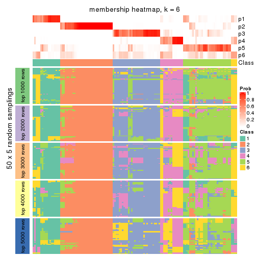</p>

</div>
</div>

As soon as we have had the classes for columns, we can look for signatures
which are significantly different between classes which can be candidate marks
for certain classes. Following are the heatmaps for signatures.


Signature heatmaps where rows are scaled:


<script>
$( function() {
	$( '#tabs-CV-kmeans-get-signatures' ).tabs();
} );
</script>
<div id='tabs-CV-kmeans-get-signatures'>
<ul>
<li><a href='#tab-CV-kmeans-get-signatures-1'>k = 2</a></li>
<li><a href='#tab-CV-kmeans-get-signatures-2'>k = 3</a></li>
<li><a href='#tab-CV-kmeans-get-signatures-3'>k = 4</a></li>
<li><a href='#tab-CV-kmeans-get-signatures-4'>k = 5</a></li>
<li><a href='#tab-CV-kmeans-get-signatures-5'>k = 6</a></li>
</ul>
<div id='tab-CV-kmeans-get-signatures-1'>
<pre><code class="r">get_signatures(res, k = 2)
</code></pre>

<p></p>

</div>
<div id='tab-CV-kmeans-get-signatures-2'>
<pre><code class="r">get_signatures(res, k = 3)
</code></pre>

<p></p>

</div>
<div id='tab-CV-kmeans-get-signatures-3'>
<pre><code class="r">get_signatures(res, k = 4)
</code></pre>

<p></p>

</div>
<div id='tab-CV-kmeans-get-signatures-4'>
<pre><code class="r">get_signatures(res, k = 5)
</code></pre>

<p></p>

</div>
<div id='tab-CV-kmeans-get-signatures-5'>
<pre><code class="r">get_signatures(res, k = 6)
</code></pre>

<p></p>

</div>
</div>


Signature heatmaps where rows are not scaled:


<script>
$( function() {
	$( '#tabs-CV-kmeans-get-signatures-no-scale' ).tabs();
} );
</script>
<div id='tabs-CV-kmeans-get-signatures-no-scale'>
<ul>
<li><a href='#tab-CV-kmeans-get-signatures-no-scale-1'>k = 2</a></li>
<li><a href='#tab-CV-kmeans-get-signatures-no-scale-2'>k = 3</a></li>
<li><a href='#tab-CV-kmeans-get-signatures-no-scale-3'>k = 4</a></li>
<li><a href='#tab-CV-kmeans-get-signatures-no-scale-4'>k = 5</a></li>
<li><a href='#tab-CV-kmeans-get-signatures-no-scale-5'>k = 6</a></li>
</ul>
<div id='tab-CV-kmeans-get-signatures-no-scale-1'>
<pre><code class="r">get_signatures(res, k = 2, scale_rows = FALSE)
</code></pre>

<p></p>

</div>
<div id='tab-CV-kmeans-get-signatures-no-scale-2'>
<pre><code class="r">get_signatures(res, k = 3, scale_rows = FALSE)
</code></pre>

<p></p>

</div>
<div id='tab-CV-kmeans-get-signatures-no-scale-3'>
<pre><code class="r">get_signatures(res, k = 4, scale_rows = FALSE)
</code></pre>

<p></p>

</div>
<div id='tab-CV-kmeans-get-signatures-no-scale-4'>
<pre><code class="r">get_signatures(res, k = 5, scale_rows = FALSE)
</code></pre>

<p></p>

</div>
<div id='tab-CV-kmeans-get-signatures-no-scale-5'>
<pre><code class="r">get_signatures(res, k = 6, scale_rows = FALSE)
</code></pre>

<p></p>

</div>
</div>


Compare the overlap of signatures from different k:

```r
compare_signatures(res)
```


`get_signature()` returns a data frame invisibly. TO get the list of signatures, the function
call should be assigned to a variable explicitly. In following code, if `plot` argument is set
to `FALSE`, no heatmap is plotted while only the differential analysis is performed.

```r
# code only for demonstration
tb = get_signature(res, k = ..., plot = FALSE)
```

An example of the output of `tb` is:

```
#>   which_row         fdr    mean_1    mean_2 scaled_mean_1 scaled_mean_2 km
#> 1        38 0.042760348  8.373488  9.131774    -0.5533452     0.5164555  1
#> 2        40 0.018707592  7.106213  8.469186    -0.6173731     0.5762149  1
#> 3        55 0.019134737 10.221463 11.207825    -0.6159697     0.5749050  1
#> 4        59 0.006059896  5.921854  7.869574    -0.6899429     0.6439467  1
#> 5        60 0.018055526  8.928898 10.211722    -0.6204761     0.5791110  1
#> 6        98 0.009384629 15.714769 14.887706     0.6635654    -0.6193277  2
...
```

The columns in `tb` are:

1. `which_row`: row indices corresponding to the input matrix.
2. `fdr`: FDR for the differential test. 
3. `mean_x`: The mean value in group x.
4. `scaled_mean_x`: The mean value in group x after rows are scaled.
5. `km`: Row groups if k-means clustering is applied to rows.


UMAP plot which shows how samples are separated.


<script>
$( function() {
	$( '#tabs-CV-kmeans-dimension-reduction' ).tabs();
} );
</script>
<div id='tabs-CV-kmeans-dimension-reduction'>
<ul>
<li><a href='#tab-CV-kmeans-dimension-reduction-1'>k = 2</a></li>
<li><a href='#tab-CV-kmeans-dimension-reduction-2'>k = 3</a></li>
<li><a href='#tab-CV-kmeans-dimension-reduction-3'>k = 4</a></li>
<li><a href='#tab-CV-kmeans-dimension-reduction-4'>k = 5</a></li>
<li><a href='#tab-CV-kmeans-dimension-reduction-5'>k = 6</a></li>
</ul>
<div id='tab-CV-kmeans-dimension-reduction-1'>
<pre><code class="r">dimension_reduction(res, k = 2, method = &quot;UMAP&quot;)
</code></pre>

<p></p>

</div>
<div id='tab-CV-kmeans-dimension-reduction-2'>
<pre><code class="r">dimension_reduction(res, k = 3, method = &quot;UMAP&quot;)
</code></pre>

<p></p>

</div>
<div id='tab-CV-kmeans-dimension-reduction-3'>
<pre><code class="r">dimension_reduction(res, k = 4, method = &quot;UMAP&quot;)
</code></pre>

<p></p>

</div>
<div id='tab-CV-kmeans-dimension-reduction-4'>
<pre><code class="r">dimension_reduction(res, k = 5, method = &quot;UMAP&quot;)
</code></pre>

<p></p>

</div>
<div id='tab-CV-kmeans-dimension-reduction-5'>
<pre><code class="r">dimension_reduction(res, k = 6, method = &quot;UMAP&quot;)
</code></pre>

<p></p>

</div>
</div>


Following heatmap shows how subgroups are split when increasing `k`:

```r
collect_classes(res)
```


If matrix rows can be associated to genes, consider to use `functional_enrichment(res,
...)` to perform function enrichment for the signature genes. See [this vignette](http://bioconductor.org/packages/devel/bioc/vignettes/cola/inst/doc/functional_enrichment.html) for more detailed explanations.


 

---------------------------------------------------


### CV:skmeans*


The object with results only for a single top-value method and a single partition method 
can be extracted as:

```r
res = res_list["CV", "skmeans"]
# you can also extract it by
# res = res_list["CV:skmeans"]
```

A summary of `res` and all the functions that can be applied to it:

```r
res
```

```
#> A 'ConsensusPartition' object with k = 2, 3, 4, 5, 6.
#>   On a matrix with 13580 rows and 133 columns.
#>   Top rows (1000, 2000, 3000, 4000, 5000) are extracted by 'CV' method.
#>   Subgroups are detected by 'skmeans' method.
#>   Performed in total 1250 partitions by row resampling.
#>   Best k for subgroups seems to be 4.
#> 
#> Following methods can be applied to this 'ConsensusPartition' object:
#>  [1] "cola_report"             "collect_classes"         "collect_plots"          
#>  [4] "collect_stats"           "colnames"                "compare_signatures"     
#>  [7] "consensus_heatmap"       "dimension_reduction"     "functional_enrichment"  
#> [10] "get_anno_col"            "get_anno"                "get_classes"            
#> [13] "get_consensus"           "get_matrix"              "get_membership"         
#> [16] "get_param"               "get_signatures"          "get_stats"              
#> [19] "is_best_k"               "is_stable_k"             "membership_heatmap"     
#> [22] "ncol"                    "nrow"                    "plot_ecdf"              
#> [25] "rownames"                "select_partition_number" "show"                   
#> [28] "suggest_best_k"          "test_to_known_factors"
```

`collect_plots()` function collects all the plots made from `res` for all `k` (number of partitions)
into one single page to provide an easy and fast comparison between different `k`.

```r
collect_plots(res)
```


The plots are:

- The first row: a plot of the ECDF (empirical cumulative distribution
  function) curves of the consensus matrix for each `k` and the heatmap of
  predicted classes for each `k`.
- The second row: heatmaps of the consensus matrix for each `k`.
- The third row: heatmaps of the membership matrix for each `k`.
- The fouth row: heatmaps of the signatures for each `k`.

All the plots in panels can be made by individual functions and they are
plotted later in this section.

`select_partition_number()` produces several plots showing different
statistics for choosing "optimized" `k`. There are following statistics:

- ECDF curves of the consensus matrix for each `k`;
- 1-PAC. [The PAC
  score](https://en.wikipedia.org/wiki/Consensus_clustering#Over-interpretation_potential_of_consensus_clustering)
  measures the proportion of the ambiguous subgrouping.
- Mean silhouette score.
- Concordance. The mean probability of fiting the consensus class ids in all
  partitions.
- Area increased. Denote $A_k$ as the area under the ECDF curve for current
  `k`, the area increased is defined as $A_k - A_{k-1}$.
- Rand index. The percent of pairs of samples that are both in a same cluster
  or both are not in a same cluster in the partition of k and k-1.
- Jaccard index. The ratio of pairs of samples are both in a same cluster in
  the partition of k and k-1 and the pairs of samples are both in a same
  cluster in the partition k or k-1.

The detailed explanations of these statistics can be found in [the _cola_
vignette](http://bioconductor.org/packages/devel/bioc/vignettes/cola/inst/doc/cola.html#toc_13).

Generally speaking, lower PAC score, higher mean silhouette score or higher
concordance corresponds to better partition. Rand index and Jaccard index
measure how similar the current partition is compared to partition with `k-1`.
If they are too similar, we won't accept `k` is better than `k-1`.

```r
select_partition_number(res)
```


The numeric values for all these statistics can be obtained by `get_stats()`.

```r
get_stats(res)
```

```
#>   k 1-PAC mean_silhouette concordance area_increased  Rand Jaccard
#> 2 2 0.968           0.948       0.979         0.4974 0.504   0.504
#> 3 3 0.958           0.929       0.971         0.3353 0.763   0.559
#> 4 4 0.903           0.900       0.944         0.1139 0.876   0.654
#> 5 5 0.847           0.799       0.903         0.0488 0.935   0.764
#> 6 6 0.839           0.685       0.851         0.0284 0.972   0.881
```

`suggest_best_k()` suggests the best $k$ based on these statistics. The rules are as follows:

- All $k$ with Jaccard index larger than 0.95 are removed because increasing
  $k$ does not provide enough extra information. If all $k$ are removed, it is
  marked as no subgroup is detected.
- For all $k$ with 1-PAC score larger than 0.9, the maximal $k$ is taken as
  the best $k$, and other $k$ are marked as optional $k$.
- If it does not fit the second rule. The $k$ with the maximal vote of the
  highest 1-PAC score, highest mean silhouette, and highest concordance is
  taken as the best $k$.

```r
suggest_best_k(res)
```

```
#> [1] 4
#> attr(,"optional")
#> [1] 2 3
```

There is also optional best $k$ = 2 3 that is worth to check.

Following shows the table of the partitions (You need to click the **show/hide
code output** link to see it). The membership matrix (columns with name `p*`)
is inferred by
[`clue::cl_consensus()`](https://www.rdocumentation.org/link/cl_consensus?package=clue)
function with the `SE` method. Basically the value in the membership matrix
represents the probability to belong to a certain group. The finall class
label for an item is determined with the group with highest probability it
belongs to.

In `get_classes()` function, the entropy is calculated from the membership
matrix and the silhouette score is calculated from the consensus matrix.


<script>
$( function() {
	$( '#tabs-CV-skmeans-get-classes' ).tabs();
} );
</script>
<div id='tabs-CV-skmeans-get-classes'>
<ul>
<li><a href='#tab-CV-skmeans-get-classes-1'>k = 2</a></li>
<li><a href='#tab-CV-skmeans-get-classes-2'>k = 3</a></li>
<li><a href='#tab-CV-skmeans-get-classes-3'>k = 4</a></li>
<li><a href='#tab-CV-skmeans-get-classes-4'>k = 5</a></li>
<li><a href='#tab-CV-skmeans-get-classes-5'>k = 6</a></li>
</ul>

<div id='tab-CV-skmeans-get-classes-1'>
<p><a id='tab-CV-skmeans-get-classes-1-a' style='color:#0366d6' href='#'>show/hide code output</a></p>
<pre><code class="r">cbind(get_classes(res, k = 2), get_membership(res, k = 2))
</code></pre>

<pre><code>#&gt;            class entropy silhouette    p1    p2
#&gt; SRR1951667     2  0.0000      0.971 0.000 1.000
#&gt; SRR1951666     2  0.0000      0.971 0.000 1.000
#&gt; SRR1951665     2  0.0000      0.971 0.000 1.000
#&gt; SRR1951664     2  0.0000      0.971 0.000 1.000
#&gt; SRR1951663     1  0.0000      0.986 1.000 0.000
#&gt; SRR1951662     2  0.0000      0.971 0.000 1.000
#&gt; SRR1951661     2  0.0000      0.971 0.000 1.000
#&gt; SRR1951660     1  0.0000      0.986 1.000 0.000
#&gt; SRR1951659     2  0.0000      0.971 0.000 1.000
#&gt; SRR1951658     2  0.0000      0.971 0.000 1.000
#&gt; SRR1951657     1  0.0000      0.986 1.000 0.000
#&gt; SRR1951656     1  0.0000      0.986 1.000 0.000
#&gt; SRR1951655     1  0.0000      0.986 1.000 0.000
#&gt; SRR1951654     1  0.0000      0.986 1.000 0.000
#&gt; SRR1951653     1  0.0000      0.986 1.000 0.000
#&gt; SRR1951652     2  0.0376      0.968 0.004 0.996
#&gt; SRR1951651     1  0.0000      0.986 1.000 0.000
#&gt; SRR1951650     2  0.7219      0.754 0.200 0.800
#&gt; SRR1951648     2  0.0000      0.971 0.000 1.000
#&gt; SRR1951649     2  0.0000      0.971 0.000 1.000
#&gt; SRR1951647     2  0.0000      0.971 0.000 1.000
#&gt; SRR1951646     1  0.0000      0.986 1.000 0.000
#&gt; SRR1951645     1  0.0000      0.986 1.000 0.000
#&gt; SRR1951644     1  0.0000      0.986 1.000 0.000
#&gt; SRR1951643     1  0.0000      0.986 1.000 0.000
#&gt; SRR1951641     2  0.0000      0.971 0.000 1.000
#&gt; SRR1951642     1  0.0000      0.986 1.000 0.000
#&gt; SRR1951694     1  0.0000      0.986 1.000 0.000
#&gt; SRR1951731     2  0.0000      0.971 0.000 1.000
#&gt; SRR1951730     2  0.0000      0.971 0.000 1.000
#&gt; SRR1951752     2  0.0000      0.971 0.000 1.000
#&gt; SRR1951751     1  0.0000      0.986 1.000 0.000
#&gt; SRR1951749     2  0.0000      0.971 0.000 1.000
#&gt; SRR1951750     1  0.0000      0.986 1.000 0.000
#&gt; SRR1951748     2  0.0000      0.971 0.000 1.000
#&gt; SRR1951747     2  0.0000      0.971 0.000 1.000
#&gt; SRR1951745     1  0.0000      0.986 1.000 0.000
#&gt; SRR1951746     2  0.0000      0.971 0.000 1.000
#&gt; SRR1951744     1  0.0000      0.986 1.000 0.000
#&gt; SRR1951742     2  0.0000      0.971 0.000 1.000
#&gt; SRR1951743     2  0.0000      0.971 0.000 1.000
#&gt; SRR1951741     1  0.0000      0.986 1.000 0.000
#&gt; SRR1951740     1  0.0000      0.986 1.000 0.000
#&gt; SRR1951738     2  0.0000      0.971 0.000 1.000
#&gt; SRR1951739     2  0.0000      0.971 0.000 1.000
#&gt; SRR1951737     2  0.0000      0.971 0.000 1.000
#&gt; SRR1951736     1  0.0000      0.986 1.000 0.000
#&gt; SRR1951734     2  0.0000      0.971 0.000 1.000
#&gt; SRR1951735     2  0.0000      0.971 0.000 1.000
#&gt; SRR1951733     2  0.0000      0.971 0.000 1.000
#&gt; SRR1951732     2  0.0000      0.971 0.000 1.000
#&gt; SRR1951729     2  0.0000      0.971 0.000 1.000
#&gt; SRR1951728     2  0.0000      0.971 0.000 1.000
#&gt; SRR1951727     2  0.0000      0.971 0.000 1.000
#&gt; SRR1951725     1  0.0000      0.986 1.000 0.000
#&gt; SRR1951726     1  0.9044      0.508 0.680 0.320
#&gt; SRR1951724     1  0.0000      0.986 1.000 0.000
#&gt; SRR1951722     2  0.0000      0.971 0.000 1.000
#&gt; SRR1951723     2  0.0000      0.971 0.000 1.000
#&gt; SRR1951721     1  0.0000      0.986 1.000 0.000
#&gt; SRR1951719     2  0.7139      0.759 0.196 0.804
#&gt; SRR1951720     1  0.0000      0.986 1.000 0.000
#&gt; SRR1951718     1  0.0000      0.986 1.000 0.000
#&gt; SRR1951717     1  0.0000      0.986 1.000 0.000
#&gt; SRR1951715     1  0.0000      0.986 1.000 0.000
#&gt; SRR1951716     1  0.0000      0.986 1.000 0.000
#&gt; SRR1951714     1  0.0000      0.986 1.000 0.000
#&gt; SRR1951713     2  0.0000      0.971 0.000 1.000
#&gt; SRR1951712     1  0.0000      0.986 1.000 0.000
#&gt; SRR1951711     2  0.0000      0.971 0.000 1.000
#&gt; SRR1951710     1  0.0000      0.986 1.000 0.000
#&gt; SRR1951709     2  0.0000      0.971 0.000 1.000
#&gt; SRR1951708     2  0.0000      0.971 0.000 1.000
#&gt; SRR1951707     2  0.0000      0.971 0.000 1.000
#&gt; SRR1951705     1  0.0000      0.986 1.000 0.000
#&gt; SRR1951704     2  0.0000      0.971 0.000 1.000
#&gt; SRR1951703     2  0.0000      0.971 0.000 1.000
#&gt; SRR1951706     1  0.0000      0.986 1.000 0.000
#&gt; SRR1951702     2  0.2043      0.944 0.032 0.968
#&gt; SRR1951701     2  0.0000      0.971 0.000 1.000
#&gt; SRR1951699     2  0.0000      0.971 0.000 1.000
#&gt; SRR1951698     2  0.0000      0.971 0.000 1.000
#&gt; SRR1951700     2  0.3584      0.910 0.068 0.932
#&gt; SRR1951697     2  0.0000      0.971 0.000 1.000
#&gt; SRR1951696     1  0.1843      0.959 0.972 0.028
#&gt; SRR1951695     2  0.0000      0.971 0.000 1.000
#&gt; SRR1951693     1  0.0000      0.986 1.000 0.000
#&gt; SRR1951692     1  0.0000      0.986 1.000 0.000
#&gt; SRR1951691     1  0.0000      0.986 1.000 0.000
#&gt; SRR1951688     2  0.0000      0.971 0.000 1.000
#&gt; SRR1951689     2  0.0000      0.971 0.000 1.000
#&gt; SRR1951687     1  0.0000      0.986 1.000 0.000
#&gt; SRR1951685     2  0.0000      0.971 0.000 1.000
#&gt; SRR1951684     2  0.9686      0.370 0.396 0.604
#&gt; SRR1951686     2  0.0000      0.971 0.000 1.000
#&gt; SRR1951683     1  0.0000      0.986 1.000 0.000
#&gt; SRR1951682     2  0.0000      0.971 0.000 1.000
#&gt; SRR1951690     2  0.0000      0.971 0.000 1.000
#&gt; SRR1951680     2  0.7219      0.754 0.200 0.800
#&gt; SRR1951679     2  0.0000      0.971 0.000 1.000
#&gt; SRR1951678     1  0.0000      0.986 1.000 0.000
#&gt; SRR1951677     1  0.0000      0.986 1.000 0.000
#&gt; SRR1951676     1  0.0000      0.986 1.000 0.000
#&gt; SRR1951675     2  0.0000      0.971 0.000 1.000
#&gt; SRR1951681     2  0.9754      0.337 0.408 0.592
#&gt; SRR1951673     2  0.0000      0.971 0.000 1.000
#&gt; SRR1951674     1  0.0000      0.986 1.000 0.000
#&gt; SRR1951672     1  0.9661      0.325 0.608 0.392
#&gt; SRR1951671     2  0.0000      0.971 0.000 1.000
#&gt; SRR1951670     1  0.0000      0.986 1.000 0.000
#&gt; SRR1951640     2  0.0000      0.971 0.000 1.000
#&gt; SRR1951668     1  0.0000      0.986 1.000 0.000
#&gt; SRR1951669     2  0.6343      0.802 0.160 0.840
#&gt; SRR1951638     1  0.0000      0.986 1.000 0.000
#&gt; SRR1951637     2  0.2423      0.937 0.040 0.960
#&gt; SRR1951635     1  0.0000      0.986 1.000 0.000
#&gt; SRR1951634     1  0.0000      0.986 1.000 0.000
#&gt; SRR1951631     1  0.0000      0.986 1.000 0.000
#&gt; SRR1951632     2  0.0000      0.971 0.000 1.000
#&gt; SRR1951633     1  0.0000      0.986 1.000 0.000
#&gt; SRR1951630     1  0.0000      0.986 1.000 0.000
#&gt; SRR1951629     1  0.0000      0.986 1.000 0.000
#&gt; SRR1951628     2  0.0000      0.971 0.000 1.000
#&gt; SRR1951627     2  0.0000      0.971 0.000 1.000
#&gt; SRR1951639     2  0.0000      0.971 0.000 1.000
#&gt; SRR1951625     2  0.0000      0.971 0.000 1.000
#&gt; SRR1951626     2  0.0000      0.971 0.000 1.000
#&gt; SRR1951624     2  0.0000      0.971 0.000 1.000
#&gt; SRR1951622     1  0.0000      0.986 1.000 0.000
#&gt; SRR1951636     2  0.0000      0.971 0.000 1.000
#&gt; SRR1951623     1  0.0000      0.986 1.000 0.000
#&gt; SRR1951621     1  0.0000      0.986 1.000 0.000
#&gt; SRR1951620     2  0.9608      0.400 0.384 0.616
</code></pre>

<script>
$('#tab-CV-skmeans-get-classes-1-a').parent().next().next().hide();
$('#tab-CV-skmeans-get-classes-1-a').click(function(){
  $('#tab-CV-skmeans-get-classes-1-a').parent().next().next().toggle();
  return(false);
});
</script>
</div>

<div id='tab-CV-skmeans-get-classes-2'>
<p><a id='tab-CV-skmeans-get-classes-2-a' style='color:#0366d6' href='#'>show/hide code output</a></p>
<pre><code class="r">cbind(get_classes(res, k = 3), get_membership(res, k = 3))
</code></pre>

<pre><code>#&gt;            class entropy silhouette    p1    p2    p3
#&gt; SRR1951667     2  0.0000     0.9847 0.000 1.000 0.000
#&gt; SRR1951666     3  0.0424     0.9325 0.000 0.008 0.992
#&gt; SRR1951665     2  0.0000     0.9847 0.000 1.000 0.000
#&gt; SRR1951664     3  0.0000     0.9367 0.000 0.000 1.000
#&gt; SRR1951663     1  0.0000     0.9770 1.000 0.000 0.000
#&gt; SRR1951662     2  0.0000     0.9847 0.000 1.000 0.000
#&gt; SRR1951661     3  0.0000     0.9367 0.000 0.000 1.000
#&gt; SRR1951660     1  0.0000     0.9770 1.000 0.000 0.000
#&gt; SRR1951659     2  0.0000     0.9847 0.000 1.000 0.000
#&gt; SRR1951658     2  0.0000     0.9847 0.000 1.000 0.000
#&gt; SRR1951657     3  0.0000     0.9367 0.000 0.000 1.000
#&gt; SRR1951656     3  0.0000     0.9367 0.000 0.000 1.000
#&gt; SRR1951655     1  0.0000     0.9770 1.000 0.000 0.000
#&gt; SRR1951654     1  0.0000     0.9770 1.000 0.000 0.000
#&gt; SRR1951653     3  0.2448     0.8727 0.076 0.000 0.924
#&gt; SRR1951652     2  0.0000     0.9847 0.000 1.000 0.000
#&gt; SRR1951651     1  0.0237     0.9744 0.996 0.000 0.004
#&gt; SRR1951650     3  0.0000     0.9367 0.000 0.000 1.000
#&gt; SRR1951648     3  0.6309     0.0892 0.000 0.500 0.500
#&gt; SRR1951649     2  0.0000     0.9847 0.000 1.000 0.000
#&gt; SRR1951647     2  0.0000     0.9847 0.000 1.000 0.000
#&gt; SRR1951646     3  0.0000     0.9367 0.000 0.000 1.000
#&gt; SRR1951645     1  0.1643     0.9387 0.956 0.000 0.044
#&gt; SRR1951644     1  0.0000     0.9770 1.000 0.000 0.000
#&gt; SRR1951643     1  0.0000     0.9770 1.000 0.000 0.000
#&gt; SRR1951641     2  0.0000     0.9847 0.000 1.000 0.000
#&gt; SRR1951642     1  0.0000     0.9770 1.000 0.000 0.000
#&gt; SRR1951694     1  0.0000     0.9770 1.000 0.000 0.000
#&gt; SRR1951731     2  0.0000     0.9847 0.000 1.000 0.000
#&gt; SRR1951730     2  0.0000     0.9847 0.000 1.000 0.000
#&gt; SRR1951752     2  0.0000     0.9847 0.000 1.000 0.000
#&gt; SRR1951751     1  0.0000     0.9770 1.000 0.000 0.000
#&gt; SRR1951749     2  0.0000     0.9847 0.000 1.000 0.000
#&gt; SRR1951750     1  0.0000     0.9770 1.000 0.000 0.000
#&gt; SRR1951748     2  0.0000     0.9847 0.000 1.000 0.000
#&gt; SRR1951747     2  0.0000     0.9847 0.000 1.000 0.000
#&gt; SRR1951745     1  0.0000     0.9770 1.000 0.000 0.000
#&gt; SRR1951746     2  0.0000     0.9847 0.000 1.000 0.000
#&gt; SRR1951744     1  0.1031     0.9580 0.976 0.000 0.024
#&gt; SRR1951742     2  0.0000     0.9847 0.000 1.000 0.000
#&gt; SRR1951743     2  0.0000     0.9847 0.000 1.000 0.000
#&gt; SRR1951741     1  0.0000     0.9770 1.000 0.000 0.000
#&gt; SRR1951740     3  0.0000     0.9367 0.000 0.000 1.000
#&gt; SRR1951738     2  0.0000     0.9847 0.000 1.000 0.000
#&gt; SRR1951739     2  0.0000     0.9847 0.000 1.000 0.000
#&gt; SRR1951737     3  0.0000     0.9367 0.000 0.000 1.000
#&gt; SRR1951736     1  0.0000     0.9770 1.000 0.000 0.000
#&gt; SRR1951734     2  0.0000     0.9847 0.000 1.000 0.000
#&gt; SRR1951735     3  0.5650     0.5758 0.000 0.312 0.688
#&gt; SRR1951733     2  0.0000     0.9847 0.000 1.000 0.000
#&gt; SRR1951732     2  0.0000     0.9847 0.000 1.000 0.000
#&gt; SRR1951729     3  0.0000     0.9367 0.000 0.000 1.000
#&gt; SRR1951728     3  0.3412     0.8337 0.000 0.124 0.876
#&gt; SRR1951727     2  0.0000     0.9847 0.000 1.000 0.000
#&gt; SRR1951725     1  0.0000     0.9770 1.000 0.000 0.000
#&gt; SRR1951726     1  0.5882     0.4752 0.652 0.348 0.000
#&gt; SRR1951724     1  0.0000     0.9770 1.000 0.000 0.000
#&gt; SRR1951722     2  0.0000     0.9847 0.000 1.000 0.000
#&gt; SRR1951723     2  0.0000     0.9847 0.000 1.000 0.000
#&gt; SRR1951721     1  0.0000     0.9770 1.000 0.000 0.000
#&gt; SRR1951719     3  0.0000     0.9367 0.000 0.000 1.000
#&gt; SRR1951720     1  0.0000     0.9770 1.000 0.000 0.000
#&gt; SRR1951718     1  0.0000     0.9770 1.000 0.000 0.000
#&gt; SRR1951717     1  0.0000     0.9770 1.000 0.000 0.000
#&gt; SRR1951715     1  0.0000     0.9770 1.000 0.000 0.000
#&gt; SRR1951716     1  0.0000     0.9770 1.000 0.000 0.000
#&gt; SRR1951714     1  0.0000     0.9770 1.000 0.000 0.000
#&gt; SRR1951713     3  0.0000     0.9367 0.000 0.000 1.000
#&gt; SRR1951712     1  0.0000     0.9770 1.000 0.000 0.000
#&gt; SRR1951711     2  0.0000     0.9847 0.000 1.000 0.000
#&gt; SRR1951710     1  0.0000     0.9770 1.000 0.000 0.000
#&gt; SRR1951709     3  0.6045     0.4381 0.000 0.380 0.620
#&gt; SRR1951708     2  0.0000     0.9847 0.000 1.000 0.000
#&gt; SRR1951707     2  0.0000     0.9847 0.000 1.000 0.000
#&gt; SRR1951705     1  0.0000     0.9770 1.000 0.000 0.000
#&gt; SRR1951704     3  0.1031     0.9221 0.000 0.024 0.976
#&gt; SRR1951703     2  0.0000     0.9847 0.000 1.000 0.000
#&gt; SRR1951706     1  0.0000     0.9770 1.000 0.000 0.000
#&gt; SRR1951702     3  0.0000     0.9367 0.000 0.000 1.000
#&gt; SRR1951701     2  0.0000     0.9847 0.000 1.000 0.000
#&gt; SRR1951699     3  0.0892     0.9250 0.000 0.020 0.980
#&gt; SRR1951698     3  0.0000     0.9367 0.000 0.000 1.000
#&gt; SRR1951700     2  0.5254     0.6218 0.264 0.736 0.000
#&gt; SRR1951697     2  0.0000     0.9847 0.000 1.000 0.000
#&gt; SRR1951696     3  0.0000     0.9367 0.000 0.000 1.000
#&gt; SRR1951695     2  0.6062     0.3301 0.000 0.616 0.384
#&gt; SRR1951693     3  0.3879     0.7890 0.152 0.000 0.848
#&gt; SRR1951692     3  0.0000     0.9367 0.000 0.000 1.000
#&gt; SRR1951691     1  0.0000     0.9770 1.000 0.000 0.000
#&gt; SRR1951688     2  0.0000     0.9847 0.000 1.000 0.000
#&gt; SRR1951689     2  0.0000     0.9847 0.000 1.000 0.000
#&gt; SRR1951687     1  0.0000     0.9770 1.000 0.000 0.000
#&gt; SRR1951685     2  0.0000     0.9847 0.000 1.000 0.000
#&gt; SRR1951684     3  0.0000     0.9367 0.000 0.000 1.000
#&gt; SRR1951686     2  0.0000     0.9847 0.000 1.000 0.000
#&gt; SRR1951683     1  0.0000     0.9770 1.000 0.000 0.000
#&gt; SRR1951682     2  0.0000     0.9847 0.000 1.000 0.000
#&gt; SRR1951690     2  0.0000     0.9847 0.000 1.000 0.000
#&gt; SRR1951680     3  0.0000     0.9367 0.000 0.000 1.000
#&gt; SRR1951679     2  0.0000     0.9847 0.000 1.000 0.000
#&gt; SRR1951678     1  0.0237     0.9744 0.996 0.000 0.004
#&gt; SRR1951677     1  0.0000     0.9770 1.000 0.000 0.000
#&gt; SRR1951676     3  0.0000     0.9367 0.000 0.000 1.000
#&gt; SRR1951675     2  0.0000     0.9847 0.000 1.000 0.000
#&gt; SRR1951681     3  0.0000     0.9367 0.000 0.000 1.000
#&gt; SRR1951673     2  0.0000     0.9847 0.000 1.000 0.000
#&gt; SRR1951674     1  0.0000     0.9770 1.000 0.000 0.000
#&gt; SRR1951672     1  0.6215     0.2686 0.572 0.428 0.000
#&gt; SRR1951671     2  0.0000     0.9847 0.000 1.000 0.000
#&gt; SRR1951670     1  0.0000     0.9770 1.000 0.000 0.000
#&gt; SRR1951640     3  0.0000     0.9367 0.000 0.000 1.000
#&gt; SRR1951668     1  0.0237     0.9744 0.996 0.000 0.004
#&gt; SRR1951669     2  0.0592     0.9724 0.012 0.988 0.000
#&gt; SRR1951638     1  0.0000     0.9770 1.000 0.000 0.000
#&gt; SRR1951637     2  0.0237     0.9806 0.004 0.996 0.000
#&gt; SRR1951635     1  0.0000     0.9770 1.000 0.000 0.000
#&gt; SRR1951634     1  0.2448     0.9049 0.924 0.000 0.076
#&gt; SRR1951631     1  0.0000     0.9770 1.000 0.000 0.000
#&gt; SRR1951632     2  0.0000     0.9847 0.000 1.000 0.000
#&gt; SRR1951633     1  0.1289     0.9510 0.968 0.000 0.032
#&gt; SRR1951630     1  0.0237     0.9744 0.996 0.000 0.004
#&gt; SRR1951629     3  0.0000     0.9367 0.000 0.000 1.000
#&gt; SRR1951628     2  0.0000     0.9847 0.000 1.000 0.000
#&gt; SRR1951627     3  0.0000     0.9367 0.000 0.000 1.000
#&gt; SRR1951639     3  0.6280     0.2252 0.000 0.460 0.540
#&gt; SRR1951625     2  0.0000     0.9847 0.000 1.000 0.000
#&gt; SRR1951626     3  0.3941     0.8005 0.000 0.156 0.844
#&gt; SRR1951624     3  0.0000     0.9367 0.000 0.000 1.000
#&gt; SRR1951622     1  0.0000     0.9770 1.000 0.000 0.000
#&gt; SRR1951636     3  0.0000     0.9367 0.000 0.000 1.000
#&gt; SRR1951623     3  0.0000     0.9367 0.000 0.000 1.000
#&gt; SRR1951621     1  0.0000     0.9770 1.000 0.000 0.000
#&gt; SRR1951620     3  0.0000     0.9367 0.000 0.000 1.000
</code></pre>

<script>
$('#tab-CV-skmeans-get-classes-2-a').parent().next().next().hide();
$('#tab-CV-skmeans-get-classes-2-a').click(function(){
  $('#tab-CV-skmeans-get-classes-2-a').parent().next().next().toggle();
  return(false);
});
</script>
</div>

<div id='tab-CV-skmeans-get-classes-3'>
<p><a id='tab-CV-skmeans-get-classes-3-a' style='color:#0366d6' href='#'>show/hide code output</a></p>
<pre><code class="r">cbind(get_classes(res, k = 4), get_membership(res, k = 4))
</code></pre>

<pre><code>#&gt;            class entropy silhouette    p1    p2    p3    p4
#&gt; SRR1951667     2  0.0000      0.973 0.000 1.000 0.000 0.000
#&gt; SRR1951666     3  0.0188      0.964 0.000 0.004 0.996 0.000
#&gt; SRR1951665     2  0.0000      0.973 0.000 1.000 0.000 0.000
#&gt; SRR1951664     3  0.0000      0.965 0.000 0.000 1.000 0.000
#&gt; SRR1951663     1  0.0469      0.928 0.988 0.000 0.000 0.012
#&gt; SRR1951662     2  0.0000      0.973 0.000 1.000 0.000 0.000
#&gt; SRR1951661     3  0.0000      0.965 0.000 0.000 1.000 0.000
#&gt; SRR1951660     1  0.0707      0.926 0.980 0.000 0.000 0.020
#&gt; SRR1951659     2  0.0000      0.973 0.000 1.000 0.000 0.000
#&gt; SRR1951658     2  0.0000      0.973 0.000 1.000 0.000 0.000
#&gt; SRR1951657     4  0.2921      0.831 0.000 0.000 0.140 0.860
#&gt; SRR1951656     4  0.3444      0.791 0.000 0.000 0.184 0.816
#&gt; SRR1951655     1  0.0336      0.929 0.992 0.000 0.000 0.008
#&gt; SRR1951654     4  0.4040      0.717 0.248 0.000 0.000 0.752
#&gt; SRR1951653     4  0.5530      0.447 0.032 0.000 0.336 0.632
#&gt; SRR1951652     2  0.0188      0.970 0.000 0.996 0.000 0.004
#&gt; SRR1951651     4  0.1716      0.888 0.064 0.000 0.000 0.936
#&gt; SRR1951650     3  0.0000      0.965 0.000 0.000 1.000 0.000
#&gt; SRR1951648     3  0.0707      0.954 0.000 0.020 0.980 0.000
#&gt; SRR1951649     2  0.5142      0.684 0.192 0.744 0.000 0.064
#&gt; SRR1951647     2  0.0000      0.973 0.000 1.000 0.000 0.000
#&gt; SRR1951646     4  0.3486      0.787 0.000 0.000 0.188 0.812
#&gt; SRR1951645     1  0.1867      0.899 0.928 0.000 0.000 0.072
#&gt; SRR1951644     1  0.1716      0.899 0.936 0.000 0.000 0.064
#&gt; SRR1951643     4  0.1716      0.888 0.064 0.000 0.000 0.936
#&gt; SRR1951641     2  0.0000      0.973 0.000 1.000 0.000 0.000
#&gt; SRR1951642     4  0.1716      0.888 0.064 0.000 0.000 0.936
#&gt; SRR1951694     1  0.0188      0.929 0.996 0.000 0.000 0.004
#&gt; SRR1951731     2  0.0000      0.973 0.000 1.000 0.000 0.000
#&gt; SRR1951730     2  0.0000      0.973 0.000 1.000 0.000 0.000
#&gt; SRR1951752     2  0.0000      0.973 0.000 1.000 0.000 0.000
#&gt; SRR1951751     1  0.1716      0.899 0.936 0.000 0.000 0.064
#&gt; SRR1951749     2  0.0000      0.973 0.000 1.000 0.000 0.000
#&gt; SRR1951750     1  0.1118      0.917 0.964 0.000 0.000 0.036
#&gt; SRR1951748     2  0.0000      0.973 0.000 1.000 0.000 0.000
#&gt; SRR1951747     2  0.0000      0.973 0.000 1.000 0.000 0.000
#&gt; SRR1951745     1  0.2704      0.838 0.876 0.000 0.000 0.124
#&gt; SRR1951746     2  0.0000      0.973 0.000 1.000 0.000 0.000
#&gt; SRR1951744     4  0.1824      0.888 0.060 0.000 0.004 0.936
#&gt; SRR1951742     2  0.0000      0.973 0.000 1.000 0.000 0.000
#&gt; SRR1951743     2  0.0000      0.973 0.000 1.000 0.000 0.000
#&gt; SRR1951741     4  0.4222      0.679 0.272 0.000 0.000 0.728
#&gt; SRR1951740     4  0.2345      0.855 0.000 0.000 0.100 0.900
#&gt; SRR1951738     2  0.0000      0.973 0.000 1.000 0.000 0.000
#&gt; SRR1951739     2  0.0000      0.973 0.000 1.000 0.000 0.000
#&gt; SRR1951737     3  0.0000      0.965 0.000 0.000 1.000 0.000
#&gt; SRR1951736     1  0.0188      0.929 0.996 0.000 0.000 0.004
#&gt; SRR1951734     2  0.0000      0.973 0.000 1.000 0.000 0.000
#&gt; SRR1951735     3  0.0592      0.958 0.000 0.016 0.984 0.000
#&gt; SRR1951733     2  0.0000      0.973 0.000 1.000 0.000 0.000
#&gt; SRR1951732     2  0.0000      0.973 0.000 1.000 0.000 0.000
#&gt; SRR1951729     3  0.0000      0.965 0.000 0.000 1.000 0.000
#&gt; SRR1951728     3  0.2197      0.887 0.000 0.080 0.916 0.004
#&gt; SRR1951727     2  0.0000      0.973 0.000 1.000 0.000 0.000
#&gt; SRR1951725     1  0.0469      0.929 0.988 0.000 0.000 0.012
#&gt; SRR1951726     1  0.6238      0.556 0.632 0.276 0.000 0.092
#&gt; SRR1951724     1  0.4040      0.706 0.752 0.000 0.000 0.248
#&gt; SRR1951722     2  0.0000      0.973 0.000 1.000 0.000 0.000
#&gt; SRR1951723     2  0.0469      0.965 0.000 0.988 0.000 0.012
#&gt; SRR1951721     1  0.0188      0.929 0.996 0.000 0.000 0.004
#&gt; SRR1951719     3  0.0000      0.965 0.000 0.000 1.000 0.000
#&gt; SRR1951720     1  0.0469      0.929 0.988 0.000 0.000 0.012
#&gt; SRR1951718     1  0.0707      0.926 0.980 0.000 0.000 0.020
#&gt; SRR1951717     1  0.0188      0.929 0.996 0.000 0.000 0.004
#&gt; SRR1951715     1  0.0000      0.928 1.000 0.000 0.000 0.000
#&gt; SRR1951716     1  0.0188      0.929 0.996 0.000 0.000 0.004
#&gt; SRR1951714     4  0.1716      0.888 0.064 0.000 0.000 0.936
#&gt; SRR1951713     3  0.1902      0.917 0.004 0.000 0.932 0.064
#&gt; SRR1951712     1  0.1716      0.899 0.936 0.000 0.000 0.064
#&gt; SRR1951711     2  0.0000      0.973 0.000 1.000 0.000 0.000
#&gt; SRR1951710     1  0.0469      0.925 0.988 0.000 0.000 0.012
#&gt; SRR1951709     3  0.0592      0.958 0.000 0.016 0.984 0.000
#&gt; SRR1951708     2  0.0000      0.973 0.000 1.000 0.000 0.000
#&gt; SRR1951707     2  0.1474      0.931 0.000 0.948 0.000 0.052
#&gt; SRR1951705     1  0.1716      0.899 0.936 0.000 0.000 0.064
#&gt; SRR1951704     3  0.0336      0.962 0.000 0.008 0.992 0.000
#&gt; SRR1951703     2  0.0000      0.973 0.000 1.000 0.000 0.000
#&gt; SRR1951706     4  0.1716      0.888 0.064 0.000 0.000 0.936
#&gt; SRR1951702     3  0.0000      0.965 0.000 0.000 1.000 0.000
#&gt; SRR1951701     2  0.0000      0.973 0.000 1.000 0.000 0.000
#&gt; SRR1951699     3  0.0336      0.962 0.000 0.008 0.992 0.000
#&gt; SRR1951698     3  0.0000      0.965 0.000 0.000 1.000 0.000
#&gt; SRR1951700     1  0.5835      0.566 0.656 0.280 0.000 0.064
#&gt; SRR1951697     2  0.0000      0.973 0.000 1.000 0.000 0.000
#&gt; SRR1951696     3  0.1637      0.913 0.000 0.000 0.940 0.060
#&gt; SRR1951695     3  0.4509      0.598 0.000 0.288 0.708 0.004
#&gt; SRR1951693     3  0.4022      0.820 0.096 0.000 0.836 0.068
#&gt; SRR1951692     4  0.1867      0.870 0.000 0.000 0.072 0.928
#&gt; SRR1951691     1  0.1302      0.916 0.956 0.000 0.000 0.044
#&gt; SRR1951688     2  0.0000      0.973 0.000 1.000 0.000 0.000
#&gt; SRR1951689     2  0.0000      0.973 0.000 1.000 0.000 0.000
#&gt; SRR1951687     4  0.2760      0.849 0.128 0.000 0.000 0.872
#&gt; SRR1951685     2  0.0817      0.955 0.000 0.976 0.000 0.024
#&gt; SRR1951684     3  0.0000      0.965 0.000 0.000 1.000 0.000
#&gt; SRR1951686     2  0.0000      0.973 0.000 1.000 0.000 0.000
#&gt; SRR1951683     4  0.2408      0.866 0.104 0.000 0.000 0.896
#&gt; SRR1951682     2  0.0000      0.973 0.000 1.000 0.000 0.000
#&gt; SRR1951690     2  0.0000      0.973 0.000 1.000 0.000 0.000
#&gt; SRR1951680     3  0.1637      0.923 0.000 0.000 0.940 0.060
#&gt; SRR1951679     2  0.4188      0.806 0.112 0.824 0.000 0.064
#&gt; SRR1951678     4  0.1716      0.888 0.064 0.000 0.000 0.936
#&gt; SRR1951677     4  0.1716      0.888 0.064 0.000 0.000 0.936
#&gt; SRR1951676     4  0.4992      0.233 0.000 0.000 0.476 0.524
#&gt; SRR1951675     2  0.0000      0.973 0.000 1.000 0.000 0.000
#&gt; SRR1951681     3  0.0000      0.965 0.000 0.000 1.000 0.000
#&gt; SRR1951673     2  0.0000      0.973 0.000 1.000 0.000 0.000
#&gt; SRR1951674     1  0.2868      0.825 0.864 0.000 0.000 0.136
#&gt; SRR1951672     1  0.3547      0.843 0.864 0.072 0.000 0.064
#&gt; SRR1951671     2  0.0000      0.973 0.000 1.000 0.000 0.000
#&gt; SRR1951670     1  0.1118      0.917 0.964 0.000 0.000 0.036
#&gt; SRR1951640     3  0.0000      0.965 0.000 0.000 1.000 0.000
#&gt; SRR1951668     4  0.0000      0.865 0.000 0.000 0.000 1.000
#&gt; SRR1951669     2  0.4477      0.549 0.312 0.688 0.000 0.000
#&gt; SRR1951638     1  0.0469      0.929 0.988 0.000 0.000 0.012
#&gt; SRR1951637     2  0.4746      0.422 0.368 0.632 0.000 0.000
#&gt; SRR1951635     1  0.0469      0.929 0.988 0.000 0.000 0.012
#&gt; SRR1951634     4  0.1624      0.858 0.020 0.000 0.028 0.952
#&gt; SRR1951631     4  0.1716      0.888 0.064 0.000 0.000 0.936
#&gt; SRR1951632     2  0.0000      0.973 0.000 1.000 0.000 0.000
#&gt; SRR1951633     4  0.1716      0.888 0.064 0.000 0.000 0.936
#&gt; SRR1951630     4  0.1716      0.888 0.064 0.000 0.000 0.936
#&gt; SRR1951629     4  0.3074      0.821 0.000 0.000 0.152 0.848
#&gt; SRR1951628     2  0.0336      0.967 0.008 0.992 0.000 0.000
#&gt; SRR1951627     3  0.0000      0.965 0.000 0.000 1.000 0.000
#&gt; SRR1951639     3  0.0592      0.958 0.000 0.016 0.984 0.000
#&gt; SRR1951625     2  0.0000      0.973 0.000 1.000 0.000 0.000
#&gt; SRR1951626     3  0.0469      0.960 0.000 0.012 0.988 0.000
#&gt; SRR1951624     3  0.0000      0.965 0.000 0.000 1.000 0.000
#&gt; SRR1951622     1  0.0188      0.929 0.996 0.000 0.000 0.004
#&gt; SRR1951636     3  0.0000      0.965 0.000 0.000 1.000 0.000
#&gt; SRR1951623     4  0.1792      0.871 0.000 0.000 0.068 0.932
#&gt; SRR1951621     4  0.3942      0.733 0.236 0.000 0.000 0.764
#&gt; SRR1951620     3  0.0000      0.965 0.000 0.000 1.000 0.000
</code></pre>

<script>
$('#tab-CV-skmeans-get-classes-3-a').parent().next().next().hide();
$('#tab-CV-skmeans-get-classes-3-a').click(function(){
  $('#tab-CV-skmeans-get-classes-3-a').parent().next().next().toggle();
  return(false);
});
</script>
</div>

<div id='tab-CV-skmeans-get-classes-4'>
<p><a id='tab-CV-skmeans-get-classes-4-a' style='color:#0366d6' href='#'>show/hide code output</a></p>
<pre><code class="r">cbind(get_classes(res, k = 5), get_membership(res, k = 5))
</code></pre>

<pre><code>#&gt;            class entropy silhouette    p1    p2    p3    p4    p5
#&gt; SRR1951667     2  0.0000     0.9676 0.000 1.000 0.000 0.000 0.000
#&gt; SRR1951666     3  0.0000     0.9097 0.000 0.000 1.000 0.000 0.000
#&gt; SRR1951665     2  0.0000     0.9676 0.000 1.000 0.000 0.000 0.000
#&gt; SRR1951664     3  0.1484     0.9005 0.000 0.000 0.944 0.008 0.048
#&gt; SRR1951663     1  0.0000     0.8363 1.000 0.000 0.000 0.000 0.000
#&gt; SRR1951662     2  0.0000     0.9676 0.000 1.000 0.000 0.000 0.000
#&gt; SRR1951661     3  0.0000     0.9097 0.000 0.000 1.000 0.000 0.000
#&gt; SRR1951660     1  0.0693     0.8362 0.980 0.000 0.000 0.008 0.012
#&gt; SRR1951659     2  0.0000     0.9676 0.000 1.000 0.000 0.000 0.000
#&gt; SRR1951658     2  0.0000     0.9676 0.000 1.000 0.000 0.000 0.000
#&gt; SRR1951657     4  0.2110     0.8024 0.000 0.000 0.016 0.912 0.072
#&gt; SRR1951656     4  0.3336     0.7527 0.000 0.000 0.060 0.844 0.096
#&gt; SRR1951655     1  0.0404     0.8359 0.988 0.000 0.000 0.000 0.012
#&gt; SRR1951654     1  0.3636     0.6482 0.728 0.000 0.000 0.272 0.000
#&gt; SRR1951653     4  0.5408     0.5575 0.000 0.000 0.120 0.652 0.228
#&gt; SRR1951652     2  0.1483     0.9271 0.028 0.952 0.012 0.000 0.008
#&gt; SRR1951651     4  0.1043     0.8453 0.040 0.000 0.000 0.960 0.000
#&gt; SRR1951650     3  0.2905     0.8521 0.000 0.000 0.868 0.036 0.096
#&gt; SRR1951648     3  0.0404     0.9038 0.000 0.012 0.988 0.000 0.000
#&gt; SRR1951649     5  0.3148     0.7333 0.072 0.060 0.000 0.004 0.864
#&gt; SRR1951647     2  0.0000     0.9676 0.000 1.000 0.000 0.000 0.000
#&gt; SRR1951646     4  0.3759     0.7290 0.000 0.000 0.092 0.816 0.092
#&gt; SRR1951645     5  0.2674     0.7410 0.140 0.000 0.000 0.004 0.856
#&gt; SRR1951644     1  0.4294    -0.0182 0.532 0.000 0.000 0.000 0.468
#&gt; SRR1951643     4  0.2280     0.7895 0.120 0.000 0.000 0.880 0.000
#&gt; SRR1951641     2  0.0000     0.9676 0.000 1.000 0.000 0.000 0.000
#&gt; SRR1951642     4  0.1043     0.8453 0.040 0.000 0.000 0.960 0.000
#&gt; SRR1951694     1  0.0404     0.8359 0.988 0.000 0.000 0.000 0.012
#&gt; SRR1951731     2  0.0000     0.9676 0.000 1.000 0.000 0.000 0.000
#&gt; SRR1951730     2  0.0000     0.9676 0.000 1.000 0.000 0.000 0.000
#&gt; SRR1951752     2  0.0000     0.9676 0.000 1.000 0.000 0.000 0.000
#&gt; SRR1951751     5  0.3003     0.7132 0.188 0.000 0.000 0.000 0.812
#&gt; SRR1951749     2  0.0000     0.9676 0.000 1.000 0.000 0.000 0.000
#&gt; SRR1951750     1  0.2189     0.8074 0.904 0.000 0.000 0.084 0.012
#&gt; SRR1951748     2  0.0000     0.9676 0.000 1.000 0.000 0.000 0.000
#&gt; SRR1951747     2  0.0000     0.9676 0.000 1.000 0.000 0.000 0.000
#&gt; SRR1951745     1  0.2329     0.7819 0.876 0.000 0.000 0.124 0.000
#&gt; SRR1951746     2  0.0000     0.9676 0.000 1.000 0.000 0.000 0.000
#&gt; SRR1951744     4  0.1410     0.8386 0.060 0.000 0.000 0.940 0.000
#&gt; SRR1951742     2  0.0000     0.9676 0.000 1.000 0.000 0.000 0.000
#&gt; SRR1951743     2  0.0000     0.9676 0.000 1.000 0.000 0.000 0.000
#&gt; SRR1951741     1  0.3534     0.6708 0.744 0.000 0.000 0.256 0.000
#&gt; SRR1951740     4  0.4276     0.4334 0.000 0.000 0.004 0.616 0.380
#&gt; SRR1951738     2  0.0000     0.9676 0.000 1.000 0.000 0.000 0.000
#&gt; SRR1951739     2  0.0000     0.9676 0.000 1.000 0.000 0.000 0.000
#&gt; SRR1951737     3  0.1430     0.9004 0.000 0.000 0.944 0.004 0.052
#&gt; SRR1951736     1  0.0609     0.8320 0.980 0.000 0.000 0.000 0.020
#&gt; SRR1951734     2  0.0000     0.9676 0.000 1.000 0.000 0.000 0.000
#&gt; SRR1951735     3  0.0162     0.9086 0.000 0.004 0.996 0.000 0.000
#&gt; SRR1951733     2  0.0000     0.9676 0.000 1.000 0.000 0.000 0.000
#&gt; SRR1951732     2  0.0000     0.9676 0.000 1.000 0.000 0.000 0.000
#&gt; SRR1951729     3  0.0865     0.9068 0.000 0.000 0.972 0.004 0.024
#&gt; SRR1951728     3  0.2610     0.8423 0.000 0.028 0.892 0.004 0.076
#&gt; SRR1951727     2  0.0000     0.9676 0.000 1.000 0.000 0.000 0.000
#&gt; SRR1951725     1  0.0162     0.8365 0.996 0.000 0.000 0.000 0.004
#&gt; SRR1951726     1  0.6938     0.3661 0.524 0.236 0.012 0.216 0.012
#&gt; SRR1951724     1  0.3970     0.7382 0.788 0.000 0.000 0.156 0.056
#&gt; SRR1951722     2  0.0794     0.9450 0.000 0.972 0.000 0.000 0.028
#&gt; SRR1951723     2  0.1608     0.9033 0.000 0.928 0.000 0.000 0.072
#&gt; SRR1951721     1  0.0000     0.8363 1.000 0.000 0.000 0.000 0.000
#&gt; SRR1951719     3  0.1704     0.8948 0.000 0.000 0.928 0.004 0.068
#&gt; SRR1951720     1  0.0404     0.8359 0.988 0.000 0.000 0.000 0.012
#&gt; SRR1951718     1  0.0404     0.8359 0.988 0.000 0.000 0.000 0.012
#&gt; SRR1951717     1  0.0290     0.8364 0.992 0.000 0.000 0.000 0.008
#&gt; SRR1951715     1  0.1341     0.8025 0.944 0.000 0.000 0.000 0.056
#&gt; SRR1951716     1  0.0404     0.8359 0.988 0.000 0.000 0.000 0.012
#&gt; SRR1951714     4  0.1043     0.8453 0.040 0.000 0.000 0.960 0.000
#&gt; SRR1951713     5  0.1168     0.6970 0.000 0.000 0.032 0.008 0.960
#&gt; SRR1951712     5  0.2966     0.7172 0.184 0.000 0.000 0.000 0.816
#&gt; SRR1951711     2  0.0000     0.9676 0.000 1.000 0.000 0.000 0.000
#&gt; SRR1951710     1  0.1341     0.8025 0.944 0.000 0.000 0.000 0.056
#&gt; SRR1951709     3  0.0162     0.9086 0.000 0.004 0.996 0.000 0.000
#&gt; SRR1951708     2  0.0000     0.9676 0.000 1.000 0.000 0.000 0.000
#&gt; SRR1951707     2  0.3561     0.6526 0.000 0.740 0.000 0.000 0.260
#&gt; SRR1951705     1  0.4300    -0.0483 0.524 0.000 0.000 0.000 0.476
#&gt; SRR1951704     3  0.0451     0.9073 0.000 0.000 0.988 0.004 0.008
#&gt; SRR1951703     2  0.0000     0.9676 0.000 1.000 0.000 0.000 0.000
#&gt; SRR1951706     4  0.1410     0.8386 0.060 0.000 0.000 0.940 0.000
#&gt; SRR1951702     3  0.0000     0.9097 0.000 0.000 1.000 0.000 0.000
#&gt; SRR1951701     2  0.0000     0.9676 0.000 1.000 0.000 0.000 0.000
#&gt; SRR1951699     3  0.0000     0.9097 0.000 0.000 1.000 0.000 0.000
#&gt; SRR1951698     3  0.1195     0.9022 0.000 0.000 0.960 0.012 0.028
#&gt; SRR1951700     5  0.2020     0.7462 0.100 0.000 0.000 0.000 0.900
#&gt; SRR1951697     2  0.0000     0.9676 0.000 1.000 0.000 0.000 0.000
#&gt; SRR1951696     3  0.5334     0.5901 0.000 0.000 0.652 0.244 0.104
#&gt; SRR1951695     3  0.6792    -0.0896 0.000 0.228 0.404 0.004 0.364
#&gt; SRR1951693     5  0.3949     0.4564 0.000 0.000 0.300 0.004 0.696
#&gt; SRR1951692     4  0.1768     0.8069 0.000 0.000 0.004 0.924 0.072
#&gt; SRR1951691     5  0.4559     0.1157 0.480 0.000 0.000 0.008 0.512
#&gt; SRR1951688     2  0.0000     0.9676 0.000 1.000 0.000 0.000 0.000
#&gt; SRR1951689     2  0.0000     0.9676 0.000 1.000 0.000 0.000 0.000
#&gt; SRR1951687     1  0.4283     0.2516 0.544 0.000 0.000 0.456 0.000
#&gt; SRR1951685     2  0.2773     0.7947 0.000 0.836 0.000 0.000 0.164
#&gt; SRR1951684     3  0.3386     0.8369 0.000 0.000 0.832 0.040 0.128
#&gt; SRR1951686     2  0.0162     0.9642 0.000 0.996 0.004 0.000 0.000
#&gt; SRR1951683     4  0.3003     0.7086 0.188 0.000 0.000 0.812 0.000
#&gt; SRR1951682     2  0.0000     0.9676 0.000 1.000 0.000 0.000 0.000
#&gt; SRR1951690     2  0.0000     0.9676 0.000 1.000 0.000 0.000 0.000
#&gt; SRR1951680     5  0.4874     0.2569 0.000 0.000 0.328 0.040 0.632
#&gt; SRR1951679     5  0.3274     0.5882 0.000 0.220 0.000 0.000 0.780
#&gt; SRR1951678     4  0.1043     0.8453 0.040 0.000 0.000 0.960 0.000
#&gt; SRR1951677     4  0.1043     0.8453 0.040 0.000 0.000 0.960 0.000
#&gt; SRR1951676     4  0.5638     0.1108 0.000 0.000 0.432 0.492 0.076
#&gt; SRR1951675     2  0.0000     0.9676 0.000 1.000 0.000 0.000 0.000
#&gt; SRR1951681     3  0.2473     0.8694 0.000 0.000 0.896 0.032 0.072
#&gt; SRR1951673     2  0.0000     0.9676 0.000 1.000 0.000 0.000 0.000
#&gt; SRR1951674     1  0.2690     0.7601 0.844 0.000 0.000 0.156 0.000
#&gt; SRR1951672     5  0.2890     0.7317 0.160 0.004 0.000 0.000 0.836
#&gt; SRR1951671     2  0.0000     0.9676 0.000 1.000 0.000 0.000 0.000
#&gt; SRR1951670     1  0.2305     0.8035 0.896 0.000 0.000 0.092 0.012
#&gt; SRR1951640     3  0.3771     0.8075 0.000 0.000 0.796 0.040 0.164
#&gt; SRR1951668     4  0.4908     0.4040 0.036 0.000 0.000 0.608 0.356
#&gt; SRR1951669     2  0.4356     0.4721 0.340 0.648 0.000 0.000 0.012
#&gt; SRR1951638     1  0.0000     0.8363 1.000 0.000 0.000 0.000 0.000
#&gt; SRR1951637     2  0.4851     0.4302 0.340 0.624 0.000 0.000 0.036
#&gt; SRR1951635     1  0.0000     0.8363 1.000 0.000 0.000 0.000 0.000
#&gt; SRR1951634     5  0.4126     0.1484 0.000 0.000 0.000 0.380 0.620
#&gt; SRR1951631     4  0.1671     0.8262 0.076 0.000 0.000 0.924 0.000
#&gt; SRR1951632     2  0.0000     0.9676 0.000 1.000 0.000 0.000 0.000
#&gt; SRR1951633     4  0.1043     0.8453 0.040 0.000 0.000 0.960 0.000
#&gt; SRR1951630     4  0.1043     0.8453 0.040 0.000 0.000 0.960 0.000
#&gt; SRR1951629     4  0.1914     0.8099 0.000 0.000 0.016 0.924 0.060
#&gt; SRR1951628     2  0.0000     0.9676 0.000 1.000 0.000 0.000 0.000
#&gt; SRR1951627     3  0.0000     0.9097 0.000 0.000 1.000 0.000 0.000
#&gt; SRR1951639     3  0.0162     0.9086 0.000 0.004 0.996 0.000 0.000
#&gt; SRR1951625     2  0.0000     0.9676 0.000 1.000 0.000 0.000 0.000
#&gt; SRR1951626     3  0.0000     0.9097 0.000 0.000 1.000 0.000 0.000
#&gt; SRR1951624     3  0.1571     0.8980 0.000 0.000 0.936 0.004 0.060
#&gt; SRR1951622     1  0.0880     0.8225 0.968 0.000 0.000 0.000 0.032
#&gt; SRR1951636     3  0.0000     0.9097 0.000 0.000 1.000 0.000 0.000
#&gt; SRR1951623     4  0.0451     0.8317 0.000 0.000 0.004 0.988 0.008
#&gt; SRR1951621     1  0.3661     0.6450 0.724 0.000 0.000 0.276 0.000
#&gt; SRR1951620     3  0.3911     0.8041 0.000 0.000 0.796 0.060 0.144
</code></pre>

<script>
$('#tab-CV-skmeans-get-classes-4-a').parent().next().next().hide();
$('#tab-CV-skmeans-get-classes-4-a').click(function(){
  $('#tab-CV-skmeans-get-classes-4-a').parent().next().next().toggle();
  return(false);
});
</script>
</div>

<div id='tab-CV-skmeans-get-classes-5'>
<p><a id='tab-CV-skmeans-get-classes-5-a' style='color:#0366d6' href='#'>show/hide code output</a></p>
<pre><code class="r">cbind(get_classes(res, k = 6), get_membership(res, k = 6))
</code></pre>

<pre><code>#&gt;            class entropy silhouette    p1    p2    p3    p4    p5    p6
#&gt; SRR1951667     2  0.0000     0.9439 0.000 1.000 0.000 0.000 0.000 0.000
#&gt; SRR1951666     5  0.0363     0.8369 0.000 0.000 0.012 0.000 0.988 0.000
#&gt; SRR1951665     2  0.0000     0.9439 0.000 1.000 0.000 0.000 0.000 0.000
#&gt; SRR1951664     5  0.3240     0.6745 0.000 0.000 0.244 0.004 0.752 0.000
#&gt; SRR1951663     1  0.1152     0.8118 0.952 0.000 0.044 0.004 0.000 0.000
#&gt; SRR1951662     2  0.0000     0.9439 0.000 1.000 0.000 0.000 0.000 0.000
#&gt; SRR1951661     5  0.0000     0.8374 0.000 0.000 0.000 0.000 1.000 0.000
#&gt; SRR1951660     1  0.1225     0.8204 0.952 0.000 0.036 0.012 0.000 0.000
#&gt; SRR1951659     2  0.0000     0.9439 0.000 1.000 0.000 0.000 0.000 0.000
#&gt; SRR1951658     2  0.0000     0.9439 0.000 1.000 0.000 0.000 0.000 0.000
#&gt; SRR1951657     4  0.3840     0.4655 0.000 0.000 0.284 0.696 0.020 0.000
#&gt; SRR1951656     4  0.4408     0.3059 0.000 0.000 0.356 0.608 0.036 0.000
#&gt; SRR1951655     1  0.1124     0.8195 0.956 0.000 0.036 0.008 0.000 0.000
#&gt; SRR1951654     1  0.4552     0.4798 0.592 0.000 0.044 0.364 0.000 0.000
#&gt; SRR1951653     3  0.6086     0.0354 0.024 0.000 0.484 0.396 0.028 0.068
#&gt; SRR1951652     2  0.5689     0.3838 0.024 0.552 0.364 0.016 0.024 0.020
#&gt; SRR1951651     4  0.0146     0.7452 0.004 0.000 0.000 0.996 0.000 0.000
#&gt; SRR1951650     5  0.3584     0.5278 0.000 0.000 0.308 0.004 0.688 0.000
#&gt; SRR1951648     5  0.0363     0.8369 0.000 0.000 0.012 0.000 0.988 0.000
#&gt; SRR1951649     6  0.1850     0.6909 0.016 0.008 0.052 0.000 0.000 0.924
#&gt; SRR1951647     2  0.0508     0.9344 0.000 0.984 0.012 0.000 0.004 0.000
#&gt; SRR1951646     4  0.4795     0.3033 0.000 0.000 0.324 0.604 0.072 0.000
#&gt; SRR1951645     6  0.3006     0.6890 0.064 0.000 0.092 0.000 0.000 0.844
#&gt; SRR1951644     1  0.4735     0.0753 0.520 0.000 0.048 0.000 0.000 0.432
#&gt; SRR1951643     4  0.1610     0.7022 0.084 0.000 0.000 0.916 0.000 0.000
#&gt; SRR1951641     2  0.0000     0.9439 0.000 1.000 0.000 0.000 0.000 0.000
#&gt; SRR1951642     4  0.0146     0.7452 0.004 0.000 0.000 0.996 0.000 0.000
#&gt; SRR1951694     1  0.0935     0.8198 0.964 0.000 0.032 0.004 0.000 0.000
#&gt; SRR1951731     2  0.0000     0.9439 0.000 1.000 0.000 0.000 0.000 0.000
#&gt; SRR1951730     2  0.1074     0.9185 0.000 0.960 0.028 0.000 0.000 0.012
#&gt; SRR1951752     2  0.0146     0.9420 0.000 0.996 0.004 0.000 0.000 0.000
#&gt; SRR1951751     6  0.2020     0.6907 0.096 0.000 0.008 0.000 0.000 0.896
#&gt; SRR1951749     2  0.0146     0.9418 0.000 0.996 0.004 0.000 0.000 0.000
#&gt; SRR1951750     1  0.2814     0.7483 0.820 0.000 0.008 0.172 0.000 0.000
#&gt; SRR1951748     2  0.0000     0.9439 0.000 1.000 0.000 0.000 0.000 0.000
#&gt; SRR1951747     2  0.0000     0.9439 0.000 1.000 0.000 0.000 0.000 0.000
#&gt; SRR1951745     1  0.3964     0.6701 0.724 0.000 0.044 0.232 0.000 0.000
#&gt; SRR1951746     2  0.0000     0.9439 0.000 1.000 0.000 0.000 0.000 0.000
#&gt; SRR1951744     4  0.3278     0.6361 0.040 0.000 0.152 0.808 0.000 0.000
#&gt; SRR1951742     2  0.0000     0.9439 0.000 1.000 0.000 0.000 0.000 0.000
#&gt; SRR1951743     2  0.0000     0.9439 0.000 1.000 0.000 0.000 0.000 0.000
#&gt; SRR1951741     1  0.4026     0.5380 0.636 0.000 0.016 0.348 0.000 0.000
#&gt; SRR1951740     3  0.5686     0.1053 0.000 0.000 0.472 0.364 0.000 0.164
#&gt; SRR1951738     2  0.1531     0.8942 0.000 0.928 0.068 0.000 0.000 0.004
#&gt; SRR1951739     2  0.0000     0.9439 0.000 1.000 0.000 0.000 0.000 0.000
#&gt; SRR1951737     5  0.2883     0.7078 0.000 0.000 0.212 0.000 0.788 0.000
#&gt; SRR1951736     1  0.1080     0.8170 0.960 0.000 0.032 0.004 0.000 0.004
#&gt; SRR1951734     2  0.0000     0.9439 0.000 1.000 0.000 0.000 0.000 0.000
#&gt; SRR1951735     5  0.0458     0.8375 0.000 0.000 0.016 0.000 0.984 0.000
#&gt; SRR1951733     2  0.0000     0.9439 0.000 1.000 0.000 0.000 0.000 0.000
#&gt; SRR1951732     2  0.0000     0.9439 0.000 1.000 0.000 0.000 0.000 0.000
#&gt; SRR1951729     5  0.1714     0.8038 0.000 0.000 0.092 0.000 0.908 0.000
#&gt; SRR1951728     5  0.3077     0.7122 0.000 0.032 0.040 0.000 0.860 0.068
#&gt; SRR1951727     2  0.0000     0.9439 0.000 1.000 0.000 0.000 0.000 0.000
#&gt; SRR1951725     1  0.0603     0.8207 0.980 0.000 0.016 0.004 0.000 0.000
#&gt; SRR1951726     3  0.8209    -0.1493 0.276 0.112 0.360 0.204 0.028 0.020
#&gt; SRR1951724     1  0.4833     0.6777 0.704 0.000 0.048 0.196 0.000 0.052
#&gt; SRR1951722     2  0.1434     0.9019 0.000 0.940 0.012 0.000 0.000 0.048
#&gt; SRR1951723     2  0.1866     0.8724 0.000 0.908 0.008 0.000 0.000 0.084
#&gt; SRR1951721     1  0.1010     0.8163 0.960 0.000 0.036 0.000 0.000 0.004
#&gt; SRR1951719     5  0.3189     0.6797 0.000 0.000 0.236 0.000 0.760 0.004
#&gt; SRR1951720     1  0.0405     0.8227 0.988 0.000 0.004 0.008 0.000 0.000
#&gt; SRR1951718     1  0.1225     0.8204 0.952 0.000 0.036 0.012 0.000 0.000
#&gt; SRR1951717     1  0.0405     0.8216 0.988 0.000 0.008 0.004 0.000 0.000
#&gt; SRR1951715     1  0.1152     0.8120 0.952 0.000 0.044 0.000 0.000 0.004
#&gt; SRR1951716     1  0.1049     0.8201 0.960 0.000 0.032 0.008 0.000 0.000
#&gt; SRR1951714     4  0.0146     0.7452 0.004 0.000 0.000 0.996 0.000 0.000
#&gt; SRR1951713     6  0.2730     0.6072 0.000 0.000 0.192 0.000 0.000 0.808
#&gt; SRR1951712     6  0.2118     0.6869 0.104 0.000 0.008 0.000 0.000 0.888
#&gt; SRR1951711     2  0.0260     0.9397 0.000 0.992 0.008 0.000 0.000 0.000
#&gt; SRR1951710     1  0.1713     0.7974 0.928 0.000 0.044 0.000 0.000 0.028
#&gt; SRR1951709     5  0.0260     0.8372 0.000 0.000 0.008 0.000 0.992 0.000
#&gt; SRR1951708     2  0.0000     0.9439 0.000 1.000 0.000 0.000 0.000 0.000
#&gt; SRR1951707     2  0.4305     0.5939 0.000 0.692 0.048 0.000 0.004 0.256
#&gt; SRR1951705     1  0.4756    -0.0392 0.488 0.000 0.048 0.000 0.000 0.464
#&gt; SRR1951704     5  0.1285     0.8115 0.000 0.000 0.052 0.000 0.944 0.004
#&gt; SRR1951703     2  0.0000     0.9439 0.000 1.000 0.000 0.000 0.000 0.000
#&gt; SRR1951706     4  0.3066     0.6556 0.044 0.000 0.124 0.832 0.000 0.000
#&gt; SRR1951702     5  0.1007     0.8192 0.000 0.000 0.044 0.000 0.956 0.000
#&gt; SRR1951701     2  0.0000     0.9439 0.000 1.000 0.000 0.000 0.000 0.000
#&gt; SRR1951699     5  0.0146     0.8375 0.000 0.000 0.004 0.000 0.996 0.000
#&gt; SRR1951698     5  0.2838     0.7138 0.000 0.000 0.188 0.004 0.808 0.000
#&gt; SRR1951700     6  0.0748     0.6942 0.016 0.004 0.004 0.000 0.000 0.976
#&gt; SRR1951697     2  0.0000     0.9439 0.000 1.000 0.000 0.000 0.000 0.000
#&gt; SRR1951696     3  0.5838     0.1449 0.000 0.000 0.412 0.188 0.400 0.000
#&gt; SRR1951695     6  0.7620     0.0766 0.000 0.228 0.228 0.000 0.204 0.340
#&gt; SRR1951693     6  0.6115     0.1716 0.016 0.000 0.284 0.000 0.204 0.496
#&gt; SRR1951692     4  0.3101     0.5460 0.000 0.000 0.244 0.756 0.000 0.000
#&gt; SRR1951691     6  0.6062     0.2435 0.356 0.000 0.116 0.036 0.000 0.492
#&gt; SRR1951688     2  0.0865     0.9223 0.000 0.964 0.036 0.000 0.000 0.000
#&gt; SRR1951689     2  0.0000     0.9439 0.000 1.000 0.000 0.000 0.000 0.000
#&gt; SRR1951687     4  0.4177    -0.1508 0.468 0.000 0.012 0.520 0.000 0.000
#&gt; SRR1951685     2  0.3046     0.7497 0.000 0.800 0.012 0.000 0.000 0.188
#&gt; SRR1951684     5  0.4095     0.0741 0.000 0.000 0.480 0.000 0.512 0.008
#&gt; SRR1951686     2  0.0146     0.9418 0.000 0.996 0.000 0.000 0.004 0.000
#&gt; SRR1951683     4  0.2135     0.6628 0.128 0.000 0.000 0.872 0.000 0.000
#&gt; SRR1951682     2  0.0000     0.9439 0.000 1.000 0.000 0.000 0.000 0.000
#&gt; SRR1951690     2  0.0000     0.9439 0.000 1.000 0.000 0.000 0.000 0.000
#&gt; SRR1951680     3  0.5586    -0.0948 0.000 0.000 0.440 0.000 0.140 0.420
#&gt; SRR1951679     6  0.2151     0.6526 0.008 0.072 0.016 0.000 0.000 0.904
#&gt; SRR1951678     4  0.0146     0.7452 0.004 0.000 0.000 0.996 0.000 0.000
#&gt; SRR1951677     4  0.0146     0.7452 0.004 0.000 0.000 0.996 0.000 0.000
#&gt; SRR1951676     4  0.5983    -0.2101 0.000 0.000 0.232 0.412 0.356 0.000
#&gt; SRR1951675     2  0.0000     0.9439 0.000 1.000 0.000 0.000 0.000 0.000
#&gt; SRR1951681     5  0.3789     0.5630 0.000 0.000 0.260 0.024 0.716 0.000
#&gt; SRR1951673     2  0.0000     0.9439 0.000 1.000 0.000 0.000 0.000 0.000
#&gt; SRR1951674     1  0.4107     0.6419 0.700 0.000 0.044 0.256 0.000 0.000
#&gt; SRR1951672     6  0.2401     0.6958 0.060 0.004 0.044 0.000 0.000 0.892
#&gt; SRR1951671     2  0.0000     0.9439 0.000 1.000 0.000 0.000 0.000 0.000
#&gt; SRR1951670     1  0.3012     0.7320 0.796 0.000 0.008 0.196 0.000 0.000
#&gt; SRR1951640     3  0.4704    -0.1074 0.000 0.000 0.488 0.000 0.468 0.044
#&gt; SRR1951668     4  0.4671     0.3919 0.004 0.000 0.060 0.640 0.000 0.296
#&gt; SRR1951669     2  0.6225     0.1924 0.172 0.464 0.340 0.000 0.000 0.024
#&gt; SRR1951638     1  0.0508     0.8214 0.984 0.000 0.012 0.004 0.000 0.000
#&gt; SRR1951637     2  0.6658     0.0616 0.204 0.416 0.336 0.000 0.000 0.044
#&gt; SRR1951635     1  0.0508     0.8214 0.984 0.000 0.012 0.004 0.000 0.000
#&gt; SRR1951634     6  0.6031     0.0577 0.000 0.000 0.268 0.312 0.000 0.420
#&gt; SRR1951631     4  0.1007     0.7294 0.044 0.000 0.000 0.956 0.000 0.000
#&gt; SRR1951632     2  0.0000     0.9439 0.000 1.000 0.000 0.000 0.000 0.000
#&gt; SRR1951633     4  0.0146     0.7452 0.004 0.000 0.000 0.996 0.000 0.000
#&gt; SRR1951630     4  0.0146     0.7452 0.004 0.000 0.000 0.996 0.000 0.000
#&gt; SRR1951629     4  0.3539     0.5570 0.000 0.000 0.220 0.756 0.024 0.000
#&gt; SRR1951628     2  0.1644     0.8893 0.000 0.920 0.076 0.000 0.000 0.004
#&gt; SRR1951627     5  0.0260     0.8373 0.000 0.000 0.008 0.000 0.992 0.000
#&gt; SRR1951639     5  0.0458     0.8375 0.000 0.000 0.016 0.000 0.984 0.000
#&gt; SRR1951625     2  0.0000     0.9439 0.000 1.000 0.000 0.000 0.000 0.000
#&gt; SRR1951626     5  0.0363     0.8369 0.000 0.000 0.012 0.000 0.988 0.000
#&gt; SRR1951624     5  0.2871     0.7315 0.000 0.000 0.192 0.000 0.804 0.004
#&gt; SRR1951622     1  0.1155     0.8160 0.956 0.000 0.036 0.004 0.000 0.004
#&gt; SRR1951636     5  0.0000     0.8374 0.000 0.000 0.000 0.000 1.000 0.000
#&gt; SRR1951623     4  0.1204     0.7202 0.000 0.000 0.056 0.944 0.000 0.000
#&gt; SRR1951621     1  0.4037     0.4801 0.608 0.000 0.012 0.380 0.000 0.000
#&gt; SRR1951620     3  0.4699    -0.0869 0.000 0.000 0.496 0.028 0.468 0.008
</code></pre>

<script>
$('#tab-CV-skmeans-get-classes-5-a').parent().next().next().hide();
$('#tab-CV-skmeans-get-classes-5-a').click(function(){
  $('#tab-CV-skmeans-get-classes-5-a').parent().next().next().toggle();
  return(false);
});
</script>
</div>
</div>

Heatmaps for the consensus matrix. It visualizes the probability of two
samples to be in a same group.


<script>
$( function() {
	$( '#tabs-CV-skmeans-consensus-heatmap' ).tabs();
} );
</script>
<div id='tabs-CV-skmeans-consensus-heatmap'>
<ul>
<li><a href='#tab-CV-skmeans-consensus-heatmap-1'>k = 2</a></li>
<li><a href='#tab-CV-skmeans-consensus-heatmap-2'>k = 3</a></li>
<li><a href='#tab-CV-skmeans-consensus-heatmap-3'>k = 4</a></li>
<li><a href='#tab-CV-skmeans-consensus-heatmap-4'>k = 5</a></li>
<li><a href='#tab-CV-skmeans-consensus-heatmap-5'>k = 6</a></li>
</ul>
<div id='tab-CV-skmeans-consensus-heatmap-1'>
<pre><code class="r">consensus_heatmap(res, k = 2)
</code></pre>

<p></p>

</div>
<div id='tab-CV-skmeans-consensus-heatmap-2'>
<pre><code class="r">consensus_heatmap(res, k = 3)
</code></pre>

<p></p>

</div>
<div id='tab-CV-skmeans-consensus-heatmap-3'>
<pre><code class="r">consensus_heatmap(res, k = 4)
</code></pre>

<p></p>

</div>
<div id='tab-CV-skmeans-consensus-heatmap-4'>
<pre><code class="r">consensus_heatmap(res, k = 5)
</code></pre>

<p></p>

</div>
<div id='tab-CV-skmeans-consensus-heatmap-5'>
<pre><code class="r">consensus_heatmap(res, k = 6)
</code></pre>

<p></p>

</div>
</div>

Heatmaps for the membership of samples in all partitions to see how consistent they are:


<script>
$( function() {
	$( '#tabs-CV-skmeans-membership-heatmap' ).tabs();
} );
</script>
<div id='tabs-CV-skmeans-membership-heatmap'>
<ul>
<li><a href='#tab-CV-skmeans-membership-heatmap-1'>k = 2</a></li>
<li><a href='#tab-CV-skmeans-membership-heatmap-2'>k = 3</a></li>
<li><a href='#tab-CV-skmeans-membership-heatmap-3'>k = 4</a></li>
<li><a href='#tab-CV-skmeans-membership-heatmap-4'>k = 5</a></li>
<li><a href='#tab-CV-skmeans-membership-heatmap-5'>k = 6</a></li>
</ul>
<div id='tab-CV-skmeans-membership-heatmap-1'>
<pre><code class="r">membership_heatmap(res, k = 2)
</code></pre>

<p></p>

</div>
<div id='tab-CV-skmeans-membership-heatmap-2'>
<pre><code class="r">membership_heatmap(res, k = 3)
</code></pre>

<p></p>

</div>
<div id='tab-CV-skmeans-membership-heatmap-3'>
<pre><code class="r">membership_heatmap(res, k = 4)
</code></pre>

<p></p>

</div>
<div id='tab-CV-skmeans-membership-heatmap-4'>
<pre><code class="r">membership_heatmap(res, k = 5)
</code></pre>

<p></p>

</div>
<div id='tab-CV-skmeans-membership-heatmap-5'>
<pre><code class="r">membership_heatmap(res, k = 6)
</code></pre>

<p></p>

</div>
</div>

As soon as we have had the classes for columns, we can look for signatures
which are significantly different between classes which can be candidate marks
for certain classes. Following are the heatmaps for signatures.


Signature heatmaps where rows are scaled:


<script>
$( function() {
	$( '#tabs-CV-skmeans-get-signatures' ).tabs();
} );
</script>
<div id='tabs-CV-skmeans-get-signatures'>
<ul>
<li><a href='#tab-CV-skmeans-get-signatures-1'>k = 2</a></li>
<li><a href='#tab-CV-skmeans-get-signatures-2'>k = 3</a></li>
<li><a href='#tab-CV-skmeans-get-signatures-3'>k = 4</a></li>
<li><a href='#tab-CV-skmeans-get-signatures-4'>k = 5</a></li>
<li><a href='#tab-CV-skmeans-get-signatures-5'>k = 6</a></li>
</ul>
<div id='tab-CV-skmeans-get-signatures-1'>
<pre><code class="r">get_signatures(res, k = 2)
</code></pre>

<p></p>

</div>
<div id='tab-CV-skmeans-get-signatures-2'>
<pre><code class="r">get_signatures(res, k = 3)
</code></pre>

<p></p>

</div>
<div id='tab-CV-skmeans-get-signatures-3'>
<pre><code class="r">get_signatures(res, k = 4)
</code></pre>

<p></p>

</div>
<div id='tab-CV-skmeans-get-signatures-4'>
<pre><code class="r">get_signatures(res, k = 5)
</code></pre>

<p></p>

</div>
<div id='tab-CV-skmeans-get-signatures-5'>
<pre><code class="r">get_signatures(res, k = 6)
</code></pre>

<p></p>

</div>
</div>


Signature heatmaps where rows are not scaled:


<script>
$( function() {
	$( '#tabs-CV-skmeans-get-signatures-no-scale' ).tabs();
} );
</script>
<div id='tabs-CV-skmeans-get-signatures-no-scale'>
<ul>
<li><a href='#tab-CV-skmeans-get-signatures-no-scale-1'>k = 2</a></li>
<li><a href='#tab-CV-skmeans-get-signatures-no-scale-2'>k = 3</a></li>
<li><a href='#tab-CV-skmeans-get-signatures-no-scale-3'>k = 4</a></li>
<li><a href='#tab-CV-skmeans-get-signatures-no-scale-4'>k = 5</a></li>
<li><a href='#tab-CV-skmeans-get-signatures-no-scale-5'>k = 6</a></li>
</ul>
<div id='tab-CV-skmeans-get-signatures-no-scale-1'>
<pre><code class="r">get_signatures(res, k = 2, scale_rows = FALSE)
</code></pre>

<p></p>

</div>
<div id='tab-CV-skmeans-get-signatures-no-scale-2'>
<pre><code class="r">get_signatures(res, k = 3, scale_rows = FALSE)
</code></pre>

<p></p>

</div>
<div id='tab-CV-skmeans-get-signatures-no-scale-3'>
<pre><code class="r">get_signatures(res, k = 4, scale_rows = FALSE)
</code></pre>

<p></p>

</div>
<div id='tab-CV-skmeans-get-signatures-no-scale-4'>
<pre><code class="r">get_signatures(res, k = 5, scale_rows = FALSE)
</code></pre>

<p></p>

</div>
<div id='tab-CV-skmeans-get-signatures-no-scale-5'>
<pre><code class="r">get_signatures(res, k = 6, scale_rows = FALSE)
</code></pre>

<p></p>

</div>
</div>


Compare the overlap of signatures from different k:

```r
compare_signatures(res)
```


`get_signature()` returns a data frame invisibly. TO get the list of signatures, the function
call should be assigned to a variable explicitly. In following code, if `plot` argument is set
to `FALSE`, no heatmap is plotted while only the differential analysis is performed.

```r
# code only for demonstration
tb = get_signature(res, k = ..., plot = FALSE)
```

An example of the output of `tb` is:

```
#>   which_row         fdr    mean_1    mean_2 scaled_mean_1 scaled_mean_2 km
#> 1        38 0.042760348  8.373488  9.131774    -0.5533452     0.5164555  1
#> 2        40 0.018707592  7.106213  8.469186    -0.6173731     0.5762149  1
#> 3        55 0.019134737 10.221463 11.207825    -0.6159697     0.5749050  1
#> 4        59 0.006059896  5.921854  7.869574    -0.6899429     0.6439467  1
#> 5        60 0.018055526  8.928898 10.211722    -0.6204761     0.5791110  1
#> 6        98 0.009384629 15.714769 14.887706     0.6635654    -0.6193277  2
...
```

The columns in `tb` are:

1. `which_row`: row indices corresponding to the input matrix.
2. `fdr`: FDR for the differential test. 
3. `mean_x`: The mean value in group x.
4. `scaled_mean_x`: The mean value in group x after rows are scaled.
5. `km`: Row groups if k-means clustering is applied to rows.


UMAP plot which shows how samples are separated.


<script>
$( function() {
	$( '#tabs-CV-skmeans-dimension-reduction' ).tabs();
} );
</script>
<div id='tabs-CV-skmeans-dimension-reduction'>
<ul>
<li><a href='#tab-CV-skmeans-dimension-reduction-1'>k = 2</a></li>
<li><a href='#tab-CV-skmeans-dimension-reduction-2'>k = 3</a></li>
<li><a href='#tab-CV-skmeans-dimension-reduction-3'>k = 4</a></li>
<li><a href='#tab-CV-skmeans-dimension-reduction-4'>k = 5</a></li>
<li><a href='#tab-CV-skmeans-dimension-reduction-5'>k = 6</a></li>
</ul>
<div id='tab-CV-skmeans-dimension-reduction-1'>
<pre><code class="r">dimension_reduction(res, k = 2, method = &quot;UMAP&quot;)
</code></pre>

<p></p>

</div>
<div id='tab-CV-skmeans-dimension-reduction-2'>
<pre><code class="r">dimension_reduction(res, k = 3, method = &quot;UMAP&quot;)
</code></pre>

<p></p>

</div>
<div id='tab-CV-skmeans-dimension-reduction-3'>
<pre><code class="r">dimension_reduction(res, k = 4, method = &quot;UMAP&quot;)
</code></pre>

<p></p>

</div>
<div id='tab-CV-skmeans-dimension-reduction-4'>
<pre><code class="r">dimension_reduction(res, k = 5, method = &quot;UMAP&quot;)
</code></pre>

<p></p>

</div>
<div id='tab-CV-skmeans-dimension-reduction-5'>
<pre><code class="r">dimension_reduction(res, k = 6, method = &quot;UMAP&quot;)
</code></pre>

<p></p>

</div>
</div>


Following heatmap shows how subgroups are split when increasing `k`:

```r
collect_classes(res)
```


If matrix rows can be associated to genes, consider to use `functional_enrichment(res,
...)` to perform function enrichment for the signature genes. See [this vignette](http://bioconductor.org/packages/devel/bioc/vignettes/cola/inst/doc/functional_enrichment.html) for more detailed explanations.


 

---------------------------------------------------


### CV:pam*


The object with results only for a single top-value method and a single partition method 
can be extracted as:

```r
res = res_list["CV", "pam"]
# you can also extract it by
# res = res_list["CV:pam"]
```

A summary of `res` and all the functions that can be applied to it:

```r
res
```

```
#> A 'ConsensusPartition' object with k = 2, 3, 4, 5, 6.
#>   On a matrix with 13580 rows and 133 columns.
#>   Top rows (1000, 2000, 3000, 4000, 5000) are extracted by 'CV' method.
#>   Subgroups are detected by 'pam' method.
#>   Performed in total 1250 partitions by row resampling.
#>   Best k for subgroups seems to be 5.
#> 
#> Following methods can be applied to this 'ConsensusPartition' object:
#>  [1] "cola_report"             "collect_classes"         "collect_plots"          
#>  [4] "collect_stats"           "colnames"                "compare_signatures"     
#>  [7] "consensus_heatmap"       "dimension_reduction"     "functional_enrichment"  
#> [10] "get_anno_col"            "get_anno"                "get_classes"            
#> [13] "get_consensus"           "get_matrix"              "get_membership"         
#> [16] "get_param"               "get_signatures"          "get_stats"              
#> [19] "is_best_k"               "is_stable_k"             "membership_heatmap"     
#> [22] "ncol"                    "nrow"                    "plot_ecdf"              
#> [25] "rownames"                "select_partition_number" "show"                   
#> [28] "suggest_best_k"          "test_to_known_factors"
```

`collect_plots()` function collects all the plots made from `res` for all `k` (number of partitions)
into one single page to provide an easy and fast comparison between different `k`.

```r
collect_plots(res)
```


The plots are:

- The first row: a plot of the ECDF (empirical cumulative distribution
  function) curves of the consensus matrix for each `k` and the heatmap of
  predicted classes for each `k`.
- The second row: heatmaps of the consensus matrix for each `k`.
- The third row: heatmaps of the membership matrix for each `k`.
- The fouth row: heatmaps of the signatures for each `k`.

All the plots in panels can be made by individual functions and they are
plotted later in this section.

`select_partition_number()` produces several plots showing different
statistics for choosing "optimized" `k`. There are following statistics:

- ECDF curves of the consensus matrix for each `k`;
- 1-PAC. [The PAC
  score](https://en.wikipedia.org/wiki/Consensus_clustering#Over-interpretation_potential_of_consensus_clustering)
  measures the proportion of the ambiguous subgrouping.
- Mean silhouette score.
- Concordance. The mean probability of fiting the consensus class ids in all
  partitions.
- Area increased. Denote $A_k$ as the area under the ECDF curve for current
  `k`, the area increased is defined as $A_k - A_{k-1}$.
- Rand index. The percent of pairs of samples that are both in a same cluster
  or both are not in a same cluster in the partition of k and k-1.
- Jaccard index. The ratio of pairs of samples are both in a same cluster in
  the partition of k and k-1 and the pairs of samples are both in a same
  cluster in the partition k or k-1.

The detailed explanations of these statistics can be found in [the _cola_
vignette](http://bioconductor.org/packages/devel/bioc/vignettes/cola/inst/doc/cola.html#toc_13).

Generally speaking, lower PAC score, higher mean silhouette score or higher
concordance corresponds to better partition. Rand index and Jaccard index
measure how similar the current partition is compared to partition with `k-1`.
If they are too similar, we won't accept `k` is better than `k-1`.

```r
select_partition_number(res)
```


The numeric values for all these statistics can be obtained by `get_stats()`.

```r
get_stats(res)
```

```
#>   k 1-PAC mean_silhouette concordance area_increased  Rand Jaccard
#> 2 2 0.535           0.821       0.887         0.4479 0.549   0.549
#> 3 3 0.819           0.890       0.944         0.4234 0.730   0.542
#> 4 4 0.908           0.908       0.955         0.1674 0.833   0.571
#> 5 5 0.925           0.904       0.962         0.0373 0.971   0.887
#> 6 6 0.819           0.792       0.888         0.0300 0.991   0.963
```

`suggest_best_k()` suggests the best $k$ based on these statistics. The rules are as follows:

- All $k$ with Jaccard index larger than 0.95 are removed because increasing
  $k$ does not provide enough extra information. If all $k$ are removed, it is
  marked as no subgroup is detected.
- For all $k$ with 1-PAC score larger than 0.9, the maximal $k$ is taken as
  the best $k$, and other $k$ are marked as optional $k$.
- If it does not fit the second rule. The $k$ with the maximal vote of the
  highest 1-PAC score, highest mean silhouette, and highest concordance is
  taken as the best $k$.

```r
suggest_best_k(res)
```

```
#> [1] 5
#> attr(,"optional")
#> [1] 4
```

There is also optional best $k$ = 4 that is worth to check.

Following shows the table of the partitions (You need to click the **show/hide
code output** link to see it). The membership matrix (columns with name `p*`)
is inferred by
[`clue::cl_consensus()`](https://www.rdocumentation.org/link/cl_consensus?package=clue)
function with the `SE` method. Basically the value in the membership matrix
represents the probability to belong to a certain group. The finall class
label for an item is determined with the group with highest probability it
belongs to.

In `get_classes()` function, the entropy is calculated from the membership
matrix and the silhouette score is calculated from the consensus matrix.


<script>
$( function() {
	$( '#tabs-CV-pam-get-classes' ).tabs();
} );
</script>
<div id='tabs-CV-pam-get-classes'>
<ul>
<li><a href='#tab-CV-pam-get-classes-1'>k = 2</a></li>
<li><a href='#tab-CV-pam-get-classes-2'>k = 3</a></li>
<li><a href='#tab-CV-pam-get-classes-3'>k = 4</a></li>
<li><a href='#tab-CV-pam-get-classes-4'>k = 5</a></li>
<li><a href='#tab-CV-pam-get-classes-5'>k = 6</a></li>
</ul>

<div id='tab-CV-pam-get-classes-1'>
<p><a id='tab-CV-pam-get-classes-1-a' style='color:#0366d6' href='#'>show/hide code output</a></p>
<pre><code class="r">cbind(get_classes(res, k = 2), get_membership(res, k = 2))
</code></pre>

<pre><code>#&gt;            class entropy silhouette    p1    p2
#&gt; SRR1951667     2  0.0000     0.9600 0.000 1.000
#&gt; SRR1951666     2  0.3584     0.8820 0.068 0.932
#&gt; SRR1951665     2  0.0000     0.9600 0.000 1.000
#&gt; SRR1951664     1  0.9000     0.7362 0.684 0.316
#&gt; SRR1951663     1  0.0000     0.8193 1.000 0.000
#&gt; SRR1951662     2  0.0000     0.9600 0.000 1.000
#&gt; SRR1951661     1  0.9087     0.7272 0.676 0.324
#&gt; SRR1951660     1  0.0938     0.8229 0.988 0.012
#&gt; SRR1951659     2  0.0000     0.9600 0.000 1.000
#&gt; SRR1951658     2  0.0000     0.9600 0.000 1.000
#&gt; SRR1951657     1  0.3584     0.8277 0.932 0.068
#&gt; SRR1951656     1  0.2948     0.8290 0.948 0.052
#&gt; SRR1951655     1  0.0000     0.8193 1.000 0.000
#&gt; SRR1951654     1  0.0000     0.8193 1.000 0.000
#&gt; SRR1951653     1  0.2948     0.8290 0.948 0.052
#&gt; SRR1951652     1  0.9393     0.6845 0.644 0.356
#&gt; SRR1951651     1  0.2948     0.8290 0.948 0.052
#&gt; SRR1951650     1  0.9000     0.7362 0.684 0.316
#&gt; SRR1951648     2  0.0000     0.9600 0.000 1.000
#&gt; SRR1951649     1  0.9000     0.7362 0.684 0.316
#&gt; SRR1951647     2  0.0672     0.9519 0.008 0.992
#&gt; SRR1951646     1  0.6048     0.8087 0.852 0.148
#&gt; SRR1951645     1  0.8608     0.7548 0.716 0.284
#&gt; SRR1951644     1  0.0672     0.8219 0.992 0.008
#&gt; SRR1951643     1  0.0000     0.8193 1.000 0.000
#&gt; SRR1951641     2  0.0000     0.9600 0.000 1.000
#&gt; SRR1951642     1  0.2423     0.8281 0.960 0.040
#&gt; SRR1951694     1  0.0000     0.8193 1.000 0.000
#&gt; SRR1951731     2  0.0000     0.9600 0.000 1.000
#&gt; SRR1951730     2  0.0000     0.9600 0.000 1.000
#&gt; SRR1951752     2  0.9732    -0.0136 0.404 0.596
#&gt; SRR1951751     1  0.2043     0.8273 0.968 0.032
#&gt; SRR1951749     2  0.0000     0.9600 0.000 1.000
#&gt; SRR1951750     1  0.0000     0.8193 1.000 0.000
#&gt; SRR1951748     2  0.0000     0.9600 0.000 1.000
#&gt; SRR1951747     2  0.0000     0.9600 0.000 1.000
#&gt; SRR1951745     1  0.0000     0.8193 1.000 0.000
#&gt; SRR1951746     2  0.0000     0.9600 0.000 1.000
#&gt; SRR1951744     1  0.8386     0.7627 0.732 0.268
#&gt; SRR1951742     2  0.0000     0.9600 0.000 1.000
#&gt; SRR1951743     2  0.0000     0.9600 0.000 1.000
#&gt; SRR1951741     1  0.0000     0.8193 1.000 0.000
#&gt; SRR1951740     1  0.3431     0.8282 0.936 0.064
#&gt; SRR1951738     2  0.0000     0.9600 0.000 1.000
#&gt; SRR1951739     2  0.0000     0.9600 0.000 1.000
#&gt; SRR1951737     1  0.9000     0.7362 0.684 0.316
#&gt; SRR1951736     1  0.0000     0.8193 1.000 0.000
#&gt; SRR1951734     2  0.0000     0.9600 0.000 1.000
#&gt; SRR1951735     1  0.9661     0.6244 0.608 0.392
#&gt; SRR1951733     2  0.0000     0.9600 0.000 1.000
#&gt; SRR1951732     2  0.0000     0.9600 0.000 1.000
#&gt; SRR1951729     1  0.9000     0.7362 0.684 0.316
#&gt; SRR1951728     1  0.9000     0.7362 0.684 0.316
#&gt; SRR1951727     2  0.0000     0.9600 0.000 1.000
#&gt; SRR1951725     1  0.0000     0.8193 1.000 0.000
#&gt; SRR1951726     1  0.9000     0.7362 0.684 0.316
#&gt; SRR1951724     1  0.8955     0.7386 0.688 0.312
#&gt; SRR1951722     1  0.9000     0.7362 0.684 0.316
#&gt; SRR1951723     1  0.9635     0.6339 0.612 0.388
#&gt; SRR1951721     1  0.0000     0.8193 1.000 0.000
#&gt; SRR1951719     1  0.9000     0.7362 0.684 0.316
#&gt; SRR1951720     1  0.0000     0.8193 1.000 0.000
#&gt; SRR1951718     1  0.2603     0.8285 0.956 0.044
#&gt; SRR1951717     1  0.0000     0.8193 1.000 0.000
#&gt; SRR1951715     1  0.0000     0.8193 1.000 0.000
#&gt; SRR1951716     1  0.0000     0.8193 1.000 0.000
#&gt; SRR1951714     1  0.2948     0.8290 0.948 0.052
#&gt; SRR1951713     1  0.9000     0.7362 0.684 0.316
#&gt; SRR1951712     1  0.1843     0.8266 0.972 0.028
#&gt; SRR1951711     2  0.0000     0.9600 0.000 1.000
#&gt; SRR1951710     1  0.0376     0.8205 0.996 0.004
#&gt; SRR1951709     2  0.0000     0.9600 0.000 1.000
#&gt; SRR1951708     2  0.0000     0.9600 0.000 1.000
#&gt; SRR1951707     1  0.9635     0.6339 0.612 0.388
#&gt; SRR1951705     1  0.6531     0.7924 0.832 0.168
#&gt; SRR1951704     1  0.9000     0.7362 0.684 0.316
#&gt; SRR1951703     2  0.0000     0.9600 0.000 1.000
#&gt; SRR1951706     1  0.5059     0.8186 0.888 0.112
#&gt; SRR1951702     1  0.9000     0.7362 0.684 0.316
#&gt; SRR1951701     2  0.0000     0.9600 0.000 1.000
#&gt; SRR1951699     1  0.9850     0.5510 0.572 0.428
#&gt; SRR1951698     1  0.9129     0.7224 0.672 0.328
#&gt; SRR1951700     1  0.9000     0.7362 0.684 0.316
#&gt; SRR1951697     2  0.0000     0.9600 0.000 1.000
#&gt; SRR1951696     1  0.3114     0.8288 0.944 0.056
#&gt; SRR1951695     1  0.9000     0.7362 0.684 0.316
#&gt; SRR1951693     1  0.9000     0.7362 0.684 0.316
#&gt; SRR1951692     1  0.2948     0.8290 0.948 0.052
#&gt; SRR1951691     1  0.8327     0.7645 0.736 0.264
#&gt; SRR1951688     2  0.0000     0.9600 0.000 1.000
#&gt; SRR1951689     2  0.0000     0.9600 0.000 1.000
#&gt; SRR1951687     1  0.0000     0.8193 1.000 0.000
#&gt; SRR1951685     2  0.9044     0.3480 0.320 0.680
#&gt; SRR1951684     1  0.9000     0.7362 0.684 0.316
#&gt; SRR1951686     2  0.0000     0.9600 0.000 1.000
#&gt; SRR1951683     1  0.0000     0.8193 1.000 0.000
#&gt; SRR1951682     2  0.0000     0.9600 0.000 1.000
#&gt; SRR1951690     2  0.0000     0.9600 0.000 1.000
#&gt; SRR1951680     1  0.8909     0.7412 0.692 0.308
#&gt; SRR1951679     1  0.9635     0.6339 0.612 0.388
#&gt; SRR1951678     1  0.1843     0.8265 0.972 0.028
#&gt; SRR1951677     1  0.1633     0.8257 0.976 0.024
#&gt; SRR1951676     1  0.6048     0.8088 0.852 0.148
#&gt; SRR1951675     2  0.0000     0.9600 0.000 1.000
#&gt; SRR1951681     1  0.9000     0.7362 0.684 0.316
#&gt; SRR1951673     2  0.0000     0.9600 0.000 1.000
#&gt; SRR1951674     1  0.0000     0.8193 1.000 0.000
#&gt; SRR1951672     1  0.9000     0.7362 0.684 0.316
#&gt; SRR1951671     2  0.0000     0.9600 0.000 1.000
#&gt; SRR1951670     1  0.0000     0.8193 1.000 0.000
#&gt; SRR1951640     1  0.9000     0.7362 0.684 0.316
#&gt; SRR1951668     1  0.2948     0.8290 0.948 0.052
#&gt; SRR1951669     2  0.6712     0.7165 0.176 0.824
#&gt; SRR1951638     1  0.0000     0.8193 1.000 0.000
#&gt; SRR1951637     1  0.9209     0.7123 0.664 0.336
#&gt; SRR1951635     1  0.0000     0.8193 1.000 0.000
#&gt; SRR1951634     1  0.2948     0.8290 0.948 0.052
#&gt; SRR1951631     1  0.0938     0.8230 0.988 0.012
#&gt; SRR1951632     2  0.0000     0.9600 0.000 1.000
#&gt; SRR1951633     1  0.2948     0.8290 0.948 0.052
#&gt; SRR1951630     1  0.0000     0.8193 1.000 0.000
#&gt; SRR1951629     1  0.3584     0.8277 0.932 0.068
#&gt; SRR1951628     2  0.5519     0.7992 0.128 0.872
#&gt; SRR1951627     1  0.9393     0.6845 0.644 0.356
#&gt; SRR1951639     2  0.0000     0.9600 0.000 1.000
#&gt; SRR1951625     2  0.0000     0.9600 0.000 1.000
#&gt; SRR1951626     2  0.7815     0.5848 0.232 0.768
#&gt; SRR1951624     1  0.9000     0.7362 0.684 0.316
#&gt; SRR1951622     1  0.0000     0.8193 1.000 0.000
#&gt; SRR1951636     1  0.9393     0.6845 0.644 0.356
#&gt; SRR1951623     1  0.2948     0.8290 0.948 0.052
#&gt; SRR1951621     1  0.0000     0.8193 1.000 0.000
#&gt; SRR1951620     1  0.9000     0.7362 0.684 0.316
</code></pre>

<script>
$('#tab-CV-pam-get-classes-1-a').parent().next().next().hide();
$('#tab-CV-pam-get-classes-1-a').click(function(){
  $('#tab-CV-pam-get-classes-1-a').parent().next().next().toggle();
  return(false);
});
</script>
</div>

<div id='tab-CV-pam-get-classes-2'>
<p><a id='tab-CV-pam-get-classes-2-a' style='color:#0366d6' href='#'>show/hide code output</a></p>
<pre><code class="r">cbind(get_classes(res, k = 3), get_membership(res, k = 3))
</code></pre>

<pre><code>#&gt;            class entropy silhouette    p1    p2    p3
#&gt; SRR1951667     2  0.0000      0.967 0.000 1.000 0.000
#&gt; SRR1951666     3  0.4504      0.808 0.000 0.196 0.804
#&gt; SRR1951665     2  0.0000      0.967 0.000 1.000 0.000
#&gt; SRR1951664     3  0.2066      0.906 0.000 0.060 0.940
#&gt; SRR1951663     1  0.1163      0.934 0.972 0.000 0.028
#&gt; SRR1951662     2  0.0000      0.967 0.000 1.000 0.000
#&gt; SRR1951661     3  0.2711      0.895 0.000 0.088 0.912
#&gt; SRR1951660     3  0.5678      0.479 0.316 0.000 0.684
#&gt; SRR1951659     2  0.0000      0.967 0.000 1.000 0.000
#&gt; SRR1951658     2  0.0000      0.967 0.000 1.000 0.000
#&gt; SRR1951657     3  0.0000      0.911 0.000 0.000 1.000
#&gt; SRR1951656     3  0.0000      0.911 0.000 0.000 1.000
#&gt; SRR1951655     1  0.3267      0.881 0.884 0.000 0.116
#&gt; SRR1951654     1  0.0000      0.940 1.000 0.000 0.000
#&gt; SRR1951653     3  0.0000      0.911 0.000 0.000 1.000
#&gt; SRR1951652     3  0.6307      0.182 0.000 0.488 0.512
#&gt; SRR1951651     3  0.1163      0.897 0.028 0.000 0.972
#&gt; SRR1951650     3  0.1163      0.912 0.000 0.028 0.972
#&gt; SRR1951648     3  0.5397      0.694 0.000 0.280 0.720
#&gt; SRR1951649     3  0.2448      0.900 0.000 0.076 0.924
#&gt; SRR1951647     2  0.5098      0.635 0.000 0.752 0.248
#&gt; SRR1951646     3  0.0000      0.911 0.000 0.000 1.000
#&gt; SRR1951645     3  0.0000      0.911 0.000 0.000 1.000
#&gt; SRR1951644     3  0.5191      0.830 0.112 0.060 0.828
#&gt; SRR1951643     1  0.4750      0.778 0.784 0.000 0.216
#&gt; SRR1951641     2  0.0000      0.967 0.000 1.000 0.000
#&gt; SRR1951642     3  0.5138      0.614 0.252 0.000 0.748
#&gt; SRR1951694     1  0.0237      0.940 0.996 0.000 0.004
#&gt; SRR1951731     2  0.0000      0.967 0.000 1.000 0.000
#&gt; SRR1951730     2  0.2356      0.899 0.000 0.928 0.072
#&gt; SRR1951752     2  0.1411      0.937 0.000 0.964 0.036
#&gt; SRR1951751     3  0.1129      0.913 0.004 0.020 0.976
#&gt; SRR1951749     2  0.0000      0.967 0.000 1.000 0.000
#&gt; SRR1951750     1  0.2066      0.916 0.940 0.000 0.060
#&gt; SRR1951748     2  0.0000      0.967 0.000 1.000 0.000
#&gt; SRR1951747     2  0.0000      0.967 0.000 1.000 0.000
#&gt; SRR1951745     1  0.0000      0.940 1.000 0.000 0.000
#&gt; SRR1951746     2  0.0000      0.967 0.000 1.000 0.000
#&gt; SRR1951744     3  0.0000      0.911 0.000 0.000 1.000
#&gt; SRR1951742     2  0.0000      0.967 0.000 1.000 0.000
#&gt; SRR1951743     2  0.0000      0.967 0.000 1.000 0.000
#&gt; SRR1951741     1  0.0000      0.940 1.000 0.000 0.000
#&gt; SRR1951740     3  0.0000      0.911 0.000 0.000 1.000
#&gt; SRR1951738     2  0.0000      0.967 0.000 1.000 0.000
#&gt; SRR1951739     2  0.0000      0.967 0.000 1.000 0.000
#&gt; SRR1951737     3  0.1031      0.913 0.000 0.024 0.976
#&gt; SRR1951736     1  0.0000      0.940 1.000 0.000 0.000
#&gt; SRR1951734     2  0.0000      0.967 0.000 1.000 0.000
#&gt; SRR1951735     3  0.3686      0.859 0.000 0.140 0.860
#&gt; SRR1951733     2  0.0000      0.967 0.000 1.000 0.000
#&gt; SRR1951732     2  0.0000      0.967 0.000 1.000 0.000
#&gt; SRR1951729     3  0.2356      0.902 0.000 0.072 0.928
#&gt; SRR1951728     3  0.2711      0.895 0.000 0.088 0.912
#&gt; SRR1951727     2  0.0000      0.967 0.000 1.000 0.000
#&gt; SRR1951725     1  0.1163      0.934 0.972 0.000 0.028
#&gt; SRR1951726     3  0.4702      0.780 0.000 0.212 0.788
#&gt; SRR1951724     3  0.2356      0.902 0.000 0.072 0.928
#&gt; SRR1951722     3  0.2878      0.891 0.000 0.096 0.904
#&gt; SRR1951723     2  0.2796      0.881 0.000 0.908 0.092
#&gt; SRR1951721     1  0.1163      0.934 0.972 0.000 0.028
#&gt; SRR1951719     3  0.0000      0.911 0.000 0.000 1.000
#&gt; SRR1951720     1  0.0000      0.940 1.000 0.000 0.000
#&gt; SRR1951718     3  0.0000      0.911 0.000 0.000 1.000
#&gt; SRR1951717     1  0.0000      0.940 1.000 0.000 0.000
#&gt; SRR1951715     1  0.1163      0.934 0.972 0.000 0.028
#&gt; SRR1951716     1  0.0000      0.940 1.000 0.000 0.000
#&gt; SRR1951714     3  0.0000      0.911 0.000 0.000 1.000
#&gt; SRR1951713     3  0.0000      0.911 0.000 0.000 1.000
#&gt; SRR1951712     3  0.0475      0.912 0.004 0.004 0.992
#&gt; SRR1951711     2  0.0000      0.967 0.000 1.000 0.000
#&gt; SRR1951710     1  0.2537      0.905 0.920 0.000 0.080
#&gt; SRR1951709     3  0.5591      0.656 0.000 0.304 0.696
#&gt; SRR1951708     2  0.0000      0.967 0.000 1.000 0.000
#&gt; SRR1951707     3  0.2711      0.895 0.000 0.088 0.912
#&gt; SRR1951705     1  0.4346      0.794 0.816 0.000 0.184
#&gt; SRR1951704     3  0.2711      0.895 0.000 0.088 0.912
#&gt; SRR1951703     2  0.0000      0.967 0.000 1.000 0.000
#&gt; SRR1951706     3  0.0237      0.912 0.000 0.004 0.996
#&gt; SRR1951702     3  0.2448      0.900 0.000 0.076 0.924
#&gt; SRR1951701     2  0.0000      0.967 0.000 1.000 0.000
#&gt; SRR1951699     3  0.3816      0.852 0.000 0.148 0.852
#&gt; SRR1951698     3  0.2066      0.904 0.000 0.060 0.940
#&gt; SRR1951700     3  0.2356      0.902 0.000 0.072 0.928
#&gt; SRR1951697     2  0.0000      0.967 0.000 1.000 0.000
#&gt; SRR1951696     3  0.0000      0.911 0.000 0.000 1.000
#&gt; SRR1951695     3  0.1643      0.910 0.000 0.044 0.956
#&gt; SRR1951693     3  0.1643      0.910 0.000 0.044 0.956
#&gt; SRR1951692     3  0.0237      0.910 0.004 0.000 0.996
#&gt; SRR1951691     3  0.0237      0.912 0.000 0.004 0.996
#&gt; SRR1951688     2  0.0000      0.967 0.000 1.000 0.000
#&gt; SRR1951689     2  0.0000      0.967 0.000 1.000 0.000
#&gt; SRR1951687     1  0.0000      0.940 1.000 0.000 0.000
#&gt; SRR1951685     2  0.3192      0.861 0.000 0.888 0.112
#&gt; SRR1951684     3  0.0000      0.911 0.000 0.000 1.000
#&gt; SRR1951686     2  0.0000      0.967 0.000 1.000 0.000
#&gt; SRR1951683     1  0.0237      0.940 0.996 0.000 0.004
#&gt; SRR1951682     2  0.0000      0.967 0.000 1.000 0.000
#&gt; SRR1951690     2  0.0000      0.967 0.000 1.000 0.000
#&gt; SRR1951680     3  0.0000      0.911 0.000 0.000 1.000
#&gt; SRR1951679     2  0.2878      0.877 0.000 0.904 0.096
#&gt; SRR1951678     1  0.5810      0.582 0.664 0.000 0.336
#&gt; SRR1951677     1  0.5835      0.574 0.660 0.000 0.340
#&gt; SRR1951676     3  0.0000      0.911 0.000 0.000 1.000
#&gt; SRR1951675     2  0.0000      0.967 0.000 1.000 0.000
#&gt; SRR1951681     3  0.1163      0.912 0.000 0.028 0.972
#&gt; SRR1951673     2  0.0000      0.967 0.000 1.000 0.000
#&gt; SRR1951674     1  0.0000      0.940 1.000 0.000 0.000
#&gt; SRR1951672     3  0.5016      0.743 0.000 0.240 0.760
#&gt; SRR1951671     2  0.0000      0.967 0.000 1.000 0.000
#&gt; SRR1951670     1  0.0000      0.940 1.000 0.000 0.000
#&gt; SRR1951640     3  0.1643      0.910 0.000 0.044 0.956
#&gt; SRR1951668     3  0.0000      0.911 0.000 0.000 1.000
#&gt; SRR1951669     2  0.0592      0.958 0.000 0.988 0.012
#&gt; SRR1951638     1  0.0000      0.940 1.000 0.000 0.000
#&gt; SRR1951637     2  0.2448      0.898 0.000 0.924 0.076
#&gt; SRR1951635     1  0.0000      0.940 1.000 0.000 0.000
#&gt; SRR1951634     3  0.0000      0.911 0.000 0.000 1.000
#&gt; SRR1951631     3  0.0592      0.906 0.012 0.000 0.988
#&gt; SRR1951632     2  0.0000      0.967 0.000 1.000 0.000
#&gt; SRR1951633     3  0.4654      0.691 0.208 0.000 0.792
#&gt; SRR1951630     1  0.2711      0.900 0.912 0.000 0.088
#&gt; SRR1951629     3  0.0000      0.911 0.000 0.000 1.000
#&gt; SRR1951628     2  0.0747      0.954 0.000 0.984 0.016
#&gt; SRR1951627     3  0.3192      0.880 0.000 0.112 0.888
#&gt; SRR1951639     2  0.6180      0.201 0.000 0.584 0.416
#&gt; SRR1951625     2  0.0000      0.967 0.000 1.000 0.000
#&gt; SRR1951626     3  0.5560      0.650 0.000 0.300 0.700
#&gt; SRR1951624     3  0.1643      0.910 0.000 0.044 0.956
#&gt; SRR1951622     1  0.1163      0.934 0.972 0.000 0.028
#&gt; SRR1951636     3  0.3192      0.880 0.000 0.112 0.888
#&gt; SRR1951623     3  0.0000      0.911 0.000 0.000 1.000
#&gt; SRR1951621     1  0.0000      0.940 1.000 0.000 0.000
#&gt; SRR1951620     3  0.0237      0.912 0.000 0.004 0.996
</code></pre>

<script>
$('#tab-CV-pam-get-classes-2-a').parent().next().next().hide();
$('#tab-CV-pam-get-classes-2-a').click(function(){
  $('#tab-CV-pam-get-classes-2-a').parent().next().next().toggle();
  return(false);
});
</script>
</div>

<div id='tab-CV-pam-get-classes-3'>
<p><a id='tab-CV-pam-get-classes-3-a' style='color:#0366d6' href='#'>show/hide code output</a></p>
<pre><code class="r">cbind(get_classes(res, k = 4), get_membership(res, k = 4))
</code></pre>

<pre><code>#&gt;            class entropy silhouette    p1    p2    p3    p4
#&gt; SRR1951667     2  0.0000      0.967 0.000 1.000 0.000 0.000
#&gt; SRR1951666     3  0.0000      0.969 0.000 0.000 1.000 0.000
#&gt; SRR1951665     2  0.0000      0.967 0.000 1.000 0.000 0.000
#&gt; SRR1951664     3  0.0000      0.969 0.000 0.000 1.000 0.000
#&gt; SRR1951663     1  0.1118      0.902 0.964 0.000 0.000 0.036
#&gt; SRR1951662     2  0.0000      0.967 0.000 1.000 0.000 0.000
#&gt; SRR1951661     3  0.0000      0.969 0.000 0.000 1.000 0.000
#&gt; SRR1951660     4  0.0000      0.939 0.000 0.000 0.000 1.000
#&gt; SRR1951659     2  0.0000      0.967 0.000 1.000 0.000 0.000
#&gt; SRR1951658     2  0.0000      0.967 0.000 1.000 0.000 0.000
#&gt; SRR1951657     4  0.2973      0.848 0.000 0.000 0.144 0.856
#&gt; SRR1951656     3  0.0817      0.954 0.000 0.000 0.976 0.024
#&gt; SRR1951655     4  0.0188      0.939 0.004 0.000 0.000 0.996
#&gt; SRR1951654     1  0.0000      0.913 1.000 0.000 0.000 0.000
#&gt; SRR1951653     4  0.1022      0.947 0.000 0.000 0.032 0.968
#&gt; SRR1951652     4  0.3448      0.790 0.000 0.168 0.004 0.828
#&gt; SRR1951651     4  0.1118      0.916 0.036 0.000 0.000 0.964
#&gt; SRR1951650     3  0.0000      0.969 0.000 0.000 1.000 0.000
#&gt; SRR1951648     3  0.0188      0.967 0.000 0.004 0.996 0.000
#&gt; SRR1951649     4  0.1118      0.947 0.000 0.000 0.036 0.964
#&gt; SRR1951647     2  0.4697      0.437 0.000 0.644 0.356 0.000
#&gt; SRR1951646     3  0.0000      0.969 0.000 0.000 1.000 0.000
#&gt; SRR1951645     4  0.1118      0.947 0.000 0.000 0.036 0.964
#&gt; SRR1951644     4  0.0895      0.940 0.020 0.000 0.004 0.976
#&gt; SRR1951643     1  0.4888      0.421 0.588 0.000 0.000 0.412
#&gt; SRR1951641     2  0.0000      0.967 0.000 1.000 0.000 0.000
#&gt; SRR1951642     4  0.2868      0.802 0.136 0.000 0.000 0.864
#&gt; SRR1951694     1  0.0817      0.907 0.976 0.000 0.000 0.024
#&gt; SRR1951731     2  0.0000      0.967 0.000 1.000 0.000 0.000
#&gt; SRR1951730     2  0.0188      0.965 0.000 0.996 0.004 0.000
#&gt; SRR1951752     2  0.5028      0.285 0.000 0.596 0.004 0.400
#&gt; SRR1951751     4  0.1022      0.947 0.000 0.000 0.032 0.968
#&gt; SRR1951749     2  0.0188      0.965 0.000 0.996 0.004 0.000
#&gt; SRR1951750     1  0.4776      0.473 0.624 0.000 0.000 0.376
#&gt; SRR1951748     2  0.0000      0.967 0.000 1.000 0.000 0.000
#&gt; SRR1951747     2  0.0000      0.967 0.000 1.000 0.000 0.000
#&gt; SRR1951745     1  0.0000      0.913 1.000 0.000 0.000 0.000
#&gt; SRR1951746     2  0.0000      0.967 0.000 1.000 0.000 0.000
#&gt; SRR1951744     3  0.3400      0.780 0.000 0.000 0.820 0.180
#&gt; SRR1951742     2  0.0188      0.965 0.000 0.996 0.004 0.000
#&gt; SRR1951743     2  0.0000      0.967 0.000 1.000 0.000 0.000
#&gt; SRR1951741     1  0.0000      0.913 1.000 0.000 0.000 0.000
#&gt; SRR1951740     4  0.0469      0.944 0.000 0.000 0.012 0.988
#&gt; SRR1951738     2  0.0000      0.967 0.000 1.000 0.000 0.000
#&gt; SRR1951739     2  0.0000      0.967 0.000 1.000 0.000 0.000
#&gt; SRR1951737     3  0.0188      0.967 0.000 0.000 0.996 0.004
#&gt; SRR1951736     1  0.0000      0.913 1.000 0.000 0.000 0.000
#&gt; SRR1951734     2  0.0000      0.967 0.000 1.000 0.000 0.000
#&gt; SRR1951735     3  0.0000      0.969 0.000 0.000 1.000 0.000
#&gt; SRR1951733     2  0.0000      0.967 0.000 1.000 0.000 0.000
#&gt; SRR1951732     2  0.0000      0.967 0.000 1.000 0.000 0.000
#&gt; SRR1951729     3  0.0188      0.967 0.000 0.000 0.996 0.004
#&gt; SRR1951728     4  0.1118      0.947 0.000 0.000 0.036 0.964
#&gt; SRR1951727     2  0.0000      0.967 0.000 1.000 0.000 0.000
#&gt; SRR1951725     1  0.1118      0.902 0.964 0.000 0.000 0.036
#&gt; SRR1951726     4  0.1297      0.942 0.000 0.020 0.016 0.964
#&gt; SRR1951724     4  0.1118      0.947 0.000 0.000 0.036 0.964
#&gt; SRR1951722     4  0.1118      0.947 0.000 0.000 0.036 0.964
#&gt; SRR1951723     4  0.1489      0.926 0.000 0.044 0.004 0.952
#&gt; SRR1951721     1  0.4500      0.540 0.684 0.000 0.000 0.316
#&gt; SRR1951719     3  0.0817      0.949 0.000 0.000 0.976 0.024
#&gt; SRR1951720     1  0.0000      0.913 1.000 0.000 0.000 0.000
#&gt; SRR1951718     4  0.0188      0.941 0.000 0.000 0.004 0.996
#&gt; SRR1951717     1  0.0000      0.913 1.000 0.000 0.000 0.000
#&gt; SRR1951715     1  0.1118      0.902 0.964 0.000 0.000 0.036
#&gt; SRR1951716     1  0.0000      0.913 1.000 0.000 0.000 0.000
#&gt; SRR1951714     4  0.2647      0.840 0.000 0.000 0.120 0.880
#&gt; SRR1951713     4  0.1022      0.947 0.000 0.000 0.032 0.968
#&gt; SRR1951712     4  0.0817      0.947 0.000 0.000 0.024 0.976
#&gt; SRR1951711     2  0.0000      0.967 0.000 1.000 0.000 0.000
#&gt; SRR1951710     4  0.2530      0.866 0.112 0.000 0.000 0.888
#&gt; SRR1951709     3  0.0707      0.951 0.000 0.020 0.980 0.000
#&gt; SRR1951708     2  0.0000      0.967 0.000 1.000 0.000 0.000
#&gt; SRR1951707     4  0.1118      0.947 0.000 0.000 0.036 0.964
#&gt; SRR1951705     4  0.1118      0.933 0.036 0.000 0.000 0.964
#&gt; SRR1951704     4  0.1118      0.947 0.000 0.000 0.036 0.964
#&gt; SRR1951703     2  0.0000      0.967 0.000 1.000 0.000 0.000
#&gt; SRR1951706     4  0.0336      0.943 0.000 0.000 0.008 0.992
#&gt; SRR1951702     3  0.0000      0.969 0.000 0.000 1.000 0.000
#&gt; SRR1951701     2  0.0000      0.967 0.000 1.000 0.000 0.000
#&gt; SRR1951699     3  0.0000      0.969 0.000 0.000 1.000 0.000
#&gt; SRR1951698     3  0.0000      0.969 0.000 0.000 1.000 0.000
#&gt; SRR1951700     4  0.1118      0.947 0.000 0.000 0.036 0.964
#&gt; SRR1951697     2  0.0000      0.967 0.000 1.000 0.000 0.000
#&gt; SRR1951696     3  0.0188      0.967 0.000 0.000 0.996 0.004
#&gt; SRR1951695     4  0.1118      0.947 0.000 0.000 0.036 0.964
#&gt; SRR1951693     4  0.1118      0.947 0.000 0.000 0.036 0.964
#&gt; SRR1951692     3  0.1118      0.944 0.000 0.000 0.964 0.036
#&gt; SRR1951691     4  0.0000      0.939 0.000 0.000 0.000 1.000
#&gt; SRR1951688     2  0.0188      0.965 0.000 0.996 0.004 0.000
#&gt; SRR1951689     2  0.0000      0.967 0.000 1.000 0.000 0.000
#&gt; SRR1951687     1  0.0000      0.913 1.000 0.000 0.000 0.000
#&gt; SRR1951685     4  0.5004      0.363 0.000 0.392 0.004 0.604
#&gt; SRR1951684     3  0.0188      0.967 0.000 0.000 0.996 0.004
#&gt; SRR1951686     2  0.0188      0.965 0.000 0.996 0.004 0.000
#&gt; SRR1951683     1  0.0817      0.908 0.976 0.000 0.000 0.024
#&gt; SRR1951682     2  0.0000      0.967 0.000 1.000 0.000 0.000
#&gt; SRR1951690     2  0.0000      0.967 0.000 1.000 0.000 0.000
#&gt; SRR1951680     4  0.1022      0.947 0.000 0.000 0.032 0.968
#&gt; SRR1951679     4  0.1118      0.932 0.000 0.036 0.000 0.964
#&gt; SRR1951678     1  0.4842      0.760 0.760 0.000 0.048 0.192
#&gt; SRR1951677     1  0.5222      0.654 0.688 0.000 0.032 0.280
#&gt; SRR1951676     3  0.0000      0.969 0.000 0.000 1.000 0.000
#&gt; SRR1951675     2  0.0000      0.967 0.000 1.000 0.000 0.000
#&gt; SRR1951681     3  0.0000      0.969 0.000 0.000 1.000 0.000
#&gt; SRR1951673     2  0.0000      0.967 0.000 1.000 0.000 0.000
#&gt; SRR1951674     1  0.0000      0.913 1.000 0.000 0.000 0.000
#&gt; SRR1951672     4  0.1256      0.937 0.000 0.028 0.008 0.964
#&gt; SRR1951671     2  0.0000      0.967 0.000 1.000 0.000 0.000
#&gt; SRR1951670     1  0.0000      0.913 1.000 0.000 0.000 0.000
#&gt; SRR1951640     4  0.1118      0.947 0.000 0.000 0.036 0.964
#&gt; SRR1951668     4  0.0707      0.946 0.000 0.000 0.020 0.980
#&gt; SRR1951669     2  0.3219      0.789 0.000 0.836 0.000 0.164
#&gt; SRR1951638     1  0.0000      0.913 1.000 0.000 0.000 0.000
#&gt; SRR1951637     4  0.2999      0.835 0.000 0.132 0.004 0.864
#&gt; SRR1951635     1  0.0000      0.913 1.000 0.000 0.000 0.000
#&gt; SRR1951634     4  0.0817      0.947 0.000 0.000 0.024 0.976
#&gt; SRR1951631     4  0.0000      0.939 0.000 0.000 0.000 1.000
#&gt; SRR1951632     2  0.0000      0.967 0.000 1.000 0.000 0.000
#&gt; SRR1951633     3  0.5728      0.358 0.364 0.000 0.600 0.036
#&gt; SRR1951630     1  0.3308      0.827 0.872 0.000 0.092 0.036
#&gt; SRR1951629     3  0.0188      0.967 0.000 0.000 0.996 0.004
#&gt; SRR1951628     2  0.3157      0.811 0.000 0.852 0.004 0.144
#&gt; SRR1951627     3  0.0000      0.969 0.000 0.000 1.000 0.000
#&gt; SRR1951639     3  0.2149      0.879 0.000 0.088 0.912 0.000
#&gt; SRR1951625     2  0.0188      0.965 0.000 0.996 0.004 0.000
#&gt; SRR1951626     3  0.0000      0.969 0.000 0.000 1.000 0.000
#&gt; SRR1951624     3  0.0000      0.969 0.000 0.000 1.000 0.000
#&gt; SRR1951622     1  0.1118      0.902 0.964 0.000 0.000 0.036
#&gt; SRR1951636     3  0.0000      0.969 0.000 0.000 1.000 0.000
#&gt; SRR1951623     3  0.1022      0.947 0.000 0.000 0.968 0.032
#&gt; SRR1951621     1  0.0707      0.907 0.980 0.000 0.000 0.020
#&gt; SRR1951620     3  0.0188      0.967 0.000 0.000 0.996 0.004
</code></pre>

<script>
$('#tab-CV-pam-get-classes-3-a').parent().next().next().hide();
$('#tab-CV-pam-get-classes-3-a').click(function(){
  $('#tab-CV-pam-get-classes-3-a').parent().next().next().toggle();
  return(false);
});
</script>
</div>

<div id='tab-CV-pam-get-classes-4'>
<p><a id='tab-CV-pam-get-classes-4-a' style='color:#0366d6' href='#'>show/hide code output</a></p>
<pre><code class="r">cbind(get_classes(res, k = 5), get_membership(res, k = 5))
</code></pre>

<pre><code>#&gt;            class entropy silhouette    p1    p2    p3    p4    p5
#&gt; SRR1951667     2  0.0000      0.965 0.000 1.000 0.000 0.000 0.000
#&gt; SRR1951666     3  0.0000      0.950 0.000 0.000 1.000 0.000 0.000
#&gt; SRR1951665     2  0.0000      0.965 0.000 1.000 0.000 0.000 0.000
#&gt; SRR1951664     3  0.0000      0.950 0.000 0.000 1.000 0.000 0.000
#&gt; SRR1951663     1  0.0000      0.931 1.000 0.000 0.000 0.000 0.000
#&gt; SRR1951662     2  0.0000      0.965 0.000 1.000 0.000 0.000 0.000
#&gt; SRR1951661     3  0.0000      0.950 0.000 0.000 1.000 0.000 0.000
#&gt; SRR1951660     5  0.0000      0.955 0.000 0.000 0.000 0.000 1.000
#&gt; SRR1951659     2  0.0000      0.965 0.000 1.000 0.000 0.000 0.000
#&gt; SRR1951658     2  0.0000      0.965 0.000 1.000 0.000 0.000 0.000
#&gt; SRR1951657     5  0.2329      0.823 0.000 0.000 0.124 0.000 0.876
#&gt; SRR1951656     3  0.3949      0.561 0.000 0.000 0.668 0.332 0.000
#&gt; SRR1951655     5  0.0000      0.955 0.000 0.000 0.000 0.000 1.000
#&gt; SRR1951654     1  0.0000      0.931 1.000 0.000 0.000 0.000 0.000
#&gt; SRR1951653     5  0.0000      0.955 0.000 0.000 0.000 0.000 1.000
#&gt; SRR1951652     5  0.2890      0.764 0.000 0.160 0.004 0.000 0.836
#&gt; SRR1951651     4  0.0000      0.929 0.000 0.000 0.000 1.000 0.000
#&gt; SRR1951650     3  0.0000      0.950 0.000 0.000 1.000 0.000 0.000
#&gt; SRR1951648     3  0.0000      0.950 0.000 0.000 1.000 0.000 0.000
#&gt; SRR1951649     5  0.0000      0.955 0.000 0.000 0.000 0.000 1.000
#&gt; SRR1951647     2  0.4030      0.450 0.000 0.648 0.352 0.000 0.000
#&gt; SRR1951646     3  0.0000      0.950 0.000 0.000 1.000 0.000 0.000
#&gt; SRR1951645     5  0.0000      0.955 0.000 0.000 0.000 0.000 1.000
#&gt; SRR1951644     5  0.0000      0.955 0.000 0.000 0.000 0.000 1.000
#&gt; SRR1951643     4  0.3452      0.663 0.000 0.000 0.000 0.756 0.244
#&gt; SRR1951641     2  0.0000      0.965 0.000 1.000 0.000 0.000 0.000
#&gt; SRR1951642     4  0.0000      0.929 0.000 0.000 0.000 1.000 0.000
#&gt; SRR1951694     1  0.0794      0.902 0.972 0.000 0.000 0.000 0.028
#&gt; SRR1951731     2  0.0000      0.965 0.000 1.000 0.000 0.000 0.000
#&gt; SRR1951730     2  0.0000      0.965 0.000 1.000 0.000 0.000 0.000
#&gt; SRR1951752     2  0.4182      0.297 0.000 0.600 0.000 0.000 0.400
#&gt; SRR1951751     5  0.0000      0.955 0.000 0.000 0.000 0.000 1.000
#&gt; SRR1951749     2  0.0000      0.965 0.000 1.000 0.000 0.000 0.000
#&gt; SRR1951750     1  0.4182      0.351 0.600 0.000 0.000 0.000 0.400
#&gt; SRR1951748     2  0.0000      0.965 0.000 1.000 0.000 0.000 0.000
#&gt; SRR1951747     2  0.0000      0.965 0.000 1.000 0.000 0.000 0.000
#&gt; SRR1951745     1  0.0000      0.931 1.000 0.000 0.000 0.000 0.000
#&gt; SRR1951746     2  0.0000      0.965 0.000 1.000 0.000 0.000 0.000
#&gt; SRR1951744     3  0.2732      0.748 0.000 0.000 0.840 0.000 0.160
#&gt; SRR1951742     2  0.0000      0.965 0.000 1.000 0.000 0.000 0.000
#&gt; SRR1951743     2  0.0000      0.965 0.000 1.000 0.000 0.000 0.000
#&gt; SRR1951741     1  0.0000      0.931 1.000 0.000 0.000 0.000 0.000
#&gt; SRR1951740     5  0.1965      0.871 0.000 0.000 0.000 0.096 0.904
#&gt; SRR1951738     2  0.0000      0.965 0.000 1.000 0.000 0.000 0.000
#&gt; SRR1951739     2  0.0000      0.965 0.000 1.000 0.000 0.000 0.000
#&gt; SRR1951737     3  0.0000      0.950 0.000 0.000 1.000 0.000 0.000
#&gt; SRR1951736     1  0.0000      0.931 1.000 0.000 0.000 0.000 0.000
#&gt; SRR1951734     2  0.0000      0.965 0.000 1.000 0.000 0.000 0.000
#&gt; SRR1951735     3  0.0000      0.950 0.000 0.000 1.000 0.000 0.000
#&gt; SRR1951733     2  0.0000      0.965 0.000 1.000 0.000 0.000 0.000
#&gt; SRR1951732     2  0.0000      0.965 0.000 1.000 0.000 0.000 0.000
#&gt; SRR1951729     3  0.0162      0.947 0.000 0.000 0.996 0.000 0.004
#&gt; SRR1951728     5  0.0000      0.955 0.000 0.000 0.000 0.000 1.000
#&gt; SRR1951727     2  0.0000      0.965 0.000 1.000 0.000 0.000 0.000
#&gt; SRR1951725     1  0.0000      0.931 1.000 0.000 0.000 0.000 0.000
#&gt; SRR1951726     5  0.0000      0.955 0.000 0.000 0.000 0.000 1.000
#&gt; SRR1951724     5  0.0000      0.955 0.000 0.000 0.000 0.000 1.000
#&gt; SRR1951722     5  0.0000      0.955 0.000 0.000 0.000 0.000 1.000
#&gt; SRR1951723     5  0.0404      0.945 0.000 0.012 0.000 0.000 0.988
#&gt; SRR1951721     1  0.3876      0.479 0.684 0.000 0.000 0.000 0.316
#&gt; SRR1951719     3  0.0703      0.930 0.000 0.000 0.976 0.000 0.024
#&gt; SRR1951720     1  0.0000      0.931 1.000 0.000 0.000 0.000 0.000
#&gt; SRR1951718     5  0.0000      0.955 0.000 0.000 0.000 0.000 1.000
#&gt; SRR1951717     1  0.0000      0.931 1.000 0.000 0.000 0.000 0.000
#&gt; SRR1951715     1  0.0000      0.931 1.000 0.000 0.000 0.000 0.000
#&gt; SRR1951716     1  0.0000      0.931 1.000 0.000 0.000 0.000 0.000
#&gt; SRR1951714     5  0.3983      0.495 0.000 0.000 0.000 0.340 0.660
#&gt; SRR1951713     5  0.0000      0.955 0.000 0.000 0.000 0.000 1.000
#&gt; SRR1951712     5  0.0000      0.955 0.000 0.000 0.000 0.000 1.000
#&gt; SRR1951711     2  0.0000      0.965 0.000 1.000 0.000 0.000 0.000
#&gt; SRR1951710     5  0.1908      0.868 0.092 0.000 0.000 0.000 0.908
#&gt; SRR1951709     3  0.0000      0.950 0.000 0.000 1.000 0.000 0.000
#&gt; SRR1951708     2  0.0000      0.965 0.000 1.000 0.000 0.000 0.000
#&gt; SRR1951707     5  0.0000      0.955 0.000 0.000 0.000 0.000 1.000
#&gt; SRR1951705     5  0.0000      0.955 0.000 0.000 0.000 0.000 1.000
#&gt; SRR1951704     5  0.0404      0.946 0.000 0.000 0.012 0.000 0.988
#&gt; SRR1951703     2  0.0000      0.965 0.000 1.000 0.000 0.000 0.000
#&gt; SRR1951706     5  0.0404      0.946 0.000 0.000 0.012 0.000 0.988
#&gt; SRR1951702     3  0.0000      0.950 0.000 0.000 1.000 0.000 0.000
#&gt; SRR1951701     2  0.0000      0.965 0.000 1.000 0.000 0.000 0.000
#&gt; SRR1951699     3  0.0000      0.950 0.000 0.000 1.000 0.000 0.000
#&gt; SRR1951698     3  0.0000      0.950 0.000 0.000 1.000 0.000 0.000
#&gt; SRR1951700     5  0.0000      0.955 0.000 0.000 0.000 0.000 1.000
#&gt; SRR1951697     2  0.0000      0.965 0.000 1.000 0.000 0.000 0.000
#&gt; SRR1951696     3  0.2424      0.844 0.000 0.000 0.868 0.132 0.000
#&gt; SRR1951695     5  0.0404      0.946 0.000 0.000 0.012 0.000 0.988
#&gt; SRR1951693     5  0.0000      0.955 0.000 0.000 0.000 0.000 1.000
#&gt; SRR1951692     4  0.0000      0.929 0.000 0.000 0.000 1.000 0.000
#&gt; SRR1951691     5  0.0000      0.955 0.000 0.000 0.000 0.000 1.000
#&gt; SRR1951688     2  0.0000      0.965 0.000 1.000 0.000 0.000 0.000
#&gt; SRR1951689     2  0.0000      0.965 0.000 1.000 0.000 0.000 0.000
#&gt; SRR1951687     1  0.3039      0.716 0.808 0.000 0.000 0.192 0.000
#&gt; SRR1951685     5  0.4074      0.405 0.000 0.364 0.000 0.000 0.636
#&gt; SRR1951684     3  0.2852      0.801 0.000 0.000 0.828 0.172 0.000
#&gt; SRR1951686     2  0.0000      0.965 0.000 1.000 0.000 0.000 0.000
#&gt; SRR1951683     4  0.3659      0.673 0.220 0.000 0.000 0.768 0.012
#&gt; SRR1951682     2  0.0000      0.965 0.000 1.000 0.000 0.000 0.000
#&gt; SRR1951690     2  0.0000      0.965 0.000 1.000 0.000 0.000 0.000
#&gt; SRR1951680     5  0.0000      0.955 0.000 0.000 0.000 0.000 1.000
#&gt; SRR1951679     5  0.0000      0.955 0.000 0.000 0.000 0.000 1.000
#&gt; SRR1951678     4  0.0000      0.929 0.000 0.000 0.000 1.000 0.000
#&gt; SRR1951677     4  0.0000      0.929 0.000 0.000 0.000 1.000 0.000
#&gt; SRR1951676     3  0.0000      0.950 0.000 0.000 1.000 0.000 0.000
#&gt; SRR1951675     2  0.0000      0.965 0.000 1.000 0.000 0.000 0.000
#&gt; SRR1951681     3  0.0000      0.950 0.000 0.000 1.000 0.000 0.000
#&gt; SRR1951673     2  0.0000      0.965 0.000 1.000 0.000 0.000 0.000
#&gt; SRR1951674     1  0.0000      0.931 1.000 0.000 0.000 0.000 0.000
#&gt; SRR1951672     5  0.0000      0.955 0.000 0.000 0.000 0.000 1.000
#&gt; SRR1951671     2  0.0000      0.965 0.000 1.000 0.000 0.000 0.000
#&gt; SRR1951670     1  0.0000      0.931 1.000 0.000 0.000 0.000 0.000
#&gt; SRR1951640     5  0.0000      0.955 0.000 0.000 0.000 0.000 1.000
#&gt; SRR1951668     5  0.0000      0.955 0.000 0.000 0.000 0.000 1.000
#&gt; SRR1951669     2  0.2773      0.762 0.000 0.836 0.000 0.000 0.164
#&gt; SRR1951638     1  0.0000      0.931 1.000 0.000 0.000 0.000 0.000
#&gt; SRR1951637     5  0.2230      0.827 0.000 0.116 0.000 0.000 0.884
#&gt; SRR1951635     1  0.0000      0.931 1.000 0.000 0.000 0.000 0.000
#&gt; SRR1951634     5  0.0000      0.955 0.000 0.000 0.000 0.000 1.000
#&gt; SRR1951631     5  0.0000      0.955 0.000 0.000 0.000 0.000 1.000
#&gt; SRR1951632     2  0.0000      0.965 0.000 1.000 0.000 0.000 0.000
#&gt; SRR1951633     4  0.0000      0.929 0.000 0.000 0.000 1.000 0.000
#&gt; SRR1951630     4  0.0000      0.929 0.000 0.000 0.000 1.000 0.000
#&gt; SRR1951629     3  0.0510      0.938 0.000 0.000 0.984 0.000 0.016
#&gt; SRR1951628     2  0.2561      0.791 0.000 0.856 0.000 0.000 0.144
#&gt; SRR1951627     3  0.0000      0.950 0.000 0.000 1.000 0.000 0.000
#&gt; SRR1951639     3  0.1965      0.841 0.000 0.096 0.904 0.000 0.000
#&gt; SRR1951625     2  0.0000      0.965 0.000 1.000 0.000 0.000 0.000
#&gt; SRR1951626     3  0.0000      0.950 0.000 0.000 1.000 0.000 0.000
#&gt; SRR1951624     3  0.0000      0.950 0.000 0.000 1.000 0.000 0.000
#&gt; SRR1951622     1  0.0000      0.931 1.000 0.000 0.000 0.000 0.000
#&gt; SRR1951636     3  0.0000      0.950 0.000 0.000 1.000 0.000 0.000
#&gt; SRR1951623     3  0.3684      0.649 0.000 0.000 0.720 0.280 0.000
#&gt; SRR1951621     1  0.0000      0.931 1.000 0.000 0.000 0.000 0.000
#&gt; SRR1951620     3  0.0000      0.950 0.000 0.000 1.000 0.000 0.000
</code></pre>

<script>
$('#tab-CV-pam-get-classes-4-a').parent().next().next().hide();
$('#tab-CV-pam-get-classes-4-a').click(function(){
  $('#tab-CV-pam-get-classes-4-a').parent().next().next().toggle();
  return(false);
});
</script>
</div>

<div id='tab-CV-pam-get-classes-5'>
<p><a id='tab-CV-pam-get-classes-5-a' style='color:#0366d6' href='#'>show/hide code output</a></p>
<pre><code class="r">cbind(get_classes(res, k = 6), get_membership(res, k = 6))
</code></pre>

<pre><code>#&gt;            class entropy silhouette    p1    p2    p3    p4    p5    p6
#&gt; SRR1951667     2  0.0000      0.870 0.000 1.000 0.000 0.000 0.000 0.000
#&gt; SRR1951666     3  0.1075      0.887 0.000 0.000 0.952 0.000 0.000 0.048
#&gt; SRR1951665     2  0.0000      0.870 0.000 1.000 0.000 0.000 0.000 0.000
#&gt; SRR1951664     3  0.0000      0.908 0.000 0.000 1.000 0.000 0.000 0.000
#&gt; SRR1951663     6  0.3151      0.957 0.252 0.000 0.000 0.000 0.000 0.748
#&gt; SRR1951662     2  0.0000      0.870 0.000 1.000 0.000 0.000 0.000 0.000
#&gt; SRR1951661     3  0.0000      0.908 0.000 0.000 1.000 0.000 0.000 0.000
#&gt; SRR1951660     5  0.3309      0.625 0.280 0.000 0.000 0.000 0.720 0.000
#&gt; SRR1951659     2  0.0000      0.870 0.000 1.000 0.000 0.000 0.000 0.000
#&gt; SRR1951658     2  0.0260      0.868 0.000 0.992 0.000 0.000 0.000 0.008
#&gt; SRR1951657     5  0.2597      0.744 0.000 0.000 0.176 0.000 0.824 0.000
#&gt; SRR1951656     3  0.3684      0.488 0.000 0.000 0.628 0.372 0.000 0.000
#&gt; SRR1951655     5  0.1765      0.824 0.096 0.000 0.000 0.000 0.904 0.000
#&gt; SRR1951654     6  0.3023      0.980 0.232 0.000 0.000 0.000 0.000 0.768
#&gt; SRR1951653     5  0.1141      0.858 0.000 0.000 0.052 0.000 0.948 0.000
#&gt; SRR1951652     5  0.5321      0.480 0.000 0.156 0.004 0.000 0.608 0.232
#&gt; SRR1951651     4  0.0000      0.911 0.000 0.000 0.000 1.000 0.000 0.000
#&gt; SRR1951650     3  0.0000      0.908 0.000 0.000 1.000 0.000 0.000 0.000
#&gt; SRR1951648     3  0.3023      0.706 0.000 0.000 0.768 0.000 0.000 0.232
#&gt; SRR1951649     5  0.0000      0.881 0.000 0.000 0.000 0.000 1.000 0.000
#&gt; SRR1951647     2  0.5971      0.282 0.000 0.424 0.344 0.000 0.000 0.232
#&gt; SRR1951646     3  0.0508      0.905 0.000 0.000 0.984 0.012 0.004 0.000
#&gt; SRR1951645     5  0.0000      0.881 0.000 0.000 0.000 0.000 1.000 0.000
#&gt; SRR1951644     5  0.3244      0.643 0.268 0.000 0.000 0.000 0.732 0.000
#&gt; SRR1951643     4  0.3126      0.565 0.000 0.000 0.000 0.752 0.248 0.000
#&gt; SRR1951641     2  0.0000      0.870 0.000 1.000 0.000 0.000 0.000 0.000
#&gt; SRR1951642     4  0.0000      0.911 0.000 0.000 0.000 1.000 0.000 0.000
#&gt; SRR1951694     1  0.0632      0.696 0.976 0.000 0.000 0.000 0.024 0.000
#&gt; SRR1951731     2  0.3023      0.816 0.000 0.768 0.000 0.000 0.000 0.232
#&gt; SRR1951730     2  0.3023      0.816 0.000 0.768 0.000 0.000 0.000 0.232
#&gt; SRR1951752     2  0.5481      0.585 0.000 0.568 0.000 0.000 0.200 0.232
#&gt; SRR1951751     5  0.0146      0.881 0.004 0.000 0.000 0.000 0.996 0.000
#&gt; SRR1951749     2  0.3023      0.816 0.000 0.768 0.000 0.000 0.000 0.232
#&gt; SRR1951750     1  0.4649      0.187 0.572 0.000 0.000 0.000 0.380 0.048
#&gt; SRR1951748     2  0.0000      0.870 0.000 1.000 0.000 0.000 0.000 0.000
#&gt; SRR1951747     2  0.0000      0.870 0.000 1.000 0.000 0.000 0.000 0.000
#&gt; SRR1951745     6  0.3023      0.980 0.232 0.000 0.000 0.000 0.000 0.768
#&gt; SRR1951746     2  0.0000      0.870 0.000 1.000 0.000 0.000 0.000 0.000
#&gt; SRR1951744     3  0.2697      0.730 0.000 0.000 0.812 0.000 0.188 0.000
#&gt; SRR1951742     2  0.3023      0.816 0.000 0.768 0.000 0.000 0.000 0.232
#&gt; SRR1951743     2  0.0000      0.870 0.000 1.000 0.000 0.000 0.000 0.000
#&gt; SRR1951741     6  0.3198      0.949 0.260 0.000 0.000 0.000 0.000 0.740
#&gt; SRR1951740     5  0.1765      0.822 0.000 0.000 0.000 0.096 0.904 0.000
#&gt; SRR1951738     2  0.2854      0.824 0.000 0.792 0.000 0.000 0.000 0.208
#&gt; SRR1951739     2  0.0000      0.870 0.000 1.000 0.000 0.000 0.000 0.000
#&gt; SRR1951737     3  0.0000      0.908 0.000 0.000 1.000 0.000 0.000 0.000
#&gt; SRR1951736     1  0.0000      0.712 1.000 0.000 0.000 0.000 0.000 0.000
#&gt; SRR1951734     2  0.0000      0.870 0.000 1.000 0.000 0.000 0.000 0.000
#&gt; SRR1951735     3  0.1444      0.872 0.000 0.000 0.928 0.000 0.000 0.072
#&gt; SRR1951733     2  0.3023      0.816 0.000 0.768 0.000 0.000 0.000 0.232
#&gt; SRR1951732     2  0.0000      0.870 0.000 1.000 0.000 0.000 0.000 0.000
#&gt; SRR1951729     3  0.0146      0.907 0.000 0.000 0.996 0.000 0.004 0.000
#&gt; SRR1951728     5  0.0622      0.877 0.000 0.000 0.008 0.000 0.980 0.012
#&gt; SRR1951727     2  0.0000      0.870 0.000 1.000 0.000 0.000 0.000 0.000
#&gt; SRR1951725     1  0.1075      0.717 0.952 0.000 0.000 0.000 0.000 0.048
#&gt; SRR1951726     5  0.0000      0.881 0.000 0.000 0.000 0.000 1.000 0.000
#&gt; SRR1951724     5  0.0000      0.881 0.000 0.000 0.000 0.000 1.000 0.000
#&gt; SRR1951722     5  0.0000      0.881 0.000 0.000 0.000 0.000 1.000 0.000
#&gt; SRR1951723     5  0.3457      0.670 0.000 0.016 0.000 0.000 0.752 0.232
#&gt; SRR1951721     1  0.3023      0.451 0.784 0.000 0.000 0.000 0.212 0.004
#&gt; SRR1951719     3  0.0632      0.896 0.000 0.000 0.976 0.000 0.024 0.000
#&gt; SRR1951720     1  0.1075      0.717 0.952 0.000 0.000 0.000 0.000 0.048
#&gt; SRR1951718     5  0.0363      0.878 0.012 0.000 0.000 0.000 0.988 0.000
#&gt; SRR1951717     1  0.1075      0.717 0.952 0.000 0.000 0.000 0.000 0.048
#&gt; SRR1951715     1  0.0000      0.712 1.000 0.000 0.000 0.000 0.000 0.000
#&gt; SRR1951716     1  0.1075      0.717 0.952 0.000 0.000 0.000 0.000 0.048
#&gt; SRR1951714     5  0.3706      0.400 0.000 0.000 0.000 0.380 0.620 0.000
#&gt; SRR1951713     5  0.0146      0.881 0.000 0.000 0.004 0.000 0.996 0.000
#&gt; SRR1951712     5  0.0146      0.881 0.004 0.000 0.000 0.000 0.996 0.000
#&gt; SRR1951711     2  0.3023      0.816 0.000 0.768 0.000 0.000 0.000 0.232
#&gt; SRR1951710     5  0.3647      0.493 0.360 0.000 0.000 0.000 0.640 0.000
#&gt; SRR1951709     3  0.2738      0.767 0.000 0.004 0.820 0.000 0.000 0.176
#&gt; SRR1951708     2  0.0000      0.870 0.000 1.000 0.000 0.000 0.000 0.000
#&gt; SRR1951707     5  0.2743      0.753 0.000 0.000 0.008 0.000 0.828 0.164
#&gt; SRR1951705     5  0.3330      0.621 0.284 0.000 0.000 0.000 0.716 0.000
#&gt; SRR1951704     5  0.0363      0.878 0.000 0.000 0.012 0.000 0.988 0.000
#&gt; SRR1951703     2  0.0000      0.870 0.000 1.000 0.000 0.000 0.000 0.000
#&gt; SRR1951706     5  0.0363      0.878 0.000 0.000 0.012 0.000 0.988 0.000
#&gt; SRR1951702     3  0.0000      0.908 0.000 0.000 1.000 0.000 0.000 0.000
#&gt; SRR1951701     2  0.0000      0.870 0.000 1.000 0.000 0.000 0.000 0.000
#&gt; SRR1951699     3  0.0000      0.908 0.000 0.000 1.000 0.000 0.000 0.000
#&gt; SRR1951698     3  0.0000      0.908 0.000 0.000 1.000 0.000 0.000 0.000
#&gt; SRR1951700     5  0.0000      0.881 0.000 0.000 0.000 0.000 1.000 0.000
#&gt; SRR1951697     2  0.3023      0.816 0.000 0.768 0.000 0.000 0.000 0.232
#&gt; SRR1951696     3  0.2178      0.822 0.000 0.000 0.868 0.132 0.000 0.000
#&gt; SRR1951695     5  0.0458      0.878 0.000 0.000 0.016 0.000 0.984 0.000
#&gt; SRR1951693     5  0.0000      0.881 0.000 0.000 0.000 0.000 1.000 0.000
#&gt; SRR1951692     4  0.0000      0.911 0.000 0.000 0.000 1.000 0.000 0.000
#&gt; SRR1951691     5  0.0000      0.881 0.000 0.000 0.000 0.000 1.000 0.000
#&gt; SRR1951688     2  0.3023      0.816 0.000 0.768 0.000 0.000 0.000 0.232
#&gt; SRR1951689     2  0.2793      0.826 0.000 0.800 0.000 0.000 0.000 0.200
#&gt; SRR1951687     1  0.5618      0.116 0.500 0.000 0.000 0.160 0.000 0.340
#&gt; SRR1951685     5  0.5681      0.396 0.000 0.212 0.004 0.000 0.552 0.232
#&gt; SRR1951684     3  0.2527      0.785 0.000 0.000 0.832 0.168 0.000 0.000
#&gt; SRR1951686     2  0.3023      0.816 0.000 0.768 0.000 0.000 0.000 0.232
#&gt; SRR1951683     4  0.3572      0.649 0.204 0.000 0.000 0.764 0.032 0.000
#&gt; SRR1951682     2  0.0000      0.870 0.000 1.000 0.000 0.000 0.000 0.000
#&gt; SRR1951690     2  0.0000      0.870 0.000 1.000 0.000 0.000 0.000 0.000
#&gt; SRR1951680     5  0.1141      0.858 0.000 0.000 0.052 0.000 0.948 0.000
#&gt; SRR1951679     5  0.0146      0.881 0.004 0.000 0.000 0.000 0.996 0.000
#&gt; SRR1951678     4  0.0000      0.911 0.000 0.000 0.000 1.000 0.000 0.000
#&gt; SRR1951677     4  0.0000      0.911 0.000 0.000 0.000 1.000 0.000 0.000
#&gt; SRR1951676     3  0.1007      0.892 0.000 0.000 0.956 0.044 0.000 0.000
#&gt; SRR1951675     2  0.0000      0.870 0.000 1.000 0.000 0.000 0.000 0.000
#&gt; SRR1951681     3  0.0000      0.908 0.000 0.000 1.000 0.000 0.000 0.000
#&gt; SRR1951673     2  0.3023      0.816 0.000 0.768 0.000 0.000 0.000 0.232
#&gt; SRR1951674     6  0.3023      0.980 0.232 0.000 0.000 0.000 0.000 0.768
#&gt; SRR1951672     5  0.0000      0.881 0.000 0.000 0.000 0.000 1.000 0.000
#&gt; SRR1951671     2  0.0000      0.870 0.000 1.000 0.000 0.000 0.000 0.000
#&gt; SRR1951670     1  0.3892      0.532 0.740 0.000 0.000 0.212 0.000 0.048
#&gt; SRR1951640     5  0.1141      0.858 0.000 0.000 0.052 0.000 0.948 0.000
#&gt; SRR1951668     5  0.0146      0.881 0.000 0.000 0.004 0.000 0.996 0.000
#&gt; SRR1951669     2  0.5217      0.647 0.000 0.608 0.000 0.000 0.160 0.232
#&gt; SRR1951638     1  0.3330      0.404 0.716 0.000 0.000 0.000 0.000 0.284
#&gt; SRR1951637     5  0.4771      0.559 0.000 0.116 0.000 0.000 0.664 0.220
#&gt; SRR1951635     1  0.3309      0.414 0.720 0.000 0.000 0.000 0.000 0.280
#&gt; SRR1951634     5  0.0146      0.881 0.000 0.000 0.004 0.000 0.996 0.000
#&gt; SRR1951631     5  0.0000      0.881 0.000 0.000 0.000 0.000 1.000 0.000
#&gt; SRR1951632     2  0.0000      0.870 0.000 1.000 0.000 0.000 0.000 0.000
#&gt; SRR1951633     4  0.0000      0.911 0.000 0.000 0.000 1.000 0.000 0.000
#&gt; SRR1951630     4  0.0000      0.911 0.000 0.000 0.000 1.000 0.000 0.000
#&gt; SRR1951629     3  0.1267      0.876 0.000 0.000 0.940 0.000 0.060 0.000
#&gt; SRR1951628     2  0.5092      0.670 0.000 0.624 0.000 0.000 0.144 0.232
#&gt; SRR1951627     3  0.0000      0.908 0.000 0.000 1.000 0.000 0.000 0.000
#&gt; SRR1951639     3  0.4407      0.604 0.000 0.076 0.692 0.000 0.000 0.232
#&gt; SRR1951625     2  0.3023      0.816 0.000 0.768 0.000 0.000 0.000 0.232
#&gt; SRR1951626     3  0.0713      0.898 0.000 0.000 0.972 0.000 0.000 0.028
#&gt; SRR1951624     3  0.0000      0.908 0.000 0.000 1.000 0.000 0.000 0.000
#&gt; SRR1951622     1  0.0000      0.712 1.000 0.000 0.000 0.000 0.000 0.000
#&gt; SRR1951636     3  0.0000      0.908 0.000 0.000 1.000 0.000 0.000 0.000
#&gt; SRR1951623     3  0.3499      0.583 0.000 0.000 0.680 0.320 0.000 0.000
#&gt; SRR1951621     1  0.4050      0.500 0.716 0.000 0.000 0.236 0.000 0.048
#&gt; SRR1951620     3  0.0000      0.908 0.000 0.000 1.000 0.000 0.000 0.000
</code></pre>

<script>
$('#tab-CV-pam-get-classes-5-a').parent().next().next().hide();
$('#tab-CV-pam-get-classes-5-a').click(function(){
  $('#tab-CV-pam-get-classes-5-a').parent().next().next().toggle();
  return(false);
});
</script>
</div>
</div>

Heatmaps for the consensus matrix. It visualizes the probability of two
samples to be in a same group.


<script>
$( function() {
	$( '#tabs-CV-pam-consensus-heatmap' ).tabs();
} );
</script>
<div id='tabs-CV-pam-consensus-heatmap'>
<ul>
<li><a href='#tab-CV-pam-consensus-heatmap-1'>k = 2</a></li>
<li><a href='#tab-CV-pam-consensus-heatmap-2'>k = 3</a></li>
<li><a href='#tab-CV-pam-consensus-heatmap-3'>k = 4</a></li>
<li><a href='#tab-CV-pam-consensus-heatmap-4'>k = 5</a></li>
<li><a href='#tab-CV-pam-consensus-heatmap-5'>k = 6</a></li>
</ul>
<div id='tab-CV-pam-consensus-heatmap-1'>
<pre><code class="r">consensus_heatmap(res, k = 2)
</code></pre>

<p></p>

</div>
<div id='tab-CV-pam-consensus-heatmap-2'>
<pre><code class="r">consensus_heatmap(res, k = 3)
</code></pre>

<p></p>

</div>
<div id='tab-CV-pam-consensus-heatmap-3'>
<pre><code class="r">consensus_heatmap(res, k = 4)
</code></pre>

<p></p>

</div>
<div id='tab-CV-pam-consensus-heatmap-4'>
<pre><code class="r">consensus_heatmap(res, k = 5)
</code></pre>

<p></p>

</div>
<div id='tab-CV-pam-consensus-heatmap-5'>
<pre><code class="r">consensus_heatmap(res, k = 6)
</code></pre>

<p></p>

</div>
</div>

Heatmaps for the membership of samples in all partitions to see how consistent they are:


<script>
$( function() {
	$( '#tabs-CV-pam-membership-heatmap' ).tabs();
} );
</script>
<div id='tabs-CV-pam-membership-heatmap'>
<ul>
<li><a href='#tab-CV-pam-membership-heatmap-1'>k = 2</a></li>
<li><a href='#tab-CV-pam-membership-heatmap-2'>k = 3</a></li>
<li><a href='#tab-CV-pam-membership-heatmap-3'>k = 4</a></li>
<li><a href='#tab-CV-pam-membership-heatmap-4'>k = 5</a></li>
<li><a href='#tab-CV-pam-membership-heatmap-5'>k = 6</a></li>
</ul>
<div id='tab-CV-pam-membership-heatmap-1'>
<pre><code class="r">membership_heatmap(res, k = 2)
</code></pre>

<p></p>

</div>
<div id='tab-CV-pam-membership-heatmap-2'>
<pre><code class="r">membership_heatmap(res, k = 3)
</code></pre>

<p></p>

</div>
<div id='tab-CV-pam-membership-heatmap-3'>
<pre><code class="r">membership_heatmap(res, k = 4)
</code></pre>

<p></p>

</div>
<div id='tab-CV-pam-membership-heatmap-4'>
<pre><code class="r">membership_heatmap(res, k = 5)
</code></pre>

<p></p>

</div>
<div id='tab-CV-pam-membership-heatmap-5'>
<pre><code class="r">membership_heatmap(res, k = 6)
</code></pre>

<p></p>

</div>
</div>

As soon as we have had the classes for columns, we can look for signatures
which are significantly different between classes which can be candidate marks
for certain classes. Following are the heatmaps for signatures.


Signature heatmaps where rows are scaled:


<script>
$( function() {
	$( '#tabs-CV-pam-get-signatures' ).tabs();
} );
</script>
<div id='tabs-CV-pam-get-signatures'>
<ul>
<li><a href='#tab-CV-pam-get-signatures-1'>k = 2</a></li>
<li><a href='#tab-CV-pam-get-signatures-2'>k = 3</a></li>
<li><a href='#tab-CV-pam-get-signatures-3'>k = 4</a></li>
<li><a href='#tab-CV-pam-get-signatures-4'>k = 5</a></li>
<li><a href='#tab-CV-pam-get-signatures-5'>k = 6</a></li>
</ul>
<div id='tab-CV-pam-get-signatures-1'>
<pre><code class="r">get_signatures(res, k = 2)
</code></pre>

<p></p>

</div>
<div id='tab-CV-pam-get-signatures-2'>
<pre><code class="r">get_signatures(res, k = 3)
</code></pre>

<p></p>

</div>
<div id='tab-CV-pam-get-signatures-3'>
<pre><code class="r">get_signatures(res, k = 4)
</code></pre>

<p></p>

</div>
<div id='tab-CV-pam-get-signatures-4'>
<pre><code class="r">get_signatures(res, k = 5)
</code></pre>

<p></p>

</div>
<div id='tab-CV-pam-get-signatures-5'>
<pre><code class="r">get_signatures(res, k = 6)
</code></pre>

<p></p>

</div>
</div>


Signature heatmaps where rows are not scaled:


<script>
$( function() {
	$( '#tabs-CV-pam-get-signatures-no-scale' ).tabs();
} );
</script>
<div id='tabs-CV-pam-get-signatures-no-scale'>
<ul>
<li><a href='#tab-CV-pam-get-signatures-no-scale-1'>k = 2</a></li>
<li><a href='#tab-CV-pam-get-signatures-no-scale-2'>k = 3</a></li>
<li><a href='#tab-CV-pam-get-signatures-no-scale-3'>k = 4</a></li>
<li><a href='#tab-CV-pam-get-signatures-no-scale-4'>k = 5</a></li>
<li><a href='#tab-CV-pam-get-signatures-no-scale-5'>k = 6</a></li>
</ul>
<div id='tab-CV-pam-get-signatures-no-scale-1'>
<pre><code class="r">get_signatures(res, k = 2, scale_rows = FALSE)
</code></pre>

<p></p>

</div>
<div id='tab-CV-pam-get-signatures-no-scale-2'>
<pre><code class="r">get_signatures(res, k = 3, scale_rows = FALSE)
</code></pre>

<p></p>

</div>
<div id='tab-CV-pam-get-signatures-no-scale-3'>
<pre><code class="r">get_signatures(res, k = 4, scale_rows = FALSE)
</code></pre>

<p></p>

</div>
<div id='tab-CV-pam-get-signatures-no-scale-4'>
<pre><code class="r">get_signatures(res, k = 5, scale_rows = FALSE)
</code></pre>

<p></p>

</div>
<div id='tab-CV-pam-get-signatures-no-scale-5'>
<pre><code class="r">get_signatures(res, k = 6, scale_rows = FALSE)
</code></pre>

<p></p>

</div>
</div>


Compare the overlap of signatures from different k:

```r
compare_signatures(res)
```


`get_signature()` returns a data frame invisibly. TO get the list of signatures, the function
call should be assigned to a variable explicitly. In following code, if `plot` argument is set
to `FALSE`, no heatmap is plotted while only the differential analysis is performed.

```r
# code only for demonstration
tb = get_signature(res, k = ..., plot = FALSE)
```

An example of the output of `tb` is:

```
#>   which_row         fdr    mean_1    mean_2 scaled_mean_1 scaled_mean_2 km
#> 1        38 0.042760348  8.373488  9.131774    -0.5533452     0.5164555  1
#> 2        40 0.018707592  7.106213  8.469186    -0.6173731     0.5762149  1
#> 3        55 0.019134737 10.221463 11.207825    -0.6159697     0.5749050  1
#> 4        59 0.006059896  5.921854  7.869574    -0.6899429     0.6439467  1
#> 5        60 0.018055526  8.928898 10.211722    -0.6204761     0.5791110  1
#> 6        98 0.009384629 15.714769 14.887706     0.6635654    -0.6193277  2
...
```

The columns in `tb` are:

1. `which_row`: row indices corresponding to the input matrix.
2. `fdr`: FDR for the differential test. 
3. `mean_x`: The mean value in group x.
4. `scaled_mean_x`: The mean value in group x after rows are scaled.
5. `km`: Row groups if k-means clustering is applied to rows.


UMAP plot which shows how samples are separated.


<script>
$( function() {
	$( '#tabs-CV-pam-dimension-reduction' ).tabs();
} );
</script>
<div id='tabs-CV-pam-dimension-reduction'>
<ul>
<li><a href='#tab-CV-pam-dimension-reduction-1'>k = 2</a></li>
<li><a href='#tab-CV-pam-dimension-reduction-2'>k = 3</a></li>
<li><a href='#tab-CV-pam-dimension-reduction-3'>k = 4</a></li>
<li><a href='#tab-CV-pam-dimension-reduction-4'>k = 5</a></li>
<li><a href='#tab-CV-pam-dimension-reduction-5'>k = 6</a></li>
</ul>
<div id='tab-CV-pam-dimension-reduction-1'>
<pre><code class="r">dimension_reduction(res, k = 2, method = &quot;UMAP&quot;)
</code></pre>

<p></p>

</div>
<div id='tab-CV-pam-dimension-reduction-2'>
<pre><code class="r">dimension_reduction(res, k = 3, method = &quot;UMAP&quot;)
</code></pre>

<p></p>

</div>
<div id='tab-CV-pam-dimension-reduction-3'>
<pre><code class="r">dimension_reduction(res, k = 4, method = &quot;UMAP&quot;)
</code></pre>

<p></p>

</div>
<div id='tab-CV-pam-dimension-reduction-4'>
<pre><code class="r">dimension_reduction(res, k = 5, method = &quot;UMAP&quot;)
</code></pre>

<p></p>

</div>
<div id='tab-CV-pam-dimension-reduction-5'>
<pre><code class="r">dimension_reduction(res, k = 6, method = &quot;UMAP&quot;)
</code></pre>

<p></p>

</div>
</div>


Following heatmap shows how subgroups are split when increasing `k`:

```r
collect_classes(res)
```


If matrix rows can be associated to genes, consider to use `functional_enrichment(res,
...)` to perform function enrichment for the signature genes. See [this vignette](http://bioconductor.org/packages/devel/bioc/vignettes/cola/inst/doc/functional_enrichment.html) for more detailed explanations.


 

---------------------------------------------------


### CV:mclust**


The object with results only for a single top-value method and a single partition method 
can be extracted as:

```r
res = res_list["CV", "mclust"]
# you can also extract it by
# res = res_list["CV:mclust"]
```

A summary of `res` and all the functions that can be applied to it:

```r
res
```

```
#> A 'ConsensusPartition' object with k = 2, 3, 4, 5, 6.
#>   On a matrix with 13580 rows and 133 columns.
#>   Top rows (1000, 2000, 3000, 4000, 5000) are extracted by 'CV' method.
#>   Subgroups are detected by 'mclust' method.
#>   Performed in total 1250 partitions by row resampling.
#>   Best k for subgroups seems to be 3.
#> 
#> Following methods can be applied to this 'ConsensusPartition' object:
#>  [1] "cola_report"             "collect_classes"         "collect_plots"          
#>  [4] "collect_stats"           "colnames"                "compare_signatures"     
#>  [7] "consensus_heatmap"       "dimension_reduction"     "functional_enrichment"  
#> [10] "get_anno_col"            "get_anno"                "get_classes"            
#> [13] "get_consensus"           "get_matrix"              "get_membership"         
#> [16] "get_param"               "get_signatures"          "get_stats"              
#> [19] "is_best_k"               "is_stable_k"             "membership_heatmap"     
#> [22] "ncol"                    "nrow"                    "plot_ecdf"              
#> [25] "rownames"                "select_partition_number" "show"                   
#> [28] "suggest_best_k"          "test_to_known_factors"
```

`collect_plots()` function collects all the plots made from `res` for all `k` (number of partitions)
into one single page to provide an easy and fast comparison between different `k`.

```r
collect_plots(res)
```


The plots are:

- The first row: a plot of the ECDF (empirical cumulative distribution
  function) curves of the consensus matrix for each `k` and the heatmap of
  predicted classes for each `k`.
- The second row: heatmaps of the consensus matrix for each `k`.
- The third row: heatmaps of the membership matrix for each `k`.
- The fouth row: heatmaps of the signatures for each `k`.

All the plots in panels can be made by individual functions and they are
plotted later in this section.

`select_partition_number()` produces several plots showing different
statistics for choosing "optimized" `k`. There are following statistics:

- ECDF curves of the consensus matrix for each `k`;
- 1-PAC. [The PAC
  score](https://en.wikipedia.org/wiki/Consensus_clustering#Over-interpretation_potential_of_consensus_clustering)
  measures the proportion of the ambiguous subgrouping.
- Mean silhouette score.
- Concordance. The mean probability of fiting the consensus class ids in all
  partitions.
- Area increased. Denote $A_k$ as the area under the ECDF curve for current
  `k`, the area increased is defined as $A_k - A_{k-1}$.
- Rand index. The percent of pairs of samples that are both in a same cluster
  or both are not in a same cluster in the partition of k and k-1.
- Jaccard index. The ratio of pairs of samples are both in a same cluster in
  the partition of k and k-1 and the pairs of samples are both in a same
  cluster in the partition k or k-1.

The detailed explanations of these statistics can be found in [the _cola_
vignette](http://bioconductor.org/packages/devel/bioc/vignettes/cola/inst/doc/cola.html#toc_13).

Generally speaking, lower PAC score, higher mean silhouette score or higher
concordance corresponds to better partition. Rand index and Jaccard index
measure how similar the current partition is compared to partition with `k-1`.
If they are too similar, we won't accept `k` is better than `k-1`.

```r
select_partition_number(res)
```


The numeric values for all these statistics can be obtained by `get_stats()`.

```r
get_stats(res)
```

```
#>   k 1-PAC mean_silhouette concordance area_increased  Rand Jaccard
#> 2 2 0.922           0.914       0.968         0.2948 0.722   0.722
#> 3 3 0.962           0.924       0.972         1.0640 0.657   0.530
#> 4 4 0.627           0.611       0.823         0.1372 0.899   0.757
#> 5 5 0.612           0.578       0.757         0.1110 0.767   0.403
#> 6 6 0.702           0.624       0.795         0.0468 0.903   0.610
```

`suggest_best_k()` suggests the best $k$ based on these statistics. The rules are as follows:

- All $k$ with Jaccard index larger than 0.95 are removed because increasing
  $k$ does not provide enough extra information. If all $k$ are removed, it is
  marked as no subgroup is detected.
- For all $k$ with 1-PAC score larger than 0.9, the maximal $k$ is taken as
  the best $k$, and other $k$ are marked as optional $k$.
- If it does not fit the second rule. The $k$ with the maximal vote of the
  highest 1-PAC score, highest mean silhouette, and highest concordance is
  taken as the best $k$.

```r
suggest_best_k(res)
```

```
#> [1] 3
#> attr(,"optional")
#> [1] 2
```

There is also optional best $k$ = 2 that is worth to check.

Following shows the table of the partitions (You need to click the **show/hide
code output** link to see it). The membership matrix (columns with name `p*`)
is inferred by
[`clue::cl_consensus()`](https://www.rdocumentation.org/link/cl_consensus?package=clue)
function with the `SE` method. Basically the value in the membership matrix
represents the probability to belong to a certain group. The finall class
label for an item is determined with the group with highest probability it
belongs to.

In `get_classes()` function, the entropy is calculated from the membership
matrix and the silhouette score is calculated from the consensus matrix.


<script>
$( function() {
	$( '#tabs-CV-mclust-get-classes' ).tabs();
} );
</script>
<div id='tabs-CV-mclust-get-classes'>
<ul>
<li><a href='#tab-CV-mclust-get-classes-1'>k = 2</a></li>
<li><a href='#tab-CV-mclust-get-classes-2'>k = 3</a></li>
<li><a href='#tab-CV-mclust-get-classes-3'>k = 4</a></li>
<li><a href='#tab-CV-mclust-get-classes-4'>k = 5</a></li>
<li><a href='#tab-CV-mclust-get-classes-5'>k = 6</a></li>
</ul>

<div id='tab-CV-mclust-get-classes-1'>
<p><a id='tab-CV-mclust-get-classes-1-a' style='color:#0366d6' href='#'>show/hide code output</a></p>
<pre><code class="r">cbind(get_classes(res, k = 2), get_membership(res, k = 2))
</code></pre>

<pre><code>#&gt;            class entropy silhouette    p1    p2
#&gt; SRR1951667     2  0.9661      0.376 0.392 0.608
#&gt; SRR1951666     1  0.0000      0.970 1.000 0.000
#&gt; SRR1951665     2  0.0000      0.939 0.000 1.000
#&gt; SRR1951664     1  0.0000      0.970 1.000 0.000
#&gt; SRR1951663     1  0.0000      0.970 1.000 0.000
#&gt; SRR1951662     2  0.0000      0.939 0.000 1.000
#&gt; SRR1951661     1  0.0000      0.970 1.000 0.000
#&gt; SRR1951660     1  0.0000      0.970 1.000 0.000
#&gt; SRR1951659     2  0.0000      0.939 0.000 1.000
#&gt; SRR1951658     2  0.0000      0.939 0.000 1.000
#&gt; SRR1951657     1  0.0000      0.970 1.000 0.000
#&gt; SRR1951656     1  0.0000      0.970 1.000 0.000
#&gt; SRR1951655     1  0.0000      0.970 1.000 0.000
#&gt; SRR1951654     1  0.0000      0.970 1.000 0.000
#&gt; SRR1951653     1  0.0000      0.970 1.000 0.000
#&gt; SRR1951652     1  0.0000      0.970 1.000 0.000
#&gt; SRR1951651     1  0.0000      0.970 1.000 0.000
#&gt; SRR1951650     1  0.0000      0.970 1.000 0.000
#&gt; SRR1951648     1  0.0000      0.970 1.000 0.000
#&gt; SRR1951649     1  0.0000      0.970 1.000 0.000
#&gt; SRR1951647     1  0.0000      0.970 1.000 0.000
#&gt; SRR1951646     1  0.0000      0.970 1.000 0.000
#&gt; SRR1951645     1  0.0000      0.970 1.000 0.000
#&gt; SRR1951644     1  0.0000      0.970 1.000 0.000
#&gt; SRR1951643     1  0.0000      0.970 1.000 0.000
#&gt; SRR1951641     2  0.0000      0.939 0.000 1.000
#&gt; SRR1951642     1  0.0000      0.970 1.000 0.000
#&gt; SRR1951694     1  0.0000      0.970 1.000 0.000
#&gt; SRR1951731     1  0.0000      0.970 1.000 0.000
#&gt; SRR1951730     1  0.0000      0.970 1.000 0.000
#&gt; SRR1951752     1  0.0000      0.970 1.000 0.000
#&gt; SRR1951751     1  0.0000      0.970 1.000 0.000
#&gt; SRR1951749     1  0.6247      0.787 0.844 0.156
#&gt; SRR1951750     1  0.0000      0.970 1.000 0.000
#&gt; SRR1951748     2  0.0000      0.939 0.000 1.000
#&gt; SRR1951747     2  0.0000      0.939 0.000 1.000
#&gt; SRR1951745     1  0.0000      0.970 1.000 0.000
#&gt; SRR1951746     2  0.0000      0.939 0.000 1.000
#&gt; SRR1951744     1  0.0000      0.970 1.000 0.000
#&gt; SRR1951742     1  0.0000      0.970 1.000 0.000
#&gt; SRR1951743     2  0.0000      0.939 0.000 1.000
#&gt; SRR1951741     1  0.0000      0.970 1.000 0.000
#&gt; SRR1951740     1  0.0000      0.970 1.000 0.000
#&gt; SRR1951738     1  0.9635      0.331 0.612 0.388
#&gt; SRR1951739     2  0.0000      0.939 0.000 1.000
#&gt; SRR1951737     1  0.0000      0.970 1.000 0.000
#&gt; SRR1951736     1  0.0000      0.970 1.000 0.000
#&gt; SRR1951734     2  0.0000      0.939 0.000 1.000
#&gt; SRR1951735     1  0.0000      0.970 1.000 0.000
#&gt; SRR1951733     1  0.0000      0.970 1.000 0.000
#&gt; SRR1951732     2  0.0000      0.939 0.000 1.000
#&gt; SRR1951729     1  0.0000      0.970 1.000 0.000
#&gt; SRR1951728     1  0.0000      0.970 1.000 0.000
#&gt; SRR1951727     2  0.0000      0.939 0.000 1.000
#&gt; SRR1951725     1  0.0000      0.970 1.000 0.000
#&gt; SRR1951726     1  0.0000      0.970 1.000 0.000
#&gt; SRR1951724     1  0.0000      0.970 1.000 0.000
#&gt; SRR1951722     1  0.0000      0.970 1.000 0.000
#&gt; SRR1951723     1  0.0000      0.970 1.000 0.000
#&gt; SRR1951721     1  0.0000      0.970 1.000 0.000
#&gt; SRR1951719     1  0.0000      0.970 1.000 0.000
#&gt; SRR1951720     1  0.0000      0.970 1.000 0.000
#&gt; SRR1951718     1  0.0000      0.970 1.000 0.000
#&gt; SRR1951717     1  0.0000      0.970 1.000 0.000
#&gt; SRR1951715     1  0.0000      0.970 1.000 0.000
#&gt; SRR1951716     1  0.0000      0.970 1.000 0.000
#&gt; SRR1951714     1  0.0000      0.970 1.000 0.000
#&gt; SRR1951713     1  0.0000      0.970 1.000 0.000
#&gt; SRR1951712     1  0.0000      0.970 1.000 0.000
#&gt; SRR1951711     1  0.9896      0.172 0.560 0.440
#&gt; SRR1951710     1  0.0000      0.970 1.000 0.000
#&gt; SRR1951709     1  0.0000      0.970 1.000 0.000
#&gt; SRR1951708     2  0.0000      0.939 0.000 1.000
#&gt; SRR1951707     1  0.0000      0.970 1.000 0.000
#&gt; SRR1951705     1  0.0000      0.970 1.000 0.000
#&gt; SRR1951704     1  0.0000      0.970 1.000 0.000
#&gt; SRR1951703     2  0.0000      0.939 0.000 1.000
#&gt; SRR1951706     1  0.0000      0.970 1.000 0.000
#&gt; SRR1951702     1  0.0000      0.970 1.000 0.000
#&gt; SRR1951701     2  0.0672      0.934 0.008 0.992
#&gt; SRR1951699     1  0.0000      0.970 1.000 0.000
#&gt; SRR1951698     1  0.0000      0.970 1.000 0.000
#&gt; SRR1951700     1  0.0000      0.970 1.000 0.000
#&gt; SRR1951697     2  0.7745      0.704 0.228 0.772
#&gt; SRR1951696     1  0.0000      0.970 1.000 0.000
#&gt; SRR1951695     1  0.0000      0.970 1.000 0.000
#&gt; SRR1951693     1  0.0000      0.970 1.000 0.000
#&gt; SRR1951692     1  0.0000      0.970 1.000 0.000
#&gt; SRR1951691     1  0.0000      0.970 1.000 0.000
#&gt; SRR1951688     1  0.9323      0.433 0.652 0.348
#&gt; SRR1951689     1  0.9909      0.159 0.556 0.444
#&gt; SRR1951687     1  0.0000      0.970 1.000 0.000
#&gt; SRR1951685     1  0.0000      0.970 1.000 0.000
#&gt; SRR1951684     1  0.0000      0.970 1.000 0.000
#&gt; SRR1951686     1  0.9686      0.308 0.604 0.396
#&gt; SRR1951683     1  0.0000      0.970 1.000 0.000
#&gt; SRR1951682     2  0.0000      0.939 0.000 1.000
#&gt; SRR1951690     2  0.7056      0.754 0.192 0.808
#&gt; SRR1951680     1  0.0000      0.970 1.000 0.000
#&gt; SRR1951679     1  0.0000      0.970 1.000 0.000
#&gt; SRR1951678     1  0.0000      0.970 1.000 0.000
#&gt; SRR1951677     1  0.0000      0.970 1.000 0.000
#&gt; SRR1951676     1  0.0000      0.970 1.000 0.000
#&gt; SRR1951675     1  0.9909      0.159 0.556 0.444
#&gt; SRR1951681     1  0.0000      0.970 1.000 0.000
#&gt; SRR1951673     1  0.0000      0.970 1.000 0.000
#&gt; SRR1951674     1  0.0000      0.970 1.000 0.000
#&gt; SRR1951672     1  0.0000      0.970 1.000 0.000
#&gt; SRR1951671     2  0.9608      0.398 0.384 0.616
#&gt; SRR1951670     1  0.0000      0.970 1.000 0.000
#&gt; SRR1951640     1  0.0000      0.970 1.000 0.000
#&gt; SRR1951668     1  0.0000      0.970 1.000 0.000
#&gt; SRR1951669     1  0.0000      0.970 1.000 0.000
#&gt; SRR1951638     1  0.0000      0.970 1.000 0.000
#&gt; SRR1951637     1  0.0000      0.970 1.000 0.000
#&gt; SRR1951635     1  0.0000      0.970 1.000 0.000
#&gt; SRR1951634     1  0.0000      0.970 1.000 0.000
#&gt; SRR1951631     1  0.0000      0.970 1.000 0.000
#&gt; SRR1951632     2  0.0000      0.939 0.000 1.000
#&gt; SRR1951633     1  0.0000      0.970 1.000 0.000
#&gt; SRR1951630     1  0.0000      0.970 1.000 0.000
#&gt; SRR1951629     1  0.0000      0.970 1.000 0.000
#&gt; SRR1951628     1  0.0000      0.970 1.000 0.000
#&gt; SRR1951627     1  0.0000      0.970 1.000 0.000
#&gt; SRR1951639     1  0.0000      0.970 1.000 0.000
#&gt; SRR1951625     1  0.9881      0.186 0.564 0.436
#&gt; SRR1951626     1  0.0000      0.970 1.000 0.000
#&gt; SRR1951624     1  0.0000      0.970 1.000 0.000
#&gt; SRR1951622     1  0.0000      0.970 1.000 0.000
#&gt; SRR1951636     1  0.0000      0.970 1.000 0.000
#&gt; SRR1951623     1  0.0000      0.970 1.000 0.000
#&gt; SRR1951621     1  0.0000      0.970 1.000 0.000
#&gt; SRR1951620     1  0.0000      0.970 1.000 0.000
</code></pre>

<script>
$('#tab-CV-mclust-get-classes-1-a').parent().next().next().hide();
$('#tab-CV-mclust-get-classes-1-a').click(function(){
  $('#tab-CV-mclust-get-classes-1-a').parent().next().next().toggle();
  return(false);
});
</script>
</div>

<div id='tab-CV-mclust-get-classes-2'>
<p><a id='tab-CV-mclust-get-classes-2-a' style='color:#0366d6' href='#'>show/hide code output</a></p>
<pre><code class="r">cbind(get_classes(res, k = 3), get_membership(res, k = 3))
</code></pre>

<pre><code>#&gt;            class entropy silhouette    p1    p2    p3
#&gt; SRR1951667     2  0.5650      0.536 0.000 0.688 0.312
#&gt; SRR1951666     3  0.0000      0.964 0.000 0.000 1.000
#&gt; SRR1951665     2  0.0000      0.976 0.000 1.000 0.000
#&gt; SRR1951664     3  0.0000      0.964 0.000 0.000 1.000
#&gt; SRR1951663     1  0.0000      0.964 1.000 0.000 0.000
#&gt; SRR1951662     2  0.0000      0.976 0.000 1.000 0.000
#&gt; SRR1951661     3  0.0000      0.964 0.000 0.000 1.000
#&gt; SRR1951660     1  0.0000      0.964 1.000 0.000 0.000
#&gt; SRR1951659     2  0.0000      0.976 0.000 1.000 0.000
#&gt; SRR1951658     2  0.0000      0.976 0.000 1.000 0.000
#&gt; SRR1951657     3  0.0000      0.964 0.000 0.000 1.000
#&gt; SRR1951656     3  0.6225      0.221 0.432 0.000 0.568
#&gt; SRR1951655     1  0.0000      0.964 1.000 0.000 0.000
#&gt; SRR1951654     1  0.0000      0.964 1.000 0.000 0.000
#&gt; SRR1951653     3  0.0000      0.964 0.000 0.000 1.000
#&gt; SRR1951652     3  0.0892      0.945 0.020 0.000 0.980
#&gt; SRR1951651     1  0.0000      0.964 1.000 0.000 0.000
#&gt; SRR1951650     3  0.0000      0.964 0.000 0.000 1.000
#&gt; SRR1951648     3  0.0000      0.964 0.000 0.000 1.000
#&gt; SRR1951649     3  0.0000      0.964 0.000 0.000 1.000
#&gt; SRR1951647     3  0.0000      0.964 0.000 0.000 1.000
#&gt; SRR1951646     3  0.0000      0.964 0.000 0.000 1.000
#&gt; SRR1951645     3  0.0000      0.964 0.000 0.000 1.000
#&gt; SRR1951644     3  0.6168      0.294 0.412 0.000 0.588
#&gt; SRR1951643     1  0.0000      0.964 1.000 0.000 0.000
#&gt; SRR1951641     2  0.0000      0.976 0.000 1.000 0.000
#&gt; SRR1951642     1  0.0000      0.964 1.000 0.000 0.000
#&gt; SRR1951694     1  0.0000      0.964 1.000 0.000 0.000
#&gt; SRR1951731     3  0.0000      0.964 0.000 0.000 1.000
#&gt; SRR1951730     3  0.0000      0.964 0.000 0.000 1.000
#&gt; SRR1951752     3  0.0000      0.964 0.000 0.000 1.000
#&gt; SRR1951751     1  0.0592      0.954 0.988 0.000 0.012
#&gt; SRR1951749     3  0.0000      0.964 0.000 0.000 1.000
#&gt; SRR1951750     1  0.0000      0.964 1.000 0.000 0.000
#&gt; SRR1951748     2  0.0000      0.976 0.000 1.000 0.000
#&gt; SRR1951747     2  0.0000      0.976 0.000 1.000 0.000
#&gt; SRR1951745     1  0.0000      0.964 1.000 0.000 0.000
#&gt; SRR1951746     2  0.0000      0.976 0.000 1.000 0.000
#&gt; SRR1951744     1  0.0592      0.954 0.988 0.000 0.012
#&gt; SRR1951742     3  0.0000      0.964 0.000 0.000 1.000
#&gt; SRR1951743     2  0.0000      0.976 0.000 1.000 0.000
#&gt; SRR1951741     1  0.0000      0.964 1.000 0.000 0.000
#&gt; SRR1951740     3  0.0000      0.964 0.000 0.000 1.000
#&gt; SRR1951738     3  0.0000      0.964 0.000 0.000 1.000
#&gt; SRR1951739     2  0.0000      0.976 0.000 1.000 0.000
#&gt; SRR1951737     3  0.0000      0.964 0.000 0.000 1.000
#&gt; SRR1951736     1  0.0000      0.964 1.000 0.000 0.000
#&gt; SRR1951734     2  0.0000      0.976 0.000 1.000 0.000
#&gt; SRR1951735     3  0.0000      0.964 0.000 0.000 1.000
#&gt; SRR1951733     3  0.0000      0.964 0.000 0.000 1.000
#&gt; SRR1951732     2  0.0000      0.976 0.000 1.000 0.000
#&gt; SRR1951729     3  0.0000      0.964 0.000 0.000 1.000
#&gt; SRR1951728     3  0.0000      0.964 0.000 0.000 1.000
#&gt; SRR1951727     2  0.0000      0.976 0.000 1.000 0.000
#&gt; SRR1951725     1  0.0000      0.964 1.000 0.000 0.000
#&gt; SRR1951726     3  0.0000      0.964 0.000 0.000 1.000
#&gt; SRR1951724     3  0.0000      0.964 0.000 0.000 1.000
#&gt; SRR1951722     3  0.0000      0.964 0.000 0.000 1.000
#&gt; SRR1951723     3  0.0000      0.964 0.000 0.000 1.000
#&gt; SRR1951721     1  0.0000      0.964 1.000 0.000 0.000
#&gt; SRR1951719     3  0.0000      0.964 0.000 0.000 1.000
#&gt; SRR1951720     1  0.0000      0.964 1.000 0.000 0.000
#&gt; SRR1951718     3  0.6267      0.169 0.452 0.000 0.548
#&gt; SRR1951717     1  0.0000      0.964 1.000 0.000 0.000
#&gt; SRR1951715     1  0.0000      0.964 1.000 0.000 0.000
#&gt; SRR1951716     1  0.0000      0.964 1.000 0.000 0.000
#&gt; SRR1951714     1  0.4452      0.724 0.808 0.000 0.192
#&gt; SRR1951713     3  0.0000      0.964 0.000 0.000 1.000
#&gt; SRR1951712     1  0.0000      0.964 1.000 0.000 0.000
#&gt; SRR1951711     3  0.3412      0.838 0.000 0.124 0.876
#&gt; SRR1951710     1  0.0000      0.964 1.000 0.000 0.000
#&gt; SRR1951709     3  0.0000      0.964 0.000 0.000 1.000
#&gt; SRR1951708     2  0.0000      0.976 0.000 1.000 0.000
#&gt; SRR1951707     3  0.0000      0.964 0.000 0.000 1.000
#&gt; SRR1951705     1  0.1163      0.937 0.972 0.000 0.028
#&gt; SRR1951704     3  0.0000      0.964 0.000 0.000 1.000
#&gt; SRR1951703     2  0.0000      0.976 0.000 1.000 0.000
#&gt; SRR1951706     1  0.0424      0.958 0.992 0.000 0.008
#&gt; SRR1951702     3  0.0000      0.964 0.000 0.000 1.000
#&gt; SRR1951701     2  0.0000      0.976 0.000 1.000 0.000
#&gt; SRR1951699     3  0.0000      0.964 0.000 0.000 1.000
#&gt; SRR1951698     3  0.0000      0.964 0.000 0.000 1.000
#&gt; SRR1951700     3  0.0000      0.964 0.000 0.000 1.000
#&gt; SRR1951697     3  0.2878      0.872 0.000 0.096 0.904
#&gt; SRR1951696     3  0.0000      0.964 0.000 0.000 1.000
#&gt; SRR1951695     3  0.0000      0.964 0.000 0.000 1.000
#&gt; SRR1951693     3  0.0000      0.964 0.000 0.000 1.000
#&gt; SRR1951692     1  0.0592      0.954 0.988 0.000 0.012
#&gt; SRR1951691     3  0.0424      0.957 0.008 0.000 0.992
#&gt; SRR1951688     3  0.0000      0.964 0.000 0.000 1.000
#&gt; SRR1951689     3  0.2165      0.905 0.000 0.064 0.936
#&gt; SRR1951687     1  0.0000      0.964 1.000 0.000 0.000
#&gt; SRR1951685     3  0.0000      0.964 0.000 0.000 1.000
#&gt; SRR1951684     3  0.0000      0.964 0.000 0.000 1.000
#&gt; SRR1951686     3  0.0000      0.964 0.000 0.000 1.000
#&gt; SRR1951683     1  0.0000      0.964 1.000 0.000 0.000
#&gt; SRR1951682     2  0.0000      0.976 0.000 1.000 0.000
#&gt; SRR1951690     2  0.0000      0.976 0.000 1.000 0.000
#&gt; SRR1951680     3  0.0000      0.964 0.000 0.000 1.000
#&gt; SRR1951679     3  0.0000      0.964 0.000 0.000 1.000
#&gt; SRR1951678     1  0.0000      0.964 1.000 0.000 0.000
#&gt; SRR1951677     1  0.0000      0.964 1.000 0.000 0.000
#&gt; SRR1951676     1  0.6062      0.370 0.616 0.000 0.384
#&gt; SRR1951675     3  0.6062      0.363 0.000 0.384 0.616
#&gt; SRR1951681     3  0.0000      0.964 0.000 0.000 1.000
#&gt; SRR1951673     3  0.0000      0.964 0.000 0.000 1.000
#&gt; SRR1951674     1  0.0000      0.964 1.000 0.000 0.000
#&gt; SRR1951672     3  0.0000      0.964 0.000 0.000 1.000
#&gt; SRR1951671     2  0.2711      0.883 0.000 0.912 0.088
#&gt; SRR1951670     1  0.0000      0.964 1.000 0.000 0.000
#&gt; SRR1951640     3  0.0000      0.964 0.000 0.000 1.000
#&gt; SRR1951668     1  0.1964      0.904 0.944 0.000 0.056
#&gt; SRR1951669     3  0.4346      0.754 0.184 0.000 0.816
#&gt; SRR1951638     1  0.0000      0.964 1.000 0.000 0.000
#&gt; SRR1951637     3  0.1643      0.921 0.044 0.000 0.956
#&gt; SRR1951635     1  0.0000      0.964 1.000 0.000 0.000
#&gt; SRR1951634     1  0.6225      0.235 0.568 0.000 0.432
#&gt; SRR1951631     1  0.0000      0.964 1.000 0.000 0.000
#&gt; SRR1951632     2  0.0000      0.976 0.000 1.000 0.000
#&gt; SRR1951633     1  0.0000      0.964 1.000 0.000 0.000
#&gt; SRR1951630     1  0.0000      0.964 1.000 0.000 0.000
#&gt; SRR1951629     3  0.0000      0.964 0.000 0.000 1.000
#&gt; SRR1951628     3  0.0000      0.964 0.000 0.000 1.000
#&gt; SRR1951627     3  0.0000      0.964 0.000 0.000 1.000
#&gt; SRR1951639     3  0.0000      0.964 0.000 0.000 1.000
#&gt; SRR1951625     3  0.0000      0.964 0.000 0.000 1.000
#&gt; SRR1951626     3  0.0000      0.964 0.000 0.000 1.000
#&gt; SRR1951624     3  0.0000      0.964 0.000 0.000 1.000
#&gt; SRR1951622     1  0.0000      0.964 1.000 0.000 0.000
#&gt; SRR1951636     3  0.0000      0.964 0.000 0.000 1.000
#&gt; SRR1951623     1  0.0592      0.954 0.988 0.000 0.012
#&gt; SRR1951621     1  0.0000      0.964 1.000 0.000 0.000
#&gt; SRR1951620     3  0.0000      0.964 0.000 0.000 1.000
</code></pre>

<script>
$('#tab-CV-mclust-get-classes-2-a').parent().next().next().hide();
$('#tab-CV-mclust-get-classes-2-a').click(function(){
  $('#tab-CV-mclust-get-classes-2-a').parent().next().next().toggle();
  return(false);
});
</script>
</div>

<div id='tab-CV-mclust-get-classes-3'>
<p><a id='tab-CV-mclust-get-classes-3-a' style='color:#0366d6' href='#'>show/hide code output</a></p>
<pre><code class="r">cbind(get_classes(res, k = 4), get_membership(res, k = 4))
</code></pre>

<pre><code>#&gt;            class entropy silhouette    p1    p2    p3    p4
#&gt; SRR1951667     2  0.4677     0.6935 0.000 0.776 0.048 0.176
#&gt; SRR1951666     3  0.4730     0.7858 0.000 0.000 0.636 0.364
#&gt; SRR1951665     2  0.0000     0.9705 0.000 1.000 0.000 0.000
#&gt; SRR1951664     4  0.4621     0.3598 0.008 0.000 0.284 0.708
#&gt; SRR1951663     1  0.0000     0.8610 1.000 0.000 0.000 0.000
#&gt; SRR1951662     2  0.0000     0.9705 0.000 1.000 0.000 0.000
#&gt; SRR1951661     3  0.4585     0.7930 0.000 0.000 0.668 0.332
#&gt; SRR1951660     1  0.5486     0.7737 0.720 0.000 0.200 0.080
#&gt; SRR1951659     2  0.0000     0.9705 0.000 1.000 0.000 0.000
#&gt; SRR1951658     2  0.1118     0.9414 0.000 0.964 0.036 0.000
#&gt; SRR1951657     4  0.4647     0.3558 0.008 0.000 0.288 0.704
#&gt; SRR1951656     4  0.5569     0.2913 0.044 0.000 0.296 0.660
#&gt; SRR1951655     1  0.4755     0.7959 0.760 0.000 0.200 0.040
#&gt; SRR1951654     1  0.0000     0.8610 1.000 0.000 0.000 0.000
#&gt; SRR1951653     4  0.5041     0.3939 0.040 0.000 0.232 0.728
#&gt; SRR1951652     4  0.4164     0.3586 0.264 0.000 0.000 0.736
#&gt; SRR1951651     1  0.1297     0.8542 0.964 0.000 0.020 0.016
#&gt; SRR1951650     4  0.4543     0.3026 0.000 0.000 0.324 0.676
#&gt; SRR1951648     4  0.4955    -0.4235 0.000 0.000 0.444 0.556
#&gt; SRR1951649     4  0.0188     0.5638 0.000 0.000 0.004 0.996
#&gt; SRR1951647     4  0.2647     0.5177 0.000 0.000 0.120 0.880
#&gt; SRR1951646     4  0.4770     0.3515 0.012 0.000 0.288 0.700
#&gt; SRR1951645     4  0.1182     0.5607 0.016 0.000 0.016 0.968
#&gt; SRR1951644     1  0.5839     0.7529 0.696 0.000 0.200 0.104
#&gt; SRR1951643     1  0.0188     0.8604 0.996 0.000 0.000 0.004
#&gt; SRR1951641     2  0.0000     0.9705 0.000 1.000 0.000 0.000
#&gt; SRR1951642     1  0.0895     0.8559 0.976 0.000 0.020 0.004
#&gt; SRR1951694     1  0.3219     0.8242 0.836 0.000 0.164 0.000
#&gt; SRR1951731     4  0.2921     0.5098 0.000 0.000 0.140 0.860
#&gt; SRR1951730     4  0.2814     0.5173 0.000 0.000 0.132 0.868
#&gt; SRR1951752     4  0.2921     0.5098 0.000 0.000 0.140 0.860
#&gt; SRR1951751     1  0.5669     0.7642 0.708 0.000 0.200 0.092
#&gt; SRR1951749     4  0.7133    -0.1500 0.000 0.172 0.280 0.548
#&gt; SRR1951750     1  0.2760     0.8372 0.872 0.000 0.128 0.000
#&gt; SRR1951748     2  0.0000     0.9705 0.000 1.000 0.000 0.000
#&gt; SRR1951747     2  0.0000     0.9705 0.000 1.000 0.000 0.000
#&gt; SRR1951745     1  0.0000     0.8610 1.000 0.000 0.000 0.000
#&gt; SRR1951746     2  0.0000     0.9705 0.000 1.000 0.000 0.000
#&gt; SRR1951744     1  0.5378     0.1476 0.540 0.000 0.012 0.448
#&gt; SRR1951742     4  0.6985    -0.1749 0.000 0.140 0.312 0.548
#&gt; SRR1951743     2  0.0000     0.9705 0.000 1.000 0.000 0.000
#&gt; SRR1951741     1  0.0000     0.8610 1.000 0.000 0.000 0.000
#&gt; SRR1951740     4  0.4621     0.3598 0.008 0.000 0.284 0.708
#&gt; SRR1951738     4  0.2704     0.5226 0.000 0.000 0.124 0.876
#&gt; SRR1951739     2  0.0000     0.9705 0.000 1.000 0.000 0.000
#&gt; SRR1951737     4  0.4483     0.3622 0.004 0.000 0.284 0.712
#&gt; SRR1951736     1  0.3610     0.8086 0.800 0.000 0.200 0.000
#&gt; SRR1951734     2  0.0000     0.9705 0.000 1.000 0.000 0.000
#&gt; SRR1951735     4  0.2149     0.5229 0.000 0.000 0.088 0.912
#&gt; SRR1951733     4  0.2973     0.5056 0.000 0.000 0.144 0.856
#&gt; SRR1951732     2  0.0000     0.9705 0.000 1.000 0.000 0.000
#&gt; SRR1951729     4  0.4331     0.3688 0.000 0.000 0.288 0.712
#&gt; SRR1951728     4  0.0921     0.5566 0.000 0.000 0.028 0.972
#&gt; SRR1951727     2  0.0000     0.9705 0.000 1.000 0.000 0.000
#&gt; SRR1951725     1  0.1389     0.8564 0.952 0.000 0.048 0.000
#&gt; SRR1951726     4  0.0592     0.5653 0.016 0.000 0.000 0.984
#&gt; SRR1951724     4  0.4483     0.3165 0.284 0.000 0.004 0.712
#&gt; SRR1951722     4  0.0817     0.5587 0.000 0.000 0.024 0.976
#&gt; SRR1951723     4  0.1792     0.5534 0.000 0.000 0.068 0.932
#&gt; SRR1951721     1  0.0000     0.8610 1.000 0.000 0.000 0.000
#&gt; SRR1951719     4  0.4456     0.3656 0.004 0.000 0.280 0.716
#&gt; SRR1951720     1  0.0000     0.8610 1.000 0.000 0.000 0.000
#&gt; SRR1951718     1  0.5404     0.6238 0.700 0.000 0.052 0.248
#&gt; SRR1951717     1  0.1867     0.8519 0.928 0.000 0.072 0.000
#&gt; SRR1951715     1  0.1716     0.8536 0.936 0.000 0.064 0.000
#&gt; SRR1951716     1  0.3024     0.8306 0.852 0.000 0.148 0.000
#&gt; SRR1951714     4  0.5453     0.1948 0.388 0.000 0.020 0.592
#&gt; SRR1951713     4  0.0895     0.5606 0.004 0.000 0.020 0.976
#&gt; SRR1951712     1  0.5548     0.7708 0.716 0.000 0.200 0.084
#&gt; SRR1951711     4  0.4605     0.4422 0.000 0.072 0.132 0.796
#&gt; SRR1951710     1  0.4919     0.7923 0.752 0.000 0.200 0.048
#&gt; SRR1951709     3  0.4790     0.7249 0.000 0.000 0.620 0.380
#&gt; SRR1951708     2  0.0000     0.9705 0.000 1.000 0.000 0.000
#&gt; SRR1951707     4  0.0188     0.5644 0.004 0.000 0.000 0.996
#&gt; SRR1951705     1  0.5669     0.7642 0.708 0.000 0.200 0.092
#&gt; SRR1951704     4  0.1474     0.5526 0.000 0.000 0.052 0.948
#&gt; SRR1951703     2  0.0000     0.9705 0.000 1.000 0.000 0.000
#&gt; SRR1951706     1  0.5289     0.3893 0.636 0.000 0.020 0.344
#&gt; SRR1951702     4  0.3975     0.4114 0.000 0.000 0.240 0.760
#&gt; SRR1951701     2  0.0000     0.9705 0.000 1.000 0.000 0.000
#&gt; SRR1951699     3  0.4925     0.6767 0.000 0.000 0.572 0.428
#&gt; SRR1951698     3  0.4679     0.7829 0.000 0.000 0.648 0.352
#&gt; SRR1951700     4  0.0000     0.5641 0.000 0.000 0.000 1.000
#&gt; SRR1951697     4  0.7192    -0.1056 0.000 0.388 0.140 0.472
#&gt; SRR1951696     4  0.5137     0.3254 0.024 0.000 0.296 0.680
#&gt; SRR1951695     4  0.0817     0.5587 0.000 0.000 0.024 0.976
#&gt; SRR1951693     4  0.1398     0.5530 0.004 0.000 0.040 0.956
#&gt; SRR1951692     1  0.6135     0.2570 0.568 0.000 0.056 0.376
#&gt; SRR1951691     4  0.4222     0.3333 0.272 0.000 0.000 0.728
#&gt; SRR1951688     4  0.2814     0.5173 0.000 0.000 0.132 0.868
#&gt; SRR1951689     4  0.4312     0.4625 0.000 0.056 0.132 0.812
#&gt; SRR1951687     1  0.0000     0.8610 1.000 0.000 0.000 0.000
#&gt; SRR1951685     4  0.2408     0.5365 0.000 0.000 0.104 0.896
#&gt; SRR1951684     4  0.4988     0.3422 0.020 0.000 0.288 0.692
#&gt; SRR1951686     4  0.7227    -0.1119 0.000 0.228 0.224 0.548
#&gt; SRR1951683     1  0.0000     0.8610 1.000 0.000 0.000 0.000
#&gt; SRR1951682     2  0.0000     0.9705 0.000 1.000 0.000 0.000
#&gt; SRR1951690     2  0.0188     0.9672 0.000 0.996 0.000 0.004
#&gt; SRR1951680     4  0.4343     0.3811 0.004 0.000 0.264 0.732
#&gt; SRR1951679     4  0.3812     0.4825 0.140 0.000 0.028 0.832
#&gt; SRR1951678     1  0.0895     0.8559 0.976 0.000 0.020 0.004
#&gt; SRR1951677     1  0.0895     0.8559 0.976 0.000 0.020 0.004
#&gt; SRR1951676     4  0.7668     0.0309 0.252 0.000 0.288 0.460
#&gt; SRR1951675     4  0.5533     0.3481 0.000 0.136 0.132 0.732
#&gt; SRR1951681     4  0.4543     0.3175 0.000 0.000 0.324 0.676
#&gt; SRR1951673     4  0.2868     0.5136 0.000 0.000 0.136 0.864
#&gt; SRR1951674     1  0.0000     0.8610 1.000 0.000 0.000 0.000
#&gt; SRR1951672     4  0.1305     0.5591 0.036 0.000 0.004 0.960
#&gt; SRR1951671     2  0.5507     0.6617 0.000 0.732 0.112 0.156
#&gt; SRR1951670     1  0.0336     0.8608 0.992 0.000 0.008 0.000
#&gt; SRR1951640     4  0.3688     0.4441 0.000 0.000 0.208 0.792
#&gt; SRR1951668     1  0.6104     0.6940 0.680 0.000 0.140 0.180
#&gt; SRR1951669     4  0.4500     0.2951 0.316 0.000 0.000 0.684
#&gt; SRR1951638     1  0.0000     0.8610 1.000 0.000 0.000 0.000
#&gt; SRR1951637     4  0.4502     0.3855 0.236 0.000 0.016 0.748
#&gt; SRR1951635     1  0.0000     0.8610 1.000 0.000 0.000 0.000
#&gt; SRR1951634     1  0.6202     0.4845 0.612 0.000 0.076 0.312
#&gt; SRR1951631     1  0.2722     0.8403 0.904 0.000 0.032 0.064
#&gt; SRR1951632     2  0.0000     0.9705 0.000 1.000 0.000 0.000
#&gt; SRR1951633     1  0.0895     0.8559 0.976 0.000 0.020 0.004
#&gt; SRR1951630     1  0.0895     0.8559 0.976 0.000 0.020 0.004
#&gt; SRR1951629     4  0.4621     0.3598 0.008 0.000 0.284 0.708
#&gt; SRR1951628     4  0.1474     0.5597 0.000 0.000 0.052 0.948
#&gt; SRR1951627     3  0.4624     0.7845 0.000 0.000 0.660 0.340
#&gt; SRR1951639     3  0.4999     0.5269 0.000 0.000 0.508 0.492
#&gt; SRR1951625     4  0.2921     0.5098 0.000 0.000 0.140 0.860
#&gt; SRR1951626     4  0.4972    -0.4605 0.000 0.000 0.456 0.544
#&gt; SRR1951624     4  0.4456     0.3656 0.004 0.000 0.280 0.716
#&gt; SRR1951622     1  0.4175     0.8039 0.784 0.000 0.200 0.016
#&gt; SRR1951636     3  0.4605     0.7981 0.000 0.000 0.664 0.336
#&gt; SRR1951623     1  0.5271     0.3968 0.640 0.000 0.020 0.340
#&gt; SRR1951621     1  0.0000     0.8610 1.000 0.000 0.000 0.000
#&gt; SRR1951620     4  0.4431     0.3470 0.000 0.000 0.304 0.696
</code></pre>

<script>
$('#tab-CV-mclust-get-classes-3-a').parent().next().next().hide();
$('#tab-CV-mclust-get-classes-3-a').click(function(){
  $('#tab-CV-mclust-get-classes-3-a').parent().next().next().toggle();
  return(false);
});
</script>
</div>

<div id='tab-CV-mclust-get-classes-4'>
<p><a id='tab-CV-mclust-get-classes-4-a' style='color:#0366d6' href='#'>show/hide code output</a></p>
<pre><code class="r">cbind(get_classes(res, k = 5), get_membership(res, k = 5))
</code></pre>

<pre><code>#&gt;            class entropy silhouette    p1    p2    p3    p4    p5
#&gt; SRR1951667     2  0.3355    0.73606 0.000 0.804 0.012 0.000 0.184
#&gt; SRR1951666     3  0.5690    0.48511 0.152 0.000 0.624 0.000 0.224
#&gt; SRR1951665     2  0.0000    0.97485 0.000 1.000 0.000 0.000 0.000
#&gt; SRR1951664     3  0.0510    0.67445 0.000 0.000 0.984 0.000 0.016
#&gt; SRR1951663     4  0.2110    0.77222 0.072 0.000 0.000 0.912 0.016
#&gt; SRR1951662     2  0.0000    0.97485 0.000 1.000 0.000 0.000 0.000
#&gt; SRR1951661     3  0.4872    0.54275 0.120 0.000 0.720 0.000 0.160
#&gt; SRR1951660     1  0.4138    0.61259 0.780 0.000 0.072 0.148 0.000
#&gt; SRR1951659     2  0.0000    0.97485 0.000 1.000 0.000 0.000 0.000
#&gt; SRR1951658     2  0.3395    0.70234 0.000 0.764 0.000 0.000 0.236
#&gt; SRR1951657     3  0.0510    0.67445 0.000 0.000 0.984 0.000 0.016
#&gt; SRR1951656     3  0.0955    0.66354 0.000 0.000 0.968 0.028 0.004
#&gt; SRR1951655     1  0.4355    0.59972 0.732 0.000 0.044 0.224 0.000
#&gt; SRR1951654     4  0.0510    0.80604 0.000 0.000 0.000 0.984 0.016
#&gt; SRR1951653     3  0.2234    0.66359 0.044 0.000 0.916 0.004 0.036
#&gt; SRR1951652     3  0.8101    0.02361 0.228 0.000 0.388 0.112 0.272
#&gt; SRR1951651     4  0.4409    0.68463 0.148 0.000 0.080 0.768 0.004
#&gt; SRR1951650     3  0.2006    0.65457 0.072 0.000 0.916 0.000 0.012
#&gt; SRR1951648     5  0.5975    0.03776 0.124 0.000 0.344 0.000 0.532
#&gt; SRR1951649     5  0.6772    0.14527 0.308 0.000 0.296 0.000 0.396
#&gt; SRR1951647     5  0.3231    0.75975 0.004 0.000 0.196 0.000 0.800
#&gt; SRR1951646     3  0.0671    0.67419 0.000 0.000 0.980 0.004 0.016
#&gt; SRR1951645     3  0.6660    0.06766 0.380 0.000 0.392 0.000 0.228
#&gt; SRR1951644     1  0.3966    0.61602 0.796 0.000 0.072 0.132 0.000
#&gt; SRR1951643     4  0.2067    0.79172 0.048 0.000 0.032 0.920 0.000
#&gt; SRR1951641     2  0.0000    0.97485 0.000 1.000 0.000 0.000 0.000
#&gt; SRR1951642     4  0.3087    0.77477 0.064 0.000 0.064 0.868 0.004
#&gt; SRR1951694     1  0.4211    0.44510 0.636 0.000 0.004 0.360 0.000
#&gt; SRR1951731     5  0.3048    0.76926 0.000 0.004 0.176 0.000 0.820
#&gt; SRR1951730     5  0.3209    0.77208 0.000 0.008 0.180 0.000 0.812
#&gt; SRR1951752     5  0.3209    0.77208 0.000 0.008 0.180 0.000 0.812
#&gt; SRR1951751     1  0.4522    0.61419 0.736 0.000 0.068 0.196 0.000
#&gt; SRR1951749     5  0.3633    0.67269 0.012 0.116 0.040 0.000 0.832
#&gt; SRR1951750     4  0.4299    0.35813 0.388 0.000 0.004 0.608 0.000
#&gt; SRR1951748     2  0.0000    0.97485 0.000 1.000 0.000 0.000 0.000
#&gt; SRR1951747     2  0.0000    0.97485 0.000 1.000 0.000 0.000 0.000
#&gt; SRR1951745     4  0.0510    0.80604 0.000 0.000 0.000 0.984 0.016
#&gt; SRR1951746     2  0.0000    0.97485 0.000 1.000 0.000 0.000 0.000
#&gt; SRR1951744     3  0.4877    0.02759 0.016 0.000 0.524 0.456 0.004
#&gt; SRR1951742     5  0.3627    0.66915 0.020 0.100 0.040 0.000 0.840
#&gt; SRR1951743     2  0.0000    0.97485 0.000 1.000 0.000 0.000 0.000
#&gt; SRR1951741     4  0.0510    0.80604 0.000 0.000 0.000 0.984 0.016
#&gt; SRR1951740     3  0.1117    0.67335 0.016 0.000 0.964 0.000 0.020
#&gt; SRR1951738     5  0.3209    0.77208 0.000 0.008 0.180 0.000 0.812
#&gt; SRR1951739     2  0.0000    0.97485 0.000 1.000 0.000 0.000 0.000
#&gt; SRR1951737     3  0.0510    0.67445 0.000 0.000 0.984 0.000 0.016
#&gt; SRR1951736     1  0.4166    0.47154 0.648 0.000 0.004 0.348 0.000
#&gt; SRR1951734     2  0.0000    0.97485 0.000 1.000 0.000 0.000 0.000
#&gt; SRR1951735     3  0.5230   -0.11089 0.044 0.000 0.504 0.000 0.452
#&gt; SRR1951733     5  0.3521    0.76417 0.012 0.008 0.172 0.000 0.808
#&gt; SRR1951732     2  0.0000    0.97485 0.000 1.000 0.000 0.000 0.000
#&gt; SRR1951729     3  0.1704    0.65366 0.004 0.000 0.928 0.000 0.068
#&gt; SRR1951728     3  0.4375    0.04057 0.004 0.000 0.576 0.000 0.420
#&gt; SRR1951727     2  0.0000    0.97485 0.000 1.000 0.000 0.000 0.000
#&gt; SRR1951725     1  0.4182    0.44364 0.644 0.000 0.004 0.352 0.000
#&gt; SRR1951726     3  0.6955    0.01505 0.208 0.000 0.444 0.016 0.332
#&gt; SRR1951724     1  0.6376    0.10881 0.448 0.000 0.444 0.076 0.032
#&gt; SRR1951722     5  0.4359    0.42434 0.004 0.000 0.412 0.000 0.584
#&gt; SRR1951723     5  0.3550    0.71904 0.004 0.000 0.236 0.000 0.760
#&gt; SRR1951721     4  0.4291   -0.05548 0.464 0.000 0.000 0.536 0.000
#&gt; SRR1951719     3  0.0510    0.67445 0.000 0.000 0.984 0.000 0.016
#&gt; SRR1951720     4  0.1908    0.76649 0.092 0.000 0.000 0.908 0.000
#&gt; SRR1951718     1  0.5240    0.60410 0.716 0.000 0.144 0.124 0.016
#&gt; SRR1951717     4  0.4015    0.40120 0.348 0.000 0.000 0.652 0.000
#&gt; SRR1951715     1  0.4294    0.17691 0.532 0.000 0.000 0.468 0.000
#&gt; SRR1951716     4  0.3752    0.51254 0.292 0.000 0.000 0.708 0.000
#&gt; SRR1951714     3  0.6392    0.04348 0.272 0.000 0.532 0.192 0.004
#&gt; SRR1951713     3  0.5080    0.25980 0.056 0.000 0.628 0.000 0.316
#&gt; SRR1951712     1  0.4587    0.61189 0.728 0.000 0.068 0.204 0.000
#&gt; SRR1951711     5  0.3209    0.77208 0.000 0.008 0.180 0.000 0.812
#&gt; SRR1951710     1  0.4430    0.58011 0.708 0.000 0.036 0.256 0.000
#&gt; SRR1951709     3  0.6292    0.22269 0.152 0.000 0.448 0.000 0.400
#&gt; SRR1951708     2  0.0000    0.97485 0.000 1.000 0.000 0.000 0.000
#&gt; SRR1951707     5  0.4905    0.23168 0.024 0.000 0.476 0.000 0.500
#&gt; SRR1951705     1  0.4465    0.61230 0.736 0.000 0.060 0.204 0.000
#&gt; SRR1951704     3  0.4138    0.16954 0.000 0.000 0.616 0.000 0.384
#&gt; SRR1951703     2  0.0000    0.97485 0.000 1.000 0.000 0.000 0.000
#&gt; SRR1951706     4  0.4084    0.44501 0.000 0.000 0.328 0.668 0.004
#&gt; SRR1951702     3  0.2124    0.64147 0.004 0.000 0.900 0.000 0.096
#&gt; SRR1951701     2  0.0000    0.97485 0.000 1.000 0.000 0.000 0.000
#&gt; SRR1951699     3  0.6294    0.22170 0.152 0.000 0.444 0.000 0.404
#&gt; SRR1951698     3  0.4872    0.54275 0.120 0.000 0.720 0.000 0.160
#&gt; SRR1951700     3  0.6653   -0.08713 0.228 0.000 0.408 0.000 0.364
#&gt; SRR1951697     5  0.3616    0.65745 0.000 0.164 0.032 0.000 0.804
#&gt; SRR1951696     3  0.0865    0.66557 0.000 0.000 0.972 0.024 0.004
#&gt; SRR1951695     3  0.4403   -0.01938 0.004 0.000 0.560 0.000 0.436
#&gt; SRR1951693     3  0.4558    0.46536 0.060 0.000 0.724 0.000 0.216
#&gt; SRR1951692     3  0.4908    0.09237 0.020 0.000 0.560 0.416 0.004
#&gt; SRR1951691     1  0.6451    0.54855 0.624 0.000 0.204 0.100 0.072
#&gt; SRR1951688     5  0.3209    0.77208 0.000 0.008 0.180 0.000 0.812
#&gt; SRR1951689     5  0.3209    0.77208 0.000 0.008 0.180 0.000 0.812
#&gt; SRR1951687     4  0.0510    0.80604 0.000 0.000 0.000 0.984 0.016
#&gt; SRR1951685     5  0.3300    0.75408 0.004 0.000 0.204 0.000 0.792
#&gt; SRR1951684     3  0.0451    0.67384 0.000 0.000 0.988 0.004 0.008
#&gt; SRR1951686     5  0.3729    0.67126 0.012 0.124 0.040 0.000 0.824
#&gt; SRR1951683     4  0.1914    0.79435 0.060 0.000 0.016 0.924 0.000
#&gt; SRR1951682     2  0.0162    0.97170 0.000 0.996 0.000 0.000 0.004
#&gt; SRR1951690     2  0.0000    0.97485 0.000 1.000 0.000 0.000 0.000
#&gt; SRR1951680     3  0.1386    0.66934 0.016 0.000 0.952 0.000 0.032
#&gt; SRR1951679     1  0.6942    0.19814 0.480 0.000 0.168 0.028 0.324
#&gt; SRR1951678     4  0.3151    0.77161 0.064 0.000 0.068 0.864 0.004
#&gt; SRR1951677     4  0.2954    0.77882 0.064 0.000 0.056 0.876 0.004
#&gt; SRR1951676     3  0.3491    0.49649 0.000 0.000 0.768 0.228 0.004
#&gt; SRR1951675     5  0.3209    0.77208 0.000 0.008 0.180 0.000 0.812
#&gt; SRR1951681     3  0.2110    0.65322 0.072 0.000 0.912 0.000 0.016
#&gt; SRR1951673     5  0.3209    0.77208 0.000 0.008 0.180 0.000 0.812
#&gt; SRR1951674     4  0.0510    0.80604 0.000 0.000 0.000 0.984 0.016
#&gt; SRR1951672     1  0.6342    0.06575 0.476 0.000 0.168 0.000 0.356
#&gt; SRR1951671     5  0.4367    0.14192 0.000 0.416 0.004 0.000 0.580
#&gt; SRR1951670     4  0.1121    0.79689 0.044 0.000 0.000 0.956 0.000
#&gt; SRR1951640     3  0.2629    0.60408 0.004 0.000 0.860 0.000 0.136
#&gt; SRR1951668     1  0.6209    0.20233 0.456 0.000 0.440 0.088 0.016
#&gt; SRR1951669     1  0.8311    0.14651 0.324 0.000 0.280 0.128 0.268
#&gt; SRR1951638     4  0.1211    0.79947 0.024 0.000 0.000 0.960 0.016
#&gt; SRR1951637     1  0.7997   -0.00464 0.324 0.000 0.276 0.080 0.320
#&gt; SRR1951635     4  0.0671    0.80520 0.004 0.000 0.000 0.980 0.016
#&gt; SRR1951634     3  0.5923    0.08946 0.372 0.000 0.544 0.064 0.020
#&gt; SRR1951631     4  0.6049    0.32409 0.300 0.000 0.132 0.564 0.004
#&gt; SRR1951632     2  0.0000    0.97485 0.000 1.000 0.000 0.000 0.000
#&gt; SRR1951633     4  0.3021    0.77582 0.060 0.000 0.064 0.872 0.004
#&gt; SRR1951630     4  0.2585    0.78785 0.064 0.000 0.036 0.896 0.004
#&gt; SRR1951629     3  0.0671    0.67451 0.000 0.000 0.980 0.004 0.016
#&gt; SRR1951628     5  0.3890    0.69148 0.012 0.000 0.252 0.000 0.736
#&gt; SRR1951627     3  0.4872    0.54275 0.120 0.000 0.720 0.000 0.160
#&gt; SRR1951639     5  0.6042   -0.06309 0.120 0.000 0.396 0.000 0.484
#&gt; SRR1951625     5  0.3209    0.77208 0.000 0.008 0.180 0.000 0.812
#&gt; SRR1951626     5  0.5930   -0.02181 0.112 0.000 0.372 0.000 0.516
#&gt; SRR1951624     3  0.0510    0.67445 0.000 0.000 0.984 0.000 0.016
#&gt; SRR1951622     1  0.4232    0.51954 0.676 0.000 0.012 0.312 0.000
#&gt; SRR1951636     3  0.4909    0.54203 0.120 0.000 0.716 0.000 0.164
#&gt; SRR1951623     4  0.4067    0.58036 0.020 0.000 0.228 0.748 0.004
#&gt; SRR1951621     4  0.0510    0.80604 0.000 0.000 0.000 0.984 0.016
#&gt; SRR1951620     3  0.1522    0.66621 0.044 0.000 0.944 0.000 0.012
</code></pre>

<script>
$('#tab-CV-mclust-get-classes-4-a').parent().next().next().hide();
$('#tab-CV-mclust-get-classes-4-a').click(function(){
  $('#tab-CV-mclust-get-classes-4-a').parent().next().next().toggle();
  return(false);
});
</script>
</div>

<div id='tab-CV-mclust-get-classes-5'>
<p><a id='tab-CV-mclust-get-classes-5-a' style='color:#0366d6' href='#'>show/hide code output</a></p>
<pre><code class="r">cbind(get_classes(res, k = 6), get_membership(res, k = 6))
</code></pre>

<pre><code>#&gt;            class entropy silhouette    p1    p2    p3    p4    p5    p6
#&gt; SRR1951667     2  0.3050    0.64605 0.000 0.764 0.000 0.000 0.236 0.000
#&gt; SRR1951666     6  0.3606    0.75051 0.000 0.000 0.256 0.000 0.016 0.728
#&gt; SRR1951665     2  0.0000    0.96694 0.000 1.000 0.000 0.000 0.000 0.000
#&gt; SRR1951664     3  0.0622    0.68462 0.000 0.000 0.980 0.000 0.008 0.012
#&gt; SRR1951663     4  0.5510    0.41169 0.248 0.000 0.000 0.560 0.000 0.192
#&gt; SRR1951662     2  0.0000    0.96694 0.000 1.000 0.000 0.000 0.000 0.000
#&gt; SRR1951661     3  0.3508    0.41282 0.000 0.000 0.704 0.000 0.004 0.292
#&gt; SRR1951660     1  0.1887    0.72973 0.924 0.000 0.048 0.012 0.016 0.000
#&gt; SRR1951659     2  0.0000    0.96694 0.000 1.000 0.000 0.000 0.000 0.000
#&gt; SRR1951658     2  0.3023    0.67417 0.000 0.768 0.000 0.000 0.232 0.000
#&gt; SRR1951657     3  0.0982    0.68977 0.004 0.000 0.968 0.004 0.020 0.004
#&gt; SRR1951656     3  0.1555    0.66580 0.000 0.000 0.932 0.060 0.004 0.004
#&gt; SRR1951655     1  0.0665    0.74429 0.980 0.000 0.008 0.008 0.000 0.004
#&gt; SRR1951654     4  0.3763    0.68707 0.060 0.000 0.000 0.768 0.000 0.172
#&gt; SRR1951653     3  0.2400    0.68116 0.040 0.000 0.900 0.004 0.048 0.008
#&gt; SRR1951652     5  0.7337    0.17744 0.216 0.000 0.248 0.104 0.424 0.008
#&gt; SRR1951651     4  0.3232    0.67962 0.020 0.000 0.140 0.824 0.016 0.000
#&gt; SRR1951650     3  0.2743    0.58813 0.000 0.000 0.828 0.000 0.008 0.164
#&gt; SRR1951648     6  0.4871    0.80261 0.000 0.000 0.124 0.000 0.224 0.652
#&gt; SRR1951649     5  0.6283    0.18287 0.220 0.000 0.300 0.004 0.464 0.012
#&gt; SRR1951647     5  0.0547    0.73665 0.000 0.000 0.020 0.000 0.980 0.000
#&gt; SRR1951646     3  0.1340    0.67830 0.000 0.000 0.948 0.040 0.008 0.004
#&gt; SRR1951645     3  0.6257    0.32119 0.224 0.000 0.476 0.004 0.284 0.012
#&gt; SRR1951644     1  0.1536    0.73349 0.940 0.000 0.040 0.004 0.016 0.000
#&gt; SRR1951643     4  0.3571    0.69122 0.048 0.000 0.124 0.812 0.016 0.000
#&gt; SRR1951641     2  0.0000    0.96694 0.000 1.000 0.000 0.000 0.000 0.000
#&gt; SRR1951642     4  0.2468    0.70181 0.008 0.000 0.096 0.880 0.016 0.000
#&gt; SRR1951694     1  0.3608    0.66710 0.788 0.000 0.000 0.148 0.000 0.064
#&gt; SRR1951731     5  0.0692    0.73374 0.000 0.004 0.020 0.000 0.976 0.000
#&gt; SRR1951730     5  0.0458    0.73745 0.000 0.000 0.016 0.000 0.984 0.000
#&gt; SRR1951752     5  0.0458    0.73745 0.000 0.000 0.016 0.000 0.984 0.000
#&gt; SRR1951751     1  0.1010    0.74016 0.960 0.000 0.036 0.000 0.004 0.000
#&gt; SRR1951749     5  0.1760    0.68928 0.000 0.020 0.004 0.000 0.928 0.048
#&gt; SRR1951750     1  0.4183    0.47352 0.668 0.000 0.000 0.296 0.000 0.036
#&gt; SRR1951748     2  0.0000    0.96694 0.000 1.000 0.000 0.000 0.000 0.000
#&gt; SRR1951747     2  0.0000    0.96694 0.000 1.000 0.000 0.000 0.000 0.000
#&gt; SRR1951745     4  0.3796    0.68538 0.060 0.000 0.000 0.764 0.000 0.176
#&gt; SRR1951746     2  0.0000    0.96694 0.000 1.000 0.000 0.000 0.000 0.000
#&gt; SRR1951744     3  0.5852    0.20091 0.112 0.000 0.528 0.332 0.028 0.000
#&gt; SRR1951742     5  0.1732    0.67871 0.000 0.004 0.004 0.000 0.920 0.072
#&gt; SRR1951743     2  0.0000    0.96694 0.000 1.000 0.000 0.000 0.000 0.000
#&gt; SRR1951741     4  0.3763    0.68707 0.060 0.000 0.000 0.768 0.000 0.172
#&gt; SRR1951740     3  0.1321    0.68949 0.020 0.000 0.952 0.000 0.024 0.004
#&gt; SRR1951738     5  0.0363    0.73605 0.000 0.000 0.012 0.000 0.988 0.000
#&gt; SRR1951739     2  0.0000    0.96694 0.000 1.000 0.000 0.000 0.000 0.000
#&gt; SRR1951737     3  0.0891    0.68018 0.000 0.000 0.968 0.000 0.008 0.024
#&gt; SRR1951736     1  0.2451    0.70943 0.884 0.000 0.000 0.056 0.000 0.060
#&gt; SRR1951734     2  0.0000    0.96694 0.000 1.000 0.000 0.000 0.000 0.000
#&gt; SRR1951735     5  0.5233    0.09787 0.000 0.000 0.404 0.000 0.500 0.096
#&gt; SRR1951733     5  0.0692    0.73342 0.000 0.000 0.020 0.000 0.976 0.004
#&gt; SRR1951732     2  0.0000    0.96694 0.000 1.000 0.000 0.000 0.000 0.000
#&gt; SRR1951729     3  0.2170    0.65430 0.000 0.000 0.888 0.000 0.100 0.012
#&gt; SRR1951728     3  0.3982    0.14846 0.004 0.000 0.536 0.000 0.460 0.000
#&gt; SRR1951727     2  0.0000    0.96694 0.000 1.000 0.000 0.000 0.000 0.000
#&gt; SRR1951725     1  0.3978    0.63082 0.744 0.000 0.000 0.192 0.000 0.064
#&gt; SRR1951726     3  0.7162    0.18442 0.160 0.000 0.400 0.104 0.332 0.004
#&gt; SRR1951724     3  0.5511    0.46058 0.288 0.000 0.592 0.004 0.100 0.016
#&gt; SRR1951722     5  0.4108    0.55684 0.060 0.000 0.184 0.000 0.748 0.008
#&gt; SRR1951723     5  0.0922    0.73436 0.004 0.000 0.024 0.000 0.968 0.004
#&gt; SRR1951721     1  0.4495    0.55947 0.672 0.000 0.000 0.256 0.000 0.072
#&gt; SRR1951719     3  0.0692    0.68943 0.004 0.000 0.976 0.000 0.020 0.000
#&gt; SRR1951720     4  0.5219    0.39625 0.316 0.000 0.000 0.568 0.000 0.116
#&gt; SRR1951718     1  0.3073    0.65396 0.832 0.000 0.140 0.004 0.020 0.004
#&gt; SRR1951717     1  0.4573    0.54380 0.672 0.000 0.000 0.244 0.000 0.084
#&gt; SRR1951715     1  0.4332    0.59402 0.700 0.000 0.000 0.228 0.000 0.072
#&gt; SRR1951716     1  0.4738    0.49034 0.640 0.000 0.000 0.276 0.000 0.084
#&gt; SRR1951714     3  0.5518    0.47760 0.200 0.000 0.628 0.152 0.016 0.004
#&gt; SRR1951713     3  0.5564    0.39905 0.128 0.000 0.568 0.000 0.292 0.012
#&gt; SRR1951712     1  0.0935    0.74108 0.964 0.000 0.032 0.000 0.004 0.000
#&gt; SRR1951711     5  0.0458    0.73745 0.000 0.000 0.016 0.000 0.984 0.000
#&gt; SRR1951710     1  0.1078    0.74248 0.964 0.000 0.008 0.012 0.000 0.016
#&gt; SRR1951709     6  0.4172    0.83452 0.000 0.000 0.204 0.000 0.072 0.724
#&gt; SRR1951708     2  0.0000    0.96694 0.000 1.000 0.000 0.000 0.000 0.000
#&gt; SRR1951707     5  0.4776    0.43991 0.052 0.000 0.300 0.000 0.636 0.012
#&gt; SRR1951705     1  0.1080    0.74204 0.960 0.000 0.032 0.004 0.004 0.000
#&gt; SRR1951704     3  0.4155    0.40029 0.020 0.000 0.616 0.000 0.364 0.000
#&gt; SRR1951703     2  0.0000    0.96694 0.000 1.000 0.000 0.000 0.000 0.000
#&gt; SRR1951706     4  0.5216    0.27999 0.052 0.000 0.396 0.532 0.020 0.000
#&gt; SRR1951702     3  0.2911    0.63319 0.000 0.000 0.832 0.000 0.144 0.024
#&gt; SRR1951701     2  0.0000    0.96694 0.000 1.000 0.000 0.000 0.000 0.000
#&gt; SRR1951699     6  0.4215    0.83971 0.000 0.000 0.196 0.000 0.080 0.724
#&gt; SRR1951698     3  0.3636    0.34627 0.000 0.000 0.676 0.000 0.004 0.320
#&gt; SRR1951700     5  0.6141   -0.00142 0.180 0.000 0.380 0.004 0.428 0.008
#&gt; SRR1951697     5  0.0937    0.70808 0.000 0.040 0.000 0.000 0.960 0.000
#&gt; SRR1951696     3  0.1555    0.66580 0.000 0.000 0.932 0.060 0.004 0.004
#&gt; SRR1951695     5  0.4980    0.01535 0.048 0.000 0.452 0.000 0.492 0.008
#&gt; SRR1951693     3  0.5476    0.47504 0.128 0.000 0.604 0.000 0.252 0.016
#&gt; SRR1951692     4  0.4095    0.01200 0.000 0.000 0.480 0.512 0.008 0.000
#&gt; SRR1951691     1  0.5596    0.33072 0.588 0.000 0.204 0.004 0.200 0.004
#&gt; SRR1951688     5  0.0458    0.73745 0.000 0.000 0.016 0.000 0.984 0.000
#&gt; SRR1951689     5  0.0458    0.73745 0.000 0.000 0.016 0.000 0.984 0.000
#&gt; SRR1951687     4  0.3763    0.68707 0.060 0.000 0.000 0.768 0.000 0.172
#&gt; SRR1951685     5  0.0713    0.73482 0.000 0.000 0.028 0.000 0.972 0.000
#&gt; SRR1951684     3  0.0665    0.68718 0.008 0.000 0.980 0.004 0.008 0.000
#&gt; SRR1951686     5  0.1562    0.69880 0.000 0.032 0.004 0.000 0.940 0.024
#&gt; SRR1951683     4  0.3907    0.69173 0.104 0.000 0.088 0.792 0.016 0.000
#&gt; SRR1951682     2  0.0260    0.96045 0.000 0.992 0.000 0.000 0.008 0.000
#&gt; SRR1951690     2  0.0632    0.94452 0.000 0.976 0.000 0.000 0.024 0.000
#&gt; SRR1951680     3  0.2418    0.67279 0.016 0.000 0.884 0.000 0.092 0.008
#&gt; SRR1951679     5  0.5113    0.13777 0.464 0.000 0.048 0.004 0.476 0.008
#&gt; SRR1951678     4  0.2468    0.70181 0.008 0.000 0.096 0.880 0.016 0.000
#&gt; SRR1951677     4  0.2468    0.70181 0.008 0.000 0.096 0.880 0.016 0.000
#&gt; SRR1951676     3  0.3586    0.45728 0.000 0.000 0.712 0.280 0.004 0.004
#&gt; SRR1951675     5  0.0458    0.73745 0.000 0.000 0.016 0.000 0.984 0.000
#&gt; SRR1951681     3  0.2768    0.59715 0.000 0.000 0.832 0.000 0.012 0.156
#&gt; SRR1951673     5  0.0458    0.73745 0.000 0.000 0.016 0.000 0.984 0.000
#&gt; SRR1951674     4  0.3763    0.68707 0.060 0.000 0.000 0.768 0.000 0.172
#&gt; SRR1951672     1  0.5388   -0.08968 0.496 0.000 0.084 0.004 0.412 0.004
#&gt; SRR1951671     5  0.3578    0.28157 0.000 0.340 0.000 0.000 0.660 0.000
#&gt; SRR1951670     4  0.4219    0.50836 0.304 0.000 0.000 0.660 0.000 0.036
#&gt; SRR1951640     3  0.2706    0.62466 0.000 0.000 0.832 0.000 0.160 0.008
#&gt; SRR1951668     3  0.5364    0.44529 0.288 0.000 0.616 0.064 0.024 0.008
#&gt; SRR1951669     5  0.6293    0.10582 0.388 0.000 0.048 0.092 0.464 0.008
#&gt; SRR1951638     4  0.4503    0.63305 0.084 0.000 0.000 0.684 0.000 0.232
#&gt; SRR1951637     5  0.5765    0.19978 0.392 0.000 0.048 0.044 0.508 0.008
#&gt; SRR1951635     4  0.4223    0.64950 0.060 0.000 0.000 0.704 0.000 0.236
#&gt; SRR1951634     3  0.4414    0.55804 0.204 0.000 0.732 0.024 0.032 0.008
#&gt; SRR1951631     4  0.6387    0.16711 0.240 0.000 0.372 0.372 0.016 0.000
#&gt; SRR1951632     2  0.0000    0.96694 0.000 1.000 0.000 0.000 0.000 0.000
#&gt; SRR1951633     4  0.2468    0.70181 0.008 0.000 0.096 0.880 0.016 0.000
#&gt; SRR1951630     4  0.2468    0.70181 0.008 0.000 0.096 0.880 0.016 0.000
#&gt; SRR1951629     3  0.0922    0.69004 0.000 0.000 0.968 0.004 0.024 0.004
#&gt; SRR1951628     5  0.1708    0.71275 0.024 0.000 0.040 0.000 0.932 0.004
#&gt; SRR1951627     3  0.3668    0.33205 0.000 0.000 0.668 0.000 0.004 0.328
#&gt; SRR1951639     6  0.5165    0.80900 0.000 0.000 0.156 0.000 0.228 0.616
#&gt; SRR1951625     5  0.0458    0.73745 0.000 0.000 0.016 0.000 0.984 0.000
#&gt; SRR1951626     6  0.5270    0.78886 0.000 0.000 0.216 0.000 0.180 0.604
#&gt; SRR1951624     3  0.0717    0.68429 0.000 0.000 0.976 0.000 0.008 0.016
#&gt; SRR1951622     1  0.1074    0.73725 0.960 0.000 0.000 0.012 0.000 0.028
#&gt; SRR1951636     3  0.3684    0.32069 0.000 0.000 0.664 0.000 0.004 0.332
#&gt; SRR1951623     4  0.2814    0.66358 0.000 0.000 0.172 0.820 0.008 0.000
#&gt; SRR1951621     4  0.3763    0.68707 0.060 0.000 0.000 0.768 0.000 0.172
#&gt; SRR1951620     3  0.2218    0.63418 0.000 0.000 0.884 0.000 0.012 0.104
</code></pre>

<script>
$('#tab-CV-mclust-get-classes-5-a').parent().next().next().hide();
$('#tab-CV-mclust-get-classes-5-a').click(function(){
  $('#tab-CV-mclust-get-classes-5-a').parent().next().next().toggle();
  return(false);
});
</script>
</div>
</div>

Heatmaps for the consensus matrix. It visualizes the probability of two
samples to be in a same group.


<script>
$( function() {
	$( '#tabs-CV-mclust-consensus-heatmap' ).tabs();
} );
</script>
<div id='tabs-CV-mclust-consensus-heatmap'>
<ul>
<li><a href='#tab-CV-mclust-consensus-heatmap-1'>k = 2</a></li>
<li><a href='#tab-CV-mclust-consensus-heatmap-2'>k = 3</a></li>
<li><a href='#tab-CV-mclust-consensus-heatmap-3'>k = 4</a></li>
<li><a href='#tab-CV-mclust-consensus-heatmap-4'>k = 5</a></li>
<li><a href='#tab-CV-mclust-consensus-heatmap-5'>k = 6</a></li>
</ul>
<div id='tab-CV-mclust-consensus-heatmap-1'>
<pre><code class="r">consensus_heatmap(res, k = 2)
</code></pre>

<p></p>

</div>
<div id='tab-CV-mclust-consensus-heatmap-2'>
<pre><code class="r">consensus_heatmap(res, k = 3)
</code></pre>

<p></p>

</div>
<div id='tab-CV-mclust-consensus-heatmap-3'>
<pre><code class="r">consensus_heatmap(res, k = 4)
</code></pre>

<p></p>

</div>
<div id='tab-CV-mclust-consensus-heatmap-4'>
<pre><code class="r">consensus_heatmap(res, k = 5)
</code></pre>

<p></p>

</div>
<div id='tab-CV-mclust-consensus-heatmap-5'>
<pre><code class="r">consensus_heatmap(res, k = 6)
</code></pre>

<p></p>

</div>
</div>

Heatmaps for the membership of samples in all partitions to see how consistent they are:


<script>
$( function() {
	$( '#tabs-CV-mclust-membership-heatmap' ).tabs();
} );
</script>
<div id='tabs-CV-mclust-membership-heatmap'>
<ul>
<li><a href='#tab-CV-mclust-membership-heatmap-1'>k = 2</a></li>
<li><a href='#tab-CV-mclust-membership-heatmap-2'>k = 3</a></li>
<li><a href='#tab-CV-mclust-membership-heatmap-3'>k = 4</a></li>
<li><a href='#tab-CV-mclust-membership-heatmap-4'>k = 5</a></li>
<li><a href='#tab-CV-mclust-membership-heatmap-5'>k = 6</a></li>
</ul>
<div id='tab-CV-mclust-membership-heatmap-1'>
<pre><code class="r">membership_heatmap(res, k = 2)
</code></pre>

<p></p>

</div>
<div id='tab-CV-mclust-membership-heatmap-2'>
<pre><code class="r">membership_heatmap(res, k = 3)
</code></pre>

<p></p>

</div>
<div id='tab-CV-mclust-membership-heatmap-3'>
<pre><code class="r">membership_heatmap(res, k = 4)
</code></pre>

<p></p>

</div>
<div id='tab-CV-mclust-membership-heatmap-4'>
<pre><code class="r">membership_heatmap(res, k = 5)
</code></pre>

<p></p>

</div>
<div id='tab-CV-mclust-membership-heatmap-5'>
<pre><code class="r">membership_heatmap(res, k = 6)
</code></pre>

<p></p>

</div>
</div>

As soon as we have had the classes for columns, we can look for signatures
which are significantly different between classes which can be candidate marks
for certain classes. Following are the heatmaps for signatures.


Signature heatmaps where rows are scaled:


<script>
$( function() {
	$( '#tabs-CV-mclust-get-signatures' ).tabs();
} );
</script>
<div id='tabs-CV-mclust-get-signatures'>
<ul>
<li><a href='#tab-CV-mclust-get-signatures-1'>k = 2</a></li>
<li><a href='#tab-CV-mclust-get-signatures-2'>k = 3</a></li>
<li><a href='#tab-CV-mclust-get-signatures-3'>k = 4</a></li>
<li><a href='#tab-CV-mclust-get-signatures-4'>k = 5</a></li>
<li><a href='#tab-CV-mclust-get-signatures-5'>k = 6</a></li>
</ul>
<div id='tab-CV-mclust-get-signatures-1'>
<pre><code class="r">get_signatures(res, k = 2)
</code></pre>

<p></p>

</div>
<div id='tab-CV-mclust-get-signatures-2'>
<pre><code class="r">get_signatures(res, k = 3)
</code></pre>

<p></p>

</div>
<div id='tab-CV-mclust-get-signatures-3'>
<pre><code class="r">get_signatures(res, k = 4)
</code></pre>

<p></p>

</div>
<div id='tab-CV-mclust-get-signatures-4'>
<pre><code class="r">get_signatures(res, k = 5)
</code></pre>

<p>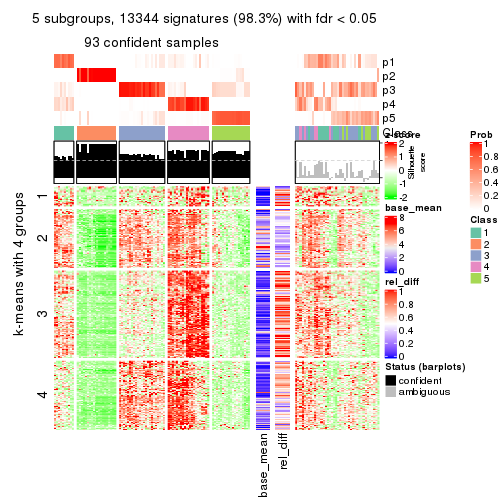</p>

</div>
<div id='tab-CV-mclust-get-signatures-5'>
<pre><code class="r">get_signatures(res, k = 6)
</code></pre>

<p></p>

</div>
</div>


Signature heatmaps where rows are not scaled:


<script>
$( function() {
	$( '#tabs-CV-mclust-get-signatures-no-scale' ).tabs();
} );
</script>
<div id='tabs-CV-mclust-get-signatures-no-scale'>
<ul>
<li><a href='#tab-CV-mclust-get-signatures-no-scale-1'>k = 2</a></li>
<li><a href='#tab-CV-mclust-get-signatures-no-scale-2'>k = 3</a></li>
<li><a href='#tab-CV-mclust-get-signatures-no-scale-3'>k = 4</a></li>
<li><a href='#tab-CV-mclust-get-signatures-no-scale-4'>k = 5</a></li>
<li><a href='#tab-CV-mclust-get-signatures-no-scale-5'>k = 6</a></li>
</ul>
<div id='tab-CV-mclust-get-signatures-no-scale-1'>
<pre><code class="r">get_signatures(res, k = 2, scale_rows = FALSE)
</code></pre>

<p></p>

</div>
<div id='tab-CV-mclust-get-signatures-no-scale-2'>
<pre><code class="r">get_signatures(res, k = 3, scale_rows = FALSE)
</code></pre>

<p></p>

</div>
<div id='tab-CV-mclust-get-signatures-no-scale-3'>
<pre><code class="r">get_signatures(res, k = 4, scale_rows = FALSE)
</code></pre>

<p></p>

</div>
<div id='tab-CV-mclust-get-signatures-no-scale-4'>
<pre><code class="r">get_signatures(res, k = 5, scale_rows = FALSE)
</code></pre>

<p></p>

</div>
<div id='tab-CV-mclust-get-signatures-no-scale-5'>
<pre><code class="r">get_signatures(res, k = 6, scale_rows = FALSE)
</code></pre>

<p></p>

</div>
</div>


Compare the overlap of signatures from different k:

```r
compare_signatures(res)
```


`get_signature()` returns a data frame invisibly. TO get the list of signatures, the function
call should be assigned to a variable explicitly. In following code, if `plot` argument is set
to `FALSE`, no heatmap is plotted while only the differential analysis is performed.

```r
# code only for demonstration
tb = get_signature(res, k = ..., plot = FALSE)
```

An example of the output of `tb` is:

```
#>   which_row         fdr    mean_1    mean_2 scaled_mean_1 scaled_mean_2 km
#> 1        38 0.042760348  8.373488  9.131774    -0.5533452     0.5164555  1
#> 2        40 0.018707592  7.106213  8.469186    -0.6173731     0.5762149  1
#> 3        55 0.019134737 10.221463 11.207825    -0.6159697     0.5749050  1
#> 4        59 0.006059896  5.921854  7.869574    -0.6899429     0.6439467  1
#> 5        60 0.018055526  8.928898 10.211722    -0.6204761     0.5791110  1
#> 6        98 0.009384629 15.714769 14.887706     0.6635654    -0.6193277  2
...
```

The columns in `tb` are:

1. `which_row`: row indices corresponding to the input matrix.
2. `fdr`: FDR for the differential test. 
3. `mean_x`: The mean value in group x.
4. `scaled_mean_x`: The mean value in group x after rows are scaled.
5. `km`: Row groups if k-means clustering is applied to rows.


UMAP plot which shows how samples are separated.


<script>
$( function() {
	$( '#tabs-CV-mclust-dimension-reduction' ).tabs();
} );
</script>
<div id='tabs-CV-mclust-dimension-reduction'>
<ul>
<li><a href='#tab-CV-mclust-dimension-reduction-1'>k = 2</a></li>
<li><a href='#tab-CV-mclust-dimension-reduction-2'>k = 3</a></li>
<li><a href='#tab-CV-mclust-dimension-reduction-3'>k = 4</a></li>
<li><a href='#tab-CV-mclust-dimension-reduction-4'>k = 5</a></li>
<li><a href='#tab-CV-mclust-dimension-reduction-5'>k = 6</a></li>
</ul>
<div id='tab-CV-mclust-dimension-reduction-1'>
<pre><code class="r">dimension_reduction(res, k = 2, method = &quot;UMAP&quot;)
</code></pre>

<p></p>

</div>
<div id='tab-CV-mclust-dimension-reduction-2'>
<pre><code class="r">dimension_reduction(res, k = 3, method = &quot;UMAP&quot;)
</code></pre>

<p></p>

</div>
<div id='tab-CV-mclust-dimension-reduction-3'>
<pre><code class="r">dimension_reduction(res, k = 4, method = &quot;UMAP&quot;)
</code></pre>

<p></p>

</div>
<div id='tab-CV-mclust-dimension-reduction-4'>
<pre><code class="r">dimension_reduction(res, k = 5, method = &quot;UMAP&quot;)
</code></pre>

<p></p>

</div>
<div id='tab-CV-mclust-dimension-reduction-5'>
<pre><code class="r">dimension_reduction(res, k = 6, method = &quot;UMAP&quot;)
</code></pre>

<p></p>

</div>
</div>


Following heatmap shows how subgroups are split when increasing `k`:

```r
collect_classes(res)
```


If matrix rows can be associated to genes, consider to use `functional_enrichment(res,
...)` to perform function enrichment for the signature genes. See [this vignette](http://bioconductor.org/packages/devel/bioc/vignettes/cola/inst/doc/functional_enrichment.html) for more detailed explanations.


 

---------------------------------------------------


### CV:NMF


The object with results only for a single top-value method and a single partition method 
can be extracted as:

```r
res = res_list["CV", "NMF"]
# you can also extract it by
# res = res_list["CV:NMF"]
```

A summary of `res` and all the functions that can be applied to it:

```r
res
```

```
#> A 'ConsensusPartition' object with k = 2, 3, 4, 5, 6.
#>   On a matrix with 13580 rows and 133 columns.
#>   Top rows (1000, 2000, 3000, 4000, 5000) are extracted by 'CV' method.
#>   Subgroups are detected by 'NMF' method.
#>   Performed in total 1250 partitions by row resampling.
#>   Best k for subgroups seems to be 2.
#> 
#> Following methods can be applied to this 'ConsensusPartition' object:
#>  [1] "cola_report"             "collect_classes"         "collect_plots"          
#>  [4] "collect_stats"           "colnames"                "compare_signatures"     
#>  [7] "consensus_heatmap"       "dimension_reduction"     "functional_enrichment"  
#> [10] "get_anno_col"            "get_anno"                "get_classes"            
#> [13] "get_consensus"           "get_matrix"              "get_membership"         
#> [16] "get_param"               "get_signatures"          "get_stats"              
#> [19] "is_best_k"               "is_stable_k"             "membership_heatmap"     
#> [22] "ncol"                    "nrow"                    "plot_ecdf"              
#> [25] "rownames"                "select_partition_number" "show"                   
#> [28] "suggest_best_k"          "test_to_known_factors"
```

`collect_plots()` function collects all the plots made from `res` for all `k` (number of partitions)
into one single page to provide an easy and fast comparison between different `k`.

```r
collect_plots(res)
```


The plots are:

- The first row: a plot of the ECDF (empirical cumulative distribution
  function) curves of the consensus matrix for each `k` and the heatmap of
  predicted classes for each `k`.
- The second row: heatmaps of the consensus matrix for each `k`.
- The third row: heatmaps of the membership matrix for each `k`.
- The fouth row: heatmaps of the signatures for each `k`.

All the plots in panels can be made by individual functions and they are
plotted later in this section.

`select_partition_number()` produces several plots showing different
statistics for choosing "optimized" `k`. There are following statistics:

- ECDF curves of the consensus matrix for each `k`;
- 1-PAC. [The PAC
  score](https://en.wikipedia.org/wiki/Consensus_clustering#Over-interpretation_potential_of_consensus_clustering)
  measures the proportion of the ambiguous subgrouping.
- Mean silhouette score.
- Concordance. The mean probability of fiting the consensus class ids in all
  partitions.
- Area increased. Denote $A_k$ as the area under the ECDF curve for current
  `k`, the area increased is defined as $A_k - A_{k-1}$.
- Rand index. The percent of pairs of samples that are both in a same cluster
  or both are not in a same cluster in the partition of k and k-1.
- Jaccard index. The ratio of pairs of samples are both in a same cluster in
  the partition of k and k-1 and the pairs of samples are both in a same
  cluster in the partition k or k-1.

The detailed explanations of these statistics can be found in [the _cola_
vignette](http://bioconductor.org/packages/devel/bioc/vignettes/cola/inst/doc/cola.html#toc_13).

Generally speaking, lower PAC score, higher mean silhouette score or higher
concordance corresponds to better partition. Rand index and Jaccard index
measure how similar the current partition is compared to partition with `k-1`.
If they are too similar, we won't accept `k` is better than `k-1`.

```r
select_partition_number(res)
```


The numeric values for all these statistics can be obtained by `get_stats()`.

```r
get_stats(res)
```

```
#>   k 1-PAC mean_silhouette concordance area_increased  Rand Jaccard
#> 2 2 0.888           0.923       0.967         0.4930 0.511   0.511
#> 3 3 0.732           0.819       0.922         0.3320 0.725   0.512
#> 4 4 0.619           0.699       0.827         0.1343 0.771   0.449
#> 5 5 0.585           0.502       0.717         0.0724 0.837   0.475
#> 6 6 0.703           0.663       0.794         0.0442 0.892   0.539
```

`suggest_best_k()` suggests the best $k$ based on these statistics. The rules are as follows:

- All $k$ with Jaccard index larger than 0.95 are removed because increasing
  $k$ does not provide enough extra information. If all $k$ are removed, it is
  marked as no subgroup is detected.
- For all $k$ with 1-PAC score larger than 0.9, the maximal $k$ is taken as
  the best $k$, and other $k$ are marked as optional $k$.
- If it does not fit the second rule. The $k$ with the maximal vote of the
  highest 1-PAC score, highest mean silhouette, and highest concordance is
  taken as the best $k$.

```r
suggest_best_k(res)
```

```
#> [1] 2
```


Following shows the table of the partitions (You need to click the **show/hide
code output** link to see it). The membership matrix (columns with name `p*`)
is inferred by
[`clue::cl_consensus()`](https://www.rdocumentation.org/link/cl_consensus?package=clue)
function with the `SE` method. Basically the value in the membership matrix
represents the probability to belong to a certain group. The finall class
label for an item is determined with the group with highest probability it
belongs to.

In `get_classes()` function, the entropy is calculated from the membership
matrix and the silhouette score is calculated from the consensus matrix.


<script>
$( function() {
	$( '#tabs-CV-NMF-get-classes' ).tabs();
} );
</script>
<div id='tabs-CV-NMF-get-classes'>
<ul>
<li><a href='#tab-CV-NMF-get-classes-1'>k = 2</a></li>
<li><a href='#tab-CV-NMF-get-classes-2'>k = 3</a></li>
<li><a href='#tab-CV-NMF-get-classes-3'>k = 4</a></li>
<li><a href='#tab-CV-NMF-get-classes-4'>k = 5</a></li>
<li><a href='#tab-CV-NMF-get-classes-5'>k = 6</a></li>
</ul>

<div id='tab-CV-NMF-get-classes-1'>
<p><a id='tab-CV-NMF-get-classes-1-a' style='color:#0366d6' href='#'>show/hide code output</a></p>
<pre><code class="r">cbind(get_classes(res, k = 2), get_membership(res, k = 2))
</code></pre>

<pre><code>#&gt;            class entropy silhouette    p1    p2
#&gt; SRR1951667     2  0.0000     0.9567 0.000 1.000
#&gt; SRR1951666     2  0.0000     0.9567 0.000 1.000
#&gt; SRR1951665     2  0.9963     0.1764 0.464 0.536
#&gt; SRR1951664     2  0.0000     0.9567 0.000 1.000
#&gt; SRR1951663     1  0.0000     0.9786 1.000 0.000
#&gt; SRR1951662     2  0.0000     0.9567 0.000 1.000
#&gt; SRR1951661     2  0.0000     0.9567 0.000 1.000
#&gt; SRR1951660     1  0.0000     0.9786 1.000 0.000
#&gt; SRR1951659     2  0.0000     0.9567 0.000 1.000
#&gt; SRR1951658     2  0.0000     0.9567 0.000 1.000
#&gt; SRR1951657     2  0.0000     0.9567 0.000 1.000
#&gt; SRR1951656     2  0.0000     0.9567 0.000 1.000
#&gt; SRR1951655     1  0.0000     0.9786 1.000 0.000
#&gt; SRR1951654     1  0.0000     0.9786 1.000 0.000
#&gt; SRR1951653     2  0.0000     0.9567 0.000 1.000
#&gt; SRR1951652     1  0.0000     0.9786 1.000 0.000
#&gt; SRR1951651     2  0.0000     0.9567 0.000 1.000
#&gt; SRR1951650     2  0.0000     0.9567 0.000 1.000
#&gt; SRR1951648     2  0.0000     0.9567 0.000 1.000
#&gt; SRR1951649     1  0.0000     0.9786 1.000 0.000
#&gt; SRR1951647     2  0.0000     0.9567 0.000 1.000
#&gt; SRR1951646     2  0.0000     0.9567 0.000 1.000
#&gt; SRR1951645     1  0.2043     0.9518 0.968 0.032
#&gt; SRR1951644     1  0.0000     0.9786 1.000 0.000
#&gt; SRR1951643     1  0.4690     0.8784 0.900 0.100
#&gt; SRR1951641     1  0.0000     0.9786 1.000 0.000
#&gt; SRR1951642     2  0.0000     0.9567 0.000 1.000
#&gt; SRR1951694     1  0.0000     0.9786 1.000 0.000
#&gt; SRR1951731     2  0.0000     0.9567 0.000 1.000
#&gt; SRR1951730     2  0.5629     0.8468 0.132 0.868
#&gt; SRR1951752     2  0.8144     0.6788 0.252 0.748
#&gt; SRR1951751     1  0.0000     0.9786 1.000 0.000
#&gt; SRR1951749     2  0.0000     0.9567 0.000 1.000
#&gt; SRR1951750     1  0.0000     0.9786 1.000 0.000
#&gt; SRR1951748     1  0.5737     0.8351 0.864 0.136
#&gt; SRR1951747     1  0.0000     0.9786 1.000 0.000
#&gt; SRR1951745     1  0.0000     0.9786 1.000 0.000
#&gt; SRR1951746     2  0.0000     0.9567 0.000 1.000
#&gt; SRR1951744     2  0.6973     0.7746 0.188 0.812
#&gt; SRR1951742     2  0.0000     0.9567 0.000 1.000
#&gt; SRR1951743     1  0.1843     0.9556 0.972 0.028
#&gt; SRR1951741     1  0.0000     0.9786 1.000 0.000
#&gt; SRR1951740     2  0.0000     0.9567 0.000 1.000
#&gt; SRR1951738     1  0.0000     0.9786 1.000 0.000
#&gt; SRR1951739     2  0.0000     0.9567 0.000 1.000
#&gt; SRR1951737     2  0.0000     0.9567 0.000 1.000
#&gt; SRR1951736     1  0.0000     0.9786 1.000 0.000
#&gt; SRR1951734     2  0.3879     0.8988 0.076 0.924
#&gt; SRR1951735     2  0.0000     0.9567 0.000 1.000
#&gt; SRR1951733     2  0.0000     0.9567 0.000 1.000
#&gt; SRR1951732     2  0.0000     0.9567 0.000 1.000
#&gt; SRR1951729     2  0.0000     0.9567 0.000 1.000
#&gt; SRR1951728     2  0.0000     0.9567 0.000 1.000
#&gt; SRR1951727     2  0.2778     0.9238 0.048 0.952
#&gt; SRR1951725     1  0.0000     0.9786 1.000 0.000
#&gt; SRR1951726     1  0.0376     0.9756 0.996 0.004
#&gt; SRR1951724     1  0.4562     0.8832 0.904 0.096
#&gt; SRR1951722     2  0.9580     0.4276 0.380 0.620
#&gt; SRR1951723     1  0.0000     0.9786 1.000 0.000
#&gt; SRR1951721     1  0.0000     0.9786 1.000 0.000
#&gt; SRR1951719     2  0.0000     0.9567 0.000 1.000
#&gt; SRR1951720     1  0.0000     0.9786 1.000 0.000
#&gt; SRR1951718     1  0.0000     0.9786 1.000 0.000
#&gt; SRR1951717     1  0.0000     0.9786 1.000 0.000
#&gt; SRR1951715     1  0.0000     0.9786 1.000 0.000
#&gt; SRR1951716     1  0.0000     0.9786 1.000 0.000
#&gt; SRR1951714     2  0.9635     0.4006 0.388 0.612
#&gt; SRR1951713     2  0.0000     0.9567 0.000 1.000
#&gt; SRR1951712     1  0.0000     0.9786 1.000 0.000
#&gt; SRR1951711     1  0.0000     0.9786 1.000 0.000
#&gt; SRR1951710     1  0.0000     0.9786 1.000 0.000
#&gt; SRR1951709     2  0.0000     0.9567 0.000 1.000
#&gt; SRR1951708     2  0.7815     0.7121 0.232 0.768
#&gt; SRR1951707     2  0.5059     0.8632 0.112 0.888
#&gt; SRR1951705     1  0.0000     0.9786 1.000 0.000
#&gt; SRR1951704     2  0.0000     0.9567 0.000 1.000
#&gt; SRR1951703     1  0.9988     0.0159 0.520 0.480
#&gt; SRR1951706     2  0.4298     0.8893 0.088 0.912
#&gt; SRR1951702     2  0.0000     0.9567 0.000 1.000
#&gt; SRR1951701     2  0.0000     0.9567 0.000 1.000
#&gt; SRR1951699     2  0.0000     0.9567 0.000 1.000
#&gt; SRR1951698     2  0.0000     0.9567 0.000 1.000
#&gt; SRR1951700     1  0.0000     0.9786 1.000 0.000
#&gt; SRR1951697     2  0.0000     0.9567 0.000 1.000
#&gt; SRR1951696     2  0.0000     0.9567 0.000 1.000
#&gt; SRR1951695     2  0.0000     0.9567 0.000 1.000
#&gt; SRR1951693     2  0.2948     0.9206 0.052 0.948
#&gt; SRR1951692     2  0.0000     0.9567 0.000 1.000
#&gt; SRR1951691     1  0.0000     0.9786 1.000 0.000
#&gt; SRR1951688     1  0.0000     0.9786 1.000 0.000
#&gt; SRR1951689     1  0.0000     0.9786 1.000 0.000
#&gt; SRR1951687     1  0.0000     0.9786 1.000 0.000
#&gt; SRR1951685     1  0.6973     0.7566 0.812 0.188
#&gt; SRR1951684     2  0.0000     0.9567 0.000 1.000
#&gt; SRR1951686     2  0.0000     0.9567 0.000 1.000
#&gt; SRR1951683     2  0.9909     0.2445 0.444 0.556
#&gt; SRR1951682     2  0.7139     0.7609 0.196 0.804
#&gt; SRR1951690     2  0.0000     0.9567 0.000 1.000
#&gt; SRR1951680     2  0.0000     0.9567 0.000 1.000
#&gt; SRR1951679     1  0.0000     0.9786 1.000 0.000
#&gt; SRR1951678     2  0.0000     0.9567 0.000 1.000
#&gt; SRR1951677     2  0.4431     0.8851 0.092 0.908
#&gt; SRR1951676     2  0.0000     0.9567 0.000 1.000
#&gt; SRR1951675     1  0.0000     0.9786 1.000 0.000
#&gt; SRR1951681     2  0.0000     0.9567 0.000 1.000
#&gt; SRR1951673     1  0.0376     0.9756 0.996 0.004
#&gt; SRR1951674     1  0.0000     0.9786 1.000 0.000
#&gt; SRR1951672     1  0.0000     0.9786 1.000 0.000
#&gt; SRR1951671     2  0.0000     0.9567 0.000 1.000
#&gt; SRR1951670     1  0.0000     0.9786 1.000 0.000
#&gt; SRR1951640     2  0.0000     0.9567 0.000 1.000
#&gt; SRR1951668     2  0.2236     0.9319 0.036 0.964
#&gt; SRR1951669     1  0.0000     0.9786 1.000 0.000
#&gt; SRR1951638     1  0.0000     0.9786 1.000 0.000
#&gt; SRR1951637     1  0.0000     0.9786 1.000 0.000
#&gt; SRR1951635     1  0.0000     0.9786 1.000 0.000
#&gt; SRR1951634     2  0.0000     0.9567 0.000 1.000
#&gt; SRR1951631     1  0.1414     0.9626 0.980 0.020
#&gt; SRR1951632     2  0.0000     0.9567 0.000 1.000
#&gt; SRR1951633     2  0.0000     0.9567 0.000 1.000
#&gt; SRR1951630     2  0.0000     0.9567 0.000 1.000
#&gt; SRR1951629     2  0.0000     0.9567 0.000 1.000
#&gt; SRR1951628     1  0.0000     0.9786 1.000 0.000
#&gt; SRR1951627     2  0.0000     0.9567 0.000 1.000
#&gt; SRR1951639     2  0.0000     0.9567 0.000 1.000
#&gt; SRR1951625     2  0.3584     0.9057 0.068 0.932
#&gt; SRR1951626     2  0.0000     0.9567 0.000 1.000
#&gt; SRR1951624     2  0.0000     0.9567 0.000 1.000
#&gt; SRR1951622     1  0.0000     0.9786 1.000 0.000
#&gt; SRR1951636     2  0.0000     0.9567 0.000 1.000
#&gt; SRR1951623     2  0.0000     0.9567 0.000 1.000
#&gt; SRR1951621     1  0.0000     0.9786 1.000 0.000
#&gt; SRR1951620     2  0.0000     0.9567 0.000 1.000
</code></pre>

<script>
$('#tab-CV-NMF-get-classes-1-a').parent().next().next().hide();
$('#tab-CV-NMF-get-classes-1-a').click(function(){
  $('#tab-CV-NMF-get-classes-1-a').parent().next().next().toggle();
  return(false);
});
</script>
</div>

<div id='tab-CV-NMF-get-classes-2'>
<p><a id='tab-CV-NMF-get-classes-2-a' style='color:#0366d6' href='#'>show/hide code output</a></p>
<pre><code class="r">cbind(get_classes(res, k = 3), get_membership(res, k = 3))
</code></pre>

<pre><code>#&gt;            class entropy silhouette    p1    p2    p3
#&gt; SRR1951667     2  0.0592     0.8780 0.000 0.988 0.012
#&gt; SRR1951666     3  0.0000     0.9302 0.000 0.000 1.000
#&gt; SRR1951665     2  0.4007     0.8176 0.084 0.880 0.036
#&gt; SRR1951664     3  0.0000     0.9302 0.000 0.000 1.000
#&gt; SRR1951663     1  0.0000     0.9082 1.000 0.000 0.000
#&gt; SRR1951662     3  0.4750     0.7175 0.000 0.216 0.784
#&gt; SRR1951661     3  0.0000     0.9302 0.000 0.000 1.000
#&gt; SRR1951660     1  0.0592     0.9031 0.988 0.012 0.000
#&gt; SRR1951659     3  0.0000     0.9302 0.000 0.000 1.000
#&gt; SRR1951658     3  0.0000     0.9302 0.000 0.000 1.000
#&gt; SRR1951657     3  0.0000     0.9302 0.000 0.000 1.000
#&gt; SRR1951656     3  0.0000     0.9302 0.000 0.000 1.000
#&gt; SRR1951655     1  0.0592     0.9031 0.988 0.012 0.000
#&gt; SRR1951654     1  0.0000     0.9082 1.000 0.000 0.000
#&gt; SRR1951653     2  0.4062     0.7655 0.000 0.836 0.164
#&gt; SRR1951652     1  0.0237     0.9062 0.996 0.000 0.004
#&gt; SRR1951651     3  0.0000     0.9302 0.000 0.000 1.000
#&gt; SRR1951650     3  0.0000     0.9302 0.000 0.000 1.000
#&gt; SRR1951648     3  0.0000     0.9302 0.000 0.000 1.000
#&gt; SRR1951649     2  0.0237     0.8807 0.004 0.996 0.000
#&gt; SRR1951647     3  0.4796     0.7137 0.000 0.220 0.780
#&gt; SRR1951646     3  0.0000     0.9302 0.000 0.000 1.000
#&gt; SRR1951645     2  0.0237     0.8807 0.004 0.996 0.000
#&gt; SRR1951644     2  0.2165     0.8434 0.064 0.936 0.000
#&gt; SRR1951643     1  0.3192     0.8129 0.888 0.000 0.112
#&gt; SRR1951641     2  0.0000     0.8817 0.000 1.000 0.000
#&gt; SRR1951642     3  0.2537     0.8710 0.080 0.000 0.920
#&gt; SRR1951694     1  0.0000     0.9082 1.000 0.000 0.000
#&gt; SRR1951731     3  0.5882     0.4802 0.000 0.348 0.652
#&gt; SRR1951730     2  0.0000     0.8817 0.000 1.000 0.000
#&gt; SRR1951752     2  0.5327     0.5999 0.000 0.728 0.272
#&gt; SRR1951751     2  0.0000     0.8817 0.000 1.000 0.000
#&gt; SRR1951749     3  0.0237     0.9281 0.000 0.004 0.996
#&gt; SRR1951750     2  0.6260     0.1508 0.448 0.552 0.000
#&gt; SRR1951748     2  0.0661     0.8788 0.008 0.988 0.004
#&gt; SRR1951747     1  0.0000     0.9082 1.000 0.000 0.000
#&gt; SRR1951745     1  0.0000     0.9082 1.000 0.000 0.000
#&gt; SRR1951746     2  0.6267     0.1459 0.000 0.548 0.452
#&gt; SRR1951744     3  0.5905     0.4661 0.352 0.000 0.648
#&gt; SRR1951742     3  0.0000     0.9302 0.000 0.000 1.000
#&gt; SRR1951743     2  0.0000     0.8817 0.000 1.000 0.000
#&gt; SRR1951741     1  0.0000     0.9082 1.000 0.000 0.000
#&gt; SRR1951740     3  0.5650     0.5577 0.000 0.312 0.688
#&gt; SRR1951738     1  0.0000     0.9082 1.000 0.000 0.000
#&gt; SRR1951739     3  0.5098     0.6693 0.000 0.248 0.752
#&gt; SRR1951737     3  0.0000     0.9302 0.000 0.000 1.000
#&gt; SRR1951736     2  0.6095     0.3138 0.392 0.608 0.000
#&gt; SRR1951734     2  0.4346     0.7324 0.000 0.816 0.184
#&gt; SRR1951735     3  0.0000     0.9302 0.000 0.000 1.000
#&gt; SRR1951733     3  0.0000     0.9302 0.000 0.000 1.000
#&gt; SRR1951732     3  0.0000     0.9302 0.000 0.000 1.000
#&gt; SRR1951729     3  0.0237     0.9281 0.000 0.004 0.996
#&gt; SRR1951728     3  0.2959     0.8522 0.000 0.100 0.900
#&gt; SRR1951727     3  0.4796     0.7124 0.220 0.000 0.780
#&gt; SRR1951725     1  0.0000     0.9082 1.000 0.000 0.000
#&gt; SRR1951726     1  0.0237     0.9062 0.996 0.000 0.004
#&gt; SRR1951724     2  0.2339     0.8538 0.048 0.940 0.012
#&gt; SRR1951722     2  0.4808     0.7330 0.008 0.804 0.188
#&gt; SRR1951723     2  0.0000     0.8817 0.000 1.000 0.000
#&gt; SRR1951721     1  0.0000     0.9082 1.000 0.000 0.000
#&gt; SRR1951719     3  0.4399     0.7560 0.000 0.188 0.812
#&gt; SRR1951720     1  0.0237     0.9067 0.996 0.004 0.000
#&gt; SRR1951718     1  0.1163     0.8939 0.972 0.028 0.000
#&gt; SRR1951717     1  0.3116     0.8322 0.892 0.108 0.000
#&gt; SRR1951715     1  0.0000     0.9082 1.000 0.000 0.000
#&gt; SRR1951716     1  0.3941     0.7849 0.844 0.156 0.000
#&gt; SRR1951714     1  0.6026     0.3762 0.624 0.000 0.376
#&gt; SRR1951713     2  0.0000     0.8817 0.000 1.000 0.000
#&gt; SRR1951712     2  0.0000     0.8817 0.000 1.000 0.000
#&gt; SRR1951711     2  0.0237     0.8807 0.004 0.996 0.000
#&gt; SRR1951710     1  0.5835     0.4800 0.660 0.340 0.000
#&gt; SRR1951709     3  0.0000     0.9302 0.000 0.000 1.000
#&gt; SRR1951708     1  0.9930     0.0559 0.380 0.280 0.340
#&gt; SRR1951707     2  0.0000     0.8817 0.000 1.000 0.000
#&gt; SRR1951705     2  0.2066     0.8456 0.060 0.940 0.000
#&gt; SRR1951704     3  0.0000     0.9302 0.000 0.000 1.000
#&gt; SRR1951703     1  0.6079     0.3350 0.612 0.000 0.388
#&gt; SRR1951706     3  0.5254     0.6412 0.264 0.000 0.736
#&gt; SRR1951702     3  0.0000     0.9302 0.000 0.000 1.000
#&gt; SRR1951701     2  0.5760     0.4953 0.000 0.672 0.328
#&gt; SRR1951699     3  0.0000     0.9302 0.000 0.000 1.000
#&gt; SRR1951698     3  0.0000     0.9302 0.000 0.000 1.000
#&gt; SRR1951700     2  0.0000     0.8817 0.000 1.000 0.000
#&gt; SRR1951697     3  0.0000     0.9302 0.000 0.000 1.000
#&gt; SRR1951696     3  0.0000     0.9302 0.000 0.000 1.000
#&gt; SRR1951695     3  0.5835     0.4980 0.000 0.340 0.660
#&gt; SRR1951693     2  0.0892     0.8753 0.000 0.980 0.020
#&gt; SRR1951692     3  0.0000     0.9302 0.000 0.000 1.000
#&gt; SRR1951691     1  0.4452     0.7383 0.808 0.192 0.000
#&gt; SRR1951688     1  0.0000     0.9082 1.000 0.000 0.000
#&gt; SRR1951689     2  0.0000     0.8817 0.000 1.000 0.000
#&gt; SRR1951687     1  0.0000     0.9082 1.000 0.000 0.000
#&gt; SRR1951685     2  0.0000     0.8817 0.000 1.000 0.000
#&gt; SRR1951684     3  0.0424     0.9255 0.000 0.008 0.992
#&gt; SRR1951686     3  0.0000     0.9302 0.000 0.000 1.000
#&gt; SRR1951683     3  0.7213     0.5120 0.060 0.272 0.668
#&gt; SRR1951682     2  0.0000     0.8817 0.000 1.000 0.000
#&gt; SRR1951690     2  0.0000     0.8817 0.000 1.000 0.000
#&gt; SRR1951680     2  0.0424     0.8796 0.000 0.992 0.008
#&gt; SRR1951679     2  0.0237     0.8807 0.004 0.996 0.000
#&gt; SRR1951678     3  0.0000     0.9302 0.000 0.000 1.000
#&gt; SRR1951677     3  0.5254     0.6393 0.264 0.000 0.736
#&gt; SRR1951676     3  0.0000     0.9302 0.000 0.000 1.000
#&gt; SRR1951675     2  0.6295     0.0683 0.472 0.528 0.000
#&gt; SRR1951681     3  0.0000     0.9302 0.000 0.000 1.000
#&gt; SRR1951673     2  0.0237     0.8807 0.004 0.996 0.000
#&gt; SRR1951674     1  0.0000     0.9082 1.000 0.000 0.000
#&gt; SRR1951672     2  0.4750     0.6682 0.216 0.784 0.000
#&gt; SRR1951671     2  0.5465     0.5748 0.000 0.712 0.288
#&gt; SRR1951670     1  0.4178     0.7659 0.828 0.172 0.000
#&gt; SRR1951640     3  0.0000     0.9302 0.000 0.000 1.000
#&gt; SRR1951668     2  0.0892     0.8741 0.000 0.980 0.020
#&gt; SRR1951669     1  0.0000     0.9082 1.000 0.000 0.000
#&gt; SRR1951638     1  0.0000     0.9082 1.000 0.000 0.000
#&gt; SRR1951637     1  0.0000     0.9082 1.000 0.000 0.000
#&gt; SRR1951635     1  0.0000     0.9082 1.000 0.000 0.000
#&gt; SRR1951634     2  0.0000     0.8817 0.000 1.000 0.000
#&gt; SRR1951631     1  0.1529     0.8833 0.960 0.000 0.040
#&gt; SRR1951632     3  0.0000     0.9302 0.000 0.000 1.000
#&gt; SRR1951633     3  0.1643     0.9011 0.044 0.000 0.956
#&gt; SRR1951630     3  0.1860     0.8949 0.052 0.000 0.948
#&gt; SRR1951629     3  0.0000     0.9302 0.000 0.000 1.000
#&gt; SRR1951628     1  0.4974     0.6715 0.764 0.236 0.000
#&gt; SRR1951627     3  0.0000     0.9302 0.000 0.000 1.000
#&gt; SRR1951639     3  0.0000     0.9302 0.000 0.000 1.000
#&gt; SRR1951625     2  0.2711     0.8329 0.000 0.912 0.088
#&gt; SRR1951626     3  0.0000     0.9302 0.000 0.000 1.000
#&gt; SRR1951624     3  0.0237     0.9281 0.000 0.004 0.996
#&gt; SRR1951622     1  0.2066     0.8715 0.940 0.060 0.000
#&gt; SRR1951636     3  0.0000     0.9302 0.000 0.000 1.000
#&gt; SRR1951623     3  0.0000     0.9302 0.000 0.000 1.000
#&gt; SRR1951621     1  0.0000     0.9082 1.000 0.000 0.000
#&gt; SRR1951620     3  0.0000     0.9302 0.000 0.000 1.000
</code></pre>

<script>
$('#tab-CV-NMF-get-classes-2-a').parent().next().next().hide();
$('#tab-CV-NMF-get-classes-2-a').click(function(){
  $('#tab-CV-NMF-get-classes-2-a').parent().next().next().toggle();
  return(false);
});
</script>
</div>

<div id='tab-CV-NMF-get-classes-3'>
<p><a id='tab-CV-NMF-get-classes-3-a' style='color:#0366d6' href='#'>show/hide code output</a></p>
<pre><code class="r">cbind(get_classes(res, k = 4), get_membership(res, k = 4))
</code></pre>

<pre><code>#&gt;            class entropy silhouette    p1    p2    p3    p4
#&gt; SRR1951667     2  0.2704     0.8117 0.000 0.876 0.000 0.124
#&gt; SRR1951666     3  0.0336     0.8565 0.000 0.008 0.992 0.000
#&gt; SRR1951665     2  0.3725     0.7533 0.120 0.848 0.004 0.028
#&gt; SRR1951664     3  0.0336     0.8567 0.000 0.008 0.992 0.000
#&gt; SRR1951663     1  0.1389     0.7921 0.952 0.000 0.000 0.048
#&gt; SRR1951662     2  0.3634     0.7388 0.096 0.856 0.048 0.000
#&gt; SRR1951661     3  0.1411     0.8491 0.020 0.020 0.960 0.000
#&gt; SRR1951660     4  0.3751     0.7021 0.196 0.004 0.000 0.800
#&gt; SRR1951659     3  0.3335     0.7991 0.020 0.120 0.860 0.000
#&gt; SRR1951658     3  0.6635     0.5184 0.152 0.228 0.620 0.000
#&gt; SRR1951657     3  0.1302     0.8530 0.000 0.000 0.956 0.044
#&gt; SRR1951656     3  0.2271     0.8396 0.000 0.008 0.916 0.076
#&gt; SRR1951655     4  0.3486     0.7065 0.188 0.000 0.000 0.812
#&gt; SRR1951654     1  0.1211     0.7939 0.960 0.000 0.000 0.040
#&gt; SRR1951653     4  0.4889     0.3367 0.000 0.004 0.360 0.636
#&gt; SRR1951652     1  0.2255     0.7820 0.920 0.068 0.012 0.000
#&gt; SRR1951651     3  0.0779     0.8574 0.000 0.004 0.980 0.016
#&gt; SRR1951650     3  0.0000     0.8571 0.000 0.000 1.000 0.000
#&gt; SRR1951648     3  0.0188     0.8570 0.000 0.004 0.996 0.000
#&gt; SRR1951649     4  0.1792     0.7374 0.000 0.068 0.000 0.932
#&gt; SRR1951647     3  0.3219     0.7812 0.000 0.000 0.836 0.164
#&gt; SRR1951646     3  0.0592     0.8575 0.000 0.000 0.984 0.016
#&gt; SRR1951645     4  0.1302     0.7448 0.000 0.044 0.000 0.956
#&gt; SRR1951644     4  0.1833     0.7519 0.032 0.024 0.000 0.944
#&gt; SRR1951643     3  0.7818    -0.0851 0.356 0.000 0.388 0.256
#&gt; SRR1951641     4  0.1557     0.7399 0.000 0.056 0.000 0.944
#&gt; SRR1951642     3  0.3569     0.7134 0.196 0.000 0.804 0.000
#&gt; SRR1951694     4  0.4543     0.5783 0.324 0.000 0.000 0.676
#&gt; SRR1951731     2  0.4868     0.6464 0.000 0.748 0.212 0.040
#&gt; SRR1951730     2  0.3160     0.8094 0.040 0.892 0.008 0.060
#&gt; SRR1951752     2  0.2441     0.7736 0.068 0.916 0.004 0.012
#&gt; SRR1951751     2  0.3356     0.7893 0.000 0.824 0.000 0.176
#&gt; SRR1951749     3  0.5050     0.2856 0.004 0.408 0.588 0.000
#&gt; SRR1951750     4  0.4608     0.7146 0.104 0.096 0.000 0.800
#&gt; SRR1951748     2  0.3037     0.7673 0.100 0.880 0.000 0.020
#&gt; SRR1951747     1  0.3428     0.7458 0.844 0.144 0.012 0.000
#&gt; SRR1951745     1  0.0592     0.7968 0.984 0.000 0.000 0.016
#&gt; SRR1951746     2  0.1509     0.7992 0.008 0.960 0.020 0.012
#&gt; SRR1951744     1  0.4591     0.7183 0.800 0.116 0.084 0.000
#&gt; SRR1951742     3  0.2197     0.8430 0.004 0.080 0.916 0.000
#&gt; SRR1951743     2  0.1406     0.8079 0.016 0.960 0.000 0.024
#&gt; SRR1951741     1  0.4049     0.6362 0.780 0.008 0.000 0.212
#&gt; SRR1951740     3  0.5051     0.7607 0.000 0.100 0.768 0.132
#&gt; SRR1951738     1  0.4989    -0.1155 0.528 0.000 0.000 0.472
#&gt; SRR1951739     2  0.4719     0.6803 0.000 0.772 0.180 0.048
#&gt; SRR1951737     3  0.3972     0.7626 0.004 0.164 0.816 0.016
#&gt; SRR1951736     4  0.2983     0.7466 0.068 0.040 0.000 0.892
#&gt; SRR1951734     2  0.1913     0.7935 0.040 0.940 0.000 0.020
#&gt; SRR1951735     3  0.0469     0.8576 0.000 0.000 0.988 0.012
#&gt; SRR1951733     3  0.3320     0.8320 0.000 0.068 0.876 0.056
#&gt; SRR1951732     3  0.5159     0.4499 0.012 0.364 0.624 0.000
#&gt; SRR1951729     3  0.2081     0.8267 0.000 0.084 0.916 0.000
#&gt; SRR1951728     2  0.5119     0.7656 0.004 0.768 0.148 0.080
#&gt; SRR1951727     1  0.6412     0.4049 0.592 0.320 0.088 0.000
#&gt; SRR1951725     1  0.1792     0.7845 0.932 0.000 0.000 0.068
#&gt; SRR1951726     1  0.1970     0.7860 0.932 0.060 0.008 0.000
#&gt; SRR1951724     2  0.5472     0.2769 0.016 0.544 0.000 0.440
#&gt; SRR1951722     4  0.2586     0.7382 0.000 0.048 0.040 0.912
#&gt; SRR1951723     4  0.2647     0.7086 0.000 0.120 0.000 0.880
#&gt; SRR1951721     1  0.1940     0.7796 0.924 0.000 0.000 0.076
#&gt; SRR1951719     2  0.3672     0.7627 0.000 0.824 0.164 0.012
#&gt; SRR1951720     4  0.4331     0.6255 0.288 0.000 0.000 0.712
#&gt; SRR1951718     4  0.3636     0.7109 0.172 0.000 0.008 0.820
#&gt; SRR1951717     1  0.4679     0.3606 0.648 0.000 0.000 0.352
#&gt; SRR1951715     4  0.4888     0.4056 0.412 0.000 0.000 0.588
#&gt; SRR1951716     4  0.3486     0.7133 0.188 0.000 0.000 0.812
#&gt; SRR1951714     3  0.5857     0.6998 0.044 0.044 0.732 0.180
#&gt; SRR1951713     2  0.3649     0.7676 0.000 0.796 0.000 0.204
#&gt; SRR1951712     2  0.3764     0.7534 0.000 0.784 0.000 0.216
#&gt; SRR1951711     2  0.2530     0.8140 0.000 0.888 0.000 0.112
#&gt; SRR1951710     4  0.3925     0.7140 0.176 0.016 0.000 0.808
#&gt; SRR1951709     3  0.0779     0.8543 0.004 0.016 0.980 0.000
#&gt; SRR1951708     2  0.5680     0.5389 0.264 0.684 0.044 0.008
#&gt; SRR1951707     2  0.3219     0.7966 0.000 0.836 0.000 0.164
#&gt; SRR1951705     4  0.3402     0.6872 0.004 0.164 0.000 0.832
#&gt; SRR1951704     2  0.6958     0.4414 0.232 0.584 0.184 0.000
#&gt; SRR1951703     1  0.4552     0.7202 0.800 0.128 0.072 0.000
#&gt; SRR1951706     1  0.4840     0.7037 0.784 0.116 0.100 0.000
#&gt; SRR1951702     3  0.7756     0.0965 0.328 0.248 0.424 0.000
#&gt; SRR1951701     2  0.3587     0.8144 0.000 0.860 0.052 0.088
#&gt; SRR1951699     3  0.5309     0.6049 0.044 0.256 0.700 0.000
#&gt; SRR1951698     3  0.0336     0.8574 0.000 0.000 0.992 0.008
#&gt; SRR1951700     2  0.3311     0.7919 0.000 0.828 0.000 0.172
#&gt; SRR1951697     2  0.7878     0.0225 0.340 0.376 0.284 0.000
#&gt; SRR1951696     3  0.0469     0.8576 0.000 0.000 0.988 0.012
#&gt; SRR1951695     2  0.5061     0.6692 0.004 0.752 0.196 0.048
#&gt; SRR1951693     2  0.2773     0.8149 0.000 0.880 0.004 0.116
#&gt; SRR1951692     3  0.2385     0.8430 0.000 0.028 0.920 0.052
#&gt; SRR1951691     4  0.4804     0.6917 0.148 0.072 0.000 0.780
#&gt; SRR1951688     1  0.3384     0.7618 0.860 0.116 0.000 0.024
#&gt; SRR1951689     2  0.2973     0.8054 0.000 0.856 0.000 0.144
#&gt; SRR1951687     1  0.1637     0.7880 0.940 0.000 0.000 0.060
#&gt; SRR1951685     2  0.2868     0.8082 0.000 0.864 0.000 0.136
#&gt; SRR1951684     3  0.3245     0.8254 0.000 0.100 0.872 0.028
#&gt; SRR1951686     3  0.4036     0.7701 0.076 0.088 0.836 0.000
#&gt; SRR1951683     4  0.6126     0.2000 0.028 0.012 0.416 0.544
#&gt; SRR1951682     2  0.3266     0.7923 0.000 0.832 0.000 0.168
#&gt; SRR1951690     2  0.3123     0.8017 0.000 0.844 0.000 0.156
#&gt; SRR1951680     2  0.3810     0.7912 0.000 0.804 0.008 0.188
#&gt; SRR1951679     4  0.4477     0.4690 0.000 0.312 0.000 0.688
#&gt; SRR1951678     3  0.1888     0.8490 0.000 0.016 0.940 0.044
#&gt; SRR1951677     1  0.5514     0.5975 0.712 0.040 0.236 0.012
#&gt; SRR1951676     3  0.1042     0.8528 0.008 0.020 0.972 0.000
#&gt; SRR1951675     4  0.4104     0.7254 0.080 0.088 0.000 0.832
#&gt; SRR1951681     3  0.0188     0.8570 0.000 0.004 0.996 0.000
#&gt; SRR1951673     4  0.4406     0.4800 0.000 0.300 0.000 0.700
#&gt; SRR1951674     1  0.0524     0.7970 0.988 0.008 0.000 0.004
#&gt; SRR1951672     4  0.2313     0.7527 0.044 0.032 0.000 0.924
#&gt; SRR1951671     2  0.1610     0.8103 0.000 0.952 0.032 0.016
#&gt; SRR1951670     4  0.3751     0.7116 0.196 0.004 0.000 0.800
#&gt; SRR1951640     3  0.3441     0.8055 0.000 0.024 0.856 0.120
#&gt; SRR1951668     2  0.3402     0.7965 0.000 0.832 0.004 0.164
#&gt; SRR1951669     1  0.1356     0.7953 0.960 0.032 0.000 0.008
#&gt; SRR1951638     1  0.2647     0.7468 0.880 0.000 0.000 0.120
#&gt; SRR1951637     1  0.2589     0.7501 0.884 0.000 0.000 0.116
#&gt; SRR1951635     1  0.3444     0.6726 0.816 0.000 0.000 0.184
#&gt; SRR1951634     4  0.3942     0.5617 0.000 0.236 0.000 0.764
#&gt; SRR1951631     4  0.4465     0.6965 0.144 0.000 0.056 0.800
#&gt; SRR1951632     3  0.3745     0.8163 0.000 0.060 0.852 0.088
#&gt; SRR1951633     3  0.4990     0.4273 0.352 0.008 0.640 0.000
#&gt; SRR1951630     3  0.3280     0.8074 0.000 0.016 0.860 0.124
#&gt; SRR1951629     3  0.0707     0.8572 0.000 0.000 0.980 0.020
#&gt; SRR1951628     4  0.3308     0.7264 0.092 0.036 0.000 0.872
#&gt; SRR1951627     3  0.0657     0.8551 0.004 0.012 0.984 0.000
#&gt; SRR1951639     3  0.0592     0.8576 0.000 0.000 0.984 0.016
#&gt; SRR1951625     4  0.6352     0.4497 0.000 0.108 0.260 0.632
#&gt; SRR1951626     3  0.0524     0.8580 0.000 0.004 0.988 0.008
#&gt; SRR1951624     3  0.4948     0.1655 0.000 0.440 0.560 0.000
#&gt; SRR1951622     4  0.3569     0.7054 0.196 0.000 0.000 0.804
#&gt; SRR1951636     3  0.0657     0.8551 0.004 0.012 0.984 0.000
#&gt; SRR1951623     3  0.0188     0.8572 0.004 0.000 0.996 0.000
#&gt; SRR1951621     4  0.4907     0.3832 0.420 0.000 0.000 0.580
#&gt; SRR1951620     3  0.2915     0.8297 0.000 0.028 0.892 0.080
</code></pre>

<script>
$('#tab-CV-NMF-get-classes-3-a').parent().next().next().hide();
$('#tab-CV-NMF-get-classes-3-a').click(function(){
  $('#tab-CV-NMF-get-classes-3-a').parent().next().next().toggle();
  return(false);
});
</script>
</div>

<div id='tab-CV-NMF-get-classes-4'>
<p><a id='tab-CV-NMF-get-classes-4-a' style='color:#0366d6' href='#'>show/hide code output</a></p>
<pre><code class="r">cbind(get_classes(res, k = 5), get_membership(res, k = 5))
</code></pre>

<pre><code>#&gt;            class entropy silhouette    p1    p2    p3    p4    p5
#&gt; SRR1951667     2  0.5559     0.4520 0.344 0.572 0.000 0.084 0.000
#&gt; SRR1951666     3  0.0000     0.8312 0.000 0.000 1.000 0.000 0.000
#&gt; SRR1951665     2  0.2853     0.5475 0.016 0.888 0.012 0.008 0.076
#&gt; SRR1951664     3  0.0566     0.8305 0.000 0.004 0.984 0.012 0.000
#&gt; SRR1951663     5  0.1331     0.7298 0.000 0.040 0.000 0.008 0.952
#&gt; SRR1951662     2  0.2473     0.5662 0.000 0.896 0.000 0.072 0.032
#&gt; SRR1951661     3  0.0404     0.8300 0.000 0.012 0.988 0.000 0.000
#&gt; SRR1951660     1  0.6474     0.2610 0.496 0.000 0.000 0.264 0.240
#&gt; SRR1951659     2  0.6630     0.1414 0.000 0.504 0.280 0.208 0.008
#&gt; SRR1951658     3  0.5201     0.3201 0.000 0.424 0.532 0.000 0.044
#&gt; SRR1951657     3  0.2471     0.7455 0.000 0.000 0.864 0.136 0.000
#&gt; SRR1951656     3  0.4114     0.3150 0.000 0.000 0.624 0.376 0.000
#&gt; SRR1951655     4  0.6443     0.2399 0.248 0.000 0.000 0.504 0.248
#&gt; SRR1951654     5  0.0807     0.7254 0.000 0.012 0.000 0.012 0.976
#&gt; SRR1951653     4  0.6485     0.3630 0.344 0.000 0.196 0.460 0.000
#&gt; SRR1951652     5  0.3039     0.6819 0.000 0.192 0.000 0.000 0.808
#&gt; SRR1951651     3  0.0451     0.8311 0.004 0.000 0.988 0.008 0.000
#&gt; SRR1951650     3  0.0000     0.8312 0.000 0.000 1.000 0.000 0.000
#&gt; SRR1951648     3  0.0290     0.8303 0.000 0.000 0.992 0.008 0.000
#&gt; SRR1951649     4  0.5246     0.4140 0.288 0.020 0.000 0.652 0.040
#&gt; SRR1951647     4  0.5297     0.2613 0.036 0.008 0.404 0.552 0.000
#&gt; SRR1951646     3  0.2329     0.7568 0.000 0.000 0.876 0.124 0.000
#&gt; SRR1951645     4  0.5267     0.4240 0.288 0.028 0.000 0.652 0.032
#&gt; SRR1951644     1  0.4238     0.5165 0.776 0.000 0.000 0.136 0.088
#&gt; SRR1951643     5  0.6843    -0.0627 0.068 0.000 0.076 0.388 0.468
#&gt; SRR1951641     4  0.4697     0.3706 0.388 0.020 0.000 0.592 0.000
#&gt; SRR1951642     3  0.2522     0.7721 0.000 0.000 0.880 0.012 0.108
#&gt; SRR1951694     1  0.5405     0.3951 0.596 0.000 0.000 0.076 0.328
#&gt; SRR1951731     2  0.4830     0.4423 0.020 0.492 0.000 0.488 0.000
#&gt; SRR1951730     1  0.5080     0.2590 0.596 0.372 0.016 0.004 0.012
#&gt; SRR1951752     2  0.4317     0.5517 0.004 0.668 0.000 0.320 0.008
#&gt; SRR1951751     1  0.4923     0.3226 0.700 0.212 0.000 0.088 0.000
#&gt; SRR1951749     3  0.4114     0.5480 0.000 0.272 0.712 0.016 0.000
#&gt; SRR1951750     1  0.3078     0.5819 0.872 0.056 0.000 0.008 0.064
#&gt; SRR1951748     2  0.2068     0.5457 0.000 0.904 0.000 0.004 0.092
#&gt; SRR1951747     5  0.4297     0.3699 0.000 0.472 0.000 0.000 0.528
#&gt; SRR1951745     5  0.1282     0.7300 0.000 0.044 0.000 0.004 0.952
#&gt; SRR1951746     2  0.3949     0.5492 0.000 0.668 0.000 0.332 0.000
#&gt; SRR1951744     5  0.3779     0.6384 0.000 0.236 0.012 0.000 0.752
#&gt; SRR1951742     3  0.6180     0.3665 0.000 0.224 0.556 0.220 0.000
#&gt; SRR1951743     2  0.1484     0.6047 0.008 0.944 0.000 0.048 0.000
#&gt; SRR1951741     5  0.3386     0.6390 0.040 0.000 0.000 0.128 0.832
#&gt; SRR1951740     4  0.2786     0.4431 0.012 0.084 0.020 0.884 0.000
#&gt; SRR1951738     5  0.5255     0.4141 0.244 0.008 0.000 0.076 0.672
#&gt; SRR1951739     2  0.4583     0.4464 0.004 0.528 0.004 0.464 0.000
#&gt; SRR1951737     2  0.6436     0.4190 0.008 0.444 0.136 0.412 0.000
#&gt; SRR1951736     1  0.2171     0.5791 0.912 0.000 0.000 0.024 0.064
#&gt; SRR1951734     2  0.3508     0.5682 0.000 0.748 0.000 0.252 0.000
#&gt; SRR1951735     3  0.2127     0.7772 0.000 0.000 0.892 0.108 0.000
#&gt; SRR1951733     4  0.3593     0.4604 0.000 0.116 0.060 0.824 0.000
#&gt; SRR1951732     2  0.4732     0.4709 0.000 0.716 0.208 0.076 0.000
#&gt; SRR1951729     3  0.0451     0.8300 0.004 0.008 0.988 0.000 0.000
#&gt; SRR1951728     2  0.7783     0.3898 0.164 0.428 0.308 0.100 0.000
#&gt; SRR1951727     2  0.3491     0.3603 0.000 0.768 0.000 0.004 0.228
#&gt; SRR1951725     5  0.2005     0.7084 0.056 0.016 0.000 0.004 0.924
#&gt; SRR1951726     5  0.3247     0.7053 0.000 0.136 0.016 0.008 0.840
#&gt; SRR1951724     1  0.3348     0.5389 0.836 0.140 0.008 0.012 0.004
#&gt; SRR1951722     1  0.3667     0.5502 0.848 0.000 0.064 0.048 0.040
#&gt; SRR1951723     1  0.4354     0.1591 0.624 0.008 0.000 0.368 0.000
#&gt; SRR1951721     5  0.0798     0.7267 0.008 0.016 0.000 0.000 0.976
#&gt; SRR1951719     2  0.7729     0.3817 0.140 0.428 0.324 0.108 0.000
#&gt; SRR1951720     1  0.5678     0.2871 0.524 0.000 0.000 0.084 0.392
#&gt; SRR1951718     4  0.6586     0.0159 0.384 0.000 0.000 0.408 0.208
#&gt; SRR1951717     5  0.4613     0.2327 0.360 0.000 0.000 0.020 0.620
#&gt; SRR1951715     1  0.5345     0.2884 0.540 0.000 0.000 0.056 0.404
#&gt; SRR1951716     1  0.5348     0.4720 0.656 0.000 0.000 0.112 0.232
#&gt; SRR1951714     4  0.4316     0.5480 0.020 0.004 0.056 0.800 0.120
#&gt; SRR1951713     2  0.6408     0.5020 0.272 0.508 0.000 0.220 0.000
#&gt; SRR1951712     1  0.4948     0.3470 0.708 0.184 0.000 0.108 0.000
#&gt; SRR1951711     1  0.4218     0.3643 0.668 0.324 0.000 0.004 0.004
#&gt; SRR1951710     1  0.3863     0.5508 0.796 0.000 0.000 0.052 0.152
#&gt; SRR1951709     3  0.0162     0.8313 0.000 0.004 0.996 0.000 0.000
#&gt; SRR1951708     2  0.2694     0.5092 0.004 0.864 0.000 0.004 0.128
#&gt; SRR1951707     1  0.4208     0.4522 0.760 0.204 0.016 0.020 0.000
#&gt; SRR1951705     1  0.1568     0.5783 0.944 0.000 0.000 0.020 0.036
#&gt; SRR1951704     2  0.6226     0.4860 0.012 0.660 0.160 0.032 0.136
#&gt; SRR1951703     5  0.4670     0.4168 0.000 0.440 0.008 0.004 0.548
#&gt; SRR1951706     5  0.4789     0.5474 0.000 0.324 0.028 0.004 0.644
#&gt; SRR1951702     3  0.5165     0.5698 0.000 0.240 0.676 0.004 0.080
#&gt; SRR1951701     2  0.5631     0.5909 0.084 0.672 0.028 0.216 0.000
#&gt; SRR1951699     3  0.2629     0.7676 0.000 0.136 0.860 0.004 0.000
#&gt; SRR1951698     3  0.0609     0.8272 0.000 0.000 0.980 0.020 0.000
#&gt; SRR1951700     1  0.6081    -0.2140 0.496 0.376 0.000 0.128 0.000
#&gt; SRR1951697     3  0.6027     0.2062 0.000 0.420 0.476 0.004 0.100
#&gt; SRR1951696     3  0.1043     0.8192 0.000 0.000 0.960 0.040 0.000
#&gt; SRR1951695     2  0.5509     0.4603 0.064 0.472 0.000 0.464 0.000
#&gt; SRR1951693     1  0.4971     0.2255 0.628 0.332 0.004 0.036 0.000
#&gt; SRR1951692     4  0.3999     0.3562 0.000 0.000 0.344 0.656 0.000
#&gt; SRR1951691     4  0.3040     0.4876 0.012 0.068 0.000 0.876 0.044
#&gt; SRR1951688     5  0.6808     0.1192 0.000 0.324 0.000 0.308 0.368
#&gt; SRR1951689     2  0.5996     0.3959 0.388 0.496 0.000 0.116 0.000
#&gt; SRR1951687     5  0.1153     0.7191 0.024 0.000 0.008 0.004 0.964
#&gt; SRR1951685     2  0.5825     0.4319 0.360 0.536 0.000 0.104 0.000
#&gt; SRR1951684     4  0.6477    -0.3816 0.004 0.388 0.160 0.448 0.000
#&gt; SRR1951686     3  0.2707     0.7741 0.000 0.100 0.876 0.000 0.024
#&gt; SRR1951683     1  0.4821     0.0175 0.516 0.000 0.464 0.020 0.000
#&gt; SRR1951682     2  0.5776     0.4399 0.160 0.632 0.004 0.204 0.000
#&gt; SRR1951690     2  0.6118     0.5139 0.288 0.548 0.000 0.164 0.000
#&gt; SRR1951680     2  0.6824     0.4539 0.188 0.476 0.016 0.320 0.000
#&gt; SRR1951679     1  0.2079     0.5579 0.916 0.064 0.000 0.020 0.000
#&gt; SRR1951678     3  0.5673     0.0649 0.000 0.000 0.500 0.420 0.080
#&gt; SRR1951677     5  0.5266     0.5593 0.000 0.008 0.096 0.208 0.688
#&gt; SRR1951676     3  0.0324     0.8309 0.000 0.004 0.992 0.004 0.000
#&gt; SRR1951675     1  0.3043     0.5809 0.872 0.020 0.000 0.020 0.088
#&gt; SRR1951681     3  0.0162     0.8309 0.000 0.000 0.996 0.004 0.000
#&gt; SRR1951673     4  0.6605     0.0253 0.164 0.328 0.000 0.496 0.012
#&gt; SRR1951674     5  0.1341     0.7285 0.000 0.056 0.000 0.000 0.944
#&gt; SRR1951672     4  0.6498     0.2623 0.304 0.024 0.000 0.544 0.128
#&gt; SRR1951671     2  0.4522     0.6135 0.080 0.744 0.000 0.176 0.000
#&gt; SRR1951670     1  0.6288     0.3795 0.516 0.000 0.000 0.180 0.304
#&gt; SRR1951640     4  0.3932     0.5084 0.000 0.064 0.140 0.796 0.000
#&gt; SRR1951668     2  0.6224     0.5415 0.220 0.548 0.000 0.232 0.000
#&gt; SRR1951669     5  0.2813     0.6980 0.000 0.168 0.000 0.000 0.832
#&gt; SRR1951638     5  0.2358     0.6666 0.104 0.000 0.000 0.008 0.888
#&gt; SRR1951637     5  0.1597     0.7010 0.012 0.000 0.000 0.048 0.940
#&gt; SRR1951635     5  0.3307     0.6343 0.104 0.000 0.000 0.052 0.844
#&gt; SRR1951634     4  0.6211     0.2166 0.264 0.192 0.000 0.544 0.000
#&gt; SRR1951631     4  0.7300     0.3285 0.156 0.000 0.072 0.508 0.264
#&gt; SRR1951632     4  0.4266     0.4934 0.000 0.104 0.120 0.776 0.000
#&gt; SRR1951633     3  0.3562     0.6857 0.000 0.000 0.788 0.016 0.196
#&gt; SRR1951630     4  0.5524     0.1936 0.000 0.000 0.416 0.516 0.068
#&gt; SRR1951629     3  0.4290     0.4723 0.000 0.000 0.680 0.304 0.016
#&gt; SRR1951628     4  0.4297     0.4699 0.236 0.000 0.000 0.728 0.036
#&gt; SRR1951627     3  0.0162     0.8313 0.000 0.004 0.996 0.000 0.000
#&gt; SRR1951639     3  0.1671     0.7989 0.000 0.000 0.924 0.076 0.000
#&gt; SRR1951625     4  0.5732     0.5212 0.224 0.076 0.036 0.664 0.000
#&gt; SRR1951626     3  0.0000     0.8312 0.000 0.000 1.000 0.000 0.000
#&gt; SRR1951624     3  0.3163     0.7481 0.012 0.092 0.864 0.032 0.000
#&gt; SRR1951622     1  0.6155     0.3594 0.560 0.000 0.000 0.212 0.228
#&gt; SRR1951636     3  0.0000     0.8312 0.000 0.000 1.000 0.000 0.000
#&gt; SRR1951623     3  0.0290     0.8304 0.000 0.000 0.992 0.008 0.000
#&gt; SRR1951621     5  0.5541     0.4114 0.164 0.000 0.000 0.188 0.648
#&gt; SRR1951620     4  0.3728     0.4999 0.000 0.008 0.244 0.748 0.000
</code></pre>

<script>
$('#tab-CV-NMF-get-classes-4-a').parent().next().next().hide();
$('#tab-CV-NMF-get-classes-4-a').click(function(){
  $('#tab-CV-NMF-get-classes-4-a').parent().next().next().toggle();
  return(false);
});
</script>
</div>

<div id='tab-CV-NMF-get-classes-5'>
<p><a id='tab-CV-NMF-get-classes-5-a' style='color:#0366d6' href='#'>show/hide code output</a></p>
<pre><code class="r">cbind(get_classes(res, k = 6), get_membership(res, k = 6))
</code></pre>

<pre><code>#&gt;            class entropy silhouette    p1    p2    p3    p4    p5    p6
#&gt; SRR1951667     3  0.2149     0.7736 0.080 0.016 0.900 0.000 0.004 0.000
#&gt; SRR1951666     5  0.0291     0.8678 0.000 0.004 0.000 0.004 0.992 0.000
#&gt; SRR1951665     2  0.1282     0.8356 0.004 0.956 0.024 0.004 0.000 0.012
#&gt; SRR1951664     5  0.1604     0.8656 0.008 0.024 0.008 0.016 0.944 0.000
#&gt; SRR1951663     6  0.1692     0.8246 0.012 0.048 0.000 0.008 0.000 0.932
#&gt; SRR1951662     2  0.1655     0.8366 0.000 0.932 0.052 0.008 0.000 0.008
#&gt; SRR1951661     5  0.0520     0.8673 0.000 0.008 0.008 0.000 0.984 0.000
#&gt; SRR1951660     1  0.4314     0.5724 0.720 0.000 0.000 0.184 0.000 0.096
#&gt; SRR1951659     2  0.2290     0.8217 0.000 0.908 0.012 0.044 0.032 0.004
#&gt; SRR1951658     2  0.2361     0.7906 0.000 0.880 0.012 0.004 0.104 0.000
#&gt; SRR1951657     5  0.3911     0.4235 0.000 0.000 0.000 0.368 0.624 0.008
#&gt; SRR1951656     4  0.4224     0.2806 0.004 0.008 0.004 0.600 0.384 0.000
#&gt; SRR1951655     4  0.5046     0.4506 0.256 0.000 0.000 0.620 0.000 0.124
#&gt; SRR1951654     6  0.0603     0.8224 0.000 0.016 0.000 0.004 0.000 0.980
#&gt; SRR1951653     4  0.5838     0.4736 0.304 0.032 0.012 0.580 0.068 0.004
#&gt; SRR1951652     6  0.2135     0.7885 0.000 0.128 0.000 0.000 0.000 0.872
#&gt; SRR1951651     5  0.1275     0.8603 0.000 0.000 0.016 0.016 0.956 0.012
#&gt; SRR1951650     5  0.1649     0.8625 0.000 0.016 0.008 0.040 0.936 0.000
#&gt; SRR1951648     5  0.1893     0.8602 0.004 0.024 0.008 0.036 0.928 0.000
#&gt; SRR1951649     4  0.5855     0.2874 0.112 0.004 0.372 0.496 0.000 0.016
#&gt; SRR1951647     4  0.5644     0.5582 0.064 0.056 0.016 0.652 0.212 0.000
#&gt; SRR1951646     5  0.4053     0.4352 0.004 0.004 0.004 0.360 0.628 0.000
#&gt; SRR1951645     4  0.5996     0.2156 0.136 0.008 0.396 0.452 0.000 0.008
#&gt; SRR1951644     1  0.2177     0.7077 0.908 0.000 0.008 0.052 0.000 0.032
#&gt; SRR1951643     6  0.4941     0.2621 0.032 0.000 0.000 0.368 0.024 0.576
#&gt; SRR1951641     4  0.5982     0.4687 0.288 0.124 0.024 0.556 0.000 0.008
#&gt; SRR1951642     5  0.3883     0.6711 0.004 0.004 0.012 0.012 0.752 0.216
#&gt; SRR1951694     1  0.2988     0.6802 0.824 0.000 0.000 0.024 0.000 0.152
#&gt; SRR1951731     3  0.4389     0.5741 0.000 0.052 0.660 0.288 0.000 0.000
#&gt; SRR1951730     1  0.5917     0.4990 0.584 0.220 0.160 0.000 0.036 0.000
#&gt; SRR1951752     2  0.5396     0.4446 0.000 0.564 0.284 0.152 0.000 0.000
#&gt; SRR1951751     3  0.2673     0.7541 0.132 0.012 0.852 0.000 0.000 0.004
#&gt; SRR1951749     5  0.2326     0.8555 0.004 0.040 0.028 0.020 0.908 0.000
#&gt; SRR1951750     1  0.2809     0.6831 0.824 0.004 0.168 0.000 0.000 0.004
#&gt; SRR1951748     2  0.1633     0.8358 0.000 0.932 0.044 0.000 0.000 0.024
#&gt; SRR1951747     2  0.2135     0.7831 0.000 0.872 0.000 0.000 0.000 0.128
#&gt; SRR1951745     6  0.0937     0.8219 0.000 0.040 0.000 0.000 0.000 0.960
#&gt; SRR1951746     2  0.3961     0.7627 0.000 0.764 0.112 0.124 0.000 0.000
#&gt; SRR1951744     6  0.3209     0.7540 0.000 0.156 0.012 0.000 0.016 0.816
#&gt; SRR1951742     2  0.3819     0.7315 0.000 0.764 0.000 0.172 0.064 0.000
#&gt; SRR1951743     2  0.2009     0.8294 0.000 0.904 0.084 0.008 0.000 0.004
#&gt; SRR1951741     6  0.2480     0.7804 0.024 0.000 0.000 0.104 0.000 0.872
#&gt; SRR1951740     4  0.2956     0.6038 0.000 0.040 0.120 0.840 0.000 0.000
#&gt; SRR1951738     1  0.6541     0.1700 0.396 0.316 0.000 0.024 0.000 0.264
#&gt; SRR1951739     2  0.5054     0.5010 0.000 0.572 0.092 0.336 0.000 0.000
#&gt; SRR1951737     3  0.4944     0.6640 0.004 0.028 0.712 0.152 0.104 0.000
#&gt; SRR1951736     1  0.1531     0.7212 0.928 0.000 0.068 0.000 0.000 0.004
#&gt; SRR1951734     2  0.2837     0.8073 0.000 0.856 0.056 0.088 0.000 0.000
#&gt; SRR1951735     5  0.4476     0.6911 0.004 0.044 0.024 0.200 0.728 0.000
#&gt; SRR1951733     4  0.2474     0.6306 0.000 0.080 0.040 0.880 0.000 0.000
#&gt; SRR1951732     2  0.2466     0.8156 0.000 0.896 0.024 0.028 0.052 0.000
#&gt; SRR1951729     5  0.2545     0.8258 0.004 0.020 0.084 0.008 0.884 0.000
#&gt; SRR1951728     3  0.3259     0.7693 0.024 0.044 0.844 0.000 0.088 0.000
#&gt; SRR1951727     2  0.1616     0.8305 0.000 0.932 0.020 0.000 0.000 0.048
#&gt; SRR1951725     6  0.1500     0.8185 0.052 0.012 0.000 0.000 0.000 0.936
#&gt; SRR1951726     6  0.1949     0.8088 0.000 0.088 0.004 0.000 0.004 0.904
#&gt; SRR1951724     1  0.3019     0.6928 0.840 0.020 0.128 0.000 0.012 0.000
#&gt; SRR1951722     1  0.2071     0.7176 0.916 0.000 0.044 0.012 0.028 0.000
#&gt; SRR1951723     4  0.5414     0.2468 0.420 0.004 0.100 0.476 0.000 0.000
#&gt; SRR1951721     6  0.1788     0.8220 0.040 0.028 0.000 0.004 0.000 0.928
#&gt; SRR1951719     3  0.2001     0.7793 0.008 0.012 0.912 0.000 0.068 0.000
#&gt; SRR1951720     1  0.4319     0.2735 0.576 0.000 0.000 0.024 0.000 0.400
#&gt; SRR1951718     1  0.4979     0.1693 0.556 0.000 0.004 0.376 0.000 0.064
#&gt; SRR1951717     6  0.3091     0.7396 0.148 0.000 0.024 0.004 0.000 0.824
#&gt; SRR1951715     1  0.3374     0.6406 0.772 0.000 0.000 0.020 0.000 0.208
#&gt; SRR1951716     1  0.2542     0.6987 0.876 0.000 0.000 0.044 0.000 0.080
#&gt; SRR1951714     4  0.2700     0.6483 0.008 0.032 0.020 0.896 0.008 0.036
#&gt; SRR1951713     3  0.2819     0.7836 0.032 0.032 0.876 0.060 0.000 0.000
#&gt; SRR1951712     3  0.2340     0.7388 0.148 0.000 0.852 0.000 0.000 0.000
#&gt; SRR1951711     1  0.4871     0.5691 0.660 0.196 0.144 0.000 0.000 0.000
#&gt; SRR1951710     1  0.1693     0.7196 0.932 0.000 0.004 0.020 0.000 0.044
#&gt; SRR1951709     5  0.0767     0.8683 0.000 0.012 0.008 0.004 0.976 0.000
#&gt; SRR1951708     2  0.1716     0.8339 0.000 0.932 0.028 0.004 0.000 0.036
#&gt; SRR1951707     1  0.4474     0.5819 0.704 0.044 0.232 0.000 0.020 0.000
#&gt; SRR1951705     1  0.1297     0.7239 0.948 0.000 0.040 0.000 0.000 0.012
#&gt; SRR1951704     3  0.5542     0.6161 0.000 0.088 0.660 0.000 0.172 0.080
#&gt; SRR1951703     2  0.1901     0.8163 0.004 0.912 0.000 0.008 0.000 0.076
#&gt; SRR1951706     6  0.5368     0.4711 0.004 0.284 0.004 0.000 0.116 0.592
#&gt; SRR1951702     5  0.2278     0.8323 0.000 0.052 0.012 0.000 0.904 0.032
#&gt; SRR1951701     3  0.4492     0.6658 0.004 0.236 0.700 0.052 0.008 0.000
#&gt; SRR1951699     5  0.1350     0.8600 0.000 0.020 0.020 0.000 0.952 0.008
#&gt; SRR1951698     5  0.2544     0.8397 0.004 0.028 0.008 0.072 0.888 0.000
#&gt; SRR1951700     3  0.1657     0.7835 0.056 0.016 0.928 0.000 0.000 0.000
#&gt; SRR1951697     2  0.3944     0.6640 0.000 0.744 0.016 0.000 0.216 0.024
#&gt; SRR1951696     5  0.2587     0.8227 0.004 0.020 0.000 0.108 0.868 0.000
#&gt; SRR1951695     3  0.3279     0.7134 0.000 0.028 0.796 0.176 0.000 0.000
#&gt; SRR1951693     3  0.5397     0.2243 0.376 0.028 0.544 0.000 0.048 0.004
#&gt; SRR1951692     4  0.2992     0.6507 0.000 0.016 0.016 0.852 0.112 0.004
#&gt; SRR1951691     4  0.4548     0.5755 0.004 0.040 0.128 0.756 0.000 0.072
#&gt; SRR1951688     2  0.4661     0.6727 0.000 0.696 0.028 0.228 0.000 0.048
#&gt; SRR1951689     3  0.2230     0.7785 0.084 0.024 0.892 0.000 0.000 0.000
#&gt; SRR1951687     6  0.2610     0.8011 0.048 0.004 0.000 0.004 0.060 0.884
#&gt; SRR1951685     3  0.1812     0.7766 0.080 0.008 0.912 0.000 0.000 0.000
#&gt; SRR1951684     3  0.4029     0.7160 0.004 0.016 0.772 0.164 0.044 0.000
#&gt; SRR1951686     5  0.1957     0.8472 0.000 0.072 0.008 0.000 0.912 0.008
#&gt; SRR1951683     1  0.5090     0.0922 0.492 0.000 0.028 0.016 0.456 0.008
#&gt; SRR1951682     2  0.2722     0.8032 0.004 0.872 0.032 0.088 0.004 0.000
#&gt; SRR1951690     3  0.4759     0.7243 0.064 0.172 0.720 0.044 0.000 0.000
#&gt; SRR1951680     3  0.2838     0.7802 0.024 0.032 0.872 0.072 0.000 0.000
#&gt; SRR1951679     1  0.2378     0.6936 0.848 0.000 0.152 0.000 0.000 0.000
#&gt; SRR1951678     4  0.6309     0.2940 0.000 0.000 0.016 0.444 0.240 0.300
#&gt; SRR1951677     6  0.4335     0.6849 0.000 0.012 0.016 0.176 0.044 0.752
#&gt; SRR1951676     5  0.0767     0.8656 0.000 0.004 0.012 0.000 0.976 0.008
#&gt; SRR1951675     1  0.1426     0.7252 0.948 0.016 0.028 0.000 0.000 0.008
#&gt; SRR1951681     5  0.0291     0.8664 0.000 0.000 0.004 0.004 0.992 0.000
#&gt; SRR1951673     4  0.6388     0.1405 0.056 0.120 0.384 0.440 0.000 0.000
#&gt; SRR1951674     6  0.1007     0.8211 0.000 0.044 0.000 0.000 0.000 0.956
#&gt; SRR1951672     3  0.7715     0.0582 0.136 0.016 0.384 0.220 0.000 0.244
#&gt; SRR1951671     3  0.3088     0.7395 0.000 0.172 0.808 0.020 0.000 0.000
#&gt; SRR1951670     6  0.5542     0.3340 0.312 0.000 0.016 0.108 0.000 0.564
#&gt; SRR1951640     4  0.3402     0.6038 0.000 0.012 0.168 0.800 0.020 0.000
#&gt; SRR1951668     3  0.2515     0.7817 0.016 0.024 0.888 0.072 0.000 0.000
#&gt; SRR1951669     6  0.3528     0.5797 0.004 0.296 0.000 0.000 0.000 0.700
#&gt; SRR1951638     6  0.1732     0.8100 0.072 0.004 0.000 0.004 0.000 0.920
#&gt; SRR1951637     6  0.1515     0.8190 0.028 0.008 0.000 0.020 0.000 0.944
#&gt; SRR1951635     6  0.2572     0.7619 0.136 0.000 0.000 0.012 0.000 0.852
#&gt; SRR1951634     3  0.3934     0.7208 0.048 0.028 0.788 0.136 0.000 0.000
#&gt; SRR1951631     4  0.5636     0.5375 0.092 0.000 0.004 0.640 0.052 0.212
#&gt; SRR1951632     4  0.3888     0.5192 0.004 0.212 0.020 0.752 0.012 0.000
#&gt; SRR1951633     5  0.3329     0.6892 0.000 0.000 0.004 0.008 0.768 0.220
#&gt; SRR1951630     4  0.4131     0.6066 0.000 0.000 0.004 0.744 0.180 0.072
#&gt; SRR1951629     5  0.4958     0.0577 0.000 0.004 0.004 0.452 0.496 0.044
#&gt; SRR1951628     4  0.4593     0.5362 0.252 0.024 0.020 0.692 0.000 0.012
#&gt; SRR1951627     5  0.0000     0.8670 0.000 0.000 0.000 0.000 1.000 0.000
#&gt; SRR1951639     5  0.2907     0.8242 0.004 0.028 0.008 0.100 0.860 0.000
#&gt; SRR1951625     4  0.6560     0.2180 0.160 0.360 0.028 0.440 0.012 0.000
#&gt; SRR1951626     5  0.0912     0.8677 0.004 0.008 0.004 0.012 0.972 0.000
#&gt; SRR1951624     5  0.2737     0.7616 0.004 0.004 0.160 0.000 0.832 0.000
#&gt; SRR1951622     1  0.3472     0.6587 0.808 0.000 0.000 0.100 0.000 0.092
#&gt; SRR1951636     5  0.0291     0.8677 0.000 0.004 0.004 0.000 0.992 0.000
#&gt; SRR1951623     5  0.0870     0.8647 0.000 0.004 0.000 0.012 0.972 0.012
#&gt; SRR1951621     6  0.4600     0.6437 0.152 0.004 0.000 0.136 0.000 0.708
#&gt; SRR1951620     4  0.1719     0.6620 0.000 0.008 0.008 0.928 0.056 0.000
</code></pre>

<script>
$('#tab-CV-NMF-get-classes-5-a').parent().next().next().hide();
$('#tab-CV-NMF-get-classes-5-a').click(function(){
  $('#tab-CV-NMF-get-classes-5-a').parent().next().next().toggle();
  return(false);
});
</script>
</div>
</div>

Heatmaps for the consensus matrix. It visualizes the probability of two
samples to be in a same group.


<script>
$( function() {
	$( '#tabs-CV-NMF-consensus-heatmap' ).tabs();
} );
</script>
<div id='tabs-CV-NMF-consensus-heatmap'>
<ul>
<li><a href='#tab-CV-NMF-consensus-heatmap-1'>k = 2</a></li>
<li><a href='#tab-CV-NMF-consensus-heatmap-2'>k = 3</a></li>
<li><a href='#tab-CV-NMF-consensus-heatmap-3'>k = 4</a></li>
<li><a href='#tab-CV-NMF-consensus-heatmap-4'>k = 5</a></li>
<li><a href='#tab-CV-NMF-consensus-heatmap-5'>k = 6</a></li>
</ul>
<div id='tab-CV-NMF-consensus-heatmap-1'>
<pre><code class="r">consensus_heatmap(res, k = 2)
</code></pre>

<p></p>

</div>
<div id='tab-CV-NMF-consensus-heatmap-2'>
<pre><code class="r">consensus_heatmap(res, k = 3)
</code></pre>

<p></p>

</div>
<div id='tab-CV-NMF-consensus-heatmap-3'>
<pre><code class="r">consensus_heatmap(res, k = 4)
</code></pre>

<p></p>

</div>
<div id='tab-CV-NMF-consensus-heatmap-4'>
<pre><code class="r">consensus_heatmap(res, k = 5)
</code></pre>

<p></p>

</div>
<div id='tab-CV-NMF-consensus-heatmap-5'>
<pre><code class="r">consensus_heatmap(res, k = 6)
</code></pre>

<p></p>

</div>
</div>

Heatmaps for the membership of samples in all partitions to see how consistent they are:


<script>
$( function() {
	$( '#tabs-CV-NMF-membership-heatmap' ).tabs();
} );
</script>
<div id='tabs-CV-NMF-membership-heatmap'>
<ul>
<li><a href='#tab-CV-NMF-membership-heatmap-1'>k = 2</a></li>
<li><a href='#tab-CV-NMF-membership-heatmap-2'>k = 3</a></li>
<li><a href='#tab-CV-NMF-membership-heatmap-3'>k = 4</a></li>
<li><a href='#tab-CV-NMF-membership-heatmap-4'>k = 5</a></li>
<li><a href='#tab-CV-NMF-membership-heatmap-5'>k = 6</a></li>
</ul>
<div id='tab-CV-NMF-membership-heatmap-1'>
<pre><code class="r">membership_heatmap(res, k = 2)
</code></pre>

<p></p>

</div>
<div id='tab-CV-NMF-membership-heatmap-2'>
<pre><code class="r">membership_heatmap(res, k = 3)
</code></pre>

<p></p>

</div>
<div id='tab-CV-NMF-membership-heatmap-3'>
<pre><code class="r">membership_heatmap(res, k = 4)
</code></pre>

<p></p>

</div>
<div id='tab-CV-NMF-membership-heatmap-4'>
<pre><code class="r">membership_heatmap(res, k = 5)
</code></pre>

<p></p>

</div>
<div id='tab-CV-NMF-membership-heatmap-5'>
<pre><code class="r">membership_heatmap(res, k = 6)
</code></pre>

<p></p>

</div>
</div>

As soon as we have had the classes for columns, we can look for signatures
which are significantly different between classes which can be candidate marks
for certain classes. Following are the heatmaps for signatures.


Signature heatmaps where rows are scaled:


<script>
$( function() {
	$( '#tabs-CV-NMF-get-signatures' ).tabs();
} );
</script>
<div id='tabs-CV-NMF-get-signatures'>
<ul>
<li><a href='#tab-CV-NMF-get-signatures-1'>k = 2</a></li>
<li><a href='#tab-CV-NMF-get-signatures-2'>k = 3</a></li>
<li><a href='#tab-CV-NMF-get-signatures-3'>k = 4</a></li>
<li><a href='#tab-CV-NMF-get-signatures-4'>k = 5</a></li>
<li><a href='#tab-CV-NMF-get-signatures-5'>k = 6</a></li>
</ul>
<div id='tab-CV-NMF-get-signatures-1'>
<pre><code class="r">get_signatures(res, k = 2)
</code></pre>

<p></p>

</div>
<div id='tab-CV-NMF-get-signatures-2'>
<pre><code class="r">get_signatures(res, k = 3)
</code></pre>

<p></p>

</div>
<div id='tab-CV-NMF-get-signatures-3'>
<pre><code class="r">get_signatures(res, k = 4)
</code></pre>

<p></p>

</div>
<div id='tab-CV-NMF-get-signatures-4'>
<pre><code class="r">get_signatures(res, k = 5)
</code></pre>

<p></p>

</div>
<div id='tab-CV-NMF-get-signatures-5'>
<pre><code class="r">get_signatures(res, k = 6)
</code></pre>

<p></p>

</div>
</div>


Signature heatmaps where rows are not scaled:


<script>
$( function() {
	$( '#tabs-CV-NMF-get-signatures-no-scale' ).tabs();
} );
</script>
<div id='tabs-CV-NMF-get-signatures-no-scale'>
<ul>
<li><a href='#tab-CV-NMF-get-signatures-no-scale-1'>k = 2</a></li>
<li><a href='#tab-CV-NMF-get-signatures-no-scale-2'>k = 3</a></li>
<li><a href='#tab-CV-NMF-get-signatures-no-scale-3'>k = 4</a></li>
<li><a href='#tab-CV-NMF-get-signatures-no-scale-4'>k = 5</a></li>
<li><a href='#tab-CV-NMF-get-signatures-no-scale-5'>k = 6</a></li>
</ul>
<div id='tab-CV-NMF-get-signatures-no-scale-1'>
<pre><code class="r">get_signatures(res, k = 2, scale_rows = FALSE)
</code></pre>

<p></p>

</div>
<div id='tab-CV-NMF-get-signatures-no-scale-2'>
<pre><code class="r">get_signatures(res, k = 3, scale_rows = FALSE)
</code></pre>

<p></p>

</div>
<div id='tab-CV-NMF-get-signatures-no-scale-3'>
<pre><code class="r">get_signatures(res, k = 4, scale_rows = FALSE)
</code></pre>

<p>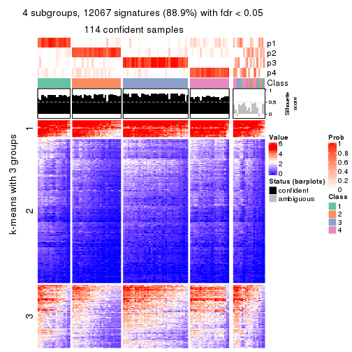</p>

</div>
<div id='tab-CV-NMF-get-signatures-no-scale-4'>
<pre><code class="r">get_signatures(res, k = 5, scale_rows = FALSE)
</code></pre>

<p></p>

</div>
<div id='tab-CV-NMF-get-signatures-no-scale-5'>
<pre><code class="r">get_signatures(res, k = 6, scale_rows = FALSE)
</code></pre>

<p></p>

</div>
</div>


Compare the overlap of signatures from different k:

```r
compare_signatures(res)
```


`get_signature()` returns a data frame invisibly. TO get the list of signatures, the function
call should be assigned to a variable explicitly. In following code, if `plot` argument is set
to `FALSE`, no heatmap is plotted while only the differential analysis is performed.

```r
# code only for demonstration
tb = get_signature(res, k = ..., plot = FALSE)
```

An example of the output of `tb` is:

```
#>   which_row         fdr    mean_1    mean_2 scaled_mean_1 scaled_mean_2 km
#> 1        38 0.042760348  8.373488  9.131774    -0.5533452     0.5164555  1
#> 2        40 0.018707592  7.106213  8.469186    -0.6173731     0.5762149  1
#> 3        55 0.019134737 10.221463 11.207825    -0.6159697     0.5749050  1
#> 4        59 0.006059896  5.921854  7.869574    -0.6899429     0.6439467  1
#> 5        60 0.018055526  8.928898 10.211722    -0.6204761     0.5791110  1
#> 6        98 0.009384629 15.714769 14.887706     0.6635654    -0.6193277  2
...
```

The columns in `tb` are:

1. `which_row`: row indices corresponding to the input matrix.
2. `fdr`: FDR for the differential test. 
3. `mean_x`: The mean value in group x.
4. `scaled_mean_x`: The mean value in group x after rows are scaled.
5. `km`: Row groups if k-means clustering is applied to rows.


UMAP plot which shows how samples are separated.


<script>
$( function() {
	$( '#tabs-CV-NMF-dimension-reduction' ).tabs();
} );
</script>
<div id='tabs-CV-NMF-dimension-reduction'>
<ul>
<li><a href='#tab-CV-NMF-dimension-reduction-1'>k = 2</a></li>
<li><a href='#tab-CV-NMF-dimension-reduction-2'>k = 3</a></li>
<li><a href='#tab-CV-NMF-dimension-reduction-3'>k = 4</a></li>
<li><a href='#tab-CV-NMF-dimension-reduction-4'>k = 5</a></li>
<li><a href='#tab-CV-NMF-dimension-reduction-5'>k = 6</a></li>
</ul>
<div id='tab-CV-NMF-dimension-reduction-1'>
<pre><code class="r">dimension_reduction(res, k = 2, method = &quot;UMAP&quot;)
</code></pre>

<p></p>

</div>
<div id='tab-CV-NMF-dimension-reduction-2'>
<pre><code class="r">dimension_reduction(res, k = 3, method = &quot;UMAP&quot;)
</code></pre>

<p></p>

</div>
<div id='tab-CV-NMF-dimension-reduction-3'>
<pre><code class="r">dimension_reduction(res, k = 4, method = &quot;UMAP&quot;)
</code></pre>

<p></p>

</div>
<div id='tab-CV-NMF-dimension-reduction-4'>
<pre><code class="r">dimension_reduction(res, k = 5, method = &quot;UMAP&quot;)
</code></pre>

<p></p>

</div>
<div id='tab-CV-NMF-dimension-reduction-5'>
<pre><code class="r">dimension_reduction(res, k = 6, method = &quot;UMAP&quot;)
</code></pre>

<p></p>

</div>
</div>


Following heatmap shows how subgroups are split when increasing `k`:

```r
collect_classes(res)
```


If matrix rows can be associated to genes, consider to use `functional_enrichment(res,
...)` to perform function enrichment for the signature genes. See [this vignette](http://bioconductor.org/packages/devel/bioc/vignettes/cola/inst/doc/functional_enrichment.html) for more detailed explanations.


 

---------------------------------------------------


### MAD:hclust


The object with results only for a single top-value method and a single partition method 
can be extracted as:

```r
res = res_list["MAD", "hclust"]
# you can also extract it by
# res = res_list["MAD:hclust"]
```

A summary of `res` and all the functions that can be applied to it:

```r
res
```

```
#> A 'ConsensusPartition' object with k = 2, 3, 4, 5, 6.
#>   On a matrix with 13580 rows and 133 columns.
#>   Top rows (1000, 2000, 3000, 4000, 5000) are extracted by 'MAD' method.
#>   Subgroups are detected by 'hclust' method.
#>   Performed in total 1250 partitions by row resampling.
#>   Best k for subgroups seems to be 3.
#> 
#> Following methods can be applied to this 'ConsensusPartition' object:
#>  [1] "cola_report"             "collect_classes"         "collect_plots"          
#>  [4] "collect_stats"           "colnames"                "compare_signatures"     
#>  [7] "consensus_heatmap"       "dimension_reduction"     "functional_enrichment"  
#> [10] "get_anno_col"            "get_anno"                "get_classes"            
#> [13] "get_consensus"           "get_matrix"              "get_membership"         
#> [16] "get_param"               "get_signatures"          "get_stats"              
#> [19] "is_best_k"               "is_stable_k"             "membership_heatmap"     
#> [22] "ncol"                    "nrow"                    "plot_ecdf"              
#> [25] "rownames"                "select_partition_number" "show"                   
#> [28] "suggest_best_k"          "test_to_known_factors"
```

`collect_plots()` function collects all the plots made from `res` for all `k` (number of partitions)
into one single page to provide an easy and fast comparison between different `k`.

```r
collect_plots(res)
```

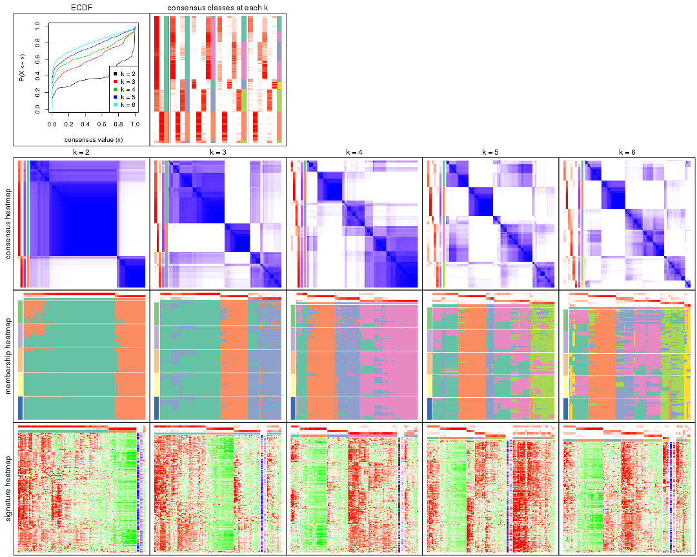

The plots are:

- The first row: a plot of the ECDF (empirical cumulative distribution
  function) curves of the consensus matrix for each `k` and the heatmap of
  predicted classes for each `k`.
- The second row: heatmaps of the consensus matrix for each `k`.
- The third row: heatmaps of the membership matrix for each `k`.
- The fouth row: heatmaps of the signatures for each `k`.

All the plots in panels can be made by individual functions and they are
plotted later in this section.

`select_partition_number()` produces several plots showing different
statistics for choosing "optimized" `k`. There are following statistics:

- ECDF curves of the consensus matrix for each `k`;
- 1-PAC. [The PAC
  score](https://en.wikipedia.org/wiki/Consensus_clustering#Over-interpretation_potential_of_consensus_clustering)
  measures the proportion of the ambiguous subgrouping.
- Mean silhouette score.
- Concordance. The mean probability of fiting the consensus class ids in all
  partitions.
- Area increased. Denote $A_k$ as the area under the ECDF curve for current
  `k`, the area increased is defined as $A_k - A_{k-1}$.
- Rand index. The percent of pairs of samples that are both in a same cluster
  or both are not in a same cluster in the partition of k and k-1.
- Jaccard index. The ratio of pairs of samples are both in a same cluster in
  the partition of k and k-1 and the pairs of samples are both in a same
  cluster in the partition k or k-1.

The detailed explanations of these statistics can be found in [the _cola_
vignette](http://bioconductor.org/packages/devel/bioc/vignettes/cola/inst/doc/cola.html#toc_13).

Generally speaking, lower PAC score, higher mean silhouette score or higher
concordance corresponds to better partition. Rand index and Jaccard index
measure how similar the current partition is compared to partition with `k-1`.
If they are too similar, we won't accept `k` is better than `k-1`.

```r
select_partition_number(res)
```


The numeric values for all these statistics can be obtained by `get_stats()`.

```r
get_stats(res)
```

```
#>   k 1-PAC mean_silhouette concordance area_increased  Rand Jaccard
#> 2 2 0.732           0.880       0.942         0.3973 0.624   0.624
#> 3 3 0.547           0.757       0.875         0.5576 0.722   0.563
#> 4 4 0.652           0.733       0.871         0.1112 0.952   0.872
#> 5 5 0.628           0.576       0.734         0.0964 0.877   0.634
#> 6 6 0.683           0.650       0.716         0.0592 0.904   0.613
```

`suggest_best_k()` suggests the best $k$ based on these statistics. The rules are as follows:

- All $k$ with Jaccard index larger than 0.95 are removed because increasing
  $k$ does not provide enough extra information. If all $k$ are removed, it is
  marked as no subgroup is detected.
- For all $k$ with 1-PAC score larger than 0.9, the maximal $k$ is taken as
  the best $k$, and other $k$ are marked as optional $k$.
- If it does not fit the second rule. The $k$ with the maximal vote of the
  highest 1-PAC score, highest mean silhouette, and highest concordance is
  taken as the best $k$.

```r
suggest_best_k(res)
```

```
#> [1] 3
```


Following shows the table of the partitions (You need to click the **show/hide
code output** link to see it). The membership matrix (columns with name `p*`)
is inferred by
[`clue::cl_consensus()`](https://www.rdocumentation.org/link/cl_consensus?package=clue)
function with the `SE` method. Basically the value in the membership matrix
represents the probability to belong to a certain group. The finall class
label for an item is determined with the group with highest probability it
belongs to.

In `get_classes()` function, the entropy is calculated from the membership
matrix and the silhouette score is calculated from the consensus matrix.


<script>
$( function() {
	$( '#tabs-MAD-hclust-get-classes' ).tabs();
} );
</script>
<div id='tabs-MAD-hclust-get-classes'>
<ul>
<li><a href='#tab-MAD-hclust-get-classes-1'>k = 2</a></li>
<li><a href='#tab-MAD-hclust-get-classes-2'>k = 3</a></li>
<li><a href='#tab-MAD-hclust-get-classes-3'>k = 4</a></li>
<li><a href='#tab-MAD-hclust-get-classes-4'>k = 5</a></li>
<li><a href='#tab-MAD-hclust-get-classes-5'>k = 6</a></li>
</ul>

<div id='tab-MAD-hclust-get-classes-1'>
<p><a id='tab-MAD-hclust-get-classes-1-a' style='color:#0366d6' href='#'>show/hide code output</a></p>
<pre><code class="r">cbind(get_classes(res, k = 2), get_membership(res, k = 2))
</code></pre>

<pre><code>#&gt;            class entropy silhouette    p1    p2
#&gt; SRR1951667     2  0.0672      0.946 0.008 0.992
#&gt; SRR1951666     1  0.9393      0.541 0.644 0.356
#&gt; SRR1951665     2  0.0000      0.948 0.000 1.000
#&gt; SRR1951664     1  0.0000      0.931 1.000 0.000
#&gt; SRR1951663     1  0.0938      0.928 0.988 0.012
#&gt; SRR1951662     2  0.0000      0.948 0.000 1.000
#&gt; SRR1951661     1  0.8443      0.691 0.728 0.272
#&gt; SRR1951660     1  0.0000      0.931 1.000 0.000
#&gt; SRR1951659     2  0.0000      0.948 0.000 1.000
#&gt; SRR1951658     2  0.0000      0.948 0.000 1.000
#&gt; SRR1951657     1  0.0000      0.931 1.000 0.000
#&gt; SRR1951656     1  0.0000      0.931 1.000 0.000
#&gt; SRR1951655     1  0.0000      0.931 1.000 0.000
#&gt; SRR1951654     1  0.0000      0.931 1.000 0.000
#&gt; SRR1951653     1  0.0000      0.931 1.000 0.000
#&gt; SRR1951652     2  0.3114      0.915 0.056 0.944
#&gt; SRR1951651     1  0.0000      0.931 1.000 0.000
#&gt; SRR1951650     1  0.2043      0.917 0.968 0.032
#&gt; SRR1951648     1  0.8861      0.642 0.696 0.304
#&gt; SRR1951649     1  0.0000      0.931 1.000 0.000
#&gt; SRR1951647     1  0.3879      0.888 0.924 0.076
#&gt; SRR1951646     1  0.0000      0.931 1.000 0.000
#&gt; SRR1951645     1  0.0000      0.931 1.000 0.000
#&gt; SRR1951644     1  0.0000      0.931 1.000 0.000
#&gt; SRR1951643     1  0.0000      0.931 1.000 0.000
#&gt; SRR1951641     2  0.0000      0.948 0.000 1.000
#&gt; SRR1951642     1  0.0000      0.931 1.000 0.000
#&gt; SRR1951694     1  0.0376      0.930 0.996 0.004
#&gt; SRR1951731     1  0.6438      0.817 0.836 0.164
#&gt; SRR1951730     2  0.2778      0.922 0.048 0.952
#&gt; SRR1951752     1  0.8661      0.667 0.712 0.288
#&gt; SRR1951751     1  0.0000      0.931 1.000 0.000
#&gt; SRR1951749     2  0.9710      0.258 0.400 0.600
#&gt; SRR1951750     1  0.0000      0.931 1.000 0.000
#&gt; SRR1951748     2  0.0000      0.948 0.000 1.000
#&gt; SRR1951747     2  0.0000      0.948 0.000 1.000
#&gt; SRR1951745     1  0.0938      0.928 0.988 0.012
#&gt; SRR1951746     2  0.0000      0.948 0.000 1.000
#&gt; SRR1951744     1  0.7815      0.743 0.768 0.232
#&gt; SRR1951742     2  0.8327      0.607 0.264 0.736
#&gt; SRR1951743     2  0.0000      0.948 0.000 1.000
#&gt; SRR1951741     1  0.0000      0.931 1.000 0.000
#&gt; SRR1951740     1  0.0000      0.931 1.000 0.000
#&gt; SRR1951738     2  0.2236      0.931 0.036 0.964
#&gt; SRR1951739     2  0.0672      0.946 0.008 0.992
#&gt; SRR1951737     1  0.0000      0.931 1.000 0.000
#&gt; SRR1951736     1  0.0000      0.931 1.000 0.000
#&gt; SRR1951734     2  0.0000      0.948 0.000 1.000
#&gt; SRR1951735     1  0.0672      0.929 0.992 0.008
#&gt; SRR1951733     2  0.9850      0.173 0.428 0.572
#&gt; SRR1951732     2  0.0000      0.948 0.000 1.000
#&gt; SRR1951729     1  0.0000      0.931 1.000 0.000
#&gt; SRR1951728     1  0.2043      0.917 0.968 0.032
#&gt; SRR1951727     2  0.0000      0.948 0.000 1.000
#&gt; SRR1951725     1  0.0000      0.931 1.000 0.000
#&gt; SRR1951726     1  0.7815      0.743 0.768 0.232
#&gt; SRR1951724     1  0.0000      0.931 1.000 0.000
#&gt; SRR1951722     1  0.1633      0.922 0.976 0.024
#&gt; SRR1951723     1  0.0000      0.931 1.000 0.000
#&gt; SRR1951721     1  0.0376      0.930 0.996 0.004
#&gt; SRR1951719     1  0.0000      0.931 1.000 0.000
#&gt; SRR1951720     1  0.0000      0.931 1.000 0.000
#&gt; SRR1951718     1  0.0000      0.931 1.000 0.000
#&gt; SRR1951717     1  0.0000      0.931 1.000 0.000
#&gt; SRR1951715     1  0.0376      0.930 0.996 0.004
#&gt; SRR1951716     1  0.0000      0.931 1.000 0.000
#&gt; SRR1951714     1  0.0000      0.931 1.000 0.000
#&gt; SRR1951713     1  0.0000      0.931 1.000 0.000
#&gt; SRR1951712     1  0.0000      0.931 1.000 0.000
#&gt; SRR1951711     2  0.0000      0.948 0.000 1.000
#&gt; SRR1951710     1  0.0376      0.930 0.996 0.004
#&gt; SRR1951709     1  0.8955      0.628 0.688 0.312
#&gt; SRR1951708     2  0.0000      0.948 0.000 1.000
#&gt; SRR1951707     1  0.6887      0.796 0.816 0.184
#&gt; SRR1951705     1  0.0376      0.930 0.996 0.004
#&gt; SRR1951704     1  0.7815      0.743 0.768 0.232
#&gt; SRR1951703     2  0.0000      0.948 0.000 1.000
#&gt; SRR1951706     1  0.8327      0.702 0.736 0.264
#&gt; SRR1951702     1  0.7815      0.743 0.768 0.232
#&gt; SRR1951701     2  0.0000      0.948 0.000 1.000
#&gt; SRR1951699     1  0.8813      0.648 0.700 0.300
#&gt; SRR1951698     1  0.7745      0.749 0.772 0.228
#&gt; SRR1951700     1  0.1414      0.924 0.980 0.020
#&gt; SRR1951697     2  0.0672      0.946 0.008 0.992
#&gt; SRR1951696     1  0.0000      0.931 1.000 0.000
#&gt; SRR1951695     1  0.3431      0.897 0.936 0.064
#&gt; SRR1951693     1  0.1414      0.924 0.980 0.020
#&gt; SRR1951692     1  0.0000      0.931 1.000 0.000
#&gt; SRR1951691     1  0.0000      0.931 1.000 0.000
#&gt; SRR1951688     2  0.2603      0.926 0.044 0.956
#&gt; SRR1951689     1  0.8813      0.647 0.700 0.300
#&gt; SRR1951687     1  0.0000      0.931 1.000 0.000
#&gt; SRR1951685     1  0.6887      0.796 0.816 0.184
#&gt; SRR1951684     1  0.0000      0.931 1.000 0.000
#&gt; SRR1951686     2  0.3733      0.897 0.072 0.928
#&gt; SRR1951683     1  0.0000      0.931 1.000 0.000
#&gt; SRR1951682     2  0.0000      0.948 0.000 1.000
#&gt; SRR1951690     2  0.0000      0.948 0.000 1.000
#&gt; SRR1951680     1  0.0000      0.931 1.000 0.000
#&gt; SRR1951679     1  0.0672      0.929 0.992 0.008
#&gt; SRR1951678     1  0.0000      0.931 1.000 0.000
#&gt; SRR1951677     1  0.0000      0.931 1.000 0.000
#&gt; SRR1951676     1  0.5178      0.855 0.884 0.116
#&gt; SRR1951675     2  0.0000      0.948 0.000 1.000
#&gt; SRR1951681     1  0.2043      0.918 0.968 0.032
#&gt; SRR1951673     1  0.8813      0.647 0.700 0.300
#&gt; SRR1951674     1  0.0938      0.928 0.988 0.012
#&gt; SRR1951672     1  0.0000      0.931 1.000 0.000
#&gt; SRR1951671     1  0.9129      0.599 0.672 0.328
#&gt; SRR1951670     1  0.0000      0.931 1.000 0.000
#&gt; SRR1951640     1  0.0000      0.931 1.000 0.000
#&gt; SRR1951668     1  0.0000      0.931 1.000 0.000
#&gt; SRR1951669     2  0.2423      0.929 0.040 0.960
#&gt; SRR1951638     1  0.0000      0.931 1.000 0.000
#&gt; SRR1951637     2  0.2423      0.929 0.040 0.960
#&gt; SRR1951635     1  0.0000      0.931 1.000 0.000
#&gt; SRR1951634     1  0.0000      0.931 1.000 0.000
#&gt; SRR1951631     1  0.0000      0.931 1.000 0.000
#&gt; SRR1951632     2  0.0672      0.946 0.008 0.992
#&gt; SRR1951633     1  0.0000      0.931 1.000 0.000
#&gt; SRR1951630     1  0.0000      0.931 1.000 0.000
#&gt; SRR1951629     1  0.0000      0.931 1.000 0.000
#&gt; SRR1951628     1  0.1633      0.922 0.976 0.024
#&gt; SRR1951627     1  0.9044      0.614 0.680 0.320
#&gt; SRR1951639     1  0.7453      0.768 0.788 0.212
#&gt; SRR1951625     1  0.8081      0.724 0.752 0.248
#&gt; SRR1951626     1  0.2043      0.918 0.968 0.032
#&gt; SRR1951624     1  0.0000      0.931 1.000 0.000
#&gt; SRR1951622     1  0.0000      0.931 1.000 0.000
#&gt; SRR1951636     1  0.2236      0.916 0.964 0.036
#&gt; SRR1951623     1  0.7745      0.750 0.772 0.228
#&gt; SRR1951621     1  0.0000      0.931 1.000 0.000
#&gt; SRR1951620     1  0.0000      0.931 1.000 0.000
</code></pre>

<script>
$('#tab-MAD-hclust-get-classes-1-a').parent().next().next().hide();
$('#tab-MAD-hclust-get-classes-1-a').click(function(){
  $('#tab-MAD-hclust-get-classes-1-a').parent().next().next().toggle();
  return(false);
});
</script>
</div>

<div id='tab-MAD-hclust-get-classes-2'>
<p><a id='tab-MAD-hclust-get-classes-2-a' style='color:#0366d6' href='#'>show/hide code output</a></p>
<pre><code class="r">cbind(get_classes(res, k = 3), get_membership(res, k = 3))
</code></pre>

<pre><code>#&gt;            class entropy silhouette    p1    p2    p3
#&gt; SRR1951667     2  0.1163      0.946 0.000 0.972 0.028
#&gt; SRR1951666     3  0.3116      0.701 0.000 0.108 0.892
#&gt; SRR1951665     2  0.0000      0.954 0.000 1.000 0.000
#&gt; SRR1951664     1  0.2066      0.847 0.940 0.000 0.060
#&gt; SRR1951663     3  0.5733      0.536 0.324 0.000 0.676
#&gt; SRR1951662     2  0.0000      0.954 0.000 1.000 0.000
#&gt; SRR1951661     3  0.2313      0.756 0.024 0.032 0.944
#&gt; SRR1951660     1  0.3412      0.824 0.876 0.000 0.124
#&gt; SRR1951659     2  0.0000      0.954 0.000 1.000 0.000
#&gt; SRR1951658     2  0.0000      0.954 0.000 1.000 0.000
#&gt; SRR1951657     1  0.0000      0.857 1.000 0.000 0.000
#&gt; SRR1951656     1  0.0000      0.857 1.000 0.000 0.000
#&gt; SRR1951655     1  0.0892      0.859 0.980 0.000 0.020
#&gt; SRR1951654     1  0.3038      0.836 0.896 0.000 0.104
#&gt; SRR1951653     1  0.1753      0.849 0.952 0.000 0.048
#&gt; SRR1951652     2  0.4121      0.851 0.000 0.832 0.168
#&gt; SRR1951651     1  0.0000      0.857 1.000 0.000 0.000
#&gt; SRR1951650     1  0.3715      0.803 0.868 0.004 0.128
#&gt; SRR1951648     3  0.2400      0.737 0.004 0.064 0.932
#&gt; SRR1951649     1  0.3551      0.818 0.868 0.000 0.132
#&gt; SRR1951647     3  0.5623      0.613 0.280 0.004 0.716
#&gt; SRR1951646     1  0.2261      0.843 0.932 0.000 0.068
#&gt; SRR1951645     1  0.0424      0.858 0.992 0.000 0.008
#&gt; SRR1951644     1  0.3551      0.818 0.868 0.000 0.132
#&gt; SRR1951643     1  0.0000      0.857 1.000 0.000 0.000
#&gt; SRR1951641     2  0.0000      0.954 0.000 1.000 0.000
#&gt; SRR1951642     1  0.0000      0.857 1.000 0.000 0.000
#&gt; SRR1951694     3  0.5968      0.461 0.364 0.000 0.636
#&gt; SRR1951731     3  0.4744      0.744 0.136 0.028 0.836
#&gt; SRR1951730     2  0.4062      0.852 0.000 0.836 0.164
#&gt; SRR1951752     3  0.2845      0.742 0.012 0.068 0.920
#&gt; SRR1951751     1  0.3551      0.819 0.868 0.000 0.132
#&gt; SRR1951749     3  0.5988      0.253 0.000 0.368 0.632
#&gt; SRR1951750     1  0.2796      0.839 0.908 0.000 0.092
#&gt; SRR1951748     2  0.0000      0.954 0.000 1.000 0.000
#&gt; SRR1951747     2  0.0000      0.954 0.000 1.000 0.000
#&gt; SRR1951745     3  0.5733      0.536 0.324 0.000 0.676
#&gt; SRR1951746     2  0.0000      0.954 0.000 1.000 0.000
#&gt; SRR1951744     3  0.2165      0.769 0.064 0.000 0.936
#&gt; SRR1951742     3  0.6309     -0.194 0.000 0.496 0.504
#&gt; SRR1951743     2  0.0000      0.954 0.000 1.000 0.000
#&gt; SRR1951741     1  0.0237      0.858 0.996 0.000 0.004
#&gt; SRR1951740     1  0.0000      0.857 1.000 0.000 0.000
#&gt; SRR1951738     2  0.3482      0.886 0.000 0.872 0.128
#&gt; SRR1951739     2  0.1643      0.939 0.000 0.956 0.044
#&gt; SRR1951737     1  0.3340      0.815 0.880 0.000 0.120
#&gt; SRR1951736     1  0.3267      0.828 0.884 0.000 0.116
#&gt; SRR1951734     2  0.0000      0.954 0.000 1.000 0.000
#&gt; SRR1951735     1  0.5397      0.623 0.720 0.000 0.280
#&gt; SRR1951733     3  0.6470      0.288 0.012 0.356 0.632
#&gt; SRR1951732     2  0.0000      0.954 0.000 1.000 0.000
#&gt; SRR1951729     1  0.3482      0.808 0.872 0.000 0.128
#&gt; SRR1951728     1  0.6140      0.358 0.596 0.000 0.404
#&gt; SRR1951727     2  0.0000      0.954 0.000 1.000 0.000
#&gt; SRR1951725     1  0.5650      0.571 0.688 0.000 0.312
#&gt; SRR1951726     3  0.2165      0.769 0.064 0.000 0.936
#&gt; SRR1951724     1  0.3941      0.800 0.844 0.000 0.156
#&gt; SRR1951722     1  0.6062      0.410 0.616 0.000 0.384
#&gt; SRR1951723     1  0.3551      0.818 0.868 0.000 0.132
#&gt; SRR1951721     3  0.5785      0.522 0.332 0.000 0.668
#&gt; SRR1951719     1  0.3482      0.808 0.872 0.000 0.128
#&gt; SRR1951720     1  0.5591      0.585 0.696 0.000 0.304
#&gt; SRR1951718     1  0.3412      0.824 0.876 0.000 0.124
#&gt; SRR1951717     1  0.3551      0.819 0.868 0.000 0.132
#&gt; SRR1951715     3  0.5785      0.522 0.332 0.000 0.668
#&gt; SRR1951716     1  0.3192      0.830 0.888 0.000 0.112
#&gt; SRR1951714     1  0.0892      0.859 0.980 0.000 0.020
#&gt; SRR1951713     1  0.0237      0.858 0.996 0.000 0.004
#&gt; SRR1951712     1  0.3551      0.819 0.868 0.000 0.132
#&gt; SRR1951711     2  0.0592      0.951 0.000 0.988 0.012
#&gt; SRR1951710     3  0.6140      0.368 0.404 0.000 0.596
#&gt; SRR1951709     3  0.2400      0.736 0.004 0.064 0.932
#&gt; SRR1951708     2  0.0000      0.954 0.000 1.000 0.000
#&gt; SRR1951707     3  0.4063      0.757 0.112 0.020 0.868
#&gt; SRR1951705     3  0.6168      0.346 0.412 0.000 0.588
#&gt; SRR1951704     3  0.2165      0.769 0.064 0.000 0.936
#&gt; SRR1951703     2  0.0000      0.954 0.000 1.000 0.000
#&gt; SRR1951706     3  0.2176      0.759 0.032 0.020 0.948
#&gt; SRR1951702     3  0.2165      0.769 0.064 0.000 0.936
#&gt; SRR1951701     2  0.0000      0.954 0.000 1.000 0.000
#&gt; SRR1951699     3  0.2280      0.742 0.008 0.052 0.940
#&gt; SRR1951698     3  0.3272      0.752 0.104 0.004 0.892
#&gt; SRR1951700     1  0.6026      0.432 0.624 0.000 0.376
#&gt; SRR1951697     2  0.1753      0.937 0.000 0.952 0.048
#&gt; SRR1951696     1  0.1964      0.848 0.944 0.000 0.056
#&gt; SRR1951695     1  0.6260      0.218 0.552 0.000 0.448
#&gt; SRR1951693     1  0.6008      0.443 0.628 0.000 0.372
#&gt; SRR1951692     1  0.0000      0.857 1.000 0.000 0.000
#&gt; SRR1951691     1  0.0892      0.859 0.980 0.000 0.020
#&gt; SRR1951688     2  0.3941      0.864 0.000 0.844 0.156
#&gt; SRR1951689     3  0.3207      0.734 0.012 0.084 0.904
#&gt; SRR1951687     1  0.0237      0.858 0.996 0.000 0.004
#&gt; SRR1951685     3  0.4063      0.757 0.112 0.020 0.868
#&gt; SRR1951684     1  0.0592      0.855 0.988 0.000 0.012
#&gt; SRR1951686     2  0.5098      0.752 0.000 0.752 0.248
#&gt; SRR1951683     1  0.0000      0.857 1.000 0.000 0.000
#&gt; SRR1951682     2  0.0237      0.953 0.000 0.996 0.004
#&gt; SRR1951690     2  0.0000      0.954 0.000 1.000 0.000
#&gt; SRR1951680     1  0.0237      0.858 0.996 0.000 0.004
#&gt; SRR1951679     3  0.6095      0.400 0.392 0.000 0.608
#&gt; SRR1951678     1  0.0000      0.857 1.000 0.000 0.000
#&gt; SRR1951677     1  0.0000      0.857 1.000 0.000 0.000
#&gt; SRR1951676     1  0.5363      0.622 0.724 0.000 0.276
#&gt; SRR1951675     2  0.0592      0.951 0.000 0.988 0.012
#&gt; SRR1951681     1  0.6062      0.423 0.616 0.000 0.384
#&gt; SRR1951673     3  0.3207      0.734 0.012 0.084 0.904
#&gt; SRR1951674     3  0.5733      0.536 0.324 0.000 0.676
#&gt; SRR1951672     1  0.3551      0.818 0.868 0.000 0.132
#&gt; SRR1951671     3  0.2878      0.720 0.000 0.096 0.904
#&gt; SRR1951670     1  0.0592      0.856 0.988 0.000 0.012
#&gt; SRR1951640     1  0.2261      0.843 0.932 0.000 0.068
#&gt; SRR1951668     1  0.0424      0.858 0.992 0.000 0.008
#&gt; SRR1951669     2  0.3879      0.868 0.000 0.848 0.152
#&gt; SRR1951638     3  0.6302      0.114 0.480 0.000 0.520
#&gt; SRR1951637     2  0.3879      0.868 0.000 0.848 0.152
#&gt; SRR1951635     1  0.5650      0.571 0.688 0.000 0.312
#&gt; SRR1951634     1  0.0424      0.858 0.992 0.000 0.008
#&gt; SRR1951631     1  0.0000      0.857 1.000 0.000 0.000
#&gt; SRR1951632     2  0.1643      0.939 0.000 0.956 0.044
#&gt; SRR1951633     1  0.0000      0.857 1.000 0.000 0.000
#&gt; SRR1951630     1  0.0000      0.857 1.000 0.000 0.000
#&gt; SRR1951629     1  0.0000      0.857 1.000 0.000 0.000
#&gt; SRR1951628     3  0.6081      0.504 0.344 0.004 0.652
#&gt; SRR1951627     3  0.2356      0.730 0.000 0.072 0.928
#&gt; SRR1951639     3  0.3610      0.763 0.096 0.016 0.888
#&gt; SRR1951625     3  0.3692      0.766 0.056 0.048 0.896
#&gt; SRR1951626     1  0.6062      0.423 0.616 0.000 0.384
#&gt; SRR1951624     1  0.3482      0.808 0.872 0.000 0.128
#&gt; SRR1951622     1  0.3412      0.824 0.876 0.000 0.124
#&gt; SRR1951636     1  0.6079      0.414 0.612 0.000 0.388
#&gt; SRR1951623     3  0.5244      0.614 0.240 0.004 0.756
#&gt; SRR1951621     1  0.0237      0.858 0.996 0.000 0.004
#&gt; SRR1951620     1  0.2261      0.843 0.932 0.000 0.068
</code></pre>

<script>
$('#tab-MAD-hclust-get-classes-2-a').parent().next().next().hide();
$('#tab-MAD-hclust-get-classes-2-a').click(function(){
  $('#tab-MAD-hclust-get-classes-2-a').parent().next().next().toggle();
  return(false);
});
</script>
</div>

<div id='tab-MAD-hclust-get-classes-3'>
<p><a id='tab-MAD-hclust-get-classes-3-a' style='color:#0366d6' href='#'>show/hide code output</a></p>
<pre><code class="r">cbind(get_classes(res, k = 4), get_membership(res, k = 4))
</code></pre>

<pre><code>#&gt;            class entropy silhouette    p1    p2    p3    p4
#&gt; SRR1951667     2  0.1109     0.9359 0.004 0.968 0.028 0.000
#&gt; SRR1951666     3  0.2081     0.8140 0.000 0.084 0.916 0.000
#&gt; SRR1951665     2  0.0000     0.9459 0.000 1.000 0.000 0.000
#&gt; SRR1951664     4  0.1978     0.7747 0.004 0.000 0.068 0.928
#&gt; SRR1951663     1  0.0672     0.7273 0.984 0.000 0.008 0.008
#&gt; SRR1951662     2  0.0000     0.9459 0.000 1.000 0.000 0.000
#&gt; SRR1951661     3  0.0992     0.8315 0.004 0.012 0.976 0.008
#&gt; SRR1951660     4  0.4040     0.6102 0.248 0.000 0.000 0.752
#&gt; SRR1951659     2  0.0000     0.9459 0.000 1.000 0.000 0.000
#&gt; SRR1951658     2  0.0000     0.9459 0.000 1.000 0.000 0.000
#&gt; SRR1951657     4  0.0000     0.7953 0.000 0.000 0.000 1.000
#&gt; SRR1951656     4  0.0000     0.7953 0.000 0.000 0.000 1.000
#&gt; SRR1951655     4  0.0817     0.7912 0.024 0.000 0.000 0.976
#&gt; SRR1951654     4  0.3837     0.6368 0.224 0.000 0.000 0.776
#&gt; SRR1951653     4  0.2256     0.7779 0.020 0.000 0.056 0.924
#&gt; SRR1951652     2  0.3958     0.8238 0.024 0.816 0.160 0.000
#&gt; SRR1951651     4  0.0000     0.7953 0.000 0.000 0.000 1.000
#&gt; SRR1951650     4  0.3157     0.7304 0.004 0.000 0.144 0.852
#&gt; SRR1951648     3  0.1211     0.8318 0.000 0.040 0.960 0.000
#&gt; SRR1951649     4  0.4103     0.5978 0.256 0.000 0.000 0.744
#&gt; SRR1951647     3  0.5631     0.5632 0.072 0.000 0.696 0.232
#&gt; SRR1951646     4  0.2053     0.7716 0.004 0.000 0.072 0.924
#&gt; SRR1951645     4  0.0469     0.7950 0.012 0.000 0.000 0.988
#&gt; SRR1951644     4  0.4103     0.5978 0.256 0.000 0.000 0.744
#&gt; SRR1951643     4  0.0000     0.7953 0.000 0.000 0.000 1.000
#&gt; SRR1951641     2  0.0000     0.9459 0.000 1.000 0.000 0.000
#&gt; SRR1951642     4  0.0336     0.7954 0.008 0.000 0.000 0.992
#&gt; SRR1951694     1  0.3764     0.7578 0.816 0.000 0.012 0.172
#&gt; SRR1951731     3  0.4432     0.7655 0.056 0.012 0.824 0.108
#&gt; SRR1951730     2  0.3836     0.8221 0.016 0.816 0.168 0.000
#&gt; SRR1951752     3  0.3091     0.8243 0.048 0.048 0.896 0.008
#&gt; SRR1951751     4  0.4103     0.5995 0.256 0.000 0.000 0.744
#&gt; SRR1951749     3  0.4955     0.4422 0.008 0.344 0.648 0.000
#&gt; SRR1951750     4  0.3764     0.6442 0.216 0.000 0.000 0.784
#&gt; SRR1951748     2  0.0000     0.9459 0.000 1.000 0.000 0.000
#&gt; SRR1951747     2  0.0000     0.9459 0.000 1.000 0.000 0.000
#&gt; SRR1951745     1  0.0672     0.7273 0.984 0.000 0.008 0.008
#&gt; SRR1951746     2  0.0000     0.9459 0.000 1.000 0.000 0.000
#&gt; SRR1951744     3  0.1798     0.8286 0.016 0.000 0.944 0.040
#&gt; SRR1951742     3  0.5288     0.0289 0.008 0.472 0.520 0.000
#&gt; SRR1951743     2  0.0000     0.9459 0.000 1.000 0.000 0.000
#&gt; SRR1951741     4  0.0336     0.7948 0.008 0.000 0.000 0.992
#&gt; SRR1951740     4  0.0188     0.7951 0.004 0.000 0.000 0.996
#&gt; SRR1951738     2  0.3384     0.8666 0.024 0.860 0.116 0.000
#&gt; SRR1951739     2  0.1489     0.9284 0.004 0.952 0.044 0.000
#&gt; SRR1951737     4  0.2944     0.7381 0.004 0.000 0.128 0.868
#&gt; SRR1951736     4  0.3975     0.6189 0.240 0.000 0.000 0.760
#&gt; SRR1951734     2  0.0000     0.9459 0.000 1.000 0.000 0.000
#&gt; SRR1951735     4  0.4535     0.5726 0.004 0.000 0.292 0.704
#&gt; SRR1951733     3  0.5752     0.4556 0.028 0.336 0.628 0.008
#&gt; SRR1951732     2  0.0000     0.9459 0.000 1.000 0.000 0.000
#&gt; SRR1951729     4  0.3052     0.7315 0.004 0.000 0.136 0.860
#&gt; SRR1951728     4  0.5933     0.3448 0.040 0.000 0.408 0.552
#&gt; SRR1951727     2  0.0000     0.9459 0.000 1.000 0.000 0.000
#&gt; SRR1951725     1  0.4972     0.2312 0.544 0.000 0.000 0.456
#&gt; SRR1951726     3  0.1798     0.8286 0.016 0.000 0.944 0.040
#&gt; SRR1951724     4  0.4406     0.5267 0.300 0.000 0.000 0.700
#&gt; SRR1951722     4  0.6090     0.3877 0.052 0.000 0.384 0.564
#&gt; SRR1951723     4  0.4103     0.5978 0.256 0.000 0.000 0.744
#&gt; SRR1951721     1  0.0336     0.7304 0.992 0.000 0.000 0.008
#&gt; SRR1951719     4  0.3052     0.7315 0.004 0.000 0.136 0.860
#&gt; SRR1951720     4  0.4996    -0.0823 0.484 0.000 0.000 0.516
#&gt; SRR1951718     4  0.4040     0.6102 0.248 0.000 0.000 0.752
#&gt; SRR1951717     4  0.4103     0.5995 0.256 0.000 0.000 0.744
#&gt; SRR1951715     1  0.0336     0.7304 0.992 0.000 0.000 0.008
#&gt; SRR1951716     4  0.3942     0.6235 0.236 0.000 0.000 0.764
#&gt; SRR1951714     4  0.0817     0.7912 0.024 0.000 0.000 0.976
#&gt; SRR1951713     4  0.0188     0.7954 0.004 0.000 0.000 0.996
#&gt; SRR1951712     4  0.4103     0.5995 0.256 0.000 0.000 0.744
#&gt; SRR1951711     2  0.0469     0.9430 0.000 0.988 0.012 0.000
#&gt; SRR1951710     1  0.3444     0.7576 0.816 0.000 0.000 0.184
#&gt; SRR1951709     3  0.1211     0.8307 0.000 0.040 0.960 0.000
#&gt; SRR1951708     2  0.0000     0.9459 0.000 1.000 0.000 0.000
#&gt; SRR1951707     3  0.3732     0.8006 0.068 0.004 0.860 0.068
#&gt; SRR1951705     1  0.4134     0.6834 0.740 0.000 0.000 0.260
#&gt; SRR1951704     3  0.1798     0.8286 0.016 0.000 0.944 0.040
#&gt; SRR1951703     2  0.0000     0.9459 0.000 1.000 0.000 0.000
#&gt; SRR1951706     3  0.1229     0.8318 0.004 0.008 0.968 0.020
#&gt; SRR1951702     3  0.1798     0.8286 0.016 0.000 0.944 0.040
#&gt; SRR1951701     2  0.0000     0.9459 0.000 1.000 0.000 0.000
#&gt; SRR1951699     3  0.1209     0.8324 0.000 0.032 0.964 0.004
#&gt; SRR1951698     3  0.2266     0.7958 0.004 0.000 0.912 0.084
#&gt; SRR1951700     4  0.6067     0.4050 0.052 0.000 0.376 0.572
#&gt; SRR1951697     2  0.1970     0.9188 0.008 0.932 0.060 0.000
#&gt; SRR1951696     4  0.1902     0.7751 0.004 0.000 0.064 0.932
#&gt; SRR1951695     4  0.6137     0.2077 0.048 0.000 0.448 0.504
#&gt; SRR1951693     4  0.6302     0.4008 0.068 0.000 0.368 0.564
#&gt; SRR1951692     4  0.0000     0.7953 0.000 0.000 0.000 1.000
#&gt; SRR1951691     4  0.0817     0.7912 0.024 0.000 0.000 0.976
#&gt; SRR1951688     2  0.3813     0.8377 0.024 0.828 0.148 0.000
#&gt; SRR1951689     3  0.3411     0.8191 0.048 0.064 0.880 0.008
#&gt; SRR1951687     4  0.0469     0.7947 0.012 0.000 0.000 0.988
#&gt; SRR1951685     3  0.3732     0.8006 0.068 0.004 0.860 0.068
#&gt; SRR1951684     4  0.0895     0.7895 0.004 0.000 0.020 0.976
#&gt; SRR1951686     2  0.4452     0.6953 0.008 0.732 0.260 0.000
#&gt; SRR1951683     4  0.0000     0.7953 0.000 0.000 0.000 1.000
#&gt; SRR1951682     2  0.0188     0.9450 0.000 0.996 0.004 0.000
#&gt; SRR1951690     2  0.0000     0.9459 0.000 1.000 0.000 0.000
#&gt; SRR1951680     4  0.0188     0.7954 0.004 0.000 0.000 0.996
#&gt; SRR1951679     1  0.4319     0.7203 0.760 0.000 0.012 0.228
#&gt; SRR1951678     4  0.0000     0.7953 0.000 0.000 0.000 1.000
#&gt; SRR1951677     4  0.0000     0.7953 0.000 0.000 0.000 1.000
#&gt; SRR1951676     4  0.4535     0.5649 0.004 0.000 0.292 0.704
#&gt; SRR1951675     2  0.0469     0.9430 0.000 0.988 0.012 0.000
#&gt; SRR1951681     4  0.5150     0.4327 0.008 0.000 0.396 0.596
#&gt; SRR1951673     3  0.3411     0.8191 0.048 0.064 0.880 0.008
#&gt; SRR1951674     1  0.0672     0.7273 0.984 0.000 0.008 0.008
#&gt; SRR1951672     4  0.4103     0.5978 0.256 0.000 0.000 0.744
#&gt; SRR1951671     3  0.2773     0.8164 0.028 0.072 0.900 0.000
#&gt; SRR1951670     4  0.0707     0.7926 0.020 0.000 0.000 0.980
#&gt; SRR1951640     4  0.2053     0.7716 0.004 0.000 0.072 0.924
#&gt; SRR1951668     4  0.0336     0.7955 0.008 0.000 0.000 0.992
#&gt; SRR1951669     2  0.3763     0.8420 0.024 0.832 0.144 0.000
#&gt; SRR1951638     1  0.3764     0.7260 0.784 0.000 0.000 0.216
#&gt; SRR1951637     2  0.3763     0.8420 0.024 0.832 0.144 0.000
#&gt; SRR1951635     1  0.4972     0.2312 0.544 0.000 0.000 0.456
#&gt; SRR1951634     4  0.0469     0.7950 0.012 0.000 0.000 0.988
#&gt; SRR1951631     4  0.0000     0.7953 0.000 0.000 0.000 1.000
#&gt; SRR1951632     2  0.1489     0.9284 0.004 0.952 0.044 0.000
#&gt; SRR1951633     4  0.0336     0.7954 0.008 0.000 0.000 0.992
#&gt; SRR1951630     4  0.0000     0.7953 0.000 0.000 0.000 1.000
#&gt; SRR1951629     4  0.0000     0.7953 0.000 0.000 0.000 1.000
#&gt; SRR1951628     3  0.7453     0.1353 0.300 0.000 0.496 0.204
#&gt; SRR1951627     3  0.1389     0.8290 0.000 0.048 0.952 0.000
#&gt; SRR1951639     3  0.2602     0.8076 0.008 0.008 0.908 0.076
#&gt; SRR1951625     3  0.3606     0.8180 0.080 0.028 0.872 0.020
#&gt; SRR1951626     4  0.5150     0.4327 0.008 0.000 0.396 0.596
#&gt; SRR1951624     4  0.3052     0.7315 0.004 0.000 0.136 0.860
#&gt; SRR1951622     4  0.4040     0.6102 0.248 0.000 0.000 0.752
#&gt; SRR1951636     4  0.5161     0.4238 0.008 0.000 0.400 0.592
#&gt; SRR1951623     3  0.3982     0.6094 0.004 0.000 0.776 0.220
#&gt; SRR1951621     4  0.0336     0.7948 0.008 0.000 0.000 0.992
#&gt; SRR1951620     4  0.2053     0.7716 0.004 0.000 0.072 0.924
</code></pre>

<script>
$('#tab-MAD-hclust-get-classes-3-a').parent().next().next().hide();
$('#tab-MAD-hclust-get-classes-3-a').click(function(){
  $('#tab-MAD-hclust-get-classes-3-a').parent().next().next().toggle();
  return(false);
});
</script>
</div>

<div id='tab-MAD-hclust-get-classes-4'>
<p><a id='tab-MAD-hclust-get-classes-4-a' style='color:#0366d6' href='#'>show/hide code output</a></p>
<pre><code class="r">cbind(get_classes(res, k = 5), get_membership(res, k = 5))
</code></pre>

<pre><code>#&gt;            class entropy silhouette    p1    p2    p3    p4    p5
#&gt; SRR1951667     2  0.1278     0.9312 0.016 0.960 0.004 0.000 0.020
#&gt; SRR1951666     5  0.3075     0.7700 0.008 0.072 0.004 0.040 0.876
#&gt; SRR1951665     2  0.0000     0.9421 0.000 1.000 0.000 0.000 0.000
#&gt; SRR1951664     4  0.2520     0.5262 0.096 0.000 0.004 0.888 0.012
#&gt; SRR1951663     3  0.1124     0.7809 0.036 0.000 0.960 0.000 0.004
#&gt; SRR1951662     2  0.0000     0.9421 0.000 1.000 0.000 0.000 0.000
#&gt; SRR1951661     5  0.3410     0.7824 0.016 0.012 0.016 0.100 0.856
#&gt; SRR1951660     1  0.3602     0.6776 0.796 0.000 0.024 0.180 0.000
#&gt; SRR1951659     2  0.0000     0.9421 0.000 1.000 0.000 0.000 0.000
#&gt; SRR1951658     2  0.0000     0.9421 0.000 1.000 0.000 0.000 0.000
#&gt; SRR1951657     4  0.4171     0.2665 0.396 0.000 0.000 0.604 0.000
#&gt; SRR1951656     4  0.3857     0.3679 0.312 0.000 0.000 0.688 0.000
#&gt; SRR1951655     1  0.4249     0.3090 0.568 0.000 0.000 0.432 0.000
#&gt; SRR1951654     1  0.6210     0.4676 0.540 0.000 0.184 0.276 0.000
#&gt; SRR1951653     4  0.2813     0.5029 0.168 0.000 0.000 0.832 0.000
#&gt; SRR1951652     2  0.4231     0.8214 0.052 0.796 0.020 0.000 0.132
#&gt; SRR1951651     4  0.4182     0.2587 0.400 0.000 0.000 0.600 0.000
#&gt; SRR1951650     4  0.3320     0.5161 0.068 0.000 0.012 0.860 0.060
#&gt; SRR1951648     5  0.2116     0.7879 0.008 0.028 0.000 0.040 0.924
#&gt; SRR1951649     1  0.3732     0.6766 0.792 0.000 0.032 0.176 0.000
#&gt; SRR1951647     5  0.5616     0.6021 0.112 0.000 0.008 0.232 0.648
#&gt; SRR1951646     4  0.2358     0.5264 0.104 0.000 0.000 0.888 0.008
#&gt; SRR1951645     1  0.4278     0.2786 0.548 0.000 0.000 0.452 0.000
#&gt; SRR1951644     1  0.3732     0.6766 0.792 0.000 0.032 0.176 0.000
#&gt; SRR1951643     4  0.4210     0.2327 0.412 0.000 0.000 0.588 0.000
#&gt; SRR1951641     2  0.0000     0.9421 0.000 1.000 0.000 0.000 0.000
#&gt; SRR1951642     4  0.4367     0.2197 0.416 0.000 0.004 0.580 0.000
#&gt; SRR1951694     3  0.5402     0.7099 0.316 0.000 0.612 0.068 0.004
#&gt; SRR1951731     5  0.4248     0.7466 0.052 0.004 0.016 0.128 0.800
#&gt; SRR1951730     2  0.4155     0.8204 0.048 0.796 0.016 0.000 0.140
#&gt; SRR1951752     5  0.3574     0.7705 0.056 0.036 0.024 0.020 0.864
#&gt; SRR1951751     1  0.3488     0.6770 0.808 0.000 0.024 0.168 0.000
#&gt; SRR1951749     5  0.4742     0.4386 0.020 0.324 0.008 0.000 0.648
#&gt; SRR1951750     1  0.3789     0.6533 0.768 0.000 0.020 0.212 0.000
#&gt; SRR1951748     2  0.0000     0.9421 0.000 1.000 0.000 0.000 0.000
#&gt; SRR1951747     2  0.0000     0.9421 0.000 1.000 0.000 0.000 0.000
#&gt; SRR1951745     3  0.1124     0.7809 0.036 0.000 0.960 0.000 0.004
#&gt; SRR1951746     2  0.0000     0.9421 0.000 1.000 0.000 0.000 0.000
#&gt; SRR1951744     5  0.4410     0.7577 0.036 0.000 0.028 0.160 0.776
#&gt; SRR1951742     5  0.5131     0.0402 0.016 0.452 0.008 0.004 0.520
#&gt; SRR1951743     2  0.0000     0.9421 0.000 1.000 0.000 0.000 0.000
#&gt; SRR1951741     4  0.4306    -0.0753 0.492 0.000 0.000 0.508 0.000
#&gt; SRR1951740     4  0.3966     0.3364 0.336 0.000 0.000 0.664 0.000
#&gt; SRR1951738     2  0.3666     0.8614 0.048 0.840 0.020 0.000 0.092
#&gt; SRR1951739     2  0.1756     0.9232 0.016 0.940 0.008 0.000 0.036
#&gt; SRR1951737     4  0.2198     0.5249 0.048 0.000 0.020 0.920 0.012
#&gt; SRR1951736     1  0.3513     0.6760 0.800 0.000 0.020 0.180 0.000
#&gt; SRR1951734     2  0.0000     0.9421 0.000 1.000 0.000 0.000 0.000
#&gt; SRR1951735     4  0.3599     0.4641 0.016 0.000 0.020 0.824 0.140
#&gt; SRR1951733     5  0.5876     0.4370 0.048 0.316 0.020 0.012 0.604
#&gt; SRR1951732     2  0.0000     0.9421 0.000 1.000 0.000 0.000 0.000
#&gt; SRR1951729     4  0.2047     0.5240 0.040 0.000 0.020 0.928 0.012
#&gt; SRR1951728     4  0.5563     0.2499 0.072 0.000 0.020 0.652 0.256
#&gt; SRR1951727     2  0.0000     0.9421 0.000 1.000 0.000 0.000 0.000
#&gt; SRR1951725     1  0.5708     0.0394 0.528 0.000 0.384 0.088 0.000
#&gt; SRR1951726     5  0.4410     0.7577 0.036 0.000 0.028 0.160 0.776
#&gt; SRR1951724     1  0.4605     0.6123 0.732 0.000 0.076 0.192 0.000
#&gt; SRR1951722     4  0.6157     0.2781 0.116 0.000 0.028 0.616 0.240
#&gt; SRR1951723     1  0.3732     0.6766 0.792 0.000 0.032 0.176 0.000
#&gt; SRR1951721     3  0.2966     0.8029 0.184 0.000 0.816 0.000 0.000
#&gt; SRR1951719     4  0.2047     0.5240 0.040 0.000 0.020 0.928 0.012
#&gt; SRR1951720     1  0.5674     0.2168 0.576 0.000 0.324 0.100 0.000
#&gt; SRR1951718     1  0.3602     0.6776 0.796 0.000 0.024 0.180 0.000
#&gt; SRR1951717     1  0.3488     0.6770 0.808 0.000 0.024 0.168 0.000
#&gt; SRR1951715     3  0.2966     0.8029 0.184 0.000 0.816 0.000 0.000
#&gt; SRR1951716     1  0.3550     0.6739 0.796 0.000 0.020 0.184 0.000
#&gt; SRR1951714     1  0.4273     0.2741 0.552 0.000 0.000 0.448 0.000
#&gt; SRR1951713     1  0.4307     0.1338 0.500 0.000 0.000 0.500 0.000
#&gt; SRR1951712     1  0.3488     0.6770 0.808 0.000 0.024 0.168 0.000
#&gt; SRR1951711     2  0.0566     0.9386 0.004 0.984 0.000 0.000 0.012
#&gt; SRR1951710     3  0.5513     0.6211 0.408 0.000 0.524 0.068 0.000
#&gt; SRR1951709     5  0.1990     0.7853 0.000 0.028 0.004 0.040 0.928
#&gt; SRR1951708     2  0.0000     0.9421 0.000 1.000 0.000 0.000 0.000
#&gt; SRR1951707     5  0.4184     0.7597 0.080 0.000 0.028 0.080 0.812
#&gt; SRR1951705     1  0.5736    -0.5409 0.468 0.000 0.448 0.084 0.000
#&gt; SRR1951704     5  0.4410     0.7577 0.036 0.000 0.028 0.160 0.776
#&gt; SRR1951703     2  0.0000     0.9421 0.000 1.000 0.000 0.000 0.000
#&gt; SRR1951706     5  0.4279     0.7664 0.028 0.008 0.028 0.136 0.800
#&gt; SRR1951702     5  0.4410     0.7577 0.036 0.000 0.028 0.160 0.776
#&gt; SRR1951701     2  0.0000     0.9421 0.000 1.000 0.000 0.000 0.000
#&gt; SRR1951699     5  0.2929     0.7870 0.004 0.020 0.016 0.076 0.884
#&gt; SRR1951698     5  0.3678     0.7515 0.020 0.000 0.008 0.168 0.804
#&gt; SRR1951700     4  0.5933     0.2882 0.100 0.000 0.028 0.640 0.232
#&gt; SRR1951697     2  0.2102     0.9104 0.012 0.916 0.004 0.000 0.068
#&gt; SRR1951696     4  0.2408     0.5256 0.096 0.000 0.004 0.892 0.008
#&gt; SRR1951695     4  0.5639     0.1157 0.048 0.000 0.032 0.628 0.292
#&gt; SRR1951693     4  0.6166     0.2789 0.124 0.000 0.028 0.620 0.228
#&gt; SRR1951692     4  0.3913     0.3560 0.324 0.000 0.000 0.676 0.000
#&gt; SRR1951691     1  0.4273     0.2741 0.552 0.000 0.000 0.448 0.000
#&gt; SRR1951688     2  0.4093     0.8348 0.052 0.808 0.020 0.000 0.120
#&gt; SRR1951689     5  0.3595     0.7581 0.060 0.044 0.024 0.012 0.860
#&gt; SRR1951687     4  0.4448    -0.0330 0.480 0.000 0.004 0.516 0.000
#&gt; SRR1951685     5  0.4184     0.7597 0.080 0.000 0.028 0.080 0.812
#&gt; SRR1951684     4  0.3544     0.4645 0.200 0.000 0.004 0.788 0.008
#&gt; SRR1951686     2  0.4405     0.6829 0.020 0.712 0.008 0.000 0.260
#&gt; SRR1951683     4  0.4210     0.2327 0.412 0.000 0.000 0.588 0.000
#&gt; SRR1951682     2  0.0162     0.9411 0.000 0.996 0.000 0.000 0.004
#&gt; SRR1951690     2  0.0000     0.9421 0.000 1.000 0.000 0.000 0.000
#&gt; SRR1951680     1  0.4307     0.1338 0.500 0.000 0.000 0.500 0.000
#&gt; SRR1951679     3  0.5747     0.5533 0.460 0.000 0.464 0.072 0.004
#&gt; SRR1951678     4  0.4210     0.2327 0.412 0.000 0.000 0.588 0.000
#&gt; SRR1951677     4  0.4210     0.2327 0.412 0.000 0.000 0.588 0.000
#&gt; SRR1951676     4  0.4280     0.4523 0.040 0.000 0.024 0.788 0.148
#&gt; SRR1951675     2  0.0566     0.9386 0.004 0.984 0.000 0.000 0.012
#&gt; SRR1951681     4  0.4514     0.3483 0.020 0.000 0.020 0.728 0.232
#&gt; SRR1951673     5  0.3595     0.7581 0.060 0.044 0.024 0.012 0.860
#&gt; SRR1951674     3  0.1124     0.7809 0.036 0.000 0.960 0.000 0.004
#&gt; SRR1951672     1  0.3732     0.6766 0.792 0.000 0.032 0.176 0.000
#&gt; SRR1951671     5  0.2536     0.7635 0.032 0.052 0.012 0.000 0.904
#&gt; SRR1951670     1  0.4448     0.1198 0.516 0.000 0.004 0.480 0.000
#&gt; SRR1951640     4  0.2411     0.5260 0.108 0.000 0.000 0.884 0.008
#&gt; SRR1951668     1  0.4294     0.2360 0.532 0.000 0.000 0.468 0.000
#&gt; SRR1951669     2  0.4045     0.8384 0.052 0.812 0.020 0.000 0.116
#&gt; SRR1951638     3  0.4065     0.6579 0.264 0.000 0.720 0.016 0.000
#&gt; SRR1951637     2  0.4045     0.8384 0.052 0.812 0.020 0.000 0.116
#&gt; SRR1951635     1  0.5708     0.0394 0.528 0.000 0.384 0.088 0.000
#&gt; SRR1951634     1  0.4278     0.2786 0.548 0.000 0.000 0.452 0.000
#&gt; SRR1951631     4  0.4171     0.2665 0.396 0.000 0.000 0.604 0.000
#&gt; SRR1951632     2  0.1756     0.9232 0.016 0.940 0.008 0.000 0.036
#&gt; SRR1951633     4  0.4367     0.2197 0.416 0.000 0.004 0.580 0.000
#&gt; SRR1951630     4  0.4210     0.2327 0.412 0.000 0.000 0.588 0.000
#&gt; SRR1951629     4  0.4171     0.2665 0.396 0.000 0.000 0.604 0.000
#&gt; SRR1951628     5  0.7192     0.1621 0.356 0.000 0.068 0.116 0.460
#&gt; SRR1951627     5  0.2157     0.7839 0.000 0.036 0.004 0.040 0.920
#&gt; SRR1951639     5  0.3398     0.7697 0.024 0.000 0.004 0.144 0.828
#&gt; SRR1951625     5  0.4396     0.7627 0.096 0.020 0.024 0.048 0.812
#&gt; SRR1951626     4  0.4514     0.3483 0.020 0.000 0.020 0.728 0.232
#&gt; SRR1951624     4  0.2047     0.5240 0.040 0.000 0.020 0.928 0.012
#&gt; SRR1951622     1  0.3565     0.6777 0.800 0.000 0.024 0.176 0.000
#&gt; SRR1951636     4  0.4601     0.3406 0.024 0.000 0.020 0.724 0.232
#&gt; SRR1951623     5  0.5337     0.5658 0.028 0.000 0.024 0.340 0.608
#&gt; SRR1951621     4  0.4306    -0.0753 0.492 0.000 0.000 0.508 0.000
#&gt; SRR1951620     4  0.2411     0.5260 0.108 0.000 0.000 0.884 0.008
</code></pre>

<script>
$('#tab-MAD-hclust-get-classes-4-a').parent().next().next().hide();
$('#tab-MAD-hclust-get-classes-4-a').click(function(){
  $('#tab-MAD-hclust-get-classes-4-a').parent().next().next().toggle();
  return(false);
});
</script>
</div>

<div id='tab-MAD-hclust-get-classes-5'>
<p><a id='tab-MAD-hclust-get-classes-5-a' style='color:#0366d6' href='#'>show/hide code output</a></p>
<pre><code class="r">cbind(get_classes(res, k = 6), get_membership(res, k = 6))
</code></pre>

<pre><code>#&gt;            class entropy silhouette    p1    p2    p3    p4    p5    p6
#&gt; SRR1951667     2  0.1448     0.9149 0.012 0.948 0.016 0.000 0.024 0.000
#&gt; SRR1951666     5  0.2647     0.7322 0.000 0.044 0.088 0.000 0.868 0.000
#&gt; SRR1951665     2  0.0000     0.9286 0.000 1.000 0.000 0.000 0.000 0.000
#&gt; SRR1951664     3  0.3860     0.5917 0.000 0.000 0.528 0.472 0.000 0.000
#&gt; SRR1951663     6  0.0260     0.8289 0.000 0.000 0.008 0.000 0.000 0.992
#&gt; SRR1951662     2  0.0000     0.9286 0.000 1.000 0.000 0.000 0.000 0.000
#&gt; SRR1951661     5  0.3050     0.7388 0.028 0.004 0.136 0.000 0.832 0.000
#&gt; SRR1951660     1  0.3515     0.7018 0.676 0.000 0.000 0.324 0.000 0.000
#&gt; SRR1951659     2  0.0000     0.9286 0.000 1.000 0.000 0.000 0.000 0.000
#&gt; SRR1951658     2  0.0000     0.9286 0.000 1.000 0.000 0.000 0.000 0.000
#&gt; SRR1951657     4  0.0713     0.7048 0.000 0.000 0.028 0.972 0.000 0.000
#&gt; SRR1951656     4  0.2219     0.5183 0.000 0.000 0.136 0.864 0.000 0.000
#&gt; SRR1951655     4  0.4018     0.4388 0.324 0.000 0.020 0.656 0.000 0.000
#&gt; SRR1951654     4  0.5655     0.1003 0.272 0.000 0.000 0.528 0.000 0.200
#&gt; SRR1951653     4  0.4852    -0.5173 0.056 0.000 0.452 0.492 0.000 0.000
#&gt; SRR1951652     2  0.4473     0.7793 0.024 0.748 0.068 0.000 0.156 0.004
#&gt; SRR1951651     4  0.0777     0.7115 0.004 0.000 0.024 0.972 0.000 0.000
#&gt; SRR1951650     3  0.4649     0.6554 0.004 0.000 0.560 0.400 0.036 0.000
#&gt; SRR1951648     5  0.2056     0.7466 0.004 0.012 0.080 0.000 0.904 0.000
#&gt; SRR1951649     1  0.3601     0.7119 0.684 0.000 0.000 0.312 0.000 0.004
#&gt; SRR1951647     5  0.6878     0.3968 0.196 0.000 0.268 0.080 0.456 0.000
#&gt; SRR1951646     3  0.4127     0.5733 0.004 0.000 0.508 0.484 0.004 0.000
#&gt; SRR1951645     4  0.3898     0.5027 0.296 0.000 0.020 0.684 0.000 0.000
#&gt; SRR1951644     1  0.3601     0.7119 0.684 0.000 0.000 0.312 0.000 0.004
#&gt; SRR1951643     4  0.0260     0.7333 0.008 0.000 0.000 0.992 0.000 0.000
#&gt; SRR1951641     2  0.0000     0.9286 0.000 1.000 0.000 0.000 0.000 0.000
#&gt; SRR1951642     4  0.0508     0.7333 0.012 0.000 0.000 0.984 0.000 0.004
#&gt; SRR1951694     6  0.5878     0.6216 0.272 0.000 0.092 0.040 0.008 0.588
#&gt; SRR1951731     5  0.4368     0.6950 0.076 0.000 0.140 0.028 0.756 0.000
#&gt; SRR1951730     2  0.4429     0.7784 0.020 0.748 0.068 0.000 0.160 0.004
#&gt; SRR1951752     5  0.3406     0.7165 0.072 0.012 0.076 0.000 0.836 0.004
#&gt; SRR1951751     1  0.3428     0.7119 0.696 0.000 0.000 0.304 0.000 0.000
#&gt; SRR1951749     5  0.4706     0.4619 0.012 0.284 0.052 0.000 0.652 0.000
#&gt; SRR1951750     1  0.3717     0.6113 0.616 0.000 0.000 0.384 0.000 0.000
#&gt; SRR1951748     2  0.0000     0.9286 0.000 1.000 0.000 0.000 0.000 0.000
#&gt; SRR1951747     2  0.0000     0.9286 0.000 1.000 0.000 0.000 0.000 0.000
#&gt; SRR1951745     6  0.0260     0.8289 0.000 0.000 0.008 0.000 0.000 0.992
#&gt; SRR1951746     2  0.0000     0.9286 0.000 1.000 0.000 0.000 0.000 0.000
#&gt; SRR1951744     5  0.4529     0.6630 0.064 0.000 0.256 0.000 0.676 0.004
#&gt; SRR1951742     5  0.4852     0.0905 0.004 0.420 0.048 0.000 0.528 0.000
#&gt; SRR1951743     2  0.0000     0.9286 0.000 1.000 0.000 0.000 0.000 0.000
#&gt; SRR1951741     4  0.2378     0.6942 0.152 0.000 0.000 0.848 0.000 0.000
#&gt; SRR1951740     4  0.2858     0.5852 0.032 0.000 0.124 0.844 0.000 0.000
#&gt; SRR1951738     2  0.3877     0.8263 0.020 0.800 0.056 0.000 0.120 0.004
#&gt; SRR1951739     2  0.1908     0.9052 0.012 0.924 0.020 0.000 0.044 0.000
#&gt; SRR1951737     3  0.3993     0.6689 0.008 0.000 0.592 0.400 0.000 0.000
#&gt; SRR1951736     1  0.3499     0.7046 0.680 0.000 0.000 0.320 0.000 0.000
#&gt; SRR1951734     2  0.0000     0.9286 0.000 1.000 0.000 0.000 0.000 0.000
#&gt; SRR1951735     3  0.5012     0.7037 0.028 0.000 0.652 0.260 0.060 0.000
#&gt; SRR1951733     5  0.5173     0.4527 0.024 0.280 0.060 0.000 0.632 0.004
#&gt; SRR1951732     2  0.0000     0.9286 0.000 1.000 0.000 0.000 0.000 0.000
#&gt; SRR1951729     3  0.3975     0.6756 0.008 0.000 0.600 0.392 0.000 0.000
#&gt; SRR1951728     3  0.6229     0.5578 0.112 0.000 0.608 0.132 0.144 0.004
#&gt; SRR1951727     2  0.0000     0.9286 0.000 1.000 0.000 0.000 0.000 0.000
#&gt; SRR1951725     1  0.5412     0.3001 0.496 0.000 0.000 0.120 0.000 0.384
#&gt; SRR1951726     5  0.4529     0.6630 0.064 0.000 0.256 0.000 0.676 0.004
#&gt; SRR1951724     1  0.4999     0.6325 0.628 0.000 0.024 0.296 0.000 0.052
#&gt; SRR1951722     3  0.6557     0.5438 0.156 0.000 0.568 0.148 0.124 0.004
#&gt; SRR1951723     1  0.3601     0.7119 0.684 0.000 0.000 0.312 0.000 0.004
#&gt; SRR1951721     6  0.3530     0.8077 0.152 0.000 0.056 0.000 0.000 0.792
#&gt; SRR1951719     3  0.3975     0.6756 0.008 0.000 0.600 0.392 0.000 0.000
#&gt; SRR1951720     1  0.5580     0.3998 0.516 0.000 0.000 0.160 0.000 0.324
#&gt; SRR1951718     1  0.3515     0.7018 0.676 0.000 0.000 0.324 0.000 0.000
#&gt; SRR1951717     1  0.3515     0.7008 0.676 0.000 0.000 0.324 0.000 0.000
#&gt; SRR1951715     6  0.3530     0.8077 0.152 0.000 0.056 0.000 0.000 0.792
#&gt; SRR1951716     1  0.3547     0.6923 0.668 0.000 0.000 0.332 0.000 0.000
#&gt; SRR1951714     4  0.3799     0.5394 0.276 0.000 0.020 0.704 0.000 0.000
#&gt; SRR1951713     4  0.4038     0.5870 0.244 0.000 0.044 0.712 0.000 0.000
#&gt; SRR1951712     1  0.3428     0.7119 0.696 0.000 0.000 0.304 0.000 0.000
#&gt; SRR1951711     2  0.0964     0.9218 0.004 0.968 0.016 0.000 0.012 0.000
#&gt; SRR1951710     1  0.4928    -0.3505 0.480 0.000 0.016 0.032 0.000 0.472
#&gt; SRR1951709     5  0.1951     0.7439 0.000 0.016 0.076 0.000 0.908 0.000
#&gt; SRR1951708     2  0.0000     0.9286 0.000 1.000 0.000 0.000 0.000 0.000
#&gt; SRR1951707     5  0.4174     0.6972 0.092 0.000 0.172 0.000 0.736 0.000
#&gt; SRR1951705     1  0.5140    -0.1830 0.536 0.000 0.016 0.052 0.000 0.396
#&gt; SRR1951704     5  0.4529     0.6630 0.064 0.000 0.256 0.000 0.676 0.004
#&gt; SRR1951703     2  0.0000     0.9286 0.000 1.000 0.000 0.000 0.000 0.000
#&gt; SRR1951706     5  0.4202     0.6806 0.064 0.000 0.224 0.000 0.712 0.000
#&gt; SRR1951702     5  0.4529     0.6630 0.064 0.000 0.256 0.000 0.676 0.004
#&gt; SRR1951701     2  0.0000     0.9286 0.000 1.000 0.000 0.000 0.000 0.000
#&gt; SRR1951699     5  0.2611     0.7453 0.008 0.012 0.116 0.000 0.864 0.000
#&gt; SRR1951698     5  0.3852     0.6888 0.032 0.000 0.224 0.004 0.740 0.000
#&gt; SRR1951700     3  0.6546     0.5627 0.152 0.000 0.568 0.160 0.116 0.004
#&gt; SRR1951697     2  0.2362     0.8875 0.012 0.892 0.016 0.000 0.080 0.000
#&gt; SRR1951696     3  0.3862     0.5872 0.000 0.000 0.524 0.476 0.000 0.000
#&gt; SRR1951695     3  0.6148     0.5191 0.084 0.000 0.608 0.128 0.176 0.004
#&gt; SRR1951693     3  0.6624     0.5441 0.176 0.000 0.556 0.148 0.116 0.004
#&gt; SRR1951692     4  0.2048     0.5529 0.000 0.000 0.120 0.880 0.000 0.000
#&gt; SRR1951691     4  0.3799     0.5394 0.276 0.000 0.020 0.704 0.000 0.000
#&gt; SRR1951688     2  0.4322     0.7921 0.020 0.760 0.068 0.000 0.148 0.004
#&gt; SRR1951689     5  0.3380     0.7056 0.060 0.016 0.080 0.000 0.840 0.004
#&gt; SRR1951687     4  0.2320     0.7065 0.132 0.000 0.000 0.864 0.000 0.004
#&gt; SRR1951685     5  0.4141     0.6980 0.092 0.000 0.168 0.000 0.740 0.000
#&gt; SRR1951684     4  0.3563    -0.1284 0.000 0.000 0.336 0.664 0.000 0.000
#&gt; SRR1951686     2  0.4570     0.6385 0.012 0.672 0.048 0.000 0.268 0.000
#&gt; SRR1951683     4  0.0260     0.7333 0.008 0.000 0.000 0.992 0.000 0.000
#&gt; SRR1951682     2  0.0146     0.9278 0.000 0.996 0.004 0.000 0.000 0.000
#&gt; SRR1951690     2  0.0000     0.9286 0.000 1.000 0.000 0.000 0.000 0.000
#&gt; SRR1951680     4  0.4038     0.5870 0.244 0.000 0.044 0.712 0.000 0.000
#&gt; SRR1951679     1  0.5464    -0.2757 0.520 0.000 0.028 0.036 0.012 0.404
#&gt; SRR1951678     4  0.0260     0.7333 0.008 0.000 0.000 0.992 0.000 0.000
#&gt; SRR1951677     4  0.0260     0.7333 0.008 0.000 0.000 0.992 0.000 0.000
#&gt; SRR1951676     3  0.5824     0.6424 0.032 0.000 0.548 0.312 0.108 0.000
#&gt; SRR1951675     2  0.0964     0.9218 0.004 0.968 0.016 0.000 0.012 0.000
#&gt; SRR1951681     3  0.5171     0.6500 0.032 0.000 0.680 0.168 0.120 0.000
#&gt; SRR1951673     5  0.3380     0.7056 0.060 0.016 0.080 0.000 0.840 0.004
#&gt; SRR1951674     6  0.0260     0.8289 0.000 0.000 0.008 0.000 0.000 0.992
#&gt; SRR1951672     1  0.3601     0.7119 0.684 0.000 0.000 0.312 0.000 0.004
#&gt; SRR1951671     5  0.3031     0.7178 0.048 0.020 0.072 0.000 0.860 0.000
#&gt; SRR1951670     4  0.2793     0.6473 0.200 0.000 0.000 0.800 0.000 0.000
#&gt; SRR1951640     3  0.4128     0.5663 0.004 0.000 0.504 0.488 0.004 0.000
#&gt; SRR1951668     4  0.3695     0.5491 0.272 0.000 0.016 0.712 0.000 0.000
#&gt; SRR1951669     2  0.4231     0.7992 0.020 0.768 0.064 0.000 0.144 0.004
#&gt; SRR1951638     6  0.3802     0.5901 0.208 0.000 0.000 0.044 0.000 0.748
#&gt; SRR1951637     2  0.4231     0.7992 0.020 0.768 0.064 0.000 0.144 0.004
#&gt; SRR1951635     1  0.5380     0.2926 0.500 0.000 0.000 0.116 0.000 0.384
#&gt; SRR1951634     4  0.3898     0.5027 0.296 0.000 0.020 0.684 0.000 0.000
#&gt; SRR1951631     4  0.0713     0.7048 0.000 0.000 0.028 0.972 0.000 0.000
#&gt; SRR1951632     2  0.1908     0.9052 0.012 0.924 0.020 0.000 0.044 0.000
#&gt; SRR1951633     4  0.0508     0.7333 0.012 0.000 0.000 0.984 0.000 0.004
#&gt; SRR1951630     4  0.0405     0.7313 0.008 0.000 0.004 0.988 0.000 0.000
#&gt; SRR1951629     4  0.0713     0.7048 0.000 0.000 0.028 0.972 0.000 0.000
#&gt; SRR1951628     1  0.6891    -0.2115 0.452 0.000 0.212 0.044 0.280 0.012
#&gt; SRR1951627     5  0.2039     0.7429 0.000 0.020 0.076 0.000 0.904 0.000
#&gt; SRR1951639     5  0.3301     0.7132 0.008 0.000 0.216 0.004 0.772 0.000
#&gt; SRR1951625     5  0.5329     0.6085 0.172 0.008 0.176 0.000 0.640 0.004
#&gt; SRR1951626     3  0.5171     0.6500 0.032 0.000 0.680 0.168 0.120 0.000
#&gt; SRR1951624     3  0.3975     0.6756 0.008 0.000 0.600 0.392 0.000 0.000
#&gt; SRR1951622     1  0.3499     0.7051 0.680 0.000 0.000 0.320 0.000 0.000
#&gt; SRR1951636     3  0.5238     0.6481 0.036 0.000 0.676 0.168 0.120 0.000
#&gt; SRR1951623     5  0.5531     0.3152 0.064 0.000 0.424 0.028 0.484 0.000
#&gt; SRR1951621     4  0.2378     0.6942 0.152 0.000 0.000 0.848 0.000 0.000
#&gt; SRR1951620     3  0.4128     0.5663 0.004 0.000 0.504 0.488 0.004 0.000
</code></pre>

<script>
$('#tab-MAD-hclust-get-classes-5-a').parent().next().next().hide();
$('#tab-MAD-hclust-get-classes-5-a').click(function(){
  $('#tab-MAD-hclust-get-classes-5-a').parent().next().next().toggle();
  return(false);
});
</script>
</div>
</div>

Heatmaps for the consensus matrix. It visualizes the probability of two
samples to be in a same group.


<script>
$( function() {
	$( '#tabs-MAD-hclust-consensus-heatmap' ).tabs();
} );
</script>
<div id='tabs-MAD-hclust-consensus-heatmap'>
<ul>
<li><a href='#tab-MAD-hclust-consensus-heatmap-1'>k = 2</a></li>
<li><a href='#tab-MAD-hclust-consensus-heatmap-2'>k = 3</a></li>
<li><a href='#tab-MAD-hclust-consensus-heatmap-3'>k = 4</a></li>
<li><a href='#tab-MAD-hclust-consensus-heatmap-4'>k = 5</a></li>
<li><a href='#tab-MAD-hclust-consensus-heatmap-5'>k = 6</a></li>
</ul>
<div id='tab-MAD-hclust-consensus-heatmap-1'>
<pre><code class="r">consensus_heatmap(res, k = 2)
</code></pre>

<p></p>

</div>
<div id='tab-MAD-hclust-consensus-heatmap-2'>
<pre><code class="r">consensus_heatmap(res, k = 3)
</code></pre>

<p></p>

</div>
<div id='tab-MAD-hclust-consensus-heatmap-3'>
<pre><code class="r">consensus_heatmap(res, k = 4)
</code></pre>

<p></p>

</div>
<div id='tab-MAD-hclust-consensus-heatmap-4'>
<pre><code class="r">consensus_heatmap(res, k = 5)
</code></pre>

<p></p>

</div>
<div id='tab-MAD-hclust-consensus-heatmap-5'>
<pre><code class="r">consensus_heatmap(res, k = 6)
</code></pre>

<p></p>

</div>
</div>

Heatmaps for the membership of samples in all partitions to see how consistent they are:


<script>
$( function() {
	$( '#tabs-MAD-hclust-membership-heatmap' ).tabs();
} );
</script>
<div id='tabs-MAD-hclust-membership-heatmap'>
<ul>
<li><a href='#tab-MAD-hclust-membership-heatmap-1'>k = 2</a></li>
<li><a href='#tab-MAD-hclust-membership-heatmap-2'>k = 3</a></li>
<li><a href='#tab-MAD-hclust-membership-heatmap-3'>k = 4</a></li>
<li><a href='#tab-MAD-hclust-membership-heatmap-4'>k = 5</a></li>
<li><a href='#tab-MAD-hclust-membership-heatmap-5'>k = 6</a></li>
</ul>
<div id='tab-MAD-hclust-membership-heatmap-1'>
<pre><code class="r">membership_heatmap(res, k = 2)
</code></pre>

<p></p>

</div>
<div id='tab-MAD-hclust-membership-heatmap-2'>
<pre><code class="r">membership_heatmap(res, k = 3)
</code></pre>

<p></p>

</div>
<div id='tab-MAD-hclust-membership-heatmap-3'>
<pre><code class="r">membership_heatmap(res, k = 4)
</code></pre>

<p></p>

</div>
<div id='tab-MAD-hclust-membership-heatmap-4'>
<pre><code class="r">membership_heatmap(res, k = 5)
</code></pre>

<p></p>

</div>
<div id='tab-MAD-hclust-membership-heatmap-5'>
<pre><code class="r">membership_heatmap(res, k = 6)
</code></pre>

<p></p>

</div>
</div>

As soon as we have had the classes for columns, we can look for signatures
which are significantly different between classes which can be candidate marks
for certain classes. Following are the heatmaps for signatures.


Signature heatmaps where rows are scaled:


<script>
$( function() {
	$( '#tabs-MAD-hclust-get-signatures' ).tabs();
} );
</script>
<div id='tabs-MAD-hclust-get-signatures'>
<ul>
<li><a href='#tab-MAD-hclust-get-signatures-1'>k = 2</a></li>
<li><a href='#tab-MAD-hclust-get-signatures-2'>k = 3</a></li>
<li><a href='#tab-MAD-hclust-get-signatures-3'>k = 4</a></li>
<li><a href='#tab-MAD-hclust-get-signatures-4'>k = 5</a></li>
<li><a href='#tab-MAD-hclust-get-signatures-5'>k = 6</a></li>
</ul>
<div id='tab-MAD-hclust-get-signatures-1'>
<pre><code class="r">get_signatures(res, k = 2)
</code></pre>

<p></p>

</div>
<div id='tab-MAD-hclust-get-signatures-2'>
<pre><code class="r">get_signatures(res, k = 3)
</code></pre>

<p></p>

</div>
<div id='tab-MAD-hclust-get-signatures-3'>
<pre><code class="r">get_signatures(res, k = 4)
</code></pre>

<p></p>

</div>
<div id='tab-MAD-hclust-get-signatures-4'>
<pre><code class="r">get_signatures(res, k = 5)
</code></pre>

<p></p>

</div>
<div id='tab-MAD-hclust-get-signatures-5'>
<pre><code class="r">get_signatures(res, k = 6)
</code></pre>

<p></p>

</div>
</div>


Signature heatmaps where rows are not scaled:


<script>
$( function() {
	$( '#tabs-MAD-hclust-get-signatures-no-scale' ).tabs();
} );
</script>
<div id='tabs-MAD-hclust-get-signatures-no-scale'>
<ul>
<li><a href='#tab-MAD-hclust-get-signatures-no-scale-1'>k = 2</a></li>
<li><a href='#tab-MAD-hclust-get-signatures-no-scale-2'>k = 3</a></li>
<li><a href='#tab-MAD-hclust-get-signatures-no-scale-3'>k = 4</a></li>
<li><a href='#tab-MAD-hclust-get-signatures-no-scale-4'>k = 5</a></li>
<li><a href='#tab-MAD-hclust-get-signatures-no-scale-5'>k = 6</a></li>
</ul>
<div id='tab-MAD-hclust-get-signatures-no-scale-1'>
<pre><code class="r">get_signatures(res, k = 2, scale_rows = FALSE)
</code></pre>

<p></p>

</div>
<div id='tab-MAD-hclust-get-signatures-no-scale-2'>
<pre><code class="r">get_signatures(res, k = 3, scale_rows = FALSE)
</code></pre>

<p></p>

</div>
<div id='tab-MAD-hclust-get-signatures-no-scale-3'>
<pre><code class="r">get_signatures(res, k = 4, scale_rows = FALSE)
</code></pre>

<p></p>

</div>
<div id='tab-MAD-hclust-get-signatures-no-scale-4'>
<pre><code class="r">get_signatures(res, k = 5, scale_rows = FALSE)
</code></pre>

<p></p>

</div>
<div id='tab-MAD-hclust-get-signatures-no-scale-5'>
<pre><code class="r">get_signatures(res, k = 6, scale_rows = FALSE)
</code></pre>

<p></p>

</div>
</div>


Compare the overlap of signatures from different k:

```r
compare_signatures(res)
```


`get_signature()` returns a data frame invisibly. TO get the list of signatures, the function
call should be assigned to a variable explicitly. In following code, if `plot` argument is set
to `FALSE`, no heatmap is plotted while only the differential analysis is performed.

```r
# code only for demonstration
tb = get_signature(res, k = ..., plot = FALSE)
```

An example of the output of `tb` is:

```
#>   which_row         fdr    mean_1    mean_2 scaled_mean_1 scaled_mean_2 km
#> 1        38 0.042760348  8.373488  9.131774    -0.5533452     0.5164555  1
#> 2        40 0.018707592  7.106213  8.469186    -0.6173731     0.5762149  1
#> 3        55 0.019134737 10.221463 11.207825    -0.6159697     0.5749050  1
#> 4        59 0.006059896  5.921854  7.869574    -0.6899429     0.6439467  1
#> 5        60 0.018055526  8.928898 10.211722    -0.6204761     0.5791110  1
#> 6        98 0.009384629 15.714769 14.887706     0.6635654    -0.6193277  2
...
```

The columns in `tb` are:

1. `which_row`: row indices corresponding to the input matrix.
2. `fdr`: FDR for the differential test. 
3. `mean_x`: The mean value in group x.
4. `scaled_mean_x`: The mean value in group x after rows are scaled.
5. `km`: Row groups if k-means clustering is applied to rows.


UMAP plot which shows how samples are separated.


<script>
$( function() {
	$( '#tabs-MAD-hclust-dimension-reduction' ).tabs();
} );
</script>
<div id='tabs-MAD-hclust-dimension-reduction'>
<ul>
<li><a href='#tab-MAD-hclust-dimension-reduction-1'>k = 2</a></li>
<li><a href='#tab-MAD-hclust-dimension-reduction-2'>k = 3</a></li>
<li><a href='#tab-MAD-hclust-dimension-reduction-3'>k = 4</a></li>
<li><a href='#tab-MAD-hclust-dimension-reduction-4'>k = 5</a></li>
<li><a href='#tab-MAD-hclust-dimension-reduction-5'>k = 6</a></li>
</ul>
<div id='tab-MAD-hclust-dimension-reduction-1'>
<pre><code class="r">dimension_reduction(res, k = 2, method = &quot;UMAP&quot;)
</code></pre>

<p></p>

</div>
<div id='tab-MAD-hclust-dimension-reduction-2'>
<pre><code class="r">dimension_reduction(res, k = 3, method = &quot;UMAP&quot;)
</code></pre>

<p></p>

</div>
<div id='tab-MAD-hclust-dimension-reduction-3'>
<pre><code class="r">dimension_reduction(res, k = 4, method = &quot;UMAP&quot;)
</code></pre>

<p></p>

</div>
<div id='tab-MAD-hclust-dimension-reduction-4'>
<pre><code class="r">dimension_reduction(res, k = 5, method = &quot;UMAP&quot;)
</code></pre>

<p></p>

</div>
<div id='tab-MAD-hclust-dimension-reduction-5'>
<pre><code class="r">dimension_reduction(res, k = 6, method = &quot;UMAP&quot;)
</code></pre>

<p></p>

</div>
</div>


Following heatmap shows how subgroups are split when increasing `k`:

```r
collect_classes(res)
```


If matrix rows can be associated to genes, consider to use `functional_enrichment(res,
...)` to perform function enrichment for the signature genes. See [this vignette](http://bioconductor.org/packages/devel/bioc/vignettes/cola/inst/doc/functional_enrichment.html) for more detailed explanations.


 

---------------------------------------------------


### MAD:kmeans**


The object with results only for a single top-value method and a single partition method 
can be extracted as:

```r
res = res_list["MAD", "kmeans"]
# you can also extract it by
# res = res_list["MAD:kmeans"]
```

A summary of `res` and all the functions that can be applied to it:

```r
res
```

```
#> A 'ConsensusPartition' object with k = 2, 3, 4, 5, 6.
#>   On a matrix with 13580 rows and 133 columns.
#>   Top rows (1000, 2000, 3000, 4000, 5000) are extracted by 'MAD' method.
#>   Subgroups are detected by 'kmeans' method.
#>   Performed in total 1250 partitions by row resampling.
#>   Best k for subgroups seems to be 2.
#> 
#> Following methods can be applied to this 'ConsensusPartition' object:
#>  [1] "cola_report"             "collect_classes"         "collect_plots"          
#>  [4] "collect_stats"           "colnames"                "compare_signatures"     
#>  [7] "consensus_heatmap"       "dimension_reduction"     "functional_enrichment"  
#> [10] "get_anno_col"            "get_anno"                "get_classes"            
#> [13] "get_consensus"           "get_matrix"              "get_membership"         
#> [16] "get_param"               "get_signatures"          "get_stats"              
#> [19] "is_best_k"               "is_stable_k"             "membership_heatmap"     
#> [22] "ncol"                    "nrow"                    "plot_ecdf"              
#> [25] "rownames"                "select_partition_number" "show"                   
#> [28] "suggest_best_k"          "test_to_known_factors"
```

`collect_plots()` function collects all the plots made from `res` for all `k` (number of partitions)
into one single page to provide an easy and fast comparison between different `k`.

```r
collect_plots(res)
```


The plots are:

- The first row: a plot of the ECDF (empirical cumulative distribution
  function) curves of the consensus matrix for each `k` and the heatmap of
  predicted classes for each `k`.
- The second row: heatmaps of the consensus matrix for each `k`.
- The third row: heatmaps of the membership matrix for each `k`.
- The fouth row: heatmaps of the signatures for each `k`.

All the plots in panels can be made by individual functions and they are
plotted later in this section.

`select_partition_number()` produces several plots showing different
statistics for choosing "optimized" `k`. There are following statistics:

- ECDF curves of the consensus matrix for each `k`;
- 1-PAC. [The PAC
  score](https://en.wikipedia.org/wiki/Consensus_clustering#Over-interpretation_potential_of_consensus_clustering)
  measures the proportion of the ambiguous subgrouping.
- Mean silhouette score.
- Concordance. The mean probability of fiting the consensus class ids in all
  partitions.
- Area increased. Denote $A_k$ as the area under the ECDF curve for current
  `k`, the area increased is defined as $A_k - A_{k-1}$.
- Rand index. The percent of pairs of samples that are both in a same cluster
  or both are not in a same cluster in the partition of k and k-1.
- Jaccard index. The ratio of pairs of samples are both in a same cluster in
  the partition of k and k-1 and the pairs of samples are both in a same
  cluster in the partition k or k-1.

The detailed explanations of these statistics can be found in [the _cola_
vignette](http://bioconductor.org/packages/devel/bioc/vignettes/cola/inst/doc/cola.html#toc_13).

Generally speaking, lower PAC score, higher mean silhouette score or higher
concordance corresponds to better partition. Rand index and Jaccard index
measure how similar the current partition is compared to partition with `k-1`.
If they are too similar, we won't accept `k` is better than `k-1`.

```r
select_partition_number(res)
```


The numeric values for all these statistics can be obtained by `get_stats()`.

```r
get_stats(res)
```

```
#>   k 1-PAC mean_silhouette concordance area_increased  Rand Jaccard
#> 2 2 1.000           0.957       0.983         0.4573 0.549   0.549
#> 3 3 0.770           0.852       0.915         0.3939 0.724   0.537
#> 4 4 0.724           0.843       0.897         0.1679 0.798   0.508
#> 5 5 0.710           0.720       0.823         0.0650 0.917   0.689
#> 6 6 0.778           0.728       0.842         0.0403 0.948   0.757
```

`suggest_best_k()` suggests the best $k$ based on these statistics. The rules are as follows:

- All $k$ with Jaccard index larger than 0.95 are removed because increasing
  $k$ does not provide enough extra information. If all $k$ are removed, it is
  marked as no subgroup is detected.
- For all $k$ with 1-PAC score larger than 0.9, the maximal $k$ is taken as
  the best $k$, and other $k$ are marked as optional $k$.
- If it does not fit the second rule. The $k$ with the maximal vote of the
  highest 1-PAC score, highest mean silhouette, and highest concordance is
  taken as the best $k$.

```r
suggest_best_k(res)
```

```
#> [1] 2
```


Following shows the table of the partitions (You need to click the **show/hide
code output** link to see it). The membership matrix (columns with name `p*`)
is inferred by
[`clue::cl_consensus()`](https://www.rdocumentation.org/link/cl_consensus?package=clue)
function with the `SE` method. Basically the value in the membership matrix
represents the probability to belong to a certain group. The finall class
label for an item is determined with the group with highest probability it
belongs to.

In `get_classes()` function, the entropy is calculated from the membership
matrix and the silhouette score is calculated from the consensus matrix.


<script>
$( function() {
	$( '#tabs-MAD-kmeans-get-classes' ).tabs();
} );
</script>
<div id='tabs-MAD-kmeans-get-classes'>
<ul>
<li><a href='#tab-MAD-kmeans-get-classes-1'>k = 2</a></li>
<li><a href='#tab-MAD-kmeans-get-classes-2'>k = 3</a></li>
<li><a href='#tab-MAD-kmeans-get-classes-3'>k = 4</a></li>
<li><a href='#tab-MAD-kmeans-get-classes-4'>k = 5</a></li>
<li><a href='#tab-MAD-kmeans-get-classes-5'>k = 6</a></li>
</ul>

<div id='tab-MAD-kmeans-get-classes-1'>
<p><a id='tab-MAD-kmeans-get-classes-1-a' style='color:#0366d6' href='#'>show/hide code output</a></p>
<pre><code class="r">cbind(get_classes(res, k = 2), get_membership(res, k = 2))
</code></pre>

<pre><code>#&gt;            class entropy silhouette    p1    p2
#&gt; SRR1951667     2  0.0000     0.9889 0.000 1.000
#&gt; SRR1951666     2  0.0000     0.9889 0.000 1.000
#&gt; SRR1951665     2  0.0000     0.9889 0.000 1.000
#&gt; SRR1951664     1  0.0000     0.9798 1.000 0.000
#&gt; SRR1951663     1  0.0000     0.9798 1.000 0.000
#&gt; SRR1951662     2  0.0000     0.9889 0.000 1.000
#&gt; SRR1951661     1  0.9661     0.3714 0.608 0.392
#&gt; SRR1951660     1  0.0000     0.9798 1.000 0.000
#&gt; SRR1951659     2  0.0000     0.9889 0.000 1.000
#&gt; SRR1951658     2  0.0000     0.9889 0.000 1.000
#&gt; SRR1951657     1  0.0000     0.9798 1.000 0.000
#&gt; SRR1951656     1  0.0000     0.9798 1.000 0.000
#&gt; SRR1951655     1  0.0000     0.9798 1.000 0.000
#&gt; SRR1951654     1  0.0000     0.9798 1.000 0.000
#&gt; SRR1951653     1  0.0000     0.9798 1.000 0.000
#&gt; SRR1951652     2  0.0000     0.9889 0.000 1.000
#&gt; SRR1951651     1  0.0000     0.9798 1.000 0.000
#&gt; SRR1951650     1  0.0000     0.9798 1.000 0.000
#&gt; SRR1951648     2  0.0000     0.9889 0.000 1.000
#&gt; SRR1951649     1  0.0000     0.9798 1.000 0.000
#&gt; SRR1951647     1  0.0000     0.9798 1.000 0.000
#&gt; SRR1951646     1  0.0000     0.9798 1.000 0.000
#&gt; SRR1951645     1  0.0000     0.9798 1.000 0.000
#&gt; SRR1951644     1  0.0000     0.9798 1.000 0.000
#&gt; SRR1951643     1  0.0000     0.9798 1.000 0.000
#&gt; SRR1951641     2  0.0000     0.9889 0.000 1.000
#&gt; SRR1951642     1  0.0000     0.9798 1.000 0.000
#&gt; SRR1951694     1  0.0000     0.9798 1.000 0.000
#&gt; SRR1951731     1  0.0000     0.9798 1.000 0.000
#&gt; SRR1951730     2  0.0000     0.9889 0.000 1.000
#&gt; SRR1951752     2  0.0000     0.9889 0.000 1.000
#&gt; SRR1951751     1  0.0000     0.9798 1.000 0.000
#&gt; SRR1951749     2  0.0000     0.9889 0.000 1.000
#&gt; SRR1951750     1  0.0000     0.9798 1.000 0.000
#&gt; SRR1951748     2  0.0000     0.9889 0.000 1.000
#&gt; SRR1951747     2  0.0000     0.9889 0.000 1.000
#&gt; SRR1951745     1  0.0000     0.9798 1.000 0.000
#&gt; SRR1951746     2  0.0000     0.9889 0.000 1.000
#&gt; SRR1951744     1  0.0000     0.9798 1.000 0.000
#&gt; SRR1951742     2  0.0000     0.9889 0.000 1.000
#&gt; SRR1951743     2  0.0000     0.9889 0.000 1.000
#&gt; SRR1951741     1  0.0000     0.9798 1.000 0.000
#&gt; SRR1951740     1  0.0000     0.9798 1.000 0.000
#&gt; SRR1951738     2  0.0000     0.9889 0.000 1.000
#&gt; SRR1951739     2  0.0000     0.9889 0.000 1.000
#&gt; SRR1951737     1  0.0000     0.9798 1.000 0.000
#&gt; SRR1951736     1  0.0000     0.9798 1.000 0.000
#&gt; SRR1951734     2  0.0000     0.9889 0.000 1.000
#&gt; SRR1951735     1  0.0000     0.9798 1.000 0.000
#&gt; SRR1951733     2  0.0000     0.9889 0.000 1.000
#&gt; SRR1951732     2  0.0000     0.9889 0.000 1.000
#&gt; SRR1951729     1  0.0000     0.9798 1.000 0.000
#&gt; SRR1951728     1  0.0000     0.9798 1.000 0.000
#&gt; SRR1951727     2  0.0000     0.9889 0.000 1.000
#&gt; SRR1951725     1  0.0000     0.9798 1.000 0.000
#&gt; SRR1951726     1  0.9954     0.1695 0.540 0.460
#&gt; SRR1951724     1  0.0000     0.9798 1.000 0.000
#&gt; SRR1951722     1  0.0000     0.9798 1.000 0.000
#&gt; SRR1951723     1  0.0000     0.9798 1.000 0.000
#&gt; SRR1951721     2  0.7056     0.7586 0.192 0.808
#&gt; SRR1951719     1  0.0000     0.9798 1.000 0.000
#&gt; SRR1951720     1  0.0000     0.9798 1.000 0.000
#&gt; SRR1951718     1  0.0000     0.9798 1.000 0.000
#&gt; SRR1951717     1  0.0000     0.9798 1.000 0.000
#&gt; SRR1951715     1  0.0000     0.9798 1.000 0.000
#&gt; SRR1951716     1  0.0000     0.9798 1.000 0.000
#&gt; SRR1951714     1  0.0000     0.9798 1.000 0.000
#&gt; SRR1951713     1  0.0000     0.9798 1.000 0.000
#&gt; SRR1951712     1  0.0000     0.9798 1.000 0.000
#&gt; SRR1951711     2  0.0000     0.9889 0.000 1.000
#&gt; SRR1951710     1  0.0000     0.9798 1.000 0.000
#&gt; SRR1951709     2  0.0000     0.9889 0.000 1.000
#&gt; SRR1951708     2  0.0000     0.9889 0.000 1.000
#&gt; SRR1951707     1  0.0000     0.9798 1.000 0.000
#&gt; SRR1951705     1  0.0000     0.9798 1.000 0.000
#&gt; SRR1951704     1  0.0672     0.9727 0.992 0.008
#&gt; SRR1951703     2  0.0000     0.9889 0.000 1.000
#&gt; SRR1951706     1  1.0000     0.0274 0.500 0.500
#&gt; SRR1951702     1  0.1414     0.9617 0.980 0.020
#&gt; SRR1951701     2  0.0000     0.9889 0.000 1.000
#&gt; SRR1951699     2  0.0000     0.9889 0.000 1.000
#&gt; SRR1951698     1  0.6531     0.7921 0.832 0.168
#&gt; SRR1951700     1  0.0000     0.9798 1.000 0.000
#&gt; SRR1951697     2  0.0000     0.9889 0.000 1.000
#&gt; SRR1951696     1  0.0000     0.9798 1.000 0.000
#&gt; SRR1951695     1  0.0000     0.9798 1.000 0.000
#&gt; SRR1951693     1  0.0000     0.9798 1.000 0.000
#&gt; SRR1951692     1  0.0000     0.9798 1.000 0.000
#&gt; SRR1951691     1  0.0000     0.9798 1.000 0.000
#&gt; SRR1951688     2  0.0000     0.9889 0.000 1.000
#&gt; SRR1951689     2  0.0000     0.9889 0.000 1.000
#&gt; SRR1951687     1  0.0000     0.9798 1.000 0.000
#&gt; SRR1951685     2  0.8608     0.6032 0.284 0.716
#&gt; SRR1951684     1  0.0000     0.9798 1.000 0.000
#&gt; SRR1951686     2  0.0000     0.9889 0.000 1.000
#&gt; SRR1951683     1  0.0000     0.9798 1.000 0.000
#&gt; SRR1951682     2  0.0000     0.9889 0.000 1.000
#&gt; SRR1951690     2  0.0000     0.9889 0.000 1.000
#&gt; SRR1951680     1  0.0000     0.9798 1.000 0.000
#&gt; SRR1951679     1  0.0000     0.9798 1.000 0.000
#&gt; SRR1951678     1  0.0000     0.9798 1.000 0.000
#&gt; SRR1951677     1  0.0000     0.9798 1.000 0.000
#&gt; SRR1951676     1  0.0000     0.9798 1.000 0.000
#&gt; SRR1951675     2  0.0000     0.9889 0.000 1.000
#&gt; SRR1951681     1  0.0000     0.9798 1.000 0.000
#&gt; SRR1951673     2  0.0000     0.9889 0.000 1.000
#&gt; SRR1951674     1  0.0000     0.9798 1.000 0.000
#&gt; SRR1951672     1  0.0000     0.9798 1.000 0.000
#&gt; SRR1951671     2  0.0000     0.9889 0.000 1.000
#&gt; SRR1951670     1  0.0000     0.9798 1.000 0.000
#&gt; SRR1951640     1  0.0000     0.9798 1.000 0.000
#&gt; SRR1951668     1  0.0000     0.9798 1.000 0.000
#&gt; SRR1951669     2  0.0000     0.9889 0.000 1.000
#&gt; SRR1951638     1  0.0000     0.9798 1.000 0.000
#&gt; SRR1951637     2  0.0000     0.9889 0.000 1.000
#&gt; SRR1951635     1  0.0000     0.9798 1.000 0.000
#&gt; SRR1951634     1  0.0000     0.9798 1.000 0.000
#&gt; SRR1951631     1  0.0000     0.9798 1.000 0.000
#&gt; SRR1951632     2  0.0000     0.9889 0.000 1.000
#&gt; SRR1951633     1  0.0000     0.9798 1.000 0.000
#&gt; SRR1951630     1  0.0000     0.9798 1.000 0.000
#&gt; SRR1951629     1  0.0000     0.9798 1.000 0.000
#&gt; SRR1951628     1  0.0000     0.9798 1.000 0.000
#&gt; SRR1951627     2  0.0000     0.9889 0.000 1.000
#&gt; SRR1951639     1  0.6623     0.7866 0.828 0.172
#&gt; SRR1951625     2  0.0000     0.9889 0.000 1.000
#&gt; SRR1951626     1  0.0000     0.9798 1.000 0.000
#&gt; SRR1951624     1  0.0000     0.9798 1.000 0.000
#&gt; SRR1951622     1  0.0000     0.9798 1.000 0.000
#&gt; SRR1951636     1  0.0000     0.9798 1.000 0.000
#&gt; SRR1951623     1  0.0938     0.9691 0.988 0.012
#&gt; SRR1951621     1  0.0000     0.9798 1.000 0.000
#&gt; SRR1951620     1  0.0000     0.9798 1.000 0.000
</code></pre>

<script>
$('#tab-MAD-kmeans-get-classes-1-a').parent().next().next().hide();
$('#tab-MAD-kmeans-get-classes-1-a').click(function(){
  $('#tab-MAD-kmeans-get-classes-1-a').parent().next().next().toggle();
  return(false);
});
</script>
</div>

<div id='tab-MAD-kmeans-get-classes-2'>
<p><a id='tab-MAD-kmeans-get-classes-2-a' style='color:#0366d6' href='#'>show/hide code output</a></p>
<pre><code class="r">cbind(get_classes(res, k = 3), get_membership(res, k = 3))
</code></pre>

<pre><code>#&gt;            class entropy silhouette    p1    p2    p3
#&gt; SRR1951667     2  0.0000     0.9783 0.000 1.000 0.000
#&gt; SRR1951666     3  0.5397     0.6328 0.000 0.280 0.720
#&gt; SRR1951665     2  0.0000     0.9783 0.000 1.000 0.000
#&gt; SRR1951664     1  0.4750     0.7118 0.784 0.000 0.216
#&gt; SRR1951663     3  0.4178     0.7346 0.172 0.000 0.828
#&gt; SRR1951662     2  0.0000     0.9783 0.000 1.000 0.000
#&gt; SRR1951661     3  0.2774     0.8540 0.072 0.008 0.920
#&gt; SRR1951660     1  0.2537     0.8986 0.920 0.000 0.080
#&gt; SRR1951659     2  0.0000     0.9783 0.000 1.000 0.000
#&gt; SRR1951658     2  0.0000     0.9783 0.000 1.000 0.000
#&gt; SRR1951657     1  0.0424     0.9042 0.992 0.000 0.008
#&gt; SRR1951656     1  0.0424     0.9042 0.992 0.000 0.008
#&gt; SRR1951655     1  0.2448     0.8994 0.924 0.000 0.076
#&gt; SRR1951654     1  0.2537     0.8986 0.920 0.000 0.080
#&gt; SRR1951653     1  0.0424     0.9042 0.992 0.000 0.008
#&gt; SRR1951652     3  0.2959     0.8421 0.000 0.100 0.900
#&gt; SRR1951651     1  0.0424     0.9042 0.992 0.000 0.008
#&gt; SRR1951650     1  0.5678     0.5415 0.684 0.000 0.316
#&gt; SRR1951648     3  0.2625     0.8500 0.000 0.084 0.916
#&gt; SRR1951649     1  0.2537     0.8986 0.920 0.000 0.080
#&gt; SRR1951647     3  0.2356     0.8551 0.072 0.000 0.928
#&gt; SRR1951646     1  0.4796     0.7066 0.780 0.000 0.220
#&gt; SRR1951645     1  0.2448     0.8994 0.924 0.000 0.076
#&gt; SRR1951644     1  0.2537     0.8986 0.920 0.000 0.080
#&gt; SRR1951643     1  0.0424     0.9042 0.992 0.000 0.008
#&gt; SRR1951641     2  0.0000     0.9783 0.000 1.000 0.000
#&gt; SRR1951642     1  0.0424     0.9042 0.992 0.000 0.008
#&gt; SRR1951694     3  0.5098     0.6385 0.248 0.000 0.752
#&gt; SRR1951731     3  0.2165     0.8566 0.064 0.000 0.936
#&gt; SRR1951730     3  0.3686     0.8104 0.000 0.140 0.860
#&gt; SRR1951752     3  0.2448     0.8522 0.000 0.076 0.924
#&gt; SRR1951751     1  0.2537     0.8986 0.920 0.000 0.080
#&gt; SRR1951749     3  0.2711     0.8480 0.000 0.088 0.912
#&gt; SRR1951750     1  0.2448     0.8994 0.924 0.000 0.076
#&gt; SRR1951748     2  0.0000     0.9783 0.000 1.000 0.000
#&gt; SRR1951747     2  0.0000     0.9783 0.000 1.000 0.000
#&gt; SRR1951745     3  0.1860     0.8269 0.052 0.000 0.948
#&gt; SRR1951746     2  0.0000     0.9783 0.000 1.000 0.000
#&gt; SRR1951744     3  0.5363     0.6252 0.276 0.000 0.724
#&gt; SRR1951742     2  0.4504     0.7479 0.000 0.804 0.196
#&gt; SRR1951743     2  0.0000     0.9783 0.000 1.000 0.000
#&gt; SRR1951741     1  0.2165     0.9003 0.936 0.000 0.064
#&gt; SRR1951740     1  0.0424     0.9042 0.992 0.000 0.008
#&gt; SRR1951738     2  0.0892     0.9638 0.000 0.980 0.020
#&gt; SRR1951739     2  0.0000     0.9783 0.000 1.000 0.000
#&gt; SRR1951737     1  0.4796     0.7066 0.780 0.000 0.220
#&gt; SRR1951736     1  0.2537     0.8986 0.920 0.000 0.080
#&gt; SRR1951734     2  0.0000     0.9783 0.000 1.000 0.000
#&gt; SRR1951735     1  0.4974     0.6846 0.764 0.000 0.236
#&gt; SRR1951733     3  0.2711     0.8480 0.000 0.088 0.912
#&gt; SRR1951732     2  0.0000     0.9783 0.000 1.000 0.000
#&gt; SRR1951729     1  0.4796     0.7066 0.780 0.000 0.220
#&gt; SRR1951728     3  0.2165     0.8566 0.064 0.000 0.936
#&gt; SRR1951727     2  0.0000     0.9783 0.000 1.000 0.000
#&gt; SRR1951725     1  0.6302     0.0856 0.520 0.000 0.480
#&gt; SRR1951726     3  0.1289     0.8552 0.000 0.032 0.968
#&gt; SRR1951724     1  0.2537     0.8986 0.920 0.000 0.080
#&gt; SRR1951722     3  0.5216     0.6783 0.260 0.000 0.740
#&gt; SRR1951723     1  0.2625     0.8997 0.916 0.000 0.084
#&gt; SRR1951721     3  0.1860     0.8269 0.052 0.000 0.948
#&gt; SRR1951719     1  0.0424     0.9042 0.992 0.000 0.008
#&gt; SRR1951720     1  0.2537     0.8986 0.920 0.000 0.080
#&gt; SRR1951718     1  0.2537     0.8986 0.920 0.000 0.080
#&gt; SRR1951717     1  0.2537     0.8986 0.920 0.000 0.080
#&gt; SRR1951715     3  0.5098     0.6385 0.248 0.000 0.752
#&gt; SRR1951716     1  0.2537     0.8986 0.920 0.000 0.080
#&gt; SRR1951714     1  0.0424     0.9042 0.992 0.000 0.008
#&gt; SRR1951713     1  0.0237     0.9046 0.996 0.000 0.004
#&gt; SRR1951712     1  0.2537     0.8986 0.920 0.000 0.080
#&gt; SRR1951711     2  0.0000     0.9783 0.000 1.000 0.000
#&gt; SRR1951710     3  0.6008     0.4013 0.372 0.000 0.628
#&gt; SRR1951709     3  0.2711     0.8480 0.000 0.088 0.912
#&gt; SRR1951708     2  0.0000     0.9783 0.000 1.000 0.000
#&gt; SRR1951707     3  0.2165     0.8566 0.064 0.000 0.936
#&gt; SRR1951705     1  0.2537     0.8986 0.920 0.000 0.080
#&gt; SRR1951704     3  0.2165     0.8566 0.064 0.000 0.936
#&gt; SRR1951703     2  0.0000     0.9783 0.000 1.000 0.000
#&gt; SRR1951706     3  0.3134     0.8572 0.032 0.052 0.916
#&gt; SRR1951702     3  0.2165     0.8566 0.064 0.000 0.936
#&gt; SRR1951701     2  0.0000     0.9783 0.000 1.000 0.000
#&gt; SRR1951699     3  0.2772     0.8516 0.004 0.080 0.916
#&gt; SRR1951698     3  0.2537     0.8516 0.080 0.000 0.920
#&gt; SRR1951700     1  0.1289     0.9044 0.968 0.000 0.032
#&gt; SRR1951697     2  0.0000     0.9783 0.000 1.000 0.000
#&gt; SRR1951696     1  0.4796     0.7066 0.780 0.000 0.220
#&gt; SRR1951695     1  0.2537     0.8575 0.920 0.000 0.080
#&gt; SRR1951693     1  0.1031     0.9037 0.976 0.000 0.024
#&gt; SRR1951692     1  0.0424     0.9042 0.992 0.000 0.008
#&gt; SRR1951691     1  0.2537     0.8986 0.920 0.000 0.080
#&gt; SRR1951688     2  0.4654     0.7288 0.000 0.792 0.208
#&gt; SRR1951689     3  0.2959     0.8421 0.000 0.100 0.900
#&gt; SRR1951687     1  0.2165     0.9003 0.936 0.000 0.064
#&gt; SRR1951685     3  0.2492     0.8590 0.016 0.048 0.936
#&gt; SRR1951684     1  0.0892     0.8985 0.980 0.000 0.020
#&gt; SRR1951686     2  0.0892     0.9632 0.000 0.980 0.020
#&gt; SRR1951683     1  0.0237     0.9046 0.996 0.000 0.004
#&gt; SRR1951682     2  0.0000     0.9783 0.000 1.000 0.000
#&gt; SRR1951690     2  0.0000     0.9783 0.000 1.000 0.000
#&gt; SRR1951680     1  0.0424     0.9042 0.992 0.000 0.008
#&gt; SRR1951679     3  0.6008     0.4013 0.372 0.000 0.628
#&gt; SRR1951678     1  0.0424     0.9042 0.992 0.000 0.008
#&gt; SRR1951677     1  0.0424     0.9042 0.992 0.000 0.008
#&gt; SRR1951676     1  0.5098     0.6650 0.752 0.000 0.248
#&gt; SRR1951675     2  0.0000     0.9783 0.000 1.000 0.000
#&gt; SRR1951681     1  0.5785     0.5076 0.668 0.000 0.332
#&gt; SRR1951673     3  0.2537     0.8512 0.000 0.080 0.920
#&gt; SRR1951674     3  0.1860     0.8269 0.052 0.000 0.948
#&gt; SRR1951672     1  0.2537     0.8986 0.920 0.000 0.080
#&gt; SRR1951671     3  0.3038     0.8396 0.000 0.104 0.896
#&gt; SRR1951670     1  0.2165     0.9003 0.936 0.000 0.064
#&gt; SRR1951640     1  0.1860     0.8783 0.948 0.000 0.052
#&gt; SRR1951668     1  0.1289     0.9041 0.968 0.000 0.032
#&gt; SRR1951669     2  0.0892     0.9638 0.000 0.980 0.020
#&gt; SRR1951638     1  0.2537     0.8986 0.920 0.000 0.080
#&gt; SRR1951637     3  0.3038     0.8397 0.000 0.104 0.896
#&gt; SRR1951635     1  0.2537     0.8986 0.920 0.000 0.080
#&gt; SRR1951634     1  0.0237     0.9046 0.996 0.000 0.004
#&gt; SRR1951631     1  0.0424     0.9042 0.992 0.000 0.008
#&gt; SRR1951632     2  0.2356     0.9145 0.000 0.928 0.072
#&gt; SRR1951633     1  0.0592     0.9027 0.988 0.000 0.012
#&gt; SRR1951630     1  0.0424     0.9042 0.992 0.000 0.008
#&gt; SRR1951629     1  0.0424     0.9042 0.992 0.000 0.008
#&gt; SRR1951628     3  0.5859     0.4662 0.344 0.000 0.656
#&gt; SRR1951627     3  0.3083     0.8564 0.024 0.060 0.916
#&gt; SRR1951639     3  0.2537     0.8516 0.080 0.000 0.920
#&gt; SRR1951625     3  0.2711     0.8480 0.000 0.088 0.912
#&gt; SRR1951626     3  0.2537     0.8516 0.080 0.000 0.920
#&gt; SRR1951624     1  0.5016     0.6774 0.760 0.000 0.240
#&gt; SRR1951622     1  0.2537     0.8986 0.920 0.000 0.080
#&gt; SRR1951636     3  0.2537     0.8516 0.080 0.000 0.920
#&gt; SRR1951623     3  0.5363     0.6425 0.276 0.000 0.724
#&gt; SRR1951621     1  0.2165     0.9003 0.936 0.000 0.064
#&gt; SRR1951620     1  0.1860     0.8783 0.948 0.000 0.052
</code></pre>

<script>
$('#tab-MAD-kmeans-get-classes-2-a').parent().next().next().hide();
$('#tab-MAD-kmeans-get-classes-2-a').click(function(){
  $('#tab-MAD-kmeans-get-classes-2-a').parent().next().next().toggle();
  return(false);
});
</script>
</div>

<div id='tab-MAD-kmeans-get-classes-3'>
<p><a id='tab-MAD-kmeans-get-classes-3-a' style='color:#0366d6' href='#'>show/hide code output</a></p>
<pre><code class="r">cbind(get_classes(res, k = 4), get_membership(res, k = 4))
</code></pre>

<pre><code>#&gt;            class entropy silhouette    p1    p2    p3    p4
#&gt; SRR1951667     2  0.0000      0.986 0.000 1.000 0.000 0.000
#&gt; SRR1951666     3  0.2011      0.863 0.000 0.080 0.920 0.000
#&gt; SRR1951665     2  0.0000      0.986 0.000 1.000 0.000 0.000
#&gt; SRR1951664     4  0.3428      0.767 0.012 0.000 0.144 0.844
#&gt; SRR1951663     1  0.2814      0.769 0.868 0.000 0.132 0.000
#&gt; SRR1951662     2  0.0000      0.986 0.000 1.000 0.000 0.000
#&gt; SRR1951661     3  0.0707      0.897 0.000 0.000 0.980 0.020
#&gt; SRR1951660     1  0.2469      0.878 0.892 0.000 0.000 0.108
#&gt; SRR1951659     2  0.0000      0.986 0.000 1.000 0.000 0.000
#&gt; SRR1951658     2  0.0000      0.986 0.000 1.000 0.000 0.000
#&gt; SRR1951657     4  0.0469      0.854 0.012 0.000 0.000 0.988
#&gt; SRR1951656     4  0.0592      0.854 0.016 0.000 0.000 0.984
#&gt; SRR1951655     1  0.3569      0.804 0.804 0.000 0.000 0.196
#&gt; SRR1951654     1  0.2921      0.848 0.860 0.000 0.000 0.140
#&gt; SRR1951653     4  0.1792      0.856 0.068 0.000 0.000 0.932
#&gt; SRR1951652     3  0.1557      0.886 0.056 0.000 0.944 0.000
#&gt; SRR1951651     4  0.2814      0.842 0.132 0.000 0.000 0.868
#&gt; SRR1951650     4  0.4019      0.709 0.012 0.000 0.196 0.792
#&gt; SRR1951648     3  0.0000      0.900 0.000 0.000 1.000 0.000
#&gt; SRR1951649     1  0.3400      0.832 0.820 0.000 0.000 0.180
#&gt; SRR1951647     3  0.3271      0.821 0.012 0.000 0.856 0.132
#&gt; SRR1951646     4  0.2480      0.809 0.008 0.000 0.088 0.904
#&gt; SRR1951645     1  0.3486      0.825 0.812 0.000 0.000 0.188
#&gt; SRR1951644     1  0.2469      0.878 0.892 0.000 0.000 0.108
#&gt; SRR1951643     4  0.2814      0.842 0.132 0.000 0.000 0.868
#&gt; SRR1951641     2  0.0000      0.986 0.000 1.000 0.000 0.000
#&gt; SRR1951642     4  0.2345      0.854 0.100 0.000 0.000 0.900
#&gt; SRR1951694     1  0.1716      0.831 0.936 0.000 0.064 0.000
#&gt; SRR1951731     3  0.1722      0.883 0.008 0.000 0.944 0.048
#&gt; SRR1951730     3  0.2142      0.879 0.056 0.016 0.928 0.000
#&gt; SRR1951752     3  0.1389      0.889 0.048 0.000 0.952 0.000
#&gt; SRR1951751     1  0.2921      0.864 0.860 0.000 0.000 0.140
#&gt; SRR1951749     3  0.0000      0.900 0.000 0.000 1.000 0.000
#&gt; SRR1951750     4  0.4804      0.448 0.384 0.000 0.000 0.616
#&gt; SRR1951748     2  0.0000      0.986 0.000 1.000 0.000 0.000
#&gt; SRR1951747     2  0.0000      0.986 0.000 1.000 0.000 0.000
#&gt; SRR1951745     1  0.3764      0.673 0.784 0.000 0.216 0.000
#&gt; SRR1951746     2  0.0000      0.986 0.000 1.000 0.000 0.000
#&gt; SRR1951744     1  0.7119      0.300 0.508 0.000 0.352 0.140
#&gt; SRR1951742     3  0.3975      0.691 0.000 0.240 0.760 0.000
#&gt; SRR1951743     2  0.0000      0.986 0.000 1.000 0.000 0.000
#&gt; SRR1951741     4  0.3649      0.780 0.204 0.000 0.000 0.796
#&gt; SRR1951740     4  0.2345      0.851 0.100 0.000 0.000 0.900
#&gt; SRR1951738     2  0.3598      0.833 0.028 0.848 0.124 0.000
#&gt; SRR1951739     2  0.0336      0.979 0.000 0.992 0.008 0.000
#&gt; SRR1951737     4  0.3271      0.777 0.012 0.000 0.132 0.856
#&gt; SRR1951736     1  0.2408      0.876 0.896 0.000 0.000 0.104
#&gt; SRR1951734     2  0.0000      0.986 0.000 1.000 0.000 0.000
#&gt; SRR1951735     4  0.3672      0.745 0.012 0.000 0.164 0.824
#&gt; SRR1951733     3  0.0000      0.900 0.000 0.000 1.000 0.000
#&gt; SRR1951732     2  0.0000      0.986 0.000 1.000 0.000 0.000
#&gt; SRR1951729     4  0.3428      0.767 0.012 0.000 0.144 0.844
#&gt; SRR1951728     3  0.2473      0.865 0.012 0.000 0.908 0.080
#&gt; SRR1951727     2  0.0000      0.986 0.000 1.000 0.000 0.000
#&gt; SRR1951725     1  0.1118      0.844 0.964 0.000 0.036 0.000
#&gt; SRR1951726     3  0.1716      0.887 0.064 0.000 0.936 0.000
#&gt; SRR1951724     1  0.2216      0.879 0.908 0.000 0.000 0.092
#&gt; SRR1951722     1  0.5248      0.763 0.748 0.000 0.164 0.088
#&gt; SRR1951723     1  0.3726      0.821 0.788 0.000 0.000 0.212
#&gt; SRR1951721     1  0.3688      0.683 0.792 0.000 0.208 0.000
#&gt; SRR1951719     4  0.0188      0.850 0.004 0.000 0.000 0.996
#&gt; SRR1951720     1  0.2345      0.877 0.900 0.000 0.000 0.100
#&gt; SRR1951718     1  0.2589      0.876 0.884 0.000 0.000 0.116
#&gt; SRR1951717     1  0.2345      0.877 0.900 0.000 0.000 0.100
#&gt; SRR1951715     1  0.1867      0.827 0.928 0.000 0.072 0.000
#&gt; SRR1951716     1  0.2408      0.876 0.896 0.000 0.000 0.104
#&gt; SRR1951714     4  0.2704      0.844 0.124 0.000 0.000 0.876
#&gt; SRR1951713     4  0.2704      0.842 0.124 0.000 0.000 0.876
#&gt; SRR1951712     1  0.2814      0.863 0.868 0.000 0.000 0.132
#&gt; SRR1951711     2  0.0000      0.986 0.000 1.000 0.000 0.000
#&gt; SRR1951710     1  0.2021      0.842 0.932 0.000 0.056 0.012
#&gt; SRR1951709     3  0.0000      0.900 0.000 0.000 1.000 0.000
#&gt; SRR1951708     2  0.0000      0.986 0.000 1.000 0.000 0.000
#&gt; SRR1951707     3  0.0937      0.897 0.012 0.000 0.976 0.012
#&gt; SRR1951705     1  0.1637      0.873 0.940 0.000 0.000 0.060
#&gt; SRR1951704     3  0.0469      0.900 0.012 0.000 0.988 0.000
#&gt; SRR1951703     2  0.0000      0.986 0.000 1.000 0.000 0.000
#&gt; SRR1951706     3  0.0469      0.900 0.012 0.000 0.988 0.000
#&gt; SRR1951702     3  0.0524      0.899 0.008 0.000 0.988 0.004
#&gt; SRR1951701     2  0.0000      0.986 0.000 1.000 0.000 0.000
#&gt; SRR1951699     3  0.0000      0.900 0.000 0.000 1.000 0.000
#&gt; SRR1951698     3  0.3271      0.830 0.012 0.000 0.856 0.132
#&gt; SRR1951700     1  0.3172      0.858 0.840 0.000 0.000 0.160
#&gt; SRR1951697     2  0.0000      0.986 0.000 1.000 0.000 0.000
#&gt; SRR1951696     4  0.2334      0.811 0.004 0.000 0.088 0.908
#&gt; SRR1951695     4  0.5551      0.661 0.160 0.000 0.112 0.728
#&gt; SRR1951693     1  0.3649      0.827 0.796 0.000 0.000 0.204
#&gt; SRR1951692     4  0.1302      0.858 0.044 0.000 0.000 0.956
#&gt; SRR1951691     1  0.2760      0.871 0.872 0.000 0.000 0.128
#&gt; SRR1951688     3  0.5010      0.616 0.024 0.276 0.700 0.000
#&gt; SRR1951689     3  0.1743      0.885 0.056 0.004 0.940 0.000
#&gt; SRR1951687     4  0.3907      0.749 0.232 0.000 0.000 0.768
#&gt; SRR1951685     3  0.0707      0.900 0.020 0.000 0.980 0.000
#&gt; SRR1951684     4  0.0188      0.850 0.000 0.000 0.004 0.996
#&gt; SRR1951686     3  0.4624      0.523 0.000 0.340 0.660 0.000
#&gt; SRR1951683     4  0.3024      0.832 0.148 0.000 0.000 0.852
#&gt; SRR1951682     2  0.0000      0.986 0.000 1.000 0.000 0.000
#&gt; SRR1951690     2  0.0000      0.986 0.000 1.000 0.000 0.000
#&gt; SRR1951680     4  0.2345      0.851 0.100 0.000 0.000 0.900
#&gt; SRR1951679     1  0.2101      0.840 0.928 0.000 0.060 0.012
#&gt; SRR1951678     4  0.2814      0.842 0.132 0.000 0.000 0.868
#&gt; SRR1951677     4  0.2345      0.854 0.100 0.000 0.000 0.900
#&gt; SRR1951676     4  0.3271      0.778 0.012 0.000 0.132 0.856
#&gt; SRR1951675     2  0.0000      0.986 0.000 1.000 0.000 0.000
#&gt; SRR1951681     4  0.3852      0.728 0.012 0.000 0.180 0.808
#&gt; SRR1951673     3  0.1743      0.885 0.056 0.004 0.940 0.000
#&gt; SRR1951674     1  0.3764      0.673 0.784 0.000 0.216 0.000
#&gt; SRR1951672     1  0.2469      0.878 0.892 0.000 0.000 0.108
#&gt; SRR1951671     3  0.0937      0.898 0.012 0.012 0.976 0.000
#&gt; SRR1951670     4  0.4164      0.702 0.264 0.000 0.000 0.736
#&gt; SRR1951640     4  0.0779      0.845 0.004 0.000 0.016 0.980
#&gt; SRR1951668     4  0.3074      0.829 0.152 0.000 0.000 0.848
#&gt; SRR1951669     2  0.4037      0.805 0.040 0.824 0.136 0.000
#&gt; SRR1951638     1  0.1792      0.875 0.932 0.000 0.000 0.068
#&gt; SRR1951637     3  0.3810      0.823 0.092 0.060 0.848 0.000
#&gt; SRR1951635     1  0.1474      0.872 0.948 0.000 0.000 0.052
#&gt; SRR1951634     4  0.3024      0.832 0.148 0.000 0.000 0.852
#&gt; SRR1951631     4  0.2814      0.842 0.132 0.000 0.000 0.868
#&gt; SRR1951632     3  0.4643      0.519 0.000 0.344 0.656 0.000
#&gt; SRR1951633     4  0.1489      0.857 0.044 0.000 0.004 0.952
#&gt; SRR1951630     4  0.2345      0.854 0.100 0.000 0.000 0.900
#&gt; SRR1951629     4  0.1211      0.857 0.040 0.000 0.000 0.960
#&gt; SRR1951628     1  0.3081      0.853 0.888 0.000 0.064 0.048
#&gt; SRR1951627     3  0.0592      0.898 0.000 0.000 0.984 0.016
#&gt; SRR1951639     3  0.2466      0.860 0.004 0.000 0.900 0.096
#&gt; SRR1951625     3  0.0469      0.900 0.012 0.000 0.988 0.000
#&gt; SRR1951626     3  0.3271      0.830 0.012 0.000 0.856 0.132
#&gt; SRR1951624     4  0.3672      0.745 0.012 0.000 0.164 0.824
#&gt; SRR1951622     1  0.2408      0.876 0.896 0.000 0.000 0.104
#&gt; SRR1951636     3  0.3271      0.830 0.012 0.000 0.856 0.132
#&gt; SRR1951623     3  0.5383      0.168 0.012 0.000 0.536 0.452
#&gt; SRR1951621     4  0.3873      0.753 0.228 0.000 0.000 0.772
#&gt; SRR1951620     4  0.0779      0.845 0.004 0.000 0.016 0.980
</code></pre>

<script>
$('#tab-MAD-kmeans-get-classes-3-a').parent().next().next().hide();
$('#tab-MAD-kmeans-get-classes-3-a').click(function(){
  $('#tab-MAD-kmeans-get-classes-3-a').parent().next().next().toggle();
  return(false);
});
</script>
</div>

<div id='tab-MAD-kmeans-get-classes-4'>
<p><a id='tab-MAD-kmeans-get-classes-4-a' style='color:#0366d6' href='#'>show/hide code output</a></p>
<pre><code class="r">cbind(get_classes(res, k = 5), get_membership(res, k = 5))
</code></pre>

<pre><code>#&gt;            class entropy silhouette    p1    p2    p3    p4    p5
#&gt; SRR1951667     2  0.1571     0.9161 0.000 0.936 0.004 0.000 0.060
#&gt; SRR1951666     5  0.1992     0.8257 0.000 0.032 0.044 0.000 0.924
#&gt; SRR1951665     2  0.0000     0.9584 0.000 1.000 0.000 0.000 0.000
#&gt; SRR1951664     3  0.4675     0.7900 0.004 0.000 0.704 0.248 0.044
#&gt; SRR1951663     1  0.5124     0.6113 0.644 0.000 0.288 0.000 0.068
#&gt; SRR1951662     2  0.0000     0.9584 0.000 1.000 0.000 0.000 0.000
#&gt; SRR1951661     5  0.3730     0.6365 0.000 0.000 0.288 0.000 0.712
#&gt; SRR1951660     1  0.2773     0.7489 0.836 0.000 0.000 0.164 0.000
#&gt; SRR1951659     2  0.0000     0.9584 0.000 1.000 0.000 0.000 0.000
#&gt; SRR1951658     2  0.0000     0.9584 0.000 1.000 0.000 0.000 0.000
#&gt; SRR1951657     4  0.2424     0.7096 0.000 0.000 0.132 0.868 0.000
#&gt; SRR1951656     4  0.1965     0.7501 0.000 0.000 0.096 0.904 0.000
#&gt; SRR1951655     4  0.4299     0.2909 0.388 0.000 0.004 0.608 0.000
#&gt; SRR1951654     4  0.5071     0.1550 0.424 0.000 0.036 0.540 0.000
#&gt; SRR1951653     4  0.5641     0.1224 0.088 0.000 0.356 0.556 0.000
#&gt; SRR1951652     5  0.0510     0.8186 0.000 0.000 0.016 0.000 0.984
#&gt; SRR1951651     4  0.0162     0.8035 0.004 0.000 0.000 0.996 0.000
#&gt; SRR1951650     3  0.4891     0.7920 0.004 0.000 0.704 0.224 0.068
#&gt; SRR1951648     5  0.2074     0.8146 0.000 0.000 0.104 0.000 0.896
#&gt; SRR1951649     1  0.3921     0.7272 0.784 0.000 0.044 0.172 0.000
#&gt; SRR1951647     5  0.4872     0.1979 0.000 0.000 0.436 0.024 0.540
#&gt; SRR1951646     3  0.4162     0.7269 0.004 0.000 0.680 0.312 0.004
#&gt; SRR1951645     1  0.4083     0.6806 0.744 0.000 0.028 0.228 0.000
#&gt; SRR1951644     1  0.2439     0.7645 0.876 0.000 0.004 0.120 0.000
#&gt; SRR1951643     4  0.0000     0.8034 0.000 0.000 0.000 1.000 0.000
#&gt; SRR1951641     2  0.0000     0.9584 0.000 1.000 0.000 0.000 0.000
#&gt; SRR1951642     4  0.0404     0.7997 0.000 0.000 0.012 0.988 0.000
#&gt; SRR1951694     1  0.2964     0.7225 0.856 0.000 0.120 0.000 0.024
#&gt; SRR1951731     5  0.3895     0.5566 0.000 0.000 0.320 0.000 0.680
#&gt; SRR1951730     5  0.0771     0.8165 0.000 0.004 0.020 0.000 0.976
#&gt; SRR1951752     5  0.0609     0.8200 0.000 0.000 0.020 0.000 0.980
#&gt; SRR1951751     1  0.3535     0.7392 0.808 0.000 0.028 0.164 0.000
#&gt; SRR1951749     5  0.1544     0.8271 0.000 0.000 0.068 0.000 0.932
#&gt; SRR1951750     4  0.4029     0.4564 0.316 0.000 0.004 0.680 0.000
#&gt; SRR1951748     2  0.0000     0.9584 0.000 1.000 0.000 0.000 0.000
#&gt; SRR1951747     2  0.0000     0.9584 0.000 1.000 0.000 0.000 0.000
#&gt; SRR1951745     1  0.5868     0.5524 0.576 0.000 0.292 0.000 0.132
#&gt; SRR1951746     2  0.0000     0.9584 0.000 1.000 0.000 0.000 0.000
#&gt; SRR1951744     3  0.5574     0.6498 0.100 0.000 0.712 0.052 0.136
#&gt; SRR1951742     5  0.2230     0.7737 0.000 0.116 0.000 0.000 0.884
#&gt; SRR1951743     2  0.0000     0.9584 0.000 1.000 0.000 0.000 0.000
#&gt; SRR1951741     4  0.2674     0.7388 0.140 0.000 0.004 0.856 0.000
#&gt; SRR1951740     4  0.1410     0.7821 0.000 0.000 0.060 0.940 0.000
#&gt; SRR1951738     2  0.4549     0.6748 0.008 0.716 0.032 0.000 0.244
#&gt; SRR1951739     2  0.3010     0.7982 0.000 0.824 0.004 0.000 0.172
#&gt; SRR1951737     3  0.4701     0.7876 0.004 0.000 0.700 0.252 0.044
#&gt; SRR1951736     1  0.2690     0.7535 0.844 0.000 0.000 0.156 0.000
#&gt; SRR1951734     2  0.0000     0.9584 0.000 1.000 0.000 0.000 0.000
#&gt; SRR1951735     3  0.4635     0.7923 0.004 0.000 0.716 0.232 0.048
#&gt; SRR1951733     5  0.1341     0.8288 0.000 0.000 0.056 0.000 0.944
#&gt; SRR1951732     2  0.0000     0.9584 0.000 1.000 0.000 0.000 0.000
#&gt; SRR1951729     3  0.4675     0.7900 0.004 0.000 0.704 0.248 0.044
#&gt; SRR1951728     3  0.4264     0.3058 0.000 0.000 0.620 0.004 0.376
#&gt; SRR1951727     2  0.0000     0.9584 0.000 1.000 0.000 0.000 0.000
#&gt; SRR1951725     1  0.3696     0.6848 0.772 0.000 0.212 0.000 0.016
#&gt; SRR1951726     5  0.0963     0.8183 0.000 0.000 0.036 0.000 0.964
#&gt; SRR1951724     1  0.4002     0.7371 0.796 0.000 0.084 0.120 0.000
#&gt; SRR1951722     1  0.5657     0.0983 0.480 0.000 0.456 0.008 0.056
#&gt; SRR1951723     1  0.3991     0.7290 0.780 0.000 0.048 0.172 0.000
#&gt; SRR1951721     1  0.6188     0.4914 0.540 0.000 0.284 0.000 0.176
#&gt; SRR1951719     3  0.4359     0.5335 0.004 0.000 0.584 0.412 0.000
#&gt; SRR1951720     1  0.2629     0.7610 0.860 0.000 0.004 0.136 0.000
#&gt; SRR1951718     1  0.3462     0.7223 0.792 0.000 0.012 0.196 0.000
#&gt; SRR1951717     1  0.2536     0.7627 0.868 0.000 0.004 0.128 0.000
#&gt; SRR1951715     1  0.4527     0.6415 0.700 0.000 0.260 0.000 0.040
#&gt; SRR1951716     1  0.2852     0.7452 0.828 0.000 0.000 0.172 0.000
#&gt; SRR1951714     4  0.2067     0.7970 0.032 0.000 0.048 0.920 0.000
#&gt; SRR1951713     4  0.4437     0.7170 0.140 0.000 0.100 0.760 0.000
#&gt; SRR1951712     1  0.3857     0.5668 0.688 0.000 0.000 0.312 0.000
#&gt; SRR1951711     2  0.0324     0.9549 0.000 0.992 0.004 0.000 0.004
#&gt; SRR1951710     1  0.2519     0.7327 0.884 0.000 0.100 0.000 0.016
#&gt; SRR1951709     5  0.1544     0.8271 0.000 0.000 0.068 0.000 0.932
#&gt; SRR1951708     2  0.0000     0.9584 0.000 1.000 0.000 0.000 0.000
#&gt; SRR1951707     5  0.4302     0.1878 0.000 0.000 0.480 0.000 0.520
#&gt; SRR1951705     1  0.0865     0.7605 0.972 0.000 0.004 0.024 0.000
#&gt; SRR1951704     5  0.3612     0.6773 0.000 0.000 0.268 0.000 0.732
#&gt; SRR1951703     2  0.0000     0.9584 0.000 1.000 0.000 0.000 0.000
#&gt; SRR1951706     5  0.2471     0.7968 0.000 0.000 0.136 0.000 0.864
#&gt; SRR1951702     5  0.3774     0.6308 0.000 0.000 0.296 0.000 0.704
#&gt; SRR1951701     2  0.0000     0.9584 0.000 1.000 0.000 0.000 0.000
#&gt; SRR1951699     5  0.2127     0.8126 0.000 0.000 0.108 0.000 0.892
#&gt; SRR1951698     3  0.4060     0.3870 0.000 0.000 0.640 0.000 0.360
#&gt; SRR1951700     1  0.5505     0.4815 0.588 0.000 0.328 0.084 0.000
#&gt; SRR1951697     2  0.0162     0.9567 0.000 0.996 0.000 0.000 0.004
#&gt; SRR1951696     3  0.4084     0.7072 0.000 0.000 0.668 0.328 0.004
#&gt; SRR1951695     3  0.5248     0.7625 0.052 0.000 0.700 0.216 0.032
#&gt; SRR1951693     1  0.6054     0.3147 0.496 0.000 0.380 0.124 0.000
#&gt; SRR1951692     4  0.0609     0.7952 0.000 0.000 0.020 0.980 0.000
#&gt; SRR1951691     1  0.4150     0.6968 0.748 0.000 0.036 0.216 0.000
#&gt; SRR1951688     5  0.3106     0.7246 0.000 0.140 0.020 0.000 0.840
#&gt; SRR1951689     5  0.0865     0.8151 0.004 0.000 0.024 0.000 0.972
#&gt; SRR1951687     4  0.2763     0.7324 0.148 0.000 0.004 0.848 0.000
#&gt; SRR1951685     5  0.1908     0.8262 0.000 0.000 0.092 0.000 0.908
#&gt; SRR1951684     4  0.4060     0.2169 0.000 0.000 0.360 0.640 0.000
#&gt; SRR1951686     5  0.3074     0.7007 0.000 0.196 0.000 0.000 0.804
#&gt; SRR1951683     4  0.0794     0.8015 0.028 0.000 0.000 0.972 0.000
#&gt; SRR1951682     2  0.1571     0.9161 0.000 0.936 0.004 0.000 0.060
#&gt; SRR1951690     2  0.0000     0.9584 0.000 1.000 0.000 0.000 0.000
#&gt; SRR1951680     4  0.2127     0.7456 0.000 0.000 0.108 0.892 0.000
#&gt; SRR1951679     1  0.1043     0.7515 0.960 0.000 0.040 0.000 0.000
#&gt; SRR1951678     4  0.0000     0.8034 0.000 0.000 0.000 1.000 0.000
#&gt; SRR1951677     4  0.0290     0.8012 0.000 0.000 0.008 0.992 0.000
#&gt; SRR1951676     3  0.4384     0.7103 0.000 0.000 0.660 0.324 0.016
#&gt; SRR1951675     2  0.0162     0.9568 0.000 0.996 0.004 0.000 0.000
#&gt; SRR1951681     3  0.4712     0.7910 0.004 0.000 0.720 0.216 0.060
#&gt; SRR1951673     5  0.0865     0.8151 0.004 0.000 0.024 0.000 0.972
#&gt; SRR1951674     1  0.5868     0.5524 0.576 0.000 0.292 0.000 0.132
#&gt; SRR1951672     1  0.2536     0.7631 0.868 0.000 0.004 0.128 0.000
#&gt; SRR1951671     5  0.1357     0.8294 0.000 0.004 0.048 0.000 0.948
#&gt; SRR1951670     4  0.3196     0.6709 0.192 0.000 0.004 0.804 0.000
#&gt; SRR1951640     3  0.4558     0.6902 0.024 0.000 0.652 0.324 0.000
#&gt; SRR1951668     4  0.2179     0.7673 0.112 0.000 0.000 0.888 0.000
#&gt; SRR1951669     2  0.5001     0.5053 0.004 0.620 0.036 0.000 0.340
#&gt; SRR1951638     1  0.2674     0.7299 0.856 0.000 0.140 0.004 0.000
#&gt; SRR1951637     5  0.3757     0.6977 0.012 0.024 0.156 0.000 0.808
#&gt; SRR1951635     1  0.2286     0.7388 0.888 0.000 0.108 0.004 0.000
#&gt; SRR1951634     4  0.1608     0.7886 0.072 0.000 0.000 0.928 0.000
#&gt; SRR1951631     4  0.0000     0.8034 0.000 0.000 0.000 1.000 0.000
#&gt; SRR1951632     5  0.2966     0.7144 0.000 0.184 0.000 0.000 0.816
#&gt; SRR1951633     4  0.1965     0.7223 0.000 0.000 0.096 0.904 0.000
#&gt; SRR1951630     4  0.0290     0.8012 0.000 0.000 0.008 0.992 0.000
#&gt; SRR1951629     4  0.1671     0.7718 0.000 0.000 0.076 0.924 0.000
#&gt; SRR1951628     1  0.2765     0.7572 0.896 0.000 0.024 0.036 0.044
#&gt; SRR1951627     5  0.2127     0.8126 0.000 0.000 0.108 0.000 0.892
#&gt; SRR1951639     5  0.4114     0.4359 0.000 0.000 0.376 0.000 0.624
#&gt; SRR1951625     5  0.1270     0.8291 0.000 0.000 0.052 0.000 0.948
#&gt; SRR1951626     3  0.4015     0.4103 0.000 0.000 0.652 0.000 0.348
#&gt; SRR1951624     3  0.4717     0.7912 0.004 0.000 0.704 0.244 0.048
#&gt; SRR1951622     1  0.2329     0.7637 0.876 0.000 0.000 0.124 0.000
#&gt; SRR1951636     3  0.4045     0.3922 0.000 0.000 0.644 0.000 0.356
#&gt; SRR1951623     3  0.5223     0.6644 0.000 0.000 0.672 0.108 0.220
#&gt; SRR1951621     4  0.2806     0.7258 0.152 0.000 0.004 0.844 0.000
#&gt; SRR1951620     4  0.4060     0.2169 0.000 0.000 0.360 0.640 0.000
</code></pre>

<script>
$('#tab-MAD-kmeans-get-classes-4-a').parent().next().next().hide();
$('#tab-MAD-kmeans-get-classes-4-a').click(function(){
  $('#tab-MAD-kmeans-get-classes-4-a').parent().next().next().toggle();
  return(false);
});
</script>
</div>

<div id='tab-MAD-kmeans-get-classes-5'>
<p><a id='tab-MAD-kmeans-get-classes-5-a' style='color:#0366d6' href='#'>show/hide code output</a></p>
<pre><code class="r">cbind(get_classes(res, k = 6), get_membership(res, k = 6))
</code></pre>

<pre><code>#&gt;            class entropy silhouette    p1    p2    p3    p4    p5    p6
#&gt; SRR1951667     2  0.4303     0.7383 0.000 0.740 0.004 0.000 0.132 0.124
#&gt; SRR1951666     5  0.1168     0.8073 0.000 0.000 0.016 0.000 0.956 0.028
#&gt; SRR1951665     2  0.0146     0.9008 0.000 0.996 0.000 0.000 0.000 0.004
#&gt; SRR1951664     3  0.1333     0.7913 0.000 0.000 0.944 0.048 0.000 0.008
#&gt; SRR1951663     6  0.3600     0.8660 0.192 0.000 0.000 0.012 0.020 0.776
#&gt; SRR1951662     2  0.0146     0.9008 0.000 0.996 0.000 0.000 0.000 0.004
#&gt; SRR1951661     5  0.4382     0.5775 0.000 0.000 0.264 0.000 0.676 0.060
#&gt; SRR1951660     1  0.1686     0.7955 0.924 0.000 0.000 0.064 0.000 0.012
#&gt; SRR1951659     2  0.0692     0.8981 0.000 0.976 0.004 0.000 0.000 0.020
#&gt; SRR1951658     2  0.0547     0.8990 0.000 0.980 0.000 0.000 0.000 0.020
#&gt; SRR1951657     4  0.3405     0.6842 0.000 0.000 0.272 0.724 0.000 0.004
#&gt; SRR1951656     4  0.3323     0.7237 0.000 0.000 0.240 0.752 0.000 0.008
#&gt; SRR1951655     1  0.3052     0.6581 0.780 0.000 0.000 0.216 0.000 0.004
#&gt; SRR1951654     4  0.3274     0.7536 0.096 0.000 0.000 0.824 0.000 0.080
#&gt; SRR1951653     3  0.5702    -0.0455 0.408 0.000 0.472 0.104 0.000 0.016
#&gt; SRR1951652     5  0.2219     0.7866 0.000 0.000 0.000 0.000 0.864 0.136
#&gt; SRR1951651     4  0.0858     0.8735 0.004 0.000 0.028 0.968 0.000 0.000
#&gt; SRR1951650     3  0.1268     0.7908 0.000 0.000 0.952 0.036 0.004 0.008
#&gt; SRR1951648     5  0.2201     0.7904 0.000 0.000 0.076 0.000 0.896 0.028
#&gt; SRR1951649     1  0.2414     0.7893 0.896 0.000 0.036 0.056 0.000 0.012
#&gt; SRR1951647     3  0.5015    -0.1568 0.012 0.000 0.480 0.008 0.472 0.028
#&gt; SRR1951646     3  0.1625     0.7871 0.000 0.000 0.928 0.060 0.000 0.012
#&gt; SRR1951645     1  0.2476     0.7785 0.880 0.000 0.024 0.092 0.000 0.004
#&gt; SRR1951644     1  0.1168     0.7879 0.956 0.000 0.000 0.028 0.000 0.016
#&gt; SRR1951643     4  0.0865     0.8741 0.000 0.000 0.036 0.964 0.000 0.000
#&gt; SRR1951641     2  0.0000     0.9006 0.000 1.000 0.000 0.000 0.000 0.000
#&gt; SRR1951642     4  0.0865     0.8741 0.000 0.000 0.036 0.964 0.000 0.000
#&gt; SRR1951694     1  0.3476     0.3902 0.732 0.000 0.004 0.004 0.000 0.260
#&gt; SRR1951731     5  0.4625     0.5236 0.008 0.000 0.328 0.004 0.628 0.032
#&gt; SRR1951730     5  0.2653     0.7777 0.000 0.000 0.012 0.000 0.844 0.144
#&gt; SRR1951752     5  0.2288     0.8036 0.004 0.000 0.028 0.000 0.896 0.072
#&gt; SRR1951751     1  0.2146     0.7937 0.908 0.000 0.024 0.060 0.000 0.008
#&gt; SRR1951749     5  0.1124     0.8047 0.000 0.000 0.036 0.000 0.956 0.008
#&gt; SRR1951750     4  0.3742     0.3764 0.348 0.000 0.000 0.648 0.000 0.004
#&gt; SRR1951748     2  0.0146     0.9008 0.000 0.996 0.000 0.000 0.000 0.004
#&gt; SRR1951747     2  0.0146     0.9008 0.000 0.996 0.000 0.000 0.000 0.004
#&gt; SRR1951745     6  0.3667     0.8614 0.164 0.000 0.000 0.012 0.036 0.788
#&gt; SRR1951746     2  0.0146     0.9008 0.000 0.996 0.000 0.000 0.000 0.004
#&gt; SRR1951744     3  0.4067     0.6934 0.012 0.000 0.788 0.012 0.064 0.124
#&gt; SRR1951742     5  0.2274     0.7895 0.000 0.012 0.008 0.000 0.892 0.088
#&gt; SRR1951743     2  0.0146     0.9008 0.000 0.996 0.000 0.000 0.000 0.004
#&gt; SRR1951741     4  0.1531     0.8356 0.068 0.000 0.000 0.928 0.000 0.004
#&gt; SRR1951740     4  0.2883     0.7589 0.000 0.000 0.212 0.788 0.000 0.000
#&gt; SRR1951738     2  0.5848     0.5569 0.000 0.580 0.016 0.004 0.204 0.196
#&gt; SRR1951739     2  0.5090     0.6141 0.000 0.636 0.004 0.000 0.232 0.128
#&gt; SRR1951737     3  0.1219     0.7914 0.000 0.000 0.948 0.048 0.000 0.004
#&gt; SRR1951736     1  0.1411     0.7946 0.936 0.000 0.000 0.060 0.000 0.004
#&gt; SRR1951734     2  0.0146     0.9008 0.000 0.996 0.000 0.000 0.000 0.004
#&gt; SRR1951735     3  0.1218     0.7870 0.004 0.000 0.956 0.028 0.000 0.012
#&gt; SRR1951733     5  0.1176     0.8086 0.000 0.000 0.020 0.000 0.956 0.024
#&gt; SRR1951732     2  0.0146     0.9008 0.000 0.996 0.000 0.000 0.000 0.004
#&gt; SRR1951729     3  0.1075     0.7916 0.000 0.000 0.952 0.048 0.000 0.000
#&gt; SRR1951728     3  0.4940     0.3689 0.016 0.000 0.632 0.004 0.300 0.048
#&gt; SRR1951727     2  0.0146     0.9008 0.000 0.996 0.000 0.000 0.000 0.004
#&gt; SRR1951725     6  0.3668     0.7825 0.328 0.000 0.000 0.004 0.000 0.668
#&gt; SRR1951726     5  0.3098     0.7821 0.004 0.000 0.040 0.000 0.836 0.120
#&gt; SRR1951724     1  0.1708     0.7863 0.932 0.000 0.040 0.024 0.000 0.004
#&gt; SRR1951722     1  0.5124     0.3700 0.596 0.000 0.328 0.004 0.012 0.060
#&gt; SRR1951723     1  0.2414     0.7893 0.896 0.000 0.036 0.056 0.000 0.012
#&gt; SRR1951721     6  0.3317     0.8445 0.156 0.000 0.004 0.000 0.032 0.808
#&gt; SRR1951719     3  0.1863     0.7583 0.000 0.000 0.896 0.104 0.000 0.000
#&gt; SRR1951720     1  0.1285     0.7922 0.944 0.000 0.000 0.052 0.000 0.004
#&gt; SRR1951718     1  0.1858     0.7939 0.912 0.000 0.000 0.076 0.000 0.012
#&gt; SRR1951717     1  0.1285     0.7922 0.944 0.000 0.000 0.052 0.000 0.004
#&gt; SRR1951715     6  0.3672     0.8290 0.276 0.000 0.004 0.000 0.008 0.712
#&gt; SRR1951716     1  0.1531     0.7937 0.928 0.000 0.000 0.068 0.000 0.004
#&gt; SRR1951714     4  0.3048     0.8116 0.020 0.000 0.152 0.824 0.000 0.004
#&gt; SRR1951713     1  0.6047     0.1828 0.448 0.000 0.228 0.320 0.000 0.004
#&gt; SRR1951712     1  0.2113     0.7850 0.896 0.000 0.008 0.092 0.000 0.004
#&gt; SRR1951711     2  0.2501     0.8464 0.000 0.872 0.004 0.000 0.016 0.108
#&gt; SRR1951710     1  0.3151     0.4265 0.748 0.000 0.000 0.000 0.000 0.252
#&gt; SRR1951709     5  0.1049     0.8048 0.000 0.000 0.032 0.000 0.960 0.008
#&gt; SRR1951708     2  0.0547     0.8990 0.000 0.980 0.000 0.000 0.000 0.020
#&gt; SRR1951707     5  0.5373     0.2699 0.012 0.000 0.424 0.004 0.496 0.064
#&gt; SRR1951705     1  0.0858     0.7635 0.968 0.000 0.000 0.004 0.000 0.028
#&gt; SRR1951704     5  0.4983     0.6320 0.004 0.000 0.220 0.000 0.652 0.124
#&gt; SRR1951703     2  0.0146     0.9008 0.000 0.996 0.000 0.000 0.000 0.004
#&gt; SRR1951706     5  0.3876     0.7489 0.000 0.000 0.108 0.000 0.772 0.120
#&gt; SRR1951702     5  0.5201     0.5645 0.004 0.000 0.268 0.000 0.608 0.120
#&gt; SRR1951701     2  0.0547     0.8990 0.000 0.980 0.000 0.000 0.000 0.020
#&gt; SRR1951699     5  0.2255     0.7884 0.000 0.000 0.080 0.000 0.892 0.028
#&gt; SRR1951698     3  0.4423     0.5107 0.000 0.000 0.668 0.000 0.272 0.060
#&gt; SRR1951700     1  0.4885     0.3728 0.576 0.000 0.372 0.024 0.000 0.028
#&gt; SRR1951697     2  0.2504     0.8498 0.000 0.880 0.004 0.000 0.028 0.088
#&gt; SRR1951696     3  0.1745     0.7828 0.000 0.000 0.920 0.068 0.000 0.012
#&gt; SRR1951695     3  0.1599     0.7833 0.008 0.000 0.940 0.028 0.000 0.024
#&gt; SRR1951693     1  0.4974     0.2701 0.528 0.000 0.420 0.024 0.000 0.028
#&gt; SRR1951692     4  0.1082     0.8719 0.000 0.000 0.040 0.956 0.000 0.004
#&gt; SRR1951691     1  0.2734     0.7345 0.840 0.000 0.004 0.148 0.000 0.008
#&gt; SRR1951688     5  0.3537     0.7481 0.000 0.024 0.016 0.000 0.796 0.164
#&gt; SRR1951689     5  0.3176     0.7716 0.008 0.000 0.016 0.004 0.824 0.148
#&gt; SRR1951687     4  0.1471     0.8390 0.064 0.000 0.000 0.932 0.000 0.004
#&gt; SRR1951685     5  0.3505     0.7794 0.012 0.000 0.132 0.004 0.816 0.036
#&gt; SRR1951684     3  0.3714     0.3601 0.000 0.000 0.656 0.340 0.000 0.004
#&gt; SRR1951686     5  0.2821     0.7718 0.000 0.040 0.004 0.000 0.860 0.096
#&gt; SRR1951683     4  0.0909     0.8698 0.012 0.000 0.020 0.968 0.000 0.000
#&gt; SRR1951682     2  0.4008     0.7649 0.000 0.768 0.004 0.000 0.100 0.128
#&gt; SRR1951690     2  0.0692     0.8981 0.000 0.976 0.004 0.000 0.000 0.020
#&gt; SRR1951680     4  0.3428     0.6301 0.000 0.000 0.304 0.696 0.000 0.000
#&gt; SRR1951679     1  0.1411     0.7289 0.936 0.000 0.000 0.004 0.000 0.060
#&gt; SRR1951678     4  0.0865     0.8741 0.000 0.000 0.036 0.964 0.000 0.000
#&gt; SRR1951677     4  0.1010     0.8735 0.000 0.000 0.036 0.960 0.000 0.004
#&gt; SRR1951676     3  0.1411     0.7886 0.000 0.000 0.936 0.060 0.000 0.004
#&gt; SRR1951675     2  0.1285     0.8865 0.000 0.944 0.004 0.000 0.000 0.052
#&gt; SRR1951681     3  0.1408     0.7785 0.000 0.000 0.944 0.020 0.000 0.036
#&gt; SRR1951673     5  0.3047     0.7763 0.008 0.000 0.012 0.004 0.832 0.144
#&gt; SRR1951674     6  0.3667     0.8614 0.164 0.000 0.000 0.012 0.036 0.788
#&gt; SRR1951672     1  0.1124     0.7911 0.956 0.000 0.000 0.036 0.000 0.008
#&gt; SRR1951671     5  0.2070     0.7976 0.000 0.000 0.012 0.000 0.896 0.092
#&gt; SRR1951670     4  0.1588     0.8325 0.072 0.000 0.000 0.924 0.000 0.004
#&gt; SRR1951640     3  0.1584     0.7849 0.000 0.000 0.928 0.064 0.000 0.008
#&gt; SRR1951668     4  0.1493     0.8458 0.056 0.000 0.004 0.936 0.000 0.004
#&gt; SRR1951669     2  0.6177     0.3622 0.000 0.480 0.016 0.000 0.292 0.212
#&gt; SRR1951638     6  0.4429     0.5795 0.424 0.000 0.000 0.028 0.000 0.548
#&gt; SRR1951637     5  0.3998     0.6104 0.000 0.000 0.016 0.000 0.644 0.340
#&gt; SRR1951635     1  0.3674     0.3498 0.716 0.000 0.000 0.016 0.000 0.268
#&gt; SRR1951634     4  0.1196     0.8573 0.040 0.000 0.008 0.952 0.000 0.000
#&gt; SRR1951631     4  0.1082     0.8743 0.004 0.000 0.040 0.956 0.000 0.000
#&gt; SRR1951632     5  0.3663     0.7270 0.000 0.072 0.004 0.000 0.796 0.128
#&gt; SRR1951633     4  0.1471     0.8585 0.000 0.000 0.064 0.932 0.000 0.004
#&gt; SRR1951630     4  0.1010     0.8735 0.000 0.000 0.036 0.960 0.000 0.004
#&gt; SRR1951629     4  0.3023     0.7370 0.000 0.000 0.232 0.768 0.000 0.000
#&gt; SRR1951628     1  0.1655     0.7484 0.936 0.000 0.004 0.012 0.004 0.044
#&gt; SRR1951627     5  0.2361     0.7848 0.000 0.000 0.088 0.000 0.884 0.028
#&gt; SRR1951639     5  0.4616     0.3423 0.004 0.000 0.384 0.000 0.576 0.036
#&gt; SRR1951625     5  0.2933     0.8000 0.008 0.000 0.032 0.004 0.860 0.096
#&gt; SRR1951626     3  0.3915     0.6057 0.004 0.000 0.756 0.000 0.188 0.052
#&gt; SRR1951624     3  0.1075     0.7916 0.000 0.000 0.952 0.048 0.000 0.000
#&gt; SRR1951622     1  0.1500     0.7940 0.936 0.000 0.000 0.052 0.000 0.012
#&gt; SRR1951636     3  0.4353     0.5471 0.004 0.000 0.696 0.000 0.244 0.056
#&gt; SRR1951623     3  0.3974     0.6470 0.000 0.000 0.752 0.004 0.188 0.056
#&gt; SRR1951621     4  0.1531     0.8356 0.068 0.000 0.000 0.928 0.000 0.004
#&gt; SRR1951620     3  0.3619     0.4187 0.000 0.000 0.680 0.316 0.000 0.004
</code></pre>

<script>
$('#tab-MAD-kmeans-get-classes-5-a').parent().next().next().hide();
$('#tab-MAD-kmeans-get-classes-5-a').click(function(){
  $('#tab-MAD-kmeans-get-classes-5-a').parent().next().next().toggle();
  return(false);
});
</script>
</div>
</div>

Heatmaps for the consensus matrix. It visualizes the probability of two
samples to be in a same group.


<script>
$( function() {
	$( '#tabs-MAD-kmeans-consensus-heatmap' ).tabs();
} );
</script>
<div id='tabs-MAD-kmeans-consensus-heatmap'>
<ul>
<li><a href='#tab-MAD-kmeans-consensus-heatmap-1'>k = 2</a></li>
<li><a href='#tab-MAD-kmeans-consensus-heatmap-2'>k = 3</a></li>
<li><a href='#tab-MAD-kmeans-consensus-heatmap-3'>k = 4</a></li>
<li><a href='#tab-MAD-kmeans-consensus-heatmap-4'>k = 5</a></li>
<li><a href='#tab-MAD-kmeans-consensus-heatmap-5'>k = 6</a></li>
</ul>
<div id='tab-MAD-kmeans-consensus-heatmap-1'>
<pre><code class="r">consensus_heatmap(res, k = 2)
</code></pre>

<p></p>

</div>
<div id='tab-MAD-kmeans-consensus-heatmap-2'>
<pre><code class="r">consensus_heatmap(res, k = 3)
</code></pre>

<p></p>

</div>
<div id='tab-MAD-kmeans-consensus-heatmap-3'>
<pre><code class="r">consensus_heatmap(res, k = 4)
</code></pre>

<p></p>

</div>
<div id='tab-MAD-kmeans-consensus-heatmap-4'>
<pre><code class="r">consensus_heatmap(res, k = 5)
</code></pre>

<p></p>

</div>
<div id='tab-MAD-kmeans-consensus-heatmap-5'>
<pre><code class="r">consensus_heatmap(res, k = 6)
</code></pre>

<p></p>

</div>
</div>

Heatmaps for the membership of samples in all partitions to see how consistent they are:


<script>
$( function() {
	$( '#tabs-MAD-kmeans-membership-heatmap' ).tabs();
} );
</script>
<div id='tabs-MAD-kmeans-membership-heatmap'>
<ul>
<li><a href='#tab-MAD-kmeans-membership-heatmap-1'>k = 2</a></li>
<li><a href='#tab-MAD-kmeans-membership-heatmap-2'>k = 3</a></li>
<li><a href='#tab-MAD-kmeans-membership-heatmap-3'>k = 4</a></li>
<li><a href='#tab-MAD-kmeans-membership-heatmap-4'>k = 5</a></li>
<li><a href='#tab-MAD-kmeans-membership-heatmap-5'>k = 6</a></li>
</ul>
<div id='tab-MAD-kmeans-membership-heatmap-1'>
<pre><code class="r">membership_heatmap(res, k = 2)
</code></pre>

<p></p>

</div>
<div id='tab-MAD-kmeans-membership-heatmap-2'>
<pre><code class="r">membership_heatmap(res, k = 3)
</code></pre>

<p></p>

</div>
<div id='tab-MAD-kmeans-membership-heatmap-3'>
<pre><code class="r">membership_heatmap(res, k = 4)
</code></pre>

<p></p>

</div>
<div id='tab-MAD-kmeans-membership-heatmap-4'>
<pre><code class="r">membership_heatmap(res, k = 5)
</code></pre>

<p></p>

</div>
<div id='tab-MAD-kmeans-membership-heatmap-5'>
<pre><code class="r">membership_heatmap(res, k = 6)
</code></pre>

<p></p>

</div>
</div>

As soon as we have had the classes for columns, we can look for signatures
which are significantly different between classes which can be candidate marks
for certain classes. Following are the heatmaps for signatures.


Signature heatmaps where rows are scaled:


<script>
$( function() {
	$( '#tabs-MAD-kmeans-get-signatures' ).tabs();
} );
</script>
<div id='tabs-MAD-kmeans-get-signatures'>
<ul>
<li><a href='#tab-MAD-kmeans-get-signatures-1'>k = 2</a></li>
<li><a href='#tab-MAD-kmeans-get-signatures-2'>k = 3</a></li>
<li><a href='#tab-MAD-kmeans-get-signatures-3'>k = 4</a></li>
<li><a href='#tab-MAD-kmeans-get-signatures-4'>k = 5</a></li>
<li><a href='#tab-MAD-kmeans-get-signatures-5'>k = 6</a></li>
</ul>
<div id='tab-MAD-kmeans-get-signatures-1'>
<pre><code class="r">get_signatures(res, k = 2)
</code></pre>

<p></p>

</div>
<div id='tab-MAD-kmeans-get-signatures-2'>
<pre><code class="r">get_signatures(res, k = 3)
</code></pre>

<p></p>

</div>
<div id='tab-MAD-kmeans-get-signatures-3'>
<pre><code class="r">get_signatures(res, k = 4)
</code></pre>

<p></p>

</div>
<div id='tab-MAD-kmeans-get-signatures-4'>
<pre><code class="r">get_signatures(res, k = 5)
</code></pre>

<p></p>

</div>
<div id='tab-MAD-kmeans-get-signatures-5'>
<pre><code class="r">get_signatures(res, k = 6)
</code></pre>

<p></p>

</div>
</div>


Signature heatmaps where rows are not scaled:


<script>
$( function() {
	$( '#tabs-MAD-kmeans-get-signatures-no-scale' ).tabs();
} );
</script>
<div id='tabs-MAD-kmeans-get-signatures-no-scale'>
<ul>
<li><a href='#tab-MAD-kmeans-get-signatures-no-scale-1'>k = 2</a></li>
<li><a href='#tab-MAD-kmeans-get-signatures-no-scale-2'>k = 3</a></li>
<li><a href='#tab-MAD-kmeans-get-signatures-no-scale-3'>k = 4</a></li>
<li><a href='#tab-MAD-kmeans-get-signatures-no-scale-4'>k = 5</a></li>
<li><a href='#tab-MAD-kmeans-get-signatures-no-scale-5'>k = 6</a></li>
</ul>
<div id='tab-MAD-kmeans-get-signatures-no-scale-1'>
<pre><code class="r">get_signatures(res, k = 2, scale_rows = FALSE)
</code></pre>

<p></p>

</div>
<div id='tab-MAD-kmeans-get-signatures-no-scale-2'>
<pre><code class="r">get_signatures(res, k = 3, scale_rows = FALSE)
</code></pre>

<p></p>

</div>
<div id='tab-MAD-kmeans-get-signatures-no-scale-3'>
<pre><code class="r">get_signatures(res, k = 4, scale_rows = FALSE)
</code></pre>

<p></p>

</div>
<div id='tab-MAD-kmeans-get-signatures-no-scale-4'>
<pre><code class="r">get_signatures(res, k = 5, scale_rows = FALSE)
</code></pre>

<p></p>

</div>
<div id='tab-MAD-kmeans-get-signatures-no-scale-5'>
<pre><code class="r">get_signatures(res, k = 6, scale_rows = FALSE)
</code></pre>

<p></p>

</div>
</div>


Compare the overlap of signatures from different k:

```r
compare_signatures(res)
```


`get_signature()` returns a data frame invisibly. TO get the list of signatures, the function
call should be assigned to a variable explicitly. In following code, if `plot` argument is set
to `FALSE`, no heatmap is plotted while only the differential analysis is performed.

```r
# code only for demonstration
tb = get_signature(res, k = ..., plot = FALSE)
```

An example of the output of `tb` is:

```
#>   which_row         fdr    mean_1    mean_2 scaled_mean_1 scaled_mean_2 km
#> 1        38 0.042760348  8.373488  9.131774    -0.5533452     0.5164555  1
#> 2        40 0.018707592  7.106213  8.469186    -0.6173731     0.5762149  1
#> 3        55 0.019134737 10.221463 11.207825    -0.6159697     0.5749050  1
#> 4        59 0.006059896  5.921854  7.869574    -0.6899429     0.6439467  1
#> 5        60 0.018055526  8.928898 10.211722    -0.6204761     0.5791110  1
#> 6        98 0.009384629 15.714769 14.887706     0.6635654    -0.6193277  2
...
```

The columns in `tb` are:

1. `which_row`: row indices corresponding to the input matrix.
2. `fdr`: FDR for the differential test. 
3. `mean_x`: The mean value in group x.
4. `scaled_mean_x`: The mean value in group x after rows are scaled.
5. `km`: Row groups if k-means clustering is applied to rows.


UMAP plot which shows how samples are separated.


<script>
$( function() {
	$( '#tabs-MAD-kmeans-dimension-reduction' ).tabs();
} );
</script>
<div id='tabs-MAD-kmeans-dimension-reduction'>
<ul>
<li><a href='#tab-MAD-kmeans-dimension-reduction-1'>k = 2</a></li>
<li><a href='#tab-MAD-kmeans-dimension-reduction-2'>k = 3</a></li>
<li><a href='#tab-MAD-kmeans-dimension-reduction-3'>k = 4</a></li>
<li><a href='#tab-MAD-kmeans-dimension-reduction-4'>k = 5</a></li>
<li><a href='#tab-MAD-kmeans-dimension-reduction-5'>k = 6</a></li>
</ul>
<div id='tab-MAD-kmeans-dimension-reduction-1'>
<pre><code class="r">dimension_reduction(res, k = 2, method = &quot;UMAP&quot;)
</code></pre>

<p></p>

</div>
<div id='tab-MAD-kmeans-dimension-reduction-2'>
<pre><code class="r">dimension_reduction(res, k = 3, method = &quot;UMAP&quot;)
</code></pre>

<p></p>

</div>
<div id='tab-MAD-kmeans-dimension-reduction-3'>
<pre><code class="r">dimension_reduction(res, k = 4, method = &quot;UMAP&quot;)
</code></pre>

<p></p>

</div>
<div id='tab-MAD-kmeans-dimension-reduction-4'>
<pre><code class="r">dimension_reduction(res, k = 5, method = &quot;UMAP&quot;)
</code></pre>

<p></p>

</div>
<div id='tab-MAD-kmeans-dimension-reduction-5'>
<pre><code class="r">dimension_reduction(res, k = 6, method = &quot;UMAP&quot;)
</code></pre>

<p></p>

</div>
</div>


Following heatmap shows how subgroups are split when increasing `k`:

```r
collect_classes(res)
```


If matrix rows can be associated to genes, consider to use `functional_enrichment(res,
...)` to perform function enrichment for the signature genes. See [this vignette](http://bioconductor.org/packages/devel/bioc/vignettes/cola/inst/doc/functional_enrichment.html) for more detailed explanations.


 

---------------------------------------------------


### MAD:skmeans*


The object with results only for a single top-value method and a single partition method 
can be extracted as:

```r
res = res_list["MAD", "skmeans"]
# you can also extract it by
# res = res_list["MAD:skmeans"]
```

A summary of `res` and all the functions that can be applied to it:

```r
res
```

```
#> A 'ConsensusPartition' object with k = 2, 3, 4, 5, 6.
#>   On a matrix with 13580 rows and 133 columns.
#>   Top rows (1000, 2000, 3000, 4000, 5000) are extracted by 'MAD' method.
#>   Subgroups are detected by 'skmeans' method.
#>   Performed in total 1250 partitions by row resampling.
#>   Best k for subgroups seems to be 3.
#> 
#> Following methods can be applied to this 'ConsensusPartition' object:
#>  [1] "cola_report"             "collect_classes"         "collect_plots"          
#>  [4] "collect_stats"           "colnames"                "compare_signatures"     
#>  [7] "consensus_heatmap"       "dimension_reduction"     "functional_enrichment"  
#> [10] "get_anno_col"            "get_anno"                "get_classes"            
#> [13] "get_consensus"           "get_matrix"              "get_membership"         
#> [16] "get_param"               "get_signatures"          "get_stats"              
#> [19] "is_best_k"               "is_stable_k"             "membership_heatmap"     
#> [22] "ncol"                    "nrow"                    "plot_ecdf"              
#> [25] "rownames"                "select_partition_number" "show"                   
#> [28] "suggest_best_k"          "test_to_known_factors"
```

`collect_plots()` function collects all the plots made from `res` for all `k` (number of partitions)
into one single page to provide an easy and fast comparison between different `k`.

```r
collect_plots(res)
```


The plots are:

- The first row: a plot of the ECDF (empirical cumulative distribution
  function) curves of the consensus matrix for each `k` and the heatmap of
  predicted classes for each `k`.
- The second row: heatmaps of the consensus matrix for each `k`.
- The third row: heatmaps of the membership matrix for each `k`.
- The fouth row: heatmaps of the signatures for each `k`.

All the plots in panels can be made by individual functions and they are
plotted later in this section.

`select_partition_number()` produces several plots showing different
statistics for choosing "optimized" `k`. There are following statistics:

- ECDF curves of the consensus matrix for each `k`;
- 1-PAC. [The PAC
  score](https://en.wikipedia.org/wiki/Consensus_clustering#Over-interpretation_potential_of_consensus_clustering)
  measures the proportion of the ambiguous subgrouping.
- Mean silhouette score.
- Concordance. The mean probability of fiting the consensus class ids in all
  partitions.
- Area increased. Denote $A_k$ as the area under the ECDF curve for current
  `k`, the area increased is defined as $A_k - A_{k-1}$.
- Rand index. The percent of pairs of samples that are both in a same cluster
  or both are not in a same cluster in the partition of k and k-1.
- Jaccard index. The ratio of pairs of samples are both in a same cluster in
  the partition of k and k-1 and the pairs of samples are both in a same
  cluster in the partition k or k-1.

The detailed explanations of these statistics can be found in [the _cola_
vignette](http://bioconductor.org/packages/devel/bioc/vignettes/cola/inst/doc/cola.html#toc_13).

Generally speaking, lower PAC score, higher mean silhouette score or higher
concordance corresponds to better partition. Rand index and Jaccard index
measure how similar the current partition is compared to partition with `k-1`.
If they are too similar, we won't accept `k` is better than `k-1`.

```r
select_partition_number(res)
```


The numeric values for all these statistics can be obtained by `get_stats()`.

```r
get_stats(res)
```

```
#>   k 1-PAC mean_silhouette concordance area_increased  Rand Jaccard
#> 2 2 1.000           0.953       0.982         0.4950 0.506   0.506
#> 3 3 0.902           0.927       0.968         0.3405 0.806   0.626
#> 4 4 0.800           0.854       0.916         0.1003 0.907   0.733
#> 5 5 0.782           0.726       0.873         0.0514 0.906   0.681
#> 6 6 0.809           0.763       0.873         0.0444 0.892   0.593
```

`suggest_best_k()` suggests the best $k$ based on these statistics. The rules are as follows:

- All $k$ with Jaccard index larger than 0.95 are removed because increasing
  $k$ does not provide enough extra information. If all $k$ are removed, it is
  marked as no subgroup is detected.
- For all $k$ with 1-PAC score larger than 0.9, the maximal $k$ is taken as
  the best $k$, and other $k$ are marked as optional $k$.
- If it does not fit the second rule. The $k$ with the maximal vote of the
  highest 1-PAC score, highest mean silhouette, and highest concordance is
  taken as the best $k$.

```r
suggest_best_k(res)
```

```
#> [1] 3
#> attr(,"optional")
#> [1] 2
```

There is also optional best $k$ = 2 that is worth to check.

Following shows the table of the partitions (You need to click the **show/hide
code output** link to see it). The membership matrix (columns with name `p*`)
is inferred by
[`clue::cl_consensus()`](https://www.rdocumentation.org/link/cl_consensus?package=clue)
function with the `SE` method. Basically the value in the membership matrix
represents the probability to belong to a certain group. The finall class
label for an item is determined with the group with highest probability it
belongs to.

In `get_classes()` function, the entropy is calculated from the membership
matrix and the silhouette score is calculated from the consensus matrix.


<script>
$( function() {
	$( '#tabs-MAD-skmeans-get-classes' ).tabs();
} );
</script>
<div id='tabs-MAD-skmeans-get-classes'>
<ul>
<li><a href='#tab-MAD-skmeans-get-classes-1'>k = 2</a></li>
<li><a href='#tab-MAD-skmeans-get-classes-2'>k = 3</a></li>
<li><a href='#tab-MAD-skmeans-get-classes-3'>k = 4</a></li>
<li><a href='#tab-MAD-skmeans-get-classes-4'>k = 5</a></li>
<li><a href='#tab-MAD-skmeans-get-classes-5'>k = 6</a></li>
</ul>

<div id='tab-MAD-skmeans-get-classes-1'>
<p><a id='tab-MAD-skmeans-get-classes-1-a' style='color:#0366d6' href='#'>show/hide code output</a></p>
<pre><code class="r">cbind(get_classes(res, k = 2), get_membership(res, k = 2))
</code></pre>

<pre><code>#&gt;            class entropy silhouette    p1    p2
#&gt; SRR1951667     2  0.0000      0.982 0.000 1.000
#&gt; SRR1951666     2  0.0000      0.982 0.000 1.000
#&gt; SRR1951665     2  0.0000      0.982 0.000 1.000
#&gt; SRR1951664     1  0.0000      0.980 1.000 0.000
#&gt; SRR1951663     2  0.7453      0.723 0.212 0.788
#&gt; SRR1951662     2  0.0000      0.982 0.000 1.000
#&gt; SRR1951661     2  0.0000      0.982 0.000 1.000
#&gt; SRR1951660     1  0.0000      0.980 1.000 0.000
#&gt; SRR1951659     2  0.0000      0.982 0.000 1.000
#&gt; SRR1951658     2  0.0000      0.982 0.000 1.000
#&gt; SRR1951657     1  0.0000      0.980 1.000 0.000
#&gt; SRR1951656     1  0.0000      0.980 1.000 0.000
#&gt; SRR1951655     1  0.0000      0.980 1.000 0.000
#&gt; SRR1951654     1  0.0000      0.980 1.000 0.000
#&gt; SRR1951653     1  0.0000      0.980 1.000 0.000
#&gt; SRR1951652     2  0.0000      0.982 0.000 1.000
#&gt; SRR1951651     1  0.0000      0.980 1.000 0.000
#&gt; SRR1951650     1  0.0000      0.980 1.000 0.000
#&gt; SRR1951648     2  0.0000      0.982 0.000 1.000
#&gt; SRR1951649     1  0.0000      0.980 1.000 0.000
#&gt; SRR1951647     2  0.9710      0.337 0.400 0.600
#&gt; SRR1951646     1  0.0000      0.980 1.000 0.000
#&gt; SRR1951645     1  0.0000      0.980 1.000 0.000
#&gt; SRR1951644     1  0.0000      0.980 1.000 0.000
#&gt; SRR1951643     1  0.0000      0.980 1.000 0.000
#&gt; SRR1951641     2  0.0000      0.982 0.000 1.000
#&gt; SRR1951642     1  0.0000      0.980 1.000 0.000
#&gt; SRR1951694     1  0.0000      0.980 1.000 0.000
#&gt; SRR1951731     2  0.0000      0.982 0.000 1.000
#&gt; SRR1951730     2  0.0000      0.982 0.000 1.000
#&gt; SRR1951752     2  0.0000      0.982 0.000 1.000
#&gt; SRR1951751     1  0.0000      0.980 1.000 0.000
#&gt; SRR1951749     2  0.0000      0.982 0.000 1.000
#&gt; SRR1951750     1  0.0000      0.980 1.000 0.000
#&gt; SRR1951748     2  0.0000      0.982 0.000 1.000
#&gt; SRR1951747     2  0.0000      0.982 0.000 1.000
#&gt; SRR1951745     1  0.2948      0.929 0.948 0.052
#&gt; SRR1951746     2  0.0000      0.982 0.000 1.000
#&gt; SRR1951744     1  0.0000      0.980 1.000 0.000
#&gt; SRR1951742     2  0.0000      0.982 0.000 1.000
#&gt; SRR1951743     2  0.0000      0.982 0.000 1.000
#&gt; SRR1951741     1  0.0000      0.980 1.000 0.000
#&gt; SRR1951740     1  0.0000      0.980 1.000 0.000
#&gt; SRR1951738     2  0.0000      0.982 0.000 1.000
#&gt; SRR1951739     2  0.0000      0.982 0.000 1.000
#&gt; SRR1951737     1  0.0000      0.980 1.000 0.000
#&gt; SRR1951736     1  0.0000      0.980 1.000 0.000
#&gt; SRR1951734     2  0.0000      0.982 0.000 1.000
#&gt; SRR1951735     1  0.0000      0.980 1.000 0.000
#&gt; SRR1951733     2  0.0000      0.982 0.000 1.000
#&gt; SRR1951732     2  0.0000      0.982 0.000 1.000
#&gt; SRR1951729     1  0.0000      0.980 1.000 0.000
#&gt; SRR1951728     1  0.0000      0.980 1.000 0.000
#&gt; SRR1951727     2  0.0000      0.982 0.000 1.000
#&gt; SRR1951725     1  0.0000      0.980 1.000 0.000
#&gt; SRR1951726     2  0.0000      0.982 0.000 1.000
#&gt; SRR1951724     1  0.0000      0.980 1.000 0.000
#&gt; SRR1951722     1  0.0000      0.980 1.000 0.000
#&gt; SRR1951723     1  0.0000      0.980 1.000 0.000
#&gt; SRR1951721     2  0.0000      0.982 0.000 1.000
#&gt; SRR1951719     1  0.0000      0.980 1.000 0.000
#&gt; SRR1951720     1  0.0000      0.980 1.000 0.000
#&gt; SRR1951718     1  0.0000      0.980 1.000 0.000
#&gt; SRR1951717     1  0.0000      0.980 1.000 0.000
#&gt; SRR1951715     2  0.9427      0.438 0.360 0.640
#&gt; SRR1951716     1  0.0000      0.980 1.000 0.000
#&gt; SRR1951714     1  0.0000      0.980 1.000 0.000
#&gt; SRR1951713     1  0.0000      0.980 1.000 0.000
#&gt; SRR1951712     1  0.0000      0.980 1.000 0.000
#&gt; SRR1951711     2  0.0000      0.982 0.000 1.000
#&gt; SRR1951710     1  0.0000      0.980 1.000 0.000
#&gt; SRR1951709     2  0.0000      0.982 0.000 1.000
#&gt; SRR1951708     2  0.0000      0.982 0.000 1.000
#&gt; SRR1951707     2  0.0000      0.982 0.000 1.000
#&gt; SRR1951705     1  0.0000      0.980 1.000 0.000
#&gt; SRR1951704     2  0.0000      0.982 0.000 1.000
#&gt; SRR1951703     2  0.0000      0.982 0.000 1.000
#&gt; SRR1951706     2  0.0000      0.982 0.000 1.000
#&gt; SRR1951702     2  0.0000      0.982 0.000 1.000
#&gt; SRR1951701     2  0.0000      0.982 0.000 1.000
#&gt; SRR1951699     2  0.0000      0.982 0.000 1.000
#&gt; SRR1951698     2  0.0938      0.970 0.012 0.988
#&gt; SRR1951700     1  0.0000      0.980 1.000 0.000
#&gt; SRR1951697     2  0.0000      0.982 0.000 1.000
#&gt; SRR1951696     1  0.0000      0.980 1.000 0.000
#&gt; SRR1951695     1  0.0000      0.980 1.000 0.000
#&gt; SRR1951693     1  0.0000      0.980 1.000 0.000
#&gt; SRR1951692     1  0.0000      0.980 1.000 0.000
#&gt; SRR1951691     1  0.0000      0.980 1.000 0.000
#&gt; SRR1951688     2  0.0000      0.982 0.000 1.000
#&gt; SRR1951689     2  0.0000      0.982 0.000 1.000
#&gt; SRR1951687     1  0.0000      0.980 1.000 0.000
#&gt; SRR1951685     2  0.0000      0.982 0.000 1.000
#&gt; SRR1951684     1  0.0000      0.980 1.000 0.000
#&gt; SRR1951686     2  0.0000      0.982 0.000 1.000
#&gt; SRR1951683     1  0.0000      0.980 1.000 0.000
#&gt; SRR1951682     2  0.0000      0.982 0.000 1.000
#&gt; SRR1951690     2  0.0000      0.982 0.000 1.000
#&gt; SRR1951680     1  0.0000      0.980 1.000 0.000
#&gt; SRR1951679     1  0.0000      0.980 1.000 0.000
#&gt; SRR1951678     1  0.0000      0.980 1.000 0.000
#&gt; SRR1951677     1  0.0000      0.980 1.000 0.000
#&gt; SRR1951676     1  0.0000      0.980 1.000 0.000
#&gt; SRR1951675     2  0.0000      0.982 0.000 1.000
#&gt; SRR1951681     1  0.0000      0.980 1.000 0.000
#&gt; SRR1951673     2  0.0000      0.982 0.000 1.000
#&gt; SRR1951674     1  0.0000      0.980 1.000 0.000
#&gt; SRR1951672     1  0.0000      0.980 1.000 0.000
#&gt; SRR1951671     2  0.0000      0.982 0.000 1.000
#&gt; SRR1951670     1  0.0000      0.980 1.000 0.000
#&gt; SRR1951640     1  0.0000      0.980 1.000 0.000
#&gt; SRR1951668     1  0.0000      0.980 1.000 0.000
#&gt; SRR1951669     2  0.0000      0.982 0.000 1.000
#&gt; SRR1951638     1  0.0000      0.980 1.000 0.000
#&gt; SRR1951637     2  0.0000      0.982 0.000 1.000
#&gt; SRR1951635     1  0.0000      0.980 1.000 0.000
#&gt; SRR1951634     1  0.0000      0.980 1.000 0.000
#&gt; SRR1951631     1  0.0000      0.980 1.000 0.000
#&gt; SRR1951632     2  0.0000      0.982 0.000 1.000
#&gt; SRR1951633     1  0.0000      0.980 1.000 0.000
#&gt; SRR1951630     1  0.0000      0.980 1.000 0.000
#&gt; SRR1951629     1  0.0000      0.980 1.000 0.000
#&gt; SRR1951628     1  0.9710      0.314 0.600 0.400
#&gt; SRR1951627     2  0.0000      0.982 0.000 1.000
#&gt; SRR1951639     2  0.0000      0.982 0.000 1.000
#&gt; SRR1951625     2  0.0000      0.982 0.000 1.000
#&gt; SRR1951626     1  0.9608      0.384 0.616 0.384
#&gt; SRR1951624     1  0.0000      0.980 1.000 0.000
#&gt; SRR1951622     1  0.0000      0.980 1.000 0.000
#&gt; SRR1951636     1  0.9710      0.342 0.600 0.400
#&gt; SRR1951623     1  0.7528      0.717 0.784 0.216
#&gt; SRR1951621     1  0.0000      0.980 1.000 0.000
#&gt; SRR1951620     1  0.0000      0.980 1.000 0.000
</code></pre>

<script>
$('#tab-MAD-skmeans-get-classes-1-a').parent().next().next().hide();
$('#tab-MAD-skmeans-get-classes-1-a').click(function(){
  $('#tab-MAD-skmeans-get-classes-1-a').parent().next().next().toggle();
  return(false);
});
</script>
</div>

<div id='tab-MAD-skmeans-get-classes-2'>
<p><a id='tab-MAD-skmeans-get-classes-2-a' style='color:#0366d6' href='#'>show/hide code output</a></p>
<pre><code class="r">cbind(get_classes(res, k = 3), get_membership(res, k = 3))
</code></pre>

<pre><code>#&gt;            class entropy silhouette    p1    p2    p3
#&gt; SRR1951667     2  0.0000     0.9791 0.000 1.000 0.000
#&gt; SRR1951666     2  0.0000     0.9791 0.000 1.000 0.000
#&gt; SRR1951665     2  0.0000     0.9791 0.000 1.000 0.000
#&gt; SRR1951664     3  0.0000     0.9321 0.000 0.000 1.000
#&gt; SRR1951663     1  0.0000     0.9858 1.000 0.000 0.000
#&gt; SRR1951662     2  0.0000     0.9791 0.000 1.000 0.000
#&gt; SRR1951661     2  0.2066     0.9227 0.000 0.940 0.060
#&gt; SRR1951660     1  0.0000     0.9858 1.000 0.000 0.000
#&gt; SRR1951659     2  0.0000     0.9791 0.000 1.000 0.000
#&gt; SRR1951658     2  0.0000     0.9791 0.000 1.000 0.000
#&gt; SRR1951657     3  0.0000     0.9321 0.000 0.000 1.000
#&gt; SRR1951656     3  0.0000     0.9321 0.000 0.000 1.000
#&gt; SRR1951655     1  0.0000     0.9858 1.000 0.000 0.000
#&gt; SRR1951654     1  0.0000     0.9858 1.000 0.000 0.000
#&gt; SRR1951653     3  0.3941     0.8214 0.156 0.000 0.844
#&gt; SRR1951652     2  0.0000     0.9791 0.000 1.000 0.000
#&gt; SRR1951651     3  0.3752     0.8325 0.144 0.000 0.856
#&gt; SRR1951650     3  0.0000     0.9321 0.000 0.000 1.000
#&gt; SRR1951648     2  0.0000     0.9791 0.000 1.000 0.000
#&gt; SRR1951649     1  0.0000     0.9858 1.000 0.000 0.000
#&gt; SRR1951647     2  0.6154     0.3600 0.000 0.592 0.408
#&gt; SRR1951646     3  0.0000     0.9321 0.000 0.000 1.000
#&gt; SRR1951645     1  0.0000     0.9858 1.000 0.000 0.000
#&gt; SRR1951644     1  0.0000     0.9858 1.000 0.000 0.000
#&gt; SRR1951643     3  0.3752     0.8325 0.144 0.000 0.856
#&gt; SRR1951641     2  0.0000     0.9791 0.000 1.000 0.000
#&gt; SRR1951642     3  0.0237     0.9304 0.004 0.000 0.996
#&gt; SRR1951694     1  0.0000     0.9858 1.000 0.000 0.000
#&gt; SRR1951731     2  0.4121     0.8094 0.000 0.832 0.168
#&gt; SRR1951730     2  0.0000     0.9791 0.000 1.000 0.000
#&gt; SRR1951752     2  0.0000     0.9791 0.000 1.000 0.000
#&gt; SRR1951751     1  0.0000     0.9858 1.000 0.000 0.000
#&gt; SRR1951749     2  0.0000     0.9791 0.000 1.000 0.000
#&gt; SRR1951750     1  0.0000     0.9858 1.000 0.000 0.000
#&gt; SRR1951748     2  0.0000     0.9791 0.000 1.000 0.000
#&gt; SRR1951747     2  0.0000     0.9791 0.000 1.000 0.000
#&gt; SRR1951745     1  0.0000     0.9858 1.000 0.000 0.000
#&gt; SRR1951746     2  0.0000     0.9791 0.000 1.000 0.000
#&gt; SRR1951744     3  0.0000     0.9321 0.000 0.000 1.000
#&gt; SRR1951742     2  0.0000     0.9791 0.000 1.000 0.000
#&gt; SRR1951743     2  0.0000     0.9791 0.000 1.000 0.000
#&gt; SRR1951741     1  0.0000     0.9858 1.000 0.000 0.000
#&gt; SRR1951740     3  0.0237     0.9304 0.004 0.000 0.996
#&gt; SRR1951738     2  0.0000     0.9791 0.000 1.000 0.000
#&gt; SRR1951739     2  0.0000     0.9791 0.000 1.000 0.000
#&gt; SRR1951737     3  0.0000     0.9321 0.000 0.000 1.000
#&gt; SRR1951736     1  0.0000     0.9858 1.000 0.000 0.000
#&gt; SRR1951734     2  0.0000     0.9791 0.000 1.000 0.000
#&gt; SRR1951735     3  0.0000     0.9321 0.000 0.000 1.000
#&gt; SRR1951733     2  0.0000     0.9791 0.000 1.000 0.000
#&gt; SRR1951732     2  0.0000     0.9791 0.000 1.000 0.000
#&gt; SRR1951729     3  0.0000     0.9321 0.000 0.000 1.000
#&gt; SRR1951728     3  0.0000     0.9321 0.000 0.000 1.000
#&gt; SRR1951727     2  0.0000     0.9791 0.000 1.000 0.000
#&gt; SRR1951725     1  0.0000     0.9858 1.000 0.000 0.000
#&gt; SRR1951726     2  0.0000     0.9791 0.000 1.000 0.000
#&gt; SRR1951724     1  0.0000     0.9858 1.000 0.000 0.000
#&gt; SRR1951722     1  0.0000     0.9858 1.000 0.000 0.000
#&gt; SRR1951723     1  0.0000     0.9858 1.000 0.000 0.000
#&gt; SRR1951721     2  0.3686     0.8258 0.140 0.860 0.000
#&gt; SRR1951719     3  0.0000     0.9321 0.000 0.000 1.000
#&gt; SRR1951720     1  0.0000     0.9858 1.000 0.000 0.000
#&gt; SRR1951718     1  0.0000     0.9858 1.000 0.000 0.000
#&gt; SRR1951717     1  0.0000     0.9858 1.000 0.000 0.000
#&gt; SRR1951715     1  0.0000     0.9858 1.000 0.000 0.000
#&gt; SRR1951716     1  0.0000     0.9858 1.000 0.000 0.000
#&gt; SRR1951714     3  0.4605     0.7709 0.204 0.000 0.796
#&gt; SRR1951713     3  0.4605     0.7709 0.204 0.000 0.796
#&gt; SRR1951712     1  0.0000     0.9858 1.000 0.000 0.000
#&gt; SRR1951711     2  0.0000     0.9791 0.000 1.000 0.000
#&gt; SRR1951710     1  0.0000     0.9858 1.000 0.000 0.000
#&gt; SRR1951709     2  0.0000     0.9791 0.000 1.000 0.000
#&gt; SRR1951708     2  0.0000     0.9791 0.000 1.000 0.000
#&gt; SRR1951707     2  0.0000     0.9791 0.000 1.000 0.000
#&gt; SRR1951705     1  0.0000     0.9858 1.000 0.000 0.000
#&gt; SRR1951704     2  0.0237     0.9757 0.000 0.996 0.004
#&gt; SRR1951703     2  0.0000     0.9791 0.000 1.000 0.000
#&gt; SRR1951706     2  0.0000     0.9791 0.000 1.000 0.000
#&gt; SRR1951702     2  0.4750     0.7160 0.000 0.784 0.216
#&gt; SRR1951701     2  0.0000     0.9791 0.000 1.000 0.000
#&gt; SRR1951699     2  0.0000     0.9791 0.000 1.000 0.000
#&gt; SRR1951698     3  0.0000     0.9321 0.000 0.000 1.000
#&gt; SRR1951700     3  0.6302     0.1942 0.480 0.000 0.520
#&gt; SRR1951697     2  0.0000     0.9791 0.000 1.000 0.000
#&gt; SRR1951696     3  0.0000     0.9321 0.000 0.000 1.000
#&gt; SRR1951695     3  0.0000     0.9321 0.000 0.000 1.000
#&gt; SRR1951693     3  0.6168     0.3936 0.412 0.000 0.588
#&gt; SRR1951692     3  0.0000     0.9321 0.000 0.000 1.000
#&gt; SRR1951691     1  0.0000     0.9858 1.000 0.000 0.000
#&gt; SRR1951688     2  0.0000     0.9791 0.000 1.000 0.000
#&gt; SRR1951689     2  0.0000     0.9791 0.000 1.000 0.000
#&gt; SRR1951687     1  0.6252     0.0522 0.556 0.000 0.444
#&gt; SRR1951685     2  0.0000     0.9791 0.000 1.000 0.000
#&gt; SRR1951684     3  0.0000     0.9321 0.000 0.000 1.000
#&gt; SRR1951686     2  0.0000     0.9791 0.000 1.000 0.000
#&gt; SRR1951683     3  0.4555     0.7756 0.200 0.000 0.800
#&gt; SRR1951682     2  0.0000     0.9791 0.000 1.000 0.000
#&gt; SRR1951690     2  0.0000     0.9791 0.000 1.000 0.000
#&gt; SRR1951680     3  0.0424     0.9282 0.008 0.000 0.992
#&gt; SRR1951679     1  0.0000     0.9858 1.000 0.000 0.000
#&gt; SRR1951678     3  0.0237     0.9304 0.004 0.000 0.996
#&gt; SRR1951677     3  0.0000     0.9321 0.000 0.000 1.000
#&gt; SRR1951676     3  0.0000     0.9321 0.000 0.000 1.000
#&gt; SRR1951675     2  0.0000     0.9791 0.000 1.000 0.000
#&gt; SRR1951681     3  0.0000     0.9321 0.000 0.000 1.000
#&gt; SRR1951673     2  0.0000     0.9791 0.000 1.000 0.000
#&gt; SRR1951674     1  0.0000     0.9858 1.000 0.000 0.000
#&gt; SRR1951672     1  0.0000     0.9858 1.000 0.000 0.000
#&gt; SRR1951671     2  0.0000     0.9791 0.000 1.000 0.000
#&gt; SRR1951670     1  0.0000     0.9858 1.000 0.000 0.000
#&gt; SRR1951640     3  0.0000     0.9321 0.000 0.000 1.000
#&gt; SRR1951668     3  0.6168     0.3936 0.412 0.000 0.588
#&gt; SRR1951669     2  0.0000     0.9791 0.000 1.000 0.000
#&gt; SRR1951638     1  0.0000     0.9858 1.000 0.000 0.000
#&gt; SRR1951637     2  0.0000     0.9791 0.000 1.000 0.000
#&gt; SRR1951635     1  0.0000     0.9858 1.000 0.000 0.000
#&gt; SRR1951634     3  0.4555     0.7756 0.200 0.000 0.800
#&gt; SRR1951631     3  0.3752     0.8325 0.144 0.000 0.856
#&gt; SRR1951632     2  0.0000     0.9791 0.000 1.000 0.000
#&gt; SRR1951633     3  0.0000     0.9321 0.000 0.000 1.000
#&gt; SRR1951630     3  0.0000     0.9321 0.000 0.000 1.000
#&gt; SRR1951629     3  0.0000     0.9321 0.000 0.000 1.000
#&gt; SRR1951628     1  0.0000     0.9858 1.000 0.000 0.000
#&gt; SRR1951627     2  0.0000     0.9791 0.000 1.000 0.000
#&gt; SRR1951639     2  0.2959     0.8874 0.000 0.900 0.100
#&gt; SRR1951625     2  0.0000     0.9791 0.000 1.000 0.000
#&gt; SRR1951626     3  0.0000     0.9321 0.000 0.000 1.000
#&gt; SRR1951624     3  0.0000     0.9321 0.000 0.000 1.000
#&gt; SRR1951622     1  0.0000     0.9858 1.000 0.000 0.000
#&gt; SRR1951636     3  0.0000     0.9321 0.000 0.000 1.000
#&gt; SRR1951623     3  0.0000     0.9321 0.000 0.000 1.000
#&gt; SRR1951621     1  0.0000     0.9858 1.000 0.000 0.000
#&gt; SRR1951620     3  0.0000     0.9321 0.000 0.000 1.000
</code></pre>

<script>
$('#tab-MAD-skmeans-get-classes-2-a').parent().next().next().hide();
$('#tab-MAD-skmeans-get-classes-2-a').click(function(){
  $('#tab-MAD-skmeans-get-classes-2-a').parent().next().next().toggle();
  return(false);
});
</script>
</div>

<div id='tab-MAD-skmeans-get-classes-3'>
<p><a id='tab-MAD-skmeans-get-classes-3-a' style='color:#0366d6' href='#'>show/hide code output</a></p>
<pre><code class="r">cbind(get_classes(res, k = 4), get_membership(res, k = 4))
</code></pre>

<pre><code>#&gt;            class entropy silhouette    p1    p2    p3    p4
#&gt; SRR1951667     2  0.0000      0.970 0.000 1.000 0.000 0.000
#&gt; SRR1951666     3  0.3907      0.763 0.000 0.232 0.768 0.000
#&gt; SRR1951665     2  0.0000      0.970 0.000 1.000 0.000 0.000
#&gt; SRR1951664     4  0.3400      0.785 0.000 0.000 0.180 0.820
#&gt; SRR1951663     1  0.0592      0.863 0.984 0.000 0.016 0.000
#&gt; SRR1951662     2  0.0000      0.970 0.000 1.000 0.000 0.000
#&gt; SRR1951661     3  0.0592      0.832 0.000 0.016 0.984 0.000
#&gt; SRR1951660     1  0.2469      0.898 0.892 0.000 0.000 0.108
#&gt; SRR1951659     2  0.0000      0.970 0.000 1.000 0.000 0.000
#&gt; SRR1951658     2  0.0000      0.970 0.000 1.000 0.000 0.000
#&gt; SRR1951657     4  0.0000      0.889 0.000 0.000 0.000 1.000
#&gt; SRR1951656     4  0.1118      0.877 0.000 0.000 0.036 0.964
#&gt; SRR1951655     1  0.3569      0.874 0.804 0.000 0.000 0.196
#&gt; SRR1951654     1  0.3219      0.886 0.836 0.000 0.000 0.164
#&gt; SRR1951653     4  0.0188      0.888 0.004 0.000 0.000 0.996
#&gt; SRR1951652     2  0.0000      0.970 0.000 1.000 0.000 0.000
#&gt; SRR1951651     4  0.0188      0.888 0.004 0.000 0.000 0.996
#&gt; SRR1951650     4  0.4643      0.597 0.000 0.000 0.344 0.656
#&gt; SRR1951648     3  0.3569      0.795 0.000 0.196 0.804 0.000
#&gt; SRR1951649     1  0.4477      0.741 0.688 0.000 0.000 0.312
#&gt; SRR1951647     2  0.6265      0.297 0.000 0.588 0.072 0.340
#&gt; SRR1951646     4  0.2408      0.840 0.000 0.000 0.104 0.896
#&gt; SRR1951645     1  0.4477      0.741 0.688 0.000 0.000 0.312
#&gt; SRR1951644     1  0.2216      0.898 0.908 0.000 0.000 0.092
#&gt; SRR1951643     4  0.0188      0.888 0.004 0.000 0.000 0.996
#&gt; SRR1951641     2  0.0000      0.970 0.000 1.000 0.000 0.000
#&gt; SRR1951642     4  0.0000      0.889 0.000 0.000 0.000 1.000
#&gt; SRR1951694     1  0.0000      0.870 1.000 0.000 0.000 0.000
#&gt; SRR1951731     3  0.5220      0.385 0.000 0.424 0.568 0.008
#&gt; SRR1951730     2  0.0000      0.970 0.000 1.000 0.000 0.000
#&gt; SRR1951752     2  0.0000      0.970 0.000 1.000 0.000 0.000
#&gt; SRR1951751     1  0.3400      0.883 0.820 0.000 0.000 0.180
#&gt; SRR1951749     3  0.4564      0.636 0.000 0.328 0.672 0.000
#&gt; SRR1951750     1  0.3569      0.874 0.804 0.000 0.000 0.196
#&gt; SRR1951748     2  0.0000      0.970 0.000 1.000 0.000 0.000
#&gt; SRR1951747     2  0.0000      0.970 0.000 1.000 0.000 0.000
#&gt; SRR1951745     1  0.0592      0.863 0.984 0.000 0.016 0.000
#&gt; SRR1951746     2  0.0000      0.970 0.000 1.000 0.000 0.000
#&gt; SRR1951744     4  0.3547      0.785 0.016 0.000 0.144 0.840
#&gt; SRR1951742     2  0.1716      0.898 0.000 0.936 0.064 0.000
#&gt; SRR1951743     2  0.0000      0.970 0.000 1.000 0.000 0.000
#&gt; SRR1951741     1  0.3801      0.854 0.780 0.000 0.000 0.220
#&gt; SRR1951740     4  0.0000      0.889 0.000 0.000 0.000 1.000
#&gt; SRR1951738     2  0.0000      0.970 0.000 1.000 0.000 0.000
#&gt; SRR1951739     2  0.0000      0.970 0.000 1.000 0.000 0.000
#&gt; SRR1951737     4  0.3400      0.785 0.000 0.000 0.180 0.820
#&gt; SRR1951736     1  0.2281      0.899 0.904 0.000 0.000 0.096
#&gt; SRR1951734     2  0.0000      0.970 0.000 1.000 0.000 0.000
#&gt; SRR1951735     4  0.3356      0.788 0.000 0.000 0.176 0.824
#&gt; SRR1951733     2  0.0000      0.970 0.000 1.000 0.000 0.000
#&gt; SRR1951732     2  0.0000      0.970 0.000 1.000 0.000 0.000
#&gt; SRR1951729     4  0.3400      0.785 0.000 0.000 0.180 0.820
#&gt; SRR1951728     4  0.4998      0.226 0.000 0.000 0.488 0.512
#&gt; SRR1951727     2  0.0000      0.970 0.000 1.000 0.000 0.000
#&gt; SRR1951725     1  0.0000      0.870 1.000 0.000 0.000 0.000
#&gt; SRR1951726     2  0.2345      0.855 0.000 0.900 0.100 0.000
#&gt; SRR1951724     1  0.3400      0.883 0.820 0.000 0.000 0.180
#&gt; SRR1951722     1  0.3219      0.888 0.836 0.000 0.000 0.164
#&gt; SRR1951723     1  0.4431      0.753 0.696 0.000 0.000 0.304
#&gt; SRR1951721     2  0.5253      0.424 0.360 0.624 0.016 0.000
#&gt; SRR1951719     4  0.0000      0.889 0.000 0.000 0.000 1.000
#&gt; SRR1951720     1  0.2216      0.898 0.908 0.000 0.000 0.092
#&gt; SRR1951718     1  0.3123      0.891 0.844 0.000 0.000 0.156
#&gt; SRR1951717     1  0.2216      0.898 0.908 0.000 0.000 0.092
#&gt; SRR1951715     1  0.0000      0.870 1.000 0.000 0.000 0.000
#&gt; SRR1951716     1  0.2281      0.899 0.904 0.000 0.000 0.096
#&gt; SRR1951714     4  0.0188      0.888 0.004 0.000 0.000 0.996
#&gt; SRR1951713     4  0.0188      0.888 0.004 0.000 0.000 0.996
#&gt; SRR1951712     1  0.3400      0.883 0.820 0.000 0.000 0.180
#&gt; SRR1951711     2  0.0000      0.970 0.000 1.000 0.000 0.000
#&gt; SRR1951710     1  0.0000      0.870 1.000 0.000 0.000 0.000
#&gt; SRR1951709     3  0.3569      0.795 0.000 0.196 0.804 0.000
#&gt; SRR1951708     2  0.0000      0.970 0.000 1.000 0.000 0.000
#&gt; SRR1951707     3  0.4304      0.690 0.000 0.284 0.716 0.000
#&gt; SRR1951705     1  0.0469      0.875 0.988 0.000 0.000 0.012
#&gt; SRR1951704     3  0.1867      0.853 0.000 0.072 0.928 0.000
#&gt; SRR1951703     2  0.0000      0.970 0.000 1.000 0.000 0.000
#&gt; SRR1951706     3  0.1867      0.853 0.000 0.072 0.928 0.000
#&gt; SRR1951702     3  0.1637      0.851 0.000 0.060 0.940 0.000
#&gt; SRR1951701     2  0.0000      0.970 0.000 1.000 0.000 0.000
#&gt; SRR1951699     3  0.2149      0.854 0.000 0.088 0.912 0.000
#&gt; SRR1951698     3  0.0592      0.818 0.000 0.000 0.984 0.016
#&gt; SRR1951700     4  0.4661      0.326 0.348 0.000 0.000 0.652
#&gt; SRR1951697     2  0.0000      0.970 0.000 1.000 0.000 0.000
#&gt; SRR1951696     4  0.3400      0.785 0.000 0.000 0.180 0.820
#&gt; SRR1951695     4  0.0000      0.889 0.000 0.000 0.000 1.000
#&gt; SRR1951693     4  0.3311      0.712 0.172 0.000 0.000 0.828
#&gt; SRR1951692     4  0.0000      0.889 0.000 0.000 0.000 1.000
#&gt; SRR1951691     1  0.3569      0.874 0.804 0.000 0.000 0.196
#&gt; SRR1951688     2  0.0000      0.970 0.000 1.000 0.000 0.000
#&gt; SRR1951689     2  0.0000      0.970 0.000 1.000 0.000 0.000
#&gt; SRR1951687     4  0.4643      0.333 0.344 0.000 0.000 0.656
#&gt; SRR1951685     2  0.0000      0.970 0.000 1.000 0.000 0.000
#&gt; SRR1951684     4  0.1557      0.869 0.000 0.000 0.056 0.944
#&gt; SRR1951686     2  0.0000      0.970 0.000 1.000 0.000 0.000
#&gt; SRR1951683     4  0.0188      0.888 0.004 0.000 0.000 0.996
#&gt; SRR1951682     2  0.0000      0.970 0.000 1.000 0.000 0.000
#&gt; SRR1951690     2  0.0000      0.970 0.000 1.000 0.000 0.000
#&gt; SRR1951680     4  0.0000      0.889 0.000 0.000 0.000 1.000
#&gt; SRR1951679     1  0.0000      0.870 1.000 0.000 0.000 0.000
#&gt; SRR1951678     4  0.0000      0.889 0.000 0.000 0.000 1.000
#&gt; SRR1951677     4  0.0000      0.889 0.000 0.000 0.000 1.000
#&gt; SRR1951676     4  0.4643      0.597 0.000 0.000 0.344 0.656
#&gt; SRR1951675     2  0.0000      0.970 0.000 1.000 0.000 0.000
#&gt; SRR1951681     4  0.3726      0.759 0.000 0.000 0.212 0.788
#&gt; SRR1951673     2  0.0000      0.970 0.000 1.000 0.000 0.000
#&gt; SRR1951674     1  0.0592      0.863 0.984 0.000 0.016 0.000
#&gt; SRR1951672     1  0.2216      0.898 0.908 0.000 0.000 0.092
#&gt; SRR1951671     2  0.0000      0.970 0.000 1.000 0.000 0.000
#&gt; SRR1951670     1  0.3569      0.874 0.804 0.000 0.000 0.196
#&gt; SRR1951640     4  0.1211      0.876 0.000 0.000 0.040 0.960
#&gt; SRR1951668     4  0.0336      0.885 0.008 0.000 0.000 0.992
#&gt; SRR1951669     2  0.0000      0.970 0.000 1.000 0.000 0.000
#&gt; SRR1951638     1  0.0000      0.870 1.000 0.000 0.000 0.000
#&gt; SRR1951637     2  0.0000      0.970 0.000 1.000 0.000 0.000
#&gt; SRR1951635     1  0.0000      0.870 1.000 0.000 0.000 0.000
#&gt; SRR1951634     4  0.0188      0.888 0.004 0.000 0.000 0.996
#&gt; SRR1951631     4  0.0188      0.888 0.004 0.000 0.000 0.996
#&gt; SRR1951632     2  0.0000      0.970 0.000 1.000 0.000 0.000
#&gt; SRR1951633     4  0.0469      0.886 0.000 0.000 0.012 0.988
#&gt; SRR1951630     4  0.0000      0.889 0.000 0.000 0.000 1.000
#&gt; SRR1951629     4  0.0000      0.889 0.000 0.000 0.000 1.000
#&gt; SRR1951628     1  0.1888      0.850 0.940 0.044 0.000 0.016
#&gt; SRR1951627     3  0.2149      0.854 0.000 0.088 0.912 0.000
#&gt; SRR1951639     3  0.0657      0.827 0.000 0.012 0.984 0.004
#&gt; SRR1951625     2  0.0000      0.970 0.000 1.000 0.000 0.000
#&gt; SRR1951626     3  0.0592      0.818 0.000 0.000 0.984 0.016
#&gt; SRR1951624     4  0.3400      0.785 0.000 0.000 0.180 0.820
#&gt; SRR1951622     1  0.1302      0.886 0.956 0.000 0.000 0.044
#&gt; SRR1951636     3  0.0592      0.818 0.000 0.000 0.984 0.016
#&gt; SRR1951623     3  0.4277      0.423 0.000 0.000 0.720 0.280
#&gt; SRR1951621     1  0.3610      0.871 0.800 0.000 0.000 0.200
#&gt; SRR1951620     4  0.1474      0.871 0.000 0.000 0.052 0.948
</code></pre>

<script>
$('#tab-MAD-skmeans-get-classes-3-a').parent().next().next().hide();
$('#tab-MAD-skmeans-get-classes-3-a').click(function(){
  $('#tab-MAD-skmeans-get-classes-3-a').parent().next().next().toggle();
  return(false);
});
</script>
</div>

<div id='tab-MAD-skmeans-get-classes-4'>
<p><a id='tab-MAD-skmeans-get-classes-4-a' style='color:#0366d6' href='#'>show/hide code output</a></p>
<pre><code class="r">cbind(get_classes(res, k = 5), get_membership(res, k = 5))
</code></pre>

<pre><code>#&gt;            class entropy silhouette    p1    p2    p3    p4    p5
#&gt; SRR1951667     2  0.0000     0.9659 0.000 1.000 0.000 0.000 0.000
#&gt; SRR1951666     3  0.3336     0.6801 0.000 0.228 0.772 0.000 0.000
#&gt; SRR1951665     2  0.0000     0.9659 0.000 1.000 0.000 0.000 0.000
#&gt; SRR1951664     4  0.3305     0.7434 0.000 0.000 0.224 0.776 0.000
#&gt; SRR1951663     5  0.0000     0.5565 0.000 0.000 0.000 0.000 1.000
#&gt; SRR1951662     2  0.0000     0.9659 0.000 1.000 0.000 0.000 0.000
#&gt; SRR1951661     3  0.1043     0.6841 0.000 0.000 0.960 0.000 0.040
#&gt; SRR1951660     1  0.0162     0.7402 0.996 0.000 0.000 0.000 0.004
#&gt; SRR1951659     2  0.0000     0.9659 0.000 1.000 0.000 0.000 0.000
#&gt; SRR1951658     2  0.0000     0.9659 0.000 1.000 0.000 0.000 0.000
#&gt; SRR1951657     4  0.0000     0.8538 0.000 0.000 0.000 1.000 0.000
#&gt; SRR1951656     4  0.0703     0.8522 0.000 0.000 0.024 0.976 0.000
#&gt; SRR1951655     1  0.2732     0.7148 0.840 0.000 0.000 0.160 0.000
#&gt; SRR1951654     1  0.5792     0.5463 0.612 0.000 0.000 0.224 0.164
#&gt; SRR1951653     4  0.2732     0.7410 0.160 0.000 0.000 0.840 0.000
#&gt; SRR1951652     2  0.1831     0.8840 0.000 0.920 0.004 0.000 0.076
#&gt; SRR1951651     4  0.1732     0.8342 0.080 0.000 0.000 0.920 0.000
#&gt; SRR1951650     4  0.4030     0.5929 0.000 0.000 0.352 0.648 0.000
#&gt; SRR1951648     3  0.3305     0.6831 0.000 0.224 0.776 0.000 0.000
#&gt; SRR1951649     1  0.0162     0.7402 0.996 0.000 0.000 0.000 0.004
#&gt; SRR1951647     2  0.7178     0.0841 0.036 0.484 0.252 0.228 0.000
#&gt; SRR1951646     4  0.3305     0.7434 0.000 0.000 0.224 0.776 0.000
#&gt; SRR1951645     1  0.3177     0.6984 0.792 0.000 0.000 0.208 0.000
#&gt; SRR1951644     1  0.0162     0.7402 0.996 0.000 0.000 0.000 0.004
#&gt; SRR1951643     4  0.1671     0.8370 0.076 0.000 0.000 0.924 0.000
#&gt; SRR1951641     2  0.0000     0.9659 0.000 1.000 0.000 0.000 0.000
#&gt; SRR1951642     4  0.1478     0.8437 0.064 0.000 0.000 0.936 0.000
#&gt; SRR1951694     5  0.4307     0.2642 0.496 0.000 0.000 0.000 0.504
#&gt; SRR1951731     2  0.4564     0.3111 0.000 0.612 0.372 0.016 0.000
#&gt; SRR1951730     2  0.0000     0.9659 0.000 1.000 0.000 0.000 0.000
#&gt; SRR1951752     2  0.0000     0.9659 0.000 1.000 0.000 0.000 0.000
#&gt; SRR1951751     1  0.0162     0.7412 0.996 0.000 0.000 0.004 0.000
#&gt; SRR1951749     3  0.3876     0.5887 0.000 0.316 0.684 0.000 0.000
#&gt; SRR1951750     1  0.2852     0.7114 0.828 0.000 0.000 0.172 0.000
#&gt; SRR1951748     2  0.0000     0.9659 0.000 1.000 0.000 0.000 0.000
#&gt; SRR1951747     2  0.0000     0.9659 0.000 1.000 0.000 0.000 0.000
#&gt; SRR1951745     5  0.0162     0.5563 0.004 0.000 0.000 0.000 0.996
#&gt; SRR1951746     2  0.0000     0.9659 0.000 1.000 0.000 0.000 0.000
#&gt; SRR1951744     5  0.5683    -0.1866 0.068 0.000 0.004 0.428 0.500
#&gt; SRR1951742     2  0.0794     0.9382 0.000 0.972 0.028 0.000 0.000
#&gt; SRR1951743     2  0.0000     0.9659 0.000 1.000 0.000 0.000 0.000
#&gt; SRR1951741     1  0.3336     0.6882 0.772 0.000 0.000 0.228 0.000
#&gt; SRR1951740     4  0.0609     0.8543 0.020 0.000 0.000 0.980 0.000
#&gt; SRR1951738     2  0.0000     0.9659 0.000 1.000 0.000 0.000 0.000
#&gt; SRR1951739     2  0.0000     0.9659 0.000 1.000 0.000 0.000 0.000
#&gt; SRR1951737     4  0.3305     0.7434 0.000 0.000 0.224 0.776 0.000
#&gt; SRR1951736     1  0.0162     0.7402 0.996 0.000 0.000 0.000 0.004
#&gt; SRR1951734     2  0.0000     0.9659 0.000 1.000 0.000 0.000 0.000
#&gt; SRR1951735     4  0.3305     0.7434 0.000 0.000 0.224 0.776 0.000
#&gt; SRR1951733     2  0.0000     0.9659 0.000 1.000 0.000 0.000 0.000
#&gt; SRR1951732     2  0.0000     0.9659 0.000 1.000 0.000 0.000 0.000
#&gt; SRR1951729     4  0.3305     0.7434 0.000 0.000 0.224 0.776 0.000
#&gt; SRR1951728     3  0.4242    -0.0369 0.000 0.000 0.572 0.428 0.000
#&gt; SRR1951727     2  0.0000     0.9659 0.000 1.000 0.000 0.000 0.000
#&gt; SRR1951725     5  0.3561     0.5700 0.260 0.000 0.000 0.000 0.740
#&gt; SRR1951726     5  0.4653    -0.1118 0.000 0.472 0.012 0.000 0.516
#&gt; SRR1951724     1  0.0510     0.7418 0.984 0.000 0.000 0.016 0.000
#&gt; SRR1951722     1  0.0162     0.7402 0.996 0.000 0.000 0.000 0.004
#&gt; SRR1951723     1  0.0162     0.7402 0.996 0.000 0.000 0.000 0.004
#&gt; SRR1951721     5  0.0162     0.5546 0.000 0.004 0.000 0.000 0.996
#&gt; SRR1951719     4  0.0000     0.8538 0.000 0.000 0.000 1.000 0.000
#&gt; SRR1951720     1  0.0162     0.7402 0.996 0.000 0.000 0.000 0.004
#&gt; SRR1951718     1  0.0162     0.7402 0.996 0.000 0.000 0.000 0.004
#&gt; SRR1951717     1  0.0000     0.7405 1.000 0.000 0.000 0.000 0.000
#&gt; SRR1951715     5  0.3561     0.5700 0.260 0.000 0.000 0.000 0.740
#&gt; SRR1951716     1  0.0162     0.7402 0.996 0.000 0.000 0.000 0.004
#&gt; SRR1951714     4  0.1965     0.8192 0.096 0.000 0.000 0.904 0.000
#&gt; SRR1951713     1  0.4273     0.4052 0.552 0.000 0.000 0.448 0.000
#&gt; SRR1951712     1  0.0510     0.7418 0.984 0.000 0.000 0.016 0.000
#&gt; SRR1951711     2  0.0000     0.9659 0.000 1.000 0.000 0.000 0.000
#&gt; SRR1951710     5  0.4307     0.2568 0.500 0.000 0.000 0.000 0.500
#&gt; SRR1951709     3  0.3305     0.6831 0.000 0.224 0.776 0.000 0.000
#&gt; SRR1951708     2  0.0000     0.9659 0.000 1.000 0.000 0.000 0.000
#&gt; SRR1951707     3  0.3730     0.5755 0.000 0.288 0.712 0.000 0.000
#&gt; SRR1951705     1  0.1792     0.6542 0.916 0.000 0.000 0.000 0.084
#&gt; SRR1951704     3  0.4015     0.5249 0.000 0.000 0.652 0.000 0.348
#&gt; SRR1951703     2  0.0000     0.9659 0.000 1.000 0.000 0.000 0.000
#&gt; SRR1951706     3  0.3876     0.5566 0.000 0.000 0.684 0.000 0.316
#&gt; SRR1951702     3  0.3508     0.6041 0.000 0.000 0.748 0.000 0.252
#&gt; SRR1951701     2  0.0000     0.9659 0.000 1.000 0.000 0.000 0.000
#&gt; SRR1951699     3  0.3305     0.6831 0.000 0.224 0.776 0.000 0.000
#&gt; SRR1951698     3  0.0000     0.6870 0.000 0.000 1.000 0.000 0.000
#&gt; SRR1951700     1  0.4015     0.5876 0.652 0.000 0.000 0.348 0.000
#&gt; SRR1951697     2  0.0000     0.9659 0.000 1.000 0.000 0.000 0.000
#&gt; SRR1951696     4  0.3305     0.7434 0.000 0.000 0.224 0.776 0.000
#&gt; SRR1951695     4  0.1043     0.8517 0.040 0.000 0.000 0.960 0.000
#&gt; SRR1951693     1  0.4235     0.4599 0.576 0.000 0.000 0.424 0.000
#&gt; SRR1951692     4  0.0000     0.8538 0.000 0.000 0.000 1.000 0.000
#&gt; SRR1951691     1  0.3305     0.6908 0.776 0.000 0.000 0.224 0.000
#&gt; SRR1951688     2  0.0000     0.9659 0.000 1.000 0.000 0.000 0.000
#&gt; SRR1951689     2  0.0000     0.9659 0.000 1.000 0.000 0.000 0.000
#&gt; SRR1951687     1  0.4161     0.5259 0.608 0.000 0.000 0.392 0.000
#&gt; SRR1951685     2  0.0000     0.9659 0.000 1.000 0.000 0.000 0.000
#&gt; SRR1951684     4  0.1043     0.8486 0.000 0.000 0.040 0.960 0.000
#&gt; SRR1951686     2  0.0000     0.9659 0.000 1.000 0.000 0.000 0.000
#&gt; SRR1951683     4  0.2852     0.7167 0.172 0.000 0.000 0.828 0.000
#&gt; SRR1951682     2  0.0000     0.9659 0.000 1.000 0.000 0.000 0.000
#&gt; SRR1951690     2  0.0000     0.9659 0.000 1.000 0.000 0.000 0.000
#&gt; SRR1951680     4  0.0404     0.8544 0.012 0.000 0.000 0.988 0.000
#&gt; SRR1951679     1  0.3895     0.2112 0.680 0.000 0.000 0.000 0.320
#&gt; SRR1951678     4  0.1608     0.8394 0.072 0.000 0.000 0.928 0.000
#&gt; SRR1951677     4  0.1608     0.8394 0.072 0.000 0.000 0.928 0.000
#&gt; SRR1951676     4  0.4030     0.5929 0.000 0.000 0.352 0.648 0.000
#&gt; SRR1951675     2  0.0000     0.9659 0.000 1.000 0.000 0.000 0.000
#&gt; SRR1951681     4  0.3336     0.7401 0.000 0.000 0.228 0.772 0.000
#&gt; SRR1951673     2  0.0000     0.9659 0.000 1.000 0.000 0.000 0.000
#&gt; SRR1951674     5  0.0162     0.5563 0.004 0.000 0.000 0.000 0.996
#&gt; SRR1951672     1  0.0162     0.7402 0.996 0.000 0.000 0.000 0.004
#&gt; SRR1951671     2  0.0000     0.9659 0.000 1.000 0.000 0.000 0.000
#&gt; SRR1951670     1  0.3305     0.6908 0.776 0.000 0.000 0.224 0.000
#&gt; SRR1951640     4  0.0880     0.8508 0.000 0.000 0.032 0.968 0.000
#&gt; SRR1951668     1  0.4088     0.5649 0.632 0.000 0.000 0.368 0.000
#&gt; SRR1951669     2  0.0162     0.9622 0.000 0.996 0.000 0.000 0.004
#&gt; SRR1951638     1  0.3999     0.1430 0.656 0.000 0.000 0.000 0.344
#&gt; SRR1951637     2  0.2852     0.7766 0.000 0.828 0.000 0.000 0.172
#&gt; SRR1951635     5  0.4307     0.2568 0.500 0.000 0.000 0.000 0.500
#&gt; SRR1951634     1  0.4287     0.3653 0.540 0.000 0.000 0.460 0.000
#&gt; SRR1951631     4  0.1732     0.8342 0.080 0.000 0.000 0.920 0.000
#&gt; SRR1951632     2  0.0000     0.9659 0.000 1.000 0.000 0.000 0.000
#&gt; SRR1951633     4  0.1197     0.8497 0.048 0.000 0.000 0.952 0.000
#&gt; SRR1951630     4  0.1341     0.8473 0.056 0.000 0.000 0.944 0.000
#&gt; SRR1951629     4  0.1341     0.8473 0.056 0.000 0.000 0.944 0.000
#&gt; SRR1951628     1  0.4786     0.1664 0.652 0.040 0.000 0.000 0.308
#&gt; SRR1951627     3  0.3003     0.6957 0.000 0.188 0.812 0.000 0.000
#&gt; SRR1951639     3  0.0000     0.6870 0.000 0.000 1.000 0.000 0.000
#&gt; SRR1951625     2  0.0000     0.9659 0.000 1.000 0.000 0.000 0.000
#&gt; SRR1951626     3  0.0162     0.6851 0.000 0.000 0.996 0.004 0.000
#&gt; SRR1951624     4  0.3305     0.7434 0.000 0.000 0.224 0.776 0.000
#&gt; SRR1951622     1  0.1341     0.6851 0.944 0.000 0.000 0.000 0.056
#&gt; SRR1951636     3  0.0000     0.6870 0.000 0.000 1.000 0.000 0.000
#&gt; SRR1951623     3  0.5026     0.1542 0.000 0.000 0.588 0.372 0.040
#&gt; SRR1951621     1  0.3305     0.6908 0.776 0.000 0.000 0.224 0.000
#&gt; SRR1951620     4  0.0880     0.8508 0.000 0.000 0.032 0.968 0.000
</code></pre>

<script>
$('#tab-MAD-skmeans-get-classes-4-a').parent().next().next().hide();
$('#tab-MAD-skmeans-get-classes-4-a').click(function(){
  $('#tab-MAD-skmeans-get-classes-4-a').parent().next().next().toggle();
  return(false);
});
</script>
</div>

<div id='tab-MAD-skmeans-get-classes-5'>
<p><a id='tab-MAD-skmeans-get-classes-5-a' style='color:#0366d6' href='#'>show/hide code output</a></p>
<pre><code class="r">cbind(get_classes(res, k = 6), get_membership(res, k = 6))
</code></pre>

<pre><code>#&gt;            class entropy silhouette    p1    p2    p3    p4    p5    p6
#&gt; SRR1951667     2  0.0000     0.9630 0.000 1.000 0.000 0.000 0.000 0.000
#&gt; SRR1951666     5  0.0458     0.7674 0.000 0.016 0.000 0.000 0.984 0.000
#&gt; SRR1951665     2  0.0000     0.9630 0.000 1.000 0.000 0.000 0.000 0.000
#&gt; SRR1951664     3  0.0865     0.8224 0.000 0.000 0.964 0.036 0.000 0.000
#&gt; SRR1951663     6  0.1327     0.7647 0.064 0.000 0.000 0.000 0.000 0.936
#&gt; SRR1951662     2  0.0000     0.9630 0.000 1.000 0.000 0.000 0.000 0.000
#&gt; SRR1951661     5  0.0858     0.7642 0.000 0.000 0.028 0.000 0.968 0.004
#&gt; SRR1951660     1  0.1753     0.8363 0.912 0.000 0.000 0.084 0.004 0.000
#&gt; SRR1951659     2  0.0000     0.9630 0.000 1.000 0.000 0.000 0.000 0.000
#&gt; SRR1951658     2  0.0000     0.9630 0.000 1.000 0.000 0.000 0.000 0.000
#&gt; SRR1951657     4  0.3446     0.4888 0.000 0.000 0.308 0.692 0.000 0.000
#&gt; SRR1951656     3  0.3266     0.6966 0.000 0.000 0.728 0.272 0.000 0.000
#&gt; SRR1951655     4  0.3737     0.2034 0.392 0.000 0.000 0.608 0.000 0.000
#&gt; SRR1951654     4  0.3202     0.7155 0.040 0.000 0.000 0.816 0.000 0.144
#&gt; SRR1951653     3  0.5557     0.4612 0.248 0.000 0.552 0.200 0.000 0.000
#&gt; SRR1951652     2  0.2312     0.8449 0.000 0.876 0.000 0.000 0.112 0.012
#&gt; SRR1951651     4  0.1908     0.8002 0.004 0.000 0.096 0.900 0.000 0.000
#&gt; SRR1951650     3  0.2003     0.8122 0.000 0.000 0.912 0.044 0.044 0.000
#&gt; SRR1951648     5  0.0458     0.7674 0.000 0.016 0.000 0.000 0.984 0.000
#&gt; SRR1951649     1  0.1610     0.8361 0.916 0.000 0.000 0.084 0.000 0.000
#&gt; SRR1951647     3  0.6336     0.1068 0.032 0.240 0.524 0.004 0.200 0.000
#&gt; SRR1951646     3  0.1714     0.8306 0.000 0.000 0.908 0.092 0.000 0.000
#&gt; SRR1951645     4  0.3717     0.2478 0.384 0.000 0.000 0.616 0.000 0.000
#&gt; SRR1951644     1  0.1444     0.8344 0.928 0.000 0.000 0.072 0.000 0.000
#&gt; SRR1951643     4  0.1908     0.8002 0.004 0.000 0.096 0.900 0.000 0.000
#&gt; SRR1951641     2  0.0000     0.9630 0.000 1.000 0.000 0.000 0.000 0.000
#&gt; SRR1951642     4  0.1814     0.7967 0.000 0.000 0.100 0.900 0.000 0.000
#&gt; SRR1951694     1  0.3163     0.5433 0.764 0.000 0.000 0.000 0.004 0.232
#&gt; SRR1951731     2  0.5946     0.0663 0.000 0.472 0.204 0.004 0.320 0.000
#&gt; SRR1951730     2  0.0000     0.9630 0.000 1.000 0.000 0.000 0.000 0.000
#&gt; SRR1951752     2  0.0000     0.9630 0.000 1.000 0.000 0.000 0.000 0.000
#&gt; SRR1951751     1  0.3288     0.6999 0.724 0.000 0.000 0.276 0.000 0.000
#&gt; SRR1951749     5  0.1501     0.7238 0.000 0.076 0.000 0.000 0.924 0.000
#&gt; SRR1951750     4  0.3023     0.6035 0.232 0.000 0.000 0.768 0.000 0.000
#&gt; SRR1951748     2  0.0000     0.9630 0.000 1.000 0.000 0.000 0.000 0.000
#&gt; SRR1951747     2  0.0000     0.9630 0.000 1.000 0.000 0.000 0.000 0.000
#&gt; SRR1951745     6  0.0291     0.7507 0.004 0.000 0.000 0.000 0.004 0.992
#&gt; SRR1951746     2  0.0000     0.9630 0.000 1.000 0.000 0.000 0.000 0.000
#&gt; SRR1951744     4  0.4467     0.1367 0.000 0.000 0.020 0.496 0.004 0.480
#&gt; SRR1951742     2  0.3371     0.6044 0.000 0.708 0.000 0.000 0.292 0.000
#&gt; SRR1951743     2  0.0000     0.9630 0.000 1.000 0.000 0.000 0.000 0.000
#&gt; SRR1951741     4  0.1387     0.7946 0.068 0.000 0.000 0.932 0.000 0.000
#&gt; SRR1951740     4  0.1910     0.7916 0.000 0.000 0.108 0.892 0.000 0.000
#&gt; SRR1951738     2  0.0000     0.9630 0.000 1.000 0.000 0.000 0.000 0.000
#&gt; SRR1951739     2  0.0000     0.9630 0.000 1.000 0.000 0.000 0.000 0.000
#&gt; SRR1951737     3  0.1387     0.8330 0.000 0.000 0.932 0.068 0.000 0.000
#&gt; SRR1951736     1  0.1863     0.8332 0.896 0.000 0.000 0.104 0.000 0.000
#&gt; SRR1951734     2  0.0000     0.9630 0.000 1.000 0.000 0.000 0.000 0.000
#&gt; SRR1951735     3  0.1501     0.8330 0.000 0.000 0.924 0.076 0.000 0.000
#&gt; SRR1951733     2  0.1007     0.9281 0.000 0.956 0.000 0.000 0.044 0.000
#&gt; SRR1951732     2  0.0000     0.9630 0.000 1.000 0.000 0.000 0.000 0.000
#&gt; SRR1951729     3  0.0937     0.8248 0.000 0.000 0.960 0.040 0.000 0.000
#&gt; SRR1951728     3  0.2357     0.7007 0.004 0.000 0.888 0.012 0.092 0.004
#&gt; SRR1951727     2  0.0000     0.9630 0.000 1.000 0.000 0.000 0.000 0.000
#&gt; SRR1951725     6  0.3808     0.6034 0.284 0.000 0.000 0.012 0.004 0.700
#&gt; SRR1951726     6  0.4594     0.3872 0.000 0.232 0.000 0.000 0.092 0.676
#&gt; SRR1951724     1  0.3390     0.6807 0.704 0.000 0.000 0.296 0.000 0.000
#&gt; SRR1951722     1  0.1757     0.8335 0.916 0.000 0.008 0.076 0.000 0.000
#&gt; SRR1951723     1  0.1501     0.8355 0.924 0.000 0.000 0.076 0.000 0.000
#&gt; SRR1951721     6  0.1387     0.7649 0.068 0.000 0.000 0.000 0.000 0.932
#&gt; SRR1951719     3  0.3390     0.6391 0.000 0.000 0.704 0.296 0.000 0.000
#&gt; SRR1951720     1  0.2146     0.8298 0.880 0.000 0.000 0.116 0.004 0.000
#&gt; SRR1951718     1  0.1908     0.8359 0.900 0.000 0.000 0.096 0.004 0.000
#&gt; SRR1951717     1  0.3351     0.6883 0.712 0.000 0.000 0.288 0.000 0.000
#&gt; SRR1951715     6  0.3819     0.4708 0.372 0.000 0.000 0.000 0.004 0.624
#&gt; SRR1951716     1  0.1714     0.8354 0.908 0.000 0.000 0.092 0.000 0.000
#&gt; SRR1951714     4  0.1387     0.8053 0.000 0.000 0.068 0.932 0.000 0.000
#&gt; SRR1951713     4  0.2573     0.7774 0.112 0.000 0.024 0.864 0.000 0.000
#&gt; SRR1951712     1  0.3464     0.6592 0.688 0.000 0.000 0.312 0.000 0.000
#&gt; SRR1951711     2  0.0000     0.9630 0.000 1.000 0.000 0.000 0.000 0.000
#&gt; SRR1951710     1  0.2964     0.5875 0.792 0.000 0.000 0.000 0.004 0.204
#&gt; SRR1951709     5  0.0458     0.7674 0.000 0.016 0.000 0.000 0.984 0.000
#&gt; SRR1951708     2  0.0000     0.9630 0.000 1.000 0.000 0.000 0.000 0.000
#&gt; SRR1951707     5  0.5992     0.3893 0.008 0.220 0.240 0.004 0.528 0.000
#&gt; SRR1951705     1  0.0508     0.7987 0.984 0.000 0.000 0.012 0.004 0.000
#&gt; SRR1951704     5  0.4066     0.4150 0.000 0.000 0.012 0.000 0.596 0.392
#&gt; SRR1951703     2  0.0000     0.9630 0.000 1.000 0.000 0.000 0.000 0.000
#&gt; SRR1951706     5  0.4034     0.5026 0.000 0.004 0.012 0.000 0.648 0.336
#&gt; SRR1951702     5  0.3586     0.5852 0.000 0.000 0.012 0.000 0.720 0.268
#&gt; SRR1951701     2  0.0000     0.9630 0.000 1.000 0.000 0.000 0.000 0.000
#&gt; SRR1951699     5  0.0508     0.7678 0.000 0.012 0.004 0.000 0.984 0.000
#&gt; SRR1951698     5  0.2300     0.7353 0.000 0.000 0.144 0.000 0.856 0.000
#&gt; SRR1951700     4  0.2048     0.7562 0.120 0.000 0.000 0.880 0.000 0.000
#&gt; SRR1951697     2  0.0000     0.9630 0.000 1.000 0.000 0.000 0.000 0.000
#&gt; SRR1951696     3  0.1444     0.8330 0.000 0.000 0.928 0.072 0.000 0.000
#&gt; SRR1951695     4  0.2135     0.7819 0.000 0.000 0.128 0.872 0.000 0.000
#&gt; SRR1951693     4  0.1387     0.7969 0.068 0.000 0.000 0.932 0.000 0.000
#&gt; SRR1951692     4  0.3409     0.5060 0.000 0.000 0.300 0.700 0.000 0.000
#&gt; SRR1951691     4  0.1610     0.7849 0.084 0.000 0.000 0.916 0.000 0.000
#&gt; SRR1951688     2  0.0000     0.9630 0.000 1.000 0.000 0.000 0.000 0.000
#&gt; SRR1951689     2  0.0260     0.9575 0.000 0.992 0.000 0.000 0.008 0.000
#&gt; SRR1951687     4  0.1444     0.7930 0.072 0.000 0.000 0.928 0.000 0.000
#&gt; SRR1951685     2  0.1816     0.9067 0.004 0.928 0.048 0.004 0.016 0.000
#&gt; SRR1951684     3  0.2300     0.8068 0.000 0.000 0.856 0.144 0.000 0.000
#&gt; SRR1951686     2  0.1444     0.8998 0.000 0.928 0.000 0.000 0.072 0.000
#&gt; SRR1951683     4  0.1951     0.8057 0.016 0.000 0.076 0.908 0.000 0.000
#&gt; SRR1951682     2  0.0000     0.9630 0.000 1.000 0.000 0.000 0.000 0.000
#&gt; SRR1951690     2  0.0000     0.9630 0.000 1.000 0.000 0.000 0.000 0.000
#&gt; SRR1951680     4  0.3405     0.5728 0.004 0.000 0.272 0.724 0.000 0.000
#&gt; SRR1951679     1  0.0713     0.7695 0.972 0.000 0.000 0.000 0.000 0.028
#&gt; SRR1951678     4  0.1814     0.7967 0.000 0.000 0.100 0.900 0.000 0.000
#&gt; SRR1951677     4  0.1814     0.7967 0.000 0.000 0.100 0.900 0.000 0.000
#&gt; SRR1951676     3  0.2070     0.8151 0.000 0.000 0.908 0.048 0.044 0.000
#&gt; SRR1951675     2  0.0000     0.9630 0.000 1.000 0.000 0.000 0.000 0.000
#&gt; SRR1951681     3  0.1471     0.8319 0.000 0.000 0.932 0.064 0.004 0.000
#&gt; SRR1951673     2  0.0000     0.9630 0.000 1.000 0.000 0.000 0.000 0.000
#&gt; SRR1951674     6  0.0291     0.7507 0.004 0.000 0.000 0.000 0.004 0.992
#&gt; SRR1951672     1  0.1910     0.8326 0.892 0.000 0.000 0.108 0.000 0.000
#&gt; SRR1951671     2  0.0146     0.9603 0.000 0.996 0.000 0.000 0.004 0.000
#&gt; SRR1951670     4  0.1814     0.7722 0.100 0.000 0.000 0.900 0.000 0.000
#&gt; SRR1951640     3  0.3126     0.7307 0.000 0.000 0.752 0.248 0.000 0.000
#&gt; SRR1951668     4  0.1444     0.7930 0.072 0.000 0.000 0.928 0.000 0.000
#&gt; SRR1951669     2  0.0000     0.9630 0.000 1.000 0.000 0.000 0.000 0.000
#&gt; SRR1951638     1  0.5956     0.3284 0.440 0.000 0.000 0.236 0.000 0.324
#&gt; SRR1951637     2  0.2631     0.7692 0.000 0.820 0.000 0.000 0.000 0.180
#&gt; SRR1951635     1  0.3648     0.5364 0.740 0.000 0.000 0.016 0.004 0.240
#&gt; SRR1951634     4  0.1471     0.7990 0.064 0.000 0.004 0.932 0.000 0.000
#&gt; SRR1951631     4  0.1908     0.8002 0.004 0.000 0.096 0.900 0.000 0.000
#&gt; SRR1951632     2  0.0000     0.9630 0.000 1.000 0.000 0.000 0.000 0.000
#&gt; SRR1951633     4  0.1910     0.7909 0.000 0.000 0.108 0.892 0.000 0.000
#&gt; SRR1951630     4  0.1863     0.7943 0.000 0.000 0.104 0.896 0.000 0.000
#&gt; SRR1951629     4  0.1863     0.7943 0.000 0.000 0.104 0.896 0.000 0.000
#&gt; SRR1951628     1  0.1096     0.7694 0.964 0.004 0.008 0.000 0.004 0.020
#&gt; SRR1951627     5  0.0508     0.7678 0.000 0.012 0.004 0.000 0.984 0.000
#&gt; SRR1951639     5  0.2664     0.7058 0.000 0.000 0.184 0.000 0.816 0.000
#&gt; SRR1951625     2  0.0508     0.9523 0.000 0.984 0.012 0.000 0.004 0.000
#&gt; SRR1951626     5  0.3756     0.5616 0.000 0.000 0.352 0.000 0.644 0.004
#&gt; SRR1951624     3  0.0937     0.8248 0.000 0.000 0.960 0.040 0.000 0.000
#&gt; SRR1951622     1  0.1285     0.8249 0.944 0.000 0.000 0.052 0.004 0.000
#&gt; SRR1951636     5  0.3081     0.7019 0.000 0.000 0.220 0.000 0.776 0.004
#&gt; SRR1951623     5  0.4866     0.1623 0.000 0.000 0.476 0.016 0.480 0.028
#&gt; SRR1951621     4  0.1501     0.7900 0.076 0.000 0.000 0.924 0.000 0.000
#&gt; SRR1951620     3  0.3101     0.7356 0.000 0.000 0.756 0.244 0.000 0.000
</code></pre>

<script>
$('#tab-MAD-skmeans-get-classes-5-a').parent().next().next().hide();
$('#tab-MAD-skmeans-get-classes-5-a').click(function(){
  $('#tab-MAD-skmeans-get-classes-5-a').parent().next().next().toggle();
  return(false);
});
</script>
</div>
</div>

Heatmaps for the consensus matrix. It visualizes the probability of two
samples to be in a same group.


<script>
$( function() {
	$( '#tabs-MAD-skmeans-consensus-heatmap' ).tabs();
} );
</script>
<div id='tabs-MAD-skmeans-consensus-heatmap'>
<ul>
<li><a href='#tab-MAD-skmeans-consensus-heatmap-1'>k = 2</a></li>
<li><a href='#tab-MAD-skmeans-consensus-heatmap-2'>k = 3</a></li>
<li><a href='#tab-MAD-skmeans-consensus-heatmap-3'>k = 4</a></li>
<li><a href='#tab-MAD-skmeans-consensus-heatmap-4'>k = 5</a></li>
<li><a href='#tab-MAD-skmeans-consensus-heatmap-5'>k = 6</a></li>
</ul>
<div id='tab-MAD-skmeans-consensus-heatmap-1'>
<pre><code class="r">consensus_heatmap(res, k = 2)
</code></pre>

<p></p>

</div>
<div id='tab-MAD-skmeans-consensus-heatmap-2'>
<pre><code class="r">consensus_heatmap(res, k = 3)
</code></pre>

<p></p>

</div>
<div id='tab-MAD-skmeans-consensus-heatmap-3'>
<pre><code class="r">consensus_heatmap(res, k = 4)
</code></pre>

<p></p>

</div>
<div id='tab-MAD-skmeans-consensus-heatmap-4'>
<pre><code class="r">consensus_heatmap(res, k = 5)
</code></pre>

<p></p>

</div>
<div id='tab-MAD-skmeans-consensus-heatmap-5'>
<pre><code class="r">consensus_heatmap(res, k = 6)
</code></pre>

<p></p>

</div>
</div>

Heatmaps for the membership of samples in all partitions to see how consistent they are:


<script>
$( function() {
	$( '#tabs-MAD-skmeans-membership-heatmap' ).tabs();
} );
</script>
<div id='tabs-MAD-skmeans-membership-heatmap'>
<ul>
<li><a href='#tab-MAD-skmeans-membership-heatmap-1'>k = 2</a></li>
<li><a href='#tab-MAD-skmeans-membership-heatmap-2'>k = 3</a></li>
<li><a href='#tab-MAD-skmeans-membership-heatmap-3'>k = 4</a></li>
<li><a href='#tab-MAD-skmeans-membership-heatmap-4'>k = 5</a></li>
<li><a href='#tab-MAD-skmeans-membership-heatmap-5'>k = 6</a></li>
</ul>
<div id='tab-MAD-skmeans-membership-heatmap-1'>
<pre><code class="r">membership_heatmap(res, k = 2)
</code></pre>

<p></p>

</div>
<div id='tab-MAD-skmeans-membership-heatmap-2'>
<pre><code class="r">membership_heatmap(res, k = 3)
</code></pre>

<p></p>

</div>
<div id='tab-MAD-skmeans-membership-heatmap-3'>
<pre><code class="r">membership_heatmap(res, k = 4)
</code></pre>

<p></p>

</div>
<div id='tab-MAD-skmeans-membership-heatmap-4'>
<pre><code class="r">membership_heatmap(res, k = 5)
</code></pre>

<p></p>

</div>
<div id='tab-MAD-skmeans-membership-heatmap-5'>
<pre><code class="r">membership_heatmap(res, k = 6)
</code></pre>

<p></p>

</div>
</div>

As soon as we have had the classes for columns, we can look for signatures
which are significantly different between classes which can be candidate marks
for certain classes. Following are the heatmaps for signatures.


Signature heatmaps where rows are scaled:


<script>
$( function() {
	$( '#tabs-MAD-skmeans-get-signatures' ).tabs();
} );
</script>
<div id='tabs-MAD-skmeans-get-signatures'>
<ul>
<li><a href='#tab-MAD-skmeans-get-signatures-1'>k = 2</a></li>
<li><a href='#tab-MAD-skmeans-get-signatures-2'>k = 3</a></li>
<li><a href='#tab-MAD-skmeans-get-signatures-3'>k = 4</a></li>
<li><a href='#tab-MAD-skmeans-get-signatures-4'>k = 5</a></li>
<li><a href='#tab-MAD-skmeans-get-signatures-5'>k = 6</a></li>
</ul>
<div id='tab-MAD-skmeans-get-signatures-1'>
<pre><code class="r">get_signatures(res, k = 2)
</code></pre>

<p></p>

</div>
<div id='tab-MAD-skmeans-get-signatures-2'>
<pre><code class="r">get_signatures(res, k = 3)
</code></pre>

<p></p>

</div>
<div id='tab-MAD-skmeans-get-signatures-3'>
<pre><code class="r">get_signatures(res, k = 4)
</code></pre>

<p></p>

</div>
<div id='tab-MAD-skmeans-get-signatures-4'>
<pre><code class="r">get_signatures(res, k = 5)
</code></pre>

<p></p>

</div>
<div id='tab-MAD-skmeans-get-signatures-5'>
<pre><code class="r">get_signatures(res, k = 6)
</code></pre>

<p></p>

</div>
</div>


Signature heatmaps where rows are not scaled:


<script>
$( function() {
	$( '#tabs-MAD-skmeans-get-signatures-no-scale' ).tabs();
} );
</script>
<div id='tabs-MAD-skmeans-get-signatures-no-scale'>
<ul>
<li><a href='#tab-MAD-skmeans-get-signatures-no-scale-1'>k = 2</a></li>
<li><a href='#tab-MAD-skmeans-get-signatures-no-scale-2'>k = 3</a></li>
<li><a href='#tab-MAD-skmeans-get-signatures-no-scale-3'>k = 4</a></li>
<li><a href='#tab-MAD-skmeans-get-signatures-no-scale-4'>k = 5</a></li>
<li><a href='#tab-MAD-skmeans-get-signatures-no-scale-5'>k = 6</a></li>
</ul>
<div id='tab-MAD-skmeans-get-signatures-no-scale-1'>
<pre><code class="r">get_signatures(res, k = 2, scale_rows = FALSE)
</code></pre>

<p></p>

</div>
<div id='tab-MAD-skmeans-get-signatures-no-scale-2'>
<pre><code class="r">get_signatures(res, k = 3, scale_rows = FALSE)
</code></pre>

<p></p>

</div>
<div id='tab-MAD-skmeans-get-signatures-no-scale-3'>
<pre><code class="r">get_signatures(res, k = 4, scale_rows = FALSE)
</code></pre>

<p></p>

</div>
<div id='tab-MAD-skmeans-get-signatures-no-scale-4'>
<pre><code class="r">get_signatures(res, k = 5, scale_rows = FALSE)
</code></pre>

<p></p>

</div>
<div id='tab-MAD-skmeans-get-signatures-no-scale-5'>
<pre><code class="r">get_signatures(res, k = 6, scale_rows = FALSE)
</code></pre>

<p></p>

</div>
</div>


Compare the overlap of signatures from different k:

```r
compare_signatures(res)
```


`get_signature()` returns a data frame invisibly. TO get the list of signatures, the function
call should be assigned to a variable explicitly. In following code, if `plot` argument is set
to `FALSE`, no heatmap is plotted while only the differential analysis is performed.

```r
# code only for demonstration
tb = get_signature(res, k = ..., plot = FALSE)
```

An example of the output of `tb` is:

```
#>   which_row         fdr    mean_1    mean_2 scaled_mean_1 scaled_mean_2 km
#> 1        38 0.042760348  8.373488  9.131774    -0.5533452     0.5164555  1
#> 2        40 0.018707592  7.106213  8.469186    -0.6173731     0.5762149  1
#> 3        55 0.019134737 10.221463 11.207825    -0.6159697     0.5749050  1
#> 4        59 0.006059896  5.921854  7.869574    -0.6899429     0.6439467  1
#> 5        60 0.018055526  8.928898 10.211722    -0.6204761     0.5791110  1
#> 6        98 0.009384629 15.714769 14.887706     0.6635654    -0.6193277  2
...
```

The columns in `tb` are:

1. `which_row`: row indices corresponding to the input matrix.
2. `fdr`: FDR for the differential test. 
3. `mean_x`: The mean value in group x.
4. `scaled_mean_x`: The mean value in group x after rows are scaled.
5. `km`: Row groups if k-means clustering is applied to rows.


UMAP plot which shows how samples are separated.


<script>
$( function() {
	$( '#tabs-MAD-skmeans-dimension-reduction' ).tabs();
} );
</script>
<div id='tabs-MAD-skmeans-dimension-reduction'>
<ul>
<li><a href='#tab-MAD-skmeans-dimension-reduction-1'>k = 2</a></li>
<li><a href='#tab-MAD-skmeans-dimension-reduction-2'>k = 3</a></li>
<li><a href='#tab-MAD-skmeans-dimension-reduction-3'>k = 4</a></li>
<li><a href='#tab-MAD-skmeans-dimension-reduction-4'>k = 5</a></li>
<li><a href='#tab-MAD-skmeans-dimension-reduction-5'>k = 6</a></li>
</ul>
<div id='tab-MAD-skmeans-dimension-reduction-1'>
<pre><code class="r">dimension_reduction(res, k = 2, method = &quot;UMAP&quot;)
</code></pre>

<p></p>

</div>
<div id='tab-MAD-skmeans-dimension-reduction-2'>
<pre><code class="r">dimension_reduction(res, k = 3, method = &quot;UMAP&quot;)
</code></pre>

<p></p>

</div>
<div id='tab-MAD-skmeans-dimension-reduction-3'>
<pre><code class="r">dimension_reduction(res, k = 4, method = &quot;UMAP&quot;)
</code></pre>

<p></p>

</div>
<div id='tab-MAD-skmeans-dimension-reduction-4'>
<pre><code class="r">dimension_reduction(res, k = 5, method = &quot;UMAP&quot;)
</code></pre>

<p></p>

</div>
<div id='tab-MAD-skmeans-dimension-reduction-5'>
<pre><code class="r">dimension_reduction(res, k = 6, method = &quot;UMAP&quot;)
</code></pre>

<p></p>

</div>
</div>


Following heatmap shows how subgroups are split when increasing `k`:

```r
collect_classes(res)
```


If matrix rows can be associated to genes, consider to use `functional_enrichment(res,
...)` to perform function enrichment for the signature genes. See [this vignette](http://bioconductor.org/packages/devel/bioc/vignettes/cola/inst/doc/functional_enrichment.html) for more detailed explanations.


 

---------------------------------------------------


### MAD:pam**


The object with results only for a single top-value method and a single partition method 
can be extracted as:

```r
res = res_list["MAD", "pam"]
# you can also extract it by
# res = res_list["MAD:pam"]
```

A summary of `res` and all the functions that can be applied to it:

```r
res
```

```
#> A 'ConsensusPartition' object with k = 2, 3, 4, 5, 6.
#>   On a matrix with 13580 rows and 133 columns.
#>   Top rows (1000, 2000, 3000, 4000, 5000) are extracted by 'MAD' method.
#>   Subgroups are detected by 'pam' method.
#>   Performed in total 1250 partitions by row resampling.
#>   Best k for subgroups seems to be 2.
#> 
#> Following methods can be applied to this 'ConsensusPartition' object:
#>  [1] "cola_report"             "collect_classes"         "collect_plots"          
#>  [4] "collect_stats"           "colnames"                "compare_signatures"     
#>  [7] "consensus_heatmap"       "dimension_reduction"     "functional_enrichment"  
#> [10] "get_anno_col"            "get_anno"                "get_classes"            
#> [13] "get_consensus"           "get_matrix"              "get_membership"         
#> [16] "get_param"               "get_signatures"          "get_stats"              
#> [19] "is_best_k"               "is_stable_k"             "membership_heatmap"     
#> [22] "ncol"                    "nrow"                    "plot_ecdf"              
#> [25] "rownames"                "select_partition_number" "show"                   
#> [28] "suggest_best_k"          "test_to_known_factors"
```

`collect_plots()` function collects all the plots made from `res` for all `k` (number of partitions)
into one single page to provide an easy and fast comparison between different `k`.

```r
collect_plots(res)
```


The plots are:

- The first row: a plot of the ECDF (empirical cumulative distribution
  function) curves of the consensus matrix for each `k` and the heatmap of
  predicted classes for each `k`.
- The second row: heatmaps of the consensus matrix for each `k`.
- The third row: heatmaps of the membership matrix for each `k`.
- The fouth row: heatmaps of the signatures for each `k`.

All the plots in panels can be made by individual functions and they are
plotted later in this section.

`select_partition_number()` produces several plots showing different
statistics for choosing "optimized" `k`. There are following statistics:

- ECDF curves of the consensus matrix for each `k`;
- 1-PAC. [The PAC
  score](https://en.wikipedia.org/wiki/Consensus_clustering#Over-interpretation_potential_of_consensus_clustering)
  measures the proportion of the ambiguous subgrouping.
- Mean silhouette score.
- Concordance. The mean probability of fiting the consensus class ids in all
  partitions.
- Area increased. Denote $A_k$ as the area under the ECDF curve for current
  `k`, the area increased is defined as $A_k - A_{k-1}$.
- Rand index. The percent of pairs of samples that are both in a same cluster
  or both are not in a same cluster in the partition of k and k-1.
- Jaccard index. The ratio of pairs of samples are both in a same cluster in
  the partition of k and k-1 and the pairs of samples are both in a same
  cluster in the partition k or k-1.

The detailed explanations of these statistics can be found in [the _cola_
vignette](http://bioconductor.org/packages/devel/bioc/vignettes/cola/inst/doc/cola.html#toc_13).

Generally speaking, lower PAC score, higher mean silhouette score or higher
concordance corresponds to better partition. Rand index and Jaccard index
measure how similar the current partition is compared to partition with `k-1`.
If they are too similar, we won't accept `k` is better than `k-1`.

```r
select_partition_number(res)
```


The numeric values for all these statistics can be obtained by `get_stats()`.

```r
get_stats(res)
```

```
#>   k 1-PAC mean_silhouette concordance area_increased  Rand Jaccard
#> 2 2 1.000           0.970       0.988         0.4298 0.570   0.570
#> 3 3 0.765           0.873       0.938         0.4881 0.666   0.469
#> 4 4 0.809           0.770       0.900         0.1505 0.820   0.544
#> 5 5 0.741           0.745       0.879         0.0495 0.951   0.816
#> 6 6 0.714           0.622       0.817         0.0616 0.887   0.555
```

`suggest_best_k()` suggests the best $k$ based on these statistics. The rules are as follows:

- All $k$ with Jaccard index larger than 0.95 are removed because increasing
  $k$ does not provide enough extra information. If all $k$ are removed, it is
  marked as no subgroup is detected.
- For all $k$ with 1-PAC score larger than 0.9, the maximal $k$ is taken as
  the best $k$, and other $k$ are marked as optional $k$.
- If it does not fit the second rule. The $k$ with the maximal vote of the
  highest 1-PAC score, highest mean silhouette, and highest concordance is
  taken as the best $k$.

```r
suggest_best_k(res)
```

```
#> [1] 2
```


Following shows the table of the partitions (You need to click the **show/hide
code output** link to see it). The membership matrix (columns with name `p*`)
is inferred by
[`clue::cl_consensus()`](https://www.rdocumentation.org/link/cl_consensus?package=clue)
function with the `SE` method. Basically the value in the membership matrix
represents the probability to belong to a certain group. The finall class
label for an item is determined with the group with highest probability it
belongs to.

In `get_classes()` function, the entropy is calculated from the membership
matrix and the silhouette score is calculated from the consensus matrix.


<script>
$( function() {
	$( '#tabs-MAD-pam-get-classes' ).tabs();
} );
</script>
<div id='tabs-MAD-pam-get-classes'>
<ul>
<li><a href='#tab-MAD-pam-get-classes-1'>k = 2</a></li>
<li><a href='#tab-MAD-pam-get-classes-2'>k = 3</a></li>
<li><a href='#tab-MAD-pam-get-classes-3'>k = 4</a></li>
<li><a href='#tab-MAD-pam-get-classes-4'>k = 5</a></li>
<li><a href='#tab-MAD-pam-get-classes-5'>k = 6</a></li>
</ul>

<div id='tab-MAD-pam-get-classes-1'>
<p><a id='tab-MAD-pam-get-classes-1-a' style='color:#0366d6' href='#'>show/hide code output</a></p>
<pre><code class="r">cbind(get_classes(res, k = 2), get_membership(res, k = 2))
</code></pre>

<pre><code>#&gt;            class entropy silhouette    p1    p2
#&gt; SRR1951667     2  0.0000      0.979 0.000 1.000
#&gt; SRR1951666     2  0.0000      0.979 0.000 1.000
#&gt; SRR1951665     2  0.0000      0.979 0.000 1.000
#&gt; SRR1951664     1  0.0000      0.991 1.000 0.000
#&gt; SRR1951663     1  0.0000      0.991 1.000 0.000
#&gt; SRR1951662     2  0.0000      0.979 0.000 1.000
#&gt; SRR1951661     1  0.4562      0.887 0.904 0.096
#&gt; SRR1951660     1  0.0000      0.991 1.000 0.000
#&gt; SRR1951659     2  0.0000      0.979 0.000 1.000
#&gt; SRR1951658     2  0.0000      0.979 0.000 1.000
#&gt; SRR1951657     1  0.0000      0.991 1.000 0.000
#&gt; SRR1951656     1  0.0000      0.991 1.000 0.000
#&gt; SRR1951655     1  0.0000      0.991 1.000 0.000
#&gt; SRR1951654     1  0.0000      0.991 1.000 0.000
#&gt; SRR1951653     1  0.0000      0.991 1.000 0.000
#&gt; SRR1951652     2  0.0000      0.979 0.000 1.000
#&gt; SRR1951651     1  0.0000      0.991 1.000 0.000
#&gt; SRR1951650     1  0.0000      0.991 1.000 0.000
#&gt; SRR1951648     1  0.9850      0.245 0.572 0.428
#&gt; SRR1951649     1  0.0000      0.991 1.000 0.000
#&gt; SRR1951647     1  0.0000      0.991 1.000 0.000
#&gt; SRR1951646     1  0.0000      0.991 1.000 0.000
#&gt; SRR1951645     1  0.0000      0.991 1.000 0.000
#&gt; SRR1951644     1  0.0000      0.991 1.000 0.000
#&gt; SRR1951643     1  0.0000      0.991 1.000 0.000
#&gt; SRR1951641     2  0.0000      0.979 0.000 1.000
#&gt; SRR1951642     1  0.0000      0.991 1.000 0.000
#&gt; SRR1951694     1  0.0000      0.991 1.000 0.000
#&gt; SRR1951731     1  0.0000      0.991 1.000 0.000
#&gt; SRR1951730     2  0.0000      0.979 0.000 1.000
#&gt; SRR1951752     1  0.0672      0.984 0.992 0.008
#&gt; SRR1951751     1  0.0000      0.991 1.000 0.000
#&gt; SRR1951749     2  0.0000      0.979 0.000 1.000
#&gt; SRR1951750     1  0.0000      0.991 1.000 0.000
#&gt; SRR1951748     2  0.0000      0.979 0.000 1.000
#&gt; SRR1951747     2  0.0000      0.979 0.000 1.000
#&gt; SRR1951745     1  0.0000      0.991 1.000 0.000
#&gt; SRR1951746     2  0.0000      0.979 0.000 1.000
#&gt; SRR1951744     1  0.0000      0.991 1.000 0.000
#&gt; SRR1951742     2  0.0000      0.979 0.000 1.000
#&gt; SRR1951743     2  0.0000      0.979 0.000 1.000
#&gt; SRR1951741     1  0.0000      0.991 1.000 0.000
#&gt; SRR1951740     1  0.0000      0.991 1.000 0.000
#&gt; SRR1951738     2  0.0000      0.979 0.000 1.000
#&gt; SRR1951739     2  0.0000      0.979 0.000 1.000
#&gt; SRR1951737     1  0.0000      0.991 1.000 0.000
#&gt; SRR1951736     1  0.0000      0.991 1.000 0.000
#&gt; SRR1951734     2  0.0000      0.979 0.000 1.000
#&gt; SRR1951735     1  0.0000      0.991 1.000 0.000
#&gt; SRR1951733     2  0.0000      0.979 0.000 1.000
#&gt; SRR1951732     2  0.0000      0.979 0.000 1.000
#&gt; SRR1951729     1  0.0000      0.991 1.000 0.000
#&gt; SRR1951728     1  0.0000      0.991 1.000 0.000
#&gt; SRR1951727     2  0.0000      0.979 0.000 1.000
#&gt; SRR1951725     1  0.0000      0.991 1.000 0.000
#&gt; SRR1951726     1  0.0376      0.988 0.996 0.004
#&gt; SRR1951724     1  0.0000      0.991 1.000 0.000
#&gt; SRR1951722     1  0.0000      0.991 1.000 0.000
#&gt; SRR1951723     1  0.0000      0.991 1.000 0.000
#&gt; SRR1951721     1  0.0672      0.984 0.992 0.008
#&gt; SRR1951719     1  0.0000      0.991 1.000 0.000
#&gt; SRR1951720     1  0.0000      0.991 1.000 0.000
#&gt; SRR1951718     1  0.0000      0.991 1.000 0.000
#&gt; SRR1951717     1  0.0000      0.991 1.000 0.000
#&gt; SRR1951715     1  0.0000      0.991 1.000 0.000
#&gt; SRR1951716     1  0.0000      0.991 1.000 0.000
#&gt; SRR1951714     1  0.0000      0.991 1.000 0.000
#&gt; SRR1951713     1  0.0000      0.991 1.000 0.000
#&gt; SRR1951712     1  0.0000      0.991 1.000 0.000
#&gt; SRR1951711     2  0.0000      0.979 0.000 1.000
#&gt; SRR1951710     1  0.0000      0.991 1.000 0.000
#&gt; SRR1951709     2  0.0000      0.979 0.000 1.000
#&gt; SRR1951708     2  0.0000      0.979 0.000 1.000
#&gt; SRR1951707     1  0.0000      0.991 1.000 0.000
#&gt; SRR1951705     1  0.0000      0.991 1.000 0.000
#&gt; SRR1951704     1  0.0000      0.991 1.000 0.000
#&gt; SRR1951703     2  0.0000      0.979 0.000 1.000
#&gt; SRR1951706     1  0.7674      0.705 0.776 0.224
#&gt; SRR1951702     1  0.0000      0.991 1.000 0.000
#&gt; SRR1951701     2  0.0000      0.979 0.000 1.000
#&gt; SRR1951699     2  0.0000      0.979 0.000 1.000
#&gt; SRR1951698     1  0.0376      0.988 0.996 0.004
#&gt; SRR1951700     1  0.0000      0.991 1.000 0.000
#&gt; SRR1951697     2  0.0000      0.979 0.000 1.000
#&gt; SRR1951696     1  0.0000      0.991 1.000 0.000
#&gt; SRR1951695     1  0.0000      0.991 1.000 0.000
#&gt; SRR1951693     1  0.0000      0.991 1.000 0.000
#&gt; SRR1951692     1  0.0000      0.991 1.000 0.000
#&gt; SRR1951691     1  0.0000      0.991 1.000 0.000
#&gt; SRR1951688     2  0.0000      0.979 0.000 1.000
#&gt; SRR1951689     2  0.5178      0.859 0.116 0.884
#&gt; SRR1951687     1  0.0000      0.991 1.000 0.000
#&gt; SRR1951685     1  0.0376      0.988 0.996 0.004
#&gt; SRR1951684     1  0.0000      0.991 1.000 0.000
#&gt; SRR1951686     2  0.0000      0.979 0.000 1.000
#&gt; SRR1951683     1  0.0000      0.991 1.000 0.000
#&gt; SRR1951682     2  0.0000      0.979 0.000 1.000
#&gt; SRR1951690     2  0.0000      0.979 0.000 1.000
#&gt; SRR1951680     1  0.0000      0.991 1.000 0.000
#&gt; SRR1951679     1  0.0000      0.991 1.000 0.000
#&gt; SRR1951678     1  0.0000      0.991 1.000 0.000
#&gt; SRR1951677     1  0.0000      0.991 1.000 0.000
#&gt; SRR1951676     1  0.0000      0.991 1.000 0.000
#&gt; SRR1951675     2  0.0000      0.979 0.000 1.000
#&gt; SRR1951681     1  0.0000      0.991 1.000 0.000
#&gt; SRR1951673     2  0.9087      0.532 0.324 0.676
#&gt; SRR1951674     1  0.0000      0.991 1.000 0.000
#&gt; SRR1951672     1  0.0000      0.991 1.000 0.000
#&gt; SRR1951671     2  0.0000      0.979 0.000 1.000
#&gt; SRR1951670     1  0.0000      0.991 1.000 0.000
#&gt; SRR1951640     1  0.0000      0.991 1.000 0.000
#&gt; SRR1951668     1  0.0000      0.991 1.000 0.000
#&gt; SRR1951669     2  0.0000      0.979 0.000 1.000
#&gt; SRR1951638     1  0.0000      0.991 1.000 0.000
#&gt; SRR1951637     2  0.0000      0.979 0.000 1.000
#&gt; SRR1951635     1  0.0000      0.991 1.000 0.000
#&gt; SRR1951634     1  0.0000      0.991 1.000 0.000
#&gt; SRR1951631     1  0.0000      0.991 1.000 0.000
#&gt; SRR1951632     2  0.0000      0.979 0.000 1.000
#&gt; SRR1951633     1  0.0000      0.991 1.000 0.000
#&gt; SRR1951630     1  0.0000      0.991 1.000 0.000
#&gt; SRR1951629     1  0.0000      0.991 1.000 0.000
#&gt; SRR1951628     1  0.0000      0.991 1.000 0.000
#&gt; SRR1951627     2  0.0000      0.979 0.000 1.000
#&gt; SRR1951639     1  0.0376      0.988 0.996 0.004
#&gt; SRR1951625     2  0.9710      0.351 0.400 0.600
#&gt; SRR1951626     1  0.0000      0.991 1.000 0.000
#&gt; SRR1951624     1  0.0000      0.991 1.000 0.000
#&gt; SRR1951622     1  0.0000      0.991 1.000 0.000
#&gt; SRR1951636     1  0.0000      0.991 1.000 0.000
#&gt; SRR1951623     1  0.0376      0.988 0.996 0.004
#&gt; SRR1951621     1  0.0000      0.991 1.000 0.000
#&gt; SRR1951620     1  0.0000      0.991 1.000 0.000
</code></pre>

<script>
$('#tab-MAD-pam-get-classes-1-a').parent().next().next().hide();
$('#tab-MAD-pam-get-classes-1-a').click(function(){
  $('#tab-MAD-pam-get-classes-1-a').parent().next().next().toggle();
  return(false);
});
</script>
</div>

<div id='tab-MAD-pam-get-classes-2'>
<p><a id='tab-MAD-pam-get-classes-2-a' style='color:#0366d6' href='#'>show/hide code output</a></p>
<pre><code class="r">cbind(get_classes(res, k = 3), get_membership(res, k = 3))
</code></pre>

<pre><code>#&gt;            class entropy silhouette    p1    p2    p3
#&gt; SRR1951667     2  0.0000      0.951 0.000 1.000 0.000
#&gt; SRR1951666     3  0.3192      0.808 0.000 0.112 0.888
#&gt; SRR1951665     2  0.0000      0.951 0.000 1.000 0.000
#&gt; SRR1951664     1  0.3941      0.840 0.844 0.000 0.156
#&gt; SRR1951663     3  0.0000      0.881 0.000 0.000 1.000
#&gt; SRR1951662     2  0.0000      0.951 0.000 1.000 0.000
#&gt; SRR1951661     3  0.0000      0.881 0.000 0.000 1.000
#&gt; SRR1951660     1  0.2537      0.920 0.920 0.000 0.080
#&gt; SRR1951659     2  0.0000      0.951 0.000 1.000 0.000
#&gt; SRR1951658     2  0.0000      0.951 0.000 1.000 0.000
#&gt; SRR1951657     1  0.0000      0.954 1.000 0.000 0.000
#&gt; SRR1951656     1  0.0000      0.954 1.000 0.000 0.000
#&gt; SRR1951655     1  0.0000      0.954 1.000 0.000 0.000
#&gt; SRR1951654     1  0.0000      0.954 1.000 0.000 0.000
#&gt; SRR1951653     1  0.2537      0.920 0.920 0.000 0.080
#&gt; SRR1951652     3  0.2537      0.832 0.000 0.080 0.920
#&gt; SRR1951651     1  0.0000      0.954 1.000 0.000 0.000
#&gt; SRR1951650     3  0.5138      0.694 0.252 0.000 0.748
#&gt; SRR1951648     3  0.0000      0.881 0.000 0.000 1.000
#&gt; SRR1951649     1  0.2537      0.920 0.920 0.000 0.080
#&gt; SRR1951647     3  0.3340      0.817 0.120 0.000 0.880
#&gt; SRR1951646     1  0.2537      0.920 0.920 0.000 0.080
#&gt; SRR1951645     1  0.2537      0.920 0.920 0.000 0.080
#&gt; SRR1951644     1  0.3038      0.898 0.896 0.000 0.104
#&gt; SRR1951643     1  0.0000      0.954 1.000 0.000 0.000
#&gt; SRR1951641     2  0.0000      0.951 0.000 1.000 0.000
#&gt; SRR1951642     1  0.0000      0.954 1.000 0.000 0.000
#&gt; SRR1951694     3  0.0000      0.881 0.000 0.000 1.000
#&gt; SRR1951731     3  0.0000      0.881 0.000 0.000 1.000
#&gt; SRR1951730     3  0.2537      0.832 0.000 0.080 0.920
#&gt; SRR1951752     3  0.0000      0.881 0.000 0.000 1.000
#&gt; SRR1951751     1  0.2537      0.920 0.920 0.000 0.080
#&gt; SRR1951749     3  0.2537      0.832 0.000 0.080 0.920
#&gt; SRR1951750     1  0.0000      0.954 1.000 0.000 0.000
#&gt; SRR1951748     2  0.0000      0.951 0.000 1.000 0.000
#&gt; SRR1951747     2  0.0000      0.951 0.000 1.000 0.000
#&gt; SRR1951745     3  0.3038      0.840 0.104 0.000 0.896
#&gt; SRR1951746     2  0.0000      0.951 0.000 1.000 0.000
#&gt; SRR1951744     3  0.3038      0.840 0.104 0.000 0.896
#&gt; SRR1951742     3  0.6062      0.372 0.000 0.384 0.616
#&gt; SRR1951743     2  0.0000      0.951 0.000 1.000 0.000
#&gt; SRR1951741     1  0.0000      0.954 1.000 0.000 0.000
#&gt; SRR1951740     1  0.0000      0.954 1.000 0.000 0.000
#&gt; SRR1951738     2  0.4121      0.796 0.000 0.832 0.168
#&gt; SRR1951739     2  0.0000      0.951 0.000 1.000 0.000
#&gt; SRR1951737     1  0.2537      0.920 0.920 0.000 0.080
#&gt; SRR1951736     1  0.0000      0.954 1.000 0.000 0.000
#&gt; SRR1951734     2  0.0000      0.951 0.000 1.000 0.000
#&gt; SRR1951735     3  0.3941      0.801 0.156 0.000 0.844
#&gt; SRR1951733     3  0.0424      0.878 0.000 0.008 0.992
#&gt; SRR1951732     2  0.0000      0.951 0.000 1.000 0.000
#&gt; SRR1951729     1  0.6095      0.360 0.608 0.000 0.392
#&gt; SRR1951728     3  0.0000      0.881 0.000 0.000 1.000
#&gt; SRR1951727     2  0.0000      0.951 0.000 1.000 0.000
#&gt; SRR1951725     3  0.3038      0.840 0.104 0.000 0.896
#&gt; SRR1951726     3  0.0000      0.881 0.000 0.000 1.000
#&gt; SRR1951724     3  0.3267      0.833 0.116 0.000 0.884
#&gt; SRR1951722     3  0.1753      0.868 0.048 0.000 0.952
#&gt; SRR1951723     1  0.2537      0.920 0.920 0.000 0.080
#&gt; SRR1951721     3  0.0000      0.881 0.000 0.000 1.000
#&gt; SRR1951719     1  0.0000      0.954 1.000 0.000 0.000
#&gt; SRR1951720     1  0.0000      0.954 1.000 0.000 0.000
#&gt; SRR1951718     1  0.2537      0.920 0.920 0.000 0.080
#&gt; SRR1951717     1  0.0000      0.954 1.000 0.000 0.000
#&gt; SRR1951715     3  0.0000      0.881 0.000 0.000 1.000
#&gt; SRR1951716     1  0.0000      0.954 1.000 0.000 0.000
#&gt; SRR1951714     1  0.0000      0.954 1.000 0.000 0.000
#&gt; SRR1951713     1  0.0000      0.954 1.000 0.000 0.000
#&gt; SRR1951712     1  0.0000      0.954 1.000 0.000 0.000
#&gt; SRR1951711     2  0.0000      0.951 0.000 1.000 0.000
#&gt; SRR1951710     3  0.5497      0.625 0.292 0.000 0.708
#&gt; SRR1951709     3  0.2537      0.832 0.000 0.080 0.920
#&gt; SRR1951708     2  0.0000      0.951 0.000 1.000 0.000
#&gt; SRR1951707     3  0.0000      0.881 0.000 0.000 1.000
#&gt; SRR1951705     1  0.5291      0.661 0.732 0.000 0.268
#&gt; SRR1951704     3  0.0000      0.881 0.000 0.000 1.000
#&gt; SRR1951703     2  0.0000      0.951 0.000 1.000 0.000
#&gt; SRR1951706     3  0.0000      0.881 0.000 0.000 1.000
#&gt; SRR1951702     3  0.0000      0.881 0.000 0.000 1.000
#&gt; SRR1951701     2  0.0000      0.951 0.000 1.000 0.000
#&gt; SRR1951699     3  0.0000      0.881 0.000 0.000 1.000
#&gt; SRR1951698     3  0.0000      0.881 0.000 0.000 1.000
#&gt; SRR1951700     1  0.4842      0.732 0.776 0.000 0.224
#&gt; SRR1951697     2  0.0000      0.951 0.000 1.000 0.000
#&gt; SRR1951696     1  0.0000      0.954 1.000 0.000 0.000
#&gt; SRR1951695     3  0.6267      0.244 0.452 0.000 0.548
#&gt; SRR1951693     3  0.5291      0.669 0.268 0.000 0.732
#&gt; SRR1951692     1  0.0000      0.954 1.000 0.000 0.000
#&gt; SRR1951691     1  0.2537      0.920 0.920 0.000 0.080
#&gt; SRR1951688     2  0.5327      0.669 0.000 0.728 0.272
#&gt; SRR1951689     3  0.2537      0.832 0.000 0.080 0.920
#&gt; SRR1951687     1  0.0000      0.954 1.000 0.000 0.000
#&gt; SRR1951685     3  0.0000      0.881 0.000 0.000 1.000
#&gt; SRR1951684     1  0.0000      0.954 1.000 0.000 0.000
#&gt; SRR1951686     2  0.6140      0.340 0.000 0.596 0.404
#&gt; SRR1951683     1  0.0000      0.954 1.000 0.000 0.000
#&gt; SRR1951682     2  0.0000      0.951 0.000 1.000 0.000
#&gt; SRR1951690     2  0.0000      0.951 0.000 1.000 0.000
#&gt; SRR1951680     1  0.0000      0.954 1.000 0.000 0.000
#&gt; SRR1951679     3  0.5591      0.605 0.304 0.000 0.696
#&gt; SRR1951678     1  0.0000      0.954 1.000 0.000 0.000
#&gt; SRR1951677     1  0.0000      0.954 1.000 0.000 0.000
#&gt; SRR1951676     3  0.5785      0.612 0.332 0.000 0.668
#&gt; SRR1951675     2  0.0000      0.951 0.000 1.000 0.000
#&gt; SRR1951681     3  0.5138      0.694 0.252 0.000 0.748
#&gt; SRR1951673     3  0.2537      0.832 0.000 0.080 0.920
#&gt; SRR1951674     3  0.3038      0.840 0.104 0.000 0.896
#&gt; SRR1951672     1  0.2537      0.920 0.920 0.000 0.080
#&gt; SRR1951671     3  0.2959      0.817 0.000 0.100 0.900
#&gt; SRR1951670     1  0.0000      0.954 1.000 0.000 0.000
#&gt; SRR1951640     1  0.2537      0.920 0.920 0.000 0.080
#&gt; SRR1951668     1  0.0000      0.954 1.000 0.000 0.000
#&gt; SRR1951669     2  0.4178      0.792 0.000 0.828 0.172
#&gt; SRR1951638     1  0.0000      0.954 1.000 0.000 0.000
#&gt; SRR1951637     3  0.2537      0.832 0.000 0.080 0.920
#&gt; SRR1951635     1  0.2537      0.920 0.920 0.000 0.080
#&gt; SRR1951634     1  0.0000      0.954 1.000 0.000 0.000
#&gt; SRR1951631     1  0.0000      0.954 1.000 0.000 0.000
#&gt; SRR1951632     2  0.4702      0.755 0.000 0.788 0.212
#&gt; SRR1951633     1  0.0000      0.954 1.000 0.000 0.000
#&gt; SRR1951630     1  0.0000      0.954 1.000 0.000 0.000
#&gt; SRR1951629     1  0.0000      0.954 1.000 0.000 0.000
#&gt; SRR1951628     3  0.4605      0.736 0.204 0.000 0.796
#&gt; SRR1951627     3  0.1031      0.873 0.000 0.024 0.976
#&gt; SRR1951639     3  0.0000      0.881 0.000 0.000 1.000
#&gt; SRR1951625     3  0.0000      0.881 0.000 0.000 1.000
#&gt; SRR1951626     3  0.0000      0.881 0.000 0.000 1.000
#&gt; SRR1951624     3  0.5363      0.656 0.276 0.000 0.724
#&gt; SRR1951622     1  0.2537      0.920 0.920 0.000 0.080
#&gt; SRR1951636     3  0.0000      0.881 0.000 0.000 1.000
#&gt; SRR1951623     3  0.3038      0.840 0.104 0.000 0.896
#&gt; SRR1951621     1  0.0000      0.954 1.000 0.000 0.000
#&gt; SRR1951620     1  0.0000      0.954 1.000 0.000 0.000
</code></pre>

<script>
$('#tab-MAD-pam-get-classes-2-a').parent().next().next().hide();
$('#tab-MAD-pam-get-classes-2-a').click(function(){
  $('#tab-MAD-pam-get-classes-2-a').parent().next().next().toggle();
  return(false);
});
</script>
</div>

<div id='tab-MAD-pam-get-classes-3'>
<p><a id='tab-MAD-pam-get-classes-3-a' style='color:#0366d6' href='#'>show/hide code output</a></p>
<pre><code class="r">cbind(get_classes(res, k = 4), get_membership(res, k = 4))
</code></pre>

<pre><code>#&gt;            class entropy silhouette    p1    p2    p3    p4
#&gt; SRR1951667     2  0.0469     0.8931 0.000 0.988 0.012 0.000
#&gt; SRR1951666     3  0.4888     0.0384 0.000 0.412 0.588 0.000
#&gt; SRR1951665     2  0.0000     0.8970 0.000 1.000 0.000 0.000
#&gt; SRR1951664     4  0.4549     0.7090 0.036 0.000 0.188 0.776
#&gt; SRR1951663     1  0.1118     0.8840 0.964 0.000 0.036 0.000
#&gt; SRR1951662     2  0.0000     0.8970 0.000 1.000 0.000 0.000
#&gt; SRR1951661     3  0.0000     0.7805 0.000 0.000 1.000 0.000
#&gt; SRR1951660     1  0.0000     0.8995 1.000 0.000 0.000 0.000
#&gt; SRR1951659     2  0.0188     0.8962 0.000 0.996 0.004 0.000
#&gt; SRR1951658     2  0.0000     0.8970 0.000 1.000 0.000 0.000
#&gt; SRR1951657     4  0.0000     0.9369 0.000 0.000 0.000 1.000
#&gt; SRR1951656     4  0.0000     0.9369 0.000 0.000 0.000 1.000
#&gt; SRR1951655     4  0.0188     0.9356 0.004 0.000 0.000 0.996
#&gt; SRR1951654     1  0.1940     0.8733 0.924 0.000 0.000 0.076
#&gt; SRR1951653     4  0.1118     0.9242 0.036 0.000 0.000 0.964
#&gt; SRR1951652     3  0.4679     0.2275 0.000 0.352 0.648 0.000
#&gt; SRR1951651     4  0.0000     0.9369 0.000 0.000 0.000 1.000
#&gt; SRR1951650     3  0.5213     0.5306 0.020 0.000 0.652 0.328
#&gt; SRR1951648     3  0.0000     0.7805 0.000 0.000 1.000 0.000
#&gt; SRR1951649     4  0.2281     0.8879 0.096 0.000 0.000 0.904
#&gt; SRR1951647     3  0.0592     0.7794 0.016 0.000 0.984 0.000
#&gt; SRR1951646     3  0.5213     0.5306 0.020 0.000 0.652 0.328
#&gt; SRR1951645     4  0.2011     0.8983 0.080 0.000 0.000 0.920
#&gt; SRR1951644     4  0.4948     0.2049 0.440 0.000 0.000 0.560
#&gt; SRR1951643     4  0.0000     0.9369 0.000 0.000 0.000 1.000
#&gt; SRR1951641     2  0.0000     0.8970 0.000 1.000 0.000 0.000
#&gt; SRR1951642     4  0.0000     0.9369 0.000 0.000 0.000 1.000
#&gt; SRR1951694     1  0.0000     0.8995 1.000 0.000 0.000 0.000
#&gt; SRR1951731     3  0.0592     0.7794 0.016 0.000 0.984 0.000
#&gt; SRR1951730     2  0.4933     0.4048 0.000 0.568 0.432 0.000
#&gt; SRR1951752     3  0.0188     0.7815 0.004 0.000 0.996 0.000
#&gt; SRR1951751     4  0.2216     0.8923 0.092 0.000 0.000 0.908
#&gt; SRR1951749     3  0.0000     0.7805 0.000 0.000 1.000 0.000
#&gt; SRR1951750     4  0.0817     0.9255 0.024 0.000 0.000 0.976
#&gt; SRR1951748     2  0.0000     0.8970 0.000 1.000 0.000 0.000
#&gt; SRR1951747     2  0.0000     0.8970 0.000 1.000 0.000 0.000
#&gt; SRR1951745     1  0.1474     0.8742 0.948 0.000 0.052 0.000
#&gt; SRR1951746     2  0.0000     0.8970 0.000 1.000 0.000 0.000
#&gt; SRR1951744     3  0.5473     0.5297 0.032 0.000 0.644 0.324
#&gt; SRR1951742     2  0.4925     0.4135 0.000 0.572 0.428 0.000
#&gt; SRR1951743     2  0.0000     0.8970 0.000 1.000 0.000 0.000
#&gt; SRR1951741     4  0.0469     0.9323 0.012 0.000 0.000 0.988
#&gt; SRR1951740     4  0.0000     0.9369 0.000 0.000 0.000 1.000
#&gt; SRR1951738     2  0.1302     0.8746 0.000 0.956 0.044 0.000
#&gt; SRR1951739     2  0.1389     0.8719 0.000 0.952 0.048 0.000
#&gt; SRR1951737     3  0.5615     0.4745 0.032 0.000 0.612 0.356
#&gt; SRR1951736     1  0.0592     0.8967 0.984 0.000 0.000 0.016
#&gt; SRR1951734     2  0.0000     0.8970 0.000 1.000 0.000 0.000
#&gt; SRR1951735     3  0.5599     0.4827 0.032 0.000 0.616 0.352
#&gt; SRR1951733     3  0.0000     0.7805 0.000 0.000 1.000 0.000
#&gt; SRR1951732     2  0.0000     0.8970 0.000 1.000 0.000 0.000
#&gt; SRR1951729     3  0.5615     0.4745 0.032 0.000 0.612 0.356
#&gt; SRR1951728     3  0.1118     0.7726 0.036 0.000 0.964 0.000
#&gt; SRR1951727     2  0.0000     0.8970 0.000 1.000 0.000 0.000
#&gt; SRR1951725     1  0.0000     0.8995 1.000 0.000 0.000 0.000
#&gt; SRR1951726     3  0.0188     0.7815 0.004 0.000 0.996 0.000
#&gt; SRR1951724     1  0.5596     0.4141 0.632 0.000 0.036 0.332
#&gt; SRR1951722     3  0.5334     0.5802 0.036 0.000 0.680 0.284
#&gt; SRR1951723     4  0.2281     0.8879 0.096 0.000 0.000 0.904
#&gt; SRR1951721     1  0.1302     0.8797 0.956 0.000 0.044 0.000
#&gt; SRR1951719     4  0.1624     0.9178 0.020 0.000 0.028 0.952
#&gt; SRR1951720     1  0.0707     0.8956 0.980 0.000 0.000 0.020
#&gt; SRR1951718     1  0.3873     0.6804 0.772 0.000 0.000 0.228
#&gt; SRR1951717     1  0.2281     0.8590 0.904 0.000 0.000 0.096
#&gt; SRR1951715     1  0.0000     0.8995 1.000 0.000 0.000 0.000
#&gt; SRR1951716     1  0.1557     0.8817 0.944 0.000 0.000 0.056
#&gt; SRR1951714     4  0.0707     0.9305 0.020 0.000 0.000 0.980
#&gt; SRR1951713     4  0.0707     0.9305 0.020 0.000 0.000 0.980
#&gt; SRR1951712     4  0.0469     0.9323 0.012 0.000 0.000 0.988
#&gt; SRR1951711     2  0.0188     0.8962 0.000 0.996 0.004 0.000
#&gt; SRR1951710     1  0.0000     0.8995 1.000 0.000 0.000 0.000
#&gt; SRR1951709     3  0.0000     0.7805 0.000 0.000 1.000 0.000
#&gt; SRR1951708     2  0.0000     0.8970 0.000 1.000 0.000 0.000
#&gt; SRR1951707     3  0.0592     0.7794 0.016 0.000 0.984 0.000
#&gt; SRR1951705     1  0.0000     0.8995 1.000 0.000 0.000 0.000
#&gt; SRR1951704     3  0.0707     0.7778 0.020 0.000 0.980 0.000
#&gt; SRR1951703     2  0.0000     0.8970 0.000 1.000 0.000 0.000
#&gt; SRR1951706     3  0.0188     0.7815 0.004 0.000 0.996 0.000
#&gt; SRR1951702     3  0.0188     0.7815 0.004 0.000 0.996 0.000
#&gt; SRR1951701     2  0.0000     0.8970 0.000 1.000 0.000 0.000
#&gt; SRR1951699     3  0.0000     0.7805 0.000 0.000 1.000 0.000
#&gt; SRR1951698     3  0.0188     0.7815 0.004 0.000 0.996 0.000
#&gt; SRR1951700     4  0.2739     0.8807 0.036 0.000 0.060 0.904
#&gt; SRR1951697     2  0.0188     0.8962 0.000 0.996 0.004 0.000
#&gt; SRR1951696     4  0.1637     0.9016 0.000 0.000 0.060 0.940
#&gt; SRR1951695     3  0.5682     0.4787 0.036 0.000 0.612 0.352
#&gt; SRR1951693     4  0.5113     0.5852 0.036 0.000 0.252 0.712
#&gt; SRR1951692     4  0.0000     0.9369 0.000 0.000 0.000 1.000
#&gt; SRR1951691     4  0.2443     0.8899 0.024 0.000 0.060 0.916
#&gt; SRR1951688     2  0.4843     0.4745 0.000 0.604 0.396 0.000
#&gt; SRR1951689     3  0.5396    -0.1495 0.012 0.464 0.524 0.000
#&gt; SRR1951687     4  0.4697     0.3971 0.356 0.000 0.000 0.644
#&gt; SRR1951685     3  0.0592     0.7794 0.016 0.000 0.984 0.000
#&gt; SRR1951684     4  0.0000     0.9369 0.000 0.000 0.000 1.000
#&gt; SRR1951686     2  0.4804     0.4959 0.000 0.616 0.384 0.000
#&gt; SRR1951683     4  0.0000     0.9369 0.000 0.000 0.000 1.000
#&gt; SRR1951682     2  0.1302     0.8746 0.000 0.956 0.044 0.000
#&gt; SRR1951690     2  0.0000     0.8970 0.000 1.000 0.000 0.000
#&gt; SRR1951680     4  0.0707     0.9305 0.020 0.000 0.000 0.980
#&gt; SRR1951679     1  0.0000     0.8995 1.000 0.000 0.000 0.000
#&gt; SRR1951678     4  0.0000     0.9369 0.000 0.000 0.000 1.000
#&gt; SRR1951677     4  0.0000     0.9369 0.000 0.000 0.000 1.000
#&gt; SRR1951676     3  0.5355     0.4822 0.020 0.000 0.620 0.360
#&gt; SRR1951675     2  0.0000     0.8970 0.000 1.000 0.000 0.000
#&gt; SRR1951681     3  0.5492     0.5244 0.032 0.000 0.640 0.328
#&gt; SRR1951673     3  0.4319     0.5053 0.012 0.228 0.760 0.000
#&gt; SRR1951674     1  0.1716     0.8643 0.936 0.000 0.064 0.000
#&gt; SRR1951672     1  0.5000    -0.0865 0.504 0.000 0.000 0.496
#&gt; SRR1951671     3  0.4817     0.1208 0.000 0.388 0.612 0.000
#&gt; SRR1951670     4  0.0469     0.9323 0.012 0.000 0.000 0.988
#&gt; SRR1951640     4  0.3082     0.8595 0.032 0.000 0.084 0.884
#&gt; SRR1951668     4  0.0000     0.9369 0.000 0.000 0.000 1.000
#&gt; SRR1951669     2  0.0188     0.8962 0.000 0.996 0.004 0.000
#&gt; SRR1951638     1  0.1940     0.8733 0.924 0.000 0.000 0.076
#&gt; SRR1951637     2  0.4933     0.4048 0.000 0.568 0.432 0.000
#&gt; SRR1951635     1  0.0000     0.8995 1.000 0.000 0.000 0.000
#&gt; SRR1951634     4  0.0000     0.9369 0.000 0.000 0.000 1.000
#&gt; SRR1951631     4  0.0000     0.9369 0.000 0.000 0.000 1.000
#&gt; SRR1951632     2  0.4994     0.2796 0.000 0.520 0.480 0.000
#&gt; SRR1951633     4  0.0000     0.9369 0.000 0.000 0.000 1.000
#&gt; SRR1951630     4  0.0000     0.9369 0.000 0.000 0.000 1.000
#&gt; SRR1951629     4  0.0000     0.9369 0.000 0.000 0.000 1.000
#&gt; SRR1951628     1  0.4406     0.5446 0.700 0.000 0.300 0.000
#&gt; SRR1951627     3  0.0000     0.7805 0.000 0.000 1.000 0.000
#&gt; SRR1951639     3  0.0188     0.7815 0.004 0.000 0.996 0.000
#&gt; SRR1951625     3  0.1356     0.7571 0.008 0.032 0.960 0.000
#&gt; SRR1951626     3  0.0188     0.7815 0.004 0.000 0.996 0.000
#&gt; SRR1951624     3  0.5548     0.5050 0.032 0.000 0.628 0.340
#&gt; SRR1951622     1  0.0469     0.8975 0.988 0.000 0.000 0.012
#&gt; SRR1951636     3  0.0188     0.7815 0.004 0.000 0.996 0.000
#&gt; SRR1951623     3  0.4454     0.5711 0.000 0.000 0.692 0.308
#&gt; SRR1951621     4  0.1716     0.8956 0.064 0.000 0.000 0.936
#&gt; SRR1951620     4  0.0336     0.9341 0.000 0.000 0.008 0.992
</code></pre>

<script>
$('#tab-MAD-pam-get-classes-3-a').parent().next().next().hide();
$('#tab-MAD-pam-get-classes-3-a').click(function(){
  $('#tab-MAD-pam-get-classes-3-a').parent().next().next().toggle();
  return(false);
});
</script>
</div>

<div id='tab-MAD-pam-get-classes-4'>
<p><a id='tab-MAD-pam-get-classes-4-a' style='color:#0366d6' href='#'>show/hide code output</a></p>
<pre><code class="r">cbind(get_classes(res, k = 5), get_membership(res, k = 5))
</code></pre>

<pre><code>#&gt;            class entropy silhouette    p1    p2    p3    p4    p5
#&gt; SRR1951667     5  0.1168     0.7653 0.000 0.032 0.008 0.000 0.960
#&gt; SRR1951666     3  0.3696     0.5592 0.000 0.016 0.772 0.000 0.212
#&gt; SRR1951665     2  0.0000     0.9283 0.000 1.000 0.000 0.000 0.000
#&gt; SRR1951664     4  0.4436     0.6505 0.012 0.000 0.224 0.736 0.028
#&gt; SRR1951663     1  0.1386     0.8458 0.952 0.000 0.032 0.000 0.016
#&gt; SRR1951662     2  0.0000     0.9283 0.000 1.000 0.000 0.000 0.000
#&gt; SRR1951661     3  0.0000     0.7601 0.000 0.000 1.000 0.000 0.000
#&gt; SRR1951660     1  0.0000     0.8593 1.000 0.000 0.000 0.000 0.000
#&gt; SRR1951659     5  0.3636     0.5827 0.000 0.272 0.000 0.000 0.728
#&gt; SRR1951658     2  0.4294    -0.0598 0.000 0.532 0.000 0.000 0.468
#&gt; SRR1951657     4  0.0000     0.9268 0.000 0.000 0.000 1.000 0.000
#&gt; SRR1951656     4  0.0000     0.9268 0.000 0.000 0.000 1.000 0.000
#&gt; SRR1951655     4  0.0609     0.9187 0.020 0.000 0.000 0.980 0.000
#&gt; SRR1951654     1  0.1908     0.8202 0.908 0.000 0.000 0.092 0.000
#&gt; SRR1951653     4  0.1195     0.9093 0.012 0.000 0.000 0.960 0.028
#&gt; SRR1951652     3  0.4300    -0.1529 0.000 0.000 0.524 0.000 0.476
#&gt; SRR1951651     4  0.0000     0.9268 0.000 0.000 0.000 1.000 0.000
#&gt; SRR1951650     3  0.3796     0.6201 0.000 0.000 0.700 0.300 0.000
#&gt; SRR1951648     3  0.0000     0.7601 0.000 0.000 1.000 0.000 0.000
#&gt; SRR1951649     4  0.2685     0.8613 0.092 0.000 0.000 0.880 0.028
#&gt; SRR1951647     3  0.1195     0.7498 0.012 0.000 0.960 0.000 0.028
#&gt; SRR1951646     3  0.3796     0.6201 0.000 0.000 0.700 0.300 0.000
#&gt; SRR1951645     4  0.1965     0.8761 0.096 0.000 0.000 0.904 0.000
#&gt; SRR1951644     4  0.4917     0.2354 0.416 0.000 0.000 0.556 0.028
#&gt; SRR1951643     4  0.0000     0.9268 0.000 0.000 0.000 1.000 0.000
#&gt; SRR1951641     2  0.2732     0.7234 0.000 0.840 0.000 0.000 0.160
#&gt; SRR1951642     4  0.0000     0.9268 0.000 0.000 0.000 1.000 0.000
#&gt; SRR1951694     1  0.0963     0.8485 0.964 0.000 0.000 0.000 0.036
#&gt; SRR1951731     3  0.0290     0.7589 0.000 0.000 0.992 0.000 0.008
#&gt; SRR1951730     5  0.4275     0.5954 0.000 0.020 0.284 0.000 0.696
#&gt; SRR1951752     3  0.2929     0.6246 0.000 0.000 0.820 0.000 0.180
#&gt; SRR1951751     4  0.2464     0.8683 0.096 0.000 0.000 0.888 0.016
#&gt; SRR1951749     3  0.3109     0.5860 0.000 0.000 0.800 0.000 0.200
#&gt; SRR1951750     4  0.1043     0.9088 0.040 0.000 0.000 0.960 0.000
#&gt; SRR1951748     2  0.0000     0.9283 0.000 1.000 0.000 0.000 0.000
#&gt; SRR1951747     2  0.0000     0.9283 0.000 1.000 0.000 0.000 0.000
#&gt; SRR1951745     1  0.2305     0.8121 0.896 0.000 0.092 0.000 0.012
#&gt; SRR1951746     2  0.0000     0.9283 0.000 1.000 0.000 0.000 0.000
#&gt; SRR1951744     3  0.3957     0.6349 0.000 0.000 0.712 0.280 0.008
#&gt; SRR1951742     5  0.4815     0.3016 0.000 0.020 0.456 0.000 0.524
#&gt; SRR1951743     2  0.0000     0.9283 0.000 1.000 0.000 0.000 0.000
#&gt; SRR1951741     4  0.0963     0.9108 0.036 0.000 0.000 0.964 0.000
#&gt; SRR1951740     4  0.0000     0.9268 0.000 0.000 0.000 1.000 0.000
#&gt; SRR1951738     5  0.2017     0.7467 0.000 0.080 0.008 0.000 0.912
#&gt; SRR1951739     5  0.1082     0.7660 0.000 0.028 0.008 0.000 0.964
#&gt; SRR1951737     3  0.4147     0.5984 0.000 0.000 0.676 0.316 0.008
#&gt; SRR1951736     1  0.0404     0.8585 0.988 0.000 0.000 0.012 0.000
#&gt; SRR1951734     2  0.0000     0.9283 0.000 1.000 0.000 0.000 0.000
#&gt; SRR1951735     3  0.4046     0.6204 0.000 0.000 0.696 0.296 0.008
#&gt; SRR1951733     3  0.3274     0.5683 0.000 0.000 0.780 0.000 0.220
#&gt; SRR1951732     2  0.0000     0.9283 0.000 1.000 0.000 0.000 0.000
#&gt; SRR1951729     3  0.4900     0.5981 0.012 0.000 0.660 0.300 0.028
#&gt; SRR1951728     3  0.1195     0.7498 0.012 0.000 0.960 0.000 0.028
#&gt; SRR1951727     2  0.0000     0.9283 0.000 1.000 0.000 0.000 0.000
#&gt; SRR1951725     1  0.0000     0.8593 1.000 0.000 0.000 0.000 0.000
#&gt; SRR1951726     3  0.0404     0.7570 0.000 0.000 0.988 0.000 0.012
#&gt; SRR1951724     1  0.5445     0.4040 0.612 0.000 0.032 0.328 0.028
#&gt; SRR1951722     3  0.6159     0.5789 0.012 0.000 0.604 0.196 0.188
#&gt; SRR1951723     4  0.2685     0.8613 0.092 0.000 0.000 0.880 0.028
#&gt; SRR1951721     1  0.3769     0.7214 0.788 0.000 0.032 0.000 0.180
#&gt; SRR1951719     4  0.1732     0.8742 0.000 0.000 0.080 0.920 0.000
#&gt; SRR1951720     1  0.0404     0.8585 0.988 0.000 0.000 0.012 0.000
#&gt; SRR1951718     1  0.3424     0.6592 0.760 0.000 0.000 0.240 0.000
#&gt; SRR1951717     1  0.1908     0.8202 0.908 0.000 0.000 0.092 0.000
#&gt; SRR1951715     1  0.0162     0.8586 0.996 0.000 0.000 0.000 0.004
#&gt; SRR1951716     1  0.0880     0.8538 0.968 0.000 0.000 0.032 0.000
#&gt; SRR1951714     4  0.0000     0.9268 0.000 0.000 0.000 1.000 0.000
#&gt; SRR1951713     4  0.0000     0.9268 0.000 0.000 0.000 1.000 0.000
#&gt; SRR1951712     4  0.0703     0.9171 0.024 0.000 0.000 0.976 0.000
#&gt; SRR1951711     5  0.1851     0.7441 0.000 0.088 0.000 0.000 0.912
#&gt; SRR1951710     1  0.0000     0.8593 1.000 0.000 0.000 0.000 0.000
#&gt; SRR1951709     3  0.3109     0.5860 0.000 0.000 0.800 0.000 0.200
#&gt; SRR1951708     5  0.4235     0.3015 0.000 0.424 0.000 0.000 0.576
#&gt; SRR1951707     3  0.3462     0.6132 0.012 0.000 0.792 0.000 0.196
#&gt; SRR1951705     1  0.0000     0.8593 1.000 0.000 0.000 0.000 0.000
#&gt; SRR1951704     3  0.0162     0.7592 0.000 0.000 0.996 0.000 0.004
#&gt; SRR1951703     2  0.0000     0.9283 0.000 1.000 0.000 0.000 0.000
#&gt; SRR1951706     3  0.0404     0.7570 0.000 0.000 0.988 0.000 0.012
#&gt; SRR1951702     3  0.0000     0.7601 0.000 0.000 1.000 0.000 0.000
#&gt; SRR1951701     5  0.4201     0.3388 0.000 0.408 0.000 0.000 0.592
#&gt; SRR1951699     3  0.0000     0.7601 0.000 0.000 1.000 0.000 0.000
#&gt; SRR1951698     3  0.0000     0.7601 0.000 0.000 1.000 0.000 0.000
#&gt; SRR1951700     4  0.3079     0.8421 0.012 0.000 0.092 0.868 0.028
#&gt; SRR1951697     5  0.3366     0.6284 0.000 0.232 0.000 0.000 0.768
#&gt; SRR1951696     4  0.2230     0.8431 0.000 0.000 0.116 0.884 0.000
#&gt; SRR1951695     3  0.4975     0.5792 0.012 0.000 0.644 0.316 0.028
#&gt; SRR1951693     4  0.4957     0.4523 0.012 0.000 0.312 0.648 0.028
#&gt; SRR1951692     4  0.0000     0.9268 0.000 0.000 0.000 1.000 0.000
#&gt; SRR1951691     4  0.1732     0.8742 0.000 0.000 0.080 0.920 0.000
#&gt; SRR1951688     5  0.0898     0.7656 0.000 0.020 0.008 0.000 0.972
#&gt; SRR1951689     5  0.0566     0.7516 0.012 0.000 0.004 0.000 0.984
#&gt; SRR1951687     4  0.4126     0.3662 0.380 0.000 0.000 0.620 0.000
#&gt; SRR1951685     3  0.4016     0.5195 0.012 0.000 0.716 0.000 0.272
#&gt; SRR1951684     4  0.0000     0.9268 0.000 0.000 0.000 1.000 0.000
#&gt; SRR1951686     5  0.5296     0.6280 0.000 0.180 0.144 0.000 0.676
#&gt; SRR1951683     4  0.0000     0.9268 0.000 0.000 0.000 1.000 0.000
#&gt; SRR1951682     5  0.1082     0.7660 0.000 0.028 0.008 0.000 0.964
#&gt; SRR1951690     5  0.4201     0.3388 0.000 0.408 0.000 0.000 0.592
#&gt; SRR1951680     4  0.0000     0.9268 0.000 0.000 0.000 1.000 0.000
#&gt; SRR1951679     1  0.3562     0.7169 0.788 0.000 0.016 0.000 0.196
#&gt; SRR1951678     4  0.0000     0.9268 0.000 0.000 0.000 1.000 0.000
#&gt; SRR1951677     4  0.0000     0.9268 0.000 0.000 0.000 1.000 0.000
#&gt; SRR1951676     3  0.3857     0.6068 0.000 0.000 0.688 0.312 0.000
#&gt; SRR1951675     5  0.3480     0.5833 0.000 0.248 0.000 0.000 0.752
#&gt; SRR1951681     3  0.4067     0.6165 0.000 0.000 0.692 0.300 0.008
#&gt; SRR1951673     5  0.2818     0.7001 0.012 0.000 0.132 0.000 0.856
#&gt; SRR1951674     1  0.2574     0.7939 0.876 0.000 0.112 0.000 0.012
#&gt; SRR1951672     1  0.4937     0.1414 0.544 0.000 0.000 0.428 0.028
#&gt; SRR1951671     5  0.3949     0.5825 0.000 0.004 0.300 0.000 0.696
#&gt; SRR1951670     4  0.1043     0.9088 0.040 0.000 0.000 0.960 0.000
#&gt; SRR1951640     4  0.3063     0.8328 0.012 0.000 0.104 0.864 0.020
#&gt; SRR1951668     4  0.0000     0.9268 0.000 0.000 0.000 1.000 0.000
#&gt; SRR1951669     5  0.0898     0.7656 0.000 0.020 0.008 0.000 0.972
#&gt; SRR1951638     1  0.1908     0.8202 0.908 0.000 0.000 0.092 0.000
#&gt; SRR1951637     5  0.0566     0.7612 0.000 0.004 0.012 0.000 0.984
#&gt; SRR1951635     1  0.0000     0.8593 1.000 0.000 0.000 0.000 0.000
#&gt; SRR1951634     4  0.0000     0.9268 0.000 0.000 0.000 1.000 0.000
#&gt; SRR1951631     4  0.0000     0.9268 0.000 0.000 0.000 1.000 0.000
#&gt; SRR1951632     5  0.0912     0.7653 0.000 0.016 0.012 0.000 0.972
#&gt; SRR1951633     4  0.0162     0.9254 0.000 0.000 0.004 0.996 0.000
#&gt; SRR1951630     4  0.0000     0.9268 0.000 0.000 0.000 1.000 0.000
#&gt; SRR1951629     4  0.0000     0.9268 0.000 0.000 0.000 1.000 0.000
#&gt; SRR1951628     1  0.4735     0.5459 0.668 0.000 0.296 0.004 0.032
#&gt; SRR1951627     3  0.0162     0.7591 0.000 0.000 0.996 0.000 0.004
#&gt; SRR1951639     3  0.0000     0.7601 0.000 0.000 1.000 0.000 0.000
#&gt; SRR1951625     5  0.4086     0.5657 0.012 0.000 0.284 0.000 0.704
#&gt; SRR1951626     3  0.0000     0.7601 0.000 0.000 1.000 0.000 0.000
#&gt; SRR1951624     3  0.4127     0.6033 0.000 0.000 0.680 0.312 0.008
#&gt; SRR1951622     1  0.0404     0.8585 0.988 0.000 0.000 0.012 0.000
#&gt; SRR1951636     3  0.0000     0.7601 0.000 0.000 1.000 0.000 0.000
#&gt; SRR1951623     3  0.3684     0.6377 0.000 0.000 0.720 0.280 0.000
#&gt; SRR1951621     4  0.1792     0.8778 0.084 0.000 0.000 0.916 0.000
#&gt; SRR1951620     4  0.0290     0.9240 0.000 0.000 0.008 0.992 0.000
</code></pre>

<script>
$('#tab-MAD-pam-get-classes-4-a').parent().next().next().hide();
$('#tab-MAD-pam-get-classes-4-a').click(function(){
  $('#tab-MAD-pam-get-classes-4-a').parent().next().next().toggle();
  return(false);
});
</script>
</div>

<div id='tab-MAD-pam-get-classes-5'>
<p><a id='tab-MAD-pam-get-classes-5-a' style='color:#0366d6' href='#'>show/hide code output</a></p>
<pre><code class="r">cbind(get_classes(res, k = 6), get_membership(res, k = 6))
</code></pre>

<pre><code>#&gt;            class entropy silhouette    p1    p2    p3    p4    p5    p6
#&gt; SRR1951667     6  0.1500     0.7081 0.000 0.052 0.012 0.000 0.000 0.936
#&gt; SRR1951666     6  0.3828     0.2792 0.000 0.000 0.000 0.000 0.440 0.560
#&gt; SRR1951665     2  0.0000     0.8909 0.000 1.000 0.000 0.000 0.000 0.000
#&gt; SRR1951664     4  0.6076    -0.2079 0.000 0.000 0.344 0.384 0.272 0.000
#&gt; SRR1951663     1  0.5158     0.2471 0.496 0.000 0.436 0.000 0.012 0.056
#&gt; SRR1951662     2  0.0000     0.8909 0.000 1.000 0.000 0.000 0.000 0.000
#&gt; SRR1951661     5  0.0622     0.7239 0.000 0.000 0.008 0.000 0.980 0.012
#&gt; SRR1951660     1  0.1610     0.7305 0.916 0.000 0.084 0.000 0.000 0.000
#&gt; SRR1951659     6  0.2260     0.6482 0.000 0.140 0.000 0.000 0.000 0.860
#&gt; SRR1951658     2  0.3592     0.5317 0.000 0.656 0.000 0.000 0.000 0.344
#&gt; SRR1951657     4  0.0000     0.8822 0.000 0.000 0.000 1.000 0.000 0.000
#&gt; SRR1951656     4  0.0000     0.8822 0.000 0.000 0.000 1.000 0.000 0.000
#&gt; SRR1951655     4  0.2793     0.6836 0.200 0.000 0.000 0.800 0.000 0.000
#&gt; SRR1951654     1  0.0000     0.7402 1.000 0.000 0.000 0.000 0.000 0.000
#&gt; SRR1951653     3  0.3857     0.1593 0.000 0.000 0.532 0.468 0.000 0.000
#&gt; SRR1951652     6  0.4066     0.3758 0.000 0.000 0.012 0.000 0.392 0.596
#&gt; SRR1951651     4  0.0146     0.8810 0.004 0.000 0.000 0.996 0.000 0.000
#&gt; SRR1951650     5  0.3309     0.6215 0.000 0.000 0.000 0.280 0.720 0.000
#&gt; SRR1951648     5  0.0260     0.7240 0.000 0.000 0.000 0.000 0.992 0.008
#&gt; SRR1951649     3  0.3050     0.6631 0.000 0.000 0.764 0.236 0.000 0.000
#&gt; SRR1951647     3  0.3684     0.5389 0.000 0.000 0.628 0.000 0.372 0.000
#&gt; SRR1951646     5  0.3309     0.6215 0.000 0.000 0.000 0.280 0.720 0.000
#&gt; SRR1951645     4  0.4143     0.6492 0.180 0.000 0.084 0.736 0.000 0.000
#&gt; SRR1951644     3  0.3333     0.5432 0.192 0.000 0.784 0.024 0.000 0.000
#&gt; SRR1951643     4  0.0146     0.8810 0.004 0.000 0.000 0.996 0.000 0.000
#&gt; SRR1951641     2  0.2416     0.7485 0.000 0.844 0.000 0.000 0.000 0.156
#&gt; SRR1951642     4  0.0000     0.8822 0.000 0.000 0.000 1.000 0.000 0.000
#&gt; SRR1951694     3  0.2135     0.5696 0.128 0.000 0.872 0.000 0.000 0.000
#&gt; SRR1951731     5  0.0790     0.7172 0.000 0.000 0.032 0.000 0.968 0.000
#&gt; SRR1951730     6  0.3518     0.6034 0.000 0.000 0.012 0.000 0.256 0.732
#&gt; SRR1951752     5  0.1829     0.6974 0.000 0.000 0.024 0.000 0.920 0.056
#&gt; SRR1951751     4  0.4772     0.5600 0.124 0.000 0.208 0.668 0.000 0.000
#&gt; SRR1951749     5  0.3860    -0.1168 0.000 0.000 0.000 0.000 0.528 0.472
#&gt; SRR1951750     1  0.3797     0.2933 0.580 0.000 0.000 0.420 0.000 0.000
#&gt; SRR1951748     2  0.0000     0.8909 0.000 1.000 0.000 0.000 0.000 0.000
#&gt; SRR1951747     2  0.0000     0.8909 0.000 1.000 0.000 0.000 0.000 0.000
#&gt; SRR1951745     1  0.5240     0.2226 0.488 0.000 0.440 0.000 0.016 0.056
#&gt; SRR1951746     2  0.0000     0.8909 0.000 1.000 0.000 0.000 0.000 0.000
#&gt; SRR1951744     5  0.3421     0.6328 0.000 0.000 0.008 0.256 0.736 0.000
#&gt; SRR1951742     6  0.3531     0.5071 0.000 0.000 0.000 0.000 0.328 0.672
#&gt; SRR1951743     2  0.0000     0.8909 0.000 1.000 0.000 0.000 0.000 0.000
#&gt; SRR1951741     4  0.3464     0.4203 0.312 0.000 0.000 0.688 0.000 0.000
#&gt; SRR1951740     4  0.0000     0.8822 0.000 0.000 0.000 1.000 0.000 0.000
#&gt; SRR1951738     6  0.1563     0.7060 0.000 0.056 0.012 0.000 0.000 0.932
#&gt; SRR1951739     6  0.0993     0.7204 0.000 0.024 0.012 0.000 0.000 0.964
#&gt; SRR1951737     5  0.3847     0.3047 0.000 0.000 0.000 0.456 0.544 0.000
#&gt; SRR1951736     1  0.1556     0.7306 0.920 0.000 0.080 0.000 0.000 0.000
#&gt; SRR1951734     2  0.0000     0.8909 0.000 1.000 0.000 0.000 0.000 0.000
#&gt; SRR1951735     5  0.3794     0.6211 0.000 0.000 0.028 0.248 0.724 0.000
#&gt; SRR1951733     5  0.3864    -0.1256 0.000 0.000 0.000 0.000 0.520 0.480
#&gt; SRR1951732     2  0.0000     0.8909 0.000 1.000 0.000 0.000 0.000 0.000
#&gt; SRR1951729     5  0.5611     0.3311 0.000 0.000 0.232 0.224 0.544 0.000
#&gt; SRR1951728     3  0.3428     0.6075 0.000 0.000 0.696 0.000 0.304 0.000
#&gt; SRR1951727     2  0.0000     0.8909 0.000 1.000 0.000 0.000 0.000 0.000
#&gt; SRR1951725     1  0.0146     0.7396 0.996 0.000 0.004 0.000 0.000 0.000
#&gt; SRR1951726     5  0.1657     0.7017 0.000 0.000 0.016 0.000 0.928 0.056
#&gt; SRR1951724     3  0.3453     0.6818 0.028 0.000 0.788 0.180 0.004 0.000
#&gt; SRR1951722     3  0.3552     0.7044 0.000 0.000 0.800 0.116 0.084 0.000
#&gt; SRR1951723     3  0.2941     0.6754 0.000 0.000 0.780 0.220 0.000 0.000
#&gt; SRR1951721     3  0.4667    -0.0206 0.380 0.000 0.576 0.000 0.004 0.040
#&gt; SRR1951719     4  0.1556     0.8150 0.000 0.000 0.000 0.920 0.080 0.000
#&gt; SRR1951720     1  0.0000     0.7402 1.000 0.000 0.000 0.000 0.000 0.000
#&gt; SRR1951718     1  0.4273     0.6032 0.716 0.000 0.080 0.204 0.000 0.000
#&gt; SRR1951717     1  0.0000     0.7402 1.000 0.000 0.000 0.000 0.000 0.000
#&gt; SRR1951715     1  0.3843     0.2753 0.548 0.000 0.452 0.000 0.000 0.000
#&gt; SRR1951716     1  0.1913     0.7288 0.908 0.000 0.080 0.012 0.000 0.000
#&gt; SRR1951714     4  0.0146     0.8806 0.000 0.000 0.004 0.996 0.000 0.000
#&gt; SRR1951713     4  0.1556     0.8232 0.000 0.000 0.080 0.920 0.000 0.000
#&gt; SRR1951712     4  0.3797     0.1410 0.420 0.000 0.000 0.580 0.000 0.000
#&gt; SRR1951711     6  0.2446     0.6578 0.000 0.124 0.012 0.000 0.000 0.864
#&gt; SRR1951710     1  0.1663     0.7038 0.912 0.000 0.088 0.000 0.000 0.000
#&gt; SRR1951709     5  0.3851    -0.0921 0.000 0.000 0.000 0.000 0.540 0.460
#&gt; SRR1951708     2  0.3672     0.4860 0.000 0.632 0.000 0.000 0.000 0.368
#&gt; SRR1951707     3  0.3309     0.6219 0.000 0.000 0.720 0.000 0.280 0.000
#&gt; SRR1951705     1  0.1556     0.7317 0.920 0.000 0.080 0.000 0.000 0.000
#&gt; SRR1951704     5  0.1556     0.6898 0.000 0.000 0.080 0.000 0.920 0.000
#&gt; SRR1951703     2  0.0000     0.8909 0.000 1.000 0.000 0.000 0.000 0.000
#&gt; SRR1951706     5  0.3284     0.6016 0.000 0.000 0.032 0.000 0.800 0.168
#&gt; SRR1951702     5  0.0260     0.7247 0.000 0.000 0.008 0.000 0.992 0.000
#&gt; SRR1951701     2  0.3563     0.5466 0.000 0.664 0.000 0.000 0.000 0.336
#&gt; SRR1951699     5  0.0865     0.7161 0.000 0.000 0.000 0.000 0.964 0.036
#&gt; SRR1951698     5  0.0000     0.7247 0.000 0.000 0.000 0.000 1.000 0.000
#&gt; SRR1951700     3  0.2941     0.6754 0.000 0.000 0.780 0.220 0.000 0.000
#&gt; SRR1951697     6  0.2762     0.6053 0.000 0.196 0.000 0.000 0.000 0.804
#&gt; SRR1951696     4  0.2048     0.7773 0.000 0.000 0.000 0.880 0.120 0.000
#&gt; SRR1951695     3  0.4490     0.6490 0.000 0.000 0.700 0.196 0.104 0.000
#&gt; SRR1951693     3  0.2994     0.6810 0.000 0.000 0.788 0.208 0.004 0.000
#&gt; SRR1951692     4  0.0000     0.8822 0.000 0.000 0.000 1.000 0.000 0.000
#&gt; SRR1951691     4  0.3620     0.3960 0.000 0.000 0.352 0.648 0.000 0.000
#&gt; SRR1951688     6  0.0363     0.7230 0.000 0.000 0.012 0.000 0.000 0.988
#&gt; SRR1951689     6  0.3737     0.1912 0.000 0.000 0.392 0.000 0.000 0.608
#&gt; SRR1951687     1  0.2562     0.6674 0.828 0.000 0.000 0.172 0.000 0.000
#&gt; SRR1951685     3  0.4223     0.6271 0.000 0.000 0.720 0.000 0.204 0.076
#&gt; SRR1951684     4  0.0000     0.8822 0.000 0.000 0.000 1.000 0.000 0.000
#&gt; SRR1951686     6  0.2278     0.6965 0.000 0.004 0.000 0.000 0.128 0.868
#&gt; SRR1951683     4  0.0146     0.8810 0.004 0.000 0.000 0.996 0.000 0.000
#&gt; SRR1951682     6  0.0993     0.7204 0.000 0.024 0.012 0.000 0.000 0.964
#&gt; SRR1951690     6  0.3868    -0.2476 0.000 0.496 0.000 0.000 0.000 0.504
#&gt; SRR1951680     4  0.0000     0.8822 0.000 0.000 0.000 1.000 0.000 0.000
#&gt; SRR1951679     3  0.0790     0.6200 0.032 0.000 0.968 0.000 0.000 0.000
#&gt; SRR1951678     4  0.0146     0.8810 0.004 0.000 0.000 0.996 0.000 0.000
#&gt; SRR1951677     4  0.0146     0.8810 0.004 0.000 0.000 0.996 0.000 0.000
#&gt; SRR1951676     5  0.3309     0.6215 0.000 0.000 0.000 0.280 0.720 0.000
#&gt; SRR1951675     6  0.4185    -0.2440 0.000 0.492 0.012 0.000 0.000 0.496
#&gt; SRR1951681     5  0.3426     0.6222 0.000 0.000 0.004 0.276 0.720 0.000
#&gt; SRR1951673     3  0.5327     0.2502 0.000 0.000 0.516 0.000 0.112 0.372
#&gt; SRR1951674     1  0.5247     0.1777 0.468 0.000 0.460 0.000 0.016 0.056
#&gt; SRR1951672     1  0.4212     0.2537 0.560 0.000 0.424 0.016 0.000 0.000
#&gt; SRR1951671     6  0.3330     0.5831 0.000 0.000 0.000 0.000 0.284 0.716
#&gt; SRR1951670     1  0.3797     0.2933 0.580 0.000 0.000 0.420 0.000 0.000
#&gt; SRR1951640     4  0.2814     0.7237 0.000 0.000 0.172 0.820 0.008 0.000
#&gt; SRR1951668     4  0.0000     0.8822 0.000 0.000 0.000 1.000 0.000 0.000
#&gt; SRR1951669     6  0.0547     0.7232 0.000 0.000 0.020 0.000 0.000 0.980
#&gt; SRR1951638     1  0.0000     0.7402 1.000 0.000 0.000 0.000 0.000 0.000
#&gt; SRR1951637     6  0.2838     0.6574 0.000 0.000 0.188 0.000 0.004 0.808
#&gt; SRR1951635     1  0.0146     0.7396 0.996 0.000 0.004 0.000 0.000 0.000
#&gt; SRR1951634     4  0.0000     0.8822 0.000 0.000 0.000 1.000 0.000 0.000
#&gt; SRR1951631     4  0.0000     0.8822 0.000 0.000 0.000 1.000 0.000 0.000
#&gt; SRR1951632     6  0.0000     0.7234 0.000 0.000 0.000 0.000 0.000 1.000
#&gt; SRR1951633     4  0.0146     0.8806 0.000 0.000 0.000 0.996 0.004 0.000
#&gt; SRR1951630     4  0.0000     0.8822 0.000 0.000 0.000 1.000 0.000 0.000
#&gt; SRR1951629     4  0.0000     0.8822 0.000 0.000 0.000 1.000 0.000 0.000
#&gt; SRR1951628     3  0.3333     0.6632 0.024 0.000 0.784 0.000 0.192 0.000
#&gt; SRR1951627     5  0.0865     0.7169 0.000 0.000 0.000 0.000 0.964 0.036
#&gt; SRR1951639     5  0.0000     0.7247 0.000 0.000 0.000 0.000 1.000 0.000
#&gt; SRR1951625     3  0.5579     0.4056 0.000 0.000 0.544 0.000 0.264 0.192
#&gt; SRR1951626     5  0.0458     0.7222 0.000 0.000 0.016 0.000 0.984 0.000
#&gt; SRR1951624     5  0.3309     0.6215 0.000 0.000 0.000 0.280 0.720 0.000
#&gt; SRR1951622     1  0.1610     0.7305 0.916 0.000 0.084 0.000 0.000 0.000
#&gt; SRR1951636     5  0.0260     0.7247 0.000 0.000 0.008 0.000 0.992 0.000
#&gt; SRR1951623     5  0.3421     0.6328 0.000 0.000 0.008 0.256 0.736 0.000
#&gt; SRR1951621     1  0.3727     0.3659 0.612 0.000 0.000 0.388 0.000 0.000
#&gt; SRR1951620     4  0.0363     0.8753 0.000 0.000 0.000 0.988 0.012 0.000
</code></pre>

<script>
$('#tab-MAD-pam-get-classes-5-a').parent().next().next().hide();
$('#tab-MAD-pam-get-classes-5-a').click(function(){
  $('#tab-MAD-pam-get-classes-5-a').parent().next().next().toggle();
  return(false);
});
</script>
</div>
</div>

Heatmaps for the consensus matrix. It visualizes the probability of two
samples to be in a same group.


<script>
$( function() {
	$( '#tabs-MAD-pam-consensus-heatmap' ).tabs();
} );
</script>
<div id='tabs-MAD-pam-consensus-heatmap'>
<ul>
<li><a href='#tab-MAD-pam-consensus-heatmap-1'>k = 2</a></li>
<li><a href='#tab-MAD-pam-consensus-heatmap-2'>k = 3</a></li>
<li><a href='#tab-MAD-pam-consensus-heatmap-3'>k = 4</a></li>
<li><a href='#tab-MAD-pam-consensus-heatmap-4'>k = 5</a></li>
<li><a href='#tab-MAD-pam-consensus-heatmap-5'>k = 6</a></li>
</ul>
<div id='tab-MAD-pam-consensus-heatmap-1'>
<pre><code class="r">consensus_heatmap(res, k = 2)
</code></pre>

<p></p>

</div>
<div id='tab-MAD-pam-consensus-heatmap-2'>
<pre><code class="r">consensus_heatmap(res, k = 3)
</code></pre>

<p></p>

</div>
<div id='tab-MAD-pam-consensus-heatmap-3'>
<pre><code class="r">consensus_heatmap(res, k = 4)
</code></pre>

<p></p>

</div>
<div id='tab-MAD-pam-consensus-heatmap-4'>
<pre><code class="r">consensus_heatmap(res, k = 5)
</code></pre>

<p></p>

</div>
<div id='tab-MAD-pam-consensus-heatmap-5'>
<pre><code class="r">consensus_heatmap(res, k = 6)
</code></pre>

<p></p>

</div>
</div>

Heatmaps for the membership of samples in all partitions to see how consistent they are:


<script>
$( function() {
	$( '#tabs-MAD-pam-membership-heatmap' ).tabs();
} );
</script>
<div id='tabs-MAD-pam-membership-heatmap'>
<ul>
<li><a href='#tab-MAD-pam-membership-heatmap-1'>k = 2</a></li>
<li><a href='#tab-MAD-pam-membership-heatmap-2'>k = 3</a></li>
<li><a href='#tab-MAD-pam-membership-heatmap-3'>k = 4</a></li>
<li><a href='#tab-MAD-pam-membership-heatmap-4'>k = 5</a></li>
<li><a href='#tab-MAD-pam-membership-heatmap-5'>k = 6</a></li>
</ul>
<div id='tab-MAD-pam-membership-heatmap-1'>
<pre><code class="r">membership_heatmap(res, k = 2)
</code></pre>

<p></p>

</div>
<div id='tab-MAD-pam-membership-heatmap-2'>
<pre><code class="r">membership_heatmap(res, k = 3)
</code></pre>

<p></p>

</div>
<div id='tab-MAD-pam-membership-heatmap-3'>
<pre><code class="r">membership_heatmap(res, k = 4)
</code></pre>

<p></p>

</div>
<div id='tab-MAD-pam-membership-heatmap-4'>
<pre><code class="r">membership_heatmap(res, k = 5)
</code></pre>

<p></p>

</div>
<div id='tab-MAD-pam-membership-heatmap-5'>
<pre><code class="r">membership_heatmap(res, k = 6)
</code></pre>

<p>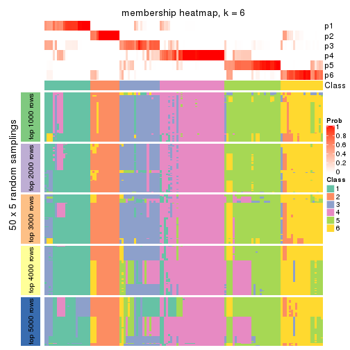</p>

</div>
</div>

As soon as we have had the classes for columns, we can look for signatures
which are significantly different between classes which can be candidate marks
for certain classes. Following are the heatmaps for signatures.


Signature heatmaps where rows are scaled:


<script>
$( function() {
	$( '#tabs-MAD-pam-get-signatures' ).tabs();
} );
</script>
<div id='tabs-MAD-pam-get-signatures'>
<ul>
<li><a href='#tab-MAD-pam-get-signatures-1'>k = 2</a></li>
<li><a href='#tab-MAD-pam-get-signatures-2'>k = 3</a></li>
<li><a href='#tab-MAD-pam-get-signatures-3'>k = 4</a></li>
<li><a href='#tab-MAD-pam-get-signatures-4'>k = 5</a></li>
<li><a href='#tab-MAD-pam-get-signatures-5'>k = 6</a></li>
</ul>
<div id='tab-MAD-pam-get-signatures-1'>
<pre><code class="r">get_signatures(res, k = 2)
</code></pre>

<p></p>

</div>
<div id='tab-MAD-pam-get-signatures-2'>
<pre><code class="r">get_signatures(res, k = 3)
</code></pre>

<p></p>

</div>
<div id='tab-MAD-pam-get-signatures-3'>
<pre><code class="r">get_signatures(res, k = 4)
</code></pre>

<p></p>

</div>
<div id='tab-MAD-pam-get-signatures-4'>
<pre><code class="r">get_signatures(res, k = 5)
</code></pre>

<p></p>

</div>
<div id='tab-MAD-pam-get-signatures-5'>
<pre><code class="r">get_signatures(res, k = 6)
</code></pre>

<p></p>

</div>
</div>


Signature heatmaps where rows are not scaled:


<script>
$( function() {
	$( '#tabs-MAD-pam-get-signatures-no-scale' ).tabs();
} );
</script>
<div id='tabs-MAD-pam-get-signatures-no-scale'>
<ul>
<li><a href='#tab-MAD-pam-get-signatures-no-scale-1'>k = 2</a></li>
<li><a href='#tab-MAD-pam-get-signatures-no-scale-2'>k = 3</a></li>
<li><a href='#tab-MAD-pam-get-signatures-no-scale-3'>k = 4</a></li>
<li><a href='#tab-MAD-pam-get-signatures-no-scale-4'>k = 5</a></li>
<li><a href='#tab-MAD-pam-get-signatures-no-scale-5'>k = 6</a></li>
</ul>
<div id='tab-MAD-pam-get-signatures-no-scale-1'>
<pre><code class="r">get_signatures(res, k = 2, scale_rows = FALSE)
</code></pre>

<p></p>

</div>
<div id='tab-MAD-pam-get-signatures-no-scale-2'>
<pre><code class="r">get_signatures(res, k = 3, scale_rows = FALSE)
</code></pre>

<p></p>

</div>
<div id='tab-MAD-pam-get-signatures-no-scale-3'>
<pre><code class="r">get_signatures(res, k = 4, scale_rows = FALSE)
</code></pre>

<p></p>

</div>
<div id='tab-MAD-pam-get-signatures-no-scale-4'>
<pre><code class="r">get_signatures(res, k = 5, scale_rows = FALSE)
</code></pre>

<p></p>

</div>
<div id='tab-MAD-pam-get-signatures-no-scale-5'>
<pre><code class="r">get_signatures(res, k = 6, scale_rows = FALSE)
</code></pre>

<p></p>

</div>
</div>


Compare the overlap of signatures from different k:

```r
compare_signatures(res)
```


`get_signature()` returns a data frame invisibly. TO get the list of signatures, the function
call should be assigned to a variable explicitly. In following code, if `plot` argument is set
to `FALSE`, no heatmap is plotted while only the differential analysis is performed.

```r
# code only for demonstration
tb = get_signature(res, k = ..., plot = FALSE)
```

An example of the output of `tb` is:

```
#>   which_row         fdr    mean_1    mean_2 scaled_mean_1 scaled_mean_2 km
#> 1        38 0.042760348  8.373488  9.131774    -0.5533452     0.5164555  1
#> 2        40 0.018707592  7.106213  8.469186    -0.6173731     0.5762149  1
#> 3        55 0.019134737 10.221463 11.207825    -0.6159697     0.5749050  1
#> 4        59 0.006059896  5.921854  7.869574    -0.6899429     0.6439467  1
#> 5        60 0.018055526  8.928898 10.211722    -0.6204761     0.5791110  1
#> 6        98 0.009384629 15.714769 14.887706     0.6635654    -0.6193277  2
...
```

The columns in `tb` are:

1. `which_row`: row indices corresponding to the input matrix.
2. `fdr`: FDR for the differential test. 
3. `mean_x`: The mean value in group x.
4. `scaled_mean_x`: The mean value in group x after rows are scaled.
5. `km`: Row groups if k-means clustering is applied to rows.


UMAP plot which shows how samples are separated.


<script>
$( function() {
	$( '#tabs-MAD-pam-dimension-reduction' ).tabs();
} );
</script>
<div id='tabs-MAD-pam-dimension-reduction'>
<ul>
<li><a href='#tab-MAD-pam-dimension-reduction-1'>k = 2</a></li>
<li><a href='#tab-MAD-pam-dimension-reduction-2'>k = 3</a></li>
<li><a href='#tab-MAD-pam-dimension-reduction-3'>k = 4</a></li>
<li><a href='#tab-MAD-pam-dimension-reduction-4'>k = 5</a></li>
<li><a href='#tab-MAD-pam-dimension-reduction-5'>k = 6</a></li>
</ul>
<div id='tab-MAD-pam-dimension-reduction-1'>
<pre><code class="r">dimension_reduction(res, k = 2, method = &quot;UMAP&quot;)
</code></pre>

<p></p>

</div>
<div id='tab-MAD-pam-dimension-reduction-2'>
<pre><code class="r">dimension_reduction(res, k = 3, method = &quot;UMAP&quot;)
</code></pre>

<p></p>

</div>
<div id='tab-MAD-pam-dimension-reduction-3'>
<pre><code class="r">dimension_reduction(res, k = 4, method = &quot;UMAP&quot;)
</code></pre>

<p></p>

</div>
<div id='tab-MAD-pam-dimension-reduction-4'>
<pre><code class="r">dimension_reduction(res, k = 5, method = &quot;UMAP&quot;)
</code></pre>

<p></p>

</div>
<div id='tab-MAD-pam-dimension-reduction-5'>
<pre><code class="r">dimension_reduction(res, k = 6, method = &quot;UMAP&quot;)
</code></pre>

<p></p>

</div>
</div>


Following heatmap shows how subgroups are split when increasing `k`:

```r
collect_classes(res)
```


If matrix rows can be associated to genes, consider to use `functional_enrichment(res,
...)` to perform function enrichment for the signature genes. See [this vignette](http://bioconductor.org/packages/devel/bioc/vignettes/cola/inst/doc/functional_enrichment.html) for more detailed explanations.


 

---------------------------------------------------


### MAD:mclust**


The object with results only for a single top-value method and a single partition method 
can be extracted as:

```r
res = res_list["MAD", "mclust"]
# you can also extract it by
# res = res_list["MAD:mclust"]
```

A summary of `res` and all the functions that can be applied to it:

```r
res
```

```
#> A 'ConsensusPartition' object with k = 2, 3, 4, 5, 6.
#>   On a matrix with 13580 rows and 133 columns.
#>   Top rows (1000, 2000, 3000, 4000, 5000) are extracted by 'MAD' method.
#>   Subgroups are detected by 'mclust' method.
#>   Performed in total 1250 partitions by row resampling.
#>   Best k for subgroups seems to be 2.
#> 
#> Following methods can be applied to this 'ConsensusPartition' object:
#>  [1] "cola_report"             "collect_classes"         "collect_plots"          
#>  [4] "collect_stats"           "colnames"                "compare_signatures"     
#>  [7] "consensus_heatmap"       "dimension_reduction"     "functional_enrichment"  
#> [10] "get_anno_col"            "get_anno"                "get_classes"            
#> [13] "get_consensus"           "get_matrix"              "get_membership"         
#> [16] "get_param"               "get_signatures"          "get_stats"              
#> [19] "is_best_k"               "is_stable_k"             "membership_heatmap"     
#> [22] "ncol"                    "nrow"                    "plot_ecdf"              
#> [25] "rownames"                "select_partition_number" "show"                   
#> [28] "suggest_best_k"          "test_to_known_factors"
```

`collect_plots()` function collects all the plots made from `res` for all `k` (number of partitions)
into one single page to provide an easy and fast comparison between different `k`.

```r
collect_plots(res)
```


The plots are:

- The first row: a plot of the ECDF (empirical cumulative distribution
  function) curves of the consensus matrix for each `k` and the heatmap of
  predicted classes for each `k`.
- The second row: heatmaps of the consensus matrix for each `k`.
- The third row: heatmaps of the membership matrix for each `k`.
- The fouth row: heatmaps of the signatures for each `k`.

All the plots in panels can be made by individual functions and they are
plotted later in this section.

`select_partition_number()` produces several plots showing different
statistics for choosing "optimized" `k`. There are following statistics:

- ECDF curves of the consensus matrix for each `k`;
- 1-PAC. [The PAC
  score](https://en.wikipedia.org/wiki/Consensus_clustering#Over-interpretation_potential_of_consensus_clustering)
  measures the proportion of the ambiguous subgrouping.
- Mean silhouette score.
- Concordance. The mean probability of fiting the consensus class ids in all
  partitions.
- Area increased. Denote $A_k$ as the area under the ECDF curve for current
  `k`, the area increased is defined as $A_k - A_{k-1}$.
- Rand index. The percent of pairs of samples that are both in a same cluster
  or both are not in a same cluster in the partition of k and k-1.
- Jaccard index. The ratio of pairs of samples are both in a same cluster in
  the partition of k and k-1 and the pairs of samples are both in a same
  cluster in the partition k or k-1.

The detailed explanations of these statistics can be found in [the _cola_
vignette](http://bioconductor.org/packages/devel/bioc/vignettes/cola/inst/doc/cola.html#toc_13).

Generally speaking, lower PAC score, higher mean silhouette score or higher
concordance corresponds to better partition. Rand index and Jaccard index
measure how similar the current partition is compared to partition with `k-1`.
If they are too similar, we won't accept `k` is better than `k-1`.

```r
select_partition_number(res)
```


The numeric values for all these statistics can be obtained by `get_stats()`.

```r
get_stats(res)
```

```
#>   k 1-PAC mean_silhouette concordance area_increased  Rand Jaccard
#> 2 2 1.000           0.955       0.975         0.3007 0.722   0.722
#> 3 3 0.425           0.686       0.785         0.8642 0.643   0.507
#> 4 4 0.671           0.834       0.885         0.1962 0.842   0.632
#> 5 5 0.758           0.866       0.909         0.1325 0.825   0.523
#> 6 6 0.773           0.771       0.843         0.0628 0.887   0.568
```

`suggest_best_k()` suggests the best $k$ based on these statistics. The rules are as follows:

- All $k$ with Jaccard index larger than 0.95 are removed because increasing
  $k$ does not provide enough extra information. If all $k$ are removed, it is
  marked as no subgroup is detected.
- For all $k$ with 1-PAC score larger than 0.9, the maximal $k$ is taken as
  the best $k$, and other $k$ are marked as optional $k$.
- If it does not fit the second rule. The $k$ with the maximal vote of the
  highest 1-PAC score, highest mean silhouette, and highest concordance is
  taken as the best $k$.

```r
suggest_best_k(res)
```

```
#> [1] 2
```


Following shows the table of the partitions (You need to click the **show/hide
code output** link to see it). The membership matrix (columns with name `p*`)
is inferred by
[`clue::cl_consensus()`](https://www.rdocumentation.org/link/cl_consensus?package=clue)
function with the `SE` method. Basically the value in the membership matrix
represents the probability to belong to a certain group. The finall class
label for an item is determined with the group with highest probability it
belongs to.

In `get_classes()` function, the entropy is calculated from the membership
matrix and the silhouette score is calculated from the consensus matrix.


<script>
$( function() {
	$( '#tabs-MAD-mclust-get-classes' ).tabs();
} );
</script>
<div id='tabs-MAD-mclust-get-classes'>
<ul>
<li><a href='#tab-MAD-mclust-get-classes-1'>k = 2</a></li>
<li><a href='#tab-MAD-mclust-get-classes-2'>k = 3</a></li>
<li><a href='#tab-MAD-mclust-get-classes-3'>k = 4</a></li>
<li><a href='#tab-MAD-mclust-get-classes-4'>k = 5</a></li>
<li><a href='#tab-MAD-mclust-get-classes-5'>k = 6</a></li>
</ul>

<div id='tab-MAD-mclust-get-classes-1'>
<p><a id='tab-MAD-mclust-get-classes-1-a' style='color:#0366d6' href='#'>show/hide code output</a></p>
<pre><code class="r">cbind(get_classes(res, k = 2), get_membership(res, k = 2))
</code></pre>

<pre><code>#&gt;            class entropy silhouette    p1    p2
#&gt; SRR1951667     2  0.0938      0.991 0.012 0.988
#&gt; SRR1951666     1  0.3879      0.936 0.924 0.076
#&gt; SRR1951665     2  0.0000      0.994 0.000 1.000
#&gt; SRR1951664     1  0.0000      0.970 1.000 0.000
#&gt; SRR1951663     1  0.0000      0.970 1.000 0.000
#&gt; SRR1951662     2  0.0000      0.994 0.000 1.000
#&gt; SRR1951661     1  0.3431      0.942 0.936 0.064
#&gt; SRR1951660     1  0.0000      0.970 1.000 0.000
#&gt; SRR1951659     2  0.0672      0.993 0.008 0.992
#&gt; SRR1951658     2  0.0000      0.994 0.000 1.000
#&gt; SRR1951657     1  0.0000      0.970 1.000 0.000
#&gt; SRR1951656     1  0.0000      0.970 1.000 0.000
#&gt; SRR1951655     1  0.0000      0.970 1.000 0.000
#&gt; SRR1951654     1  0.0000      0.970 1.000 0.000
#&gt; SRR1951653     1  0.0000      0.970 1.000 0.000
#&gt; SRR1951652     1  0.3879      0.936 0.924 0.076
#&gt; SRR1951651     1  0.0000      0.970 1.000 0.000
#&gt; SRR1951650     1  0.0000      0.970 1.000 0.000
#&gt; SRR1951648     1  0.3879      0.936 0.924 0.076
#&gt; SRR1951649     1  0.0000      0.970 1.000 0.000
#&gt; SRR1951647     1  0.1843      0.960 0.972 0.028
#&gt; SRR1951646     1  0.0000      0.970 1.000 0.000
#&gt; SRR1951645     1  0.0000      0.970 1.000 0.000
#&gt; SRR1951644     1  0.0000      0.970 1.000 0.000
#&gt; SRR1951643     1  0.0000      0.970 1.000 0.000
#&gt; SRR1951641     2  0.0672      0.993 0.008 0.992
#&gt; SRR1951642     1  0.0000      0.970 1.000 0.000
#&gt; SRR1951694     1  0.0000      0.970 1.000 0.000
#&gt; SRR1951731     1  0.3879      0.936 0.924 0.076
#&gt; SRR1951730     1  0.3879      0.936 0.924 0.076
#&gt; SRR1951752     1  0.3879      0.936 0.924 0.076
#&gt; SRR1951751     1  0.0000      0.970 1.000 0.000
#&gt; SRR1951749     1  0.3879      0.936 0.924 0.076
#&gt; SRR1951750     1  0.0000      0.970 1.000 0.000
#&gt; SRR1951748     2  0.0000      0.994 0.000 1.000
#&gt; SRR1951747     2  0.0000      0.994 0.000 1.000
#&gt; SRR1951745     1  0.0000      0.970 1.000 0.000
#&gt; SRR1951746     2  0.0000      0.994 0.000 1.000
#&gt; SRR1951744     1  0.0000      0.970 1.000 0.000
#&gt; SRR1951742     1  0.3879      0.936 0.924 0.076
#&gt; SRR1951743     2  0.0000      0.994 0.000 1.000
#&gt; SRR1951741     1  0.0000      0.970 1.000 0.000
#&gt; SRR1951740     1  0.0000      0.970 1.000 0.000
#&gt; SRR1951738     1  0.9909      0.278 0.556 0.444
#&gt; SRR1951739     2  0.1414      0.984 0.020 0.980
#&gt; SRR1951737     1  0.0000      0.970 1.000 0.000
#&gt; SRR1951736     1  0.0000      0.970 1.000 0.000
#&gt; SRR1951734     2  0.0000      0.994 0.000 1.000
#&gt; SRR1951735     1  0.0376      0.969 0.996 0.004
#&gt; SRR1951733     1  0.3879      0.936 0.924 0.076
#&gt; SRR1951732     2  0.0000      0.994 0.000 1.000
#&gt; SRR1951729     1  0.0000      0.970 1.000 0.000
#&gt; SRR1951728     1  0.2043      0.958 0.968 0.032
#&gt; SRR1951727     2  0.0000      0.994 0.000 1.000
#&gt; SRR1951725     1  0.0000      0.970 1.000 0.000
#&gt; SRR1951726     1  0.3879      0.936 0.924 0.076
#&gt; SRR1951724     1  0.0000      0.970 1.000 0.000
#&gt; SRR1951722     1  0.1633      0.961 0.976 0.024
#&gt; SRR1951723     1  0.0000      0.970 1.000 0.000
#&gt; SRR1951721     1  0.0000      0.970 1.000 0.000
#&gt; SRR1951719     1  0.0000      0.970 1.000 0.000
#&gt; SRR1951720     1  0.0000      0.970 1.000 0.000
#&gt; SRR1951718     1  0.0000      0.970 1.000 0.000
#&gt; SRR1951717     1  0.0000      0.970 1.000 0.000
#&gt; SRR1951715     1  0.0000      0.970 1.000 0.000
#&gt; SRR1951716     1  0.0000      0.970 1.000 0.000
#&gt; SRR1951714     1  0.0000      0.970 1.000 0.000
#&gt; SRR1951713     1  0.0000      0.970 1.000 0.000
#&gt; SRR1951712     1  0.0000      0.970 1.000 0.000
#&gt; SRR1951711     2  0.0672      0.993 0.008 0.992
#&gt; SRR1951710     1  0.0000      0.970 1.000 0.000
#&gt; SRR1951709     1  0.3879      0.936 0.924 0.076
#&gt; SRR1951708     2  0.0000      0.994 0.000 1.000
#&gt; SRR1951707     1  0.3879      0.936 0.924 0.076
#&gt; SRR1951705     1  0.0000      0.970 1.000 0.000
#&gt; SRR1951704     1  0.3879      0.936 0.924 0.076
#&gt; SRR1951703     2  0.0000      0.994 0.000 1.000
#&gt; SRR1951706     1  0.2603      0.952 0.956 0.044
#&gt; SRR1951702     1  0.3879      0.936 0.924 0.076
#&gt; SRR1951701     2  0.0938      0.991 0.012 0.988
#&gt; SRR1951699     1  0.3879      0.936 0.924 0.076
#&gt; SRR1951698     1  0.2778      0.951 0.952 0.048
#&gt; SRR1951700     1  0.0000      0.970 1.000 0.000
#&gt; SRR1951697     2  0.0938      0.991 0.012 0.988
#&gt; SRR1951696     1  0.0000      0.970 1.000 0.000
#&gt; SRR1951695     1  0.0000      0.970 1.000 0.000
#&gt; SRR1951693     1  0.0000      0.970 1.000 0.000
#&gt; SRR1951692     1  0.0000      0.970 1.000 0.000
#&gt; SRR1951691     1  0.0000      0.970 1.000 0.000
#&gt; SRR1951688     1  0.3879      0.936 0.924 0.076
#&gt; SRR1951689     1  0.3879      0.936 0.924 0.076
#&gt; SRR1951687     1  0.0000      0.970 1.000 0.000
#&gt; SRR1951685     1  0.3879      0.936 0.924 0.076
#&gt; SRR1951684     1  0.0000      0.970 1.000 0.000
#&gt; SRR1951686     1  0.3879      0.936 0.924 0.076
#&gt; SRR1951683     1  0.1633      0.961 0.976 0.024
#&gt; SRR1951682     2  0.0938      0.991 0.012 0.988
#&gt; SRR1951690     2  0.1184      0.988 0.016 0.984
#&gt; SRR1951680     1  0.0000      0.970 1.000 0.000
#&gt; SRR1951679     1  0.0000      0.970 1.000 0.000
#&gt; SRR1951678     1  0.1633      0.961 0.976 0.024
#&gt; SRR1951677     1  0.0000      0.970 1.000 0.000
#&gt; SRR1951676     1  0.0000      0.970 1.000 0.000
#&gt; SRR1951675     2  0.0938      0.991 0.012 0.988
#&gt; SRR1951681     1  0.0000      0.970 1.000 0.000
#&gt; SRR1951673     1  0.3879      0.936 0.924 0.076
#&gt; SRR1951674     1  0.0000      0.970 1.000 0.000
#&gt; SRR1951672     1  0.0000      0.970 1.000 0.000
#&gt; SRR1951671     1  0.3879      0.936 0.924 0.076
#&gt; SRR1951670     1  0.0000      0.970 1.000 0.000
#&gt; SRR1951640     1  0.0000      0.970 1.000 0.000
#&gt; SRR1951668     1  0.0000      0.970 1.000 0.000
#&gt; SRR1951669     1  0.3879      0.936 0.924 0.076
#&gt; SRR1951638     1  0.0000      0.970 1.000 0.000
#&gt; SRR1951637     1  0.3879      0.936 0.924 0.076
#&gt; SRR1951635     1  0.0000      0.970 1.000 0.000
#&gt; SRR1951634     1  0.0000      0.970 1.000 0.000
#&gt; SRR1951631     1  0.0000      0.970 1.000 0.000
#&gt; SRR1951632     1  0.9922      0.266 0.552 0.448
#&gt; SRR1951633     1  0.0000      0.970 1.000 0.000
#&gt; SRR1951630     1  0.0376      0.969 0.996 0.004
#&gt; SRR1951629     1  0.0000      0.970 1.000 0.000
#&gt; SRR1951628     1  0.0000      0.970 1.000 0.000
#&gt; SRR1951627     1  0.3879      0.936 0.924 0.076
#&gt; SRR1951639     1  0.3879      0.936 0.924 0.076
#&gt; SRR1951625     1  0.3879      0.936 0.924 0.076
#&gt; SRR1951626     1  0.2948      0.949 0.948 0.052
#&gt; SRR1951624     1  0.0000      0.970 1.000 0.000
#&gt; SRR1951622     1  0.0000      0.970 1.000 0.000
#&gt; SRR1951636     1  0.2948      0.949 0.948 0.052
#&gt; SRR1951623     1  0.0000      0.970 1.000 0.000
#&gt; SRR1951621     1  0.0000      0.970 1.000 0.000
#&gt; SRR1951620     1  0.0000      0.970 1.000 0.000
</code></pre>

<script>
$('#tab-MAD-mclust-get-classes-1-a').parent().next().next().hide();
$('#tab-MAD-mclust-get-classes-1-a').click(function(){
  $('#tab-MAD-mclust-get-classes-1-a').parent().next().next().toggle();
  return(false);
});
</script>
</div>

<div id='tab-MAD-mclust-get-classes-2'>
<p><a id='tab-MAD-mclust-get-classes-2-a' style='color:#0366d6' href='#'>show/hide code output</a></p>
<pre><code class="r">cbind(get_classes(res, k = 3), get_membership(res, k = 3))
</code></pre>

<pre><code>#&gt;            class entropy silhouette    p1    p2    p3
#&gt; SRR1951667     2  0.4409      0.855 0.172 0.824 0.004
#&gt; SRR1951666     3  0.6309      0.684 0.496 0.000 0.504
#&gt; SRR1951665     2  0.0000      0.897 0.000 1.000 0.000
#&gt; SRR1951664     3  0.4931      0.803 0.232 0.000 0.768
#&gt; SRR1951663     1  0.2796      0.631 0.908 0.000 0.092
#&gt; SRR1951662     2  0.0000      0.897 0.000 1.000 0.000
#&gt; SRR1951661     3  0.6309      0.684 0.496 0.000 0.504
#&gt; SRR1951660     1  0.6295      0.639 0.528 0.000 0.472
#&gt; SRR1951659     2  0.3482      0.875 0.128 0.872 0.000
#&gt; SRR1951658     2  0.0747      0.897 0.016 0.984 0.000
#&gt; SRR1951657     3  0.5016      0.805 0.240 0.000 0.760
#&gt; SRR1951656     3  0.4931      0.803 0.232 0.000 0.768
#&gt; SRR1951655     1  0.5254      0.682 0.736 0.000 0.264
#&gt; SRR1951654     1  0.4887      0.681 0.772 0.000 0.228
#&gt; SRR1951653     3  0.5016      0.805 0.240 0.000 0.760
#&gt; SRR1951652     1  0.1774      0.532 0.960 0.016 0.024
#&gt; SRR1951651     3  0.5016      0.805 0.240 0.000 0.760
#&gt; SRR1951650     3  0.5810      0.774 0.336 0.000 0.664
#&gt; SRR1951648     3  0.6309      0.684 0.496 0.000 0.504
#&gt; SRR1951649     1  0.6295      0.639 0.528 0.000 0.472
#&gt; SRR1951647     3  0.5465      0.796 0.288 0.000 0.712
#&gt; SRR1951646     3  0.4974      0.805 0.236 0.000 0.764
#&gt; SRR1951645     1  0.5178      0.681 0.744 0.000 0.256
#&gt; SRR1951644     1  0.6295      0.639 0.528 0.000 0.472
#&gt; SRR1951643     3  0.5016      0.805 0.240 0.000 0.760
#&gt; SRR1951641     2  0.2448      0.887 0.076 0.924 0.000
#&gt; SRR1951642     3  0.5016      0.805 0.240 0.000 0.760
#&gt; SRR1951694     1  0.4702      0.676 0.788 0.000 0.212
#&gt; SRR1951731     3  0.6154      0.742 0.408 0.000 0.592
#&gt; SRR1951730     1  0.5115      0.116 0.796 0.016 0.188
#&gt; SRR1951752     1  0.2200      0.495 0.940 0.004 0.056
#&gt; SRR1951751     1  0.6295      0.639 0.528 0.000 0.472
#&gt; SRR1951749     3  0.6309      0.684 0.496 0.000 0.504
#&gt; SRR1951750     1  0.5178      0.681 0.744 0.000 0.256
#&gt; SRR1951748     2  0.0000      0.897 0.000 1.000 0.000
#&gt; SRR1951747     2  0.0000      0.897 0.000 1.000 0.000
#&gt; SRR1951745     1  0.2878      0.626 0.904 0.000 0.096
#&gt; SRR1951746     2  0.0000      0.897 0.000 1.000 0.000
#&gt; SRR1951744     3  0.5968      0.765 0.364 0.000 0.636
#&gt; SRR1951742     1  0.6955     -0.677 0.496 0.016 0.488
#&gt; SRR1951743     2  0.0000      0.897 0.000 1.000 0.000
#&gt; SRR1951741     1  0.5178      0.681 0.744 0.000 0.256
#&gt; SRR1951740     3  0.5016      0.805 0.240 0.000 0.760
#&gt; SRR1951738     1  0.3752      0.467 0.856 0.144 0.000
#&gt; SRR1951739     2  0.5404      0.783 0.256 0.740 0.004
#&gt; SRR1951737     3  0.4931      0.803 0.232 0.000 0.768
#&gt; SRR1951736     1  0.6295      0.639 0.528 0.000 0.472
#&gt; SRR1951734     2  0.0000      0.897 0.000 1.000 0.000
#&gt; SRR1951735     3  0.5058      0.806 0.244 0.000 0.756
#&gt; SRR1951733     3  0.6309      0.684 0.496 0.000 0.504
#&gt; SRR1951732     2  0.0000      0.897 0.000 1.000 0.000
#&gt; SRR1951729     3  0.4931      0.803 0.232 0.000 0.768
#&gt; SRR1951728     3  0.5678      0.787 0.316 0.000 0.684
#&gt; SRR1951727     2  0.0000      0.897 0.000 1.000 0.000
#&gt; SRR1951725     1  0.4121      0.666 0.832 0.000 0.168
#&gt; SRR1951726     1  0.0747      0.554 0.984 0.000 0.016
#&gt; SRR1951724     1  0.5216      0.677 0.740 0.000 0.260
#&gt; SRR1951722     3  0.6295      0.189 0.472 0.000 0.528
#&gt; SRR1951723     1  0.5327      0.663 0.728 0.000 0.272
#&gt; SRR1951721     1  0.2356      0.620 0.928 0.000 0.072
#&gt; SRR1951719     3  0.4974      0.804 0.236 0.000 0.764
#&gt; SRR1951720     1  0.5178      0.681 0.744 0.000 0.256
#&gt; SRR1951718     1  0.6295      0.639 0.528 0.000 0.472
#&gt; SRR1951717     1  0.5178      0.681 0.744 0.000 0.256
#&gt; SRR1951715     1  0.2878      0.633 0.904 0.000 0.096
#&gt; SRR1951716     1  0.6295      0.639 0.528 0.000 0.472
#&gt; SRR1951714     3  0.5016      0.805 0.240 0.000 0.760
#&gt; SRR1951713     3  0.5785      0.651 0.332 0.000 0.668
#&gt; SRR1951712     1  0.6295      0.639 0.528 0.000 0.472
#&gt; SRR1951711     2  0.4235      0.855 0.176 0.824 0.000
#&gt; SRR1951710     1  0.5098      0.682 0.752 0.000 0.248
#&gt; SRR1951709     3  0.6309      0.684 0.496 0.000 0.504
#&gt; SRR1951708     2  0.1031      0.896 0.024 0.976 0.000
#&gt; SRR1951707     3  0.6126      0.747 0.400 0.000 0.600
#&gt; SRR1951705     1  0.6295      0.639 0.528 0.000 0.472
#&gt; SRR1951704     3  0.6308      0.688 0.492 0.000 0.508
#&gt; SRR1951703     2  0.0000      0.897 0.000 1.000 0.000
#&gt; SRR1951706     3  0.6309      0.684 0.496 0.000 0.504
#&gt; SRR1951702     3  0.6308      0.688 0.492 0.000 0.508
#&gt; SRR1951701     2  0.3112      0.883 0.096 0.900 0.004
#&gt; SRR1951699     3  0.6309      0.684 0.496 0.000 0.504
#&gt; SRR1951698     3  0.6308      0.688 0.492 0.000 0.508
#&gt; SRR1951700     3  0.6215      0.372 0.428 0.000 0.572
#&gt; SRR1951697     2  0.4351      0.857 0.168 0.828 0.004
#&gt; SRR1951696     3  0.4931      0.803 0.232 0.000 0.768
#&gt; SRR1951695     3  0.5016      0.805 0.240 0.000 0.760
#&gt; SRR1951693     3  0.5431      0.745 0.284 0.000 0.716
#&gt; SRR1951692     3  0.5016      0.805 0.240 0.000 0.760
#&gt; SRR1951691     1  0.5178      0.681 0.744 0.000 0.256
#&gt; SRR1951688     1  0.3551      0.454 0.868 0.132 0.000
#&gt; SRR1951689     1  0.0747      0.558 0.984 0.016 0.000
#&gt; SRR1951687     1  0.5178      0.681 0.744 0.000 0.256
#&gt; SRR1951685     1  0.6267     -0.620 0.548 0.000 0.452
#&gt; SRR1951684     3  0.4931      0.803 0.232 0.000 0.768
#&gt; SRR1951686     3  0.7295      0.665 0.484 0.028 0.488
#&gt; SRR1951683     3  0.5138      0.792 0.252 0.000 0.748
#&gt; SRR1951682     2  0.5058      0.800 0.244 0.756 0.000
#&gt; SRR1951690     2  0.4178      0.857 0.172 0.828 0.000
#&gt; SRR1951680     3  0.5016      0.805 0.240 0.000 0.760
#&gt; SRR1951679     1  0.6295      0.639 0.528 0.000 0.472
#&gt; SRR1951678     3  0.5016      0.805 0.240 0.000 0.760
#&gt; SRR1951677     3  0.5016      0.805 0.240 0.000 0.760
#&gt; SRR1951676     3  0.6008      0.761 0.372 0.000 0.628
#&gt; SRR1951675     2  0.5882      0.653 0.348 0.652 0.000
#&gt; SRR1951681     3  0.5138      0.806 0.252 0.000 0.748
#&gt; SRR1951673     1  0.0747      0.558 0.984 0.016 0.000
#&gt; SRR1951674     1  0.3116      0.634 0.892 0.000 0.108
#&gt; SRR1951672     1  0.6252      0.648 0.556 0.000 0.444
#&gt; SRR1951671     1  0.6955     -0.677 0.496 0.016 0.488
#&gt; SRR1951670     1  0.5178      0.681 0.744 0.000 0.256
#&gt; SRR1951640     3  0.4931      0.803 0.232 0.000 0.768
#&gt; SRR1951668     1  0.5327      0.663 0.728 0.000 0.272
#&gt; SRR1951669     1  0.0747      0.558 0.984 0.016 0.000
#&gt; SRR1951638     1  0.5178      0.681 0.744 0.000 0.256
#&gt; SRR1951637     1  0.0237      0.565 0.996 0.004 0.000
#&gt; SRR1951635     1  0.5178      0.681 0.744 0.000 0.256
#&gt; SRR1951634     3  0.5650      0.694 0.312 0.000 0.688
#&gt; SRR1951631     3  0.5016      0.805 0.240 0.000 0.760
#&gt; SRR1951632     2  0.8765      0.409 0.380 0.504 0.116
#&gt; SRR1951633     3  0.5254      0.803 0.264 0.000 0.736
#&gt; SRR1951630     3  0.5016      0.805 0.240 0.000 0.760
#&gt; SRR1951629     3  0.5016      0.805 0.240 0.000 0.760
#&gt; SRR1951628     1  0.5138      0.684 0.748 0.000 0.252
#&gt; SRR1951627     3  0.6309      0.684 0.496 0.000 0.504
#&gt; SRR1951639     3  0.6305      0.694 0.484 0.000 0.516
#&gt; SRR1951625     3  0.6683      0.680 0.492 0.008 0.500
#&gt; SRR1951626     3  0.6215      0.731 0.428 0.000 0.572
#&gt; SRR1951624     3  0.5016      0.805 0.240 0.000 0.760
#&gt; SRR1951622     1  0.6295      0.639 0.528 0.000 0.472
#&gt; SRR1951636     3  0.6302      0.696 0.480 0.000 0.520
#&gt; SRR1951623     3  0.6305      0.694 0.484 0.000 0.516
#&gt; SRR1951621     1  0.5178      0.681 0.744 0.000 0.256
#&gt; SRR1951620     3  0.4931      0.803 0.232 0.000 0.768
</code></pre>

<script>
$('#tab-MAD-mclust-get-classes-2-a').parent().next().next().hide();
$('#tab-MAD-mclust-get-classes-2-a').click(function(){
  $('#tab-MAD-mclust-get-classes-2-a').parent().next().next().toggle();
  return(false);
});
</script>
</div>

<div id='tab-MAD-mclust-get-classes-3'>
<p><a id='tab-MAD-mclust-get-classes-3-a' style='color:#0366d6' href='#'>show/hide code output</a></p>
<pre><code class="r">cbind(get_classes(res, k = 4), get_membership(res, k = 4))
</code></pre>

<pre><code>#&gt;            class entropy silhouette    p1    p2    p3    p4
#&gt; SRR1951667     2  0.1302      0.881 0.000 0.956 0.044 0.000
#&gt; SRR1951666     3  0.1302      0.799 0.000 0.044 0.956 0.000
#&gt; SRR1951665     2  0.1474      0.870 0.052 0.948 0.000 0.000
#&gt; SRR1951664     3  0.4070      0.852 0.044 0.000 0.824 0.132
#&gt; SRR1951663     1  0.2739      0.884 0.904 0.036 0.060 0.000
#&gt; SRR1951662     2  0.1474      0.870 0.052 0.948 0.000 0.000
#&gt; SRR1951661     3  0.1118      0.805 0.000 0.036 0.964 0.000
#&gt; SRR1951660     4  0.0000      0.956 0.000 0.000 0.000 1.000
#&gt; SRR1951659     2  0.1004      0.876 0.024 0.972 0.004 0.000
#&gt; SRR1951658     2  0.1118      0.871 0.036 0.964 0.000 0.000
#&gt; SRR1951657     3  0.3356      0.854 0.000 0.000 0.824 0.176
#&gt; SRR1951656     3  0.3356      0.854 0.000 0.000 0.824 0.176
#&gt; SRR1951655     4  0.0000      0.956 0.000 0.000 0.000 1.000
#&gt; SRR1951654     1  0.4160      0.705 0.792 0.012 0.004 0.192
#&gt; SRR1951653     3  0.3444      0.849 0.000 0.000 0.816 0.184
#&gt; SRR1951652     2  0.3400      0.819 0.000 0.820 0.180 0.000
#&gt; SRR1951651     3  0.3356      0.854 0.000 0.000 0.824 0.176
#&gt; SRR1951650     3  0.2284      0.823 0.036 0.012 0.932 0.020
#&gt; SRR1951648     3  0.1118      0.805 0.000 0.036 0.964 0.000
#&gt; SRR1951649     4  0.0000      0.956 0.000 0.000 0.000 1.000
#&gt; SRR1951647     3  0.3279      0.842 0.000 0.032 0.872 0.096
#&gt; SRR1951646     3  0.4017      0.852 0.044 0.000 0.828 0.128
#&gt; SRR1951645     4  0.0000      0.956 0.000 0.000 0.000 1.000
#&gt; SRR1951644     4  0.0188      0.956 0.004 0.000 0.000 0.996
#&gt; SRR1951643     3  0.3356      0.854 0.000 0.000 0.824 0.176
#&gt; SRR1951641     2  0.1004      0.876 0.024 0.972 0.004 0.000
#&gt; SRR1951642     3  0.3356      0.854 0.000 0.000 0.824 0.176
#&gt; SRR1951694     4  0.0524      0.947 0.004 0.000 0.008 0.988
#&gt; SRR1951731     3  0.1305      0.807 0.000 0.036 0.960 0.004
#&gt; SRR1951730     2  0.3400      0.819 0.000 0.820 0.180 0.000
#&gt; SRR1951752     3  0.4977     -0.169 0.000 0.460 0.540 0.000
#&gt; SRR1951751     4  0.0000      0.956 0.000 0.000 0.000 1.000
#&gt; SRR1951749     3  0.1118      0.805 0.000 0.036 0.964 0.000
#&gt; SRR1951750     4  0.0000      0.956 0.000 0.000 0.000 1.000
#&gt; SRR1951748     2  0.1474      0.870 0.052 0.948 0.000 0.000
#&gt; SRR1951747     2  0.1474      0.870 0.052 0.948 0.000 0.000
#&gt; SRR1951745     1  0.2739      0.884 0.904 0.036 0.060 0.000
#&gt; SRR1951746     2  0.1211      0.871 0.040 0.960 0.000 0.000
#&gt; SRR1951744     3  0.3557      0.844 0.000 0.036 0.856 0.108
#&gt; SRR1951742     2  0.3975      0.743 0.000 0.760 0.240 0.000
#&gt; SRR1951743     2  0.1211      0.871 0.040 0.960 0.000 0.000
#&gt; SRR1951741     4  0.0524      0.948 0.004 0.000 0.008 0.988
#&gt; SRR1951740     3  0.3356      0.854 0.000 0.000 0.824 0.176
#&gt; SRR1951738     2  0.2704      0.855 0.000 0.876 0.124 0.000
#&gt; SRR1951739     2  0.1389      0.880 0.000 0.952 0.048 0.000
#&gt; SRR1951737     3  0.4070      0.852 0.044 0.000 0.824 0.132
#&gt; SRR1951736     4  0.0188      0.956 0.004 0.000 0.000 0.996
#&gt; SRR1951734     2  0.1211      0.871 0.040 0.960 0.000 0.000
#&gt; SRR1951735     3  0.4070      0.852 0.044 0.000 0.824 0.132
#&gt; SRR1951733     3  0.1118      0.805 0.000 0.036 0.964 0.000
#&gt; SRR1951732     2  0.1474      0.870 0.052 0.948 0.000 0.000
#&gt; SRR1951729     3  0.4070      0.852 0.044 0.000 0.824 0.132
#&gt; SRR1951728     3  0.2739      0.831 0.000 0.036 0.904 0.060
#&gt; SRR1951727     2  0.1474      0.870 0.052 0.948 0.000 0.000
#&gt; SRR1951725     1  0.3805      0.790 0.832 0.012 0.008 0.148
#&gt; SRR1951726     3  0.1118      0.805 0.000 0.036 0.964 0.000
#&gt; SRR1951724     4  0.0188      0.953 0.000 0.000 0.004 0.996
#&gt; SRR1951722     3  0.5039      0.557 0.000 0.004 0.592 0.404
#&gt; SRR1951723     4  0.0000      0.956 0.000 0.000 0.000 1.000
#&gt; SRR1951721     1  0.2816      0.881 0.900 0.036 0.064 0.000
#&gt; SRR1951719     3  0.3356      0.854 0.000 0.000 0.824 0.176
#&gt; SRR1951720     4  0.0336      0.955 0.008 0.000 0.000 0.992
#&gt; SRR1951718     4  0.0000      0.956 0.000 0.000 0.000 1.000
#&gt; SRR1951717     4  0.0336      0.955 0.008 0.000 0.000 0.992
#&gt; SRR1951715     1  0.5994      0.777 0.724 0.036 0.060 0.180
#&gt; SRR1951716     4  0.0188      0.956 0.004 0.000 0.000 0.996
#&gt; SRR1951714     3  0.3356      0.854 0.000 0.000 0.824 0.176
#&gt; SRR1951713     3  0.4907      0.519 0.000 0.000 0.580 0.420
#&gt; SRR1951712     4  0.0000      0.956 0.000 0.000 0.000 1.000
#&gt; SRR1951711     2  0.1211      0.882 0.000 0.960 0.040 0.000
#&gt; SRR1951710     4  0.0672      0.946 0.008 0.000 0.008 0.984
#&gt; SRR1951709     3  0.1118      0.805 0.000 0.036 0.964 0.000
#&gt; SRR1951708     2  0.1305      0.872 0.036 0.960 0.004 0.000
#&gt; SRR1951707     3  0.1452      0.807 0.000 0.036 0.956 0.008
#&gt; SRR1951705     4  0.0188      0.956 0.004 0.000 0.000 0.996
#&gt; SRR1951704     3  0.1118      0.805 0.000 0.036 0.964 0.000
#&gt; SRR1951703     2  0.1389      0.870 0.048 0.952 0.000 0.000
#&gt; SRR1951706     3  0.1118      0.805 0.000 0.036 0.964 0.000
#&gt; SRR1951702     3  0.1118      0.805 0.000 0.036 0.964 0.000
#&gt; SRR1951701     2  0.1004      0.876 0.024 0.972 0.004 0.000
#&gt; SRR1951699     3  0.1118      0.805 0.000 0.036 0.964 0.000
#&gt; SRR1951698     3  0.1118      0.805 0.000 0.036 0.964 0.000
#&gt; SRR1951700     3  0.4454      0.731 0.000 0.000 0.692 0.308
#&gt; SRR1951697     2  0.1118      0.882 0.000 0.964 0.036 0.000
#&gt; SRR1951696     3  0.4070      0.852 0.044 0.000 0.824 0.132
#&gt; SRR1951695     3  0.3356      0.854 0.000 0.000 0.824 0.176
#&gt; SRR1951693     3  0.3444      0.851 0.000 0.000 0.816 0.184
#&gt; SRR1951692     3  0.3356      0.854 0.000 0.000 0.824 0.176
#&gt; SRR1951691     4  0.0336      0.950 0.000 0.000 0.008 0.992
#&gt; SRR1951688     2  0.3123      0.836 0.000 0.844 0.156 0.000
#&gt; SRR1951689     2  0.3356      0.822 0.000 0.824 0.176 0.000
#&gt; SRR1951687     3  0.4607      0.769 0.004 0.004 0.716 0.276
#&gt; SRR1951685     3  0.1584      0.801 0.000 0.036 0.952 0.012
#&gt; SRR1951684     3  0.3356      0.854 0.000 0.000 0.824 0.176
#&gt; SRR1951686     2  0.2760      0.853 0.000 0.872 0.128 0.000
#&gt; SRR1951683     3  0.3569      0.843 0.000 0.000 0.804 0.196
#&gt; SRR1951682     2  0.1389      0.880 0.000 0.952 0.048 0.000
#&gt; SRR1951690     2  0.1211      0.882 0.000 0.960 0.040 0.000
#&gt; SRR1951680     3  0.3356      0.854 0.000 0.000 0.824 0.176
#&gt; SRR1951679     4  0.0376      0.952 0.004 0.000 0.004 0.992
#&gt; SRR1951678     3  0.3356      0.854 0.000 0.000 0.824 0.176
#&gt; SRR1951677     3  0.3356      0.854 0.000 0.000 0.824 0.176
#&gt; SRR1951676     3  0.1677      0.830 0.000 0.012 0.948 0.040
#&gt; SRR1951675     2  0.1302      0.881 0.000 0.956 0.044 0.000
#&gt; SRR1951681     3  0.3279      0.850 0.032 0.000 0.872 0.096
#&gt; SRR1951673     2  0.3852      0.812 0.000 0.808 0.180 0.012
#&gt; SRR1951674     1  0.2739      0.884 0.904 0.036 0.060 0.000
#&gt; SRR1951672     4  0.0188      0.956 0.004 0.000 0.000 0.996
#&gt; SRR1951671     2  0.3400      0.819 0.000 0.820 0.180 0.000
#&gt; SRR1951670     4  0.0000      0.956 0.000 0.000 0.000 1.000
#&gt; SRR1951640     3  0.4070      0.852 0.044 0.000 0.824 0.132
#&gt; SRR1951668     4  0.1211      0.906 0.000 0.000 0.040 0.960
#&gt; SRR1951669     2  0.2714      0.859 0.004 0.884 0.112 0.000
#&gt; SRR1951638     4  0.5161      0.020 0.476 0.004 0.000 0.520
#&gt; SRR1951637     2  0.6324      0.651 0.168 0.660 0.172 0.000
#&gt; SRR1951635     4  0.4925      0.197 0.428 0.000 0.000 0.572
#&gt; SRR1951634     3  0.4776      0.603 0.000 0.000 0.624 0.376
#&gt; SRR1951631     3  0.3356      0.854 0.000 0.000 0.824 0.176
#&gt; SRR1951632     2  0.3356      0.822 0.000 0.824 0.176 0.000
#&gt; SRR1951633     3  0.3539      0.854 0.000 0.004 0.820 0.176
#&gt; SRR1951630     3  0.3356      0.854 0.000 0.000 0.824 0.176
#&gt; SRR1951629     3  0.3356      0.854 0.000 0.000 0.824 0.176
#&gt; SRR1951628     4  0.0524      0.947 0.004 0.000 0.008 0.988
#&gt; SRR1951627     3  0.1118      0.805 0.000 0.036 0.964 0.000
#&gt; SRR1951639     3  0.1118      0.805 0.000 0.036 0.964 0.000
#&gt; SRR1951625     2  0.4643      0.562 0.000 0.656 0.344 0.000
#&gt; SRR1951626     3  0.1118      0.805 0.000 0.036 0.964 0.000
#&gt; SRR1951624     3  0.3850      0.852 0.044 0.000 0.840 0.116
#&gt; SRR1951622     4  0.0188      0.956 0.004 0.000 0.000 0.996
#&gt; SRR1951636     3  0.1118      0.805 0.000 0.036 0.964 0.000
#&gt; SRR1951623     3  0.1118      0.805 0.000 0.036 0.964 0.000
#&gt; SRR1951621     4  0.0188      0.955 0.004 0.000 0.000 0.996
#&gt; SRR1951620     3  0.4070      0.852 0.044 0.000 0.824 0.132
</code></pre>

<script>
$('#tab-MAD-mclust-get-classes-3-a').parent().next().next().hide();
$('#tab-MAD-mclust-get-classes-3-a').click(function(){
  $('#tab-MAD-mclust-get-classes-3-a').parent().next().next().toggle();
  return(false);
});
</script>
</div>

<div id='tab-MAD-mclust-get-classes-4'>
<p><a id='tab-MAD-mclust-get-classes-4-a' style='color:#0366d6' href='#'>show/hide code output</a></p>
<pre><code class="r">cbind(get_classes(res, k = 5), get_membership(res, k = 5))
</code></pre>

<pre><code>#&gt;            class entropy silhouette    p1    p2    p3    p4    p5
#&gt; SRR1951667     2  0.2338      0.889 0.000 0.884 0.004 0.000 0.112
#&gt; SRR1951666     5  0.2286      0.901 0.000 0.000 0.004 0.108 0.888
#&gt; SRR1951665     2  0.0880      0.882 0.000 0.968 0.032 0.000 0.000
#&gt; SRR1951664     4  0.0510      0.944 0.000 0.000 0.000 0.984 0.016
#&gt; SRR1951663     3  0.1106      0.879 0.024 0.000 0.964 0.000 0.012
#&gt; SRR1951662     2  0.0880      0.882 0.000 0.968 0.032 0.000 0.000
#&gt; SRR1951661     5  0.2286      0.901 0.000 0.000 0.004 0.108 0.888
#&gt; SRR1951660     1  0.0703      0.921 0.976 0.000 0.000 0.024 0.000
#&gt; SRR1951659     2  0.1851      0.895 0.000 0.912 0.000 0.000 0.088
#&gt; SRR1951658     2  0.1851      0.895 0.000 0.912 0.000 0.000 0.088
#&gt; SRR1951657     4  0.0579      0.946 0.008 0.000 0.000 0.984 0.008
#&gt; SRR1951656     4  0.0693      0.946 0.008 0.000 0.000 0.980 0.012
#&gt; SRR1951655     1  0.0703      0.921 0.976 0.000 0.000 0.024 0.000
#&gt; SRR1951654     1  0.5611      0.550 0.616 0.000 0.284 0.096 0.004
#&gt; SRR1951653     4  0.1469      0.943 0.036 0.000 0.000 0.948 0.016
#&gt; SRR1951652     5  0.2906      0.879 0.000 0.012 0.028 0.080 0.880
#&gt; SRR1951651     4  0.1270      0.929 0.052 0.000 0.000 0.948 0.000
#&gt; SRR1951650     4  0.0510      0.944 0.000 0.000 0.000 0.984 0.016
#&gt; SRR1951648     5  0.2127      0.902 0.000 0.000 0.000 0.108 0.892
#&gt; SRR1951649     1  0.0703      0.921 0.976 0.000 0.000 0.024 0.000
#&gt; SRR1951647     5  0.3876      0.647 0.000 0.000 0.000 0.316 0.684
#&gt; SRR1951646     4  0.0510      0.944 0.000 0.000 0.000 0.984 0.016
#&gt; SRR1951645     1  0.0880      0.917 0.968 0.000 0.000 0.032 0.000
#&gt; SRR1951644     1  0.0703      0.921 0.976 0.000 0.000 0.024 0.000
#&gt; SRR1951643     4  0.1041      0.941 0.032 0.000 0.000 0.964 0.004
#&gt; SRR1951641     2  0.2011      0.894 0.000 0.908 0.004 0.000 0.088
#&gt; SRR1951642     4  0.1243      0.942 0.028 0.000 0.004 0.960 0.008
#&gt; SRR1951694     1  0.1522      0.891 0.944 0.000 0.044 0.000 0.012
#&gt; SRR1951731     5  0.2280      0.897 0.000 0.000 0.000 0.120 0.880
#&gt; SRR1951730     5  0.1106      0.824 0.000 0.012 0.000 0.024 0.964
#&gt; SRR1951752     5  0.2464      0.890 0.000 0.012 0.004 0.092 0.892
#&gt; SRR1951751     1  0.0703      0.921 0.976 0.000 0.000 0.024 0.000
#&gt; SRR1951749     5  0.2127      0.902 0.000 0.000 0.000 0.108 0.892
#&gt; SRR1951750     1  0.1564      0.916 0.948 0.000 0.024 0.024 0.004
#&gt; SRR1951748     2  0.0880      0.882 0.000 0.968 0.032 0.000 0.000
#&gt; SRR1951747     2  0.0880      0.882 0.000 0.968 0.032 0.000 0.000
#&gt; SRR1951745     3  0.1106      0.879 0.024 0.000 0.964 0.000 0.012
#&gt; SRR1951746     2  0.0880      0.882 0.000 0.968 0.032 0.000 0.000
#&gt; SRR1951744     4  0.0671      0.942 0.000 0.000 0.004 0.980 0.016
#&gt; SRR1951742     5  0.1197      0.859 0.000 0.000 0.000 0.048 0.952
#&gt; SRR1951743     2  0.0880      0.882 0.000 0.968 0.032 0.000 0.000
#&gt; SRR1951741     1  0.4228      0.799 0.788 0.000 0.108 0.100 0.004
#&gt; SRR1951740     4  0.0955      0.944 0.028 0.000 0.000 0.968 0.004
#&gt; SRR1951738     2  0.4445      0.629 0.000 0.676 0.024 0.000 0.300
#&gt; SRR1951739     2  0.2629      0.873 0.000 0.860 0.004 0.000 0.136
#&gt; SRR1951737     4  0.0510      0.944 0.000 0.000 0.000 0.984 0.016
#&gt; SRR1951736     1  0.0703      0.921 0.976 0.000 0.000 0.024 0.000
#&gt; SRR1951734     2  0.0880      0.882 0.000 0.968 0.032 0.000 0.000
#&gt; SRR1951735     4  0.0798      0.946 0.008 0.000 0.000 0.976 0.016
#&gt; SRR1951733     5  0.2020      0.900 0.000 0.000 0.000 0.100 0.900
#&gt; SRR1951732     2  0.0880      0.882 0.000 0.968 0.032 0.000 0.000
#&gt; SRR1951729     4  0.0510      0.944 0.000 0.000 0.000 0.984 0.016
#&gt; SRR1951728     5  0.2929      0.839 0.000 0.000 0.000 0.180 0.820
#&gt; SRR1951727     2  0.0880      0.882 0.000 0.968 0.032 0.000 0.000
#&gt; SRR1951725     3  0.3690      0.653 0.224 0.000 0.764 0.000 0.012
#&gt; SRR1951726     5  0.2570      0.885 0.000 0.000 0.028 0.084 0.888
#&gt; SRR1951724     1  0.2280      0.829 0.880 0.000 0.000 0.120 0.000
#&gt; SRR1951722     1  0.4349      0.682 0.756 0.000 0.000 0.176 0.068
#&gt; SRR1951723     1  0.0703      0.921 0.976 0.000 0.000 0.024 0.000
#&gt; SRR1951721     3  0.1106      0.879 0.024 0.000 0.964 0.000 0.012
#&gt; SRR1951719     4  0.0798      0.946 0.008 0.000 0.000 0.976 0.016
#&gt; SRR1951720     1  0.2125      0.906 0.920 0.000 0.052 0.024 0.004
#&gt; SRR1951718     1  0.0703      0.921 0.976 0.000 0.000 0.024 0.000
#&gt; SRR1951717     1  0.2053      0.908 0.924 0.000 0.048 0.024 0.004
#&gt; SRR1951715     3  0.1195      0.877 0.028 0.000 0.960 0.000 0.012
#&gt; SRR1951716     1  0.0703      0.921 0.976 0.000 0.000 0.024 0.000
#&gt; SRR1951714     4  0.1331      0.938 0.040 0.000 0.000 0.952 0.008
#&gt; SRR1951713     4  0.2848      0.829 0.156 0.000 0.000 0.840 0.004
#&gt; SRR1951712     1  0.0703      0.921 0.976 0.000 0.000 0.024 0.000
#&gt; SRR1951711     2  0.1851      0.895 0.000 0.912 0.000 0.000 0.088
#&gt; SRR1951710     1  0.1628      0.886 0.936 0.000 0.056 0.000 0.008
#&gt; SRR1951709     5  0.2127      0.902 0.000 0.000 0.000 0.108 0.892
#&gt; SRR1951708     2  0.1851      0.895 0.000 0.912 0.000 0.000 0.088
#&gt; SRR1951707     5  0.2230      0.899 0.000 0.000 0.000 0.116 0.884
#&gt; SRR1951705     1  0.0000      0.908 1.000 0.000 0.000 0.000 0.000
#&gt; SRR1951704     5  0.2286      0.901 0.000 0.000 0.004 0.108 0.888
#&gt; SRR1951703     2  0.0880      0.882 0.000 0.968 0.032 0.000 0.000
#&gt; SRR1951706     5  0.2416      0.898 0.000 0.000 0.012 0.100 0.888
#&gt; SRR1951702     5  0.2286      0.901 0.000 0.000 0.004 0.108 0.888
#&gt; SRR1951701     2  0.2338      0.889 0.000 0.884 0.004 0.000 0.112
#&gt; SRR1951699     5  0.2286      0.901 0.000 0.000 0.004 0.108 0.888
#&gt; SRR1951698     5  0.2230      0.899 0.000 0.000 0.000 0.116 0.884
#&gt; SRR1951700     4  0.3607      0.709 0.244 0.000 0.000 0.752 0.004
#&gt; SRR1951697     2  0.1908      0.894 0.000 0.908 0.000 0.000 0.092
#&gt; SRR1951696     4  0.0510      0.944 0.000 0.000 0.000 0.984 0.016
#&gt; SRR1951695     4  0.0798      0.946 0.008 0.000 0.000 0.976 0.016
#&gt; SRR1951693     4  0.1892      0.907 0.080 0.000 0.000 0.916 0.004
#&gt; SRR1951692     4  0.0451      0.945 0.008 0.000 0.000 0.988 0.004
#&gt; SRR1951691     1  0.2741      0.804 0.860 0.000 0.004 0.132 0.004
#&gt; SRR1951688     2  0.4465      0.623 0.000 0.672 0.024 0.000 0.304
#&gt; SRR1951689     5  0.3722      0.640 0.000 0.176 0.004 0.024 0.796
#&gt; SRR1951687     4  0.4781      0.682 0.188 0.000 0.080 0.728 0.004
#&gt; SRR1951685     5  0.2286      0.901 0.000 0.000 0.004 0.108 0.888
#&gt; SRR1951684     4  0.0798      0.946 0.008 0.000 0.000 0.976 0.016
#&gt; SRR1951686     5  0.1661      0.809 0.000 0.036 0.000 0.024 0.940
#&gt; SRR1951683     4  0.2719      0.839 0.144 0.000 0.000 0.852 0.004
#&gt; SRR1951682     2  0.2338      0.889 0.000 0.884 0.004 0.000 0.112
#&gt; SRR1951690     2  0.2338      0.889 0.000 0.884 0.004 0.000 0.112
#&gt; SRR1951680     4  0.1082      0.945 0.028 0.000 0.000 0.964 0.008
#&gt; SRR1951679     1  0.0290      0.903 0.992 0.000 0.000 0.000 0.008
#&gt; SRR1951678     4  0.1116      0.941 0.028 0.000 0.004 0.964 0.004
#&gt; SRR1951677     4  0.0932      0.944 0.020 0.000 0.004 0.972 0.004
#&gt; SRR1951676     4  0.0955      0.939 0.000 0.000 0.004 0.968 0.028
#&gt; SRR1951675     2  0.2628      0.884 0.000 0.884 0.028 0.000 0.088
#&gt; SRR1951681     4  0.0703      0.941 0.000 0.000 0.000 0.976 0.024
#&gt; SRR1951673     5  0.3645      0.624 0.000 0.168 0.024 0.004 0.804
#&gt; SRR1951674     3  0.1106      0.879 0.024 0.000 0.964 0.000 0.012
#&gt; SRR1951672     1  0.0703      0.921 0.976 0.000 0.000 0.024 0.000
#&gt; SRR1951671     5  0.0566      0.794 0.000 0.012 0.004 0.000 0.984
#&gt; SRR1951670     1  0.1739      0.914 0.940 0.000 0.032 0.024 0.004
#&gt; SRR1951640     4  0.0510      0.944 0.000 0.000 0.000 0.984 0.016
#&gt; SRR1951668     4  0.2852      0.810 0.172 0.000 0.000 0.828 0.000
#&gt; SRR1951669     2  0.5227      0.570 0.000 0.676 0.116 0.000 0.208
#&gt; SRR1951638     1  0.2629      0.828 0.860 0.000 0.136 0.000 0.004
#&gt; SRR1951637     3  0.6635      0.284 0.004 0.284 0.484 0.000 0.228
#&gt; SRR1951635     1  0.3861      0.627 0.712 0.000 0.284 0.000 0.004
#&gt; SRR1951634     4  0.2629      0.852 0.136 0.000 0.000 0.860 0.004
#&gt; SRR1951631     4  0.1205      0.939 0.040 0.000 0.000 0.956 0.004
#&gt; SRR1951632     5  0.3884      0.406 0.000 0.288 0.004 0.000 0.708
#&gt; SRR1951633     4  0.0740      0.945 0.008 0.000 0.004 0.980 0.008
#&gt; SRR1951630     4  0.0865      0.944 0.024 0.000 0.000 0.972 0.004
#&gt; SRR1951629     4  0.0671      0.946 0.016 0.000 0.000 0.980 0.004
#&gt; SRR1951628     1  0.0290      0.903 0.992 0.000 0.000 0.000 0.008
#&gt; SRR1951627     5  0.2286      0.901 0.000 0.000 0.004 0.108 0.888
#&gt; SRR1951639     5  0.2230      0.899 0.000 0.000 0.000 0.116 0.884
#&gt; SRR1951625     5  0.1267      0.822 0.000 0.012 0.004 0.024 0.960
#&gt; SRR1951626     5  0.2424      0.889 0.000 0.000 0.000 0.132 0.868
#&gt; SRR1951624     4  0.0510      0.944 0.000 0.000 0.000 0.984 0.016
#&gt; SRR1951622     1  0.0162      0.911 0.996 0.000 0.000 0.004 0.000
#&gt; SRR1951636     5  0.2179      0.901 0.000 0.000 0.000 0.112 0.888
#&gt; SRR1951623     5  0.4350      0.445 0.000 0.000 0.004 0.408 0.588
#&gt; SRR1951621     1  0.2751      0.889 0.888 0.000 0.056 0.052 0.004
#&gt; SRR1951620     4  0.0510      0.944 0.000 0.000 0.000 0.984 0.016
</code></pre>

<script>
$('#tab-MAD-mclust-get-classes-4-a').parent().next().next().hide();
$('#tab-MAD-mclust-get-classes-4-a').click(function(){
  $('#tab-MAD-mclust-get-classes-4-a').parent().next().next().toggle();
  return(false);
});
</script>
</div>

<div id='tab-MAD-mclust-get-classes-5'>
<p><a id='tab-MAD-mclust-get-classes-5-a' style='color:#0366d6' href='#'>show/hide code output</a></p>
<pre><code class="r">cbind(get_classes(res, k = 6), get_membership(res, k = 6))
</code></pre>

<pre><code>#&gt;            class entropy silhouette    p1    p2    p3    p4    p5    p6
#&gt; SRR1951667     2  0.0146     0.8392 0.000 0.996 0.000 0.000 0.004 0.000
#&gt; SRR1951666     5  0.0146     0.8641 0.000 0.000 0.004 0.000 0.996 0.000
#&gt; SRR1951665     2  0.4111     0.8065 0.000 0.748 0.108 0.000 0.000 0.144
#&gt; SRR1951664     3  0.1910     0.8024 0.000 0.000 0.892 0.108 0.000 0.000
#&gt; SRR1951663     6  0.3026     0.9789 0.024 0.000 0.000 0.092 0.028 0.856
#&gt; SRR1951662     2  0.4111     0.8065 0.000 0.748 0.108 0.000 0.000 0.144
#&gt; SRR1951661     5  0.0692     0.8633 0.000 0.000 0.020 0.004 0.976 0.000
#&gt; SRR1951660     1  0.0632     0.8895 0.976 0.000 0.000 0.024 0.000 0.000
#&gt; SRR1951659     2  0.0146     0.8392 0.000 0.996 0.000 0.000 0.004 0.000
#&gt; SRR1951658     2  0.0146     0.8392 0.000 0.996 0.000 0.000 0.004 0.000
#&gt; SRR1951657     4  0.3547     0.6167 0.000 0.000 0.332 0.668 0.000 0.000
#&gt; SRR1951656     4  0.3547     0.6167 0.000 0.000 0.332 0.668 0.000 0.000
#&gt; SRR1951655     1  0.1204     0.8761 0.944 0.000 0.000 0.056 0.000 0.000
#&gt; SRR1951654     4  0.0951     0.7771 0.020 0.000 0.000 0.968 0.008 0.004
#&gt; SRR1951653     3  0.4648     0.3153 0.040 0.000 0.584 0.372 0.004 0.000
#&gt; SRR1951652     5  0.1714     0.8424 0.000 0.000 0.000 0.092 0.908 0.000
#&gt; SRR1951651     4  0.1863     0.8272 0.000 0.000 0.104 0.896 0.000 0.000
#&gt; SRR1951650     3  0.2006     0.8020 0.000 0.000 0.892 0.104 0.004 0.000
#&gt; SRR1951648     5  0.0146     0.8641 0.000 0.000 0.004 0.000 0.996 0.000
#&gt; SRR1951649     1  0.0790     0.8874 0.968 0.000 0.000 0.032 0.000 0.000
#&gt; SRR1951647     5  0.3828     0.2709 0.000 0.000 0.440 0.000 0.560 0.000
#&gt; SRR1951646     3  0.1910     0.8024 0.000 0.000 0.892 0.108 0.000 0.000
#&gt; SRR1951645     1  0.2527     0.7656 0.832 0.000 0.000 0.168 0.000 0.000
#&gt; SRR1951644     1  0.0547     0.8884 0.980 0.000 0.000 0.020 0.000 0.000
#&gt; SRR1951643     4  0.1863     0.8272 0.000 0.000 0.104 0.896 0.000 0.000
#&gt; SRR1951641     2  0.0146     0.8392 0.000 0.996 0.000 0.000 0.004 0.000
#&gt; SRR1951642     4  0.1531     0.8205 0.000 0.000 0.068 0.928 0.004 0.000
#&gt; SRR1951694     1  0.2924     0.8180 0.868 0.000 0.000 0.068 0.024 0.040
#&gt; SRR1951731     5  0.3499     0.5541 0.000 0.000 0.320 0.000 0.680 0.000
#&gt; SRR1951730     5  0.2121     0.8589 0.000 0.096 0.000 0.012 0.892 0.000
#&gt; SRR1951752     5  0.2176     0.8535 0.000 0.024 0.000 0.080 0.896 0.000
#&gt; SRR1951751     1  0.0632     0.8895 0.976 0.000 0.000 0.024 0.000 0.000
#&gt; SRR1951749     5  0.0291     0.8639 0.000 0.004 0.004 0.000 0.992 0.000
#&gt; SRR1951750     4  0.3151     0.5215 0.252 0.000 0.000 0.748 0.000 0.000
#&gt; SRR1951748     2  0.4111     0.8065 0.000 0.748 0.108 0.000 0.000 0.144
#&gt; SRR1951747     2  0.4111     0.8065 0.000 0.748 0.108 0.000 0.000 0.144
#&gt; SRR1951745     6  0.3026     0.9789 0.024 0.000 0.000 0.092 0.028 0.856
#&gt; SRR1951746     2  0.4067     0.8074 0.000 0.752 0.104 0.000 0.000 0.144
#&gt; SRR1951744     3  0.3586     0.7291 0.000 0.000 0.756 0.216 0.028 0.000
#&gt; SRR1951742     5  0.0146     0.8634 0.000 0.004 0.000 0.000 0.996 0.000
#&gt; SRR1951743     2  0.4030     0.8079 0.000 0.756 0.104 0.000 0.000 0.140
#&gt; SRR1951741     4  0.0692     0.7787 0.020 0.000 0.000 0.976 0.004 0.000
#&gt; SRR1951740     4  0.3547     0.6167 0.000 0.000 0.332 0.668 0.000 0.000
#&gt; SRR1951738     2  0.3314     0.5888 0.000 0.764 0.000 0.012 0.224 0.000
#&gt; SRR1951739     2  0.2454     0.6832 0.000 0.840 0.000 0.000 0.160 0.000
#&gt; SRR1951737     3  0.1910     0.8024 0.000 0.000 0.892 0.108 0.000 0.000
#&gt; SRR1951736     1  0.0632     0.8895 0.976 0.000 0.000 0.024 0.000 0.000
#&gt; SRR1951734     2  0.4067     0.8074 0.000 0.752 0.104 0.000 0.000 0.144
#&gt; SRR1951735     3  0.2135     0.7953 0.000 0.000 0.872 0.128 0.000 0.000
#&gt; SRR1951733     5  0.1908     0.8617 0.000 0.096 0.004 0.000 0.900 0.000
#&gt; SRR1951732     2  0.4111     0.8065 0.000 0.748 0.108 0.000 0.000 0.144
#&gt; SRR1951729     3  0.1910     0.8024 0.000 0.000 0.892 0.108 0.000 0.000
#&gt; SRR1951728     3  0.3765     0.2236 0.000 0.000 0.596 0.000 0.404 0.000
#&gt; SRR1951727     2  0.4111     0.8065 0.000 0.748 0.108 0.000 0.000 0.144
#&gt; SRR1951725     1  0.5062     0.4735 0.640 0.000 0.000 0.092 0.012 0.256
#&gt; SRR1951726     5  0.1958     0.8394 0.000 0.000 0.000 0.100 0.896 0.004
#&gt; SRR1951724     1  0.2333     0.8231 0.884 0.000 0.092 0.024 0.000 0.000
#&gt; SRR1951722     1  0.3196     0.7596 0.828 0.000 0.108 0.000 0.064 0.000
#&gt; SRR1951723     1  0.0632     0.8895 0.976 0.000 0.000 0.024 0.000 0.000
#&gt; SRR1951721     6  0.3026     0.9789 0.024 0.000 0.000 0.092 0.028 0.856
#&gt; SRR1951719     3  0.3765     0.2715 0.000 0.000 0.596 0.404 0.000 0.000
#&gt; SRR1951720     1  0.2003     0.8530 0.884 0.000 0.000 0.116 0.000 0.000
#&gt; SRR1951718     1  0.1387     0.8678 0.932 0.000 0.000 0.068 0.000 0.000
#&gt; SRR1951717     1  0.2146     0.8508 0.880 0.000 0.000 0.116 0.004 0.000
#&gt; SRR1951715     6  0.4151     0.9115 0.100 0.000 0.000 0.092 0.028 0.780
#&gt; SRR1951716     1  0.0632     0.8895 0.976 0.000 0.000 0.024 0.000 0.000
#&gt; SRR1951714     4  0.4009     0.5373 0.004 0.000 0.356 0.632 0.008 0.000
#&gt; SRR1951713     4  0.4101     0.6251 0.028 0.000 0.308 0.664 0.000 0.000
#&gt; SRR1951712     1  0.0632     0.8895 0.976 0.000 0.000 0.024 0.000 0.000
#&gt; SRR1951711     2  0.0146     0.8392 0.000 0.996 0.000 0.000 0.004 0.000
#&gt; SRR1951710     1  0.1788     0.8576 0.928 0.000 0.000 0.028 0.004 0.040
#&gt; SRR1951709     5  0.0146     0.8641 0.000 0.000 0.004 0.000 0.996 0.000
#&gt; SRR1951708     2  0.0291     0.8390 0.000 0.992 0.000 0.000 0.004 0.004
#&gt; SRR1951707     5  0.2768     0.7760 0.000 0.000 0.156 0.012 0.832 0.000
#&gt; SRR1951705     1  0.0000     0.8786 1.000 0.000 0.000 0.000 0.000 0.000
#&gt; SRR1951704     5  0.2129     0.8469 0.000 0.000 0.040 0.056 0.904 0.000
#&gt; SRR1951703     2  0.4111     0.8065 0.000 0.748 0.108 0.000 0.000 0.144
#&gt; SRR1951706     5  0.1858     0.8421 0.000 0.000 0.004 0.092 0.904 0.000
#&gt; SRR1951702     5  0.2129     0.8425 0.000 0.000 0.056 0.040 0.904 0.000
#&gt; SRR1951701     2  0.0146     0.8392 0.000 0.996 0.000 0.000 0.004 0.000
#&gt; SRR1951699     5  0.0146     0.8641 0.000 0.000 0.004 0.000 0.996 0.000
#&gt; SRR1951698     3  0.3288     0.5778 0.000 0.000 0.724 0.000 0.276 0.000
#&gt; SRR1951700     1  0.5740     0.2694 0.548 0.000 0.264 0.180 0.008 0.000
#&gt; SRR1951697     2  0.0146     0.8392 0.000 0.996 0.000 0.000 0.004 0.000
#&gt; SRR1951696     3  0.1910     0.8024 0.000 0.000 0.892 0.108 0.000 0.000
#&gt; SRR1951695     3  0.2851     0.7908 0.004 0.000 0.844 0.132 0.020 0.000
#&gt; SRR1951693     3  0.6329     0.0178 0.328 0.000 0.360 0.304 0.008 0.000
#&gt; SRR1951692     4  0.2178     0.8180 0.000 0.000 0.132 0.868 0.000 0.000
#&gt; SRR1951691     1  0.3710     0.7536 0.788 0.000 0.064 0.144 0.004 0.000
#&gt; SRR1951688     5  0.3342     0.7375 0.000 0.228 0.000 0.012 0.760 0.000
#&gt; SRR1951689     5  0.2121     0.8589 0.000 0.096 0.000 0.012 0.892 0.000
#&gt; SRR1951687     4  0.0748     0.7775 0.016 0.000 0.000 0.976 0.004 0.004
#&gt; SRR1951685     5  0.2214     0.8619 0.000 0.092 0.004 0.012 0.892 0.000
#&gt; SRR1951684     3  0.3499     0.5169 0.000 0.000 0.680 0.320 0.000 0.000
#&gt; SRR1951686     5  0.2664     0.7656 0.000 0.184 0.000 0.000 0.816 0.000
#&gt; SRR1951683     4  0.2070     0.8279 0.012 0.000 0.092 0.896 0.000 0.000
#&gt; SRR1951682     2  0.0603     0.8293 0.000 0.980 0.000 0.004 0.016 0.000
#&gt; SRR1951690     2  0.0146     0.8392 0.000 0.996 0.000 0.000 0.004 0.000
#&gt; SRR1951680     4  0.3547     0.6167 0.000 0.000 0.332 0.668 0.000 0.000
#&gt; SRR1951679     1  0.0260     0.8775 0.992 0.000 0.000 0.000 0.000 0.008
#&gt; SRR1951678     4  0.1765     0.8287 0.000 0.000 0.096 0.904 0.000 0.000
#&gt; SRR1951677     4  0.1501     0.8251 0.000 0.000 0.076 0.924 0.000 0.000
#&gt; SRR1951676     3  0.2872     0.7894 0.000 0.000 0.836 0.140 0.024 0.000
#&gt; SRR1951675     2  0.0146     0.8392 0.000 0.996 0.000 0.000 0.004 0.000
#&gt; SRR1951681     3  0.2450     0.8006 0.000 0.000 0.868 0.116 0.016 0.000
#&gt; SRR1951673     5  0.2121     0.8589 0.000 0.096 0.000 0.012 0.892 0.000
#&gt; SRR1951674     6  0.3026     0.9789 0.024 0.000 0.000 0.092 0.028 0.856
#&gt; SRR1951672     1  0.0632     0.8895 0.976 0.000 0.000 0.024 0.000 0.000
#&gt; SRR1951671     5  0.1765     0.8601 0.000 0.096 0.000 0.000 0.904 0.000
#&gt; SRR1951670     4  0.1141     0.7619 0.052 0.000 0.000 0.948 0.000 0.000
#&gt; SRR1951640     3  0.2048     0.7993 0.000 0.000 0.880 0.120 0.000 0.000
#&gt; SRR1951668     4  0.2333     0.8258 0.024 0.000 0.092 0.884 0.000 0.000
#&gt; SRR1951669     2  0.5103     0.4174 0.000 0.612 0.000 0.104 0.280 0.004
#&gt; SRR1951638     1  0.2604     0.8321 0.872 0.000 0.000 0.100 0.008 0.020
#&gt; SRR1951637     5  0.4351     0.7265 0.012 0.012 0.000 0.104 0.768 0.104
#&gt; SRR1951635     1  0.2813     0.8154 0.864 0.000 0.000 0.092 0.008 0.036
#&gt; SRR1951634     4  0.2383     0.8266 0.024 0.000 0.096 0.880 0.000 0.000
#&gt; SRR1951631     4  0.2003     0.8244 0.000 0.000 0.116 0.884 0.000 0.000
#&gt; SRR1951632     5  0.3023     0.7616 0.000 0.212 0.000 0.004 0.784 0.000
#&gt; SRR1951633     4  0.1398     0.8113 0.000 0.000 0.052 0.940 0.008 0.000
#&gt; SRR1951630     4  0.1863     0.8272 0.000 0.000 0.104 0.896 0.000 0.000
#&gt; SRR1951629     4  0.3531     0.6205 0.000 0.000 0.328 0.672 0.000 0.000
#&gt; SRR1951628     1  0.1124     0.8665 0.956 0.000 0.000 0.000 0.008 0.036
#&gt; SRR1951627     5  0.0146     0.8641 0.000 0.000 0.004 0.000 0.996 0.000
#&gt; SRR1951639     5  0.3428     0.5837 0.000 0.000 0.304 0.000 0.696 0.000
#&gt; SRR1951625     5  0.2121     0.8589 0.000 0.096 0.000 0.012 0.892 0.000
#&gt; SRR1951626     3  0.2597     0.6851 0.000 0.000 0.824 0.000 0.176 0.000
#&gt; SRR1951624     3  0.1910     0.8024 0.000 0.000 0.892 0.108 0.000 0.000
#&gt; SRR1951622     1  0.0000     0.8786 1.000 0.000 0.000 0.000 0.000 0.000
#&gt; SRR1951636     3  0.2697     0.6752 0.000 0.000 0.812 0.000 0.188 0.000
#&gt; SRR1951623     3  0.4595     0.5676 0.000 0.000 0.668 0.084 0.248 0.000
#&gt; SRR1951621     4  0.0692     0.7787 0.020 0.000 0.000 0.976 0.004 0.000
#&gt; SRR1951620     3  0.2178     0.7926 0.000 0.000 0.868 0.132 0.000 0.000
</code></pre>

<script>
$('#tab-MAD-mclust-get-classes-5-a').parent().next().next().hide();
$('#tab-MAD-mclust-get-classes-5-a').click(function(){
  $('#tab-MAD-mclust-get-classes-5-a').parent().next().next().toggle();
  return(false);
});
</script>
</div>
</div>

Heatmaps for the consensus matrix. It visualizes the probability of two
samples to be in a same group.


<script>
$( function() {
	$( '#tabs-MAD-mclust-consensus-heatmap' ).tabs();
} );
</script>
<div id='tabs-MAD-mclust-consensus-heatmap'>
<ul>
<li><a href='#tab-MAD-mclust-consensus-heatmap-1'>k = 2</a></li>
<li><a href='#tab-MAD-mclust-consensus-heatmap-2'>k = 3</a></li>
<li><a href='#tab-MAD-mclust-consensus-heatmap-3'>k = 4</a></li>
<li><a href='#tab-MAD-mclust-consensus-heatmap-4'>k = 5</a></li>
<li><a href='#tab-MAD-mclust-consensus-heatmap-5'>k = 6</a></li>
</ul>
<div id='tab-MAD-mclust-consensus-heatmap-1'>
<pre><code class="r">consensus_heatmap(res, k = 2)
</code></pre>

<p></p>

</div>
<div id='tab-MAD-mclust-consensus-heatmap-2'>
<pre><code class="r">consensus_heatmap(res, k = 3)
</code></pre>

<p></p>

</div>
<div id='tab-MAD-mclust-consensus-heatmap-3'>
<pre><code class="r">consensus_heatmap(res, k = 4)
</code></pre>

<p></p>

</div>
<div id='tab-MAD-mclust-consensus-heatmap-4'>
<pre><code class="r">consensus_heatmap(res, k = 5)
</code></pre>

<p></p>

</div>
<div id='tab-MAD-mclust-consensus-heatmap-5'>
<pre><code class="r">consensus_heatmap(res, k = 6)
</code></pre>

<p></p>

</div>
</div>

Heatmaps for the membership of samples in all partitions to see how consistent they are:


<script>
$( function() {
	$( '#tabs-MAD-mclust-membership-heatmap' ).tabs();
} );
</script>
<div id='tabs-MAD-mclust-membership-heatmap'>
<ul>
<li><a href='#tab-MAD-mclust-membership-heatmap-1'>k = 2</a></li>
<li><a href='#tab-MAD-mclust-membership-heatmap-2'>k = 3</a></li>
<li><a href='#tab-MAD-mclust-membership-heatmap-3'>k = 4</a></li>
<li><a href='#tab-MAD-mclust-membership-heatmap-4'>k = 5</a></li>
<li><a href='#tab-MAD-mclust-membership-heatmap-5'>k = 6</a></li>
</ul>
<div id='tab-MAD-mclust-membership-heatmap-1'>
<pre><code class="r">membership_heatmap(res, k = 2)
</code></pre>

<p></p>

</div>
<div id='tab-MAD-mclust-membership-heatmap-2'>
<pre><code class="r">membership_heatmap(res, k = 3)
</code></pre>

<p></p>

</div>
<div id='tab-MAD-mclust-membership-heatmap-3'>
<pre><code class="r">membership_heatmap(res, k = 4)
</code></pre>

<p></p>

</div>
<div id='tab-MAD-mclust-membership-heatmap-4'>
<pre><code class="r">membership_heatmap(res, k = 5)
</code></pre>

<p></p>

</div>
<div id='tab-MAD-mclust-membership-heatmap-5'>
<pre><code class="r">membership_heatmap(res, k = 6)
</code></pre>

<p></p>

</div>
</div>

As soon as we have had the classes for columns, we can look for signatures
which are significantly different between classes which can be candidate marks
for certain classes. Following are the heatmaps for signatures.


Signature heatmaps where rows are scaled:


<script>
$( function() {
	$( '#tabs-MAD-mclust-get-signatures' ).tabs();
} );
</script>
<div id='tabs-MAD-mclust-get-signatures'>
<ul>
<li><a href='#tab-MAD-mclust-get-signatures-1'>k = 2</a></li>
<li><a href='#tab-MAD-mclust-get-signatures-2'>k = 3</a></li>
<li><a href='#tab-MAD-mclust-get-signatures-3'>k = 4</a></li>
<li><a href='#tab-MAD-mclust-get-signatures-4'>k = 5</a></li>
<li><a href='#tab-MAD-mclust-get-signatures-5'>k = 6</a></li>
</ul>
<div id='tab-MAD-mclust-get-signatures-1'>
<pre><code class="r">get_signatures(res, k = 2)
</code></pre>

<p></p>

</div>
<div id='tab-MAD-mclust-get-signatures-2'>
<pre><code class="r">get_signatures(res, k = 3)
</code></pre>

<p></p>

</div>
<div id='tab-MAD-mclust-get-signatures-3'>
<pre><code class="r">get_signatures(res, k = 4)
</code></pre>

<p></p>

</div>
<div id='tab-MAD-mclust-get-signatures-4'>
<pre><code class="r">get_signatures(res, k = 5)
</code></pre>

<p></p>

</div>
<div id='tab-MAD-mclust-get-signatures-5'>
<pre><code class="r">get_signatures(res, k = 6)
</code></pre>

<p></p>

</div>
</div>


Signature heatmaps where rows are not scaled:


<script>
$( function() {
	$( '#tabs-MAD-mclust-get-signatures-no-scale' ).tabs();
} );
</script>
<div id='tabs-MAD-mclust-get-signatures-no-scale'>
<ul>
<li><a href='#tab-MAD-mclust-get-signatures-no-scale-1'>k = 2</a></li>
<li><a href='#tab-MAD-mclust-get-signatures-no-scale-2'>k = 3</a></li>
<li><a href='#tab-MAD-mclust-get-signatures-no-scale-3'>k = 4</a></li>
<li><a href='#tab-MAD-mclust-get-signatures-no-scale-4'>k = 5</a></li>
<li><a href='#tab-MAD-mclust-get-signatures-no-scale-5'>k = 6</a></li>
</ul>
<div id='tab-MAD-mclust-get-signatures-no-scale-1'>
<pre><code class="r">get_signatures(res, k = 2, scale_rows = FALSE)
</code></pre>

<p></p>

</div>
<div id='tab-MAD-mclust-get-signatures-no-scale-2'>
<pre><code class="r">get_signatures(res, k = 3, scale_rows = FALSE)
</code></pre>

<p></p>

</div>
<div id='tab-MAD-mclust-get-signatures-no-scale-3'>
<pre><code class="r">get_signatures(res, k = 4, scale_rows = FALSE)
</code></pre>

<p>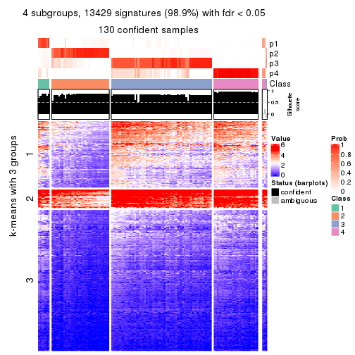</p>

</div>
<div id='tab-MAD-mclust-get-signatures-no-scale-4'>
<pre><code class="r">get_signatures(res, k = 5, scale_rows = FALSE)
</code></pre>

<p></p>

</div>
<div id='tab-MAD-mclust-get-signatures-no-scale-5'>
<pre><code class="r">get_signatures(res, k = 6, scale_rows = FALSE)
</code></pre>

<p></p>

</div>
</div>


Compare the overlap of signatures from different k:

```r
compare_signatures(res)
```


`get_signature()` returns a data frame invisibly. TO get the list of signatures, the function
call should be assigned to a variable explicitly. In following code, if `plot` argument is set
to `FALSE`, no heatmap is plotted while only the differential analysis is performed.

```r
# code only for demonstration
tb = get_signature(res, k = ..., plot = FALSE)
```

An example of the output of `tb` is:

```
#>   which_row         fdr    mean_1    mean_2 scaled_mean_1 scaled_mean_2 km
#> 1        38 0.042760348  8.373488  9.131774    -0.5533452     0.5164555  1
#> 2        40 0.018707592  7.106213  8.469186    -0.6173731     0.5762149  1
#> 3        55 0.019134737 10.221463 11.207825    -0.6159697     0.5749050  1
#> 4        59 0.006059896  5.921854  7.869574    -0.6899429     0.6439467  1
#> 5        60 0.018055526  8.928898 10.211722    -0.6204761     0.5791110  1
#> 6        98 0.009384629 15.714769 14.887706     0.6635654    -0.6193277  2
...
```

The columns in `tb` are:

1. `which_row`: row indices corresponding to the input matrix.
2. `fdr`: FDR for the differential test. 
3. `mean_x`: The mean value in group x.
4. `scaled_mean_x`: The mean value in group x after rows are scaled.
5. `km`: Row groups if k-means clustering is applied to rows.


UMAP plot which shows how samples are separated.


<script>
$( function() {
	$( '#tabs-MAD-mclust-dimension-reduction' ).tabs();
} );
</script>
<div id='tabs-MAD-mclust-dimension-reduction'>
<ul>
<li><a href='#tab-MAD-mclust-dimension-reduction-1'>k = 2</a></li>
<li><a href='#tab-MAD-mclust-dimension-reduction-2'>k = 3</a></li>
<li><a href='#tab-MAD-mclust-dimension-reduction-3'>k = 4</a></li>
<li><a href='#tab-MAD-mclust-dimension-reduction-4'>k = 5</a></li>
<li><a href='#tab-MAD-mclust-dimension-reduction-5'>k = 6</a></li>
</ul>
<div id='tab-MAD-mclust-dimension-reduction-1'>
<pre><code class="r">dimension_reduction(res, k = 2, method = &quot;UMAP&quot;)
</code></pre>

<p></p>

</div>
<div id='tab-MAD-mclust-dimension-reduction-2'>
<pre><code class="r">dimension_reduction(res, k = 3, method = &quot;UMAP&quot;)
</code></pre>

<p></p>

</div>
<div id='tab-MAD-mclust-dimension-reduction-3'>
<pre><code class="r">dimension_reduction(res, k = 4, method = &quot;UMAP&quot;)
</code></pre>

<p></p>

</div>
<div id='tab-MAD-mclust-dimension-reduction-4'>
<pre><code class="r">dimension_reduction(res, k = 5, method = &quot;UMAP&quot;)
</code></pre>

<p></p>

</div>
<div id='tab-MAD-mclust-dimension-reduction-5'>
<pre><code class="r">dimension_reduction(res, k = 6, method = &quot;UMAP&quot;)
</code></pre>

<p></p>

</div>
</div>


Following heatmap shows how subgroups are split when increasing `k`:

```r
collect_classes(res)
```


If matrix rows can be associated to genes, consider to use `functional_enrichment(res,
...)` to perform function enrichment for the signature genes. See [this vignette](http://bioconductor.org/packages/devel/bioc/vignettes/cola/inst/doc/functional_enrichment.html) for more detailed explanations.


 

---------------------------------------------------


### MAD:NMF


The object with results only for a single top-value method and a single partition method 
can be extracted as:

```r
res = res_list["MAD", "NMF"]
# you can also extract it by
# res = res_list["MAD:NMF"]
```

A summary of `res` and all the functions that can be applied to it:

```r
res
```

```
#> A 'ConsensusPartition' object with k = 2, 3, 4, 5, 6.
#>   On a matrix with 13580 rows and 133 columns.
#>   Top rows (1000, 2000, 3000, 4000, 5000) are extracted by 'MAD' method.
#>   Subgroups are detected by 'NMF' method.
#>   Performed in total 1250 partitions by row resampling.
#>   Best k for subgroups seems to be 2.
#> 
#> Following methods can be applied to this 'ConsensusPartition' object:
#>  [1] "cola_report"             "collect_classes"         "collect_plots"          
#>  [4] "collect_stats"           "colnames"                "compare_signatures"     
#>  [7] "consensus_heatmap"       "dimension_reduction"     "functional_enrichment"  
#> [10] "get_anno_col"            "get_anno"                "get_classes"            
#> [13] "get_consensus"           "get_matrix"              "get_membership"         
#> [16] "get_param"               "get_signatures"          "get_stats"              
#> [19] "is_best_k"               "is_stable_k"             "membership_heatmap"     
#> [22] "ncol"                    "nrow"                    "plot_ecdf"              
#> [25] "rownames"                "select_partition_number" "show"                   
#> [28] "suggest_best_k"          "test_to_known_factors"
```

`collect_plots()` function collects all the plots made from `res` for all `k` (number of partitions)
into one single page to provide an easy and fast comparison between different `k`.

```r
collect_plots(res)
```


The plots are:

- The first row: a plot of the ECDF (empirical cumulative distribution
  function) curves of the consensus matrix for each `k` and the heatmap of
  predicted classes for each `k`.
- The second row: heatmaps of the consensus matrix for each `k`.
- The third row: heatmaps of the membership matrix for each `k`.
- The fouth row: heatmaps of the signatures for each `k`.

All the plots in panels can be made by individual functions and they are
plotted later in this section.

`select_partition_number()` produces several plots showing different
statistics for choosing "optimized" `k`. There are following statistics:

- ECDF curves of the consensus matrix for each `k`;
- 1-PAC. [The PAC
  score](https://en.wikipedia.org/wiki/Consensus_clustering#Over-interpretation_potential_of_consensus_clustering)
  measures the proportion of the ambiguous subgrouping.
- Mean silhouette score.
- Concordance. The mean probability of fiting the consensus class ids in all
  partitions.
- Area increased. Denote $A_k$ as the area under the ECDF curve for current
  `k`, the area increased is defined as $A_k - A_{k-1}$.
- Rand index. The percent of pairs of samples that are both in a same cluster
  or both are not in a same cluster in the partition of k and k-1.
- Jaccard index. The ratio of pairs of samples are both in a same cluster in
  the partition of k and k-1 and the pairs of samples are both in a same
  cluster in the partition k or k-1.

The detailed explanations of these statistics can be found in [the _cola_
vignette](http://bioconductor.org/packages/devel/bioc/vignettes/cola/inst/doc/cola.html#toc_13).

Generally speaking, lower PAC score, higher mean silhouette score or higher
concordance corresponds to better partition. Rand index and Jaccard index
measure how similar the current partition is compared to partition with `k-1`.
If they are too similar, we won't accept `k` is better than `k-1`.

```r
select_partition_number(res)
```


The numeric values for all these statistics can be obtained by `get_stats()`.

```r
get_stats(res)
```

```
#>   k 1-PAC mean_silhouette concordance area_increased  Rand Jaccard
#> 2 2 0.743           0.879       0.947         0.4915 0.506   0.506
#> 3 3 0.774           0.829       0.923         0.2735 0.795   0.620
#> 4 4 0.643           0.663       0.844         0.1511 0.807   0.538
#> 5 5 0.642           0.679       0.821         0.0816 0.839   0.503
#> 6 6 0.641           0.642       0.782         0.0457 0.919   0.662
```

`suggest_best_k()` suggests the best $k$ based on these statistics. The rules are as follows:

- All $k$ with Jaccard index larger than 0.95 are removed because increasing
  $k$ does not provide enough extra information. If all $k$ are removed, it is
  marked as no subgroup is detected.
- For all $k$ with 1-PAC score larger than 0.9, the maximal $k$ is taken as
  the best $k$, and other $k$ are marked as optional $k$.
- If it does not fit the second rule. The $k$ with the maximal vote of the
  highest 1-PAC score, highest mean silhouette, and highest concordance is
  taken as the best $k$.

```r
suggest_best_k(res)
```

```
#> [1] 2
```


Following shows the table of the partitions (You need to click the **show/hide
code output** link to see it). The membership matrix (columns with name `p*`)
is inferred by
[`clue::cl_consensus()`](https://www.rdocumentation.org/link/cl_consensus?package=clue)
function with the `SE` method. Basically the value in the membership matrix
represents the probability to belong to a certain group. The finall class
label for an item is determined with the group with highest probability it
belongs to.

In `get_classes()` function, the entropy is calculated from the membership
matrix and the silhouette score is calculated from the consensus matrix.


<script>
$( function() {
	$( '#tabs-MAD-NMF-get-classes' ).tabs();
} );
</script>
<div id='tabs-MAD-NMF-get-classes'>
<ul>
<li><a href='#tab-MAD-NMF-get-classes-1'>k = 2</a></li>
<li><a href='#tab-MAD-NMF-get-classes-2'>k = 3</a></li>
<li><a href='#tab-MAD-NMF-get-classes-3'>k = 4</a></li>
<li><a href='#tab-MAD-NMF-get-classes-4'>k = 5</a></li>
<li><a href='#tab-MAD-NMF-get-classes-5'>k = 6</a></li>
</ul>

<div id='tab-MAD-NMF-get-classes-1'>
<p><a id='tab-MAD-NMF-get-classes-1-a' style='color:#0366d6' href='#'>show/hide code output</a></p>
<pre><code class="r">cbind(get_classes(res, k = 2), get_membership(res, k = 2))
</code></pre>

<pre><code>#&gt;            class entropy silhouette    p1    p2
#&gt; SRR1951667     1  0.3879      0.892 0.924 0.076
#&gt; SRR1951666     1  0.0000      0.946 1.000 0.000
#&gt; SRR1951665     2  0.5059      0.842 0.112 0.888
#&gt; SRR1951664     1  0.0000      0.946 1.000 0.000
#&gt; SRR1951663     2  0.0000      0.936 0.000 1.000
#&gt; SRR1951662     2  0.9427      0.482 0.360 0.640
#&gt; SRR1951661     1  0.0000      0.946 1.000 0.000
#&gt; SRR1951660     2  0.0000      0.936 0.000 1.000
#&gt; SRR1951659     1  0.0000      0.946 1.000 0.000
#&gt; SRR1951658     1  0.0000      0.946 1.000 0.000
#&gt; SRR1951657     1  0.0000      0.946 1.000 0.000
#&gt; SRR1951656     1  0.0000      0.946 1.000 0.000
#&gt; SRR1951655     2  0.0000      0.936 0.000 1.000
#&gt; SRR1951654     2  0.0000      0.936 0.000 1.000
#&gt; SRR1951653     1  0.6973      0.783 0.812 0.188
#&gt; SRR1951652     1  0.7815      0.667 0.768 0.232
#&gt; SRR1951651     1  0.1414      0.934 0.980 0.020
#&gt; SRR1951650     1  0.0000      0.946 1.000 0.000
#&gt; SRR1951648     1  0.0000      0.946 1.000 0.000
#&gt; SRR1951649     2  0.9933      0.126 0.452 0.548
#&gt; SRR1951647     1  0.0376      0.944 0.996 0.004
#&gt; SRR1951646     1  0.0000      0.946 1.000 0.000
#&gt; SRR1951645     2  0.8443      0.606 0.272 0.728
#&gt; SRR1951644     2  0.0000      0.936 0.000 1.000
#&gt; SRR1951643     1  0.0376      0.944 0.996 0.004
#&gt; SRR1951641     2  0.0000      0.936 0.000 1.000
#&gt; SRR1951642     1  0.0000      0.946 1.000 0.000
#&gt; SRR1951694     2  0.0000      0.936 0.000 1.000
#&gt; SRR1951731     1  0.0000      0.946 1.000 0.000
#&gt; SRR1951730     2  0.9775      0.264 0.412 0.588
#&gt; SRR1951752     2  0.9977      0.168 0.472 0.528
#&gt; SRR1951751     2  0.0000      0.936 0.000 1.000
#&gt; SRR1951749     1  0.0000      0.946 1.000 0.000
#&gt; SRR1951750     2  0.0000      0.936 0.000 1.000
#&gt; SRR1951748     2  0.4161      0.869 0.084 0.916
#&gt; SRR1951747     2  0.1414      0.922 0.020 0.980
#&gt; SRR1951745     2  0.0000      0.936 0.000 1.000
#&gt; SRR1951746     1  0.0000      0.946 1.000 0.000
#&gt; SRR1951744     1  0.0000      0.946 1.000 0.000
#&gt; SRR1951742     1  0.0000      0.946 1.000 0.000
#&gt; SRR1951743     2  0.0000      0.936 0.000 1.000
#&gt; SRR1951741     2  0.0000      0.936 0.000 1.000
#&gt; SRR1951740     1  0.0000      0.946 1.000 0.000
#&gt; SRR1951738     2  0.0000      0.936 0.000 1.000
#&gt; SRR1951739     1  0.0000      0.946 1.000 0.000
#&gt; SRR1951737     1  0.0000      0.946 1.000 0.000
#&gt; SRR1951736     2  0.0000      0.936 0.000 1.000
#&gt; SRR1951734     2  0.0000      0.936 0.000 1.000
#&gt; SRR1951735     1  0.0000      0.946 1.000 0.000
#&gt; SRR1951733     1  0.0000      0.946 1.000 0.000
#&gt; SRR1951732     1  0.0000      0.946 1.000 0.000
#&gt; SRR1951729     1  0.0000      0.946 1.000 0.000
#&gt; SRR1951728     1  0.1633      0.931 0.976 0.024
#&gt; SRR1951727     2  0.7745      0.706 0.228 0.772
#&gt; SRR1951725     2  0.0000      0.936 0.000 1.000
#&gt; SRR1951726     2  0.4431      0.867 0.092 0.908
#&gt; SRR1951724     2  0.9608      0.345 0.384 0.616
#&gt; SRR1951722     1  0.9635      0.416 0.612 0.388
#&gt; SRR1951723     1  0.9552      0.447 0.624 0.376
#&gt; SRR1951721     2  0.0000      0.936 0.000 1.000
#&gt; SRR1951719     1  0.0000      0.946 1.000 0.000
#&gt; SRR1951720     2  0.0000      0.936 0.000 1.000
#&gt; SRR1951718     2  0.0000      0.936 0.000 1.000
#&gt; SRR1951717     2  0.0000      0.936 0.000 1.000
#&gt; SRR1951715     2  0.0000      0.936 0.000 1.000
#&gt; SRR1951716     2  0.0000      0.936 0.000 1.000
#&gt; SRR1951714     1  0.4815      0.868 0.896 0.104
#&gt; SRR1951713     1  0.7299      0.764 0.796 0.204
#&gt; SRR1951712     2  0.0000      0.936 0.000 1.000
#&gt; SRR1951711     2  0.0000      0.936 0.000 1.000
#&gt; SRR1951710     2  0.0000      0.936 0.000 1.000
#&gt; SRR1951709     1  0.0000      0.946 1.000 0.000
#&gt; SRR1951708     2  0.0376      0.933 0.004 0.996
#&gt; SRR1951707     1  0.7219      0.769 0.800 0.200
#&gt; SRR1951705     2  0.0000      0.936 0.000 1.000
#&gt; SRR1951704     1  0.0000      0.946 1.000 0.000
#&gt; SRR1951703     2  0.7528      0.722 0.216 0.784
#&gt; SRR1951706     1  0.0000      0.946 1.000 0.000
#&gt; SRR1951702     1  0.0000      0.946 1.000 0.000
#&gt; SRR1951701     1  0.0000      0.946 1.000 0.000
#&gt; SRR1951699     1  0.0000      0.946 1.000 0.000
#&gt; SRR1951698     1  0.0000      0.946 1.000 0.000
#&gt; SRR1951700     1  0.9000      0.580 0.684 0.316
#&gt; SRR1951697     1  0.0000      0.946 1.000 0.000
#&gt; SRR1951696     1  0.0000      0.946 1.000 0.000
#&gt; SRR1951695     1  0.0000      0.946 1.000 0.000
#&gt; SRR1951693     1  0.7453      0.754 0.788 0.212
#&gt; SRR1951692     1  0.0000      0.946 1.000 0.000
#&gt; SRR1951691     2  0.2236      0.908 0.036 0.964
#&gt; SRR1951688     2  0.0000      0.936 0.000 1.000
#&gt; SRR1951689     2  0.0000      0.936 0.000 1.000
#&gt; SRR1951687     2  0.6801      0.755 0.180 0.820
#&gt; SRR1951685     1  0.7602      0.743 0.780 0.220
#&gt; SRR1951684     1  0.0000      0.946 1.000 0.000
#&gt; SRR1951686     1  0.0000      0.946 1.000 0.000
#&gt; SRR1951683     1  0.7139      0.774 0.804 0.196
#&gt; SRR1951682     2  0.0000      0.936 0.000 1.000
#&gt; SRR1951690     1  0.7219      0.769 0.800 0.200
#&gt; SRR1951680     1  0.0938      0.939 0.988 0.012
#&gt; SRR1951679     2  0.0000      0.936 0.000 1.000
#&gt; SRR1951678     1  0.0000      0.946 1.000 0.000
#&gt; SRR1951677     1  0.0000      0.946 1.000 0.000
#&gt; SRR1951676     1  0.0000      0.946 1.000 0.000
#&gt; SRR1951675     2  0.0000      0.936 0.000 1.000
#&gt; SRR1951681     1  0.0000      0.946 1.000 0.000
#&gt; SRR1951673     2  0.0000      0.936 0.000 1.000
#&gt; SRR1951674     2  0.0000      0.936 0.000 1.000
#&gt; SRR1951672     2  0.0000      0.936 0.000 1.000
#&gt; SRR1951671     1  0.0000      0.946 1.000 0.000
#&gt; SRR1951670     2  0.0000      0.936 0.000 1.000
#&gt; SRR1951640     1  0.0000      0.946 1.000 0.000
#&gt; SRR1951668     1  0.8267      0.682 0.740 0.260
#&gt; SRR1951669     2  0.0000      0.936 0.000 1.000
#&gt; SRR1951638     2  0.0000      0.936 0.000 1.000
#&gt; SRR1951637     2  0.0000      0.936 0.000 1.000
#&gt; SRR1951635     2  0.0000      0.936 0.000 1.000
#&gt; SRR1951634     1  0.7139      0.774 0.804 0.196
#&gt; SRR1951631     1  0.3879      0.892 0.924 0.076
#&gt; SRR1951632     1  0.0000      0.946 1.000 0.000
#&gt; SRR1951633     1  0.0000      0.946 1.000 0.000
#&gt; SRR1951630     1  0.0000      0.946 1.000 0.000
#&gt; SRR1951629     1  0.0000      0.946 1.000 0.000
#&gt; SRR1951628     2  0.0000      0.936 0.000 1.000
#&gt; SRR1951627     1  0.0000      0.946 1.000 0.000
#&gt; SRR1951639     1  0.0000      0.946 1.000 0.000
#&gt; SRR1951625     1  0.6973      0.783 0.812 0.188
#&gt; SRR1951626     1  0.0000      0.946 1.000 0.000
#&gt; SRR1951624     1  0.0000      0.946 1.000 0.000
#&gt; SRR1951622     2  0.0000      0.936 0.000 1.000
#&gt; SRR1951636     1  0.0000      0.946 1.000 0.000
#&gt; SRR1951623     1  0.0000      0.946 1.000 0.000
#&gt; SRR1951621     2  0.0000      0.936 0.000 1.000
#&gt; SRR1951620     1  0.0000      0.946 1.000 0.000
</code></pre>

<script>
$('#tab-MAD-NMF-get-classes-1-a').parent().next().next().hide();
$('#tab-MAD-NMF-get-classes-1-a').click(function(){
  $('#tab-MAD-NMF-get-classes-1-a').parent().next().next().toggle();
  return(false);
});
</script>
</div>

<div id='tab-MAD-NMF-get-classes-2'>
<p><a id='tab-MAD-NMF-get-classes-2-a' style='color:#0366d6' href='#'>show/hide code output</a></p>
<pre><code class="r">cbind(get_classes(res, k = 3), get_membership(res, k = 3))
</code></pre>

<pre><code>#&gt;            class entropy silhouette    p1    p2    p3
#&gt; SRR1951667     3  0.2066     0.8928 0.060 0.000 0.940
#&gt; SRR1951666     3  0.1860     0.8828 0.000 0.052 0.948
#&gt; SRR1951665     2  0.0000     0.8637 0.000 1.000 0.000
#&gt; SRR1951664     3  0.0747     0.9130 0.016 0.000 0.984
#&gt; SRR1951663     2  0.3941     0.7550 0.156 0.844 0.000
#&gt; SRR1951662     2  0.0237     0.8635 0.000 0.996 0.004
#&gt; SRR1951661     3  0.2711     0.8549 0.000 0.088 0.912
#&gt; SRR1951660     1  0.0237     0.9292 0.996 0.000 0.004
#&gt; SRR1951659     3  0.2165     0.8737 0.000 0.064 0.936
#&gt; SRR1951658     2  0.2625     0.8290 0.000 0.916 0.084
#&gt; SRR1951657     3  0.0000     0.9128 0.000 0.000 1.000
#&gt; SRR1951656     3  0.0892     0.9123 0.020 0.000 0.980
#&gt; SRR1951655     1  0.0747     0.9253 0.984 0.000 0.016
#&gt; SRR1951654     1  0.4235     0.7603 0.824 0.176 0.000
#&gt; SRR1951653     3  0.4654     0.7548 0.208 0.000 0.792
#&gt; SRR1951652     2  0.0424     0.8631 0.000 0.992 0.008
#&gt; SRR1951651     3  0.1860     0.8977 0.052 0.000 0.948
#&gt; SRR1951650     3  0.0000     0.9128 0.000 0.000 1.000
#&gt; SRR1951648     3  0.0000     0.9128 0.000 0.000 1.000
#&gt; SRR1951649     1  0.2261     0.8829 0.932 0.000 0.068
#&gt; SRR1951647     3  0.2448     0.8809 0.076 0.000 0.924
#&gt; SRR1951646     3  0.0000     0.9128 0.000 0.000 1.000
#&gt; SRR1951645     1  0.2165     0.8867 0.936 0.000 0.064
#&gt; SRR1951644     1  0.0592     0.9270 0.988 0.000 0.012
#&gt; SRR1951643     3  0.0592     0.9138 0.012 0.000 0.988
#&gt; SRR1951641     1  0.0237     0.9292 0.996 0.000 0.004
#&gt; SRR1951642     3  0.0592     0.9075 0.000 0.012 0.988
#&gt; SRR1951694     1  0.0424     0.9261 0.992 0.008 0.000
#&gt; SRR1951731     3  0.1031     0.9110 0.024 0.000 0.976
#&gt; SRR1951730     2  0.9398     0.1737 0.172 0.428 0.400
#&gt; SRR1951752     2  0.8595     0.5641 0.180 0.604 0.216
#&gt; SRR1951751     1  0.1031     0.9205 0.976 0.000 0.024
#&gt; SRR1951749     3  0.0000     0.9128 0.000 0.000 1.000
#&gt; SRR1951750     1  0.0424     0.9285 0.992 0.000 0.008
#&gt; SRR1951748     2  0.0000     0.8637 0.000 1.000 0.000
#&gt; SRR1951747     2  0.0000     0.8637 0.000 1.000 0.000
#&gt; SRR1951745     2  0.0747     0.8609 0.016 0.984 0.000
#&gt; SRR1951746     2  0.1643     0.8536 0.000 0.956 0.044
#&gt; SRR1951744     2  0.6308     0.0322 0.000 0.508 0.492
#&gt; SRR1951742     3  0.2356     0.8671 0.000 0.072 0.928
#&gt; SRR1951743     2  0.4346     0.7193 0.184 0.816 0.000
#&gt; SRR1951741     1  0.0237     0.9278 0.996 0.004 0.000
#&gt; SRR1951740     3  0.1163     0.9095 0.028 0.000 0.972
#&gt; SRR1951738     1  0.1860     0.8979 0.948 0.052 0.000
#&gt; SRR1951739     3  0.0892     0.9123 0.020 0.000 0.980
#&gt; SRR1951737     3  0.0000     0.9128 0.000 0.000 1.000
#&gt; SRR1951736     1  0.0000     0.9288 1.000 0.000 0.000
#&gt; SRR1951734     2  0.2261     0.8330 0.068 0.932 0.000
#&gt; SRR1951735     3  0.0892     0.9123 0.020 0.000 0.980
#&gt; SRR1951733     3  0.0000     0.9128 0.000 0.000 1.000
#&gt; SRR1951732     2  0.1289     0.8569 0.000 0.968 0.032
#&gt; SRR1951729     3  0.0592     0.9134 0.012 0.000 0.988
#&gt; SRR1951728     3  0.1643     0.9023 0.044 0.000 0.956
#&gt; SRR1951727     2  0.0000     0.8637 0.000 1.000 0.000
#&gt; SRR1951725     1  0.1643     0.9041 0.956 0.044 0.000
#&gt; SRR1951726     2  0.1529     0.8515 0.040 0.960 0.000
#&gt; SRR1951724     1  0.1529     0.9085 0.960 0.000 0.040
#&gt; SRR1951722     1  0.3879     0.7824 0.848 0.000 0.152
#&gt; SRR1951723     1  0.2356     0.8791 0.928 0.000 0.072
#&gt; SRR1951721     1  0.5216     0.6257 0.740 0.260 0.000
#&gt; SRR1951719     3  0.0892     0.9123 0.020 0.000 0.980
#&gt; SRR1951720     1  0.0424     0.9261 0.992 0.008 0.000
#&gt; SRR1951718     1  0.0892     0.9231 0.980 0.000 0.020
#&gt; SRR1951717     1  0.0424     0.9261 0.992 0.008 0.000
#&gt; SRR1951715     1  0.1289     0.9120 0.968 0.032 0.000
#&gt; SRR1951716     1  0.0000     0.9288 1.000 0.000 0.000
#&gt; SRR1951714     3  0.3412     0.8371 0.124 0.000 0.876
#&gt; SRR1951713     3  0.6244     0.2938 0.440 0.000 0.560
#&gt; SRR1951712     1  0.0892     0.9231 0.980 0.000 0.020
#&gt; SRR1951711     2  0.6252     0.1748 0.444 0.556 0.000
#&gt; SRR1951710     1  0.0237     0.9278 0.996 0.004 0.000
#&gt; SRR1951709     3  0.0892     0.9040 0.000 0.020 0.980
#&gt; SRR1951708     2  0.0747     0.8610 0.016 0.984 0.000
#&gt; SRR1951707     3  0.4931     0.7255 0.232 0.000 0.768
#&gt; SRR1951705     1  0.0000     0.9288 1.000 0.000 0.000
#&gt; SRR1951704     3  0.4842     0.6966 0.000 0.224 0.776
#&gt; SRR1951703     2  0.0000     0.8637 0.000 1.000 0.000
#&gt; SRR1951706     2  0.1860     0.8494 0.000 0.948 0.052
#&gt; SRR1951702     3  0.5016     0.6711 0.000 0.240 0.760
#&gt; SRR1951701     3  0.0237     0.9132 0.004 0.000 0.996
#&gt; SRR1951699     3  0.1411     0.8946 0.000 0.036 0.964
#&gt; SRR1951698     3  0.0237     0.9113 0.000 0.004 0.996
#&gt; SRR1951700     1  0.6295    -0.0152 0.528 0.000 0.472
#&gt; SRR1951697     2  0.1753     0.8514 0.000 0.952 0.048
#&gt; SRR1951696     3  0.0000     0.9128 0.000 0.000 1.000
#&gt; SRR1951695     3  0.1031     0.9112 0.024 0.000 0.976
#&gt; SRR1951693     3  0.5760     0.5726 0.328 0.000 0.672
#&gt; SRR1951692     3  0.0747     0.9130 0.016 0.000 0.984
#&gt; SRR1951691     1  0.0747     0.9258 0.984 0.000 0.016
#&gt; SRR1951688     2  0.0747     0.8608 0.016 0.984 0.000
#&gt; SRR1951689     1  0.0424     0.9285 0.992 0.000 0.008
#&gt; SRR1951687     1  0.6295     0.6299 0.728 0.036 0.236
#&gt; SRR1951685     3  0.6192     0.3559 0.420 0.000 0.580
#&gt; SRR1951684     3  0.0892     0.9123 0.020 0.000 0.980
#&gt; SRR1951686     2  0.6225     0.2532 0.000 0.568 0.432
#&gt; SRR1951683     3  0.4887     0.7296 0.228 0.000 0.772
#&gt; SRR1951682     1  0.0424     0.9285 0.992 0.000 0.008
#&gt; SRR1951690     3  0.6291     0.2016 0.468 0.000 0.532
#&gt; SRR1951680     3  0.2356     0.8841 0.072 0.000 0.928
#&gt; SRR1951679     1  0.0000     0.9288 1.000 0.000 0.000
#&gt; SRR1951678     3  0.0747     0.9130 0.016 0.000 0.984
#&gt; SRR1951677     3  0.0000     0.9128 0.000 0.000 1.000
#&gt; SRR1951676     3  0.0747     0.9064 0.000 0.016 0.984
#&gt; SRR1951675     1  0.1643     0.9046 0.956 0.044 0.000
#&gt; SRR1951681     3  0.0000     0.9128 0.000 0.000 1.000
#&gt; SRR1951673     1  0.0237     0.9292 0.996 0.000 0.004
#&gt; SRR1951674     2  0.0237     0.8632 0.004 0.996 0.000
#&gt; SRR1951672     1  0.0237     0.9292 0.996 0.000 0.004
#&gt; SRR1951671     3  0.0747     0.9134 0.016 0.000 0.984
#&gt; SRR1951670     1  0.0000     0.9288 1.000 0.000 0.000
#&gt; SRR1951640     3  0.1163     0.9095 0.028 0.000 0.972
#&gt; SRR1951668     1  0.5254     0.6217 0.736 0.000 0.264
#&gt; SRR1951669     2  0.2261     0.8336 0.068 0.932 0.000
#&gt; SRR1951638     1  0.1411     0.9097 0.964 0.036 0.000
#&gt; SRR1951637     1  0.3267     0.8346 0.884 0.116 0.000
#&gt; SRR1951635     1  0.1289     0.9120 0.968 0.032 0.000
#&gt; SRR1951634     3  0.6079     0.4364 0.388 0.000 0.612
#&gt; SRR1951631     3  0.2711     0.8721 0.088 0.000 0.912
#&gt; SRR1951632     3  0.0000     0.9128 0.000 0.000 1.000
#&gt; SRR1951633     3  0.1411     0.8944 0.000 0.036 0.964
#&gt; SRR1951630     3  0.0000     0.9128 0.000 0.000 1.000
#&gt; SRR1951629     3  0.0892     0.9123 0.020 0.000 0.980
#&gt; SRR1951628     1  0.0237     0.9292 0.996 0.000 0.004
#&gt; SRR1951627     3  0.1163     0.8994 0.000 0.028 0.972
#&gt; SRR1951639     3  0.0000     0.9128 0.000 0.000 1.000
#&gt; SRR1951625     3  0.4750     0.7455 0.216 0.000 0.784
#&gt; SRR1951626     3  0.0000     0.9128 0.000 0.000 1.000
#&gt; SRR1951624     3  0.0000     0.9128 0.000 0.000 1.000
#&gt; SRR1951622     1  0.0000     0.9288 1.000 0.000 0.000
#&gt; SRR1951636     3  0.0000     0.9128 0.000 0.000 1.000
#&gt; SRR1951623     3  0.2625     0.8583 0.000 0.084 0.916
#&gt; SRR1951621     1  0.0000     0.9288 1.000 0.000 0.000
#&gt; SRR1951620     3  0.0592     0.9134 0.012 0.000 0.988
</code></pre>

<script>
$('#tab-MAD-NMF-get-classes-2-a').parent().next().next().hide();
$('#tab-MAD-NMF-get-classes-2-a').click(function(){
  $('#tab-MAD-NMF-get-classes-2-a').parent().next().next().toggle();
  return(false);
});
</script>
</div>

<div id='tab-MAD-NMF-get-classes-3'>
<p><a id='tab-MAD-NMF-get-classes-3-a' style='color:#0366d6' href='#'>show/hide code output</a></p>
<pre><code class="r">cbind(get_classes(res, k = 4), get_membership(res, k = 4))
</code></pre>

<pre><code>#&gt;            class entropy silhouette    p1    p2    p3    p4
#&gt; SRR1951667     4  0.1109     0.7317 0.004 0.000 0.028 0.968
#&gt; SRR1951666     3  0.0469     0.8604 0.000 0.012 0.988 0.000
#&gt; SRR1951665     2  0.0336     0.8176 0.008 0.992 0.000 0.000
#&gt; SRR1951664     3  0.4761     0.3925 0.000 0.000 0.628 0.372
#&gt; SRR1951663     1  0.3688     0.5990 0.792 0.208 0.000 0.000
#&gt; SRR1951662     2  0.0188     0.8166 0.000 0.996 0.000 0.004
#&gt; SRR1951661     3  0.1610     0.8501 0.000 0.032 0.952 0.016
#&gt; SRR1951660     1  0.1284     0.8071 0.964 0.000 0.012 0.024
#&gt; SRR1951659     3  0.3962     0.7489 0.000 0.152 0.820 0.028
#&gt; SRR1951658     3  0.5363     0.3770 0.004 0.372 0.612 0.012
#&gt; SRR1951657     3  0.0469     0.8621 0.000 0.000 0.988 0.012
#&gt; SRR1951656     3  0.1474     0.8519 0.000 0.000 0.948 0.052
#&gt; SRR1951655     1  0.1174     0.8077 0.968 0.000 0.012 0.020
#&gt; SRR1951654     1  0.1767     0.7850 0.944 0.044 0.012 0.000
#&gt; SRR1951653     4  0.5620     0.3134 0.024 0.000 0.416 0.560
#&gt; SRR1951652     2  0.5070     0.3080 0.004 0.580 0.416 0.000
#&gt; SRR1951651     3  0.0707     0.8607 0.000 0.000 0.980 0.020
#&gt; SRR1951650     3  0.0336     0.8615 0.000 0.000 0.992 0.008
#&gt; SRR1951648     3  0.0469     0.8610 0.000 0.000 0.988 0.012
#&gt; SRR1951649     4  0.5432     0.4746 0.316 0.000 0.032 0.652
#&gt; SRR1951647     4  0.5466     0.2554 0.016 0.000 0.436 0.548
#&gt; SRR1951646     3  0.0921     0.8535 0.000 0.000 0.972 0.028
#&gt; SRR1951645     1  0.6389    -0.0575 0.488 0.000 0.064 0.448
#&gt; SRR1951644     4  0.5277     0.1149 0.460 0.000 0.008 0.532
#&gt; SRR1951643     3  0.0336     0.8622 0.000 0.000 0.992 0.008
#&gt; SRR1951641     4  0.4761     0.4236 0.332 0.000 0.004 0.664
#&gt; SRR1951642     3  0.0672     0.8605 0.000 0.008 0.984 0.008
#&gt; SRR1951694     1  0.0469     0.8089 0.988 0.000 0.000 0.012
#&gt; SRR1951731     4  0.3105     0.7093 0.004 0.000 0.140 0.856
#&gt; SRR1951730     2  0.4122     0.7619 0.008 0.840 0.096 0.056
#&gt; SRR1951752     2  0.4314     0.7671 0.032 0.844 0.060 0.064
#&gt; SRR1951751     4  0.1211     0.7289 0.040 0.000 0.000 0.960
#&gt; SRR1951749     3  0.5108     0.5790 0.000 0.020 0.672 0.308
#&gt; SRR1951750     1  0.3074     0.7316 0.848 0.000 0.000 0.152
#&gt; SRR1951748     2  0.0336     0.8176 0.008 0.992 0.000 0.000
#&gt; SRR1951747     2  0.0336     0.8176 0.008 0.992 0.000 0.000
#&gt; SRR1951745     1  0.4977    -0.0127 0.540 0.460 0.000 0.000
#&gt; SRR1951746     2  0.4079     0.7093 0.000 0.800 0.020 0.180
#&gt; SRR1951744     3  0.2402     0.8260 0.000 0.076 0.912 0.012
#&gt; SRR1951742     3  0.1209     0.8542 0.000 0.032 0.964 0.004
#&gt; SRR1951743     2  0.3300     0.7521 0.008 0.848 0.000 0.144
#&gt; SRR1951741     1  0.0657     0.8077 0.984 0.004 0.012 0.000
#&gt; SRR1951740     3  0.4018     0.6905 0.004 0.000 0.772 0.224
#&gt; SRR1951738     1  0.0937     0.8084 0.976 0.012 0.000 0.012
#&gt; SRR1951739     4  0.1302     0.7311 0.000 0.000 0.044 0.956
#&gt; SRR1951737     3  0.3831     0.7216 0.000 0.004 0.792 0.204
#&gt; SRR1951736     1  0.4500     0.5174 0.684 0.000 0.000 0.316
#&gt; SRR1951734     2  0.4431     0.6584 0.004 0.740 0.004 0.252
#&gt; SRR1951735     3  0.2081     0.8272 0.000 0.000 0.916 0.084
#&gt; SRR1951733     3  0.1661     0.8488 0.000 0.004 0.944 0.052
#&gt; SRR1951732     2  0.0524     0.8159 0.000 0.988 0.008 0.004
#&gt; SRR1951729     3  0.5097     0.2968 0.000 0.004 0.568 0.428
#&gt; SRR1951728     3  0.5334     0.1127 0.004 0.004 0.508 0.484
#&gt; SRR1951727     2  0.0000     0.8171 0.000 1.000 0.000 0.000
#&gt; SRR1951725     1  0.0524     0.8060 0.988 0.008 0.000 0.004
#&gt; SRR1951726     1  0.7077     0.2622 0.536 0.148 0.316 0.000
#&gt; SRR1951724     1  0.5483     0.1562 0.536 0.000 0.016 0.448
#&gt; SRR1951722     4  0.4088     0.5878 0.232 0.000 0.004 0.764
#&gt; SRR1951723     4  0.2197     0.7189 0.080 0.000 0.004 0.916
#&gt; SRR1951721     1  0.1902     0.7753 0.932 0.064 0.000 0.004
#&gt; SRR1951719     4  0.4925     0.1368 0.000 0.000 0.428 0.572
#&gt; SRR1951720     1  0.0188     0.8083 0.996 0.000 0.000 0.004
#&gt; SRR1951718     1  0.3962     0.7104 0.820 0.000 0.028 0.152
#&gt; SRR1951717     1  0.1557     0.8006 0.944 0.000 0.000 0.056
#&gt; SRR1951715     1  0.0469     0.8082 0.988 0.000 0.000 0.012
#&gt; SRR1951716     1  0.3498     0.7078 0.832 0.000 0.008 0.160
#&gt; SRR1951714     3  0.2222     0.8250 0.060 0.000 0.924 0.016
#&gt; SRR1951713     4  0.1356     0.7350 0.032 0.000 0.008 0.960
#&gt; SRR1951712     4  0.2011     0.7102 0.080 0.000 0.000 0.920
#&gt; SRR1951711     2  0.4833     0.6613 0.032 0.740 0.000 0.228
#&gt; SRR1951710     1  0.1022     0.8082 0.968 0.000 0.000 0.032
#&gt; SRR1951709     3  0.0336     0.8610 0.000 0.008 0.992 0.000
#&gt; SRR1951708     2  0.1022     0.8112 0.032 0.968 0.000 0.000
#&gt; SRR1951707     4  0.1209     0.7328 0.004 0.000 0.032 0.964
#&gt; SRR1951705     1  0.4193     0.5863 0.732 0.000 0.000 0.268
#&gt; SRR1951704     3  0.5906     0.4482 0.000 0.292 0.644 0.064
#&gt; SRR1951703     2  0.1059     0.8167 0.016 0.972 0.012 0.000
#&gt; SRR1951706     2  0.5138     0.3769 0.000 0.600 0.392 0.008
#&gt; SRR1951702     3  0.3300     0.7549 0.000 0.144 0.848 0.008
#&gt; SRR1951701     4  0.4134     0.6107 0.000 0.000 0.260 0.740
#&gt; SRR1951699     3  0.1520     0.8530 0.000 0.020 0.956 0.024
#&gt; SRR1951698     3  0.0469     0.8591 0.000 0.000 0.988 0.012
#&gt; SRR1951700     4  0.2867     0.7032 0.012 0.000 0.104 0.884
#&gt; SRR1951697     2  0.4188     0.6477 0.000 0.752 0.244 0.004
#&gt; SRR1951696     3  0.0592     0.8612 0.000 0.000 0.984 0.016
#&gt; SRR1951695     3  0.5168     0.0815 0.004 0.000 0.500 0.496
#&gt; SRR1951693     4  0.4500     0.6768 0.032 0.000 0.192 0.776
#&gt; SRR1951692     3  0.0707     0.8607 0.000 0.000 0.980 0.020
#&gt; SRR1951691     1  0.2053     0.7931 0.924 0.000 0.004 0.072
#&gt; SRR1951688     2  0.0336     0.8176 0.008 0.992 0.000 0.000
#&gt; SRR1951689     4  0.1302     0.7279 0.044 0.000 0.000 0.956
#&gt; SRR1951687     1  0.5771     0.0786 0.504 0.020 0.472 0.004
#&gt; SRR1951685     4  0.1004     0.7316 0.004 0.000 0.024 0.972
#&gt; SRR1951684     3  0.4313     0.6471 0.000 0.004 0.736 0.260
#&gt; SRR1951686     3  0.5404    -0.0421 0.000 0.476 0.512 0.012
#&gt; SRR1951683     3  0.1584     0.8499 0.036 0.000 0.952 0.012
#&gt; SRR1951682     4  0.4137     0.6098 0.208 0.000 0.012 0.780
#&gt; SRR1951690     4  0.1488     0.7339 0.012 0.000 0.032 0.956
#&gt; SRR1951680     4  0.4594     0.5746 0.008 0.000 0.280 0.712
#&gt; SRR1951679     4  0.3942     0.5466 0.236 0.000 0.000 0.764
#&gt; SRR1951678     3  0.0188     0.8616 0.000 0.000 0.996 0.004
#&gt; SRR1951677     3  0.0188     0.8616 0.000 0.000 0.996 0.004
#&gt; SRR1951676     3  0.1059     0.8577 0.000 0.016 0.972 0.012
#&gt; SRR1951675     1  0.1938     0.8027 0.936 0.012 0.000 0.052
#&gt; SRR1951681     3  0.0376     0.8615 0.000 0.004 0.992 0.004
#&gt; SRR1951673     4  0.5290     0.0701 0.476 0.000 0.008 0.516
#&gt; SRR1951674     2  0.5696     0.1051 0.484 0.492 0.024 0.000
#&gt; SRR1951672     1  0.1489     0.8044 0.952 0.000 0.004 0.044
#&gt; SRR1951671     4  0.3945     0.6455 0.004 0.000 0.216 0.780
#&gt; SRR1951670     1  0.0804     0.8090 0.980 0.000 0.008 0.012
#&gt; SRR1951640     3  0.2589     0.8123 0.000 0.000 0.884 0.116
#&gt; SRR1951668     1  0.7799    -0.1383 0.384 0.000 0.368 0.248
#&gt; SRR1951669     2  0.4431     0.5311 0.304 0.696 0.000 0.000
#&gt; SRR1951638     1  0.1042     0.8080 0.972 0.008 0.000 0.020
#&gt; SRR1951637     1  0.0707     0.8027 0.980 0.020 0.000 0.000
#&gt; SRR1951635     1  0.0336     0.8057 0.992 0.008 0.000 0.000
#&gt; SRR1951634     4  0.6843     0.4219 0.112 0.000 0.356 0.532
#&gt; SRR1951631     3  0.1743     0.8481 0.004 0.000 0.940 0.056
#&gt; SRR1951632     3  0.4776     0.3670 0.000 0.000 0.624 0.376
#&gt; SRR1951633     3  0.0376     0.8615 0.000 0.004 0.992 0.004
#&gt; SRR1951630     3  0.0336     0.8605 0.000 0.000 0.992 0.008
#&gt; SRR1951629     3  0.0469     0.8621 0.000 0.000 0.988 0.012
#&gt; SRR1951628     1  0.5281     0.1041 0.528 0.000 0.008 0.464
#&gt; SRR1951627     3  0.0657     0.8601 0.000 0.012 0.984 0.004
#&gt; SRR1951639     3  0.2760     0.8020 0.000 0.000 0.872 0.128
#&gt; SRR1951625     4  0.2149     0.7290 0.000 0.000 0.088 0.912
#&gt; SRR1951626     3  0.1452     0.8578 0.000 0.008 0.956 0.036
#&gt; SRR1951624     3  0.4422     0.6641 0.000 0.008 0.736 0.256
#&gt; SRR1951622     1  0.1022     0.8078 0.968 0.000 0.000 0.032
#&gt; SRR1951636     3  0.0376     0.8615 0.000 0.004 0.992 0.004
#&gt; SRR1951623     3  0.0779     0.8594 0.000 0.016 0.980 0.004
#&gt; SRR1951621     1  0.0657     0.8087 0.984 0.000 0.012 0.004
#&gt; SRR1951620     3  0.1211     0.8555 0.000 0.000 0.960 0.040
</code></pre>

<script>
$('#tab-MAD-NMF-get-classes-3-a').parent().next().next().hide();
$('#tab-MAD-NMF-get-classes-3-a').click(function(){
  $('#tab-MAD-NMF-get-classes-3-a').parent().next().next().toggle();
  return(false);
});
</script>
</div>

<div id='tab-MAD-NMF-get-classes-4'>
<p><a id='tab-MAD-NMF-get-classes-4-a' style='color:#0366d6' href='#'>show/hide code output</a></p>
<pre><code class="r">cbind(get_classes(res, k = 5), get_membership(res, k = 5))
</code></pre>

<pre><code>#&gt;            class entropy silhouette    p1    p2    p3    p4    p5
#&gt; SRR1951667     5  0.0162     0.8194 0.000 0.000 0.000 0.004 0.996
#&gt; SRR1951666     3  0.0566     0.8033 0.000 0.004 0.984 0.012 0.000
#&gt; SRR1951665     2  0.0000     0.8613 0.000 1.000 0.000 0.000 0.000
#&gt; SRR1951664     4  0.6375     0.4424 0.000 0.000 0.316 0.496 0.188
#&gt; SRR1951663     1  0.1211     0.8173 0.960 0.016 0.000 0.024 0.000
#&gt; SRR1951662     2  0.0000     0.8613 0.000 1.000 0.000 0.000 0.000
#&gt; SRR1951661     3  0.0992     0.7974 0.000 0.008 0.968 0.024 0.000
#&gt; SRR1951660     1  0.4302     0.2863 0.520 0.000 0.000 0.480 0.000
#&gt; SRR1951659     4  0.6526     0.4508 0.000 0.260 0.256 0.484 0.000
#&gt; SRR1951658     2  0.3410     0.7364 0.000 0.840 0.092 0.068 0.000
#&gt; SRR1951657     3  0.0794     0.8021 0.000 0.000 0.972 0.028 0.000
#&gt; SRR1951656     4  0.4150     0.4496 0.000 0.000 0.388 0.612 0.000
#&gt; SRR1951655     1  0.3424     0.7364 0.760 0.000 0.000 0.240 0.000
#&gt; SRR1951654     1  0.0404     0.8291 0.988 0.000 0.000 0.012 0.000
#&gt; SRR1951653     4  0.3375     0.7228 0.000 0.000 0.104 0.840 0.056
#&gt; SRR1951652     3  0.4131     0.7049 0.044 0.076 0.820 0.060 0.000
#&gt; SRR1951651     3  0.0880     0.8023 0.000 0.000 0.968 0.032 0.000
#&gt; SRR1951650     3  0.2690     0.7197 0.000 0.000 0.844 0.156 0.000
#&gt; SRR1951648     3  0.4045     0.3582 0.000 0.000 0.644 0.356 0.000
#&gt; SRR1951649     4  0.4455     0.6661 0.096 0.000 0.004 0.768 0.132
#&gt; SRR1951647     4  0.3339     0.7225 0.000 0.000 0.124 0.836 0.040
#&gt; SRR1951646     4  0.4126     0.4650 0.000 0.000 0.380 0.620 0.000
#&gt; SRR1951645     4  0.4496     0.6399 0.156 0.000 0.008 0.764 0.072
#&gt; SRR1951644     4  0.4840     0.6050 0.152 0.000 0.000 0.724 0.124
#&gt; SRR1951643     3  0.0880     0.8026 0.000 0.000 0.968 0.032 0.000
#&gt; SRR1951641     4  0.3754     0.6830 0.084 0.000 0.000 0.816 0.100
#&gt; SRR1951642     3  0.1124     0.7939 0.004 0.000 0.960 0.036 0.000
#&gt; SRR1951694     1  0.2127     0.8230 0.892 0.000 0.000 0.108 0.000
#&gt; SRR1951731     5  0.3061     0.7855 0.000 0.000 0.020 0.136 0.844
#&gt; SRR1951730     2  0.4342     0.6724 0.008 0.760 0.032 0.004 0.196
#&gt; SRR1951752     5  0.6926     0.3326 0.004 0.300 0.048 0.116 0.532
#&gt; SRR1951751     5  0.0162     0.8192 0.000 0.000 0.000 0.004 0.996
#&gt; SRR1951749     3  0.4908     0.2982 0.000 0.000 0.608 0.036 0.356
#&gt; SRR1951750     1  0.3427     0.7472 0.796 0.000 0.000 0.012 0.192
#&gt; SRR1951748     2  0.0000     0.8613 0.000 1.000 0.000 0.000 0.000
#&gt; SRR1951747     2  0.0000     0.8613 0.000 1.000 0.000 0.000 0.000
#&gt; SRR1951745     1  0.3213     0.7687 0.872 0.052 0.012 0.060 0.004
#&gt; SRR1951746     2  0.3003     0.8095 0.000 0.864 0.000 0.092 0.044
#&gt; SRR1951744     3  0.2199     0.7733 0.016 0.008 0.916 0.060 0.000
#&gt; SRR1951742     3  0.3427     0.7453 0.000 0.056 0.836 0.108 0.000
#&gt; SRR1951743     2  0.3535     0.7899 0.000 0.832 0.000 0.088 0.080
#&gt; SRR1951741     1  0.1484     0.8307 0.944 0.000 0.008 0.048 0.000
#&gt; SRR1951740     3  0.6510     0.1018 0.000 0.000 0.444 0.196 0.360
#&gt; SRR1951738     1  0.2471     0.8119 0.864 0.000 0.000 0.136 0.000
#&gt; SRR1951739     5  0.2230     0.7913 0.000 0.000 0.000 0.116 0.884
#&gt; SRR1951737     3  0.5390     0.3686 0.000 0.000 0.600 0.076 0.324
#&gt; SRR1951736     1  0.5555     0.6481 0.636 0.000 0.000 0.132 0.232
#&gt; SRR1951734     2  0.5309     0.5374 0.000 0.644 0.000 0.092 0.264
#&gt; SRR1951735     3  0.3596     0.6552 0.000 0.000 0.776 0.212 0.012
#&gt; SRR1951733     3  0.4151     0.5254 0.000 0.000 0.652 0.344 0.004
#&gt; SRR1951732     2  0.0000     0.8613 0.000 1.000 0.000 0.000 0.000
#&gt; SRR1951729     5  0.5128     0.4424 0.000 0.000 0.344 0.052 0.604
#&gt; SRR1951728     5  0.3829     0.7045 0.000 0.000 0.196 0.028 0.776
#&gt; SRR1951727     2  0.0000     0.8613 0.000 1.000 0.000 0.000 0.000
#&gt; SRR1951725     1  0.0290     0.8278 0.992 0.000 0.000 0.008 0.000
#&gt; SRR1951726     1  0.4848     0.6079 0.724 0.016 0.208 0.052 0.000
#&gt; SRR1951724     1  0.6605     0.4389 0.496 0.000 0.004 0.252 0.248
#&gt; SRR1951722     5  0.2270     0.7873 0.020 0.000 0.000 0.076 0.904
#&gt; SRR1951723     5  0.4109     0.5353 0.012 0.000 0.000 0.288 0.700
#&gt; SRR1951721     1  0.0798     0.8238 0.976 0.016 0.000 0.008 0.000
#&gt; SRR1951719     5  0.3236     0.7558 0.000 0.000 0.152 0.020 0.828
#&gt; SRR1951720     1  0.1043     0.8329 0.960 0.000 0.000 0.040 0.000
#&gt; SRR1951718     4  0.3318     0.6111 0.192 0.000 0.008 0.800 0.000
#&gt; SRR1951717     1  0.2470     0.7974 0.884 0.000 0.000 0.012 0.104
#&gt; SRR1951715     1  0.0404     0.8318 0.988 0.000 0.000 0.012 0.000
#&gt; SRR1951716     1  0.4371     0.5862 0.644 0.000 0.000 0.344 0.012
#&gt; SRR1951714     3  0.5737     0.3517 0.120 0.000 0.592 0.288 0.000
#&gt; SRR1951713     5  0.1043     0.8155 0.000 0.000 0.000 0.040 0.960
#&gt; SRR1951712     5  0.0162     0.8192 0.000 0.000 0.000 0.004 0.996
#&gt; SRR1951711     5  0.3403     0.7006 0.012 0.160 0.000 0.008 0.820
#&gt; SRR1951710     1  0.2329     0.8168 0.876 0.000 0.000 0.124 0.000
#&gt; SRR1951709     3  0.1410     0.7914 0.000 0.000 0.940 0.060 0.000
#&gt; SRR1951708     2  0.0290     0.8584 0.008 0.992 0.000 0.000 0.000
#&gt; SRR1951707     5  0.0510     0.8186 0.000 0.000 0.000 0.016 0.984
#&gt; SRR1951705     1  0.5430     0.6793 0.660 0.000 0.000 0.192 0.148
#&gt; SRR1951704     3  0.5685     0.6082 0.008 0.060 0.712 0.064 0.156
#&gt; SRR1951703     2  0.0000     0.8613 0.000 1.000 0.000 0.000 0.000
#&gt; SRR1951706     3  0.3831     0.7134 0.012 0.092 0.832 0.060 0.004
#&gt; SRR1951702     3  0.2464     0.7660 0.000 0.044 0.904 0.048 0.004
#&gt; SRR1951701     4  0.4836     0.6412 0.000 0.000 0.096 0.716 0.188
#&gt; SRR1951699     3  0.0865     0.7985 0.000 0.004 0.972 0.024 0.000
#&gt; SRR1951698     3  0.3305     0.6363 0.000 0.000 0.776 0.224 0.000
#&gt; SRR1951700     5  0.0898     0.8167 0.000 0.000 0.008 0.020 0.972
#&gt; SRR1951697     2  0.5190    -0.0294 0.004 0.496 0.468 0.032 0.000
#&gt; SRR1951696     3  0.3612     0.5720 0.000 0.000 0.732 0.268 0.000
#&gt; SRR1951695     5  0.3697     0.7662 0.000 0.000 0.080 0.100 0.820
#&gt; SRR1951693     5  0.1901     0.8150 0.004 0.000 0.056 0.012 0.928
#&gt; SRR1951692     3  0.4201     0.2033 0.000 0.000 0.592 0.408 0.000
#&gt; SRR1951691     1  0.3291     0.8113 0.840 0.000 0.000 0.120 0.040
#&gt; SRR1951688     2  0.5054     0.6453 0.216 0.696 0.000 0.084 0.004
#&gt; SRR1951689     5  0.0290     0.8191 0.000 0.000 0.000 0.008 0.992
#&gt; SRR1951687     1  0.4252     0.5324 0.700 0.000 0.280 0.020 0.000
#&gt; SRR1951685     5  0.0000     0.8189 0.000 0.000 0.000 0.000 1.000
#&gt; SRR1951684     5  0.5650     0.0609 0.000 0.000 0.456 0.076 0.468
#&gt; SRR1951686     3  0.2770     0.7483 0.000 0.076 0.880 0.044 0.000
#&gt; SRR1951683     3  0.1356     0.7977 0.028 0.000 0.956 0.004 0.012
#&gt; SRR1951682     4  0.3485     0.6849 0.048 0.000 0.000 0.828 0.124
#&gt; SRR1951690     4  0.4009     0.4952 0.000 0.000 0.004 0.684 0.312
#&gt; SRR1951680     5  0.3983     0.7024 0.000 0.000 0.052 0.164 0.784
#&gt; SRR1951679     5  0.1310     0.8104 0.024 0.000 0.000 0.020 0.956
#&gt; SRR1951678     3  0.0880     0.8022 0.000 0.000 0.968 0.032 0.000
#&gt; SRR1951677     3  0.1043     0.8036 0.000 0.000 0.960 0.040 0.000
#&gt; SRR1951676     3  0.1282     0.7909 0.000 0.004 0.952 0.044 0.000
#&gt; SRR1951675     1  0.2473     0.8304 0.896 0.000 0.000 0.072 0.032
#&gt; SRR1951681     3  0.1043     0.7993 0.000 0.000 0.960 0.040 0.000
#&gt; SRR1951673     4  0.4707     0.5245 0.228 0.000 0.000 0.708 0.064
#&gt; SRR1951674     1  0.4167     0.7316 0.824 0.068 0.044 0.060 0.004
#&gt; SRR1951672     1  0.2825     0.8155 0.860 0.000 0.000 0.124 0.016
#&gt; SRR1951671     5  0.2989     0.7886 0.000 0.000 0.072 0.060 0.868
#&gt; SRR1951670     1  0.1410     0.8319 0.940 0.000 0.000 0.060 0.000
#&gt; SRR1951640     4  0.4193     0.5788 0.000 0.000 0.304 0.684 0.012
#&gt; SRR1951668     5  0.6304     0.5360 0.240 0.000 0.116 0.036 0.608
#&gt; SRR1951669     1  0.3949     0.5011 0.668 0.332 0.000 0.000 0.000
#&gt; SRR1951638     1  0.1399     0.8195 0.952 0.000 0.000 0.028 0.020
#&gt; SRR1951637     1  0.0162     0.8301 0.996 0.000 0.000 0.004 0.000
#&gt; SRR1951635     1  0.0609     0.8323 0.980 0.000 0.000 0.020 0.000
#&gt; SRR1951634     4  0.3980     0.7208 0.024 0.000 0.080 0.824 0.072
#&gt; SRR1951631     4  0.4510     0.3431 0.000 0.000 0.432 0.560 0.008
#&gt; SRR1951632     4  0.4125     0.6543 0.000 0.000 0.172 0.772 0.056
#&gt; SRR1951633     3  0.0671     0.8007 0.004 0.000 0.980 0.016 0.000
#&gt; SRR1951630     3  0.3177     0.6648 0.000 0.000 0.792 0.208 0.000
#&gt; SRR1951629     3  0.1792     0.7788 0.000 0.000 0.916 0.084 0.000
#&gt; SRR1951628     4  0.3655     0.6326 0.160 0.000 0.000 0.804 0.036
#&gt; SRR1951627     3  0.0510     0.8030 0.000 0.000 0.984 0.016 0.000
#&gt; SRR1951639     4  0.4211     0.4943 0.000 0.000 0.360 0.636 0.004
#&gt; SRR1951625     4  0.3229     0.6961 0.000 0.000 0.032 0.840 0.128
#&gt; SRR1951626     3  0.0898     0.8038 0.000 0.000 0.972 0.020 0.008
#&gt; SRR1951624     3  0.4653    -0.0355 0.000 0.000 0.516 0.012 0.472
#&gt; SRR1951622     1  0.3534     0.7206 0.744 0.000 0.000 0.256 0.000
#&gt; SRR1951636     3  0.0510     0.8030 0.000 0.000 0.984 0.016 0.000
#&gt; SRR1951623     3  0.0566     0.8010 0.000 0.004 0.984 0.012 0.000
#&gt; SRR1951621     1  0.2230     0.8195 0.884 0.000 0.000 0.116 0.000
#&gt; SRR1951620     4  0.4297     0.2202 0.000 0.000 0.472 0.528 0.000
</code></pre>

<script>
$('#tab-MAD-NMF-get-classes-4-a').parent().next().next().hide();
$('#tab-MAD-NMF-get-classes-4-a').click(function(){
  $('#tab-MAD-NMF-get-classes-4-a').parent().next().next().toggle();
  return(false);
});
</script>
</div>

<div id='tab-MAD-NMF-get-classes-5'>
<p><a id='tab-MAD-NMF-get-classes-5-a' style='color:#0366d6' href='#'>show/hide code output</a></p>
<pre><code class="r">cbind(get_classes(res, k = 6), get_membership(res, k = 6))
</code></pre>

<pre><code>#&gt;            class entropy silhouette    p1    p2    p3    p4    p5    p6
#&gt; SRR1951667     3  0.1320     0.7474 0.000 0.000 0.948 0.016 0.000 0.036
#&gt; SRR1951666     5  0.1716     0.8003 0.000 0.000 0.004 0.028 0.932 0.036
#&gt; SRR1951665     2  0.0000     0.9210 0.000 1.000 0.000 0.000 0.000 0.000
#&gt; SRR1951664     3  0.6608     0.1449 0.000 0.000 0.396 0.288 0.288 0.028
#&gt; SRR1951663     1  0.1349     0.7574 0.940 0.000 0.000 0.000 0.004 0.056
#&gt; SRR1951662     2  0.0000     0.9210 0.000 1.000 0.000 0.000 0.000 0.000
#&gt; SRR1951661     5  0.1628     0.7893 0.000 0.008 0.012 0.004 0.940 0.036
#&gt; SRR1951660     4  0.4807     0.0893 0.392 0.000 0.000 0.556 0.004 0.048
#&gt; SRR1951659     4  0.6104     0.5012 0.000 0.204 0.000 0.592 0.128 0.076
#&gt; SRR1951658     2  0.2279     0.8218 0.000 0.904 0.000 0.056 0.024 0.016
#&gt; SRR1951657     5  0.2499     0.7974 0.000 0.000 0.000 0.048 0.880 0.072
#&gt; SRR1951656     4  0.4666     0.5755 0.000 0.000 0.000 0.676 0.216 0.108
#&gt; SRR1951655     1  0.5103     0.5719 0.612 0.000 0.000 0.280 0.004 0.104
#&gt; SRR1951654     1  0.2556     0.7599 0.888 0.000 0.000 0.012 0.052 0.048
#&gt; SRR1951653     4  0.2026     0.7061 0.004 0.000 0.024 0.924 0.028 0.020
#&gt; SRR1951652     5  0.3813     0.7115 0.084 0.012 0.000 0.000 0.796 0.108
#&gt; SRR1951651     5  0.2507     0.7954 0.004 0.000 0.000 0.040 0.884 0.072
#&gt; SRR1951650     5  0.3456     0.7592 0.000 0.000 0.004 0.156 0.800 0.040
#&gt; SRR1951648     5  0.4834     0.4600 0.000 0.000 0.004 0.340 0.596 0.060
#&gt; SRR1951649     4  0.4452     0.6506 0.060 0.000 0.068 0.764 0.000 0.108
#&gt; SRR1951647     4  0.1262     0.7073 0.000 0.000 0.016 0.956 0.020 0.008
#&gt; SRR1951646     4  0.4548     0.5527 0.000 0.000 0.000 0.672 0.248 0.080
#&gt; SRR1951645     4  0.4606     0.6464 0.088 0.000 0.044 0.756 0.004 0.108
#&gt; SRR1951644     4  0.3258     0.6730 0.092 0.000 0.064 0.836 0.000 0.008
#&gt; SRR1951643     5  0.3093     0.7966 0.012 0.000 0.012 0.064 0.864 0.048
#&gt; SRR1951641     4  0.1874     0.7002 0.028 0.000 0.028 0.928 0.000 0.016
#&gt; SRR1951642     5  0.1036     0.8004 0.008 0.000 0.004 0.000 0.964 0.024
#&gt; SRR1951694     1  0.2760     0.7568 0.856 0.000 0.004 0.116 0.000 0.024
#&gt; SRR1951731     6  0.3852     0.6103 0.000 0.000 0.256 0.016 0.008 0.720
#&gt; SRR1951730     3  0.7793     0.5104 0.060 0.180 0.524 0.036 0.100 0.100
#&gt; SRR1951752     6  0.3367     0.6642 0.016 0.008 0.108 0.004 0.024 0.840
#&gt; SRR1951751     3  0.0909     0.7506 0.000 0.000 0.968 0.012 0.000 0.020
#&gt; SRR1951749     5  0.4839     0.4575 0.000 0.000 0.300 0.004 0.624 0.072
#&gt; SRR1951750     1  0.5522     0.3452 0.580 0.000 0.324 0.016 0.016 0.064
#&gt; SRR1951748     2  0.0000     0.9210 0.000 1.000 0.000 0.000 0.000 0.000
#&gt; SRR1951747     2  0.0000     0.9210 0.000 1.000 0.000 0.000 0.000 0.000
#&gt; SRR1951745     1  0.2894     0.7293 0.852 0.004 0.000 0.000 0.036 0.108
#&gt; SRR1951746     6  0.4747     0.2769 0.000 0.376 0.056 0.000 0.000 0.568
#&gt; SRR1951744     5  0.3265     0.7608 0.032 0.004 0.012 0.000 0.836 0.116
#&gt; SRR1951742     5  0.4598     0.7243 0.000 0.032 0.000 0.092 0.740 0.136
#&gt; SRR1951743     2  0.5031    -0.0997 0.000 0.476 0.060 0.004 0.000 0.460
#&gt; SRR1951741     1  0.3168     0.7361 0.820 0.000 0.000 0.028 0.004 0.148
#&gt; SRR1951740     6  0.5261     0.6565 0.000 0.000 0.100 0.060 0.152 0.688
#&gt; SRR1951738     1  0.3236     0.7465 0.820 0.000 0.004 0.140 0.000 0.036
#&gt; SRR1951739     6  0.3916     0.5707 0.000 0.000 0.300 0.020 0.000 0.680
#&gt; SRR1951737     6  0.6630     0.3082 0.000 0.000 0.144 0.072 0.316 0.468
#&gt; SRR1951736     1  0.5503     0.1180 0.456 0.000 0.416 0.128 0.000 0.000
#&gt; SRR1951734     6  0.5173     0.5334 0.000 0.180 0.200 0.000 0.000 0.620
#&gt; SRR1951735     5  0.5239     0.5715 0.000 0.000 0.052 0.276 0.628 0.044
#&gt; SRR1951733     6  0.4481     0.6063 0.000 0.000 0.004 0.120 0.156 0.720
#&gt; SRR1951732     2  0.0000     0.9210 0.000 1.000 0.000 0.000 0.000 0.000
#&gt; SRR1951729     3  0.4342     0.5514 0.000 0.000 0.688 0.024 0.268 0.020
#&gt; SRR1951728     3  0.4852     0.6553 0.008 0.000 0.712 0.020 0.180 0.080
#&gt; SRR1951727     2  0.0000     0.9210 0.000 1.000 0.000 0.000 0.000 0.000
#&gt; SRR1951725     1  0.0551     0.7693 0.984 0.000 0.004 0.000 0.004 0.008
#&gt; SRR1951726     1  0.5372     0.3821 0.576 0.004 0.008 0.000 0.320 0.092
#&gt; SRR1951724     3  0.6610     0.5219 0.164 0.000 0.560 0.204 0.040 0.032
#&gt; SRR1951722     3  0.3544     0.7234 0.068 0.000 0.828 0.076 0.000 0.028
#&gt; SRR1951723     3  0.4635     0.1472 0.008 0.000 0.492 0.476 0.000 0.024
#&gt; SRR1951721     1  0.0632     0.7662 0.976 0.000 0.000 0.000 0.000 0.024
#&gt; SRR1951719     3  0.2826     0.7177 0.000 0.000 0.856 0.008 0.112 0.024
#&gt; SRR1951720     1  0.1429     0.7733 0.940 0.000 0.004 0.052 0.000 0.004
#&gt; SRR1951718     4  0.2009     0.6939 0.084 0.000 0.004 0.904 0.000 0.008
#&gt; SRR1951717     1  0.2572     0.7244 0.852 0.000 0.136 0.000 0.000 0.012
#&gt; SRR1951715     1  0.1167     0.7738 0.960 0.000 0.012 0.020 0.000 0.008
#&gt; SRR1951716     1  0.4457     0.3521 0.544 0.000 0.008 0.432 0.000 0.016
#&gt; SRR1951714     6  0.5167     0.5646 0.036 0.000 0.000 0.116 0.164 0.684
#&gt; SRR1951713     3  0.2688     0.7320 0.000 0.000 0.868 0.068 0.000 0.064
#&gt; SRR1951712     3  0.1714     0.7572 0.024 0.000 0.936 0.016 0.000 0.024
#&gt; SRR1951711     3  0.3405     0.7091 0.060 0.064 0.844 0.004 0.000 0.028
#&gt; SRR1951710     1  0.2799     0.7570 0.852 0.000 0.012 0.124 0.000 0.012
#&gt; SRR1951709     5  0.2511     0.7938 0.000 0.000 0.000 0.064 0.880 0.056
#&gt; SRR1951708     2  0.0000     0.9210 0.000 1.000 0.000 0.000 0.000 0.000
#&gt; SRR1951707     3  0.2179     0.7572 0.008 0.000 0.916 0.040 0.012 0.024
#&gt; SRR1951705     1  0.6128     0.3495 0.484 0.000 0.268 0.236 0.000 0.012
#&gt; SRR1951704     5  0.5158     0.5778 0.020 0.004 0.172 0.000 0.680 0.124
#&gt; SRR1951703     2  0.0000     0.9210 0.000 1.000 0.000 0.000 0.000 0.000
#&gt; SRR1951706     5  0.2723     0.7666 0.016 0.008 0.008 0.000 0.872 0.096
#&gt; SRR1951702     5  0.1914     0.7842 0.000 0.008 0.016 0.000 0.920 0.056
#&gt; SRR1951701     4  0.3593     0.6142 0.000 0.000 0.172 0.788 0.012 0.028
#&gt; SRR1951699     5  0.1768     0.7927 0.000 0.004 0.020 0.004 0.932 0.040
#&gt; SRR1951698     5  0.3810     0.7016 0.000 0.000 0.004 0.208 0.752 0.036
#&gt; SRR1951700     3  0.2594     0.7451 0.036 0.000 0.888 0.000 0.056 0.020
#&gt; SRR1951697     5  0.4276     0.3204 0.000 0.416 0.000 0.000 0.564 0.020
#&gt; SRR1951696     5  0.5065     0.4234 0.000 0.000 0.000 0.340 0.568 0.092
#&gt; SRR1951695     6  0.4282     0.5676 0.000 0.000 0.304 0.000 0.040 0.656
#&gt; SRR1951693     3  0.4123     0.7415 0.044 0.000 0.808 0.020 0.056 0.072
#&gt; SRR1951692     4  0.5803     0.2583 0.000 0.000 0.000 0.472 0.332 0.196
#&gt; SRR1951691     6  0.3773     0.5614 0.192 0.000 0.020 0.020 0.000 0.768
#&gt; SRR1951688     6  0.4992     0.4648 0.112 0.208 0.000 0.000 0.012 0.668
#&gt; SRR1951689     3  0.1672     0.7451 0.004 0.000 0.932 0.016 0.000 0.048
#&gt; SRR1951687     1  0.4399     0.3531 0.592 0.000 0.004 0.004 0.384 0.016
#&gt; SRR1951685     3  0.0937     0.7411 0.000 0.000 0.960 0.000 0.000 0.040
#&gt; SRR1951684     6  0.6908     0.4226 0.000 0.000 0.236 0.068 0.264 0.432
#&gt; SRR1951686     5  0.2339     0.7809 0.000 0.012 0.020 0.000 0.896 0.072
#&gt; SRR1951683     5  0.3867     0.7539 0.048 0.000 0.088 0.008 0.816 0.040
#&gt; SRR1951682     4  0.1708     0.7000 0.024 0.000 0.040 0.932 0.000 0.004
#&gt; SRR1951690     4  0.3314     0.5395 0.000 0.000 0.224 0.764 0.000 0.012
#&gt; SRR1951680     3  0.4568     0.6182 0.000 0.000 0.704 0.212 0.012 0.072
#&gt; SRR1951679     3  0.2624     0.7419 0.080 0.000 0.880 0.016 0.000 0.024
#&gt; SRR1951678     5  0.3999     0.7383 0.004 0.000 0.000 0.072 0.760 0.164
#&gt; SRR1951677     5  0.3705     0.7442 0.008 0.000 0.000 0.036 0.776 0.180
#&gt; SRR1951676     5  0.1552     0.7877 0.000 0.004 0.020 0.000 0.940 0.036
#&gt; SRR1951675     1  0.3490     0.7583 0.832 0.004 0.064 0.084 0.000 0.016
#&gt; SRR1951681     5  0.2571     0.7966 0.000 0.000 0.000 0.060 0.876 0.064
#&gt; SRR1951673     4  0.3575     0.6688 0.092 0.000 0.028 0.824 0.000 0.056
#&gt; SRR1951674     1  0.3337     0.7127 0.824 0.004 0.000 0.000 0.064 0.108
#&gt; SRR1951672     1  0.5009     0.6812 0.708 0.000 0.044 0.140 0.000 0.108
#&gt; SRR1951671     3  0.4871     0.6080 0.000 0.000 0.692 0.108 0.016 0.184
#&gt; SRR1951670     1  0.1668     0.7726 0.928 0.000 0.004 0.060 0.000 0.008
#&gt; SRR1951640     4  0.4566     0.6042 0.000 0.000 0.000 0.700 0.160 0.140
#&gt; SRR1951668     1  0.7110     0.1274 0.408 0.000 0.304 0.024 0.036 0.228
#&gt; SRR1951669     1  0.3293     0.7095 0.812 0.140 0.000 0.000 0.000 0.048
#&gt; SRR1951638     1  0.2380     0.7531 0.892 0.000 0.036 0.000 0.004 0.068
#&gt; SRR1951637     1  0.1007     0.7617 0.956 0.000 0.000 0.000 0.000 0.044
#&gt; SRR1951635     1  0.1003     0.7730 0.964 0.000 0.004 0.028 0.000 0.004
#&gt; SRR1951634     4  0.4120     0.6794 0.032 0.000 0.036 0.800 0.024 0.108
#&gt; SRR1951631     4  0.4445     0.4971 0.004 0.000 0.012 0.676 0.280 0.028
#&gt; SRR1951632     6  0.4220     0.6204 0.000 0.000 0.016 0.168 0.064 0.752
#&gt; SRR1951633     5  0.0603     0.7976 0.000 0.000 0.000 0.004 0.980 0.016
#&gt; SRR1951630     5  0.5304     0.4599 0.000 0.000 0.000 0.276 0.580 0.144
#&gt; SRR1951629     5  0.4454     0.7324 0.004 0.000 0.008 0.144 0.740 0.104
#&gt; SRR1951628     4  0.3317     0.6631 0.072 0.000 0.012 0.836 0.000 0.080
#&gt; SRR1951627     5  0.2527     0.7825 0.000 0.000 0.000 0.024 0.868 0.108
#&gt; SRR1951639     4  0.4614     0.5646 0.000 0.000 0.000 0.676 0.228 0.096
#&gt; SRR1951625     4  0.1864     0.7051 0.000 0.000 0.032 0.924 0.004 0.040
#&gt; SRR1951626     5  0.2095     0.7989 0.000 0.000 0.016 0.004 0.904 0.076
#&gt; SRR1951624     5  0.4467     0.0971 0.000 0.000 0.464 0.000 0.508 0.028
#&gt; SRR1951622     1  0.4035     0.6032 0.680 0.000 0.004 0.296 0.000 0.020
#&gt; SRR1951636     5  0.2094     0.7965 0.000 0.000 0.000 0.020 0.900 0.080
#&gt; SRR1951623     5  0.1367     0.8004 0.000 0.000 0.000 0.012 0.944 0.044
#&gt; SRR1951621     1  0.4008     0.7242 0.768 0.000 0.000 0.128 0.004 0.100
#&gt; SRR1951620     4  0.5454     0.3910 0.000 0.000 0.000 0.548 0.300 0.152
</code></pre>

<script>
$('#tab-MAD-NMF-get-classes-5-a').parent().next().next().hide();
$('#tab-MAD-NMF-get-classes-5-a').click(function(){
  $('#tab-MAD-NMF-get-classes-5-a').parent().next().next().toggle();
  return(false);
});
</script>
</div>
</div>

Heatmaps for the consensus matrix. It visualizes the probability of two
samples to be in a same group.


<script>
$( function() {
	$( '#tabs-MAD-NMF-consensus-heatmap' ).tabs();
} );
</script>
<div id='tabs-MAD-NMF-consensus-heatmap'>
<ul>
<li><a href='#tab-MAD-NMF-consensus-heatmap-1'>k = 2</a></li>
<li><a href='#tab-MAD-NMF-consensus-heatmap-2'>k = 3</a></li>
<li><a href='#tab-MAD-NMF-consensus-heatmap-3'>k = 4</a></li>
<li><a href='#tab-MAD-NMF-consensus-heatmap-4'>k = 5</a></li>
<li><a href='#tab-MAD-NMF-consensus-heatmap-5'>k = 6</a></li>
</ul>
<div id='tab-MAD-NMF-consensus-heatmap-1'>
<pre><code class="r">consensus_heatmap(res, k = 2)
</code></pre>

<p></p>

</div>
<div id='tab-MAD-NMF-consensus-heatmap-2'>
<pre><code class="r">consensus_heatmap(res, k = 3)
</code></pre>

<p></p>

</div>
<div id='tab-MAD-NMF-consensus-heatmap-3'>
<pre><code class="r">consensus_heatmap(res, k = 4)
</code></pre>

<p></p>

</div>
<div id='tab-MAD-NMF-consensus-heatmap-4'>
<pre><code class="r">consensus_heatmap(res, k = 5)
</code></pre>

<p></p>

</div>
<div id='tab-MAD-NMF-consensus-heatmap-5'>
<pre><code class="r">consensus_heatmap(res, k = 6)
</code></pre>

<p></p>

</div>
</div>

Heatmaps for the membership of samples in all partitions to see how consistent they are:


<script>
$( function() {
	$( '#tabs-MAD-NMF-membership-heatmap' ).tabs();
} );
</script>
<div id='tabs-MAD-NMF-membership-heatmap'>
<ul>
<li><a href='#tab-MAD-NMF-membership-heatmap-1'>k = 2</a></li>
<li><a href='#tab-MAD-NMF-membership-heatmap-2'>k = 3</a></li>
<li><a href='#tab-MAD-NMF-membership-heatmap-3'>k = 4</a></li>
<li><a href='#tab-MAD-NMF-membership-heatmap-4'>k = 5</a></li>
<li><a href='#tab-MAD-NMF-membership-heatmap-5'>k = 6</a></li>
</ul>
<div id='tab-MAD-NMF-membership-heatmap-1'>
<pre><code class="r">membership_heatmap(res, k = 2)
</code></pre>

<p></p>

</div>
<div id='tab-MAD-NMF-membership-heatmap-2'>
<pre><code class="r">membership_heatmap(res, k = 3)
</code></pre>

<p></p>

</div>
<div id='tab-MAD-NMF-membership-heatmap-3'>
<pre><code class="r">membership_heatmap(res, k = 4)
</code></pre>

<p></p>

</div>
<div id='tab-MAD-NMF-membership-heatmap-4'>
<pre><code class="r">membership_heatmap(res, k = 5)
</code></pre>

<p></p>

</div>
<div id='tab-MAD-NMF-membership-heatmap-5'>
<pre><code class="r">membership_heatmap(res, k = 6)
</code></pre>

<p></p>

</div>
</div>

As soon as we have had the classes for columns, we can look for signatures
which are significantly different between classes which can be candidate marks
for certain classes. Following are the heatmaps for signatures.


Signature heatmaps where rows are scaled:


<script>
$( function() {
	$( '#tabs-MAD-NMF-get-signatures' ).tabs();
} );
</script>
<div id='tabs-MAD-NMF-get-signatures'>
<ul>
<li><a href='#tab-MAD-NMF-get-signatures-1'>k = 2</a></li>
<li><a href='#tab-MAD-NMF-get-signatures-2'>k = 3</a></li>
<li><a href='#tab-MAD-NMF-get-signatures-3'>k = 4</a></li>
<li><a href='#tab-MAD-NMF-get-signatures-4'>k = 5</a></li>
<li><a href='#tab-MAD-NMF-get-signatures-5'>k = 6</a></li>
</ul>
<div id='tab-MAD-NMF-get-signatures-1'>
<pre><code class="r">get_signatures(res, k = 2)
</code></pre>

<p></p>

</div>
<div id='tab-MAD-NMF-get-signatures-2'>
<pre><code class="r">get_signatures(res, k = 3)
</code></pre>

<p></p>

</div>
<div id='tab-MAD-NMF-get-signatures-3'>
<pre><code class="r">get_signatures(res, k = 4)
</code></pre>

<p></p>

</div>
<div id='tab-MAD-NMF-get-signatures-4'>
<pre><code class="r">get_signatures(res, k = 5)
</code></pre>

<p></p>

</div>
<div id='tab-MAD-NMF-get-signatures-5'>
<pre><code class="r">get_signatures(res, k = 6)
</code></pre>

<p></p>

</div>
</div>


Signature heatmaps where rows are not scaled:


<script>
$( function() {
	$( '#tabs-MAD-NMF-get-signatures-no-scale' ).tabs();
} );
</script>
<div id='tabs-MAD-NMF-get-signatures-no-scale'>
<ul>
<li><a href='#tab-MAD-NMF-get-signatures-no-scale-1'>k = 2</a></li>
<li><a href='#tab-MAD-NMF-get-signatures-no-scale-2'>k = 3</a></li>
<li><a href='#tab-MAD-NMF-get-signatures-no-scale-3'>k = 4</a></li>
<li><a href='#tab-MAD-NMF-get-signatures-no-scale-4'>k = 5</a></li>
<li><a href='#tab-MAD-NMF-get-signatures-no-scale-5'>k = 6</a></li>
</ul>
<div id='tab-MAD-NMF-get-signatures-no-scale-1'>
<pre><code class="r">get_signatures(res, k = 2, scale_rows = FALSE)
</code></pre>

<p></p>

</div>
<div id='tab-MAD-NMF-get-signatures-no-scale-2'>
<pre><code class="r">get_signatures(res, k = 3, scale_rows = FALSE)
</code></pre>

<p></p>

</div>
<div id='tab-MAD-NMF-get-signatures-no-scale-3'>
<pre><code class="r">get_signatures(res, k = 4, scale_rows = FALSE)
</code></pre>

<p>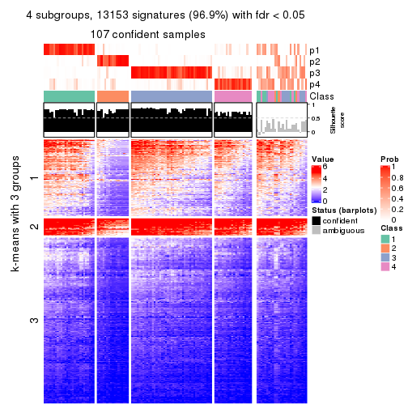</p>

</div>
<div id='tab-MAD-NMF-get-signatures-no-scale-4'>
<pre><code class="r">get_signatures(res, k = 5, scale_rows = FALSE)
</code></pre>

<p></p>

</div>
<div id='tab-MAD-NMF-get-signatures-no-scale-5'>
<pre><code class="r">get_signatures(res, k = 6, scale_rows = FALSE)
</code></pre>

<p></p>

</div>
</div>


Compare the overlap of signatures from different k:

```r
compare_signatures(res)
```


`get_signature()` returns a data frame invisibly. TO get the list of signatures, the function
call should be assigned to a variable explicitly. In following code, if `plot` argument is set
to `FALSE`, no heatmap is plotted while only the differential analysis is performed.

```r
# code only for demonstration
tb = get_signature(res, k = ..., plot = FALSE)
```

An example of the output of `tb` is:

```
#>   which_row         fdr    mean_1    mean_2 scaled_mean_1 scaled_mean_2 km
#> 1        38 0.042760348  8.373488  9.131774    -0.5533452     0.5164555  1
#> 2        40 0.018707592  7.106213  8.469186    -0.6173731     0.5762149  1
#> 3        55 0.019134737 10.221463 11.207825    -0.6159697     0.5749050  1
#> 4        59 0.006059896  5.921854  7.869574    -0.6899429     0.6439467  1
#> 5        60 0.018055526  8.928898 10.211722    -0.6204761     0.5791110  1
#> 6        98 0.009384629 15.714769 14.887706     0.6635654    -0.6193277  2
...
```

The columns in `tb` are:

1. `which_row`: row indices corresponding to the input matrix.
2. `fdr`: FDR for the differential test. 
3. `mean_x`: The mean value in group x.
4. `scaled_mean_x`: The mean value in group x after rows are scaled.
5. `km`: Row groups if k-means clustering is applied to rows.


UMAP plot which shows how samples are separated.


<script>
$( function() {
	$( '#tabs-MAD-NMF-dimension-reduction' ).tabs();
} );
</script>
<div id='tabs-MAD-NMF-dimension-reduction'>
<ul>
<li><a href='#tab-MAD-NMF-dimension-reduction-1'>k = 2</a></li>
<li><a href='#tab-MAD-NMF-dimension-reduction-2'>k = 3</a></li>
<li><a href='#tab-MAD-NMF-dimension-reduction-3'>k = 4</a></li>
<li><a href='#tab-MAD-NMF-dimension-reduction-4'>k = 5</a></li>
<li><a href='#tab-MAD-NMF-dimension-reduction-5'>k = 6</a></li>
</ul>
<div id='tab-MAD-NMF-dimension-reduction-1'>
<pre><code class="r">dimension_reduction(res, k = 2, method = &quot;UMAP&quot;)
</code></pre>

<p></p>

</div>
<div id='tab-MAD-NMF-dimension-reduction-2'>
<pre><code class="r">dimension_reduction(res, k = 3, method = &quot;UMAP&quot;)
</code></pre>

<p></p>

</div>
<div id='tab-MAD-NMF-dimension-reduction-3'>
<pre><code class="r">dimension_reduction(res, k = 4, method = &quot;UMAP&quot;)
</code></pre>

<p></p>

</div>
<div id='tab-MAD-NMF-dimension-reduction-4'>
<pre><code class="r">dimension_reduction(res, k = 5, method = &quot;UMAP&quot;)
</code></pre>

<p></p>

</div>
<div id='tab-MAD-NMF-dimension-reduction-5'>
<pre><code class="r">dimension_reduction(res, k = 6, method = &quot;UMAP&quot;)
</code></pre>

<p></p>

</div>
</div>


Following heatmap shows how subgroups are split when increasing `k`:

```r
collect_classes(res)
```


If matrix rows can be associated to genes, consider to use `functional_enrichment(res,
...)` to perform function enrichment for the signature genes. See [this vignette](http://bioconductor.org/packages/devel/bioc/vignettes/cola/inst/doc/functional_enrichment.html) for more detailed explanations.


 

---------------------------------------------------


### ATC:hclust


The object with results only for a single top-value method and a single partition method 
can be extracted as:

```r
res = res_list["ATC", "hclust"]
# you can also extract it by
# res = res_list["ATC:hclust"]
```

A summary of `res` and all the functions that can be applied to it:

```r
res
```

```
#> A 'ConsensusPartition' object with k = 2, 3, 4, 5, 6.
#>   On a matrix with 13580 rows and 133 columns.
#>   Top rows (1000, 2000, 3000, 4000, 5000) are extracted by 'ATC' method.
#>   Subgroups are detected by 'hclust' method.
#>   Performed in total 1250 partitions by row resampling.
#>   Best k for subgroups seems to be 2.
#> 
#> Following methods can be applied to this 'ConsensusPartition' object:
#>  [1] "cola_report"             "collect_classes"         "collect_plots"          
#>  [4] "collect_stats"           "colnames"                "compare_signatures"     
#>  [7] "consensus_heatmap"       "dimension_reduction"     "functional_enrichment"  
#> [10] "get_anno_col"            "get_anno"                "get_classes"            
#> [13] "get_consensus"           "get_matrix"              "get_membership"         
#> [16] "get_param"               "get_signatures"          "get_stats"              
#> [19] "is_best_k"               "is_stable_k"             "membership_heatmap"     
#> [22] "ncol"                    "nrow"                    "plot_ecdf"              
#> [25] "rownames"                "select_partition_number" "show"                   
#> [28] "suggest_best_k"          "test_to_known_factors"
```

`collect_plots()` function collects all the plots made from `res` for all `k` (number of partitions)
into one single page to provide an easy and fast comparison between different `k`.

```r
collect_plots(res)
```


The plots are:

- The first row: a plot of the ECDF (empirical cumulative distribution
  function) curves of the consensus matrix for each `k` and the heatmap of
  predicted classes for each `k`.
- The second row: heatmaps of the consensus matrix for each `k`.
- The third row: heatmaps of the membership matrix for each `k`.
- The fouth row: heatmaps of the signatures for each `k`.

All the plots in panels can be made by individual functions and they are
plotted later in this section.

`select_partition_number()` produces several plots showing different
statistics for choosing "optimized" `k`. There are following statistics:

- ECDF curves of the consensus matrix for each `k`;
- 1-PAC. [The PAC
  score](https://en.wikipedia.org/wiki/Consensus_clustering#Over-interpretation_potential_of_consensus_clustering)
  measures the proportion of the ambiguous subgrouping.
- Mean silhouette score.
- Concordance. The mean probability of fiting the consensus class ids in all
  partitions.
- Area increased. Denote $A_k$ as the area under the ECDF curve for current
  `k`, the area increased is defined as $A_k - A_{k-1}$.
- Rand index. The percent of pairs of samples that are both in a same cluster
  or both are not in a same cluster in the partition of k and k-1.
- Jaccard index. The ratio of pairs of samples are both in a same cluster in
  the partition of k and k-1 and the pairs of samples are both in a same
  cluster in the partition k or k-1.

The detailed explanations of these statistics can be found in [the _cola_
vignette](http://bioconductor.org/packages/devel/bioc/vignettes/cola/inst/doc/cola.html#toc_13).

Generally speaking, lower PAC score, higher mean silhouette score or higher
concordance corresponds to better partition. Rand index and Jaccard index
measure how similar the current partition is compared to partition with `k-1`.
If they are too similar, we won't accept `k` is better than `k-1`.

```r
select_partition_number(res)
```

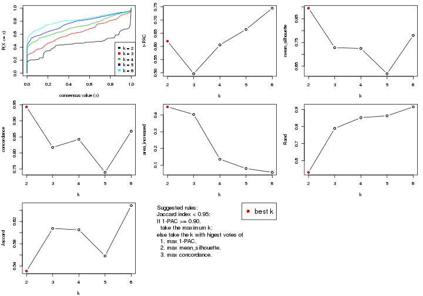

The numeric values for all these statistics can be obtained by `get_stats()`.

```r
get_stats(res)
```

```
#>   k 1-PAC mean_silhouette concordance area_increased  Rand Jaccard
#> 2 2 0.620           0.895       0.944         0.4486 0.531   0.531
#> 3 3 0.496           0.728       0.817         0.4033 0.789   0.607
#> 4 4 0.606           0.725       0.843         0.1356 0.853   0.605
#> 5 5 0.664           0.618       0.740         0.0801 0.864   0.558
#> 6 6 0.745           0.780       0.868         0.0569 0.916   0.649
```

`suggest_best_k()` suggests the best $k$ based on these statistics. The rules are as follows:

- All $k$ with Jaccard index larger than 0.95 are removed because increasing
  $k$ does not provide enough extra information. If all $k$ are removed, it is
  marked as no subgroup is detected.
- For all $k$ with 1-PAC score larger than 0.9, the maximal $k$ is taken as
  the best $k$, and other $k$ are marked as optional $k$.
- If it does not fit the second rule. The $k$ with the maximal vote of the
  highest 1-PAC score, highest mean silhouette, and highest concordance is
  taken as the best $k$.

```r
suggest_best_k(res)
```

```
#> [1] 2
```


Following shows the table of the partitions (You need to click the **show/hide
code output** link to see it). The membership matrix (columns with name `p*`)
is inferred by
[`clue::cl_consensus()`](https://www.rdocumentation.org/link/cl_consensus?package=clue)
function with the `SE` method. Basically the value in the membership matrix
represents the probability to belong to a certain group. The finall class
label for an item is determined with the group with highest probability it
belongs to.

In `get_classes()` function, the entropy is calculated from the membership
matrix and the silhouette score is calculated from the consensus matrix.


<script>
$( function() {
	$( '#tabs-ATC-hclust-get-classes' ).tabs();
} );
</script>
<div id='tabs-ATC-hclust-get-classes'>
<ul>
<li><a href='#tab-ATC-hclust-get-classes-1'>k = 2</a></li>
<li><a href='#tab-ATC-hclust-get-classes-2'>k = 3</a></li>
<li><a href='#tab-ATC-hclust-get-classes-3'>k = 4</a></li>
<li><a href='#tab-ATC-hclust-get-classes-4'>k = 5</a></li>
<li><a href='#tab-ATC-hclust-get-classes-5'>k = 6</a></li>
</ul>

<div id='tab-ATC-hclust-get-classes-1'>
<p><a id='tab-ATC-hclust-get-classes-1-a' style='color:#0366d6' href='#'>show/hide code output</a></p>
<pre><code class="r">cbind(get_classes(res, k = 2), get_membership(res, k = 2))
</code></pre>

<pre><code>#&gt;            class entropy silhouette    p1    p2
#&gt; SRR1951667     2  0.0000     0.8943 0.000 1.000
#&gt; SRR1951666     2  0.8081     0.7676 0.248 0.752
#&gt; SRR1951665     2  0.0000     0.8943 0.000 1.000
#&gt; SRR1951664     1  0.1633     0.9470 0.976 0.024
#&gt; SRR1951663     1  0.0000     0.9605 1.000 0.000
#&gt; SRR1951662     2  0.0000     0.8943 0.000 1.000
#&gt; SRR1951661     1  0.9393     0.3996 0.644 0.356
#&gt; SRR1951660     1  0.0000     0.9605 1.000 0.000
#&gt; SRR1951659     2  0.0000     0.8943 0.000 1.000
#&gt; SRR1951658     2  0.0000     0.8943 0.000 1.000
#&gt; SRR1951657     1  0.0000     0.9605 1.000 0.000
#&gt; SRR1951656     1  0.0000     0.9605 1.000 0.000
#&gt; SRR1951655     1  0.0000     0.9605 1.000 0.000
#&gt; SRR1951654     1  0.0000     0.9605 1.000 0.000
#&gt; SRR1951653     1  0.0938     0.9549 0.988 0.012
#&gt; SRR1951652     2  0.7674     0.7990 0.224 0.776
#&gt; SRR1951651     1  0.0000     0.9605 1.000 0.000
#&gt; SRR1951650     1  0.0672     0.9572 0.992 0.008
#&gt; SRR1951648     2  0.7674     0.7990 0.224 0.776
#&gt; SRR1951649     1  0.0000     0.9605 1.000 0.000
#&gt; SRR1951647     2  0.6801     0.8435 0.180 0.820
#&gt; SRR1951646     1  0.0672     0.9572 0.992 0.008
#&gt; SRR1951645     1  0.0000     0.9605 1.000 0.000
#&gt; SRR1951644     1  0.4562     0.8800 0.904 0.096
#&gt; SRR1951643     1  0.0000     0.9605 1.000 0.000
#&gt; SRR1951641     2  0.0000     0.8943 0.000 1.000
#&gt; SRR1951642     1  0.0000     0.9605 1.000 0.000
#&gt; SRR1951694     1  0.0000     0.9605 1.000 0.000
#&gt; SRR1951731     2  0.6247     0.8628 0.156 0.844
#&gt; SRR1951730     2  0.7674     0.7990 0.224 0.776
#&gt; SRR1951752     2  0.6247     0.8628 0.156 0.844
#&gt; SRR1951751     1  0.0000     0.9605 1.000 0.000
#&gt; SRR1951749     2  0.6247     0.8628 0.156 0.844
#&gt; SRR1951750     1  0.0000     0.9605 1.000 0.000
#&gt; SRR1951748     2  0.0000     0.8943 0.000 1.000
#&gt; SRR1951747     2  0.0000     0.8943 0.000 1.000
#&gt; SRR1951745     1  0.0000     0.9605 1.000 0.000
#&gt; SRR1951746     2  0.0000     0.8943 0.000 1.000
#&gt; SRR1951744     1  0.0000     0.9605 1.000 0.000
#&gt; SRR1951742     2  0.0000     0.8943 0.000 1.000
#&gt; SRR1951743     2  0.0000     0.8943 0.000 1.000
#&gt; SRR1951741     1  0.0000     0.9605 1.000 0.000
#&gt; SRR1951740     1  0.0000     0.9605 1.000 0.000
#&gt; SRR1951738     2  0.0000     0.8943 0.000 1.000
#&gt; SRR1951739     2  0.0000     0.8943 0.000 1.000
#&gt; SRR1951737     1  0.0672     0.9572 0.992 0.008
#&gt; SRR1951736     1  0.0000     0.9605 1.000 0.000
#&gt; SRR1951734     2  0.0000     0.8943 0.000 1.000
#&gt; SRR1951735     1  0.4815     0.8715 0.896 0.104
#&gt; SRR1951733     2  0.6247     0.8628 0.156 0.844
#&gt; SRR1951732     2  0.0000     0.8943 0.000 1.000
#&gt; SRR1951729     1  0.0672     0.9572 0.992 0.008
#&gt; SRR1951728     1  0.5294     0.8540 0.880 0.120
#&gt; SRR1951727     2  0.0000     0.8943 0.000 1.000
#&gt; SRR1951725     1  0.0000     0.9605 1.000 0.000
#&gt; SRR1951726     1  0.5178     0.8587 0.884 0.116
#&gt; SRR1951724     1  0.0000     0.9605 1.000 0.000
#&gt; SRR1951722     1  0.5294     0.8540 0.880 0.120
#&gt; SRR1951723     1  0.5178     0.8574 0.884 0.116
#&gt; SRR1951721     1  0.2236     0.9359 0.964 0.036
#&gt; SRR1951719     1  0.0376     0.9590 0.996 0.004
#&gt; SRR1951720     1  0.0000     0.9605 1.000 0.000
#&gt; SRR1951718     1  0.0376     0.9590 0.996 0.004
#&gt; SRR1951717     1  0.0000     0.9605 1.000 0.000
#&gt; SRR1951715     1  0.0000     0.9605 1.000 0.000
#&gt; SRR1951716     1  0.0000     0.9605 1.000 0.000
#&gt; SRR1951714     1  0.0000     0.9605 1.000 0.000
#&gt; SRR1951713     1  0.0376     0.9590 0.996 0.004
#&gt; SRR1951712     1  0.0000     0.9605 1.000 0.000
#&gt; SRR1951711     2  0.0000     0.8943 0.000 1.000
#&gt; SRR1951710     1  0.0000     0.9605 1.000 0.000
#&gt; SRR1951709     2  0.7674     0.7990 0.224 0.776
#&gt; SRR1951708     2  0.0000     0.8943 0.000 1.000
#&gt; SRR1951707     1  0.9922     0.0738 0.552 0.448
#&gt; SRR1951705     1  0.0000     0.9605 1.000 0.000
#&gt; SRR1951704     1  0.5178     0.8587 0.884 0.116
#&gt; SRR1951703     2  0.0000     0.8943 0.000 1.000
#&gt; SRR1951706     1  0.5178     0.8587 0.884 0.116
#&gt; SRR1951702     1  0.8081     0.6560 0.752 0.248
#&gt; SRR1951701     2  0.0000     0.8943 0.000 1.000
#&gt; SRR1951699     2  0.8327     0.7445 0.264 0.736
#&gt; SRR1951698     2  0.8443     0.7316 0.272 0.728
#&gt; SRR1951700     1  0.1414     0.9496 0.980 0.020
#&gt; SRR1951697     2  0.0000     0.8943 0.000 1.000
#&gt; SRR1951696     1  0.0938     0.9549 0.988 0.012
#&gt; SRR1951695     1  0.3879     0.9009 0.924 0.076
#&gt; SRR1951693     1  0.1414     0.9496 0.980 0.020
#&gt; SRR1951692     1  0.0000     0.9605 1.000 0.000
#&gt; SRR1951691     1  0.1184     0.9522 0.984 0.016
#&gt; SRR1951688     2  0.6247     0.8628 0.156 0.844
#&gt; SRR1951689     2  0.6247     0.8628 0.156 0.844
#&gt; SRR1951687     1  0.0000     0.9605 1.000 0.000
#&gt; SRR1951685     2  0.6247     0.8628 0.156 0.844
#&gt; SRR1951684     1  0.0000     0.9605 1.000 0.000
#&gt; SRR1951686     2  0.0000     0.8943 0.000 1.000
#&gt; SRR1951683     1  0.0000     0.9605 1.000 0.000
#&gt; SRR1951682     2  0.0000     0.8943 0.000 1.000
#&gt; SRR1951690     2  0.0000     0.8943 0.000 1.000
#&gt; SRR1951680     1  0.0376     0.9590 0.996 0.004
#&gt; SRR1951679     1  0.5178     0.8574 0.884 0.116
#&gt; SRR1951678     1  0.0000     0.9605 1.000 0.000
#&gt; SRR1951677     1  0.0000     0.9605 1.000 0.000
#&gt; SRR1951676     1  0.0000     0.9605 1.000 0.000
#&gt; SRR1951675     2  0.0000     0.8943 0.000 1.000
#&gt; SRR1951681     1  0.0376     0.9590 0.996 0.004
#&gt; SRR1951673     2  0.6247     0.8628 0.156 0.844
#&gt; SRR1951674     1  0.0000     0.9605 1.000 0.000
#&gt; SRR1951672     1  0.0000     0.9605 1.000 0.000
#&gt; SRR1951671     2  0.6247     0.8628 0.156 0.844
#&gt; SRR1951670     1  0.0000     0.9605 1.000 0.000
#&gt; SRR1951640     1  0.0672     0.9572 0.992 0.008
#&gt; SRR1951668     1  0.0000     0.9605 1.000 0.000
#&gt; SRR1951669     2  0.6247     0.8628 0.156 0.844
#&gt; SRR1951638     1  0.0000     0.9605 1.000 0.000
#&gt; SRR1951637     2  0.6247     0.8628 0.156 0.844
#&gt; SRR1951635     1  0.0000     0.9605 1.000 0.000
#&gt; SRR1951634     1  0.0000     0.9605 1.000 0.000
#&gt; SRR1951631     1  0.0000     0.9605 1.000 0.000
#&gt; SRR1951632     2  0.0000     0.8943 0.000 1.000
#&gt; SRR1951633     1  0.0000     0.9605 1.000 0.000
#&gt; SRR1951630     1  0.0000     0.9605 1.000 0.000
#&gt; SRR1951629     1  0.0000     0.9605 1.000 0.000
#&gt; SRR1951628     2  0.6531     0.8535 0.168 0.832
#&gt; SRR1951627     2  0.9922     0.3162 0.448 0.552
#&gt; SRR1951639     2  0.8386     0.7380 0.268 0.732
#&gt; SRR1951625     2  0.6247     0.8628 0.156 0.844
#&gt; SRR1951626     1  0.8499     0.5994 0.724 0.276
#&gt; SRR1951624     1  0.0672     0.9572 0.992 0.008
#&gt; SRR1951622     1  0.0000     0.9605 1.000 0.000
#&gt; SRR1951636     1  0.8081     0.6560 0.752 0.248
#&gt; SRR1951623     1  0.0000     0.9605 1.000 0.000
#&gt; SRR1951621     1  0.0000     0.9605 1.000 0.000
#&gt; SRR1951620     1  0.0000     0.9605 1.000 0.000
</code></pre>

<script>
$('#tab-ATC-hclust-get-classes-1-a').parent().next().next().hide();
$('#tab-ATC-hclust-get-classes-1-a').click(function(){
  $('#tab-ATC-hclust-get-classes-1-a').parent().next().next().toggle();
  return(false);
});
</script>
</div>

<div id='tab-ATC-hclust-get-classes-2'>
<p><a id='tab-ATC-hclust-get-classes-2-a' style='color:#0366d6' href='#'>show/hide code output</a></p>
<pre><code class="r">cbind(get_classes(res, k = 3), get_membership(res, k = 3))
</code></pre>

<pre><code>#&gt;            class entropy silhouette    p1    p2    p3
#&gt; SRR1951667     2  0.0000      0.826 0.000 1.000 0.000
#&gt; SRR1951666     2  0.6225      0.649 0.000 0.568 0.432
#&gt; SRR1951665     2  0.0000      0.826 0.000 1.000 0.000
#&gt; SRR1951664     3  0.4002      0.812 0.160 0.000 0.840
#&gt; SRR1951663     3  0.4346      0.810 0.184 0.000 0.816
#&gt; SRR1951662     2  0.0000      0.826 0.000 1.000 0.000
#&gt; SRR1951661     3  0.4178      0.475 0.000 0.172 0.828
#&gt; SRR1951660     3  0.4702      0.797 0.212 0.000 0.788
#&gt; SRR1951659     2  0.0000      0.826 0.000 1.000 0.000
#&gt; SRR1951658     2  0.0000      0.826 0.000 1.000 0.000
#&gt; SRR1951657     1  0.3482      0.806 0.872 0.000 0.128
#&gt; SRR1951656     1  0.3482      0.806 0.872 0.000 0.128
#&gt; SRR1951655     1  0.5016      0.741 0.760 0.000 0.240
#&gt; SRR1951654     1  0.0000      0.773 1.000 0.000 0.000
#&gt; SRR1951653     3  0.4178      0.812 0.172 0.000 0.828
#&gt; SRR1951652     2  0.6154      0.682 0.000 0.592 0.408
#&gt; SRR1951651     1  0.3038      0.805 0.896 0.000 0.104
#&gt; SRR1951650     3  0.5098      0.754 0.248 0.000 0.752
#&gt; SRR1951648     2  0.6154      0.682 0.000 0.592 0.408
#&gt; SRR1951649     3  0.6140      0.387 0.404 0.000 0.596
#&gt; SRR1951647     2  0.5968      0.731 0.000 0.636 0.364
#&gt; SRR1951646     3  0.5254      0.734 0.264 0.000 0.736
#&gt; SRR1951645     3  0.6140      0.387 0.404 0.000 0.596
#&gt; SRR1951644     3  0.2711      0.782 0.088 0.000 0.912
#&gt; SRR1951643     1  0.0000      0.773 1.000 0.000 0.000
#&gt; SRR1951641     2  0.0000      0.826 0.000 1.000 0.000
#&gt; SRR1951642     1  0.0000      0.773 1.000 0.000 0.000
#&gt; SRR1951694     3  0.4555      0.804 0.200 0.000 0.800
#&gt; SRR1951731     2  0.5835      0.752 0.000 0.660 0.340
#&gt; SRR1951730     2  0.6154      0.682 0.000 0.592 0.408
#&gt; SRR1951752     2  0.5835      0.752 0.000 0.660 0.340
#&gt; SRR1951751     1  0.4842      0.760 0.776 0.000 0.224
#&gt; SRR1951749     2  0.5835      0.752 0.000 0.660 0.340
#&gt; SRR1951750     1  0.3038      0.805 0.896 0.000 0.104
#&gt; SRR1951748     2  0.0000      0.826 0.000 1.000 0.000
#&gt; SRR1951747     2  0.0000      0.826 0.000 1.000 0.000
#&gt; SRR1951745     3  0.4399      0.809 0.188 0.000 0.812
#&gt; SRR1951746     2  0.0000      0.826 0.000 1.000 0.000
#&gt; SRR1951744     1  0.6225      0.318 0.568 0.000 0.432
#&gt; SRR1951742     2  0.0424      0.826 0.000 0.992 0.008
#&gt; SRR1951743     2  0.0000      0.826 0.000 1.000 0.000
#&gt; SRR1951741     1  0.0000      0.773 1.000 0.000 0.000
#&gt; SRR1951740     1  0.6286      0.173 0.536 0.000 0.464
#&gt; SRR1951738     2  0.0000      0.826 0.000 1.000 0.000
#&gt; SRR1951739     2  0.0000      0.826 0.000 1.000 0.000
#&gt; SRR1951737     3  0.4235      0.812 0.176 0.000 0.824
#&gt; SRR1951736     1  0.4796      0.763 0.780 0.000 0.220
#&gt; SRR1951734     2  0.0000      0.826 0.000 1.000 0.000
#&gt; SRR1951735     3  0.2860      0.778 0.084 0.004 0.912
#&gt; SRR1951733     2  0.5835      0.752 0.000 0.660 0.340
#&gt; SRR1951732     2  0.0000      0.826 0.000 1.000 0.000
#&gt; SRR1951729     3  0.4235      0.812 0.176 0.000 0.824
#&gt; SRR1951728     3  0.2496      0.769 0.068 0.004 0.928
#&gt; SRR1951727     2  0.0000      0.826 0.000 1.000 0.000
#&gt; SRR1951725     1  0.6126      0.420 0.600 0.000 0.400
#&gt; SRR1951726     3  0.2261      0.771 0.068 0.000 0.932
#&gt; SRR1951724     1  0.6244      0.287 0.560 0.000 0.440
#&gt; SRR1951722     3  0.2496      0.769 0.068 0.004 0.928
#&gt; SRR1951723     3  0.3359      0.770 0.084 0.016 0.900
#&gt; SRR1951721     3  0.3816      0.809 0.148 0.000 0.852
#&gt; SRR1951719     3  0.5591      0.672 0.304 0.000 0.696
#&gt; SRR1951720     1  0.4796      0.763 0.780 0.000 0.220
#&gt; SRR1951718     3  0.4654      0.800 0.208 0.000 0.792
#&gt; SRR1951717     1  0.4842      0.759 0.776 0.000 0.224
#&gt; SRR1951715     3  0.4346      0.810 0.184 0.000 0.816
#&gt; SRR1951716     1  0.4796      0.763 0.780 0.000 0.220
#&gt; SRR1951714     1  0.6260      0.258 0.552 0.000 0.448
#&gt; SRR1951713     3  0.5706      0.641 0.320 0.000 0.680
#&gt; SRR1951712     1  0.4842      0.760 0.776 0.000 0.224
#&gt; SRR1951711     2  0.0237      0.826 0.000 0.996 0.004
#&gt; SRR1951710     3  0.4346      0.810 0.184 0.000 0.816
#&gt; SRR1951709     2  0.6154      0.682 0.000 0.592 0.408
#&gt; SRR1951708     2  0.0000      0.826 0.000 1.000 0.000
#&gt; SRR1951707     3  0.5254      0.224 0.000 0.264 0.736
#&gt; SRR1951705     3  0.4702      0.797 0.212 0.000 0.788
#&gt; SRR1951704     3  0.2261      0.771 0.068 0.000 0.932
#&gt; SRR1951703     2  0.0000      0.826 0.000 1.000 0.000
#&gt; SRR1951706     3  0.2261      0.771 0.068 0.000 0.932
#&gt; SRR1951702     3  0.2496      0.648 0.004 0.068 0.928
#&gt; SRR1951701     2  0.0000      0.826 0.000 1.000 0.000
#&gt; SRR1951699     2  0.6260      0.622 0.000 0.552 0.448
#&gt; SRR1951698     2  0.6274      0.610 0.000 0.544 0.456
#&gt; SRR1951700     3  0.5058      0.748 0.244 0.000 0.756
#&gt; SRR1951697     2  0.0424      0.826 0.000 0.992 0.008
#&gt; SRR1951696     3  0.4178      0.812 0.172 0.000 0.828
#&gt; SRR1951695     3  0.3192      0.795 0.112 0.000 0.888
#&gt; SRR1951693     3  0.5098      0.744 0.248 0.000 0.752
#&gt; SRR1951692     1  0.3482      0.806 0.872 0.000 0.128
#&gt; SRR1951691     3  0.5216      0.725 0.260 0.000 0.740
#&gt; SRR1951688     2  0.5835      0.752 0.000 0.660 0.340
#&gt; SRR1951689     2  0.5835      0.752 0.000 0.660 0.340
#&gt; SRR1951687     1  0.0000      0.773 1.000 0.000 0.000
#&gt; SRR1951685     2  0.5835      0.752 0.000 0.660 0.340
#&gt; SRR1951684     1  0.5926      0.516 0.644 0.000 0.356
#&gt; SRR1951686     2  0.0424      0.826 0.000 0.992 0.008
#&gt; SRR1951683     1  0.0000      0.773 1.000 0.000 0.000
#&gt; SRR1951682     2  0.0000      0.826 0.000 1.000 0.000
#&gt; SRR1951690     2  0.0000      0.826 0.000 1.000 0.000
#&gt; SRR1951680     3  0.5706      0.641 0.320 0.000 0.680
#&gt; SRR1951679     3  0.3359      0.770 0.084 0.016 0.900
#&gt; SRR1951678     1  0.0000      0.773 1.000 0.000 0.000
#&gt; SRR1951677     1  0.0000      0.773 1.000 0.000 0.000
#&gt; SRR1951676     1  0.3116      0.805 0.892 0.000 0.108
#&gt; SRR1951675     2  0.0000      0.826 0.000 1.000 0.000
#&gt; SRR1951681     3  0.5529      0.688 0.296 0.000 0.704
#&gt; SRR1951673     2  0.5835      0.752 0.000 0.660 0.340
#&gt; SRR1951674     3  0.4399      0.809 0.188 0.000 0.812
#&gt; SRR1951672     1  0.6295      0.142 0.528 0.000 0.472
#&gt; SRR1951671     2  0.5835      0.752 0.000 0.660 0.340
#&gt; SRR1951670     1  0.0000      0.773 1.000 0.000 0.000
#&gt; SRR1951640     3  0.5254      0.734 0.264 0.000 0.736
#&gt; SRR1951668     1  0.3412      0.806 0.876 0.000 0.124
#&gt; SRR1951669     2  0.5835      0.752 0.000 0.660 0.340
#&gt; SRR1951638     3  0.4399      0.809 0.188 0.000 0.812
#&gt; SRR1951637     2  0.5835      0.752 0.000 0.660 0.340
#&gt; SRR1951635     1  0.4796      0.763 0.780 0.000 0.220
#&gt; SRR1951634     1  0.3412      0.806 0.876 0.000 0.124
#&gt; SRR1951631     1  0.4750      0.764 0.784 0.000 0.216
#&gt; SRR1951632     2  0.0424      0.826 0.000 0.992 0.008
#&gt; SRR1951633     1  0.0000      0.773 1.000 0.000 0.000
#&gt; SRR1951630     1  0.0000      0.773 1.000 0.000 0.000
#&gt; SRR1951629     1  0.4750      0.764 0.784 0.000 0.216
#&gt; SRR1951628     2  0.5905      0.740 0.000 0.648 0.352
#&gt; SRR1951627     3  0.5988     -0.170 0.000 0.368 0.632
#&gt; SRR1951639     2  0.6267      0.617 0.000 0.548 0.452
#&gt; SRR1951625     2  0.5835      0.752 0.000 0.660 0.340
#&gt; SRR1951626     3  0.2796      0.621 0.000 0.092 0.908
#&gt; SRR1951624     3  0.4235      0.812 0.176 0.000 0.824
#&gt; SRR1951622     3  0.4654      0.800 0.208 0.000 0.792
#&gt; SRR1951636     3  0.2496      0.648 0.004 0.068 0.928
#&gt; SRR1951623     1  0.3619      0.803 0.864 0.000 0.136
#&gt; SRR1951621     1  0.0000      0.773 1.000 0.000 0.000
#&gt; SRR1951620     1  0.3816      0.800 0.852 0.000 0.148
</code></pre>

<script>
$('#tab-ATC-hclust-get-classes-2-a').parent().next().next().hide();
$('#tab-ATC-hclust-get-classes-2-a').click(function(){
  $('#tab-ATC-hclust-get-classes-2-a').parent().next().next().toggle();
  return(false);
});
</script>
</div>

<div id='tab-ATC-hclust-get-classes-3'>
<p><a id='tab-ATC-hclust-get-classes-3-a' style='color:#0366d6' href='#'>show/hide code output</a></p>
<pre><code class="r">cbind(get_classes(res, k = 4), get_membership(res, k = 4))
</code></pre>

<pre><code>#&gt;            class entropy silhouette    p1    p2    p3    p4
#&gt; SRR1951667     2  0.0000     0.9457 0.000 1.000 0.000 0.000
#&gt; SRR1951666     3  0.1042     0.8606 0.000 0.020 0.972 0.008
#&gt; SRR1951665     2  0.0000     0.9457 0.000 1.000 0.000 0.000
#&gt; SRR1951664     4  0.3123     0.7603 0.000 0.000 0.156 0.844
#&gt; SRR1951663     4  0.0188     0.7488 0.000 0.000 0.004 0.996
#&gt; SRR1951662     2  0.0000     0.9457 0.000 1.000 0.000 0.000
#&gt; SRR1951661     3  0.4948    -0.0720 0.000 0.000 0.560 0.440
#&gt; SRR1951660     4  0.1624     0.7467 0.028 0.000 0.020 0.952
#&gt; SRR1951659     2  0.0000     0.9457 0.000 1.000 0.000 0.000
#&gt; SRR1951658     2  0.0000     0.9457 0.000 1.000 0.000 0.000
#&gt; SRR1951657     1  0.4164     0.7478 0.736 0.000 0.000 0.264
#&gt; SRR1951656     1  0.4164     0.7478 0.736 0.000 0.000 0.264
#&gt; SRR1951655     1  0.4898     0.5703 0.584 0.000 0.000 0.416
#&gt; SRR1951654     1  0.0000     0.7336 1.000 0.000 0.000 0.000
#&gt; SRR1951653     4  0.2921     0.7620 0.000 0.000 0.140 0.860
#&gt; SRR1951652     3  0.1489     0.8755 0.000 0.044 0.952 0.004
#&gt; SRR1951651     1  0.3873     0.7571 0.772 0.000 0.000 0.228
#&gt; SRR1951650     4  0.3966     0.7526 0.072 0.000 0.088 0.840
#&gt; SRR1951648     3  0.1489     0.8755 0.000 0.044 0.952 0.004
#&gt; SRR1951649     4  0.3982     0.5703 0.220 0.000 0.004 0.776
#&gt; SRR1951647     3  0.2081     0.8832 0.000 0.084 0.916 0.000
#&gt; SRR1951646     4  0.4171     0.7446 0.088 0.000 0.084 0.828
#&gt; SRR1951645     4  0.3982     0.5703 0.220 0.000 0.004 0.776
#&gt; SRR1951644     4  0.4454     0.6575 0.000 0.000 0.308 0.692
#&gt; SRR1951643     1  0.0000     0.7336 1.000 0.000 0.000 0.000
#&gt; SRR1951641     2  0.0000     0.9457 0.000 1.000 0.000 0.000
#&gt; SRR1951642     1  0.0000     0.7336 1.000 0.000 0.000 0.000
#&gt; SRR1951694     4  0.0779     0.7443 0.016 0.000 0.004 0.980
#&gt; SRR1951731     3  0.2469     0.8851 0.000 0.108 0.892 0.000
#&gt; SRR1951730     3  0.1489     0.8755 0.000 0.044 0.952 0.004
#&gt; SRR1951752     3  0.2469     0.8851 0.000 0.108 0.892 0.000
#&gt; SRR1951751     1  0.4830     0.6223 0.608 0.000 0.000 0.392
#&gt; SRR1951749     3  0.2530     0.8829 0.000 0.112 0.888 0.000
#&gt; SRR1951750     1  0.3873     0.7571 0.772 0.000 0.000 0.228
#&gt; SRR1951748     2  0.0000     0.9457 0.000 1.000 0.000 0.000
#&gt; SRR1951747     2  0.0000     0.9457 0.000 1.000 0.000 0.000
#&gt; SRR1951745     4  0.0376     0.7485 0.004 0.000 0.004 0.992
#&gt; SRR1951746     2  0.0000     0.9457 0.000 1.000 0.000 0.000
#&gt; SRR1951744     4  0.5004     0.1171 0.392 0.000 0.004 0.604
#&gt; SRR1951742     2  0.4382     0.6048 0.000 0.704 0.296 0.000
#&gt; SRR1951743     2  0.0000     0.9457 0.000 1.000 0.000 0.000
#&gt; SRR1951741     1  0.0000     0.7336 1.000 0.000 0.000 0.000
#&gt; SRR1951740     4  0.5682     0.2605 0.352 0.000 0.036 0.612
#&gt; SRR1951738     2  0.0000     0.9457 0.000 1.000 0.000 0.000
#&gt; SRR1951739     2  0.0000     0.9457 0.000 1.000 0.000 0.000
#&gt; SRR1951737     4  0.2868     0.7624 0.000 0.000 0.136 0.864
#&gt; SRR1951736     1  0.4746     0.6561 0.632 0.000 0.000 0.368
#&gt; SRR1951734     2  0.0000     0.9457 0.000 1.000 0.000 0.000
#&gt; SRR1951735     4  0.4543     0.6433 0.000 0.000 0.324 0.676
#&gt; SRR1951733     3  0.2469     0.8851 0.000 0.108 0.892 0.000
#&gt; SRR1951732     2  0.0000     0.9457 0.000 1.000 0.000 0.000
#&gt; SRR1951729     4  0.2868     0.7624 0.000 0.000 0.136 0.864
#&gt; SRR1951728     4  0.4164     0.6999 0.000 0.000 0.264 0.736
#&gt; SRR1951727     2  0.0000     0.9457 0.000 1.000 0.000 0.000
#&gt; SRR1951725     4  0.4916    -0.0369 0.424 0.000 0.000 0.576
#&gt; SRR1951726     4  0.4134     0.7032 0.000 0.000 0.260 0.740
#&gt; SRR1951724     4  0.4978     0.1540 0.384 0.000 0.004 0.612
#&gt; SRR1951722     4  0.4164     0.6999 0.000 0.000 0.264 0.736
#&gt; SRR1951723     4  0.4564     0.6271 0.000 0.000 0.328 0.672
#&gt; SRR1951721     4  0.1474     0.7535 0.000 0.000 0.052 0.948
#&gt; SRR1951719     4  0.5332     0.7046 0.128 0.000 0.124 0.748
#&gt; SRR1951720     1  0.4746     0.6561 0.632 0.000 0.000 0.368
#&gt; SRR1951718     4  0.1733     0.7493 0.028 0.000 0.024 0.948
#&gt; SRR1951717     1  0.4804     0.6340 0.616 0.000 0.000 0.384
#&gt; SRR1951715     4  0.0188     0.7488 0.000 0.000 0.004 0.996
#&gt; SRR1951716     1  0.4746     0.6561 0.632 0.000 0.000 0.368
#&gt; SRR1951714     4  0.5400     0.1962 0.372 0.000 0.020 0.608
#&gt; SRR1951713     4  0.5528     0.6867 0.144 0.000 0.124 0.732
#&gt; SRR1951712     1  0.4830     0.6223 0.608 0.000 0.000 0.392
#&gt; SRR1951711     2  0.2469     0.8527 0.000 0.892 0.108 0.000
#&gt; SRR1951710     4  0.0707     0.7532 0.000 0.000 0.020 0.980
#&gt; SRR1951709     3  0.1489     0.8755 0.000 0.044 0.952 0.004
#&gt; SRR1951708     2  0.0000     0.9457 0.000 1.000 0.000 0.000
#&gt; SRR1951707     3  0.4522     0.3336 0.000 0.000 0.680 0.320
#&gt; SRR1951705     4  0.1624     0.7467 0.028 0.000 0.020 0.952
#&gt; SRR1951704     4  0.4134     0.7032 0.000 0.000 0.260 0.740
#&gt; SRR1951703     2  0.0000     0.9457 0.000 1.000 0.000 0.000
#&gt; SRR1951706     4  0.4134     0.7032 0.000 0.000 0.260 0.740
#&gt; SRR1951702     4  0.4967     0.3549 0.000 0.000 0.452 0.548
#&gt; SRR1951701     2  0.0000     0.9457 0.000 1.000 0.000 0.000
#&gt; SRR1951699     3  0.3550     0.8125 0.000 0.044 0.860 0.096
#&gt; SRR1951698     3  0.0592     0.8437 0.000 0.000 0.984 0.016
#&gt; SRR1951700     4  0.4168     0.7532 0.080 0.000 0.092 0.828
#&gt; SRR1951697     2  0.4382     0.6048 0.000 0.704 0.296 0.000
#&gt; SRR1951696     4  0.2921     0.7620 0.000 0.000 0.140 0.860
#&gt; SRR1951695     4  0.3945     0.7368 0.004 0.000 0.216 0.780
#&gt; SRR1951693     4  0.4171     0.7514 0.084 0.000 0.088 0.828
#&gt; SRR1951692     1  0.4164     0.7478 0.736 0.000 0.000 0.264
#&gt; SRR1951691     4  0.4030     0.7459 0.092 0.000 0.072 0.836
#&gt; SRR1951688     3  0.2469     0.8851 0.000 0.108 0.892 0.000
#&gt; SRR1951689     3  0.2530     0.8829 0.000 0.112 0.888 0.000
#&gt; SRR1951687     1  0.0000     0.7336 1.000 0.000 0.000 0.000
#&gt; SRR1951685     3  0.2469     0.8851 0.000 0.108 0.892 0.000
#&gt; SRR1951684     4  0.4994    -0.2438 0.480 0.000 0.000 0.520
#&gt; SRR1951686     2  0.4382     0.6048 0.000 0.704 0.296 0.000
#&gt; SRR1951683     1  0.0000     0.7336 1.000 0.000 0.000 0.000
#&gt; SRR1951682     2  0.0000     0.9457 0.000 1.000 0.000 0.000
#&gt; SRR1951690     2  0.0000     0.9457 0.000 1.000 0.000 0.000
#&gt; SRR1951680     4  0.5528     0.6867 0.144 0.000 0.124 0.732
#&gt; SRR1951679     4  0.4564     0.6271 0.000 0.000 0.328 0.672
#&gt; SRR1951678     1  0.0000     0.7336 1.000 0.000 0.000 0.000
#&gt; SRR1951677     1  0.0000     0.7336 1.000 0.000 0.000 0.000
#&gt; SRR1951676     1  0.3975     0.7542 0.760 0.000 0.000 0.240
#&gt; SRR1951675     2  0.0000     0.9457 0.000 1.000 0.000 0.000
#&gt; SRR1951681     4  0.4458     0.7243 0.116 0.000 0.076 0.808
#&gt; SRR1951673     3  0.2469     0.8851 0.000 0.108 0.892 0.000
#&gt; SRR1951674     4  0.0376     0.7485 0.004 0.000 0.004 0.992
#&gt; SRR1951672     4  0.4819     0.2589 0.344 0.000 0.004 0.652
#&gt; SRR1951671     3  0.2530     0.8829 0.000 0.112 0.888 0.000
#&gt; SRR1951670     1  0.0000     0.7336 1.000 0.000 0.000 0.000
#&gt; SRR1951640     4  0.4171     0.7444 0.088 0.000 0.084 0.828
#&gt; SRR1951668     1  0.4193     0.7471 0.732 0.000 0.000 0.268
#&gt; SRR1951669     3  0.2469     0.8851 0.000 0.108 0.892 0.000
#&gt; SRR1951638     4  0.0376     0.7485 0.004 0.000 0.004 0.992
#&gt; SRR1951637     3  0.2469     0.8851 0.000 0.108 0.892 0.000
#&gt; SRR1951635     1  0.4746     0.6561 0.632 0.000 0.000 0.368
#&gt; SRR1951634     1  0.4193     0.7471 0.732 0.000 0.000 0.268
#&gt; SRR1951631     1  0.4804     0.6355 0.616 0.000 0.000 0.384
#&gt; SRR1951632     2  0.3873     0.7107 0.000 0.772 0.228 0.000
#&gt; SRR1951633     1  0.0000     0.7336 1.000 0.000 0.000 0.000
#&gt; SRR1951630     1  0.0000     0.7336 1.000 0.000 0.000 0.000
#&gt; SRR1951629     1  0.4804     0.6355 0.616 0.000 0.000 0.384
#&gt; SRR1951628     3  0.2281     0.8848 0.000 0.096 0.904 0.000
#&gt; SRR1951627     3  0.3975     0.5370 0.000 0.000 0.760 0.240
#&gt; SRR1951639     3  0.0336     0.8475 0.000 0.000 0.992 0.008
#&gt; SRR1951625     3  0.2530     0.8829 0.000 0.112 0.888 0.000
#&gt; SRR1951626     4  0.4998     0.2637 0.000 0.000 0.488 0.512
#&gt; SRR1951624     4  0.2868     0.7624 0.000 0.000 0.136 0.864
#&gt; SRR1951622     4  0.1520     0.7484 0.024 0.000 0.020 0.956
#&gt; SRR1951636     4  0.4967     0.3549 0.000 0.000 0.452 0.548
#&gt; SRR1951623     1  0.4193     0.7429 0.732 0.000 0.000 0.268
#&gt; SRR1951621     1  0.0000     0.7336 1.000 0.000 0.000 0.000
#&gt; SRR1951620     1  0.4331     0.7333 0.712 0.000 0.000 0.288
</code></pre>

<script>
$('#tab-ATC-hclust-get-classes-3-a').parent().next().next().hide();
$('#tab-ATC-hclust-get-classes-3-a').click(function(){
  $('#tab-ATC-hclust-get-classes-3-a').parent().next().next().toggle();
  return(false);
});
</script>
</div>

<div id='tab-ATC-hclust-get-classes-4'>
<p><a id='tab-ATC-hclust-get-classes-4-a' style='color:#0366d6' href='#'>show/hide code output</a></p>
<pre><code class="r">cbind(get_classes(res, k = 5), get_membership(res, k = 5))
</code></pre>

<pre><code>#&gt;            class entropy silhouette    p1    p2    p3    p4    p5
#&gt; SRR1951667     2  0.0000      0.946 0.000 1.000 0.000 0.000 0.000
#&gt; SRR1951666     5  0.2689      0.825 0.000 0.016 0.012 0.084 0.888
#&gt; SRR1951665     2  0.0000      0.946 0.000 1.000 0.000 0.000 0.000
#&gt; SRR1951664     3  0.7622      0.442 0.296 0.000 0.360 0.300 0.044
#&gt; SRR1951663     3  0.0693      0.516 0.012 0.000 0.980 0.008 0.000
#&gt; SRR1951662     2  0.0000      0.946 0.000 1.000 0.000 0.000 0.000
#&gt; SRR1951661     5  0.7154     -0.120 0.024 0.000 0.280 0.248 0.448
#&gt; SRR1951660     3  0.3399      0.474 0.172 0.000 0.812 0.012 0.004
#&gt; SRR1951659     2  0.0000      0.946 0.000 1.000 0.000 0.000 0.000
#&gt; SRR1951658     2  0.0000      0.946 0.000 1.000 0.000 0.000 0.000
#&gt; SRR1951657     1  0.2648      0.454 0.848 0.000 0.000 0.152 0.000
#&gt; SRR1951656     1  0.2648      0.454 0.848 0.000 0.000 0.152 0.000
#&gt; SRR1951655     1  0.0510      0.592 0.984 0.000 0.016 0.000 0.000
#&gt; SRR1951654     4  0.3837      1.000 0.308 0.000 0.000 0.692 0.000
#&gt; SRR1951653     3  0.7409      0.421 0.312 0.000 0.360 0.300 0.028
#&gt; SRR1951652     5  0.2521      0.843 0.000 0.024 0.008 0.068 0.900
#&gt; SRR1951651     1  0.2966      0.375 0.816 0.000 0.000 0.184 0.000
#&gt; SRR1951650     1  0.6930     -0.263 0.408 0.000 0.340 0.244 0.008
#&gt; SRR1951648     5  0.2521      0.843 0.000 0.024 0.008 0.068 0.900
#&gt; SRR1951649     1  0.5142      0.184 0.564 0.000 0.392 0.044 0.000
#&gt; SRR1951647     5  0.0693      0.851 0.000 0.008 0.000 0.012 0.980
#&gt; SRR1951646     1  0.6886     -0.211 0.428 0.000 0.328 0.236 0.008
#&gt; SRR1951645     1  0.5142      0.184 0.564 0.000 0.392 0.044 0.000
#&gt; SRR1951644     3  0.8275      0.527 0.168 0.000 0.392 0.236 0.204
#&gt; SRR1951643     4  0.3837      1.000 0.308 0.000 0.000 0.692 0.000
#&gt; SRR1951641     2  0.0000      0.946 0.000 1.000 0.000 0.000 0.000
#&gt; SRR1951642     4  0.3837      1.000 0.308 0.000 0.000 0.692 0.000
#&gt; SRR1951694     3  0.2193      0.484 0.092 0.000 0.900 0.008 0.000
#&gt; SRR1951731     5  0.0880      0.861 0.000 0.032 0.000 0.000 0.968
#&gt; SRR1951730     5  0.2521      0.843 0.000 0.024 0.008 0.068 0.900
#&gt; SRR1951752     5  0.0880      0.861 0.000 0.032 0.000 0.000 0.968
#&gt; SRR1951751     1  0.1012      0.583 0.968 0.000 0.012 0.020 0.000
#&gt; SRR1951749     5  0.0963      0.859 0.000 0.036 0.000 0.000 0.964
#&gt; SRR1951750     1  0.2929      0.382 0.820 0.000 0.000 0.180 0.000
#&gt; SRR1951748     2  0.0000      0.946 0.000 1.000 0.000 0.000 0.000
#&gt; SRR1951747     2  0.0000      0.946 0.000 1.000 0.000 0.000 0.000
#&gt; SRR1951745     3  0.0798      0.514 0.016 0.000 0.976 0.008 0.000
#&gt; SRR1951746     2  0.0000      0.946 0.000 1.000 0.000 0.000 0.000
#&gt; SRR1951744     1  0.4073      0.531 0.752 0.000 0.216 0.032 0.000
#&gt; SRR1951742     2  0.3774      0.627 0.000 0.704 0.000 0.000 0.296
#&gt; SRR1951743     2  0.0000      0.946 0.000 1.000 0.000 0.000 0.000
#&gt; SRR1951741     4  0.3837      1.000 0.308 0.000 0.000 0.692 0.000
#&gt; SRR1951740     1  0.5008      0.464 0.708 0.000 0.140 0.152 0.000
#&gt; SRR1951738     2  0.0162      0.944 0.000 0.996 0.000 0.000 0.004
#&gt; SRR1951739     2  0.0000      0.946 0.000 1.000 0.000 0.000 0.000
#&gt; SRR1951737     3  0.7348      0.414 0.316 0.000 0.360 0.300 0.024
#&gt; SRR1951736     1  0.1522      0.560 0.944 0.000 0.012 0.044 0.000
#&gt; SRR1951734     2  0.0000      0.946 0.000 1.000 0.000 0.000 0.000
#&gt; SRR1951735     3  0.8339      0.522 0.164 0.000 0.368 0.256 0.212
#&gt; SRR1951733     5  0.0880      0.861 0.000 0.032 0.000 0.000 0.968
#&gt; SRR1951732     2  0.0000      0.946 0.000 1.000 0.000 0.000 0.000
#&gt; SRR1951729     3  0.7348      0.414 0.316 0.000 0.360 0.300 0.024
#&gt; SRR1951728     3  0.8065      0.558 0.164 0.000 0.432 0.240 0.164
#&gt; SRR1951727     2  0.0000      0.946 0.000 1.000 0.000 0.000 0.000
#&gt; SRR1951725     1  0.3675      0.564 0.788 0.000 0.188 0.024 0.000
#&gt; SRR1951726     3  0.7942      0.563 0.156 0.000 0.456 0.228 0.160
#&gt; SRR1951724     1  0.4150      0.521 0.748 0.000 0.216 0.036 0.000
#&gt; SRR1951722     3  0.8065      0.558 0.164 0.000 0.432 0.240 0.164
#&gt; SRR1951723     3  0.8237      0.528 0.148 0.000 0.392 0.236 0.224
#&gt; SRR1951721     3  0.2395      0.533 0.012 0.000 0.912 0.040 0.036
#&gt; SRR1951719     1  0.7120     -0.115 0.456 0.000 0.236 0.284 0.024
#&gt; SRR1951720     1  0.1522      0.560 0.944 0.000 0.012 0.044 0.000
#&gt; SRR1951718     3  0.3360      0.479 0.168 0.000 0.816 0.012 0.004
#&gt; SRR1951717     1  0.1195      0.573 0.960 0.000 0.012 0.028 0.000
#&gt; SRR1951715     3  0.1557      0.506 0.052 0.000 0.940 0.008 0.000
#&gt; SRR1951716     1  0.1522      0.560 0.944 0.000 0.012 0.044 0.000
#&gt; SRR1951714     1  0.4514      0.504 0.740 0.000 0.188 0.072 0.000
#&gt; SRR1951713     1  0.7030     -0.061 0.476 0.000 0.216 0.284 0.024
#&gt; SRR1951712     1  0.1012      0.583 0.968 0.000 0.012 0.020 0.000
#&gt; SRR1951711     2  0.2127      0.859 0.000 0.892 0.000 0.000 0.108
#&gt; SRR1951710     3  0.2976      0.500 0.132 0.000 0.852 0.012 0.004
#&gt; SRR1951709     5  0.2521      0.843 0.000 0.024 0.008 0.068 0.900
#&gt; SRR1951708     2  0.0000      0.946 0.000 1.000 0.000 0.000 0.000
#&gt; SRR1951707     5  0.6150      0.244 0.004 0.000 0.244 0.176 0.576
#&gt; SRR1951705     3  0.3320      0.476 0.164 0.000 0.820 0.012 0.004
#&gt; SRR1951704     3  0.7942      0.563 0.156 0.000 0.456 0.228 0.160
#&gt; SRR1951703     2  0.0000      0.946 0.000 1.000 0.000 0.000 0.000
#&gt; SRR1951706     3  0.7924      0.564 0.156 0.000 0.460 0.224 0.160
#&gt; SRR1951702     3  0.7333      0.372 0.028 0.000 0.384 0.248 0.340
#&gt; SRR1951701     2  0.0000      0.946 0.000 1.000 0.000 0.000 0.000
#&gt; SRR1951699     5  0.3578      0.767 0.008 0.008 0.020 0.132 0.832
#&gt; SRR1951698     5  0.2522      0.799 0.000 0.000 0.012 0.108 0.880
#&gt; SRR1951700     3  0.7062      0.282 0.380 0.000 0.380 0.224 0.016
#&gt; SRR1951697     2  0.3774      0.627 0.000 0.704 0.000 0.000 0.296
#&gt; SRR1951696     3  0.7409      0.421 0.312 0.000 0.360 0.300 0.028
#&gt; SRR1951695     3  0.8108      0.521 0.224 0.000 0.392 0.268 0.116
#&gt; SRR1951693     1  0.7035     -0.305 0.388 0.000 0.380 0.216 0.016
#&gt; SRR1951692     1  0.2648      0.454 0.848 0.000 0.000 0.152 0.000
#&gt; SRR1951691     3  0.6881      0.237 0.400 0.000 0.404 0.180 0.016
#&gt; SRR1951688     5  0.0880      0.861 0.000 0.032 0.000 0.000 0.968
#&gt; SRR1951689     5  0.0963      0.859 0.000 0.036 0.000 0.000 0.964
#&gt; SRR1951687     4  0.3837      1.000 0.308 0.000 0.000 0.692 0.000
#&gt; SRR1951685     5  0.0880      0.861 0.000 0.032 0.000 0.000 0.968
#&gt; SRR1951684     1  0.4035      0.588 0.784 0.000 0.060 0.156 0.000
#&gt; SRR1951686     2  0.3774      0.627 0.000 0.704 0.000 0.000 0.296
#&gt; SRR1951683     4  0.3837      1.000 0.308 0.000 0.000 0.692 0.000
#&gt; SRR1951682     2  0.0000      0.946 0.000 1.000 0.000 0.000 0.000
#&gt; SRR1951690     2  0.0000      0.946 0.000 1.000 0.000 0.000 0.000
#&gt; SRR1951680     1  0.7030     -0.061 0.476 0.000 0.216 0.284 0.024
#&gt; SRR1951679     3  0.8237      0.528 0.148 0.000 0.392 0.236 0.224
#&gt; SRR1951678     4  0.3837      1.000 0.308 0.000 0.000 0.692 0.000
#&gt; SRR1951677     4  0.3837      1.000 0.308 0.000 0.000 0.692 0.000
#&gt; SRR1951676     1  0.2891      0.403 0.824 0.000 0.000 0.176 0.000
#&gt; SRR1951675     2  0.0000      0.946 0.000 1.000 0.000 0.000 0.000
#&gt; SRR1951681     1  0.6809     -0.107 0.464 0.000 0.288 0.240 0.008
#&gt; SRR1951673     5  0.0880      0.861 0.000 0.032 0.000 0.000 0.968
#&gt; SRR1951674     3  0.0798      0.514 0.016 0.000 0.976 0.008 0.000
#&gt; SRR1951672     1  0.4547      0.472 0.704 0.000 0.252 0.044 0.000
#&gt; SRR1951671     5  0.0963      0.859 0.000 0.036 0.000 0.000 0.964
#&gt; SRR1951670     4  0.3837      1.000 0.308 0.000 0.000 0.692 0.000
#&gt; SRR1951640     1  0.6886     -0.209 0.428 0.000 0.328 0.236 0.008
#&gt; SRR1951668     1  0.2516      0.467 0.860 0.000 0.000 0.140 0.000
#&gt; SRR1951669     5  0.0880      0.861 0.000 0.032 0.000 0.000 0.968
#&gt; SRR1951638     3  0.0798      0.514 0.016 0.000 0.976 0.008 0.000
#&gt; SRR1951637     5  0.0880      0.861 0.000 0.032 0.000 0.000 0.968
#&gt; SRR1951635     1  0.1522      0.560 0.944 0.000 0.012 0.044 0.000
#&gt; SRR1951634     1  0.2516      0.467 0.860 0.000 0.000 0.140 0.000
#&gt; SRR1951631     1  0.1670      0.585 0.936 0.000 0.012 0.052 0.000
#&gt; SRR1951632     2  0.3336      0.726 0.000 0.772 0.000 0.000 0.228
#&gt; SRR1951633     4  0.3837      1.000 0.308 0.000 0.000 0.692 0.000
#&gt; SRR1951630     4  0.3837      1.000 0.308 0.000 0.000 0.692 0.000
#&gt; SRR1951629     1  0.1670      0.585 0.936 0.000 0.012 0.052 0.000
#&gt; SRR1951628     5  0.1012      0.856 0.000 0.020 0.000 0.012 0.968
#&gt; SRR1951627     5  0.5816      0.451 0.012 0.000 0.160 0.180 0.648
#&gt; SRR1951639     5  0.2416      0.806 0.000 0.000 0.012 0.100 0.888
#&gt; SRR1951625     5  0.0963      0.859 0.000 0.036 0.000 0.000 0.964
#&gt; SRR1951626     5  0.7204     -0.344 0.020 0.000 0.356 0.248 0.376
#&gt; SRR1951624     3  0.7348      0.414 0.316 0.000 0.360 0.300 0.024
#&gt; SRR1951622     3  0.3280      0.480 0.160 0.000 0.824 0.012 0.004
#&gt; SRR1951636     3  0.7333      0.372 0.028 0.000 0.384 0.248 0.340
#&gt; SRR1951623     1  0.3355      0.438 0.804 0.000 0.012 0.184 0.000
#&gt; SRR1951621     4  0.3837      1.000 0.308 0.000 0.000 0.692 0.000
#&gt; SRR1951620     1  0.2471      0.490 0.864 0.000 0.000 0.136 0.000
</code></pre>

<script>
$('#tab-ATC-hclust-get-classes-4-a').parent().next().next().hide();
$('#tab-ATC-hclust-get-classes-4-a').click(function(){
  $('#tab-ATC-hclust-get-classes-4-a').parent().next().next().toggle();
  return(false);
});
</script>
</div>

<div id='tab-ATC-hclust-get-classes-5'>
<p><a id='tab-ATC-hclust-get-classes-5-a' style='color:#0366d6' href='#'>show/hide code output</a></p>
<pre><code class="r">cbind(get_classes(res, k = 6), get_membership(res, k = 6))
</code></pre>

<pre><code>#&gt;            class entropy silhouette    p1    p2    p3    p4    p5    p6
#&gt; SRR1951667     2  0.0000     0.9417 0.000 1.000 0.000 0.000 0.000 0.000
#&gt; SRR1951666     5  0.2234     0.8450 0.000 0.000 0.124 0.000 0.872 0.004
#&gt; SRR1951665     2  0.0000     0.9417 0.000 1.000 0.000 0.000 0.000 0.000
#&gt; SRR1951664     3  0.0922     0.7512 0.024 0.000 0.968 0.000 0.004 0.004
#&gt; SRR1951663     6  0.0653     0.8567 0.004 0.000 0.012 0.004 0.000 0.980
#&gt; SRR1951662     2  0.0000     0.9417 0.000 1.000 0.000 0.000 0.000 0.000
#&gt; SRR1951661     3  0.4237     0.3221 0.000 0.000 0.584 0.000 0.396 0.020
#&gt; SRR1951660     6  0.3706     0.8364 0.172 0.000 0.056 0.000 0.000 0.772
#&gt; SRR1951659     2  0.0000     0.9417 0.000 1.000 0.000 0.000 0.000 0.000
#&gt; SRR1951658     2  0.0000     0.9417 0.000 1.000 0.000 0.000 0.000 0.000
#&gt; SRR1951657     1  0.4061     0.7429 0.748 0.000 0.088 0.164 0.000 0.000
#&gt; SRR1951656     1  0.4061     0.7429 0.748 0.000 0.088 0.164 0.000 0.000
#&gt; SRR1951655     1  0.0891     0.7660 0.968 0.000 0.024 0.000 0.000 0.008
#&gt; SRR1951654     4  0.0146     1.0000 0.004 0.000 0.000 0.996 0.000 0.000
#&gt; SRR1951653     3  0.0865     0.7516 0.036 0.000 0.964 0.000 0.000 0.000
#&gt; SRR1951652     5  0.1908     0.8680 0.000 0.000 0.096 0.000 0.900 0.004
#&gt; SRR1951651     1  0.3043     0.7290 0.792 0.000 0.008 0.200 0.000 0.000
#&gt; SRR1951650     3  0.2831     0.6989 0.136 0.000 0.840 0.000 0.000 0.024
#&gt; SRR1951648     5  0.1908     0.8680 0.000 0.000 0.096 0.000 0.900 0.004
#&gt; SRR1951649     1  0.5536     0.3052 0.536 0.000 0.164 0.000 0.000 0.300
#&gt; SRR1951647     5  0.0790     0.8906 0.000 0.000 0.032 0.000 0.968 0.000
#&gt; SRR1951646     3  0.3102     0.6790 0.156 0.000 0.816 0.000 0.000 0.028
#&gt; SRR1951645     1  0.5536     0.3052 0.536 0.000 0.164 0.000 0.000 0.300
#&gt; SRR1951644     3  0.3425     0.7106 0.008 0.000 0.800 0.000 0.164 0.028
#&gt; SRR1951643     4  0.0146     1.0000 0.004 0.000 0.000 0.996 0.000 0.000
#&gt; SRR1951641     2  0.0000     0.9417 0.000 1.000 0.000 0.000 0.000 0.000
#&gt; SRR1951642     4  0.0146     1.0000 0.004 0.000 0.000 0.996 0.000 0.000
#&gt; SRR1951694     6  0.2199     0.8683 0.088 0.000 0.020 0.000 0.000 0.892
#&gt; SRR1951731     5  0.0146     0.9000 0.000 0.004 0.000 0.000 0.996 0.000
#&gt; SRR1951730     5  0.1908     0.8680 0.000 0.000 0.096 0.000 0.900 0.004
#&gt; SRR1951752     5  0.0146     0.9000 0.000 0.004 0.000 0.000 0.996 0.000
#&gt; SRR1951751     1  0.0665     0.7677 0.980 0.000 0.004 0.008 0.000 0.008
#&gt; SRR1951749     5  0.0260     0.8988 0.000 0.008 0.000 0.000 0.992 0.000
#&gt; SRR1951750     1  0.3012     0.7321 0.796 0.000 0.008 0.196 0.000 0.000
#&gt; SRR1951748     2  0.0000     0.9417 0.000 1.000 0.000 0.000 0.000 0.000
#&gt; SRR1951747     2  0.0000     0.9417 0.000 1.000 0.000 0.000 0.000 0.000
#&gt; SRR1951745     6  0.0551     0.8560 0.004 0.000 0.008 0.004 0.000 0.984
#&gt; SRR1951746     2  0.0000     0.9417 0.000 1.000 0.000 0.000 0.000 0.000
#&gt; SRR1951744     1  0.4433     0.6421 0.724 0.000 0.160 0.004 0.000 0.112
#&gt; SRR1951742     2  0.3409     0.6277 0.000 0.700 0.000 0.000 0.300 0.000
#&gt; SRR1951743     2  0.0000     0.9417 0.000 1.000 0.000 0.000 0.000 0.000
#&gt; SRR1951741     4  0.0146     1.0000 0.004 0.000 0.000 0.996 0.000 0.000
#&gt; SRR1951740     1  0.4413     0.1722 0.492 0.000 0.488 0.008 0.000 0.012
#&gt; SRR1951738     2  0.0146     0.9387 0.000 0.996 0.000 0.000 0.004 0.000
#&gt; SRR1951739     2  0.0000     0.9417 0.000 1.000 0.000 0.000 0.000 0.000
#&gt; SRR1951737     3  0.1152     0.7510 0.044 0.000 0.952 0.000 0.000 0.004
#&gt; SRR1951736     1  0.1196     0.7610 0.952 0.000 0.000 0.040 0.000 0.008
#&gt; SRR1951734     2  0.0000     0.9417 0.000 1.000 0.000 0.000 0.000 0.000
#&gt; SRR1951735     3  0.2814     0.7155 0.008 0.000 0.820 0.000 0.172 0.000
#&gt; SRR1951733     5  0.0146     0.9000 0.000 0.004 0.000 0.000 0.996 0.000
#&gt; SRR1951732     2  0.0000     0.9417 0.000 1.000 0.000 0.000 0.000 0.000
#&gt; SRR1951729     3  0.1152     0.7510 0.044 0.000 0.952 0.000 0.000 0.004
#&gt; SRR1951728     3  0.4180     0.6949 0.004 0.000 0.752 0.000 0.132 0.112
#&gt; SRR1951727     2  0.0000     0.9417 0.000 1.000 0.000 0.000 0.000 0.000
#&gt; SRR1951725     1  0.4097     0.6676 0.760 0.000 0.128 0.004 0.000 0.108
#&gt; SRR1951726     3  0.4381     0.6802 0.004 0.000 0.732 0.000 0.128 0.136
#&gt; SRR1951724     1  0.4606     0.6093 0.692 0.000 0.212 0.004 0.000 0.092
#&gt; SRR1951722     3  0.4093     0.6995 0.004 0.000 0.760 0.000 0.132 0.104
#&gt; SRR1951723     3  0.3594     0.6972 0.008 0.000 0.780 0.000 0.184 0.028
#&gt; SRR1951721     6  0.4047     0.4629 0.000 0.000 0.296 0.000 0.028 0.676
#&gt; SRR1951719     3  0.3166     0.6456 0.184 0.000 0.800 0.008 0.000 0.008
#&gt; SRR1951720     1  0.1196     0.7610 0.952 0.000 0.000 0.040 0.000 0.008
#&gt; SRR1951718     6  0.3946     0.8288 0.168 0.000 0.076 0.000 0.000 0.756
#&gt; SRR1951717     1  0.0717     0.7624 0.976 0.000 0.000 0.016 0.000 0.008
#&gt; SRR1951715     6  0.1367     0.8660 0.044 0.000 0.012 0.000 0.000 0.944
#&gt; SRR1951716     1  0.1196     0.7610 0.952 0.000 0.000 0.040 0.000 0.008
#&gt; SRR1951714     1  0.4272     0.5446 0.668 0.000 0.288 0.000 0.000 0.044
#&gt; SRR1951713     3  0.3323     0.6194 0.204 0.000 0.780 0.008 0.000 0.008
#&gt; SRR1951712     1  0.0665     0.7677 0.980 0.000 0.004 0.008 0.000 0.008
#&gt; SRR1951711     2  0.1910     0.8520 0.000 0.892 0.000 0.000 0.108 0.000
#&gt; SRR1951710     6  0.3254     0.8574 0.136 0.000 0.048 0.000 0.000 0.816
#&gt; SRR1951709     5  0.1908     0.8680 0.000 0.000 0.096 0.000 0.900 0.004
#&gt; SRR1951708     2  0.0000     0.9417 0.000 1.000 0.000 0.000 0.000 0.000
#&gt; SRR1951707     5  0.3991     0.0819 0.000 0.000 0.472 0.000 0.524 0.004
#&gt; SRR1951705     6  0.3612     0.8418 0.168 0.000 0.052 0.000 0.000 0.780
#&gt; SRR1951704     3  0.4343     0.6828 0.004 0.000 0.736 0.000 0.128 0.132
#&gt; SRR1951703     2  0.0000     0.9417 0.000 1.000 0.000 0.000 0.000 0.000
#&gt; SRR1951706     3  0.4454     0.6737 0.004 0.000 0.724 0.000 0.128 0.144
#&gt; SRR1951702     3  0.4291     0.5487 0.000 0.000 0.664 0.000 0.292 0.044
#&gt; SRR1951701     2  0.0000     0.9417 0.000 1.000 0.000 0.000 0.000 0.000
#&gt; SRR1951699     5  0.2772     0.7824 0.000 0.000 0.180 0.000 0.816 0.004
#&gt; SRR1951698     5  0.2595     0.8151 0.000 0.000 0.160 0.000 0.836 0.004
#&gt; SRR1951700     3  0.4397     0.5574 0.284 0.000 0.672 0.000 0.012 0.032
#&gt; SRR1951697     2  0.3409     0.6277 0.000 0.700 0.000 0.000 0.300 0.000
#&gt; SRR1951696     3  0.0865     0.7516 0.036 0.000 0.964 0.000 0.000 0.000
#&gt; SRR1951695     3  0.3616     0.7480 0.040 0.000 0.824 0.000 0.088 0.048
#&gt; SRR1951693     3  0.4626     0.5372 0.292 0.000 0.652 0.000 0.012 0.044
#&gt; SRR1951692     1  0.4061     0.7429 0.748 0.000 0.088 0.164 0.000 0.000
#&gt; SRR1951691     3  0.5089     0.4347 0.328 0.000 0.592 0.000 0.012 0.068
#&gt; SRR1951688     5  0.0146     0.9000 0.000 0.004 0.000 0.000 0.996 0.000
#&gt; SRR1951689     5  0.0260     0.8988 0.000 0.008 0.000 0.000 0.992 0.000
#&gt; SRR1951687     4  0.0146     1.0000 0.004 0.000 0.000 0.996 0.000 0.000
#&gt; SRR1951685     5  0.0146     0.9000 0.000 0.004 0.000 0.000 0.996 0.000
#&gt; SRR1951684     1  0.4694     0.4593 0.572 0.000 0.376 0.052 0.000 0.000
#&gt; SRR1951686     2  0.3409     0.6277 0.000 0.700 0.000 0.000 0.300 0.000
#&gt; SRR1951683     4  0.0146     1.0000 0.004 0.000 0.000 0.996 0.000 0.000
#&gt; SRR1951682     2  0.0000     0.9417 0.000 1.000 0.000 0.000 0.000 0.000
#&gt; SRR1951690     2  0.0000     0.9417 0.000 1.000 0.000 0.000 0.000 0.000
#&gt; SRR1951680     3  0.3323     0.6194 0.204 0.000 0.780 0.008 0.000 0.008
#&gt; SRR1951679     3  0.3594     0.6972 0.008 0.000 0.780 0.000 0.184 0.028
#&gt; SRR1951678     4  0.0146     1.0000 0.004 0.000 0.000 0.996 0.000 0.000
#&gt; SRR1951677     4  0.0146     1.0000 0.004 0.000 0.000 0.996 0.000 0.000
#&gt; SRR1951676     1  0.4002     0.7282 0.744 0.000 0.068 0.188 0.000 0.000
#&gt; SRR1951675     2  0.0000     0.9417 0.000 1.000 0.000 0.000 0.000 0.000
#&gt; SRR1951681     3  0.3514     0.6215 0.208 0.000 0.768 0.004 0.000 0.020
#&gt; SRR1951673     5  0.0146     0.9000 0.000 0.004 0.000 0.000 0.996 0.000
#&gt; SRR1951674     6  0.0551     0.8560 0.004 0.000 0.008 0.004 0.000 0.984
#&gt; SRR1951672     1  0.4767     0.5841 0.676 0.000 0.168 0.000 0.000 0.156
#&gt; SRR1951671     5  0.0260     0.8988 0.000 0.008 0.000 0.000 0.992 0.000
#&gt; SRR1951670     4  0.0146     1.0000 0.004 0.000 0.000 0.996 0.000 0.000
#&gt; SRR1951640     3  0.2981     0.6779 0.160 0.000 0.820 0.000 0.000 0.020
#&gt; SRR1951668     1  0.2790     0.7639 0.840 0.000 0.020 0.140 0.000 0.000
#&gt; SRR1951669     5  0.0146     0.9000 0.000 0.004 0.000 0.000 0.996 0.000
#&gt; SRR1951638     6  0.0551     0.8560 0.004 0.000 0.008 0.004 0.000 0.984
#&gt; SRR1951637     5  0.0146     0.9000 0.000 0.004 0.000 0.000 0.996 0.000
#&gt; SRR1951635     1  0.1196     0.7610 0.952 0.000 0.000 0.040 0.000 0.008
#&gt; SRR1951634     1  0.2790     0.7639 0.840 0.000 0.020 0.140 0.000 0.000
#&gt; SRR1951631     1  0.2629     0.7788 0.868 0.000 0.092 0.040 0.000 0.000
#&gt; SRR1951632     2  0.3023     0.7262 0.000 0.768 0.000 0.000 0.232 0.000
#&gt; SRR1951633     4  0.0146     1.0000 0.004 0.000 0.000 0.996 0.000 0.000
#&gt; SRR1951630     4  0.0146     1.0000 0.004 0.000 0.000 0.996 0.000 0.000
#&gt; SRR1951629     1  0.2629     0.7788 0.868 0.000 0.092 0.040 0.000 0.000
#&gt; SRR1951628     5  0.0547     0.8942 0.000 0.000 0.020 0.000 0.980 0.000
#&gt; SRR1951627     5  0.3881     0.3598 0.000 0.000 0.396 0.000 0.600 0.004
#&gt; SRR1951639     5  0.2520     0.8236 0.000 0.000 0.152 0.000 0.844 0.004
#&gt; SRR1951625     5  0.0260     0.8988 0.000 0.008 0.000 0.000 0.992 0.000
#&gt; SRR1951626     3  0.3652     0.5005 0.000 0.000 0.672 0.000 0.324 0.004
#&gt; SRR1951624     3  0.1152     0.7510 0.044 0.000 0.952 0.000 0.000 0.004
#&gt; SRR1951622     6  0.3578     0.8449 0.164 0.000 0.052 0.000 0.000 0.784
#&gt; SRR1951636     3  0.4291     0.5487 0.000 0.000 0.664 0.000 0.292 0.044
#&gt; SRR1951623     1  0.4422     0.7306 0.720 0.000 0.096 0.180 0.000 0.004
#&gt; SRR1951621     4  0.0146     1.0000 0.004 0.000 0.000 0.996 0.000 0.000
#&gt; SRR1951620     1  0.4117     0.7476 0.748 0.000 0.112 0.140 0.000 0.000
</code></pre>

<script>
$('#tab-ATC-hclust-get-classes-5-a').parent().next().next().hide();
$('#tab-ATC-hclust-get-classes-5-a').click(function(){
  $('#tab-ATC-hclust-get-classes-5-a').parent().next().next().toggle();
  return(false);
});
</script>
</div>
</div>

Heatmaps for the consensus matrix. It visualizes the probability of two
samples to be in a same group.


<script>
$( function() {
	$( '#tabs-ATC-hclust-consensus-heatmap' ).tabs();
} );
</script>
<div id='tabs-ATC-hclust-consensus-heatmap'>
<ul>
<li><a href='#tab-ATC-hclust-consensus-heatmap-1'>k = 2</a></li>
<li><a href='#tab-ATC-hclust-consensus-heatmap-2'>k = 3</a></li>
<li><a href='#tab-ATC-hclust-consensus-heatmap-3'>k = 4</a></li>
<li><a href='#tab-ATC-hclust-consensus-heatmap-4'>k = 5</a></li>
<li><a href='#tab-ATC-hclust-consensus-heatmap-5'>k = 6</a></li>
</ul>
<div id='tab-ATC-hclust-consensus-heatmap-1'>
<pre><code class="r">consensus_heatmap(res, k = 2)
</code></pre>

<p></p>

</div>
<div id='tab-ATC-hclust-consensus-heatmap-2'>
<pre><code class="r">consensus_heatmap(res, k = 3)
</code></pre>

<p></p>

</div>
<div id='tab-ATC-hclust-consensus-heatmap-3'>
<pre><code class="r">consensus_heatmap(res, k = 4)
</code></pre>

<p></p>

</div>
<div id='tab-ATC-hclust-consensus-heatmap-4'>
<pre><code class="r">consensus_heatmap(res, k = 5)
</code></pre>

<p></p>

</div>
<div id='tab-ATC-hclust-consensus-heatmap-5'>
<pre><code class="r">consensus_heatmap(res, k = 6)
</code></pre>

<p></p>

</div>
</div>

Heatmaps for the membership of samples in all partitions to see how consistent they are:


<script>
$( function() {
	$( '#tabs-ATC-hclust-membership-heatmap' ).tabs();
} );
</script>
<div id='tabs-ATC-hclust-membership-heatmap'>
<ul>
<li><a href='#tab-ATC-hclust-membership-heatmap-1'>k = 2</a></li>
<li><a href='#tab-ATC-hclust-membership-heatmap-2'>k = 3</a></li>
<li><a href='#tab-ATC-hclust-membership-heatmap-3'>k = 4</a></li>
<li><a href='#tab-ATC-hclust-membership-heatmap-4'>k = 5</a></li>
<li><a href='#tab-ATC-hclust-membership-heatmap-5'>k = 6</a></li>
</ul>
<div id='tab-ATC-hclust-membership-heatmap-1'>
<pre><code class="r">membership_heatmap(res, k = 2)
</code></pre>

<p>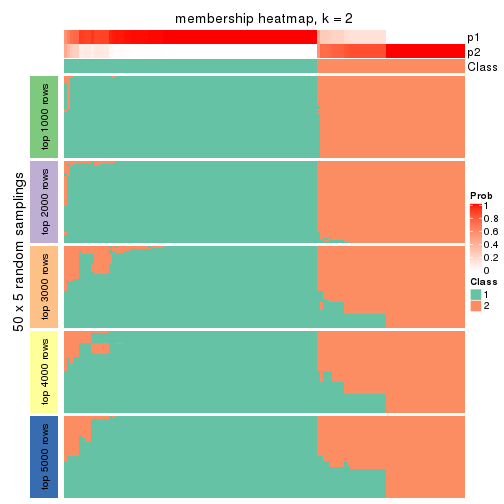</p>

</div>
<div id='tab-ATC-hclust-membership-heatmap-2'>
<pre><code class="r">membership_heatmap(res, k = 3)
</code></pre>

<p></p>

</div>
<div id='tab-ATC-hclust-membership-heatmap-3'>
<pre><code class="r">membership_heatmap(res, k = 4)
</code></pre>

<p></p>

</div>
<div id='tab-ATC-hclust-membership-heatmap-4'>
<pre><code class="r">membership_heatmap(res, k = 5)
</code></pre>

<p></p>

</div>
<div id='tab-ATC-hclust-membership-heatmap-5'>
<pre><code class="r">membership_heatmap(res, k = 6)
</code></pre>

<p></p>

</div>
</div>

As soon as we have had the classes for columns, we can look for signatures
which are significantly different between classes which can be candidate marks
for certain classes. Following are the heatmaps for signatures.


Signature heatmaps where rows are scaled:


<script>
$( function() {
	$( '#tabs-ATC-hclust-get-signatures' ).tabs();
} );
</script>
<div id='tabs-ATC-hclust-get-signatures'>
<ul>
<li><a href='#tab-ATC-hclust-get-signatures-1'>k = 2</a></li>
<li><a href='#tab-ATC-hclust-get-signatures-2'>k = 3</a></li>
<li><a href='#tab-ATC-hclust-get-signatures-3'>k = 4</a></li>
<li><a href='#tab-ATC-hclust-get-signatures-4'>k = 5</a></li>
<li><a href='#tab-ATC-hclust-get-signatures-5'>k = 6</a></li>
</ul>
<div id='tab-ATC-hclust-get-signatures-1'>
<pre><code class="r">get_signatures(res, k = 2)
</code></pre>

<p></p>

</div>
<div id='tab-ATC-hclust-get-signatures-2'>
<pre><code class="r">get_signatures(res, k = 3)
</code></pre>

<p></p>

</div>
<div id='tab-ATC-hclust-get-signatures-3'>
<pre><code class="r">get_signatures(res, k = 4)
</code></pre>

<p></p>

</div>
<div id='tab-ATC-hclust-get-signatures-4'>
<pre><code class="r">get_signatures(res, k = 5)
</code></pre>

<p></p>

</div>
<div id='tab-ATC-hclust-get-signatures-5'>
<pre><code class="r">get_signatures(res, k = 6)
</code></pre>

<p></p>

</div>
</div>


Signature heatmaps where rows are not scaled:


<script>
$( function() {
	$( '#tabs-ATC-hclust-get-signatures-no-scale' ).tabs();
} );
</script>
<div id='tabs-ATC-hclust-get-signatures-no-scale'>
<ul>
<li><a href='#tab-ATC-hclust-get-signatures-no-scale-1'>k = 2</a></li>
<li><a href='#tab-ATC-hclust-get-signatures-no-scale-2'>k = 3</a></li>
<li><a href='#tab-ATC-hclust-get-signatures-no-scale-3'>k = 4</a></li>
<li><a href='#tab-ATC-hclust-get-signatures-no-scale-4'>k = 5</a></li>
<li><a href='#tab-ATC-hclust-get-signatures-no-scale-5'>k = 6</a></li>
</ul>
<div id='tab-ATC-hclust-get-signatures-no-scale-1'>
<pre><code class="r">get_signatures(res, k = 2, scale_rows = FALSE)
</code></pre>

<p></p>

</div>
<div id='tab-ATC-hclust-get-signatures-no-scale-2'>
<pre><code class="r">get_signatures(res, k = 3, scale_rows = FALSE)
</code></pre>

<p></p>

</div>
<div id='tab-ATC-hclust-get-signatures-no-scale-3'>
<pre><code class="r">get_signatures(res, k = 4, scale_rows = FALSE)
</code></pre>

<p></p>

</div>
<div id='tab-ATC-hclust-get-signatures-no-scale-4'>
<pre><code class="r">get_signatures(res, k = 5, scale_rows = FALSE)
</code></pre>

<p></p>

</div>
<div id='tab-ATC-hclust-get-signatures-no-scale-5'>
<pre><code class="r">get_signatures(res, k = 6, scale_rows = FALSE)
</code></pre>

<p></p>

</div>
</div>


Compare the overlap of signatures from different k:

```r
compare_signatures(res)
```


`get_signature()` returns a data frame invisibly. TO get the list of signatures, the function
call should be assigned to a variable explicitly. In following code, if `plot` argument is set
to `FALSE`, no heatmap is plotted while only the differential analysis is performed.

```r
# code only for demonstration
tb = get_signature(res, k = ..., plot = FALSE)
```

An example of the output of `tb` is:

```
#>   which_row         fdr    mean_1    mean_2 scaled_mean_1 scaled_mean_2 km
#> 1        38 0.042760348  8.373488  9.131774    -0.5533452     0.5164555  1
#> 2        40 0.018707592  7.106213  8.469186    -0.6173731     0.5762149  1
#> 3        55 0.019134737 10.221463 11.207825    -0.6159697     0.5749050  1
#> 4        59 0.006059896  5.921854  7.869574    -0.6899429     0.6439467  1
#> 5        60 0.018055526  8.928898 10.211722    -0.6204761     0.5791110  1
#> 6        98 0.009384629 15.714769 14.887706     0.6635654    -0.6193277  2
...
```

The columns in `tb` are:

1. `which_row`: row indices corresponding to the input matrix.
2. `fdr`: FDR for the differential test. 
3. `mean_x`: The mean value in group x.
4. `scaled_mean_x`: The mean value in group x after rows are scaled.
5. `km`: Row groups if k-means clustering is applied to rows.


UMAP plot which shows how samples are separated.


<script>
$( function() {
	$( '#tabs-ATC-hclust-dimension-reduction' ).tabs();
} );
</script>
<div id='tabs-ATC-hclust-dimension-reduction'>
<ul>
<li><a href='#tab-ATC-hclust-dimension-reduction-1'>k = 2</a></li>
<li><a href='#tab-ATC-hclust-dimension-reduction-2'>k = 3</a></li>
<li><a href='#tab-ATC-hclust-dimension-reduction-3'>k = 4</a></li>
<li><a href='#tab-ATC-hclust-dimension-reduction-4'>k = 5</a></li>
<li><a href='#tab-ATC-hclust-dimension-reduction-5'>k = 6</a></li>
</ul>
<div id='tab-ATC-hclust-dimension-reduction-1'>
<pre><code class="r">dimension_reduction(res, k = 2, method = &quot;UMAP&quot;)
</code></pre>

<p></p>

</div>
<div id='tab-ATC-hclust-dimension-reduction-2'>
<pre><code class="r">dimension_reduction(res, k = 3, method = &quot;UMAP&quot;)
</code></pre>

<p></p>

</div>
<div id='tab-ATC-hclust-dimension-reduction-3'>
<pre><code class="r">dimension_reduction(res, k = 4, method = &quot;UMAP&quot;)
</code></pre>

<p></p>

</div>
<div id='tab-ATC-hclust-dimension-reduction-4'>
<pre><code class="r">dimension_reduction(res, k = 5, method = &quot;UMAP&quot;)
</code></pre>

<p></p>

</div>
<div id='tab-ATC-hclust-dimension-reduction-5'>
<pre><code class="r">dimension_reduction(res, k = 6, method = &quot;UMAP&quot;)
</code></pre>

<p></p>

</div>
</div>


Following heatmap shows how subgroups are split when increasing `k`:

```r
collect_classes(res)
```


If matrix rows can be associated to genes, consider to use `functional_enrichment(res,
...)` to perform function enrichment for the signature genes. See [this vignette](http://bioconductor.org/packages/devel/bioc/vignettes/cola/inst/doc/functional_enrichment.html) for more detailed explanations.


 

---------------------------------------------------


### ATC:kmeans*


The object with results only for a single top-value method and a single partition method 
can be extracted as:

```r
res = res_list["ATC", "kmeans"]
# you can also extract it by
# res = res_list["ATC:kmeans"]
```

A summary of `res` and all the functions that can be applied to it:

```r
res
```

```
#> A 'ConsensusPartition' object with k = 2, 3, 4, 5, 6.
#>   On a matrix with 13580 rows and 133 columns.
#>   Top rows (1000, 2000, 3000, 4000, 5000) are extracted by 'ATC' method.
#>   Subgroups are detected by 'kmeans' method.
#>   Performed in total 1250 partitions by row resampling.
#>   Best k for subgroups seems to be 4.
#> 
#> Following methods can be applied to this 'ConsensusPartition' object:
#>  [1] "cola_report"             "collect_classes"         "collect_plots"          
#>  [4] "collect_stats"           "colnames"                "compare_signatures"     
#>  [7] "consensus_heatmap"       "dimension_reduction"     "functional_enrichment"  
#> [10] "get_anno_col"            "get_anno"                "get_classes"            
#> [13] "get_consensus"           "get_matrix"              "get_membership"         
#> [16] "get_param"               "get_signatures"          "get_stats"              
#> [19] "is_best_k"               "is_stable_k"             "membership_heatmap"     
#> [22] "ncol"                    "nrow"                    "plot_ecdf"              
#> [25] "rownames"                "select_partition_number" "show"                   
#> [28] "suggest_best_k"          "test_to_known_factors"
```

`collect_plots()` function collects all the plots made from `res` for all `k` (number of partitions)
into one single page to provide an easy and fast comparison between different `k`.

```r
collect_plots(res)
```


The plots are:

- The first row: a plot of the ECDF (empirical cumulative distribution
  function) curves of the consensus matrix for each `k` and the heatmap of
  predicted classes for each `k`.
- The second row: heatmaps of the consensus matrix for each `k`.
- The third row: heatmaps of the membership matrix for each `k`.
- The fouth row: heatmaps of the signatures for each `k`.

All the plots in panels can be made by individual functions and they are
plotted later in this section.

`select_partition_number()` produces several plots showing different
statistics for choosing "optimized" `k`. There are following statistics:

- ECDF curves of the consensus matrix for each `k`;
- 1-PAC. [The PAC
  score](https://en.wikipedia.org/wiki/Consensus_clustering#Over-interpretation_potential_of_consensus_clustering)
  measures the proportion of the ambiguous subgrouping.
- Mean silhouette score.
- Concordance. The mean probability of fiting the consensus class ids in all
  partitions.
- Area increased. Denote $A_k$ as the area under the ECDF curve for current
  `k`, the area increased is defined as $A_k - A_{k-1}$.
- Rand index. The percent of pairs of samples that are both in a same cluster
  or both are not in a same cluster in the partition of k and k-1.
- Jaccard index. The ratio of pairs of samples are both in a same cluster in
  the partition of k and k-1 and the pairs of samples are both in a same
  cluster in the partition k or k-1.

The detailed explanations of these statistics can be found in [the _cola_
vignette](http://bioconductor.org/packages/devel/bioc/vignettes/cola/inst/doc/cola.html#toc_13).

Generally speaking, lower PAC score, higher mean silhouette score or higher
concordance corresponds to better partition. Rand index and Jaccard index
measure how similar the current partition is compared to partition with `k-1`.
If they are too similar, we won't accept `k` is better than `k-1`.

```r
select_partition_number(res)
```


The numeric values for all these statistics can be obtained by `get_stats()`.

```r
get_stats(res)
```

```
#>   k 1-PAC mean_silhouette concordance area_increased  Rand Jaccard
#> 2 2 1.000           0.984       0.994         0.4684 0.535   0.535
#> 3 3 1.000           0.959       0.983         0.3862 0.675   0.463
#> 4 4 0.907           0.886       0.940         0.1241 0.795   0.505
#> 5 5 0.765           0.710       0.854         0.0754 0.906   0.679
#> 6 6 0.762           0.736       0.850         0.0486 0.896   0.576
```

`suggest_best_k()` suggests the best $k$ based on these statistics. The rules are as follows:

- All $k$ with Jaccard index larger than 0.95 are removed because increasing
  $k$ does not provide enough extra information. If all $k$ are removed, it is
  marked as no subgroup is detected.
- For all $k$ with 1-PAC score larger than 0.9, the maximal $k$ is taken as
  the best $k$, and other $k$ are marked as optional $k$.
- If it does not fit the second rule. The $k$ with the maximal vote of the
  highest 1-PAC score, highest mean silhouette, and highest concordance is
  taken as the best $k$.

```r
suggest_best_k(res)
```

```
#> [1] 4
#> attr(,"optional")
#> [1] 2 3
```

There is also optional best $k$ = 2 3 that is worth to check.

Following shows the table of the partitions (You need to click the **show/hide
code output** link to see it). The membership matrix (columns with name `p*`)
is inferred by
[`clue::cl_consensus()`](https://www.rdocumentation.org/link/cl_consensus?package=clue)
function with the `SE` method. Basically the value in the membership matrix
represents the probability to belong to a certain group. The finall class
label for an item is determined with the group with highest probability it
belongs to.

In `get_classes()` function, the entropy is calculated from the membership
matrix and the silhouette score is calculated from the consensus matrix.


<script>
$( function() {
	$( '#tabs-ATC-kmeans-get-classes' ).tabs();
} );
</script>
<div id='tabs-ATC-kmeans-get-classes'>
<ul>
<li><a href='#tab-ATC-kmeans-get-classes-1'>k = 2</a></li>
<li><a href='#tab-ATC-kmeans-get-classes-2'>k = 3</a></li>
<li><a href='#tab-ATC-kmeans-get-classes-3'>k = 4</a></li>
<li><a href='#tab-ATC-kmeans-get-classes-4'>k = 5</a></li>
<li><a href='#tab-ATC-kmeans-get-classes-5'>k = 6</a></li>
</ul>

<div id='tab-ATC-kmeans-get-classes-1'>
<p><a id='tab-ATC-kmeans-get-classes-1-a' style='color:#0366d6' href='#'>show/hide code output</a></p>
<pre><code class="r">cbind(get_classes(res, k = 2), get_membership(res, k = 2))
</code></pre>

<pre><code>#&gt;            class entropy silhouette    p1    p2
#&gt; SRR1951667     2    0.00     1.0000 0.000 1.000
#&gt; SRR1951666     2    0.00     1.0000 0.000 1.000
#&gt; SRR1951665     2    0.00     1.0000 0.000 1.000
#&gt; SRR1951664     1    0.00     0.9909 1.000 0.000
#&gt; SRR1951663     1    0.00     0.9909 1.000 0.000
#&gt; SRR1951662     2    0.00     1.0000 0.000 1.000
#&gt; SRR1951661     1    0.00     0.9909 1.000 0.000
#&gt; SRR1951660     1    0.00     0.9909 1.000 0.000
#&gt; SRR1951659     2    0.00     1.0000 0.000 1.000
#&gt; SRR1951658     2    0.00     1.0000 0.000 1.000
#&gt; SRR1951657     1    0.00     0.9909 1.000 0.000
#&gt; SRR1951656     1    0.00     0.9909 1.000 0.000
#&gt; SRR1951655     1    0.00     0.9909 1.000 0.000
#&gt; SRR1951654     1    0.00     0.9909 1.000 0.000
#&gt; SRR1951653     1    0.00     0.9909 1.000 0.000
#&gt; SRR1951652     2    0.00     1.0000 0.000 1.000
#&gt; SRR1951651     1    0.00     0.9909 1.000 0.000
#&gt; SRR1951650     1    0.00     0.9909 1.000 0.000
#&gt; SRR1951648     2    0.00     1.0000 0.000 1.000
#&gt; SRR1951649     1    0.00     0.9909 1.000 0.000
#&gt; SRR1951647     2    0.00     1.0000 0.000 1.000
#&gt; SRR1951646     1    0.00     0.9909 1.000 0.000
#&gt; SRR1951645     1    0.00     0.9909 1.000 0.000
#&gt; SRR1951644     1    0.00     0.9909 1.000 0.000
#&gt; SRR1951643     1    0.00     0.9909 1.000 0.000
#&gt; SRR1951641     2    0.00     1.0000 0.000 1.000
#&gt; SRR1951642     1    0.00     0.9909 1.000 0.000
#&gt; SRR1951694     1    0.00     0.9909 1.000 0.000
#&gt; SRR1951731     2    0.00     1.0000 0.000 1.000
#&gt; SRR1951730     2    0.00     1.0000 0.000 1.000
#&gt; SRR1951752     2    0.00     1.0000 0.000 1.000
#&gt; SRR1951751     1    0.00     0.9909 1.000 0.000
#&gt; SRR1951749     2    0.00     1.0000 0.000 1.000
#&gt; SRR1951750     1    0.00     0.9909 1.000 0.000
#&gt; SRR1951748     2    0.00     1.0000 0.000 1.000
#&gt; SRR1951747     2    0.00     1.0000 0.000 1.000
#&gt; SRR1951745     1    0.00     0.9909 1.000 0.000
#&gt; SRR1951746     2    0.00     1.0000 0.000 1.000
#&gt; SRR1951744     1    0.00     0.9909 1.000 0.000
#&gt; SRR1951742     2    0.00     1.0000 0.000 1.000
#&gt; SRR1951743     2    0.00     1.0000 0.000 1.000
#&gt; SRR1951741     1    0.00     0.9909 1.000 0.000
#&gt; SRR1951740     1    0.00     0.9909 1.000 0.000
#&gt; SRR1951738     2    0.00     1.0000 0.000 1.000
#&gt; SRR1951739     2    0.00     1.0000 0.000 1.000
#&gt; SRR1951737     1    0.00     0.9909 1.000 0.000
#&gt; SRR1951736     1    0.00     0.9909 1.000 0.000
#&gt; SRR1951734     2    0.00     1.0000 0.000 1.000
#&gt; SRR1951735     1    0.00     0.9909 1.000 0.000
#&gt; SRR1951733     2    0.00     1.0000 0.000 1.000
#&gt; SRR1951732     2    0.00     1.0000 0.000 1.000
#&gt; SRR1951729     1    0.00     0.9909 1.000 0.000
#&gt; SRR1951728     1    0.00     0.9909 1.000 0.000
#&gt; SRR1951727     2    0.00     1.0000 0.000 1.000
#&gt; SRR1951725     1    0.00     0.9909 1.000 0.000
#&gt; SRR1951726     1    0.00     0.9909 1.000 0.000
#&gt; SRR1951724     1    0.00     0.9909 1.000 0.000
#&gt; SRR1951722     1    0.00     0.9909 1.000 0.000
#&gt; SRR1951723     1    0.00     0.9909 1.000 0.000
#&gt; SRR1951721     1    0.00     0.9909 1.000 0.000
#&gt; SRR1951719     1    0.00     0.9909 1.000 0.000
#&gt; SRR1951720     1    0.00     0.9909 1.000 0.000
#&gt; SRR1951718     1    0.00     0.9909 1.000 0.000
#&gt; SRR1951717     1    0.00     0.9909 1.000 0.000
#&gt; SRR1951715     1    0.00     0.9909 1.000 0.000
#&gt; SRR1951716     1    0.00     0.9909 1.000 0.000
#&gt; SRR1951714     1    0.00     0.9909 1.000 0.000
#&gt; SRR1951713     1    0.00     0.9909 1.000 0.000
#&gt; SRR1951712     1    0.00     0.9909 1.000 0.000
#&gt; SRR1951711     2    0.00     1.0000 0.000 1.000
#&gt; SRR1951710     1    0.00     0.9909 1.000 0.000
#&gt; SRR1951709     2    0.00     1.0000 0.000 1.000
#&gt; SRR1951708     2    0.00     1.0000 0.000 1.000
#&gt; SRR1951707     2    0.00     1.0000 0.000 1.000
#&gt; SRR1951705     1    0.00     0.9909 1.000 0.000
#&gt; SRR1951704     1    0.00     0.9909 1.000 0.000
#&gt; SRR1951703     2    0.00     1.0000 0.000 1.000
#&gt; SRR1951706     1    0.00     0.9909 1.000 0.000
#&gt; SRR1951702     1    0.00     0.9909 1.000 0.000
#&gt; SRR1951701     2    0.00     1.0000 0.000 1.000
#&gt; SRR1951699     2    0.00     1.0000 0.000 1.000
#&gt; SRR1951698     1    0.85     0.6193 0.724 0.276
#&gt; SRR1951700     1    0.00     0.9909 1.000 0.000
#&gt; SRR1951697     2    0.00     1.0000 0.000 1.000
#&gt; SRR1951696     1    0.00     0.9909 1.000 0.000
#&gt; SRR1951695     1    0.00     0.9909 1.000 0.000
#&gt; SRR1951693     1    0.00     0.9909 1.000 0.000
#&gt; SRR1951692     1    0.00     0.9909 1.000 0.000
#&gt; SRR1951691     1    0.00     0.9909 1.000 0.000
#&gt; SRR1951688     2    0.00     1.0000 0.000 1.000
#&gt; SRR1951689     2    0.00     1.0000 0.000 1.000
#&gt; SRR1951687     1    0.00     0.9909 1.000 0.000
#&gt; SRR1951685     2    0.00     1.0000 0.000 1.000
#&gt; SRR1951684     1    0.00     0.9909 1.000 0.000
#&gt; SRR1951686     2    0.00     1.0000 0.000 1.000
#&gt; SRR1951683     1    0.00     0.9909 1.000 0.000
#&gt; SRR1951682     2    0.00     1.0000 0.000 1.000
#&gt; SRR1951690     2    0.00     1.0000 0.000 1.000
#&gt; SRR1951680     1    0.00     0.9909 1.000 0.000
#&gt; SRR1951679     1    0.00     0.9909 1.000 0.000
#&gt; SRR1951678     1    0.00     0.9909 1.000 0.000
#&gt; SRR1951677     1    0.00     0.9909 1.000 0.000
#&gt; SRR1951676     1    0.00     0.9909 1.000 0.000
#&gt; SRR1951675     2    0.00     1.0000 0.000 1.000
#&gt; SRR1951681     1    0.00     0.9909 1.000 0.000
#&gt; SRR1951673     2    0.00     1.0000 0.000 1.000
#&gt; SRR1951674     1    0.00     0.9909 1.000 0.000
#&gt; SRR1951672     1    0.00     0.9909 1.000 0.000
#&gt; SRR1951671     2    0.00     1.0000 0.000 1.000
#&gt; SRR1951670     1    0.00     0.9909 1.000 0.000
#&gt; SRR1951640     1    0.00     0.9909 1.000 0.000
#&gt; SRR1951668     1    0.00     0.9909 1.000 0.000
#&gt; SRR1951669     2    0.00     1.0000 0.000 1.000
#&gt; SRR1951638     1    0.00     0.9909 1.000 0.000
#&gt; SRR1951637     2    0.00     1.0000 0.000 1.000
#&gt; SRR1951635     1    0.00     0.9909 1.000 0.000
#&gt; SRR1951634     1    0.00     0.9909 1.000 0.000
#&gt; SRR1951631     1    0.00     0.9909 1.000 0.000
#&gt; SRR1951632     2    0.00     1.0000 0.000 1.000
#&gt; SRR1951633     1    0.00     0.9909 1.000 0.000
#&gt; SRR1951630     1    0.00     0.9909 1.000 0.000
#&gt; SRR1951629     1    0.00     0.9909 1.000 0.000
#&gt; SRR1951628     2    0.00     1.0000 0.000 1.000
#&gt; SRR1951627     1    1.00     0.0512 0.512 0.488
#&gt; SRR1951639     2    0.00     1.0000 0.000 1.000
#&gt; SRR1951625     2    0.00     1.0000 0.000 1.000
#&gt; SRR1951626     1    0.00     0.9909 1.000 0.000
#&gt; SRR1951624     1    0.00     0.9909 1.000 0.000
#&gt; SRR1951622     1    0.00     0.9909 1.000 0.000
#&gt; SRR1951636     1    0.00     0.9909 1.000 0.000
#&gt; SRR1951623     1    0.00     0.9909 1.000 0.000
#&gt; SRR1951621     1    0.00     0.9909 1.000 0.000
#&gt; SRR1951620     1    0.00     0.9909 1.000 0.000
</code></pre>

<script>
$('#tab-ATC-kmeans-get-classes-1-a').parent().next().next().hide();
$('#tab-ATC-kmeans-get-classes-1-a').click(function(){
  $('#tab-ATC-kmeans-get-classes-1-a').parent().next().next().toggle();
  return(false);
});
</script>
</div>

<div id='tab-ATC-kmeans-get-classes-2'>
<p><a id='tab-ATC-kmeans-get-classes-2-a' style='color:#0366d6' href='#'>show/hide code output</a></p>
<pre><code class="r">cbind(get_classes(res, k = 3), get_membership(res, k = 3))
</code></pre>

<pre><code>#&gt;            class entropy silhouette    p1    p2    p3
#&gt; SRR1951667     2  0.0000      0.999 0.000 1.000 0.000
#&gt; SRR1951666     3  0.2448      0.914 0.000 0.076 0.924
#&gt; SRR1951665     2  0.0000      0.999 0.000 1.000 0.000
#&gt; SRR1951664     3  0.0000      0.984 0.000 0.000 1.000
#&gt; SRR1951663     3  0.0000      0.984 0.000 0.000 1.000
#&gt; SRR1951662     2  0.0000      0.999 0.000 1.000 0.000
#&gt; SRR1951661     3  0.0000      0.984 0.000 0.000 1.000
#&gt; SRR1951660     3  0.0892      0.969 0.020 0.000 0.980
#&gt; SRR1951659     2  0.0000      0.999 0.000 1.000 0.000
#&gt; SRR1951658     2  0.0000      0.999 0.000 1.000 0.000
#&gt; SRR1951657     1  0.0000      0.960 1.000 0.000 0.000
#&gt; SRR1951656     1  0.0000      0.960 1.000 0.000 0.000
#&gt; SRR1951655     1  0.0000      0.960 1.000 0.000 0.000
#&gt; SRR1951654     1  0.0000      0.960 1.000 0.000 0.000
#&gt; SRR1951653     3  0.0000      0.984 0.000 0.000 1.000
#&gt; SRR1951652     3  0.0000      0.984 0.000 0.000 1.000
#&gt; SRR1951651     1  0.0000      0.960 1.000 0.000 0.000
#&gt; SRR1951650     3  0.0000      0.984 0.000 0.000 1.000
#&gt; SRR1951648     3  0.0000      0.984 0.000 0.000 1.000
#&gt; SRR1951649     3  0.0000      0.984 0.000 0.000 1.000
#&gt; SRR1951647     3  0.5397      0.625 0.000 0.280 0.720
#&gt; SRR1951646     3  0.0000      0.984 0.000 0.000 1.000
#&gt; SRR1951645     3  0.0000      0.984 0.000 0.000 1.000
#&gt; SRR1951644     3  0.0000      0.984 0.000 0.000 1.000
#&gt; SRR1951643     1  0.0000      0.960 1.000 0.000 0.000
#&gt; SRR1951641     2  0.0000      0.999 0.000 1.000 0.000
#&gt; SRR1951642     1  0.0000      0.960 1.000 0.000 0.000
#&gt; SRR1951694     3  0.0000      0.984 0.000 0.000 1.000
#&gt; SRR1951731     3  0.0000      0.984 0.000 0.000 1.000
#&gt; SRR1951730     3  0.4504      0.763 0.000 0.196 0.804
#&gt; SRR1951752     3  0.0000      0.984 0.000 0.000 1.000
#&gt; SRR1951751     3  0.0892      0.969 0.020 0.000 0.980
#&gt; SRR1951749     2  0.0000      0.999 0.000 1.000 0.000
#&gt; SRR1951750     1  0.0000      0.960 1.000 0.000 0.000
#&gt; SRR1951748     2  0.0000      0.999 0.000 1.000 0.000
#&gt; SRR1951747     2  0.0000      0.999 0.000 1.000 0.000
#&gt; SRR1951745     1  0.0592      0.950 0.988 0.000 0.012
#&gt; SRR1951746     2  0.0000      0.999 0.000 1.000 0.000
#&gt; SRR1951744     3  0.0892      0.969 0.020 0.000 0.980
#&gt; SRR1951742     2  0.0000      0.999 0.000 1.000 0.000
#&gt; SRR1951743     2  0.0000      0.999 0.000 1.000 0.000
#&gt; SRR1951741     1  0.0000      0.960 1.000 0.000 0.000
#&gt; SRR1951740     1  0.6225      0.272 0.568 0.000 0.432
#&gt; SRR1951738     2  0.0000      0.999 0.000 1.000 0.000
#&gt; SRR1951739     2  0.0000      0.999 0.000 1.000 0.000
#&gt; SRR1951737     3  0.0000      0.984 0.000 0.000 1.000
#&gt; SRR1951736     1  0.0000      0.960 1.000 0.000 0.000
#&gt; SRR1951734     2  0.0000      0.999 0.000 1.000 0.000
#&gt; SRR1951735     3  0.0000      0.984 0.000 0.000 1.000
#&gt; SRR1951733     2  0.0000      0.999 0.000 1.000 0.000
#&gt; SRR1951732     2  0.0000      0.999 0.000 1.000 0.000
#&gt; SRR1951729     3  0.0000      0.984 0.000 0.000 1.000
#&gt; SRR1951728     3  0.0000      0.984 0.000 0.000 1.000
#&gt; SRR1951727     2  0.0000      0.999 0.000 1.000 0.000
#&gt; SRR1951725     1  0.0592      0.950 0.988 0.000 0.012
#&gt; SRR1951726     3  0.0000      0.984 0.000 0.000 1.000
#&gt; SRR1951724     3  0.1163      0.962 0.028 0.000 0.972
#&gt; SRR1951722     3  0.0000      0.984 0.000 0.000 1.000
#&gt; SRR1951723     3  0.0000      0.984 0.000 0.000 1.000
#&gt; SRR1951721     3  0.0000      0.984 0.000 0.000 1.000
#&gt; SRR1951719     3  0.0000      0.984 0.000 0.000 1.000
#&gt; SRR1951720     1  0.0000      0.960 1.000 0.000 0.000
#&gt; SRR1951718     3  0.0000      0.984 0.000 0.000 1.000
#&gt; SRR1951717     1  0.0000      0.960 1.000 0.000 0.000
#&gt; SRR1951715     3  0.0000      0.984 0.000 0.000 1.000
#&gt; SRR1951716     1  0.0000      0.960 1.000 0.000 0.000
#&gt; SRR1951714     1  0.6274      0.198 0.544 0.000 0.456
#&gt; SRR1951713     3  0.0000      0.984 0.000 0.000 1.000
#&gt; SRR1951712     1  0.0000      0.960 1.000 0.000 0.000
#&gt; SRR1951711     2  0.0000      0.999 0.000 1.000 0.000
#&gt; SRR1951710     3  0.0000      0.984 0.000 0.000 1.000
#&gt; SRR1951709     3  0.3879      0.825 0.000 0.152 0.848
#&gt; SRR1951708     2  0.0000      0.999 0.000 1.000 0.000
#&gt; SRR1951707     3  0.0000      0.984 0.000 0.000 1.000
#&gt; SRR1951705     3  0.0000      0.984 0.000 0.000 1.000
#&gt; SRR1951704     3  0.0000      0.984 0.000 0.000 1.000
#&gt; SRR1951703     2  0.0000      0.999 0.000 1.000 0.000
#&gt; SRR1951706     3  0.0000      0.984 0.000 0.000 1.000
#&gt; SRR1951702     3  0.0000      0.984 0.000 0.000 1.000
#&gt; SRR1951701     2  0.0000      0.999 0.000 1.000 0.000
#&gt; SRR1951699     3  0.0000      0.984 0.000 0.000 1.000
#&gt; SRR1951698     3  0.0000      0.984 0.000 0.000 1.000
#&gt; SRR1951700     3  0.0000      0.984 0.000 0.000 1.000
#&gt; SRR1951697     2  0.0000      0.999 0.000 1.000 0.000
#&gt; SRR1951696     3  0.0000      0.984 0.000 0.000 1.000
#&gt; SRR1951695     3  0.0000      0.984 0.000 0.000 1.000
#&gt; SRR1951693     3  0.0000      0.984 0.000 0.000 1.000
#&gt; SRR1951692     1  0.0000      0.960 1.000 0.000 0.000
#&gt; SRR1951691     3  0.0000      0.984 0.000 0.000 1.000
#&gt; SRR1951688     2  0.0000      0.999 0.000 1.000 0.000
#&gt; SRR1951689     2  0.0000      0.999 0.000 1.000 0.000
#&gt; SRR1951687     1  0.0000      0.960 1.000 0.000 0.000
#&gt; SRR1951685     3  0.0424      0.978 0.000 0.008 0.992
#&gt; SRR1951684     1  0.5948      0.452 0.640 0.000 0.360
#&gt; SRR1951686     2  0.0000      0.999 0.000 1.000 0.000
#&gt; SRR1951683     1  0.0000      0.960 1.000 0.000 0.000
#&gt; SRR1951682     2  0.0000      0.999 0.000 1.000 0.000
#&gt; SRR1951690     2  0.0000      0.999 0.000 1.000 0.000
#&gt; SRR1951680     3  0.1289      0.959 0.032 0.000 0.968
#&gt; SRR1951679     3  0.0000      0.984 0.000 0.000 1.000
#&gt; SRR1951678     1  0.0000      0.960 1.000 0.000 0.000
#&gt; SRR1951677     1  0.0000      0.960 1.000 0.000 0.000
#&gt; SRR1951676     1  0.0000      0.960 1.000 0.000 0.000
#&gt; SRR1951675     2  0.0000      0.999 0.000 1.000 0.000
#&gt; SRR1951681     3  0.0000      0.984 0.000 0.000 1.000
#&gt; SRR1951673     2  0.0000      0.999 0.000 1.000 0.000
#&gt; SRR1951674     1  0.0592      0.950 0.988 0.000 0.012
#&gt; SRR1951672     3  0.1163      0.962 0.028 0.000 0.972
#&gt; SRR1951671     2  0.0000      0.999 0.000 1.000 0.000
#&gt; SRR1951670     1  0.0000      0.960 1.000 0.000 0.000
#&gt; SRR1951640     3  0.0000      0.984 0.000 0.000 1.000
#&gt; SRR1951668     1  0.0000      0.960 1.000 0.000 0.000
#&gt; SRR1951669     2  0.0000      0.999 0.000 1.000 0.000
#&gt; SRR1951638     1  0.0000      0.960 1.000 0.000 0.000
#&gt; SRR1951637     2  0.1529      0.954 0.000 0.960 0.040
#&gt; SRR1951635     1  0.0000      0.960 1.000 0.000 0.000
#&gt; SRR1951634     1  0.0000      0.960 1.000 0.000 0.000
#&gt; SRR1951631     1  0.0000      0.960 1.000 0.000 0.000
#&gt; SRR1951632     2  0.0000      0.999 0.000 1.000 0.000
#&gt; SRR1951633     1  0.0000      0.960 1.000 0.000 0.000
#&gt; SRR1951630     1  0.0000      0.960 1.000 0.000 0.000
#&gt; SRR1951629     1  0.0000      0.960 1.000 0.000 0.000
#&gt; SRR1951628     3  0.0000      0.984 0.000 0.000 1.000
#&gt; SRR1951627     3  0.0000      0.984 0.000 0.000 1.000
#&gt; SRR1951639     3  0.0000      0.984 0.000 0.000 1.000
#&gt; SRR1951625     2  0.0000      0.999 0.000 1.000 0.000
#&gt; SRR1951626     3  0.0000      0.984 0.000 0.000 1.000
#&gt; SRR1951624     3  0.0000      0.984 0.000 0.000 1.000
#&gt; SRR1951622     3  0.0892      0.969 0.020 0.000 0.980
#&gt; SRR1951636     3  0.0000      0.984 0.000 0.000 1.000
#&gt; SRR1951623     1  0.0000      0.960 1.000 0.000 0.000
#&gt; SRR1951621     1  0.0000      0.960 1.000 0.000 0.000
#&gt; SRR1951620     1  0.0000      0.960 1.000 0.000 0.000
</code></pre>

<script>
$('#tab-ATC-kmeans-get-classes-2-a').parent().next().next().hide();
$('#tab-ATC-kmeans-get-classes-2-a').click(function(){
  $('#tab-ATC-kmeans-get-classes-2-a').parent().next().next().toggle();
  return(false);
});
</script>
</div>

<div id='tab-ATC-kmeans-get-classes-3'>
<p><a id='tab-ATC-kmeans-get-classes-3-a' style='color:#0366d6' href='#'>show/hide code output</a></p>
<pre><code class="r">cbind(get_classes(res, k = 4), get_membership(res, k = 4))
</code></pre>

<pre><code>#&gt;            class entropy silhouette    p1    p2    p3    p4
#&gt; SRR1951667     2  0.0000     0.9820 0.000 1.000 0.000 0.000
#&gt; SRR1951666     3  0.0000     0.9558 0.000 0.000 1.000 0.000
#&gt; SRR1951665     2  0.0000     0.9820 0.000 1.000 0.000 0.000
#&gt; SRR1951664     4  0.1940     0.9091 0.000 0.000 0.076 0.924
#&gt; SRR1951663     4  0.2647     0.8278 0.000 0.000 0.120 0.880
#&gt; SRR1951662     2  0.0000     0.9820 0.000 1.000 0.000 0.000
#&gt; SRR1951661     3  0.0000     0.9558 0.000 0.000 1.000 0.000
#&gt; SRR1951660     4  0.0000     0.9001 0.000 0.000 0.000 1.000
#&gt; SRR1951659     2  0.0000     0.9820 0.000 1.000 0.000 0.000
#&gt; SRR1951658     2  0.0000     0.9820 0.000 1.000 0.000 0.000
#&gt; SRR1951657     1  0.4008     0.6994 0.756 0.000 0.000 0.244
#&gt; SRR1951656     1  0.2973     0.8319 0.856 0.000 0.000 0.144
#&gt; SRR1951655     1  0.4972     0.2837 0.544 0.000 0.000 0.456
#&gt; SRR1951654     1  0.0000     0.9339 1.000 0.000 0.000 0.000
#&gt; SRR1951653     4  0.1940     0.9091 0.000 0.000 0.076 0.924
#&gt; SRR1951652     3  0.0000     0.9558 0.000 0.000 1.000 0.000
#&gt; SRR1951651     1  0.0000     0.9339 1.000 0.000 0.000 0.000
#&gt; SRR1951650     4  0.1940     0.9091 0.000 0.000 0.076 0.924
#&gt; SRR1951648     3  0.0000     0.9558 0.000 0.000 1.000 0.000
#&gt; SRR1951649     4  0.0000     0.9001 0.000 0.000 0.000 1.000
#&gt; SRR1951647     3  0.0000     0.9558 0.000 0.000 1.000 0.000
#&gt; SRR1951646     4  0.1940     0.9091 0.000 0.000 0.076 0.924
#&gt; SRR1951645     4  0.0000     0.9001 0.000 0.000 0.000 1.000
#&gt; SRR1951644     4  0.0000     0.9001 0.000 0.000 0.000 1.000
#&gt; SRR1951643     1  0.0000     0.9339 1.000 0.000 0.000 0.000
#&gt; SRR1951641     2  0.0000     0.9820 0.000 1.000 0.000 0.000
#&gt; SRR1951642     1  0.0000     0.9339 1.000 0.000 0.000 0.000
#&gt; SRR1951694     4  0.0000     0.9001 0.000 0.000 0.000 1.000
#&gt; SRR1951731     3  0.0000     0.9558 0.000 0.000 1.000 0.000
#&gt; SRR1951730     3  0.0000     0.9558 0.000 0.000 1.000 0.000
#&gt; SRR1951752     3  0.0000     0.9558 0.000 0.000 1.000 0.000
#&gt; SRR1951751     4  0.0000     0.9001 0.000 0.000 0.000 1.000
#&gt; SRR1951749     3  0.1940     0.9314 0.000 0.076 0.924 0.000
#&gt; SRR1951750     1  0.0000     0.9339 1.000 0.000 0.000 0.000
#&gt; SRR1951748     2  0.0000     0.9820 0.000 1.000 0.000 0.000
#&gt; SRR1951747     2  0.0000     0.9820 0.000 1.000 0.000 0.000
#&gt; SRR1951745     4  0.4605     0.4484 0.336 0.000 0.000 0.664
#&gt; SRR1951746     2  0.0000     0.9820 0.000 1.000 0.000 0.000
#&gt; SRR1951744     4  0.0000     0.9001 0.000 0.000 0.000 1.000
#&gt; SRR1951742     3  0.2589     0.8951 0.000 0.116 0.884 0.000
#&gt; SRR1951743     2  0.0000     0.9820 0.000 1.000 0.000 0.000
#&gt; SRR1951741     1  0.0000     0.9339 1.000 0.000 0.000 0.000
#&gt; SRR1951740     4  0.0524     0.9006 0.008 0.000 0.004 0.988
#&gt; SRR1951738     2  0.0000     0.9820 0.000 1.000 0.000 0.000
#&gt; SRR1951739     2  0.0000     0.9820 0.000 1.000 0.000 0.000
#&gt; SRR1951737     4  0.1940     0.9091 0.000 0.000 0.076 0.924
#&gt; SRR1951736     1  0.2216     0.8904 0.908 0.000 0.000 0.092
#&gt; SRR1951734     2  0.0000     0.9820 0.000 1.000 0.000 0.000
#&gt; SRR1951735     4  0.2281     0.9010 0.000 0.000 0.096 0.904
#&gt; SRR1951733     3  0.1792     0.9348 0.000 0.068 0.932 0.000
#&gt; SRR1951732     2  0.0000     0.9820 0.000 1.000 0.000 0.000
#&gt; SRR1951729     4  0.1940     0.9091 0.000 0.000 0.076 0.924
#&gt; SRR1951728     4  0.3024     0.8628 0.000 0.000 0.148 0.852
#&gt; SRR1951727     2  0.0000     0.9820 0.000 1.000 0.000 0.000
#&gt; SRR1951725     4  0.0000     0.9001 0.000 0.000 0.000 1.000
#&gt; SRR1951726     4  0.3801     0.7864 0.000 0.000 0.220 0.780
#&gt; SRR1951724     4  0.0000     0.9001 0.000 0.000 0.000 1.000
#&gt; SRR1951722     4  0.2149     0.9049 0.000 0.000 0.088 0.912
#&gt; SRR1951723     4  0.2281     0.9010 0.000 0.000 0.096 0.904
#&gt; SRR1951721     4  0.2973     0.8024 0.000 0.000 0.144 0.856
#&gt; SRR1951719     4  0.1940     0.9091 0.000 0.000 0.076 0.924
#&gt; SRR1951720     1  0.0000     0.9339 1.000 0.000 0.000 0.000
#&gt; SRR1951718     4  0.0000     0.9001 0.000 0.000 0.000 1.000
#&gt; SRR1951717     1  0.2281     0.8874 0.904 0.000 0.000 0.096
#&gt; SRR1951715     4  0.0000     0.9001 0.000 0.000 0.000 1.000
#&gt; SRR1951716     1  0.0000     0.9339 1.000 0.000 0.000 0.000
#&gt; SRR1951714     4  0.0000     0.9001 0.000 0.000 0.000 1.000
#&gt; SRR1951713     4  0.1867     0.9094 0.000 0.000 0.072 0.928
#&gt; SRR1951712     1  0.2647     0.8706 0.880 0.000 0.000 0.120
#&gt; SRR1951711     2  0.0000     0.9820 0.000 1.000 0.000 0.000
#&gt; SRR1951710     4  0.0000     0.9001 0.000 0.000 0.000 1.000
#&gt; SRR1951709     3  0.0000     0.9558 0.000 0.000 1.000 0.000
#&gt; SRR1951708     2  0.0000     0.9820 0.000 1.000 0.000 0.000
#&gt; SRR1951707     3  0.0000     0.9558 0.000 0.000 1.000 0.000
#&gt; SRR1951705     4  0.0000     0.9001 0.000 0.000 0.000 1.000
#&gt; SRR1951704     4  0.2011     0.9080 0.000 0.000 0.080 0.920
#&gt; SRR1951703     2  0.0000     0.9820 0.000 1.000 0.000 0.000
#&gt; SRR1951706     4  0.2081     0.9070 0.000 0.000 0.084 0.916
#&gt; SRR1951702     4  0.2281     0.9013 0.000 0.000 0.096 0.904
#&gt; SRR1951701     2  0.0000     0.9820 0.000 1.000 0.000 0.000
#&gt; SRR1951699     3  0.0000     0.9558 0.000 0.000 1.000 0.000
#&gt; SRR1951698     3  0.0000     0.9558 0.000 0.000 1.000 0.000
#&gt; SRR1951700     4  0.1867     0.9094 0.000 0.000 0.072 0.928
#&gt; SRR1951697     2  0.4817     0.3099 0.000 0.612 0.388 0.000
#&gt; SRR1951696     4  0.1940     0.9091 0.000 0.000 0.076 0.924
#&gt; SRR1951695     4  0.1940     0.9091 0.000 0.000 0.076 0.924
#&gt; SRR1951693     4  0.1867     0.9094 0.000 0.000 0.072 0.928
#&gt; SRR1951692     1  0.0000     0.9339 1.000 0.000 0.000 0.000
#&gt; SRR1951691     4  0.0188     0.9009 0.000 0.000 0.004 0.996
#&gt; SRR1951688     3  0.1940     0.9314 0.000 0.076 0.924 0.000
#&gt; SRR1951689     3  0.1940     0.9314 0.000 0.076 0.924 0.000
#&gt; SRR1951687     1  0.0000     0.9339 1.000 0.000 0.000 0.000
#&gt; SRR1951685     3  0.0000     0.9558 0.000 0.000 1.000 0.000
#&gt; SRR1951684     4  0.2256     0.8895 0.056 0.000 0.020 0.924
#&gt; SRR1951686     3  0.2345     0.9113 0.000 0.100 0.900 0.000
#&gt; SRR1951683     1  0.0000     0.9339 1.000 0.000 0.000 0.000
#&gt; SRR1951682     2  0.0000     0.9820 0.000 1.000 0.000 0.000
#&gt; SRR1951690     2  0.0000     0.9820 0.000 1.000 0.000 0.000
#&gt; SRR1951680     4  0.1867     0.9094 0.000 0.000 0.072 0.928
#&gt; SRR1951679     4  0.2149     0.9049 0.000 0.000 0.088 0.912
#&gt; SRR1951678     1  0.0000     0.9339 1.000 0.000 0.000 0.000
#&gt; SRR1951677     1  0.0000     0.9339 1.000 0.000 0.000 0.000
#&gt; SRR1951676     1  0.0000     0.9339 1.000 0.000 0.000 0.000
#&gt; SRR1951675     2  0.0000     0.9820 0.000 1.000 0.000 0.000
#&gt; SRR1951681     4  0.1940     0.9091 0.000 0.000 0.076 0.924
#&gt; SRR1951673     3  0.1940     0.9314 0.000 0.076 0.924 0.000
#&gt; SRR1951674     4  0.4605     0.4484 0.336 0.000 0.000 0.664
#&gt; SRR1951672     4  0.0000     0.9001 0.000 0.000 0.000 1.000
#&gt; SRR1951671     3  0.1940     0.9314 0.000 0.076 0.924 0.000
#&gt; SRR1951670     1  0.0000     0.9339 1.000 0.000 0.000 0.000
#&gt; SRR1951640     4  0.1940     0.9091 0.000 0.000 0.076 0.924
#&gt; SRR1951668     1  0.0707     0.9256 0.980 0.000 0.000 0.020
#&gt; SRR1951669     3  0.2345     0.9113 0.000 0.100 0.900 0.000
#&gt; SRR1951638     4  0.4998    -0.0490 0.488 0.000 0.000 0.512
#&gt; SRR1951637     3  0.1940     0.9314 0.000 0.076 0.924 0.000
#&gt; SRR1951635     1  0.1940     0.8938 0.924 0.000 0.000 0.076
#&gt; SRR1951634     1  0.2149     0.8833 0.912 0.000 0.000 0.088
#&gt; SRR1951631     4  0.4898     0.2549 0.416 0.000 0.000 0.584
#&gt; SRR1951632     2  0.0000     0.9820 0.000 1.000 0.000 0.000
#&gt; SRR1951633     1  0.0000     0.9339 1.000 0.000 0.000 0.000
#&gt; SRR1951630     1  0.0000     0.9339 1.000 0.000 0.000 0.000
#&gt; SRR1951629     1  0.4164     0.6685 0.736 0.000 0.000 0.264
#&gt; SRR1951628     3  0.0000     0.9558 0.000 0.000 1.000 0.000
#&gt; SRR1951627     3  0.0000     0.9558 0.000 0.000 1.000 0.000
#&gt; SRR1951639     3  0.0000     0.9558 0.000 0.000 1.000 0.000
#&gt; SRR1951625     3  0.1940     0.9314 0.000 0.076 0.924 0.000
#&gt; SRR1951626     4  0.4222     0.7133 0.000 0.000 0.272 0.728
#&gt; SRR1951624     4  0.1940     0.9091 0.000 0.000 0.076 0.924
#&gt; SRR1951622     4  0.0000     0.9001 0.000 0.000 0.000 1.000
#&gt; SRR1951636     4  0.2345     0.8988 0.000 0.000 0.100 0.900
#&gt; SRR1951623     1  0.1637     0.9037 0.940 0.000 0.000 0.060
#&gt; SRR1951621     1  0.0000     0.9339 1.000 0.000 0.000 0.000
#&gt; SRR1951620     4  0.4999    -0.0141 0.492 0.000 0.000 0.508
</code></pre>

<script>
$('#tab-ATC-kmeans-get-classes-3-a').parent().next().next().hide();
$('#tab-ATC-kmeans-get-classes-3-a').click(function(){
  $('#tab-ATC-kmeans-get-classes-3-a').parent().next().next().toggle();
  return(false);
});
</script>
</div>

<div id='tab-ATC-kmeans-get-classes-4'>
<p><a id='tab-ATC-kmeans-get-classes-4-a' style='color:#0366d6' href='#'>show/hide code output</a></p>
<pre><code class="r">cbind(get_classes(res, k = 5), get_membership(res, k = 5))
</code></pre>

<pre><code>#&gt;            class entropy silhouette    p1    p2    p3    p4    p5
#&gt; SRR1951667     2  0.1478    0.93920 0.064 0.936 0.000 0.000 0.000
#&gt; SRR1951666     5  0.0807    0.92426 0.012 0.000 0.012 0.000 0.976
#&gt; SRR1951665     2  0.0000    0.94938 0.000 1.000 0.000 0.000 0.000
#&gt; SRR1951664     3  0.0451    0.71719 0.008 0.000 0.988 0.000 0.004
#&gt; SRR1951663     1  0.4565    0.43620 0.580 0.000 0.408 0.000 0.012
#&gt; SRR1951662     2  0.0000    0.94938 0.000 1.000 0.000 0.000 0.000
#&gt; SRR1951661     5  0.4613    0.44969 0.020 0.000 0.360 0.000 0.620
#&gt; SRR1951660     1  0.3774    0.64526 0.704 0.000 0.296 0.000 0.000
#&gt; SRR1951659     2  0.1410    0.94060 0.060 0.940 0.000 0.000 0.000
#&gt; SRR1951658     2  0.1410    0.94060 0.060 0.940 0.000 0.000 0.000
#&gt; SRR1951657     3  0.6485    0.09938 0.344 0.000 0.460 0.196 0.000
#&gt; SRR1951656     3  0.6799   -0.06551 0.332 0.000 0.372 0.296 0.000
#&gt; SRR1951655     1  0.5312    0.46518 0.652 0.000 0.248 0.100 0.000
#&gt; SRR1951654     4  0.0000    0.82698 0.000 0.000 0.000 1.000 0.000
#&gt; SRR1951653     3  0.0510    0.72100 0.016 0.000 0.984 0.000 0.000
#&gt; SRR1951652     5  0.0807    0.92426 0.012 0.000 0.012 0.000 0.976
#&gt; SRR1951651     4  0.0290    0.82347 0.008 0.000 0.000 0.992 0.000
#&gt; SRR1951650     3  0.0510    0.72100 0.016 0.000 0.984 0.000 0.000
#&gt; SRR1951648     5  0.0807    0.92426 0.012 0.000 0.012 0.000 0.976
#&gt; SRR1951649     3  0.3336    0.57935 0.228 0.000 0.772 0.000 0.000
#&gt; SRR1951647     5  0.0510    0.92604 0.016 0.000 0.000 0.000 0.984
#&gt; SRR1951646     3  0.0510    0.72100 0.016 0.000 0.984 0.000 0.000
#&gt; SRR1951645     3  0.3561    0.53898 0.260 0.000 0.740 0.000 0.000
#&gt; SRR1951644     3  0.1608    0.70576 0.072 0.000 0.928 0.000 0.000
#&gt; SRR1951643     4  0.0000    0.82698 0.000 0.000 0.000 1.000 0.000
#&gt; SRR1951641     2  0.0000    0.94938 0.000 1.000 0.000 0.000 0.000
#&gt; SRR1951642     4  0.0000    0.82698 0.000 0.000 0.000 1.000 0.000
#&gt; SRR1951694     1  0.3395    0.68064 0.764 0.000 0.236 0.000 0.000
#&gt; SRR1951731     5  0.0693    0.92518 0.012 0.000 0.008 0.000 0.980
#&gt; SRR1951730     5  0.0000    0.92706 0.000 0.000 0.000 0.000 1.000
#&gt; SRR1951752     5  0.0807    0.92426 0.012 0.000 0.012 0.000 0.976
#&gt; SRR1951751     3  0.3966    0.43523 0.336 0.000 0.664 0.000 0.000
#&gt; SRR1951749     5  0.0703    0.92467 0.024 0.000 0.000 0.000 0.976
#&gt; SRR1951750     4  0.0000    0.82698 0.000 0.000 0.000 1.000 0.000
#&gt; SRR1951748     2  0.0000    0.94938 0.000 1.000 0.000 0.000 0.000
#&gt; SRR1951747     2  0.0000    0.94938 0.000 1.000 0.000 0.000 0.000
#&gt; SRR1951745     1  0.2928    0.67911 0.872 0.000 0.064 0.064 0.000
#&gt; SRR1951746     2  0.0000    0.94938 0.000 1.000 0.000 0.000 0.000
#&gt; SRR1951744     3  0.4297    0.18729 0.472 0.000 0.528 0.000 0.000
#&gt; SRR1951742     5  0.3239    0.83890 0.080 0.068 0.000 0.000 0.852
#&gt; SRR1951743     2  0.0000    0.94938 0.000 1.000 0.000 0.000 0.000
#&gt; SRR1951741     4  0.0000    0.82698 0.000 0.000 0.000 1.000 0.000
#&gt; SRR1951740     3  0.4030    0.40347 0.352 0.000 0.648 0.000 0.000
#&gt; SRR1951738     2  0.2423    0.91888 0.080 0.896 0.000 0.000 0.024
#&gt; SRR1951739     2  0.1341    0.94146 0.056 0.944 0.000 0.000 0.000
#&gt; SRR1951737     3  0.0000    0.72010 0.000 0.000 1.000 0.000 0.000
#&gt; SRR1951736     4  0.5161    0.32901 0.444 0.000 0.040 0.516 0.000
#&gt; SRR1951734     2  0.0000    0.94938 0.000 1.000 0.000 0.000 0.000
#&gt; SRR1951735     3  0.2569    0.67177 0.040 0.000 0.892 0.000 0.068
#&gt; SRR1951733     5  0.0510    0.92604 0.016 0.000 0.000 0.000 0.984
#&gt; SRR1951732     2  0.0000    0.94938 0.000 1.000 0.000 0.000 0.000
#&gt; SRR1951729     3  0.0290    0.71808 0.008 0.000 0.992 0.000 0.000
#&gt; SRR1951728     3  0.3307    0.63826 0.052 0.000 0.844 0.000 0.104
#&gt; SRR1951727     2  0.0000    0.94938 0.000 1.000 0.000 0.000 0.000
#&gt; SRR1951725     1  0.2179    0.69097 0.888 0.000 0.112 0.000 0.000
#&gt; SRR1951726     3  0.6049    0.17917 0.164 0.000 0.564 0.000 0.272
#&gt; SRR1951724     3  0.3949    0.42495 0.332 0.000 0.668 0.000 0.000
#&gt; SRR1951722     3  0.2795    0.66855 0.056 0.000 0.880 0.000 0.064
#&gt; SRR1951723     3  0.2726    0.67180 0.052 0.000 0.884 0.000 0.064
#&gt; SRR1951721     1  0.4682    0.41046 0.564 0.000 0.420 0.000 0.016
#&gt; SRR1951719     3  0.0510    0.72100 0.016 0.000 0.984 0.000 0.000
#&gt; SRR1951720     4  0.1478    0.79637 0.064 0.000 0.000 0.936 0.000
#&gt; SRR1951718     3  0.2813    0.64112 0.168 0.000 0.832 0.000 0.000
#&gt; SRR1951717     1  0.2891    0.52037 0.824 0.000 0.000 0.176 0.000
#&gt; SRR1951715     1  0.3707    0.64279 0.716 0.000 0.284 0.000 0.000
#&gt; SRR1951716     4  0.3796    0.59735 0.300 0.000 0.000 0.700 0.000
#&gt; SRR1951714     3  0.4192    0.32095 0.404 0.000 0.596 0.000 0.000
#&gt; SRR1951713     3  0.2648    0.62570 0.152 0.000 0.848 0.000 0.000
#&gt; SRR1951712     4  0.6356    0.25610 0.364 0.000 0.168 0.468 0.000
#&gt; SRR1951711     2  0.2331    0.92135 0.080 0.900 0.000 0.000 0.020
#&gt; SRR1951710     1  0.4126    0.51255 0.620 0.000 0.380 0.000 0.000
#&gt; SRR1951709     5  0.0000    0.92706 0.000 0.000 0.000 0.000 1.000
#&gt; SRR1951708     2  0.1410    0.94060 0.060 0.940 0.000 0.000 0.000
#&gt; SRR1951707     5  0.2677    0.83969 0.016 0.000 0.112 0.000 0.872
#&gt; SRR1951705     1  0.3983    0.60070 0.660 0.000 0.340 0.000 0.000
#&gt; SRR1951704     3  0.2124    0.69449 0.056 0.000 0.916 0.000 0.028
#&gt; SRR1951703     2  0.0000    0.94938 0.000 1.000 0.000 0.000 0.000
#&gt; SRR1951706     3  0.3513    0.57012 0.180 0.000 0.800 0.000 0.020
#&gt; SRR1951702     3  0.2790    0.66736 0.052 0.000 0.880 0.000 0.068
#&gt; SRR1951701     2  0.0000    0.94938 0.000 1.000 0.000 0.000 0.000
#&gt; SRR1951699     5  0.0807    0.92426 0.012 0.000 0.012 0.000 0.976
#&gt; SRR1951698     5  0.3098    0.80089 0.016 0.000 0.148 0.000 0.836
#&gt; SRR1951700     3  0.0963    0.71796 0.036 0.000 0.964 0.000 0.000
#&gt; SRR1951697     2  0.5677    0.18487 0.080 0.496 0.000 0.000 0.424
#&gt; SRR1951696     3  0.0794    0.71829 0.028 0.000 0.972 0.000 0.000
#&gt; SRR1951695     3  0.1341    0.71228 0.056 0.000 0.944 0.000 0.000
#&gt; SRR1951693     3  0.1270    0.71302 0.052 0.000 0.948 0.000 0.000
#&gt; SRR1951692     4  0.2886    0.74377 0.148 0.000 0.008 0.844 0.000
#&gt; SRR1951691     3  0.1608    0.70518 0.072 0.000 0.928 0.000 0.000
#&gt; SRR1951688     5  0.0794    0.92349 0.028 0.000 0.000 0.000 0.972
#&gt; SRR1951689     5  0.0609    0.92559 0.020 0.000 0.000 0.000 0.980
#&gt; SRR1951687     4  0.0000    0.82698 0.000 0.000 0.000 1.000 0.000
#&gt; SRR1951685     5  0.0162    0.92709 0.004 0.000 0.000 0.000 0.996
#&gt; SRR1951684     3  0.3983    0.42080 0.340 0.000 0.660 0.000 0.000
#&gt; SRR1951686     5  0.3239    0.83890 0.080 0.068 0.000 0.000 0.852
#&gt; SRR1951683     4  0.0000    0.82698 0.000 0.000 0.000 1.000 0.000
#&gt; SRR1951682     2  0.2423    0.91888 0.080 0.896 0.000 0.000 0.024
#&gt; SRR1951690     2  0.0000    0.94938 0.000 1.000 0.000 0.000 0.000
#&gt; SRR1951680     3  0.3857    0.45849 0.312 0.000 0.688 0.000 0.000
#&gt; SRR1951679     3  0.2922    0.67898 0.072 0.000 0.872 0.000 0.056
#&gt; SRR1951678     4  0.0000    0.82698 0.000 0.000 0.000 1.000 0.000
#&gt; SRR1951677     4  0.0000    0.82698 0.000 0.000 0.000 1.000 0.000
#&gt; SRR1951676     4  0.4150    0.66670 0.216 0.000 0.036 0.748 0.000
#&gt; SRR1951675     2  0.1410    0.94060 0.060 0.940 0.000 0.000 0.000
#&gt; SRR1951681     3  0.0510    0.72100 0.016 0.000 0.984 0.000 0.000
#&gt; SRR1951673     5  0.0609    0.92559 0.020 0.000 0.000 0.000 0.980
#&gt; SRR1951674     1  0.2928    0.67911 0.872 0.000 0.064 0.064 0.000
#&gt; SRR1951672     1  0.4060    0.38836 0.640 0.000 0.360 0.000 0.000
#&gt; SRR1951671     5  0.1608    0.90228 0.072 0.000 0.000 0.000 0.928
#&gt; SRR1951670     4  0.0000    0.82698 0.000 0.000 0.000 1.000 0.000
#&gt; SRR1951640     3  0.0510    0.72100 0.016 0.000 0.984 0.000 0.000
#&gt; SRR1951668     4  0.5382    0.46551 0.336 0.000 0.072 0.592 0.000
#&gt; SRR1951669     5  0.3239    0.83890 0.080 0.068 0.000 0.000 0.852
#&gt; SRR1951638     1  0.2974    0.66078 0.868 0.000 0.052 0.080 0.000
#&gt; SRR1951637     5  0.0609    0.92559 0.020 0.000 0.000 0.000 0.980
#&gt; SRR1951635     1  0.2891    0.51870 0.824 0.000 0.000 0.176 0.000
#&gt; SRR1951634     4  0.6456    0.26007 0.340 0.000 0.192 0.468 0.000
#&gt; SRR1951631     3  0.5518    0.23116 0.384 0.000 0.544 0.072 0.000
#&gt; SRR1951632     2  0.2511    0.91598 0.080 0.892 0.000 0.000 0.028
#&gt; SRR1951633     4  0.0000    0.82698 0.000 0.000 0.000 1.000 0.000
#&gt; SRR1951630     4  0.0000    0.82698 0.000 0.000 0.000 1.000 0.000
#&gt; SRR1951629     3  0.6680    0.00703 0.348 0.000 0.412 0.240 0.000
#&gt; SRR1951628     5  0.0451    0.92651 0.008 0.000 0.004 0.000 0.988
#&gt; SRR1951627     5  0.3527    0.74270 0.016 0.000 0.192 0.000 0.792
#&gt; SRR1951639     5  0.0807    0.92426 0.012 0.000 0.012 0.000 0.976
#&gt; SRR1951625     5  0.1608    0.90228 0.072 0.000 0.000 0.000 0.928
#&gt; SRR1951626     3  0.3409    0.58454 0.024 0.000 0.816 0.000 0.160
#&gt; SRR1951624     3  0.0162    0.72065 0.004 0.000 0.996 0.000 0.000
#&gt; SRR1951622     1  0.3508    0.67778 0.748 0.000 0.252 0.000 0.000
#&gt; SRR1951636     3  0.2813    0.66057 0.040 0.000 0.876 0.000 0.084
#&gt; SRR1951623     4  0.6746    0.07395 0.344 0.000 0.264 0.392 0.000
#&gt; SRR1951621     4  0.0000    0.82698 0.000 0.000 0.000 1.000 0.000
#&gt; SRR1951620     3  0.5559    0.30218 0.344 0.000 0.572 0.084 0.000
</code></pre>

<script>
$('#tab-ATC-kmeans-get-classes-4-a').parent().next().next().hide();
$('#tab-ATC-kmeans-get-classes-4-a').click(function(){
  $('#tab-ATC-kmeans-get-classes-4-a').parent().next().next().toggle();
  return(false);
});
</script>
</div>

<div id='tab-ATC-kmeans-get-classes-5'>
<p><a id='tab-ATC-kmeans-get-classes-5-a' style='color:#0366d6' href='#'>show/hide code output</a></p>
<pre><code class="r">cbind(get_classes(res, k = 6), get_membership(res, k = 6))
</code></pre>

<pre><code>#&gt;            class entropy silhouette    p1    p2    p3    p4    p5    p6
#&gt; SRR1951667     2  0.2872     0.8985 0.052 0.864 0.000 0.000 0.008 0.076
#&gt; SRR1951666     5  0.1219     0.8722 0.000 0.000 0.048 0.000 0.948 0.004
#&gt; SRR1951665     2  0.0000     0.9293 0.000 1.000 0.000 0.000 0.000 0.000
#&gt; SRR1951664     3  0.1806     0.8215 0.088 0.000 0.908 0.000 0.000 0.004
#&gt; SRR1951663     6  0.2845     0.6915 0.004 0.000 0.172 0.000 0.004 0.820
#&gt; SRR1951662     2  0.0000     0.9293 0.000 1.000 0.000 0.000 0.000 0.000
#&gt; SRR1951661     3  0.3323     0.6194 0.000 0.000 0.752 0.000 0.240 0.008
#&gt; SRR1951660     6  0.5527     0.3779 0.380 0.000 0.136 0.000 0.000 0.484
#&gt; SRR1951659     2  0.2506     0.9059 0.052 0.880 0.000 0.000 0.000 0.068
#&gt; SRR1951658     2  0.2506     0.9059 0.052 0.880 0.000 0.000 0.000 0.068
#&gt; SRR1951657     1  0.2750     0.7091 0.844 0.000 0.136 0.020 0.000 0.000
#&gt; SRR1951656     1  0.2798     0.7112 0.852 0.000 0.112 0.036 0.000 0.000
#&gt; SRR1951655     1  0.2152     0.6616 0.904 0.000 0.024 0.004 0.000 0.068
#&gt; SRR1951654     4  0.0000     0.9201 0.000 0.000 0.000 1.000 0.000 0.000
#&gt; SRR1951653     3  0.3460     0.6851 0.220 0.000 0.760 0.000 0.000 0.020
#&gt; SRR1951652     5  0.1477     0.8704 0.004 0.000 0.048 0.000 0.940 0.008
#&gt; SRR1951651     4  0.0790     0.9002 0.032 0.000 0.000 0.968 0.000 0.000
#&gt; SRR1951650     3  0.2163     0.8178 0.092 0.000 0.892 0.000 0.000 0.016
#&gt; SRR1951648     5  0.1333     0.8704 0.000 0.000 0.048 0.000 0.944 0.008
#&gt; SRR1951649     1  0.5814     0.1961 0.448 0.000 0.364 0.000 0.000 0.188
#&gt; SRR1951647     5  0.0806     0.8796 0.000 0.000 0.020 0.000 0.972 0.008
#&gt; SRR1951646     3  0.3541     0.6675 0.232 0.000 0.748 0.000 0.000 0.020
#&gt; SRR1951645     1  0.5775     0.2395 0.480 0.000 0.328 0.000 0.000 0.192
#&gt; SRR1951644     3  0.4546     0.5807 0.204 0.000 0.692 0.000 0.000 0.104
#&gt; SRR1951643     4  0.0000     0.9201 0.000 0.000 0.000 1.000 0.000 0.000
#&gt; SRR1951641     2  0.0000     0.9293 0.000 1.000 0.000 0.000 0.000 0.000
#&gt; SRR1951642     4  0.0000     0.9201 0.000 0.000 0.000 1.000 0.000 0.000
#&gt; SRR1951694     6  0.3790     0.7202 0.116 0.000 0.104 0.000 0.000 0.780
#&gt; SRR1951731     5  0.1219     0.8722 0.000 0.000 0.048 0.000 0.948 0.004
#&gt; SRR1951730     5  0.0260     0.8790 0.000 0.000 0.008 0.000 0.992 0.000
#&gt; SRR1951752     5  0.1477     0.8704 0.004 0.000 0.048 0.000 0.940 0.008
#&gt; SRR1951751     1  0.5367     0.3791 0.588 0.000 0.224 0.000 0.000 0.188
#&gt; SRR1951749     5  0.1524     0.8727 0.008 0.000 0.000 0.000 0.932 0.060
#&gt; SRR1951750     4  0.0858     0.9002 0.028 0.000 0.000 0.968 0.000 0.004
#&gt; SRR1951748     2  0.0000     0.9293 0.000 1.000 0.000 0.000 0.000 0.000
#&gt; SRR1951747     2  0.0000     0.9293 0.000 1.000 0.000 0.000 0.000 0.000
#&gt; SRR1951745     6  0.3168     0.6832 0.192 0.000 0.000 0.016 0.000 0.792
#&gt; SRR1951746     2  0.0000     0.9293 0.000 1.000 0.000 0.000 0.000 0.000
#&gt; SRR1951744     1  0.5062     0.4944 0.636 0.000 0.196 0.000 0.000 0.168
#&gt; SRR1951742     5  0.3536     0.8090 0.060 0.004 0.000 0.000 0.804 0.132
#&gt; SRR1951743     2  0.0000     0.9293 0.000 1.000 0.000 0.000 0.000 0.000
#&gt; SRR1951741     4  0.0000     0.9201 0.000 0.000 0.000 1.000 0.000 0.000
#&gt; SRR1951740     1  0.2416     0.7035 0.844 0.000 0.156 0.000 0.000 0.000
#&gt; SRR1951738     2  0.4472     0.8244 0.060 0.756 0.000 0.000 0.052 0.132
#&gt; SRR1951739     2  0.2328     0.9092 0.052 0.892 0.000 0.000 0.000 0.056
#&gt; SRR1951737     3  0.1858     0.8199 0.092 0.000 0.904 0.000 0.000 0.004
#&gt; SRR1951736     1  0.3537     0.5761 0.808 0.000 0.004 0.116 0.000 0.072
#&gt; SRR1951734     2  0.0000     0.9293 0.000 1.000 0.000 0.000 0.000 0.000
#&gt; SRR1951735     3  0.0508     0.8225 0.000 0.000 0.984 0.000 0.012 0.004
#&gt; SRR1951733     5  0.1524     0.8727 0.008 0.000 0.000 0.000 0.932 0.060
#&gt; SRR1951732     2  0.0000     0.9293 0.000 1.000 0.000 0.000 0.000 0.000
#&gt; SRR1951729     3  0.1663     0.8215 0.088 0.000 0.912 0.000 0.000 0.000
#&gt; SRR1951728     3  0.1686     0.7888 0.000 0.000 0.924 0.000 0.064 0.012
#&gt; SRR1951727     2  0.0000     0.9293 0.000 1.000 0.000 0.000 0.000 0.000
#&gt; SRR1951725     6  0.3670     0.6487 0.284 0.000 0.012 0.000 0.000 0.704
#&gt; SRR1951726     3  0.3670     0.7003 0.012 0.000 0.808 0.000 0.100 0.080
#&gt; SRR1951724     1  0.3352     0.6711 0.792 0.000 0.176 0.000 0.000 0.032
#&gt; SRR1951722     3  0.0777     0.8210 0.000 0.000 0.972 0.000 0.004 0.024
#&gt; SRR1951723     3  0.1341     0.8066 0.024 0.000 0.948 0.000 0.000 0.028
#&gt; SRR1951721     6  0.3479     0.6584 0.012 0.000 0.212 0.000 0.008 0.768
#&gt; SRR1951719     3  0.2664     0.7897 0.136 0.000 0.848 0.000 0.000 0.016
#&gt; SRR1951720     4  0.2609     0.8133 0.096 0.000 0.000 0.868 0.000 0.036
#&gt; SRR1951718     3  0.5970    -0.1466 0.356 0.000 0.416 0.000 0.000 0.228
#&gt; SRR1951717     1  0.4401    -0.2194 0.512 0.000 0.000 0.024 0.000 0.464
#&gt; SRR1951715     6  0.3149     0.7146 0.044 0.000 0.132 0.000 0.000 0.824
#&gt; SRR1951716     4  0.4620     0.1949 0.428 0.000 0.000 0.532 0.000 0.040
#&gt; SRR1951714     1  0.1701     0.7073 0.920 0.000 0.072 0.000 0.000 0.008
#&gt; SRR1951713     1  0.4377     0.2555 0.540 0.000 0.436 0.000 0.000 0.024
#&gt; SRR1951712     1  0.2377     0.6637 0.892 0.000 0.008 0.076 0.000 0.024
#&gt; SRR1951711     2  0.4147     0.8407 0.060 0.776 0.000 0.000 0.032 0.132
#&gt; SRR1951710     6  0.3907     0.6939 0.068 0.000 0.176 0.000 0.000 0.756
#&gt; SRR1951709     5  0.0632     0.8785 0.000 0.000 0.024 0.000 0.976 0.000
#&gt; SRR1951708     2  0.2506     0.9059 0.052 0.880 0.000 0.000 0.000 0.068
#&gt; SRR1951707     5  0.4098    -0.0485 0.000 0.000 0.496 0.000 0.496 0.008
#&gt; SRR1951705     6  0.5671     0.4470 0.312 0.000 0.180 0.000 0.000 0.508
#&gt; SRR1951704     3  0.0837     0.8232 0.004 0.000 0.972 0.000 0.004 0.020
#&gt; SRR1951703     2  0.0000     0.9293 0.000 1.000 0.000 0.000 0.000 0.000
#&gt; SRR1951706     3  0.1531     0.8051 0.000 0.000 0.928 0.000 0.004 0.068
#&gt; SRR1951702     3  0.0767     0.8216 0.004 0.000 0.976 0.000 0.012 0.008
#&gt; SRR1951701     2  0.0000     0.9293 0.000 1.000 0.000 0.000 0.000 0.000
#&gt; SRR1951699     5  0.1333     0.8704 0.000 0.000 0.048 0.000 0.944 0.008
#&gt; SRR1951698     3  0.3993     0.3015 0.000 0.000 0.592 0.000 0.400 0.008
#&gt; SRR1951700     3  0.1594     0.8259 0.052 0.000 0.932 0.000 0.000 0.016
#&gt; SRR1951697     5  0.6119     0.4622 0.060 0.236 0.000 0.000 0.572 0.132
#&gt; SRR1951696     3  0.2146     0.8089 0.116 0.000 0.880 0.000 0.000 0.004
#&gt; SRR1951695     3  0.1461     0.8268 0.044 0.000 0.940 0.000 0.000 0.016
#&gt; SRR1951693     3  0.1644     0.8244 0.040 0.000 0.932 0.000 0.000 0.028
#&gt; SRR1951692     4  0.3860     0.1463 0.472 0.000 0.000 0.528 0.000 0.000
#&gt; SRR1951691     3  0.2389     0.8036 0.060 0.000 0.888 0.000 0.000 0.052
#&gt; SRR1951688     5  0.2308     0.8589 0.040 0.000 0.000 0.000 0.892 0.068
#&gt; SRR1951689     5  0.1584     0.8716 0.008 0.000 0.000 0.000 0.928 0.064
#&gt; SRR1951687     4  0.0000     0.9201 0.000 0.000 0.000 1.000 0.000 0.000
#&gt; SRR1951685     5  0.0937     0.8758 0.000 0.000 0.040 0.000 0.960 0.000
#&gt; SRR1951684     1  0.2454     0.7015 0.840 0.000 0.160 0.000 0.000 0.000
#&gt; SRR1951686     5  0.3536     0.8090 0.060 0.004 0.000 0.000 0.804 0.132
#&gt; SRR1951683     4  0.0000     0.9201 0.000 0.000 0.000 1.000 0.000 0.000
#&gt; SRR1951682     2  0.4472     0.8244 0.060 0.756 0.000 0.000 0.052 0.132
#&gt; SRR1951690     2  0.0000     0.9293 0.000 1.000 0.000 0.000 0.000 0.000
#&gt; SRR1951680     1  0.2946     0.6887 0.812 0.000 0.176 0.000 0.000 0.012
#&gt; SRR1951679     3  0.2145     0.7870 0.028 0.000 0.900 0.000 0.000 0.072
#&gt; SRR1951678     4  0.0000     0.9201 0.000 0.000 0.000 1.000 0.000 0.000
#&gt; SRR1951677     4  0.0000     0.9201 0.000 0.000 0.000 1.000 0.000 0.000
#&gt; SRR1951676     1  0.3986     0.2476 0.608 0.000 0.004 0.384 0.000 0.004
#&gt; SRR1951675     2  0.2506     0.9059 0.052 0.880 0.000 0.000 0.000 0.068
#&gt; SRR1951681     3  0.2311     0.8125 0.104 0.000 0.880 0.000 0.000 0.016
#&gt; SRR1951673     5  0.1686     0.8711 0.012 0.000 0.000 0.000 0.924 0.064
#&gt; SRR1951674     6  0.3168     0.6832 0.192 0.000 0.000 0.016 0.000 0.792
#&gt; SRR1951672     1  0.5171     0.1359 0.560 0.000 0.104 0.000 0.000 0.336
#&gt; SRR1951671     5  0.3254     0.8199 0.056 0.000 0.000 0.000 0.820 0.124
#&gt; SRR1951670     4  0.0000     0.9201 0.000 0.000 0.000 1.000 0.000 0.000
#&gt; SRR1951640     3  0.3541     0.6669 0.232 0.000 0.748 0.000 0.000 0.020
#&gt; SRR1951668     1  0.2748     0.6201 0.848 0.000 0.000 0.128 0.000 0.024
#&gt; SRR1951669     5  0.3593     0.8078 0.064 0.004 0.000 0.000 0.800 0.132
#&gt; SRR1951638     6  0.3470     0.6434 0.248 0.000 0.000 0.012 0.000 0.740
#&gt; SRR1951637     5  0.1297     0.8757 0.012 0.000 0.000 0.000 0.948 0.040
#&gt; SRR1951635     6  0.3855     0.6364 0.272 0.000 0.000 0.024 0.000 0.704
#&gt; SRR1951634     1  0.2159     0.6778 0.904 0.000 0.012 0.072 0.000 0.012
#&gt; SRR1951631     1  0.2001     0.7074 0.912 0.000 0.068 0.008 0.000 0.012
#&gt; SRR1951632     2  0.4531     0.8205 0.060 0.752 0.000 0.000 0.056 0.132
#&gt; SRR1951633     4  0.0000     0.9201 0.000 0.000 0.000 1.000 0.000 0.000
#&gt; SRR1951630     4  0.0000     0.9201 0.000 0.000 0.000 1.000 0.000 0.000
#&gt; SRR1951629     1  0.2285     0.7074 0.900 0.000 0.064 0.028 0.000 0.008
#&gt; SRR1951628     5  0.0922     0.8781 0.004 0.000 0.024 0.000 0.968 0.004
#&gt; SRR1951627     3  0.4032     0.2475 0.000 0.000 0.572 0.000 0.420 0.008
#&gt; SRR1951639     5  0.1219     0.8722 0.000 0.000 0.048 0.000 0.948 0.004
#&gt; SRR1951625     5  0.3254     0.8199 0.056 0.000 0.000 0.000 0.820 0.124
#&gt; SRR1951626     3  0.1757     0.7828 0.000 0.000 0.916 0.000 0.076 0.008
#&gt; SRR1951624     3  0.1858     0.8199 0.092 0.000 0.904 0.000 0.000 0.004
#&gt; SRR1951622     6  0.5395     0.4581 0.356 0.000 0.124 0.000 0.000 0.520
#&gt; SRR1951636     3  0.1167     0.8192 0.012 0.000 0.960 0.000 0.020 0.008
#&gt; SRR1951623     1  0.2888     0.6995 0.860 0.000 0.068 0.068 0.000 0.004
#&gt; SRR1951621     4  0.0000     0.9201 0.000 0.000 0.000 1.000 0.000 0.000
#&gt; SRR1951620     1  0.2520     0.7054 0.844 0.000 0.152 0.004 0.000 0.000
</code></pre>

<script>
$('#tab-ATC-kmeans-get-classes-5-a').parent().next().next().hide();
$('#tab-ATC-kmeans-get-classes-5-a').click(function(){
  $('#tab-ATC-kmeans-get-classes-5-a').parent().next().next().toggle();
  return(false);
});
</script>
</div>
</div>

Heatmaps for the consensus matrix. It visualizes the probability of two
samples to be in a same group.


<script>
$( function() {
	$( '#tabs-ATC-kmeans-consensus-heatmap' ).tabs();
} );
</script>
<div id='tabs-ATC-kmeans-consensus-heatmap'>
<ul>
<li><a href='#tab-ATC-kmeans-consensus-heatmap-1'>k = 2</a></li>
<li><a href='#tab-ATC-kmeans-consensus-heatmap-2'>k = 3</a></li>
<li><a href='#tab-ATC-kmeans-consensus-heatmap-3'>k = 4</a></li>
<li><a href='#tab-ATC-kmeans-consensus-heatmap-4'>k = 5</a></li>
<li><a href='#tab-ATC-kmeans-consensus-heatmap-5'>k = 6</a></li>
</ul>
<div id='tab-ATC-kmeans-consensus-heatmap-1'>
<pre><code class="r">consensus_heatmap(res, k = 2)
</code></pre>

<p></p>

</div>
<div id='tab-ATC-kmeans-consensus-heatmap-2'>
<pre><code class="r">consensus_heatmap(res, k = 3)
</code></pre>

<p></p>

</div>
<div id='tab-ATC-kmeans-consensus-heatmap-3'>
<pre><code class="r">consensus_heatmap(res, k = 4)
</code></pre>

<p></p>

</div>
<div id='tab-ATC-kmeans-consensus-heatmap-4'>
<pre><code class="r">consensus_heatmap(res, k = 5)
</code></pre>

<p></p>

</div>
<div id='tab-ATC-kmeans-consensus-heatmap-5'>
<pre><code class="r">consensus_heatmap(res, k = 6)
</code></pre>

<p></p>

</div>
</div>

Heatmaps for the membership of samples in all partitions to see how consistent they are:


<script>
$( function() {
	$( '#tabs-ATC-kmeans-membership-heatmap' ).tabs();
} );
</script>
<div id='tabs-ATC-kmeans-membership-heatmap'>
<ul>
<li><a href='#tab-ATC-kmeans-membership-heatmap-1'>k = 2</a></li>
<li><a href='#tab-ATC-kmeans-membership-heatmap-2'>k = 3</a></li>
<li><a href='#tab-ATC-kmeans-membership-heatmap-3'>k = 4</a></li>
<li><a href='#tab-ATC-kmeans-membership-heatmap-4'>k = 5</a></li>
<li><a href='#tab-ATC-kmeans-membership-heatmap-5'>k = 6</a></li>
</ul>
<div id='tab-ATC-kmeans-membership-heatmap-1'>
<pre><code class="r">membership_heatmap(res, k = 2)
</code></pre>

<p></p>

</div>
<div id='tab-ATC-kmeans-membership-heatmap-2'>
<pre><code class="r">membership_heatmap(res, k = 3)
</code></pre>

<p></p>

</div>
<div id='tab-ATC-kmeans-membership-heatmap-3'>
<pre><code class="r">membership_heatmap(res, k = 4)
</code></pre>

<p></p>

</div>
<div id='tab-ATC-kmeans-membership-heatmap-4'>
<pre><code class="r">membership_heatmap(res, k = 5)
</code></pre>

<p></p>

</div>
<div id='tab-ATC-kmeans-membership-heatmap-5'>
<pre><code class="r">membership_heatmap(res, k = 6)
</code></pre>

<p></p>

</div>
</div>

As soon as we have had the classes for columns, we can look for signatures
which are significantly different between classes which can be candidate marks
for certain classes. Following are the heatmaps for signatures.


Signature heatmaps where rows are scaled:


<script>
$( function() {
	$( '#tabs-ATC-kmeans-get-signatures' ).tabs();
} );
</script>
<div id='tabs-ATC-kmeans-get-signatures'>
<ul>
<li><a href='#tab-ATC-kmeans-get-signatures-1'>k = 2</a></li>
<li><a href='#tab-ATC-kmeans-get-signatures-2'>k = 3</a></li>
<li><a href='#tab-ATC-kmeans-get-signatures-3'>k = 4</a></li>
<li><a href='#tab-ATC-kmeans-get-signatures-4'>k = 5</a></li>
<li><a href='#tab-ATC-kmeans-get-signatures-5'>k = 6</a></li>
</ul>
<div id='tab-ATC-kmeans-get-signatures-1'>
<pre><code class="r">get_signatures(res, k = 2)
</code></pre>

<p></p>

</div>
<div id='tab-ATC-kmeans-get-signatures-2'>
<pre><code class="r">get_signatures(res, k = 3)
</code></pre>

<p></p>

</div>
<div id='tab-ATC-kmeans-get-signatures-3'>
<pre><code class="r">get_signatures(res, k = 4)
</code></pre>

<p></p>

</div>
<div id='tab-ATC-kmeans-get-signatures-4'>
<pre><code class="r">get_signatures(res, k = 5)
</code></pre>

<p></p>

</div>
<div id='tab-ATC-kmeans-get-signatures-5'>
<pre><code class="r">get_signatures(res, k = 6)
</code></pre>

<p></p>

</div>
</div>


Signature heatmaps where rows are not scaled:


<script>
$( function() {
	$( '#tabs-ATC-kmeans-get-signatures-no-scale' ).tabs();
} );
</script>
<div id='tabs-ATC-kmeans-get-signatures-no-scale'>
<ul>
<li><a href='#tab-ATC-kmeans-get-signatures-no-scale-1'>k = 2</a></li>
<li><a href='#tab-ATC-kmeans-get-signatures-no-scale-2'>k = 3</a></li>
<li><a href='#tab-ATC-kmeans-get-signatures-no-scale-3'>k = 4</a></li>
<li><a href='#tab-ATC-kmeans-get-signatures-no-scale-4'>k = 5</a></li>
<li><a href='#tab-ATC-kmeans-get-signatures-no-scale-5'>k = 6</a></li>
</ul>
<div id='tab-ATC-kmeans-get-signatures-no-scale-1'>
<pre><code class="r">get_signatures(res, k = 2, scale_rows = FALSE)
</code></pre>

<p></p>

</div>
<div id='tab-ATC-kmeans-get-signatures-no-scale-2'>
<pre><code class="r">get_signatures(res, k = 3, scale_rows = FALSE)
</code></pre>

<p></p>

</div>
<div id='tab-ATC-kmeans-get-signatures-no-scale-3'>
<pre><code class="r">get_signatures(res, k = 4, scale_rows = FALSE)
</code></pre>

<p></p>

</div>
<div id='tab-ATC-kmeans-get-signatures-no-scale-4'>
<pre><code class="r">get_signatures(res, k = 5, scale_rows = FALSE)
</code></pre>

<p></p>

</div>
<div id='tab-ATC-kmeans-get-signatures-no-scale-5'>
<pre><code class="r">get_signatures(res, k = 6, scale_rows = FALSE)
</code></pre>

<p></p>

</div>
</div>


Compare the overlap of signatures from different k:

```r
compare_signatures(res)
```


`get_signature()` returns a data frame invisibly. TO get the list of signatures, the function
call should be assigned to a variable explicitly. In following code, if `plot` argument is set
to `FALSE`, no heatmap is plotted while only the differential analysis is performed.

```r
# code only for demonstration
tb = get_signature(res, k = ..., plot = FALSE)
```

An example of the output of `tb` is:

```
#>   which_row         fdr    mean_1    mean_2 scaled_mean_1 scaled_mean_2 km
#> 1        38 0.042760348  8.373488  9.131774    -0.5533452     0.5164555  1
#> 2        40 0.018707592  7.106213  8.469186    -0.6173731     0.5762149  1
#> 3        55 0.019134737 10.221463 11.207825    -0.6159697     0.5749050  1
#> 4        59 0.006059896  5.921854  7.869574    -0.6899429     0.6439467  1
#> 5        60 0.018055526  8.928898 10.211722    -0.6204761     0.5791110  1
#> 6        98 0.009384629 15.714769 14.887706     0.6635654    -0.6193277  2
...
```

The columns in `tb` are:

1. `which_row`: row indices corresponding to the input matrix.
2. `fdr`: FDR for the differential test. 
3. `mean_x`: The mean value in group x.
4. `scaled_mean_x`: The mean value in group x after rows are scaled.
5. `km`: Row groups if k-means clustering is applied to rows.


UMAP plot which shows how samples are separated.


<script>
$( function() {
	$( '#tabs-ATC-kmeans-dimension-reduction' ).tabs();
} );
</script>
<div id='tabs-ATC-kmeans-dimension-reduction'>
<ul>
<li><a href='#tab-ATC-kmeans-dimension-reduction-1'>k = 2</a></li>
<li><a href='#tab-ATC-kmeans-dimension-reduction-2'>k = 3</a></li>
<li><a href='#tab-ATC-kmeans-dimension-reduction-3'>k = 4</a></li>
<li><a href='#tab-ATC-kmeans-dimension-reduction-4'>k = 5</a></li>
<li><a href='#tab-ATC-kmeans-dimension-reduction-5'>k = 6</a></li>
</ul>
<div id='tab-ATC-kmeans-dimension-reduction-1'>
<pre><code class="r">dimension_reduction(res, k = 2, method = &quot;UMAP&quot;)
</code></pre>

<p></p>

</div>
<div id='tab-ATC-kmeans-dimension-reduction-2'>
<pre><code class="r">dimension_reduction(res, k = 3, method = &quot;UMAP&quot;)
</code></pre>

<p>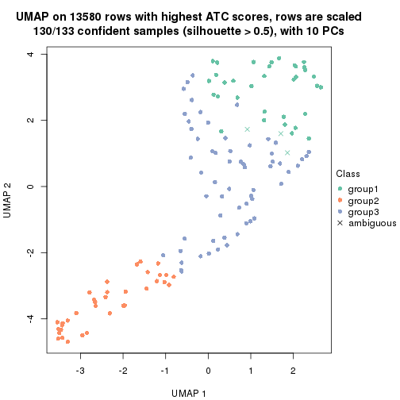</p>

</div>
<div id='tab-ATC-kmeans-dimension-reduction-3'>
<pre><code class="r">dimension_reduction(res, k = 4, method = &quot;UMAP&quot;)
</code></pre>

<p></p>

</div>
<div id='tab-ATC-kmeans-dimension-reduction-4'>
<pre><code class="r">dimension_reduction(res, k = 5, method = &quot;UMAP&quot;)
</code></pre>

<p></p>

</div>
<div id='tab-ATC-kmeans-dimension-reduction-5'>
<pre><code class="r">dimension_reduction(res, k = 6, method = &quot;UMAP&quot;)
</code></pre>

<p></p>

</div>
</div>


Following heatmap shows how subgroups are split when increasing `k`:

```r
collect_classes(res)
```


If matrix rows can be associated to genes, consider to use `functional_enrichment(res,
...)` to perform function enrichment for the signature genes. See [this vignette](http://bioconductor.org/packages/devel/bioc/vignettes/cola/inst/doc/functional_enrichment.html) for more detailed explanations.


 

---------------------------------------------------


### ATC:skmeans*


The object with results only for a single top-value method and a single partition method 
can be extracted as:

```r
res = res_list["ATC", "skmeans"]
# you can also extract it by
# res = res_list["ATC:skmeans"]
```

A summary of `res` and all the functions that can be applied to it:

```r
res
```

```
#> A 'ConsensusPartition' object with k = 2, 3, 4, 5, 6.
#>   On a matrix with 13580 rows and 133 columns.
#>   Top rows (1000, 2000, 3000, 4000, 5000) are extracted by 'ATC' method.
#>   Subgroups are detected by 'skmeans' method.
#>   Performed in total 1250 partitions by row resampling.
#>   Best k for subgroups seems to be 3.
#> 
#> Following methods can be applied to this 'ConsensusPartition' object:
#>  [1] "cola_report"             "collect_classes"         "collect_plots"          
#>  [4] "collect_stats"           "colnames"                "compare_signatures"     
#>  [7] "consensus_heatmap"       "dimension_reduction"     "functional_enrichment"  
#> [10] "get_anno_col"            "get_anno"                "get_classes"            
#> [13] "get_consensus"           "get_matrix"              "get_membership"         
#> [16] "get_param"               "get_signatures"          "get_stats"              
#> [19] "is_best_k"               "is_stable_k"             "membership_heatmap"     
#> [22] "ncol"                    "nrow"                    "plot_ecdf"              
#> [25] "rownames"                "select_partition_number" "show"                   
#> [28] "suggest_best_k"          "test_to_known_factors"
```

`collect_plots()` function collects all the plots made from `res` for all `k` (number of partitions)
into one single page to provide an easy and fast comparison between different `k`.

```r
collect_plots(res)
```


The plots are:

- The first row: a plot of the ECDF (empirical cumulative distribution
  function) curves of the consensus matrix for each `k` and the heatmap of
  predicted classes for each `k`.
- The second row: heatmaps of the consensus matrix for each `k`.
- The third row: heatmaps of the membership matrix for each `k`.
- The fouth row: heatmaps of the signatures for each `k`.

All the plots in panels can be made by individual functions and they are
plotted later in this section.

`select_partition_number()` produces several plots showing different
statistics for choosing "optimized" `k`. There are following statistics:

- ECDF curves of the consensus matrix for each `k`;
- 1-PAC. [The PAC
  score](https://en.wikipedia.org/wiki/Consensus_clustering#Over-interpretation_potential_of_consensus_clustering)
  measures the proportion of the ambiguous subgrouping.
- Mean silhouette score.
- Concordance. The mean probability of fiting the consensus class ids in all
  partitions.
- Area increased. Denote $A_k$ as the area under the ECDF curve for current
  `k`, the area increased is defined as $A_k - A_{k-1}$.
- Rand index. The percent of pairs of samples that are both in a same cluster
  or both are not in a same cluster in the partition of k and k-1.
- Jaccard index. The ratio of pairs of samples are both in a same cluster in
  the partition of k and k-1 and the pairs of samples are both in a same
  cluster in the partition k or k-1.

The detailed explanations of these statistics can be found in [the _cola_
vignette](http://bioconductor.org/packages/devel/bioc/vignettes/cola/inst/doc/cola.html#toc_13).

Generally speaking, lower PAC score, higher mean silhouette score or higher
concordance corresponds to better partition. Rand index and Jaccard index
measure how similar the current partition is compared to partition with `k-1`.
If they are too similar, we won't accept `k` is better than `k-1`.

```r
select_partition_number(res)
```


The numeric values for all these statistics can be obtained by `get_stats()`.

```r
get_stats(res)
```

```
#>   k 1-PAC mean_silhouette concordance area_increased  Rand Jaccard
#> 2 2 1.000           0.999       1.000         0.4916 0.509   0.509
#> 3 3 0.923           0.929       0.966         0.3161 0.811   0.637
#> 4 4 0.841           0.824       0.925         0.0553 0.876   0.683
#> 5 5 0.839           0.785       0.900         0.0518 0.888   0.689
#> 6 6 0.842           0.807       0.908         0.0555 0.912   0.719
```

`suggest_best_k()` suggests the best $k$ based on these statistics. The rules are as follows:

- All $k$ with Jaccard index larger than 0.95 are removed because increasing
  $k$ does not provide enough extra information. If all $k$ are removed, it is
  marked as no subgroup is detected.
- For all $k$ with 1-PAC score larger than 0.9, the maximal $k$ is taken as
  the best $k$, and other $k$ are marked as optional $k$.
- If it does not fit the second rule. The $k$ with the maximal vote of the
  highest 1-PAC score, highest mean silhouette, and highest concordance is
  taken as the best $k$.

```r
suggest_best_k(res)
```

```
#> [1] 3
#> attr(,"optional")
#> [1] 2
```

There is also optional best $k$ = 2 that is worth to check.

Following shows the table of the partitions (You need to click the **show/hide
code output** link to see it). The membership matrix (columns with name `p*`)
is inferred by
[`clue::cl_consensus()`](https://www.rdocumentation.org/link/cl_consensus?package=clue)
function with the `SE` method. Basically the value in the membership matrix
represents the probability to belong to a certain group. The finall class
label for an item is determined with the group with highest probability it
belongs to.

In `get_classes()` function, the entropy is calculated from the membership
matrix and the silhouette score is calculated from the consensus matrix.


<script>
$( function() {
	$( '#tabs-ATC-skmeans-get-classes' ).tabs();
} );
</script>
<div id='tabs-ATC-skmeans-get-classes'>
<ul>
<li><a href='#tab-ATC-skmeans-get-classes-1'>k = 2</a></li>
<li><a href='#tab-ATC-skmeans-get-classes-2'>k = 3</a></li>
<li><a href='#tab-ATC-skmeans-get-classes-3'>k = 4</a></li>
<li><a href='#tab-ATC-skmeans-get-classes-4'>k = 5</a></li>
<li><a href='#tab-ATC-skmeans-get-classes-5'>k = 6</a></li>
</ul>

<div id='tab-ATC-skmeans-get-classes-1'>
<p><a id='tab-ATC-skmeans-get-classes-1-a' style='color:#0366d6' href='#'>show/hide code output</a></p>
<pre><code class="r">cbind(get_classes(res, k = 2), get_membership(res, k = 2))
</code></pre>

<pre><code>#&gt;            class entropy silhouette    p1    p2
#&gt; SRR1951667     2  0.0000      0.999 0.000 1.000
#&gt; SRR1951666     2  0.0000      0.999 0.000 1.000
#&gt; SRR1951665     2  0.0000      0.999 0.000 1.000
#&gt; SRR1951664     1  0.0000      1.000 1.000 0.000
#&gt; SRR1951663     2  0.0672      0.991 0.008 0.992
#&gt; SRR1951662     2  0.0000      0.999 0.000 1.000
#&gt; SRR1951661     2  0.0000      0.999 0.000 1.000
#&gt; SRR1951660     1  0.0000      1.000 1.000 0.000
#&gt; SRR1951659     2  0.0000      0.999 0.000 1.000
#&gt; SRR1951658     2  0.0000      0.999 0.000 1.000
#&gt; SRR1951657     1  0.0000      1.000 1.000 0.000
#&gt; SRR1951656     1  0.0000      1.000 1.000 0.000
#&gt; SRR1951655     1  0.0000      1.000 1.000 0.000
#&gt; SRR1951654     1  0.0000      1.000 1.000 0.000
#&gt; SRR1951653     1  0.0000      1.000 1.000 0.000
#&gt; SRR1951652     2  0.0000      0.999 0.000 1.000
#&gt; SRR1951651     1  0.0000      1.000 1.000 0.000
#&gt; SRR1951650     1  0.0000      1.000 1.000 0.000
#&gt; SRR1951648     2  0.0000      0.999 0.000 1.000
#&gt; SRR1951649     1  0.0000      1.000 1.000 0.000
#&gt; SRR1951647     2  0.0000      0.999 0.000 1.000
#&gt; SRR1951646     1  0.0000      1.000 1.000 0.000
#&gt; SRR1951645     1  0.0000      1.000 1.000 0.000
#&gt; SRR1951644     1  0.0000      1.000 1.000 0.000
#&gt; SRR1951643     1  0.0000      1.000 1.000 0.000
#&gt; SRR1951641     2  0.0000      0.999 0.000 1.000
#&gt; SRR1951642     1  0.0000      1.000 1.000 0.000
#&gt; SRR1951694     1  0.0000      1.000 1.000 0.000
#&gt; SRR1951731     2  0.0000      0.999 0.000 1.000
#&gt; SRR1951730     2  0.0000      0.999 0.000 1.000
#&gt; SRR1951752     2  0.0000      0.999 0.000 1.000
#&gt; SRR1951751     1  0.0000      1.000 1.000 0.000
#&gt; SRR1951749     2  0.0000      0.999 0.000 1.000
#&gt; SRR1951750     1  0.0000      1.000 1.000 0.000
#&gt; SRR1951748     2  0.0000      0.999 0.000 1.000
#&gt; SRR1951747     2  0.0000      0.999 0.000 1.000
#&gt; SRR1951745     1  0.0000      1.000 1.000 0.000
#&gt; SRR1951746     2  0.0000      0.999 0.000 1.000
#&gt; SRR1951744     1  0.0000      1.000 1.000 0.000
#&gt; SRR1951742     2  0.0000      0.999 0.000 1.000
#&gt; SRR1951743     2  0.0000      0.999 0.000 1.000
#&gt; SRR1951741     1  0.0000      1.000 1.000 0.000
#&gt; SRR1951740     1  0.0000      1.000 1.000 0.000
#&gt; SRR1951738     2  0.0000      0.999 0.000 1.000
#&gt; SRR1951739     2  0.0000      0.999 0.000 1.000
#&gt; SRR1951737     1  0.0000      1.000 1.000 0.000
#&gt; SRR1951736     1  0.0000      1.000 1.000 0.000
#&gt; SRR1951734     2  0.0000      0.999 0.000 1.000
#&gt; SRR1951735     1  0.0000      1.000 1.000 0.000
#&gt; SRR1951733     2  0.0000      0.999 0.000 1.000
#&gt; SRR1951732     2  0.0000      0.999 0.000 1.000
#&gt; SRR1951729     1  0.0000      1.000 1.000 0.000
#&gt; SRR1951728     2  0.0000      0.999 0.000 1.000
#&gt; SRR1951727     2  0.0000      0.999 0.000 1.000
#&gt; SRR1951725     1  0.0000      1.000 1.000 0.000
#&gt; SRR1951726     2  0.0000      0.999 0.000 1.000
#&gt; SRR1951724     1  0.0000      1.000 1.000 0.000
#&gt; SRR1951722     1  0.0000      1.000 1.000 0.000
#&gt; SRR1951723     1  0.0000      1.000 1.000 0.000
#&gt; SRR1951721     2  0.0000      0.999 0.000 1.000
#&gt; SRR1951719     1  0.0000      1.000 1.000 0.000
#&gt; SRR1951720     1  0.0000      1.000 1.000 0.000
#&gt; SRR1951718     1  0.0000      1.000 1.000 0.000
#&gt; SRR1951717     1  0.0000      1.000 1.000 0.000
#&gt; SRR1951715     1  0.0000      1.000 1.000 0.000
#&gt; SRR1951716     1  0.0000      1.000 1.000 0.000
#&gt; SRR1951714     1  0.0000      1.000 1.000 0.000
#&gt; SRR1951713     1  0.0000      1.000 1.000 0.000
#&gt; SRR1951712     1  0.0000      1.000 1.000 0.000
#&gt; SRR1951711     2  0.0000      0.999 0.000 1.000
#&gt; SRR1951710     1  0.0000      1.000 1.000 0.000
#&gt; SRR1951709     2  0.0000      0.999 0.000 1.000
#&gt; SRR1951708     2  0.0000      0.999 0.000 1.000
#&gt; SRR1951707     2  0.0000      0.999 0.000 1.000
#&gt; SRR1951705     1  0.0000      1.000 1.000 0.000
#&gt; SRR1951704     1  0.0000      1.000 1.000 0.000
#&gt; SRR1951703     2  0.0000      0.999 0.000 1.000
#&gt; SRR1951706     1  0.0000      1.000 1.000 0.000
#&gt; SRR1951702     1  0.0000      1.000 1.000 0.000
#&gt; SRR1951701     2  0.0000      0.999 0.000 1.000
#&gt; SRR1951699     2  0.0000      0.999 0.000 1.000
#&gt; SRR1951698     2  0.0000      0.999 0.000 1.000
#&gt; SRR1951700     1  0.0000      1.000 1.000 0.000
#&gt; SRR1951697     2  0.0000      0.999 0.000 1.000
#&gt; SRR1951696     1  0.0000      1.000 1.000 0.000
#&gt; SRR1951695     1  0.0000      1.000 1.000 0.000
#&gt; SRR1951693     1  0.0000      1.000 1.000 0.000
#&gt; SRR1951692     1  0.0000      1.000 1.000 0.000
#&gt; SRR1951691     1  0.0000      1.000 1.000 0.000
#&gt; SRR1951688     2  0.0000      0.999 0.000 1.000
#&gt; SRR1951689     2  0.0000      0.999 0.000 1.000
#&gt; SRR1951687     1  0.0000      1.000 1.000 0.000
#&gt; SRR1951685     2  0.0000      0.999 0.000 1.000
#&gt; SRR1951684     1  0.0000      1.000 1.000 0.000
#&gt; SRR1951686     2  0.0000      0.999 0.000 1.000
#&gt; SRR1951683     1  0.0000      1.000 1.000 0.000
#&gt; SRR1951682     2  0.0000      0.999 0.000 1.000
#&gt; SRR1951690     2  0.0000      0.999 0.000 1.000
#&gt; SRR1951680     1  0.0000      1.000 1.000 0.000
#&gt; SRR1951679     1  0.0000      1.000 1.000 0.000
#&gt; SRR1951678     1  0.0000      1.000 1.000 0.000
#&gt; SRR1951677     1  0.0000      1.000 1.000 0.000
#&gt; SRR1951676     1  0.0000      1.000 1.000 0.000
#&gt; SRR1951675     2  0.0000      0.999 0.000 1.000
#&gt; SRR1951681     1  0.0000      1.000 1.000 0.000
#&gt; SRR1951673     2  0.0000      0.999 0.000 1.000
#&gt; SRR1951674     1  0.0000      1.000 1.000 0.000
#&gt; SRR1951672     1  0.0000      1.000 1.000 0.000
#&gt; SRR1951671     2  0.0000      0.999 0.000 1.000
#&gt; SRR1951670     1  0.0000      1.000 1.000 0.000
#&gt; SRR1951640     1  0.0000      1.000 1.000 0.000
#&gt; SRR1951668     1  0.0000      1.000 1.000 0.000
#&gt; SRR1951669     2  0.0000      0.999 0.000 1.000
#&gt; SRR1951638     1  0.0000      1.000 1.000 0.000
#&gt; SRR1951637     2  0.0000      0.999 0.000 1.000
#&gt; SRR1951635     1  0.0000      1.000 1.000 0.000
#&gt; SRR1951634     1  0.0000      1.000 1.000 0.000
#&gt; SRR1951631     1  0.0000      1.000 1.000 0.000
#&gt; SRR1951632     2  0.0000      0.999 0.000 1.000
#&gt; SRR1951633     1  0.0000      1.000 1.000 0.000
#&gt; SRR1951630     1  0.0000      1.000 1.000 0.000
#&gt; SRR1951629     1  0.0000      1.000 1.000 0.000
#&gt; SRR1951628     2  0.0000      0.999 0.000 1.000
#&gt; SRR1951627     2  0.0000      0.999 0.000 1.000
#&gt; SRR1951639     2  0.0000      0.999 0.000 1.000
#&gt; SRR1951625     2  0.0000      0.999 0.000 1.000
#&gt; SRR1951626     2  0.2603      0.954 0.044 0.956
#&gt; SRR1951624     1  0.0000      1.000 1.000 0.000
#&gt; SRR1951622     1  0.0000      1.000 1.000 0.000
#&gt; SRR1951636     1  0.0000      1.000 1.000 0.000
#&gt; SRR1951623     1  0.0000      1.000 1.000 0.000
#&gt; SRR1951621     1  0.0000      1.000 1.000 0.000
#&gt; SRR1951620     1  0.0000      1.000 1.000 0.000
</code></pre>

<script>
$('#tab-ATC-skmeans-get-classes-1-a').parent().next().next().hide();
$('#tab-ATC-skmeans-get-classes-1-a').click(function(){
  $('#tab-ATC-skmeans-get-classes-1-a').parent().next().next().toggle();
  return(false);
});
</script>
</div>

<div id='tab-ATC-skmeans-get-classes-2'>
<p><a id='tab-ATC-skmeans-get-classes-2-a' style='color:#0366d6' href='#'>show/hide code output</a></p>
<pre><code class="r">cbind(get_classes(res, k = 3), get_membership(res, k = 3))
</code></pre>

<pre><code>#&gt;            class entropy silhouette    p1    p2    p3
#&gt; SRR1951667     2  0.0000      0.991 0.000 1.000 0.000
#&gt; SRR1951666     2  0.0000      0.991 0.000 1.000 0.000
#&gt; SRR1951665     2  0.0000      0.991 0.000 1.000 0.000
#&gt; SRR1951664     3  0.0000      0.877 0.000 0.000 1.000
#&gt; SRR1951663     1  0.5216      0.590 0.740 0.260 0.000
#&gt; SRR1951662     2  0.0000      0.991 0.000 1.000 0.000
#&gt; SRR1951661     2  0.3482      0.850 0.000 0.872 0.128
#&gt; SRR1951660     1  0.0000      0.987 1.000 0.000 0.000
#&gt; SRR1951659     2  0.0000      0.991 0.000 1.000 0.000
#&gt; SRR1951658     2  0.0000      0.991 0.000 1.000 0.000
#&gt; SRR1951657     3  0.6126      0.484 0.400 0.000 0.600
#&gt; SRR1951656     3  0.6126      0.484 0.400 0.000 0.600
#&gt; SRR1951655     1  0.0000      0.987 1.000 0.000 0.000
#&gt; SRR1951654     1  0.0237      0.988 0.996 0.000 0.004
#&gt; SRR1951653     3  0.0747      0.873 0.016 0.000 0.984
#&gt; SRR1951652     2  0.0000      0.991 0.000 1.000 0.000
#&gt; SRR1951651     1  0.0237      0.988 0.996 0.000 0.004
#&gt; SRR1951650     3  0.0237      0.877 0.004 0.000 0.996
#&gt; SRR1951648     2  0.0000      0.991 0.000 1.000 0.000
#&gt; SRR1951649     1  0.0000      0.987 1.000 0.000 0.000
#&gt; SRR1951647     2  0.0000      0.991 0.000 1.000 0.000
#&gt; SRR1951646     3  0.6154      0.467 0.408 0.000 0.592
#&gt; SRR1951645     1  0.0000      0.987 1.000 0.000 0.000
#&gt; SRR1951644     1  0.0000      0.987 1.000 0.000 0.000
#&gt; SRR1951643     1  0.0237      0.988 0.996 0.000 0.004
#&gt; SRR1951641     2  0.0000      0.991 0.000 1.000 0.000
#&gt; SRR1951642     1  0.0237      0.988 0.996 0.000 0.004
#&gt; SRR1951694     1  0.0000      0.987 1.000 0.000 0.000
#&gt; SRR1951731     2  0.0000      0.991 0.000 1.000 0.000
#&gt; SRR1951730     2  0.0000      0.991 0.000 1.000 0.000
#&gt; SRR1951752     2  0.0000      0.991 0.000 1.000 0.000
#&gt; SRR1951751     1  0.0237      0.988 0.996 0.000 0.004
#&gt; SRR1951749     2  0.0000      0.991 0.000 1.000 0.000
#&gt; SRR1951750     1  0.0237      0.988 0.996 0.000 0.004
#&gt; SRR1951748     2  0.0000      0.991 0.000 1.000 0.000
#&gt; SRR1951747     2  0.0000      0.991 0.000 1.000 0.000
#&gt; SRR1951745     1  0.0000      0.987 1.000 0.000 0.000
#&gt; SRR1951746     2  0.0000      0.991 0.000 1.000 0.000
#&gt; SRR1951744     1  0.0237      0.988 0.996 0.000 0.004
#&gt; SRR1951742     2  0.0000      0.991 0.000 1.000 0.000
#&gt; SRR1951743     2  0.0000      0.991 0.000 1.000 0.000
#&gt; SRR1951741     1  0.0237      0.988 0.996 0.000 0.004
#&gt; SRR1951740     3  0.6026      0.525 0.376 0.000 0.624
#&gt; SRR1951738     2  0.0000      0.991 0.000 1.000 0.000
#&gt; SRR1951739     2  0.0000      0.991 0.000 1.000 0.000
#&gt; SRR1951737     3  0.0000      0.877 0.000 0.000 1.000
#&gt; SRR1951736     1  0.0000      0.987 1.000 0.000 0.000
#&gt; SRR1951734     2  0.0000      0.991 0.000 1.000 0.000
#&gt; SRR1951735     3  0.0000      0.877 0.000 0.000 1.000
#&gt; SRR1951733     2  0.0000      0.991 0.000 1.000 0.000
#&gt; SRR1951732     2  0.0000      0.991 0.000 1.000 0.000
#&gt; SRR1951729     3  0.0000      0.877 0.000 0.000 1.000
#&gt; SRR1951728     3  0.4399      0.709 0.000 0.188 0.812
#&gt; SRR1951727     2  0.0000      0.991 0.000 1.000 0.000
#&gt; SRR1951725     1  0.0000      0.987 1.000 0.000 0.000
#&gt; SRR1951726     2  0.0000      0.991 0.000 1.000 0.000
#&gt; SRR1951724     1  0.0237      0.988 0.996 0.000 0.004
#&gt; SRR1951722     3  0.0424      0.876 0.008 0.000 0.992
#&gt; SRR1951723     3  0.0424      0.876 0.008 0.000 0.992
#&gt; SRR1951721     2  0.4750      0.708 0.216 0.784 0.000
#&gt; SRR1951719     3  0.0237      0.877 0.004 0.000 0.996
#&gt; SRR1951720     1  0.0000      0.987 1.000 0.000 0.000
#&gt; SRR1951718     1  0.0000      0.987 1.000 0.000 0.000
#&gt; SRR1951717     1  0.0000      0.987 1.000 0.000 0.000
#&gt; SRR1951715     1  0.0000      0.987 1.000 0.000 0.000
#&gt; SRR1951716     1  0.0000      0.987 1.000 0.000 0.000
#&gt; SRR1951714     1  0.0237      0.988 0.996 0.000 0.004
#&gt; SRR1951713     3  0.0424      0.876 0.008 0.000 0.992
#&gt; SRR1951712     1  0.0237      0.988 0.996 0.000 0.004
#&gt; SRR1951711     2  0.0000      0.991 0.000 1.000 0.000
#&gt; SRR1951710     1  0.0000      0.987 1.000 0.000 0.000
#&gt; SRR1951709     2  0.0000      0.991 0.000 1.000 0.000
#&gt; SRR1951708     2  0.0000      0.991 0.000 1.000 0.000
#&gt; SRR1951707     2  0.0000      0.991 0.000 1.000 0.000
#&gt; SRR1951705     1  0.0000      0.987 1.000 0.000 0.000
#&gt; SRR1951704     3  0.0000      0.877 0.000 0.000 1.000
#&gt; SRR1951703     2  0.0000      0.991 0.000 1.000 0.000
#&gt; SRR1951706     1  0.0892      0.973 0.980 0.000 0.020
#&gt; SRR1951702     3  0.0000      0.877 0.000 0.000 1.000
#&gt; SRR1951701     2  0.0000      0.991 0.000 1.000 0.000
#&gt; SRR1951699     2  0.0000      0.991 0.000 1.000 0.000
#&gt; SRR1951698     2  0.3038      0.878 0.000 0.896 0.104
#&gt; SRR1951700     3  0.0237      0.877 0.004 0.000 0.996
#&gt; SRR1951697     2  0.0000      0.991 0.000 1.000 0.000
#&gt; SRR1951696     3  0.0000      0.877 0.000 0.000 1.000
#&gt; SRR1951695     3  0.0237      0.877 0.004 0.000 0.996
#&gt; SRR1951693     3  0.2448      0.842 0.076 0.000 0.924
#&gt; SRR1951692     1  0.2959      0.866 0.900 0.000 0.100
#&gt; SRR1951691     1  0.0000      0.987 1.000 0.000 0.000
#&gt; SRR1951688     2  0.0000      0.991 0.000 1.000 0.000
#&gt; SRR1951689     2  0.0000      0.991 0.000 1.000 0.000
#&gt; SRR1951687     1  0.0237      0.988 0.996 0.000 0.004
#&gt; SRR1951685     2  0.0000      0.991 0.000 1.000 0.000
#&gt; SRR1951684     3  0.0237      0.877 0.004 0.000 0.996
#&gt; SRR1951686     2  0.0000      0.991 0.000 1.000 0.000
#&gt; SRR1951683     1  0.0237      0.988 0.996 0.000 0.004
#&gt; SRR1951682     2  0.0000      0.991 0.000 1.000 0.000
#&gt; SRR1951690     2  0.0000      0.991 0.000 1.000 0.000
#&gt; SRR1951680     3  0.0424      0.876 0.008 0.000 0.992
#&gt; SRR1951679     3  0.4654      0.713 0.208 0.000 0.792
#&gt; SRR1951678     1  0.0237      0.988 0.996 0.000 0.004
#&gt; SRR1951677     1  0.0237      0.988 0.996 0.000 0.004
#&gt; SRR1951676     3  0.6299      0.286 0.476 0.000 0.524
#&gt; SRR1951675     2  0.0000      0.991 0.000 1.000 0.000
#&gt; SRR1951681     3  0.6126      0.484 0.400 0.000 0.600
#&gt; SRR1951673     2  0.0000      0.991 0.000 1.000 0.000
#&gt; SRR1951674     1  0.0000      0.987 1.000 0.000 0.000
#&gt; SRR1951672     1  0.0000      0.987 1.000 0.000 0.000
#&gt; SRR1951671     2  0.0000      0.991 0.000 1.000 0.000
#&gt; SRR1951670     1  0.0237      0.988 0.996 0.000 0.004
#&gt; SRR1951640     3  0.3752      0.795 0.144 0.000 0.856
#&gt; SRR1951668     1  0.0237      0.988 0.996 0.000 0.004
#&gt; SRR1951669     2  0.0000      0.991 0.000 1.000 0.000
#&gt; SRR1951638     1  0.0000      0.987 1.000 0.000 0.000
#&gt; SRR1951637     2  0.0000      0.991 0.000 1.000 0.000
#&gt; SRR1951635     1  0.0000      0.987 1.000 0.000 0.000
#&gt; SRR1951634     1  0.0237      0.988 0.996 0.000 0.004
#&gt; SRR1951631     1  0.0237      0.988 0.996 0.000 0.004
#&gt; SRR1951632     2  0.0000      0.991 0.000 1.000 0.000
#&gt; SRR1951633     1  0.0237      0.988 0.996 0.000 0.004
#&gt; SRR1951630     1  0.0237      0.988 0.996 0.000 0.004
#&gt; SRR1951629     1  0.0237      0.988 0.996 0.000 0.004
#&gt; SRR1951628     2  0.0000      0.991 0.000 1.000 0.000
#&gt; SRR1951627     2  0.0000      0.991 0.000 1.000 0.000
#&gt; SRR1951639     2  0.0000      0.991 0.000 1.000 0.000
#&gt; SRR1951625     2  0.0000      0.991 0.000 1.000 0.000
#&gt; SRR1951626     3  0.0000      0.877 0.000 0.000 1.000
#&gt; SRR1951624     3  0.0000      0.877 0.000 0.000 1.000
#&gt; SRR1951622     1  0.0000      0.987 1.000 0.000 0.000
#&gt; SRR1951636     3  0.0000      0.877 0.000 0.000 1.000
#&gt; SRR1951623     1  0.0237      0.988 0.996 0.000 0.004
#&gt; SRR1951621     1  0.0237      0.988 0.996 0.000 0.004
#&gt; SRR1951620     3  0.6126      0.484 0.400 0.000 0.600
</code></pre>

<script>
$('#tab-ATC-skmeans-get-classes-2-a').parent().next().next().hide();
$('#tab-ATC-skmeans-get-classes-2-a').click(function(){
  $('#tab-ATC-skmeans-get-classes-2-a').parent().next().next().toggle();
  return(false);
});
</script>
</div>

<div id='tab-ATC-skmeans-get-classes-3'>
<p><a id='tab-ATC-skmeans-get-classes-3-a' style='color:#0366d6' href='#'>show/hide code output</a></p>
<pre><code class="r">cbind(get_classes(res, k = 4), get_membership(res, k = 4))
</code></pre>

<pre><code>#&gt;            class entropy silhouette    p1    p2    p3    p4
#&gt; SRR1951667     2  0.0000     0.9775 0.000 1.000 0.000 0.000
#&gt; SRR1951666     2  0.0000     0.9775 0.000 1.000 0.000 0.000
#&gt; SRR1951665     2  0.0000     0.9775 0.000 1.000 0.000 0.000
#&gt; SRR1951664     3  0.0000     0.6657 0.000 0.000 1.000 0.000
#&gt; SRR1951663     1  0.0376     0.8429 0.992 0.004 0.000 0.004
#&gt; SRR1951662     2  0.0000     0.9775 0.000 1.000 0.000 0.000
#&gt; SRR1951661     3  0.5155    -0.0903 0.004 0.468 0.528 0.000
#&gt; SRR1951660     4  0.2589     0.8554 0.116 0.000 0.000 0.884
#&gt; SRR1951659     2  0.0000     0.9775 0.000 1.000 0.000 0.000
#&gt; SRR1951658     2  0.0000     0.9775 0.000 1.000 0.000 0.000
#&gt; SRR1951657     4  0.0336     0.9202 0.000 0.000 0.008 0.992
#&gt; SRR1951656     4  0.0592     0.9157 0.000 0.000 0.016 0.984
#&gt; SRR1951655     4  0.0000     0.9242 0.000 0.000 0.000 1.000
#&gt; SRR1951654     4  0.0000     0.9242 0.000 0.000 0.000 1.000
#&gt; SRR1951653     3  0.5112     0.5126 0.008 0.000 0.608 0.384
#&gt; SRR1951652     2  0.0000     0.9775 0.000 1.000 0.000 0.000
#&gt; SRR1951651     4  0.0000     0.9242 0.000 0.000 0.000 1.000
#&gt; SRR1951650     3  0.4222     0.6078 0.000 0.000 0.728 0.272
#&gt; SRR1951648     2  0.0000     0.9775 0.000 1.000 0.000 0.000
#&gt; SRR1951649     4  0.2345     0.8696 0.100 0.000 0.000 0.900
#&gt; SRR1951647     2  0.0000     0.9775 0.000 1.000 0.000 0.000
#&gt; SRR1951646     4  0.0707     0.9133 0.000 0.000 0.020 0.980
#&gt; SRR1951645     4  0.1022     0.9112 0.032 0.000 0.000 0.968
#&gt; SRR1951644     4  0.2530     0.8590 0.112 0.000 0.000 0.888
#&gt; SRR1951643     4  0.0000     0.9242 0.000 0.000 0.000 1.000
#&gt; SRR1951641     2  0.0000     0.9775 0.000 1.000 0.000 0.000
#&gt; SRR1951642     4  0.0000     0.9242 0.000 0.000 0.000 1.000
#&gt; SRR1951694     1  0.2973     0.7389 0.856 0.000 0.000 0.144
#&gt; SRR1951731     2  0.0000     0.9775 0.000 1.000 0.000 0.000
#&gt; SRR1951730     2  0.0000     0.9775 0.000 1.000 0.000 0.000
#&gt; SRR1951752     2  0.0000     0.9775 0.000 1.000 0.000 0.000
#&gt; SRR1951751     4  0.1557     0.8976 0.056 0.000 0.000 0.944
#&gt; SRR1951749     2  0.0000     0.9775 0.000 1.000 0.000 0.000
#&gt; SRR1951750     4  0.0000     0.9242 0.000 0.000 0.000 1.000
#&gt; SRR1951748     2  0.0000     0.9775 0.000 1.000 0.000 0.000
#&gt; SRR1951747     2  0.0000     0.9775 0.000 1.000 0.000 0.000
#&gt; SRR1951745     1  0.1389     0.8406 0.952 0.000 0.000 0.048
#&gt; SRR1951746     2  0.0000     0.9775 0.000 1.000 0.000 0.000
#&gt; SRR1951744     4  0.0000     0.9242 0.000 0.000 0.000 1.000
#&gt; SRR1951742     2  0.0000     0.9775 0.000 1.000 0.000 0.000
#&gt; SRR1951743     2  0.0000     0.9775 0.000 1.000 0.000 0.000
#&gt; SRR1951741     4  0.0000     0.9242 0.000 0.000 0.000 1.000
#&gt; SRR1951740     4  0.0469     0.9179 0.000 0.000 0.012 0.988
#&gt; SRR1951738     2  0.0000     0.9775 0.000 1.000 0.000 0.000
#&gt; SRR1951739     2  0.0000     0.9775 0.000 1.000 0.000 0.000
#&gt; SRR1951737     3  0.0000     0.6657 0.000 0.000 1.000 0.000
#&gt; SRR1951736     4  0.1557     0.8967 0.056 0.000 0.000 0.944
#&gt; SRR1951734     2  0.0000     0.9775 0.000 1.000 0.000 0.000
#&gt; SRR1951735     3  0.0188     0.6648 0.004 0.000 0.996 0.000
#&gt; SRR1951733     2  0.0000     0.9775 0.000 1.000 0.000 0.000
#&gt; SRR1951732     2  0.0000     0.9775 0.000 1.000 0.000 0.000
#&gt; SRR1951729     3  0.0000     0.6657 0.000 0.000 1.000 0.000
#&gt; SRR1951728     3  0.2593     0.5685 0.004 0.104 0.892 0.000
#&gt; SRR1951727     2  0.0000     0.9775 0.000 1.000 0.000 0.000
#&gt; SRR1951725     4  0.4972     0.1096 0.456 0.000 0.000 0.544
#&gt; SRR1951726     1  0.2408     0.7437 0.896 0.104 0.000 0.000
#&gt; SRR1951724     4  0.0000     0.9242 0.000 0.000 0.000 1.000
#&gt; SRR1951722     3  0.2999     0.6507 0.004 0.000 0.864 0.132
#&gt; SRR1951723     3  0.2408     0.6558 0.036 0.000 0.920 0.044
#&gt; SRR1951721     1  0.0336     0.8400 0.992 0.008 0.000 0.000
#&gt; SRR1951719     3  0.4776     0.5485 0.000 0.000 0.624 0.376
#&gt; SRR1951720     4  0.1792     0.8887 0.068 0.000 0.000 0.932
#&gt; SRR1951718     4  0.2589     0.8554 0.116 0.000 0.000 0.884
#&gt; SRR1951717     4  0.1792     0.8893 0.068 0.000 0.000 0.932
#&gt; SRR1951715     1  0.0188     0.8424 0.996 0.000 0.000 0.004
#&gt; SRR1951716     4  0.1716     0.8915 0.064 0.000 0.000 0.936
#&gt; SRR1951714     4  0.0000     0.9242 0.000 0.000 0.000 1.000
#&gt; SRR1951713     3  0.4961     0.4335 0.000 0.000 0.552 0.448
#&gt; SRR1951712     4  0.0000     0.9242 0.000 0.000 0.000 1.000
#&gt; SRR1951711     2  0.0000     0.9775 0.000 1.000 0.000 0.000
#&gt; SRR1951710     1  0.0188     0.8424 0.996 0.000 0.000 0.004
#&gt; SRR1951709     2  0.0000     0.9775 0.000 1.000 0.000 0.000
#&gt; SRR1951708     2  0.0000     0.9775 0.000 1.000 0.000 0.000
#&gt; SRR1951707     2  0.4677     0.5687 0.004 0.680 0.316 0.000
#&gt; SRR1951705     4  0.4605     0.5027 0.336 0.000 0.000 0.664
#&gt; SRR1951704     3  0.5248     0.5874 0.088 0.000 0.748 0.164
#&gt; SRR1951703     2  0.0000     0.9775 0.000 1.000 0.000 0.000
#&gt; SRR1951706     1  0.3523     0.7565 0.856 0.000 0.032 0.112
#&gt; SRR1951702     3  0.0188     0.6640 0.004 0.000 0.996 0.000
#&gt; SRR1951701     2  0.0000     0.9775 0.000 1.000 0.000 0.000
#&gt; SRR1951699     2  0.0188     0.9739 0.004 0.996 0.000 0.000
#&gt; SRR1951698     2  0.5004     0.4112 0.004 0.604 0.392 0.000
#&gt; SRR1951700     3  0.4972     0.4193 0.000 0.000 0.544 0.456
#&gt; SRR1951697     2  0.0000     0.9775 0.000 1.000 0.000 0.000
#&gt; SRR1951696     3  0.0000     0.6657 0.000 0.000 1.000 0.000
#&gt; SRR1951695     3  0.4961     0.4361 0.000 0.000 0.552 0.448
#&gt; SRR1951693     4  0.4008     0.5579 0.000 0.000 0.244 0.756
#&gt; SRR1951692     4  0.0188     0.9221 0.000 0.000 0.004 0.996
#&gt; SRR1951691     4  0.1211     0.9061 0.040 0.000 0.000 0.960
#&gt; SRR1951688     2  0.0000     0.9775 0.000 1.000 0.000 0.000
#&gt; SRR1951689     2  0.0000     0.9775 0.000 1.000 0.000 0.000
#&gt; SRR1951687     4  0.0000     0.9242 0.000 0.000 0.000 1.000
#&gt; SRR1951685     2  0.0000     0.9775 0.000 1.000 0.000 0.000
#&gt; SRR1951684     3  0.4933     0.4639 0.000 0.000 0.568 0.432
#&gt; SRR1951686     2  0.0000     0.9775 0.000 1.000 0.000 0.000
#&gt; SRR1951683     4  0.0000     0.9242 0.000 0.000 0.000 1.000
#&gt; SRR1951682     2  0.0000     0.9775 0.000 1.000 0.000 0.000
#&gt; SRR1951690     2  0.0000     0.9775 0.000 1.000 0.000 0.000
#&gt; SRR1951680     3  0.4961     0.4335 0.000 0.000 0.552 0.448
#&gt; SRR1951679     3  0.7375     0.2735 0.336 0.000 0.488 0.176
#&gt; SRR1951678     4  0.0000     0.9242 0.000 0.000 0.000 1.000
#&gt; SRR1951677     4  0.0000     0.9242 0.000 0.000 0.000 1.000
#&gt; SRR1951676     4  0.0188     0.9221 0.000 0.000 0.004 0.996
#&gt; SRR1951675     2  0.0000     0.9775 0.000 1.000 0.000 0.000
#&gt; SRR1951681     4  0.1022     0.9038 0.000 0.000 0.032 0.968
#&gt; SRR1951673     2  0.0000     0.9775 0.000 1.000 0.000 0.000
#&gt; SRR1951674     1  0.1389     0.8406 0.952 0.000 0.000 0.048
#&gt; SRR1951672     4  0.2011     0.8830 0.080 0.000 0.000 0.920
#&gt; SRR1951671     2  0.0000     0.9775 0.000 1.000 0.000 0.000
#&gt; SRR1951670     4  0.0000     0.9242 0.000 0.000 0.000 1.000
#&gt; SRR1951640     4  0.4331     0.4578 0.000 0.000 0.288 0.712
#&gt; SRR1951668     4  0.0000     0.9242 0.000 0.000 0.000 1.000
#&gt; SRR1951669     2  0.0000     0.9775 0.000 1.000 0.000 0.000
#&gt; SRR1951638     1  0.4989     0.0665 0.528 0.000 0.000 0.472
#&gt; SRR1951637     2  0.0000     0.9775 0.000 1.000 0.000 0.000
#&gt; SRR1951635     4  0.4977     0.0961 0.460 0.000 0.000 0.540
#&gt; SRR1951634     4  0.0000     0.9242 0.000 0.000 0.000 1.000
#&gt; SRR1951631     4  0.0000     0.9242 0.000 0.000 0.000 1.000
#&gt; SRR1951632     2  0.0000     0.9775 0.000 1.000 0.000 0.000
#&gt; SRR1951633     4  0.0000     0.9242 0.000 0.000 0.000 1.000
#&gt; SRR1951630     4  0.0000     0.9242 0.000 0.000 0.000 1.000
#&gt; SRR1951629     4  0.0000     0.9242 0.000 0.000 0.000 1.000
#&gt; SRR1951628     2  0.0000     0.9775 0.000 1.000 0.000 0.000
#&gt; SRR1951627     2  0.4741     0.5477 0.004 0.668 0.328 0.000
#&gt; SRR1951639     2  0.0000     0.9775 0.000 1.000 0.000 0.000
#&gt; SRR1951625     2  0.0000     0.9775 0.000 1.000 0.000 0.000
#&gt; SRR1951626     3  0.0188     0.6640 0.004 0.000 0.996 0.000
#&gt; SRR1951624     3  0.0000     0.6657 0.000 0.000 1.000 0.000
#&gt; SRR1951622     4  0.4605     0.5027 0.336 0.000 0.000 0.664
#&gt; SRR1951636     3  0.0188     0.6640 0.004 0.000 0.996 0.000
#&gt; SRR1951623     4  0.0000     0.9242 0.000 0.000 0.000 1.000
#&gt; SRR1951621     4  0.0000     0.9242 0.000 0.000 0.000 1.000
#&gt; SRR1951620     4  0.0592     0.9157 0.000 0.000 0.016 0.984
</code></pre>

<script>
$('#tab-ATC-skmeans-get-classes-3-a').parent().next().next().hide();
$('#tab-ATC-skmeans-get-classes-3-a').click(function(){
  $('#tab-ATC-skmeans-get-classes-3-a').parent().next().next().toggle();
  return(false);
});
</script>
</div>

<div id='tab-ATC-skmeans-get-classes-4'>
<p><a id='tab-ATC-skmeans-get-classes-4-a' style='color:#0366d6' href='#'>show/hide code output</a></p>
<pre><code class="r">cbind(get_classes(res, k = 5), get_membership(res, k = 5))
</code></pre>

<pre><code>#&gt;            class entropy silhouette    p1    p2    p3    p4    p5
#&gt; SRR1951667     2  0.0000     0.9972 0.000 1.000 0.000 0.000 0.000
#&gt; SRR1951666     2  0.0162     0.9934 0.000 0.996 0.004 0.000 0.000
#&gt; SRR1951665     2  0.0000     0.9972 0.000 1.000 0.000 0.000 0.000
#&gt; SRR1951664     3  0.2891     0.7172 0.176 0.000 0.824 0.000 0.000
#&gt; SRR1951663     5  0.0000     0.7830 0.000 0.000 0.000 0.000 1.000
#&gt; SRR1951662     2  0.0000     0.9972 0.000 1.000 0.000 0.000 0.000
#&gt; SRR1951661     3  0.1197     0.6945 0.000 0.048 0.952 0.000 0.000
#&gt; SRR1951660     1  0.4029     0.6737 0.680 0.000 0.000 0.316 0.004
#&gt; SRR1951659     2  0.0000     0.9972 0.000 1.000 0.000 0.000 0.000
#&gt; SRR1951658     2  0.0000     0.9972 0.000 1.000 0.000 0.000 0.000
#&gt; SRR1951657     4  0.1410     0.8128 0.060 0.000 0.000 0.940 0.000
#&gt; SRR1951656     4  0.1410     0.8128 0.060 0.000 0.000 0.940 0.000
#&gt; SRR1951655     4  0.0000     0.8359 0.000 0.000 0.000 1.000 0.000
#&gt; SRR1951654     4  0.0000     0.8359 0.000 0.000 0.000 1.000 0.000
#&gt; SRR1951653     1  0.2291     0.5435 0.908 0.000 0.036 0.056 0.000
#&gt; SRR1951652     2  0.0000     0.9972 0.000 1.000 0.000 0.000 0.000
#&gt; SRR1951651     4  0.0000     0.8359 0.000 0.000 0.000 1.000 0.000
#&gt; SRR1951650     4  0.6219     0.4070 0.260 0.000 0.196 0.544 0.000
#&gt; SRR1951648     2  0.0000     0.9972 0.000 1.000 0.000 0.000 0.000
#&gt; SRR1951649     1  0.3790     0.7171 0.724 0.000 0.000 0.272 0.004
#&gt; SRR1951647     2  0.0000     0.9972 0.000 1.000 0.000 0.000 0.000
#&gt; SRR1951646     4  0.1270     0.8168 0.052 0.000 0.000 0.948 0.000
#&gt; SRR1951645     4  0.4434    -0.1503 0.460 0.000 0.000 0.536 0.004
#&gt; SRR1951644     1  0.3635     0.7262 0.748 0.000 0.000 0.248 0.004
#&gt; SRR1951643     4  0.0000     0.8359 0.000 0.000 0.000 1.000 0.000
#&gt; SRR1951641     2  0.0000     0.9972 0.000 1.000 0.000 0.000 0.000
#&gt; SRR1951642     4  0.0000     0.8359 0.000 0.000 0.000 1.000 0.000
#&gt; SRR1951694     5  0.5569     0.2235 0.364 0.000 0.000 0.080 0.556
#&gt; SRR1951731     2  0.0000     0.9972 0.000 1.000 0.000 0.000 0.000
#&gt; SRR1951730     2  0.0000     0.9972 0.000 1.000 0.000 0.000 0.000
#&gt; SRR1951752     2  0.0000     0.9972 0.000 1.000 0.000 0.000 0.000
#&gt; SRR1951751     4  0.4029     0.5555 0.316 0.000 0.000 0.680 0.004
#&gt; SRR1951749     2  0.0000     0.9972 0.000 1.000 0.000 0.000 0.000
#&gt; SRR1951750     4  0.0000     0.8359 0.000 0.000 0.000 1.000 0.000
#&gt; SRR1951748     2  0.0000     0.9972 0.000 1.000 0.000 0.000 0.000
#&gt; SRR1951747     2  0.0000     0.9972 0.000 1.000 0.000 0.000 0.000
#&gt; SRR1951745     5  0.0000     0.7830 0.000 0.000 0.000 0.000 1.000
#&gt; SRR1951746     2  0.0000     0.9972 0.000 1.000 0.000 0.000 0.000
#&gt; SRR1951744     4  0.0162     0.8341 0.000 0.000 0.000 0.996 0.004
#&gt; SRR1951742     2  0.0000     0.9972 0.000 1.000 0.000 0.000 0.000
#&gt; SRR1951743     2  0.0000     0.9972 0.000 1.000 0.000 0.000 0.000
#&gt; SRR1951741     4  0.0000     0.8359 0.000 0.000 0.000 1.000 0.000
#&gt; SRR1951740     4  0.3508     0.6692 0.252 0.000 0.000 0.748 0.000
#&gt; SRR1951738     2  0.0000     0.9972 0.000 1.000 0.000 0.000 0.000
#&gt; SRR1951739     2  0.0000     0.9972 0.000 1.000 0.000 0.000 0.000
#&gt; SRR1951737     3  0.3586     0.6817 0.264 0.000 0.736 0.000 0.000
#&gt; SRR1951736     4  0.2338     0.7412 0.112 0.000 0.000 0.884 0.004
#&gt; SRR1951734     2  0.0000     0.9972 0.000 1.000 0.000 0.000 0.000
#&gt; SRR1951735     3  0.3684     0.6725 0.280 0.000 0.720 0.000 0.000
#&gt; SRR1951733     2  0.0000     0.9972 0.000 1.000 0.000 0.000 0.000
#&gt; SRR1951732     2  0.0000     0.9972 0.000 1.000 0.000 0.000 0.000
#&gt; SRR1951729     3  0.3274     0.7068 0.220 0.000 0.780 0.000 0.000
#&gt; SRR1951728     3  0.0404     0.7121 0.000 0.012 0.988 0.000 0.000
#&gt; SRR1951727     2  0.0000     0.9972 0.000 1.000 0.000 0.000 0.000
#&gt; SRR1951725     4  0.4897     0.0546 0.024 0.000 0.000 0.516 0.460
#&gt; SRR1951726     5  0.0162     0.7795 0.000 0.004 0.000 0.000 0.996
#&gt; SRR1951724     4  0.0000     0.8359 0.000 0.000 0.000 1.000 0.000
#&gt; SRR1951722     4  0.6717     0.1435 0.336 0.000 0.256 0.408 0.000
#&gt; SRR1951723     1  0.0794     0.5460 0.972 0.000 0.028 0.000 0.000
#&gt; SRR1951721     5  0.0000     0.7830 0.000 0.000 0.000 0.000 1.000
#&gt; SRR1951719     4  0.5570     0.5122 0.288 0.000 0.104 0.608 0.000
#&gt; SRR1951720     4  0.1430     0.7983 0.052 0.000 0.000 0.944 0.004
#&gt; SRR1951718     1  0.3884     0.7045 0.708 0.000 0.000 0.288 0.004
#&gt; SRR1951717     4  0.1485     0.8055 0.032 0.000 0.000 0.948 0.020
#&gt; SRR1951715     5  0.3508     0.5632 0.252 0.000 0.000 0.000 0.748
#&gt; SRR1951716     4  0.2389     0.7368 0.116 0.000 0.000 0.880 0.004
#&gt; SRR1951714     4  0.0000     0.8359 0.000 0.000 0.000 1.000 0.000
#&gt; SRR1951713     4  0.4990     0.5451 0.324 0.000 0.048 0.628 0.000
#&gt; SRR1951712     4  0.0703     0.8274 0.024 0.000 0.000 0.976 0.000
#&gt; SRR1951711     2  0.0000     0.9972 0.000 1.000 0.000 0.000 0.000
#&gt; SRR1951710     1  0.3816     0.3540 0.696 0.000 0.000 0.000 0.304
#&gt; SRR1951709     2  0.0000     0.9972 0.000 1.000 0.000 0.000 0.000
#&gt; SRR1951708     2  0.0000     0.9972 0.000 1.000 0.000 0.000 0.000
#&gt; SRR1951707     3  0.4182     0.3687 0.000 0.400 0.600 0.000 0.000
#&gt; SRR1951705     1  0.4649     0.7128 0.720 0.000 0.000 0.212 0.068
#&gt; SRR1951704     3  0.6682     0.1735 0.048 0.000 0.524 0.096 0.332
#&gt; SRR1951703     2  0.0000     0.9972 0.000 1.000 0.000 0.000 0.000
#&gt; SRR1951706     5  0.2329     0.7045 0.000 0.000 0.124 0.000 0.876
#&gt; SRR1951702     3  0.0290     0.7146 0.008 0.000 0.992 0.000 0.000
#&gt; SRR1951701     2  0.0000     0.9972 0.000 1.000 0.000 0.000 0.000
#&gt; SRR1951699     2  0.2179     0.8661 0.000 0.888 0.112 0.000 0.000
#&gt; SRR1951698     3  0.3730     0.4987 0.000 0.288 0.712 0.000 0.000
#&gt; SRR1951700     4  0.4822     0.5845 0.288 0.000 0.048 0.664 0.000
#&gt; SRR1951697     2  0.0000     0.9972 0.000 1.000 0.000 0.000 0.000
#&gt; SRR1951696     3  0.3579     0.6975 0.240 0.000 0.756 0.004 0.000
#&gt; SRR1951695     4  0.5104     0.5671 0.284 0.000 0.068 0.648 0.000
#&gt; SRR1951693     4  0.4206     0.6326 0.272 0.000 0.020 0.708 0.000
#&gt; SRR1951692     4  0.0000     0.8359 0.000 0.000 0.000 1.000 0.000
#&gt; SRR1951691     4  0.2848     0.7496 0.156 0.000 0.000 0.840 0.004
#&gt; SRR1951688     2  0.0000     0.9972 0.000 1.000 0.000 0.000 0.000
#&gt; SRR1951689     2  0.0000     0.9972 0.000 1.000 0.000 0.000 0.000
#&gt; SRR1951687     4  0.0000     0.8359 0.000 0.000 0.000 1.000 0.000
#&gt; SRR1951685     2  0.0000     0.9972 0.000 1.000 0.000 0.000 0.000
#&gt; SRR1951684     4  0.5285     0.5458 0.288 0.000 0.080 0.632 0.000
#&gt; SRR1951686     2  0.0000     0.9972 0.000 1.000 0.000 0.000 0.000
#&gt; SRR1951683     4  0.0000     0.8359 0.000 0.000 0.000 1.000 0.000
#&gt; SRR1951682     2  0.0000     0.9972 0.000 1.000 0.000 0.000 0.000
#&gt; SRR1951690     2  0.0000     0.9972 0.000 1.000 0.000 0.000 0.000
#&gt; SRR1951680     4  0.4843     0.5806 0.292 0.000 0.048 0.660 0.000
#&gt; SRR1951679     1  0.0898     0.5605 0.972 0.000 0.008 0.000 0.020
#&gt; SRR1951678     4  0.0000     0.8359 0.000 0.000 0.000 1.000 0.000
#&gt; SRR1951677     4  0.0000     0.8359 0.000 0.000 0.000 1.000 0.000
#&gt; SRR1951676     4  0.0000     0.8359 0.000 0.000 0.000 1.000 0.000
#&gt; SRR1951675     2  0.0000     0.9972 0.000 1.000 0.000 0.000 0.000
#&gt; SRR1951681     4  0.1205     0.8209 0.040 0.000 0.004 0.956 0.000
#&gt; SRR1951673     2  0.0000     0.9972 0.000 1.000 0.000 0.000 0.000
#&gt; SRR1951674     5  0.0000     0.7830 0.000 0.000 0.000 0.000 1.000
#&gt; SRR1951672     4  0.3550     0.5895 0.236 0.000 0.000 0.760 0.004
#&gt; SRR1951671     2  0.0000     0.9972 0.000 1.000 0.000 0.000 0.000
#&gt; SRR1951670     4  0.0000     0.8359 0.000 0.000 0.000 1.000 0.000
#&gt; SRR1951640     4  0.4141     0.6539 0.248 0.000 0.024 0.728 0.000
#&gt; SRR1951668     4  0.0000     0.8359 0.000 0.000 0.000 1.000 0.000
#&gt; SRR1951669     2  0.0000     0.9972 0.000 1.000 0.000 0.000 0.000
#&gt; SRR1951638     5  0.4268     0.1153 0.000 0.000 0.000 0.444 0.556
#&gt; SRR1951637     2  0.0000     0.9972 0.000 1.000 0.000 0.000 0.000
#&gt; SRR1951635     4  0.5334     0.0643 0.052 0.000 0.000 0.512 0.436
#&gt; SRR1951634     4  0.0000     0.8359 0.000 0.000 0.000 1.000 0.000
#&gt; SRR1951631     4  0.0000     0.8359 0.000 0.000 0.000 1.000 0.000
#&gt; SRR1951632     2  0.0000     0.9972 0.000 1.000 0.000 0.000 0.000
#&gt; SRR1951633     4  0.0000     0.8359 0.000 0.000 0.000 1.000 0.000
#&gt; SRR1951630     4  0.0000     0.8359 0.000 0.000 0.000 1.000 0.000
#&gt; SRR1951629     4  0.0000     0.8359 0.000 0.000 0.000 1.000 0.000
#&gt; SRR1951628     2  0.0000     0.9972 0.000 1.000 0.000 0.000 0.000
#&gt; SRR1951627     3  0.3366     0.5419 0.000 0.232 0.768 0.000 0.000
#&gt; SRR1951639     2  0.0162     0.9934 0.000 0.996 0.004 0.000 0.000
#&gt; SRR1951625     2  0.0000     0.9972 0.000 1.000 0.000 0.000 0.000
#&gt; SRR1951626     3  0.0000     0.7129 0.000 0.000 1.000 0.000 0.000
#&gt; SRR1951624     3  0.3424     0.6991 0.240 0.000 0.760 0.000 0.000
#&gt; SRR1951622     1  0.4679     0.7125 0.716 0.000 0.000 0.216 0.068
#&gt; SRR1951636     3  0.0000     0.7129 0.000 0.000 1.000 0.000 0.000
#&gt; SRR1951623     4  0.0000     0.8359 0.000 0.000 0.000 1.000 0.000
#&gt; SRR1951621     4  0.0000     0.8359 0.000 0.000 0.000 1.000 0.000
#&gt; SRR1951620     4  0.1410     0.8128 0.060 0.000 0.000 0.940 0.000
</code></pre>

<script>
$('#tab-ATC-skmeans-get-classes-4-a').parent().next().next().hide();
$('#tab-ATC-skmeans-get-classes-4-a').click(function(){
  $('#tab-ATC-skmeans-get-classes-4-a').parent().next().next().toggle();
  return(false);
});
</script>
</div>

<div id='tab-ATC-skmeans-get-classes-5'>
<p><a id='tab-ATC-skmeans-get-classes-5-a' style='color:#0366d6' href='#'>show/hide code output</a></p>
<pre><code class="r">cbind(get_classes(res, k = 6), get_membership(res, k = 6))
</code></pre>

<pre><code>#&gt;            class entropy silhouette    p1    p2    p3    p4    p5    p6
#&gt; SRR1951667     2  0.0000     0.9858 0.000 1.000 0.000 0.000 0.000 0.000
#&gt; SRR1951666     2  0.1863     0.8795 0.000 0.896 0.000 0.000 0.104 0.000
#&gt; SRR1951665     2  0.0000     0.9858 0.000 1.000 0.000 0.000 0.000 0.000
#&gt; SRR1951664     5  0.4246     0.0349 0.016 0.000 0.452 0.000 0.532 0.000
#&gt; SRR1951663     6  0.0146     0.9043 0.004 0.000 0.000 0.000 0.000 0.996
#&gt; SRR1951662     2  0.0000     0.9858 0.000 1.000 0.000 0.000 0.000 0.000
#&gt; SRR1951661     5  0.0146     0.8114 0.000 0.004 0.000 0.000 0.996 0.000
#&gt; SRR1951660     1  0.1814     0.7089 0.900 0.000 0.000 0.100 0.000 0.000
#&gt; SRR1951659     2  0.0000     0.9858 0.000 1.000 0.000 0.000 0.000 0.000
#&gt; SRR1951658     2  0.0000     0.9858 0.000 1.000 0.000 0.000 0.000 0.000
#&gt; SRR1951657     4  0.3409     0.4781 0.000 0.000 0.300 0.700 0.000 0.000
#&gt; SRR1951656     4  0.3727     0.2518 0.000 0.000 0.388 0.612 0.000 0.000
#&gt; SRR1951655     4  0.0000     0.8821 0.000 0.000 0.000 1.000 0.000 0.000
#&gt; SRR1951654     4  0.0000     0.8821 0.000 0.000 0.000 1.000 0.000 0.000
#&gt; SRR1951653     3  0.3894     0.3960 0.324 0.000 0.664 0.008 0.004 0.000
#&gt; SRR1951652     2  0.0000     0.9858 0.000 1.000 0.000 0.000 0.000 0.000
#&gt; SRR1951651     4  0.0000     0.8821 0.000 0.000 0.000 1.000 0.000 0.000
#&gt; SRR1951650     3  0.3287     0.7581 0.000 0.000 0.768 0.220 0.012 0.000
#&gt; SRR1951648     2  0.0363     0.9756 0.000 0.988 0.000 0.000 0.012 0.000
#&gt; SRR1951649     1  0.0865     0.7425 0.964 0.000 0.000 0.036 0.000 0.000
#&gt; SRR1951647     2  0.0000     0.9858 0.000 1.000 0.000 0.000 0.000 0.000
#&gt; SRR1951646     4  0.3706     0.2789 0.000 0.000 0.380 0.620 0.000 0.000
#&gt; SRR1951645     1  0.3515     0.4809 0.676 0.000 0.000 0.324 0.000 0.000
#&gt; SRR1951644     1  0.1625     0.7100 0.928 0.000 0.060 0.012 0.000 0.000
#&gt; SRR1951643     4  0.0000     0.8821 0.000 0.000 0.000 1.000 0.000 0.000
#&gt; SRR1951641     2  0.0000     0.9858 0.000 1.000 0.000 0.000 0.000 0.000
#&gt; SRR1951642     4  0.0000     0.8821 0.000 0.000 0.000 1.000 0.000 0.000
#&gt; SRR1951694     1  0.4441     0.5518 0.700 0.000 0.000 0.092 0.000 0.208
#&gt; SRR1951731     2  0.0000     0.9858 0.000 1.000 0.000 0.000 0.000 0.000
#&gt; SRR1951730     2  0.0000     0.9858 0.000 1.000 0.000 0.000 0.000 0.000
#&gt; SRR1951752     2  0.0000     0.9858 0.000 1.000 0.000 0.000 0.000 0.000
#&gt; SRR1951751     1  0.6093     0.1456 0.380 0.000 0.284 0.336 0.000 0.000
#&gt; SRR1951749     2  0.0146     0.9826 0.000 0.996 0.000 0.000 0.004 0.000
#&gt; SRR1951750     4  0.0000     0.8821 0.000 0.000 0.000 1.000 0.000 0.000
#&gt; SRR1951748     2  0.0000     0.9858 0.000 1.000 0.000 0.000 0.000 0.000
#&gt; SRR1951747     2  0.0000     0.9858 0.000 1.000 0.000 0.000 0.000 0.000
#&gt; SRR1951745     6  0.0146     0.9043 0.004 0.000 0.000 0.000 0.000 0.996
#&gt; SRR1951746     2  0.0000     0.9858 0.000 1.000 0.000 0.000 0.000 0.000
#&gt; SRR1951744     4  0.0146     0.8805 0.000 0.000 0.000 0.996 0.000 0.004
#&gt; SRR1951742     2  0.0000     0.9858 0.000 1.000 0.000 0.000 0.000 0.000
#&gt; SRR1951743     2  0.0000     0.9858 0.000 1.000 0.000 0.000 0.000 0.000
#&gt; SRR1951741     4  0.0000     0.8821 0.000 0.000 0.000 1.000 0.000 0.000
#&gt; SRR1951740     3  0.3330     0.6996 0.000 0.000 0.716 0.284 0.000 0.000
#&gt; SRR1951738     2  0.0000     0.9858 0.000 1.000 0.000 0.000 0.000 0.000
#&gt; SRR1951739     2  0.0000     0.9858 0.000 1.000 0.000 0.000 0.000 0.000
#&gt; SRR1951737     3  0.2278     0.6899 0.004 0.000 0.868 0.000 0.128 0.000
#&gt; SRR1951736     4  0.2260     0.7746 0.140 0.000 0.000 0.860 0.000 0.000
#&gt; SRR1951734     2  0.0000     0.9858 0.000 1.000 0.000 0.000 0.000 0.000
#&gt; SRR1951735     3  0.2527     0.6537 0.040 0.000 0.876 0.000 0.084 0.000
#&gt; SRR1951733     2  0.0000     0.9858 0.000 1.000 0.000 0.000 0.000 0.000
#&gt; SRR1951732     2  0.0000     0.9858 0.000 1.000 0.000 0.000 0.000 0.000
#&gt; SRR1951729     3  0.3729     0.4942 0.012 0.000 0.692 0.000 0.296 0.000
#&gt; SRR1951728     5  0.0508     0.8144 0.000 0.004 0.012 0.000 0.984 0.000
#&gt; SRR1951727     2  0.0000     0.9858 0.000 1.000 0.000 0.000 0.000 0.000
#&gt; SRR1951725     4  0.4265     0.6525 0.100 0.000 0.000 0.728 0.000 0.172
#&gt; SRR1951726     6  0.0146     0.9027 0.000 0.000 0.004 0.000 0.000 0.996
#&gt; SRR1951724     4  0.0000     0.8821 0.000 0.000 0.000 1.000 0.000 0.000
#&gt; SRR1951722     3  0.2322     0.7565 0.024 0.000 0.896 0.072 0.008 0.000
#&gt; SRR1951723     1  0.3717     0.4092 0.616 0.000 0.384 0.000 0.000 0.000
#&gt; SRR1951721     6  0.0291     0.9039 0.004 0.000 0.004 0.000 0.000 0.992
#&gt; SRR1951719     3  0.2070     0.7783 0.000 0.000 0.896 0.092 0.012 0.000
#&gt; SRR1951720     4  0.2178     0.7815 0.132 0.000 0.000 0.868 0.000 0.000
#&gt; SRR1951718     1  0.0790     0.7430 0.968 0.000 0.000 0.032 0.000 0.000
#&gt; SRR1951717     4  0.1663     0.8199 0.088 0.000 0.000 0.912 0.000 0.000
#&gt; SRR1951715     1  0.3817     0.2093 0.568 0.000 0.000 0.000 0.000 0.432
#&gt; SRR1951716     4  0.2597     0.7366 0.176 0.000 0.000 0.824 0.000 0.000
#&gt; SRR1951714     4  0.0000     0.8821 0.000 0.000 0.000 1.000 0.000 0.000
#&gt; SRR1951713     3  0.1908     0.7829 0.004 0.000 0.900 0.096 0.000 0.000
#&gt; SRR1951712     4  0.0622     0.8729 0.012 0.000 0.008 0.980 0.000 0.000
#&gt; SRR1951711     2  0.0000     0.9858 0.000 1.000 0.000 0.000 0.000 0.000
#&gt; SRR1951710     1  0.0790     0.7170 0.968 0.000 0.000 0.000 0.000 0.032
#&gt; SRR1951709     2  0.0260     0.9791 0.000 0.992 0.000 0.000 0.008 0.000
#&gt; SRR1951708     2  0.0000     0.9858 0.000 1.000 0.000 0.000 0.000 0.000
#&gt; SRR1951707     5  0.2340     0.6820 0.000 0.148 0.000 0.000 0.852 0.000
#&gt; SRR1951705     1  0.0790     0.7430 0.968 0.000 0.000 0.032 0.000 0.000
#&gt; SRR1951704     6  0.6909     0.2444 0.004 0.000 0.260 0.060 0.228 0.448
#&gt; SRR1951703     2  0.0000     0.9858 0.000 1.000 0.000 0.000 0.000 0.000
#&gt; SRR1951706     6  0.0508     0.8965 0.000 0.000 0.004 0.000 0.012 0.984
#&gt; SRR1951702     5  0.2122     0.7913 0.008 0.000 0.084 0.000 0.900 0.008
#&gt; SRR1951701     2  0.0000     0.9858 0.000 1.000 0.000 0.000 0.000 0.000
#&gt; SRR1951699     2  0.3684     0.3989 0.000 0.628 0.000 0.000 0.372 0.000
#&gt; SRR1951698     5  0.1814     0.7548 0.000 0.100 0.000 0.000 0.900 0.000
#&gt; SRR1951700     3  0.3052     0.7657 0.004 0.000 0.780 0.216 0.000 0.000
#&gt; SRR1951697     2  0.0000     0.9858 0.000 1.000 0.000 0.000 0.000 0.000
#&gt; SRR1951696     3  0.4162     0.5426 0.020 0.000 0.700 0.016 0.264 0.000
#&gt; SRR1951695     3  0.3293     0.7779 0.004 0.000 0.788 0.196 0.008 0.004
#&gt; SRR1951693     3  0.3081     0.7645 0.004 0.000 0.776 0.220 0.000 0.000
#&gt; SRR1951692     4  0.0000     0.8821 0.000 0.000 0.000 1.000 0.000 0.000
#&gt; SRR1951691     4  0.4756     0.4741 0.064 0.000 0.280 0.648 0.000 0.008
#&gt; SRR1951688     2  0.0000     0.9858 0.000 1.000 0.000 0.000 0.000 0.000
#&gt; SRR1951689     2  0.0000     0.9858 0.000 1.000 0.000 0.000 0.000 0.000
#&gt; SRR1951687     4  0.0000     0.8821 0.000 0.000 0.000 1.000 0.000 0.000
#&gt; SRR1951685     2  0.0000     0.9858 0.000 1.000 0.000 0.000 0.000 0.000
#&gt; SRR1951684     3  0.2300     0.7934 0.000 0.000 0.856 0.144 0.000 0.000
#&gt; SRR1951686     2  0.0000     0.9858 0.000 1.000 0.000 0.000 0.000 0.000
#&gt; SRR1951683     4  0.0000     0.8821 0.000 0.000 0.000 1.000 0.000 0.000
#&gt; SRR1951682     2  0.0000     0.9858 0.000 1.000 0.000 0.000 0.000 0.000
#&gt; SRR1951690     2  0.0000     0.9858 0.000 1.000 0.000 0.000 0.000 0.000
#&gt; SRR1951680     3  0.2378     0.7927 0.000 0.000 0.848 0.152 0.000 0.000
#&gt; SRR1951679     1  0.3221     0.5861 0.736 0.000 0.264 0.000 0.000 0.000
#&gt; SRR1951678     4  0.0000     0.8821 0.000 0.000 0.000 1.000 0.000 0.000
#&gt; SRR1951677     4  0.0000     0.8821 0.000 0.000 0.000 1.000 0.000 0.000
#&gt; SRR1951676     4  0.0363     0.8743 0.000 0.000 0.012 0.988 0.000 0.000
#&gt; SRR1951675     2  0.0000     0.9858 0.000 1.000 0.000 0.000 0.000 0.000
#&gt; SRR1951681     4  0.3314     0.5678 0.000 0.000 0.256 0.740 0.004 0.000
#&gt; SRR1951673     2  0.0000     0.9858 0.000 1.000 0.000 0.000 0.000 0.000
#&gt; SRR1951674     6  0.0146     0.9043 0.004 0.000 0.000 0.000 0.000 0.996
#&gt; SRR1951672     4  0.3634     0.4536 0.356 0.000 0.000 0.644 0.000 0.000
#&gt; SRR1951671     2  0.0000     0.9858 0.000 1.000 0.000 0.000 0.000 0.000
#&gt; SRR1951670     4  0.0000     0.8821 0.000 0.000 0.000 1.000 0.000 0.000
#&gt; SRR1951640     3  0.3330     0.6988 0.000 0.000 0.716 0.284 0.000 0.000
#&gt; SRR1951668     4  0.0000     0.8821 0.000 0.000 0.000 1.000 0.000 0.000
#&gt; SRR1951669     2  0.0000     0.9858 0.000 1.000 0.000 0.000 0.000 0.000
#&gt; SRR1951638     4  0.3953     0.5331 0.016 0.000 0.000 0.656 0.000 0.328
#&gt; SRR1951637     2  0.0000     0.9858 0.000 1.000 0.000 0.000 0.000 0.000
#&gt; SRR1951635     4  0.4634     0.5947 0.164 0.000 0.000 0.692 0.000 0.144
#&gt; SRR1951634     4  0.0000     0.8821 0.000 0.000 0.000 1.000 0.000 0.000
#&gt; SRR1951631     4  0.0000     0.8821 0.000 0.000 0.000 1.000 0.000 0.000
#&gt; SRR1951632     2  0.0000     0.9858 0.000 1.000 0.000 0.000 0.000 0.000
#&gt; SRR1951633     4  0.0000     0.8821 0.000 0.000 0.000 1.000 0.000 0.000
#&gt; SRR1951630     4  0.0000     0.8821 0.000 0.000 0.000 1.000 0.000 0.000
#&gt; SRR1951629     4  0.0000     0.8821 0.000 0.000 0.000 1.000 0.000 0.000
#&gt; SRR1951628     2  0.0000     0.9858 0.000 1.000 0.000 0.000 0.000 0.000
#&gt; SRR1951627     5  0.1387     0.7848 0.000 0.068 0.000 0.000 0.932 0.000
#&gt; SRR1951639     2  0.2135     0.8487 0.000 0.872 0.000 0.000 0.128 0.000
#&gt; SRR1951625     2  0.0000     0.9858 0.000 1.000 0.000 0.000 0.000 0.000
#&gt; SRR1951626     5  0.1152     0.8107 0.004 0.000 0.044 0.000 0.952 0.000
#&gt; SRR1951624     3  0.2402     0.6821 0.004 0.000 0.856 0.000 0.140 0.000
#&gt; SRR1951622     1  0.0790     0.7430 0.968 0.000 0.000 0.032 0.000 0.000
#&gt; SRR1951636     5  0.1531     0.8043 0.004 0.000 0.068 0.000 0.928 0.000
#&gt; SRR1951623     4  0.0000     0.8821 0.000 0.000 0.000 1.000 0.000 0.000
#&gt; SRR1951621     4  0.0000     0.8821 0.000 0.000 0.000 1.000 0.000 0.000
#&gt; SRR1951620     4  0.3756     0.2119 0.000 0.000 0.400 0.600 0.000 0.000
</code></pre>

<script>
$('#tab-ATC-skmeans-get-classes-5-a').parent().next().next().hide();
$('#tab-ATC-skmeans-get-classes-5-a').click(function(){
  $('#tab-ATC-skmeans-get-classes-5-a').parent().next().next().toggle();
  return(false);
});
</script>
</div>
</div>

Heatmaps for the consensus matrix. It visualizes the probability of two
samples to be in a same group.


<script>
$( function() {
	$( '#tabs-ATC-skmeans-consensus-heatmap' ).tabs();
} );
</script>
<div id='tabs-ATC-skmeans-consensus-heatmap'>
<ul>
<li><a href='#tab-ATC-skmeans-consensus-heatmap-1'>k = 2</a></li>
<li><a href='#tab-ATC-skmeans-consensus-heatmap-2'>k = 3</a></li>
<li><a href='#tab-ATC-skmeans-consensus-heatmap-3'>k = 4</a></li>
<li><a href='#tab-ATC-skmeans-consensus-heatmap-4'>k = 5</a></li>
<li><a href='#tab-ATC-skmeans-consensus-heatmap-5'>k = 6</a></li>
</ul>
<div id='tab-ATC-skmeans-consensus-heatmap-1'>
<pre><code class="r">consensus_heatmap(res, k = 2)
</code></pre>

<p></p>

</div>
<div id='tab-ATC-skmeans-consensus-heatmap-2'>
<pre><code class="r">consensus_heatmap(res, k = 3)
</code></pre>

<p></p>

</div>
<div id='tab-ATC-skmeans-consensus-heatmap-3'>
<pre><code class="r">consensus_heatmap(res, k = 4)
</code></pre>

<p></p>

</div>
<div id='tab-ATC-skmeans-consensus-heatmap-4'>
<pre><code class="r">consensus_heatmap(res, k = 5)
</code></pre>

<p></p>

</div>
<div id='tab-ATC-skmeans-consensus-heatmap-5'>
<pre><code class="r">consensus_heatmap(res, k = 6)
</code></pre>

<p></p>

</div>
</div>

Heatmaps for the membership of samples in all partitions to see how consistent they are:


<script>
$( function() {
	$( '#tabs-ATC-skmeans-membership-heatmap' ).tabs();
} );
</script>
<div id='tabs-ATC-skmeans-membership-heatmap'>
<ul>
<li><a href='#tab-ATC-skmeans-membership-heatmap-1'>k = 2</a></li>
<li><a href='#tab-ATC-skmeans-membership-heatmap-2'>k = 3</a></li>
<li><a href='#tab-ATC-skmeans-membership-heatmap-3'>k = 4</a></li>
<li><a href='#tab-ATC-skmeans-membership-heatmap-4'>k = 5</a></li>
<li><a href='#tab-ATC-skmeans-membership-heatmap-5'>k = 6</a></li>
</ul>
<div id='tab-ATC-skmeans-membership-heatmap-1'>
<pre><code class="r">membership_heatmap(res, k = 2)
</code></pre>

<p></p>

</div>
<div id='tab-ATC-skmeans-membership-heatmap-2'>
<pre><code class="r">membership_heatmap(res, k = 3)
</code></pre>

<p></p>

</div>
<div id='tab-ATC-skmeans-membership-heatmap-3'>
<pre><code class="r">membership_heatmap(res, k = 4)
</code></pre>

<p></p>

</div>
<div id='tab-ATC-skmeans-membership-heatmap-4'>
<pre><code class="r">membership_heatmap(res, k = 5)
</code></pre>

<p></p>

</div>
<div id='tab-ATC-skmeans-membership-heatmap-5'>
<pre><code class="r">membership_heatmap(res, k = 6)
</code></pre>

<p></p>

</div>
</div>

As soon as we have had the classes for columns, we can look for signatures
which are significantly different between classes which can be candidate marks
for certain classes. Following are the heatmaps for signatures.


Signature heatmaps where rows are scaled:


<script>
$( function() {
	$( '#tabs-ATC-skmeans-get-signatures' ).tabs();
} );
</script>
<div id='tabs-ATC-skmeans-get-signatures'>
<ul>
<li><a href='#tab-ATC-skmeans-get-signatures-1'>k = 2</a></li>
<li><a href='#tab-ATC-skmeans-get-signatures-2'>k = 3</a></li>
<li><a href='#tab-ATC-skmeans-get-signatures-3'>k = 4</a></li>
<li><a href='#tab-ATC-skmeans-get-signatures-4'>k = 5</a></li>
<li><a href='#tab-ATC-skmeans-get-signatures-5'>k = 6</a></li>
</ul>
<div id='tab-ATC-skmeans-get-signatures-1'>
<pre><code class="r">get_signatures(res, k = 2)
</code></pre>

<p></p>

</div>
<div id='tab-ATC-skmeans-get-signatures-2'>
<pre><code class="r">get_signatures(res, k = 3)
</code></pre>

<p></p>

</div>
<div id='tab-ATC-skmeans-get-signatures-3'>
<pre><code class="r">get_signatures(res, k = 4)
</code></pre>

<p></p>

</div>
<div id='tab-ATC-skmeans-get-signatures-4'>
<pre><code class="r">get_signatures(res, k = 5)
</code></pre>

<p></p>

</div>
<div id='tab-ATC-skmeans-get-signatures-5'>
<pre><code class="r">get_signatures(res, k = 6)
</code></pre>

<p></p>

</div>
</div>


Signature heatmaps where rows are not scaled:


<script>
$( function() {
	$( '#tabs-ATC-skmeans-get-signatures-no-scale' ).tabs();
} );
</script>
<div id='tabs-ATC-skmeans-get-signatures-no-scale'>
<ul>
<li><a href='#tab-ATC-skmeans-get-signatures-no-scale-1'>k = 2</a></li>
<li><a href='#tab-ATC-skmeans-get-signatures-no-scale-2'>k = 3</a></li>
<li><a href='#tab-ATC-skmeans-get-signatures-no-scale-3'>k = 4</a></li>
<li><a href='#tab-ATC-skmeans-get-signatures-no-scale-4'>k = 5</a></li>
<li><a href='#tab-ATC-skmeans-get-signatures-no-scale-5'>k = 6</a></li>
</ul>
<div id='tab-ATC-skmeans-get-signatures-no-scale-1'>
<pre><code class="r">get_signatures(res, k = 2, scale_rows = FALSE)
</code></pre>

<p></p>

</div>
<div id='tab-ATC-skmeans-get-signatures-no-scale-2'>
<pre><code class="r">get_signatures(res, k = 3, scale_rows = FALSE)
</code></pre>

<p></p>

</div>
<div id='tab-ATC-skmeans-get-signatures-no-scale-3'>
<pre><code class="r">get_signatures(res, k = 4, scale_rows = FALSE)
</code></pre>

<p></p>

</div>
<div id='tab-ATC-skmeans-get-signatures-no-scale-4'>
<pre><code class="r">get_signatures(res, k = 5, scale_rows = FALSE)
</code></pre>

<p></p>

</div>
<div id='tab-ATC-skmeans-get-signatures-no-scale-5'>
<pre><code class="r">get_signatures(res, k = 6, scale_rows = FALSE)
</code></pre>

<p></p>

</div>
</div>


Compare the overlap of signatures from different k:

```r
compare_signatures(res)
```


`get_signature()` returns a data frame invisibly. TO get the list of signatures, the function
call should be assigned to a variable explicitly. In following code, if `plot` argument is set
to `FALSE`, no heatmap is plotted while only the differential analysis is performed.

```r
# code only for demonstration
tb = get_signature(res, k = ..., plot = FALSE)
```

An example of the output of `tb` is:

```
#>   which_row         fdr    mean_1    mean_2 scaled_mean_1 scaled_mean_2 km
#> 1        38 0.042760348  8.373488  9.131774    -0.5533452     0.5164555  1
#> 2        40 0.018707592  7.106213  8.469186    -0.6173731     0.5762149  1
#> 3        55 0.019134737 10.221463 11.207825    -0.6159697     0.5749050  1
#> 4        59 0.006059896  5.921854  7.869574    -0.6899429     0.6439467  1
#> 5        60 0.018055526  8.928898 10.211722    -0.6204761     0.5791110  1
#> 6        98 0.009384629 15.714769 14.887706     0.6635654    -0.6193277  2
...
```

The columns in `tb` are:

1. `which_row`: row indices corresponding to the input matrix.
2. `fdr`: FDR for the differential test. 
3. `mean_x`: The mean value in group x.
4. `scaled_mean_x`: The mean value in group x after rows are scaled.
5. `km`: Row groups if k-means clustering is applied to rows.


UMAP plot which shows how samples are separated.


<script>
$( function() {
	$( '#tabs-ATC-skmeans-dimension-reduction' ).tabs();
} );
</script>
<div id='tabs-ATC-skmeans-dimension-reduction'>
<ul>
<li><a href='#tab-ATC-skmeans-dimension-reduction-1'>k = 2</a></li>
<li><a href='#tab-ATC-skmeans-dimension-reduction-2'>k = 3</a></li>
<li><a href='#tab-ATC-skmeans-dimension-reduction-3'>k = 4</a></li>
<li><a href='#tab-ATC-skmeans-dimension-reduction-4'>k = 5</a></li>
<li><a href='#tab-ATC-skmeans-dimension-reduction-5'>k = 6</a></li>
</ul>
<div id='tab-ATC-skmeans-dimension-reduction-1'>
<pre><code class="r">dimension_reduction(res, k = 2, method = &quot;UMAP&quot;)
</code></pre>

<p></p>

</div>
<div id='tab-ATC-skmeans-dimension-reduction-2'>
<pre><code class="r">dimension_reduction(res, k = 3, method = &quot;UMAP&quot;)
</code></pre>

<p></p>

</div>
<div id='tab-ATC-skmeans-dimension-reduction-3'>
<pre><code class="r">dimension_reduction(res, k = 4, method = &quot;UMAP&quot;)
</code></pre>

<p></p>

</div>
<div id='tab-ATC-skmeans-dimension-reduction-4'>
<pre><code class="r">dimension_reduction(res, k = 5, method = &quot;UMAP&quot;)
</code></pre>

<p></p>

</div>
<div id='tab-ATC-skmeans-dimension-reduction-5'>
<pre><code class="r">dimension_reduction(res, k = 6, method = &quot;UMAP&quot;)
</code></pre>

<p></p>

</div>
</div>


Following heatmap shows how subgroups are split when increasing `k`:

```r
collect_classes(res)
```


If matrix rows can be associated to genes, consider to use `functional_enrichment(res,
...)` to perform function enrichment for the signature genes. See [this vignette](http://bioconductor.org/packages/devel/bioc/vignettes/cola/inst/doc/functional_enrichment.html) for more detailed explanations.


 

---------------------------------------------------


### ATC:pam**


The object with results only for a single top-value method and a single partition method 
can be extracted as:

```r
res = res_list["ATC", "pam"]
# you can also extract it by
# res = res_list["ATC:pam"]
```

A summary of `res` and all the functions that can be applied to it:

```r
res
```

```
#> A 'ConsensusPartition' object with k = 2, 3, 4, 5, 6.
#>   On a matrix with 13580 rows and 133 columns.
#>   Top rows (1000, 2000, 3000, 4000, 5000) are extracted by 'ATC' method.
#>   Subgroups are detected by 'pam' method.
#>   Performed in total 1250 partitions by row resampling.
#>   Best k for subgroups seems to be 6.
#> 
#> Following methods can be applied to this 'ConsensusPartition' object:
#>  [1] "cola_report"             "collect_classes"         "collect_plots"          
#>  [4] "collect_stats"           "colnames"                "compare_signatures"     
#>  [7] "consensus_heatmap"       "dimension_reduction"     "functional_enrichment"  
#> [10] "get_anno_col"            "get_anno"                "get_classes"            
#> [13] "get_consensus"           "get_matrix"              "get_membership"         
#> [16] "get_param"               "get_signatures"          "get_stats"              
#> [19] "is_best_k"               "is_stable_k"             "membership_heatmap"     
#> [22] "ncol"                    "nrow"                    "plot_ecdf"              
#> [25] "rownames"                "select_partition_number" "show"                   
#> [28] "suggest_best_k"          "test_to_known_factors"
```

`collect_plots()` function collects all the plots made from `res` for all `k` (number of partitions)
into one single page to provide an easy and fast comparison between different `k`.

```r
collect_plots(res)
```


The plots are:

- The first row: a plot of the ECDF (empirical cumulative distribution
  function) curves of the consensus matrix for each `k` and the heatmap of
  predicted classes for each `k`.
- The second row: heatmaps of the consensus matrix for each `k`.
- The third row: heatmaps of the membership matrix for each `k`.
- The fouth row: heatmaps of the signatures for each `k`.

All the plots in panels can be made by individual functions and they are
plotted later in this section.

`select_partition_number()` produces several plots showing different
statistics for choosing "optimized" `k`. There are following statistics:

- ECDF curves of the consensus matrix for each `k`;
- 1-PAC. [The PAC
  score](https://en.wikipedia.org/wiki/Consensus_clustering#Over-interpretation_potential_of_consensus_clustering)
  measures the proportion of the ambiguous subgrouping.
- Mean silhouette score.
- Concordance. The mean probability of fiting the consensus class ids in all
  partitions.
- Area increased. Denote $A_k$ as the area under the ECDF curve for current
  `k`, the area increased is defined as $A_k - A_{k-1}$.
- Rand index. The percent of pairs of samples that are both in a same cluster
  or both are not in a same cluster in the partition of k and k-1.
- Jaccard index. The ratio of pairs of samples are both in a same cluster in
  the partition of k and k-1 and the pairs of samples are both in a same
  cluster in the partition k or k-1.

The detailed explanations of these statistics can be found in [the _cola_
vignette](http://bioconductor.org/packages/devel/bioc/vignettes/cola/inst/doc/cola.html#toc_13).

Generally speaking, lower PAC score, higher mean silhouette score or higher
concordance corresponds to better partition. Rand index and Jaccard index
measure how similar the current partition is compared to partition with `k-1`.
If they are too similar, we won't accept `k` is better than `k-1`.

```r
select_partition_number(res)
```


The numeric values for all these statistics can be obtained by `get_stats()`.

```r
get_stats(res)
```

```
#>   k 1-PAC mean_silhouette concordance area_increased  Rand Jaccard
#> 2 2 1.000           0.977       0.990         0.4756 0.520   0.520
#> 3 3 1.000           0.984       0.993         0.3608 0.682   0.466
#> 4 4 0.950           0.920       0.969         0.1123 0.902   0.732
#> 5 5 0.947           0.916       0.965         0.1084 0.908   0.683
#> 6 6 0.970           0.928       0.967         0.0333 0.937   0.715
```

`suggest_best_k()` suggests the best $k$ based on these statistics. The rules are as follows:

- All $k$ with Jaccard index larger than 0.95 are removed because increasing
  $k$ does not provide enough extra information. If all $k$ are removed, it is
  marked as no subgroup is detected.
- For all $k$ with 1-PAC score larger than 0.9, the maximal $k$ is taken as
  the best $k$, and other $k$ are marked as optional $k$.
- If it does not fit the second rule. The $k$ with the maximal vote of the
  highest 1-PAC score, highest mean silhouette, and highest concordance is
  taken as the best $k$.

```r
suggest_best_k(res)
```

```
#> [1] 6
#> attr(,"optional")
#> [1] 2 3 4 5
```

There is also optional best $k$ = 2 3 4 5 that is worth to check.

Following shows the table of the partitions (You need to click the **show/hide
code output** link to see it). The membership matrix (columns with name `p*`)
is inferred by
[`clue::cl_consensus()`](https://www.rdocumentation.org/link/cl_consensus?package=clue)
function with the `SE` method. Basically the value in the membership matrix
represents the probability to belong to a certain group. The finall class
label for an item is determined with the group with highest probability it
belongs to.

In `get_classes()` function, the entropy is calculated from the membership
matrix and the silhouette score is calculated from the consensus matrix.


<script>
$( function() {
	$( '#tabs-ATC-pam-get-classes' ).tabs();
} );
</script>
<div id='tabs-ATC-pam-get-classes'>
<ul>
<li><a href='#tab-ATC-pam-get-classes-1'>k = 2</a></li>
<li><a href='#tab-ATC-pam-get-classes-2'>k = 3</a></li>
<li><a href='#tab-ATC-pam-get-classes-3'>k = 4</a></li>
<li><a href='#tab-ATC-pam-get-classes-4'>k = 5</a></li>
<li><a href='#tab-ATC-pam-get-classes-5'>k = 6</a></li>
</ul>

<div id='tab-ATC-pam-get-classes-1'>
<p><a id='tab-ATC-pam-get-classes-1-a' style='color:#0366d6' href='#'>show/hide code output</a></p>
<pre><code class="r">cbind(get_classes(res, k = 2), get_membership(res, k = 2))
</code></pre>

<pre><code>#&gt;            class entropy silhouette    p1    p2
#&gt; SRR1951667     2   0.000      0.975 0.000 1.000
#&gt; SRR1951666     2   0.000      0.975 0.000 1.000
#&gt; SRR1951665     2   0.000      0.975 0.000 1.000
#&gt; SRR1951664     1   0.000      1.000 1.000 0.000
#&gt; SRR1951663     1   0.000      1.000 1.000 0.000
#&gt; SRR1951662     2   0.000      0.975 0.000 1.000
#&gt; SRR1951661     2   0.861      0.622 0.284 0.716
#&gt; SRR1951660     1   0.000      1.000 1.000 0.000
#&gt; SRR1951659     2   0.000      0.975 0.000 1.000
#&gt; SRR1951658     2   0.000      0.975 0.000 1.000
#&gt; SRR1951657     1   0.000      1.000 1.000 0.000
#&gt; SRR1951656     1   0.000      1.000 1.000 0.000
#&gt; SRR1951655     1   0.000      1.000 1.000 0.000
#&gt; SRR1951654     1   0.000      1.000 1.000 0.000
#&gt; SRR1951653     1   0.000      1.000 1.000 0.000
#&gt; SRR1951652     2   0.000      0.975 0.000 1.000
#&gt; SRR1951651     1   0.000      1.000 1.000 0.000
#&gt; SRR1951650     1   0.000      1.000 1.000 0.000
#&gt; SRR1951648     2   0.000      0.975 0.000 1.000
#&gt; SRR1951649     1   0.000      1.000 1.000 0.000
#&gt; SRR1951647     2   0.000      0.975 0.000 1.000
#&gt; SRR1951646     1   0.000      1.000 1.000 0.000
#&gt; SRR1951645     1   0.000      1.000 1.000 0.000
#&gt; SRR1951644     1   0.000      1.000 1.000 0.000
#&gt; SRR1951643     1   0.000      1.000 1.000 0.000
#&gt; SRR1951641     2   0.000      0.975 0.000 1.000
#&gt; SRR1951642     1   0.000      1.000 1.000 0.000
#&gt; SRR1951694     1   0.000      1.000 1.000 0.000
#&gt; SRR1951731     2   0.000      0.975 0.000 1.000
#&gt; SRR1951730     2   0.000      0.975 0.000 1.000
#&gt; SRR1951752     2   0.000      0.975 0.000 1.000
#&gt; SRR1951751     1   0.000      1.000 1.000 0.000
#&gt; SRR1951749     2   0.000      0.975 0.000 1.000
#&gt; SRR1951750     1   0.000      1.000 1.000 0.000
#&gt; SRR1951748     2   0.000      0.975 0.000 1.000
#&gt; SRR1951747     2   0.000      0.975 0.000 1.000
#&gt; SRR1951745     1   0.000      1.000 1.000 0.000
#&gt; SRR1951746     2   0.000      0.975 0.000 1.000
#&gt; SRR1951744     1   0.000      1.000 1.000 0.000
#&gt; SRR1951742     2   0.000      0.975 0.000 1.000
#&gt; SRR1951743     2   0.000      0.975 0.000 1.000
#&gt; SRR1951741     1   0.000      1.000 1.000 0.000
#&gt; SRR1951740     1   0.000      1.000 1.000 0.000
#&gt; SRR1951738     2   0.000      0.975 0.000 1.000
#&gt; SRR1951739     2   0.000      0.975 0.000 1.000
#&gt; SRR1951737     1   0.000      1.000 1.000 0.000
#&gt; SRR1951736     1   0.000      1.000 1.000 0.000
#&gt; SRR1951734     2   0.000      0.975 0.000 1.000
#&gt; SRR1951735     1   0.000      1.000 1.000 0.000
#&gt; SRR1951733     2   0.000      0.975 0.000 1.000
#&gt; SRR1951732     2   0.000      0.975 0.000 1.000
#&gt; SRR1951729     1   0.000      1.000 1.000 0.000
#&gt; SRR1951728     1   0.000      1.000 1.000 0.000
#&gt; SRR1951727     2   0.000      0.975 0.000 1.000
#&gt; SRR1951725     1   0.000      1.000 1.000 0.000
#&gt; SRR1951726     1   0.000      1.000 1.000 0.000
#&gt; SRR1951724     1   0.000      1.000 1.000 0.000
#&gt; SRR1951722     1   0.000      1.000 1.000 0.000
#&gt; SRR1951723     1   0.000      1.000 1.000 0.000
#&gt; SRR1951721     2   0.998      0.147 0.472 0.528
#&gt; SRR1951719     1   0.000      1.000 1.000 0.000
#&gt; SRR1951720     1   0.000      1.000 1.000 0.000
#&gt; SRR1951718     1   0.000      1.000 1.000 0.000
#&gt; SRR1951717     1   0.000      1.000 1.000 0.000
#&gt; SRR1951715     1   0.000      1.000 1.000 0.000
#&gt; SRR1951716     1   0.000      1.000 1.000 0.000
#&gt; SRR1951714     1   0.000      1.000 1.000 0.000
#&gt; SRR1951713     1   0.000      1.000 1.000 0.000
#&gt; SRR1951712     1   0.000      1.000 1.000 0.000
#&gt; SRR1951711     2   0.000      0.975 0.000 1.000
#&gt; SRR1951710     1   0.000      1.000 1.000 0.000
#&gt; SRR1951709     2   0.000      0.975 0.000 1.000
#&gt; SRR1951708     2   0.000      0.975 0.000 1.000
#&gt; SRR1951707     2   0.482      0.876 0.104 0.896
#&gt; SRR1951705     1   0.000      1.000 1.000 0.000
#&gt; SRR1951704     1   0.000      1.000 1.000 0.000
#&gt; SRR1951703     2   0.000      0.975 0.000 1.000
#&gt; SRR1951706     1   0.000      1.000 1.000 0.000
#&gt; SRR1951702     1   0.000      1.000 1.000 0.000
#&gt; SRR1951701     2   0.000      0.975 0.000 1.000
#&gt; SRR1951699     2   0.000      0.975 0.000 1.000
#&gt; SRR1951698     2   0.671      0.790 0.176 0.824
#&gt; SRR1951700     1   0.000      1.000 1.000 0.000
#&gt; SRR1951697     2   0.000      0.975 0.000 1.000
#&gt; SRR1951696     1   0.000      1.000 1.000 0.000
#&gt; SRR1951695     1   0.000      1.000 1.000 0.000
#&gt; SRR1951693     1   0.000      1.000 1.000 0.000
#&gt; SRR1951692     1   0.000      1.000 1.000 0.000
#&gt; SRR1951691     1   0.000      1.000 1.000 0.000
#&gt; SRR1951688     2   0.000      0.975 0.000 1.000
#&gt; SRR1951689     2   0.000      0.975 0.000 1.000
#&gt; SRR1951687     1   0.000      1.000 1.000 0.000
#&gt; SRR1951685     2   0.000      0.975 0.000 1.000
#&gt; SRR1951684     1   0.000      1.000 1.000 0.000
#&gt; SRR1951686     2   0.000      0.975 0.000 1.000
#&gt; SRR1951683     1   0.000      1.000 1.000 0.000
#&gt; SRR1951682     2   0.000      0.975 0.000 1.000
#&gt; SRR1951690     2   0.000      0.975 0.000 1.000
#&gt; SRR1951680     1   0.000      1.000 1.000 0.000
#&gt; SRR1951679     1   0.000      1.000 1.000 0.000
#&gt; SRR1951678     1   0.000      1.000 1.000 0.000
#&gt; SRR1951677     1   0.000      1.000 1.000 0.000
#&gt; SRR1951676     1   0.000      1.000 1.000 0.000
#&gt; SRR1951675     2   0.000      0.975 0.000 1.000
#&gt; SRR1951681     1   0.000      1.000 1.000 0.000
#&gt; SRR1951673     2   0.000      0.975 0.000 1.000
#&gt; SRR1951674     1   0.000      1.000 1.000 0.000
#&gt; SRR1951672     1   0.000      1.000 1.000 0.000
#&gt; SRR1951671     2   0.000      0.975 0.000 1.000
#&gt; SRR1951670     1   0.000      1.000 1.000 0.000
#&gt; SRR1951640     1   0.000      1.000 1.000 0.000
#&gt; SRR1951668     1   0.000      1.000 1.000 0.000
#&gt; SRR1951669     2   0.000      0.975 0.000 1.000
#&gt; SRR1951638     1   0.000      1.000 1.000 0.000
#&gt; SRR1951637     2   0.000      0.975 0.000 1.000
#&gt; SRR1951635     1   0.000      1.000 1.000 0.000
#&gt; SRR1951634     1   0.000      1.000 1.000 0.000
#&gt; SRR1951631     1   0.000      1.000 1.000 0.000
#&gt; SRR1951632     2   0.000      0.975 0.000 1.000
#&gt; SRR1951633     1   0.000      1.000 1.000 0.000
#&gt; SRR1951630     1   0.000      1.000 1.000 0.000
#&gt; SRR1951629     1   0.000      1.000 1.000 0.000
#&gt; SRR1951628     2   0.000      0.975 0.000 1.000
#&gt; SRR1951627     2   0.788      0.704 0.236 0.764
#&gt; SRR1951639     2   0.000      0.975 0.000 1.000
#&gt; SRR1951625     2   0.000      0.975 0.000 1.000
#&gt; SRR1951626     1   0.000      1.000 1.000 0.000
#&gt; SRR1951624     1   0.000      1.000 1.000 0.000
#&gt; SRR1951622     1   0.000      1.000 1.000 0.000
#&gt; SRR1951636     1   0.000      1.000 1.000 0.000
#&gt; SRR1951623     1   0.000      1.000 1.000 0.000
#&gt; SRR1951621     1   0.000      1.000 1.000 0.000
#&gt; SRR1951620     1   0.000      1.000 1.000 0.000
</code></pre>

<script>
$('#tab-ATC-pam-get-classes-1-a').parent().next().next().hide();
$('#tab-ATC-pam-get-classes-1-a').click(function(){
  $('#tab-ATC-pam-get-classes-1-a').parent().next().next().toggle();
  return(false);
});
</script>
</div>

<div id='tab-ATC-pam-get-classes-2'>
<p><a id='tab-ATC-pam-get-classes-2-a' style='color:#0366d6' href='#'>show/hide code output</a></p>
<pre><code class="r">cbind(get_classes(res, k = 3), get_membership(res, k = 3))
</code></pre>

<pre><code>#&gt;            class entropy silhouette    p1    p2    p3
#&gt; SRR1951667     2  0.0000      0.984 0.000 1.000 0.000
#&gt; SRR1951666     3  0.0000      0.994 0.000 0.000 1.000
#&gt; SRR1951665     2  0.0000      0.984 0.000 1.000 0.000
#&gt; SRR1951664     3  0.0000      0.994 0.000 0.000 1.000
#&gt; SRR1951663     3  0.0000      0.994 0.000 0.000 1.000
#&gt; SRR1951662     2  0.0000      0.984 0.000 1.000 0.000
#&gt; SRR1951661     3  0.0000      0.994 0.000 0.000 1.000
#&gt; SRR1951660     3  0.0000      0.994 0.000 0.000 1.000
#&gt; SRR1951659     2  0.0000      0.984 0.000 1.000 0.000
#&gt; SRR1951658     2  0.0000      0.984 0.000 1.000 0.000
#&gt; SRR1951657     1  0.0000      0.998 1.000 0.000 0.000
#&gt; SRR1951656     1  0.0000      0.998 1.000 0.000 0.000
#&gt; SRR1951655     1  0.0000      0.998 1.000 0.000 0.000
#&gt; SRR1951654     1  0.0000      0.998 1.000 0.000 0.000
#&gt; SRR1951653     3  0.0000      0.994 0.000 0.000 1.000
#&gt; SRR1951652     3  0.0000      0.994 0.000 0.000 1.000
#&gt; SRR1951651     1  0.0000      0.998 1.000 0.000 0.000
#&gt; SRR1951650     3  0.0000      0.994 0.000 0.000 1.000
#&gt; SRR1951648     3  0.0000      0.994 0.000 0.000 1.000
#&gt; SRR1951649     3  0.0000      0.994 0.000 0.000 1.000
#&gt; SRR1951647     2  0.1753      0.938 0.000 0.952 0.048
#&gt; SRR1951646     3  0.0000      0.994 0.000 0.000 1.000
#&gt; SRR1951645     3  0.0000      0.994 0.000 0.000 1.000
#&gt; SRR1951644     3  0.0000      0.994 0.000 0.000 1.000
#&gt; SRR1951643     1  0.0000      0.998 1.000 0.000 0.000
#&gt; SRR1951641     2  0.0000      0.984 0.000 1.000 0.000
#&gt; SRR1951642     1  0.0000      0.998 1.000 0.000 0.000
#&gt; SRR1951694     3  0.0000      0.994 0.000 0.000 1.000
#&gt; SRR1951731     3  0.0000      0.994 0.000 0.000 1.000
#&gt; SRR1951730     2  0.2711      0.894 0.000 0.912 0.088
#&gt; SRR1951752     3  0.0000      0.994 0.000 0.000 1.000
#&gt; SRR1951751     3  0.0000      0.994 0.000 0.000 1.000
#&gt; SRR1951749     2  0.0000      0.984 0.000 1.000 0.000
#&gt; SRR1951750     1  0.0000      0.998 1.000 0.000 0.000
#&gt; SRR1951748     2  0.0000      0.984 0.000 1.000 0.000
#&gt; SRR1951747     2  0.0000      0.984 0.000 1.000 0.000
#&gt; SRR1951745     3  0.0000      0.994 0.000 0.000 1.000
#&gt; SRR1951746     2  0.0000      0.984 0.000 1.000 0.000
#&gt; SRR1951744     3  0.0000      0.994 0.000 0.000 1.000
#&gt; SRR1951742     2  0.0000      0.984 0.000 1.000 0.000
#&gt; SRR1951743     2  0.0000      0.984 0.000 1.000 0.000
#&gt; SRR1951741     1  0.0000      0.998 1.000 0.000 0.000
#&gt; SRR1951740     1  0.1964      0.934 0.944 0.000 0.056
#&gt; SRR1951738     2  0.0000      0.984 0.000 1.000 0.000
#&gt; SRR1951739     2  0.0000      0.984 0.000 1.000 0.000
#&gt; SRR1951737     3  0.0000      0.994 0.000 0.000 1.000
#&gt; SRR1951736     1  0.0000      0.998 1.000 0.000 0.000
#&gt; SRR1951734     2  0.0000      0.984 0.000 1.000 0.000
#&gt; SRR1951735     3  0.0000      0.994 0.000 0.000 1.000
#&gt; SRR1951733     2  0.0237      0.981 0.000 0.996 0.004
#&gt; SRR1951732     2  0.0000      0.984 0.000 1.000 0.000
#&gt; SRR1951729     3  0.0000      0.994 0.000 0.000 1.000
#&gt; SRR1951728     3  0.0000      0.994 0.000 0.000 1.000
#&gt; SRR1951727     2  0.0000      0.984 0.000 1.000 0.000
#&gt; SRR1951725     3  0.2959      0.887 0.100 0.000 0.900
#&gt; SRR1951726     3  0.0000      0.994 0.000 0.000 1.000
#&gt; SRR1951724     3  0.0000      0.994 0.000 0.000 1.000
#&gt; SRR1951722     3  0.0000      0.994 0.000 0.000 1.000
#&gt; SRR1951723     3  0.0000      0.994 0.000 0.000 1.000
#&gt; SRR1951721     3  0.0000      0.994 0.000 0.000 1.000
#&gt; SRR1951719     3  0.0000      0.994 0.000 0.000 1.000
#&gt; SRR1951720     1  0.0000      0.998 1.000 0.000 0.000
#&gt; SRR1951718     3  0.0000      0.994 0.000 0.000 1.000
#&gt; SRR1951717     1  0.0000      0.998 1.000 0.000 0.000
#&gt; SRR1951715     3  0.0000      0.994 0.000 0.000 1.000
#&gt; SRR1951716     1  0.0000      0.998 1.000 0.000 0.000
#&gt; SRR1951714     3  0.0000      0.994 0.000 0.000 1.000
#&gt; SRR1951713     3  0.0000      0.994 0.000 0.000 1.000
#&gt; SRR1951712     1  0.0000      0.998 1.000 0.000 0.000
#&gt; SRR1951711     2  0.0000      0.984 0.000 1.000 0.000
#&gt; SRR1951710     3  0.0000      0.994 0.000 0.000 1.000
#&gt; SRR1951709     3  0.5098      0.666 0.000 0.248 0.752
#&gt; SRR1951708     2  0.0000      0.984 0.000 1.000 0.000
#&gt; SRR1951707     3  0.0000      0.994 0.000 0.000 1.000
#&gt; SRR1951705     3  0.0000      0.994 0.000 0.000 1.000
#&gt; SRR1951704     3  0.0000      0.994 0.000 0.000 1.000
#&gt; SRR1951703     2  0.0000      0.984 0.000 1.000 0.000
#&gt; SRR1951706     3  0.0000      0.994 0.000 0.000 1.000
#&gt; SRR1951702     3  0.0000      0.994 0.000 0.000 1.000
#&gt; SRR1951701     2  0.0000      0.984 0.000 1.000 0.000
#&gt; SRR1951699     3  0.0000      0.994 0.000 0.000 1.000
#&gt; SRR1951698     3  0.0000      0.994 0.000 0.000 1.000
#&gt; SRR1951700     3  0.0000      0.994 0.000 0.000 1.000
#&gt; SRR1951697     2  0.0000      0.984 0.000 1.000 0.000
#&gt; SRR1951696     3  0.0000      0.994 0.000 0.000 1.000
#&gt; SRR1951695     3  0.0000      0.994 0.000 0.000 1.000
#&gt; SRR1951693     3  0.0000      0.994 0.000 0.000 1.000
#&gt; SRR1951692     1  0.0000      0.998 1.000 0.000 0.000
#&gt; SRR1951691     3  0.0000      0.994 0.000 0.000 1.000
#&gt; SRR1951688     2  0.0000      0.984 0.000 1.000 0.000
#&gt; SRR1951689     2  0.0237      0.981 0.000 0.996 0.004
#&gt; SRR1951687     1  0.0000      0.998 1.000 0.000 0.000
#&gt; SRR1951685     3  0.0237      0.990 0.000 0.004 0.996
#&gt; SRR1951684     1  0.0000      0.998 1.000 0.000 0.000
#&gt; SRR1951686     2  0.0000      0.984 0.000 1.000 0.000
#&gt; SRR1951683     1  0.0000      0.998 1.000 0.000 0.000
#&gt; SRR1951682     2  0.0000      0.984 0.000 1.000 0.000
#&gt; SRR1951690     2  0.0000      0.984 0.000 1.000 0.000
#&gt; SRR1951680     3  0.0000      0.994 0.000 0.000 1.000
#&gt; SRR1951679     3  0.0000      0.994 0.000 0.000 1.000
#&gt; SRR1951678     1  0.0000      0.998 1.000 0.000 0.000
#&gt; SRR1951677     1  0.0000      0.998 1.000 0.000 0.000
#&gt; SRR1951676     1  0.0000      0.998 1.000 0.000 0.000
#&gt; SRR1951675     2  0.0000      0.984 0.000 1.000 0.000
#&gt; SRR1951681     3  0.0000      0.994 0.000 0.000 1.000
#&gt; SRR1951673     2  0.0000      0.984 0.000 1.000 0.000
#&gt; SRR1951674     3  0.0000      0.994 0.000 0.000 1.000
#&gt; SRR1951672     3  0.0000      0.994 0.000 0.000 1.000
#&gt; SRR1951671     2  0.0000      0.984 0.000 1.000 0.000
#&gt; SRR1951670     1  0.0000      0.998 1.000 0.000 0.000
#&gt; SRR1951640     3  0.0000      0.994 0.000 0.000 1.000
#&gt; SRR1951668     1  0.0000      0.998 1.000 0.000 0.000
#&gt; SRR1951669     2  0.0000      0.984 0.000 1.000 0.000
#&gt; SRR1951638     1  0.0000      0.998 1.000 0.000 0.000
#&gt; SRR1951637     2  0.1964      0.929 0.000 0.944 0.056
#&gt; SRR1951635     1  0.0000      0.998 1.000 0.000 0.000
#&gt; SRR1951634     1  0.0000      0.998 1.000 0.000 0.000
#&gt; SRR1951631     1  0.0000      0.998 1.000 0.000 0.000
#&gt; SRR1951632     2  0.0000      0.984 0.000 1.000 0.000
#&gt; SRR1951633     1  0.0000      0.998 1.000 0.000 0.000
#&gt; SRR1951630     1  0.0000      0.998 1.000 0.000 0.000
#&gt; SRR1951629     1  0.0000      0.998 1.000 0.000 0.000
#&gt; SRR1951628     2  0.5591      0.575 0.000 0.696 0.304
#&gt; SRR1951627     3  0.0000      0.994 0.000 0.000 1.000
#&gt; SRR1951639     3  0.0000      0.994 0.000 0.000 1.000
#&gt; SRR1951625     2  0.0000      0.984 0.000 1.000 0.000
#&gt; SRR1951626     3  0.0000      0.994 0.000 0.000 1.000
#&gt; SRR1951624     3  0.0000      0.994 0.000 0.000 1.000
#&gt; SRR1951622     3  0.0000      0.994 0.000 0.000 1.000
#&gt; SRR1951636     3  0.0000      0.994 0.000 0.000 1.000
#&gt; SRR1951623     1  0.0000      0.998 1.000 0.000 0.000
#&gt; SRR1951621     1  0.0000      0.998 1.000 0.000 0.000
#&gt; SRR1951620     1  0.0000      0.998 1.000 0.000 0.000
</code></pre>

<script>
$('#tab-ATC-pam-get-classes-2-a').parent().next().next().hide();
$('#tab-ATC-pam-get-classes-2-a').click(function(){
  $('#tab-ATC-pam-get-classes-2-a').parent().next().next().toggle();
  return(false);
});
</script>
</div>

<div id='tab-ATC-pam-get-classes-3'>
<p><a id='tab-ATC-pam-get-classes-3-a' style='color:#0366d6' href='#'>show/hide code output</a></p>
<pre><code class="r">cbind(get_classes(res, k = 4), get_membership(res, k = 4))
</code></pre>

<pre><code>#&gt;            class entropy silhouette    p1    p2    p3    p4
#&gt; SRR1951667     2  0.3486     0.7592 0.000 0.812 0.188 0.000
#&gt; SRR1951666     3  0.3311     0.7168 0.000 0.000 0.828 0.172
#&gt; SRR1951665     2  0.0000     0.9728 0.000 1.000 0.000 0.000
#&gt; SRR1951664     4  0.0000     0.9642 0.000 0.000 0.000 1.000
#&gt; SRR1951663     4  0.0000     0.9642 0.000 0.000 0.000 1.000
#&gt; SRR1951662     2  0.0000     0.9728 0.000 1.000 0.000 0.000
#&gt; SRR1951661     4  0.3528     0.7628 0.000 0.000 0.192 0.808
#&gt; SRR1951660     4  0.0000     0.9642 0.000 0.000 0.000 1.000
#&gt; SRR1951659     2  0.0000     0.9728 0.000 1.000 0.000 0.000
#&gt; SRR1951658     2  0.0000     0.9728 0.000 1.000 0.000 0.000
#&gt; SRR1951657     1  0.0000     0.9884 1.000 0.000 0.000 0.000
#&gt; SRR1951656     1  0.0000     0.9884 1.000 0.000 0.000 0.000
#&gt; SRR1951655     1  0.0000     0.9884 1.000 0.000 0.000 0.000
#&gt; SRR1951654     1  0.0000     0.9884 1.000 0.000 0.000 0.000
#&gt; SRR1951653     4  0.0000     0.9642 0.000 0.000 0.000 1.000
#&gt; SRR1951652     3  0.4999    -0.0587 0.000 0.000 0.508 0.492
#&gt; SRR1951651     1  0.0000     0.9884 1.000 0.000 0.000 0.000
#&gt; SRR1951650     4  0.0000     0.9642 0.000 0.000 0.000 1.000
#&gt; SRR1951648     4  0.4998     0.0804 0.000 0.000 0.488 0.512
#&gt; SRR1951649     4  0.0000     0.9642 0.000 0.000 0.000 1.000
#&gt; SRR1951647     3  0.0000     0.9225 0.000 0.000 1.000 0.000
#&gt; SRR1951646     4  0.0000     0.9642 0.000 0.000 0.000 1.000
#&gt; SRR1951645     4  0.0000     0.9642 0.000 0.000 0.000 1.000
#&gt; SRR1951644     4  0.0000     0.9642 0.000 0.000 0.000 1.000
#&gt; SRR1951643     1  0.0000     0.9884 1.000 0.000 0.000 0.000
#&gt; SRR1951641     2  0.0000     0.9728 0.000 1.000 0.000 0.000
#&gt; SRR1951642     1  0.0000     0.9884 1.000 0.000 0.000 0.000
#&gt; SRR1951694     4  0.0000     0.9642 0.000 0.000 0.000 1.000
#&gt; SRR1951731     3  0.0000     0.9225 0.000 0.000 1.000 0.000
#&gt; SRR1951730     3  0.0000     0.9225 0.000 0.000 1.000 0.000
#&gt; SRR1951752     3  0.0000     0.9225 0.000 0.000 1.000 0.000
#&gt; SRR1951751     4  0.0000     0.9642 0.000 0.000 0.000 1.000
#&gt; SRR1951749     3  0.0000     0.9225 0.000 0.000 1.000 0.000
#&gt; SRR1951750     1  0.0000     0.9884 1.000 0.000 0.000 0.000
#&gt; SRR1951748     2  0.0000     0.9728 0.000 1.000 0.000 0.000
#&gt; SRR1951747     2  0.0000     0.9728 0.000 1.000 0.000 0.000
#&gt; SRR1951745     4  0.0000     0.9642 0.000 0.000 0.000 1.000
#&gt; SRR1951746     2  0.0000     0.9728 0.000 1.000 0.000 0.000
#&gt; SRR1951744     4  0.0000     0.9642 0.000 0.000 0.000 1.000
#&gt; SRR1951742     3  0.0000     0.9225 0.000 0.000 1.000 0.000
#&gt; SRR1951743     2  0.0000     0.9728 0.000 1.000 0.000 0.000
#&gt; SRR1951741     1  0.0000     0.9884 1.000 0.000 0.000 0.000
#&gt; SRR1951740     1  0.4008     0.6631 0.756 0.000 0.000 0.244
#&gt; SRR1951738     3  0.4972     0.1171 0.000 0.456 0.544 0.000
#&gt; SRR1951739     2  0.0000     0.9728 0.000 1.000 0.000 0.000
#&gt; SRR1951737     4  0.0000     0.9642 0.000 0.000 0.000 1.000
#&gt; SRR1951736     1  0.0000     0.9884 1.000 0.000 0.000 0.000
#&gt; SRR1951734     2  0.0000     0.9728 0.000 1.000 0.000 0.000
#&gt; SRR1951735     4  0.0000     0.9642 0.000 0.000 0.000 1.000
#&gt; SRR1951733     3  0.0000     0.9225 0.000 0.000 1.000 0.000
#&gt; SRR1951732     2  0.0000     0.9728 0.000 1.000 0.000 0.000
#&gt; SRR1951729     4  0.0000     0.9642 0.000 0.000 0.000 1.000
#&gt; SRR1951728     4  0.0000     0.9642 0.000 0.000 0.000 1.000
#&gt; SRR1951727     2  0.0000     0.9728 0.000 1.000 0.000 0.000
#&gt; SRR1951725     4  0.2081     0.8803 0.084 0.000 0.000 0.916
#&gt; SRR1951726     4  0.0000     0.9642 0.000 0.000 0.000 1.000
#&gt; SRR1951724     4  0.0000     0.9642 0.000 0.000 0.000 1.000
#&gt; SRR1951722     4  0.0000     0.9642 0.000 0.000 0.000 1.000
#&gt; SRR1951723     4  0.0000     0.9642 0.000 0.000 0.000 1.000
#&gt; SRR1951721     4  0.0000     0.9642 0.000 0.000 0.000 1.000
#&gt; SRR1951719     4  0.0000     0.9642 0.000 0.000 0.000 1.000
#&gt; SRR1951720     1  0.0000     0.9884 1.000 0.000 0.000 0.000
#&gt; SRR1951718     4  0.0000     0.9642 0.000 0.000 0.000 1.000
#&gt; SRR1951717     1  0.0000     0.9884 1.000 0.000 0.000 0.000
#&gt; SRR1951715     4  0.0000     0.9642 0.000 0.000 0.000 1.000
#&gt; SRR1951716     1  0.0000     0.9884 1.000 0.000 0.000 0.000
#&gt; SRR1951714     4  0.0000     0.9642 0.000 0.000 0.000 1.000
#&gt; SRR1951713     4  0.0000     0.9642 0.000 0.000 0.000 1.000
#&gt; SRR1951712     1  0.0000     0.9884 1.000 0.000 0.000 0.000
#&gt; SRR1951711     2  0.4382     0.5558 0.000 0.704 0.296 0.000
#&gt; SRR1951710     4  0.0000     0.9642 0.000 0.000 0.000 1.000
#&gt; SRR1951709     3  0.0000     0.9225 0.000 0.000 1.000 0.000
#&gt; SRR1951708     2  0.0000     0.9728 0.000 1.000 0.000 0.000
#&gt; SRR1951707     4  0.3975     0.6944 0.000 0.000 0.240 0.760
#&gt; SRR1951705     4  0.0000     0.9642 0.000 0.000 0.000 1.000
#&gt; SRR1951704     4  0.0000     0.9642 0.000 0.000 0.000 1.000
#&gt; SRR1951703     2  0.0000     0.9728 0.000 1.000 0.000 0.000
#&gt; SRR1951706     4  0.0000     0.9642 0.000 0.000 0.000 1.000
#&gt; SRR1951702     4  0.0000     0.9642 0.000 0.000 0.000 1.000
#&gt; SRR1951701     2  0.0000     0.9728 0.000 1.000 0.000 0.000
#&gt; SRR1951699     4  0.4761     0.4312 0.000 0.000 0.372 0.628
#&gt; SRR1951698     4  0.3569     0.7575 0.000 0.000 0.196 0.804
#&gt; SRR1951700     4  0.0000     0.9642 0.000 0.000 0.000 1.000
#&gt; SRR1951697     3  0.0000     0.9225 0.000 0.000 1.000 0.000
#&gt; SRR1951696     4  0.0000     0.9642 0.000 0.000 0.000 1.000
#&gt; SRR1951695     4  0.0000     0.9642 0.000 0.000 0.000 1.000
#&gt; SRR1951693     4  0.0000     0.9642 0.000 0.000 0.000 1.000
#&gt; SRR1951692     1  0.0000     0.9884 1.000 0.000 0.000 0.000
#&gt; SRR1951691     4  0.0000     0.9642 0.000 0.000 0.000 1.000
#&gt; SRR1951688     3  0.0000     0.9225 0.000 0.000 1.000 0.000
#&gt; SRR1951689     3  0.0000     0.9225 0.000 0.000 1.000 0.000
#&gt; SRR1951687     1  0.0000     0.9884 1.000 0.000 0.000 0.000
#&gt; SRR1951685     3  0.0000     0.9225 0.000 0.000 1.000 0.000
#&gt; SRR1951684     1  0.0707     0.9667 0.980 0.000 0.000 0.020
#&gt; SRR1951686     3  0.0000     0.9225 0.000 0.000 1.000 0.000
#&gt; SRR1951683     1  0.0000     0.9884 1.000 0.000 0.000 0.000
#&gt; SRR1951682     3  0.3610     0.6956 0.000 0.200 0.800 0.000
#&gt; SRR1951690     2  0.0000     0.9728 0.000 1.000 0.000 0.000
#&gt; SRR1951680     4  0.0000     0.9642 0.000 0.000 0.000 1.000
#&gt; SRR1951679     4  0.0000     0.9642 0.000 0.000 0.000 1.000
#&gt; SRR1951678     1  0.0000     0.9884 1.000 0.000 0.000 0.000
#&gt; SRR1951677     1  0.0000     0.9884 1.000 0.000 0.000 0.000
#&gt; SRR1951676     1  0.0000     0.9884 1.000 0.000 0.000 0.000
#&gt; SRR1951675     2  0.0000     0.9728 0.000 1.000 0.000 0.000
#&gt; SRR1951681     4  0.0000     0.9642 0.000 0.000 0.000 1.000
#&gt; SRR1951673     3  0.0000     0.9225 0.000 0.000 1.000 0.000
#&gt; SRR1951674     4  0.0000     0.9642 0.000 0.000 0.000 1.000
#&gt; SRR1951672     4  0.0000     0.9642 0.000 0.000 0.000 1.000
#&gt; SRR1951671     3  0.0000     0.9225 0.000 0.000 1.000 0.000
#&gt; SRR1951670     1  0.0000     0.9884 1.000 0.000 0.000 0.000
#&gt; SRR1951640     4  0.0000     0.9642 0.000 0.000 0.000 1.000
#&gt; SRR1951668     1  0.0000     0.9884 1.000 0.000 0.000 0.000
#&gt; SRR1951669     3  0.0000     0.9225 0.000 0.000 1.000 0.000
#&gt; SRR1951638     1  0.1302     0.9382 0.956 0.000 0.000 0.044
#&gt; SRR1951637     3  0.0000     0.9225 0.000 0.000 1.000 0.000
#&gt; SRR1951635     1  0.0000     0.9884 1.000 0.000 0.000 0.000
#&gt; SRR1951634     1  0.0000     0.9884 1.000 0.000 0.000 0.000
#&gt; SRR1951631     1  0.0000     0.9884 1.000 0.000 0.000 0.000
#&gt; SRR1951632     3  0.3400     0.7243 0.000 0.180 0.820 0.000
#&gt; SRR1951633     1  0.0000     0.9884 1.000 0.000 0.000 0.000
#&gt; SRR1951630     1  0.0000     0.9884 1.000 0.000 0.000 0.000
#&gt; SRR1951629     1  0.0000     0.9884 1.000 0.000 0.000 0.000
#&gt; SRR1951628     3  0.0000     0.9225 0.000 0.000 1.000 0.000
#&gt; SRR1951627     4  0.3569     0.7575 0.000 0.000 0.196 0.804
#&gt; SRR1951639     3  0.0000     0.9225 0.000 0.000 1.000 0.000
#&gt; SRR1951625     3  0.0000     0.9225 0.000 0.000 1.000 0.000
#&gt; SRR1951626     4  0.1022     0.9372 0.000 0.000 0.032 0.968
#&gt; SRR1951624     4  0.0000     0.9642 0.000 0.000 0.000 1.000
#&gt; SRR1951622     4  0.0000     0.9642 0.000 0.000 0.000 1.000
#&gt; SRR1951636     4  0.0000     0.9642 0.000 0.000 0.000 1.000
#&gt; SRR1951623     1  0.0000     0.9884 1.000 0.000 0.000 0.000
#&gt; SRR1951621     1  0.0000     0.9884 1.000 0.000 0.000 0.000
#&gt; SRR1951620     1  0.0000     0.9884 1.000 0.000 0.000 0.000
</code></pre>

<script>
$('#tab-ATC-pam-get-classes-3-a').parent().next().next().hide();
$('#tab-ATC-pam-get-classes-3-a').click(function(){
  $('#tab-ATC-pam-get-classes-3-a').parent().next().next().toggle();
  return(false);
});
</script>
</div>

<div id='tab-ATC-pam-get-classes-4'>
<p><a id='tab-ATC-pam-get-classes-4-a' style='color:#0366d6' href='#'>show/hide code output</a></p>
<pre><code class="r">cbind(get_classes(res, k = 5), get_membership(res, k = 5))
</code></pre>

<pre><code>#&gt;            class entropy silhouette    p1    p2    p3    p4    p5
#&gt; SRR1951667     2  0.3109     0.7486 0.000 0.800 0.000 0.000 0.200
#&gt; SRR1951666     5  0.2966     0.7472 0.000 0.000 0.184 0.000 0.816
#&gt; SRR1951665     2  0.0000     0.9699 0.000 1.000 0.000 0.000 0.000
#&gt; SRR1951664     3  0.0290     0.9373 0.008 0.000 0.992 0.000 0.000
#&gt; SRR1951663     3  0.0290     0.9373 0.008 0.000 0.992 0.000 0.000
#&gt; SRR1951662     2  0.0000     0.9699 0.000 1.000 0.000 0.000 0.000
#&gt; SRR1951661     3  0.0000     0.9332 0.000 0.000 1.000 0.000 0.000
#&gt; SRR1951660     1  0.0000     0.9724 1.000 0.000 0.000 0.000 0.000
#&gt; SRR1951659     2  0.0290     0.9672 0.000 0.992 0.000 0.000 0.008
#&gt; SRR1951658     2  0.0290     0.9672 0.000 0.992 0.000 0.000 0.008
#&gt; SRR1951657     4  0.0000     0.9825 0.000 0.000 0.000 1.000 0.000
#&gt; SRR1951656     4  0.0000     0.9825 0.000 0.000 0.000 1.000 0.000
#&gt; SRR1951655     4  0.0162     0.9790 0.004 0.000 0.000 0.996 0.000
#&gt; SRR1951654     4  0.0000     0.9825 0.000 0.000 0.000 1.000 0.000
#&gt; SRR1951653     1  0.1043     0.9315 0.960 0.000 0.040 0.000 0.000
#&gt; SRR1951652     3  0.4306     0.0875 0.000 0.000 0.508 0.000 0.492
#&gt; SRR1951651     4  0.0000     0.9825 0.000 0.000 0.000 1.000 0.000
#&gt; SRR1951650     3  0.0290     0.9373 0.008 0.000 0.992 0.000 0.000
#&gt; SRR1951648     3  0.4297     0.1579 0.000 0.000 0.528 0.000 0.472
#&gt; SRR1951649     1  0.0000     0.9724 1.000 0.000 0.000 0.000 0.000
#&gt; SRR1951647     5  0.0290     0.9556 0.000 0.000 0.008 0.000 0.992
#&gt; SRR1951646     1  0.4294     0.1065 0.532 0.000 0.468 0.000 0.000
#&gt; SRR1951645     1  0.0000     0.9724 1.000 0.000 0.000 0.000 0.000
#&gt; SRR1951644     1  0.0000     0.9724 1.000 0.000 0.000 0.000 0.000
#&gt; SRR1951643     4  0.0000     0.9825 0.000 0.000 0.000 1.000 0.000
#&gt; SRR1951641     2  0.0000     0.9699 0.000 1.000 0.000 0.000 0.000
#&gt; SRR1951642     4  0.0000     0.9825 0.000 0.000 0.000 1.000 0.000
#&gt; SRR1951694     1  0.0000     0.9724 1.000 0.000 0.000 0.000 0.000
#&gt; SRR1951731     5  0.0290     0.9556 0.000 0.000 0.008 0.000 0.992
#&gt; SRR1951730     5  0.0290     0.9556 0.000 0.000 0.008 0.000 0.992
#&gt; SRR1951752     5  0.0290     0.9556 0.000 0.000 0.008 0.000 0.992
#&gt; SRR1951751     1  0.0000     0.9724 1.000 0.000 0.000 0.000 0.000
#&gt; SRR1951749     5  0.0000     0.9538 0.000 0.000 0.000 0.000 1.000
#&gt; SRR1951750     4  0.0000     0.9825 0.000 0.000 0.000 1.000 0.000
#&gt; SRR1951748     2  0.0000     0.9699 0.000 1.000 0.000 0.000 0.000
#&gt; SRR1951747     2  0.0000     0.9699 0.000 1.000 0.000 0.000 0.000
#&gt; SRR1951745     3  0.0290     0.9373 0.008 0.000 0.992 0.000 0.000
#&gt; SRR1951746     2  0.0000     0.9699 0.000 1.000 0.000 0.000 0.000
#&gt; SRR1951744     3  0.0290     0.9373 0.008 0.000 0.992 0.000 0.000
#&gt; SRR1951742     5  0.0000     0.9538 0.000 0.000 0.000 0.000 1.000
#&gt; SRR1951743     2  0.0000     0.9699 0.000 1.000 0.000 0.000 0.000
#&gt; SRR1951741     4  0.0000     0.9825 0.000 0.000 0.000 1.000 0.000
#&gt; SRR1951740     1  0.0000     0.9724 1.000 0.000 0.000 0.000 0.000
#&gt; SRR1951738     5  0.4262     0.1763 0.000 0.440 0.000 0.000 0.560
#&gt; SRR1951739     2  0.0290     0.9672 0.000 0.992 0.000 0.000 0.008
#&gt; SRR1951737     3  0.0290     0.9373 0.008 0.000 0.992 0.000 0.000
#&gt; SRR1951736     4  0.0000     0.9825 0.000 0.000 0.000 1.000 0.000
#&gt; SRR1951734     2  0.0000     0.9699 0.000 1.000 0.000 0.000 0.000
#&gt; SRR1951735     3  0.0290     0.9373 0.008 0.000 0.992 0.000 0.000
#&gt; SRR1951733     5  0.0290     0.9556 0.000 0.000 0.008 0.000 0.992
#&gt; SRR1951732     2  0.0000     0.9699 0.000 1.000 0.000 0.000 0.000
#&gt; SRR1951729     3  0.0290     0.9373 0.008 0.000 0.992 0.000 0.000
#&gt; SRR1951728     3  0.0000     0.9332 0.000 0.000 1.000 0.000 0.000
#&gt; SRR1951727     2  0.0000     0.9699 0.000 1.000 0.000 0.000 0.000
#&gt; SRR1951725     1  0.0000     0.9724 1.000 0.000 0.000 0.000 0.000
#&gt; SRR1951726     3  0.0000     0.9332 0.000 0.000 1.000 0.000 0.000
#&gt; SRR1951724     3  0.2648     0.7999 0.152 0.000 0.848 0.000 0.000
#&gt; SRR1951722     3  0.0290     0.9373 0.008 0.000 0.992 0.000 0.000
#&gt; SRR1951723     1  0.0000     0.9724 1.000 0.000 0.000 0.000 0.000
#&gt; SRR1951721     3  0.0290     0.9373 0.008 0.000 0.992 0.000 0.000
#&gt; SRR1951719     3  0.0290     0.9373 0.008 0.000 0.992 0.000 0.000
#&gt; SRR1951720     4  0.0000     0.9825 0.000 0.000 0.000 1.000 0.000
#&gt; SRR1951718     1  0.0000     0.9724 1.000 0.000 0.000 0.000 0.000
#&gt; SRR1951717     4  0.0000     0.9825 0.000 0.000 0.000 1.000 0.000
#&gt; SRR1951715     1  0.0000     0.9724 1.000 0.000 0.000 0.000 0.000
#&gt; SRR1951716     4  0.0000     0.9825 0.000 0.000 0.000 1.000 0.000
#&gt; SRR1951714     1  0.0000     0.9724 1.000 0.000 0.000 0.000 0.000
#&gt; SRR1951713     1  0.0000     0.9724 1.000 0.000 0.000 0.000 0.000
#&gt; SRR1951712     4  0.0000     0.9825 0.000 0.000 0.000 1.000 0.000
#&gt; SRR1951711     2  0.3857     0.5310 0.000 0.688 0.000 0.000 0.312
#&gt; SRR1951710     1  0.0000     0.9724 1.000 0.000 0.000 0.000 0.000
#&gt; SRR1951709     5  0.0290     0.9556 0.000 0.000 0.008 0.000 0.992
#&gt; SRR1951708     2  0.0290     0.9672 0.000 0.992 0.000 0.000 0.008
#&gt; SRR1951707     3  0.2813     0.7847 0.000 0.000 0.832 0.000 0.168
#&gt; SRR1951705     1  0.0000     0.9724 1.000 0.000 0.000 0.000 0.000
#&gt; SRR1951704     3  0.0290     0.9373 0.008 0.000 0.992 0.000 0.000
#&gt; SRR1951703     2  0.0000     0.9699 0.000 1.000 0.000 0.000 0.000
#&gt; SRR1951706     3  0.0290     0.9373 0.008 0.000 0.992 0.000 0.000
#&gt; SRR1951702     3  0.0290     0.9373 0.008 0.000 0.992 0.000 0.000
#&gt; SRR1951701     2  0.0000     0.9699 0.000 1.000 0.000 0.000 0.000
#&gt; SRR1951699     3  0.3752     0.5956 0.000 0.000 0.708 0.000 0.292
#&gt; SRR1951698     3  0.2127     0.8469 0.000 0.000 0.892 0.000 0.108
#&gt; SRR1951700     3  0.0290     0.9373 0.008 0.000 0.992 0.000 0.000
#&gt; SRR1951697     5  0.0000     0.9538 0.000 0.000 0.000 0.000 1.000
#&gt; SRR1951696     3  0.0290     0.9373 0.008 0.000 0.992 0.000 0.000
#&gt; SRR1951695     3  0.0290     0.9373 0.008 0.000 0.992 0.000 0.000
#&gt; SRR1951693     3  0.0290     0.9373 0.008 0.000 0.992 0.000 0.000
#&gt; SRR1951692     4  0.0000     0.9825 0.000 0.000 0.000 1.000 0.000
#&gt; SRR1951691     3  0.3074     0.7294 0.196 0.000 0.804 0.000 0.000
#&gt; SRR1951688     5  0.0290     0.9556 0.000 0.000 0.008 0.000 0.992
#&gt; SRR1951689     5  0.0290     0.9556 0.000 0.000 0.008 0.000 0.992
#&gt; SRR1951687     4  0.0000     0.9825 0.000 0.000 0.000 1.000 0.000
#&gt; SRR1951685     5  0.0290     0.9556 0.000 0.000 0.008 0.000 0.992
#&gt; SRR1951684     4  0.2891     0.7856 0.176 0.000 0.000 0.824 0.000
#&gt; SRR1951686     5  0.0000     0.9538 0.000 0.000 0.000 0.000 1.000
#&gt; SRR1951683     4  0.0000     0.9825 0.000 0.000 0.000 1.000 0.000
#&gt; SRR1951682     5  0.2561     0.8049 0.000 0.144 0.000 0.000 0.856
#&gt; SRR1951690     2  0.0000     0.9699 0.000 1.000 0.000 0.000 0.000
#&gt; SRR1951680     1  0.0000     0.9724 1.000 0.000 0.000 0.000 0.000
#&gt; SRR1951679     1  0.0000     0.9724 1.000 0.000 0.000 0.000 0.000
#&gt; SRR1951678     4  0.0000     0.9825 0.000 0.000 0.000 1.000 0.000
#&gt; SRR1951677     4  0.0000     0.9825 0.000 0.000 0.000 1.000 0.000
#&gt; SRR1951676     4  0.0000     0.9825 0.000 0.000 0.000 1.000 0.000
#&gt; SRR1951675     2  0.0290     0.9672 0.000 0.992 0.000 0.000 0.008
#&gt; SRR1951681     3  0.0290     0.9373 0.008 0.000 0.992 0.000 0.000
#&gt; SRR1951673     5  0.0290     0.9556 0.000 0.000 0.008 0.000 0.992
#&gt; SRR1951674     3  0.0290     0.9373 0.008 0.000 0.992 0.000 0.000
#&gt; SRR1951672     1  0.0000     0.9724 1.000 0.000 0.000 0.000 0.000
#&gt; SRR1951671     5  0.0000     0.9538 0.000 0.000 0.000 0.000 1.000
#&gt; SRR1951670     4  0.0000     0.9825 0.000 0.000 0.000 1.000 0.000
#&gt; SRR1951640     1  0.0000     0.9724 1.000 0.000 0.000 0.000 0.000
#&gt; SRR1951668     4  0.0000     0.9825 0.000 0.000 0.000 1.000 0.000
#&gt; SRR1951669     5  0.0000     0.9538 0.000 0.000 0.000 0.000 1.000
#&gt; SRR1951638     4  0.0000     0.9825 0.000 0.000 0.000 1.000 0.000
#&gt; SRR1951637     5  0.0290     0.9556 0.000 0.000 0.008 0.000 0.992
#&gt; SRR1951635     4  0.0290     0.9755 0.008 0.000 0.000 0.992 0.000
#&gt; SRR1951634     4  0.0000     0.9825 0.000 0.000 0.000 1.000 0.000
#&gt; SRR1951631     4  0.4060     0.4554 0.360 0.000 0.000 0.640 0.000
#&gt; SRR1951632     5  0.2020     0.8577 0.000 0.100 0.000 0.000 0.900
#&gt; SRR1951633     4  0.0000     0.9825 0.000 0.000 0.000 1.000 0.000
#&gt; SRR1951630     4  0.0000     0.9825 0.000 0.000 0.000 1.000 0.000
#&gt; SRR1951629     4  0.0000     0.9825 0.000 0.000 0.000 1.000 0.000
#&gt; SRR1951628     5  0.0290     0.9556 0.000 0.000 0.008 0.000 0.992
#&gt; SRR1951627     3  0.0703     0.9186 0.000 0.000 0.976 0.000 0.024
#&gt; SRR1951639     5  0.0290     0.9556 0.000 0.000 0.008 0.000 0.992
#&gt; SRR1951625     5  0.0000     0.9538 0.000 0.000 0.000 0.000 1.000
#&gt; SRR1951626     3  0.0000     0.9332 0.000 0.000 1.000 0.000 0.000
#&gt; SRR1951624     3  0.0290     0.9373 0.008 0.000 0.992 0.000 0.000
#&gt; SRR1951622     1  0.0000     0.9724 1.000 0.000 0.000 0.000 0.000
#&gt; SRR1951636     3  0.0290     0.9373 0.008 0.000 0.992 0.000 0.000
#&gt; SRR1951623     4  0.0000     0.9825 0.000 0.000 0.000 1.000 0.000
#&gt; SRR1951621     4  0.0000     0.9825 0.000 0.000 0.000 1.000 0.000
#&gt; SRR1951620     4  0.0000     0.9825 0.000 0.000 0.000 1.000 0.000
</code></pre>

<script>
$('#tab-ATC-pam-get-classes-4-a').parent().next().next().hide();
$('#tab-ATC-pam-get-classes-4-a').click(function(){
  $('#tab-ATC-pam-get-classes-4-a').parent().next().next().toggle();
  return(false);
});
</script>
</div>

<div id='tab-ATC-pam-get-classes-5'>
<p><a id='tab-ATC-pam-get-classes-5-a' style='color:#0366d6' href='#'>show/hide code output</a></p>
<pre><code class="r">cbind(get_classes(res, k = 6), get_membership(res, k = 6))
</code></pre>

<pre><code>#&gt;            class entropy silhouette    p1    p2    p3    p4    p5    p6
#&gt; SRR1951667     2  0.0993     0.9517 0.000 0.964 0.000 0.000 0.012 0.024
#&gt; SRR1951666     5  0.0363     0.9078 0.000 0.000 0.012 0.000 0.988 0.000
#&gt; SRR1951665     6  0.0000     1.0000 0.000 0.000 0.000 0.000 0.000 1.000
#&gt; SRR1951664     3  0.0000     0.9745 0.000 0.000 1.000 0.000 0.000 0.000
#&gt; SRR1951663     3  0.0547     0.9622 0.000 0.020 0.980 0.000 0.000 0.000
#&gt; SRR1951662     6  0.0000     1.0000 0.000 0.000 0.000 0.000 0.000 1.000
#&gt; SRR1951661     3  0.0000     0.9745 0.000 0.000 1.000 0.000 0.000 0.000
#&gt; SRR1951660     1  0.0000     0.9686 1.000 0.000 0.000 0.000 0.000 0.000
#&gt; SRR1951659     2  0.0865     0.9457 0.000 0.964 0.000 0.000 0.000 0.036
#&gt; SRR1951658     2  0.0790     0.9480 0.000 0.968 0.000 0.000 0.000 0.032
#&gt; SRR1951657     4  0.0000     0.9760 0.000 0.000 0.000 1.000 0.000 0.000
#&gt; SRR1951656     4  0.0000     0.9760 0.000 0.000 0.000 1.000 0.000 0.000
#&gt; SRR1951655     4  0.0146     0.9742 0.004 0.000 0.000 0.996 0.000 0.000
#&gt; SRR1951654     4  0.0363     0.9757 0.000 0.012 0.000 0.988 0.000 0.000
#&gt; SRR1951653     1  0.0937     0.9278 0.960 0.000 0.040 0.000 0.000 0.000
#&gt; SRR1951652     5  0.0363     0.9078 0.000 0.000 0.012 0.000 0.988 0.000
#&gt; SRR1951651     4  0.0363     0.9757 0.000 0.012 0.000 0.988 0.000 0.000
#&gt; SRR1951650     3  0.0000     0.9745 0.000 0.000 1.000 0.000 0.000 0.000
#&gt; SRR1951648     5  0.0363     0.9078 0.000 0.000 0.012 0.000 0.988 0.000
#&gt; SRR1951649     1  0.0000     0.9686 1.000 0.000 0.000 0.000 0.000 0.000
#&gt; SRR1951647     5  0.0000     0.9111 0.000 0.000 0.000 0.000 1.000 0.000
#&gt; SRR1951646     1  0.3862     0.0549 0.524 0.000 0.476 0.000 0.000 0.000
#&gt; SRR1951645     1  0.0000     0.9686 1.000 0.000 0.000 0.000 0.000 0.000
#&gt; SRR1951644     1  0.0000     0.9686 1.000 0.000 0.000 0.000 0.000 0.000
#&gt; SRR1951643     4  0.0363     0.9757 0.000 0.012 0.000 0.988 0.000 0.000
#&gt; SRR1951641     6  0.0000     1.0000 0.000 0.000 0.000 0.000 0.000 1.000
#&gt; SRR1951642     4  0.0363     0.9757 0.000 0.012 0.000 0.988 0.000 0.000
#&gt; SRR1951694     1  0.0000     0.9686 1.000 0.000 0.000 0.000 0.000 0.000
#&gt; SRR1951731     5  0.0000     0.9111 0.000 0.000 0.000 0.000 1.000 0.000
#&gt; SRR1951730     5  0.0000     0.9111 0.000 0.000 0.000 0.000 1.000 0.000
#&gt; SRR1951752     5  0.0000     0.9111 0.000 0.000 0.000 0.000 1.000 0.000
#&gt; SRR1951751     1  0.0000     0.9686 1.000 0.000 0.000 0.000 0.000 0.000
#&gt; SRR1951749     5  0.0363     0.9060 0.000 0.012 0.000 0.000 0.988 0.000
#&gt; SRR1951750     4  0.0363     0.9757 0.000 0.012 0.000 0.988 0.000 0.000
#&gt; SRR1951748     6  0.0000     1.0000 0.000 0.000 0.000 0.000 0.000 1.000
#&gt; SRR1951747     6  0.0000     1.0000 0.000 0.000 0.000 0.000 0.000 1.000
#&gt; SRR1951745     3  0.0909     0.9538 0.000 0.020 0.968 0.012 0.000 0.000
#&gt; SRR1951746     6  0.0000     1.0000 0.000 0.000 0.000 0.000 0.000 1.000
#&gt; SRR1951744     3  0.0000     0.9745 0.000 0.000 1.000 0.000 0.000 0.000
#&gt; SRR1951742     2  0.1910     0.8814 0.000 0.892 0.000 0.000 0.108 0.000
#&gt; SRR1951743     6  0.0000     1.0000 0.000 0.000 0.000 0.000 0.000 1.000
#&gt; SRR1951741     4  0.0363     0.9757 0.000 0.012 0.000 0.988 0.000 0.000
#&gt; SRR1951740     1  0.0363     0.9602 0.988 0.000 0.000 0.012 0.000 0.000
#&gt; SRR1951738     2  0.0909     0.9542 0.000 0.968 0.000 0.000 0.020 0.012
#&gt; SRR1951739     2  0.0865     0.9457 0.000 0.964 0.000 0.000 0.000 0.036
#&gt; SRR1951737     3  0.0000     0.9745 0.000 0.000 1.000 0.000 0.000 0.000
#&gt; SRR1951736     4  0.0000     0.9760 0.000 0.000 0.000 1.000 0.000 0.000
#&gt; SRR1951734     6  0.0000     1.0000 0.000 0.000 0.000 0.000 0.000 1.000
#&gt; SRR1951735     3  0.0000     0.9745 0.000 0.000 1.000 0.000 0.000 0.000
#&gt; SRR1951733     5  0.0146     0.9097 0.000 0.004 0.000 0.000 0.996 0.000
#&gt; SRR1951732     6  0.0000     1.0000 0.000 0.000 0.000 0.000 0.000 1.000
#&gt; SRR1951729     3  0.0000     0.9745 0.000 0.000 1.000 0.000 0.000 0.000
#&gt; SRR1951728     3  0.0000     0.9745 0.000 0.000 1.000 0.000 0.000 0.000
#&gt; SRR1951727     6  0.0000     1.0000 0.000 0.000 0.000 0.000 0.000 1.000
#&gt; SRR1951725     1  0.0260     0.9632 0.992 0.000 0.000 0.008 0.000 0.000
#&gt; SRR1951726     3  0.0000     0.9745 0.000 0.000 1.000 0.000 0.000 0.000
#&gt; SRR1951724     3  0.2482     0.8142 0.148 0.000 0.848 0.004 0.000 0.000
#&gt; SRR1951722     3  0.0000     0.9745 0.000 0.000 1.000 0.000 0.000 0.000
#&gt; SRR1951723     1  0.0000     0.9686 1.000 0.000 0.000 0.000 0.000 0.000
#&gt; SRR1951721     3  0.0000     0.9745 0.000 0.000 1.000 0.000 0.000 0.000
#&gt; SRR1951719     3  0.0000     0.9745 0.000 0.000 1.000 0.000 0.000 0.000
#&gt; SRR1951720     4  0.0146     0.9760 0.000 0.004 0.000 0.996 0.000 0.000
#&gt; SRR1951718     1  0.0000     0.9686 1.000 0.000 0.000 0.000 0.000 0.000
#&gt; SRR1951717     4  0.0000     0.9760 0.000 0.000 0.000 1.000 0.000 0.000
#&gt; SRR1951715     1  0.0000     0.9686 1.000 0.000 0.000 0.000 0.000 0.000
#&gt; SRR1951716     4  0.0000     0.9760 0.000 0.000 0.000 1.000 0.000 0.000
#&gt; SRR1951714     1  0.0146     0.9661 0.996 0.000 0.000 0.004 0.000 0.000
#&gt; SRR1951713     1  0.0000     0.9686 1.000 0.000 0.000 0.000 0.000 0.000
#&gt; SRR1951712     4  0.0000     0.9760 0.000 0.000 0.000 1.000 0.000 0.000
#&gt; SRR1951711     2  0.0909     0.9529 0.000 0.968 0.000 0.000 0.012 0.020
#&gt; SRR1951710     1  0.0000     0.9686 1.000 0.000 0.000 0.000 0.000 0.000
#&gt; SRR1951709     5  0.0000     0.9111 0.000 0.000 0.000 0.000 1.000 0.000
#&gt; SRR1951708     2  0.0790     0.9480 0.000 0.968 0.000 0.000 0.000 0.032
#&gt; SRR1951707     5  0.0790     0.8952 0.000 0.000 0.032 0.000 0.968 0.000
#&gt; SRR1951705     1  0.0000     0.9686 1.000 0.000 0.000 0.000 0.000 0.000
#&gt; SRR1951704     3  0.0000     0.9745 0.000 0.000 1.000 0.000 0.000 0.000
#&gt; SRR1951703     6  0.0000     1.0000 0.000 0.000 0.000 0.000 0.000 1.000
#&gt; SRR1951706     3  0.0000     0.9745 0.000 0.000 1.000 0.000 0.000 0.000
#&gt; SRR1951702     3  0.0000     0.9745 0.000 0.000 1.000 0.000 0.000 0.000
#&gt; SRR1951701     6  0.0000     1.0000 0.000 0.000 0.000 0.000 0.000 1.000
#&gt; SRR1951699     5  0.2003     0.8217 0.000 0.000 0.116 0.000 0.884 0.000
#&gt; SRR1951698     5  0.0713     0.8975 0.000 0.000 0.028 0.000 0.972 0.000
#&gt; SRR1951700     3  0.0000     0.9745 0.000 0.000 1.000 0.000 0.000 0.000
#&gt; SRR1951697     2  0.0790     0.9525 0.000 0.968 0.000 0.000 0.032 0.000
#&gt; SRR1951696     3  0.0000     0.9745 0.000 0.000 1.000 0.000 0.000 0.000
#&gt; SRR1951695     3  0.0000     0.9745 0.000 0.000 1.000 0.000 0.000 0.000
#&gt; SRR1951693     3  0.0000     0.9745 0.000 0.000 1.000 0.000 0.000 0.000
#&gt; SRR1951692     4  0.0000     0.9760 0.000 0.000 0.000 1.000 0.000 0.000
#&gt; SRR1951691     3  0.2697     0.7651 0.188 0.000 0.812 0.000 0.000 0.000
#&gt; SRR1951688     5  0.3607     0.4487 0.000 0.348 0.000 0.000 0.652 0.000
#&gt; SRR1951689     5  0.3482     0.5169 0.000 0.316 0.000 0.000 0.684 0.000
#&gt; SRR1951687     4  0.0363     0.9757 0.000 0.012 0.000 0.988 0.000 0.000
#&gt; SRR1951685     5  0.0000     0.9111 0.000 0.000 0.000 0.000 1.000 0.000
#&gt; SRR1951684     4  0.2491     0.8000 0.164 0.000 0.000 0.836 0.000 0.000
#&gt; SRR1951686     2  0.0790     0.9525 0.000 0.968 0.000 0.000 0.032 0.000
#&gt; SRR1951683     4  0.0363     0.9757 0.000 0.012 0.000 0.988 0.000 0.000
#&gt; SRR1951682     2  0.0891     0.9541 0.000 0.968 0.000 0.000 0.024 0.008
#&gt; SRR1951690     6  0.0000     1.0000 0.000 0.000 0.000 0.000 0.000 1.000
#&gt; SRR1951680     1  0.0363     0.9602 0.988 0.000 0.000 0.012 0.000 0.000
#&gt; SRR1951679     1  0.0000     0.9686 1.000 0.000 0.000 0.000 0.000 0.000
#&gt; SRR1951678     4  0.0363     0.9757 0.000 0.012 0.000 0.988 0.000 0.000
#&gt; SRR1951677     4  0.0363     0.9757 0.000 0.012 0.000 0.988 0.000 0.000
#&gt; SRR1951676     4  0.0000     0.9760 0.000 0.000 0.000 1.000 0.000 0.000
#&gt; SRR1951675     2  0.0790     0.9480 0.000 0.968 0.000 0.000 0.000 0.032
#&gt; SRR1951681     3  0.0000     0.9745 0.000 0.000 1.000 0.000 0.000 0.000
#&gt; SRR1951673     2  0.3695     0.3840 0.000 0.624 0.000 0.000 0.376 0.000
#&gt; SRR1951674     3  0.0909     0.9538 0.000 0.020 0.968 0.012 0.000 0.000
#&gt; SRR1951672     1  0.0000     0.9686 1.000 0.000 0.000 0.000 0.000 0.000
#&gt; SRR1951671     2  0.0790     0.9525 0.000 0.968 0.000 0.000 0.032 0.000
#&gt; SRR1951670     4  0.0363     0.9757 0.000 0.012 0.000 0.988 0.000 0.000
#&gt; SRR1951640     1  0.0000     0.9686 1.000 0.000 0.000 0.000 0.000 0.000
#&gt; SRR1951668     4  0.0000     0.9760 0.000 0.000 0.000 1.000 0.000 0.000
#&gt; SRR1951669     2  0.0790     0.9525 0.000 0.968 0.000 0.000 0.032 0.000
#&gt; SRR1951638     4  0.0547     0.9646 0.000 0.020 0.000 0.980 0.000 0.000
#&gt; SRR1951637     5  0.2416     0.7739 0.000 0.156 0.000 0.000 0.844 0.000
#&gt; SRR1951635     4  0.0692     0.9621 0.004 0.020 0.000 0.976 0.000 0.000
#&gt; SRR1951634     4  0.0000     0.9760 0.000 0.000 0.000 1.000 0.000 0.000
#&gt; SRR1951631     4  0.3634     0.4587 0.356 0.000 0.000 0.644 0.000 0.000
#&gt; SRR1951632     2  0.0858     0.9536 0.000 0.968 0.000 0.000 0.028 0.004
#&gt; SRR1951633     4  0.0363     0.9757 0.000 0.012 0.000 0.988 0.000 0.000
#&gt; SRR1951630     4  0.0363     0.9757 0.000 0.012 0.000 0.988 0.000 0.000
#&gt; SRR1951629     4  0.0000     0.9760 0.000 0.000 0.000 1.000 0.000 0.000
#&gt; SRR1951628     5  0.0000     0.9111 0.000 0.000 0.000 0.000 1.000 0.000
#&gt; SRR1951627     5  0.3765     0.2898 0.000 0.000 0.404 0.000 0.596 0.000
#&gt; SRR1951639     5  0.0000     0.9111 0.000 0.000 0.000 0.000 1.000 0.000
#&gt; SRR1951625     2  0.0790     0.9525 0.000 0.968 0.000 0.000 0.032 0.000
#&gt; SRR1951626     3  0.2969     0.7045 0.000 0.000 0.776 0.000 0.224 0.000
#&gt; SRR1951624     3  0.0000     0.9745 0.000 0.000 1.000 0.000 0.000 0.000
#&gt; SRR1951622     1  0.0000     0.9686 1.000 0.000 0.000 0.000 0.000 0.000
#&gt; SRR1951636     3  0.0000     0.9745 0.000 0.000 1.000 0.000 0.000 0.000
#&gt; SRR1951623     4  0.0000     0.9760 0.000 0.000 0.000 1.000 0.000 0.000
#&gt; SRR1951621     4  0.0363     0.9757 0.000 0.012 0.000 0.988 0.000 0.000
#&gt; SRR1951620     4  0.0000     0.9760 0.000 0.000 0.000 1.000 0.000 0.000
</code></pre>

<script>
$('#tab-ATC-pam-get-classes-5-a').parent().next().next().hide();
$('#tab-ATC-pam-get-classes-5-a').click(function(){
  $('#tab-ATC-pam-get-classes-5-a').parent().next().next().toggle();
  return(false);
});
</script>
</div>
</div>

Heatmaps for the consensus matrix. It visualizes the probability of two
samples to be in a same group.


<script>
$( function() {
	$( '#tabs-ATC-pam-consensus-heatmap' ).tabs();
} );
</script>
<div id='tabs-ATC-pam-consensus-heatmap'>
<ul>
<li><a href='#tab-ATC-pam-consensus-heatmap-1'>k = 2</a></li>
<li><a href='#tab-ATC-pam-consensus-heatmap-2'>k = 3</a></li>
<li><a href='#tab-ATC-pam-consensus-heatmap-3'>k = 4</a></li>
<li><a href='#tab-ATC-pam-consensus-heatmap-4'>k = 5</a></li>
<li><a href='#tab-ATC-pam-consensus-heatmap-5'>k = 6</a></li>
</ul>
<div id='tab-ATC-pam-consensus-heatmap-1'>
<pre><code class="r">consensus_heatmap(res, k = 2)
</code></pre>

<p></p>

</div>
<div id='tab-ATC-pam-consensus-heatmap-2'>
<pre><code class="r">consensus_heatmap(res, k = 3)
</code></pre>

<p></p>

</div>
<div id='tab-ATC-pam-consensus-heatmap-3'>
<pre><code class="r">consensus_heatmap(res, k = 4)
</code></pre>

<p></p>

</div>
<div id='tab-ATC-pam-consensus-heatmap-4'>
<pre><code class="r">consensus_heatmap(res, k = 5)
</code></pre>

<p></p>

</div>
<div id='tab-ATC-pam-consensus-heatmap-5'>
<pre><code class="r">consensus_heatmap(res, k = 6)
</code></pre>

<p></p>

</div>
</div>

Heatmaps for the membership of samples in all partitions to see how consistent they are:


<script>
$( function() {
	$( '#tabs-ATC-pam-membership-heatmap' ).tabs();
} );
</script>
<div id='tabs-ATC-pam-membership-heatmap'>
<ul>
<li><a href='#tab-ATC-pam-membership-heatmap-1'>k = 2</a></li>
<li><a href='#tab-ATC-pam-membership-heatmap-2'>k = 3</a></li>
<li><a href='#tab-ATC-pam-membership-heatmap-3'>k = 4</a></li>
<li><a href='#tab-ATC-pam-membership-heatmap-4'>k = 5</a></li>
<li><a href='#tab-ATC-pam-membership-heatmap-5'>k = 6</a></li>
</ul>
<div id='tab-ATC-pam-membership-heatmap-1'>
<pre><code class="r">membership_heatmap(res, k = 2)
</code></pre>

<p></p>

</div>
<div id='tab-ATC-pam-membership-heatmap-2'>
<pre><code class="r">membership_heatmap(res, k = 3)
</code></pre>

<p></p>

</div>
<div id='tab-ATC-pam-membership-heatmap-3'>
<pre><code class="r">membership_heatmap(res, k = 4)
</code></pre>

<p>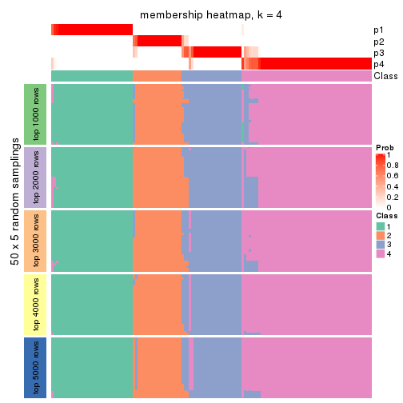</p>

</div>
<div id='tab-ATC-pam-membership-heatmap-4'>
<pre><code class="r">membership_heatmap(res, k = 5)
</code></pre>

<p>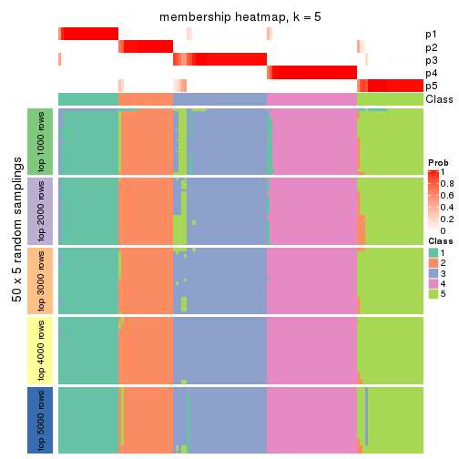</p>

</div>
<div id='tab-ATC-pam-membership-heatmap-5'>
<pre><code class="r">membership_heatmap(res, k = 6)
</code></pre>

<p></p>

</div>
</div>

As soon as we have had the classes for columns, we can look for signatures
which are significantly different between classes which can be candidate marks
for certain classes. Following are the heatmaps for signatures.


Signature heatmaps where rows are scaled:


<script>
$( function() {
	$( '#tabs-ATC-pam-get-signatures' ).tabs();
} );
</script>
<div id='tabs-ATC-pam-get-signatures'>
<ul>
<li><a href='#tab-ATC-pam-get-signatures-1'>k = 2</a></li>
<li><a href='#tab-ATC-pam-get-signatures-2'>k = 3</a></li>
<li><a href='#tab-ATC-pam-get-signatures-3'>k = 4</a></li>
<li><a href='#tab-ATC-pam-get-signatures-4'>k = 5</a></li>
<li><a href='#tab-ATC-pam-get-signatures-5'>k = 6</a></li>
</ul>
<div id='tab-ATC-pam-get-signatures-1'>
<pre><code class="r">get_signatures(res, k = 2)
</code></pre>

<p>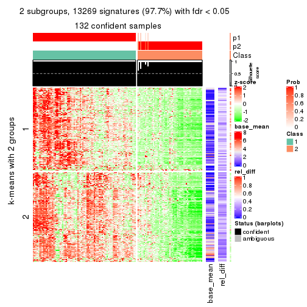</p>

</div>
<div id='tab-ATC-pam-get-signatures-2'>
<pre><code class="r">get_signatures(res, k = 3)
</code></pre>

<p></p>

</div>
<div id='tab-ATC-pam-get-signatures-3'>
<pre><code class="r">get_signatures(res, k = 4)
</code></pre>

<p></p>

</div>
<div id='tab-ATC-pam-get-signatures-4'>
<pre><code class="r">get_signatures(res, k = 5)
</code></pre>

<p></p>

</div>
<div id='tab-ATC-pam-get-signatures-5'>
<pre><code class="r">get_signatures(res, k = 6)
</code></pre>

<p></p>

</div>
</div>


Signature heatmaps where rows are not scaled:


<script>
$( function() {
	$( '#tabs-ATC-pam-get-signatures-no-scale' ).tabs();
} );
</script>
<div id='tabs-ATC-pam-get-signatures-no-scale'>
<ul>
<li><a href='#tab-ATC-pam-get-signatures-no-scale-1'>k = 2</a></li>
<li><a href='#tab-ATC-pam-get-signatures-no-scale-2'>k = 3</a></li>
<li><a href='#tab-ATC-pam-get-signatures-no-scale-3'>k = 4</a></li>
<li><a href='#tab-ATC-pam-get-signatures-no-scale-4'>k = 5</a></li>
<li><a href='#tab-ATC-pam-get-signatures-no-scale-5'>k = 6</a></li>
</ul>
<div id='tab-ATC-pam-get-signatures-no-scale-1'>
<pre><code class="r">get_signatures(res, k = 2, scale_rows = FALSE)
</code></pre>

<p></p>

</div>
<div id='tab-ATC-pam-get-signatures-no-scale-2'>
<pre><code class="r">get_signatures(res, k = 3, scale_rows = FALSE)
</code></pre>

<p></p>

</div>
<div id='tab-ATC-pam-get-signatures-no-scale-3'>
<pre><code class="r">get_signatures(res, k = 4, scale_rows = FALSE)
</code></pre>

<p></p>

</div>
<div id='tab-ATC-pam-get-signatures-no-scale-4'>
<pre><code class="r">get_signatures(res, k = 5, scale_rows = FALSE)
</code></pre>

<p></p>

</div>
<div id='tab-ATC-pam-get-signatures-no-scale-5'>
<pre><code class="r">get_signatures(res, k = 6, scale_rows = FALSE)
</code></pre>

<p></p>

</div>
</div>


Compare the overlap of signatures from different k:

```r
compare_signatures(res)
```


`get_signature()` returns a data frame invisibly. TO get the list of signatures, the function
call should be assigned to a variable explicitly. In following code, if `plot` argument is set
to `FALSE`, no heatmap is plotted while only the differential analysis is performed.

```r
# code only for demonstration
tb = get_signature(res, k = ..., plot = FALSE)
```

An example of the output of `tb` is:

```
#>   which_row         fdr    mean_1    mean_2 scaled_mean_1 scaled_mean_2 km
#> 1        38 0.042760348  8.373488  9.131774    -0.5533452     0.5164555  1
#> 2        40 0.018707592  7.106213  8.469186    -0.6173731     0.5762149  1
#> 3        55 0.019134737 10.221463 11.207825    -0.6159697     0.5749050  1
#> 4        59 0.006059896  5.921854  7.869574    -0.6899429     0.6439467  1
#> 5        60 0.018055526  8.928898 10.211722    -0.6204761     0.5791110  1
#> 6        98 0.009384629 15.714769 14.887706     0.6635654    -0.6193277  2
...
```

The columns in `tb` are:

1. `which_row`: row indices corresponding to the input matrix.
2. `fdr`: FDR for the differential test. 
3. `mean_x`: The mean value in group x.
4. `scaled_mean_x`: The mean value in group x after rows are scaled.
5. `km`: Row groups if k-means clustering is applied to rows.


UMAP plot which shows how samples are separated.


<script>
$( function() {
	$( '#tabs-ATC-pam-dimension-reduction' ).tabs();
} );
</script>
<div id='tabs-ATC-pam-dimension-reduction'>
<ul>
<li><a href='#tab-ATC-pam-dimension-reduction-1'>k = 2</a></li>
<li><a href='#tab-ATC-pam-dimension-reduction-2'>k = 3</a></li>
<li><a href='#tab-ATC-pam-dimension-reduction-3'>k = 4</a></li>
<li><a href='#tab-ATC-pam-dimension-reduction-4'>k = 5</a></li>
<li><a href='#tab-ATC-pam-dimension-reduction-5'>k = 6</a></li>
</ul>
<div id='tab-ATC-pam-dimension-reduction-1'>
<pre><code class="r">dimension_reduction(res, k = 2, method = &quot;UMAP&quot;)
</code></pre>

<p></p>

</div>
<div id='tab-ATC-pam-dimension-reduction-2'>
<pre><code class="r">dimension_reduction(res, k = 3, method = &quot;UMAP&quot;)
</code></pre>

<p></p>

</div>
<div id='tab-ATC-pam-dimension-reduction-3'>
<pre><code class="r">dimension_reduction(res, k = 4, method = &quot;UMAP&quot;)
</code></pre>

<p></p>

</div>
<div id='tab-ATC-pam-dimension-reduction-4'>
<pre><code class="r">dimension_reduction(res, k = 5, method = &quot;UMAP&quot;)
</code></pre>

<p></p>

</div>
<div id='tab-ATC-pam-dimension-reduction-5'>
<pre><code class="r">dimension_reduction(res, k = 6, method = &quot;UMAP&quot;)
</code></pre>

<p></p>

</div>
</div>


Following heatmap shows how subgroups are split when increasing `k`:

```r
collect_classes(res)
```


If matrix rows can be associated to genes, consider to use `functional_enrichment(res,
...)` to perform function enrichment for the signature genes. See [this vignette](http://bioconductor.org/packages/devel/bioc/vignettes/cola/inst/doc/functional_enrichment.html) for more detailed explanations.


 

---------------------------------------------------


### ATC:mclust*


The object with results only for a single top-value method and a single partition method 
can be extracted as:

```r
res = res_list["ATC", "mclust"]
# you can also extract it by
# res = res_list["ATC:mclust"]
```

A summary of `res` and all the functions that can be applied to it:

```r
res
```

```
#> A 'ConsensusPartition' object with k = 2, 3, 4, 5, 6.
#>   On a matrix with 13580 rows and 133 columns.
#>   Top rows (1000, 2000, 3000, 4000, 5000) are extracted by 'ATC' method.
#>   Subgroups are detected by 'mclust' method.
#>   Performed in total 1250 partitions by row resampling.
#>   Best k for subgroups seems to be 5.
#> 
#> Following methods can be applied to this 'ConsensusPartition' object:
#>  [1] "cola_report"             "collect_classes"         "collect_plots"          
#>  [4] "collect_stats"           "colnames"                "compare_signatures"     
#>  [7] "consensus_heatmap"       "dimension_reduction"     "functional_enrichment"  
#> [10] "get_anno_col"            "get_anno"                "get_classes"            
#> [13] "get_consensus"           "get_matrix"              "get_membership"         
#> [16] "get_param"               "get_signatures"          "get_stats"              
#> [19] "is_best_k"               "is_stable_k"             "membership_heatmap"     
#> [22] "ncol"                    "nrow"                    "plot_ecdf"              
#> [25] "rownames"                "select_partition_number" "show"                   
#> [28] "suggest_best_k"          "test_to_known_factors"
```

`collect_plots()` function collects all the plots made from `res` for all `k` (number of partitions)
into one single page to provide an easy and fast comparison between different `k`.

```r
collect_plots(res)
```


The plots are:

- The first row: a plot of the ECDF (empirical cumulative distribution
  function) curves of the consensus matrix for each `k` and the heatmap of
  predicted classes for each `k`.
- The second row: heatmaps of the consensus matrix for each `k`.
- The third row: heatmaps of the membership matrix for each `k`.
- The fouth row: heatmaps of the signatures for each `k`.

All the plots in panels can be made by individual functions and they are
plotted later in this section.

`select_partition_number()` produces several plots showing different
statistics for choosing "optimized" `k`. There are following statistics:

- ECDF curves of the consensus matrix for each `k`;
- 1-PAC. [The PAC
  score](https://en.wikipedia.org/wiki/Consensus_clustering#Over-interpretation_potential_of_consensus_clustering)
  measures the proportion of the ambiguous subgrouping.
- Mean silhouette score.
- Concordance. The mean probability of fiting the consensus class ids in all
  partitions.
- Area increased. Denote $A_k$ as the area under the ECDF curve for current
  `k`, the area increased is defined as $A_k - A_{k-1}$.
- Rand index. The percent of pairs of samples that are both in a same cluster
  or both are not in a same cluster in the partition of k and k-1.
- Jaccard index. The ratio of pairs of samples are both in a same cluster in
  the partition of k and k-1 and the pairs of samples are both in a same
  cluster in the partition k or k-1.

The detailed explanations of these statistics can be found in [the _cola_
vignette](http://bioconductor.org/packages/devel/bioc/vignettes/cola/inst/doc/cola.html#toc_13).

Generally speaking, lower PAC score, higher mean silhouette score or higher
concordance corresponds to better partition. Rand index and Jaccard index
measure how similar the current partition is compared to partition with `k-1`.
If they are too similar, we won't accept `k` is better than `k-1`.

```r
select_partition_number(res)
```


The numeric values for all these statistics can be obtained by `get_stats()`.

```r
get_stats(res)
```

```
#>   k 1-PAC mean_silhouette concordance area_increased  Rand Jaccard
#> 2 2 0.953           0.934       0.974         0.2363 0.798   0.798
#> 3 3 0.794           0.785       0.915         1.5647 0.537   0.431
#> 4 4 0.784           0.772       0.900         0.1149 0.882   0.698
#> 5 5 0.942           0.914       0.954         0.1255 0.872   0.614
#> 6 6 0.719           0.732       0.797         0.0286 0.934   0.745
```

`suggest_best_k()` suggests the best $k$ based on these statistics. The rules are as follows:

- All $k$ with Jaccard index larger than 0.95 are removed because increasing
  $k$ does not provide enough extra information. If all $k$ are removed, it is
  marked as no subgroup is detected.
- For all $k$ with 1-PAC score larger than 0.9, the maximal $k$ is taken as
  the best $k$, and other $k$ are marked as optional $k$.
- If it does not fit the second rule. The $k$ with the maximal vote of the
  highest 1-PAC score, highest mean silhouette, and highest concordance is
  taken as the best $k$.

```r
suggest_best_k(res)
```

```
#> [1] 5
#> attr(,"optional")
#> [1] 2
```

There is also optional best $k$ = 2 that is worth to check.

Following shows the table of the partitions (You need to click the **show/hide
code output** link to see it). The membership matrix (columns with name `p*`)
is inferred by
[`clue::cl_consensus()`](https://www.rdocumentation.org/link/cl_consensus?package=clue)
function with the `SE` method. Basically the value in the membership matrix
represents the probability to belong to a certain group. The finall class
label for an item is determined with the group with highest probability it
belongs to.

In `get_classes()` function, the entropy is calculated from the membership
matrix and the silhouette score is calculated from the consensus matrix.


<script>
$( function() {
	$( '#tabs-ATC-mclust-get-classes' ).tabs();
} );
</script>
<div id='tabs-ATC-mclust-get-classes'>
<ul>
<li><a href='#tab-ATC-mclust-get-classes-1'>k = 2</a></li>
<li><a href='#tab-ATC-mclust-get-classes-2'>k = 3</a></li>
<li><a href='#tab-ATC-mclust-get-classes-3'>k = 4</a></li>
<li><a href='#tab-ATC-mclust-get-classes-4'>k = 5</a></li>
<li><a href='#tab-ATC-mclust-get-classes-5'>k = 6</a></li>
</ul>

<div id='tab-ATC-mclust-get-classes-1'>
<p><a id='tab-ATC-mclust-get-classes-1-a' style='color:#0366d6' href='#'>show/hide code output</a></p>
<pre><code class="r">cbind(get_classes(res, k = 2), get_membership(res, k = 2))
</code></pre>

<pre><code>#&gt;            class entropy silhouette    p1    p2
#&gt; SRR1951667     1  0.9686      0.371 0.604 0.396
#&gt; SRR1951666     1  0.0000      0.971 1.000 0.000
#&gt; SRR1951665     2  0.0000      0.988 0.000 1.000
#&gt; SRR1951664     1  0.0000      0.971 1.000 0.000
#&gt; SRR1951663     1  0.0000      0.971 1.000 0.000
#&gt; SRR1951662     2  0.0000      0.988 0.000 1.000
#&gt; SRR1951661     1  0.0000      0.971 1.000 0.000
#&gt; SRR1951660     1  0.0000      0.971 1.000 0.000
#&gt; SRR1951659     2  0.0000      0.988 0.000 1.000
#&gt; SRR1951658     2  0.0000      0.988 0.000 1.000
#&gt; SRR1951657     1  0.0000      0.971 1.000 0.000
#&gt; SRR1951656     1  0.0000      0.971 1.000 0.000
#&gt; SRR1951655     1  0.0000      0.971 1.000 0.000
#&gt; SRR1951654     1  0.0000      0.971 1.000 0.000
#&gt; SRR1951653     1  0.0000      0.971 1.000 0.000
#&gt; SRR1951652     1  0.0000      0.971 1.000 0.000
#&gt; SRR1951651     1  0.0000      0.971 1.000 0.000
#&gt; SRR1951650     1  0.0000      0.971 1.000 0.000
#&gt; SRR1951648     1  0.0000      0.971 1.000 0.000
#&gt; SRR1951649     1  0.0000      0.971 1.000 0.000
#&gt; SRR1951647     1  0.0000      0.971 1.000 0.000
#&gt; SRR1951646     1  0.0000      0.971 1.000 0.000
#&gt; SRR1951645     1  0.0000      0.971 1.000 0.000
#&gt; SRR1951644     1  0.0000      0.971 1.000 0.000
#&gt; SRR1951643     1  0.0000      0.971 1.000 0.000
#&gt; SRR1951641     2  0.0000      0.988 0.000 1.000
#&gt; SRR1951642     1  0.0000      0.971 1.000 0.000
#&gt; SRR1951694     1  0.0000      0.971 1.000 0.000
#&gt; SRR1951731     1  0.0000      0.971 1.000 0.000
#&gt; SRR1951730     1  0.0000      0.971 1.000 0.000
#&gt; SRR1951752     1  0.0000      0.971 1.000 0.000
#&gt; SRR1951751     1  0.0000      0.971 1.000 0.000
#&gt; SRR1951749     1  0.0000      0.971 1.000 0.000
#&gt; SRR1951750     1  0.0000      0.971 1.000 0.000
#&gt; SRR1951748     2  0.0000      0.988 0.000 1.000
#&gt; SRR1951747     2  0.0000      0.988 0.000 1.000
#&gt; SRR1951745     1  0.0000      0.971 1.000 0.000
#&gt; SRR1951746     2  0.0000      0.988 0.000 1.000
#&gt; SRR1951744     1  0.0000      0.971 1.000 0.000
#&gt; SRR1951742     1  0.0000      0.971 1.000 0.000
#&gt; SRR1951743     2  0.0000      0.988 0.000 1.000
#&gt; SRR1951741     1  0.0000      0.971 1.000 0.000
#&gt; SRR1951740     1  0.0000      0.971 1.000 0.000
#&gt; SRR1951738     1  0.5519      0.836 0.872 0.128
#&gt; SRR1951739     1  0.9754      0.341 0.592 0.408
#&gt; SRR1951737     1  0.0000      0.971 1.000 0.000
#&gt; SRR1951736     1  0.0000      0.971 1.000 0.000
#&gt; SRR1951734     2  0.0000      0.988 0.000 1.000
#&gt; SRR1951735     1  0.0000      0.971 1.000 0.000
#&gt; SRR1951733     1  0.0000      0.971 1.000 0.000
#&gt; SRR1951732     2  0.0000      0.988 0.000 1.000
#&gt; SRR1951729     1  0.0000      0.971 1.000 0.000
#&gt; SRR1951728     1  0.0000      0.971 1.000 0.000
#&gt; SRR1951727     2  0.0000      0.988 0.000 1.000
#&gt; SRR1951725     1  0.0000      0.971 1.000 0.000
#&gt; SRR1951726     1  0.0000      0.971 1.000 0.000
#&gt; SRR1951724     1  0.0000      0.971 1.000 0.000
#&gt; SRR1951722     1  0.0000      0.971 1.000 0.000
#&gt; SRR1951723     1  0.0000      0.971 1.000 0.000
#&gt; SRR1951721     1  0.0000      0.971 1.000 0.000
#&gt; SRR1951719     1  0.0000      0.971 1.000 0.000
#&gt; SRR1951720     1  0.0000      0.971 1.000 0.000
#&gt; SRR1951718     1  0.0000      0.971 1.000 0.000
#&gt; SRR1951717     1  0.0000      0.971 1.000 0.000
#&gt; SRR1951715     1  0.0000      0.971 1.000 0.000
#&gt; SRR1951716     1  0.0000      0.971 1.000 0.000
#&gt; SRR1951714     1  0.0000      0.971 1.000 0.000
#&gt; SRR1951713     1  0.0000      0.971 1.000 0.000
#&gt; SRR1951712     1  0.0000      0.971 1.000 0.000
#&gt; SRR1951711     2  0.6148      0.811 0.152 0.848
#&gt; SRR1951710     1  0.0000      0.971 1.000 0.000
#&gt; SRR1951709     1  0.0000      0.971 1.000 0.000
#&gt; SRR1951708     2  0.0938      0.977 0.012 0.988
#&gt; SRR1951707     1  0.0000      0.971 1.000 0.000
#&gt; SRR1951705     1  0.0000      0.971 1.000 0.000
#&gt; SRR1951704     1  0.0000      0.971 1.000 0.000
#&gt; SRR1951703     2  0.0000      0.988 0.000 1.000
#&gt; SRR1951706     1  0.0000      0.971 1.000 0.000
#&gt; SRR1951702     1  0.0000      0.971 1.000 0.000
#&gt; SRR1951701     1  0.9922      0.227 0.552 0.448
#&gt; SRR1951699     1  0.0000      0.971 1.000 0.000
#&gt; SRR1951698     1  0.0000      0.971 1.000 0.000
#&gt; SRR1951700     1  0.0000      0.971 1.000 0.000
#&gt; SRR1951697     1  0.9170      0.515 0.668 0.332
#&gt; SRR1951696     1  0.0000      0.971 1.000 0.000
#&gt; SRR1951695     1  0.0000      0.971 1.000 0.000
#&gt; SRR1951693     1  0.0000      0.971 1.000 0.000
#&gt; SRR1951692     1  0.0000      0.971 1.000 0.000
#&gt; SRR1951691     1  0.0000      0.971 1.000 0.000
#&gt; SRR1951688     1  0.0000      0.971 1.000 0.000
#&gt; SRR1951689     1  0.0000      0.971 1.000 0.000
#&gt; SRR1951687     1  0.0000      0.971 1.000 0.000
#&gt; SRR1951685     1  0.0000      0.971 1.000 0.000
#&gt; SRR1951684     1  0.0000      0.971 1.000 0.000
#&gt; SRR1951686     1  0.0000      0.971 1.000 0.000
#&gt; SRR1951683     1  0.0000      0.971 1.000 0.000
#&gt; SRR1951682     1  0.9552      0.420 0.624 0.376
#&gt; SRR1951690     1  0.9922      0.227 0.552 0.448
#&gt; SRR1951680     1  0.0000      0.971 1.000 0.000
#&gt; SRR1951679     1  0.0000      0.971 1.000 0.000
#&gt; SRR1951678     1  0.0000      0.971 1.000 0.000
#&gt; SRR1951677     1  0.0000      0.971 1.000 0.000
#&gt; SRR1951676     1  0.0000      0.971 1.000 0.000
#&gt; SRR1951675     1  0.9754      0.341 0.592 0.408
#&gt; SRR1951681     1  0.0000      0.971 1.000 0.000
#&gt; SRR1951673     1  0.0000      0.971 1.000 0.000
#&gt; SRR1951674     1  0.0000      0.971 1.000 0.000
#&gt; SRR1951672     1  0.0000      0.971 1.000 0.000
#&gt; SRR1951671     1  0.0000      0.971 1.000 0.000
#&gt; SRR1951670     1  0.0000      0.971 1.000 0.000
#&gt; SRR1951640     1  0.0000      0.971 1.000 0.000
#&gt; SRR1951668     1  0.0000      0.971 1.000 0.000
#&gt; SRR1951669     1  0.0000      0.971 1.000 0.000
#&gt; SRR1951638     1  0.0000      0.971 1.000 0.000
#&gt; SRR1951637     1  0.0000      0.971 1.000 0.000
#&gt; SRR1951635     1  0.0000      0.971 1.000 0.000
#&gt; SRR1951634     1  0.0000      0.971 1.000 0.000
#&gt; SRR1951631     1  0.0000      0.971 1.000 0.000
#&gt; SRR1951632     1  0.9460      0.447 0.636 0.364
#&gt; SRR1951633     1  0.0000      0.971 1.000 0.000
#&gt; SRR1951630     1  0.0000      0.971 1.000 0.000
#&gt; SRR1951629     1  0.0000      0.971 1.000 0.000
#&gt; SRR1951628     1  0.0000      0.971 1.000 0.000
#&gt; SRR1951627     1  0.0000      0.971 1.000 0.000
#&gt; SRR1951639     1  0.0000      0.971 1.000 0.000
#&gt; SRR1951625     1  0.0000      0.971 1.000 0.000
#&gt; SRR1951626     1  0.0000      0.971 1.000 0.000
#&gt; SRR1951624     1  0.0000      0.971 1.000 0.000
#&gt; SRR1951622     1  0.0000      0.971 1.000 0.000
#&gt; SRR1951636     1  0.0000      0.971 1.000 0.000
#&gt; SRR1951623     1  0.0000      0.971 1.000 0.000
#&gt; SRR1951621     1  0.0000      0.971 1.000 0.000
#&gt; SRR1951620     1  0.0000      0.971 1.000 0.000
</code></pre>

<script>
$('#tab-ATC-mclust-get-classes-1-a').parent().next().next().hide();
$('#tab-ATC-mclust-get-classes-1-a').click(function(){
  $('#tab-ATC-mclust-get-classes-1-a').parent().next().next().toggle();
  return(false);
});
</script>
</div>

<div id='tab-ATC-mclust-get-classes-2'>
<p><a id='tab-ATC-mclust-get-classes-2-a' style='color:#0366d6' href='#'>show/hide code output</a></p>
<pre><code class="r">cbind(get_classes(res, k = 3), get_membership(res, k = 3))
</code></pre>

<pre><code>#&gt;            class entropy silhouette    p1    p2    p3
#&gt; SRR1951667     2  0.6309     0.2026 0.000 0.500 0.500
#&gt; SRR1951666     3  0.0000     0.9431 0.000 0.000 1.000
#&gt; SRR1951665     2  0.0000     0.7753 0.000 1.000 0.000
#&gt; SRR1951664     3  0.0000     0.9431 0.000 0.000 1.000
#&gt; SRR1951663     1  0.0747     0.8954 0.984 0.000 0.016
#&gt; SRR1951662     2  0.0000     0.7753 0.000 1.000 0.000
#&gt; SRR1951661     3  0.0000     0.9431 0.000 0.000 1.000
#&gt; SRR1951660     1  0.0237     0.8857 0.996 0.000 0.004
#&gt; SRR1951659     2  0.0000     0.7753 0.000 1.000 0.000
#&gt; SRR1951658     2  0.0000     0.7753 0.000 1.000 0.000
#&gt; SRR1951657     3  0.0000     0.9431 0.000 0.000 1.000
#&gt; SRR1951656     3  0.0000     0.9431 0.000 0.000 1.000
#&gt; SRR1951655     1  0.0747     0.8954 0.984 0.000 0.016
#&gt; SRR1951654     1  0.0747     0.8954 0.984 0.000 0.016
#&gt; SRR1951653     3  0.0000     0.9431 0.000 0.000 1.000
#&gt; SRR1951652     1  0.0747     0.8954 0.984 0.000 0.016
#&gt; SRR1951651     3  0.6308    -0.0443 0.492 0.000 0.508
#&gt; SRR1951650     3  0.0000     0.9431 0.000 0.000 1.000
#&gt; SRR1951648     3  0.0000     0.9431 0.000 0.000 1.000
#&gt; SRR1951649     1  0.5733     0.5229 0.676 0.000 0.324
#&gt; SRR1951647     3  0.0000     0.9431 0.000 0.000 1.000
#&gt; SRR1951646     3  0.0000     0.9431 0.000 0.000 1.000
#&gt; SRR1951645     1  0.5760     0.5228 0.672 0.000 0.328
#&gt; SRR1951644     1  0.6280     0.1996 0.540 0.000 0.460
#&gt; SRR1951643     1  0.5363     0.6007 0.724 0.000 0.276
#&gt; SRR1951641     2  0.0000     0.7753 0.000 1.000 0.000
#&gt; SRR1951642     1  0.0747     0.8954 0.984 0.000 0.016
#&gt; SRR1951694     1  0.0747     0.8954 0.984 0.000 0.016
#&gt; SRR1951731     3  0.0000     0.9431 0.000 0.000 1.000
#&gt; SRR1951730     3  0.0424     0.9354 0.008 0.000 0.992
#&gt; SRR1951752     3  0.4002     0.7379 0.160 0.000 0.840
#&gt; SRR1951751     1  0.6274     0.2214 0.544 0.000 0.456
#&gt; SRR1951749     3  0.0000     0.9431 0.000 0.000 1.000
#&gt; SRR1951750     1  0.0892     0.8932 0.980 0.000 0.020
#&gt; SRR1951748     2  0.0000     0.7753 0.000 1.000 0.000
#&gt; SRR1951747     2  0.0237     0.7740 0.000 0.996 0.004
#&gt; SRR1951745     1  0.0747     0.8954 0.984 0.000 0.016
#&gt; SRR1951746     2  0.0000     0.7753 0.000 1.000 0.000
#&gt; SRR1951744     1  0.1643     0.8750 0.956 0.000 0.044
#&gt; SRR1951742     3  0.3340     0.7985 0.000 0.120 0.880
#&gt; SRR1951743     2  0.0000     0.7753 0.000 1.000 0.000
#&gt; SRR1951741     1  0.0747     0.8954 0.984 0.000 0.016
#&gt; SRR1951740     3  0.0000     0.9431 0.000 0.000 1.000
#&gt; SRR1951738     1  0.6948    -0.0216 0.512 0.472 0.016
#&gt; SRR1951739     2  0.6309     0.2140 0.000 0.504 0.496
#&gt; SRR1951737     3  0.0000     0.9431 0.000 0.000 1.000
#&gt; SRR1951736     1  0.0424     0.8891 0.992 0.000 0.008
#&gt; SRR1951734     2  0.0000     0.7753 0.000 1.000 0.000
#&gt; SRR1951735     3  0.0000     0.9431 0.000 0.000 1.000
#&gt; SRR1951733     3  0.0000     0.9431 0.000 0.000 1.000
#&gt; SRR1951732     2  0.0000     0.7753 0.000 1.000 0.000
#&gt; SRR1951729     3  0.0000     0.9431 0.000 0.000 1.000
#&gt; SRR1951728     3  0.0000     0.9431 0.000 0.000 1.000
#&gt; SRR1951727     2  0.0000     0.7753 0.000 1.000 0.000
#&gt; SRR1951725     1  0.0747     0.8954 0.984 0.000 0.016
#&gt; SRR1951726     1  0.0747     0.8954 0.984 0.000 0.016
#&gt; SRR1951724     3  0.0000     0.9431 0.000 0.000 1.000
#&gt; SRR1951722     3  0.0000     0.9431 0.000 0.000 1.000
#&gt; SRR1951723     3  0.0000     0.9431 0.000 0.000 1.000
#&gt; SRR1951721     1  0.0747     0.8954 0.984 0.000 0.016
#&gt; SRR1951719     3  0.0000     0.9431 0.000 0.000 1.000
#&gt; SRR1951720     1  0.0747     0.8954 0.984 0.000 0.016
#&gt; SRR1951718     1  0.1860     0.8593 0.948 0.000 0.052
#&gt; SRR1951717     1  0.0747     0.8954 0.984 0.000 0.016
#&gt; SRR1951715     1  0.0747     0.8954 0.984 0.000 0.016
#&gt; SRR1951716     1  0.0237     0.8857 0.996 0.000 0.004
#&gt; SRR1951714     3  0.5835     0.4396 0.340 0.000 0.660
#&gt; SRR1951713     3  0.0000     0.9431 0.000 0.000 1.000
#&gt; SRR1951712     1  0.5968     0.4624 0.636 0.000 0.364
#&gt; SRR1951711     2  0.0661     0.7699 0.004 0.988 0.008
#&gt; SRR1951710     1  0.0000     0.8818 1.000 0.000 0.000
#&gt; SRR1951709     3  0.0000     0.9431 0.000 0.000 1.000
#&gt; SRR1951708     2  0.0237     0.7739 0.000 0.996 0.004
#&gt; SRR1951707     3  0.0000     0.9431 0.000 0.000 1.000
#&gt; SRR1951705     1  0.0000     0.8818 1.000 0.000 0.000
#&gt; SRR1951704     3  0.0592     0.9313 0.012 0.000 0.988
#&gt; SRR1951703     2  0.0000     0.7753 0.000 1.000 0.000
#&gt; SRR1951706     1  0.0747     0.8954 0.984 0.000 0.016
#&gt; SRR1951702     3  0.0000     0.9431 0.000 0.000 1.000
#&gt; SRR1951701     2  0.6309     0.2140 0.000 0.504 0.496
#&gt; SRR1951699     3  0.0000     0.9431 0.000 0.000 1.000
#&gt; SRR1951698     3  0.0000     0.9431 0.000 0.000 1.000
#&gt; SRR1951700     3  0.0000     0.9431 0.000 0.000 1.000
#&gt; SRR1951697     2  0.7979     0.3026 0.060 0.500 0.440
#&gt; SRR1951696     3  0.0000     0.9431 0.000 0.000 1.000
#&gt; SRR1951695     3  0.0000     0.9431 0.000 0.000 1.000
#&gt; SRR1951693     3  0.0000     0.9431 0.000 0.000 1.000
#&gt; SRR1951692     3  0.0000     0.9431 0.000 0.000 1.000
#&gt; SRR1951691     3  0.1163     0.9140 0.028 0.000 0.972
#&gt; SRR1951688     2  0.9568     0.2809 0.336 0.456 0.208
#&gt; SRR1951689     3  0.0000     0.9431 0.000 0.000 1.000
#&gt; SRR1951687     1  0.0747     0.8954 0.984 0.000 0.016
#&gt; SRR1951685     3  0.0000     0.9431 0.000 0.000 1.000
#&gt; SRR1951684     3  0.0000     0.9431 0.000 0.000 1.000
#&gt; SRR1951686     3  0.6505    -0.1503 0.004 0.468 0.528
#&gt; SRR1951683     1  0.2537     0.8399 0.920 0.000 0.080
#&gt; SRR1951682     2  0.6954     0.2364 0.016 0.500 0.484
#&gt; SRR1951690     2  0.7484     0.2826 0.036 0.504 0.460
#&gt; SRR1951680     3  0.0000     0.9431 0.000 0.000 1.000
#&gt; SRR1951679     1  0.6299     0.1638 0.524 0.000 0.476
#&gt; SRR1951678     1  0.0747     0.8954 0.984 0.000 0.016
#&gt; SRR1951677     1  0.0747     0.8954 0.984 0.000 0.016
#&gt; SRR1951676     3  0.6267     0.1089 0.452 0.000 0.548
#&gt; SRR1951675     2  0.6823     0.0614 0.484 0.504 0.012
#&gt; SRR1951681     3  0.0000     0.9431 0.000 0.000 1.000
#&gt; SRR1951673     1  0.2165     0.8578 0.936 0.000 0.064
#&gt; SRR1951674     1  0.0747     0.8954 0.984 0.000 0.016
#&gt; SRR1951672     1  0.0747     0.8954 0.984 0.000 0.016
#&gt; SRR1951671     3  0.0000     0.9431 0.000 0.000 1.000
#&gt; SRR1951670     1  0.0747     0.8954 0.984 0.000 0.016
#&gt; SRR1951640     3  0.0000     0.9431 0.000 0.000 1.000
#&gt; SRR1951668     1  0.6267     0.2199 0.548 0.000 0.452
#&gt; SRR1951669     1  0.0747     0.8954 0.984 0.000 0.016
#&gt; SRR1951638     1  0.0747     0.8954 0.984 0.000 0.016
#&gt; SRR1951637     1  0.0747     0.8954 0.984 0.000 0.016
#&gt; SRR1951635     1  0.0747     0.8954 0.984 0.000 0.016
#&gt; SRR1951634     3  0.5138     0.6002 0.252 0.000 0.748
#&gt; SRR1951631     3  0.0000     0.9431 0.000 0.000 1.000
#&gt; SRR1951632     2  0.6309     0.2026 0.000 0.500 0.500
#&gt; SRR1951633     1  0.0747     0.8954 0.984 0.000 0.016
#&gt; SRR1951630     1  0.1289     0.8847 0.968 0.000 0.032
#&gt; SRR1951629     3  0.1860     0.8863 0.052 0.000 0.948
#&gt; SRR1951628     1  0.0000     0.8818 1.000 0.000 0.000
#&gt; SRR1951627     3  0.0000     0.9431 0.000 0.000 1.000
#&gt; SRR1951639     3  0.0000     0.9431 0.000 0.000 1.000
#&gt; SRR1951625     3  0.1753     0.8928 0.000 0.048 0.952
#&gt; SRR1951626     3  0.0000     0.9431 0.000 0.000 1.000
#&gt; SRR1951624     3  0.0000     0.9431 0.000 0.000 1.000
#&gt; SRR1951622     1  0.0000     0.8818 1.000 0.000 0.000
#&gt; SRR1951636     3  0.0000     0.9431 0.000 0.000 1.000
#&gt; SRR1951623     1  0.0892     0.8931 0.980 0.000 0.020
#&gt; SRR1951621     1  0.0747     0.8954 0.984 0.000 0.016
#&gt; SRR1951620     3  0.0000     0.9431 0.000 0.000 1.000
</code></pre>

<script>
$('#tab-ATC-mclust-get-classes-2-a').parent().next().next().hide();
$('#tab-ATC-mclust-get-classes-2-a').click(function(){
  $('#tab-ATC-mclust-get-classes-2-a').parent().next().next().toggle();
  return(false);
});
</script>
</div>

<div id='tab-ATC-mclust-get-classes-3'>
<p><a id='tab-ATC-mclust-get-classes-3-a' style='color:#0366d6' href='#'>show/hide code output</a></p>
<pre><code class="r">cbind(get_classes(res, k = 4), get_membership(res, k = 4))
</code></pre>

<pre><code>#&gt;            class entropy silhouette    p1    p2    p3    p4
#&gt; SRR1951667     2  0.4985     0.3777 0.000 0.532 0.468 0.000
#&gt; SRR1951666     3  0.0000     0.9318 0.000 0.000 1.000 0.000
#&gt; SRR1951665     2  0.0707     0.6353 0.000 0.980 0.000 0.020
#&gt; SRR1951664     3  0.0000     0.9318 0.000 0.000 1.000 0.000
#&gt; SRR1951663     1  0.1022     0.9088 0.968 0.000 0.000 0.032
#&gt; SRR1951662     2  0.0707     0.6353 0.000 0.980 0.000 0.020
#&gt; SRR1951661     3  0.0000     0.9318 0.000 0.000 1.000 0.000
#&gt; SRR1951660     4  0.1118     0.9245 0.036 0.000 0.000 0.964
#&gt; SRR1951659     2  0.0469     0.6410 0.000 0.988 0.012 0.000
#&gt; SRR1951658     2  0.0707     0.6427 0.000 0.980 0.020 0.000
#&gt; SRR1951657     3  0.0188     0.9303 0.000 0.000 0.996 0.004
#&gt; SRR1951656     3  0.0336     0.9279 0.000 0.000 0.992 0.008
#&gt; SRR1951655     1  0.7815    -0.0343 0.392 0.000 0.256 0.352
#&gt; SRR1951654     1  0.0469     0.9087 0.988 0.000 0.000 0.012
#&gt; SRR1951653     3  0.0592     0.9241 0.000 0.000 0.984 0.016
#&gt; SRR1951652     1  0.2101     0.8715 0.928 0.000 0.060 0.012
#&gt; SRR1951651     3  0.5406     0.0660 0.480 0.000 0.508 0.012
#&gt; SRR1951650     3  0.0000     0.9318 0.000 0.000 1.000 0.000
#&gt; SRR1951648     3  0.0000     0.9318 0.000 0.000 1.000 0.000
#&gt; SRR1951649     4  0.1174     0.9165 0.020 0.000 0.012 0.968
#&gt; SRR1951647     3  0.0804     0.9209 0.000 0.008 0.980 0.012
#&gt; SRR1951646     3  0.0188     0.9303 0.000 0.000 0.996 0.004
#&gt; SRR1951645     4  0.1297     0.9151 0.020 0.000 0.016 0.964
#&gt; SRR1951644     4  0.1888     0.8988 0.016 0.000 0.044 0.940
#&gt; SRR1951643     1  0.3610     0.6757 0.800 0.000 0.200 0.000
#&gt; SRR1951641     2  0.0707     0.6353 0.000 0.980 0.000 0.020
#&gt; SRR1951642     1  0.0000     0.9075 1.000 0.000 0.000 0.000
#&gt; SRR1951694     1  0.1211     0.9054 0.960 0.000 0.000 0.040
#&gt; SRR1951731     3  0.0000     0.9318 0.000 0.000 1.000 0.000
#&gt; SRR1951730     3  0.4643     0.2875 0.000 0.344 0.656 0.000
#&gt; SRR1951752     3  0.0707     0.9172 0.000 0.020 0.980 0.000
#&gt; SRR1951751     4  0.3032     0.8220 0.008 0.000 0.124 0.868
#&gt; SRR1951749     3  0.0707     0.9172 0.000 0.020 0.980 0.000
#&gt; SRR1951750     1  0.3547     0.7619 0.840 0.000 0.144 0.016
#&gt; SRR1951748     2  0.0707     0.6353 0.000 0.980 0.000 0.020
#&gt; SRR1951747     2  0.0592     0.6423 0.000 0.984 0.016 0.000
#&gt; SRR1951745     1  0.0817     0.9108 0.976 0.000 0.000 0.024
#&gt; SRR1951746     2  0.0707     0.6353 0.000 0.980 0.000 0.020
#&gt; SRR1951744     1  0.2179     0.8642 0.924 0.000 0.064 0.012
#&gt; SRR1951742     2  0.4992     0.3582 0.000 0.524 0.476 0.000
#&gt; SRR1951743     2  0.0707     0.6353 0.000 0.980 0.000 0.020
#&gt; SRR1951741     1  0.0000     0.9075 1.000 0.000 0.000 0.000
#&gt; SRR1951740     3  0.0336     0.9279 0.000 0.000 0.992 0.008
#&gt; SRR1951738     2  0.6439     0.2374 0.416 0.528 0.044 0.012
#&gt; SRR1951739     2  0.4981     0.3869 0.000 0.536 0.464 0.000
#&gt; SRR1951737     3  0.0000     0.9318 0.000 0.000 1.000 0.000
#&gt; SRR1951736     4  0.1118     0.9245 0.036 0.000 0.000 0.964
#&gt; SRR1951734     2  0.0707     0.6353 0.000 0.980 0.000 0.020
#&gt; SRR1951735     3  0.0000     0.9318 0.000 0.000 1.000 0.000
#&gt; SRR1951733     3  0.0707     0.9172 0.000 0.020 0.980 0.000
#&gt; SRR1951732     2  0.0707     0.6353 0.000 0.980 0.000 0.020
#&gt; SRR1951729     3  0.0000     0.9318 0.000 0.000 1.000 0.000
#&gt; SRR1951728     3  0.0000     0.9318 0.000 0.000 1.000 0.000
#&gt; SRR1951727     2  0.0707     0.6353 0.000 0.980 0.000 0.020
#&gt; SRR1951725     1  0.0921     0.9100 0.972 0.000 0.000 0.028
#&gt; SRR1951726     1  0.0817     0.9108 0.976 0.000 0.000 0.024
#&gt; SRR1951724     3  0.0804     0.9190 0.008 0.000 0.980 0.012
#&gt; SRR1951722     3  0.0000     0.9318 0.000 0.000 1.000 0.000
#&gt; SRR1951723     3  0.4866     0.3293 0.000 0.000 0.596 0.404
#&gt; SRR1951721     1  0.0817     0.9108 0.976 0.000 0.000 0.024
#&gt; SRR1951719     3  0.0000     0.9318 0.000 0.000 1.000 0.000
#&gt; SRR1951720     1  0.1211     0.9054 0.960 0.000 0.000 0.040
#&gt; SRR1951718     4  0.0707     0.9180 0.020 0.000 0.000 0.980
#&gt; SRR1951717     1  0.1022     0.9088 0.968 0.000 0.000 0.032
#&gt; SRR1951715     1  0.1211     0.9054 0.960 0.000 0.000 0.040
#&gt; SRR1951716     4  0.1118     0.9245 0.036 0.000 0.000 0.964
#&gt; SRR1951714     3  0.1388     0.8995 0.028 0.000 0.960 0.012
#&gt; SRR1951713     3  0.0469     0.9248 0.000 0.000 0.988 0.012
#&gt; SRR1951712     4  0.5615     0.4190 0.032 0.000 0.356 0.612
#&gt; SRR1951711     2  0.1211     0.6408 0.000 0.960 0.040 0.000
#&gt; SRR1951710     4  0.1118     0.9245 0.036 0.000 0.000 0.964
#&gt; SRR1951709     3  0.0000     0.9318 0.000 0.000 1.000 0.000
#&gt; SRR1951708     2  0.0707     0.6427 0.000 0.980 0.020 0.000
#&gt; SRR1951707     3  0.0000     0.9318 0.000 0.000 1.000 0.000
#&gt; SRR1951705     4  0.1118     0.9245 0.036 0.000 0.000 0.964
#&gt; SRR1951704     3  0.0000     0.9318 0.000 0.000 1.000 0.000
#&gt; SRR1951703     2  0.1059     0.6398 0.000 0.972 0.012 0.016
#&gt; SRR1951706     1  0.0817     0.9108 0.976 0.000 0.000 0.024
#&gt; SRR1951702     3  0.0000     0.9318 0.000 0.000 1.000 0.000
#&gt; SRR1951701     2  0.4977     0.3914 0.000 0.540 0.460 0.000
#&gt; SRR1951699     3  0.0000     0.9318 0.000 0.000 1.000 0.000
#&gt; SRR1951698     3  0.0000     0.9318 0.000 0.000 1.000 0.000
#&gt; SRR1951700     3  0.0188     0.9303 0.000 0.000 0.996 0.004
#&gt; SRR1951697     2  0.4981     0.3869 0.000 0.536 0.464 0.000
#&gt; SRR1951696     3  0.0000     0.9318 0.000 0.000 1.000 0.000
#&gt; SRR1951695     3  0.0000     0.9318 0.000 0.000 1.000 0.000
#&gt; SRR1951693     3  0.0336     0.9279 0.000 0.000 0.992 0.008
#&gt; SRR1951692     3  0.0524     0.9259 0.004 0.000 0.988 0.008
#&gt; SRR1951691     3  0.0336     0.9279 0.000 0.000 0.992 0.008
#&gt; SRR1951688     2  0.5404     0.3487 0.012 0.512 0.476 0.000
#&gt; SRR1951689     3  0.4697     0.2465 0.000 0.356 0.644 0.000
#&gt; SRR1951687     1  0.0000     0.9075 1.000 0.000 0.000 0.000
#&gt; SRR1951685     3  0.0000     0.9318 0.000 0.000 1.000 0.000
#&gt; SRR1951684     3  0.0000     0.9318 0.000 0.000 1.000 0.000
#&gt; SRR1951686     2  0.4992     0.3587 0.000 0.524 0.476 0.000
#&gt; SRR1951683     1  0.3074     0.7493 0.848 0.000 0.152 0.000
#&gt; SRR1951682     2  0.4981     0.3869 0.000 0.536 0.464 0.000
#&gt; SRR1951690     2  0.5143     0.3966 0.004 0.540 0.456 0.000
#&gt; SRR1951680     3  0.0336     0.9279 0.000 0.000 0.992 0.008
#&gt; SRR1951679     4  0.2647     0.8281 0.000 0.000 0.120 0.880
#&gt; SRR1951678     1  0.0000     0.9075 1.000 0.000 0.000 0.000
#&gt; SRR1951677     1  0.0000     0.9075 1.000 0.000 0.000 0.000
#&gt; SRR1951676     1  0.5110     0.4147 0.636 0.000 0.352 0.012
#&gt; SRR1951675     2  0.6251     0.2454 0.416 0.536 0.040 0.008
#&gt; SRR1951681     3  0.0000     0.9318 0.000 0.000 1.000 0.000
#&gt; SRR1951673     2  0.6293     0.3683 0.024 0.500 0.456 0.020
#&gt; SRR1951674     1  0.0817     0.9108 0.976 0.000 0.000 0.024
#&gt; SRR1951672     4  0.2011     0.8910 0.080 0.000 0.000 0.920
#&gt; SRR1951671     3  0.4605     0.3131 0.000 0.336 0.664 0.000
#&gt; SRR1951670     1  0.0000     0.9075 1.000 0.000 0.000 0.000
#&gt; SRR1951640     3  0.0188     0.9303 0.000 0.000 0.996 0.004
#&gt; SRR1951668     3  0.4826     0.5613 0.264 0.000 0.716 0.020
#&gt; SRR1951669     2  0.6599     0.1649 0.440 0.500 0.040 0.020
#&gt; SRR1951638     1  0.0817     0.9108 0.976 0.000 0.000 0.024
#&gt; SRR1951637     1  0.3886     0.8113 0.860 0.080 0.040 0.020
#&gt; SRR1951635     1  0.1022     0.9088 0.968 0.000 0.000 0.032
#&gt; SRR1951634     3  0.2483     0.8560 0.032 0.000 0.916 0.052
#&gt; SRR1951631     3  0.0657     0.9219 0.004 0.000 0.984 0.012
#&gt; SRR1951632     2  0.4981     0.3869 0.000 0.536 0.464 0.000
#&gt; SRR1951633     1  0.0000     0.9075 1.000 0.000 0.000 0.000
#&gt; SRR1951630     1  0.2081     0.8376 0.916 0.000 0.084 0.000
#&gt; SRR1951629     3  0.1284     0.9038 0.024 0.000 0.964 0.012
#&gt; SRR1951628     4  0.1118     0.9245 0.036 0.000 0.000 0.964
#&gt; SRR1951627     3  0.0000     0.9318 0.000 0.000 1.000 0.000
#&gt; SRR1951639     3  0.0000     0.9318 0.000 0.000 1.000 0.000
#&gt; SRR1951625     3  0.4697     0.2378 0.000 0.356 0.644 0.000
#&gt; SRR1951626     3  0.0000     0.9318 0.000 0.000 1.000 0.000
#&gt; SRR1951624     3  0.0000     0.9318 0.000 0.000 1.000 0.000
#&gt; SRR1951622     4  0.1118     0.9245 0.036 0.000 0.000 0.964
#&gt; SRR1951636     3  0.0000     0.9318 0.000 0.000 1.000 0.000
#&gt; SRR1951623     1  0.0895     0.9105 0.976 0.000 0.004 0.020
#&gt; SRR1951621     1  0.0000     0.9075 1.000 0.000 0.000 0.000
#&gt; SRR1951620     3  0.0000     0.9318 0.000 0.000 1.000 0.000
</code></pre>

<script>
$('#tab-ATC-mclust-get-classes-3-a').parent().next().next().hide();
$('#tab-ATC-mclust-get-classes-3-a').click(function(){
  $('#tab-ATC-mclust-get-classes-3-a').parent().next().next().toggle();
  return(false);
});
</script>
</div>

<div id='tab-ATC-mclust-get-classes-4'>
<p><a id='tab-ATC-mclust-get-classes-4-a' style='color:#0366d6' href='#'>show/hide code output</a></p>
<pre><code class="r">cbind(get_classes(res, k = 5), get_membership(res, k = 5))
</code></pre>

<pre><code>#&gt;            class entropy silhouette    p1    p2    p3    p4    p5
#&gt; SRR1951667     5  0.0000      0.942 0.000 0.000 0.000 0.000 1.000
#&gt; SRR1951666     3  0.4734      0.299 0.004 0.008 0.588 0.004 0.396
#&gt; SRR1951665     2  0.1410      0.983 0.000 0.940 0.000 0.000 0.060
#&gt; SRR1951664     3  0.0000      0.962 0.000 0.000 1.000 0.000 0.000
#&gt; SRR1951663     4  0.1885      0.950 0.020 0.044 0.004 0.932 0.000
#&gt; SRR1951662     2  0.1410      0.983 0.000 0.940 0.000 0.000 0.060
#&gt; SRR1951661     3  0.0290      0.959 0.000 0.008 0.992 0.000 0.000
#&gt; SRR1951660     1  0.0671      0.915 0.980 0.000 0.004 0.016 0.000
#&gt; SRR1951659     5  0.0162      0.942 0.000 0.004 0.000 0.000 0.996
#&gt; SRR1951658     5  0.0162      0.942 0.000 0.004 0.000 0.000 0.996
#&gt; SRR1951657     3  0.0162      0.961 0.000 0.000 0.996 0.004 0.000
#&gt; SRR1951656     3  0.0162      0.962 0.000 0.004 0.996 0.000 0.000
#&gt; SRR1951655     4  0.4333      0.460 0.352 0.004 0.004 0.640 0.000
#&gt; SRR1951654     4  0.0510      0.958 0.016 0.000 0.000 0.984 0.000
#&gt; SRR1951653     3  0.0324      0.960 0.004 0.004 0.992 0.000 0.000
#&gt; SRR1951652     5  0.3779      0.668 0.024 0.000 0.000 0.200 0.776
#&gt; SRR1951651     4  0.0404      0.954 0.000 0.000 0.012 0.988 0.000
#&gt; SRR1951650     3  0.0000      0.962 0.000 0.000 1.000 0.000 0.000
#&gt; SRR1951648     3  0.0162      0.960 0.004 0.000 0.996 0.000 0.000
#&gt; SRR1951649     1  0.0771      0.909 0.976 0.004 0.020 0.000 0.000
#&gt; SRR1951647     3  0.4945      0.162 0.020 0.004 0.536 0.000 0.440
#&gt; SRR1951646     3  0.0162      0.962 0.000 0.004 0.996 0.000 0.000
#&gt; SRR1951645     1  0.0865      0.907 0.972 0.004 0.024 0.000 0.000
#&gt; SRR1951644     1  0.0992      0.906 0.968 0.008 0.024 0.000 0.000
#&gt; SRR1951643     4  0.0162      0.958 0.000 0.000 0.004 0.996 0.000
#&gt; SRR1951641     2  0.2773      0.868 0.000 0.836 0.000 0.000 0.164
#&gt; SRR1951642     4  0.0162      0.958 0.000 0.000 0.004 0.996 0.000
#&gt; SRR1951694     4  0.2078      0.946 0.036 0.036 0.004 0.924 0.000
#&gt; SRR1951731     3  0.0162      0.960 0.004 0.000 0.996 0.000 0.000
#&gt; SRR1951730     5  0.0566      0.936 0.004 0.000 0.012 0.000 0.984
#&gt; SRR1951752     5  0.1282      0.903 0.004 0.000 0.044 0.000 0.952
#&gt; SRR1951751     1  0.2193      0.858 0.900 0.008 0.092 0.000 0.000
#&gt; SRR1951749     5  0.1704      0.872 0.004 0.000 0.068 0.000 0.928
#&gt; SRR1951750     4  0.0451      0.959 0.008 0.000 0.004 0.988 0.000
#&gt; SRR1951748     2  0.1410      0.983 0.000 0.940 0.000 0.000 0.060
#&gt; SRR1951747     5  0.4161      0.272 0.000 0.392 0.000 0.000 0.608
#&gt; SRR1951745     4  0.1885      0.950 0.020 0.044 0.004 0.932 0.000
#&gt; SRR1951746     2  0.1410      0.983 0.000 0.940 0.000 0.000 0.060
#&gt; SRR1951744     4  0.0955      0.949 0.004 0.000 0.028 0.968 0.000
#&gt; SRR1951742     5  0.0162      0.942 0.000 0.000 0.004 0.000 0.996
#&gt; SRR1951743     2  0.1410      0.983 0.000 0.940 0.000 0.000 0.060
#&gt; SRR1951741     4  0.0000      0.957 0.000 0.000 0.000 1.000 0.000
#&gt; SRR1951740     3  0.0162      0.962 0.000 0.004 0.996 0.000 0.000
#&gt; SRR1951738     5  0.0162      0.942 0.000 0.000 0.000 0.004 0.996
#&gt; SRR1951739     5  0.0000      0.942 0.000 0.000 0.000 0.000 1.000
#&gt; SRR1951737     3  0.0000      0.962 0.000 0.000 1.000 0.000 0.000
#&gt; SRR1951736     1  0.1041      0.909 0.964 0.000 0.004 0.032 0.000
#&gt; SRR1951734     2  0.1410      0.983 0.000 0.940 0.000 0.000 0.060
#&gt; SRR1951735     3  0.0162      0.962 0.000 0.004 0.996 0.000 0.000
#&gt; SRR1951733     5  0.0566      0.936 0.004 0.000 0.012 0.000 0.984
#&gt; SRR1951732     2  0.1410      0.983 0.000 0.940 0.000 0.000 0.060
#&gt; SRR1951729     3  0.0000      0.962 0.000 0.000 1.000 0.000 0.000
#&gt; SRR1951728     3  0.0000      0.962 0.000 0.000 1.000 0.000 0.000
#&gt; SRR1951727     2  0.1410      0.983 0.000 0.940 0.000 0.000 0.060
#&gt; SRR1951725     4  0.1646      0.954 0.020 0.032 0.004 0.944 0.000
#&gt; SRR1951726     4  0.2101      0.949 0.020 0.024 0.016 0.932 0.008
#&gt; SRR1951724     3  0.0324      0.960 0.000 0.004 0.992 0.004 0.000
#&gt; SRR1951722     3  0.0000      0.962 0.000 0.000 1.000 0.000 0.000
#&gt; SRR1951723     1  0.3266      0.721 0.796 0.004 0.200 0.000 0.000
#&gt; SRR1951721     4  0.1885      0.950 0.020 0.044 0.004 0.932 0.000
#&gt; SRR1951719     3  0.0162      0.962 0.000 0.004 0.996 0.000 0.000
#&gt; SRR1951720     4  0.1924      0.938 0.064 0.008 0.004 0.924 0.000
#&gt; SRR1951718     1  0.0324      0.909 0.992 0.004 0.004 0.000 0.000
#&gt; SRR1951717     4  0.1278      0.956 0.020 0.016 0.004 0.960 0.000
#&gt; SRR1951715     4  0.2152      0.945 0.032 0.044 0.004 0.920 0.000
#&gt; SRR1951716     1  0.2763      0.787 0.848 0.000 0.004 0.148 0.000
#&gt; SRR1951714     3  0.1638      0.900 0.000 0.004 0.932 0.064 0.000
#&gt; SRR1951713     3  0.0324      0.960 0.004 0.004 0.992 0.000 0.000
#&gt; SRR1951712     1  0.4746      0.739 0.744 0.004 0.132 0.120 0.000
#&gt; SRR1951711     5  0.0162      0.942 0.000 0.004 0.000 0.000 0.996
#&gt; SRR1951710     1  0.0671      0.915 0.980 0.000 0.004 0.016 0.000
#&gt; SRR1951709     5  0.3906      0.543 0.004 0.000 0.292 0.000 0.704
#&gt; SRR1951708     5  0.0162      0.942 0.000 0.004 0.000 0.000 0.996
#&gt; SRR1951707     3  0.0162      0.960 0.004 0.000 0.996 0.000 0.000
#&gt; SRR1951705     1  0.0671      0.915 0.980 0.000 0.004 0.016 0.000
#&gt; SRR1951704     3  0.1410      0.906 0.000 0.000 0.940 0.060 0.000
#&gt; SRR1951703     2  0.1671      0.969 0.000 0.924 0.000 0.000 0.076
#&gt; SRR1951706     4  0.0898      0.958 0.020 0.000 0.008 0.972 0.000
#&gt; SRR1951702     3  0.0000      0.962 0.000 0.000 1.000 0.000 0.000
#&gt; SRR1951701     5  0.0162      0.942 0.000 0.004 0.000 0.000 0.996
#&gt; SRR1951699     3  0.0613      0.954 0.004 0.008 0.984 0.000 0.004
#&gt; SRR1951698     3  0.0162      0.960 0.004 0.000 0.996 0.000 0.000
#&gt; SRR1951700     3  0.0000      0.962 0.000 0.000 1.000 0.000 0.000
#&gt; SRR1951697     5  0.0162      0.942 0.000 0.000 0.000 0.004 0.996
#&gt; SRR1951696     3  0.0000      0.962 0.000 0.000 1.000 0.000 0.000
#&gt; SRR1951695     3  0.0000      0.962 0.000 0.000 1.000 0.000 0.000
#&gt; SRR1951693     3  0.0162      0.962 0.000 0.004 0.996 0.000 0.000
#&gt; SRR1951692     3  0.0162      0.962 0.000 0.004 0.996 0.000 0.000
#&gt; SRR1951691     3  0.0451      0.957 0.008 0.004 0.988 0.000 0.000
#&gt; SRR1951688     5  0.0324      0.942 0.004 0.000 0.000 0.004 0.992
#&gt; SRR1951689     5  0.0451      0.939 0.004 0.000 0.008 0.000 0.988
#&gt; SRR1951687     4  0.0162      0.958 0.000 0.000 0.004 0.996 0.000
#&gt; SRR1951685     5  0.2806      0.761 0.004 0.000 0.152 0.000 0.844
#&gt; SRR1951684     3  0.0162      0.962 0.000 0.004 0.996 0.000 0.000
#&gt; SRR1951686     5  0.0162      0.942 0.000 0.000 0.000 0.004 0.996
#&gt; SRR1951683     4  0.0162      0.958 0.000 0.000 0.004 0.996 0.000
#&gt; SRR1951682     5  0.0000      0.942 0.000 0.000 0.000 0.000 1.000
#&gt; SRR1951690     5  0.0162      0.942 0.000 0.004 0.000 0.000 0.996
#&gt; SRR1951680     3  0.0162      0.962 0.000 0.004 0.996 0.000 0.000
#&gt; SRR1951679     1  0.2136      0.861 0.904 0.008 0.088 0.000 0.000
#&gt; SRR1951678     4  0.0162      0.958 0.000 0.000 0.004 0.996 0.000
#&gt; SRR1951677     4  0.0162      0.958 0.000 0.000 0.004 0.996 0.000
#&gt; SRR1951676     4  0.1121      0.936 0.000 0.000 0.044 0.956 0.000
#&gt; SRR1951675     5  0.0162      0.942 0.000 0.000 0.000 0.004 0.996
#&gt; SRR1951681     3  0.0000      0.962 0.000 0.000 1.000 0.000 0.000
#&gt; SRR1951673     5  0.0324      0.942 0.004 0.000 0.000 0.004 0.992
#&gt; SRR1951674     4  0.1885      0.950 0.020 0.044 0.004 0.932 0.000
#&gt; SRR1951672     1  0.1282      0.901 0.952 0.000 0.004 0.044 0.000
#&gt; SRR1951671     5  0.0324      0.941 0.004 0.000 0.004 0.000 0.992
#&gt; SRR1951670     4  0.0162      0.958 0.000 0.000 0.004 0.996 0.000
#&gt; SRR1951640     3  0.0162      0.962 0.000 0.004 0.996 0.000 0.000
#&gt; SRR1951668     4  0.2623      0.864 0.016 0.004 0.096 0.884 0.000
#&gt; SRR1951669     5  0.0324      0.942 0.004 0.000 0.000 0.004 0.992
#&gt; SRR1951638     4  0.1560      0.955 0.020 0.028 0.004 0.948 0.000
#&gt; SRR1951637     5  0.0451      0.940 0.004 0.000 0.000 0.008 0.988
#&gt; SRR1951635     4  0.1885      0.950 0.020 0.044 0.004 0.932 0.000
#&gt; SRR1951634     3  0.4320      0.723 0.120 0.004 0.780 0.096 0.000
#&gt; SRR1951631     3  0.0162      0.962 0.000 0.004 0.996 0.000 0.000
#&gt; SRR1951632     5  0.0000      0.942 0.000 0.000 0.000 0.000 1.000
#&gt; SRR1951633     4  0.0162      0.958 0.000 0.000 0.004 0.996 0.000
#&gt; SRR1951630     4  0.0162      0.958 0.000 0.000 0.004 0.996 0.000
#&gt; SRR1951629     3  0.2280      0.836 0.000 0.000 0.880 0.120 0.000
#&gt; SRR1951628     1  0.0510      0.913 0.984 0.000 0.000 0.016 0.000
#&gt; SRR1951627     3  0.0613      0.954 0.004 0.008 0.984 0.004 0.000
#&gt; SRR1951639     3  0.0162      0.960 0.004 0.000 0.996 0.000 0.000
#&gt; SRR1951625     5  0.0162      0.942 0.004 0.000 0.000 0.000 0.996
#&gt; SRR1951626     3  0.0000      0.962 0.000 0.000 1.000 0.000 0.000
#&gt; SRR1951624     3  0.0000      0.962 0.000 0.000 1.000 0.000 0.000
#&gt; SRR1951622     1  0.0671      0.915 0.980 0.000 0.004 0.016 0.000
#&gt; SRR1951636     3  0.0000      0.962 0.000 0.000 1.000 0.000 0.000
#&gt; SRR1951623     4  0.0912      0.958 0.016 0.000 0.012 0.972 0.000
#&gt; SRR1951621     4  0.0000      0.957 0.000 0.000 0.000 1.000 0.000
#&gt; SRR1951620     3  0.0162      0.962 0.000 0.004 0.996 0.000 0.000
</code></pre>

<script>
$('#tab-ATC-mclust-get-classes-4-a').parent().next().next().hide();
$('#tab-ATC-mclust-get-classes-4-a').click(function(){
  $('#tab-ATC-mclust-get-classes-4-a').parent().next().next().toggle();
  return(false);
});
</script>
</div>

<div id='tab-ATC-mclust-get-classes-5'>
<p><a id='tab-ATC-mclust-get-classes-5-a' style='color:#0366d6' href='#'>show/hide code output</a></p>
<pre><code class="r">cbind(get_classes(res, k = 6), get_membership(res, k = 6))
</code></pre>

<pre><code>#&gt;            class entropy silhouette    p1    p2    p3    p4    p5    p6
#&gt; SRR1951667     5  0.0146     0.8042 0.000 0.004 0.000 0.000 0.996 0.000
#&gt; SRR1951666     3  0.6234     0.5390 0.256 0.000 0.536 0.164 0.044 0.000
#&gt; SRR1951665     2  0.0000     0.9202 0.000 1.000 0.000 0.000 0.000 0.000
#&gt; SRR1951664     3  0.0363     0.7878 0.000 0.000 0.988 0.012 0.000 0.000
#&gt; SRR1951663     6  0.0291     0.7043 0.004 0.000 0.004 0.000 0.000 0.992
#&gt; SRR1951662     2  0.0000     0.9202 0.000 1.000 0.000 0.000 0.000 0.000
#&gt; SRR1951661     3  0.2632     0.7311 0.000 0.000 0.832 0.164 0.004 0.000
#&gt; SRR1951660     1  0.3337     0.8727 0.736 0.000 0.004 0.000 0.000 0.260
#&gt; SRR1951659     5  0.0146     0.8042 0.000 0.004 0.000 0.000 0.996 0.000
#&gt; SRR1951658     5  0.0146     0.8042 0.000 0.004 0.000 0.000 0.996 0.000
#&gt; SRR1951657     3  0.3266     0.6393 0.000 0.000 0.728 0.000 0.000 0.272
#&gt; SRR1951656     3  0.3641     0.6518 0.000 0.000 0.732 0.020 0.000 0.248
#&gt; SRR1951655     1  0.4379     0.6663 0.576 0.000 0.020 0.004 0.000 0.400
#&gt; SRR1951654     6  0.3797    -0.3704 0.000 0.000 0.000 0.420 0.000 0.580
#&gt; SRR1951653     3  0.1003     0.7856 0.016 0.000 0.964 0.020 0.000 0.000
#&gt; SRR1951652     5  0.6167     0.6504 0.256 0.000 0.004 0.036 0.552 0.152
#&gt; SRR1951651     6  0.4594    -0.2184 0.000 0.000 0.036 0.476 0.000 0.488
#&gt; SRR1951650     3  0.0363     0.7880 0.000 0.000 0.988 0.012 0.000 0.000
#&gt; SRR1951648     3  0.4632     0.6474 0.256 0.000 0.668 0.072 0.004 0.000
#&gt; SRR1951649     1  0.4327     0.8724 0.708 0.000 0.020 0.032 0.000 0.240
#&gt; SRR1951647     5  0.6103     0.2344 0.300 0.000 0.320 0.000 0.380 0.000
#&gt; SRR1951646     3  0.0547     0.7859 0.000 0.000 0.980 0.020 0.000 0.000
#&gt; SRR1951645     1  0.4395     0.8713 0.704 0.000 0.020 0.036 0.000 0.240
#&gt; SRR1951644     1  0.4715     0.8588 0.696 0.000 0.040 0.040 0.000 0.224
#&gt; SRR1951643     4  0.3198     0.9898 0.000 0.000 0.000 0.740 0.000 0.260
#&gt; SRR1951641     2  0.1610     0.8578 0.000 0.916 0.000 0.000 0.084 0.000
#&gt; SRR1951642     4  0.3198     0.9898 0.000 0.000 0.000 0.740 0.000 0.260
#&gt; SRR1951694     6  0.1219     0.6609 0.048 0.000 0.004 0.000 0.000 0.948
#&gt; SRR1951731     3  0.4959     0.6334 0.256 0.000 0.660 0.048 0.036 0.000
#&gt; SRR1951730     5  0.3314     0.8236 0.256 0.000 0.000 0.004 0.740 0.000
#&gt; SRR1951752     5  0.3421     0.8214 0.256 0.000 0.000 0.008 0.736 0.000
#&gt; SRR1951751     1  0.5667     0.7874 0.612 0.000 0.096 0.048 0.000 0.244
#&gt; SRR1951749     5  0.4781     0.7709 0.256 0.000 0.012 0.068 0.664 0.000
#&gt; SRR1951750     4  0.3482     0.8770 0.000 0.000 0.000 0.684 0.000 0.316
#&gt; SRR1951748     2  0.0000     0.9202 0.000 1.000 0.000 0.000 0.000 0.000
#&gt; SRR1951747     2  0.3765     0.2514 0.000 0.596 0.000 0.000 0.404 0.000
#&gt; SRR1951745     6  0.1501     0.6827 0.000 0.000 0.000 0.076 0.000 0.924
#&gt; SRR1951746     2  0.0000     0.9202 0.000 1.000 0.000 0.000 0.000 0.000
#&gt; SRR1951744     6  0.5091     0.1296 0.000 0.000 0.416 0.080 0.000 0.504
#&gt; SRR1951742     5  0.2883     0.8268 0.212 0.000 0.000 0.000 0.788 0.000
#&gt; SRR1951743     2  0.0000     0.9202 0.000 1.000 0.000 0.000 0.000 0.000
#&gt; SRR1951741     4  0.3198     0.9898 0.000 0.000 0.000 0.740 0.000 0.260
#&gt; SRR1951740     3  0.3617     0.6555 0.000 0.000 0.736 0.020 0.000 0.244
#&gt; SRR1951738     5  0.0146     0.8042 0.000 0.004 0.000 0.000 0.996 0.000
#&gt; SRR1951739     5  0.0146     0.8042 0.000 0.004 0.000 0.000 0.996 0.000
#&gt; SRR1951737     3  0.0000     0.7878 0.000 0.000 1.000 0.000 0.000 0.000
#&gt; SRR1951736     1  0.3288     0.8681 0.724 0.000 0.000 0.000 0.000 0.276
#&gt; SRR1951734     2  0.0000     0.9202 0.000 1.000 0.000 0.000 0.000 0.000
#&gt; SRR1951735     3  0.0458     0.7863 0.000 0.000 0.984 0.016 0.000 0.000
#&gt; SRR1951733     5  0.3314     0.8236 0.256 0.000 0.000 0.004 0.740 0.000
#&gt; SRR1951732     2  0.0000     0.9202 0.000 1.000 0.000 0.000 0.000 0.000
#&gt; SRR1951729     3  0.0260     0.7880 0.000 0.000 0.992 0.008 0.000 0.000
#&gt; SRR1951728     3  0.1219     0.7816 0.000 0.000 0.948 0.048 0.004 0.000
#&gt; SRR1951727     2  0.0000     0.9202 0.000 1.000 0.000 0.000 0.000 0.000
#&gt; SRR1951725     6  0.0260     0.7050 0.000 0.000 0.000 0.008 0.000 0.992
#&gt; SRR1951726     6  0.2631     0.6741 0.000 0.000 0.044 0.076 0.004 0.876
#&gt; SRR1951724     3  0.4301     0.6367 0.000 0.000 0.696 0.064 0.000 0.240
#&gt; SRR1951722     3  0.0865     0.7870 0.000 0.000 0.964 0.036 0.000 0.000
#&gt; SRR1951723     3  0.3840     0.5135 0.284 0.000 0.696 0.020 0.000 0.000
#&gt; SRR1951721     6  0.0146     0.7051 0.000 0.000 0.004 0.000 0.000 0.996
#&gt; SRR1951719     3  0.0458     0.7863 0.000 0.000 0.984 0.016 0.000 0.000
#&gt; SRR1951720     6  0.2537     0.6471 0.096 0.000 0.000 0.032 0.000 0.872
#&gt; SRR1951718     1  0.4257     0.8725 0.712 0.000 0.020 0.028 0.000 0.240
#&gt; SRR1951717     6  0.1501     0.6827 0.000 0.000 0.000 0.076 0.000 0.924
#&gt; SRR1951715     6  0.1700     0.6132 0.080 0.000 0.004 0.000 0.000 0.916
#&gt; SRR1951716     1  0.3371     0.8546 0.708 0.000 0.000 0.000 0.000 0.292
#&gt; SRR1951714     3  0.4539     0.6076 0.004 0.000 0.668 0.060 0.000 0.268
#&gt; SRR1951713     3  0.3834     0.6848 0.020 0.000 0.760 0.020 0.000 0.200
#&gt; SRR1951712     1  0.5783     0.6919 0.568 0.000 0.152 0.020 0.000 0.260
#&gt; SRR1951711     5  0.0146     0.8042 0.000 0.004 0.000 0.000 0.996 0.000
#&gt; SRR1951710     1  0.3383     0.8711 0.728 0.000 0.004 0.000 0.000 0.268
#&gt; SRR1951709     3  0.7073    -0.0156 0.256 0.000 0.372 0.072 0.300 0.000
#&gt; SRR1951708     5  0.0146     0.8042 0.000 0.004 0.000 0.000 0.996 0.000
#&gt; SRR1951707     3  0.4376     0.6618 0.248 0.000 0.692 0.056 0.004 0.000
#&gt; SRR1951705     1  0.3360     0.8722 0.732 0.000 0.004 0.000 0.000 0.264
#&gt; SRR1951704     3  0.3654     0.6640 0.000 0.000 0.792 0.060 0.004 0.144
#&gt; SRR1951703     2  0.2730     0.7840 0.000 0.808 0.000 0.000 0.192 0.000
#&gt; SRR1951706     6  0.3410     0.6316 0.000 0.000 0.100 0.076 0.004 0.820
#&gt; SRR1951702     3  0.1531     0.7763 0.000 0.000 0.928 0.068 0.004 0.000
#&gt; SRR1951701     5  0.1219     0.7873 0.004 0.048 0.000 0.000 0.948 0.000
#&gt; SRR1951699     3  0.5600     0.5760 0.256 0.000 0.572 0.164 0.008 0.000
#&gt; SRR1951698     3  0.2294     0.7711 0.036 0.000 0.892 0.072 0.000 0.000
#&gt; SRR1951700     3  0.0937     0.7857 0.000 0.000 0.960 0.040 0.000 0.000
#&gt; SRR1951697     5  0.0692     0.8086 0.020 0.004 0.000 0.000 0.976 0.000
#&gt; SRR1951696     3  0.0458     0.7874 0.000 0.000 0.984 0.016 0.000 0.000
#&gt; SRR1951695     3  0.0790     0.7870 0.000 0.000 0.968 0.032 0.000 0.000
#&gt; SRR1951693     3  0.1204     0.7803 0.000 0.000 0.944 0.056 0.000 0.000
#&gt; SRR1951692     3  0.3582     0.6507 0.000 0.000 0.732 0.016 0.000 0.252
#&gt; SRR1951691     3  0.2358     0.7745 0.012 0.000 0.900 0.048 0.000 0.040
#&gt; SRR1951688     5  0.3175     0.8251 0.256 0.000 0.000 0.000 0.744 0.000
#&gt; SRR1951689     5  0.3175     0.8251 0.256 0.000 0.000 0.000 0.744 0.000
#&gt; SRR1951687     4  0.3198     0.9898 0.000 0.000 0.000 0.740 0.000 0.260
#&gt; SRR1951685     5  0.5073     0.7436 0.256 0.000 0.072 0.024 0.648 0.000
#&gt; SRR1951684     3  0.3534     0.6577 0.000 0.000 0.740 0.016 0.000 0.244
#&gt; SRR1951686     5  0.3076     0.8271 0.240 0.000 0.000 0.000 0.760 0.000
#&gt; SRR1951683     4  0.3198     0.9898 0.000 0.000 0.000 0.740 0.000 0.260
#&gt; SRR1951682     5  0.0146     0.8042 0.000 0.004 0.000 0.000 0.996 0.000
#&gt; SRR1951690     5  0.1219     0.7873 0.004 0.048 0.000 0.000 0.948 0.000
#&gt; SRR1951680     3  0.3403     0.6827 0.000 0.000 0.768 0.020 0.000 0.212
#&gt; SRR1951679     1  0.5823     0.7532 0.612 0.000 0.140 0.048 0.000 0.200
#&gt; SRR1951678     4  0.3198     0.9898 0.000 0.000 0.000 0.740 0.000 0.260
#&gt; SRR1951677     4  0.3198     0.9898 0.000 0.000 0.000 0.740 0.000 0.260
#&gt; SRR1951676     6  0.5087     0.1354 0.000 0.000 0.412 0.080 0.000 0.508
#&gt; SRR1951675     5  0.0146     0.8042 0.000 0.004 0.000 0.000 0.996 0.000
#&gt; SRR1951681     3  0.0363     0.7884 0.000 0.000 0.988 0.012 0.000 0.000
#&gt; SRR1951673     5  0.3314     0.8259 0.256 0.004 0.000 0.000 0.740 0.000
#&gt; SRR1951674     6  0.1501     0.6827 0.000 0.000 0.000 0.076 0.000 0.924
#&gt; SRR1951672     1  0.3724     0.8717 0.716 0.000 0.012 0.004 0.000 0.268
#&gt; SRR1951671     5  0.3175     0.8251 0.256 0.000 0.000 0.000 0.744 0.000
#&gt; SRR1951670     4  0.3198     0.9898 0.000 0.000 0.000 0.740 0.000 0.260
#&gt; SRR1951640     3  0.0547     0.7859 0.000 0.000 0.980 0.020 0.000 0.000
#&gt; SRR1951668     3  0.4706     0.2394 0.012 0.000 0.520 0.024 0.000 0.444
#&gt; SRR1951669     5  0.3314     0.8259 0.256 0.004 0.000 0.000 0.740 0.000
#&gt; SRR1951638     6  0.0146     0.7052 0.000 0.000 0.000 0.004 0.000 0.996
#&gt; SRR1951637     5  0.3314     0.8259 0.256 0.004 0.000 0.000 0.740 0.000
#&gt; SRR1951635     6  0.0000     0.7046 0.000 0.000 0.000 0.000 0.000 1.000
#&gt; SRR1951634     3  0.4996     0.5573 0.064 0.000 0.640 0.020 0.000 0.276
#&gt; SRR1951631     3  0.3641     0.6518 0.000 0.000 0.732 0.020 0.000 0.248
#&gt; SRR1951632     5  0.0146     0.8042 0.000 0.004 0.000 0.000 0.996 0.000
#&gt; SRR1951633     4  0.3198     0.9898 0.000 0.000 0.000 0.740 0.000 0.260
#&gt; SRR1951630     4  0.3198     0.9898 0.000 0.000 0.000 0.740 0.000 0.260
#&gt; SRR1951629     3  0.3607     0.5323 0.000 0.000 0.652 0.000 0.000 0.348
#&gt; SRR1951628     1  0.0458     0.5069 0.984 0.000 0.000 0.000 0.000 0.016
#&gt; SRR1951627     3  0.4873     0.6664 0.140 0.000 0.688 0.164 0.004 0.004
#&gt; SRR1951639     3  0.4305     0.6595 0.256 0.000 0.692 0.048 0.004 0.000
#&gt; SRR1951625     5  0.3175     0.8251 0.256 0.000 0.000 0.000 0.744 0.000
#&gt; SRR1951626     3  0.1075     0.7822 0.000 0.000 0.952 0.048 0.000 0.000
#&gt; SRR1951624     3  0.0458     0.7874 0.000 0.000 0.984 0.016 0.000 0.000
#&gt; SRR1951622     1  0.3383     0.8711 0.728 0.000 0.004 0.000 0.000 0.268
#&gt; SRR1951636     3  0.1327     0.7786 0.000 0.000 0.936 0.064 0.000 0.000
#&gt; SRR1951623     6  0.5059     0.1984 0.000 0.000 0.392 0.080 0.000 0.528
#&gt; SRR1951621     4  0.3198     0.9898 0.000 0.000 0.000 0.740 0.000 0.260
#&gt; SRR1951620     3  0.3534     0.6577 0.000 0.000 0.740 0.016 0.000 0.244
</code></pre>

<script>
$('#tab-ATC-mclust-get-classes-5-a').parent().next().next().hide();
$('#tab-ATC-mclust-get-classes-5-a').click(function(){
  $('#tab-ATC-mclust-get-classes-5-a').parent().next().next().toggle();
  return(false);
});
</script>
</div>
</div>

Heatmaps for the consensus matrix. It visualizes the probability of two
samples to be in a same group.


<script>
$( function() {
	$( '#tabs-ATC-mclust-consensus-heatmap' ).tabs();
} );
</script>
<div id='tabs-ATC-mclust-consensus-heatmap'>
<ul>
<li><a href='#tab-ATC-mclust-consensus-heatmap-1'>k = 2</a></li>
<li><a href='#tab-ATC-mclust-consensus-heatmap-2'>k = 3</a></li>
<li><a href='#tab-ATC-mclust-consensus-heatmap-3'>k = 4</a></li>
<li><a href='#tab-ATC-mclust-consensus-heatmap-4'>k = 5</a></li>
<li><a href='#tab-ATC-mclust-consensus-heatmap-5'>k = 6</a></li>
</ul>
<div id='tab-ATC-mclust-consensus-heatmap-1'>
<pre><code class="r">consensus_heatmap(res, k = 2)
</code></pre>

<p></p>

</div>
<div id='tab-ATC-mclust-consensus-heatmap-2'>
<pre><code class="r">consensus_heatmap(res, k = 3)
</code></pre>

<p></p>

</div>
<div id='tab-ATC-mclust-consensus-heatmap-3'>
<pre><code class="r">consensus_heatmap(res, k = 4)
</code></pre>

<p></p>

</div>
<div id='tab-ATC-mclust-consensus-heatmap-4'>
<pre><code class="r">consensus_heatmap(res, k = 5)
</code></pre>

<p></p>

</div>
<div id='tab-ATC-mclust-consensus-heatmap-5'>
<pre><code class="r">consensus_heatmap(res, k = 6)
</code></pre>

<p>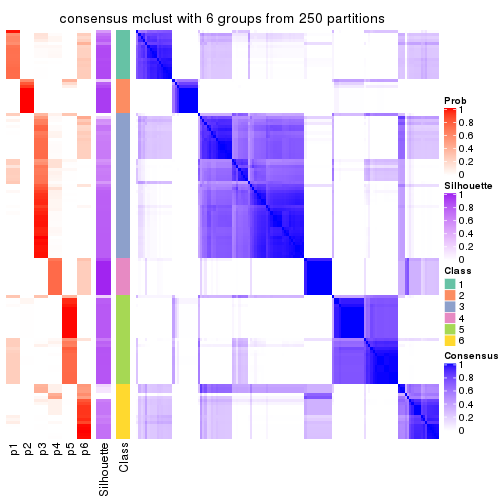</p>

</div>
</div>

Heatmaps for the membership of samples in all partitions to see how consistent they are:


<script>
$( function() {
	$( '#tabs-ATC-mclust-membership-heatmap' ).tabs();
} );
</script>
<div id='tabs-ATC-mclust-membership-heatmap'>
<ul>
<li><a href='#tab-ATC-mclust-membership-heatmap-1'>k = 2</a></li>
<li><a href='#tab-ATC-mclust-membership-heatmap-2'>k = 3</a></li>
<li><a href='#tab-ATC-mclust-membership-heatmap-3'>k = 4</a></li>
<li><a href='#tab-ATC-mclust-membership-heatmap-4'>k = 5</a></li>
<li><a href='#tab-ATC-mclust-membership-heatmap-5'>k = 6</a></li>
</ul>
<div id='tab-ATC-mclust-membership-heatmap-1'>
<pre><code class="r">membership_heatmap(res, k = 2)
</code></pre>

<p></p>

</div>
<div id='tab-ATC-mclust-membership-heatmap-2'>
<pre><code class="r">membership_heatmap(res, k = 3)
</code></pre>

<p></p>

</div>
<div id='tab-ATC-mclust-membership-heatmap-3'>
<pre><code class="r">membership_heatmap(res, k = 4)
</code></pre>

<p></p>

</div>
<div id='tab-ATC-mclust-membership-heatmap-4'>
<pre><code class="r">membership_heatmap(res, k = 5)
</code></pre>

<p></p>

</div>
<div id='tab-ATC-mclust-membership-heatmap-5'>
<pre><code class="r">membership_heatmap(res, k = 6)
</code></pre>

<p></p>

</div>
</div>

As soon as we have had the classes for columns, we can look for signatures
which are significantly different between classes which can be candidate marks
for certain classes. Following are the heatmaps for signatures.


Signature heatmaps where rows are scaled:


<script>
$( function() {
	$( '#tabs-ATC-mclust-get-signatures' ).tabs();
} );
</script>
<div id='tabs-ATC-mclust-get-signatures'>
<ul>
<li><a href='#tab-ATC-mclust-get-signatures-1'>k = 2</a></li>
<li><a href='#tab-ATC-mclust-get-signatures-2'>k = 3</a></li>
<li><a href='#tab-ATC-mclust-get-signatures-3'>k = 4</a></li>
<li><a href='#tab-ATC-mclust-get-signatures-4'>k = 5</a></li>
<li><a href='#tab-ATC-mclust-get-signatures-5'>k = 6</a></li>
</ul>
<div id='tab-ATC-mclust-get-signatures-1'>
<pre><code class="r">get_signatures(res, k = 2)
</code></pre>

<p></p>

</div>
<div id='tab-ATC-mclust-get-signatures-2'>
<pre><code class="r">get_signatures(res, k = 3)
</code></pre>

<p></p>

</div>
<div id='tab-ATC-mclust-get-signatures-3'>
<pre><code class="r">get_signatures(res, k = 4)
</code></pre>

<p></p>

</div>
<div id='tab-ATC-mclust-get-signatures-4'>
<pre><code class="r">get_signatures(res, k = 5)
</code></pre>

<p></p>

</div>
<div id='tab-ATC-mclust-get-signatures-5'>
<pre><code class="r">get_signatures(res, k = 6)
</code></pre>

<p></p>

</div>
</div>


Signature heatmaps where rows are not scaled:


<script>
$( function() {
	$( '#tabs-ATC-mclust-get-signatures-no-scale' ).tabs();
} );
</script>
<div id='tabs-ATC-mclust-get-signatures-no-scale'>
<ul>
<li><a href='#tab-ATC-mclust-get-signatures-no-scale-1'>k = 2</a></li>
<li><a href='#tab-ATC-mclust-get-signatures-no-scale-2'>k = 3</a></li>
<li><a href='#tab-ATC-mclust-get-signatures-no-scale-3'>k = 4</a></li>
<li><a href='#tab-ATC-mclust-get-signatures-no-scale-4'>k = 5</a></li>
<li><a href='#tab-ATC-mclust-get-signatures-no-scale-5'>k = 6</a></li>
</ul>
<div id='tab-ATC-mclust-get-signatures-no-scale-1'>
<pre><code class="r">get_signatures(res, k = 2, scale_rows = FALSE)
</code></pre>

<p></p>

</div>
<div id='tab-ATC-mclust-get-signatures-no-scale-2'>
<pre><code class="r">get_signatures(res, k = 3, scale_rows = FALSE)
</code></pre>

<p></p>

</div>
<div id='tab-ATC-mclust-get-signatures-no-scale-3'>
<pre><code class="r">get_signatures(res, k = 4, scale_rows = FALSE)
</code></pre>

<p></p>

</div>
<div id='tab-ATC-mclust-get-signatures-no-scale-4'>
<pre><code class="r">get_signatures(res, k = 5, scale_rows = FALSE)
</code></pre>

<p></p>

</div>
<div id='tab-ATC-mclust-get-signatures-no-scale-5'>
<pre><code class="r">get_signatures(res, k = 6, scale_rows = FALSE)
</code></pre>

<p></p>

</div>
</div>


Compare the overlap of signatures from different k:

```r
compare_signatures(res)
```


`get_signature()` returns a data frame invisibly. TO get the list of signatures, the function
call should be assigned to a variable explicitly. In following code, if `plot` argument is set
to `FALSE`, no heatmap is plotted while only the differential analysis is performed.

```r
# code only for demonstration
tb = get_signature(res, k = ..., plot = FALSE)
```

An example of the output of `tb` is:

```
#>   which_row         fdr    mean_1    mean_2 scaled_mean_1 scaled_mean_2 km
#> 1        38 0.042760348  8.373488  9.131774    -0.5533452     0.5164555  1
#> 2        40 0.018707592  7.106213  8.469186    -0.6173731     0.5762149  1
#> 3        55 0.019134737 10.221463 11.207825    -0.6159697     0.5749050  1
#> 4        59 0.006059896  5.921854  7.869574    -0.6899429     0.6439467  1
#> 5        60 0.018055526  8.928898 10.211722    -0.6204761     0.5791110  1
#> 6        98 0.009384629 15.714769 14.887706     0.6635654    -0.6193277  2
...
```

The columns in `tb` are:

1. `which_row`: row indices corresponding to the input matrix.
2. `fdr`: FDR for the differential test. 
3. `mean_x`: The mean value in group x.
4. `scaled_mean_x`: The mean value in group x after rows are scaled.
5. `km`: Row groups if k-means clustering is applied to rows.


UMAP plot which shows how samples are separated.


<script>
$( function() {
	$( '#tabs-ATC-mclust-dimension-reduction' ).tabs();
} );
</script>
<div id='tabs-ATC-mclust-dimension-reduction'>
<ul>
<li><a href='#tab-ATC-mclust-dimension-reduction-1'>k = 2</a></li>
<li><a href='#tab-ATC-mclust-dimension-reduction-2'>k = 3</a></li>
<li><a href='#tab-ATC-mclust-dimension-reduction-3'>k = 4</a></li>
<li><a href='#tab-ATC-mclust-dimension-reduction-4'>k = 5</a></li>
<li><a href='#tab-ATC-mclust-dimension-reduction-5'>k = 6</a></li>
</ul>
<div id='tab-ATC-mclust-dimension-reduction-1'>
<pre><code class="r">dimension_reduction(res, k = 2, method = &quot;UMAP&quot;)
</code></pre>

<p></p>

</div>
<div id='tab-ATC-mclust-dimension-reduction-2'>
<pre><code class="r">dimension_reduction(res, k = 3, method = &quot;UMAP&quot;)
</code></pre>

<p></p>

</div>
<div id='tab-ATC-mclust-dimension-reduction-3'>
<pre><code class="r">dimension_reduction(res, k = 4, method = &quot;UMAP&quot;)
</code></pre>

<p></p>

</div>
<div id='tab-ATC-mclust-dimension-reduction-4'>
<pre><code class="r">dimension_reduction(res, k = 5, method = &quot;UMAP&quot;)
</code></pre>

<p></p>

</div>
<div id='tab-ATC-mclust-dimension-reduction-5'>
<pre><code class="r">dimension_reduction(res, k = 6, method = &quot;UMAP&quot;)
</code></pre>

<p></p>

</div>
</div>


Following heatmap shows how subgroups are split when increasing `k`:

```r
collect_classes(res)
```


If matrix rows can be associated to genes, consider to use `functional_enrichment(res,
...)` to perform function enrichment for the signature genes. See [this vignette](http://bioconductor.org/packages/devel/bioc/vignettes/cola/inst/doc/functional_enrichment.html) for more detailed explanations.


 

---------------------------------------------------


### ATC:NMF


The object with results only for a single top-value method and a single partition method 
can be extracted as:

```r
res = res_list["ATC", "NMF"]
# you can also extract it by
# res = res_list["ATC:NMF"]
```

A summary of `res` and all the functions that can be applied to it:

```r
res
```

```
#> A 'ConsensusPartition' object with k = 2, 3, 4, 5, 6.
#>   On a matrix with 13580 rows and 133 columns.
#>   Top rows (1000, 2000, 3000, 4000, 5000) are extracted by 'ATC' method.
#>   Subgroups are detected by 'NMF' method.
#>   Performed in total 1250 partitions by row resampling.
#>   Best k for subgroups seems to be 2.
#> 
#> Following methods can be applied to this 'ConsensusPartition' object:
#>  [1] "cola_report"             "collect_classes"         "collect_plots"          
#>  [4] "collect_stats"           "colnames"                "compare_signatures"     
#>  [7] "consensus_heatmap"       "dimension_reduction"     "functional_enrichment"  
#> [10] "get_anno_col"            "get_anno"                "get_classes"            
#> [13] "get_consensus"           "get_matrix"              "get_membership"         
#> [16] "get_param"               "get_signatures"          "get_stats"              
#> [19] "is_best_k"               "is_stable_k"             "membership_heatmap"     
#> [22] "ncol"                    "nrow"                    "plot_ecdf"              
#> [25] "rownames"                "select_partition_number" "show"                   
#> [28] "suggest_best_k"          "test_to_known_factors"
```

`collect_plots()` function collects all the plots made from `res` for all `k` (number of partitions)
into one single page to provide an easy and fast comparison between different `k`.

```r
collect_plots(res)
```


The plots are:

- The first row: a plot of the ECDF (empirical cumulative distribution
  function) curves of the consensus matrix for each `k` and the heatmap of
  predicted classes for each `k`.
- The second row: heatmaps of the consensus matrix for each `k`.
- The third row: heatmaps of the membership matrix for each `k`.
- The fouth row: heatmaps of the signatures for each `k`.

All the plots in panels can be made by individual functions and they are
plotted later in this section.

`select_partition_number()` produces several plots showing different
statistics for choosing "optimized" `k`. There are following statistics:

- ECDF curves of the consensus matrix for each `k`;
- 1-PAC. [The PAC
  score](https://en.wikipedia.org/wiki/Consensus_clustering#Over-interpretation_potential_of_consensus_clustering)
  measures the proportion of the ambiguous subgrouping.
- Mean silhouette score.
- Concordance. The mean probability of fiting the consensus class ids in all
  partitions.
- Area increased. Denote $A_k$ as the area under the ECDF curve for current
  `k`, the area increased is defined as $A_k - A_{k-1}$.
- Rand index. The percent of pairs of samples that are both in a same cluster
  or both are not in a same cluster in the partition of k and k-1.
- Jaccard index. The ratio of pairs of samples are both in a same cluster in
  the partition of k and k-1 and the pairs of samples are both in a same
  cluster in the partition k or k-1.

The detailed explanations of these statistics can be found in [the _cola_
vignette](http://bioconductor.org/packages/devel/bioc/vignettes/cola/inst/doc/cola.html#toc_13).

Generally speaking, lower PAC score, higher mean silhouette score or higher
concordance corresponds to better partition. Rand index and Jaccard index
measure how similar the current partition is compared to partition with `k-1`.
If they are too similar, we won't accept `k` is better than `k-1`.

```r
select_partition_number(res)
```


The numeric values for all these statistics can be obtained by `get_stats()`.

```r
get_stats(res)
```

```
#>   k 1-PAC mean_silhouette concordance area_increased  Rand Jaccard
#> 2 2 0.820           0.897       0.957         0.4825 0.520   0.520
#> 3 3 0.426           0.564       0.774         0.3486 0.702   0.488
#> 4 4 0.534           0.571       0.779         0.1494 0.687   0.311
#> 5 5 0.541           0.443       0.678         0.0618 0.870   0.557
#> 6 6 0.593           0.513       0.707         0.0371 0.888   0.553
```

`suggest_best_k()` suggests the best $k$ based on these statistics. The rules are as follows:

- All $k$ with Jaccard index larger than 0.95 are removed because increasing
  $k$ does not provide enough extra information. If all $k$ are removed, it is
  marked as no subgroup is detected.
- For all $k$ with 1-PAC score larger than 0.9, the maximal $k$ is taken as
  the best $k$, and other $k$ are marked as optional $k$.
- If it does not fit the second rule. The $k$ with the maximal vote of the
  highest 1-PAC score, highest mean silhouette, and highest concordance is
  taken as the best $k$.

```r
suggest_best_k(res)
```

```
#> [1] 2
```


Following shows the table of the partitions (You need to click the **show/hide
code output** link to see it). The membership matrix (columns with name `p*`)
is inferred by
[`clue::cl_consensus()`](https://www.rdocumentation.org/link/cl_consensus?package=clue)
function with the `SE` method. Basically the value in the membership matrix
represents the probability to belong to a certain group. The finall class
label for an item is determined with the group with highest probability it
belongs to.

In `get_classes()` function, the entropy is calculated from the membership
matrix and the silhouette score is calculated from the consensus matrix.


<script>
$( function() {
	$( '#tabs-ATC-NMF-get-classes' ).tabs();
} );
</script>
<div id='tabs-ATC-NMF-get-classes'>
<ul>
<li><a href='#tab-ATC-NMF-get-classes-1'>k = 2</a></li>
<li><a href='#tab-ATC-NMF-get-classes-2'>k = 3</a></li>
<li><a href='#tab-ATC-NMF-get-classes-3'>k = 4</a></li>
<li><a href='#tab-ATC-NMF-get-classes-4'>k = 5</a></li>
<li><a href='#tab-ATC-NMF-get-classes-5'>k = 6</a></li>
</ul>

<div id='tab-ATC-NMF-get-classes-1'>
<p><a id='tab-ATC-NMF-get-classes-1-a' style='color:#0366d6' href='#'>show/hide code output</a></p>
<pre><code class="r">cbind(get_classes(res, k = 2), get_membership(res, k = 2))
</code></pre>

<pre><code>#&gt;            class entropy silhouette    p1    p2
#&gt; SRR1951667     1  0.0000     0.9492 1.000 0.000
#&gt; SRR1951666     1  0.0000     0.9492 1.000 0.000
#&gt; SRR1951665     2  0.0000     0.9604 0.000 1.000
#&gt; SRR1951664     1  0.0000     0.9492 1.000 0.000
#&gt; SRR1951663     2  0.0000     0.9604 0.000 1.000
#&gt; SRR1951662     2  0.0000     0.9604 0.000 1.000
#&gt; SRR1951661     1  0.0000     0.9492 1.000 0.000
#&gt; SRR1951660     2  0.0000     0.9604 0.000 1.000
#&gt; SRR1951659     1  0.0000     0.9492 1.000 0.000
#&gt; SRR1951658     2  0.9608     0.3526 0.384 0.616
#&gt; SRR1951657     1  0.0000     0.9492 1.000 0.000
#&gt; SRR1951656     1  0.0000     0.9492 1.000 0.000
#&gt; SRR1951655     2  0.2043     0.9363 0.032 0.968
#&gt; SRR1951654     2  0.0000     0.9604 0.000 1.000
#&gt; SRR1951653     1  0.0000     0.9492 1.000 0.000
#&gt; SRR1951652     2  0.0000     0.9604 0.000 1.000
#&gt; SRR1951651     1  0.3114     0.9120 0.944 0.056
#&gt; SRR1951650     1  0.0000     0.9492 1.000 0.000
#&gt; SRR1951648     1  0.0000     0.9492 1.000 0.000
#&gt; SRR1951649     1  0.3733     0.8990 0.928 0.072
#&gt; SRR1951647     1  0.0000     0.9492 1.000 0.000
#&gt; SRR1951646     1  0.0000     0.9492 1.000 0.000
#&gt; SRR1951645     1  0.8016     0.6936 0.756 0.244
#&gt; SRR1951644     1  0.4939     0.8667 0.892 0.108
#&gt; SRR1951643     1  0.5059     0.8624 0.888 0.112
#&gt; SRR1951641     2  0.8555     0.5952 0.280 0.720
#&gt; SRR1951642     2  0.6623     0.7746 0.172 0.828
#&gt; SRR1951694     2  0.0000     0.9604 0.000 1.000
#&gt; SRR1951731     1  0.0000     0.9492 1.000 0.000
#&gt; SRR1951730     1  0.5059     0.8613 0.888 0.112
#&gt; SRR1951752     2  0.9248     0.4718 0.340 0.660
#&gt; SRR1951751     1  0.5629     0.8367 0.868 0.132
#&gt; SRR1951749     1  0.0000     0.9492 1.000 0.000
#&gt; SRR1951750     2  0.4939     0.8577 0.108 0.892
#&gt; SRR1951748     2  0.0000     0.9604 0.000 1.000
#&gt; SRR1951747     2  0.0000     0.9604 0.000 1.000
#&gt; SRR1951745     2  0.0000     0.9604 0.000 1.000
#&gt; SRR1951746     1  0.0000     0.9492 1.000 0.000
#&gt; SRR1951744     2  0.1414     0.9468 0.020 0.980
#&gt; SRR1951742     1  0.0000     0.9492 1.000 0.000
#&gt; SRR1951743     2  0.0000     0.9604 0.000 1.000
#&gt; SRR1951741     2  0.0000     0.9604 0.000 1.000
#&gt; SRR1951740     1  0.0000     0.9492 1.000 0.000
#&gt; SRR1951738     2  0.0000     0.9604 0.000 1.000
#&gt; SRR1951739     1  0.0000     0.9492 1.000 0.000
#&gt; SRR1951737     1  0.0000     0.9492 1.000 0.000
#&gt; SRR1951736     2  0.0376     0.9587 0.004 0.996
#&gt; SRR1951734     1  0.0000     0.9492 1.000 0.000
#&gt; SRR1951735     1  0.0000     0.9492 1.000 0.000
#&gt; SRR1951733     1  0.0000     0.9492 1.000 0.000
#&gt; SRR1951732     1  0.8955     0.5688 0.688 0.312
#&gt; SRR1951729     1  0.0000     0.9492 1.000 0.000
#&gt; SRR1951728     1  0.0000     0.9492 1.000 0.000
#&gt; SRR1951727     2  0.0000     0.9604 0.000 1.000
#&gt; SRR1951725     2  0.0000     0.9604 0.000 1.000
#&gt; SRR1951726     2  0.0000     0.9604 0.000 1.000
#&gt; SRR1951724     1  0.3114     0.9119 0.944 0.056
#&gt; SRR1951722     1  0.0938     0.9421 0.988 0.012
#&gt; SRR1951723     1  0.0000     0.9492 1.000 0.000
#&gt; SRR1951721     2  0.0000     0.9604 0.000 1.000
#&gt; SRR1951719     1  0.0000     0.9492 1.000 0.000
#&gt; SRR1951720     2  0.0000     0.9604 0.000 1.000
#&gt; SRR1951718     2  0.9922     0.1394 0.448 0.552
#&gt; SRR1951717     2  0.0000     0.9604 0.000 1.000
#&gt; SRR1951715     2  0.0000     0.9604 0.000 1.000
#&gt; SRR1951716     2  0.0000     0.9604 0.000 1.000
#&gt; SRR1951714     1  0.9922     0.2300 0.552 0.448
#&gt; SRR1951713     1  0.0000     0.9492 1.000 0.000
#&gt; SRR1951712     1  0.4022     0.8906 0.920 0.080
#&gt; SRR1951711     2  0.2236     0.9325 0.036 0.964
#&gt; SRR1951710     2  0.0000     0.9604 0.000 1.000
#&gt; SRR1951709     1  0.0000     0.9492 1.000 0.000
#&gt; SRR1951708     2  0.0000     0.9604 0.000 1.000
#&gt; SRR1951707     1  0.0000     0.9492 1.000 0.000
#&gt; SRR1951705     2  0.0000     0.9604 0.000 1.000
#&gt; SRR1951704     1  0.2423     0.9241 0.960 0.040
#&gt; SRR1951703     2  0.0000     0.9604 0.000 1.000
#&gt; SRR1951706     2  0.0672     0.9561 0.008 0.992
#&gt; SRR1951702     1  0.0000     0.9492 1.000 0.000
#&gt; SRR1951701     1  0.0000     0.9492 1.000 0.000
#&gt; SRR1951699     1  0.0000     0.9492 1.000 0.000
#&gt; SRR1951698     1  0.0000     0.9492 1.000 0.000
#&gt; SRR1951700     1  0.0000     0.9492 1.000 0.000
#&gt; SRR1951697     1  0.0376     0.9470 0.996 0.004
#&gt; SRR1951696     1  0.0000     0.9492 1.000 0.000
#&gt; SRR1951695     1  0.0000     0.9492 1.000 0.000
#&gt; SRR1951693     1  0.0000     0.9492 1.000 0.000
#&gt; SRR1951692     1  0.0000     0.9492 1.000 0.000
#&gt; SRR1951691     1  0.8207     0.6739 0.744 0.256
#&gt; SRR1951688     2  0.0376     0.9587 0.004 0.996
#&gt; SRR1951689     1  0.0000     0.9492 1.000 0.000
#&gt; SRR1951687     2  0.0000     0.9604 0.000 1.000
#&gt; SRR1951685     1  0.0000     0.9492 1.000 0.000
#&gt; SRR1951684     1  0.0000     0.9492 1.000 0.000
#&gt; SRR1951686     1  0.0000     0.9492 1.000 0.000
#&gt; SRR1951683     1  0.8267     0.6682 0.740 0.260
#&gt; SRR1951682     1  0.0000     0.9492 1.000 0.000
#&gt; SRR1951690     1  0.0000     0.9492 1.000 0.000
#&gt; SRR1951680     1  0.0000     0.9492 1.000 0.000
#&gt; SRR1951679     1  0.0376     0.9470 0.996 0.004
#&gt; SRR1951678     2  0.0938     0.9530 0.012 0.988
#&gt; SRR1951677     2  0.0376     0.9587 0.004 0.996
#&gt; SRR1951676     1  0.0000     0.9492 1.000 0.000
#&gt; SRR1951675     2  0.0000     0.9604 0.000 1.000
#&gt; SRR1951681     1  0.0000     0.9492 1.000 0.000
#&gt; SRR1951673     2  0.0376     0.9587 0.004 0.996
#&gt; SRR1951674     2  0.0000     0.9604 0.000 1.000
#&gt; SRR1951672     2  0.0376     0.9587 0.004 0.996
#&gt; SRR1951671     1  0.0000     0.9492 1.000 0.000
#&gt; SRR1951670     2  0.0376     0.9587 0.004 0.996
#&gt; SRR1951640     1  0.0000     0.9492 1.000 0.000
#&gt; SRR1951668     1  0.5946     0.8270 0.856 0.144
#&gt; SRR1951669     2  0.0000     0.9604 0.000 1.000
#&gt; SRR1951638     2  0.0000     0.9604 0.000 1.000
#&gt; SRR1951637     2  0.0000     0.9604 0.000 1.000
#&gt; SRR1951635     2  0.0000     0.9604 0.000 1.000
#&gt; SRR1951634     1  0.0376     0.9470 0.996 0.004
#&gt; SRR1951631     1  0.1414     0.9370 0.980 0.020
#&gt; SRR1951632     1  0.0000     0.9492 1.000 0.000
#&gt; SRR1951633     2  0.0376     0.9587 0.004 0.996
#&gt; SRR1951630     1  0.9963     0.1773 0.536 0.464
#&gt; SRR1951629     1  0.2948     0.9150 0.948 0.052
#&gt; SRR1951628     1  0.9993     0.0998 0.516 0.484
#&gt; SRR1951627     1  0.0000     0.9492 1.000 0.000
#&gt; SRR1951639     1  0.0000     0.9492 1.000 0.000
#&gt; SRR1951625     1  0.0000     0.9492 1.000 0.000
#&gt; SRR1951626     1  0.0000     0.9492 1.000 0.000
#&gt; SRR1951624     1  0.0000     0.9492 1.000 0.000
#&gt; SRR1951622     2  0.0000     0.9604 0.000 1.000
#&gt; SRR1951636     1  0.0000     0.9492 1.000 0.000
#&gt; SRR1951623     1  0.9710     0.3680 0.600 0.400
#&gt; SRR1951621     2  0.0000     0.9604 0.000 1.000
#&gt; SRR1951620     1  0.0000     0.9492 1.000 0.000
</code></pre>

<script>
$('#tab-ATC-NMF-get-classes-1-a').parent().next().next().hide();
$('#tab-ATC-NMF-get-classes-1-a').click(function(){
  $('#tab-ATC-NMF-get-classes-1-a').parent().next().next().toggle();
  return(false);
});
</script>
</div>

<div id='tab-ATC-NMF-get-classes-2'>
<p><a id='tab-ATC-NMF-get-classes-2-a' style='color:#0366d6' href='#'>show/hide code output</a></p>
<pre><code class="r">cbind(get_classes(res, k = 3), get_membership(res, k = 3))
</code></pre>

<pre><code>#&gt;            class entropy silhouette    p1    p2    p3
#&gt; SRR1951667     3  0.2356     0.7807 0.000 0.072 0.928
#&gt; SRR1951666     2  0.6154     0.0852 0.000 0.592 0.408
#&gt; SRR1951665     2  0.6235     0.1905 0.436 0.564 0.000
#&gt; SRR1951664     3  0.3116     0.7799 0.000 0.108 0.892
#&gt; SRR1951663     1  0.4796     0.5619 0.780 0.220 0.000
#&gt; SRR1951662     2  0.4750     0.5232 0.216 0.784 0.000
#&gt; SRR1951661     3  0.6309     0.2228 0.000 0.496 0.504
#&gt; SRR1951660     1  0.2066     0.6664 0.940 0.000 0.060
#&gt; SRR1951659     3  0.4912     0.7457 0.008 0.196 0.796
#&gt; SRR1951658     2  0.9082     0.2183 0.392 0.468 0.140
#&gt; SRR1951657     3  0.5650     0.6206 0.000 0.312 0.688
#&gt; SRR1951656     3  0.3530     0.7795 0.032 0.068 0.900
#&gt; SRR1951655     1  0.3181     0.6703 0.912 0.024 0.064
#&gt; SRR1951654     2  0.6045     0.3088 0.380 0.620 0.000
#&gt; SRR1951653     3  0.4062     0.6571 0.164 0.000 0.836
#&gt; SRR1951652     2  0.2301     0.6346 0.060 0.936 0.004
#&gt; SRR1951651     3  0.6676     0.2525 0.008 0.476 0.516
#&gt; SRR1951650     3  0.5363     0.6672 0.000 0.276 0.724
#&gt; SRR1951648     3  0.4862     0.7672 0.020 0.160 0.820
#&gt; SRR1951649     1  0.6045     0.4465 0.620 0.000 0.380
#&gt; SRR1951647     3  0.5363     0.4834 0.276 0.000 0.724
#&gt; SRR1951646     3  0.4836     0.7684 0.072 0.080 0.848
#&gt; SRR1951645     1  0.5948     0.4801 0.640 0.000 0.360
#&gt; SRR1951644     1  0.5926     0.4873 0.644 0.000 0.356
#&gt; SRR1951643     2  0.4931     0.5450 0.004 0.784 0.212
#&gt; SRR1951641     1  0.5529     0.5652 0.704 0.000 0.296
#&gt; SRR1951642     2  0.2774     0.6565 0.008 0.920 0.072
#&gt; SRR1951694     1  0.3482     0.6293 0.872 0.128 0.000
#&gt; SRR1951731     3  0.1999     0.7653 0.036 0.012 0.952
#&gt; SRR1951730     2  0.7807    -0.0615 0.052 0.516 0.432
#&gt; SRR1951752     1  0.9463     0.2640 0.500 0.256 0.244
#&gt; SRR1951751     1  0.6819     0.2617 0.512 0.012 0.476
#&gt; SRR1951749     3  0.3879     0.7669 0.000 0.152 0.848
#&gt; SRR1951750     2  0.7276     0.2173 0.404 0.564 0.032
#&gt; SRR1951748     2  0.5926     0.3527 0.356 0.644 0.000
#&gt; SRR1951747     2  0.5529     0.4398 0.296 0.704 0.000
#&gt; SRR1951745     2  0.6111     0.2721 0.396 0.604 0.000
#&gt; SRR1951746     3  0.3551     0.7750 0.000 0.132 0.868
#&gt; SRR1951744     2  0.2176     0.6528 0.020 0.948 0.032
#&gt; SRR1951742     3  0.5254     0.6775 0.000 0.264 0.736
#&gt; SRR1951743     1  0.5325     0.5341 0.748 0.248 0.004
#&gt; SRR1951741     1  0.6267     0.1374 0.548 0.452 0.000
#&gt; SRR1951740     3  0.1170     0.7741 0.008 0.016 0.976
#&gt; SRR1951738     1  0.0424     0.6641 0.992 0.008 0.000
#&gt; SRR1951739     3  0.1832     0.7643 0.036 0.008 0.956
#&gt; SRR1951737     3  0.3482     0.7757 0.000 0.128 0.872
#&gt; SRR1951736     1  0.2682     0.6653 0.920 0.004 0.076
#&gt; SRR1951734     3  0.5365     0.6820 0.004 0.252 0.744
#&gt; SRR1951735     3  0.2261     0.7462 0.068 0.000 0.932
#&gt; SRR1951733     3  0.3551     0.7749 0.000 0.132 0.868
#&gt; SRR1951732     2  0.3192     0.6407 0.000 0.888 0.112
#&gt; SRR1951729     3  0.3192     0.7789 0.000 0.112 0.888
#&gt; SRR1951728     3  0.3816     0.7686 0.000 0.148 0.852
#&gt; SRR1951727     2  0.2804     0.6370 0.060 0.924 0.016
#&gt; SRR1951725     1  0.5650     0.4483 0.688 0.312 0.000
#&gt; SRR1951726     2  0.5678     0.4165 0.316 0.684 0.000
#&gt; SRR1951724     3  0.4526     0.7739 0.040 0.104 0.856
#&gt; SRR1951722     3  0.2173     0.7802 0.008 0.048 0.944
#&gt; SRR1951723     3  0.5948     0.2717 0.360 0.000 0.640
#&gt; SRR1951721     1  0.6111     0.2873 0.604 0.396 0.000
#&gt; SRR1951719     3  0.3116     0.7795 0.000 0.108 0.892
#&gt; SRR1951720     1  0.3192     0.6371 0.888 0.112 0.000
#&gt; SRR1951718     1  0.5785     0.5604 0.696 0.004 0.300
#&gt; SRR1951717     1  0.5465     0.4825 0.712 0.288 0.000
#&gt; SRR1951715     1  0.3412     0.6323 0.876 0.124 0.000
#&gt; SRR1951716     1  0.0829     0.6661 0.984 0.004 0.012
#&gt; SRR1951714     1  0.7477     0.5151 0.648 0.068 0.284
#&gt; SRR1951713     3  0.3267     0.7063 0.116 0.000 0.884
#&gt; SRR1951712     3  0.6540     0.0750 0.408 0.008 0.584
#&gt; SRR1951711     2  0.7140     0.4043 0.328 0.632 0.040
#&gt; SRR1951710     1  0.1989     0.6678 0.948 0.004 0.048
#&gt; SRR1951709     3  0.5621     0.6234 0.000 0.308 0.692
#&gt; SRR1951708     1  0.2959     0.6418 0.900 0.100 0.000
#&gt; SRR1951707     3  0.3038     0.7799 0.000 0.104 0.896
#&gt; SRR1951705     1  0.4452     0.6308 0.808 0.000 0.192
#&gt; SRR1951704     2  0.4346     0.5741 0.000 0.816 0.184
#&gt; SRR1951703     1  0.3207     0.6525 0.904 0.084 0.012
#&gt; SRR1951706     2  0.2796     0.6539 0.000 0.908 0.092
#&gt; SRR1951702     2  0.6126     0.1149 0.000 0.600 0.400
#&gt; SRR1951701     3  0.3038     0.7196 0.104 0.000 0.896
#&gt; SRR1951699     3  0.6225     0.3927 0.000 0.432 0.568
#&gt; SRR1951698     3  0.4702     0.7276 0.000 0.212 0.788
#&gt; SRR1951700     3  0.4605     0.7379 0.000 0.204 0.796
#&gt; SRR1951697     2  0.4555     0.5559 0.000 0.800 0.200
#&gt; SRR1951696     3  0.4605     0.7365 0.000 0.204 0.796
#&gt; SRR1951695     3  0.5465     0.6588 0.000 0.288 0.712
#&gt; SRR1951693     3  0.2152     0.7678 0.036 0.016 0.948
#&gt; SRR1951692     3  0.5109     0.7314 0.008 0.212 0.780
#&gt; SRR1951691     1  0.7072     0.2495 0.504 0.020 0.476
#&gt; SRR1951688     2  0.4883     0.5414 0.208 0.788 0.004
#&gt; SRR1951689     3  0.3618     0.7224 0.104 0.012 0.884
#&gt; SRR1951687     2  0.4605     0.5388 0.204 0.796 0.000
#&gt; SRR1951685     3  0.2187     0.7728 0.024 0.028 0.948
#&gt; SRR1951684     3  0.3551     0.7744 0.000 0.132 0.868
#&gt; SRR1951686     2  0.5882     0.2661 0.000 0.652 0.348
#&gt; SRR1951683     2  0.4963     0.5650 0.008 0.792 0.200
#&gt; SRR1951682     1  0.6307     0.1901 0.512 0.000 0.488
#&gt; SRR1951690     3  0.4504     0.6161 0.196 0.000 0.804
#&gt; SRR1951680     3  0.1163     0.7657 0.028 0.000 0.972
#&gt; SRR1951679     1  0.6235     0.3481 0.564 0.000 0.436
#&gt; SRR1951678     2  0.2866     0.6329 0.076 0.916 0.008
#&gt; SRR1951677     2  0.2955     0.6306 0.080 0.912 0.008
#&gt; SRR1951676     2  0.5291     0.4469 0.000 0.732 0.268
#&gt; SRR1951675     1  0.2448     0.6497 0.924 0.076 0.000
#&gt; SRR1951681     3  0.6286     0.3150 0.000 0.464 0.536
#&gt; SRR1951673     1  0.4842     0.6172 0.776 0.000 0.224
#&gt; SRR1951674     2  0.5835     0.3782 0.340 0.660 0.000
#&gt; SRR1951672     1  0.3752     0.6648 0.884 0.020 0.096
#&gt; SRR1951671     3  0.3116     0.7144 0.108 0.000 0.892
#&gt; SRR1951670     1  0.5678     0.4367 0.684 0.316 0.000
#&gt; SRR1951640     3  0.2066     0.7544 0.060 0.000 0.940
#&gt; SRR1951668     3  0.5858     0.5230 0.240 0.020 0.740
#&gt; SRR1951669     1  0.4750     0.5653 0.784 0.216 0.000
#&gt; SRR1951638     1  0.5785     0.4199 0.668 0.332 0.000
#&gt; SRR1951637     1  0.3412     0.6320 0.876 0.124 0.000
#&gt; SRR1951635     1  0.4062     0.6057 0.836 0.164 0.000
#&gt; SRR1951634     3  0.4702     0.5950 0.212 0.000 0.788
#&gt; SRR1951631     3  0.3207     0.7457 0.084 0.012 0.904
#&gt; SRR1951632     3  0.3116     0.7151 0.108 0.000 0.892
#&gt; SRR1951633     2  0.1774     0.6491 0.024 0.960 0.016
#&gt; SRR1951630     2  0.4056     0.6547 0.032 0.876 0.092
#&gt; SRR1951629     3  0.6553     0.4181 0.008 0.412 0.580
#&gt; SRR1951628     1  0.5733     0.5306 0.676 0.000 0.324
#&gt; SRR1951627     2  0.6267    -0.0817 0.000 0.548 0.452
#&gt; SRR1951639     3  0.1860     0.7581 0.052 0.000 0.948
#&gt; SRR1951625     3  0.4291     0.6378 0.180 0.000 0.820
#&gt; SRR1951626     3  0.4654     0.7339 0.000 0.208 0.792
#&gt; SRR1951624     3  0.4974     0.7094 0.000 0.236 0.764
#&gt; SRR1951622     1  0.3686     0.6478 0.860 0.000 0.140
#&gt; SRR1951636     3  0.5835     0.5768 0.000 0.340 0.660
#&gt; SRR1951623     2  0.3532     0.6484 0.008 0.884 0.108
#&gt; SRR1951621     1  0.6225     0.1842 0.568 0.432 0.000
#&gt; SRR1951620     3  0.4353     0.7662 0.008 0.156 0.836
</code></pre>

<script>
$('#tab-ATC-NMF-get-classes-2-a').parent().next().next().hide();
$('#tab-ATC-NMF-get-classes-2-a').click(function(){
  $('#tab-ATC-NMF-get-classes-2-a').parent().next().next().toggle();
  return(false);
});
</script>
</div>

<div id='tab-ATC-NMF-get-classes-3'>
<p><a id='tab-ATC-NMF-get-classes-3-a' style='color:#0366d6' href='#'>show/hide code output</a></p>
<pre><code class="r">cbind(get_classes(res, k = 4), get_membership(res, k = 4))
</code></pre>

<pre><code>#&gt;            class entropy silhouette    p1    p2    p3    p4
#&gt; SRR1951667     4  0.0859     0.8402 0.008 0.004 0.008 0.980
#&gt; SRR1951666     3  0.1356     0.7623 0.000 0.032 0.960 0.008
#&gt; SRR1951665     3  0.5407     0.6160 0.152 0.108 0.740 0.000
#&gt; SRR1951664     4  0.7188     0.3532 0.000 0.292 0.172 0.536
#&gt; SRR1951663     1  0.2335     0.6702 0.920 0.060 0.000 0.020
#&gt; SRR1951662     1  0.4406     0.6432 0.808 0.004 0.144 0.044
#&gt; SRR1951661     3  0.4230     0.6995 0.004 0.008 0.776 0.212
#&gt; SRR1951660     2  0.3873     0.4882 0.228 0.772 0.000 0.000
#&gt; SRR1951659     3  0.5282     0.5946 0.000 0.276 0.688 0.036
#&gt; SRR1951658     3  0.5636     0.2814 0.024 0.424 0.552 0.000
#&gt; SRR1951657     3  0.4920     0.6933 0.000 0.052 0.756 0.192
#&gt; SRR1951656     2  0.7119    -0.2110 0.000 0.440 0.432 0.128
#&gt; SRR1951655     2  0.5039     0.1956 0.404 0.592 0.000 0.004
#&gt; SRR1951654     1  0.5047     0.5093 0.668 0.016 0.316 0.000
#&gt; SRR1951653     2  0.4525     0.5565 0.000 0.804 0.080 0.116
#&gt; SRR1951652     3  0.5297     0.1385 0.444 0.004 0.548 0.004
#&gt; SRR1951651     3  0.2561     0.7560 0.004 0.068 0.912 0.016
#&gt; SRR1951650     3  0.5970     0.6178 0.000 0.088 0.668 0.244
#&gt; SRR1951648     3  0.6347     0.5523 0.000 0.276 0.624 0.100
#&gt; SRR1951649     2  0.3367     0.5801 0.108 0.864 0.000 0.028
#&gt; SRR1951647     2  0.3009     0.5877 0.000 0.892 0.052 0.056
#&gt; SRR1951646     2  0.5856    -0.1765 0.000 0.504 0.464 0.032
#&gt; SRR1951645     2  0.3224     0.5701 0.120 0.864 0.000 0.016
#&gt; SRR1951644     2  0.2949     0.5873 0.088 0.888 0.000 0.024
#&gt; SRR1951643     3  0.0779     0.7625 0.016 0.004 0.980 0.000
#&gt; SRR1951641     2  0.2266     0.5868 0.084 0.912 0.000 0.004
#&gt; SRR1951642     3  0.2011     0.7333 0.080 0.000 0.920 0.000
#&gt; SRR1951694     1  0.5050     0.2847 0.588 0.408 0.004 0.000
#&gt; SRR1951731     4  0.0707     0.8415 0.000 0.020 0.000 0.980
#&gt; SRR1951730     3  0.2531     0.7675 0.024 0.032 0.924 0.020
#&gt; SRR1951752     4  0.5147     0.1540 0.460 0.004 0.000 0.536
#&gt; SRR1951751     4  0.3658     0.7591 0.144 0.020 0.000 0.836
#&gt; SRR1951749     4  0.1151     0.8416 0.000 0.008 0.024 0.968
#&gt; SRR1951750     1  0.2796     0.6872 0.892 0.016 0.092 0.000
#&gt; SRR1951748     1  0.2839     0.6772 0.884 0.004 0.108 0.004
#&gt; SRR1951747     1  0.3808     0.6409 0.808 0.004 0.184 0.004
#&gt; SRR1951745     1  0.2401     0.6827 0.904 0.000 0.092 0.004
#&gt; SRR1951746     4  0.0992     0.8386 0.012 0.004 0.008 0.976
#&gt; SRR1951744     1  0.6128     0.1276 0.536 0.004 0.420 0.040
#&gt; SRR1951742     3  0.5307     0.6668 0.000 0.188 0.736 0.076
#&gt; SRR1951743     1  0.4313     0.5334 0.736 0.004 0.000 0.260
#&gt; SRR1951741     1  0.3239     0.6805 0.880 0.068 0.052 0.000
#&gt; SRR1951740     4  0.3107     0.8209 0.000 0.080 0.036 0.884
#&gt; SRR1951738     2  0.5028     0.2049 0.400 0.596 0.000 0.004
#&gt; SRR1951739     4  0.1042     0.8421 0.000 0.020 0.008 0.972
#&gt; SRR1951737     4  0.2411     0.8340 0.000 0.040 0.040 0.920
#&gt; SRR1951736     2  0.4950     0.2563 0.376 0.620 0.000 0.004
#&gt; SRR1951734     4  0.3676     0.7237 0.172 0.004 0.004 0.820
#&gt; SRR1951735     4  0.3812     0.7863 0.000 0.140 0.028 0.832
#&gt; SRR1951733     4  0.4300     0.7745 0.000 0.088 0.092 0.820
#&gt; SRR1951732     3  0.1474     0.7475 0.052 0.000 0.948 0.000
#&gt; SRR1951729     4  0.3621     0.8071 0.000 0.072 0.068 0.860
#&gt; SRR1951728     4  0.2494     0.8306 0.000 0.036 0.048 0.916
#&gt; SRR1951727     3  0.5214     0.3977 0.336 0.004 0.648 0.012
#&gt; SRR1951725     1  0.2287     0.6777 0.924 0.060 0.012 0.004
#&gt; SRR1951726     1  0.3626     0.6514 0.812 0.004 0.184 0.000
#&gt; SRR1951724     3  0.7445     0.1950 0.004 0.412 0.436 0.148
#&gt; SRR1951722     4  0.1484     0.8400 0.020 0.016 0.004 0.960
#&gt; SRR1951723     4  0.4826     0.6192 0.020 0.264 0.000 0.716
#&gt; SRR1951721     1  0.1404     0.6868 0.964 0.012 0.012 0.012
#&gt; SRR1951719     4  0.0967     0.8417 0.004 0.004 0.016 0.976
#&gt; SRR1951720     1  0.4941     0.2191 0.564 0.436 0.000 0.000
#&gt; SRR1951718     2  0.1557     0.5906 0.056 0.944 0.000 0.000
#&gt; SRR1951717     1  0.1929     0.6794 0.940 0.024 0.000 0.036
#&gt; SRR1951715     1  0.4212     0.5625 0.772 0.216 0.000 0.012
#&gt; SRR1951716     2  0.4406     0.4006 0.300 0.700 0.000 0.000
#&gt; SRR1951714     2  0.3612     0.5619 0.012 0.840 0.144 0.004
#&gt; SRR1951713     4  0.2156     0.8315 0.008 0.060 0.004 0.928
#&gt; SRR1951712     4  0.3542     0.7768 0.120 0.028 0.000 0.852
#&gt; SRR1951711     1  0.5500     0.1521 0.564 0.004 0.012 0.420
#&gt; SRR1951710     2  0.5168    -0.0856 0.496 0.500 0.000 0.004
#&gt; SRR1951709     3  0.5031     0.6994 0.000 0.092 0.768 0.140
#&gt; SRR1951708     2  0.5212     0.1414 0.420 0.572 0.008 0.000
#&gt; SRR1951707     4  0.3081     0.8244 0.000 0.064 0.048 0.888
#&gt; SRR1951705     2  0.4328     0.4634 0.244 0.748 0.000 0.008
#&gt; SRR1951704     4  0.7973     0.0347 0.348 0.004 0.256 0.392
#&gt; SRR1951703     2  0.5857     0.3564 0.056 0.636 0.308 0.000
#&gt; SRR1951706     3  0.6465     0.3543 0.332 0.004 0.588 0.076
#&gt; SRR1951702     3  0.3587     0.7562 0.032 0.004 0.860 0.104
#&gt; SRR1951701     2  0.6392    -0.1155 0.000 0.484 0.064 0.452
#&gt; SRR1951699     4  0.3494     0.8132 0.028 0.016 0.080 0.876
#&gt; SRR1951698     3  0.5596     0.6220 0.000 0.236 0.696 0.068
#&gt; SRR1951700     4  0.2207     0.8222 0.056 0.004 0.012 0.928
#&gt; SRR1951697     3  0.1677     0.7558 0.040 0.000 0.948 0.012
#&gt; SRR1951696     3  0.6479     0.5824 0.000 0.224 0.636 0.140
#&gt; SRR1951695     4  0.2777     0.7922 0.104 0.004 0.004 0.888
#&gt; SRR1951693     4  0.1191     0.8423 0.004 0.024 0.004 0.968
#&gt; SRR1951692     3  0.4877     0.6667 0.000 0.204 0.752 0.044
#&gt; SRR1951691     4  0.6075     0.4973 0.288 0.076 0.000 0.636
#&gt; SRR1951688     1  0.4781     0.4409 0.660 0.000 0.336 0.004
#&gt; SRR1951689     4  0.1724     0.8299 0.032 0.020 0.000 0.948
#&gt; SRR1951687     3  0.2814     0.6996 0.132 0.000 0.868 0.000
#&gt; SRR1951685     4  0.1637     0.8181 0.060 0.000 0.000 0.940
#&gt; SRR1951684     4  0.2926     0.8250 0.000 0.048 0.056 0.896
#&gt; SRR1951686     3  0.5099     0.6865 0.048 0.004 0.748 0.200
#&gt; SRR1951683     3  0.0895     0.7616 0.020 0.004 0.976 0.000
#&gt; SRR1951682     2  0.1247     0.5953 0.004 0.968 0.012 0.016
#&gt; SRR1951690     2  0.5756     0.1611 0.000 0.592 0.036 0.372
#&gt; SRR1951680     4  0.3279     0.8163 0.000 0.096 0.032 0.872
#&gt; SRR1951679     4  0.4344     0.7563 0.076 0.108 0.000 0.816
#&gt; SRR1951678     3  0.2647     0.7095 0.120 0.000 0.880 0.000
#&gt; SRR1951677     3  0.2868     0.6965 0.136 0.000 0.864 0.000
#&gt; SRR1951676     3  0.5100     0.6975 0.088 0.004 0.772 0.136
#&gt; SRR1951675     1  0.5168     0.0476 0.504 0.492 0.000 0.004
#&gt; SRR1951681     3  0.2739     0.7549 0.000 0.060 0.904 0.036
#&gt; SRR1951673     2  0.5161     0.3883 0.300 0.676 0.000 0.024
#&gt; SRR1951674     1  0.2469     0.6797 0.892 0.000 0.108 0.000
#&gt; SRR1951672     1  0.5149     0.4022 0.648 0.336 0.000 0.016
#&gt; SRR1951671     4  0.1452     0.8374 0.008 0.036 0.000 0.956
#&gt; SRR1951670     1  0.5106     0.5541 0.720 0.240 0.040 0.000
#&gt; SRR1951640     2  0.7122     0.1457 0.000 0.516 0.144 0.340
#&gt; SRR1951668     1  0.7430     0.0574 0.456 0.148 0.004 0.392
#&gt; SRR1951669     1  0.2466     0.6572 0.900 0.096 0.000 0.004
#&gt; SRR1951638     1  0.1975     0.6763 0.936 0.016 0.000 0.048
#&gt; SRR1951637     1  0.4978     0.3328 0.612 0.384 0.004 0.000
#&gt; SRR1951635     1  0.4372     0.5201 0.728 0.268 0.004 0.000
#&gt; SRR1951634     2  0.3581     0.5768 0.000 0.852 0.032 0.116
#&gt; SRR1951631     2  0.5417     0.4609 0.000 0.732 0.180 0.088
#&gt; SRR1951632     4  0.5254     0.5700 0.000 0.300 0.028 0.672
#&gt; SRR1951633     3  0.2408     0.7186 0.104 0.000 0.896 0.000
#&gt; SRR1951630     3  0.1297     0.7622 0.016 0.020 0.964 0.000
#&gt; SRR1951629     3  0.5739     0.6838 0.056 0.016 0.716 0.212
#&gt; SRR1951628     2  0.2546     0.5837 0.092 0.900 0.000 0.008
#&gt; SRR1951627     3  0.1356     0.7661 0.000 0.008 0.960 0.032
#&gt; SRR1951639     2  0.7036     0.0466 0.000 0.492 0.124 0.384
#&gt; SRR1951625     2  0.4920     0.5018 0.000 0.756 0.052 0.192
#&gt; SRR1951626     4  0.4415     0.7503 0.000 0.056 0.140 0.804
#&gt; SRR1951624     4  0.3056     0.8194 0.000 0.040 0.072 0.888
#&gt; SRR1951622     2  0.4372     0.4382 0.268 0.728 0.000 0.004
#&gt; SRR1951636     3  0.5067     0.6816 0.000 0.048 0.736 0.216
#&gt; SRR1951623     3  0.1211     0.7524 0.040 0.000 0.960 0.000
#&gt; SRR1951621     1  0.6426     0.4937 0.628 0.256 0.116 0.000
#&gt; SRR1951620     3  0.6640     0.5361 0.000 0.268 0.604 0.128
</code></pre>

<script>
$('#tab-ATC-NMF-get-classes-3-a').parent().next().next().hide();
$('#tab-ATC-NMF-get-classes-3-a').click(function(){
  $('#tab-ATC-NMF-get-classes-3-a').parent().next().next().toggle();
  return(false);
});
</script>
</div>

<div id='tab-ATC-NMF-get-classes-4'>
<p><a id='tab-ATC-NMF-get-classes-4-a' style='color:#0366d6' href='#'>show/hide code output</a></p>
<pre><code class="r">cbind(get_classes(res, k = 5), get_membership(res, k = 5))
</code></pre>

<pre><code>#&gt;            class entropy silhouette    p1    p2    p3    p4    p5
#&gt; SRR1951667     3  0.1864    0.66306 0.000 0.004 0.924 0.004 0.068
#&gt; SRR1951666     4  0.0727    0.77199 0.004 0.012 0.000 0.980 0.004
#&gt; SRR1951665     4  0.5972    0.56887 0.184 0.108 0.000 0.664 0.044
#&gt; SRR1951664     3  0.6075    0.36710 0.264 0.000 0.588 0.140 0.008
#&gt; SRR1951663     2  0.1914    0.62143 0.060 0.924 0.000 0.000 0.016
#&gt; SRR1951662     2  0.5680    0.27795 0.000 0.508 0.012 0.052 0.428
#&gt; SRR1951661     4  0.5406    0.60824 0.000 0.052 0.208 0.696 0.044
#&gt; SRR1951660     1  0.4258    0.48978 0.744 0.032 0.000 0.004 0.220
#&gt; SRR1951659     1  0.8692    0.03847 0.296 0.092 0.292 0.292 0.028
#&gt; SRR1951658     4  0.5552    0.41700 0.328 0.000 0.000 0.584 0.088
#&gt; SRR1951657     3  0.6669    0.08247 0.072 0.020 0.492 0.392 0.024
#&gt; SRR1951656     1  0.6759    0.01805 0.436 0.000 0.196 0.360 0.008
#&gt; SRR1951655     2  0.5481    0.12917 0.400 0.544 0.048 0.000 0.008
#&gt; SRR1951654     2  0.5964    0.46767 0.008 0.592 0.000 0.280 0.120
#&gt; SRR1951653     1  0.5900    0.29914 0.628 0.016 0.276 0.068 0.012
#&gt; SRR1951652     2  0.4618    0.55735 0.000 0.748 0.024 0.192 0.036
#&gt; SRR1951651     4  0.1525    0.76644 0.036 0.000 0.004 0.948 0.012
#&gt; SRR1951650     4  0.4289    0.70253 0.064 0.000 0.120 0.796 0.020
#&gt; SRR1951648     4  0.4754    0.60939 0.232 0.000 0.048 0.712 0.008
#&gt; SRR1951649     1  0.4684    0.43515 0.664 0.016 0.012 0.000 0.308
#&gt; SRR1951647     1  0.3955    0.47248 0.804 0.000 0.128 0.064 0.004
#&gt; SRR1951646     1  0.5956   -0.03277 0.516 0.004 0.064 0.404 0.012
#&gt; SRR1951645     1  0.5124    0.35907 0.580 0.016 0.012 0.004 0.388
#&gt; SRR1951644     1  0.3699    0.52101 0.836 0.104 0.028 0.000 0.032
#&gt; SRR1951643     4  0.2709    0.75975 0.004 0.084 0.004 0.888 0.020
#&gt; SRR1951641     1  0.4527    0.45890 0.748 0.200 0.040 0.004 0.008
#&gt; SRR1951642     4  0.2563    0.74195 0.000 0.120 0.000 0.872 0.008
#&gt; SRR1951694     1  0.6871    0.17736 0.388 0.256 0.000 0.004 0.352
#&gt; SRR1951731     3  0.4004    0.58831 0.016 0.000 0.748 0.004 0.232
#&gt; SRR1951730     4  0.5652    0.15310 0.064 0.000 0.004 0.472 0.460
#&gt; SRR1951752     5  0.3632    0.48916 0.004 0.020 0.176 0.000 0.800
#&gt; SRR1951751     5  0.4486    0.40882 0.020 0.012 0.256 0.000 0.712
#&gt; SRR1951749     3  0.1059    0.66156 0.000 0.008 0.968 0.004 0.020
#&gt; SRR1951750     5  0.3375    0.43741 0.048 0.020 0.000 0.072 0.860
#&gt; SRR1951748     2  0.4477    0.54585 0.000 0.708 0.000 0.040 0.252
#&gt; SRR1951747     2  0.4883    0.56159 0.000 0.708 0.000 0.092 0.200
#&gt; SRR1951745     2  0.2438    0.63639 0.000 0.900 0.000 0.060 0.040
#&gt; SRR1951746     5  0.5134   -0.00710 0.012 0.000 0.424 0.020 0.544
#&gt; SRR1951744     5  0.5760   -0.02867 0.000 0.052 0.016 0.420 0.512
#&gt; SRR1951742     4  0.6585    0.43045 0.220 0.004 0.180 0.576 0.020
#&gt; SRR1951743     5  0.4545    0.42539 0.004 0.156 0.084 0.000 0.756
#&gt; SRR1951741     2  0.4247    0.62876 0.056 0.808 0.000 0.036 0.100
#&gt; SRR1951740     3  0.1808    0.66717 0.040 0.000 0.936 0.004 0.020
#&gt; SRR1951738     1  0.5916    0.27792 0.528 0.372 0.004 0.000 0.096
#&gt; SRR1951739     3  0.1299    0.66582 0.012 0.008 0.960 0.000 0.020
#&gt; SRR1951737     3  0.5579    0.49601 0.036 0.000 0.632 0.040 0.292
#&gt; SRR1951736     1  0.5680    0.44827 0.628 0.160 0.000 0.000 0.212
#&gt; SRR1951734     3  0.4820    0.47720 0.000 0.232 0.708 0.008 0.052
#&gt; SRR1951735     3  0.4094    0.58482 0.164 0.024 0.792 0.004 0.016
#&gt; SRR1951733     3  0.4773    0.57310 0.132 0.028 0.780 0.040 0.020
#&gt; SRR1951732     4  0.2017    0.76102 0.000 0.080 0.000 0.912 0.008
#&gt; SRR1951729     3  0.3833    0.65840 0.032 0.000 0.828 0.032 0.108
#&gt; SRR1951728     3  0.3732    0.64099 0.008 0.000 0.812 0.032 0.148
#&gt; SRR1951727     2  0.5087    0.36716 0.000 0.616 0.012 0.344 0.028
#&gt; SRR1951725     2  0.6315    0.38866 0.116 0.536 0.000 0.016 0.332
#&gt; SRR1951726     5  0.6474   -0.11830 0.012 0.128 0.000 0.424 0.436
#&gt; SRR1951724     4  0.6977    0.05554 0.224 0.000 0.012 0.396 0.368
#&gt; SRR1951722     3  0.1990    0.66409 0.000 0.008 0.920 0.004 0.068
#&gt; SRR1951723     3  0.5009    0.50583 0.236 0.044 0.700 0.000 0.020
#&gt; SRR1951721     2  0.2720    0.63049 0.020 0.880 0.000 0.004 0.096
#&gt; SRR1951719     3  0.3525    0.62337 0.008 0.000 0.800 0.008 0.184
#&gt; SRR1951720     1  0.6762    0.25289 0.452 0.256 0.000 0.004 0.288
#&gt; SRR1951718     1  0.2420    0.53037 0.896 0.008 0.000 0.008 0.088
#&gt; SRR1951717     5  0.4769   -0.20504 0.012 0.440 0.000 0.004 0.544
#&gt; SRR1951715     2  0.6665    0.16580 0.252 0.436 0.000 0.000 0.312
#&gt; SRR1951716     1  0.4444    0.50169 0.748 0.072 0.000 0.000 0.180
#&gt; SRR1951714     1  0.5772    0.43295 0.704 0.152 0.044 0.092 0.008
#&gt; SRR1951713     3  0.3141    0.65401 0.040 0.000 0.852 0.000 0.108
#&gt; SRR1951712     5  0.4598    0.39390 0.028 0.008 0.264 0.000 0.700
#&gt; SRR1951711     2  0.4879    0.42702 0.000 0.688 0.264 0.016 0.032
#&gt; SRR1951710     1  0.6311    0.34576 0.504 0.176 0.000 0.000 0.320
#&gt; SRR1951709     4  0.2751    0.75082 0.052 0.000 0.056 0.888 0.004
#&gt; SRR1951708     1  0.6194    0.30526 0.508 0.032 0.000 0.064 0.396
#&gt; SRR1951707     3  0.2290    0.64717 0.044 0.004 0.920 0.016 0.016
#&gt; SRR1951705     1  0.5067    0.44054 0.648 0.064 0.000 0.000 0.288
#&gt; SRR1951704     5  0.5952    0.43242 0.000 0.024 0.156 0.168 0.652
#&gt; SRR1951703     1  0.6415    0.19990 0.532 0.032 0.000 0.344 0.092
#&gt; SRR1951706     2  0.6398    0.13348 0.000 0.476 0.040 0.416 0.068
#&gt; SRR1951702     4  0.3227    0.75082 0.004 0.016 0.028 0.868 0.084
#&gt; SRR1951701     3  0.5908    0.10834 0.448 0.000 0.480 0.040 0.032
#&gt; SRR1951699     3  0.6837    0.11909 0.000 0.008 0.452 0.236 0.304
#&gt; SRR1951698     4  0.6525    0.37388 0.264 0.000 0.172 0.548 0.016
#&gt; SRR1951700     3  0.2784    0.65257 0.000 0.016 0.872 0.004 0.108
#&gt; SRR1951697     4  0.2037    0.76235 0.000 0.064 0.004 0.920 0.012
#&gt; SRR1951696     3  0.7506    0.12515 0.232 0.012 0.424 0.308 0.024
#&gt; SRR1951695     5  0.5544    0.00799 0.004 0.028 0.440 0.016 0.512
#&gt; SRR1951693     3  0.5060    0.44234 0.032 0.000 0.616 0.008 0.344
#&gt; SRR1951692     4  0.3474    0.71588 0.148 0.000 0.020 0.824 0.008
#&gt; SRR1951691     2  0.6355    0.05877 0.140 0.448 0.408 0.000 0.004
#&gt; SRR1951688     2  0.3410    0.61653 0.012 0.856 0.016 0.100 0.016
#&gt; SRR1951689     3  0.4194    0.55105 0.016 0.004 0.720 0.000 0.260
#&gt; SRR1951687     4  0.3479    0.74022 0.016 0.056 0.000 0.852 0.076
#&gt; SRR1951685     3  0.4402    0.38730 0.004 0.004 0.620 0.000 0.372
#&gt; SRR1951684     3  0.4562    0.62300 0.028 0.000 0.764 0.040 0.168
#&gt; SRR1951686     3  0.7447    0.16147 0.012 0.244 0.452 0.268 0.024
#&gt; SRR1951683     4  0.1652    0.77150 0.008 0.040 0.004 0.944 0.004
#&gt; SRR1951682     1  0.2769    0.52478 0.892 0.000 0.020 0.024 0.064
#&gt; SRR1951690     1  0.5530    0.01320 0.532 0.004 0.420 0.020 0.024
#&gt; SRR1951680     3  0.2152    0.66828 0.044 0.000 0.920 0.004 0.032
#&gt; SRR1951679     3  0.6605    0.36102 0.104 0.056 0.580 0.000 0.260
#&gt; SRR1951678     4  0.3247    0.74384 0.012 0.052 0.000 0.864 0.072
#&gt; SRR1951677     4  0.3817    0.71833 0.012 0.056 0.000 0.824 0.108
#&gt; SRR1951676     4  0.4711    0.68961 0.000 0.044 0.052 0.772 0.132
#&gt; SRR1951675     1  0.6386    0.29404 0.492 0.320 0.000 0.000 0.188
#&gt; SRR1951681     4  0.2060    0.76577 0.036 0.000 0.012 0.928 0.024
#&gt; SRR1951673     1  0.6073    0.37946 0.592 0.288 0.020 0.000 0.100
#&gt; SRR1951674     2  0.2325    0.63573 0.000 0.904 0.000 0.068 0.028
#&gt; SRR1951672     5  0.7113   -0.22324 0.348 0.244 0.016 0.000 0.392
#&gt; SRR1951671     3  0.5195    0.27490 0.044 0.000 0.536 0.000 0.420
#&gt; SRR1951670     5  0.7326   -0.01123 0.288 0.120 0.000 0.092 0.500
#&gt; SRR1951640     1  0.6768    0.21845 0.520 0.000 0.264 0.196 0.020
#&gt; SRR1951668     5  0.5215    0.43835 0.124 0.028 0.104 0.004 0.740
#&gt; SRR1951669     2  0.3649    0.60236 0.088 0.824 0.000 0.000 0.088
#&gt; SRR1951638     2  0.1739    0.62532 0.032 0.940 0.024 0.004 0.000
#&gt; SRR1951637     2  0.3527    0.54471 0.172 0.804 0.000 0.000 0.024
#&gt; SRR1951635     2  0.6542    0.25936 0.264 0.508 0.000 0.004 0.224
#&gt; SRR1951634     1  0.5869    0.38981 0.596 0.000 0.016 0.084 0.304
#&gt; SRR1951631     1  0.7246    0.18880 0.508 0.068 0.324 0.084 0.016
#&gt; SRR1951632     3  0.4929    0.51060 0.216 0.044 0.720 0.004 0.016
#&gt; SRR1951633     4  0.2563    0.74285 0.000 0.120 0.000 0.872 0.008
#&gt; SRR1951630     4  0.3495    0.74483 0.024 0.096 0.004 0.852 0.024
#&gt; SRR1951629     4  0.4116    0.72728 0.000 0.040 0.100 0.816 0.044
#&gt; SRR1951628     1  0.4046    0.52102 0.808 0.116 0.012 0.000 0.064
#&gt; SRR1951627     4  0.1314    0.77097 0.000 0.012 0.012 0.960 0.016
#&gt; SRR1951639     1  0.6522   -0.03774 0.452 0.000 0.408 0.124 0.016
#&gt; SRR1951625     1  0.6328    0.03917 0.504 0.052 0.404 0.028 0.012
#&gt; SRR1951626     3  0.3564    0.61239 0.008 0.000 0.820 0.148 0.024
#&gt; SRR1951624     3  0.4159    0.61607 0.000 0.000 0.776 0.068 0.156
#&gt; SRR1951622     1  0.5457    0.45997 0.668 0.196 0.004 0.000 0.132
#&gt; SRR1951636     4  0.3365    0.74586 0.028 0.000 0.052 0.864 0.056
#&gt; SRR1951623     4  0.1502    0.76637 0.000 0.056 0.000 0.940 0.004
#&gt; SRR1951621     4  0.8459   -0.07684 0.244 0.172 0.000 0.328 0.256
#&gt; SRR1951620     4  0.3716    0.69716 0.172 0.000 0.020 0.800 0.008
</code></pre>

<script>
$('#tab-ATC-NMF-get-classes-4-a').parent().next().next().hide();
$('#tab-ATC-NMF-get-classes-4-a').click(function(){
  $('#tab-ATC-NMF-get-classes-4-a').parent().next().next().toggle();
  return(false);
});
</script>
</div>

<div id='tab-ATC-NMF-get-classes-5'>
<p><a id='tab-ATC-NMF-get-classes-5-a' style='color:#0366d6' href='#'>show/hide code output</a></p>
<pre><code class="r">cbind(get_classes(res, k = 6), get_membership(res, k = 6))
</code></pre>

<pre><code>#&gt;            class entropy silhouette    p1    p2    p3    p4    p5    p6
#&gt; SRR1951667     3  0.2272     0.7008 0.000 0.040 0.900 0.000 0.056 0.004
#&gt; SRR1951666     4  0.2373     0.7652 0.000 0.016 0.012 0.908 0.040 0.024
#&gt; SRR1951665     4  0.6799     0.4819 0.108 0.052 0.000 0.576 0.072 0.192
#&gt; SRR1951664     5  0.5355     0.4656 0.004 0.004 0.276 0.104 0.608 0.004
#&gt; SRR1951663     6  0.3290     0.6580 0.132 0.044 0.004 0.000 0.000 0.820
#&gt; SRR1951662     6  0.4161     0.4169 0.000 0.376 0.000 0.012 0.004 0.608
#&gt; SRR1951661     4  0.6818     0.3974 0.000 0.032 0.228 0.528 0.044 0.168
#&gt; SRR1951660     1  0.4072     0.6739 0.772 0.148 0.000 0.020 0.060 0.000
#&gt; SRR1951659     5  0.8661     0.3977 0.068 0.040 0.112 0.168 0.400 0.212
#&gt; SRR1951658     4  0.7071     0.0997 0.084 0.116 0.000 0.428 0.352 0.020
#&gt; SRR1951657     3  0.6680    -0.0228 0.000 0.024 0.428 0.404 0.080 0.064
#&gt; SRR1951656     5  0.4785     0.4919 0.024 0.004 0.036 0.272 0.664 0.000
#&gt; SRR1951655     1  0.5878     0.4928 0.684 0.040 0.072 0.008 0.056 0.140
#&gt; SRR1951654     6  0.5166     0.5591 0.036 0.112 0.000 0.152 0.004 0.696
#&gt; SRR1951653     5  0.3107     0.6176 0.056 0.004 0.068 0.008 0.860 0.004
#&gt; SRR1951652     6  0.1408     0.6456 0.000 0.020 0.000 0.036 0.000 0.944
#&gt; SRR1951651     4  0.1552     0.7636 0.020 0.004 0.000 0.940 0.036 0.000
#&gt; SRR1951650     4  0.5234     0.5832 0.000 0.016 0.080 0.676 0.208 0.020
#&gt; SRR1951648     4  0.4057     0.6284 0.008 0.004 0.036 0.744 0.208 0.000
#&gt; SRR1951649     1  0.5484     0.5211 0.588 0.272 0.000 0.012 0.128 0.000
#&gt; SRR1951647     5  0.2631     0.5809 0.068 0.044 0.008 0.000 0.880 0.000
#&gt; SRR1951646     5  0.4768     0.5317 0.040 0.012 0.004 0.240 0.692 0.012
#&gt; SRR1951645     2  0.6634    -0.1309 0.352 0.396 0.012 0.016 0.224 0.000
#&gt; SRR1951644     1  0.4035     0.5820 0.708 0.008 0.004 0.000 0.264 0.016
#&gt; SRR1951643     4  0.2977     0.7469 0.004 0.008 0.008 0.872 0.060 0.048
#&gt; SRR1951641     1  0.5678     0.5446 0.672 0.052 0.008 0.008 0.168 0.092
#&gt; SRR1951642     4  0.1642     0.7712 0.004 0.004 0.012 0.944 0.012 0.024
#&gt; SRR1951694     1  0.4009     0.6670 0.764 0.184 0.000 0.024 0.004 0.024
#&gt; SRR1951731     3  0.3406     0.6816 0.004 0.112 0.824 0.004 0.056 0.000
#&gt; SRR1951730     2  0.5503     0.0120 0.056 0.468 0.004 0.452 0.016 0.004
#&gt; SRR1951752     2  0.4592     0.4502 0.024 0.712 0.228 0.004 0.016 0.016
#&gt; SRR1951751     2  0.4364     0.4267 0.020 0.712 0.240 0.000 0.016 0.012
#&gt; SRR1951749     3  0.2312     0.6914 0.000 0.012 0.896 0.004 0.080 0.008
#&gt; SRR1951750     2  0.5121     0.4217 0.156 0.680 0.008 0.148 0.004 0.004
#&gt; SRR1951748     6  0.3871     0.5376 0.004 0.288 0.000 0.008 0.004 0.696
#&gt; SRR1951747     6  0.3861     0.5896 0.004 0.196 0.000 0.036 0.004 0.760
#&gt; SRR1951745     6  0.1461     0.6609 0.016 0.044 0.000 0.000 0.000 0.940
#&gt; SRR1951746     3  0.4570     0.3956 0.004 0.380 0.588 0.020 0.008 0.000
#&gt; SRR1951744     2  0.6670     0.2083 0.000 0.452 0.028 0.264 0.008 0.248
#&gt; SRR1951742     4  0.6055    -0.0620 0.004 0.008 0.068 0.448 0.436 0.036
#&gt; SRR1951743     2  0.4864     0.3768 0.020 0.700 0.080 0.000 0.004 0.196
#&gt; SRR1951741     6  0.5419     0.5500 0.296 0.080 0.000 0.028 0.000 0.596
#&gt; SRR1951740     3  0.1644     0.6985 0.000 0.004 0.920 0.000 0.076 0.000
#&gt; SRR1951738     1  0.3278     0.6496 0.848 0.056 0.000 0.000 0.032 0.064
#&gt; SRR1951739     3  0.1219     0.6988 0.000 0.004 0.948 0.000 0.048 0.000
#&gt; SRR1951737     3  0.4922     0.5794 0.000 0.228 0.680 0.040 0.052 0.000
#&gt; SRR1951736     1  0.2833     0.6979 0.860 0.104 0.000 0.012 0.024 0.000
#&gt; SRR1951734     3  0.3165     0.6638 0.012 0.032 0.860 0.000 0.020 0.076
#&gt; SRR1951735     3  0.4975     0.0969 0.004 0.032 0.492 0.000 0.460 0.012
#&gt; SRR1951733     3  0.5252     0.5197 0.004 0.040 0.712 0.016 0.152 0.076
#&gt; SRR1951732     4  0.3167     0.7493 0.000 0.016 0.004 0.840 0.020 0.120
#&gt; SRR1951729     3  0.4120     0.6677 0.000 0.048 0.744 0.012 0.196 0.000
#&gt; SRR1951728     3  0.3255     0.6881 0.000 0.076 0.848 0.044 0.032 0.000
#&gt; SRR1951727     6  0.2639     0.6163 0.000 0.032 0.000 0.084 0.008 0.876
#&gt; SRR1951725     6  0.6471     0.2231 0.320 0.268 0.000 0.012 0.004 0.396
#&gt; SRR1951726     4  0.7035    -0.0699 0.044 0.308 0.000 0.400 0.012 0.236
#&gt; SRR1951724     4  0.6429     0.1436 0.200 0.272 0.008 0.496 0.024 0.000
#&gt; SRR1951722     3  0.3079     0.6719 0.068 0.020 0.868 0.024 0.020 0.000
#&gt; SRR1951723     3  0.5505     0.2086 0.068 0.008 0.500 0.000 0.412 0.012
#&gt; SRR1951721     6  0.4821     0.6120 0.240 0.096 0.000 0.000 0.004 0.660
#&gt; SRR1951719     3  0.4603     0.6474 0.000 0.144 0.708 0.000 0.144 0.004
#&gt; SRR1951720     1  0.4171     0.6732 0.764 0.172 0.000 0.016 0.012 0.036
#&gt; SRR1951718     1  0.4783     0.4853 0.624 0.044 0.000 0.008 0.320 0.004
#&gt; SRR1951717     2  0.5675     0.0403 0.096 0.556 0.020 0.000 0.004 0.324
#&gt; SRR1951715     1  0.4440     0.6139 0.716 0.200 0.000 0.000 0.008 0.076
#&gt; SRR1951716     1  0.3919     0.6877 0.796 0.120 0.000 0.040 0.044 0.000
#&gt; SRR1951714     1  0.6787     0.4574 0.604 0.032 0.012 0.128 0.136 0.088
#&gt; SRR1951713     3  0.3972     0.6736 0.012 0.068 0.776 0.000 0.144 0.000
#&gt; SRR1951712     2  0.5044     0.2924 0.052 0.616 0.312 0.004 0.016 0.000
#&gt; SRR1951711     3  0.6396     0.4447 0.144 0.072 0.636 0.016 0.020 0.112
#&gt; SRR1951710     1  0.3971     0.6673 0.748 0.208 0.000 0.000 0.024 0.020
#&gt; SRR1951709     4  0.4084     0.6785 0.000 0.024 0.028 0.760 0.184 0.004
#&gt; SRR1951708     2  0.7796     0.0618 0.240 0.440 0.000 0.068 0.164 0.088
#&gt; SRR1951707     3  0.2858     0.6764 0.000 0.008 0.864 0.028 0.096 0.004
#&gt; SRR1951705     1  0.4640     0.6259 0.692 0.204 0.000 0.004 0.100 0.000
#&gt; SRR1951704     2  0.6434     0.2802 0.000 0.452 0.248 0.280 0.008 0.012
#&gt; SRR1951703     4  0.6702     0.1022 0.360 0.056 0.000 0.448 0.124 0.012
#&gt; SRR1951706     6  0.4713     0.4667 0.000 0.044 0.028 0.224 0.004 0.700
#&gt; SRR1951702     4  0.4658     0.7024 0.000 0.052 0.024 0.760 0.036 0.128
#&gt; SRR1951701     5  0.3008     0.5933 0.016 0.052 0.072 0.000 0.860 0.000
#&gt; SRR1951699     3  0.6973     0.2060 0.000 0.320 0.464 0.136 0.044 0.036
#&gt; SRR1951698     5  0.5188     0.3959 0.004 0.008 0.040 0.312 0.616 0.020
#&gt; SRR1951700     3  0.1699     0.6972 0.000 0.040 0.936 0.004 0.008 0.012
#&gt; SRR1951697     4  0.2957     0.7569 0.000 0.028 0.008 0.868 0.016 0.080
#&gt; SRR1951696     5  0.6948     0.2907 0.000 0.016 0.184 0.332 0.424 0.044
#&gt; SRR1951695     3  0.4088     0.5178 0.000 0.308 0.668 0.020 0.004 0.000
#&gt; SRR1951693     3  0.5260     0.5227 0.020 0.272 0.628 0.004 0.076 0.000
#&gt; SRR1951692     4  0.1901     0.7546 0.004 0.000 0.008 0.912 0.076 0.000
#&gt; SRR1951691     6  0.7919     0.1753 0.208 0.056 0.300 0.000 0.080 0.356
#&gt; SRR1951688     6  0.8201     0.2866 0.296 0.044 0.152 0.084 0.032 0.392
#&gt; SRR1951689     3  0.2791     0.6714 0.016 0.124 0.852 0.000 0.008 0.000
#&gt; SRR1951687     4  0.2572     0.7564 0.024 0.028 0.000 0.900 0.016 0.032
#&gt; SRR1951685     3  0.4194     0.4964 0.004 0.320 0.656 0.000 0.016 0.004
#&gt; SRR1951684     3  0.3325     0.6825 0.000 0.100 0.836 0.044 0.020 0.000
#&gt; SRR1951686     3  0.7232     0.0618 0.000 0.028 0.392 0.136 0.072 0.372
#&gt; SRR1951683     4  0.2094     0.7570 0.008 0.000 0.000 0.908 0.068 0.016
#&gt; SRR1951682     5  0.5147     0.0533 0.392 0.076 0.000 0.004 0.528 0.000
#&gt; SRR1951690     5  0.3219     0.5847 0.032 0.060 0.056 0.000 0.852 0.000
#&gt; SRR1951680     3  0.3139     0.6882 0.000 0.032 0.816 0.000 0.152 0.000
#&gt; SRR1951679     3  0.6170     0.3494 0.220 0.168 0.572 0.000 0.028 0.012
#&gt; SRR1951678     4  0.1647     0.7643 0.016 0.032 0.000 0.940 0.004 0.008
#&gt; SRR1951677     4  0.1767     0.7617 0.020 0.036 0.000 0.932 0.000 0.012
#&gt; SRR1951676     4  0.4904     0.6736 0.000 0.088 0.068 0.752 0.020 0.072
#&gt; SRR1951675     1  0.1971     0.6943 0.928 0.024 0.000 0.016 0.008 0.024
#&gt; SRR1951681     4  0.0862     0.7673 0.000 0.016 0.008 0.972 0.004 0.000
#&gt; SRR1951673     1  0.6104     0.3503 0.520 0.076 0.012 0.000 0.348 0.044
#&gt; SRR1951674     6  0.0964     0.6608 0.012 0.016 0.000 0.004 0.000 0.968
#&gt; SRR1951672     1  0.5567     0.5891 0.632 0.260 0.028 0.000 0.044 0.036
#&gt; SRR1951671     5  0.6269    -0.1228 0.008 0.344 0.260 0.000 0.388 0.000
#&gt; SRR1951670     1  0.6111     0.3288 0.496 0.328 0.000 0.156 0.008 0.012
#&gt; SRR1951640     5  0.6712     0.3521 0.044 0.024 0.120 0.340 0.472 0.000
#&gt; SRR1951668     2  0.5080     0.5204 0.056 0.728 0.112 0.000 0.092 0.012
#&gt; SRR1951669     6  0.4174     0.6405 0.172 0.092 0.000 0.000 0.000 0.736
#&gt; SRR1951638     6  0.3964     0.6380 0.124 0.036 0.028 0.000 0.012 0.800
#&gt; SRR1951637     6  0.4963     0.3961 0.364 0.044 0.000 0.000 0.016 0.576
#&gt; SRR1951635     1  0.4218     0.6290 0.748 0.136 0.000 0.004 0.000 0.112
#&gt; SRR1951634     5  0.6513     0.0337 0.200 0.316 0.004 0.028 0.452 0.000
#&gt; SRR1951631     5  0.7689     0.5233 0.140 0.024 0.104 0.064 0.536 0.132
#&gt; SRR1951632     3  0.5732     0.4324 0.048 0.052 0.628 0.000 0.248 0.024
#&gt; SRR1951633     4  0.1788     0.7676 0.000 0.000 0.004 0.916 0.004 0.076
#&gt; SRR1951630     4  0.3707     0.7231 0.012 0.008 0.004 0.824 0.084 0.068
#&gt; SRR1951629     4  0.3238     0.6925 0.004 0.008 0.148 0.824 0.008 0.008
#&gt; SRR1951628     1  0.4077     0.6327 0.772 0.048 0.008 0.000 0.160 0.012
#&gt; SRR1951627     4  0.1464     0.7669 0.000 0.016 0.036 0.944 0.004 0.000
#&gt; SRR1951639     5  0.3103     0.6140 0.016 0.020 0.076 0.024 0.864 0.000
#&gt; SRR1951625     5  0.5381     0.5819 0.108 0.012 0.124 0.008 0.708 0.040
#&gt; SRR1951626     3  0.3147     0.6286 0.000 0.008 0.816 0.160 0.016 0.000
#&gt; SRR1951624     3  0.3297     0.6602 0.000 0.068 0.820 0.112 0.000 0.000
#&gt; SRR1951622     1  0.1448     0.6990 0.948 0.016 0.000 0.000 0.024 0.012
#&gt; SRR1951636     4  0.3338     0.7405 0.000 0.024 0.076 0.852 0.032 0.016
#&gt; SRR1951623     4  0.0909     0.7683 0.000 0.000 0.000 0.968 0.012 0.020
#&gt; SRR1951621     1  0.5817     0.2452 0.492 0.068 0.000 0.404 0.020 0.016
#&gt; SRR1951620     4  0.1554     0.7646 0.004 0.004 0.008 0.940 0.044 0.000
</code></pre>

<script>
$('#tab-ATC-NMF-get-classes-5-a').parent().next().next().hide();
$('#tab-ATC-NMF-get-classes-5-a').click(function(){
  $('#tab-ATC-NMF-get-classes-5-a').parent().next().next().toggle();
  return(false);
});
</script>
</div>
</div>

Heatmaps for the consensus matrix. It visualizes the probability of two
samples to be in a same group.


<script>
$( function() {
	$( '#tabs-ATC-NMF-consensus-heatmap' ).tabs();
} );
</script>
<div id='tabs-ATC-NMF-consensus-heatmap'>
<ul>
<li><a href='#tab-ATC-NMF-consensus-heatmap-1'>k = 2</a></li>
<li><a href='#tab-ATC-NMF-consensus-heatmap-2'>k = 3</a></li>
<li><a href='#tab-ATC-NMF-consensus-heatmap-3'>k = 4</a></li>
<li><a href='#tab-ATC-NMF-consensus-heatmap-4'>k = 5</a></li>
<li><a href='#tab-ATC-NMF-consensus-heatmap-5'>k = 6</a></li>
</ul>
<div id='tab-ATC-NMF-consensus-heatmap-1'>
<pre><code class="r">consensus_heatmap(res, k = 2)
</code></pre>

<p></p>

</div>
<div id='tab-ATC-NMF-consensus-heatmap-2'>
<pre><code class="r">consensus_heatmap(res, k = 3)
</code></pre>

<p></p>

</div>
<div id='tab-ATC-NMF-consensus-heatmap-3'>
<pre><code class="r">consensus_heatmap(res, k = 4)
</code></pre>

<p></p>

</div>
<div id='tab-ATC-NMF-consensus-heatmap-4'>
<pre><code class="r">consensus_heatmap(res, k = 5)
</code></pre>

<p></p>

</div>
<div id='tab-ATC-NMF-consensus-heatmap-5'>
<pre><code class="r">consensus_heatmap(res, k = 6)
</code></pre>

<p>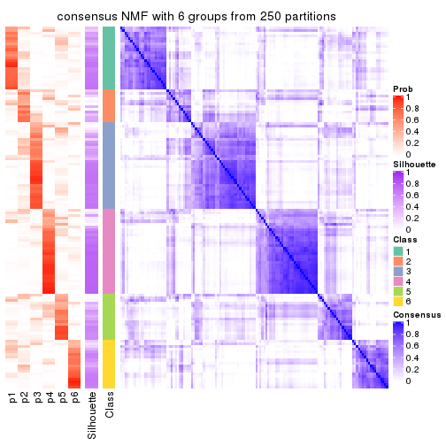</p>

</div>
</div>

Heatmaps for the membership of samples in all partitions to see how consistent they are:


<script>
$( function() {
	$( '#tabs-ATC-NMF-membership-heatmap' ).tabs();
} );
</script>
<div id='tabs-ATC-NMF-membership-heatmap'>
<ul>
<li><a href='#tab-ATC-NMF-membership-heatmap-1'>k = 2</a></li>
<li><a href='#tab-ATC-NMF-membership-heatmap-2'>k = 3</a></li>
<li><a href='#tab-ATC-NMF-membership-heatmap-3'>k = 4</a></li>
<li><a href='#tab-ATC-NMF-membership-heatmap-4'>k = 5</a></li>
<li><a href='#tab-ATC-NMF-membership-heatmap-5'>k = 6</a></li>
</ul>
<div id='tab-ATC-NMF-membership-heatmap-1'>
<pre><code class="r">membership_heatmap(res, k = 2)
</code></pre>

<p>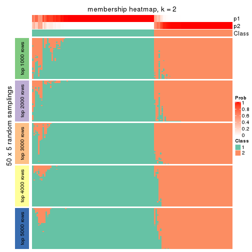</p>

</div>
<div id='tab-ATC-NMF-membership-heatmap-2'>
<pre><code class="r">membership_heatmap(res, k = 3)
</code></pre>

<p></p>

</div>
<div id='tab-ATC-NMF-membership-heatmap-3'>
<pre><code class="r">membership_heatmap(res, k = 4)
</code></pre>

<p></p>

</div>
<div id='tab-ATC-NMF-membership-heatmap-4'>
<pre><code class="r">membership_heatmap(res, k = 5)
</code></pre>

<p></p>

</div>
<div id='tab-ATC-NMF-membership-heatmap-5'>
<pre><code class="r">membership_heatmap(res, k = 6)
</code></pre>

<p></p>

</div>
</div>

As soon as we have had the classes for columns, we can look for signatures
which are significantly different between classes which can be candidate marks
for certain classes. Following are the heatmaps for signatures.


Signature heatmaps where rows are scaled:


<script>
$( function() {
	$( '#tabs-ATC-NMF-get-signatures' ).tabs();
} );
</script>
<div id='tabs-ATC-NMF-get-signatures'>
<ul>
<li><a href='#tab-ATC-NMF-get-signatures-1'>k = 2</a></li>
<li><a href='#tab-ATC-NMF-get-signatures-2'>k = 3</a></li>
<li><a href='#tab-ATC-NMF-get-signatures-3'>k = 4</a></li>
<li><a href='#tab-ATC-NMF-get-signatures-4'>k = 5</a></li>
<li><a href='#tab-ATC-NMF-get-signatures-5'>k = 6</a></li>
</ul>
<div id='tab-ATC-NMF-get-signatures-1'>
<pre><code class="r">get_signatures(res, k = 2)
</code></pre>

<p></p>

</div>
<div id='tab-ATC-NMF-get-signatures-2'>
<pre><code class="r">get_signatures(res, k = 3)
</code></pre>

<p></p>

</div>
<div id='tab-ATC-NMF-get-signatures-3'>
<pre><code class="r">get_signatures(res, k = 4)
</code></pre>

<p></p>

</div>
<div id='tab-ATC-NMF-get-signatures-4'>
<pre><code class="r">get_signatures(res, k = 5)
</code></pre>

<p></p>

</div>
<div id='tab-ATC-NMF-get-signatures-5'>
<pre><code class="r">get_signatures(res, k = 6)
</code></pre>

<p></p>

</div>
</div>


Signature heatmaps where rows are not scaled:


<script>
$( function() {
	$( '#tabs-ATC-NMF-get-signatures-no-scale' ).tabs();
} );
</script>
<div id='tabs-ATC-NMF-get-signatures-no-scale'>
<ul>
<li><a href='#tab-ATC-NMF-get-signatures-no-scale-1'>k = 2</a></li>
<li><a href='#tab-ATC-NMF-get-signatures-no-scale-2'>k = 3</a></li>
<li><a href='#tab-ATC-NMF-get-signatures-no-scale-3'>k = 4</a></li>
<li><a href='#tab-ATC-NMF-get-signatures-no-scale-4'>k = 5</a></li>
<li><a href='#tab-ATC-NMF-get-signatures-no-scale-5'>k = 6</a></li>
</ul>
<div id='tab-ATC-NMF-get-signatures-no-scale-1'>
<pre><code class="r">get_signatures(res, k = 2, scale_rows = FALSE)
</code></pre>

<p></p>

</div>
<div id='tab-ATC-NMF-get-signatures-no-scale-2'>
<pre><code class="r">get_signatures(res, k = 3, scale_rows = FALSE)
</code></pre>

<p></p>

</div>
<div id='tab-ATC-NMF-get-signatures-no-scale-3'>
<pre><code class="r">get_signatures(res, k = 4, scale_rows = FALSE)
</code></pre>

<p></p>

</div>
<div id='tab-ATC-NMF-get-signatures-no-scale-4'>
<pre><code class="r">get_signatures(res, k = 5, scale_rows = FALSE)
</code></pre>

<p></p>

</div>
<div id='tab-ATC-NMF-get-signatures-no-scale-5'>
<pre><code class="r">get_signatures(res, k = 6, scale_rows = FALSE)
</code></pre>

<p></p>

</div>
</div>


Compare the overlap of signatures from different k:

```r
compare_signatures(res)
```


`get_signature()` returns a data frame invisibly. TO get the list of signatures, the function
call should be assigned to a variable explicitly. In following code, if `plot` argument is set
to `FALSE`, no heatmap is plotted while only the differential analysis is performed.

```r
# code only for demonstration
tb = get_signature(res, k = ..., plot = FALSE)
```

An example of the output of `tb` is:

```
#>   which_row         fdr    mean_1    mean_2 scaled_mean_1 scaled_mean_2 km
#> 1        38 0.042760348  8.373488  9.131774    -0.5533452     0.5164555  1
#> 2        40 0.018707592  7.106213  8.469186    -0.6173731     0.5762149  1
#> 3        55 0.019134737 10.221463 11.207825    -0.6159697     0.5749050  1
#> 4        59 0.006059896  5.921854  7.869574    -0.6899429     0.6439467  1
#> 5        60 0.018055526  8.928898 10.211722    -0.6204761     0.5791110  1
#> 6        98 0.009384629 15.714769 14.887706     0.6635654    -0.6193277  2
...
```

The columns in `tb` are:

1. `which_row`: row indices corresponding to the input matrix.
2. `fdr`: FDR for the differential test. 
3. `mean_x`: The mean value in group x.
4. `scaled_mean_x`: The mean value in group x after rows are scaled.
5. `km`: Row groups if k-means clustering is applied to rows.


UMAP plot which shows how samples are separated.


<script>
$( function() {
	$( '#tabs-ATC-NMF-dimension-reduction' ).tabs();
} );
</script>
<div id='tabs-ATC-NMF-dimension-reduction'>
<ul>
<li><a href='#tab-ATC-NMF-dimension-reduction-1'>k = 2</a></li>
<li><a href='#tab-ATC-NMF-dimension-reduction-2'>k = 3</a></li>
<li><a href='#tab-ATC-NMF-dimension-reduction-3'>k = 4</a></li>
<li><a href='#tab-ATC-NMF-dimension-reduction-4'>k = 5</a></li>
<li><a href='#tab-ATC-NMF-dimension-reduction-5'>k = 6</a></li>
</ul>
<div id='tab-ATC-NMF-dimension-reduction-1'>
<pre><code class="r">dimension_reduction(res, k = 2, method = &quot;UMAP&quot;)
</code></pre>

<p></p>

</div>
<div id='tab-ATC-NMF-dimension-reduction-2'>
<pre><code class="r">dimension_reduction(res, k = 3, method = &quot;UMAP&quot;)
</code></pre>

<p></p>

</div>
<div id='tab-ATC-NMF-dimension-reduction-3'>
<pre><code class="r">dimension_reduction(res, k = 4, method = &quot;UMAP&quot;)
</code></pre>

<p></p>

</div>
<div id='tab-ATC-NMF-dimension-reduction-4'>
<pre><code class="r">dimension_reduction(res, k = 5, method = &quot;UMAP&quot;)
</code></pre>

<p></p>

</div>
<div id='tab-ATC-NMF-dimension-reduction-5'>
<pre><code class="r">dimension_reduction(res, k = 6, method = &quot;UMAP&quot;)
</code></pre>

<p></p>

</div>
</div>


Following heatmap shows how subgroups are split when increasing `k`:

```r
collect_classes(res)
```


If matrix rows can be associated to genes, consider to use `functional_enrichment(res,
...)` to perform function enrichment for the signature genes. See [this vignette](http://bioconductor.org/packages/devel/bioc/vignettes/cola/inst/doc/functional_enrichment.html) for more detailed explanations.


 

## Session info


```r
sessionInfo()
```

```
#> R version 3.6.0 (2019-04-26)
#> Platform: x86_64-pc-linux-gnu (64-bit)
#> Running under: CentOS Linux 7 (Core)
#> 
#> Matrix products: default
#> BLAS:   /usr/lib64/libblas.so.3.4.2
#> LAPACK: /usr/lib64/liblapack.so.3.4.2
#> 
#> locale:
#>  [1] LC_CTYPE=en_GB.UTF-8       LC_NUMERIC=C               LC_TIME=en_GB.UTF-8       
#>  [4] LC_COLLATE=en_GB.UTF-8     LC_MONETARY=en_GB.UTF-8    LC_MESSAGES=en_GB.UTF-8   
#>  [7] LC_PAPER=en_GB.UTF-8       LC_NAME=C                  LC_ADDRESS=C              
#> [10] LC_TELEPHONE=C             LC_MEASUREMENT=en_GB.UTF-8 LC_IDENTIFICATION=C       
#> 
#> attached base packages:
#> [1] grid      stats     graphics  grDevices utils     datasets  methods   base     
#> 
#> other attached packages:
#> [1] genefilter_1.66.0    ComplexHeatmap_2.3.1 markdown_1.1         knitr_1.26          
#> [5] GetoptLong_0.1.7     cola_1.3.2          
#> 
#> loaded via a namespace (and not attached):
#>  [1] circlize_0.4.8       shape_1.4.4          xfun_0.11            slam_0.1-46         
#>  [5] lattice_0.20-38      splines_3.6.0        colorspace_1.4-1     vctrs_0.2.0         
#>  [9] stats4_3.6.0         blob_1.2.0           XML_3.98-1.20        survival_2.44-1.1   
#> [13] rlang_0.4.2          pillar_1.4.2         DBI_1.0.0            BiocGenerics_0.30.0 
#> [17] bit64_0.9-7          RColorBrewer_1.1-2   matrixStats_0.55.0   stringr_1.4.0       
#> [21] GlobalOptions_0.1.1  evaluate_0.14        memoise_1.1.0        Biobase_2.44.0      
#> [25] IRanges_2.18.3       parallel_3.6.0       AnnotationDbi_1.46.1 highr_0.8           
#> [29] Rcpp_1.0.3           xtable_1.8-4         backports_1.1.5      S4Vectors_0.22.1    
#> [33] annotate_1.62.0      skmeans_0.2-11       bit_1.1-14           microbenchmark_1.4-7
#> [37] brew_1.0-6           impute_1.58.0        rjson_0.2.20         png_0.1-7           
#> [41] digest_0.6.23        stringi_1.4.3        polyclip_1.10-0      clue_0.3-57         
#> [45] tools_3.6.0          bitops_1.0-6         magrittr_1.5         eulerr_6.0.0        
#> [49] RCurl_1.95-4.12      RSQLite_2.1.4        tibble_2.1.3         cluster_2.1.0       
#> [53] crayon_1.3.4         pkgconfig_2.0.3      zeallot_0.1.0        Matrix_1.2-17       
#> [57] xml2_1.2.2           httr_1.4.1           R6_2.4.1             mclust_5.4.5        
#> [61] compiler_3.6.0
```


